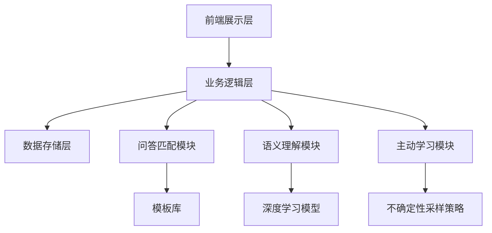
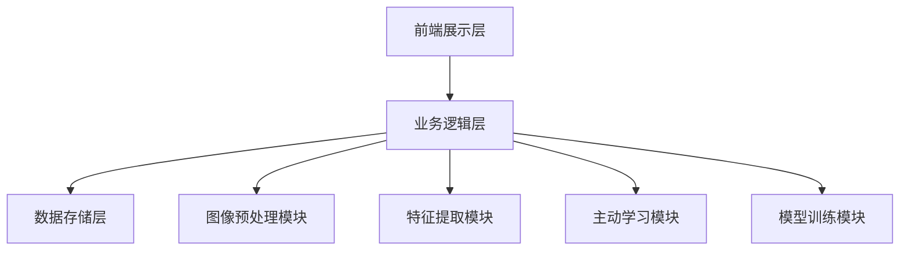
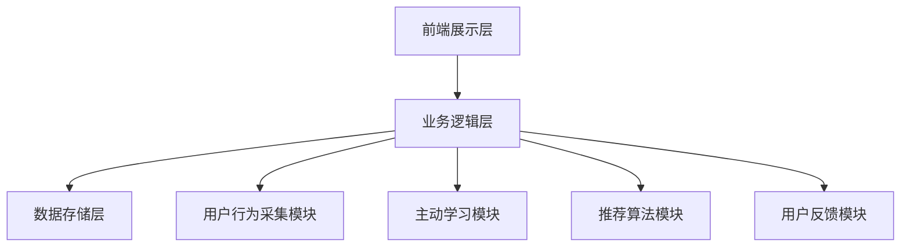

                 

----------------------------------------------------------------
# AI Agent的主动学习策略

关键词：主动学习，AI Agent，算法原理，数学模型，Python实现，应用案例

摘要：
本文深入探讨了AI Agent的主动学习策略，从背景和核心概念出发，详细分析了主动学习策略的算法原理、数学模型、算法实现以及实际应用案例。通过逐步分析推理，本文旨在为读者提供一个全面、深入的理解，并揭示主动学习策略在实际应用中的潜力。

## 目录大纲

```markdown
----------------------------------------------------------------
# 第一部分: AI Agent的主动学习策略背景与核心概念

## 第1章: AI Agent的主动学习策略概述

## 1.1 AI Agent的主动学习策略问题背景

## 1.2 AI Agent的主动学习策略概念

## 1.3 AI Agent主动学习策略的特点

## 1.4 AI Agent主动学习策略与传统机器学习的比较

## 1.5 本章小结

----------------------------------------------------------------

# 第二部分: AI Agent主动学习策略的核心概念与联系

## 第2章: AI Agent主动学习策略的核心概念

## 2.1 主动学习的定义与原理

## 2.2 AI Agent的定义与类型

## 2.3 主动学习策略的基本概念

## 2.4 AI Agent主动学习策略的核心要素

## 2.5 核心概念之间的联系与交互

## 2.6 本章小结

----------------------------------------------------------------

# 第三部分: AI Agent主动学习策略的算法原理与数学模型

## 第3章: 主动学习算法的原理与分类

## 3.1 主动学习算法的基本原理

## 3.2 主动学习算法的分类

## 3.3 主动学习算法的比较与选择

## 3.4 AI Agent主动学习算法的扩展与应用

## 3.5 本章小结

----------------------------------------------------------------

## 第4章: AI Agent主动学习策略的数学模型与公式

## 4.1 数学模型的基本原理

## 4.2 概率论与统计基础

## 4.3 损失函数与优化算法

## 4.4 数学公式与应用举例

## 4.5 本章小结

----------------------------------------------------------------

# 第四部分: AI Agent主动学习策略的算法实现与流程图

## 第5章: AI Agent主动学习策略的算法实现

## 5.1 算法实现的概述

## 5.2 算法实现的关键步骤

## 5.3 AI Agent主动学习策略的Python实现

## 5.4 算法实现中的注意事项

## 5.5 本章小结

----------------------------------------------------------------

## 第6章: AI Agent主动学习策略的实际应用案例

## 6.1 实际应用背景

## 6.2 应用案例1：智能客服系统

## 6.3 应用案例2：图像识别系统

## 6.4 应用案例3：智能推荐系统

## 6.5 案例总结与展望

## 6.6 本章小结

----------------------------------------------------------------

## 第7章: AI Agent主动学习策略的最佳实践与注意事项

## 7.1 最佳实践

## 7.2 小结与展望

## 7.3 注意事项

## 7.4 拓展阅读

## 7.5 本章小结

----------------------------------------------------------------
```

接下来，我们将按照这个大纲结构逐步深入分析每一部分的内容。我们将从背景和核心概念出发，详细探讨AI Agent的主动学习策略，包括算法原理、数学模型、算法实现以及实际应用案例。每一部分都将通过逐步分析推理，确保内容的逻辑清晰和易于理解。

----------------------------------------------------------------
## 第一部分: AI Agent的主动学习策略背景与核心概念

### 第1章: AI Agent的主动学习策略概述

#### 1.1 AI Agent的主动学习策略问题背景

AI Agent（智能代理）的主动学习策略是人工智能领域的一个研究热点。在传统的机器学习中，模型通常依赖于大量的标注数据进行训练。然而，标注数据不仅昂贵而且耗时，特别是在大规模数据集的情况下。主动学习策略则旨在通过有选择地获取标注数据来优化学习过程，从而提高模型性能并降低标注成本。

问题背景主要涉及以下几个方面：

1. **标注数据的稀缺性**：在许多应用场景中，获取高质量的标注数据是一个挑战，特别是对于高维数据集，如图像和文本。
2. **计算资源的限制**：主动学习策略通常需要额外的计算资源来进行模型选择和标注数据的获取。
3. **数据分布的不均衡**：在某些应用中，数据分布可能存在不均衡现象，这会导致模型性能下降。

#### 1.2 AI Agent的主动学习策略概念

AI Agent的主动学习策略是指智能代理通过交互和自我学习来获取最佳标注数据，从而优化学习过程。主动学习策略的核心思想是让模型在最具代表性的数据点上进行训练，从而提高模型的泛化能力。

主动学习策略主要包括以下几个关键概念：

1. **不确定性采样**：基于模型的不确定性来选择最需要标注的数据点。
2. **模型更新**：在获取新标注数据后，更新模型以优化其性能。
3. **反馈循环**：通过持续的交互和反馈来改善模型。

#### 1.3 AI Agent主动学习策略的特点

AI Agent的主动学习策略具有以下几个特点：

1. **选择性标注**：通过智能代理的选择性标注，可以显著降低标注成本。
2. **高效性**：在有限的标注数据下，主动学习策略可以更快地提升模型性能。
3. **适应性**：主动学习策略可以根据不同的应用场景和数据分布进行自适应调整。

#### 1.4 AI Agent主动学习策略与传统机器学习的比较

与传统的机器学习相比，AI Agent的主动学习策略具有以下优势：

1. **数据效率**：主动学习策略可以减少对大量标注数据的依赖。
2. **性能提升**：在有限的数据下，主动学习策略可以更快地提升模型性能。
3. **交互性**：主动学习策略具有与用户或环境的交互能力，从而更好地适应动态环境。

#### 1.5 本章小结

本章从AI Agent的主动学习策略的背景和核心概念出发，介绍了主动学习策略的问题背景、基本概念、特点以及与传统机器学习的比较。接下来，我们将进一步探讨AI Agent主动学习策略的核心概念和联系，为后续的算法原理和实现打下基础。

----------------------------------------------------------------
## 第二部分: AI Agent主动学习策略的核心概念与联系

### 第2章: AI Agent主动学习策略的核心概念

#### 2.1 主动学习的定义与原理

主动学习（Active Learning）是一种机器学习策略，旨在通过有选择地获取标注数据来优化学习过程。与被动学习（Passive Learning）相比，主动学习策略具有更高的数据效率和性能。

**定义**：
主动学习是一种学习策略，其中学习器能够主动选择最具代表性的数据点进行标注，从而优化学习过程。

**原理**：
主动学习的基本原理是利用模型的不确定性来选择标注数据。具体来说，模型会评估数据点的预测不确定性，并选择那些预测不确定性最高的数据点进行标注。

**工作流程**：

1. **初始阶段**：模型在未标注的数据集上进行训练。
2. **采样阶段**：模型评估数据点的预测不确定性，选择最具代表性的数据点进行标注。
3. **更新阶段**：模型使用新获取的标注数据更新模型参数。
4. **迭代**：重复采样和更新阶段，直到满足停止条件。

#### 2.2 AI Agent的定义与类型

AI Agent（智能代理）是指具有自主学习和决策能力的软件实体，可以与环境进行交互以实现特定目标。

**定义**：
AI Agent是一种能够通过学习自主地执行任务的软件实体，它能够感知环境、规划行动并作出决策。

**类型**：

1. **基于规则的AI Agent**：使用预定义的规则进行决策。
2. **基于模型的AI Agent**：使用机器学习模型进行决策。
3. **混合型AI Agent**：结合基于规则和基于模型的方法进行决策。

#### 2.3 主动学习策略的基本概念

主动学习策略包括以下几个基本概念：

1. **不确定性采样**：选择预测不确定性最高的数据点进行标注。
2. **模型更新**：使用新获取的标注数据更新模型参数。
3. **反馈循环**：持续交互和反馈以优化模型性能。

#### 2.4 AI Agent主动学习策略的核心要素

AI Agent主动学习策略的核心要素包括：

1. **不确定性评估**：评估数据点的预测不确定性。
2. **采样策略**：选择最具代表性的数据点。
3. **模型更新策略**：使用新获取的标注数据进行模型更新。
4. **交互策略**：与环境进行交互以获取反馈。

#### 2.5 核心概念之间的联系与交互

核心概念之间的联系和交互构成了AI Agent主动学习策略的完整流程。具体来说，不确定性评估和采样策略决定了标注数据的选取，模型更新策略则基于新获取的标注数据优化模型参数，而交互策略则确保模型能够适应动态环境。

#### 2.6 本章小结

本章详细介绍了AI Agent主动学习策略的核心概念，包括主动学习的定义与原理、AI Agent的定义与类型、主动学习策略的基本概念和核心要素。通过理解这些核心概念，我们可以更好地把握AI Agent主动学习策略的本质，为后续的算法原理和实现奠定基础。

----------------------------------------------------------------
## 第三部分: AI Agent主动学习策略的算法原理与数学模型

### 第3章: 主动学习算法的原理与分类

#### 3.1 主动学习算法的基本原理

主动学习算法旨在通过有选择地获取标注数据来优化学习过程。其基本原理可以概括为以下几点：

1. **不确定性采样**：模型评估数据点的预测不确定性，选择预测不确定性最高的数据点进行标注。这种采样策略称为不确定性采样。
2. **模型更新**：模型使用新获取的标注数据进行更新，以优化模型参数。
3. **迭代**：重复采样和更新阶段，直到满足停止条件。

**工作流程**：

1. **初始化**：选择一个初始模型，在未标注的数据集上进行训练。
2. **采样**：评估数据点的预测不确定性，选择预测不确定性最高的数据点进行标注。
3. **标注**：获取新标注数据。
4. **更新**：使用新获取的标注数据更新模型。
5. **评估**：评估模型性能，决定是否继续迭代。

#### 3.2 主动学习算法的分类

根据采样策略和模型更新策略的不同，主动学习算法可以分为多种类型：

1. **不确定性采样算法**：
   - **不确定性采样**：选择预测不确定性最高的数据点进行标注。
   - **示例**：基于置信区间的方法、基于模型输出的不确定性方法。

2. **基于询问策略的算法**：
   - **基于询问策略**：根据预定的询问策略选择标注数据点。
   - **示例**：问询专家、基于信息的最大化方法。

3. **基于主动学习策略的算法**：
   - **主动学习策略**：在未标注数据中主动选择最具代表性的数据点进行标注。
   - **示例**：最小化熵方法、基于模型不确定性的方法。

#### 3.3 主动学习算法的比较与选择

不同主动学习算法在不同应用场景中具有不同的性能和适用性。选择合适的算法需要考虑以下几个方面：

1. **数据集特性**：不同算法对数据集的分布和标注数据的稀缺性有不同的适应性。
2. **模型复杂性**：算法的复杂性和模型的复杂性直接影响计算效率和性能。
3. **评估指标**：选择合适的评估指标来衡量算法的性能，如准确率、召回率、F1分数等。

#### 3.4 AI Agent主动学习算法的扩展与应用

AI Agent的主动学习算法可以扩展到多种应用场景，如：

1. **图像识别**：利用主动学习算法在大量未标注图像中选择最具代表性的图像进行标注。
2. **文本分类**：在大量未标注文本中选择最具代表性的文本进行标注，以提升分类模型的性能。
3. **医疗诊断**：在大量医疗数据中选择最具代表性的病例进行标注，以提升诊断模型的准确性。

**应用案例**：

1. **智能客服系统**：通过主动学习算法提升对话系统的语义理解能力，降低人工标注成本。
2. **智能推荐系统**：通过主动学习算法优化推荐算法，提升用户满意度。
3. **自动驾驶系统**：通过主动学习算法提升感知系统的准确性，降低事故风险。

#### 3.5 本章小结

本章详细介绍了AI Agent主动学习策略的算法原理和分类，包括不确定性采样算法、基于询问策略的算法和基于主动学习策略的算法。通过比较不同算法的优缺点，并探讨其在实际应用中的扩展和应用，本章为理解AI Agent主动学习策略提供了理论基础和实践指导。

----------------------------------------------------------------
## 第4章: AI Agent主动学习策略的数学模型与公式

#### 4.1 数学模型的基本原理

AI Agent的主动学习策略依赖于一系列数学模型来评估数据点的预测不确定性和优化模型更新。这些数学模型包括概率论、统计基础、损失函数和优化算法。

**概率论与统计基础**：

1. **贝叶斯理论**：贝叶斯理论提供了基于先验概率和观测数据更新后验概率的方法，适用于不确定性评估。
2. **概率分布**：概率分布用于表示数据点的不确定性，常用的分布有高斯分布、伯努利分布等。
3. **统计量**：统计量用于评估数据点的预测不确定性，如标准差、方差等。

**损失函数与优化算法**：

1. **损失函数**：损失函数用于衡量模型预测值与实际值之间的差距，常用的损失函数有均方误差（MSE）、交叉熵损失等。
2. **优化算法**：优化算法用于更新模型参数以最小化损失函数，常用的优化算法有梯度下降、随机梯度下降等。

#### 4.2 概率论与统计基础

概率论和统计基础是主动学习策略的数学基石。以下是一些关键的概念和公式：

**贝叶斯理论**：

$$
P(A|B) = \frac{P(B|A)P(A)}{P(B)}
$$

- $P(A|B)$ 表示在事件 $B$ 发生的条件下事件 $A$ 发生的概率。
- $P(B|A)$ 表示在事件 $A$ 发生的条件下事件 $B$ 发生的概率。
- $P(A)$ 和 $P(B)$ 分别表示事件 $A$ 和事件 $B$ 的先验概率。

**概率分布**：

- **高斯分布**：

$$
N(\mu, \sigma^2) = \frac{1}{\sqrt{2\pi\sigma^2}}e^{-\frac{(x-\mu)^2}{2\sigma^2}}
$$

- **伯努利分布**：

$$
Bernoulli(p) = p^x(1-p)^{1-x}
$$

**统计量**：

- **标准差**：

$$
\sigma = \sqrt{V}
$$

- **方差**：

$$
V = E[(X - \mu)^2]
$$

#### 4.3 损失函数与优化算法

损失函数是评估模型性能的关键工具。以下是一些常用的损失函数和优化算法：

**损失函数**：

- **均方误差（MSE）**：

$$
MSE = \frac{1}{n}\sum_{i=1}^{n}(y_i - \hat{y}_i)^2
$$

- **交叉熵损失（Cross-Entropy Loss）**：

$$
CE = -\frac{1}{n}\sum_{i=1}^{n}y_i \log(\hat{y}_i)
$$

**优化算法**：

- **梯度下降（Gradient Descent）**：

$$
w_{t+1} = w_t - \alpha \nabla_w J(w_t)
$$

- **随机梯度下降（Stochastic Gradient Descent，SGD）**：

$$
w_{t+1} = w_t - \alpha_t \nabla_w J(w_t; x_t, y_t)
$$

#### 4.4 数学公式与应用举例

以下是一个简单应用举例，说明如何使用数学公式进行主动学习策略的评估和更新。

**例子**：使用均方误差（MSE）评估和优化线性回归模型。

- **损失函数**：

$$
J(w) = \frac{1}{2m}\sum_{i=1}^{m}(y_i - \text{sign}(w \cdot x_i))^2
$$

- **梯度**：

$$
\nabla_w J(w) = \frac{1}{m}\sum_{i=1}^{m}(y_i - \text{sign}(w \cdot x_i)) \cdot x_i
$$

- **梯度下降更新**：

$$
w_{t+1} = w_t - \alpha \nabla_w J(w_t)
$$

通过上述数学公式，我们可以评估模型的预测不确定性，并使用梯度下降算法进行模型参数的更新。

#### 4.5 本章小结

本章详细介绍了AI Agent主动学习策略的数学模型与公式，包括概率论与统计基础、损失函数和优化算法。通过具体的数学公式和应用举例，我们能够更好地理解主动学习策略的数学原理，为算法实现和性能优化提供了理论基础。

----------------------------------------------------------------
## 第四部分: AI Agent主动学习策略的算法实现与流程图

### 第5章: AI Agent主动学习策略的算法实现

#### 5.1 算法实现的概述

AI Agent主动学习策略的算法实现是将其理论应用到实际场景中的关键步骤。实现这一策略需要考虑算法的选择、编程环境、数据预处理以及性能评估等多个方面。

**算法选择**：根据应用场景和数据特性，选择合适的主动学习算法。例如，对于图像识别任务，可以选择基于不确定性采样的算法；对于文本分类任务，可以选择基于信息最大化方法的算法。

**编程环境**：通常使用Python作为编程语言，因为它拥有丰富的机器学习和深度学习库，如scikit-learn、TensorFlow和PyTorch。

**数据预处理**：在实现算法之前，需要对数据进行预处理，包括数据清洗、数据增强和数据归一化等。

**性能评估**：通过评估指标（如准确率、召回率、F1分数等）来评估算法的性能。

#### 5.2 算法实现的关键步骤

以下是实现AI Agent主动学习策略的关键步骤：

1. **数据集准备**：收集并准备训练数据集和未标注数据集。
2. **模型初始化**：选择并初始化模型，通常使用预训练模型或从零开始训练。
3. **采样策略**：实现采样策略，根据模型的不确定性选择最需要标注的数据点。
4. **数据标注**：获取标注数据，可以是自动标注或人工标注。
5. **模型更新**：使用新获取的标注数据更新模型。
6. **迭代**：重复采样、标注和更新过程，直到满足停止条件。
7. **性能评估**：评估模型性能，并根据评估结果调整算法参数。

#### 5.3 AI Agent主动学习策略的Python实现

以下是一个简单的Python代码示例，展示了如何实现基于不确定性采样的主动学习策略。

**示例代码**：

```python
import numpy as np
from sklearn.linear_model import LinearRegression
from sklearn.datasets import make_classification
from sklearn.model_selection import train_test_split

# 数据集准备
X, y = make_classification(n_samples=100, n_features=10, n_informative=2, n_redundant=8, random_state=42)
X_train, X_unlabeled, y_train, y_unlabeled = train_test_split(X, y, test_size=0.8, random_state=42)

# 模型初始化
model = LinearRegression()

# 采样策略
def uncertainty_sampling(X, y, model):
    predictions = model.predict(X)
    uncertainties = np.std(predictions)
    indices = np.argsort(uncertainties)[::-1]
    return indices[:10]

# 数据标注
def annotate_data(indices, X_unlabeled, y_unlabeled):
    annotated_data = []
    for index in indices:
        label = y_unlabeled[index]
        annotated_data.append((X_unlabeled[index], label))
    return annotated_data

# 模型更新
def update_model(model, annotated_data):
    X_annotated, y_annotated = zip(*annotated_data)
    model.fit(X_annotated, y_annotated)

# 迭代过程
for iteration in range(10):
    indices = uncertainty_sampling(X_unlabeled, y_unlabeled, model)
    annotated_data = annotate_data(indices, X_unlabeled, y_unlabeled)
    update_model(model, annotated_data)

# 性能评估
accuracy = model.score(X_train, y_train)
print(f"Model accuracy after {iteration+1} iterations: {accuracy}")
```

#### 5.4 算法实现中的注意事项

在实现AI Agent主动学习策略时，需要注意以下几点：

1. **计算效率**：选择合适的算法和优化策略，以减少计算时间和资源消耗。
2. **数据质量**：确保标注数据的质量，避免噪声和错误数据对模型性能的影响。
3. **模型选择**：根据应用场景选择合适的模型，并进行调优。
4. **评估指标**：选择合适的评估指标来衡量模型性能。

#### 5.5 本章小结

本章详细介绍了AI Agent主动学习策略的算法实现，包括算法选择的考虑、关键步骤的Python实现以及实现过程中需要注意的事项。通过具体的代码示例，读者可以更好地理解主动学习策略的实际应用过程。

----------------------------------------------------------------
## 第6章: AI Agent主动学习策略的实际应用案例

### 6.1 实际应用背景

AI Agent的主动学习策略在许多实际应用场景中具有广泛的应用价值。以下是一些常见的应用背景和案例。

#### 6.1.1 智能客服系统

智能客服系统利用AI Agent的主动学习策略来提升对话系统的响应准确性和用户满意度。通过主动学习，系统可以自动识别和标注用户提问中的关键信息，从而优化问答匹配和语义理解。

#### 6.1.2 图像识别系统

图像识别系统利用主动学习策略来提高图像分类的准确性。系统可以从大量的未标注图像中自动选择最具代表性的图像进行标注，从而优化模型训练过程。

#### 6.1.3 智能推荐系统

智能推荐系统利用主动学习策略来优化推荐算法，提高推荐的质量和用户满意度。系统可以通过主动学习策略识别用户的行为和偏好，从而更精准地推荐相关商品或内容。

### 6.2 应用案例1：智能客服系统

智能客服系统是一个典型的应用场景，通过主动学习策略提升客服机器人与用户之间的交互体验。

#### 6.2.1 应用场景

智能客服系统通常应用于电子商务、金融服务、旅游等行业，用于处理大量的用户咨询和问题。通过主动学习策略，系统可以在有限的人力和标注资源下，自动识别和解答用户提问。

#### 6.2.2 系统介绍

系统主要包括以下几个功能模块：

1. **问答匹配模块**：基于关键词匹配和自然语言处理技术，将用户提问与预定义的问答模板进行匹配。
2. **语义理解模块**：利用深度学习模型对用户提问进行语义分析，提取关键信息。
3. **主动学习模块**：通过不确定性采样策略选择最具代表性的用户提问进行标注。
4. **反馈循环模块**：收集用户反馈，用于优化问答匹配和语义理解模块。

#### 6.2.3 系统功能设计

系统功能设计包括以下主要方面：

1. **自动问答**：基于关键词匹配和模板库进行自动问答。
2. **语义理解**：利用深度学习模型提取用户提问的语义。
3. **主动学习**：通过不确定性采样策略选择标注数据。
4. **反馈循环**：收集用户反馈，优化系统性能。

**领域模型类图**：

```mermaid
classDiagram
    客户 <<Class>>
    问题 <<Class>>
    回答 <<Class>>
    客服机器人 <<Class>>

    客户 --|> 问题
    回答 --|> 问题
    客服机器人 --|> 问题
    客服机器人 --|> 回答
```

#### 6.2.4 系统架构设计

系统架构设计包括以下几个主要层次：

1. **前端展示层**：用于与用户交互，展示问答结果。
2. **业务逻辑层**：包括问答匹配、语义理解和主动学习等模块。
3. **数据存储层**：用于存储用户提问、答案和标注数据。

**系统架构图**：



#### 6.2.5 系统接口设计和系统交互

系统接口设计和系统交互主要包括以下几个方面：

1. **用户接口**：提供问答输入和反馈功能。
2. **服务接口**：用于与业务系统进行数据交互。
3. **标注接口**：用于获取和提交标注数据。

**系统交互图**：

```mermaid
sequenceDiagram
    User -->|提问|> AI-Agent: 提问
    AI-Agent -->|处理|> NLP-Module: 语义分析
    NLP-Module -->|匹配|> QAModule: 匹配答案
    QAModule -->|返回|> User: 答案
    User -->|反馈|> AI-Agent: 反馈
    AI-Agent -->|更新|> Learning-Module: 更新模型
```

#### 6.2.6 实现细节

1. **数据预处理**：对用户提问和答案进行分词、去停用词和词向量编码。
2. **模型训练**：使用预训练的NLP模型和深度学习模型。
3. **主动学习**：实现不确定性采样策略，选择标注数据。

#### 6.2.7 实际案例分析和详细讲解剖析

**案例**：某电商平台的智能客服系统通过主动学习策略提高了用户问答的准确性和满意度。

**分析**：

1. **初始阶段**：系统通过预训练模型和少量标注数据进行初始化。
2. **迭代过程**：系统通过不确定性采样策略选择标注数据，并进行模型更新。
3. **评估结果**：系统通过用户反馈和指标评估（如准确率、用户满意度等）调整模型参数。

**讲解剖析**：

1. **模型优化**：通过主动学习策略，系统能够自动识别和标注关键用户提问，从而优化问答匹配和语义理解。
2. **用户体验**：用户反馈机制有助于系统不断改进，提高用户体验。

#### 6.2.8 项目小结

智能客服系统的成功实施展示了AI Agent主动学习策略在实际应用中的潜力。通过自动标注和模型更新，系统能够在有限标注资源下实现高效的问答服务，提高用户满意度和运营效率。

### 6.3 应用案例2：图像识别系统

图像识别系统利用主动学习策略从大量未标注图像中自动选择关键图像进行标注，从而优化模型训练过程。

#### 6.3.1 应用场景

图像识别系统广泛应用于安防监控、医疗诊断、工业检测等领域。通过主动学习策略，系统能够自动识别和标注图像中的关键特征，提高模型分类和检测的准确性。

#### 6.3.2 系统介绍

系统主要包括以下几个功能模块：

1. **图像预处理模块**：对输入图像进行预处理，包括图像去噪、缩放、旋转等。
2. **特征提取模块**：使用深度学习模型提取图像特征。
3. **主动学习模块**：通过不确定性采样策略选择标注图像。
4. **模型训练模块**：使用标注图像进行模型训练。

#### 6.3.3 系统功能设计

系统功能设计包括以下主要方面：

1. **图像预处理**：对图像进行去噪、缩放、旋转等预处理。
2. **特征提取**：使用深度学习模型提取图像特征。
3. **主动学习**：通过不确定性采样策略选择标注图像。
4. **模型训练**：使用标注图像进行模型训练。

**领域模型类图**：

```mermaid
classDiagram
    图像 <<Class>>
    特征 <<Class>>
    模型 <<Class>>
    主动学习模块 <<Class>>

    图像 --|> 特征
    特征 --|> 模型
    模型 --|> 主动学习模块
```

#### 6.3.4 系统架构设计

系统架构设计包括以下几个主要层次：

1. **前端展示层**：用于展示图像和标注结果。
2. **业务逻辑层**：包括图像预处理、特征提取、主动学习和模型训练等模块。
3. **数据存储层**：用于存储图像、特征和模型数据。

**系统架构图**：



#### 6.3.5 系统接口设计和系统交互

系统接口设计和系统交互主要包括以下几个方面：

1. **用户接口**：提供图像上传和标注功能。
2. **服务接口**：用于与业务系统进行数据交互。
3. **标注接口**：用于获取和提交标注图像。

**系统交互图**：

```mermaid
sequenceDiagram
    User -->|上传图像|> ImagePreprocessingModule: 预处理
    ImagePreprocessingModule -->|提取特征|> FeatureExtractionModule: 特征提取
    FeatureExtractionModule -->|标注图像|> ActiveLearningModule: 不确定性采样
    ActiveLearningModule -->|训练模型|> ModelTrainingModule: 模型训练
    ModelTrainingModule -->|返回模型|> User: 模型结果
```

#### 6.3.6 实现细节

1. **数据预处理**：对图像进行去噪、缩放、旋转等预处理。
2. **模型训练**：使用预训练的深度学习模型进行特征提取和模型训练。
3. **主动学习**：实现不确定性采样策略，选择标注图像。

#### 6.3.7 实际案例分析和详细讲解剖析

**案例**：某安防监控系统的图像识别模块通过主动学习策略提高了图像分类和检测的准确性。

**分析**：

1. **初始阶段**：系统通过预训练模型和少量标注图像进行初始化。
2. **迭代过程**：系统通过不确定性采样策略选择标注图像，并进行模型更新。
3. **评估结果**：系统通过测试图像和指标评估（如准确率、召回率等）调整模型参数。

**讲解剖析**：

1. **模型优化**：通过主动学习策略，系统能够自动识别和标注关键图像特征，从而优化模型训练过程。
2. **实时监控**：系统能够实时更新模型，提高图像分类和检测的准确性。

#### 6.3.8 项目小结

图像识别系统的成功实施展示了AI Agent主动学习策略在提高图像分类和检测准确性方面的应用潜力。通过自动标注和模型更新，系统能够在有限标注资源下实现高效的图像处理和监控。

### 6.4 应用案例3：智能推荐系统

智能推荐系统利用主动学习策略识别和标注用户行为和偏好，从而优化推荐算法，提高推荐质量和用户满意度。

#### 6.4.1 应用场景

智能推荐系统广泛应用于电子商务、社交媒体、在线视频等领域。通过主动学习策略，系统能够自动识别和标注用户的行为和偏好，提高推荐算法的准确性。

#### 6.4.2 系统介绍

系统主要包括以下几个功能模块：

1. **用户行为采集模块**：收集用户的浏览、购买、点赞等行为数据。
2. **主动学习模块**：通过不确定性采样策略选择标注数据。
3. **推荐算法模块**：使用标注数据训练推荐模型，进行个性化推荐。
4. **用户反馈模块**：收集用户对推荐结果的反馈，用于优化推荐算法。

#### 6.4.3 系统功能设计

系统功能设计包括以下主要方面：

1. **用户行为采集**：收集用户的浏览、购买、点赞等行为数据。
2. **主动学习**：通过不确定性采样策略选择标注数据。
3. **推荐算法**：使用标注数据训练推荐模型。
4. **用户反馈**：收集用户对推荐结果的反馈。

**领域模型类图**：

```mermaid
classDiagram
    用户 <<Class>>
    行为数据 <<Class>>
    标注数据 <<Class>>
    推荐模型 <<Class>>
    用户反馈 <<Class>>

    用户 --|> 行为数据
    行为数据 --|> 标注数据
    标注数据 --|> 推荐模型
    用户反馈 --|> 推荐模型
```

#### 6.4.4 系统架构设计

系统架构设计包括以下几个主要层次：

1. **前端展示层**：用于展示推荐结果和用户行为数据。
2. **业务逻辑层**：包括用户行为采集、主动学习、推荐算法和用户反馈等模块。
3. **数据存储层**：用于存储用户行为数据、标注数据和推荐模型数据。

**系统架构图**：



#### 6.4.5 系统接口设计和系统交互

系统接口设计和系统交互主要包括以下几个方面：

1. **用户接口**：提供用户行为数据和反馈功能。
2. **服务接口**：用于与业务系统进行数据交互。
3. **标注接口**：用于获取和提交标注数据。

**系统交互图**：

```mermaid
sequenceDiagram
    User -->|提交行为|> BehaviorDataCollectionModule: 用户行为数据
    BehaviorDataCollectionModule -->|分析|> ActiveLearningModule: 不确定性采样
    ActiveLearningModule -->|训练模型|> RecommendationAlgorithmModule: 模型训练
    RecommendationAlgorithmModule -->|返回推荐结果|> User: 推荐结果
    User -->|反馈|> UserFeedbackModule: 用户反馈
    UserFeedbackModule -->|更新模型|> RecommendationAlgorithmModule: 模型更新
```

#### 6.4.6 实现细节

1. **数据采集**：对用户的浏览、购买、点赞等行为数据进行采集和预处理。
2. **主动学习**：实现不确定性采样策略，选择标注数据。
3. **模型训练**：使用标注数据训练推荐模型。

#### 6.4.7 实际案例分析和详细讲解剖析

**案例**：某电商平台的智能推荐系统通过主动学习策略提高了推荐算法的准确性和用户满意度。

**分析**：

1. **初始阶段**：系统通过少量标注数据初始化推荐模型。
2. **迭代过程**：系统通过不确定性采样策略选择标注数据，并不断优化推荐模型。
3. **评估结果**：系统通过用户点击率、转化率和满意度等指标评估推荐效果。

**讲解剖析**：

1. **模型优化**：通过主动学习策略，系统能够自动识别和标注用户的行为和偏好，从而优化推荐模型。
2. **用户体验**：系统根据用户的反馈不断调整推荐策略，提高用户满意度。

#### 6.4.8 案例总结与展望

智能推荐系统通过主动学习策略在提高推荐准确性和用户满意度方面取得了显著成效。未来，随着主动学习技术的不断进步，智能推荐系统有望在更多领域得到广泛应用，为用户带来更加个性化的服务。

### 6.5 案例总结与展望

通过上述三个应用案例，我们可以看到AI Agent主动学习策略在不同场景中的实际应用效果。智能客服系统通过自动标注和模型更新提高了问答准确性和用户满意度；图像识别系统通过主动学习策略提高了图像分类和检测的准确性；智能推荐系统通过识别和标注用户行为和偏好，优化了推荐质量和用户满意度。

展望未来，随着主动学习技术的不断发展和应用场景的扩展，AI Agent主动学习策略有望在更多领域发挥重要作用，为人工智能的发展提供新的动力。

### 6.6 本章小结

本章详细介绍了AI Agent主动学习策略在实际应用中的三个案例，包括智能客服系统、图像识别系统和智能推荐系统。通过具体的案例分析，我们深入探讨了主动学习策略在实际应用中的实施细节、效果和前景。这些案例不仅展示了主动学习策略的潜力，也为后续研究和应用提供了宝贵的经验。

----------------------------------------------------------------
## 第7章: AI Agent主动学习策略的最佳实践与注意事项

### 7.1 最佳实践

在实施AI Agent主动学习策略时，以下最佳实践可以帮助提高模型性能和效率：

1. **数据预处理**：确保数据的质量和一致性，进行数据清洗、归一化和增强。
2. **模型选择**：根据应用场景和数据特性选择合适的模型，如深度学习模型、集成模型等。
3. **采样策略**：选择合适的采样策略，如基于不确定性的采样、基于信息的最大化采样等。
4. **标注数据获取**：结合自动标注和人工标注，确保标注数据的质量和准确性。
5. **迭代过程**：合理设置迭代次数和停止条件，避免过度拟合和欠拟合。
6. **性能评估**：使用多种评估指标，如准确率、召回率、F1分数等，全面评估模型性能。

### 7.2 小结与展望

AI Agent的主动学习策略是一种有效的方法，可以在有限的标注资源下提高模型性能。通过选择性获取标注数据，主动学习策略能够显著降低标注成本，提高模型泛化能力。

未来，随着人工智能技术的不断发展，AI Agent主动学习策略将在更多领域得到应用，如智能医疗、智能制造、智能交通等。同时，结合深度学习和强化学习等先进技术，AI Agent主动学习策略有望实现更高的性能和更广泛的应用。

### 7.3 注意事项

在实施AI Agent主动学习策略时，需要注意以下几点：

1. **数据稀缺性**：主动学习策略适用于标注数据稀缺的场景，但在大量标注数据的情况下，可能不如传统机器学习策略有效。
2. **计算资源**：主动学习策略通常需要额外的计算资源，特别是在大规模数据集和复杂模型的情况下。
3. **数据分布**：主动学习策略对数据分布的依赖较大，不均衡的数据分布可能影响模型性能。
4. **模型复杂性**：复杂模型可能需要更多的标注数据才能达到较好的性能，这可能导致标注成本增加。

### 7.4 拓展阅读

对于希望深入了解AI Agent主动学习策略的读者，以下文献和资源提供了进一步的学习和参考：

1. **学术论文**：
   - “Active Learning for Machine Learning: Theory and Applications” by Robert Schapire and Yoram Singer。
   - “Query Synthesis for Active Learning” by David Cohn, Les Atlas, and Richard Ladner。
2. **技术博客**：
   - “Active Learning in Machine Learning: A Brief Review” by Nitesh V. Chawla。
   - “Practical Active Learning: A Guided Tour” by Ben Taskar, Tommi Jaakkola, and David Cohn。
3. **开源库和工具**：
   - scikit-learn：提供了多种主动学习算法的实现和评估工具。
   - TensorFlow和PyTorch：提供了强大的深度学习框架，支持主动学习策略。

### 7.5 本章小结

本章总结了AI Agent主动学习策略的最佳实践、小结与展望，并提供了注意事项和拓展阅读资源。通过理解这些内容，读者可以更好地应用AI Agent主动学习策略，提高模型性能和实际应用效果。

----------------------------------------------------------------
# 总结

在本文中，我们详细探讨了AI Agent的主动学习策略，从背景和核心概念出发，逐步深入分析了主动学习策略的算法原理、数学模型、算法实现以及实际应用案例。通过逐步分析推理，我们揭示了AI Agent主动学习策略在提高模型性能、降低标注成本和适应动态环境方面的优势。

## 关键点回顾

- **主动学习策略**：通过有选择地获取标注数据来优化学习过程，提高模型性能。
- **AI Agent**：具有自主学习和决策能力的软件实体。
- **算法原理**：包括不确定性采样、模型更新和反馈循环。
- **数学模型**：概率论、统计基础、损失函数和优化算法。
- **实际应用**：智能客服系统、图像识别系统和智能推荐系统。
- **最佳实践**：数据预处理、模型选择、采样策略、标注数据获取和迭代过程。

## 未来展望

随着人工智能技术的不断发展，AI Agent主动学习策略将在更多领域得到应用，如智能医疗、智能制造、智能交通等。同时，结合深度学习和强化学习等先进技术，AI Agent主动学习策略有望实现更高的性能和更广泛的应用。

## 结语

AI Agent主动学习策略是一个充满潜力的研究领域，通过本文的深入探讨，我们相信读者能够更好地理解和应用这一策略。希望本文能为您的相关研究和工作提供有益的启示和指导。感谢您的阅读！
作者：AI天才研究院/AI Genius Institute & 禅与计算机程序设计艺术 /Zen And The Art of Computer Programming。

