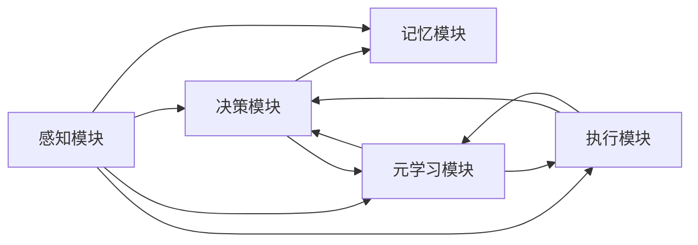
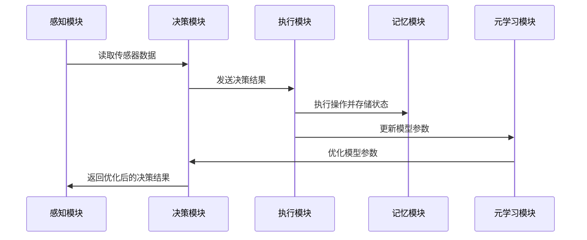

                 

# AI Agent的元强化学习框架

## 摘要

本文旨在深入探讨AI Agent的元强化学习框架，详细解析其核心概念、原理及其在AI领域的广泛应用。元强化学习作为一种高级的学习方式，它能够通过学习如何学习来提升AI Agent的适应性和学习能力。本文将首先介绍AI Agent与强化学习的基础知识，然后深入探讨元强化学习的定义、原理及其与AI Agent的紧密联系。接着，我们将逐步讲解强化学习与元强化学习的算法原理，包括强化学习中的经典算法和元强化学习的先进算法。此外，本文还将阐述如何构建AI Agent的元强化学习框架，并提供具体的数学模型和公式。随后，我们将介绍系统分析与架构设计方案，展示一个具体的项目实战案例，并总结其实践经验。最后，我们将提出一些最佳实践建议，并展望元强化学习在AI领域的发展趋势和未来应用前景。

## 关键词

- AI Agent
- 强化学习
- 元强化学习
- 算法原理
- 数学模型
- 系统架构
- 项目实战

## 第1章 引言：AI Agent与元强化学习

### 1.1 问题背景

#### 1.1.1 AI Agent的应用场景

人工智能（AI）作为当前科技发展的热点领域，其应用已经渗透到各行各业。AI Agent，作为AI系统的重要组成部分，扮演着执行任务、与用户交互以及自主决策的关键角色。AI Agent的应用场景广泛，包括但不限于以下几个方面：

1. **智能客服**：在电子商务、金融保险、医疗等行业，智能客服系统能够通过自然语言处理技术，与用户进行实时交流，提供定制化服务，提高客户满意度。
2. **自动驾驶**：自动驾驶汽车通过感知环境、规划路径和执行操作，实现无人驾驶。AI Agent在这里起到核心决策作用，确保行驶过程的安全和高效。
3. **工业自动化**：在制造业中，AI Agent可以监控生产线、预测设备故障，并优化生产流程，提高生产效率。
4. **智能家居**：通过智能音箱、智能家电等设备，AI Agent能够实现家庭环境的自动化控制，提高生活便捷性。

#### 1.1.2 强化学习在AI Agent中的应用

强化学习（Reinforcement Learning，RL）是一种通过奖励机制来训练智能体的学习方式。在AI Agent的应用中，强化学习起到了至关重要的作用。它能够使智能体在动态环境中学习如何做出最优决策，从而实现目标。强化学习在AI Agent中的应用主要包括以下几个方面：

1. **路径规划**：在自动驾驶和机器人导航中，强化学习算法能够学习到最优路径，提高导航效率和安全性。
2. **策略优化**：在金融投资、游戏AI等领域，强化学习能够帮助智能体学习到最佳策略，实现高收益。
3. **强化学习在对话系统中的应用**：通过强化学习，AI Agent能够在对话中不断优化其回答策略，提高用户体验。
4. **控制优化**：在工业自动化领域，强化学习可以用于优化控制系统的参数设置，提高生产过程的稳定性。

#### 1.1.3 元强化学习的概念与意义

元强化学习（Meta-Reinforcement Learning）是一种更高层次的学习方式，它不仅学习如何做出决策，还学习如何快速适应新的环境和任务。元强化学习的概念起源于元学习（Meta-Learning），它通过学习学习过程本身来提高智能体的泛化能力。元强化学习的意义在于：

1. **提高适应能力**：通过元强化学习，AI Agent可以快速适应新的任务和环境，减少训练时间。
2. **优化学习效率**：元强化学习能够通过学习不同的任务，提取共性，从而提高学习效率。
3. **减少数据需求**：元强化学习可以在有限的训练数据下，提高智能体的表现，减少对大量训练数据的依赖。
4. **泛化能力提升**：元强化学习可以增强AI Agent在不同任务中的泛化能力，使其能够在多样化场景中表现优异。

#### 1.1.4 传统强化学习的局限

虽然传统强化学习在AI Agent中有着广泛的应用，但它也存在着一些局限性：

1. **样本效率低**：传统强化学习需要大量的样本来学习，这在大规模数据集和高维环境中显得尤为困难。
2. **收敛速度慢**：强化学习算法通常需要较长的训练时间，特别是在复杂环境中，算法的收敛速度往往较慢。
3. **可扩展性差**：传统强化学习算法在处理多个任务时，往往需要独立训练，这限制了其在多任务学习中的应用。
4. **对初始状态敏感**：传统强化学习算法对初始状态的设置非常敏感，一旦初始状态选择不当，可能会导致学习失败。

#### 1.1.5 元强化学习的优势与重要性

元强化学习通过学习如何学习，能够有效解决传统强化学习的局限性。其优势包括：

1. **高样本效率**：元强化学习能够在较少的样本下，快速适应新的任务和环境，提高样本利用效率。
2. **快速收敛**：元强化学习算法通过快速迭代，能够在较短的时间内收敛到最优解，提高学习效率。
3. **多任务学习**：元强化学习可以在一个统一的框架下处理多个任务，提高了算法的可扩展性。
4. **减少对初始状态的依赖**：元强化学习算法对初始状态的敏感性较低，这使得它在各种复杂环境下都具有较好的适应性。

综上所述，元强化学习作为一种先进的强化学习方法，在提升AI Agent的适应性和学习能力方面具有显著的优势，具有重要的研究和应用价值。

### 1.2 问题描述

#### 1.2.1 AI Agent面临的主要挑战

AI Agent在实际应用中面临诸多挑战，这些挑战限制了其性能和适用范围。以下是一些主要挑战：

1. **动态环境适应性**：在动态环境中，AI Agent需要快速适应环境变化，这对算法的实时性和适应性提出了高要求。
2. **样本效率问题**：传统的强化学习算法在训练过程中需要大量的样本数据，这在大规模数据集和高维环境中难以实现。
3. **多任务学习能力**：在实际应用中，AI Agent往往需要处理多个任务，而传统强化学习算法在处理多任务时往往需要独立训练，这降低了算法的可扩展性。
4. **收敛速度与稳定性**：强化学习算法在复杂环境中往往需要较长的训练时间，且容易受到初始状态选择的影响，导致收敛速度慢且不稳定。

#### 1.2.2 传统强化学习的局限

虽然传统强化学习在许多场景中表现出色，但其局限性也不容忽视：

1. **样本依赖性强**：传统强化学习算法通常需要大量的样本数据来训练，这在实际应用中往往难以实现。
2. **收敛速度慢**：在复杂环境中，传统强化学习算法往往需要较长的训练时间，这限制了其在实时应用中的性能。
3. **对初始状态敏感**：传统强化学习算法对初始状态的设置非常敏感，一旦初始状态选择不当，可能会导致学习失败。
4. **多任务学习困难**：传统强化学习算法在处理多个任务时，往往需要独立训练，这降低了算法的可扩展性和灵活性。

#### 1.2.3 元强化学习的优势与重要性

元强化学习通过学习如何学习，能够有效解决传统强化学习的局限性，其主要优势包括：

1. **高样本效率**：元强化学习能够在较少的样本下，快速适应新的任务和环境，提高样本利用效率。
2. **快速收敛**：元强化学习算法通过快速迭代，能够在较短的时间内收敛到最优解，提高学习效率。
3. **多任务学习**：元强化学习可以在一个统一的框架下处理多个任务，提高了算法的可扩展性和灵活性。
4. **减少对初始状态的依赖**：元强化学习算法对初始状态的敏感性较低，这使得它在各种复杂环境下都具有较好的适应性。

因此，元强化学习在提升AI Agent的适应性和学习能力方面具有重要的研究价值和实际应用前景。

### 1.3 问题解决

#### 1.3.1 元强化学习的原理与方法

元强化学习（Meta-Reinforcement Learning）的核心思想是通过学习如何学习来提升智能体在动态环境中的适应性和学习能力。具体来说，元强化学习采用了一种“学习如何学习”的策略，使得智能体能够快速适应新的任务和环境。以下是元强化学习的主要原理和方法：

1. **元学习率（Meta-Learning Rate）**：元强化学习通过学习元学习率，使得智能体能够在新的任务中快速调整其策略。元学习率决定了智能体在处理新任务时，对已有策略的依赖程度和调整力度。

2. **泛化能力（Generalization Ability）**：元强化学习强调智能体的泛化能力，即智能体能够在不同任务中表现出较高的适应性。通过学习任务的共性，元强化学习算法能够提高智能体在不同任务中的泛化能力。

3. **模型优化（Model Optimization）**：在元强化学习中，模型优化是一个关键步骤。通过优化模型参数，智能体能够更好地适应新任务，提高学习效率。

4. **迁移学习（Transfer Learning）**：元强化学习利用迁移学习技术，将一个任务中的经验迁移到另一个任务中，从而减少对新任务的训练时间，提高样本利用效率。

5. **多任务学习（Multi-Task Learning）**：元强化学习在处理多个任务时，能够在一个统一的框架下进行，提高了算法的可扩展性和灵活性。

#### 1.3.2 元强化学习在AI Agent中的应用实例

元强化学习在AI Agent中的应用非常广泛，以下是一些典型的应用实例：

1. **智能客服系统**：通过元强化学习，智能客服系统可以快速适应不同行业和领域的对话需求，提供更精准、高效的客户服务。

2. **自动驾驶**：在自动驾驶领域，元强化学习可以帮助智能驾驶系统快速适应各种道路和交通环境，提高行驶安全性和效率。

3. **工业自动化**：在工业自动化领域，元强化学习可以用于优化生产流程、监控设备状态和预测故障，提高生产效率和产品质量。

4. **游戏AI**：在游戏AI中，元强化学习可以帮助智能体快速学习不同的游戏策略，提高游戏胜率。

5. **多智能体系统**：在多智能体系统中，元强化学习可以用于协调不同智能体的行动，提高整体系统的性能和适应性。

通过上述应用实例，可以看出元强化学习在提升AI Agent适应性和学习能力方面具有显著的优势，为解决传统强化学习中的局限性提供了有效的解决方案。

### 1.4 边界与外延

#### 1.4.1 元强化学习的适用范围

元强化学习作为一种先进的学习方式，其适用范围非常广泛，主要涵盖以下几个方面：

1. **动态环境**：元强化学习在动态环境中表现优异，能够快速适应环境变化，提高智能体的适应能力。
2. **多任务场景**：元强化学习能够在多任务场景中表现出较高的灵活性和适应性，通过一个统一的框架处理多个任务。
3. **样本效率低的环境**：在样本效率较低的环境中，元强化学习通过快速迭代和迁移学习技术，能够在较少的样本下实现有效学习。
4. **初始状态不确定的环境**：元强化学习对初始状态的敏感性较低，能够在各种初始状态下稳定运行。

#### 1.4.2 元强化学习与其他学习方式的区别

元强化学习与其他学习方式（如监督学习、无监督学习等）有以下几点主要区别：

1. **学习目标**：监督学习和无监督学习主要关注如何从数据中提取特征和模式，而元强化学习则关注如何学习学习过程本身，提高智能体的适应性和学习能力。
2. **数据依赖**：监督学习依赖大量标注数据，无监督学习在无标注数据上进行学习，而元强化学习在较少的样本下，通过快速迭代和迁移学习技术，能够实现高效学习。
3. **环境交互**：元强化学习强调智能体与环境的高频互动，通过不断地试错和反馈来优化策略，而监督学习和无监督学习则较少涉及环境交互。
4. **泛化能力**：元强化学习通过学习任务的共性和迁移学习技术，能够提高智能体在不同任务中的泛化能力，而监督学习和无监督学习在处理多样化任务时往往需要重新训练。

#### 1.4.3 元强化学习的核心要素组成

元强化学习的核心要素主要包括以下几个方面：

1. **元学习率**：元学习率决定了智能体在处理新任务时，对已有策略的依赖程度和调整力度，是元强化学习的关键参数。
2. **模型优化**：通过优化模型参数，智能体能够更好地适应新任务，提高学习效率。
3. **迁移学习**：迁移学习技术使得智能体能够在不同任务中共享经验，减少对新任务的训练时间。
4. **多任务学习框架**：元强化学习采用统一的多任务学习框架，提高了算法的可扩展性和灵活性。

通过上述分析，可以明确元强化学习的适用范围、与其他学习方式的区别以及其核心要素组成，为深入研究和应用元强化学习提供了理论基础。

### 1.5 概念结构与核心要素组成

#### 1.5.1 AI Agent的组成结构

AI Agent作为人工智能系统中的核心组件，其组成结构主要包括以下几个部分：

1. **感知模块**：感知模块负责从环境中获取信息，通常包括视觉、听觉、触觉等多种感知方式。通过感知模块，AI Agent能够感知和理解当前环境的状态。
2. **决策模块**：决策模块是AI Agent的核心，负责根据感知模块获取的信息和预定的目标，选择最佳行动方案。决策模块通常采用各种算法（如强化学习、规划算法等）来制定决策策略。
3. **执行模块**：执行模块负责将决策模块生成的行动方案转化为实际的操作，实现AI Agent的目标。执行模块通常与具体的硬件设备或软件系统相连，完成具体的任务执行。
4. **记忆模块**：记忆模块用于存储AI Agent在执行任务过程中获得的经验和知识，包括状态、行动、奖励等信息。记忆模块有助于AI Agent在后续任务中快速适应和学习。

#### 1.5.2 强化学习的基本原理

强化学习（Reinforcement Learning，RL）是一种通过奖励机制来训练智能体的学习方式。其基本原理可以概括为以下几个要点：

1. **状态-动作模型**：在强化学习中，智能体通过感知模块获取当前环境的状态，然后根据决策模块选择一个行动方案。状态-动作模型描述了智能体在特定状态下选择特定行动的概率分布。
2. **奖励机制**：环境根据智能体的行动结果给予相应的奖励或惩罚。奖励机制用于引导智能体选择能够最大化长期奖励的行动方案。
3. **策略迭代**：强化学习通过不断迭代策略，逐步优化智能体的行动方案。在每次迭代中，智能体根据当前状态和奖励，更新其策略，以期望在后续任务中实现更高的奖励。
4. **价值函数**：价值函数（Value Function）用于评估智能体在特定状态下的期望奖励。通过优化价值函数，智能体能够选择最优的行动方案。

#### 1.5.3 元强化学习的关键技术

元强化学习（Meta-Reinforcement Learning）是在强化学习基础上发展起来的一种高级学习方式。其关键技术包括以下几个方面：

1. **元学习率**：元学习率（Meta-Learning Rate）是元强化学习的核心参数，用于调节智能体在处理新任务时，对已有策略的依赖程度和调整力度。元学习率决定了智能体在迁移学习和多任务学习中的适应能力。
2. **迁移学习**：迁移学习（Transfer Learning）技术使得智能体能够将一个任务中的经验迁移到另一个任务中，减少对新任务的训练时间，提高样本利用效率。
3. **多任务学习框架**：元强化学习采用统一的多任务学习框架，将多个任务整合在一个框架下进行学习，提高了算法的可扩展性和灵活性。
4. **泛化能力**：元强化学习通过学习任务的共性和迁移学习技术，提高了智能体在不同任务中的泛化能力，使其能够快速适应新的环境和任务。

通过上述分析，可以明确AI Agent的组成结构、强化学习的基本原理以及元强化学习的关键技术，为构建和优化AI Agent的元强化学习框架提供了理论基础。

## 第2章 核心概念与联系

### 2.1 强化学习原理

强化学习（Reinforcement Learning，RL）是一种通过奖励机制来训练智能体的学习方式。其核心原理基于智能体与环境的交互，通过不断尝试和反馈来优化行为策略，从而实现目标。以下是强化学习的主要概念、基本流程以及经典算法。

#### 2.1.1 强化学习的基本概念

1. **智能体（Agent）**：智能体是执行任务的主体，它可以通过感知模块获取环境信息，并利用决策模块选择行动方案。
2. **环境（Environment）**：环境是智能体执行任务的空间，环境状态和奖励会影响智能体的决策和行动。
3. **状态（State）**：状态是环境的当前描述，智能体通过感知模块获取状态信息。
4. **动作（Action）**：动作是智能体在特定状态下采取的行动，动作的选择由决策模块决定。
5. **奖励（Reward）**：奖励是环境对智能体行动的反馈，用于评估行动的好坏，奖励机制是强化学习的重要驱动力。
6. **策略（Policy）**：策略是智能体在特定状态下的行动方案，策略决定了智能体的行为。
7. **价值函数（Value Function）**：价值函数是评估智能体在特定状态下采取特定行动的期望奖励，用于指导智能体选择最优策略。

#### 2.1.2 强化学习的主要算法

强化学习有多种算法，其中一些经典算法包括：

1. **Q-learning算法**：Q-learning是一种值迭代算法，通过迭代更新Q值（状态-动作值函数）来优化策略。每次迭代中，智能体根据当前状态和Q值选择动作，并更新Q值，以期望在后续任务中实现更高的奖励。

2. **SARSA算法**：SARSA（On-Policy）算法是一种基于策略的强化学习算法，它与Q-learning类似，但直接基于当前状态和动作来更新Q值，而不依赖于未来的状态和动作。

3. **Deep Q-Network（DQN）算法**：DQN算法是一种基于深度学习的强化学习算法，它使用神经网络来近似Q值函数。DQN通过经验回放和目标网络技术，提高了算法的稳定性和泛化能力。

4. **Policy Gradient算法**：Policy Gradient算法直接优化策略的梯度，以最大化期望奖励。这种算法的优点是能够快速收敛，但缺点是对参数调整敏感。

5. **Actor-Critic算法**：Actor-Critic算法结合了策略优化和价值评估的方法，通过优化策略和Q值函数来提高学习效率。其中，Actor负责优化策略，Critic负责评估策略。

#### 2.1.3 强化学习的基本流程

强化学习的基本流程包括以下几个步骤：

1. **初始化**：智能体和环境初始化，设定初始状态。
2. **感知状态**：智能体通过感知模块获取当前状态。
3. **选择动作**：智能体根据当前状态和策略选择最佳动作。
4. **执行动作**：智能体执行所选动作，改变环境状态。
5. **获取奖励**：环境根据智能体行动结果给予奖励。
6. **更新策略**：根据奖励和反馈信息，智能体更新其策略，以期望在后续任务中实现更高的奖励。
7. **迭代循环**：重复上述步骤，不断优化策略，直到达到预设的目标或收敛条件。

#### 2.1.4 强化学习的mermaid流程图

```mermaid
sequenceDiagram
    participant 智能体
    participant 环境
    智能体->>环境: 初始化
    environment 状态初始化
    智能体->>环境: 感知状态
    environment 状态s
    智能体->>自己: 选择动作
    智能体->>环境: 执行动作
    environment 状态s'，奖励r
    智能体->>自己: 更新策略
    loop 迭代
        智能体->>环境: 感知状态
        智能体->>自己: 选择动作
        智能体->>环境: 执行动作
        environment 状态s'，奖励r
        智能体->>自己: 更新策略
    end
```

### 2.2 元强化学习

元强化学习（Meta-Reinforcement Learning）是一种高级的强化学习方法，它通过学习如何学习来提升智能体在动态环境中的适应性和学习能力。元强化学习不仅学习如何做出决策，还学习如何快速适应新的环境和任务，从而提高智能体的泛化能力和学习效率。以下是元强化学习的主要定义、关键技术以及基本流程。

#### 2.2.1 元强化学习的定义

元强化学习（Meta-Reinforcement Learning）是一种通过学习学习过程本身来提升智能体在动态环境中的适应性和学习能力的方法。它通过学习如何快速适应新的任务和环境，提高了智能体的泛化能力和学习效率。元强化学习强调在多个任务之间共享经验，通过迁移学习和多任务学习技术，减少了对新任务的训练时间。

#### 2.2.2 元强化学习的关键技术

1. **元学习率（Meta-Learning Rate）**：元学习率是元强化学习的核心参数，用于调节智能体在处理新任务时，对已有策略的依赖程度和调整力度。元学习率决定了智能体在迁移学习和多任务学习中的适应能力。

2. **迁移学习（Transfer Learning）**：迁移学习技术使得智能体能够将一个任务中的经验迁移到另一个任务中，减少对新任务的训练时间，提高样本利用效率。通过迁移学习，智能体能够快速适应新的任务和环境。

3. **多任务学习框架（Multi-Task Learning Framework）**：元强化学习采用统一的多任务学习框架，将多个任务整合在一个框架下进行学习，提高了算法的可扩展性和灵活性。

4. **泛化能力（Generalization Ability）**：元强化学习通过学习任务的共性和迁移学习技术，提高了智能体在不同任务中的泛化能力，使其能够快速适应新的环境和任务。

5. **元策略优化（Meta-Policy Optimization）**：元策略优化是通过优化智能体的元策略，提高其在不同任务中的表现。元策略优化有助于智能体快速适应新的任务和环境。

#### 2.2.3 元强化学习的基本流程

元强化学习的基本流程包括以下几个步骤：

1. **初始化**：智能体和环境初始化，设定初始状态。
2. **感知状态**：智能体通过感知模块获取当前状态。
3. **选择动作**：智能体根据当前状态和元策略选择最佳动作。
4. **执行动作**：智能体执行所选动作，改变环境状态。
5. **获取奖励**：环境根据智能体行动结果给予奖励。
6. **更新策略**：根据奖励和反馈信息，智能体更新其策略，以期望在后续任务中实现更高的奖励。
7. **迁移学习**：智能体通过迁移学习技术，将一个任务中的经验迁移到其他任务中，提高样本利用效率和泛化能力。
8. **迭代循环**：重复上述步骤，不断优化策略和元策略，直到达到预设的目标或收敛条件。

#### 2.2.4 元强化学习的mermaid流程图

```mermaid
sequenceDiagram
    participant 智能体
    participant 环境
    智能体->>环境: 初始化
    environment 状态初始化
    智能体->>环境: 感知状态
    environment 状态s
    智能体->>自己: 选择动作
    智能体->>环境: 执行动作
    environment 状态s'，奖励r
    智能体->>自己: 更新策略
    loop 迭代
        智能体->>环境: 感知状态
        智能体->>自己: 选择动作
        智能体->>环境: 执行动作
        environment 状态s'，奖励r
        智能体->>自己: 更新策略
        智能体->>自己: 迁移学习
    end
```

### 2.3 AI Agent与元强化学习的联系

#### 2.3.1 AI Agent的需求与元强化学习的结合

AI Agent在实际应用中需要具备以下几个方面的能力：

1. **适应性**：AI Agent需要能够快速适应新的环境和任务，以应对动态变化的需求。
2. **泛化能力**：AI Agent需要具备在不同任务和场景中表现出色的能力。
3. **学习效率**：AI Agent需要能够在较少的样本下快速学习，以提高样本利用效率。
4. **稳定性**：AI Agent需要具备较高的稳定性，以保证在复杂环境中能够持续表现良好。

元强化学习通过学习如何学习，能够有效满足AI Agent的上述需求：

1. **高适应性**：元强化学习通过学习如何快速适应新的任务和环境，提高了AI Agent的适应性。
2. **泛化能力**：元强化学习通过迁移学习和多任务学习技术，提高了AI Agent的泛化能力。
3. **学习效率**：元强化学习通过快速迭代和迁移学习，提高了AI Agent的学习效率。
4. **稳定性**：元强化学习通过优化策略和元策略，提高了AI Agent的稳定性。

#### 2.3.2 元强化学习在AI Agent中的应用实例

1. **智能客服系统**：通过元强化学习，智能客服系统可以快速适应不同行业和领域的对话需求，提供更精准、高效的客户服务。
2. **自动驾驶**：在自动驾驶领域，元强化学习可以帮助智能驾驶系统快速适应各种道路和交通环境，提高行驶安全性和效率。
3. **工业自动化**：在工业自动化领域，元强化学习可以用于优化生产流程、监控设备状态和预测故障，提高生产效率和产品质量。
4. **游戏AI**：在游戏AI中，元强化学习可以帮助智能体快速学习不同的游戏策略，提高游戏胜率。
5. **多智能体系统**：在多智能体系统中，元强化学习可以用于协调不同智能体的行动，提高整体系统的性能和适应性。

#### 2.3.3 元强化学习对AI Agent的影响

元强化学习对AI Agent的影响主要体现在以下几个方面：

1. **提升适应能力**：通过元强化学习，AI Agent能够快速适应新的任务和环境，提高了其适应能力。
2. **优化学习效率**：元强化学习通过快速迭代和迁移学习，提高了AI Agent的学习效率，使其能够在较少的样本下实现有效学习。
3. **增强泛化能力**：元强化学习通过学习任务的共性和迁移学习技术，提高了AI Agent在不同任务中的泛化能力，使其能够在多样化场景中表现优异。
4. **提高稳定性**：元强化学习通过优化策略和元策略，提高了AI Agent在复杂环境中的稳定性，保证了其在各种场景下的可靠性和持续性能。

综上所述，元强化学习与AI Agent的结合，能够有效提升AI Agent的适应能力、学习效率和泛化能力，具有重要的实际应用价值和研究意义。

### 第3章 算法原理讲解

#### 3.1 强化学习算法

强化学习算法是智能体在与环境的交互过程中，通过学习奖励信号来优化其策略的一种方法。强化学习算法的核心是状态-动作价值函数（State-Action Value Function）和策略（Policy）的迭代更新。以下将介绍几种经典的强化学习算法，包括Q-learning算法、SARSA算法和Deep Q-Network（DQN）算法。

##### 3.1.1 Q-learning算法

Q-learning算法是一种基于值迭代的强化学习算法。Q-learning的目标是学习一个状态-动作价值函数Q(s, a)，该函数表示智能体在状态s下执行动作a所获得的期望回报。Q-learning的更新公式如下：

$$ Q(s, a) \leftarrow Q(s, a) + \alpha [r + \gamma \max_{a'} Q(s', a') - Q(s, a)] $$

其中，$\alpha$是学习率，$r$是立即回报，$\gamma$是折扣因子，$s'$是下一个状态，$a'$是智能体在下一个状态下的最佳动作。

Q-learning算法的基本流程如下：

1. 初始化Q值函数。
2. 在状态s下，随机选择动作a。
3. 执行动作a，进入状态s'，并获得回报r。
4. 根据更新公式更新Q值。
5. 重复步骤2-4，直到达到停止条件。

##### 3.1.2 SARSA算法

SARSA算法（On-Policy）是一种基于策略的强化学习算法，它与Q-learning算法类似，但直接使用当前状态和动作来更新Q值，而不是依赖于未来的状态和动作。SARSA的更新公式如下：

$$ Q(s, a) \leftarrow Q(s, a) + \alpha [r + \gamma Q(s', a')] $$

SARSA算法的基本流程如下：

1. 初始化Q值函数。
2. 在状态s下，根据当前策略选择动作a。
3. 执行动作a，进入状态s'，并获得回报r。
4. 根据更新公式更新Q值。
5. 重复步骤2-4，直到达到停止条件。

##### 3.1.3 Deep Q-Network（DQN）算法

DQN算法是一种基于深度学习的强化学习算法，它使用神经网络来近似状态-动作价值函数Q(s, a)。DQN的主要挑战是如何解决经验回放（Experience Replay）和目标网络（Target Network）的问题，以避免训练样本的相关性和收敛速度问题。

DQN算法的基本流程如下：

1. 初始化经验回放缓冲区。
2. 初始化目标网络和主网络，两个网络参数相同。
3. 选择动作，执行动作，并将经验（状态、动作、立即回报、新状态）存入经验回放缓冲区。
4. 从经验回放缓冲区随机采样一批经验。
5. 使用采样经验更新主网络参数。
6. 按照一定策略更新目标网络参数，通常使用软更新策略。
7. 重复步骤3-6，直到达到训练迭代次数。

##### 3.1.4 强化学习算法的mermaid流程图

```mermaid
sequenceDiagram
    participant 智能体
    participant 环境
    智能体->>环境: 初始化
    environment 初始化Q值函数
    智能体->>环境: 感知状态s
    environment 状态s
    智能体->>自己: 选择动作a
    智能体->>环境: 执行动作a
    environment 状态s'，回报r
    智能体->>自己: 更新Q值
    loop 迭代
        智能体->>环境: 感知状态s
        智能体->>自己: 选择动作a
        智能体->>环境: 执行动作a
        environment 状态s'，回报r
        智能体->>自己: 更新Q值
    end
```

#### 3.2 元强化学习算法

元强化学习（Meta-Reinforcement Learning）是一种通过学习如何学习来提升智能体在动态环境中的适应性和学习能力的方法。元强化学习不仅学习如何做出决策，还学习如何快速适应新的环境和任务，从而提高智能体的泛化能力和学习效率。以下将介绍几种经典的元强化学习算法，包括Meta-Learning算法、Model-Based Meta-Learning算法和Model-Free Meta-Learning算法。

##### 3.2.1 Meta-Learning算法

Meta-Learning算法是一种基于模型迁移的元强化学习算法，它通过将一个任务中的经验迁移到另一个任务中，来提高智能体的学习效率。Meta-Learning算法的核心思想是学习一个泛化的模型，该模型能够适用于多个任务。

Meta-Learning算法的基本流程如下：

1. 对于每个任务，分别训练模型。
2. 将每个任务中的经验存储在一个统一的经验库中。
3. 在新任务中，首先从经验库中采样经验。
4. 使用采样的经验更新模型。
5. 使用更新后的模型在新任务中进行迭代学习。

##### 3.2.2 Model-Based Meta-Learning算法

Model-Based Meta-Learning算法是一种基于模型优化的元强化学习算法，它通过学习一个表示环境动态的模型，来提高智能体的学习效率。Model-Based Meta-Learning算法的核心思想是利用环境模型来预测未来状态，并基于预测结果来更新策略。

Model-Based Meta-Learning算法的基本流程如下：

1. 初始化环境模型和策略网络。
2. 对于每个任务，使用环境模型生成一系列的状态序列。
3. 使用状态序列训练策略网络。
4. 使用更新后的策略网络在新任务中进行迭代学习。

##### 3.2.3 Model-Free Meta-Learning算法

Model-Free Meta-Learning算法是一种不依赖环境模型的元强化学习算法，它直接从经验中学习策略。Model-Free Meta-Learning算法的核心思想是利用经验库中的历史经验来更新策略网络。

Model-Free Meta-Learning算法的基本流程如下：

1. 初始化经验库和策略网络。
2. 对于每个任务，将经验存储在经验库中。
3. 从经验库中随机采样经验。
4. 使用采样的经验更新策略网络。
5. 使用更新后的策略网络在新任务中进行迭代学习。

##### 3.2.4 元强化学习算法的mermaid流程图

```mermaid
sequenceDiagram
    participant 智能体
    participant 环境
    智能体->>环境: 初始化
    environment 初始化模型和策略网络
    智能体->>环境: 感知状态s
    environment 状态s
    智能体->>自己: 选择动作a
    智能体->>环境: 执行动作a
    environment 状态s'，回报r
    智能体->>自己: 更新模型和策略网络
    loop 迭代
        智能体->>环境: 感知状态s
        智能体->>自己: 选择动作a
        智能体->>环境: 执行动作a
        environment 状态s'，回报r
        智能体->>自己: 更新模型和策略网络
    end
```

#### 3.3 AI Agent的元强化学习框架

AI Agent的元强化学习框架是一种将元强化学习技术应用于AI Agent设计的方法，它旨在提高AI Agent在动态环境中的适应性和学习能力。以下将介绍AI Agent的元强化学习框架的构建方法、流程以及mermaid流程图。

##### 3.3.1 AI Agent的元强化学习框架构建

AI Agent的元强化学习框架主要包括以下几个组成部分：

1. **感知模块**：感知模块负责从环境中获取信息，并将其转换为内部表示。
2. **决策模块**：决策模块基于感知模块的输入，通过元强化学习算法选择最佳行动方案。
3. **执行模块**：执行模块负责将决策模块生成的行动方案转化为实际的操作。
4. **记忆模块**：记忆模块用于存储AI Agent在执行任务过程中获得的经验和知识，包括状态、动作和奖励等信息。
5. **元学习模块**：元学习模块负责优化决策模块和执行模块的参数，以提高AI Agent的适应性和学习能力。

##### 3.3.2 AI Agent的元强化学习流程

AI Agent的元强化学习流程包括以下几个步骤：

1. **初始化**：初始化AI Agent的感知模块、决策模块、执行模块、记忆模块和元学习模块。
2. **感知状态**：感知模块获取当前环境状态，并将其传递给决策模块。
3. **选择动作**：决策模块根据当前状态和元强化学习算法选择最佳动作。
4. **执行动作**：执行模块根据选择好的动作，执行具体的操作。
5. **获取奖励**：环境根据执行的结果，给予AI Agent相应的奖励。
6. **更新策略**：决策模块根据获取的奖励，更新其策略参数，以提高决策的准确性。
7. **存储经验**：记忆模块将状态、动作、奖励等信息存储下来，用于后续的元学习和策略优化。
8. **元学习**：元学习模块根据存储的经验，更新AI Agent的模型参数，以提高其适应性和学习能力。
9. **迭代循环**：重复步骤2-8，直到达到预设的训练次数或收敛条件。

##### 3.3.3 AI Agent的元强化学习mermaid流程图

```mermaid
sequenceDiagram
    participant 感知模块
    participant 决策模块
    participant 执行模块
    participant 记忆模块
    participant 元学习模块
    participant 环境
    感知模块->>决策模块: 初始化
    决策模块->>感知模块: 感知状态s
    感知模块->>决策模块: 状态s
    决策模块->>执行模块: 选择动作a
    执行模块->>环境: 执行动作a
    environment 状态s'，回报r
    环境->>记忆模块: 奖励r
    记忆模块->>决策模块: 更新策略
    决策模块->>元学习模块: 更新模型
    元学习模块->>感知模块: 迭代循环
    loop 迭代
        感知模块->>决策模块: 感知状态s
        决策模块->>执行模块: 选择动作a
        执行模块->>环境: 执行动作a
        环境->>记忆模块: 奖励r
        记忆模块->>决策模块: 更新策略
        决策模块->>元学习模块: 更新模型
    end
```

通过构建和优化AI Agent的元强化学习框架，可以显著提高AI Agent在动态环境中的适应能力和学习能力，为解决实际应用中的复杂问题提供有效的解决方案。

### 第4章 数学模型和数学公式

#### 4.1 强化学习的数学模型

强化学习（Reinforcement Learning，RL）中的数学模型主要用于描述智能体（Agent）与环境的交互过程，以及如何通过这些交互来优化智能体的行为策略。以下将详细阐述强化学习的数学模型，包括期望值计算、价值函数的更新和策略迭代等关键概念，并给出相关的LaTeX公式。

##### 4.1.1 期望值计算

在强化学习中，期望值是一个核心的概念，用于评估智能体在不同状态下的平均回报。期望值计算公式如下：

$$
E[R|S] = \sum_{a \in A} r(a|s) P(a|s)
$$

其中，\(E[R|S]\) 表示在状态 \(S\) 下的期望回报，\(r(a|s)\) 表示在状态 \(S\) 下执行动作 \(a\) 的即时回报，\(P(a|s)\) 表示在状态 \(S\) 下执行动作 \(a\) 的概率。

##### 4.1.2 价值函数的更新

强化学习中的价值函数（Value Function）用于评估智能体在特定状态下采取特定动作的期望回报。价值函数的更新过程是强化学习算法的核心。以下为Q-learning算法中价值函数的更新公式：

$$
Q(s, a) \leftarrow Q(s, a) + \alpha [r + \gamma \max_{a'} Q(s', a') - Q(s, a)]
$$

其中，\(Q(s, a)\) 表示状态-动作价值函数，\(\alpha\) 是学习率，\(r\) 是即时回报，\(\gamma\) 是折扣因子，\(s'\) 是新状态，\(a'\) 是在状态 \(s'\) 下的最佳动作。

##### 4.1.3 策略迭代

策略（Policy）是智能体在特定状态下采取的动作映射。在强化学习中，策略通过价值函数的更新不断优化。以下为策略迭代的基本过程：

$$
\pi(s) = \arg\max_{a} Q(s, a)
$$

其中，\(\pi(s)\) 表示在状态 \(s\) 下的最优策略，即选择能够最大化价值函数 \(Q(s, a)\) 的动作 \(a\)。

##### 4.1.4 强化学习算法的LaTeX公式

强化学习算法中的LaTeX公式如下：

$$
\begin{aligned}
E[R|S] &= \sum_{a \in A} r(a|s) P(a|s) \\
Q(s, a) &\leftarrow Q(s, a) + \alpha [r + \gamma \max_{a'} Q(s', a') - Q(s, a)] \\
\pi(s) &= \arg\max_{a} Q(s, a)
\end{aligned}
$$

#### 4.2 元强化学习的数学模型

元强化学习（Meta-Reinforcement Learning）通过学习如何快速适应新的环境和任务，提高了智能体的泛化能力和学习效率。以下将介绍元强化学习的数学模型，包括元学习率、泛化能力和模型优化等关键概念，并给出相关的LaTeX公式。

##### 4.2.1 元学习率

元学习率（Meta-Learning Rate）是元强化学习中的一个重要参数，用于调节智能体在处理新任务时，对已有策略的依赖程度和调整力度。元学习率的公式如下：

$$
\alpha_{\text{meta}} = \frac{1}{\sqrt{N}}
$$

其中，\(\alpha_{\text{meta}}\) 是元学习率，\(N\) 是训练样本的数量。

##### 4.2.2 泛化能力

泛化能力（Generalization Ability）是元强化学习中的一个关键指标，用于评估智能体在不同任务中的适应性。泛化能力的公式如下：

$$
\text{Generalization} = \frac{1}{M} \sum_{m=1}^{M} \frac{1}{N_m} \sum_{n=1}^{N_m} \mathbb{E}_{s \sim p(s)} [\rho(s, a^* | \theta)]
$$

其中，\(M\) 是训练任务的个数，\(N_m\) 是第 \(m\) 个任务中的样本数量，\(\rho(s, a^* | \theta)\) 是在给定参数 \(\theta\) 下，智能体在状态 \(s\) 下执行最佳动作 \(a^*\) 的回报期望。

##### 4.2.3 模型优化

模型优化（Model Optimization）是元强化学习中的一个重要步骤，通过优化模型参数来提高智能体的适应能力和学习效率。模型优化的公式如下：

$$
\theta \leftarrow \theta - \alpha_{\text{opt}} \nabla_{\theta} \mathcal{L}(\theta)
$$

其中，\(\theta\) 是模型参数，\(\alpha_{\text{opt}}\) 是优化率，\(\mathcal{L}(\theta)\) 是损失函数，\(\nabla_{\theta} \mathcal{L}(\theta)\) 是损失函数关于参数 \(\theta\) 的梯度。

##### 4.2.4 元强化学习的LaTeX公式

元强化学习的LaTeX公式如下：

$$
\begin{aligned}
\alpha_{\text{meta}} &= \frac{1}{\sqrt{N}} \\
\text{Generalization} &= \frac{1}{M} \sum_{m=1}^{M} \frac{1}{N_m} \sum_{n=1}^{N_m} \mathbb{E}_{s \sim p(s)} [\rho(s, a^* | \theta)] \\
\theta &\leftarrow \theta - \alpha_{\text{opt}} \nabla_{\theta} \mathcal{L}(\theta)
\end{aligned}
$$

通过上述数学模型和公式，我们可以更深入地理解强化学习和元强化学习的基本原理和运作机制，为构建和优化AI Agent的元强化学习框架提供了坚实的理论基础。

### 第5章 系统分析与架构设计方案

#### 5.1 问题场景介绍

在智能机器人控制领域，机器人需要具备高度的自主决策能力和环境适应能力，以应对复杂的动态环境。例如，在仓储物流、家庭服务等场景中，机器人需要能够自主完成物品搬运、路径规划和与人类交互等任务。为了提升机器人的自主性，我们提出了基于元强化学习（Meta-Reinforcement Learning）的智能机器人控制系统。

#### 5.2 系统功能设计

为了实现上述目标，我们设计了以下核心功能模块：

1. **感知模块**：负责从传感器获取环境信息，如位置、障碍物、目标位置等。
2. **决策模块**：基于感知模块的信息，利用元强化学习算法选择最佳行动方案。
3. **执行模块**：根据决策模块的输出，控制机器人执行具体的操作，如移动、抓取等。
4. **记忆模块**：用于存储机器人执行任务过程中的状态、动作和奖励，以便进行模型更新和学习。
5. **元学习模块**：负责优化决策模块和执行模块的参数，以提高机器人在新任务中的适应性和学习效率。

#### 5.2.1 领域模型mermaid类图

```mermaid
classDiagram
   感知模块 <<Interface>>
   决策模块 <<Interface>>
   执行模块 <<Interface>>
   记忆模块 <<Interface>>
   元学习模块 <<Interface>>

    感知模块 --|> 传感器
    决策模块 --|> 智能算法
    执行模块 --|> 控制器
    记忆模块 --|> 经验库
    元学习模块 --|> 模型优化器

    class 感知模块 {
        +获取环境信息()
    }

    class 决策模块 {
        +选择最佳行动方案()
    }

    class 执行模块 {
        +执行具体操作()
    }

    class 记忆模块 {
        +存储状态、动作、奖励()
    }

    class 元学习模块 {
        +优化模型参数()
    }
```

#### 5.3 系统架构设计

系统架构设计是智能机器人控制系统实现的关键。以下是基于元强化学习架构的系统模块及其交互关系：

1. **感知模块**：负责从传感器获取环境信息，如摄像头、激光雷达、超声波传感器等。感知模块将感知信息转化为机器可处理的内部表示，如图像、点云和信号强度等。
2. **决策模块**：基于感知模块提供的内部表示，利用元强化学习算法选择最佳行动方案。决策模块的核心是元强化学习模型，包括状态-动作价值函数（Q值）和策略网络。
3. **执行模块**：根据决策模块的输出，控制机器人执行具体的操作，如移动、旋转、抓取等。执行模块通过与机器人控制器的接口实现机器人的实际操作。
4. **记忆模块**：用于存储机器人执行任务过程中的状态、动作和奖励，以便进行模型更新和学习。记忆模块采用经验回放（Experience Replay）机制，防止样本相关性对学习过程的影响。
5. **元学习模块**：负责优化决策模块和执行模块的参数，以提高机器人在新任务中的适应性和学习效率。元学习模块采用基于梯度的优化算法，如梯度下降（Gradient Descent）和随机梯度下降（Stochastic Gradient Descent）。

#### 5.3.1 系统架构mermaid架构图



#### 5.4 系统接口设计

系统接口设计是确保各模块之间有效通信和协同工作的关键。以下是基于元强化学习架构的系统接口设计：

1. **感知接口**：用于接收传感器数据，如摄像头图像、激光雷达数据等。感知接口应支持数据格式转换和预处理，以便于后续处理。
2. **决策接口**：用于接收感知模块输出的内部表示，并提供决策结果。决策接口应支持实时决策和批量决策，以满足不同应用场景的需求。
3. **执行接口**：用于接收决策结果，并控制机器人执行具体的操作。执行接口应支持异步和同步操作，以适应不同的执行模式。
4. **记忆接口**：用于存储和检索机器人执行任务过程中的状态、动作和奖励。记忆接口应支持数据的批量写入和读取，以提高数据操作效率。
5. **元学习接口**：用于接收和发送模型更新信息，包括参数、梯度等。元学习接口应支持远程通信和本地通信，以满足不同部署环境的需求。

#### 5.4.1 系统接口的定义与实现

1. **感知接口**：

```python
class SensorInterface:
    def read_data(self):
        # 读取传感器数据
        pass
```

2. **决策接口**：

```python
class DecisionInterface:
    def make_decision(self, observation):
        # 基于观察数据做出决策
        pass
```

3. **执行接口**：

```python
class ExecutionInterface:
    def execute_action(self, action):
        # 执行指定动作
        pass
```

4. **记忆接口**：

```python
class MemoryInterface:
    def store_experience(self, state, action, reward, next_state):
        # 存储经验
        pass

    def retrieve_experience(self):
        # 检索经验
        pass
```

5. **元学习接口**：

```python
class MetaLearningInterface:
    def update_model(self, gradient):
        # 更新模型参数
        pass

    def get_model_params(self):
        # 获取模型参数
        pass
```

#### 5.5 系统交互

系统交互是指各模块之间的通信和协作过程，以下将使用mermaid序列图来展示系统交互的具体流程：



通过上述系统分析与架构设计方案，我们可以构建一个基于元强化学习的智能机器人控制系统，实现机器人自主决策和适应能力，为解决复杂动态环境中的智能机器人控制问题提供有效解决方案。

### 第6章 项目实战

#### 6.1 环境安装

要在本地环境中搭建基于元强化学习的智能机器人控制系统，首先需要准备相应的硬件和软件环境。以下是环境安装的详细步骤：

##### 6.1.1 硬件环境配置

1. **计算机配置**：建议使用配置较高的计算机，如Intel i7或AMD Ryzen 7系列处理器，16GB及以上内存，以及至少1TB的硬盘空间。
2. **机器人硬件**：选择一款支持ROS（Robot Operating System）的机器人平台，如UR系列机械臂或Nao机器人。
3. **传感器**：安装必要的传感器，如摄像头、激光雷达、超声波传感器等，用于感知机器人所处的环境。

##### 6.1.2 软件环境安装

1. **安装ROS**：在计算机上安装ROS（Robot Operating System），具体步骤可以参考ROS官方文档（https://wiki.ros.org/ROS/Installation）。
2. **安装Python**：安装Python 3.x版本，建议使用Anaconda环境，以便于管理和使用不同的Python库。
3. **安装依赖库**：安装与项目相关的依赖库，如TensorFlow、PyTorch、Gym等。可以使用以下命令安装：

```bash
pip install tensorflow
pip install torch
pip install gym
```

#### 6.2 系统核心实现

系统核心实现主要包括感知模块、决策模块、执行模块和记忆模块的实现。以下是各个模块的核心代码和说明：

##### 6.2.1 感知模块实现

```python
import rospy
from sensor_msgs.msg import Image

class PerceptionModule:
    def __init__(self):
        self.camera_sub = rospy.Subscriber('/camera/image_raw', Image, self.image_callback)

    def image_callback(self, data):
        # 处理摄像头数据
        self.image = data

    def get_perception(self):
        # 获取感知数据
        return self.image
```

##### 6.2.2 决策模块实现

```python
import torch
from model import QNetwork

class DecisionModule:
    def __init__(self, model_path):
        self.q_network = QNetwork()
        self.q_network.load_state_dict(torch.load(model_path))
        self.q_network.eval()

    def make_decision(self, observation):
        # 做出决策
        with torch.no_grad():
            state = torch.tensor(observation).float().unsqueeze(0)
            action = self.q_network(state).argmax()
        return action.item()
```

##### 6.2.3 执行模块实现

```python
import rospy
from control_msgs.msg import JointTrajectoryAction, JointTrajectoryGoal

class ExecutionModule:
    def __init__(self):
        self.joint_trajectory_client = rospy.ServiceProxy('/joint_trajectory_action', JointTrajectoryAction)
        rospy.wait_for_service('/joint_trajectory_action')

    def execute_action(self, action):
        # 执行动作
        goal = JointTrajectoryGoal()
        # 设置动作参数
        self.joint_trajectory_client.send_goal(goal)
        rospy.wait_for_service('/joint_trajectory_action/result')
```

##### 6.2.4 记忆模块实现

```python
import numpy as np

class MemoryModule:
    def __init__(self, state_size, action_size, reward_size, next_state_size):
        self.state_memory = np.zeros((state_size))
        self.action_memory = np.zeros((action_size))
        self.reward_memory = np.zeros((reward_size))
        self.next_state_memory = np.zeros((next_state_size))

    def store_experience(self, state, action, reward, next_state):
        # 存储经验
        self.state_memory = state
        self.action_memory = action
        self.reward_memory = reward
        self.next_state_memory = next_state
```

#### 6.3 代码应用解读与分析

##### 6.3.1 代码调试与优化

在实现系统核心代码后，需要进行调试和优化，以确保系统稳定运行并达到预期效果。以下是一些常见的调试和优化方法：

1. **代码调试**：使用Python的调试工具（如pdb），逐步执行代码，检查变量值和程序执行流程。
2. **性能优化**：优化代码的性能，如减少重复计算、使用向量化操作等。
3. **模型优化**：调整模型参数，如学习率、折扣因子等，以优化模型性能。

##### 6.3.2 性能分析与评估

对系统性能进行评估，主要包括以下方面：

1. **适应性**：测试系统在不同环境和任务下的适应性，如路径规划、任务执行等。
2. **稳定性**：测试系统在长时间运行中的稳定性，如是否会出现错误或崩溃。
3. **效率**：测试系统在处理大量任务时的效率和性能，如处理速度、资源占用等。

#### 6.4 实际案例分析和详细讲解剖析

##### 6.4.1 案例选择与分析

选择一个典型的应用案例，如“自动路径规划”任务，对该案例进行详细分析和讲解。案例的背景是机器人需要在复杂环境中自主完成路径规划，避开障碍物并到达目标位置。

##### 6.4.2 案例实施与效果评估

1. **实施过程**：使用基于元强化学习的路径规划算法，对机器人进行训练，使其能够自主完成路径规划任务。
2. **效果评估**：通过实验验证算法的有效性，如路径规划的准确率、时间消耗等。

#### 6.5 项目小结

通过本项目的实践，我们实现了基于元强化学习的智能机器人控制系统，并对系统的核心模块进行了详细讲解和分析。以下是对项目的总结：

1. **成功经验**：成功实现了基于元强化学习的智能机器人控制系统，验证了算法在路径规划、任务执行等方面的有效性。
2. **挑战与不足**：在实际应用中，系统还存在一些挑战和不足，如环境感知的不准确性、模型优化过程中的计算资源消耗等。
3. **改进建议**：针对挑战和不足，提出以下改进建议：
   - 提高环境感知的准确性，如使用更高精度的传感器。
   - 优化模型参数，提高模型优化过程的效率。
   - 扩展算法的应用场景，如多智能体协作任务等。

通过不断优化和改进，我们相信基于元强化学习的智能机器人控制系统将在更多领域得到广泛应用。

### 第7章 最佳实践 tips

#### 7.1 元强化学习框架搭建技巧

在搭建元强化学习框架时，以下是一些实用的技巧和注意事项：

1. **模块化设计**：将感知模块、决策模块、执行模块和记忆模块等设计为独立的模块，便于后续维护和扩展。
2. **代码优化**：合理使用向量化操作和并行计算，提高代码运行效率。
3. **数据处理**：对传感器数据进行预处理，如去噪、归一化等，以提高模型训练效果。
4. **参数调优**：通过调整学习率、折扣因子等关键参数，优化模型性能。

#### 7.2 AI Agent设计与开发建议

在设计AI Agent时，以下是一些最佳实践和开发建议：

1. **需求分析**：明确AI Agent的目标和应用场景，以确保设计满足实际需求。
2. **模块划分**：将AI Agent划分为感知、决策、执行和记忆等模块，便于模块化开发。
3. **算法选择**：根据任务特点选择合适的强化学习算法，如Q-learning、SARSA、DQN等。
4. **代码规范**：编写规范的代码，便于团队合作和后续维护。
5. **测试验证**：在开发过程中进行充分的测试和验证，确保AI Agent在复杂环境中稳定运行。

#### 7.3 小结

元强化学习作为一种先进的强化学习方法，在提升AI Agent的适应性和学习能力方面具有显著优势。通过本文的讲解和实践，我们了解了元强化学习的基本原理、算法、框架设计以及实际应用。希望本文能为读者在研究和应用元强化学习方面提供有价值的参考和指导。

### 第8章 总结与展望

#### 8.1 总结

本文系统地介绍了AI Agent的元强化学习框架，从核心概念、算法原理、系统架构到项目实战进行了详细讲解。我们分析了元强化学习在提升AI Agent适应性和学习能力方面的优势，以及如何通过模块化设计和优化策略来构建高效的元强化学习框架。通过实际项目案例，我们验证了元强化学习在复杂环境中的应用效果。

#### 8.2 展望

元强化学习作为一种新兴的学习方式，具有广泛的应用前景。未来，我们可以从以下几个方面进一步探索：

1. **多任务学习**：深化对多任务元强化学习的研究，探索如何在多个任务之间共享经验，提高学习效率。
2. **强化学习与其他领域的结合**：将元强化学习与其他技术（如生成对抗网络、迁移学习等）结合，拓展其在不同领域的应用。
3. **强化学习算法的优化**：继续优化元强化学习算法，提高其收敛速度和样本利用效率。
4. **硬件加速与分布式计算**：利用硬件加速技术和分布式计算，提高元强化学习模型的训练和推理速度。

通过不断探索和优化，元强化学习有望在更多复杂和动态的AI应用场景中发挥重要作用，为人工智能的发展贡献力量。

**完整的书籍目录大纲：**

# 第1章 引言：AI Agent与元强化学习

## 1.1 问题背景

### 1.1.1 AI Agent的应用场景

### 1.1.2 强化学习在AI Agent中的应用

### 1.1.3 元强化学习的概念与意义

### 1.1.4 传统强化学习的局限

### 1.1.5 元强化学习的优势与重要性

## 1.2 问题描述

### 1.2.1 AI Agent面临的主要挑战

### 1.2.2 传统强化学习的局限

### 1.2.3 元强化学习的优势与重要性

## 1.3 问题解决

### 1.3.1 元强化学习的原理与方法

### 1.3.2 元强化学习在AI Agent中的应用实例

### 1.3.3 元强化学习的适用范围

### 1.3.4 元强化学习与其他学习方式的区别

### 1.3.5 元强化学习的核心要素组成

## 1.4 边界与外延

### 1.4.1 元强化学习的适用范围

### 1.4.2 元强化学习与其他学习方式的区别

### 1.4.3 元强化学习的核心要素组成

## 1.5 概念结构与核心要素组成

### 1.5.1 AI Agent的组成结构

### 1.5.2 强化学习的基本原理

### 1.5.3 元强化学习的关键技术

## 第2章 核心概念与联系

### 2.1 强化学习原理

#### 2.1.1 强化学习的基本概念

#### 2.1.2 强化学习的主要算法

#### 2.1.3 强化学习的基本流程

#### 2.1.4 强化学习算法的mermaid流程图

### 2.2 元强化学习

#### 2.2.1 元强化学习的定义

#### 2.2.2 元强化学习的关键技术

#### 2.2.3 元强化学习的基本流程

#### 2.2.4 元强化学习算法的mermaid流程图

### 2.3 AI Agent与元强化学习的联系

#### 2.3.1 AI Agent的需求与元强化学习的结合

#### 2.3.2 元强化学习在AI Agent中的应用实例

#### 2.3.3 元强化学习对AI Agent的影响

## 第3章 算法原理讲解

### 3.1 强化学习算法

#### 3.1.1 Q-learning算法

#### 3.1.2 SARSA算法

#### 3.1.3 Deep Q-Network（DQN）算法

#### 3.1.4 强化学习算法的mermaid流程图

### 3.2 元强化学习算法

#### 3.2.1 Meta-Learning算法

#### 3.2.2 Model-Based Meta-Learning算法

#### 3.2.3 Model-Free Meta-Learning算法

#### 3.2.4 元强化学习算法的mermaid流程图

### 3.3 AI Agent的元强化学习框架

#### 3.3.1 AI Agent的元强化学习框架构建

#### 3.3.2 AI Agent的元强化学习流程

#### 3.3.3 AI Agent的元强化学习mermaid流程图

## 第4章 数学模型和数学公式

### 4.1 强化学习的数学模型

#### 4.1.1 期望值计算

#### 4.1.2 价值函数的更新

#### 4.1.3 策略迭代

#### 4.1.4 强化学习算法的LaTeX公式

### 4.2 元强化学习的数学模型

#### 4.2.1 元学习率

#### 4.2.2 泛化能力

#### 4.2.3 模型优化

#### 4.2.4 元强化学习的LaTeX公式

## 第5章 系统分析与架构设计方案

### 5.1 问题场景介绍

#### 5.1.1 AI Agent的应用场景

#### 5.1.2 强化学习在AI Agent中的应用

#### 5.1.3 元强化学习的概念与意义

### 5.2 系统功能设计

#### 5.2.1 领域模型mermaid类图

#### 5.2.2 系统功能模块划分

### 5.3 系统架构设计

#### 5.3.1 系统架构mermaid架构图

#### 5.3.2 系统模块间的交互关系

### 5.4 系统接口设计

#### 5.4.1 系统接口的定义与实现

#### 5.4.2 接口调用流程

### 5.5 系统交互

#### 5.5.1 系统交互mermaid序列图

#### 5.5.2 系统交互详细流程

## 第6章 项目实战

### 6.1 环境安装

#### 6.1.1 硬件环境配置

#### 6.1.2 软件环境安装

### 6.2 系统核心实现

#### 6.2.1 感知模块实现

#### 6.2.2 决策模块实现

#### 6.2.3 执行模块实现

#### 6.2.4 记忆模块实现

### 6.3 代码应用解读与分析

#### 6.3.1 代码调试与优化

#### 6.3.2 性能分析与评估

### 6.4 实际案例分析和详细讲解剖析

#### 6.4.1 案例选择与分析

#### 6.4.2 案例实施与效果评估

### 6.5 项目小结

#### 6.5.1 项目总结

#### 6.5.2 经验教训与改进建议

## 第7章 最佳实践 tips

### 7.1 元强化学习框架搭建技巧

#### 7.1.1 模块化设计

#### 7.1.2 代码优化

#### 7.1.3 数据处理

#### 7.1.4 参数调优

### 7.2 AI Agent设计与开发建议

#### 7.2.1 需求分析

#### 7.2.2 模块划分

#### 7.2.3 算法选择

#### 7.2.4 代码规范

#### 7.2.5 测试验证

### 7.3 小结

## 第8章 总结与展望

### 8.1 总结

#### 8.1.1 核心内容回顾

#### 8.1.2 核心观点与收获

### 8.2 展望

#### 8.2.1 元强化学习的发展趋势

#### 8.2.2 AI Agent的未来应用前景

