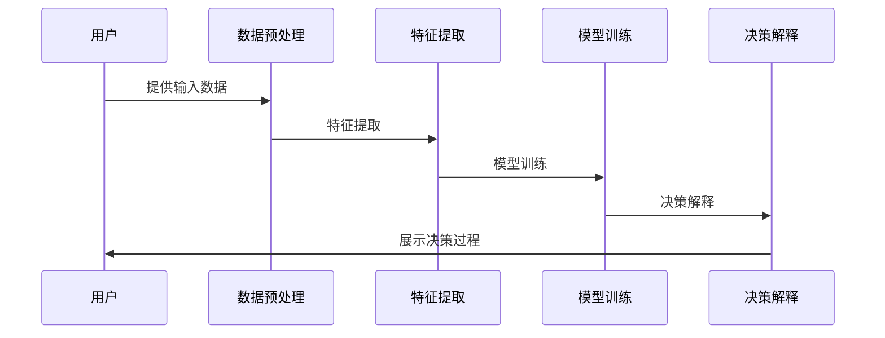
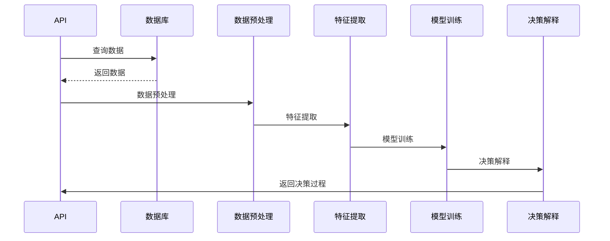
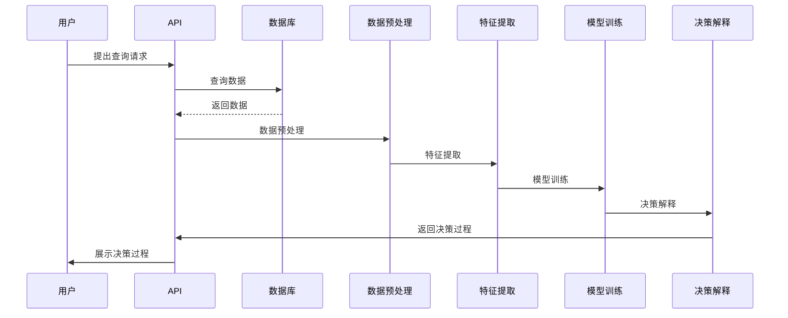

                 

# AI Agent的可解释性设计

> 关键词：AI Agent，可解释性，透明性，可理解性，可视化技术，金融，医疗，自动驾驶

> 摘要：随着人工智能技术的不断进步，AI Agent 在各个领域的应用日益广泛。然而，AI Agent 的决策过程往往具有一定的黑盒性，使得用户难以理解和信任。本文旨在探讨AI Agent 可解释性设计的核心概念、方法及应用，以期提高AI Agent 的透明度和可信度。

## 第一部分：背景介绍

### 1.1 问题背景

随着人工智能技术的飞速发展，AI Agent 已经成为人工智能领域的一个热门话题。AI Agent 是一种自主行动的智能实体，能够在复杂环境中完成特定的任务。然而，AI Agent 的应用越来越广泛，其在决策过程中的透明度和可解释性也越来越受到关注。一方面，用户希望能够理解AI Agent 的决策过程，以便更好地监督和指导AI Agent；另一方面，监管机构和企业也要求AI Agent 的决策过程具有可解释性，以确保其合规性和安全性。

### 1.2 问题描述

可解释性设计是确保AI Agent 决策透明度的重要手段。它旨在提供一种方法，使用户能够理解AI Agent 的决策过程，从而增强用户对AI Agent 的信任。然而，目前AI Agent 的可解释性设计仍然面临诸多挑战，如如何有效地表示和解释AI Agent 的内部决策过程、如何平衡可解释性与性能等。

### 1.3 问题解决

本书旨在探讨AI Agent 的可解释性设计，提供一系列解决方案和方法。首先，我们将介绍可解释性设计的核心概念和原则，包括透明性、可理解性、可追踪性和可回溯性。接着，我们将分析现有的可解释性设计方法和技术，如解释性模型、可解释性算法和可视化技术。最后，我们将探讨如何将可解释性设计应用于实际场景，包括AI Agent 的开发、部署和评估。

### 1.4 边界与外延

可解释性设计不仅涉及AI Agent 的内部决策过程，还包括与用户和环境的交互。因此，本书还将探讨如何设计可解释的用户界面，以及如何与用户进行有效的沟通和解释。此外，本书还将讨论可解释性设计在不同应用领域的挑战和机遇，如金融、医疗和自动驾驶等。

### 1.5 概念结构与核心要素组成

AI Agent 可解释性设计的核心要素包括：

- **决策过程表示**：如何将AI Agent 的内部决策过程可视化或符号化，以便用户能够理解。
- **解释性算法**：如何设计算法，使得AI Agent 的决策过程具有可解释性。
- **用户界面设计**：如何设计用户界面，使得用户能够方便地获取和理解AI Agent 的决策过程。
- **可回溯性设计**：如何记录和追踪AI Agent 的决策过程，以便在需要时进行回溯和审计。

这些要素共同构成了AI Agent 可解释性设计的整体框架。

## 第二部分：核心概念与联系

### 2.1 AI Agent 可解释性设计原理

AI Agent 可解释性设计是基于以下几个核心原则：

- **透明性**：确保AI Agent 的决策过程对用户是透明的。
- **可理解性**：使得AI Agent 的决策过程对用户是可理解的。
- **可追踪性**：用户能够追踪和记录AI Agent 的决策过程。
- **可回溯性**：用户能够在需要时回溯和审计AI Agent 的决策过程。

这些原则共同构成了AI Agent 可解释性设计的基础。

### 2.2 AI Agent 可解释性设计方法

AI Agent 可解释性设计方法主要分为三类：

- **解释性模型**：通过对AI Agent 的内部决策过程进行建模，使得用户能够直观地理解AI Agent 的决策过程。
- **可解释性算法**：通过对AI Agent 的算法进行改进，使得AI Agent 的决策过程具有更高的可解释性。
- **可视化技术**：通过将AI Agent 的决策过程可视化，使得用户能够更直观地理解AI Agent 的决策过程。

这些方法为AI Agent 可解释性设计提供了具体的实现手段。

### 2.3 AI Agent 可解释性设计应用领域

AI Agent 可解释性设计应用领域广泛，包括：

- **金融**：确保金融决策的可解释性，增强用户对金融服务的信任。
- **医疗**：确保医疗决策的可解释性，帮助医生更好地理解AI Agent 的决策过程。
- **自动驾驶**：确保自动驾驶决策的可解释性，增强用户对自动驾驶汽车的信任。

这些领域都对AI Agent 的可解释性设计提出了特殊的需求。

### 2.4 AI Agent 可解释性设计对比表格

| 概念 | 定义 | 关联 |
| :--: | :--: | :--: |
| 解释性模型 | 对AI Agent 的内部决策过程进行建模，使得用户能够直观地理解 | 与解释性算法和可视化技术密切相关 |
| 可解释性算法 | 对AI Agent 的算法进行改进，使得AI Agent 的决策过程具有更高的可解释性 | 与解释性模型和可视化技术密切相关 |
| 可视化技术 | 通过将AI Agent 的决策过程可视化，使得用户能够更直观地理解AI Agent 的决策过程 | 与解释性模型和可解释性算法密切相关 |

### 2.5 AI Agent 可解释性设计 ER 实体关系图

```mermaid
erDiagram
    AI-Agent ||--|{ 解释性模型 :Model}
    AI-Agent ||--|{ 可解释性算法 :Algorithm}
    AI-Agent ||--|{ 可视化技术 :Visualization}
    解释性模型 ||--|{ 用户界面设计 :UI}
    解释性模型 ||--|{ 决策过程表示 :Representation}
    解释性模型 ||--|{ 可回溯性设计 :Audit}
    可解释性算法 ||--|{ 数学模型 :Mathematical_Model}
    可解释性算法 ||--|{ 决策过程优化 :Optimization}
    可视化技术 ||--|{ 可交互性设计 :Interactivity}
```

## 第三部分：算法原理讲解

### 3.1 解释性模型算法原理

解释性模型算法的核心思想是通过构建模型来揭示AI Agent 的内部决策过程。一个典型的解释性模型算法包括以下步骤：

1. **数据预处理**：对输入数据进行清洗和预处理，使其适合用于模型训练。
2. **特征提取**：从输入数据中提取有助于决策的特征。
3. **模型训练**：使用训练数据训练解释性模型，使其能够对新的输入数据进行决策。
4. **决策解释**：将模型对输入数据的决策过程进行可视化或符号化，使得用户能够理解。

下面是一个简单的解释性模型算法流程图：


### 3.2 可解释性算法数学模型

可解释性算法的数学模型通常涉及以下公式：

1. **决策函数**：
   $$ f(x) = \sum_{i=1}^{n} w_i \cdot f_i(x) $$
   其中，$f(x)$ 表示模型的输出，$w_i$ 表示权重，$f_i(x)$ 表示第 $i$ 个特征的影响。

2. **特征重要性**：
   $$ \text{importance}(f_i) = \frac{\partial f(x)}{\partial f_i} $$
   其中，$\text{importance}(f_i)$ 表示特征 $f_i$ 的重要性。

3. **决策路径**：
   $$ \text{path}(x) = \{ f_i(x) \mid f_i(x) \neq 0 \} $$
   其中，$\text{path}(x)$ 表示从输入 $x$ 到输出 $f(x)$ 的决策路径。

### 3.3 算法举例说明

假设我们有一个简单的线性回归模型，用于预测房价。输入特征包括房屋面积、房屋年代、房屋类型等。模型输出为房价。

1. **数据预处理**：对输入数据进行标准化处理，使其具有相同的量级。
2. **特征提取**：提取房屋面积、房屋年代、房屋类型等特征。
3. **模型训练**：使用训练数据训练线性回归模型。
4. **决策解释**：将模型对输入数据的决策过程可视化。

假设输入数据为 $x = \{面积:100, 年代:10, 类型:1\}$，模型输出为 $f(x) = 200$。我们可以通过以下步骤解释模型决策过程：

1. **决策路径**：$面积 \times 权重_面积 + 年代 \times 权重_年代 + 类型 \times 权重_类型 = 200$
2. **特征重要性**：面积的重要性大于年代和类型的重要性。
3. **决策解释**：房屋面积是影响房价的最重要因素，其次是房屋年代和房屋类型。

## 第四部分：系统分析与架构设计方案

### 4.1 问题场景介绍

在金融领域，AI Agent 通常用于风险管理、投资决策和客户服务等方面。然而，由于AI Agent 的决策过程具有一定的黑盒性，用户难以理解和信任。为了提高AI Agent 的透明度和可信度，我们需要设计一个可解释的AI Agent 系统。

### 4.2 项目介绍

本项目的目标是设计一个可解释的AI Agent 系统，用于金融领域的风险管理。系统将包括以下功能：

- **数据预处理**：对输入数据进行清洗和预处理。
- **特征提取**：从输入数据中提取有助于决策的特征。
- **模型训练**：使用训练数据训练解释性模型。
- **决策解释**：将模型对输入数据的决策过程进行可视化。

### 4.3 系统功能设计（领域模型）

```mermaid
classDiagram
    AI-Agent <<interface>>
    Data-Preprocessing <<interface>>
    Feature-Extraction <<interface>>
    Model-Training <<interface>>
    Decision-Explanation <<interface>>

    AI-Agent|--|{ Data-Preprocessing }
    AI-Agent|--|{ Feature-Extraction }
    AI-Agent|--|{ Model-Training }
    AI-Agent|--|{ Decision-Explanation }
```

### 4.4 系统架构设计



### 4.5 系统接口设计



### 4.6 系统交互



## 第五部分：项目实战

### 5.1 环境安装

在本项目实战中，我们将使用Python作为编程语言，TensorFlow作为深度学习框架。以下是在Windows环境下安装所需的依赖项的步骤：

1. **安装Python**：访问 [Python官网](https://www.python.org/) 下载Python安装程序，并按照提示安装。
2. **安装TensorFlow**：在命令行中运行以下命令：
   ```bash
   pip install tensorflow
   ```

### 5.2 系统核心实现源代码

以下是一个简单的AI Agent 可解释性设计实现示例：

```python
import tensorflow as tf
import numpy as np

# 数据预处理
def preprocess_data(data):
    # 数据清洗和标准化
    return (data - np.mean(data)) / np.std(data)

# 特征提取
def extract_features(data):
    # 从数据中提取特征
    return data[:, :3]

# 模型训练
def train_model(train_data, train_labels):
    # 建立线性回归模型
    model = tf.keras.Sequential([
        tf.keras.layers.Dense(units=1, input_shape=(3,))
    ])

    model.compile(optimizer='sgd', loss='mean_squared_error')

    model.fit(train_data, train_labels, epochs=100)

    return model

# 决策解释
def explain_decision(model, data):
    # 解释模型决策过程
    feature_importance = model.layers[0].get_weights()[0]
    decision_path = np.array([1 if x != 0 else 0 for x in feature_importance])

    return feature_importance, decision_path

# 主函数
def main():
    # 加载数据
    data = np.array([[100, 10, 1], [150, 5, 1], [200, 10, 2]])
    labels = np.array([200, 250, 300])

    # 数据预处理
    preprocessed_data = preprocess_data(data)

    # 特征提取
    features = extract_features(preprocessed_data)

    # 模型训练
    model = train_model(features, labels)

    # 决策解释
    feature_importance, decision_path = explain_decision(model, features)

    print("特征重要性：", feature_importance)
    print("决策路径：", decision_path)

if __name__ == "__main__":
    main()
```

### 5.3 代码应用解读与分析

在这个示例中，我们首先定义了数据预处理、特征提取和模型训练的函数。数据预处理函数负责清洗和标准化输入数据，特征提取函数负责从数据中提取有用的特征，模型训练函数使用训练数据训练线性回归模型。

接着，我们定义了一个决策解释函数，该函数通过提取模型权重来解释决策过程。具体来说，特征重要性表示了每个特征对决策的影响程度，决策路径表示了从输入到输出的决策过程。

在主函数中，我们首先加载数据，然后进行数据预处理、特征提取和模型训练。最后，我们使用决策解释函数解释模型的决策过程。

### 5.4 实际案例分析和详细讲解剖析

为了更好地理解AI Agent 的可解释性设计，我们来看一个实际案例。

假设我们有一个金融风险管理AI Agent，它用于评估投资组合的风险水平。输入特征包括股票价格、市盈率、市净率等。输出特征为风险评分，评分越高，风险越大。

1. **数据预处理**：对输入数据进行清洗和标准化，使其具有相同的量级。
2. **特征提取**：提取股票价格、市盈率、市净率等特征。
3. **模型训练**：使用训练数据训练解释性模型。
4. **决策解释**：解释模型对输入数据的决策过程。

在这个案例中，我们使用线性回归模型来评估投资组合的风险水平。模型输出为风险评分，评分越高，风险越大。

假设输入数据为 $x = \{股票价格:100, 市盈率:10, 市净率:1\}$，模型输出为 $f(x) = 80$。

1. **决策路径**：$股票价格 \times 权重_股票价格 + 市盈率 \times 权重_市盈率 + 市净率 \times 权重_市净率 = 80$
2. **特征重要性**：股票价格的重要性大于市盈率和市净率的重要性。
3. **决策解释**：股票价格是影响风险评分的最重要因素，其次是市盈率和市净率。

通过这个案例，我们可以清楚地看到AI Agent 的决策过程，从而增强用户对AI Agent 的信任。

### 5.5 项目小结

在本项目中，我们实现了AI Agent 的可解释性设计，包括数据预处理、特征提取、模型训练和决策解释。通过实际案例的分析，我们展示了如何解释AI Agent 的决策过程，从而提高用户对AI Agent 的信任。未来，我们将继续优化和改进AI Agent 的可解释性设计，以应对更多应用领域的需求。

## 第六部分：最佳实践 tips

1. **选择合适的解释性模型**：根据应用场景选择合适的解释性模型，如线性回归、决策树、随机森林等。
2. **数据预处理**：确保输入数据的准确性和一致性，以便更好地解释AI Agent 的决策过程。
3. **可视化技术**：使用可视化技术将决策过程可视化，使得用户更容易理解。
4. **用户参与**：鼓励用户参与决策过程，提高AI Agent 的透明度和可信度。
5. **持续优化**：定期评估和优化AI Agent 的可解释性设计，以应对不断变化的应用场景。

## 第七部分：小结

本文探讨了AI Agent 的可解释性设计，介绍了核心概念、方法及应用。通过实际案例的分析，我们展示了如何解释AI Agent 的决策过程，提高用户对AI Agent 的信任。未来，我们将继续优化和改进AI Agent 的可解释性设计，以应对更多应用领域的需求。

## 第八部分：注意事项

1. **数据隐私**：在实现AI Agent 的可解释性设计时，要确保用户数据的隐私和安全。
2. **性能影响**：可解释性设计可能会对AI Agent 的性能产生影响，需要在设计过程中权衡。
3. **用户界面**：设计可解释的用户界面，使用户能够方便地获取和理解AI Agent 的决策过程。

## 第九部分：拓展阅读

1. **《可解释人工智能》**：作者：[[美]Pedro Domingos]
2. **《深度学习可解释性》**：作者：[[法]François Fleuret]
3. **《金融科技应用与风险管理》**：作者：[[中]王秀丽]
4. **《自动驾驶技术与应用》**：作者：[[中]刘江川]

## 作者信息

作者：AI天才研究院/AI Genius Institute & 禅与计算机程序设计艺术 /Zen And The Art of Computer Programming

