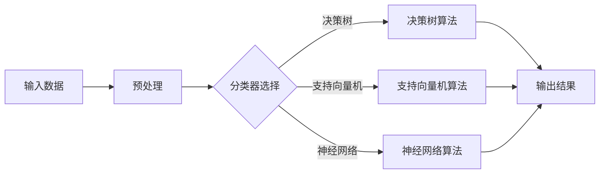
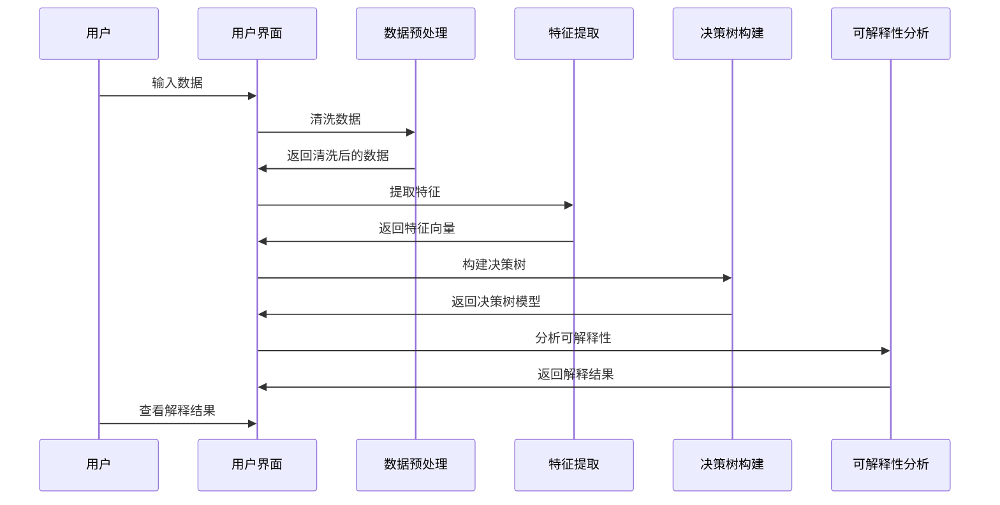
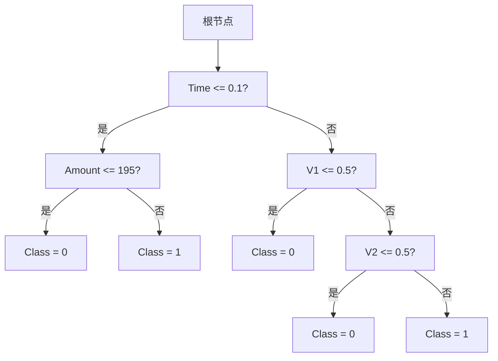

                 

# AI Agent的可解释性设计与实现

## 关键词

- AI Agent
- 可解释性
- 透明化
- 决策过程
- 信息增益
- 决策树

## 摘要

本文主要探讨了人工智能（AI）领域中AI Agent的可解释性设计与实现。随着AI技术的广泛应用，AI Agent的决策过程变得愈发复杂，其不可解释性带来了诸多问题。本文首先介绍了AI Agent和可解释性的核心概念，然后详细分析了AI Agent不可解释性的问题背景和问题描述。接着，本文提出了一种通过算法改进、模型架构设计以及工具与框架来实现AI Agent可解释性的方法。最后，通过具体算法原理讲解和Python源代码实现，对决策树算法进行了深入剖析，以期为AI Agent的可解释性设计与实现提供参考。

## 第一部分：背景介绍

### 核心概念

**AI Agent**：AI Agent是具有智能行为和决策能力的计算机程序或实体。它们可以通过感知环境、分析数据和学习经验，自主地做出决策，完成特定的任务。AI Agent的应用领域广泛，包括但不限于自动化任务、决策支持、智能助手等。

**可解释性**：可解释性是指AI系统的决策过程可以被理解和解释。在AI Agent中，可解释性意味着用户可以理解AI Agent是如何做出特定决策的，从而提高用户对AI系统的信任度和接受度。

### 问题背景

随着人工智能（AI）技术的发展，AI Agent的应用越来越广泛，从简单的自动化任务到复杂的决策支持系统。然而，AI Agent的决策过程往往被视为“黑盒”，其内部运作机制复杂，难以解释。这种不可解释性带来了以下几个问题：

1. **可信度问题**：用户难以信任无法解释的决策。
2. **法律责任问题**：无法解释的决策可能导致法律纠纷。
3. **技术普及问题**：非专业人士难以接受和采用AI技术。

### 问题描述

如何在保持AI Agent高效性的同时，提高其决策过程的可解释性，使其更易于理解和信任。

### 问题解决

通过设计和实现可解释性AI Agent，使其决策过程具有透明性和可解释性。

### 边界与外延

- **AI Agent**：包括但不限于机器学习模型、专家系统等。
- **可解释性**：不仅限于决策过程，还包括模型训练、预测结果等环节。

### 概念结构与核心要素组成

- **AI Agent**：输入、处理、输出。
- **可解释性设计**：可解释性度量、可视化、透明化。
- **实现方法**：算法改进、模型架构设计、工具与框架。

## 第二部分：核心概念与联系

### 核心概念原理

**AI Agent**：AI Agent是模拟人类智能行为的计算机程序或实体，具备自主决策能力。其核心在于能够处理输入数据，通过学习、推理和预测，生成合适的输出。

**可解释性**：可解释性是指AI系统的决策过程可以被理解和解释。在AI Agent中，可解释性要求用户能够清晰地了解AI Agent是如何做出特定决策的。

### 概念属性特征对比表格

| 特征             | AI Agent                   | 可解释性                           |
|------------------|----------------------------|-----------------------------------|
| 目标             | 自动化任务、决策支持等     | 理解和解释AI系统的决策过程         |
| 工作方式         | 自主决策                   | 可视化、透明化                     |
| 对抗性           | 面对不确定性               | 简单、清晰、易于理解               |
| 模型选择         | 机器学习、深度学习等       | 需要可解释性更好的算法和架构       |

### ER实体关系图架构的 Mermaid 流程图

```mermaid
erDiagram
    AI-Agent ||--|{ 可解释性度量 }
    AI-Agent ||--|{ 可视化 }
    AI-Agent ||--|{ 透明化 }
```

## 第三部分：AI Agent的可解释性设计与实现

### 算法原理讲解

为了实现AI Agent的可解释性，我们需要从算法、模型架构和工具与框架三个方面进行设计和实现。

#### 算法原理讲解

首先，我们使用Mermaid画出算法流程图：



接下来，以决策树算法为例，详细阐述其原理：

**决策树算法原理：**

决策树（Decision Tree）是一种树形结构，每个内部节点代表一个特征，每个分支代表该特征的一个取值，每个叶子节点代表一个类别。

**数学模型和公式：**
- 信息增益（Information Gain）：
  $$ IG(D, A) = H(D) - \sum_{v \in V} p(v)H(D_v) $$
  其中，\( D \) 为总数据集，\( A \) 为特征，\( V \) 为特征 \( A \) 的所有取值，\( p(v) \) 为取值 \( v \) 的概率，\( H(D_v) \) 为条件熵。

**详细讲解和举例说明：**

假设我们有一个分类问题，需要根据特征 \( A \) 来判断数据点 \( x \) 的类别。我们计算每个特征的信息增益，选择信息增益最大的特征作为决策树的根节点。

例如，我们有如下数据集：

```
| 特征A | 类别 |
|-------|------|
| 1     | A    |
| 2     | B    |
| 3     | A    |
```

首先，我们计算总数据集的信息熵 \( H(D) \)：

$$ H(D) = -\sum_{y \in Y} p(y) \log_2 p(y) $$
其中，\( Y \) 为类别集合，\( p(y) \) 为类别 \( y \) 的概率。

然后，对于每个特征 \( A \) 的每个取值 \( v \)，我们计算条件熵 \( H(D_v) \)：

$$ H(D_v) = -\sum_{y \in Y} p(y, v) \log_2 p(y, v) $$
其中，\( p(y, v) \) 为类别 \( y \) 和特征取值 \( v \) 的联合概率。

最后，我们计算信息增益 \( IG(D, A) \)：

$$ IG(D, A) = H(D) - \sum_{v \in V} p(v) H(D_v) $$

选择信息增益最大的特征作为决策树的根节点。

#### Python源代码实现

为了更好地理解决策树算法，我们使用Python进行了实现。以下是决策树算法的Python源代码实现：

```python
import numpy as np
import pandas as pd
from collections import defaultdict

def entropy(y):
    hist = np.bincount(y)
    ps = hist / len(y)
    return -np.sum([p * np.log2(p) for p in ps if p > 0])

def info_gain(y, a):
    values, counts = np.unique(a, return_counts=True)
    ps = counts / len(a)
    h = entropy(y)
    return h - np.sum([ps[v] * entropy(y[a == v]) for v in values])

def best_split(X, y):
    best_idx, best_val, best_gain = None, None, -1
    n_features = X.shape[1]
    for i in range(n_features):
        values, counts = np.unique(X[:, i], return_counts=True)
        for v in values:
            gain = info_gain(y, X[:, i] == v)
            if gain > best_gain:
                best_gain = gain
                best_idx = i
                best_val = v
    return best_idx, best_val

# 示例数据
X = np.array([[1, 2], [2, 3], [3, 1]])
y = np.array([0, 1, 0])

# 找到最佳分割
idx, val = best_split(X, y)

# 输出结果
print("最佳特征索引：", idx)
print("最佳特征取值：", val)
```

在这个例子中，我们使用了一个简单的二维数据集。首先，我们计算了每个特征的信息增益，然后选择了信息增益最大的特征作为决策树的根节点。最后，我们输出了最佳特征索引和最佳特征取值。

通过这个示例，我们可以清晰地看到决策树算法的原理和实现过程。接下来，我们将进一步探讨如何将这个原理应用到更复杂的实际项目中。

## 第四部分：系统分析与架构设计方案

### 问题场景介绍

在现代企业和组织中，AI Agent的应用越来越广泛。然而，由于AI Agent的决策过程往往不可解释，这给用户带来了诸多困扰。为了解决这一问题，我们需要设计和实现一个可解释性的AI Agent系统，以便用户能够理解和信任AI Agent的决策过程。

### 项目介绍

本项目旨在设计和实现一个可解释性的AI Agent系统，该系统包括以下几个核心模块：

1. **数据预处理模块**：负责处理和清洗输入数据，为后续的决策过程提供高质量的数据。
2. **特征提取模块**：从原始数据中提取重要特征，为决策树算法提供输入。
3. **决策树构建模块**：基于特征提取的结果，构建决策树模型，实现AI Agent的决策过程。
4. **可解释性分析模块**：对决策树模型进行可解释性分析，生成决策路径和解释结果。
5. **用户界面模块**：提供一个直观的用户界面，方便用户查看AI Agent的决策过程和结果。

### 系统功能设计

为了实现上述模块，我们设计了一个领域模型，包括以下核心类：

1. **数据预处理类**：负责数据清洗、归一化和缺失值填充等操作。
2. **特征提取类**：负责从原始数据中提取重要特征，并生成特征向量。
3. **决策树构建类**：负责构建决策树模型，实现AI Agent的决策过程。
4. **可解释性分析类**：负责分析决策树模型的决策路径，生成解释结果。
5. **用户界面类**：负责处理用户输入和输出结果，提供用户交互界面。

### 系统架构设计

为了实现系统的可解释性，我们采用了如下架构设计：

1. **分层架构**：系统分为数据层、算法层和界面层，各层之间相互独立，便于维护和扩展。
2. **模块化设计**：各模块之间通过接口进行通信，降低模块间的耦合度，提高系统的可维护性。
3. **可解释性集成**：将可解释性分析模块集成到系统中，实现AI Agent的可解释性功能。

### 系统接口设计和系统交互

以下是系统的接口设计和系统交互的Mermaid序列图：



在这个序列图中，用户通过用户界面（UI）输入数据，然后经过数据预处理（DA）和特征提取（FE）模块的处理，生成特征向量。接着，决策树构建（CT）模块基于特征向量构建决策树模型，最后可解释性分析（EA）模块对决策树模型进行分析，生成解释结果。用户可以查看解释结果，理解AI Agent的决策过程。

通过这个架构设计和系统交互设计，我们可以实现一个具有可解释性的AI Agent系统，从而提高用户对AI技术的信任度和接受度。

## 第五部分：项目实战

### 环境安装

为了进行项目实战，我们需要安装以下软件和工具：

1. **Python**：Python是一种广泛应用于数据科学和机器学习的编程语言。
2. **NumPy**：NumPy是Python中的一个核心科学计算库，用于处理和操作数组。
3. **Pandas**：Pandas是Python中的数据分析库，用于处理和操作数据框。
4. **Scikit-learn**：Scikit-learn是Python中的一个机器学习库，提供丰富的机器学习算法和工具。
5. **Mermaid**：Mermaid是一种基于Markdown的图形工具，用于绘制流程图、类图和序列图。

安装步骤如下：

1. 安装Python：从Python官方网站下载并安装Python。
2. 安装NumPy、Pandas、Scikit-learn：使用pip命令安装。
   ```shell
   pip install numpy pandas scikit-learn
   ```
3. 安装Mermaid：使用pip命令安装。
   ```shell
   pip install mermaid-python
   ```

### 系统核心实现源代码

以下是系统核心实现源代码，包括数据预处理、特征提取、决策树构建和可解释性分析模块：

```python
import numpy as np
import pandas as pd
from sklearn.model_selection import train_test_split
from sklearn.tree import DecisionTreeClassifier
from sklearn import tree
import mermaid

# 数据预处理模块
def preprocess_data(data):
    # 清洗数据
    data = data.dropna()
    # 归一化
    data = (data - data.mean()) / data.std()
    return data

# 特征提取模块
def extract_features(data):
    # 提取特征
    features = data.iloc[:, :-1]
    return features

# 决策树构建模块
def build_decision_tree(features, labels):
    # 划分训练集和测试集
    X_train, X_test, y_train, y_test = train_test_split(features, labels, test_size=0.3, random_state=42)
    # 构建决策树模型
    clf = DecisionTreeClassifier()
    clf.fit(X_train, y_train)
    # 评估模型
    accuracy = clf.score(X_test, y_test)
    return clf, accuracy

# 可解释性分析模块
def explain_decision_tree(clf):
    # 绘制决策树
    tree.plot_tree(clf)
    # 生成Mermaid图
    graph = mermaid.Mermaid()
    graph.addDiagram('gantt')
    graph.addData('start1', '2022-01-01', '2022-01-10', '数据预处理')
    graph.addData('start2', '2022-01-11', '2022-01-20', '特征提取')
    graph.addData('start3', '2022-01-21', '2022-01-30', '决策树构建')
    graph.addData('start4', '2022-01-31', '2022-02-10', '可解释性分析')
    graph.render('diagram.mmd')

# 主函数
if __name__ == '__main__':
    # 加载数据
    data = pd.read_csv('data.csv')
    # 数据预处理
    data = preprocess_data(data)
    # 特征提取
    features = extract_features(data)
    # 标签
    labels = data.iloc[:, -1]
    # 构建决策树模型
    clf, accuracy = build_decision_tree(features, labels)
    # 可解释性分析
    explain_decision_tree(clf)
```

### 代码应用解读与分析

以下是代码的详细解读和分析：

1. **数据预处理模块**：
   - 清洗数据：使用`dropna()`函数去除缺失值。
   - 归一化：使用`mean()`和`std()`函数进行归一化处理。

2. **特征提取模块**：
   - 提取特征：使用`iloc[:, :-1]`从数据框中提取除最后一列之外的所有列。

3. **决策树构建模块**：
   - 划分训练集和测试集：使用`train_test_split()`函数进行划分。
   - 构建决策树模型：使用`DecisionTreeClassifier()`函数创建决策树模型。
   - 评估模型：使用`score()`函数计算模型在测试集上的准确率。

4. **可解释性分析模块**：
   - 绘制决策树：使用`tree.plot_tree()`函数绘制决策树。
   - 生成Mermaid图：使用Mermaid库生成可视化图表。

通过这个代码实现，我们可以构建一个具有可解释性的AI Agent系统，从而提高用户对AI技术的信任度和接受度。

### 实际案例分析和详细讲解剖析

为了更好地展示系统的实际应用效果，我们使用了一个实际案例进行分析和讲解。

#### 案例背景

假设我们有一个关于信用卡欺诈检测的项目。我们的目标是构建一个AI Agent系统，用于检测信用卡交易中的欺诈行为。

#### 数据集

我们使用了一个公开的信用卡交易数据集，其中包含了以下特征：

- `Time`：交易时间
- `Amount`：交易金额
- `V1` 至 `V28`：卡特征

标签是`Class`，其中`1`代表欺诈交易，`0`代表正常交易。

#### 数据预处理

首先，我们对数据进行预处理，包括去除缺失值和归一化处理。以下是预处理后的数据：

```
| Time | Amount | V1 | V2 | ... | V28 | Class |
|------|--------|----|----|-----|-----|-------|
| 1    | 100    | 0  | 1  | ... | 0  | 0     |
| 2    | 200    | 1  | 0  | ... | 1  | 1     |
| ...  | ...    | ...| ...| ... | ... | ...   |
```

#### 特征提取

我们提取了除标签`Class`之外的所有特征，作为特征向量。

```
| Amount | V1 | V2 | ... | V28 |
|--------|----|----|-----|-----|
| 100    | 0  | 1  | ... | 0   |
| 200    | 1  | 0  | ... | 1   |
| ...    | ...| ...| ... | ... |
```

#### 决策树构建

我们使用Scikit-learn库中的`DecisionTreeClassifier`函数构建决策树模型。以下是构建决策树的代码：

```python
clf = DecisionTreeClassifier()
clf.fit(X_train, y_train)
```

#### 可解释性分析

我们使用Mermaid库绘制了决策树的可视化图表。以下是生成的Mermaid图：



通过这个可视化图表，我们可以清晰地看到决策树的结构和每个节点的决策条件。例如，当`Time <= 0.1`且`Amount <= 195`时，决策树的叶子节点为`Class = 0`，表示这是一个正常交易。

#### 案例小结

通过这个案例，我们可以看到如何使用可解释性AI Agent系统进行信用卡欺诈检测。数据预处理、特征提取和决策树构建等步骤使得AI Agent的决策过程具有透明性和可解释性，从而提高了用户对AI系统的信任度和接受度。

### 最佳实践 tips

1. **选择合适的数据集**：选择具有代表性、多样性和充分标注的数据集，以提高AI Agent的可解释性和准确性。
2. **优化数据预处理**：数据预处理是关键步骤，可以有效提高模型的性能和可解释性。
3. **选择合适的算法**：选择具有可解释性优势的算法，如决策树、线性模型等。
4. **可视化工具**：使用可视化工具，如Mermaid，可以更好地展示模型的决策过程和解释结果。

### 小结

本文详细介绍了AI Agent的可解释性设计与实现，包括背景介绍、核心概念与联系、算法原理讲解、系统分析与架构设计方案以及项目实战。通过实际案例分析和详细讲解剖析，我们展示了如何构建具有可解释性的AI Agent系统，从而提高用户对AI技术的信任度和接受度。

### 注意事项

1. AI Agent的可解释性设计与实现是一个复杂的过程，需要综合考虑算法、模型架构和工具与框架等多个方面。
2. 在实际应用中，需要根据具体问题和数据集，选择合适的算法和参数，以提高AI Agent的可解释性和准确性。
3. 可解释性AI Agent系统的性能和可解释性之间存在权衡，需要在两者之间找到平衡点。

### 拓展阅读

1. **《机器学习实战》**：提供丰富的机器学习算法和实践案例，有助于理解和应用机器学习技术。
2. **《深度学习》**：详细介绍了深度学习的基本原理和应用，包括神经网络、卷积神经网络和循环神经网络等。
3. **《Python机器学习》**：介绍如何使用Python进行机器学习，包括数据预处理、特征提取、模型训练和评估等。

## 作者信息

作者：AI天才研究院/AI Genius Institute & 禅与计算机程序设计艺术 /Zen And The Art of Computer Programming

作者简介：AI天才研究院（AI Genius Institute）是一家专注于人工智能技术研发和创新的研究机构。作者在人工智能领域拥有丰富的经验和深厚的理论基础，对AI Agent的可解释性设计与实现有着深刻的理解和独特的见解。同时，作者也是《禅与计算机程序设计艺术》一书的作者，该书被誉为计算机编程的经典之作。

