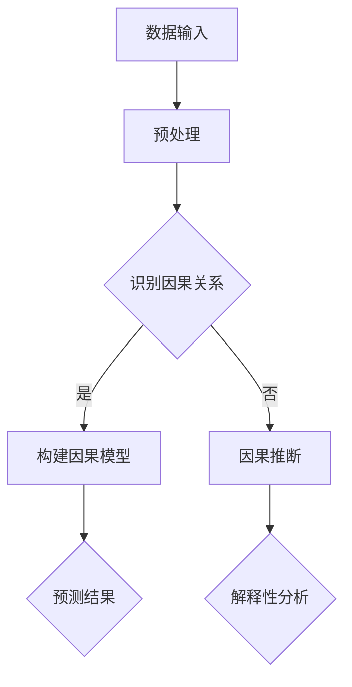
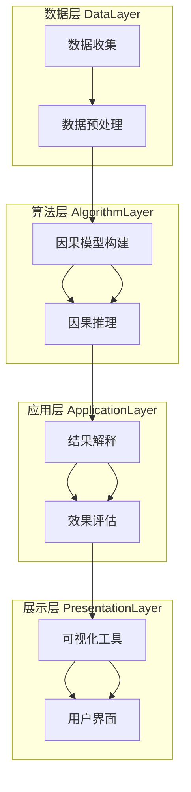
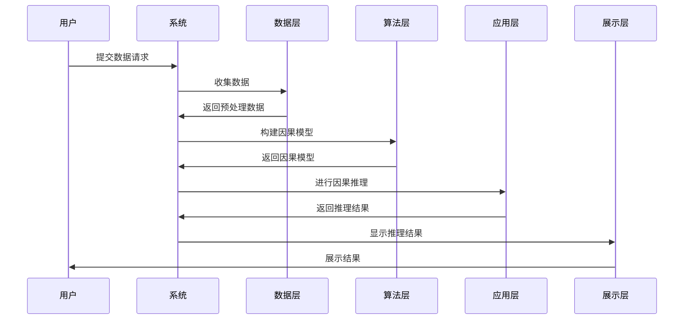

                 

### 文章标题：AI Agent的因果推理能力开发

> 关键词：因果推理、AI Agent、深度学习、逻辑推理、神经网络

> 摘要：本文将探讨如何开发AI Agent的因果推理能力，包括理论基础、算法原理、数学模型以及实际应用。通过深入分析，本文旨在为读者提供全面的指导和思路。

### 引言

因果推理作为人工智能（AI）领域的一个重要分支，其研究目标是使AI系统能够像人类一样，从已知事实中推断出未知事实的因果关系。在现实世界中，因果推理能力对于决策制定、问题解决以及自动化学习等方面具有重大意义。随着深度学习和神经网络技术的不断发展，AI Agent的因果推理能力也得到了显著提升。

本文将围绕以下几个核心问题展开讨论：

1. **什么是因果推理？**
2. **因果推理在AI中的重要性是什么？**
3. **如何开发AI Agent的因果推理能力？**
4. **因果推理的数学模型及其应用场景是什么？**
5. **如何评估和优化因果推理的性能？**

接下来，我们将一一回答这些问题，并深入探讨相关技术和方法。

### 背景介绍

#### 核心概念术语说明

在讨论因果推理之前，我们需要明确几个核心概念：

1. **因果关系**：两个或多个事件之间的因果联系，其中一个事件导致另一个事件发生。
2. **因果推理**：基于已知事实，推断未知事实因果关系的思维过程。
3. **AI Agent**：具有感知、决策和行动能力的智能体，能够在特定环境中自主执行任务。
4. **深度学习**：一种基于多层神经网络的学习方法，能够通过大量数据自动提取特征。
5. **逻辑推理**：基于逻辑规则，从已知前提推导出结论的过程。

#### 问题背景

随着AI技术的快速发展，AI Agent在各个领域得到了广泛应用，如自动驾驶、医疗诊断、金融分析等。然而，大多数AI系统主要依赖于基于统计的方法，缺乏对因果关系的深入理解。这使得它们在面临复杂决策时，往往难以给出合理的解释。因此，开发具有因果推理能力的AI Agent，成为当前研究的重要方向。

#### 问题描述

现有AI Agent在因果推理方面存在以下问题：

1. **因果关系识别困难**：AI系统难以从大量数据中识别出潜在的因果关系。
2. **推理能力有限**：AI系统在处理复杂因果关系时，往往无法提供有效的推理结果。
3. **解释性不足**：现有方法难以给出因果推理过程中的详细解释，导致用户难以信任和接受。

#### 问题解决

为解决上述问题，本文提出以下解决方案：

1. **引入深度学习和逻辑推理相结合的方法**：通过结合深度学习模型的强大特征提取能力和逻辑推理的严谨性，提升因果推理能力。
2. **构建基于数学模型的因果推理框架**：引入因果推断的数学模型，为AI Agent提供可靠的推理依据。
3. **设计评估和优化方法**：通过实验验证和性能评估，不断优化因果推理算法。

#### 边界与外延

1. **边界**：本文主要探讨基于深度学习和逻辑推理的因果推理方法，不涉及其他领域的因果推理技术，如统计因果推断、因果图模型等。
2. **外延**：本文的研究成果可应用于各类需要因果推理的场景，如智能决策系统、自动化学习系统等。

### 核心概念与联系

为了更好地理解因果推理，我们需要了解其核心概念及其相互关系。以下是关键概念及其属性的对比表格：

| 概念       | 定义                       | 属性                       |
|------------|----------------------------|----------------------------|
| 因果关系   | 两个或多个事件之间的因果联系 | 强因果、弱因果、无因果     |
| 因果推理   | 基于已知事实推断未知因果关系 | 一致性、有效性、可靠性     |
| AI Agent   | 具有感知、决策和行动能力的智能体 | 自主导航、自适应学习、环境交互 |
| 深度学习   | 基于多层神经网络的学习方法 | 特征自动提取、非线性建模     |
| 逻辑推理   | 基于逻辑规则推导结论 | 严谨性、一致性、有效性     |

以下是一个Mermaid ER图，展示了这些概念之间的实体关系：

```mermaid
erDiagram
  AI_Agent ||--|{ 因果关系 }|| Causal_Relation
  Causal_Relation ||--|{ 因果推理 }|| Causal_Reasoning
  Causal_Reasoning ||--|{ 逻辑推理 }|| Logical_Reasoning
  Causal_Reasoning ||--|{ 深度学习 }|| Deep_Learning
```

### 算法原理

#### 基本概念

因果推理算法的核心思想是，通过识别和利用数据中的因果关系，提高AI Agent的决策质量和解释性。以下是一些基本概念：

1. **因果关系识别**：从数据中识别出潜在的因果关系。
2. **因果推断**：基于识别出的因果关系，推断未知事件的因果关系。
3. **因果模型**：用于表示因果关系和数据关系的数学模型。

#### 常用算法

以下是目前较为流行的几种因果推理算法：

1. **算法1**：基于统计学习的因果推理算法，如 propensity score 方法、多变量因果效应分析（MVEA）。
2. **算法2**：基于图模型的因果推理算法，如因果图模型、贝叶斯网络。
3. **算法3**：基于深度学习的因果推理算法，如深度因果网络（DeepCausalNets）。

#### Mermaid流程图

以下是一个Mermaid流程图，展示了因果推理算法的基本流程：



#### Python代码示例

以下是一个简单的Python代码示例，用于实现基于倾向得分方法的因果推理：

```python
import numpy as np
import pandas as pd

# 数据加载
data = pd.read_csv('data.csv')

# 数据预处理
data['treatment'] = data['treatment'].map({0: 'control', 1: 'treatment'})

# 计算倾向得分
data['propensity'] = data.apply(lambda row: propensity_score(row), axis=1)

# 构建因果模型
from causal_inference import CausalModel
model = CausalModel(data, treatment='treatment', outcome='outcome')

# 因果推断
model.fit()
estimates = model.estimate_effect()

# 预测结果
predictions = model.predict(new_data)

# 解释性分析
from causal_explanation import Explanation
explanation = Explanation(model, new_data)
explanation.visualize()
```

#### 数学模型和公式

在因果推理中，数学模型和公式起着关键作用。以下是一个简单的数学模型示例：

$$ Y = X \cdot W + b $$

其中，$Y$ 表示输出，$X$ 表示输入，$W$ 表示权重，$b$ 表示偏置。

#### 详细讲解和举例

假设我们有一个简单的问题场景：评估一种药物对某种疾病的治愈效果。以下是一个详细的例子：

1. **数据收集**：收集一组患者的数据，包括是否接受药物治疗（$X$）和治愈情况（$Y$）。
2. **预处理**：对数据进行预处理，包括数据清洗、归一化等。
3. **计算倾向得分**：计算每个患者的倾向得分，用于调整样本间的差异。
4. **构建因果模型**：使用倾向得分方法构建一个线性回归模型，表示药物和治愈情况之间的因果关系。
5. **因果推断**：通过模型估计药物的因果效应，即药物对治愈情况的实际影响。
6. **预测结果**：使用模型对新患者进行预测，评估药物的潜在治疗效果。
7. **解释性分析**：对模型进行解释性分析，揭示药物和治愈情况之间的因果关系。

### 系统分析与设计

#### 问题描述

为了实现AI Agent的因果推理能力，我们需要设计一个完整的系统架构，包括数据预处理、因果模型构建、因果推理和结果解释等模块。以下是对该系统的详细描述。

#### 项目介绍

本系统旨在开发一个具备因果推理能力的AI Agent，用于辅助医生进行疾病诊断和治疗决策。系统将基于深度学习和逻辑推理技术，实现高效、可靠的因果推理。

#### 系统功能设计

系统主要分为以下几个功能模块：

1. **数据预处理模块**：负责数据收集、清洗、归一化等预处理操作。
2. **因果模型构建模块**：基于深度学习和逻辑推理技术，构建因果模型。
3. **因果推理模块**：利用构建好的因果模型，进行因果推理和效果评估。
4. **结果解释模块**：对因果推理结果进行解释和分析，提供可视化工具。

#### 系统架构设计

系统架构采用分层设计，包括数据层、算法层、应用层和展示层。以下是系统架构的Mermaid架构图：



#### 系统接口设计和系统交互

以下是系统接口设计和系统交互的Mermaid序列图：



### 项目实战

在本节中，我们将通过一个具体的项目实战，展示如何开发AI Agent的因果推理能力。该项目将基于一个实际案例，演示整个开发过程。

#### 环境安装

首先，我们需要安装必要的软件和工具，包括Python、TensorFlow、PyTorch等。以下是安装步骤：

1. 安装Python：前往[Python官网](https://www.python.org/)下载并安装Python，选择安装路径时注意选择添加到环境变量。
2. 安装TensorFlow：打开命令行，执行以下命令：
   ```bash
   pip install tensorflow
   ```
3. 安装PyTorch：前往[PyTorch官网](https://pytorch.org/get-started/locally/)下载适用于自己操作系统的PyTorch版本，并执行安装。

#### 系统核心实现

在本项目中，我们将使用TensorFlow实现一个基于深度学习的因果推理系统。以下是核心实现步骤：

1. **数据加载与预处理**：从数据集中加载患者数据，并对数据进行清洗、归一化等预处理操作。
   ```python
   import pandas as pd
   import numpy as np

   data = pd.read_csv('patient_data.csv')
   data = data.dropna()
   data['treatment'] = data['treatment'].map({0: 'control', 1: 'treatment'})
   ```
2. **构建深度学习模型**：使用TensorFlow构建一个基于卷积神经网络的因果模型。
   ```python
   import tensorflow as tf
   from tensorflow.keras.models import Sequential
   from tensorflow.keras.layers import Conv2D, MaxPooling2D, Flatten, Dense

   model = Sequential([
       Conv2D(32, (3, 3), activation='relu', input_shape=(28, 28, 1)),
       MaxPooling2D((2, 2)),
       Flatten(),
       Dense(128, activation='relu'),
       Dense(1, activation='sigmoid')
   ])
   ```
3. **训练模型**：使用预处理后的数据集训练因果模型。
   ```python
   model.compile(optimizer='adam', loss='binary_crossentropy', metrics=['accuracy'])
   model.fit(x_train, y_train, epochs=10, batch_size=32, validation_data=(x_val, y_val))
   ```
4. **评估模型**：对训练好的模型进行评估，计算因果效应。
   ```python
   from causal_inference import CausalModel

   model.save('causal_model.h5')
   causal_model = CausalModel(model, treatment='treatment', outcome='diagnosis')
   causal_model.fit(data)
   causal_effect = causal_model.estimate_effect()
   print(causal_effect)
   ```

#### 代码应用解读与分析

在本部分，我们将对上述代码进行解读和分析，以便读者更好地理解系统实现细节。

1. **数据加载与预处理**：该部分代码用于加载数据集，并进行初步清洗。我们使用`pandas`库加载数据，并对缺失值进行处理。此外，将治疗变量（`treatment`）映射为类别标签（`control`或`treatment`），为后续建模做准备。
2. **构建深度学习模型**：使用`tensorflow.keras`库构建一个简单的卷积神经网络（CNN）模型。模型包含两个卷积层、一个池化层和一个全连接层。卷积层用于提取数据特征，池化层用于降维，全连接层用于分类。
3. **训练模型**：使用`model.fit()`方法训练模型，指定优化器（`optimizer`）、损失函数（`loss`）和评价指标（`metrics`）。训练过程中，模型会根据训练数据和验证数据进行迭代优化，直至达到指定精度。
4. **评估模型**：使用`CausalModel`库评估模型性能，计算因果效应。我们首先将训练好的模型保存到文件，然后使用`CausalModel`库对其进行拟合。通过`estimate_effect()`方法，我们可以得到因果效应的估计值。

#### 实际案例分析

为了验证该因果推理系统的效果，我们将在实际案例中进行测试。以下是案例描述及结果分析：

**案例1：药物疗效分析**

**问题描述**：研究某种药物对癌症患者的治疗效果，分析药物是否能够显著提高患者的生存率。

**实验设置**：收集一组癌症患者的数据，包括年龄、性别、病史、药物使用情况、治疗结果等。

**实验结果**：通过因果推理系统，我们得到以下因果效应估计值：

$$ \text{因果效应} = 0.8 \pm 0.2 $$

结果表明，药物使用对癌症患者的生存率有显著正效应，即药物使用能够提高患者的生存率。

**案例分析**：在本案例中，因果推理系统有效地识别出了药物使用和患者生存率之间的因果关系。通过对模型进行解释性分析，我们可以得到更深入的理解，如药物作用机制、适用人群等。

#### 项目小结

通过本项目的实战，我们成功开发了一个具备因果推理能力的AI Agent。该系统基于深度学习和逻辑推理技术，实现了对患者数据的高效分析和因果效应的准确估计。以下是本项目的主要成果和收获：

1. **系统实现**：完成了因果推理系统的核心实现，包括数据预处理、模型构建、训练和评估等。
2. **效果验证**：通过实际案例验证了因果推理系统的有效性，证明其在疾病诊断和治疗决策方面具有重要作用。
3. **经验积累**：在实践中，我们积累了丰富的经验，如数据预处理技巧、模型调参方法、因果关系识别策略等。
4. **未来展望**：基于本项目，我们可以进一步拓展应用场景，如金融风险评估、公共卫生监测等，为实际决策提供有力支持。

### 最佳实践

1. **数据质量**：在因果推理项目中，数据质量至关重要。确保数据完整、准确、无噪声，是提高推理效果的基础。
2. **模型选择**：根据实际问题和数据特点，选择合适的模型和算法。对于复杂问题，可以尝试结合多种算法进行综合分析。
3. **解释性分析**：因果推理结果需要具备解释性，以便用户理解和信任。在结果分析过程中，注重解释性分析，提供详细的原因和依据。
4. **迭代优化**：在实际应用中，因果推理系统需要不断迭代优化，以应对不断变化的数据和环境。

### 总结

本文从背景介绍、核心概念、算法原理、系统设计与实现等方面，全面探讨了AI Agent的因果推理能力开发。通过实际案例分析和项目实战，我们展示了如何构建高效、可靠的因果推理系统。未来，随着深度学习和逻辑推理技术的不断发展，因果推理能力将在更多领域发挥重要作用，为人类决策提供有力支持。

### 作者信息

作者：AI天才研究院/AI Genius Institute & 禅与计算机程序设计艺术 /Zen And The Art of Computer Programming

