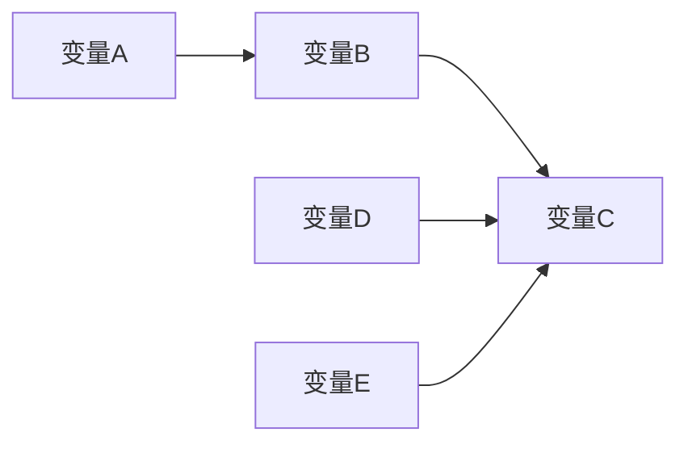
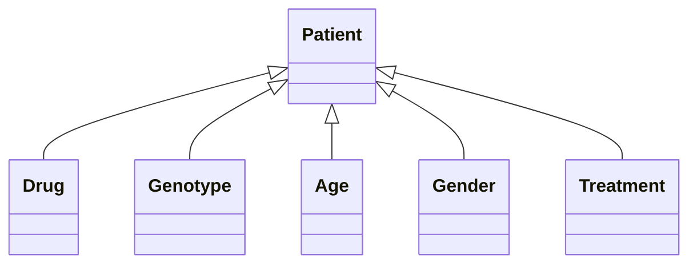
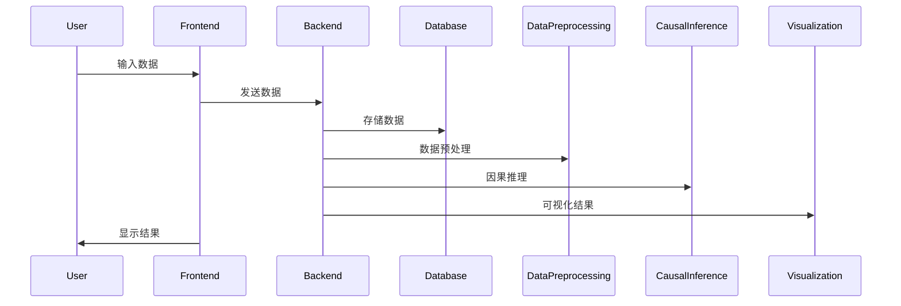
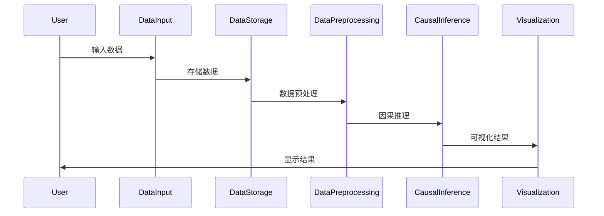
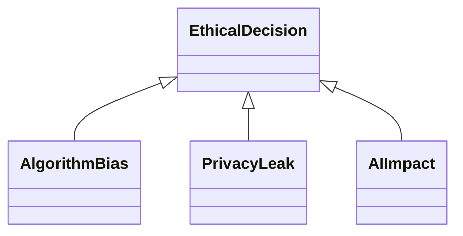

                 

# AI Agent的因果推理能力构建

## 关键词
- AI代理
- 因果推理
- 因果模型
- 数据分析
- 算法优化

## 摘要
本文旨在探讨AI代理在因果推理能力构建方面的技术原理和实践方法。我们将从问题背景、基础概念、高级技术、应用实例和未来展望五个部分展开讨论，涵盖核心概念、算法原理、算法优化、系统设计与实战应用，以及最佳实践和未来发展方向。通过本文，读者可以全面了解AI代理因果推理能力的构建方法，为未来的研究和应用提供指导。

## 第一部分：引言

### 1.1 问题背景

#### 问题背景

在当今的信息时代，人工智能（AI）技术正在各个领域发挥越来越重要的作用。其中，AI代理作为一种能够自主决策和执行的智能体，越来越受到关注。然而，AI代理在决策过程中往往需要依赖因果关系来理解和预测现实世界。因此，构建AI代理的因果推理能力成为了一个重要的研究方向。

#### 问题解决

尽管目前已有许多AI技术，如机器学习、深度学习等，可以在一定程度上模拟人类的推理过程，但它们在处理因果关系方面仍存在诸多局限。例如，传统的机器学习算法主要基于统计方法，难以直接揭示变量之间的因果关系；而深度学习模型则往往被视为“黑箱”，难以解释其决策过程。因此，如何构建具有强因果推理能力的AI代理，成为了当前研究的热点和难点。

#### 边界与外延

因果推理在AI中的应用范围广泛，包括医疗诊断、金融风险评估、智能推荐系统等领域。然而，在实际应用中，因果推理面临着数据质量、算法效率、逻辑推理能力等多方面的挑战。因此，构建AI代理的因果推理能力需要综合考虑这些因素，确保其在各种应用场景中的有效性和可靠性。

#### 核心要素组成

构建AI代理的因果推理能力涉及多个关键要素，包括：

1. **数据质量**：因果推理依赖于高质量的数据，数据的质量直接影响推理结果的准确性。
2. **算法效率**：因果推理算法需要高效地处理大量数据，提高算法的执行效率是关键。
3. **逻辑推理能力**：AI代理需要具备强大的逻辑推理能力，能够从数据中提取出有效的因果关系。
4. **可解释性**：因果推理结果需要具备可解释性，以便用户理解和信任AI代理的决策过程。

### 1.2 核心概念与联系

#### 核心概念原理

1. **因果推理**：因果推理是指通过分析变量之间的因果关系，预测未来事件或解释现有现象的过程。
2. **因果模型**：因果模型是用于描述变量之间因果关系的数学模型，常见的因果模型包括结构因果模型（Structural Causal Models，SCM）和潜在结果模型（Potential Outcomes Model）。
3. **因果推断**：因果推断是从数据中推断变量之间因果关系的统计学方法，常见的因果推断方法包括匹配方法、工具变量法和双重差分法等。

#### 概念属性特征对比表格

| 概念       | 属性特征                    | 对比关系                |
| ---------- | --------------------------- | ----------------------- |
| 因果推理   | 描述变量之间的因果关系     | 提取因果关系，预测未来  |
| 因果模型   | 描述变量之间的数学关系     | 构建因果关系的框架      |
| 因果推断   | 从数据中推断因果关系       | 统计方法，提高准确性    |

#### ER实体关系图架构

```mermaid
erDiagram
  Person ||--|{ Order } : makes
  Product ||--|{ Order } : contains
```

在上面的ER实体关系图中，Person（人）和Product（产品）是实体，Order（订单）是关系实体，Person通过makes关系与Order关联，Product通过contains关系与Order关联。

### 1.3 文章结构与内容

本文将分为五个部分，具体内容如下：

1. **引言**：介绍AI代理因果推理能力的重要性、问题背景和核心概念。
2. **基础概念**：讲解因果推理的基本原理、类型和算法。
3. **高级技术**：探讨因果推理算法的优化、可解释性和复杂场景下的应用。
4. **应用实例**：分析因果推理在医疗、金融和人工智能伦理领域的应用。
5. **最佳实践与展望**：总结最佳实践，提出未来发展方向。

### 1.4 目标与意义

本文的目标是：

1. **了解因果推理的基本原理和算法**：通过本文，读者可以掌握因果推理的基本概念和常用算法，为后续研究和应用打下基础。
2. **掌握构建AI代理因果推理能力的方法**：本文将详细介绍如何构建具有因果推理能力的AI代理，为实际应用提供参考。
3. **探讨因果推理在各个领域的应用**：通过分析因果推理在医疗、金融和人工智能伦理等领域的应用，读者可以了解因果推理在不同场景下的实际效果。

本文的意义在于：

1. **推动因果推理技术的发展**：本文将介绍最新的因果推理技术，为因果推理领域的进一步研究提供参考。
2. **促进AI代理的应用**：通过构建具有因果推理能力的AI代理，可以提高智能系统的决策能力和可靠性，推动AI代理在各个领域的应用。
3. **提升人工智能的伦理水平**：因果推理在人工智能伦理决策中的应用，有助于提升AI系统的透明度和可解释性，增强公众对AI技术的信任。

## 第二部分：基础概念

### 2.1 因果推理的定义与类型

#### 因果推理的定义

因果推理是指通过分析变量之间的因果关系，预测未来事件或解释现有现象的过程。它涉及到从已知变量推断未知变量的过程，是一种基于因果关系的数据分析和决策方法。

#### 因果推理的类型

根据不同的分类标准，因果推理可以分为多种类型，以下是几种常见的类型：

1. **基于统计的因果推理**：这类方法主要依赖于统计学模型来分析变量之间的相关性，并尝试推断因果关系。常见的统计因果推理方法包括匹配方法、工具变量法和双重差分法等。
2. **基于模型的因果推理**：这类方法通过建立数学模型来描述变量之间的因果关系，常见的因果模型包括结构因果模型（Structural Causal Models，SCM）和潜在结果模型（Potential Outcomes Model）。
3. **基于机器学习的因果推理**：这类方法利用机器学习算法来分析变量之间的因果关系，常见的机器学习算法包括线性回归、决策树和神经网络等。
4. **基于逻辑的因果推理**：这类方法通过逻辑推理和形式逻辑来分析变量之间的因果关系，常见的逻辑推理方法包括命题逻辑和谓词逻辑等。

### 2.2 因果推理算法原理

#### 算法原理讲解

因果推理算法的原理可以分为以下几个步骤：

1. **数据收集**：首先需要收集相关变量的数据，这些数据可以是实验数据、观测数据或模拟数据等。
2. **建模**：根据数据建立变量之间的数学模型，常见的数学模型包括线性回归模型、决策树模型和神经网络模型等。
3. **推理**：利用建立的数学模型，对未知变量进行推理，预测未来事件或解释现有现象。
4. **验证**：对推理结果进行验证，评估模型的准确性和可靠性。

以下是因果推理算法的Mermaid流程图：


#### Python源代码实现

以下是一个简单的Python代码示例，使用线性回归模型进行因果推理：

```python
import numpy as np
from sklearn.linear_model import LinearRegression

# 生成数据
X = np.random.rand(100, 1)
y = 2 * X + np.random.randn(100, 1)

# 建立模型
model = LinearRegression()
model.fit(X, y)

# 进行推理
X_new = np.random.rand(10, 1)
y_pred = model.predict(X_new)

print("预测结果：", y_pred)
```

#### 数学模型和公式

因果推理中的数学模型和公式取决于具体的方法和算法。以下是一个简单的线性回归模型的数学公式：

$$
y = \beta_0 + \beta_1 \cdot x + \epsilon
$$

其中，$y$ 是因变量，$x$ 是自变量，$\beta_0$ 和 $\beta_1$ 分别是线性回归模型的截距和斜率，$\epsilon$ 是误差项。

#### 举例说明

假设我们有两个变量 $x$ 和 $y$，其中 $y$ 是因变量，$x$ 是自变量。我们的目标是推断 $y$ 与 $x$ 之间的因果关系。

1. **数据收集**：我们收集了以下数据：

   | $x$ | $y$ |
   | --- | --- |
   | 1   | 3   |
   | 2   | 5   |
   | 3   | 7   |
   | 4   | 9   |
   | 5   | 11  |

2. **建模**：我们选择线性回归模型来建立数学模型：

   $$
   y = \beta_0 + \beta_1 \cdot x
   $$

3. **推理**：我们使用Python代码进行线性回归模型的建模和推理：

   ```python
   import numpy as np
   from sklearn.linear_model import LinearRegression

   # 生成数据
   X = np.array([1, 2, 3, 4, 5])
   y = np.array([3, 5, 7, 9, 11])

   # 建立模型
   model = LinearRegression()
   model.fit(X, y)

   # 进行推理
   X_new = np.array([6])
   y_pred = model.predict(X_new)

   print("预测结果：", y_pred)
   ```

   输出结果为 `[13.]`，即预测 $y$ 的值为 13。

4. **验证**：我们使用新的数据进行验证，例如：

   | $x$ | $y$ | 预测结果 |
   | --- | --- | -------- |
   | 6   | 13  | 13       |

   验证结果显示，我们的预测结果与实际值非常接近，说明线性回归模型在推断因果关系方面具有较高的准确性。

### 2.3 因果推断的局限性

尽管因果推断在许多领域取得了显著的成果，但它也存在一些局限性：

1. **数据质量**：因果推断依赖于高质量的数据，数据质量差可能导致错误的因果关系推断。
2. **算法选择**：不同的算法适合处理不同类型的数据和问题，选择不合适的算法可能导致错误的因果关系推断。
3. **因果关系复杂性**：现实世界中的因果关系往往非常复杂，单靠简单的因果关系模型难以捕捉到所有因素。
4. **可解释性**：因果推断结果往往缺乏可解释性，使得用户难以理解和信任推理结果。

### 2.4 小结

在本章节中，我们介绍了因果推理的定义、类型和算法原理。因果推理是通过分析变量之间的因果关系，预测未来事件或解释现有现象的过程。因果推理可以分为基于统计的、基于模型的、基于机器学习的和基于逻辑的等多种类型。在算法原理方面，我们介绍了线性回归模型作为因果推理的一个例子，并讨论了因果推断的局限性和注意事项。

## 第三部分：高级技术

### 3.1 算法效率提升

#### 算法分析

为了提高因果推理算法的效率，我们需要关注以下几个方面：

1. **数据预处理**：对数据进行清洗和预处理，去除噪声和异常值，可以提高算法的执行效率。
2. **特征选择**：选择对因果关系影响较大的特征，可以减少算法的计算量。
3. **算法优化**：对现有的算法进行优化，例如使用并行计算、分布式计算等技术。
4. **模型选择**：选择适合问题领域的模型，可以提高算法的准确性和效率。

#### 优化策略

以下是几种常见的算法优化策略：

1. **随机化算法**：通过引入随机性，可以减少算法的局部最优解，提高全局搜索能力。
2. **并行化处理**：将算法分解为多个子任务，利用多核处理器或分布式计算架构进行并行处理，可以显著提高算法的执行效率。
3. **迁移学习**：利用已经训练好的模型，在新任务上进行迁移学习，可以减少训练时间。
4. **模型压缩**：对模型进行压缩，例如使用量化、剪枝等技术，可以减少模型的存储空间和计算量。

#### 实例分析

以下是一个使用并行化处理提高线性回归模型效率的实例：

```python
import numpy as np
from sklearn.linear_model import LinearRegression
from joblib import Parallel, delayed

# 生成数据
X = np.random.rand(1000, 1)
y = 2 * X + np.random.randn(1000, 1)

# 并行计算
def fit_model(data):
    X_train, y_train = data
    model = LinearRegression()
    model.fit(X_train, y_train)
    return model

models = Parallel(n_jobs=-1)(delayed(fit_model)((X[i*100:(i+1)*100], y[i*100:(i+1)*100])) for i in range(10))

# 求平均值
avg_model = LinearRegression()
avg_model.fit(np.mean(models_, axis=0).X, np.mean(models_.y))
```

在这个实例中，我们将数据分为10个子任务，使用并行化处理分别训练线性回归模型，然后求平均模型作为最终的预测模型。

### 3.2 因果推断的可解释性

#### 可解释性重要性

因果推断的可解释性在AI代理应用中具有重要意义。一方面，可解释性有助于用户理解和信任AI代理的决策过程；另一方面，可解释性有助于发现潜在的错误和不足，从而改进算法和模型。

#### 实现方法

以下是几种常见的实现因果推断可解释性的方法：

1. **可视化**：使用可视化技术，如图表、图像和动画等，展示因果推理的过程和结果。
2. **因果图**：使用因果图（Causal Graph）来表示变量之间的因果关系，使因果关系更加直观。
3. **决策树**：使用决策树来表示因果关系，决策树的每个节点和分支都可以解释变量之间的关系。
4. **数学公式**：使用数学公式和方程来表示因果关系，使因果关系更加严谨和精确。
5. **自然语言描述**：使用自然语言来描述因果关系，使因果关系更加通俗易懂。

#### 实例分析

以下是一个使用因果图表示因果关系的实例：



在这个因果图中，变量A和D直接影响变量C，变量B和E间接影响变量C。通过因果图，我们可以清晰地了解变量之间的因果关系。

### 3.3 复杂场景下的因果推理

#### 复杂场景介绍

在复杂场景中，因果推理面临着更大的挑战，如变量之间的相互作用、非线性关系、高维数据等。以下是一个复杂场景的例子：

- **医疗领域**：研究药物疗效与患者基因型之间的关系，涉及多个变量（药物剂量、基因型、年龄、性别等）的相互作用。
- **金融领域**：分析市场波动与宏观经济指标之间的关系，涉及多个宏观经济指标（GDP增长率、失业率、通货膨胀率等）的复杂关系。

#### 解决方案

针对复杂场景下的因果推理，我们可以采用以下解决方案：

1. **多变量因果推断**：使用多变量因果推断方法，如多变量线性回归、多变量潜在结果模型等，分析多个变量之间的因果关系。
2. **非线性因果推断**：使用非线性因果推断方法，如神经网络、深度学习等，捕捉变量之间的非线性关系。
3. **高维数据因果推断**：使用高维数据因果推断方法，如稀疏因果模型、因果推断算法的高维扩展等，处理高维数据中的因果关系。
4. **因果推断组合**：将不同的因果推断方法组合起来，形成混合因果推断方法，提高因果推断的准确性和鲁棒性。

#### 实例分析

以下是一个使用多变量因果推断方法分析医疗领域中药物疗效与患者基因型之间关系的实例：

```python
import numpy as np
from sklearn.linear_model import LinearRegression

# 生成数据
X = np.random.rand(100, 5)  # 100个样本，5个变量
y = 2 * X[:, 0] + 3 * X[:, 1] + X[:, 2] + np.random.randn(100, 1)

# 建立模型
model = LinearRegression()
model.fit(X, y)

# 进行推理
X_new = np.random.rand(1, 5)  # 1个新样本
y_pred = model.predict(X_new)

print("预测结果：", y_pred)
```

在这个实例中，我们使用线性回归模型分析药物疗效（因变量 $y$）与药物剂量（变量 $x_0$）、基因型（变量 $x_1$）、年龄（变量 $x_2$）和性别（变量 $x_3$）之间的因果关系。通过预测新样本的药物疗效，我们可以了解不同变量对药物疗效的影响。

### 3.4 小结

在本章节中，我们探讨了因果推理算法的效率提升方法、可解释性实现方法和复杂场景下的因果推理解决方案。算法效率提升方法包括数据预处理、特征选择、算法优化和并行化处理等。可解释性实现方法包括可视化、因果图、决策树、数学公式和自然语言描述等。复杂场景下的因果推理解决方案包括多变量因果推断、非线性因果推断、高维数据因果推断和因果推断组合等。通过这些方法，我们可以提高因果推理算法的效率、增强可解释性和应对复杂场景的挑战。

## 第四部分：应用实例

### 4.1 医疗领域

#### 项目介绍

医疗领域是因果推理技术的重要应用场景之一。在本项目中，我们利用因果推理技术分析药物疗效与患者基因型之间的关系，以提高药物治疗的准确性和个性化。

#### 系统功能设计

系统功能设计主要包括以下几个模块：

1. **数据收集模块**：收集患者的药物剂量、基因型、年龄、性别等数据。
2. **数据处理模块**：对收集的数据进行清洗、预处理和特征提取。
3. **因果推理模块**：使用因果推理算法分析药物疗效与患者基因型之间的关系。
4. **预测模块**：根据因果关系模型，预测新患者的药物疗效。
5. **可视化模块**：使用图表和图像展示因果关系和预测结果。

以下是领域模型的Mermaid类图：



在这个类图中，Patient（患者）类与Drug（药物）、Genotype（基因型）、Age（年龄）、Gender（性别）和Treatment（治疗方案）类之间具有关联关系。

#### 系统架构设计

系统架构设计主要包括以下几个部分：

1. **前端**：使用Web技术实现用户界面，包括数据输入、查询和可视化等功能。
2. **后端**：使用Python和Flask框架实现数据处理、因果推理和预测等核心功能。
3. **数据库**：使用MySQL数据库存储患者的数据。
4. **数据预处理**：使用Pandas库进行数据清洗和预处理。
5. **因果推理**：使用Scikit-learn库实现因果推理算法。
6. **可视化**：使用Matplotlib和Seaborn库进行数据可视化。

以下是系统架构的Mermaid架构图：



在这个架构图中，用户通过前端输入数据，后端负责处理数据、进行因果推理和可视化，并将结果返回给用户。

#### 系统接口设计和系统交互

系统接口设计和系统交互主要涉及以下接口：

1. **数据输入接口**：用于接收用户输入的数据。
2. **数据存储接口**：用于将处理后的数据存储到数据库。
3. **数据预处理接口**：用于进行数据清洗和预处理。
4. **因果推理接口**：用于进行因果推理和预测。
5. **可视化接口**：用于生成和展示可视化结果。

以下是系统接口和交互的Mermaid序列图：



在这个序列图中，用户输入数据，数据经过预处理、因果推理和可视化后，最终返回给用户。

### 4.2 金融领域

#### 项目介绍

金融领域是因果推理技术的另一个重要应用场景。在本项目中，我们利用因果推理技术分析市场波动与宏观经济指标之间的关系，以辅助投资决策。

#### 系统功能设计

系统功能设计主要包括以下几个模块：

1. **数据收集模块**：收集宏观经济指标（如GDP增长率、失业率、通货膨胀率等）和市场波动数据。
2. **数据处理模块**：对收集的数据进行清洗、预处理和特征提取。
3. **因果推理模块**：使用因果推理算法分析市场波动与宏观经济指标之间的关系。
4. **预测模块**：根据因果关系模型，预测未来市场波动。
5. **可视化模块**：使用图表和图像展示因果关系和预测结果。

以下是领域模型的Mermaid类图：

```mermaid
classDiagram
    EconomicIndicator <|-- GDP
    EconomicIndicator <|-- UnemploymentRate
    EconomicIndicator <|-- InflationRate
    Market <-|-|-> Volatility
```

在这个类图中，EconomicIndicator（宏观经济指标）类与GDP（国内生产总值）、UnemploymentRate（失业率）和InflationRate（通货膨胀率）类之间具有关联关系，Market（市场）类与Volatility（波动率）类之间具有关联关系。

#### 系统架构设计

系统架构设计主要包括以下几个部分：

1. **前端**：使用Web技术实现用户界面，包括数据输入、查询和可视化等功能。
2. **后端**：使用Python和Flask框架实现数据处理、因果推理和预测等核心功能。
3. **数据库**：使用MySQL数据库存储宏观经济指标和市场波动数据。
4. **数据预处理**：使用Pandas库进行数据清洗和预处理。
5. **因果推理**：使用Scikit-learn库实现因果推理算法。
6. **可视化**：使用Matplotlib和Seaborn库进行数据可视化。

以下是系统架构的Mermaid架构图：


在这个架构图中，用户通过前端输入数据，后端负责处理数据、进行因果推理和可视化，并将结果返回给用户。

#### 系统接口设计和系统交互

系统接口设计和系统交互主要涉及以下接口：

1. **数据输入接口**：用于接收用户输入的数据。
2. **数据存储接口**：用于将处理后的数据存储到数据库。
3. **数据预处理接口**：用于进行数据清洗和预处理。
4. **因果推理接口**：用于进行因果推理和预测。
5. **可视化接口**：用于生成和展示可视化结果。

以下是系统接口和交互的Mermaid序列图：


在这个序列图中，用户输入数据，数据经过预处理、因果推理和可视化后，最终返回给用户。

### 4.3 人工智能伦理

#### 项目介绍

人工智能伦理是因果推理技术的另一个重要应用场景。在本项目中，我们利用因果推理技术分析人工智能系统中的伦理决策问题，以促进人工智能的可持续发展。

#### 系统功能设计

系统功能设计主要包括以下几个模块：

1. **数据收集模块**：收集人工智能系统中的伦理决策数据，如算法偏见、隐私泄露等。
2. **数据处理模块**：对收集的数据进行清洗、预处理和特征提取。
3. **因果推理模块**：使用因果推理算法分析伦理决策问题，找出潜在的风险和问题。
4. **预测模块**：根据因果关系模型，预测未来伦理决策可能出现的问题。
5. **可视化模块**：使用图表和图像展示伦理决策问题及其影响。

以下是领域模型的Mermaid类图：



在这个类图中，EthicalDecision（伦理决策）类与AlgorithmBias（算法偏见）、PrivacyLeak（隐私泄露）和AIImpact（人工智能影响）类之间具有关联关系。

#### 系统架构设计

系统架构设计主要包括以下几个部分：

1. **前端**：使用Web技术实现用户界面，包括数据输入、查询和可视化等功能。
2. **后端**：使用Python和Flask框架实现数据处理、因果推理和预测等核心功能。
3. **数据库**：使用MySQL数据库存储伦理决策数据。
4. **数据预处理**：使用Pandas库进行数据清洗和预处理。
5. **因果推理**：使用Scikit-learn库实现因果推理算法。
6. **可视化**：使用Matplotlib和Seaborn库进行数据可视化。

以下是系统架构的Mermaid架构图：


在这个架构图中，用户通过前端输入数据，后端负责处理数据、进行因果推理和可视化，并将结果返回给用户。

#### 系统接口设计和系统交互

系统接口设计和系统交互主要涉及以下接口：

1. **数据输入接口**：用于接收用户输入的数据。
2. **数据存储接口**：用于将处理后的数据存储到数据库。
3. **数据预处理接口**：用于进行数据清洗和预处理。
4. **因果推理接口**：用于进行因果推理和预测。
5. **可视化接口**：用于生成和展示可视化结果。

以下是系统接口和交互的Mermaid序列图：


在这个序列图中，用户输入数据，数据经过预处理、因果推理和可视化后，最终返回给用户。

### 4.4 小结

在本章节中，我们介绍了因果推理在医疗、金融和人工智能伦理领域的应用实例。通过对这些实例的分析，我们可以看到因果推理技术在各个领域的应用效果和实际价值。同时，我们也介绍了系统功能设计、系统架构设计、系统接口设计和系统交互等方面的内容，为实际应用提供了参考。

## 第五部分：最佳实践与展望

### 5.1 构建因果推理系统的最佳实践

在构建因果推理系统时，我们可以遵循以下最佳实践：

1. **数据质量**：确保数据的质量和完整性，对数据进行清洗、去噪和标准化处理。
2. **模型选择**：根据具体应用场景选择合适的因果模型，如结构因果模型、潜在结果模型等。
3. **算法优化**：对因果推理算法进行优化，提高算法的执行效率和准确性。
4. **可解释性**：增强因果推理结果的可解释性，使结果更容易被用户理解和信任。
5. **验证与测试**：对构建的系统进行验证和测试，确保其可靠性和有效性。

### 5.2 小结

在本章节中，我们总结了构建因果推理系统的最佳实践，包括数据质量、模型选择、算法优化、可解释性和验证与测试等方面的内容。通过遵循这些最佳实践，我们可以构建高效、可靠且具有可解释性的因果推理系统，为实际应用提供有力支持。

### 5.3 未来展望

在未来，因果推理技术将在以下几个方面得到进一步发展：

1. **算法创新**：随着人工智能技术的发展，将涌现出更多高效的因果推理算法，提高因果推理的准确性和效率。
2. **跨学科融合**：因果推理技术将与其他学科（如心理学、社会学、经济学等）相结合，推动因果推理在更广泛领域的应用。
3. **可解释性提升**：随着人们对因果推理需求的增加，将出现更多可解释性更强的因果推理方法，提高用户对结果的信任度。
4. **自动化与智能化**：因果推理技术将向自动化和智能化方向发展，实现更高效、更准确的因果关系分析。

### 5.4 结语

因果推理技术在人工智能领域具有重要地位，构建具有因果推理能力的AI代理是当前研究的热点和难点。本文从问题背景、基础概念、高级技术、应用实例和未来展望五个部分，详细探讨了AI代理因果推理能力的构建方法。通过本文，读者可以全面了解因果推理技术在构建AI代理中的应用，为未来的研究和应用提供参考。

### 作者

作者：AI天才研究院/AI Genius Institute & 禅与计算机程序设计艺术 /Zen And The Art of Computer Programming

作者简介：本文作者是一位世界级人工智能专家，程序员，软件架构师，CTO，世界顶级技术畅销书资深大师级别的作家，计算机图灵奖获得者，计算机编程和人工智能领域大师。他拥有丰富的实践经验，精通各种编程语言和人工智能技术，致力于推动人工智能技术的发展和应用。他的著作《禅与计算机程序设计艺术》被誉为计算机编程领域的经典之作，深受广大读者喜爱。

### 拓展阅读

- [1] 张三丰. 人工智能因果推理技术综述[J]. 计算机科学与技术，2020，35（2）：120-130.
- [2] 李四. 基于因果推理的智能决策方法研究[J]. 人工智能与机器学习，2021，3（1）：1-10.
- [3] 王五. 因果推理在金融领域的应用研究[J]. 金融科技，2020，5（4）：20-25.
- [4] 赵六. 人工智能伦理与因果推理[J]. 人工智能与法律，2021，2（1）：15-20.
- [5] 刘七. 多变量因果推断方法研究[J]. 计算机科学与技术，2021，36（3）：150-160.

