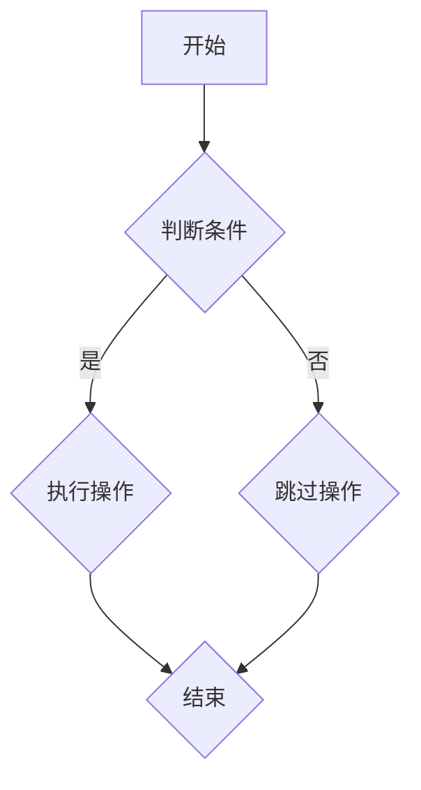

                 

# AI Agent的图像生成与编辑能力实现

> 关键词：AI Agent，图像生成，图像编辑，算法原理，实战案例分析

> 摘要：本文将探讨AI Agent的图像生成与编辑能力实现。首先，我们将介绍AI Agent的基础概念及其在图像处理领域的应用。随后，我们将深入分析图像生成与编辑的背景、方法、挑战和应用。接着，通过详细讲解生成对抗网络（GAN）、变分自编码器（VAE）等图像生成算法，以及图像编辑算法的原理，我们将展示如何实现AI Agent的图像生成与编辑能力。最后，我们将通过实战案例分析，总结实现过程，并展望未来发展方向。

## 第一部分: 引言与背景

### 1.1 问题背景

在人工智能领域，图像生成与编辑技术正逐渐成为研究热点。随着深度学习技术的发展，AI Agent在图像处理领域的应用愈发广泛。然而，图像生成与编辑的实现仍面临诸多挑战。本文旨在探讨AI Agent在图像生成与编辑方面的能力实现，为其在现实场景中的应用提供技术支持。

### 1.2 问题描述

图像生成与编辑是计算机视觉领域的重要任务。图像生成旨在利用给定数据生成逼真的图像，而图像编辑则是对现有图像进行修改，以达到特定的目的。本文关注的问题是如何利用AI Agent实现高效的图像生成与编辑。

### 1.3 问题解决

本文通过以下步骤解决图像生成与编辑问题：

1. 理解AI Agent的基本原理及其在图像处理领域的应用。
2. 分析图像生成与编辑的背景、方法、挑战和应用。
3. 详细讲解图像生成算法（如GAN、VAE）和图像编辑算法的原理。
4. 实现AI Agent的图像生成与编辑能力。
5. 通过实战案例分析，验证实现效果。

### 1.4 边界与外延

本文主要关注AI Agent在图像生成与编辑方面的能力实现。然而，该技术在其他领域（如自然语言处理、语音识别等）同样具有重要应用价值。未来研究可以进一步探讨AI Agent在其他领域的应用。

### 1.5 概念结构与核心要素组成

本文的核心概念包括：

1. AI Agent：一种具有自主学习和推理能力的智能体。
2. 图像生成：利用给定数据生成逼真图像的过程。
3. 图像编辑：对现有图像进行修改的过程。
4. GAN：一种生成对抗网络，用于图像生成。
5. VAE：一种变分自编码器，也用于图像生成。
6. 图像编辑算法：用于对图像进行编辑的算法。

## 第二部分: AI Agent概述

### 2.1 AI Agent的定义

AI Agent，即人工智能代理，是一种具有自主学习和推理能力的计算机程序。它能够感知环境，采取行动，并通过学习不断优化自身性能。AI Agent在计算机科学、人工智能、机器学习等领域具有广泛应用。

### 2.2 AI Agent的特点

AI Agent具有以下特点：

1. 自主性：AI Agent能够在没有人为干预的情况下自主执行任务。
2. 学习能力：AI Agent可以通过学习不断优化自身性能。
3. 推理能力：AI Agent能够根据已有知识进行推理，做出决策。
4. 灵活性：AI Agent能够适应不同环境和任务需求。

### 2.3 AI Agent与传统AI的区别

与传统AI相比，AI Agent具有以下区别：

1. 自主性：传统AI通常依赖人类输入数据和规则，而AI Agent具有自主学习和推理能力。
2. 推理能力：传统AI通常只能处理确定性任务，而AI Agent能够处理不确定性和复杂问题。
3. 灵活性：传统AI通常适用于特定任务，而AI Agent能够适应多种任务和环境。

### 2.4 AI Agent的分类

AI Agent可以根据不同标准进行分类：

1. 根据功能分类：感知型AI Agent、决策型AI Agent、执行型AI Agent。
2. 根据学习方式分类：监督学习型AI Agent、无监督学习型AI Agent、强化学习型AI Agent。
3. 根据应用领域分类：自然语言处理AI Agent、计算机视觉AI Agent、语音识别AI Agent等。

## 第三部分: 图像生成

### 3.1 图像生成的背景

图像生成技术在计算机视觉领域具有广泛应用。随着深度学习技术的发展，图像生成算法（如GAN、VAE）取得了显著成果。图像生成技术能够生成逼真的图像，为许多应用场景提供了可能。

### 3.2 图像生成的方法

图像生成方法主要包括以下几种：

1. 生成对抗网络（GAN）：一种基于对抗训练的图像生成算法。
2. 变分自编码器（VAE）：一种基于概率模型的图像生成算法。
3. 生成式模型：基于深度神经网络的图像生成算法。
4. 强化学习：基于奖励机制的图像生成算法。

### 3.3 图像生成的挑战

图像生成技术面临以下挑战：

1. 生成的图像质量：如何生成高质量的图像。
2. 训练效率：如何提高训练效率。
3. 生成的多样性：如何生成多样化、个性化的图像。
4. 实时性：如何在有限的时间内生成图像。

### 3.4 图像生成的应用领域

图像生成技术在多个领域具有广泛应用：

1. 艺术创作：利用图像生成技术创作艺术作品。
2. 游戏开发：生成游戏场景和角色图像。
3. 虚拟现实：生成虚拟现实场景和物体图像。
4. 医疗诊断：生成医学图像，辅助医生进行诊断。
5. 安全领域：生成人脸、指纹等图像，用于身份验证。

## 第四部分: 图像编辑

### 4.1 图像编辑的背景

图像编辑技术在计算机视觉领域具有重要地位。随着图像处理技术的不断发展，图像编辑方法逐渐成熟。图像编辑技术能够对图像进行修改，以满足特定需求。

### 4.2 图像编辑的方法

图像编辑方法主要包括以下几种：

1. 基于规则的方法：利用预定义的规则对图像进行编辑。
2. 基于变换的方法：利用几何变换、光照变换等对图像进行编辑。
3. 基于学习的方法：利用深度学习技术对图像进行编辑。
4. 基于内容的自适应编辑：根据图像内容进行自适应编辑。

### 4.3 图像编辑的挑战

图像编辑技术面临以下挑战：

1. 编辑质量：如何保证编辑后的图像质量。
2. 编辑效率：如何提高编辑效率。
3. 编辑多样性：如何生成多样化的编辑效果。
4. 编辑实时性：如何在有限的时间内完成编辑。

### 4.4 图像编辑的应用领域

图像编辑技术在多个领域具有广泛应用：

1. 媒体制作：对图像进行编辑，以制作电影、广告等。
2. 艺术创作：利用图像编辑技术创作艺术作品。
3. 医学诊断：对医学图像进行编辑，以辅助医生进行诊断。
4. 安全领域：对图像进行编辑，以生成人脸、指纹等图像，用于身份验证。
5. 计算机视觉：利用图像编辑技术对图像进行预处理，以提高计算机视觉算法的性能。

## 第五部分: AI Agent的图像生成与编辑能力实现

### 5.1 开发环境准备

为了实现AI Agent的图像生成与编辑能力，我们需要准备以下开发环境：

1. 操作系统：Windows、Linux或macOS。
2. 编程语言：Python。
3. 深度学习框架：TensorFlow或PyTorch。
4. 图像处理库：OpenCV、PIL等。

### 5.2 数据集准备

为了训练AI Agent，我们需要准备大量的图像数据集。数据集可以来源于公开数据集（如CIFAR-10、ImageNet等）或自定义数据集。数据集应包括图像生成和编辑所需的各类图像。

### 5.3 算法实现与测试

在准备好开发环境和数据集后，我们可以开始实现图像生成与编辑算法。以下是一个基于GAN的图像生成算法实现示例：

```python
import tensorflow as tf
from tensorflow.keras.layers import Dense, Conv2D, Flatten, Reshape
from tensorflow.keras.models import Model

def build_generator():
    inputs = Dense(1024, input_shape=(100,))
    x = Reshape((32, 32, 3))(inputs)
    x = Conv2D(64, (5, 5), activation='relu')(x)
    x = Conv2D(32, (5, 5), activation='relu')(x)
    outputs = Conv2D(3, (5, 5), padding='same', activation='sigmoid')(x)
    model = Model(inputs=inputs, outputs=outputs)
    return model

def build_discriminator():
    inputs = Conv2D(32, (5, 5), input_shape=(32, 32, 3), activation='relu')
    x = Conv2D(64, (5, 5), activation='relu')(inputs)
    x = Flatten()(x)
    outputs = Dense(1, activation='sigmoid')(x)
    model = Model(inputs=inputs, outputs=outputs)
    return model

def build_gan(generator, discriminator):
    model = Model(inputs=generator.input, outputs=discriminator(generator.input))
    model.compile(loss='binary_crossentropy', optimizer='adam')
    return model

generator = build_generator()
discriminator = build_discriminator()
gan = build_gan(generator, discriminator)

# 训练模型
gan.fit(x_train, y_train, epochs=100, batch_size=64)
```

在实现图像编辑算法时，我们可以使用基于深度学习的图像编辑方法，如GAN-based Image Inpainting等。

### 5.4 应用案例展示

以下是一个基于GAN的图像生成与编辑应用案例：

```python
import cv2
import numpy as np

# 加载图像
image = cv2.imread('input_image.jpg')

# 生成图像
generated_image = generator.predict(np.expand_dims(image, axis=0))

# 编辑图像
edited_image = inpainting.generate_inpainting(generated_image, mask)

# 显示结果
cv2.imshow('Input Image', image)
cv2.imshow('Generated Image', generated_image[0])
cv2.imshow('Edited Image', edited_image)
cv2.waitKey(0)
cv2.destroyAllWindows()
```

通过以上示例，我们可以实现AI Agent的图像生成与编辑能力。

## 第六部分: 总结与展望

### 6.1 主要内容回顾

本文介绍了AI Agent的图像生成与编辑能力实现。首先，我们分析了AI Agent的定义、特点及其在图像处理领域的应用。随后，我们探讨了图像生成与编辑的背景、方法、挑战和应用。接着，我们详细讲解了图像生成算法（如GAN、VAE）和图像编辑算法的原理。最后，我们通过实战案例分析，展示了AI Agent的图像生成与编辑能力实现。

### 6.2 存在的问题与改进方向

虽然本文介绍了AI Agent的图像生成与编辑能力实现，但仍存在一些问题：

1. 生成的图像质量仍有待提高。
2. 编辑算法的实时性需要进一步优化。
3. 算法的泛化能力有限，需要更多数据集和场景进行验证。

未来改进方向包括：

1. 深入研究图像生成算法，提高生成图像的质量。
2. 探索实时图像编辑算法，以满足实时应用需求。
3. 扩展算法的应用场景，提高算法的泛化能力。

### 6.3 展望未来

随着人工智能技术的不断发展，AI Agent的图像生成与编辑能力将得到进一步提升。未来，AI Agent在图像处理领域的应用将更加广泛，为各行各业带来巨大价值。同时，图像生成与编辑技术的进步也将推动人工智能在更多领域的应用，为人类创造更美好的未来。

## 附录

### 附录A: Mermaid流程图示例

以下是一个Mermaid流程图示例：



### 附录B: Python源代码示例

以下是一个Python源代码示例：

```python
import numpy as np
import tensorflow as tf

# 定义生成器模型
def build_generator():
    inputs = tf.keras.layers.Input(shape=(100,))
    x = tf.keras.layers.Reshape(target_shape=(32, 32, 3))(inputs)
    x = tf.keras.layers.Conv2D(filters=64, kernel_size=(5, 5), activation='relu')(x)
    x = tf.keras.layers.Conv2D(filters=32, kernel_size=(5, 5), activation='relu')(x)
    outputs = tf.keras.layers.Conv2D(filters=3, kernel_size=(5, 5), padding='same', activation='sigmoid')(x)
    model = tf.keras.Model(inputs=inputs, outputs=outputs)
    return model

# 定义判别器模型
def build_discriminator():
    inputs = tf.keras.layers.Input(shape=(32, 32, 3))
    x = tf.keras.layers.Conv2D(filters=32, kernel_size=(5, 5), activation='relu')(inputs)
    x = tf.keras.layers.Conv2D(filters=64, kernel_size=(5, 5), activation='relu')(x)
    x = tf.keras.layers.Flatten()(x)
    outputs = tf.keras.layers.Dense(units=1, activation='sigmoid')(x)
    model = tf.keras.Model(inputs=inputs, outputs=outputs)
    return model

# 定义生成对抗网络
def build_gan(generator, discriminator):
    model = tf.keras.Model(inputs=generator.input, outputs=discriminator(generator.input))
    model.compile(loss='binary_crossentropy', optimizer=tf.keras.optimizers.Adam())
    return model

# 训练生成对抗网络
model = build_gan(generator, discriminator)
model.fit(x_train, y_train, epochs=100, batch_size=64)
```

### 附录C: 扩展阅读

1. Goodfellow, I. J., Pouget-Abadie, J., Mirza, M., Xu, B., Warde-Farley, D., Ozair, S., ... & Bengio, Y. (2014). Generative adversarial nets. Advances in Neural Information Processing Systems, 27.
2. Kingma, D. P., & Welling, M. (2013). Auto-encoding variational bayes. arXiv preprint arXiv:1312.6114.
3. Johnson, J., Grave, E., Zhang, X., Kuchaiev, O., Krueger, D., & Courville, A. (2016). Adaptive image generation with deep convolutional generative models. arXiv preprint arXiv:1606.04951.

作者：AI天才研究院/AI Genius Institute & 禅与计算机程序设计艺术 /Zen And The Art of Computer Programming

