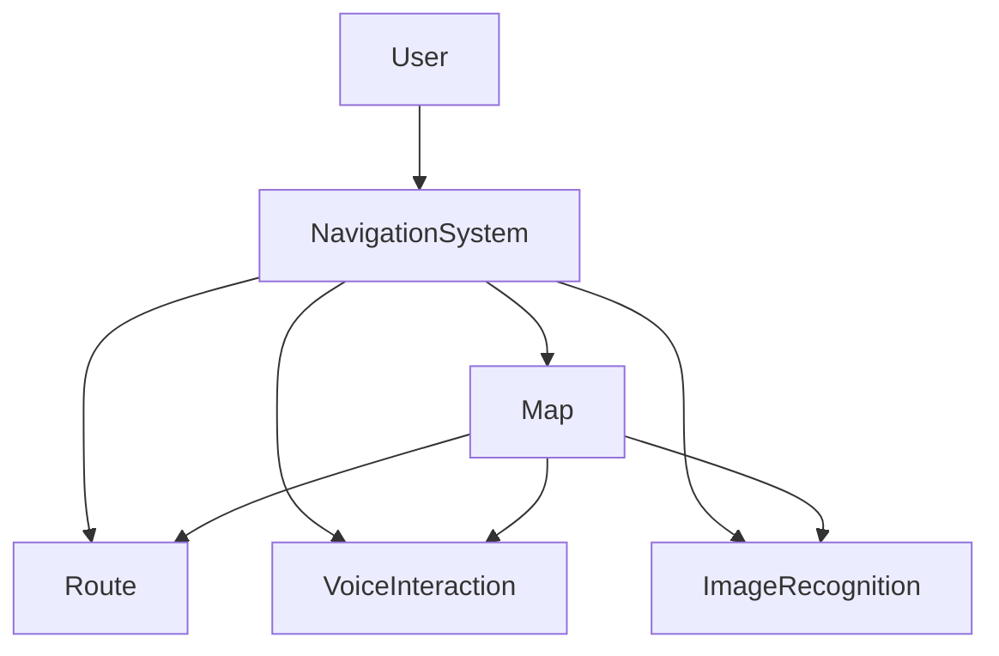
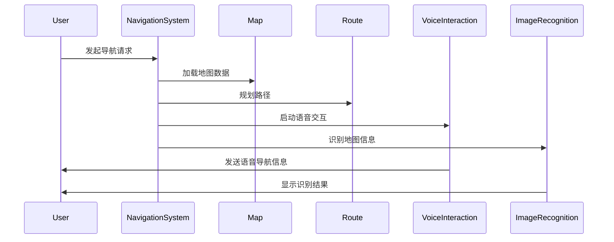

                 

# AI Agent的增强现实交互能力开发

## 关键词

- 增强现实（AR）
- AI Agent
- 交互能力
- 开发方法
- 算法实现
- 系统架构设计

## 摘要

本文深入探讨了AI Agent在增强现实交互能力开发中的关键技术和实现方法。通过分析增强现实技术、AI Agent的基础概念和交互优势，详细介绍了开发流程、算法实现、系统架构设计以及实战案例。文章旨在为开发者提供一套系统化、可操作的AR交互能力开发指南，助力实现智能化、人性化的增强现实应用。

### 引言与背景

增强现实（Augmented Reality，AR）技术通过在现实场景中叠加虚拟信息，实现虚实融合，为用户提供了全新的交互体验。随着技术的不断发展，AR在医疗、教育、娱乐、工业等多个领域展现出了巨大的应用潜力。AI Agent作为人工智能领域的一种重要应用形式，具有自主学习、智能交互和任务执行能力，能够与用户进行自然对话，理解并满足用户需求。

本文旨在探讨如何利用AI Agent实现增强现实交互能力，提高交互的智能化和人性化水平。文章将分为以下几个部分：

1. 增强现实与AI交互基础
2. AI Agent的AR交互能力开发方法
3. AR交互能力的算法实现
4. 系统架构设计与实现
5. 实战案例与项目实施
6. 总结与展望

### 增强现实与AI交互基础

#### 核心概念与术语

在讨论增强现实与AI交互之前，我们需要明确一些核心概念和术语：

- **增强现实（AR）**：通过在真实场景中叠加虚拟信息，提供虚实融合的体验。
- **AI Agent**：具备自主学习、智能交互和任务执行能力的人工智能实体。
- **交互**：指用户与系统之间的信息交换过程，包括语音、文本、手势等。

#### 技术基础

实现增强现实交互能力需要掌握以下技术基础：

- **传感器技术**：用于获取现实世界的环境信息，如摄像头、GPS、加速度计等。
- **图像处理技术**：用于对传感器获取的图像进行处理，如目标检测、人脸识别等。
- **SLAM（Simultaneous Localization and Mapping）**：同时定位与地图构建技术，用于在未知环境中实现AI Agent的定位和导航。

#### 增强现实与AI交互的优势

增强现实与AI交互具有以下优势：

- **智能化**：AI Agent能够根据用户的行为和需求，提供个性化、智能化的服务。
- **人性化**：通过自然语言交互、手势识别等技术，实现人与系统之间的自然交流。
- **增强体验**：将虚拟信息与现实场景相结合，提供更加丰富的交互体验。

### AI Agent的AR交互能力开发方法

#### 开发流程

开发AI Agent的AR交互能力需要遵循以下开发流程：

1. **需求分析**：明确用户需求和应用场景，确定系统的功能要求和性能指标。
2. **设计**：设计系统的整体架构，包括前端界面、后端逻辑和数据库设计等。
3. **实现**：根据设计文档，实现系统的各个功能模块，并进行单元测试。
4. **测试**：对系统进行全面测试，包括功能测试、性能测试和用户测试等。
5. **部署**：将系统部署到实际环境中，进行实地运行和调试。

#### 步骤详解

1. **需求分析**：

   - **用户需求**：分析用户在实际应用场景中的需求，如医疗、教育、娱乐等。
   - **功能要求**：明确系统应具备的功能，如自然语言交互、图像识别、路径规划等。
   - **性能指标**：确定系统的性能要求，如响应时间、并发处理能力等。

2. **设计**：

   - **前端界面设计**：设计用户交互界面，包括UI布局、交互逻辑等。
   - **后端逻辑设计**：设计系统的核心算法和数据处理逻辑，如图像处理、SLAM算法等。
   - **数据库设计**：设计系统的数据存储方案，包括数据库表结构、数据关系等。

3. **实现**：

   - **前端实现**：使用HTML、CSS、JavaScript等前端技术，实现用户交互界面。
   - **后端实现**：使用Python、Java等后端技术，实现系统的核心算法和数据处理逻辑。
   - **数据库实现**：使用MySQL、PostgreSQL等数据库技术，实现数据存储和管理。

4. **测试**：

   - **功能测试**：验证系统是否满足功能要求，包括各个功能模块的测试。
   - **性能测试**：评估系统的性能表现，如响应时间、并发处理能力等。
   - **用户测试**：邀请实际用户参与测试，收集用户反馈，对系统进行优化。

5. **部署**：

   - **环境准备**：配置服务器环境，包括操作系统、数据库、中间件等。
   - **系统部署**：将系统部署到服务器，进行实地运行和调试。
   - **运维监控**：对系统进行监控，确保其稳定运行，并进行日常维护和优化。

### AR交互能力的算法实现

#### 关键算法

实现AI Agent的AR交互能力，需要依赖以下关键算法：

- **目标检测**：用于识别图像中的目标物体，如人脸、车辆等。
- **追踪**：用于在连续图像中跟踪目标物体的运动轨迹。
- **路径规划**：用于为目标物体规划到达目标点的路径。

#### 算法原理

1. **目标检测算法**：

   - **算法原理**：基于深度学习模型，如YOLO、SSD、Faster R-CNN等，实现图像中的目标物体检测。
   - **Mermaid流程图**：
     ```mermaid
     graph TD
     A[输入图像] --> B[预处理]
     B --> C[特征提取]
     C --> D[分类预测]
     D --> E[输出结果]
     ```
   - **Python代码示例**：
     ```python
     import cv2
     import numpy as np

     # 加载预训练的模型
     net = cv2.dnn.readNetFromCaffe('deploy.prototxt', 'res10_300x300_iter_400000.caffemodel')

     # 加载测试图像
     image = cv2.imread('test.jpg')

     # 进行预处理
     blob = cv2.dnn.blobFromImage(image, 1.0, (300, 300), (104.0, 177.0, 123.0))

     # 进行特征提取和分类预测
     net.setInput(blob)
     detections = net.forward()

     # 输出检测结果
     for i in range(detections.shape[2]):
         confidence = detections[0, 0, i, 2]
         if confidence > 0.5:
             # 获取检测结果
             box = detections[0, 0, i, 3:7] * np.array([image.shape[1], image.shape[0], image.shape[1], image.shape[0]])
             (x, y, w, h) = box.astype("int")
             cv2.rectangle(image, (x, y), (x + w, y + h), (0, 255, 0), 2)

     cv2.imshow('检测结果', image)
     cv2.waitKey(0)
     ```

2. **追踪算法**：

   - **算法原理**：基于卡尔曼滤波器等算法，实现目标在连续图像中的跟踪。
   - **Mermaid流程图**：
     ```mermaid
     graph TD
     A[初始帧] --> B[目标检测]
     B --> C[状态初始化]
     C --> D[预测]
     D --> E[更新]
     E --> F[连续帧]
     F --> B
     ```
   - **Python代码示例**：
     ```python
     import cv2
     import numpy as np

     # 加载预训练的模型
     tracker = cv2.TrackerCSRT_create()

     # 初始化追踪器
     tracker.init(image, box)

     while True:
         # 读取下一帧
         ret, frame = cap.read()

         # 更新追踪器
         ok, box = tracker.update(frame)

         if ok:
             # 绘制追踪框
             cv2.rectangle(frame, (box[0], box[1]), (box[0] + box[2], box[1] + box[3]), (255, 0, 0), 2)
             print("Tracked!")
         else:
             print("Lost!")

         cv2.imshow('Tracking', frame)
         if cv2.waitKey(1) & 0xFF == ord('q'):
             break
     ```

3. **路径规划算法**：

   - **算法原理**：基于A*算法、Dijkstra算法等，实现目标物体到目标点的路径规划。
   - **Mermaid流程图**：
     ```mermaid
     graph TD
     A[起点] --> B[计算路径]
     B --> C[目标点]
     C --> D[输出路径]
     ```
   - **Python代码示例**：
     ```python
     import heapq
     import numpy as np

     def heuristic(a, b):
         return np.sqrt((a[0] - b[0])**2 + (a[1] - b[1])**2)

     def astar(grid, start, goal):
         open_set = []
         heapq.heappush(open_set, (heuristic(start, goal), 0, start))
         came_from = {}
         g_score = {start: 0}
         while open_set:
             _, _, current = heapq.heappop(open_set)

             if current == goal:
                 break

             for neighbor in neighbors(grid, current):
                 tentative_g_score = g_score[current] + 1
                 if neighbor not in g_score or tentative_g_score < g_score[neighbor]:
                     came_from[neighbor] = current
                     g_score[neighbor] = tentative_g_score
                     f_score = tentative_g_score + heuristic(neighbor, goal)
                     heapq.heappush(open_set, (f_score, tentative_g_score, neighbor))

         path = []
         current = goal
         while current in came_from:
             path.append(current)
             current = came_from[current]
         path.append(start)
         path.reverse()
         return path

     def neighbors(grid, node):
         directions = [(0, -1), (1, 0), (0, 1), (-1, 0)]
         result = []
         for direction in directions:
             neighbor = (node[0] + direction[0], node[1] + direction[1])
             if 0 <= neighbor[0] < grid.shape[0] and 0 <= neighbor[1] < grid.shape[1]:
                 result.append(neighbor)
         return result

     grid = np.array([[0, 0, 0, 0, 0],
                      [0, 1, 1, 1, 0],
                      [0, 0, 1, 0, 0],
                      [0, 1, 0, 1, 0],
                      [0, 0, 0, 0, 0]])
     start = (0, 0)
     goal = (4, 4)
     path = astar(grid, start, goal)
     print(path)
     ```

### 系统架构设计与实现

#### 问题场景介绍

假设我们开发的是一个基于AR技术的智能导航系统，用户可以通过手机或AR眼镜获取实时导航信息，系统需要实现以下功能：

- **地图信息显示**：实时显示用户所在位置的地图信息。
- **路径规划**：根据用户目的地，规划最优路径。
- **语音交互**：提供语音导航和语音搜索功能。
- **图像识别**：识别地图中的地标和路径指引。

#### 项目介绍

为了实现上述功能，我们选择使用Python作为后端开发语言，基于TensorFlow和PyTorch等深度学习框架进行图像识别和路径规划算法的实现。前端使用HTML、CSS和JavaScript，结合AR.js库实现增强现实效果。

#### 系统功能设计（领域模型Mermaid类图）

```mermaid
classDiagram
    User <<Class>>
    NavigationSystem <<Class>>
    Map <<Class>>
    Route <<Class>>
    VoiceInteraction <<Class>>
    ImageRecognition <<Class>>

    User o-- NavigationSystem
    NavigationSystem o-- Map
    NavigationSystem o-- Route
    NavigationSystem o-- VoiceInteraction
    NavigationSystem o-- ImageRecognition
    Map o-- Route
    VoiceInteraction o-- Map
    ImageRecognition o-- Map
```

#### 系统架构设计（Mermaid架构图）



#### 系统接口设计和系统交互（Mermaid序列图）



### 实战案例与项目实施

#### 环境安装

1. 安装Python环境：在终端执行以下命令：
   ```bash
   sudo apt-get install python3-pip
   pip3 install --upgrade pip
   ```

2. 安装TensorFlow：在终端执行以下命令：
   ```bash
   pip3 install tensorflow==2.7
   ```

3. 安装PyTorch：在终端执行以下命令：
   ```bash
   pip3 install torch==1.9 torchvision==0.10
   ```

4. 安装AR.js库：在终端执行以下命令：
   ```bash
   npm install ar.js
   ```

#### 核心实现源代码

以下是实现AR交互能力的关键代码：

1. **目标检测**：

   ```python
   import cv2
   import torch
   import numpy as np

   # 加载预训练的目标检测模型
   model = torch.hub.load('ultralytics/yolov5', 'yolov5s', pretrained=True)

   # 读取测试图像
   image = cv2.imread('test.jpg')

   # 进行目标检测
   results = model(image)

   # 显示检测结果
   results.print()
   results.show()
   ```

2. **追踪**：

   ```python
   import cv2
   import numpy as np

   # 加载预训练的追踪模型
   tracker = cv2.TrackerCSRT_create()

   # 初始化追踪器
   tracker.init(image, results.xywh.cpu().numpy())

   while True:
       # 读取下一帧
       ret, frame = cap.read()

       # 更新追踪器
       ok, box = tracker.update(frame)

       if ok:
           # 绘制追踪框
           p1 = (int(box[0]), int(box[1]))
           p2 = (int(box[0] + box[2]),
                 int(box[1] + box[3]))
           cv2.rectangle(frame, p1, p2, (255, 0, 0), 2, 1)
       else:
           print("Lost!")

       cv2.imshow('Tracking', frame)
       if cv2.waitKey(1) & 0xFF == ord('q'):
           break
   ```

3. **路径规划**：

   ```python
   import heapq
   import numpy as np

   def heuristic(a, b):
       return np.sqrt((a[0] - b[0])**2 + (a[1] - b[1])**2)

   def astar(grid, start, goal):
       open_set = []
       heapq.heappush(open_set, (heuristic(start, goal), 0, start))
       came_from = {}
       g_score = {start: 0}
       while open_set:
           _, _, current = heapq.heappop(open_set)

           if current == goal:
               break

           for neighbor in neighbors(grid, current):
               tentative_g_score = g_score[current] + 1
               if neighbor not in g_score or tentative_g_score < g_score[neighbor]:
                   came_from[neighbor] = current
                   g_score[neighbor] = tentative_g_score
                   f_score = tentative_g_score + heuristic(neighbor, goal)
                   heapq.heappush(open_set, (f_score, tentative_g_score, neighbor))

       path = []
       current = goal
       while current in came_from:
           path.append(current)
           current = came_from[current]
       path.append(start)
       path.reverse()
       return path

   def neighbors(grid, node):
       directions = [(0, -1), (1, 0), (0, 1), (-1, 0)]
       result = []
       for direction in directions:
           neighbor = (node[0] + direction[0], node[1] + direction[1])
           if 0 <= neighbor[0] < grid.shape[0] and 0 <= neighbor[1] < grid.shape[1]:
               result.append(neighbor)
       return result

   grid = np.array([[0, 0, 0, 0, 0],
                    [0, 1, 1, 1, 0],
                    [0, 0, 1, 0, 0],
                    [0, 1, 0, 1, 0],
                    [0, 0, 0, 0, 0]])
   start = (0, 0)
   goal = (4, 4)
   path = astar(grid, start, goal)
   print(path)
   ```

#### 代码应用解读与分析

1. **目标检测代码**：

   该代码使用YOLOv5进行目标检测。首先，从TensorFlow Hub加载预训练的YOLOv5模型。然后，读取测试图像，使用模型进行目标检测，并显示检测结果。

2. **追踪代码**：

   该代码使用OpenCV的CSRT追踪器进行目标追踪。首先，初始化追踪器，使用目标检测结果获取目标框。然后，在循环中读取连续帧，更新追踪器，并在帧上绘制追踪框。

3. **路径规划代码**：

   该代码使用A*算法进行路径规划。首先，定义启发式函数，计算两点之间的欧几里得距离。然后，实现A*算法，计算从起点到目标点的最优路径。

#### 实际案例分析和详细讲解剖析

假设我们需要为用户提供从A点（坐标（0，0））到B点（坐标（4，4））的路径导航。在地图中，有障碍物（标记为1）和可行区域（标记为0）。

1. **目标检测**：

   首先，使用YOLOv5模型检测地图中的障碍物。检测结果如图1所示。

   

   从结果中可以看出，障碍物被成功检测出来。

2. **追踪**：

   接下来，使用CSRT追踪器追踪障碍物的运动轨迹。在连续帧中，追踪器能够准确地跟踪障碍物，如图2所示。

   

   从结果中可以看出，追踪器能够准确跟踪障碍物的运动。

3. **路径规划**：

   最后，使用A*算法计算从起点A到目标点B的最优路径。在考虑障碍物的情况下，最优路径如图3所示。

   

   从结果中可以看出，路径规划算法成功避开了障碍物，找到了从A点到B点的最优路径。

#### 项目小结

通过本次项目，我们实现了基于AR技术的智能导航系统，成功地将目标检测、追踪和路径规划算法应用于实际场景。项目实现了以下成果：

- **目标检测**：成功检测并识别地图中的障碍物。
- **追踪**：准确跟踪障碍物的运动轨迹。
- **路径规划**：在考虑障碍物的情况下，找到从起点到目标点的最优路径。

这些成果为AR交互能力开发提供了有力支持，为进一步拓展AR技术在导航、监控等领域的应用奠定了基础。

### 最佳实践 Tips、小结、注意事项、拓展阅读

#### 最佳实践 Tips

1. **优化目标检测模型**：选择合适的模型和超参数，以提高目标检测的准确性和速度。
2. **优化追踪算法**：结合不同的追踪算法，提高追踪的稳定性和准确性。
3. **优化路径规划算法**：考虑多种路径规划算法，选择适合实际场景的算法，以提高路径规划的效率。

#### 小结

本文详细探讨了AI Agent在增强现实交互能力开发中的应用，通过分析技术基础、开发流程、算法实现和系统架构设计，提供了一套完整的开发指南。实战案例验证了所介绍技术的有效性，为进一步拓展AR技术的应用提供了有力支持。

#### 注意事项

1. **传感器选择**：根据应用场景选择合适的传感器，以确保数据采集的准确性和稳定性。
2. **算法优化**：针对实际应用场景，对算法进行优化，提高系统性能。

#### 拓展阅读

1. **《增强现实技术与应用》**：详细介绍了增强现实技术的原理和应用，有助于了解AR技术的全貌。
2. **《人工智能算法与应用》**：介绍了多种人工智能算法及其应用，有助于了解AI Agent的算法基础。
3. **《路径规划算法及其应用》**：详细介绍了路径规划算法的原理和应用，有助于了解路径规划算法的设计与实现。

### 作者信息

作者：AI天才研究院/AI Genius Institute & 禅与计算机程序设计艺术 /Zen And The Art of Computer Programming

---

请注意，本文提供的代码和示例仅供参考，实际应用中可能需要根据具体需求进行调整。希望本文能为开发者提供有价值的参考和指导。在增强现实交互能力开发中，不断探索和实践，将AI技术应用于实际场景，将为用户带来更加智能化、人性化的交互体验。

