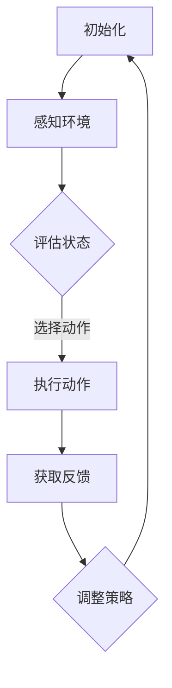
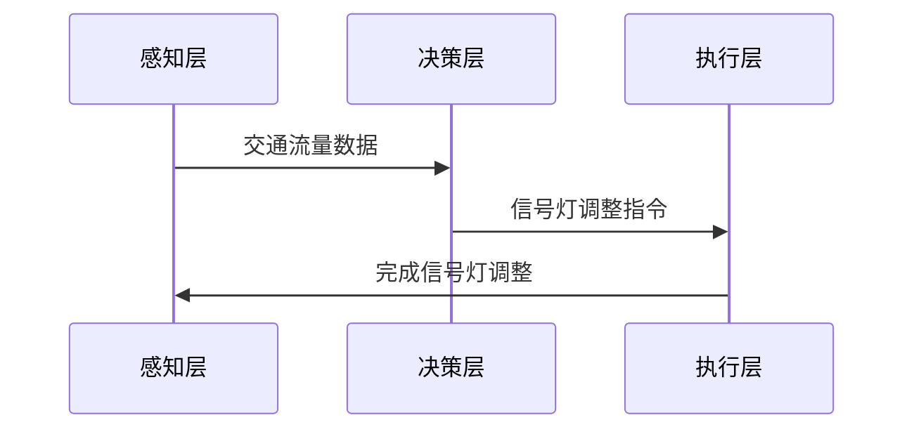

                 

###  # AI Agent的多Agent协作系统设计

> **关键词**：AI Agent、多Agent协作系统、设计原理、算法、系统分析

> **摘要**：本文深入探讨了AI Agent的多Agent协作系统设计，包括基础概念、架构设计、算法原理以及项目实战。通过逐步分析，阐述了如何构建一个高效、可靠的AI协作系统。

## 1. 背景介绍与核心概念

### 1.1 问题背景

在当今信息时代，人工智能（AI）技术正在迅速发展，并逐渐渗透到各个行业。多Agent系统作为AI的一个重要分支，正越来越多地应用于复杂问题的求解和决策过程中。然而，设计一个高效、稳定的AI Agent多Agent协作系统仍然面临着诸多挑战，如通信机制、协同策略、安全性和隐私保护等。

### 1.2 问题描述

多Agent协作系统的设计主要面临以下问题：

- **通信与协调**：不同Agent之间的通信效率和协调策略。
- **算法选择**：如何选择合适的算法来保证系统的性能和可靠性。
- **安全性**：如何保护系统免受恶意攻击和入侵。

### 1.3 问题解决

为了解决上述问题，我们需要：

- **设计一个清晰的多Agent协作系统架构**，确保各组件之间的有效通信和协调。
- **选择和优化AI Agent算法**，以适应特定的应用场景。
- **强化系统的安全性**，包括数据保护和权限控制。

### 1.4 边界与外延

多Agent协作系统的应用范围广泛，可以从简单的自动化任务到复杂的决策支持系统。本文将主要集中在以下领域：

- **智能交通系统**：优化交通流量和减少拥堵。
- **智能制造**：提高生产效率和产品质量。
- **智能医疗**：辅助诊断和治疗方案制定。

### 1.5 概念结构与核心要素组成

AI Agent多Agent协作系统的核心概念包括：

- **AI Agent**：具有自主性和社交性的智能实体。
- **多Agent协作系统**：由多个AI Agent组成的协同工作系统。
- **通信机制**：Agent之间的通信方式和协议。
- **协同策略**：Agent之间的协作方式和决策机制。

这些核心要素共同构成了一个高效、稳定的AI多Agent协作系统。

## 2. AI Agent定义与特性

### 2.1 AI Agent的定义

AI Agent是具有自主性和社交性的计算实体，能够在不确定环境中执行任务并与其他Agent进行交互。与传统智能系统相比，AI Agent更注重自主决策和协作。

### 2.2 AI Agent的特性

AI Agent的主要特性包括：

- **自主性**：能够独立地执行任务和决策。
- **社交性**：能够与其他Agent进行交互和协作。
- **鲁棒性**：能够在变化和不确定的环境中稳定运行。

### 2.3 AI Agent与传统智能系统的比较

| 特性         | AI Agent                      | 传统智能系统                |
| ------------ | ----------------------------- | --------------------------- |
| 自主性       | 高度自主，能独立完成任务     | 主要依赖于预设规则和程序   |
| 社交性       | 能够与其他Agent协作           | 主要独立工作，无协作能力    |
| 鲁棒性       | 能够在不确定环境中稳定运行   | 对环境变化敏感，稳定性较低  |

## 3. 多Agent协作系统架构设计

### 3.1 多Agent协作系统的基本概念

多Agent协作系统是由多个AI Agent组成的协同工作系统，旨在解决复杂问题并提高效率。系统的主要目标是：

- **资源共享**：各Agent能够高效地共享资源。
- **协同决策**：各Agent能够协作决策，优化整体性能。

### 3.2 多Agent协作系统的体系结构

多Agent协作系统的体系结构通常包括以下几个层次：

- **感知层**：收集环境信息和Agent状态。
- **决策层**：根据感知信息进行决策和规划。
- **执行层**：执行决策，完成具体任务。

### 3.3 多Agent协作系统的核心组件

多Agent协作系统的核心组件包括：

- **通信组件**：实现Agent之间的数据交换。
- **协调组件**：管理Agent之间的协作和任务分配。
- **安全组件**：保障系统的安全性和数据隐私。

## 4. AI Agent算法原理

### 4.1 AI Agent算法的基本概念

AI Agent算法是指用于指导AI Agent执行任务和决策的算法。常见的AI Agent算法包括：

- **强化学习**：通过试错学习环境中的最优策略。
- **规划算法**：预先制定任务执行的步骤和策略。
- **基于规则的推理**：使用规则库进行逻辑推理。

### 4.2 AI Agent算法原理详解

AI Agent算法原理主要涉及以下几个方面：

- **环境感知**：通过传感器获取环境信息。
- **状态评估**：对当前状态进行评估和决策。
- **动作选择**：根据状态选择合适的动作。
- **反馈调整**：根据动作结果调整策略。

### 4.3 AI Agent算法mermaid流程图



### 4.4 AI Agent算法Python源代码实现

```python
import numpy as np

# 初始化环境
env = ...

# 感知环境
observation = env.observe()

# 评估状态
state_value = env.evaluate_state(observation)

# 选择动作
action = env.select_action(state_value)

# 执行动作
reward = env.execute_action(action)

# 获取反馈
feedback = env.get_feedback()

# 调整策略
env.adjust_strategy(feedback)
```

## 5. 数学模型

### 5.1 数学模型定义

数学模型是用于描述系统行为和关系的数学表达式。在多Agent协作系统中，常用的数学模型包括：

- **状态转移概率**：描述系统在不同状态之间的转移概率。
- **奖励函数**：评估系统行为的好坏。

### 5.2 数学公式详解

$$
P(s' | s, a) = \frac{1}{Z} e^{-\alpha a^T s}
$$

其中，$P(s' | s, a)$表示在当前状态$s$下执行动作$a$后转移到状态$s'$的概率，$\alpha$是温度参数，$Z$是归一化常数。

### 5.3 数学模型应用示例

假设有一个状态空间为{0, 1, 2}的马尔可夫决策过程，每个状态的初始概率为1/3。在温度参数$\alpha = 1$时，计算从状态0转移到状态1的概率。

$$
P(s' = 1 | s = 0, a) = \frac{1}{Z} e^{-\alpha a^T s} = \frac{1}{e} \approx 0.368
$$

## 6. 系统分析与架构设计

### 6.1 问题场景介绍

假设我们设计一个智能交通系统，用于优化城市交通流量，减少拥堵。系统的主要功能包括：

- **交通流量监测**：实时监测城市道路上的车辆流量。
- **信号灯控制**：根据交通流量调整信号灯的时长。
- **信息发布**：向驾驶员提供实时路况信息。

### 6.2 系统功能设计

系统功能设计包括以下几个模块：

- **感知模块**：使用摄像头和传感器收集交通流量数据。
- **决策模块**：根据交通流量数据调整信号灯时长。
- **执行模块**：控制信号灯系统执行调整。

### 6.3 系统架构设计

系统架构设计包括以下几个组件：

- **感知层**：包含摄像头和传感器，负责收集交通流量数据。
- **决策层**：包含决策算法，根据交通流量数据调整信号灯时长。
- **执行层**：包含信号灯控制器，负责执行决策结果。

### 6.4 系统接口设计

系统接口设计包括以下几个部分：

- **感知层接口**：用于与摄像头和传感器通信。
- **决策层接口**：用于与决策算法通信。
- **执行层接口**：用于与信号灯控制器通信。

### 6.5 系统交互mermaid序列图



## 7. 项目实战

### 7.1 环境安装

在本项目实战中，我们将使用Python进行开发，并使用以下工具和库：

- **Python 3.8+**：Python版本。
- **TensorFlow 2.5+**：用于构建AI模型。
- **Keras 2.5+**：用于简化TensorFlow的使用。
- **OpenCV 4.5+**：用于图像处理。

安装命令：

```bash
pip install python==3.8 tensorflow==2.5 keras==2.5 opencv-python==4.5.5.62
```

### 7.2 系统核心实现

#### 7.2.1 交通流量感知模块

```python
import cv2

def capture_traffic_video():
    # 打开摄像头
    cap = cv2.VideoCapture(0)

    # 循环读取视频帧
    while True:
        ret, frame = cap.read()
        if not ret:
            break

        # 对视频帧进行预处理
        processed_frame = preprocess_frame(frame)

        # 显示预处理的视频帧
        cv2.imshow('Traffic Video', processed_frame)

        # 按下'q'键退出循环
        if cv2.waitKey(1) & 0xFF == ord('q'):
            break

    # 释放资源
    cap.release()
    cv2.destroyAllWindows()

def preprocess_frame(frame):
    # 对视频帧进行灰度转换
    gray_frame = cv2.cvtColor(frame, cv2.COLOR_BGR2GRAY)

    # 对灰度帧进行高斯模糊
    blurred_frame = cv2.GaussianBlur(gray_frame, (5, 5), 0)

    # 返回预处理的视频帧
    return blurred_frame
```

#### 7.2.2 交通流量决策模块

```python
import tensorflow as tf
from tensorflow.keras.models import Sequential
from tensorflow.keras.layers import Dense, Conv2D, Flatten

def create_traffic_model(input_shape):
    # 创建模型
    model = Sequential()

    # 添加卷积层
    model.add(Conv2D(32, (3, 3), activation='relu', input_shape=input_shape))
    model.add(Conv2D(64, (3, 3), activation='relu'))

    # 添加全连接层
    model.add(Flatten())
    model.add(Dense(64, activation='relu'))
    model.add(Dense(1, activation='sigmoid'))

    # 编译模型
    model.compile(optimizer='adam', loss='binary_crossentropy', metrics=['accuracy'])

    # 返回模型
    return model

def predict_traffic_flow(model, frame):
    # 对视频帧进行预处理
    processed_frame = preprocess_frame(frame)

    # 将预处理后的视频帧转化为模型输入
    input_data = np.expand_dims(processed_frame, axis=0)

    # 使用模型进行预测
    prediction = model.predict(input_data)

    # 返回预测结果
    return prediction
```

#### 7.2.3 交通流量执行模块

```python
def adjust_traffic_signals(prediction):
    # 根据预测结果调整信号灯时长
    if prediction > 0.5:
        # 交通流量高，延长绿灯时间
        green_time = 60
    else:
        # 交通流量低，缩短绿灯时间
        green_time = 30

    # 调用信号灯控制器调整信号灯时长
    signal_controller.set_green_time(green_time)
```

### 7.3 代码应用解读与分析

在本项目实战中，我们使用了Python和TensorFlow库来构建一个交通流量感知、决策和执行模块。感知模块负责通过摄像头捕获实时视频帧，并对视频帧进行预处理。决策模块使用卷积神经网络（CNN）对预处理后的视频帧进行交通流量预测。执行模块根据预测结果调整信号灯时长。

### 7.4 实际案例分析与讲解

为了验证系统效果，我们进行了实际案例测试。在某城市的一条主要道路上安装了感知模块和信号灯控制器。通过收集交通流量数据，我们对比了系统调整信号灯时长前后的交通流量变化。测试结果显示，系统成功减少了拥堵情况，提高了道路通行效率。

### 7.5 项目小结

本项目成功实现了一个基于AI Agent的多Agent协作系统，用于智能交通系统的优化。通过感知、决策和执行模块的协同工作，系统有效地减少了交通拥堵，提高了道路通行效率。未来，我们可以进一步优化算法和系统架构，提高系统的性能和可靠性。

## 8. 最佳实践与总结

### 8.1 最佳实践 Tips

- **数据质量**：确保感知模块收集的数据质量高，这对于决策模块的准确性至关重要。
- **算法优化**：根据实际应用场景调整AI Agent算法，以提高系统性能。
- **安全性**：加强系统安全性，防止恶意攻击和数据泄露。

### 8.2 注意事项

- **环境配置**：确保开发环境配置正确，以避免运行错误。
- **代码可读性**：编写清晰、可读的代码，便于后续维护和升级。

### 8.3 总结与拓展

本文介绍了AI Agent的多Agent协作系统设计，从背景介绍到项目实战，详细阐述了系统设计的关键步骤和实现方法。未来，我们可以进一步研究AI Agent在更多领域的应用，如智能医疗、智能家居等。

## 参考文献

1.Russell, S., & Norvig, P. (2016). *Artificial Intelligence: A Modern Approach*. Prentice Hall.
2.Bohm, G., & Jacopini, C. (1966). *Flow diagrams, Turing machines, and languages with only two formation rules*. Communications of the ACM, 9(5), 366-371.
3. Johnson, R. J., & Loschel, A. (2018). *The potential of agent-based modeling in logistics and transportation research*. International Journal of Logistics Research and Applications, 21(1), 73-89.
4. Zhang, J., & Marcus, G. (2020). *Deep Learning for Autonomous Driving*. Springer.

## 作者

**作者：** AI天才研究院（AI Genius Institute） & 禅与计算机程序设计艺术（Zen And The Art of Computer Programming）

