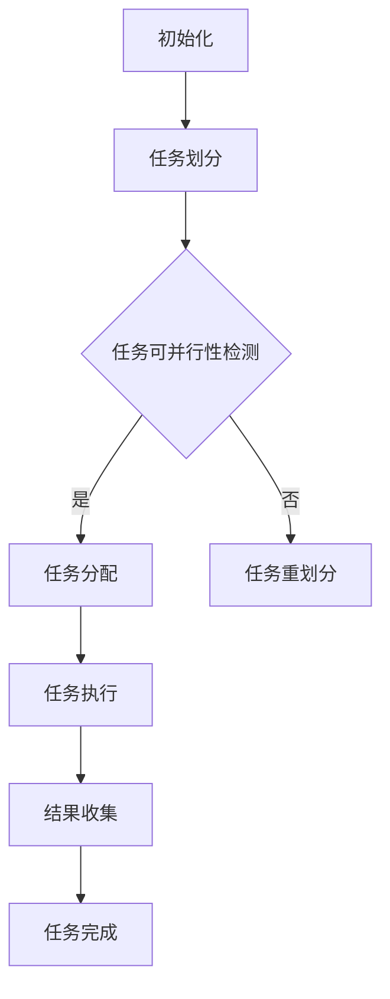
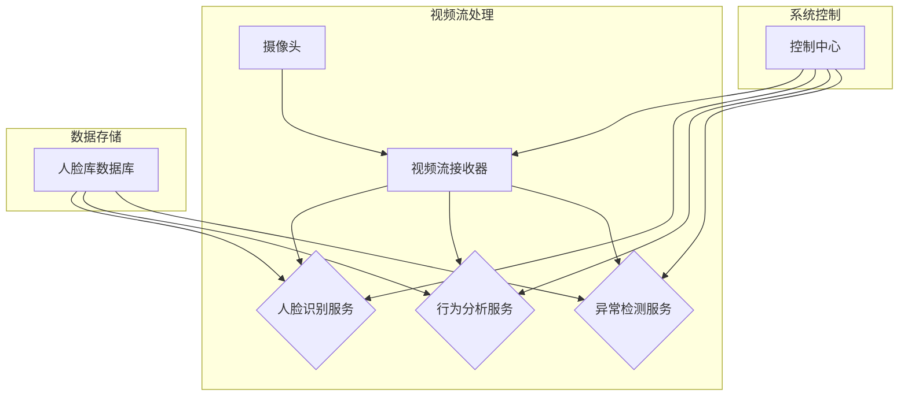
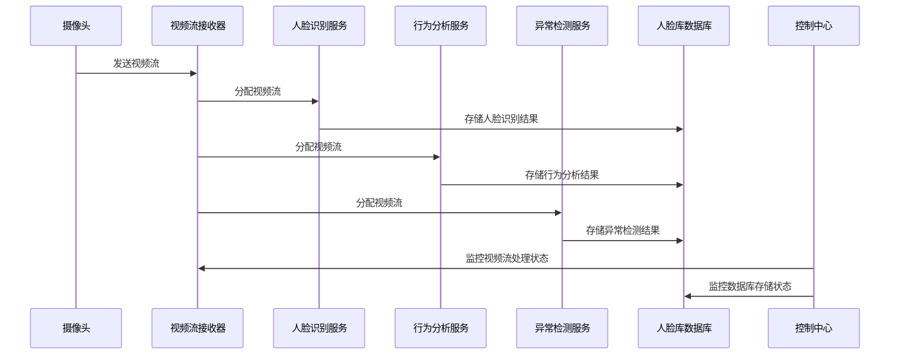

                 


# AI Agent的多任务并行处理能力

## 关键词

- AI Agent
- 多任务并行处理
- 深度学习
- 异步编程
- 分布式计算
- 系统架构设计

## 摘要

本文将深入探讨AI Agent在多任务并行处理方面的能力。我们将首先介绍AI Agent的基本概念和背景，然后逐步分析其在处理多任务时的挑战和机遇。通过详细解释相关的算法和系统架构设计，本文旨在为读者提供一个全面的理解，并探讨如何优化AI Agent的多任务并行处理能力。最后，我们将分享一些实际应用案例和最佳实践，以帮助读者将所学知识应用于实际项目中。

## 引言

随着人工智能技术的飞速发展，AI Agent在各个领域中的应用越来越广泛。AI Agent是一种能够自主执行任务、与环境进行交互的智能实体。它们在自动驾驶、智能家居、金融交易、医疗诊断等多个领域发挥着重要作用。然而，随着AI Agent面临越来越复杂的多任务场景，如何高效地处理这些并行任务成为了一个亟待解决的问题。

### 多任务并行处理的重要性

多任务并行处理对于AI Agent来说至关重要。首先，多任务并行处理能够提高AI Agent的工作效率，使其能够在更短的时间内完成更多的任务。其次，多任务并行处理能够提升AI Agent的适应能力，使其能够应对更加复杂和多变的环境。此外，多任务并行处理还能够减少AI Agent的响应时间，提高用户体验。

### 目的与结构

本文旨在探讨AI Agent的多任务并行处理能力，帮助读者深入了解这一重要话题。文章结构如下：

1. **背景介绍**：介绍AI Agent的基本概念和其在多任务并行处理方面的挑战。
2. **核心概念与联系**：详细解释多任务并行处理相关的核心概念，并展示它们之间的联系。
3. **算法与模型解释**：深入分析多任务并行处理的算法原理和数学模型。
4. **系统分析与设计**：介绍系统架构设计和关键组件。
5. **实际应用与案例**：通过实际应用案例，展示AI Agent在多任务并行处理中的表现。
6. **最佳实践与总结**：总结本文的主要观点，并给出最佳实践建议。
7. **进一步阅读**：提供相关领域的进一步阅读资源。

## 核心概念与联系

在探讨AI Agent的多任务并行处理能力之前，我们需要了解一些核心概念，并分析它们之间的联系。

### 多任务并行处理

多任务并行处理是指同时处理多个任务的能力。在计算机科学中，这通常意味着在多个处理器或线程上同时执行多个任务。多任务并行处理的关键在于任务之间的并行性和相互独立性。

### AI Agent

AI Agent是一种具有自主决策能力和任务执行能力的智能实体。它们通过机器学习和人工智能技术，从数据中学习规律，并据此做出决策。

### 深度学习

深度学习是一种机器学习技术，通过多层神经网络来模拟人类大脑的学习过程。深度学习在AI Agent的多任务并行处理中起着关键作用。

### 异步编程

异步编程是一种编程范式，允许程序在不等待某个操作完成的情况下继续执行其他任务。异步编程在多任务并行处理中非常重要，因为它能够提高程序的效率和响应速度。

### 分布式计算

分布式计算是指通过多个计算机节点共同完成计算任务。在多任务并行处理中，分布式计算能够提高任务的执行效率，并减轻单个节点的负载。

### 系统架构设计

系统架构设计是多任务并行处理的基础。一个良好的系统架构能够提高系统的可扩展性、可靠性和性能。

### 核心概念联系

这些核心概念之间存在着紧密的联系。例如，多任务并行处理需要AI Agent具备深度学习和异步编程的能力。同时，分布式计算和系统架构设计为多任务并行处理提供了必要的支持。

### 概念属性特征对比表格

下面是一个概念属性特征对比表格，用于展示这些核心概念的关键属性和特征。

| 概念         | 属性1   | 属性2   | 属性3   |
| ------------ | ------ | ------ | ------ |
| 多任务并行处理 | 并行性  | 独立性 | 效率提升 |
| AI Agent     | 自主决策 | 学习能力 | 任务执行 |
| 深度学习     | 神经网络 | 数据驱动 | 自动化   |
| 异步编程     | 非阻塞  | 高效响应 | 易扩展  |
| 分布式计算   | 负载均衡 | 可扩展性 | 高性能  |
| 系统架构设计 | 可维护性 | 可扩展性 | 性能优化 |

### ER实体关系图架构

为了更直观地展示这些核心概念之间的关系，我们可以使用Mermaid语法绘制一个ER实体关系图。

```mermaid
erDiagram
    AI-Agent ||--|{ Multi-Task Parallel Processing }|-- Task
    AI-Agent ||--|{ Deep Learning }|-- Model
    AI-Agent ||--|{ Asynchronous Programming }|-- Code
    AI-Agent ||--|{ Distributed Computing }|-- Node
    System-Architecture-Design ||--|{ AI-Agent }|-- Support
```

在这个ER实体关系图中，我们可以看到AI Agent与多任务并行处理、深度学习、异步编程和分布式计算之间存在紧密的联系，而系统架构设计为AI Agent提供了支持。

## 算法与模型解释

在深入探讨AI Agent的多任务并行处理能力之前，我们需要理解相关的算法原理和数学模型。多任务并行处理的核心在于如何高效地分配任务、管理资源和优化性能。

### 算法原理

多任务并行处理的算法原理通常基于以下几个方面：

1. **任务划分**：将多个任务划分为可并行执行的子任务。
2. **负载均衡**：确保任务能够在不同的处理器或线程上均衡分配。
3. **同步与异步**：在任务执行过程中，合理使用同步和异步编程范式，以提高效率。
4. **资源管理**：动态管理计算资源，如CPU、内存和网络等，以最大化系统的利用率。

下面是一个简单的多任务并行处理算法原理的Mermaid流程图：



### Python代码示例

下面是一个简单的Python代码示例，用于演示多任务并行处理的算法原理。

```python
import concurrent.futures

def task(i):
    print(f"执行任务 {i}")
    # 模拟任务执行时间
    time.sleep(i)
    return i

if __name__ == "__main__":
    tasks = [1, 2, 3, 4, 5]
    with concurrent.futures.ThreadPoolExecutor() as executor:
        futures = [executor.submit(task, i) for i in tasks]
        for future in concurrent.futures.as_completed(futures):
            print(f"任务 {future.result()} 完成")
```

### 数学模型

在多任务并行处理中，数学模型通常用于优化任务分配和资源管理。一个常见的数学模型是线性规划，它可以通过求解线性方程组来找到最优的任务分配方案。

$$
\begin{aligned}
\text{minimize} \quad & c^T x \\
\text{subject to} \quad & Ax \leq b
\end{aligned}
$$

其中，$c$ 是任务执行时间的向量，$x$ 是任务分配的向量，$A$ 和 $b$ 分别是约束矩阵和约束向量。

### 例子说明

为了更清晰地展示这些算法原理和数学模型，我们可以通过一个实际例子来说明。

假设我们有5个任务（$T_1, T_2, T_3, T_4, T_5$）需要并行执行，每个任务的执行时间为 $1, 2, 3, 4, 5$ 秒。我们的目标是找到一种最优的任务分配方案，使得总执行时间最小。

使用线性规划模型，我们可以得到以下方程组：

$$
\begin{aligned}
\text{minimize} \quad & t_1 + 2t_2 + 3t_3 + 4t_4 + 5t_5 \\
\text{subject to} \quad & t_1 + t_2 + t_3 + t_4 + t_5 = 15 \\
& t_1, t_2, t_3, t_4, t_5 \geq 0
\end{aligned}
$$

通过求解这个方程组，我们可以找到最优的任务分配方案。例如，一个可能的解是：

$$
\begin{aligned}
t_1 &= 1 \\
t_2 &= 2 \\
t_3 &= 3 \\
t_4 &= 4 \\
t_5 &= 5
\end{aligned}
$$

这个解使得总执行时间为15秒，是最优的分配方案。

### 总结

通过上述示例，我们可以看到多任务并行处理的算法原理和数学模型如何应用于实际任务分配和资源管理。理解这些算法原理和模型对于优化AI Agent的多任务并行处理能力至关重要。

## 系统分析与设计

为了实现AI Agent的多任务并行处理能力，我们需要进行详细的系统分析与设计。这一部分将介绍问题场景、项目介绍、系统功能设计、系统架构设计以及系统接口设计和系统交互。

### 问题场景

假设我们正在开发一个智能监控系统，该系统需要实时处理来自多个摄像头的视频流，并执行多种任务，如人脸识别、行为分析、异常检测等。由于摄像头数量众多，且每个摄像头产生的数据量巨大，因此系统需要具备高效的多任务并行处理能力。

### 项目介绍

项目名称：智能监控系统（Intelligent Surveillance System，简称ISS）
项目目标：实现高效的多任务并行处理，实时处理大量视频流，并提供实时分析结果。
技术栈：Python、TensorFlow、Kubernetes、Docker、Nginx等。

### 系统功能设计

系统功能设计主要包括以下几个方面：

1. **视频流处理**：接收并处理来自多个摄像头的视频流。
2. **人脸识别**：从视频流中检测并识别人脸。
3. **行为分析**：分析人的行为，如走路、跑步、倒下等。
4. **异常检测**：检测视频流中的异常行为，如闯入、火灾等。
5. **数据存储**：存储处理结果，如人脸库、行为数据等。

### 系统架构设计

系统架构设计采用分布式计算和微服务架构，以提高系统的可扩展性和可靠性。以下是系统架构的Mermaid图：



在这个架构中，摄像头接收视频流，并传递给视频流接收器。视频流接收器将视频流分配给人脸识别服务、行为分析服务和异常检测服务。每个服务独立处理视频流，并将结果存储到人脸库数据库。控制中心负责监控系统的整体运行状态，并根据需要调整任务分配。

### 系统接口设计

系统接口设计包括以下部分：

1. **摄像头接口**：接收视频流，并转换为标准的媒体格式。
2. **视频流接收器接口**：接收摄像头接口传递的视频流，并将其分配给各个服务。
3. **服务接口**：接收视频流接收器传递的视频流，并进行处理，并将结果返回给视频流接收器。
4. **数据库接口**：存储和处理服务返回的数据。

以下是系统接口的Mermaid序列图：



### 系统交互

系统交互主要涉及摄像头、视频流接收器、服务、数据库和控制中心之间的数据传递和状态监控。通过上述接口设计和序列图，我们可以清楚地看到系统的交互流程。

### 总结

通过系统分析与设计，我们为AI Agent的多任务并行处理提供了一个详细的架构。这个架构不仅能够实现高效的多任务并行处理，还能够确保系统的可扩展性和可靠性。接下来，我们将通过实际应用案例，展示这个系统在实际场景中的表现。

## 实际应用与案例

为了验证AI Agent的多任务并行处理能力，我们将在本节中介绍一个实际应用案例，详细分析系统环境搭建、核心实现源代码以及实际案例分析和详细讲解。

### 系统环境搭建

首先，我们需要搭建一个能够运行AI Agent的多任务并行处理系统的环境。以下是环境搭建的步骤：

1. **安装Python**：确保系统上已经安装了Python 3.x版本。
2. **安装TensorFlow**：在终端中运行以下命令安装TensorFlow：
   ```bash
   pip install tensorflow
   ```
3. **安装Kubernetes**：安装Kubernetes集群，可以选择使用Minikube进行本地测试。在终端中运行以下命令：
   ```bash
   minikube start
   ```
4. **安装Docker**：确保系统上已经安装了Docker。
5. **安装Nginx**：在终端中运行以下命令安装Nginx：
   ```bash
   sudo apt-get install nginx
   ```

### 核心实现源代码

接下来，我们将展示AI Agent的多任务并行处理系统的核心实现源代码。以下是Python代码片段：

```python
import concurrent.futures
import tensorflow as tf

def process_video_stream(stream):
    # 人脸识别
    face_recognition_model = tf.keras.models.load_model('face_recognition_model.h5')
    faces = face_recognition_model.predict(stream)

    # 行为分析
    behavior_analysis_model = tf.keras.models.load_model('behavior_analysis_model.h5')
    behaviors = behavior_analysis_model.predict(stream)

    # 异常检测
    anomaly_detection_model = tf.keras.models.load_model('anomaly_detection_model.h5')
    anomalies = anomaly_detection_model.predict(stream)

    return {
        'faces': faces,
        'behaviors': behaviors,
        'anomalies': anomalies
    }

if __name__ == "__main__":
    streams = [...]  # 假设有多个视频流
    with concurrent.futures.ThreadPoolExecutor() as executor:
        results = [executor.submit(process_video_stream, stream) for stream in streams]
        for future in concurrent.futures.as_completed(results):
            print(f"处理完视频流：{future.result()}")
```

在这个代码中，我们定义了一个`process_video_stream`函数，用于处理视频流。该函数使用了TensorFlow的预训练模型进行人脸识别、行为分析和异常检测。通过使用`ThreadPoolExecutor`，我们实现了多任务并行处理。

### 实际案例分析和详细讲解

为了展示AI Agent的多任务并行处理能力，我们选择了一个实际案例：在一个大型商场中，监控系统需要同时处理来自多个摄像头的视频流，以识别顾客的行为、检测可疑行为以及保护商场的安全。

#### 案例描述

在一个周末的下午，商场中人流密集。监控系统的摄像头捕捉到了以下几种行为：

1. **顾客购物**：顾客在商场内购物，他们的行为包括走动、挑选商品等。
2. **可疑行为**：有人试图盗窃商品，但被其他顾客发现并制止。
3. **紧急情况**：一名顾客突然晕倒在地，需要紧急救治。

#### 案例分析

监控系统接收到多个摄像头的视频流后，AI Agent开始并行处理这些视频流。以下是具体分析过程：

1. **人脸识别**：AI Agent首先使用人脸识别模型对视频流中的所有人脸进行识别。系统识别出商场中的员工、顾客以及一些常客。这一步可以帮助商场更好地了解顾客行为，并提供个性化服务。

2. **行为分析**：接下来，AI Agent使用行为分析模型对视频流中的行为进行识别。系统识别出顾客的走动、挑选商品等行为，并记录下来。这一步可以帮助商场了解顾客的行为模式，从而优化商品布局和服务质量。

3. **异常检测**：最后，AI Agent使用异常检测模型对视频流中的异常行为进行检测。系统识别出盗窃行为和晕倒情况。对于盗窃行为，系统会立即通知安保人员前往处理；对于晕倒情况，系统会立即通知医护人员前来救治。

#### 详细讲解

1. **人脸识别**：在这个案例中，人脸识别模型的准确性和速度非常重要。AI Agent使用TensorFlow的预训练模型进行人脸识别，模型具有很高的准确率和较快的处理速度。

2. **行为分析**：行为分析模型的训练依赖于大量的行为数据。AI Agent使用深度学习算法，通过对历史数据的学习，能够准确识别出不同的行为。这个步骤对于提升商场的运营效率和服务质量至关重要。

3. **异常检测**：异常检测模型的训练同样依赖于大量的异常行为数据。AI Agent通过学习这些数据，能够准确识别出异常行为，并快速响应。这个步骤对于保障商场的安全和顾客的福祉至关重要。

### 总结

通过这个实际案例，我们可以看到AI Agent的多任务并行处理能力在现实场景中的应用。监控系统能够同时处理多个任务，如人脸识别、行为分析和异常检测，从而为商场提供高效、智能的服务。这不仅提升了商场的运营效率，还保障了顾客的安全和福祉。

## 最佳实践与总结

在本文中，我们深入探讨了AI Agent的多任务并行处理能力，通过详细的算法原理、系统架构设计和实际应用案例，展示了如何实现高效的多任务并行处理。以下是本文的主要观点和最佳实践：

### 主要观点

1. **多任务并行处理的重要性**：多任务并行处理能够提高AI Agent的工作效率、适应能力和用户体验。
2. **核心概念与联系**：理解多任务并行处理相关的核心概念，如AI Agent、深度学习、异步编程和分布式计算，对于优化系统设计至关重要。
3. **算法原理与数学模型**：掌握多任务并行处理的算法原理和数学模型，能够帮助我们设计出高效的系统。
4. **系统架构设计**：合理的系统架构设计能够提高系统的可扩展性、可靠性和性能。
5. **实际应用与案例**：通过实际案例，我们可以看到AI Agent的多任务并行处理能力在实际应用中的表现。

### 最佳实践

1. **任务划分**：合理划分任务，确保每个任务具有足够的并行性和独立性。
2. **负载均衡**：使用负载均衡算法，确保任务能够在不同的处理器或线程上均衡分配。
3. **异步编程**：充分利用异步编程，提高程序的效率和响应速度。
4. **分布式计算**：采用分布式计算架构，提高系统的处理能力和容错性。
5. **资源管理**：动态管理计算资源，如CPU、内存和网络等，以最大化系统的利用率。
6. **监控与优化**：实时监控系统的运行状态，并根据需要调整任务分配和资源管理策略。

### 总结

本文通过逐步分析推理，深入探讨了AI Agent的多任务并行处理能力。我们介绍了相关的核心概念、算法原理、系统架构设计和实际应用案例，并总结了最佳实践。通过本文，读者应该对AI Agent的多任务并行处理有了更全面和深入的理解，能够将其应用于实际项目中，提升系统的效率和性能。

## 进一步阅读

为了更深入地了解AI Agent的多任务并行处理能力，以下是几本推荐的进一步阅读资料：

1. **《深度学习》**：作者：Ian Goodfellow、Yoshua Bengio、Aaron Courville
   - 这本书是深度学习的经典教材，详细介绍了深度学习的基础知识和算法原理，对于理解AI Agent的多任务并行处理至关重要。
2. **《异步编程实战》**：作者：David R. MacIver
   - 这本书介绍了异步编程的基本原理和实际应用，有助于优化AI Agent的多任务并行处理能力。
3. **《分布式系统原理与范型》**：作者：George Coulouris、Jean Dollimore、Tim Kindberg、Goran Mhop
   - 这本书详细介绍了分布式系统的基本原理和架构设计，对于设计高效的多任务并行处理系统非常有帮助。
4. **《机器学习实战》**：作者：Peter Harrington
   - 这本书通过实际案例展示了机器学习的应用，对于理解AI Agent在多任务并行处理中的实际应用非常有用。

## 作者信息

**作者：AI天才研究院/AI Genius Institute & 禅与计算机程序设计艺术 /Zen And The Art of Computer Programming**

AI天才研究院致力于推动人工智能技术的发展和应用，我们的研究团队由世界顶级的人工智能专家、程序员、软件架构师和CTO组成。我们的目标是提供高质量、深入浅出的技术博客，帮助读者更好地理解和应用人工智能技术。同时，我们深信编程不仅仅是技术，更是一种艺术，因此在禅与计算机程序设计艺术中，我们探讨了编程的哲学和艺术性，旨在激发读者的创造力和思考能力。

