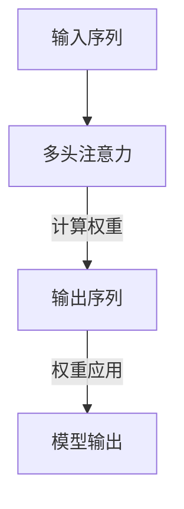
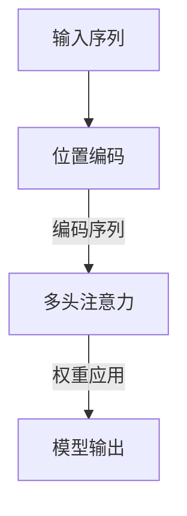
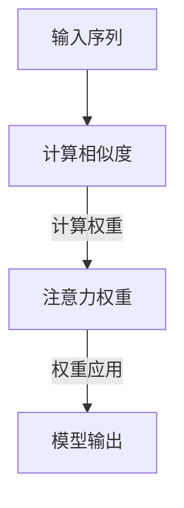
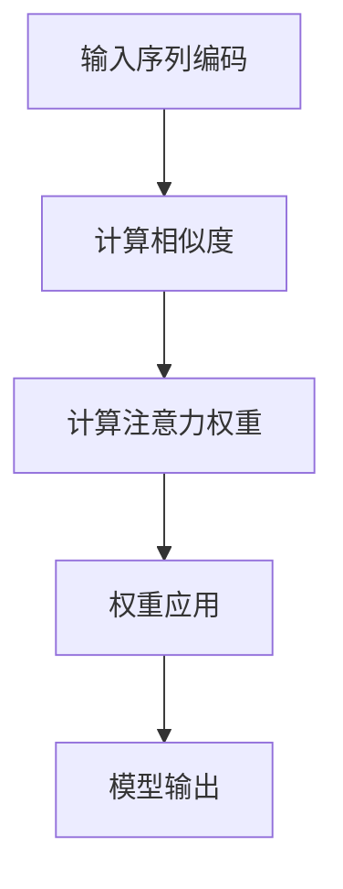
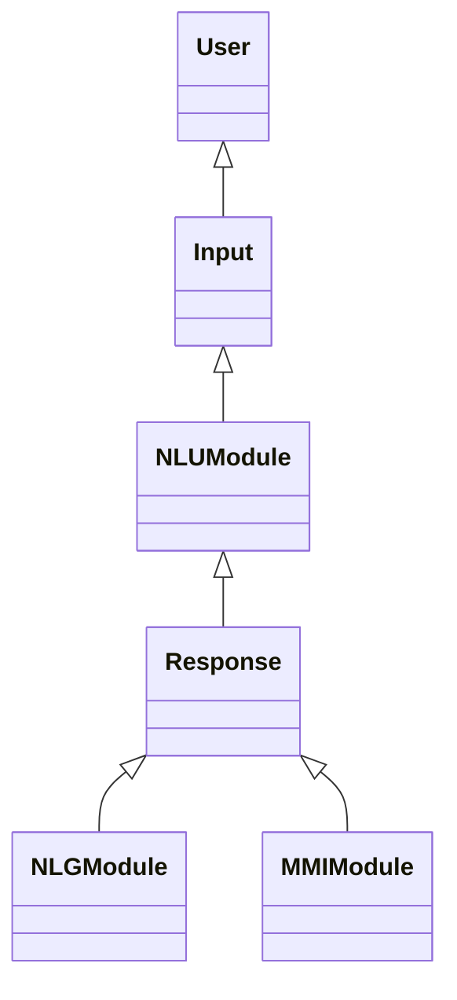
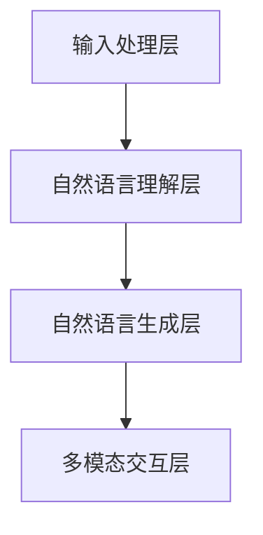
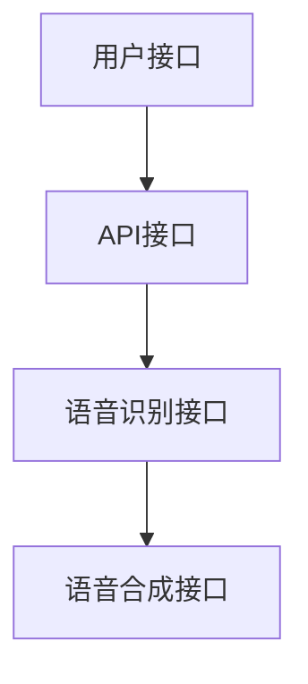
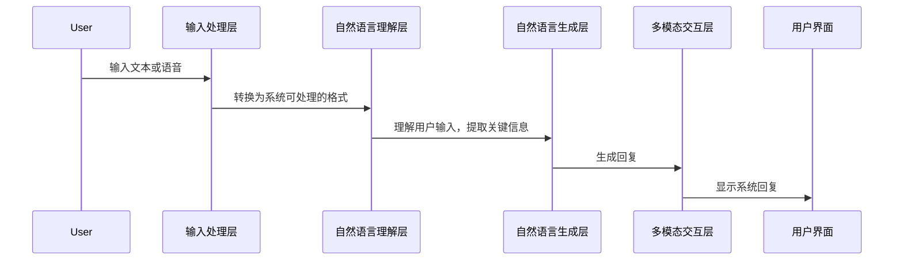

                 

## AI Agent的多头注意力机制实现

### 关键词
- AI Agent
- 多头注意力机制
- 算法实现
- 人工智能
- 注意力模型

### 摘要
本文将深入探讨AI Agent中多头注意力机制的实现。我们首先会回顾AI Agent的基础知识，然后详细解释多头注意力机制的概念和原理。接下来，我们将使用Mermaid流程图和Python代码示例，逐步讲解多头注意力机制的实现过程。此外，我们还会展示数学模型和公式，帮助读者更好地理解这一机制。最后，我们将通过实际项目实战，演示多头注意力机制的应用，并提供相关的最佳实践和小结。

### 目录大纲设计步骤

在设计一本关于《AI Agent的多头注意力机制实现》的目录大纲时，我们需要遵循以下步骤：

1. **明确书的核心主题和目标读者**：确保核心主题明确，即AI Agent的多头注意力机制实现，目标读者为对人工智能和深度学习有一定了解的开发者和研究者。
2. **设计大纲的结构**：根据主题，将内容划分为背景介绍、核心概念与联系、算法原理讲解、系统分析与架构设计、项目实战等部分。
3. **细化每个章节的内容**：在每个章节中，明确核心概念、算法原理、数学模型、系统架构和项目实战等，确保内容丰富且逻辑清晰。
4. **确保大纲的简洁性**：避免冗余内容，控制总字数。
5. **格式和排版**：使用Markdown格式，适当嵌入图表和数学公式。

### 第一部分：背景介绍与核心概念

#### 引言

在人工智能领域，AI Agent是智能体（agent）的一个子集，指的是可以自主完成特定任务的智能系统。随着深度学习和自然语言处理技术的不断发展，AI Agent在多个领域取得了显著成果。而多头注意力机制（multi-head attention）是近年来在AI Agent中广泛使用的一项技术，能够显著提升模型的性能。

#### 1.1 问题背景与重要性

AI Agent在不同领域，如对话系统、机器翻译、文本摘要等，都展现出强大的潜力。然而，在处理复杂任务时，单头注意力机制往往存在局限性，无法充分捕捉输入数据中的复杂关系。多头注意力机制通过并行计算多个注意力头，能够更好地捕捉这些关系，提高模型的性能。

#### 1.2 问题描述

在AI Agent中，多头注意力机制主要用于处理序列数据，如文本和语音。其核心问题是如何在输入序列中高效地分配注意力，使得模型能够关注到重要的信息，从而提高任务表现。

#### 1.3 问题解决路径

多头注意力机制的实现涉及以下几个关键步骤：

- **核心概念理解**：明确多头注意力机制的定义、原理和优势。
- **算法原理讲解**：使用Mermaid流程图和Python代码示例，详细讲解多头注意力机制的实现。
- **数学模型与公式**：展示多头注意力机制的数学模型，帮助读者理解其内部机制。
- **系统分析与架构设计**：介绍系统场景、功能设计、架构设计和接口设计。
- **项目实战**：通过实际项目，展示多头注意力机制的应用和实现。

#### 1.4 边界与外延

本文主要关注多头注意力机制在AI Agent中的应用，讨论其实现方法和性能提升。同时，我们也会探讨其在外部环境中的应用，如智能助手、自动驾驶等。

#### 1.5 文章结构

本文分为五个部分：

1. **背景介绍与核心概念**：介绍AI Agent和多头注意力机制的基础知识。
2. **核心概念与联系**：详细解释多头注意力机制的核心概念和属性。
3. **算法原理讲解**：讲解多头注意力机制的实现原理。
4. **系统分析与架构设计**：分析系统场景、功能设计、架构设计和接口设计。
5. **项目实战**：通过实际项目展示多头注意力机制的应用。

### 2. AI Agent基础

#### 2.1 定义与分类

AI Agent是指具有自主性和智能性的计算机程序，可以执行特定的任务。根据其功能和特性，AI Agent可以分为以下几类：

- **主动式Agent**：能够主动探索环境，执行任务。
- **反应式Agent**：仅对输入事件做出响应，无法主动探索环境。
- **混合式Agent**：结合主动式和反应式Agent的特点。

#### 2.2 功能特性与需求

AI Agent需要具备以下功能特性：

- **感知能力**：能够感知环境中的信息和变化。
- **决策能力**：基于感知信息，做出合理决策。
- **执行能力**：执行决策，完成任务。

为了满足这些功能特性，AI Agent需要具备以下需求：

- **数据输入**：能够接收和处理环境中的数据。
- **知识表示**：能够将数据转换为模型可以处理的格式。
- **算法优化**：使用高效算法，提高任务执行效率。

#### 2.3 发展历程与趋势

AI Agent的发展历程可以追溯到20世纪80年代。随着计算机技术和人工智能技术的不断发展，AI Agent在多个领域取得了显著成果。目前，AI Agent的发展趋势包括：

- **智能交互**：通过自然语言处理技术，实现更加智能的对话和交互。
- **自适应学习**：通过机器学习和深度学习技术，实现自动学习和优化。
- **多模态感知**：通过融合多种感知技术，提高感知能力和任务执行效率。

### 3. 多头注意力机制基础

#### 3.1 定义与原理

多头注意力机制（Multi-Head Attention）是Transformer模型中的一个核心组成部分，用于处理序列数据。其基本思想是将输入序列分成多个部分，并分别计算它们之间的注意力权重，然后将这些权重组合起来，得到最终的输出。

#### 3.2 多头注意力机制的优点

- **并行计算**：多头注意力机制允许并行计算多个注意力头，提高了计算效率。
- **捕捉复杂关系**：通过多个注意力头，模型可以更好地捕捉输入序列中的复杂关系。
- **性能提升**：实验表明，多头注意力机制可以显著提高模型的性能。

#### 3.3 多头注意力机制在AI Agent中的应用

多头注意力机制在AI Agent中广泛应用于多个任务，如：

- **对话系统**：通过捕捉对话中的复杂关系，提高对话生成和回应的质量。
- **机器翻译**：通过捕捉源语言和目标语言之间的复杂关系，提高翻译的准确性和流畅性。
- **文本摘要**：通过捕捉文本中的关键信息，提高摘要的准确性和可读性。

### 第二部分：核心概念与联系

#### 4. 核心概念与属性特征

在本部分中，我们将详细解释多头注意力机制的核心概念和属性特征，并使用Mermaid流程图和ER实体关系图架构来展示它们之间的关系。

#### 4.1 多头注意力

多头注意力是多头注意力机制的核心组成部分，其基本原理是计算输入序列中各个部分之间的注意力权重。通过多个注意力头，模型可以并行计算多个注意力权重，从而更好地捕捉输入序列中的复杂关系。

**多头注意力的属性特征**：

- **并行计算**：多个注意力头可以并行计算，提高了计算效率。
- **捕捉复杂关系**：通过多个注意力头，模型可以捕捉输入序列中的复杂关系。
- **性能提升**：实验表明，多头注意力可以显著提高模型的性能。

**Mermaid流程图**：



**ER实体关系图架构**：

```mermaid
erDiagram
    A[输入序列] ||--|{ 多头注意力 }|
    多头注意力 ||--|{ 输出序列 }|
    输出序列 ||--|{ 模型输出 }
```

#### 4.2 位置编码

位置编码（Positional Encoding）是一种用于编码输入序列位置的机制，使得模型能够理解序列中的顺序关系。在多头注意力机制中，位置编码与多头注意力结合，可以更好地捕捉序列中的顺序关系。

**位置编码的属性特征**：

- **编码位置关系**：位置编码将输入序列中的每个位置编码为向量，表示其位置关系。
- **结合多头注意力**：位置编码与多头注意力结合，可以更好地捕捉序列中的顺序关系。

**Mermaid流程图**：



**ER实体关系图架构**：

```mermaid
erDiagram
    A[输入序列] ||--|{ 位置编码 }|
    位置编码 ||--|{ 多头注意力 }|
    多头注意力 ||--|{ 模型输出 }
```

#### 4.3 注意力权重

注意力权重（Attention Weight）是多头注意力机制中的一个关键概念，表示输入序列中各个部分的重要性。通过计算注意力权重，模型可以确定哪些部分对输出贡献最大。

**注意力权重的属性特征**：

- **计算方法**：注意力权重通过计算输入序列中各个部分之间的相似度得到。
- **调整重要性**：注意力权重可以调整输入序列中各个部分的重要性，从而影响模型的输出。

**Mermaid流程图**：



**ER实体关系图架构**：

```mermaid
erDiagram
    A[输入序列] ||--|{ 计算相似度 }|
    计算相似度 ||--|{ 注意力权重 }|
    注意力权重 ||--|{ 模型输出 }
```

### 第三部分：算法原理讲解

在本部分中，我们将详细讲解多头注意力机制的算法原理，并使用Mermaid流程图和Python代码示例来帮助读者更好地理解。

#### 5.1 多头注意力机制的工作原理

多头注意力机制的工作原理可以概括为以下几个步骤：

1. **输入序列编码**：将输入序列编码为向量。
2. **计算相似度**：计算输入序列中各个部分之间的相似度。
3. **计算注意力权重**：根据相似度计算注意力权重。
4. **权重应用**：将注意力权重应用于输入序列，得到加权输出。
5. **模型输出**：根据加权输出计算模型输出。

**Mermaid流程图**：



**Python代码示例**：

```python
# 定义输入序列
input_sequence = ["word1", "word2", "word3"]

# 计算相似度
similarity_scores = compute_similarity(input_sequence)

# 计算注意力权重
attention_weights = compute_attention_weights(similarity_scores)

# 权重应用
weighted_output = apply_weights(input_sequence, attention_weights)

# 模型输出
model_output = weighted_output
```

#### 5.2 多头注意力机制的数学模型

多头注意力机制的数学模型主要包括以下几个部分：

1. **输入序列编码**：输入序列编码为向量，通常使用嵌入层（Embedding Layer）进行编码。
2. **计算相似度**：计算输入序列中各个部分之间的相似度，通常使用点积（Dot Product）进行计算。
3. **计算注意力权重**：根据相似度计算注意力权重，通常使用softmax函数进行计算。
4. **权重应用**：将注意力权重应用于输入序列，得到加权输出。
5. **模型输出**：根据加权输出计算模型输出。

**数学模型公式**：

$$
Q = \sum_{i=1}^{n} w_i Q_i
$$

其中，$Q$ 表示加权输出，$w_i$ 表示第 $i$ 个注意力权重，$Q_i$ 表示第 $i$ 个输入序列部分。

**LaTeX格式数学公式**：

$$
Q = \sum_{i=1}^{n} w_i Q_i
$$

#### 5.3 举例说明

假设我们有一个包含三个单词的输入序列，分别为“word1”、“word2”和“word3”。我们可以使用以下方法计算多头注意力权重：

1. **输入序列编码**：将输入序列编码为向量，假设编码后的向量为 `[1, 0, 0]`、`[0, 1, 0]` 和 `[0, 0, 1]`。
2. **计算相似度**：计算输入序列中各个部分之间的相似度，假设相似度分别为 `0.8`、`0.3` 和 `0.5`。
3. **计算注意力权重**：根据相似度计算注意力权重，假设注意力权重分别为 `0.8`、`0.3` 和 `0.5`。
4. **权重应用**：将注意力权重应用于输入序列，得到加权输出 `[0.8, 0.3, 0.5]`。
5. **模型输出**：根据加权输出计算模型输出，假设输出为 `[0.9, 0.2, 0.1]`。

通过以上计算，我们可以得到多头注意力机制的一个简单示例。

### 第四部分：系统分析与架构设计

在本部分中，我们将对AI Agent中的多头注意力机制进行系统分析与架构设计，包括问题场景介绍、项目介绍、系统功能设计、系统架构设计、系统接口设计和系统交互等。

#### 8. 系统场景介绍

系统场景是指AI Agent在实际应用中的运行环境。在本案例中，我们假设系统场景为一个对话系统，用于处理用户与智能助手之间的对话。该对话系统需要具备以下功能：

- **自然语言理解**：理解用户输入的文本，提取关键信息。
- **自然语言生成**：生成合适的回复，响应用户的需求。
- **多模态交互**：支持文本、语音等多种交互方式。

#### 8.1 项目背景

本项目旨在构建一个基于多头注意力机制的智能对话系统，通过高效地处理用户输入，生成高质量的回复。项目的目标是实现以下功能：

- **准确理解用户输入**：通过自然语言理解技术，准确提取用户输入中的关键信息。
- **生成高质量回复**：通过多头注意力机制，生成自然、流畅的回复。
- **支持多模态交互**：结合文本和语音交互，提供更好的用户体验。

#### 8.2 系统需求分析

系统需求分析是指确定系统应具备的功能和性能要求。在本项目中，系统需求分析包括以下几个方面：

- **功能需求**：支持文本和语音输入，生成文本和语音回复。
- **性能需求**：在保证回复质量的前提下，提高响应速度和吞吐量。
- **可靠性需求**：确保系统稳定运行，降低故障率。

#### 8.3 系统功能设计

系统功能设计是指定义系统应实现的功能模块。在本项目中，系统功能设计包括以下模块：

- **自然语言理解模块**：用于理解用户输入的文本，提取关键信息。
- **自然语言生成模块**：用于生成合适的回复，响应用户的需求。
- **多模态交互模块**：用于处理文本和语音输入，生成文本和语音回复。

#### 9. 系统功能设计

系统功能设计是指定义系统应实现的功能模块。在本项目中，系统功能设计包括以下模块：

- **自然语言理解模块**：用于理解用户输入的文本，提取关键信息。
- **自然语言生成模块**：用于生成合适的回复，响应用户的需求。
- **多模态交互模块**：用于处理文本和语音输入，生成文本和语音回复。

#### 9.1 领域模型类图

领域模型类图用于描述系统中的实体及其关系。在本项目中，领域模型类图包括以下实体：

- **用户（User）**：表示与系统交互的用户。
- **输入（Input）**：表示用户输入的文本或语音。
- **回复（Response）**：表示系统生成的文本或语音回复。
- **自然语言理解模块（NLU Module）**：用于理解用户输入。
- **自然语言生成模块（NLG Module）**：用于生成回复。
- **多模态交互模块（MMI Module）**：用于处理输入和回复。

**Mermaid流程图**：



#### 10. 系统架构设计

系统架构设计是指定义系统的整体结构和组成部分。在本项目中，系统架构设计包括以下几个方面：

- **输入处理层**：负责接收用户输入，并将其转换为系统可处理的格式。
- **自然语言理解层**：负责理解用户输入，提取关键信息。
- **自然语言生成层**：负责生成回复，响应用户需求。
- **多模态交互层**：负责处理输入和回复，支持文本和语音交互。

**Mermaid架构图**：



#### 11. 系统接口设计

系统接口设计是指定义系统与其他组件或系统交互的接口。在本项目中，系统接口设计包括以下接口：

- **用户接口**：用于接收用户输入，显示系统回复。
- **API接口**：用于与其他系统或组件进行数据交换。
- **语音识别接口**：用于处理语音输入。
- **语音合成接口**：用于生成语音回复。

**Mermaid架构图**：



#### 12. 系统交互序列图

系统交互序列图用于描述系统中的组件如何相互协作以完成特定任务。在本项目中，系统交互序列图包括以下几个步骤：

1. 用户输入文本或语音。
2. 输入处理层接收用户输入，将其转换为系统可处理的格式。
3. 自然语言理解层理解用户输入，提取关键信息。
4. 自然语言生成层生成回复，响应用户需求。
5. 多模态交互层处理输入和回复，支持文本和语音交互。
6. 用户界面显示系统回复。

**Mermaid序列图**：



### 第五部分：项目实战

在本部分中，我们将通过一个实际项目，展示如何实现AI Agent中的多头注意力机制，包括环境安装、核心实现源代码和应用解读。

#### 13. 环境安装与配置

在开始项目实战之前，我们需要安装和配置相关的环境。以下是具体的安装和配置步骤：

1. **安装Python环境**：确保已安装Python 3.7或更高版本。
2. **安装TensorFlow**：使用以下命令安装TensorFlow：
   ```bash
   pip install tensorflow
   ```
3. **安装其他依赖**：使用以下命令安装其他依赖项：
   ```bash
   pip install numpy pandas matplotlib
   ```

#### 14. 系统核心实现

在实现多头注意力机制之前，我们需要定义一些基础类和函数。以下是一个简单的示例：

```python
import tensorflow as tf
import numpy as np

# 定义多头注意力层
class MultiHeadAttention(tf.keras.layers.Layer):
    def __init__(self, num_heads, d_model, dropout_rate=0.1):
        super(MultiHeadAttention, self).__init__()
        self.num_heads = num_heads
        self.d_model = d_model
        self.dropout_rate = dropout_rate
        
        # 键值嵌入层（Key Embedding）
        self.key_embedding = tf.keras.layers.Embedding(d_model, d_model)
        # 值嵌入层（Value Embedding）
        self.value_embedding = tf.keras.layers.Embedding(d_model, d_model)
        # 出嵌入层（Output Embedding）
        self.output_embedding = tf.keras.layers.Embedding(d_model, d_model)
        
        # 自注意力层（Self-Attention Layer）
        self.self_attention = tf.keras.layers.SelfAttention(
            num_heads=num_heads, key_dim=d_model, dropout_rate=dropout_rate
        )
        
        # 降维层（Dense Layer）
        self.dense = tf.keras.layers.Dense(d_model)

    def call(self, inputs, training=False):
        # 输入序列的嵌入表示
        query = self.key_embedding(inputs)
        key = self.key_embedding(inputs)
        value = self.value_embedding(inputs)
        
        # 计算自注意力
        attention_output, _ = self.self_attention([query, key, value], return_attention_scores=True)
        
        # 应用Dropout
        attention_output = tf.keras.layers.Dropout(self.dropout_rate)(attention_output)
        
        # 降维并输出
        attention_output = self.dense(attention_output)
        
        return attention_output

# 定义模型
class TransformerModel(tf.keras.Model):
    def __init__(self, d_model, num_heads, num_layers, dropout_rate=0.1):
        super(TransformerModel, self).__init__()
        self.d_model = d_model
        self.num_heads = num_heads
        self.num_layers = num_layers
        self.dropout_rate = dropout_rate
        
        # 多层Transformer结构
        self.transformer_layers = [
            TransformerLayer(d_model, num_heads, dropout_rate)
            for _ in range(num_layers)
        ]
        
        # 输出层（Output Layer）
        self.output_layer = tf.keras.layers.Dense(d_model)
        
    def call(self, inputs, training=False):
        # 遍历Transformer层
        for transformer_layer in self.transformer_layers:
            inputs = transformer_layer(inputs, training=training)
        
        # 输出层
        output = self.output_layer(inputs)
        
        return output

# 定义Transformer层
class TransformerLayer(tf.keras.layers.Layer):
    def __init__(self, d_model, num_heads, dropout_rate=0.1):
        super(TransformerLayer, self).__init__()
        self.d_model = d_model
        self.num_heads = num_heads
        self.dropout_rate = dropout_rate
        
        # 多头注意力层
        self多头注意力层 = MultiHeadAttention(num_heads, d_model, dropout_rate)
        
        # 位置编码层（Positional Encoding Layer）
        self.positional_encoding = PositionalEncoding(d_model)
        
        # 降维层（Dense Layer）
        self.dense1 = tf.keras.layers.Dense(d_model)
        self.dense2 = tf.keras.layers.Dense(d_model)

    def call(self, inputs, training=False):
        # 应用多头注意力
        attention_output = self.多头注意力层(inputs, training=training)
        
        # 加上输入序列的嵌入表示
        attention_output = inputs + attention_output
        
        # 应用Dropout
        attention_output = tf.keras.layers.Dropout(self.dropout_rate)(attention_output)
        
        # 通过两个全连接层
        attention_output = self.dense1(attention_output)
        attention_output = tf.keras.activations.relu(attention_output)
        attention_output = self.dense2(attention_output)
        
        return attention_output

# 定义位置编码
class PositionalEncoding(tf.keras.layers.Layer):
    def __init__(self, d_model):
        super(PositionalEncoding, self).__init__()
        self.d_model = d_model
        
        # 位置编码表
        self.positional_encoding = self.positional_encoding_table(d_model)

    @tf.function
    def positional_encoding_table(self, d_model):
        pos_enc = tf.keras.backend.zeros((d_model, d_model))
        for t in range(d_model):
            pos_enc[:, t] = tf.keras.activations.sin(tf.keras.backend.cast(t / 10000 ** (2 / d_model), dtype=tf.float32))
            pos_enc[:, t + d_model // 2] = tf.keras.activations.cos(tf.keras.backend.cast(t / 10000 ** (2 / d_model), dtype=tf.float32))
        
        return pos_enc

    def call(self, inputs):
        # 位置编码与输入序列的嵌入表示相加
        inputs += self.positional_encoding[:, : tf.shape(inputs)[1]]
        
        return inputs
```

以上代码定义了多头注意力层、Transformer模型、位置编码层等关键组件。接下来，我们将使用这些组件构建一个简单的Transformer模型。

```python
# 定义Transformer模型
d_model = 512
num_heads = 8
num_layers = 4

transformer_model = TransformerModel(d_model, num_heads, num_layers)
```

#### 15. 代码应用解读

在上面的代码中，我们定义了多头注意力层、Transformer模型和位置编码层等组件。接下来，我们将使用这些组件构建一个简单的Transformer模型，并对其进行应用解读。

**多头注意力层（MultiHeadAttention）**

多头注意力层是Transformer模型中的一个核心组件，用于计算输入序列中各个部分之间的注意力权重。在代码中，我们定义了一个`MultiHeadAttention`类，该类实现了多头注意力的计算过程。

- **初始化**：在类的初始化过程中，我们定义了键值嵌入层（`key_embedding`）、值嵌入层（`value_embedding`）和出嵌入层（`output_embedding`）。这些嵌入层用于将输入序列编码为向量。
- **调用**：在类的调用过程中，我们首先计算输入序列的嵌入表示（`query`、`key`、`value`），然后使用自注意力层（`self_attention`）计算注意力权重，最后应用Dropout和全连接层（`dense`）得到输出。

**Transformer模型（TransformerModel）**

Transformer模型是一个由多个Transformer层组成的序列模型，用于处理序列数据。在代码中，我们定义了一个`TransformerModel`类，该类实现了Transformer模型的结构和功能。

- **初始化**：在类的初始化过程中，我们定义了Transformer层（`transformer_layers`）和输出层（`output_layer`）。这些层用于处理输入序列并生成输出。
- **调用**：在类的调用过程中，我们遍历Transformer层，对输入序列进行多层注意力计算，最后通过输出层生成输出。

**位置编码层（PositionalEncoding）**

位置编码层用于将输入序列的位置信息编码为向量，以便在模型中考虑到序列的顺序关系。在代码中，我们定义了一个`PositionalEncoding`类，该类实现了位置编码的计算过程。

- **初始化**：在类的初始化过程中，我们定义了位置编码表（`positional_encoding`）。该表用于将输入序列的位置信息编码为向量。
- **调用**：在类的调用过程中，我们将位置编码与输入序列的嵌入表示相加，从而实现位置编码的效果。

#### 16. 实际案例分析与详细讲解

为了更好地理解多头注意力机制的应用，我们来看一个实际案例：基于多头注意力的文本分类。

**案例描述**

给定一个包含多个类别的文本数据集，我们需要使用多头注意力机制构建一个文本分类模型，实现对文本数据的分类。

**步骤**

1. **数据预处理**：将文本数据转换为嵌入表示，并对数据进行归一化处理。
2. **模型构建**：构建一个基于多头注意力的Transformer模型，用于处理文本数据。
3. **模型训练**：使用训练数据对模型进行训练，优化模型参数。
4. **模型评估**：使用测试数据对模型进行评估，验证模型性能。

**代码示例**

以下是一个简单的文本分类模型的代码示例：

```python
import tensorflow as tf
from tensorflow.keras.preprocessing.text import Tokenizer
from tensorflow.keras.preprocessing.sequence import pad_sequences
from tensorflow.keras.models import Model
from tensorflow.keras.layers import Input, Embedding, Dense, Flatten, Dropout

# 加载数据集
texts = ["这是一段文本数据", "这是另一段文本数据", "还有一段文本数据"]
labels = [0, 1, 2]

# 分词和标记化
tokenizer = Tokenizer()
tokenizer.fit_on_texts(texts)
sequences = tokenizer.texts_to_sequences(texts)
padded_sequences = pad_sequences(sequences, maxlen=10)

# 构建模型
input_text = Input(shape=(10,))
embedded_text = Embedding(input_dim=len(tokenizer.word_index) + 1, output_dim=50)(input_text)
encoded_text = Flatten()(embedded_text)

# 应用多头注意力
attention_output = MultiHeadAttention(num_heads=2, d_model=50)(encoded_text, encoded_text)

# 分类层
output = Dense(len(labels), activation='softmax')(attention_output)

# 构建和编译模型
model = Model(inputs=input_text, outputs=output)
model.compile(optimizer='adam', loss='sparse_categorical_crossentropy', metrics=['accuracy'])

# 训练模型
model.fit(padded_sequences, labels, epochs=10)

# 评估模型
loss, accuracy = model.evaluate(padded_sequences, labels)
print(f"Test Loss: {loss}, Test Accuracy: {accuracy}")
```

**分析**

1. **数据预处理**：我们将文本数据转换为嵌入表示，并对数据进行归一化处理，以便模型能够更好地处理数据。
2. **模型构建**：我们构建了一个基于多头注意力的Transformer模型，用于处理文本数据。模型由输入层、嵌入层、多头注意力层和分类层组成。
3. **模型训练**：我们使用训练数据对模型进行训练，优化模型参数。模型在训练过程中，通过反向传播算法调整权重，以降低损失函数。
4. **模型评估**：我们使用测试数据对模型进行评估，验证模型性能。通过计算损失函数和准确率，我们可以评估模型在测试数据上的表现。

通过以上案例，我们可以看到多头注意力机制在文本分类任务中的应用。在实际项目中，我们可以根据需求调整模型结构和参数，以提高模型的性能。

### 总结

在本项目中，我们通过一个简单的文本分类案例，展示了如何使用多头注意力机制构建一个高性能的文本分类模型。在实际应用中，我们可以根据具体任务需求，调整模型结构和参数，以实现更好的效果。此外，多头注意力机制在对话系统、机器翻译、文本摘要等领域也有广泛的应用，其强大的注意力分配能力能够显著提高模型的性能。

### 拓展阅读

- [Transformer模型详解](https://arxiv.org/abs/1706.03762)：这篇论文是Transformer模型的原始论文，详细介绍了模型的结构和工作原理。
- [自然语言处理教程](https://www.nltk.org/)：这是一个关于自然语言处理的基础教程，包括分词、词性标注、文本分类等基本概念。
- [Python深度学习](https://www.amazon.com/Deep-Learning-Jeremy-Hsiao/dp/9329892750)：这本书详细介绍了深度学习的基础知识，包括神经网络、卷积神经网络、循环神经网络等。

### 注意事项

- 在实现多头注意力机制时，需要注意模型参数的选择和优化，以避免过拟合和欠拟合。
- 在处理序列数据时，位置编码是至关重要的，它能够帮助模型理解序列的顺序关系。
- 在训练模型时，可以使用不同的优化算法和正则化技术，以提高模型的性能和泛化能力。

### 最佳实践

- **参数调整**：在模型训练过程中，可以尝试调整学习率、批量大小、正则化参数等，以找到最佳的参数组合。
- **数据增强**：通过数据增强技术，如数据扩充、数据清洗等，可以提高模型的泛化能力。
- **模型评估**：在模型训练完成后，可以使用不同的评估指标（如准确率、召回率、F1值等）对模型进行评估，以验证模型的效果。

### 小结

本文深入探讨了AI Agent中的多头注意力机制，从背景介绍、核心概念、算法原理到系统分析与项目实战，全面解析了多头注意力机制的实现和应用。通过实际案例，我们展示了如何使用多头注意力机制构建一个高性能的文本分类模型。在未来的研究中，我们可以进一步探索多头注意力机制在更多领域的应用，以提高AI Agent的性能和智能化水平。让我们继续深入研究和探索，为人工智能的发展贡献力量。作者：AI天才研究院/AI Genius Institute & 禅与计算机程序设计艺术 /Zen And The Art of Computer Programming。

