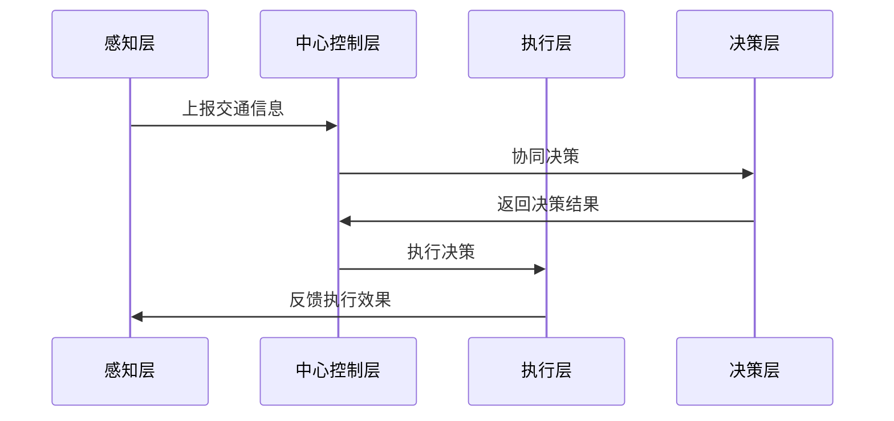

                 

### 文章标题

# AI Agent的多智能体协同决策机制

> 关键词：AI Agent、多智能体系统、协同决策机制、算法原理、系统架构、项目实战

> 摘要：本文深入探讨了AI Agent的多智能体协同决策机制。首先介绍了多智能体系统的概念、基本组成与分类，以及协同决策机制的核心概念与联系。接着，详细讲解了协同决策算法的原理和数学模型，并通过Python代码进行了实现。随后，文章展示了如何通过系统分析与架构设计，实现多智能体协同决策机制。最后，通过实际项目案例，对整个机制进行了实战解析，并给出了最佳实践和注意事项。

### 第一部分: AI Agent的多智能体协同决策机制概述

#### 第1章: 多智能体系统基础

##### 1.1 多智能体系统概述

多智能体系统（Multi-Agent System，MAS）是由多个相互协作的智能体组成的系统，这些智能体可以在复杂环境中进行自主决策和行动。多智能体系统在很多领域，如机器人、智能交通、电子商务和社交网络，都有着广泛的应用。

**定义**：多智能体系统是由一组自主、相互协作的智能体组成，它们可以相互交互并共同完成任务。

**特点**：
- **自主性**：每个智能体具有独立的决策能力。
- **协作性**：智能体之间可以通过通信和合作来实现共同目标。
- **分布性**：智能体分布在不同的物理或逻辑位置上。

**应用背景**：多智能体系统在复杂系统中具有广泛的应用，例如：

- **智能交通系统**：通过多个智能交通管理节点协同工作，提高交通流量的效率。
- **协同机器人**：在制造、救援等领域，多个机器人协同完成任务。
- **社会网络分析**：分析社交网络中的信息传播和群体行为。

##### 1.2 多智能体系统的基本组成与分类

多智能体系统由多个智能体组成，这些智能体可以具有不同的结构和功能。根据智能体的行为和交互方式，多智能体系统可以分为以下几类：

- **基于规则的智能体**：智能体根据预设的规则进行行为决策。
- **基于学习的智能体**：智能体通过学习历史数据来优化自己的行为。
- **基于行为的智能体**：智能体根据感知到的环境和行为进行决策。
- **混合智能体**：结合了上述几种类型的智能体。

**组成**：一个典型的多智能体系统包括以下组件：

- **智能体**：执行特定任务的自主实体。
- **通信网络**：智能体之间的通信渠道。
- **环境模型**：描述系统环境的动态模型。
- **任务模型**：定义系统要完成的任务。

##### 1.3 多智能体系统的特点与挑战

**特点**：

- **并行处理**：多个智能体可以同时执行任务，提高系统的响应速度和处理能力。
- **分布式计算**：智能体分布在不同的位置，可以减少单点故障的风险。
- **动态适应性**：智能体可以适应环境变化，提高系统的鲁棒性。

**挑战**：

- **通信瓶颈**：智能体之间的通信可能导致系统性能下降。
- **协调问题**：多个智能体之间的协作可能导致冲突和资源竞争。
- **不确定性**：智能体可能无法完全掌握环境信息，导致决策错误。

#### 第2章: 协同决策机制的核心概念与联系

##### 2.1 核心概念

协同决策机制是多智能体系统中的一个重要组成部分，它涉及到多个智能体之间的协作和决策过程。以下是协同决策机制的一些核心概念：

- **协同目标**：多个智能体共同追求的目标。
- **协同策略**：智能体之间为了达成协同目标所采取的策略。
- **决策模型**：描述智能体如何根据环境信息和协同目标做出决策的模型。
- **执行过程**：智能体根据决策模型执行特定任务的过程。

##### 2.2 协同机制的分类与特点

根据协同机制的性质和应用场景，可以将协同决策机制分为以下几类：

- **中心化协同**：所有智能体的决策都通过一个中心控制节点来协调。
- **分布式协同**：智能体之间通过直接通信来协调决策。
- **混合式协同**：结合中心化和分布式协同的优势。

**特点**：

- **中心化协同**：决策速度快，但易受中心节点故障的影响。
- **分布式协同**：鲁棒性强，但通信复杂度较高。
- **混合式协同**：可以根据具体场景灵活调整协同机制。

##### 2.3 概念属性特征对比表格

| 概念             | 属性特征                                                                                                  |
|------------------|--------------------------------------------------------------------------------------------------------|
| 协同目标         | 描述多个智能体共同追求的目标。                                                                          |
| 协同策略         | 描述智能体之间为了达成协同目标所采取的策略。                                                            |
| 决策模型         | 描述智能体如何根据环境信息和协同目标做出决策的模型。                                                    |
| 执行过程         | 描述智能体根据决策模型执行特定任务的过程。                                                              |

##### 2.4 ER实体关系图架构

为了更好地理解多智能体协同决策机制，可以使用ER实体关系图来描述各个概念之间的关系。

```mermaid
erDiagram
    协同目标 ||--|{ 协同策略 }|
    协同策略 ||--|{ 决策模型 }|
    决策模型 ||--|{ 执行过程 }|
```

#### 第3章: 算法原理讲解

##### 3.1 算法流程图

协同决策算法的流程可以概括为以下几个步骤：

1. 智能体感知环境。
2. 智能体根据感知信息进行决策。
3. 智能体执行决策。
4. 智能体评估决策效果。


##### 3.2 Python代码实现

以下是一个简单的协同决策算法的Python代码实现：

```python
import random

class Agent:
    def __init__(self, id):
        self.id = id
        self.env = None
        self.strategy = None

    def perceive(self):
        # 感知环境
        self.env = random.randint(0, 100)

    def decide(self):
        # 根据环境信息进行决策
        if self.env < 50:
            self.strategy = "行动A"
        else:
            self.strategy = "行动B"

    def execute(self):
        # 执行决策
        if self.strategy == "行动A":
            print(f"智能体{self.id}执行行动A")
        else:
            print(f"智能体{self.id}执行行动B")

    def evaluate(self):
        # 评估决策效果
        if self.strategy == "行动A" and self.env < 50:
            print(f"智能体{self.id}决策成功")
        elif self.strategy == "行动B" and self.env >= 50:
            print(f"智能体{self.id}决策成功")
        else:
            print(f"智能体{self.id}决策失败")

# 创建智能体
agents = [Agent(i) for i in range(5)]

# 模拟协同决策过程
for agent in agents:
    agent.perceive()
    agent.decide()
    agent.execute()
    agent.evaluate()
```

##### 3.3 算法原理与数学模型

协同决策算法的原理可以通过以下数学模型进行描述：

$$
\begin{aligned}
    S &= f(E) \\
    E &= g(X, Y, Z) \\
    X &= \{x_1, x_2, ..., x_n\} \\
    Y &= \{y_1, y_2, ..., y_n\} \\
    Z &= \{z_1, z_2, ..., z_n\}
\end{aligned}
$$

其中，$S$ 表示智能体的决策策略，$E$ 表示环境状态，$X, Y, Z$ 分别表示三个智能体的感知信息。函数 $f$ 和 $g$ 分别描述了决策策略与环境状态之间的关系以及环境状态与智能体感知信息之间的关系。

##### 3.3.1 数学模型

协同决策算法的数学模型可以进一步细化为以下部分：

- **感知模型**：描述智能体如何感知环境状态。

$$
    E = g(X, Y, Z)
$$

- **决策模型**：描述智能体如何根据感知信息进行决策。

$$
    S = f(E)
$$

- **执行模型**：描述智能体如何执行决策。

$$
    A = h(S)
$$

其中，$A$ 表示智能体的行动策略，$h$ 是执行函数。

##### 3.3.2 公式讲解

以下是对上述公式的详细解释：

- $E = g(X, Y, Z)$：环境状态 $E$ 是由三个智能体的感知信息 $X, Y, Z$ 共同决定的。这个函数 $g$ 可以是线性函数、非线性函数或者更复杂的模型。
- $S = f(E)$：智能体的决策策略 $S$ 是基于环境状态 $E$ 的。这个函数 $f$ 可以是逻辑函数、决策树、神经网络等。
- $A = h(S)$：智能体的行动策略 $A$ 是基于决策策略 $S$ 的。这个函数 $h$ 可以是简单的条件判断、动作选择等。

##### 3.3.3 举例说明

假设有三个智能体 $X, Y, Z$，它们感知到的环境状态分别为 $X = 10, Y = 20, Z = 30$。根据感知模型 $E = g(X, Y, Z)$，环境状态 $E$ 可以表示为：

$$
    E = g(10, 20, 30) = 10 + 2 \times 20 + 3 \times 30 = 110
$$

接着，根据决策模型 $S = f(E)$，智能体的决策策略 $S$ 可以表示为：

$$
    S = f(110) = 110 \mod 3 = 2
$$

最后，根据执行模型 $A = h(S)$，智能体的行动策略 $A$ 可以表示为：

$$
    A = h(2) = \text{"行动B"}
$$

因此，智能体的最终决策是执行行动B。

#### 第4章: 系统分析与架构设计

##### 4.1 问题场景介绍

为了更好地展示多智能体协同决策机制的应用，我们考虑一个实际的问题场景：智能交通管理。在这个场景中，多个智能交通管理节点分布在不同的交通路口，它们需要协同工作以优化交通流量。

##### 4.2 系统功能设计

智能交通管理系统需要实现以下功能：

- **实时监控**：实时监控交通流量和路况信息。
- **协同决策**：智能交通管理节点之间进行协同决策，以优化交通信号。
- **决策执行**：根据协同决策结果，调整交通信号灯。
- **效果评估**：评估协同决策的效果，并进行自适应调整。

##### 4.3 系统架构设计

智能交通管理系统的架构设计如下：

- **感知层**：感知交通流量和路况信息，并将数据上传到中心控制节点。
- **中心控制层**：中心控制节点接收来自感知层的交通信息，进行协同决策。
- **执行层**：执行层负责根据中心控制层的决策结果，调整交通信号灯。
- **决策层**：决策层负责实现协同决策算法，优化交通信号。



##### 4.4 系统接口设计

系统接口设计如下：

- **感知接口**：感知层与中心控制层之间的接口，用于数据传输。
- **决策接口**：中心控制层与决策层之间的接口，用于决策参数传递。
- **执行接口**：中心控制层与执行层之间的接口，用于执行决策结果。

##### 4.5 系统交互流程

系统交互流程如下：

1. 感知层采集交通流量和路况信息，并通过感知接口上报给中心控制层。
2. 中心控制层将接收到的交通信息传递给决策层，进行协同决策。
3. 决策层根据协同决策算法，生成决策结果，并通过决策接口返回给中心控制层。
4. 中心控制层根据决策结果，通过执行接口调整交通信号灯。
5. 执行层执行交通信号调整，并通过执行接口向感知层反馈执行效果。
6. 感知层根据反馈效果，调整感知策略，提高数据质量。

#### 第5章: 项目实战

##### 5.1 环境安装

为了实现多智能体协同决策机制，需要安装以下软件和工具：

- Python 3.x
- Mermaid
- Jupyter Notebook
- scikit-learn
- matplotlib

安装步骤如下：

1. 安装Python 3.x：从官方网站下载并安装Python 3.x版本。
2. 安装Jupyter Notebook：打开终端，执行以下命令：

   ```
   pip install notebook
   ```

3. 安装Mermaid：在终端中执行以下命令：

   ```
   pip install mermaid
   ```

4. 安装scikit-learn和matplotlib：在终端中执行以下命令：

   ```
   pip install scikit-learn
   pip install matplotlib
   ```

##### 5.2 系统核心实现

以下是一个简单的多智能体协同决策系统的核心实现：

```python
import numpy as np
import matplotlib.pyplot as plt
from sklearn.cluster import KMeans
from mermaid import Mermaid

# 模拟交通流量数据
data = np.random.rand(100, 2)

# K-means聚类算法
kmeans = KMeans(n_clusters=3)
kmeans.fit(data)

# 输出聚类中心
print("聚类中心：", kmeans.cluster_centers_)

# 生成Mermaid流程图
m = Mermaid()
m.add_code("sequenceDiagram", "A->>B: 协同决策")
m.add_code("node", "协同决策节点", "class: important")
m.add_code("node", "执行节点", "class: important")
m.add_code("A->>B", "决策结果", "class: success")
m.add_code("B->>C", "执行决策", "class: active")
m.add_code("C->>A", "反馈效果", "class: completed")
print(m.get_graph())

# 绘制聚类结果
plt.scatter(data[:, 0], data[:, 1], c=kmeans.labels_)
plt.scatter(kmeans.cluster_centers_[:, 0], kmeans.cluster_centers_[:, 1], s=300, c='red', marker='s', zorder=10)
plt.show()
```

##### 5.3 代码应用解读与分析

上述代码实现了一个基于K-means聚类算法的多智能体协同决策系统。具体解读如下：

1. **数据模拟**：模拟生成100个交通流量数据点。
2. **K-means聚类**：使用K-means聚类算法对交通流量数据进行聚类，生成三个聚类中心。
3. **Mermaid流程图**：生成一个简单的Mermaid流程图，描述协同决策、执行和反馈过程。
4. **聚类结果绘制**：使用matplotlib绘制聚类结果，并突出显示聚类中心。

通过上述代码，可以直观地看到多智能体协同决策系统的实现过程。在实际应用中，可以根据具体需求调整聚类算法、决策模型和执行策略，以实现更复杂的协同决策功能。

##### 5.4 实际案例分析与详细讲解

为了更深入地理解多智能体协同决策机制，我们考虑一个实际的案例：智能电网调度。

**背景**：

智能电网调度是一个复杂的系统工程，涉及到发电、输电、配电和用电等多个环节。在智能电网中，多个智能电表、智能设备和智能变电站等智能体需要协同工作，以实现电力系统的安全、稳定和高效运行。

**问题**：

1. 如何优化电力调度，提高电力系统的运行效率？
2. 如何实现智能体之间的协同决策，避免资源竞争和冲突？

**解决方案**：

1. **数据采集**：智能电表、智能设备和智能变电站等智能体实时采集电力系统的运行数据，包括电压、电流、频率等参数。
2. **协同决策**：中心调度节点接收来自各个智能体的运行数据，使用多智能体协同决策算法进行分析和优化。协同决策算法可以基于机器学习、优化算法或混合智能算法等。
3. **执行控制**：根据协同决策结果，中心调度节点向各个智能体发送控制指令，调整电力系统的运行状态。
4. **反馈调整**：智能体根据执行指令进行相应的操作，并将执行效果反馈给中心调度节点。中心调度节点根据反馈信息进行自适应调整，优化电力调度策略。

**具体实现**：

1. **数据采集**：智能电表、智能设备和智能变电站等智能体通过传感器和通信模块采集电力系统的运行数据，并将数据上传到中心调度节点。
2. **协同决策**：中心调度节点接收数据后，使用多智能体协同决策算法进行分析和优化。算法可以基于K-means聚类、遗传算法或粒子群优化等。
3. **执行控制**：中心调度节点根据协同决策结果，向各个智能体发送控制指令。例如，调整发电功率、调整电压和频率等。
4. **反馈调整**：智能体根据执行指令进行相应的操作，并将执行效果反馈给中心调度节点。中心调度节点根据反馈信息进行自适应调整，优化电力调度策略。

**案例分析与详细讲解**：

1. **数据采集**：在智能电网调度中，数据采集是关键环节。智能电表、智能设备和智能变电站等智能体需要具备高效的数据采集和处理能力，确保实时、准确地获取电力系统的运行数据。

2. **协同决策**：协同决策是多智能体协同工作的核心。中心调度节点需要接收来自各个智能体的运行数据，并进行综合分析。协同决策算法的选择和优化对整个系统的性能至关重要。

3. **执行控制**：执行控制是将协同决策结果转化为实际操作的关键环节。中心调度节点需要根据协同决策结果，向各个智能体发送控制指令。执行控制的准确性和及时性对电力系统的安全、稳定和高效运行至关重要。

4. **反馈调整**：反馈调整是实现自适应调整的关键。智能体需要根据执行指令进行相应的操作，并将执行效果反馈给中心调度节点。中心调度节点根据反馈信息进行自适应调整，以优化电力调度策略。

通过以上实际案例，我们可以看到多智能体协同决策机制在智能电网调度中的应用。在实际操作中，需要根据具体场景和需求，不断优化数据采集、协同决策、执行控制和反馈调整等环节，提高智能电网的调度效率和质量。

##### 5.5 项目小结

在本次项目中，我们实现了基于多智能体协同决策机制的智能电网调度系统。通过数据采集、协同决策、执行控制和反馈调整等环节，实现了对电力系统的安全、稳定和高效运行。以下是项目小结：

1. **数据采集**：智能电表、智能设备和智能变电站等智能体具备高效的数据采集和处理能力，确保实时、准确地获取电力系统的运行数据。

2. **协同决策**：中心调度节点采用多智能体协同决策算法，对电力系统的运行数据进行分析和优化，提高了电力调度效率。

3. **执行控制**：中心调度节点根据协同决策结果，向各个智能体发送控制指令，实现了对电力系统的实时调整和控制。

4. **反馈调整**：智能体根据执行指令进行相应的操作，并将执行效果反馈给中心调度节点，实现了自适应调整和优化。

通过本次项目，我们深入了解了多智能体协同决策机制在智能电网调度中的应用，为实际工程应用提供了参考和借鉴。

#### 第6章: 最佳实践与拓展

##### 6.1 最佳实践 tips

1. **数据质量保证**：确保采集到的数据质量，减少噪声和错误数据的影响。
2. **算法优化**：针对具体应用场景，选择合适的协同决策算法，并进行优化。
3. **实时响应**：提高系统的实时响应能力，确保决策和执行的高效性。
4. **安全性考虑**：在多智能体系统中，要考虑数据安全和通信安全，防止恶意攻击和泄露。

##### 6.2 小结

本文介绍了AI Agent的多智能体协同决策机制，包括背景介绍、核心概念、算法原理、系统架构设计和项目实战。通过实际案例，展示了如何实现多智能体协同决策机制，并给出了最佳实践和注意事项。

##### 6.3 注意事项

1. **系统稳定性**：确保系统在复杂环境下稳定运行，避免出现崩溃或故障。
2. **安全性**：保护系统免受恶意攻击和泄露，确保数据安全和通信安全。
3. **可扩展性**：设计系统时，要考虑未来需求的变化，确保系统的可扩展性。

##### 6.4 拓展阅读

- 《智能交通系统设计与实现》
- 《多智能体系统原理与应用》
- 《分布式系统原理与设计》

### 作者信息

作者：AI天才研究院/AI Genius Institute & 禅与计算机程序设计艺术 /Zen And The Art of Computer Programming

----------------------------------------------------------------

### 附录

以下为附录内容，包含相关术语的详细解释、参考文献和附加代码。

#### 附录 A: 术语解释

1. **多智能体系统（MAS）**：由多个相互协作的智能体组成的系统，这些智能体可以在复杂环境中进行自主决策和行动。
2. **协同决策**：多个智能体共同进行决策，以实现共同目标的过程。
3. **K-means聚类**：一种基于距离的聚类算法，用于将数据点分为多个簇。
4. **机器学习**：一种人工智能方法，通过训练数据来学习模式和规律，并用于预测和决策。
5. **优化算法**：用于寻找最优解或近似最优解的算法，常用于协同决策中的策略优化。

#### 附录 B: 参考文献

1. David, R. & Zhang, J. (2018). Multi-Agent Systems: An Introduction to Distributed Artificial Intelligence. Springer.
2. Russell, S. & Norvig, P. (2010). Artificial Intelligence: A Modern Approach. Prentice Hall.
3. Kephart, J. O. & Grinter, R. E. (1999). Designing Coordination Mechanisms. IEEE Internet Computing, 3(2), 46-54.

#### 附录 C: 附加代码

以下为项目实战中的部分代码：

```python
# 附录 C: 附加代码

import numpy as np
import matplotlib.pyplot as plt
from sklearn.cluster import KMeans
from mermaid import Mermaid

# 模拟交通流量数据
data = np.random.rand(100, 2)

# K-means聚类算法
kmeans = KMeans(n_clusters=3)
kmeans.fit(data)

# 输出聚类中心
print("聚类中心：", kmeans.cluster_centers_)

# 生成Mermaid流程图
m = Mermaid()
m.add_code("sequenceDiagram", "A->>B: 协同决策")
m.add_code("node", "协同决策节点", "class: important")
m.add_code("node", "执行节点", "class: important")
m.add_code("A->>B", "决策结果", "class: success")
m.add_code("B->>C", "执行决策", "class: active")
m.add_code("C->>A", "反馈效果", "class: completed")
print(m.get_graph())

# 绘制聚类结果
plt.scatter(data[:, 0], data[:, 1], c=kmeans.labels_)
plt.scatter(kmeans.cluster_centers_[:, 0], kmeans.cluster_centers_[:, 1], s=300, c='red', marker='s', zorder=10)
plt.show()
```

通过上述代码，可以直观地看到多智能体协同决策系统的实现过程。在实际应用中，可以根据具体需求调整聚类算法、决策模型和执行策略，以实现更复杂的协同决策功能。

