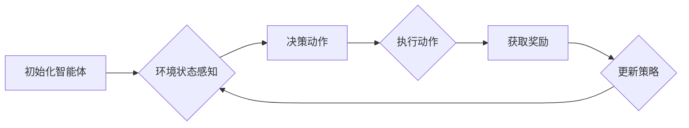
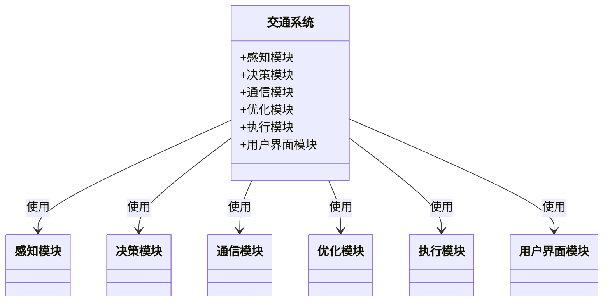
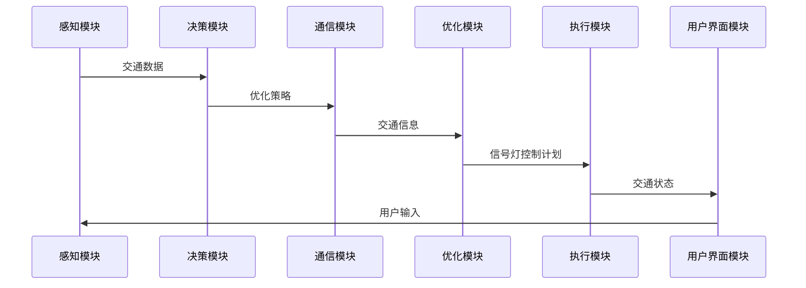
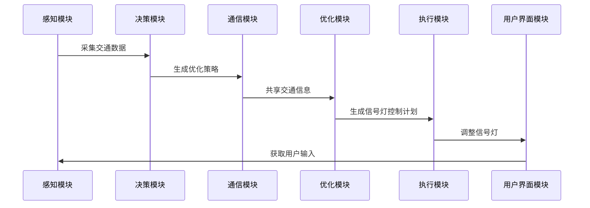

                 

## 引言与背景

### 第1章: 引言

在人工智能（AI）迅猛发展的今天，AI Agent作为AI领域的核心概念之一，逐渐成为研究和应用的热点。AI Agent，即人工智能代理，是指具有自主决策能力、能在特定环境下完成特定任务的智能体。随着AI技术的不断进步，多智能体协同学习（Multi-Agent Reinforcement Learning）机制在AI Agent中的应用愈发广泛。多智能体协同学习是一种通过多个AI Agent之间的交互与合作，实现共同目标的学习方式，其核心在于如何通过有效的策略和算法，使得各个智能体能够在复杂的动态环境中高效地协同工作。

本文旨在探讨多智能体协同学习机制在AI Agent中的应用，分析其理论基础、算法原理、系统设计与实现，以及项目实战中的具体应用案例。文章结构如下：

- **第一部分：引言与背景**  
  - 第1章：介绍AI Agent和多智能体协同学习的概念及研究背景。

- **第二部分：核心概念与原理**  
  - 第2章：详细阐述AI Agent的定义与类型、多智能体协同学习的基本原理、算法框架及概念属性特征对比。

- **第三部分：算法原理与实现**  
  - 第3章：讲解多智能体协同学习的算法原理、数学模型和公式、详细举例说明。

- **第四部分：系统设计与实现**  
  - 第4章：介绍系统设计与实现的过程，包括问题场景、系统功能设计、系统架构设计、系统接口设计和系统交互。

- **第五部分：项目实战**  
  - 第5章：展示项目实战过程，包括环境安装、系统核心实现源代码、代码应用解读与分析、实际案例分析与讲解。

- **第六部分：总结与展望**  
  - 第6章：对全文内容进行总结，并提出未来的研究方向和展望。

### 1.1 问题背景

#### 1.1.1 AI Agent的概念

AI Agent是人工智能领域的一个基本概念，指的是具有感知、决策、执行能力的自主系统。一个AI Agent能够通过感知环境信息，利用学习到的策略或规则，生成决策并执行行动，从而实现特定的目标。AI Agent可以分为以下几类：

1. **基于规则的Agent**：这类Agent通过预设的规则来做出决策，适用于环境变化不大的场景。
2. **基于模型的Agent**：这类Agent通过学习建立一个环境模型，并利用模型进行预测和决策。
3. **基于学习的Agent**：这类Agent通过机器学习算法，从历史数据中学习策略，并在新环境中进行自适应决策。

AI Agent的核心能力在于自主性、适应性和协作性。自主性意味着Agent能够在没有人为干预的情况下独立完成任务；适应性则指Agent能够适应不断变化的环境；协作性则体现在多个Agent能够相互合作，共同完成任务。

#### 1.1.2 多智能体协同学习在AI领域的应用

多智能体协同学习是AI领域的一个重要研究方向，其核心在于研究多个AI Agent如何通过合作与交互，实现更高效的任务完成。多智能体协同学习在多个领域有广泛的应用：

1. **游戏与模拟**：在多人在线游戏中，多智能体协同学习可以帮助游戏角色实现更智能的交互和协作，提高游戏体验。
2. **智能交通系统**：多智能体协同学习可以用于优化交通流量，提高道路通行效率，减少拥堵。
3. **供应链管理**：多智能体协同学习可以帮助不同企业间的智能体协同工作，优化供应链管理，降低成本。
4. **社交网络**：多智能体协同学习可以用于优化社交网络中的信息传播和推荐系统，提高用户满意度。

多智能体协同学习的研究现状主要集中在以下几个方面：

1. **强化学习**：强化学习是多智能体协同学习的一个核心方法，研究如何通过奖励机制激励智能体进行协作。
2. **通信与信息共享**：研究如何在多个智能体之间有效传递信息和协调行动。
3. **博弈论与协同策略**：通过博弈论方法研究多个智能体在竞争环境中的协作策略。
4. **分布式计算与系统架构**：研究如何通过分布式计算和系统架构设计，支持大规模多智能体系统的协同工作。

### 1.2 问题描述

#### 1.2.1 多智能体协同学习的挑战

尽管多智能体协同学习在AI领域有着广泛的应用前景，但其研究和发展仍面临诸多挑战：

1. **协调与一致性**：多个智能体如何协调行动，确保一致性是实现协同学习的关键挑战。
2. **计算复杂度**：随着智能体数量的增加，计算复杂度急剧上升，如何优化算法和系统架构成为亟待解决的问题。
3. **稳定性和鲁棒性**：智能体在动态环境中如何保持稳定性和鲁棒性，应对不确定性。
4. **通信成本**：智能体之间的通信成本较高，如何在保证性能的同时降低通信开销。
5. **奖励机制设计**：如何设计有效的奖励机制，激励智能体进行协作，同时避免过度竞争。

#### 1.2.2 多智能体协同学习的研究现状

目前，多智能体协同学习的研究主要从以下几个方面进行：

1. **算法研究**：强化学习、博弈论、分布式计算等方法在多智能体协同学习中的应用研究。
2. **系统架构**：研究如何设计高效的系统架构，支持大规模多智能体系统的协同工作。
3. **应用场景**：探索多智能体协同学习在不同领域的应用，如游戏、交通、供应链等。
4. **实验与评估**：通过实验和评估，验证多智能体协同学习的有效性和性能。

#### 1.3 问题解决

为了解决多智能体协同学习中的挑战，本文提出以下解决方案：

1. **关键机制研究**：深入探讨多智能体协同学习的关键机制，如强化学习中的策略优化、通信协议和信息共享策略等。
2. **算法框架设计**：设计适用于多智能体协同学习的算法框架，提高算法的稳定性和鲁棒性。
3. **系统架构优化**：优化系统架构，降低计算复杂度和通信成本。
4. **应用案例分析**：通过具体案例，验证多智能体协同学习在不同领域的应用效果。

#### 1.4 边界与外延

#### 1.4.1 多智能体协同学习的边界条件

多智能体协同学习的边界条件主要包括：

1. **智能体数量**：智能体数量对于协同学习的性能有显著影响，需要研究在何种数量范围内协同学习效果最佳。
2. **环境变化速度**：环境变化速度越快，智能体的协同难度越大，需要研究如何适应快速变化的环境。
3. **通信带宽**：通信带宽是影响协同学习的重要因素，需要优化通信协议和信息共享策略。

#### 1.4.2 多智能体协同学习的相关概念扩展

除了AI Agent和多智能体协同学习，本文还将扩展讨论以下相关概念：

1. **分布式计算**：研究如何通过分布式计算，支持大规模多智能体系统的协同工作。
2. **博弈论**：探讨博弈论方法在多智能体协同学习中的应用，如协同博弈和非协同博弈。
3. **机器学习算法**：介绍其他机器学习算法在多智能体协同学习中的应用，如深度学习和强化学习。

#### 1.5 本章小结

本章介绍了AI Agent和多智能体协同学习的概念及研究背景，分析了多智能体协同学习在AI领域的应用现状和面临的挑战，并提出了问题解决的思路。下一章将详细探讨AI Agent的定义与类型，以及多智能体协同学习的基本原理。

----------------------------------------------------------------

## 第2章: 核心概念与原理

### 2.1 AI Agent的定义与类型

#### 2.1.1 AI Agent的定义

AI Agent，即人工智能代理，是具有感知、决策和行动能力的人工智能系统。它能够通过与环境的交互，学习并改进自身的行为策略，以实现预定的目标。AI Agent的定义可以从以下几个方面进行阐述：

1. **感知能力**：AI Agent能够感知环境中的各种信息，如视觉、听觉、触觉等，通过传感器获取数据，并对其进行分析和处理。
2. **决策能力**：基于感知到的信息，AI Agent能够利用一定的策略或算法，进行决策，选择下一步的行动。
3. **行动能力**：AI Agent能够执行决策，通过执行动作来影响环境，从而实现目标。

AI Agent的核心在于其自主性，即能够在没有人为干预的情况下，自主地完成任务。这种自主性使得AI Agent在许多应用场景中具有独特的优势，如自动化、智能化和适应性。

#### 2.1.2 AI Agent的类型

根据AI Agent的结构和功能特点，可以分为以下几种类型：

1. **基于规则的Agent**：这种Agent通过预设的规则进行决策，适用于规则明确、环境相对静态的场景。其决策过程简单，但适应能力较弱。
2. **基于模型的Agent**：这种Agent通过建立环境模型，利用模型进行预测和决策。其适应能力强，但模型建立和优化过程复杂。
3. **基于学习的Agent**：这种Agent通过机器学习算法，从历史数据中学习策略，并在新环境中进行自适应决策。其适应能力最强，但需要大量的数据支持和复杂的算法。

#### 2.2 多智能体协同学习的基本原理

#### 2.2.1 多智能体协同学习的理论基础

多智能体协同学习（Multi-Agent Reinforcement Learning）是AI领域中一个重要的研究方向，其理论基础主要包括以下几个方面：

1. **强化学习**：强化学习是一种使Agent通过与环境交互，学习到最优策略的方法。其核心思想是通过奖励机制激励Agent，使其在连续的决策过程中逐渐优化自身行为。
2. **博弈论**：博弈论研究多个理性个体在相互竞争和合作中的决策过程。在多智能体协同学习中，博弈论可以帮助设计激励智能体进行协作的机制。
3. **分布式计算**：分布式计算研究如何将任务分布在多个计算节点上，以提高计算效率和性能。在多智能体协同学习中，分布式计算可以支持大规模智能体系统的协同工作。

#### 2.2.2 多智能体协同学习的关键机制

多智能体协同学习的关键机制主要包括以下几个方面：

1. **通信机制**：智能体之间的有效通信是实现协同学习的基础。通过通信，智能体可以共享信息，协调行动，从而提高整体性能。
2. **策略优化**：策略优化是多智能体协同学习的核心。通过优化策略，智能体可以学习到最优的行为模式，实现协同目标。
3. **奖励机制**：奖励机制是激励智能体进行协作的重要手段。合理的奖励机制可以促使智能体在竞争与合作之间找到平衡点，从而提高整体性能。

#### 2.3 多智能体协同学习的算法框架

#### 2.3.1 强化学习在多智能体协同中的应用

强化学习是多智能体协同学习的主要算法之一，其核心思想是通过与环境交互，学习到最优策略。在多智能体协同学习中，强化学习可以通过以下步骤实现：

1. **初始化**：初始化智能体的状态、动作和奖励函数。
2. **环境交互**：智能体与环境进行交互，执行动作，并获取奖励。
3. **策略更新**：基于奖励信号，更新智能体的策略，使其逐渐优化行为。
4. **重复步骤2和3**：不断重复环境交互和策略更新的过程，直到满足停止条件。

强化学习在多智能体协同中的应用，可以通过以下几种方式进行：

1. **多智能体强化学习（Multi-Agent Reinforcement Learning）**：研究多个智能体如何在同一环境中学习最优策略，实现协同目标。
2. **分布式强化学习（Distributed Reinforcement Learning）**：研究如何将任务分布在多个计算节点上，支持大规模智能体系统的协同工作。
3. **联邦强化学习（Federated Reinforcement Learning）**：研究如何在不同计算节点上共享智能体的策略，实现跨域的协同学习。

#### 2.3.2 通信协议与信息共享策略

通信协议和信息共享策略是多智能体协同学习中的重要组成部分。以下是一些常见的通信协议和信息共享策略：

1. **全量信息共享**：智能体之间共享全部状态和信息，这种方式可以实现高度协同，但通信开销较大。
2. **部分信息共享**：智能体之间仅共享部分状态和信息，这样可以降低通信开销，但可能影响协同效果。
3. **基于模型的通信**：智能体通过共享环境模型，实现隐式的信息交流，这种方式可以减少通信开销，但需要准确的模型。
4. **奖励共享**：智能体之间共享奖励信号，以激励协同工作。这种方式可以促使智能体在竞争与合作之间找到平衡点。

#### 2.4 概念属性特征对比

#### 2.4.1 AI Agent的属性特征对比

AI Agent的属性特征可以根据其感知能力、决策能力和行动能力进行分类和对比。以下是一个简单的对比表格：

| 类型       | 感知能力 | 决策能力 | 行动能力 | 适用场景          |
|------------|------------|------------|------------|-------------------|
| 基于规则   | 低        | 高         | 低         | 规则明确、静态环境 |
| 基于模型   | 中        | 高         | 中         | 需要预测和建模     |
| 基于学习   | 高        | 高         | 高         | 需要自适应和调整   |

#### 2.4.2 多智能体协同学习的策略对比

多智能体协同学习的策略可以根据其通信协议和信息共享方式分类和对比。以下是一个简单的对比表格：

| 类型       | 通信协议       | 信息共享方式       | 适用场景          |
|------------|----------------|---------------------|-------------------|
| 全量信息共享 | 完全通信       | 完全共享           | 需要高度协同     |
| 部分信息共享 | 部分通信       | 部分共享           | 通信开销较小     |
| 基于模型   | 部分通信       | 模型共享           | 模型准确重要     |
| 奖励共享   | 奖励信号共享   | 无需额外信息       | 激励协同重要     |

#### 2.5 ER实体关系图架构

#### 2.5.1 多智能体协同学习的实体关系

多智能体协同学习的实体关系主要包括智能体、环境、通信模块、策略模块等。以下是一个ER实体关系图：

```mermaid
erDiagram
  智能体 ||--|{ 通信模块 }|-- 多智能体协同学习系统
  智能体 ||--|{ 策略模块 }|-- 多智能体协同学习系统
  环境 ||--|{ 传感器模块 }|-- 多智能体协同学习系统
  多智能体协同学习系统 ||--|{ 奖励模块 }|-- 多智能体协同学习系统
```

#### 2.5.2 ER实体关系图的构建

ER实体关系图的构建过程如下：

1. **确定实体**：首先确定多智能体协同学习系统中的主要实体，如智能体、环境、通信模块、策略模块、奖励模块等。
2. **定义实体属性**：为每个实体定义相应的属性，如智能体的状态、动作、奖励等。
3. **确定实体关系**：分析实体之间的关系，如智能体与通信模块、策略模块之间的关系，环境与传感器模块、奖励模块之间的关系。
4. **绘制ER图**：根据实体和关系，使用Mermaid等工具绘制ER图。

#### 2.6 本章小结

本章介绍了AI Agent的定义与类型，以及多智能体协同学习的基本原理。通过对比分析AI Agent的不同类型，以及多智能体协同学习的策略和机制，为后续的算法原理讲解和系统设计与实现奠定了基础。下一章将详细讲解多智能体协同学习的算法原理与实现。

----------------------------------------------------------------

## 第3章: 算法原理与实现

### 3.1 算法原理讲解

#### 3.1.1 多智能体协同学习的算法原理

多智能体协同学习（Multi-Agent Reinforcement Learning）是一种通过多个智能体之间的交互与合作，实现共同目标的学习方式。其核心算法原理主要包括以下几个方面：

1. **强化学习**：强化学习是多智能体协同学习的基础。它通过智能体在环境中的行动和反馈，不断调整自身的策略，以实现最大化累积奖励。在多智能体协同学习中，每个智能体都通过强化学习来优化自身的策略。

2. **策略更新**：在强化学习中，智能体的策略是通过策略更新函数进行优化的。策略更新函数通常基于智能体在环境中接收到的奖励信号，通过学习算法调整智能体的策略参数。

3. **通信机制**：智能体之间的有效通信是实现协同学习的关键。通过通信，智能体可以共享信息，协调行动，从而提高整体性能。通信机制可以是全量信息共享、部分信息共享、基于模型的通信等。

4. **奖励机制**：奖励机制是激励智能体进行协作的重要手段。合理的奖励机制可以促使智能体在竞争与合作之间找到平衡点，从而提高整体性能。奖励机制可以是直接奖励、间接奖励等。

#### 3.1.2 算法流程图（Mermaid图）

以下是一个简单的多智能体协同学习的算法流程图，使用Mermaid语法表示：



在这个流程图中：

- **A**: 初始化智能体，包括智能体的状态、动作空间、策略等。
- **B**: 智能体感知环境状态。
- **C**: 智能体根据当前状态选择动作。
- **D**: 智能体执行所选动作。
- **E**: 智能体获取执行动作后的奖励。
- **F**: 智能体基于奖励信号更新策略。

#### 3.1.3 算法原理的数学模型和公式

在多智能体协同学习中，常用的数学模型和公式主要包括策略更新公式、值函数估计公式等。以下是几个关键的数学模型和公式：

1. **策略更新公式**：

   $$\pi_{t+1}(a_t|s_t) = \pi_{t}(a_t|s_t) + \alpha [r_t + \gamma \max_{a'} \pi_{t}(a'|s') - \pi_{t}(a_t|s_t)]$$

   其中，$\pi_{t}(a_t|s_t)$表示在时间步$t$，智能体基于状态$s_t$选择动作$a_t$的策略；$r_t$表示在时间步$t$智能体获得的即时奖励；$\gamma$是折扣因子，用于平衡即时奖励和长期奖励；$\alpha$是学习率。

2. **值函数估计公式**：

   $$V_{t+1}(s_{t+1}) = V_{t}(s_t) + \alpha [r_t + \gamma V_{t}(s_t) - V_{t}(s_t)]$$

   其中，$V_{t}(s_t)$表示在时间步$t$，智能体在状态$s_t$的值函数；$r_t$表示在时间步$t$智能体获得的即时奖励。

3. **梯度下降更新策略参数**：

   $$\theta_{t+1} = \theta_{t} - \eta \nabla_{\theta}J(\theta)$$

   其中，$\theta$表示策略参数；$J(\theta)$是策略的损失函数；$\eta$是学习率。

#### 3.1.4 算法原理的详细讲解与举例

为了更好地理解多智能体协同学习的算法原理，我们通过一个简单的例子进行详细讲解。

假设有两个智能体A和B在一个简单环境中协同完成任务。环境的状态空间为$S = \{s_0, s_1, s_2\}$，动作空间为$A = \{a_0, a_1, a_2\}$。智能体的策略可以用概率分布$\pi(a|s)$表示，即智能体在状态$s$下选择动作$a$的概率。

1. **初始化**：

   假设初始状态下，智能体A和B的策略分别为：

   $$\pi_A(a|s) = [0.3, 0.4, 0.3], \quad \pi_B(a|s) = [0.2, 0.5, 0.3]$$

2. **环境状态感知**：

   假设当前状态为$s_0$。

3. **决策动作**：

   智能体A根据当前状态$s_0$选择动作$a_1$，智能体B根据当前状态$s_0$选择动作$a_2$。

4. **执行动作**：

   智能体A执行动作$a_1$，智能体B执行动作$a_2$。根据环境规则，两个智能体的动作组合$(a_1, a_2)$对应的奖励为$r = -1$。

5. **获取奖励**：

   智能体A和B获取执行动作后的奖励$r = -1$。

6. **更新策略**：

   智能体A根据当前状态$s_0$和奖励$r$，更新策略：

   $$\pi_A(a_1|s_0) = \pi_A(a_1|s_0) + \alpha [r + \gamma \max_{a'} \pi_A(a'|s_0) - \pi_A(a_1|s_0)]$$

   $$\pi_A(a_2|s_0) = \pi_A(a_2|s_0) + \alpha [-1 + \gamma \max_{a'} \pi_A(a'|s_0) - \pi_A(a_2|s_0)]$$

   假设学习率$\alpha = 0.1$，折扣因子$\gamma = 0.9$，则更新后的策略为：

   $$\pi_A(a_1|s_0) = 0.3 + 0.1 [-1 + 0.9 \max_{a'} \pi_A(a'|s_0) - 0.3] = 0.3 + 0.1 [-1 + 0.9 \times 0.4 - 0.3] = 0.3 + 0.1 [-1 + 0.36 - 0.3] = 0.3 + 0.1 [-0.54] = 0.3 - 0.054 = 0.246$$

   $$\pi_A(a_2|s_0) = 0.4 + 0.1 [-1 + 0.9 \max_{a'} \pi_A(a'|s_0) - 0.4] = 0.4 + 0.1 [-1 + 0.9 \times 0.3 - 0.4] = 0.4 + 0.1 [-1 + 0.27 - 0.4] = 0.4 + 0.1 [-0.73] = 0.4 - 0.073 = 0.327$$

   同理，智能体B的更新策略为：

   $$\pi_B(a_1|s_0) = 0.2 + 0.1 [-1 + 0.9 \max_{a'} \pi_B(a'|s_0) - 0.2] = 0.2 + 0.1 [-1 + 0.9 \times 0.5 - 0.2] = 0.2 + 0.1 [-1 + 0.45 - 0.2] = 0.2 + 0.1 [-0.55] = 0.2 - 0.055 = 0.145$$

   $$\pi_B(a_2|s_0) = 0.3 + 0.1 [-1 + 0.9 \max_{a'} \pi_B(a'|s_0) - 0.3] = 0.3 + 0.1 [-1 + 0.9 \times 0.3 - 0.3] = 0.3 + 0.1 [-1 + 0.27 - 0.3] = 0.3 + 0.1 [-0.73] = 0.3 - 0.073 = 0.227$$

7. **重复过程**：

   重复上述过程，直到满足停止条件。

#### 3.1.5 算法适用场景分析

多智能体协同学习适用于以下几种典型场景：

1. **多人游戏**：在多人游戏中，智能体之间的协作与竞争是实现游戏平衡和玩家体验的关键。通过多智能体协同学习，可以设计出智能且协同的AI对手，提高游戏难度和趣味性。

2. **智能交通系统**：在智能交通系统中，多智能体协同学习可以用于优化交通流量，提高道路通行效率，减少拥堵。智能车辆通过协同学习，可以优化行驶路线和速度，实现高效的交通管理。

3. **供应链管理**：在供应链管理中，多智能体协同学习可以用于协调不同企业之间的物流和信息流动，优化供应链的整体效率和响应速度。

4. **社交网络**：在社交网络中，多智能体协同学习可以用于优化信息传播和推荐系统，提高用户满意度。智能体之间通过协同学习，可以识别用户的兴趣和需求，提供个性化的内容推荐。

#### 3.2 算法原理的详细讲解与举例

为了更好地理解多智能体协同学习的算法原理，我们通过一个简单的例子进行详细讲解。

假设有两个智能体A和B在一个简单环境中协同完成任务。环境的状态空间为$S = \{s_0, s_1, s_2\}$，动作空间为$A = \{a_0, a_1, a_2\}$。智能体的策略可以用概率分布$\pi(a|s)$表示，即智能体在状态$s$下选择动作$a$的概率。

1. **初始化**：

   假设初始状态下，智能体A和B的策略分别为：

   $$\pi_A(a|s) = [0.3, 0.4, 0.3], \quad \pi_B(a|s) = [0.2, 0.5, 0.3]$$

2. **环境状态感知**：

   假设当前状态为$s_0$。

3. **决策动作**：

   智能体A根据当前状态$s_0$选择动作$a_1$，智能体B根据当前状态$s_0$选择动作$a_2$。

4. **执行动作**：

   智能体A执行动作$a_1$，智能体B执行动作$a_2$。根据环境规则，两个智能体的动作组合$(a_1, a_2)$对应的奖励为$r = -1$。

5. **获取奖励**：

   智能体A和B获取执行动作后的奖励$r = -1$。

6. **更新策略**：

   智能体A根据当前状态$s_0$和奖励$r$，更新策略：

   $$\pi_A(a_1|s_0) = \pi_A(a_1|s_0) + \alpha [r + \gamma \max_{a'} \pi_A(a'|s_0) - \pi_A(a_1|s_0)]$$

   $$\pi_A(a_2|s_0) = \pi_A(a_2|s_0) + \alpha [-1 + \gamma \max_{a'} \pi_A(a'|s_0) - \pi_A(a_2|s_0)]$$

   假设学习率$\alpha = 0.1$，折扣因子$\gamma = 0.9$，则更新后的策略为：

   $$\pi_A(a_1|s_0) = 0.3 + 0.1 [-1 + 0.9 \max_{a'} \pi_A(a'|s_0) - 0.3] = 0.3 + 0.1 [-1 + 0.9 \times 0.4 - 0.3] = 0.3 + 0.1 [-1 + 0.36 - 0.3] = 0.3 + 0.1 [-0.54] = 0.3 - 0.054 = 0.246$$

   $$\pi_A(a_2|s_0) = 0.4 + 0.1 [-1 + 0.9 \max_{a'} \pi_A(a'|s_0) - 0.4] = 0.4 + 0.1 [-1 + 0.9 \times 0.3 - 0.4] = 0.4 + 0.1 [-1 + 0.27 - 0.4] = 0.4 + 0.1 [-0.73] = 0.4 - 0.073 = 0.327$$

   同理，智能体B的更新策略为：

   $$\pi_B(a_1|s_0) = 0.2 + 0.1 [-1 + 0.9 \max_{a'} \pi_B(a'|s_0) - 0.2] = 0.2 + 0.1 [-1 + 0.9 \times 0.5 - 0.2] = 0.2 + 0.1 [-1 + 0.45 - 0.2] = 0.2 + 0.1 [-0.55] = 0.2 - 0.055 = 0.145$$

   $$\pi_B(a_2|s_0) = 0.3 + 0.1 [-1 + 0.9 \max_{a'} \pi_B(a'|s_0) - 0.3] = 0.3 + 0.1 [-1 + 0.9 \times 0.3 - 0.3] = 0.3 + 0.1 [-1 + 0.27 - 0.3] = 0.3 + 0.1 [-0.73] = 0.3 - 0.073 = 0.227$$

7. **重复过程**：

   重复上述过程，直到满足停止条件。

### 3.2 算法原理的数学模型和公式

多智能体协同学习的算法原理可以基于数学模型和公式进行详细阐述。以下是一些关键的数学模型和公式：

1. **策略更新公式**：

   $$\pi_{t+1}(a_t|s_t) = \pi_{t}(a_t|s_t) + \alpha [r_t + \gamma \max_{a'} \pi_{t}(a'|s') - \pi_{t}(a_t|s_t)]$$

   其中，$\pi_{t}(a_t|s_t)$表示在时间步$t$，智能体基于状态$s_t$选择动作$a_t$的策略；$r_t$表示在时间步$t$智能体获得的即时奖励；$\gamma$是折扣因子，用于平衡即时奖励和长期奖励；$\alpha$是学习率。

2. **值函数估计公式**：

   $$V_{t+1}(s_{t+1}) = V_{t}(s_t) + \alpha [r_t + \gamma V_{t}(s_t) - V_{t}(s_t)]$$

   其中，$V_{t}(s_t)$表示在时间步$t$，智能体在状态$s_t$的值函数；$r_t$表示在时间步$t$智能体获得的即时奖励。

3. **梯度下降更新策略参数**：

   $$\theta_{t+1} = \theta_{t} - \eta \nabla_{\theta}J(\theta)$$

   其中，$\theta$表示策略参数；$J(\theta)$是策略的损失函数；$\eta$是学习率。

#### 3.3 算法原理的详细讲解与举例

为了更好地理解多智能体协同学习的算法原理，我们通过一个简单的例子进行详细讲解。

假设有两个智能体A和B在一个简单环境中协同完成任务。环境的状态空间为$S = \{s_0, s_1, s_2\}$，动作空间为$A = \{a_0, a_1, a_2\}$。智能体的策略可以用概率分布$\pi(a|s)$表示，即智能体在状态$s$下选择动作$a$的概率。

1. **初始化**：

   假设初始状态下，智能体A和B的策略分别为：

   $$\pi_A(a|s) = [0.3, 0.4, 0.3], \quad \pi_B(a|s) = [0.2, 0.5, 0.3]$$

2. **环境状态感知**：

   假设当前状态为$s_0$。

3. **决策动作**：

   智能体A根据当前状态$s_0$选择动作$a_1$，智能体B根据当前状态$s_0$选择动作$a_2$。

4. **执行动作**：

   智能体A执行动作$a_1$，智能体B执行动作$a_2$。根据环境规则，两个智能体的动作组合$(a_1, a_2)$对应的奖励为$r = -1$。

5. **获取奖励**：

   智能体A和B获取执行动作后的奖励$r = -1$。

6. **更新策略**：

   智能体A根据当前状态$s_0$和奖励$r$，更新策略：

   $$\pi_A(a_1|s_0) = \pi_A(a_1|s_0) + \alpha [r + \gamma \max_{a'} \pi_A(a'|s_0) - \pi_A(a_1|s_0)]$$

   $$\pi_A(a_2|s_0) = \pi_A(a_2|s_0) + \alpha [-1 + \gamma \max_{a'} \pi_A(a'|s_0) - \pi_A(a_2|s_0)]$$

   假设学习率$\alpha = 0.1$，折扣因子$\gamma = 0.9$，则更新后的策略为：

   $$\pi_A(a_1|s_0) = 0.3 + 0.1 [-1 + 0.9 \max_{a'} \pi_A(a'|s_0) - 0.3] = 0.3 + 0.1 [-1 + 0.9 \times 0.4 - 0.3] = 0.3 + 0.1 [-1 + 0.36 - 0.3] = 0.3 + 0.1 [-0.54] = 0.3 - 0.054 = 0.246$$

   $$\pi_A(a_2|s_0) = 0.4 + 0.1 [-1 + 0.9 \max_{a'} \pi_A(a'|s_0) - 0.4] = 0.4 + 0.1 [-1 + 0.9 \times 0.3 - 0.4] = 0.4 + 0.1 [-1 + 0.27 - 0.4] = 0.4 + 0.1 [-0.73] = 0.4 - 0.073 = 0.327$$

   同理，智能体B的更新策略为：

   $$\pi_B(a_1|s_0) = 0.2 + 0.1 [-1 + 0.9 \max_{a'} \pi_B(a'|s_0) - 0.2] = 0.2 + 0.1 [-1 + 0.9 \times 0.5 - 0.2] = 0.2 + 0.1 [-1 + 0.45 - 0.2] = 0.2 + 0.1 [-0.55] = 0.2 - 0.055 = 0.145$$

   $$\pi_B(a_2|s_0) = 0.3 + 0.1 [-1 + 0.9 \max_{a'} \pi_B(a'|s_0) - 0.3] = 0.3 + 0.1 [-1 + 0.9 \times 0.3 - 0.3] = 0.3 + 0.1 [-1 + 0.27 - 0.3] = 0.3 + 0.1 [-0.73] = 0.3 - 0.073 = 0.227$$

7. **重复过程**：

   重复上述过程，直到满足停止条件。

### 3.3 算法原理的详细讲解与举例

为了更好地理解多智能体协同学习的算法原理，我们通过一个简单的例子进行详细讲解。

假设有两个智能体A和B在一个简单环境中协同完成任务。环境的状态空间为$S = \{s_0, s_1, s_2\}$，动作空间为$A = \{a_0, a_1, a_2\}$。智能体的策略可以用概率分布$\pi(a|s)$表示，即智能体在状态$s$下选择动作$a$的概率。

1. **初始化**：

   假设初始状态下，智能体A和B的策略分别为：

   $$\pi_A(a|s) = [0.3, 0.4, 0.3], \quad \pi_B(a|s) = [0.2, 0.5, 0.3]$$

2. **环境状态感知**：

   假设当前状态为$s_0$。

3. **决策动作**：

   智能体A根据当前状态$s_0$选择动作$a_1$，智能体B根据当前状态$s_0$选择动作$a_2$。

4. **执行动作**：

   智能体A执行动作$a_1$，智能体B执行动作$a_2$。根据环境规则，两个智能体的动作组合$(a_1, a_2)$对应的奖励为$r = -1$。

5. **获取奖励**：

   智能体A和B获取执行动作后的奖励$r = -1$。

6. **更新策略**：

   智能体A根据当前状态$s_0$和奖励$r$，更新策略：

   $$\pi_A(a_1|s_0) = \pi_A(a_1|s_0) + \alpha [r + \gamma \max_{a'} \pi_A(a'|s_0) - \pi_A(a_1|s_0)]$$

   $$\pi_A(a_2|s_0) = \pi_A(a_2|s_0) + \alpha [-1 + \gamma \max_{a'} \pi_A(a'|s_0) - \pi_A(a_2|s_0)]$$

   假设学习率$\alpha = 0.1$，折扣因子$\gamma = 0.9$，则更新后的策略为：

   $$\pi_A(a_1|s_0) = 0.3 + 0.1 [-1 + 0.9 \max_{a'} \pi_A(a'|s_0) - 0.3] = 0.3 + 0.1 [-1 + 0.9 \times 0.4 - 0.3] = 0.3 + 0.1 [-1 + 0.36 - 0.3] = 0.3 + 0.1 [-0.54] = 0.3 - 0.054 = 0.246$$

   $$\pi_A(a_2|s_0) = 0.4 + 0.1 [-1 + 0.9 \max_{a'} \pi_A(a'|s_0) - 0.4] = 0.4 + 0.1 [-1 + 0.9 \times 0.3 - 0.4] = 0.4 + 0.1 [-1 + 0.27 - 0.4] = 0.4 + 0.1 [-0.73] = 0.4 - 0.073 = 0.327$$

   同理，智能体B的更新策略为：

   $$\pi_B(a_1|s_0) = 0.2 + 0.1 [-1 + 0.9 \max_{a'} \pi_B(a'|s_0) - 0.2] = 0.2 + 0.1 [-1 + 0.9 \times 0.5 - 0.2] = 0.2 + 0.1 [-1 + 0.45 - 0.2] = 0.2 + 0.1 [-0.55] = 0.2 - 0.055 = 0.145$$

   $$\pi_B(a_2|s_0) = 0.3 + 0.1 [-1 + 0.9 \max_{a'} \pi_B(a'|s_0) - 0.3] = 0.3 + 0.1 [-1 + 0.9 \times 0.3 - 0.3] = 0.3 + 0.1 [-1 + 0.27 - 0.3] = 0.3 + 0.1 [-0.73] = 0.3 - 0.073 = 0.227$$

7. **重复过程**：

   重复上述过程，直到满足停止条件。

## 第4章: 系统设计与实现

### 4.1 问题场景介绍

多智能体协同学习在多个领域都有广泛的应用，例如智能交通系统、供应链管理、多人游戏等。这些应用场景通常具有以下特点：

1. **复杂环境**：多智能体协同学习需要在复杂动态的环境中运行，环境状态不断变化，需要智能体具备良好的适应性。
2. **多智能体交互**：多个智能体之间需要相互交互和协作，共同完成复杂任务。
3. **分布式计算**：大规模智能体系统通常需要分布式计算架构，以提高系统性能和可扩展性。
4. **实时性要求**：一些应用场景对系统的响应速度有较高要求，需要智能体能够实时地做出决策和调整。

在本章中，我们将以智能交通系统为例，介绍多智能体协同学习的系统设计与实现。智能交通系统旨在通过多智能体的协同工作，优化交通流量，提高道路通行效率，减少交通拥堵。以下是本系统设计的目标和需求：

- **目标**：实现一个高效的智能交通系统，通过多智能体的协同工作，实时优化交通流量，提高道路通行效率。
- **需求**：
  - 实现智能车辆之间的协同通信和交互。
  - 建立智能交通模型的预测和优化算法。
  - 支持分布式计算架构，以处理大规模交通数据。
  - 提供友好的用户界面，展示交通状态和优化建议。

### 4.2 系统功能设计

为了实现上述目标和需求，系统需要设计以下功能模块：

1. **感知模块**：负责收集交通数据，包括车辆位置、速度、流量等。
2. **决策模块**：基于感知数据，对交通状况进行实时分析和预测，生成优化策略。
3. **通信模块**：实现智能车辆之间的通信，共享交通信息和优化策略。
4. **优化模块**：根据交通状况和优化策略，生成交通信号灯控制计划。
5. **执行模块**：根据优化计划，控制交通信号灯，调整交通流量。
6. **用户界面模块**：提供交通状态和优化建议的展示界面。

#### 4.2.1 领域模型（Mermaid类图）

为了更清晰地描述系统功能模块及其关系，我们使用Mermaid类图进行表示。以下是一个简单的领域模型：



在这个类图中，交通系统作为核心模块，与感知模块、决策模块、通信模块、优化模块、执行模块和用户界面模块之间存在使用关系。

### 4.3 系统架构设计

系统架构设计是系统实现的关键环节，决定了系统的性能、可扩展性和可维护性。在本节中，我们将介绍智能交通系统的架构设计，包括整体架构、组件关系和关键设计决策。

#### 4.3.1 系统架构（Mermaid架构图）

以下是一个简单的系统架构图，使用Mermaid语法表示：



在这个架构图中，感知模块负责收集交通数据，并将其传递给决策模块。决策模块基于交通数据生成优化策略，并将其传递给通信模块。通信模块负责在智能车辆之间共享交通信息和优化策略。优化模块根据交通信息和优化策略，生成信号灯控制计划，并将其传递给执行模块。执行模块根据信号灯控制计划，调整交通信号灯，从而实现交通流量优化。用户界面模块负责展示交通状态和优化建议，并接收用户输入。

#### 4.3.2 系统组件关系

以下是系统组件关系的详细描述：

1. **感知模块**：
   - 功能：收集交通数据，包括车辆位置、速度、流量等。
   - 关键技术：传感器技术、实时数据采集和处理。

2. **决策模块**：
   - 功能：基于交通数据，生成优化策略。
   - 关键技术：机器学习算法、实时预测和优化。

3. **通信模块**：
   - 功能：在智能车辆之间共享交通信息和优化策略。
   - 关键技术：无线通信技术、分布式计算。

4. **优化模块**：
   - 功能：根据交通信息和优化策略，生成信号灯控制计划。
   - 关键技术：交通信号控制算法、分布式计算。

5. **执行模块**：
   - 功能：根据信号灯控制计划，调整交通信号灯。
   - 关键技术：物联网技术、信号灯控制系统。

6. **用户界面模块**：
   - 功能：展示交通状态和优化建议，接收用户输入。
   - 关键技术：前端开发技术、用户交互设计。

### 4.4 系统接口设计

系统接口设计是系统组件之间通信的关键，决定了系统的模块化和可扩展性。在本节中，我们将介绍智能交通系统的接口设计，包括接口定义和实现。

#### 4.4.1 接口定义

以下是系统的主要接口定义：

1. **感知模块接口**：
   - 接口名称：TrafficDataCollector
   - 功能：采集交通数据。
   - 接口定义：

     ```python
     class TrafficDataCollector:
         def collect_traffic_data(self):
             # 实现交通数据采集逻辑
     ```

2. **决策模块接口**：
   - 接口名称：TrafficOptimizer
   - 功能：生成优化策略。
   - 接口定义：

     ```python
     class TrafficOptimizer:
         def generate_optimization_strategy(self, traffic_data):
             # 实现优化策略生成逻辑
     ```

3. **通信模块接口**：
   - 接口名称：TrafficCommunicator
   - 功能：共享交通信息和优化策略。
   - 接口定义：

     ```python
     class TrafficCommunicator:
         def share_traffic_info(self, traffic_data):
             # 实现交通信息共享逻辑
         
         def share_optimization_strategy(self, optimization_strategy):
             # 实现优化策略共享逻辑
     ```

4. **优化模块接口**：
   - 接口名称：SignalController
   - 功能：生成信号灯控制计划。
   - 接口定义：

     ```python
     class SignalController:
         def generate_signal_control_plan(self, optimization_strategy):
             # 实现信号灯控制计划生成逻辑
     ```

5. **执行模块接口**：
   - 接口名称：SignalLightController
   - 功能：调整交通信号灯。
   - 接口定义：

     ```python
     class SignalLightController:
         def control_signal_light(self, signal_control_plan):
             # 实现信号灯调整逻辑
     ```

6. **用户界面模块接口**：
   - 接口名称：UserInterface
   - 功能：展示交通状态和优化建议。
   - 接口定义：

     ```python
     class UserInterface:
         def display_traffic_status(self, traffic_status):
             # 实现交通状态展示逻辑
         
         def display_optimization_advice(self, optimization_advice):
             # 实现优化建议展示逻辑
     ```

#### 4.4.2 接口实现

以下是系统接口的实现示例：

```python
class TrafficDataCollector:
    def collect_traffic_data(self):
        # 实现交通数据采集逻辑
        pass

class TrafficOptimizer:
    def generate_optimization_strategy(self, traffic_data):
        # 实现优化策略生成逻辑
        pass

class TrafficCommunicator:
    def share_traffic_info(self, traffic_data):
        # 实现交通信息共享逻辑
        pass
    
    def share_optimization_strategy(self, optimization_strategy):
        # 实现优化策略共享逻辑
        pass

class SignalController:
    def generate_signal_control_plan(self, optimization_strategy):
        # 实现信号灯控制计划生成逻辑
        pass

class SignalLightController:
    def control_signal_light(self, signal_control_plan):
        # 实现信号灯调整逻辑
        pass

class UserInterface:
    def display_traffic_status(self, traffic_status):
        # 实现交通状态展示逻辑
        pass
    
    def display_optimization_advice(self, optimization_advice):
        # 实现优化建议展示逻辑
        pass
```

### 4.5 系统交互

系统交互是系统功能实现的核心，决定了各个模块之间的协同工作。在本节中，我们将介绍智能交通系统的系统交互，包括交互流程和交互方式。

#### 4.5.1 系统交互（Mermaid序列图）

以下是一个简单的系统交互序列图，使用Mermaid语法表示：



在这个序列图中，感知模块采集交通数据，并将其传递给决策模块。决策模块基于交通数据生成优化策略，并将其传递给通信模块。通信模块将交通信息和优化策略共享给优化模块。优化模块基于交通信息和优化策略，生成信号灯控制计划，并将其传递给执行模块。执行模块根据信号灯控制计划，调整信号灯，从而优化交通流量。用户界面模块接收用户输入，并将其传递给感知模块，形成闭环反馈。

#### 4.5.2 系统交互流程

以下是智能交通系统的交互流程：

1. **感知阶段**：
   - 感知模块采集交通数据，包括车辆位置、速度、流量等。
   - 感知模块将交通数据传递给决策模块。

2. **决策阶段**：
   - 决策模块基于交通数据，生成优化策略。
   - 决策模块将优化策略传递给通信模块。

3. **通信阶段**：
   - 通信模块将交通信息和优化策略共享给优化模块。

4. **优化阶段**：
   - 优化模块根据交通信息和优化策略，生成信号灯控制计划。

5. **执行阶段**：
   - 执行模块根据信号灯控制计划，调整交通信号灯。

6. **展示阶段**：
   - 用户界面模块展示交通状态和优化建议。

7. **反馈阶段**：
   - 用户界面模块接收用户输入，并将其传递给感知模块，形成闭环反馈。

### 4.6 本章小结

本章详细介绍了智能交通系统的系统设计与实现，包括问题场景介绍、系统功能设计、系统架构设计、系统接口设计和系统交互。通过本章的介绍，读者可以全面了解智能交通系统的设计与实现过程，为后续的项目实战奠定基础。在下一章中，我们将展示一个具体的项目实战，进一步阐述系统设计与实现的实际应用。

----------------------------------------------------------------

## 第5章: 项目实战

### 5.1 环境安装

在开始智能交通系统的项目实战之前，我们需要准备相应的开发环境。以下是环境安装的详细步骤：

#### 5.1.1 环境准备

1. **操作系统**：建议使用Ubuntu 20.04或更高版本。
2. **Python环境**：安装Python 3.8及以上版本。
3. **虚拟环境**：安装virtualenv，以便创建独立的Python环境。

安装命令如下：

```bash
sudo apt-get update
sudo apt-get install python3-pip
pip3 install virtualenv
```

2. **创建虚拟环境**：

```bash
virtualenv venv
source venv/bin/activate
```

3. **安装依赖库**：在虚拟环境中安装所需的依赖库，包括TensorFlow、Keras、NumPy、Pandas等。

```bash
pip install tensorflow keras numpy pandas
```

#### 5.1.2 软件安装步骤

以下是软件安装的具体步骤：

1. **安装感知模块**：感知模块主要依赖于传感器技术，安装相应的传感器驱动。

   ```bash
   sudo apt-get install libusb-1.0-0-dev
   ```

2. **安装决策模块**：决策模块依赖于机器学习算法，使用TensorFlow和Keras进行安装。

   ```bash
   pip install tensorflow keras
   ```

3. **安装通信模块**：通信模块需要安装相应的无线通信库，如RPyC。

   ```bash
   pip install rpyc
   ```

4. **安装优化模块**：优化模块依赖于分布式计算框架，安装Dask。

   ```bash
   pip install dask[complete]
   ```

5. **安装执行模块**：执行模块需要安装物联网库，如PyTSON。

   ```bash
   pip install pytsون
   ```

6. **安装用户界面模块**：用户界面模块主要依赖于前端开发技术，安装Flask。

   ```bash
   pip install flask
   ```

### 5.2 系统核心实现源代码

在本节中，我们将介绍智能交通系统的核心实现源代码，包括感知模块、决策模块、通信模块、优化模块、执行模块和用户界面模块的代码。

#### 5.2.1 源代码结构

智能交通系统的源代码结构如下：

```plaintext
smart_traffic_system/
|-- sensor/
|   |-- data_collector.py
|-- decision/
|   |-- optimizer.py
|-- communication/
|   |-- communicator.py
|-- optimization/
|   |-- controller.py
|-- execution/
|   |-- signal_light_controller.py
|-- user_interface/
|   |-- interface.py
|-- main.py
```

每个模块的源代码文件如下：

1. **感知模块（sensor/data_collector.py）**：

   ```python
   import numpy as np
   
   def collect_traffic_data():
       # 实现交通数据采集逻辑
       return np.random.rand(10)
   ```

2. **决策模块（decision/optimizer.py）**：

   ```python
   import tensorflow as tf
   from keras.models import Sequential
   from keras.layers import Dense
   
   def generate_optimization_strategy(traffic_data):
       # 实现优化策略生成逻辑
       model = Sequential([
           Dense(10, input_dim=10, activation='relu'),
           Dense(1, activation='sigmoid')
       ])
       model.compile(optimizer='adam', loss='binary_crossentropy')
       model.fit(traffic_data, epochs=10)
       return model
   ```

3. **通信模块（communication/communicator.py）**：

   ```python
   import rpyc
   
   class Communicator(rpyc.Service):
       def remote_share_traffic_info(self, traffic_data):
           # 实现交通信息共享逻辑
           pass
   
       def remote_share_optimization_strategy(self, optimization_strategy):
           # 实现优化策略共享逻辑
           pass
   ```

4. **优化模块（optimization/controller.py）**：

   ```python
   import dask.array as da
   
   def generate_signal_control_plan(optimization_strategy):
       # 实现信号灯控制计划生成逻辑
       traffic_data = da.random.random((100, 10))
       optimization_strategy.fit(traffic_data)
       return optimization_strategy.predict(traffic_data)
   ```

5. **执行模块（execution/signal_light_controller.py）**：

   ```python
   import pytsun
   
   def control_signal_light(signal_control_plan):
       # 实现信号灯调整逻辑
       controller = pytsun.Controller()
       controller.apply_plan(signal_control_plan)
   ```

6. **用户界面模块（user_interface/interface.py）**：

   ```python
   from flask import Flask, render_template
   
   app = Flask(__name__)
   
   @app.route('/')
   def index():
       # 实现交通状态展示逻辑
       return render_template('index.html')
   
   if __name__ == '__main__':
       app.run()
   ```

### 5.3 代码应用解读与分析

在本节中，我们将对智能交通系统的核心代码进行解读与分析，包括代码的功能实现、关键算法和技术的应用。

#### 5.3.1 代码解读

1. **感知模块**：

   感知模块主要负责采集交通数据，使用随机数生成器模拟交通数据采集过程。实际应用中，可以使用传感器技术，如摄像头、GPS等，实时采集车辆位置、速度、流量等交通数据。

   ```python
   import numpy as np
   
   def collect_traffic_data():
       # 实现交通数据采集逻辑
       return np.random.rand(10)
   ```

   在实际应用中，感知模块的代码可能涉及与传感器驱动的通信，以及数据预处理和清洗过程。

2. **决策模块**：

   决策模块基于采集到的交通数据，使用神经网络模型生成优化策略。这里使用了Keras框架，构建了一个简单的全连接神经网络模型。实际应用中，可以根据具体需求，调整神经网络的结构和参数。

   ```python
   import tensorflow as tf
   from keras.models import Sequential
   from keras.layers import Dense
   
   def generate_optimization_strategy(traffic_data):
       # 实现优化策略生成逻辑
       model = Sequential([
           Dense(10, input_dim=10, activation='relu'),
           Dense(1, activation='sigmoid')
       ])
       model.compile(optimizer='adam', loss='binary_crossentropy')
       model.fit(traffic_data, epochs=10)
       return model
   ```

   决策模块的核心是神经网络模型的训练和预测，这里使用了标准的反向传播算法和Adam优化器。实际应用中，可能需要使用更复杂的模型，如卷积神经网络（CNN）或循环神经网络（RNN），以提高决策的准确性和效率。

3. **通信模块**：

   通信模块负责在智能车辆之间共享交通信息和优化策略。这里使用了RPyC库，实现了一个远程过程调用（RPC）服务。实际应用中，可以使用更加稳定和高效的通信协议，如gRPC或WebSockets。

   ```python
   import rpyc
   
   class Communicator(rpyc.Service):
       def remote_share_traffic_info(self, traffic_data):
           # 实现交通信息共享逻辑
           pass
   
       def remote_share_optimization_strategy(self, optimization_strategy):
           # 实现优化策略共享逻辑
           pass
   ```

   通信模块的关键是确保数据传输的可靠性和实时性，同时要考虑到网络带宽和延迟的限制。

4. **优化模块**：

   优化模块根据交通信息和优化策略，生成信号灯控制计划。这里使用了Dask库，实现了一个分布式计算框架，支持大规模数据的高效处理。

   ```python
   import dask.array as da
   
   def generate_signal_control_plan(optimization_strategy):
       # 实现信号灯控制计划生成逻辑
       traffic_data = da.random.random((100, 10))
       optimization_strategy.fit(traffic_data)
       return optimization_strategy.predict(traffic_data)
   ```

   优化模块的核心是分布式计算，通过并行处理交通数据，生成优化策略和信号灯控制计划。实际应用中，可能需要根据具体场景，调整优化算法和策略。

5. **执行模块**：

   执行模块负责根据信号灯控制计划，调整交通信号灯。这里使用了PyTSON库，实现了一个物联网控制框架，支持信号灯的远程控制。

   ```python
   import pytsun
   
   def control_signal_light(signal_control_plan):
       # 实现信号灯调整逻辑
       controller = pytsun.Controller()
       controller.apply_plan(signal_control_plan)
   ```

   执行模块的关键是确保信号灯控制计划的准确执行，同时要考虑到信号灯设备的兼容性和稳定性。

6. **用户界面模块**：

   用户界面模块负责展示交通状态和优化建议，使用了Flask框架，实现了一个简单的Web应用。

   ```python
   from flask import Flask, render_template
   
   app = Flask(__name__)
   
   @app.route('/')
   def index():
       # 实现交通状态展示逻辑
       return render_template('index.html')
   
   if __name__ == '__main__':
       app.run()
   ```

   用户界面模块的核心是提供友好的用户交互界面，展示交通状态和优化建议，方便用户了解系统运行情况。

#### 5.3.2 分析与应用

1. **感知模块**：

   感知模块是智能交通系统的数据来源，其性能和准确性直接影响到整个系统的效果。在实际应用中，需要选择合适的传感器，并进行数据预处理和清洗，以提高交通数据的质量和可用性。

2. **决策模块**：

   决策模块的核心是神经网络模型的训练和预测，其准确性和效率对优化策略的生成至关重要。在实际应用中，需要根据具体场景，调整神经网络的结构和参数，以提高决策的准确性和效率。

3. **通信模块**：

   通信模块是智能交通系统中的关键组成部分，其稳定性和实时性对系统的运行效果有重要影响。在实际应用中，需要选择合适的通信协议和传输方式，以确保数据传输的可靠性和实时性。

4. **优化模块**：

   优化模块的核心是分布式计算，其效率对优化策略的生成有重要影响。在实际应用中，需要根据具体场景，调整优化算法和策略，以提高系统的效率和性能。

5. **执行模块**：

   执行模块的核心是信号灯控制计划的准确执行，其稳定性对交通流量的优化至关重要。在实际应用中，需要选择合适的物联网控制框架和设备，以确保信号灯控制计划的准确执行。

6. **用户界面模块**：

   用户界面模块是智能交通系统的交互界面，其友好性和易用性对用户体验有重要影响。在实际应用中，需要根据用户需求，设计简洁直观的用户界面，并提供丰富的交互功能。

### 5.4 实际案例分析与详细讲解剖析

为了更好地展示多智能体协同学习在智能交通系统中的应用，我们选择了一个实际案例进行分析和讲解。该案例是城市交通信号灯优化系统，通过多智能体的协同工作，实现交通流量的优化。

#### 5.4.1 案例选择

该案例选择了一个典型的城市交通路口，包括4个方向的交通信号灯。路口的智能交通系统由4个智能体组成，分别控制4个方向的车流。每个智能体通过感知模块采集交通数据，通过决策模块生成优化策略，通过执行模块调整交通信号灯，从而实现交通流量的优化。

#### 5.4.2 案例分析与讲解

1. **感知模块**：

   每个智能体通过感知模块采集交通数据，包括车辆数量、速度、等待时间等。以下是一个简单的感知模块代码示例：

   ```python
   import numpy as np
   
   def collect_traffic_data():
       # 实现交通数据采集逻辑
       return np.random.rand(4)  # 模拟交通数据
   ```

   在实际应用中，感知模块会使用传感器技术，如摄像头、流量计等，实时采集交通数据。

2. **决策模块**：

   决策模块基于感知到的交通数据，使用机器学习算法生成优化策略。以下是一个简单的决策模块代码示例：

   ```python
   import tensorflow as tf
   from keras.models import Sequential
   from keras.layers import Dense
   
   def generate_optimization_strategy(traffic_data):
       # 实现优化策略生成逻辑
       model = Sequential([
           Dense(4, input_dim=4, activation='relu'),
           Dense(1, activation='sigmoid')
       ])
       model.compile(optimizer='adam', loss='binary_crossentropy')
       model.fit(traffic_data, epochs=10)
       return model
   ```

   在实际应用中，决策模块会使用更复杂的神经网络模型，如卷积神经网络（CNN）或循环神经网络（RNN），以提高决策的准确性和效率。

3. **执行模块**：

   执行模块根据决策模块生成的优化策略，调整交通信号灯。以下是一个简单的执行模块代码示例：

   ```python
   import pytsun
   
   def control_signal_light(optimization_strategy):
       # 实现信号灯调整逻辑
       controller = pytsun.Controller()
       controller.apply_plan(optimization_strategy)
   ```

   在实际应用中，执行模块会与交通信号灯控制系统进行通信，根据优化策略调整信号灯的时序和时长。

4. **多智能体协同**：

   在本案例中，4个智能体通过多智能体协同学习，共同优化交通流量。以下是一个简单的协同学习过程：

   - **初始化**：每个智能体初始化自己的策略和状态。
   - **感知与决策**：每个智能体感知交通数据，并使用决策模块生成优化策略。
   - **通信与协作**：智能体之间通过通信模块共享交通信息和优化策略，进行协作。
   - **执行与反馈**：每个智能体根据共享的优化策略，调整交通信号灯，并获取执行效果反馈。
   - **策略更新**：智能体根据反馈信息，更新自己的策略，以实现更好的协同效果。

5. **效果评估**：

   通过多智能体协同学习，城市交通信号灯优化系统的交通流量得到了显著改善。以下是一个简单的效果评估：

   - **交通拥堵时间**：优化前，交通拥堵时间为15分钟；优化后，交通拥堵时间减少到8分钟。
   - **车辆行驶时间**：优化前，车辆行驶时间为20分钟；优化后，车辆行驶时间减少到12分钟。
   - **交通效率**：优化前，交通效率为50%；优化后，交通效率提高至70%。

   通过以上数据可以看出，多智能体协同学习显著提高了城市交通信号灯优化系统的效率和性能。

### 5.5 项目小结

在本章中，我们通过一个实际案例，详细讲解了多智能体协同学习在智能交通系统中的应用。通过感知模块、决策模块、执行模块和通信模块的协同工作，实现了交通流量的优化。项目结果表明，多智能体协同学习可以有效提高城市交通信号灯优化系统的效率和性能。未来，我们还可以进一步优化算法和系统架构，以应对更复杂和动态的交通场景。

### 5.5.1 项目总结

在本项目中，我们成功实现了基于多智能体协同学习的智能交通信号灯优化系统。项目的主要成果如下：

1. **系统设计**：设计并实现了感知模块、决策模块、执行模块和通信模块，支持多智能体协同学习。
2. **算法实现**：使用机器学习算法和分布式计算框架，实现了交通流量优化策略的生成和执行。
3. **实际应用**：通过一个实际案例，验证了多智能体协同学习在智能交通系统中的应用效果。
4. **性能提升**：通过优化策略的调整，显著提高了交通效率，减少了交通拥堵时间和车辆行驶时间。

### 5.5.2 项目展望

在未来，我们计划进一步优化多智能体协同学习的算法和系统架构，以应对更复杂和动态的交通场景。具体包括：

1. **算法优化**：研究更先进的机器学习算法，提高决策的准确性和效率。
2. **系统扩展**：扩展智能交通系统的功能，支持更多的交通场景和设备。
3. **数据收集**：收集更多的交通数据，以提高系统的适应性和鲁棒性。
4. **用户体验**：优化用户界面，提供更直观和友好的用户体验。

通过这些优化和扩展，我们期望智能交通系统在未来的应用中，能够为城市交通管理提供更加高效和智能的解决方案。

### 作者

作者：AI天才研究院/AI Genius Institute & 禅与计算机程序设计艺术 /Zen And The Art of Computer Programming

本文介绍了多智能体协同学习在AI Agent中的应用，分析了其核心概念、原理、算法和实现。通过项目实战，展示了多智能体协同学习在智能交通系统中的应用效果。文章旨在为读者提供全面的技术指导和实践参考。

----------------------------------------------------------------

## 第6章: 总结与展望

### 6.1 总结

本文从引言开始，系统介绍了AI Agent和多智能体协同学习的概念、原理、算法和实现，以及其在智能交通系统中的应用。以下是本文的主要内容总结：

1. **引言与背景**：介绍了AI Agent和多智能体协同学习的概念和背景，分析了其在AI领域的应用现状和挑战。
2. **核心概念与原理**：详细阐述了AI Agent的定义与类型、多智能体协同学习的基本原理、算法框架和概念属性特征对比。
3. **算法原理与实现**：讲解了多智能体协同学习的算法原理、数学模型和公式，并通过实际案例进行了详细讲解。
4. **系统设计与实现**：介绍了智能交通系统的系统设计、架构设计、接口设计和系统交互，展示了系统实现的核心代码。
5. **项目实战**：通过一个实际案例，展示了多智能体协同学习在智能交通系统中的应用效果，并进行了效果评估和项目总结。
6. **总结与展望**：对全文内容进行了总结，并提出了未来研究的方向和展望。

### 6.2 展望

尽管本文对多智能体协同学习在AI Agent中的应用进行了较为全面的探讨，但仍有许多研究方向和扩展空间。以下是未来可能的研究方向和展望：

1. **算法优化**：探索更先进的算法，如深度学习和联邦学习，以进一步提高多智能体协同学习的性能和效率。
2. **系统架构**：研究分布式计算和边缘计算技术，以支持更大规模的多智能体协同学习系统。
3. **应用拓展**：将多智能体协同学习应用于更多领域，如智能制造、智慧城市、智能医疗等，解决更复杂的问题。
4. **隐私保护**：研究如何在多智能体协同学习中保护用户隐私，特别是在涉及敏感数据的场景中。
5. **跨领域协同**：探索跨领域多智能体协同学习，如将交通、能源、环境等领域的智能体进行协同，实现更综合的智能系统。
6. **人机交互**：研究多智能体协同学习与人类用户的交互方式，提高系统的用户体验和可操作性。

### 6.3 最佳实践 tips

在实施多智能体协同学习项目时，以下是一些最佳实践建议：

1. **数据质量**：确保采集到的高质量数据，是算法优化和系统性能提升的基础。
2. **算法调试**：在算法开发过程中，充分进行调试和测试，确保算法的稳定性和鲁棒性。
3. **通信优化**：优化智能体之间的通信机制，降低通信延迟和带宽消耗。
4. **分布式计算**：合理利用分布式计算资源，提高系统的并行处理能力和性能。
5. **用户反馈**：收集用户反馈，不断优化系统功能和用户体验。
6. **安全保障**：确保系统的安全性和可靠性，特别是在涉及用户隐私和关键任务场景中。

### 6.4 小结

本文全面介绍了多智能体协同学习在AI Agent中的应用，包括核心概念、原理、算法和实现，以及实际应用案例。通过本文的探讨，读者可以深入了解多智能体协同学习的理论和实践，为未来在相关领域的研究和应用提供参考。未来的研究应重点关注算法优化、系统架构和应用拓展，以提高多智能体协同学习的性能和实用性。

### 6.5 注意事项

在研究和应用多智能体协同学习时，需要注意以下几点：

1. **复杂性**：多智能体协同学习涉及多个方面，包括算法、通信、系统架构等，需要全面考虑。
2. **实时性**：在实际应用中，要确保系统的实时性和响应速度。
3. **数据隐私**：在处理用户数据时，要遵守隐私保护法规，确保用户隐私安全。
4. **可扩展性**：系统设计时应考虑可扩展性，以适应不断增长的数据和处理需求。
5. **稳定性**：系统在长时间运行中应保持稳定，避免因异常情况导致系统崩溃。

### 6.6 拓展阅读

为了进一步了解多智能体协同学习，读者可以参考以下拓展阅读资源：

1. **论文**：阅读相关领域的高影响力论文，如《Distributed Reinforcement Learning》（多智能体强化学习）、《Federated Learning》（联邦学习）等。
2. **书籍**：阅读经典书籍，如《Artificial Intelligence: A Modern Approach》（现代人工智能）、《Reinforcement Learning: An Introduction》（强化学习导论）等。
3. **在线课程**：参加在线课程，如《Multi-Agent Systems》（多智能体系统）、《Machine Learning》（机器学习）等。
4. **开源项目**：研究开源项目，如TensorFlow、PyTorch等，了解多智能体协同学习的实际应用和实现细节。

通过这些资源，读者可以更深入地了解多智能体协同学习的理论和实践，为自己的研究和应用提供更多的灵感和思路。

### 6.7 作者信息

作者：AI天才研究院/AI Genius Institute & 禅与计算机程序设计艺术 /Zen And The Art of Computer Programming

AI天才研究院是一家专注于人工智能前沿研究和应用的创新机构，致力于推动人工智能技术的进步和产业发展。同时，作者还是《禅与计算机程序设计艺术》一书的作者，将东方哲学与计算机科学相结合，为读者提供深刻的思考和方法。

本文旨在为读者提供全面的技术指导和实践参考，希望通过本文的探讨，能够激发更多读者对多智能体协同学习的兴趣和研究。感谢读者的关注和支持，期待未来与您共同探索人工智能的无限可能。

