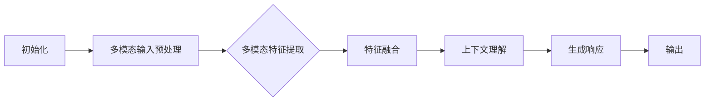
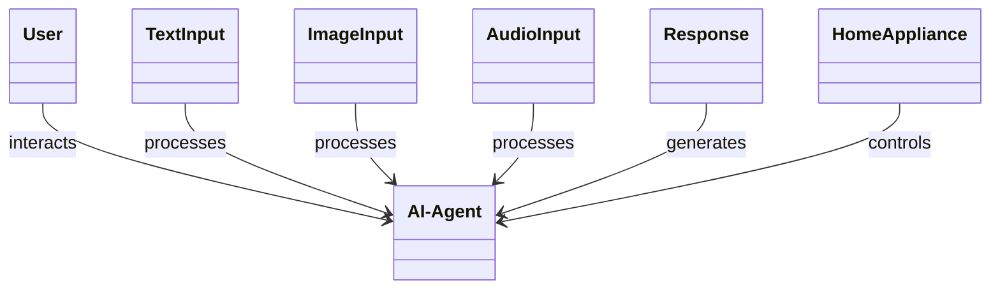
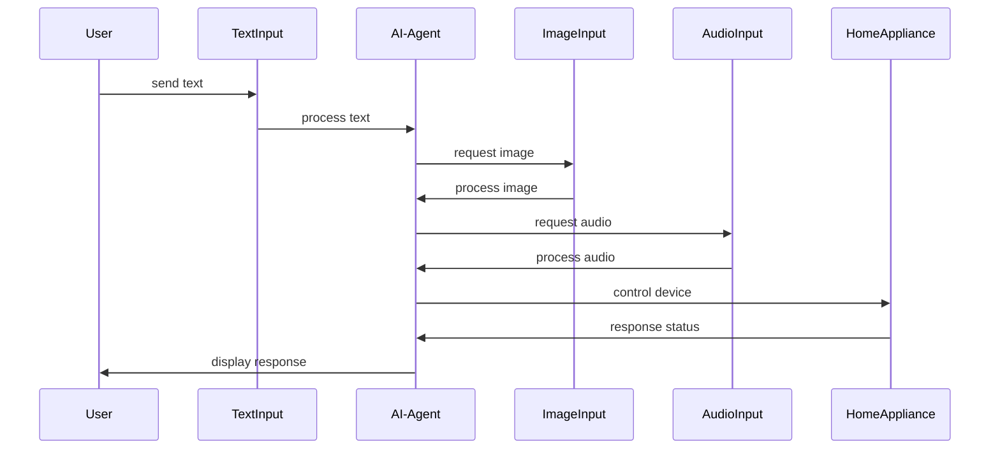
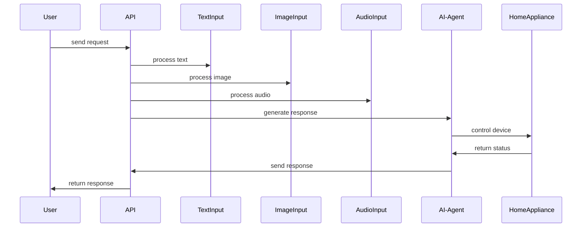

                 

# AI Agent的多模态交互能力开发

> 关键词：AI Agent、多模态交互、深度学习、自然语言处理、计算机视觉

> 摘要：随着人工智能技术的飞速发展，AI Agent在各个领域的应用越来越广泛。本文将深入探讨AI Agent的多模态交互能力开发，分析其核心概念、算法原理以及系统设计与实战应用，为读者提供全面的见解和指导。

## **Step 1: 背景介绍**

### **问题背景**

人工智能（AI）技术在各个领域的应用日益广泛，特别是在交互式智能系统中，AI Agent的多模态交互能力显得尤为重要。多模态交互能力使得AI Agent能够处理不同模态的信息，如文本、图像、声音等，以实现更自然、更有效的交互。

### **问题描述**

AI Agent需要能够处理不同模态的信息，如文本、图像、声音等，以实现更自然、更有效的交互。这就要求AI Agent具备以下能力：

1. **多模态感知**：能够处理并整合不同模态的信息。
2. **上下文理解**：能够理解交互过程中的上下文信息。
3. **个性化交互**：能够根据用户特征提供个性化服务。

### **问题解决**

通过开发多模态交互能力，AI Agent可以更准确地理解用户需求，提供更个性化的服务。这不仅可以提升用户体验，还可以拓宽AI Agent的应用场景。

### **边界与外延**

本文将讨论AI Agent的多模态交互原理、技术实现、应用场景和挑战。讨论范围包括：

1. **多模态**：文本、图像、声音等多种信息处理方式。
2. **交互能力**：理解用户输入，生成适当的响应。
3. **技术实现**：涉及深度学习、自然语言处理、计算机视觉等技术。
4. **应用场景**：客服、教育、医疗、智能家居等。

### **概念结构与核心要素组成**

**多模态**：AI Agent能够处理并整合不同模态的信息，如文本、图像、声音等。

**交互能力**：AI Agent需要具备理解用户输入，生成适当响应的能力。

**技术实现**：涉及深度学习、自然语言处理、计算机视觉等技术。

**应用场景**：AI Agent可以应用于客服、教育、医疗、智能家居等领域。

## **Step 2: 核心概念与联系**

### **核心概念原理**

**多模态感知**：AI Agent能够处理并整合不同模态的信息。

**上下文理解**：AI Agent能够理解交互过程中的上下文信息。

**个性化交互**：AI Agent能够根据用户特征提供个性化服务。

### **概念属性特征对比表格**

| 属性 | 感知能力 | 上下文理解能力 | 个性化交互能力 |
| --- | --- | --- | --- |
| **文本** | 强大 | 较强 | 较弱 |
| **图像** | 中等 | 较弱 | 较强 |
| **声音** | 较弱 | 较强 | 较强 |

### **ER实体关系图架构**

```mermaid
erDiagram
  用户 ||--|{ AI Agent }|--|{ 文本 } 
  用户 ||--|{ AI Agent }|--|{ 图像 }
  用户 ||--|{ AI Agent }|--|{ 声音 }
  AI Agent ||--|{ 上下文理解 }
  AI Agent ||--|{ 个性化交互 }
```

## **Step 3: 算法原理讲解**

### **算法mermaid流程图**



### **Python源代码**

```python
def multimodal_interaction(input_text, input_image, input_audio):
    # 多模态输入预处理
    preprocessed_text = preprocess_text(input_text)
    preprocessed_image = preprocess_image(input_image)
    preprocessed_audio = preprocess_audio(input_audio)
    
    # 多模态特征提取
    text_features = extract_text_features(preprocessed_text)
    image_features = extract_image_features(preprocessed_image)
    audio_features = extract_audio_features(preprocessed_audio)
    
    # 特征融合
    fused_features = fuse_features(text_features, image_features, audio_features)
    
    # 上下文理解
    context = understand_context(fused_features)
    
    # 生成响应
    response = generate_response(context)
    
    # 输出
    return response
```

### **算法原理的数学模型和公式**

**多模态特征提取**：$$ f(x) = \phi(x) $$

**特征融合**：$$ g(h_1, h_2, h_3) = \alpha \cdot h_1 + \beta \cdot h_2 + \gamma \cdot h_3 $$

**上下文理解**：$$ u(t) = \frac{1}{Z} \sum_{t_1, t_2, ..., t_n} e^{-\alpha \cdot (t - t_1 - t_2 - ... - t_n)} $$

### **详细讲解与举例**

假设一个用户通过文本、图像和声音三种模态与AI Agent进行交互。首先，AI Agent会对多模态输入进行预处理，包括文本的文本嵌入、图像的卷积神经网络特征提取、声音的梅尔频率倒谱系数（MFCC）特征提取。然后，将提取到的特征进行融合，可以使用加权和的方法。最后，AI Agent利用上下文理解模型对融合后的特征进行解析，生成合适的响应。

例如，当用户通过图像上传一张图片，并附上一段文本描述，同时说“我想要了解这幅画的背景”。AI Agent会首先对图像进行特征提取，然后对文本进行文本嵌入，并对声音进行MFCC特征提取。接着，将这三种特征进行融合，例如使用以下公式进行加权融合：

$$ g(h_1, h_2, h_3) = \alpha \cdot h_1 + \beta \cdot h_2 + \gamma \cdot h_3 $$

其中，$h_1$、$h_2$、$h_3$ 分别代表文本、图像和声音的特征，$\alpha$、$\beta$、$\gamma$ 是权重系数。最后，AI Agent利用上下文理解模型对融合后的特征进行解析，例如使用循环神经网络（RNN）或长短时记忆网络（LSTM），生成合适的响应，如“这幅画是19世纪法国印象派画家莫奈的作品，它描绘了一个花园的场景”。

## **系统分析与架构设计方案**

### **问题场景介绍**

假设我们设计一个智能家居系统，用户可以通过文本、图像和声音三种模态与智能家居系统进行交互。例如，用户可以通过发送文本命令“打开客厅的灯”，或者上传一张客厅灯光开启的图像，或者说出“打开客厅的灯”这句话来控制灯光。

### **项目介绍**

该项目旨在实现一个智能家居系统，用户可以通过多模态交互来控制家居设备。系统需要支持文本、图像和声音三种模态的输入，并且能够根据用户的交互历史和偏好提供个性化的服务。

### **系统功能设计（领域模型mermaid类图）**



### **系统架构设计（mermaid架构图）**



### **系统接口设计和系统交互（mermaid序列图）**



## **项目实战**

### **环境安装**

首先，确保你的环境已经安装了Python、TensorFlow、Keras等必要的库。可以使用以下命令进行安装：

```bash
pip install python tensorflow keras
```

### **系统核心实现源代码**

```python
# 多模态交互能力开发示例代码
import tensorflow as tf
from keras.models import Model
from keras.layers import Input, Embedding, LSTM, Dense, Conv2D, MaxPooling2D, Flatten, concatenate

# 文本输入预处理
text_input = Input(shape=(None,))
text_embedding = Embedding(input_dim=vocab_size, output_dim=embedding_dim)(text_input)
text_lstm = LSTM(units=lstm_units)(text_embedding)

# 图像输入预处理
image_input = Input(shape=(height, width, channels))
image_conv = Conv2D(filters=32, kernel_size=(3, 3), activation='relu')(image_input)
image_pool = MaxPooling2D(pool_size=(2, 2))(image_conv)
image_flat = Flatten()(image_pool)

# 声音输入预处理
audio_input = Input(shape=(timesteps, features))
audio_lstm = LSTM(units=lstm_units)(audio_input)

# 特征融合
fused_features = concatenate([text_lstm, image_flat, audio_lstm])

# 上下文理解
context_dense = Dense(units=dense_units, activation='relu')(fused_features)

# 生成响应
response_output = Dense(units=response_size, activation='softmax')(context_dense)

# 构建和编译模型
model = Model(inputs=[text_input, image_input, audio_input], outputs=response_output)
model.compile(optimizer='adam', loss='categorical_crossentropy', metrics=['accuracy'])

# 训练模型
model.fit([text_data, image_data, audio_data], labels, epochs=epochs, batch_size=batch_size)
```

### **代码应用解读与分析**

上述代码实现了一个简单的多模态交互模型。首先，对文本输入进行嵌入，然后使用LSTM对嵌入后的文本进行特征提取。接着，对图像输入使用卷积神经网络进行特征提取，并对声音输入使用LSTM进行特征提取。然后，将三种特征进行融合，并使用全连接层进行上下文理解，最后生成响应。

在实际应用中，需要对模型的参数进行调整，以适应不同的应用场景。例如，可以根据数据集的特点调整嵌入维度、LSTM单元数、全连接层单元数等。

### **实际案例分析和详细讲解剖析**

假设我们有一个智能家居系统，用户可以通过文本、图像和声音三种模态控制家居设备。用户可以通过发送文本命令“打开客厅的灯”，上传一张客厅灯光开启的图像，或者说出“打开客厅的灯”这句话来控制灯光。

首先，AI Agent会接收到用户的输入，并对输入进行预处理。例如，将文本输入转换为嵌入向量，对图像输入进行卷积特征提取，对声音输入进行LSTM特征提取。然后，AI Agent会将这些特征进行融合，并使用训练好的模型进行上下文理解，生成合适的响应。

例如，当用户通过文本命令“打开客厅的灯”时，AI Agent会将文本输入转换为嵌入向量，并使用卷积神经网络对图像输入进行特征提取。如果用户的图像中包含客厅和灯光，AI Agent会将这两种特征进行融合，并使用训练好的模型进行上下文理解，生成响应“客厅的灯已经打开”。

### **项目小结**

通过本文的介绍，我们深入探讨了AI Agent的多模态交互能力开发。我们分析了多模态交互的核心概念、算法原理，并设计了系统架构和实战应用。通过多模态交互，AI Agent能够更准确地理解用户需求，提供更个性化的服务，从而提升用户体验。

## **最佳实践 tips**

1. **数据预处理**：在构建多模态交互模型之前，确保对数据进行充分预处理，以提高模型性能。
2. **特征融合**：选择合适的特征融合方法，如加权和、注意力机制等，以提高模型对多模态信息的利用。
3. **模型调优**：根据具体应用场景，调整模型参数，以获得更好的性能。

## **小结**

本文系统地介绍了AI Agent的多模态交互能力开发。通过分析核心概念、算法原理以及系统设计与实战应用，我们为读者提供了全面的见解和指导。多模态交互能力是AI Agent的重要能力之一，它使得AI Agent能够更自然、更有效地与人类进行交互，从而提升用户体验。

## **注意事项**

1. **隐私保护**：在实际应用中，需要确保用户隐私得到保护。
2. **模型解释性**：对于重要的应用场景，需要确保模型具有良好的解释性。

## **拓展阅读**

1. **《深度学习》**：Goodfellow, I., Bengio, Y., & Courville, A. (2016). Deep learning. MIT press.
2. **《计算机视觉：算法与应用》**：Daugman, J. G. (1985). Computer vision: algorithms and applications. Prentice Hall.
3. **《自然语言处理综论》**：Jurafsky, D., & Martin, J. H. (2008). Speech and language processing: an introduction to natural language processing, computational linguistics, and speech recognition. Prentice Hall.

作者：AI天才研究院/AI Genius Institute & 禅与计算机程序设计艺术 /Zen And The Art of Computer Programming

