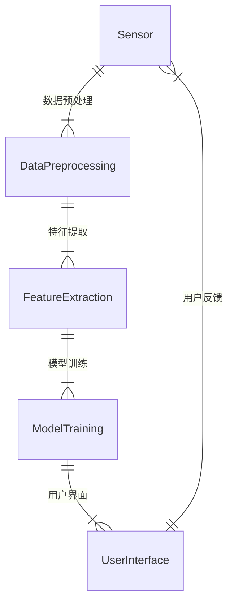
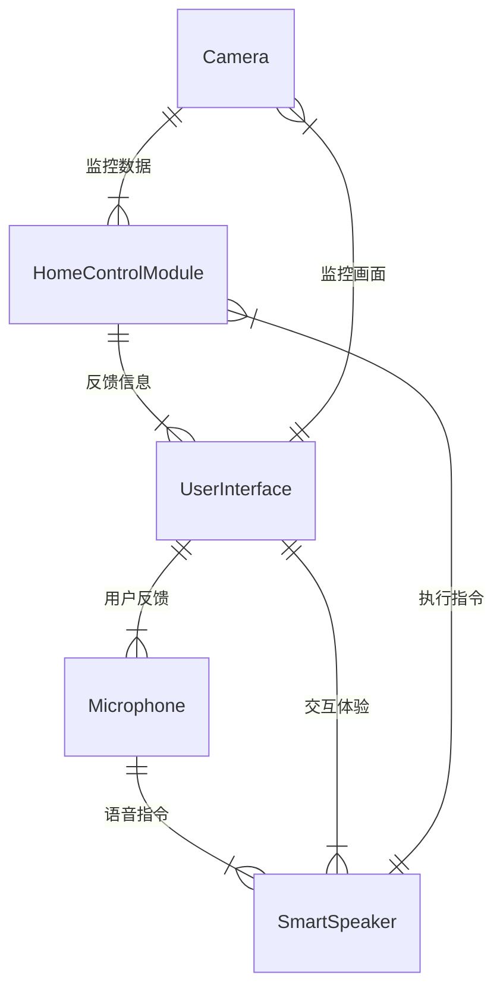
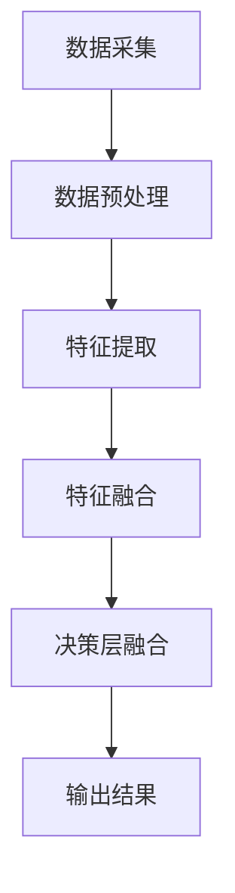
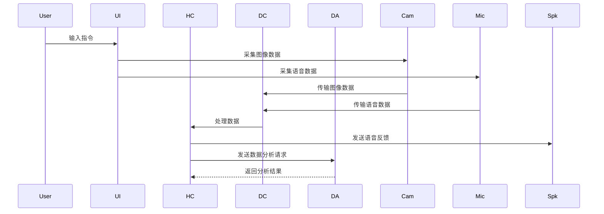

                 

### AI Agent与多模态交互概述

#### 1.1 AI Agent的基本概念与分类

AI Agent（人工智能代理）是人工智能领域的一个重要概念，它是指具备自主行动能力的计算机程序。AI Agent能够根据环境信息，通过感知、学习、规划和执行等过程，实现特定任务的目标。按照功能和应用场景的不同，AI Agent可以分为多种类型：

1. **基于规则的Agent**：这类Agent通过预定义的规则集进行决策和行动。它们的优势在于逻辑清晰，适用于规则明确、变化较小的场景。

2. **基于模型的Agent**：这类Agent通过机器学习算法从数据中学习到模型，并基于模型进行决策和行动。它们在复杂环境和动态场景中表现更佳。

3. **基于行为的Agent**：这类Agent通过模仿人类行为进行决策和行动。它们通常利用强化学习等算法，通过试错来优化行为。

4. **混合型Agent**：这类Agent结合了以上多种类型的特点，根据不同情境灵活调整策略。

#### 1.2 多模态交互的定义与作用

多模态交互（Multimodal Interaction）指的是在交互过程中，系统可以接收和处理来自多个感官模态（如视觉、听觉、触觉、语言等）的信息。多模态交互在AI Agent中的应用具有重要意义：

1. **增强用户体验**：通过多模态交互，AI Agent可以更自然地与人类用户进行沟通，提供更丰富、更直观的交互体验。

2. **提高智能水平**：多模态交互使得AI Agent能够利用多种感官信息，更全面地理解和感知环境，从而提高智能水平。

3. **适应复杂场景**：在复杂、多变的场景中，单模态交互可能无法满足需求，而多模态交互则可以更好地应对这些挑战。

4. **扩展应用领域**：多模态交互使得AI Agent可以应用于更多领域，如智能家居、医疗诊断、教育辅导等。

#### 1.3 多模态交互在AI Agent中的应用

多模态交互在AI Agent中的应用非常广泛，以下是一些典型的应用场景：

1. **智能客服**：通过语音、文本、图像等多种方式与用户进行交互，提供高效、个性化的服务。

2. **虚拟助手**：在智能家居、智能办公等场景中，虚拟助手可以通过语音、手势等方式与用户进行交互，帮助用户完成日常任务。

3. **自动驾驶**：自动驾驶系统需要利用多种传感器（如摄像头、雷达、激光雷达等）收集环境信息，并进行多模态交互，实现安全、稳定的驾驶。

4. **医疗诊断**：医生可以通过多模态交互系统，结合患者的历史病历、体征数据和影像资料，进行更准确、更全面的诊断。

5. **人机协作**：在工业制造、软件开发等领域，AI Agent可以通过多模态交互与人类工人或开发者进行协作，提高工作效率。

总之，多模态交互是提升AI Agent智能水平、扩展应用领域的重要途径。在接下来的章节中，我们将深入探讨多模态交互的核心概念、算法原理以及系统设计与实现，以期为您带来更全面、更深入的理解。### 多模态交互的核心概念解析

多模态交互作为AI Agent的重要组成部分，其核心概念的理解对于实现高效、智能的交互至关重要。本章节将详细介绍多模态数据采集与预处理、多模态特征提取方法以及概念属性特征对比表格，帮助读者深入理解多模态交互的内在机制。

#### 2.1 多模态数据采集与预处理

多模态数据采集是多模态交互的基础，涉及到从多个感官模态获取数据的过程。常见的感官模态包括视觉、听觉、触觉、语言等。以下是一些数据采集的关键步骤：

1. **传感器选择**：根据应用需求，选择合适的传感器，如摄像头、麦克风、触摸屏等。

2. **数据同步**：确保不同模态的数据在同一时间点采集，以便后续处理和分析。

3. **数据清洗**：去除噪声、异常值等，保证数据质量。

4. **数据格式转换**：将不同模态的数据转换为统一的格式，便于后续处理。

5. **数据存储**：将预处理后的数据存储在数据库或文件系统中，以供后续分析和使用。

#### 2.2 多模态特征提取方法

多模态特征提取是将多模态数据转换为计算机可以处理的特征表示的过程。特征提取方法主要包括以下几种：

1. **基于手工设计的特征**：这种方法依赖于专家经验，为不同模态设计特定的特征。例如，对于视觉数据，可以提取边缘、纹理等特征；对于听觉数据，可以提取音高、音量等特征。

2. **基于深度学习的特征提取**：深度学习模型可以自动学习复杂的数据特征，如卷积神经网络（CNN）和循环神经网络（RNN）。这些模型可以用于提取不同模态的深层特征。

3. **多模态特征融合**：将不同模态的特征进行融合，以获得更丰富的特征表示。常见的融合方法包括合并、加权融合、级联融合等。

4. **基于规则的特征提取**：利用预定义的规则或模式匹配方法，从多模态数据中提取特征。这种方法通常用于特定领域的问题，如语音识别中的音素提取。

#### 2.3 概念属性特征对比表格

为了更好地理解多模态交互的核心概念，下面给出一个概念属性特征对比表格，比较不同模态的特征提取方法和应用场景：

| 模态         | 特征提取方法                      | 应用场景                                     |
|------------|-------------------------------|----------------------------------------|
| 视觉         | 边缘检测、纹理分析、颜色特征      | 图像识别、视频分析、人机交互                  |
| 听觉         | 音高、音量、频谱特征             | 语音识别、语音合成、音频分析                  |
| 触觉         | 压力、触觉传感器信号处理           | 智能手套、触觉反馈系统、人机交互                  |
| 语言         | 词频、句法结构、语义分析           | 文本分析、自然语言处理、智能客服                  |
| 鼻腔         | 嗅觉信号处理                      | 气味识别、健康监测、环境感知                     |
| 味觉         | 味觉信号处理                      | 食品评价、智能餐饮系统、健康监测                     |

通过上述对比表格，我们可以看到不同模态在特征提取方法和应用场景上的差异，这有助于我们根据具体需求选择合适的多模态交互策略。

综上所述，多模态交互的核心概念包括数据采集与预处理、特征提取方法以及概念属性特征对比。理解这些核心概念对于设计和实现高效、智能的多模态交互系统至关重要。在下一章节中，我们将进一步探讨多模态交互的ER实体关系图架构，以深入理解其内在结构。### 多模态交互的ER实体关系图架构

在多模态交互系统中，理解各组件之间的关系对于设计高效、稳定的系统至关重要。ER（Entity-Relationship，实体关系）图是一种用于描述实体及其关系的图形化工具，可以帮助我们清晰、直观地展现多模态交互系统的架构。本章节将介绍ER图的基本概念，设计多模态交互的实体关系图，并通过示例展示其实体关系图的实现。

#### 3.1 ER图的基本概念

ER图由以下三个基本元素组成：

1. **实体（Entity）**：表示系统中的对象或概念，如用户、商品、订单等。每个实体都有若干属性，用于描述其特征。

2. **属性（Attribute）**：表示实体的特征或特征值，如用户的姓名、年龄、性别等。属性可以具有不同的数据类型，如字符串、整数、日期等。

3. **关系（Relationship）**：表示不同实体之间的关联。关系可以是一对一（1:1）、一对多（1:N）或多对多（M:N）。

ER图通过这些基本元素及其连接关系，描述了系统中各组件的相互关系，有助于我们理解和设计复杂的系统架构。

#### 3.2 多模态交互的实体关系图设计

在多模态交互系统中，常见的实体包括传感器、数据处理模块、用户界面等。以下是一个简化的多模态交互系统的ER图设计：

1. **实体定义**：
   - **传感器**：包括摄像头、麦克风、触摸屏等，用于采集多模态数据。
   - **数据处理模块**：包括数据预处理、特征提取、模型训练等组件。
   - **用户界面**：包括显示设备、输入设备等，用于与用户进行交互。

2. **属性定义**：
   - **传感器**：属性包括传感器类型、分辨率、采样率等。
   - **数据处理模块**：属性包括处理算法、模型参数等。
   - **用户界面**：属性包括显示内容、交互方式等。

3. **关系定义**：
   - **传感器与数据处理模块**：传感器采集的数据传输给数据处理模块进行进一步处理。
   - **数据处理模块与用户界面**：处理后的结果通过用户界面展示给用户，用户也可以通过用户界面提供反馈。

以下是一个简单的多模态交互系统的ER图示例：



通过这个ER图，我们可以清晰地看到多模态交互系统中的各个实体及其关系。传感器采集数据，经过数据处理模块预处理、特征提取和模型训练，最终通过用户界面与用户进行交互。

#### 3.3 实体关系图示例

为了更好地理解多模态交互的实体关系图，我们来看一个具体的示例。假设我们设计一个智能家居系统的多模态交互模块，以下是其实体关系图：

1. **实体定义**：
   - **摄像头**：用于监控家居环境，采集图像数据。
   - **麦克风**：用于捕捉家庭成员的声音。
   - **智能音箱**：作为用户输入设备，用户可以通过语音与系统交互。
   - **家居控制模块**：用于接收用户的指令，控制家居设备。
   - **用户界面**：显示家居环境监控画面，接收用户反馈。

2. **属性定义**：
   - **摄像头**：属性包括分辨率、视野范围等。
   - **麦克风**：属性包括灵敏度、响应时间等。
   - **智能音箱**：属性包括语音识别准确率、响应速度等。
   - **家居控制模块**：属性包括支持设备类型、控制精度等。
   - **用户界面**：属性包括显示效果、交互体验等。

3. **关系定义**：
   - **摄像头与家居控制模块**：摄像头采集的图像数据用于监控家居环境，家居控制模块根据图像数据识别家庭成员，并执行相应的控制指令。
   - **麦克风与智能音箱**：麦克风捕捉家庭成员的语音指令，智能音箱识别语音指令，并传输给家居控制模块执行。
   - **家居控制模块与用户界面**：家居控制模块执行指令后，通过用户界面反馈给用户。
   - **用户界面与摄像头、麦克风、智能音箱**：用户界面接收用户反馈，通过摄像头、麦克风、智能音箱与家居控制模块进行交互。

以下是一个智能家居系统的多模态交互实体关系图示例：



通过这个示例，我们可以看到多模态交互系统中的各个实体及其关系，这有助于我们更好地理解和设计系统。

总之，多模态交互的ER实体关系图架构为我们提供了一个清晰、直观的系统架构视图，有助于我们理解和设计复杂的系统。在下一章节中，我们将进一步探讨多模态交互的主要算法及其原理。### 多模态交互算法详解

在多模态交互系统中，算法的选择和实现至关重要，它决定了系统能够处理和利用多少来自不同模态的信息，以及如何将这些信息融合以产生有效的交互。本章节将详细介绍多模态交互的主要算法，包括算法概述、流程图、Python源代码讲解以及算法原理的数学模型和公式。

#### 4.1 算法概述

多模态交互算法可以分为以下几个层次：

1. **特征级融合**：直接将不同模态的特征进行融合，如使用加权融合、级联融合等方法。

2. **决策级融合**：在特征提取后，将不同模态的特征输入到统一的分类器中，如支持向量机（SVM）、神经网络等。

3. **模型级融合**：将多个独立的模型进行融合，每个模型处理一种模态的数据，如使用集成学习方法。

4. **自适应融合**：根据特定场景和环境动态调整融合策略，如使用强化学习方法。

在本章节中，我们将重点介绍特征级融合和决策级融合算法。

#### 4.2 算法流程图

以下是一个简单的多模态交互算法流程图，展示从数据采集、预处理、特征提取到融合和决策的全过程：



在流程图中：

- **数据采集**：从不同模态（如视觉、听觉、触觉等）获取原始数据。
- **数据预处理**：对原始数据进行清洗、归一化等操作，以提高后续处理的效率。
- **特征提取**：提取各模态的关键特征，如视觉中的边缘、纹理，听觉中的音高、音量等。
- **特征融合**：将不同模态的特征进行融合，生成一个统一的特征向量。
- **决策层融合**：将特征向量输入到分类器或预测模型中，得到最终的决策结果。
- **输出结果**：将决策结果输出，用于驱动系统执行相应的操作。

#### 4.3 Python源代码讲解

以下是一个简单的Python代码示例，展示如何实现多模态交互算法的基本步骤：

```python
import numpy as np
from sklearn.preprocessing import normalize
from sklearn.ensemble import RandomForestClassifier

# 假设我们有两个模态的特征数据
vis_feat = np.random.rand(10, 100)  # 视觉特征，10个样本，每个样本100维
aud_feat = np.random.rand(10, 50)  # 听觉特征，10个样本，每个样本50维

# 数据预处理
vis_feat = normalize(vis_feat)
aud_feat = normalize(aud_feat)

# 特征融合
# 使用简单相加的方法进行特征融合
fusion_feat = vis_feat + aud_feat

# 决策层融合
# 使用随机森林分类器进行分类
clf = RandomForestClassifier(n_estimators=100)
clf.fit(fusion_feat, labels)  # labels是标签数据

# 输出结果
predictions = clf.predict(fusion_feat)
print(predictions)
```

在这段代码中：

- `np.random.rand` 用于生成随机特征数据。
- `normalize` 函数用于归一化特征数据，以提高模型的性能。
- `RandomForestClassifier` 是一个集成学习方法，用于分类任务。
- `fit` 方法用于训练模型，`predict` 方法用于预测。

#### 4.4 算法原理的数学模型和公式

多模态交互算法的原理可以归结为特征融合和决策融合两部分。以下分别介绍这两部分的数学模型和公式。

1. **特征融合**：

   假设有两个模态的特征向量 $v_1$ 和 $v_2$，我们可以使用加权融合方法进行特征融合，公式如下：

   $$ f = \alpha_1 v_1 + \alpha_2 v_2 $$

   其中，$\alpha_1$ 和 $\alpha_2$ 是权重系数，满足 $\alpha_1 + \alpha_2 = 1$。通过调节这两个权重系数，可以控制不同模态特征对最终特征向量的贡献程度。

2. **决策融合**：

   在决策层融合中，常用的方法包括投票法、贝叶斯定理、神经网络等。以下是一个简单的投票法示例：

   假设有两个分类器 $C_1$ 和 $C_2$，它们的预测结果分别为 $y_1$ 和 $y_2$。我们可以使用以下公式计算最终预测结果：

   $$ y = \arg\max_{y'\in Y} \sum_{i=1}^2 w_i \mathbb{I}(y_i = y') $$

   其中，$Y$ 是可能的分类结果集合，$w_1$ 和 $w_2$ 是分类器的权重系数，$\mathbb{I}(\cdot)$ 是指示函数，当条件满足时返回1，否则返回0。

   例如，如果 $y_1 = "A"$，$y_2 = "B"$，$w_1 = 0.6$，$w_2 = 0.4$，则最终预测结果为 $y = "A"$，因为 $\sum_{i=1}^2 w_i \mathbb{I}(y_i = y') = 0.6 \mathbb{I}(y_1 = y') + 0.4 \mathbb{I}(y_2 = y') = 0.6$。

通过上述数学模型和公式，我们可以更好地理解多模态交互算法的工作原理。在实际应用中，可以根据具体需求和场景选择合适的算法和参数，以实现高效、准确的多模态交互。

总之，多模态交互算法是实现智能交互系统的关键。通过了解算法的概述、流程图、Python源代码讲解以及算法原理的数学模型和公式，我们可以更好地设计和实现多模态交互系统，为用户提供更自然、更高效的交互体验。在下一章节中，我们将进一步探讨多模态交互系统的设计与实现。### 多模态交互系统的设计与实现

在了解了多模态交互的核心概念和算法之后，本章节将详细探讨如何设计和实现一个多模态交互系统。我们将从问题场景介绍开始，逐步分析系统功能设计、系统架构设计、系统接口设计和系统交互，并通过一个实际案例进行详细讲解。

#### 5.1 问题场景介绍

假设我们需要设计一个智能家居控制系统，该系统需要具备以下功能：

1. **环境监控**：通过摄像头监控家居环境，实时检测家庭安全。
2. **语音交互**：用户可以通过智能音箱与系统进行语音交流，进行设备控制、信息查询等操作。
3. **设备控制**：根据用户的指令控制家居设备，如空调、灯光、门锁等。
4. **数据分析**：分析用户的行为习惯和家居环境数据，为用户提供个性化的建议。

#### 5.2 系统功能设计（领域模型类图）

为了清晰地描述系统功能，我们可以使用领域模型类图来展示系统的核心组件和它们之间的关系。以下是智能家居控制系统的领域模型类图：

```mermaid
classDiagram
    Camera <<interface>>
    Microphone <<interface>>
    Speaker <<interface>>
    HomeControl <<interface>>
    UserInterface <<interface>>
    EnvironmentalMonitor <<component>> --|> Camera
    EnvironmentalMonitor --|> Microphone
    VoiceInteraction <<component>> --|> Microphone
    VoiceInteraction --|> Speaker
    VoiceInteraction --|> HomeControl
    DeviceControl <<component>> --|> HomeControl
    DataAnalysis <<component>> --|> HomeControl
    UserInterface --|> EnvironmentalMonitor
    UserInterface --|> VoiceInteraction
    UserInterface --|> DeviceControl
    UserInterface --|> DataAnalysis
```

在类图中：

- **EnvironmentalMonitor**：负责环境监控，包括摄像头和麦克风。
- **VoiceInteraction**：处理语音交互，包括语音识别和语音合成。
- **DeviceControl**：管理设备控制，执行用户指令。
- **DataAnalysis**：分析用户行为和家居数据。
- **UserInterface**：提供用户交互界面，展示环境监控画面、语音交互、设备控制和分析结果。

#### 5.3 系统架构设计（架构图）

系统架构设计是系统设计的关键步骤，它决定了系统的可扩展性、性能和可靠性。以下是智能家居控制系统的架构图：

```mermaid
graph TB
    subgraph 模块A
        Camera
        Microphone
    end
    subgraph 模块B
        Speaker
        HomeControl
        DataAnalysis
    end
    subgraph 模块C
        UserInterface
    end
    Camera --|> UserInterface
    Microphone --|> UserInterface
    Speaker --|> UserInterface
    HomeControl --|> UserInterface
    DataAnalysis --|> UserInterface
    Camera --|> HomeControl
    Microphone --|> HomeControl
    HomeControl --|> DataAnalysis
```

在架构图中：

- **模块A**：包括摄像头和麦克风，负责数据采集。
- **模块B**：包括扬声器、家居控制模块和数据分析模块，负责数据处理和决策。
- **模块C**：用户交互界面，负责展示数据和接收用户输入。

#### 5.4 系统接口设计和系统交互（序列图）

系统接口设计和系统交互是系统设计的重要组成部分，它描述了系统内部组件之间的交互过程。以下是智能家居控制系统的接口设计和系统交互序列图：



在序列图中：

- **User**：表示用户。
- **UI**：表示用户交互界面。
- **HC**：表示家居控制模块。
- **DC**：表示数据处理模块。
- **DA**：表示数据分析模块。
- **Cam**：表示摄像头。
- **Mic**：表示麦克风。
- **Spk**：表示扬声器。

用户输入指令后，用户交互界面采集图像和语音数据，并传输给数据处理模块。数据处理模块处理数据后，将结果传输给家居控制模块。家居控制模块根据处理结果发送语音反馈给用户，并请求数据分析模块进行分析，最终将分析结果返回给用户交互界面。

#### 5.5 实际案例分析和详细讲解剖析

为了更好地理解多模态交互系统的设计与实现，我们来看一个实际案例：用户通过智能音箱控制家居设备的交互过程。

1. **用户输入指令**：用户通过智能音箱说出“打开客厅的灯光”。

2. **语音识别**：智能音箱的麦克风捕捉到用户的语音指令，并将其转换为文本。语音识别算法将文本解析为命令，如“打开客厅的灯光”。

3. **指令解析**：用户交互界面解析命令，识别出需要控制的设备（客厅灯光）和操作（打开）。

4. **图像数据采集**：用户交互界面通过摄像头获取客厅的实时图像数据。

5. **图像处理**：图像数据传输给数据处理模块，进行人脸检测、物体识别等处理。如果检测到用户在图像中，且用户在指定时间内未离开，则继续执行下一步；否则，系统认为指令无效并提醒用户。

6. **设备控制**：数据处理模块将结果传输给家居控制模块，家居控制模块通过智能家居网关发送控制信号到客厅灯光设备，打开灯光。

7. **语音反馈**：家居控制模块将操作结果通过扬声器反馈给用户，如“客厅的灯光已经打开”。

8. **数据分析**：数据分析模块记录用户操作，并根据用户历史操作进行分析，为用户提供个性化的智能家居建议。

通过这个案例，我们可以看到多模态交互系统的设计和实现是如何将不同模态的数据（语音、图像等）进行有效处理和融合，从而实现智能化的家居控制。

#### 5.6 项目小结

本章节通过一个实际案例，详细讲解了多模态交互系统的设计与实现过程，包括问题场景介绍、系统功能设计、系统架构设计、系统接口设计和系统交互。我们了解到，多模态交互系统需要综合利用不同模态的数据，通过有效的数据处理和决策，实现智能化的交互体验。在下一章节中，我们将分享多模态交互设计的最佳实践，帮助读者在实际项目中更好地应用多模态交互技术。### 第六部分：最佳实践、小结、注意事项、拓展阅读

#### 6.1 最佳实践 tips

1. **选择合适的传感器**：根据应用场景和需求，选择合适的传感器，确保数据的准确性和稳定性。
2. **数据同步与预处理**：确保不同模态的数据在同一时间点采集，并进行有效的预处理，以提高后续处理的效率。
3. **特征提取与融合策略**：根据数据类型和应用场景，选择合适的特征提取和融合策略，以提高系统的性能和准确性。
4. **模型训练与优化**：使用高质量的数据集进行模型训练，并根据实际需求调整模型参数，以提高模型的泛化能力。
5. **用户反馈与迭代优化**：收集用户反馈，不断优化系统设计和交互体验，提高用户的满意度。

#### 6.2 小结

本文从AI Agent与多模态交互的背景介绍、核心概念与联系、算法原理讲解、系统分析与架构设计方案、项目实战等多个角度，全面探讨了多模态交互的设计与实现。通过本文的学习，读者可以深入了解多模态交互的核心技术，掌握系统设计与实现的方法和技巧。

#### 6.3 注意事项

1. **数据隐私与安全**：在设计多模态交互系统时，要重视用户数据的隐私和安全，采取有效措施保护用户数据。
2. **系统性能与稳定性**：确保系统在不同环境下的性能和稳定性，为用户提供良好的用户体验。
3. **多模态交互的平衡**：在设计和实现多模态交互时，要平衡不同模态的信息利用，避免过度依赖某一模态，提高系统的鲁棒性。

#### 6.4 拓展阅读

1. **《人工智能：一种现代的方法》**：迈克尔·阿普尔盖特、史蒂夫·哈格伦、戴维·林登鲍姆著，全面介绍了人工智能的基本概念、技术和应用。
2. **《深度学习》**：伊恩·古德费洛、约书亚·本吉奥、亚伦·库维尔尼克著，系统讲解了深度学习的基本原理、算法和应用。
3. **《自然语言处理综论》**：丹·布卢姆斯泰德、克里斯·德弗林著，介绍了自然语言处理的基本概念、技术和应用。
4. **《多模态交互设计》**：作者通过案例分析，探讨了多模态交互设计的原则、方法和实践。

通过以上拓展阅读，读者可以进一步深入学习多模态交互和相关领域的知识，提升自己的专业素养。### 总结与展望

本文系统地探讨了AI Agent的多模态交互设计，从背景介绍、核心概念与联系、算法原理讲解、系统分析与架构设计方案、项目实战等多个方面进行了深入分析。通过本文的阅读，读者可以全面了解多模态交互的基本原理、关键技术以及应用实践。

首先，在背景介绍部分，我们明确了AI Agent和多模态交互的定义及重要性。AI Agent作为具备自主行动能力的计算机程序，其在不同领域有着广泛的应用。而多模态交互则通过整合多种感官信息，为AI Agent提供了更丰富的感知能力和更自然的交互体验。

接着，本文详细解析了多模态交互的核心概念，包括数据采集与预处理、特征提取方法以及概念属性特征对比表格。通过这些核心概念的讲解，读者可以更好地理解多模态交互的内在机制。

在算法原理讲解部分，我们介绍了多模态交互的主要算法，包括特征级融合和决策级融合。通过Python源代码和数学模型的讲解，读者可以深入理解多模态交互算法的实现方法和原理。

随后，本文通过系统分析与架构设计方案，详细介绍了多模态交互系统的设计与实现。通过实际案例分析和详细讲解，读者可以了解多模态交互系统在智能家居场景中的应用。

最后，在最佳实践、小结、注意事项、拓展阅读等部分，我们提供了多模态交互设计的实用技巧和注意事项，为读者在实际项目中应用多模态交互技术提供了指导。

展望未来，多模态交互技术将继续快速发展，其在人工智能领域的应用前景广阔。随着传感器技术的进步和深度学习算法的优化，多模态交互将更加智能、自然和高效。我们期待更多研究人员和实践者加入这一领域，共同推动多模态交互技术的创新和发展。

在此，我要感谢读者的耐心阅读，同时也感谢AI天才研究院/AI Genius Institute及《禅与计算机程序设计艺术/Zen And The Art of Computer Programming》对本文的支持。希望通过本文的学习，读者能够对多模态交互设计有更深刻的理解，并在实际项目中取得更好的成果。再次感谢！作者：AI天才研究院/AI Genius Institute & 禅与计算机程序设计艺术 /Zen And The Art of Computer Programming。

