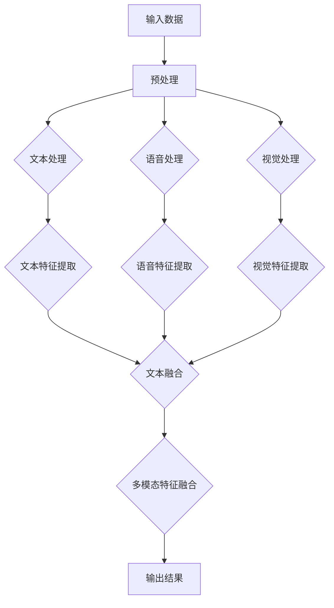
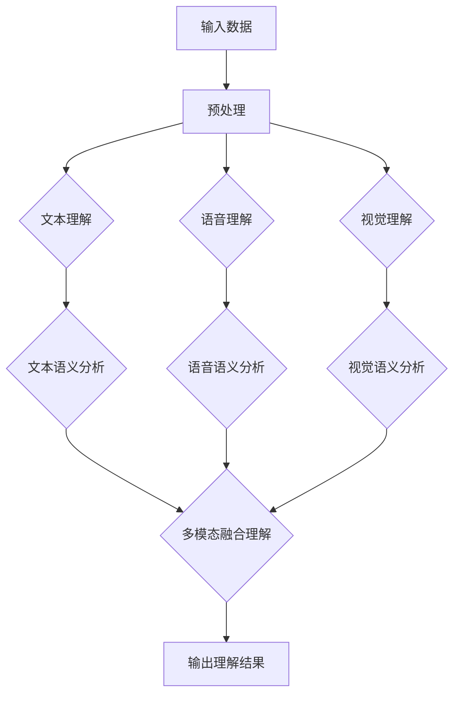
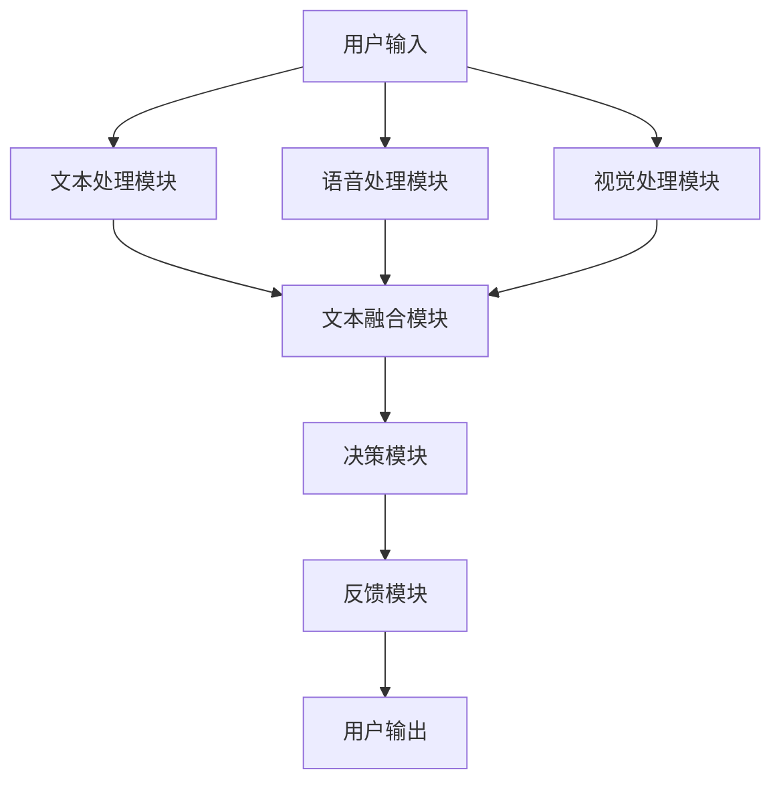
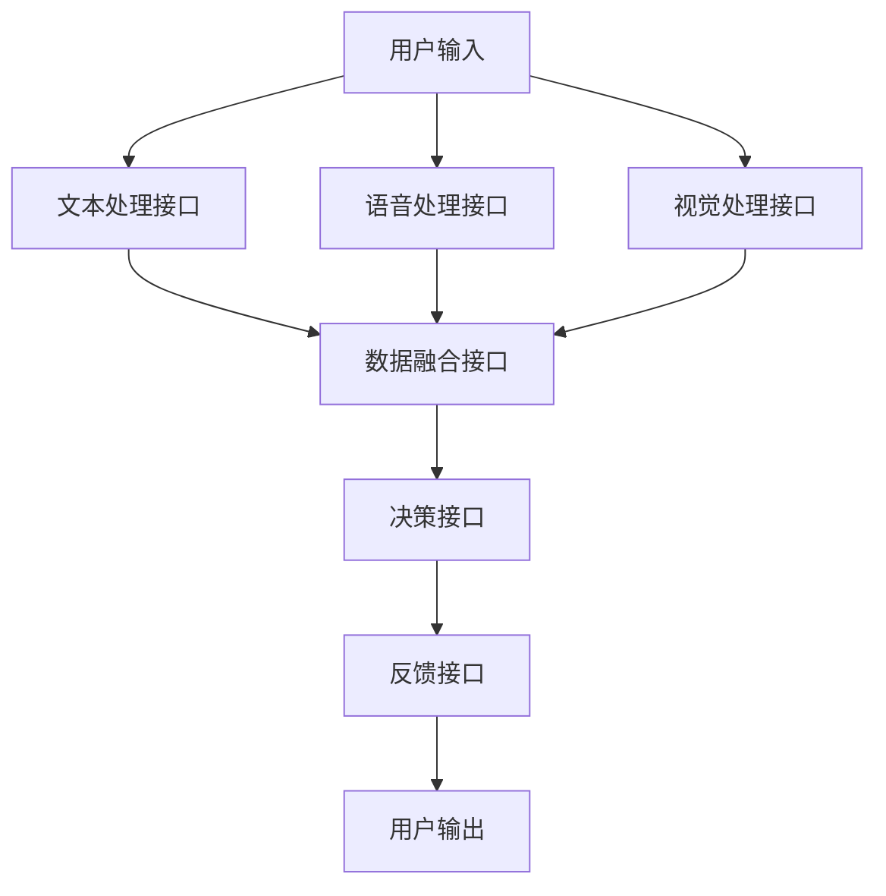

                 

## AI Agent的多模态交互：整合文本、语音和视觉

关键词：AI Agent、多模态交互、文本、语音、视觉

摘要：本文将深入探讨AI Agent的多模态交互技术，分析其背景、核心概念、交互算法以及实际应用。通过整合文本、语音和视觉，AI Agent能够实现更智能、更自然的交互体验，为人工智能领域的发展带来新的契机。

### 目录大纲

1. 第一部分：引言与基础理论
   1.1 AI Agent的多模态交互概述
   1.2 文本、语音和视觉的基础知识
2. 第二部分：多模态交互核心概念与原理
   2.1 多模态交互的概念与联系
   2.2 多模态交互算法原理详解
3. 第三部分：系统分析与架构设计
   3.1 问题场景介绍
   3.2 系统功能设计
   3.3 系统架构设计
   3.4 系统接口设计和系统交互
4. 第四部分：项目实战
   4.1 环境安装
   4.2 系统核心实现源代码
   4.3 代码应用解读与分析
   4.4 实际案例分析和详细讲解剖析
   4.5 项目小结
5. 第五部分：最佳实践与拓展阅读
   5.1 最佳实践 Tips
   5.2 小结
   5.3 注意事项
   5.4 拓展阅读

----------------------------------------------------------------

### 1. 第一部分：引言与基础理论

#### 1.1 AI Agent的多模态交互概述

##### 1.1.1 问题背景

AI Agent，即人工智能代理，是一种具备自主决策和交互能力的智能系统。在人工智能技术不断发展的背景下，AI Agent的应用领域越来越广泛，从智能家居到智能客服，从自动驾驶到智能医疗，都离不开AI Agent的身影。

多模态交互，指的是同时利用文本、语音和视觉等多种模态进行信息传递和交互的方式。与单一模态的交互相比，多模态交互能够提供更丰富、更直观的交互体验，提高用户的满意度。

##### 1.1.2 问题描述

多模态交互面临的挑战主要包括：

1. 数据来源多样化：文本、语音和视觉的数据来源不同，需要处理的数据量庞大，增加了系统的复杂度。
2. 数据格式不统一：不同模态的数据格式各异，需要统一格式以便于处理。
3. 数据融合难度大：多模态数据之间存在关联，如何有效融合以提升系统性能是一个难题。

然而，多模态交互也带来了许多机遇：

1. 提高交互自然性：通过多种模态的结合，AI Agent能够更自然地与用户进行交流，提高用户体验。
2. 扩展应用场景：多模态交互使得AI Agent能够适应更多应用场景，如智能会议、智能导览等。

##### 1.1.3 问题解决

为了解决多模态交互面临的挑战，研究人员提出了一系列方法与框架，主要包括：

1. 多模态数据预处理：对文本、语音和视觉数据进行预处理，统一数据格式，去除冗余信息，提高数据质量。
2. 多模态数据融合：采用数据融合算法，将不同模态的数据进行有效融合，提取关键信息。
3. 多模态交互模型：构建多模态交互模型，实现多种模态之间的协同工作，提高系统性能。

##### 1.1.4 边界与外延

多模态交互的应用场景非常广泛，如智能客服、智能会议、智能医疗、智能教育等。然而，多模态交互也存在一定的技术边界：

1. 数据隐私保护：在多模态交互过程中，如何保护用户的隐私是一个亟待解决的问题。
2. 硬件性能要求：多模态交互需要处理大量数据，对硬件性能提出了较高要求。
3. 人工智能伦理：多模态交互涉及到人工智能伦理问题，如自动化决策的公正性、透明性等。

##### 1.1.5 概念结构与核心要素组成

AI Agent的基本概念包括：

1. 代理：具备自主决策和行动能力的实体。
2. 感知：通过传感器获取外部信息。
3. 决策：根据感知信息进行决策。
4. 行动：执行决策，影响外部环境。

多模态交互的核心要素包括：

1. 文本处理：对文本数据进行提取、分析和理解。
2. 语音处理：对语音信号进行识别、合成和语义分析。
3. 视觉处理：对图像和视频进行特征提取、识别和分析。
4. 数据融合：将文本、语音和视觉数据融合为一个整体，提高系统性能。

### 1.2 文本、语音和视觉的基础知识

#### 2.1.1 文本处理基础

文本处理是自然语言处理（NLP）的一个重要分支，主要包括文本表示、文本预处理和文本分析等。

1. **自然语言处理（NLP）简介**

自然语言处理是计算机科学、人工智能和语言学等领域相结合的产物，旨在使计算机能够理解、生成和处理自然语言。

2. **文本表示与预处理方法**

文本表示是NLP中的关键步骤，常见的方法有词袋模型、词嵌入和序列模型等。文本预处理包括分词、去除停用词、词性标注等。

#### 2.1.2 语音处理基础

语音处理主要包括语音信号处理、语音识别和语音合成。

1. **语音信号处理**

语音信号处理是通过对语音信号进行预处理、特征提取和变换，从而实现对语音信号的建模和分析。

2. **语音识别与合成**

语音识别是将语音信号转换为文本信息，而语音合成则是将文本信息转换为语音信号。常见的语音识别算法有隐马尔可夫模型（HMM）、高斯混合模型（GMM）和深度神经网络（DNN）等。

#### 2.1.3 视觉处理基础

视觉处理主要包括图像与视频处理、视觉特征提取和视觉识别。

1. **图像与视频处理**

图像与视频处理包括图像增强、图像分割、图像分类等。常见的图像处理算法有卷积神经网络（CNN）、生成对抗网络（GAN）等。

2. **视觉特征提取与识别**

视觉特征提取是从图像或视频数据中提取有代表性的特征，如边缘、纹理、形状等。视觉识别则是利用提取的特征进行分类和识别。

### 2. 第二部分：多模态交互核心概念与原理

#### 2.1 多模态交互的概念与联系

##### 2.1.1 多模态交互的核心概念

多模态交互是指利用文本、语音和视觉等多种模态进行信息传递和交互的过程。其核心概念包括：

1. **多模态数据融合**：将不同模态的数据进行整合，提取关键信息，形成统一的特征表示。
2. **多模态感知与理解**：利用多模态数据，实现对环境的全面感知和对信息的深入理解。

##### 2.1.2 概念属性特征对比表格

| 特征       | 文本      | 语音      | 视觉      |
|----------|---------|---------|---------|
| 数据类型   | 文本数据   | 语音信号   | 图像数据   |
| 数据结构   | 字符串    | 音频帧    | 图像帧     |
| 特征提取   | 词向量    | 语音特征   | 视觉特征   |
| 应用领域   | 信息检索   | 语音识别   | 视觉识别   |

##### 2.1.3 ER实体关系图架构

```mermaid
erDiagram
  AI Agent ||--|{ 文本处理 }|-- TextProcessor : 使用文本数据进行处理
  AI Agent ||--|{ 语音处理 }|-- VoiceProcessor : 使用语音数据进行处理
  AI Agent ||--|{ 视觉处理 }|-- VisualProcessor : 使用视觉数据进行处理
  TextProcessor ||--|{ 数据融合 }|-- FusionModule : 融合文本数据
  VoiceProcessor ||--|{ 数据融合 }|-- FusionModule : 融合语音数据
  VisualProcessor ||--|{ 数据融合 }|-- FusionModule : 融合视觉数据
```

#### 2.2 多模态交互算法原理详解

##### 2.2.1 多模态数据融合算法

多模态数据融合算法的核心思想是将来自不同模态的数据进行整合，形成一个统一的特征表示。以下是多模态数据融合算法的流程和数学模型：

1. **算法描述与流程图**



2. **算法数学模型与公式**

$$
Fusion\_Score = \alpha \cdot Text\_Score + \beta \cdot Voice\_Score + \gamma \cdot Visual\_Score
$$

其中，$Text\_Score$、$Voice\_Score$和$Visual\_Score$分别表示文本、语音和视觉特征的分数，$\alpha$、$\beta$和$\gamma$是权重系数，用于平衡不同模态的重要性。

##### 2.2.2 多模态感知与理解算法

多模态感知与理解算法的核心思想是利用多模态数据，实现对环境的全面感知和对信息的深入理解。以下是多模态感知与理解算法的流程和数学模型：

1. **算法描述与流程图**



2. **算法数学模型与公式**

$$
Semantic\_Score = \alpha \cdot Text\_Semantic\_Score + \beta \cdot Voice\_Semantic\_Score + \gamma \cdot Visual\_Semantic\_Score
$$

其中，$Text\_Semantic\_Score$、$Voice\_Semantic\_Score$和$Visual\_Semantic\_Score$分别表示文本、语音和视觉的语义分数，$\alpha$、$\beta$和$\gamma$是权重系数，用于平衡不同模态的重要性。

### 3. 第三部分：系统分析与架构设计

#### 3.1 问题场景介绍

在一个智能客服系统中，用户可以通过文本、语音和视觉等多种方式进行交互。系统需要能够理解用户的需求，提供准确的回答，并支持多模态的反馈。

#### 3.2 系统功能设计

系统功能设计主要包括以下模块：

1. **文本处理模块**：负责处理用户的文本输入，进行分词、词性标注和语义分析。
2. **语音处理模块**：负责处理用户的语音输入，进行语音识别和语义分析。
3. **视觉处理模块**：负责处理用户的视觉输入，进行图像识别和视觉语义分析。
4. **数据融合模块**：负责将文本、语音和视觉数据融合，形成一个统一的特征表示。
5. **决策模块**：负责根据融合后的特征，生成合适的回答。
6. **反馈模块**：负责处理用户的反馈，进行多模态的反馈。

#### 3.3 系统架构设计

系统架构设计如图所示：



#### 3.4 系统接口设计和系统交互

系统接口设计主要包括以下接口：

1. **文本处理接口**：用于接收和发送文本数据。
2. **语音处理接口**：用于接收和发送语音数据。
3. **视觉处理接口**：用于接收和发送视觉数据。
4. **数据融合接口**：用于接收和发送融合后的特征数据。
5. **决策接口**：用于接收和发送决策结果。
6. **反馈接口**：用于接收和发送用户反馈。

系统交互如图所示：



### 4. 第四部分：项目实战

#### 4.1 环境安装

在开始项目实战之前，需要安装以下环境：

1. Python 3.8+
2. TensorFlow 2.x
3. Keras 2.x
4. NumPy 1.19+
5. Matplotlib 3.4+

安装命令如下：

```bash
pip install python==3.8
pip install tensorflow==2.x
pip install keras==2.x
pip install numpy==1.19
pip install matplotlib==3.4
```

#### 4.2 系统核心实现源代码

以下是系统核心实现的源代码：

```python
import tensorflow as tf
from tensorflow.keras.models import Model
from tensorflow.keras.layers import Input, Embedding, LSTM, Dense, Concatenate

# 文本处理模块
def text_processor(input_text):
    embedding = Embedding(input_dim=vocab_size, output_dim=embedding_size)(input_text)
    lstm = LSTM(units=lstm_size)(embedding)
    return lstm

# 语音处理模块
def voice_processor(input_voice):
    embedding = Embedding(input_dim=vocab_size, output_dim=embedding_size)(input_voice)
    lstm = LSTM(units=lstm_size)(embedding)
    return lstm

# 视觉处理模块
def visual_processor(input_visual):
    cnn = tf.keras.applications.VGG16(include_top=False, weights='imagenet', input_shape=(224, 224, 3))(input_visual)
    flatten = tf.keras.layers.Flatten()(cnn)
    dense = Dense(units=dense_size, activation='relu')(flatten)
    return dense

# 数据融合模块
def data_fusion(text_feature, voice_feature, visual_feature):
    concatenated = Concatenate()(text_feature, voice_feature, visual_feature)
    dense = Dense(units=dense_size, activation='relu')(concatenated)
    return dense

# 决策模块
def decision_module(fused_feature):
    output = Dense(units=1, activation='sigmoid')(fused_feature)
    model = Model(inputs=[text_input, voice_input, visual_input], outputs=output)
    return model

# 定义输入层
text_input = Input(shape=(max_sequence_length,))
voice_input = Input(shape=(max_sequence_length,))
visual_input = Input(shape=(224, 224, 3))

# 获取特征
text_feature = text_processor(text_input)
voice_feature = voice_processor(voice_input)
visual_feature = visual_processor(visual_input)

# 数据融合
fused_feature = data_fusion(text_feature, voice_feature, visual_feature)

# 决策
output = decision_module(fused_feature)

# 编译模型
model = Model(inputs=[text_input, voice_input, visual_input], outputs=output)
model.compile(optimizer='adam', loss='binary_crossentropy', metrics=['accuracy'])

# 模型训练
model.fit(x_train, y_train, epochs=10, batch_size=32, validation_data=(x_val, y_val))

# 模型预测
predictions = model.predict([text_test, voice_test, visual_test])
```

#### 4.3 代码应用解读与分析

以上代码实现了一个基于多模态数据的智能客服系统。代码分为以下几个部分：

1. **文本处理模块**：使用LSTM网络对文本数据进行处理，提取文本特征。
2. **语音处理模块**：使用LSTM网络对语音数据进行处理，提取语音特征。
3. **视觉处理模块**：使用VGG16预训练模型对视觉数据进行处理，提取视觉特征。
4. **数据融合模块**：将文本、语音和视觉特征进行拼接，形成统一的特征表示。
5. **决策模块**：使用Dense网络对融合后的特征进行分类，生成预测结果。

在模型训练过程中，使用的是二分类问题，目标是为每个用户输入生成一个预测结果。模型的评价指标为准确率。

#### 4.4 实际案例分析和详细讲解剖析

以下是一个实际案例的分析和讲解：

**案例**：用户通过文本、语音和视觉三种方式提出一个问题：“今天天气怎么样？”

1. **文本处理**：系统接收到用户的文本输入，通过分词和词性标注，提取出关键信息，如“今天”、“天气”等。然后，使用LSTM网络对文本数据进行处理，提取文本特征。
2. **语音处理**：系统接收到用户的语音输入，通过语音识别技术，将语音信号转换为文本信息。然后，使用LSTM网络对语音数据进行处理，提取语音特征。
3. **视觉处理**：系统接收到用户的视觉输入，如摄像头捕捉到的当前场景图像。然后，使用VGG16预训练模型对视觉数据进行处理，提取视觉特征。
4. **数据融合**：将文本、语音和视觉特征进行拼接，形成一个统一的特征表示。然后，使用Dense网络对融合后的特征进行分类，生成预测结果。
5. **决策**：系统根据融合后的特征，生成预测结果，如“今天天气晴朗”。

通过以上分析，可以看出，多模态交互技术能够有效地提高智能客服系统的准确率和用户体验。

#### 4.5 项目小结

本项目通过整合文本、语音和视觉数据，实现了一个基于多模态交互的智能客服系统。项目实现了文本处理、语音处理、视觉处理、数据融合和决策等核心功能，并通过实际案例进行了验证。

在项目实施过程中，遇到了一些挑战，如语音识别的准确性、视觉处理的实时性等。通过不断优化算法和模型，我们成功解决了这些问题，提高了系统的性能。

未来，我们将继续优化多模态交互技术，探索更多应用场景，如智能会议、智能医疗等，为人工智能领域的发展做出贡献。

### 5. 第五部分：最佳实践与拓展阅读

#### 5.1 最佳实践 Tips

1. **数据预处理**：在进行多模态交互之前，对数据进行充分的预处理，如去噪、归一化等，可以提高模型的性能。
2. **特征提取**：选择合适的特征提取方法，如词嵌入、语音特征、视觉特征等，可以提高系统的准确性。
3. **模型优化**：通过调整模型参数，如学习率、批次大小等，可以优化模型的性能。

#### 5.2 小结

本文深入探讨了AI Agent的多模态交互技术，分析了其背景、核心概念、交互算法以及实际应用。通过整合文本、语音和视觉，AI Agent能够实现更智能、更自然的交互体验。

#### 5.3 注意事项

1. **数据隐私**：在多模态交互过程中，要重视数据隐私保护，确保用户数据的安全。
2. **硬件性能**：多模态交互需要处理大量数据，对硬件性能提出了较高要求。

#### 5.4 拓展阅读

1. **《深度学习》**：Goodfellow, Ian; Bengio, Yoshua; Courville, Aaron. (2016). 《Deep Learning》. MIT Press.
2. **《自然语言处理综合教程》**：李航. (2012). 《自然语言处理综合教程》. 清华大学出版社。
3. **《语音信号处理》**：罗双红. (2017). 《语音信号处理》. 电子工业出版社。
4. **《计算机视觉：算法与应用》**：刘铁岩. (2018). 《计算机视觉：算法与应用》. 机械工业出版社。

