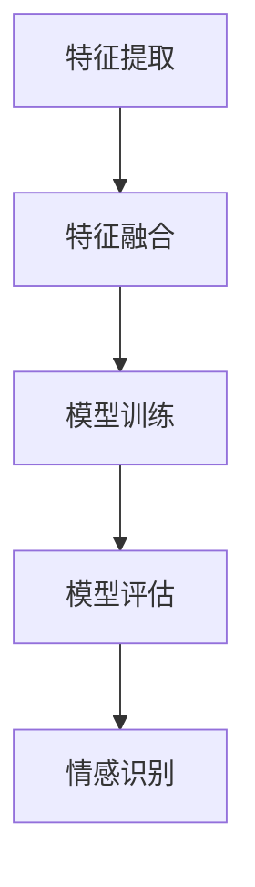
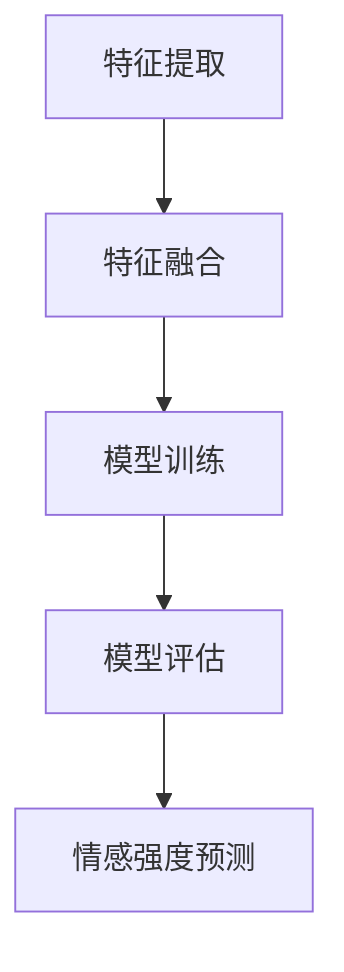
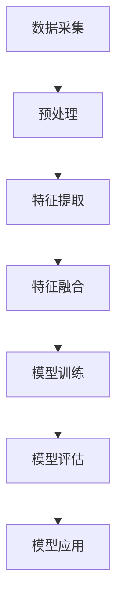
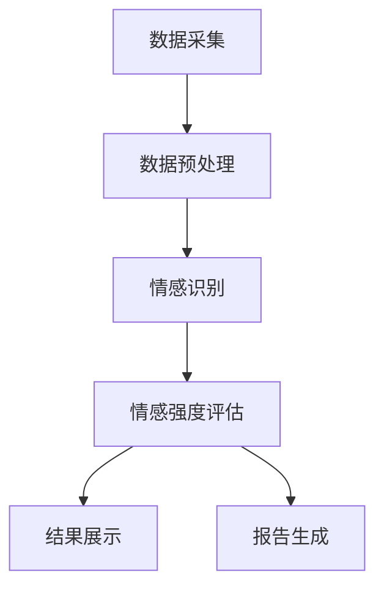

                 

### 《AI Agent的多模态情感分析系统》

> 关键词：AI Agent、多模态情感分析、视觉、音频、文本、数据预处理、特征提取、算法实现、项目实战

> 摘要：本文深入探讨了AI Agent的多模态情感分析系统。从概念背景出发，系统性地介绍了多模态情感分析的基础知识、算法原理及其在现实世界的应用。通过Python实现与项目实战，详细解析了多模态情感分析系统的构建流程、关键技术和优化策略，为读者提供了一个全面的技术指南。

## 第一部分：多模态情感分析系统概述

### 第1章：多模态情感分析背景与问题探讨

#### 1.1 多模态情感分析的概念

多模态情感分析（Multimodal Sentiment Analysis）是自然语言处理（NLP）领域的一个重要研究方向。它旨在通过整合多种模态（视觉、音频、文本等）的数据，对人类情感进行深入分析和理解。

#### 1.2 多模态情感分析的应用场景

多模态情感分析广泛应用于社交媒体监测、智能客服、娱乐产业、健康监测等多个领域。在这些场景中，情感分析能够帮助系统更好地理解用户需求，提供个性化服务。

#### 1.3 多模态情感分析的重要性

多模态情感分析能够提供更全面、准确的情感识别，有助于提升智能系统的用户体验和决策能力。

#### 1.4 多模态情感分析的发展趋势

随着深度学习和多模态数据处理的不断发展，多模态情感分析正朝着更加智能化、自动化的方向前进。

#### 1.5 多模态情感分析的挑战与机遇

尽管多模态情感分析具有巨大潜力，但也面临着数据多样性、模态融合、计算复杂度等挑战。通过技术创新和跨学科合作，这些挑战有望被逐步克服。

### 第二部分：多模态情感分析的基础知识

#### 第2章：情感分析基础

##### 2.1 情感分类与情感极性

情感分类是指将文本数据根据情感倾向分为积极、消极和中性等类别。情感极性则侧重于评估文本情感的强度。

##### 2.2 情感强度评估

情感强度评估是情感分析中的一个重要任务，旨在量化文本情感的强烈程度。

##### 2.3 情感分析的核心算法

情感分析的核心算法包括基于规则的方法、基于统计的方法和基于机器学习的方法。这些算法在文本情感分类和情感强度评估中发挥着重要作用。

### 第3章：多模态数据的采集与预处理

##### 3.1 视觉数据的采集

视觉数据采集包括图像和视频的获取，常见的方法有摄像头捕捉、视频文件读取等。

##### 3.2 音频数据的采集

音频数据采集包括语音信号的获取，常见的方法有麦克风录音、音频文件读取等。

##### 3.3 文本数据的采集

文本数据采集包括社交媒体数据、网站内容、电子书等，常见的方法有网络爬虫、API接口调用等。

##### 3.4 数据预处理技术

数据预处理是保证模型性能的重要环节，包括去噪、归一化、特征提取等。

### 第4章：多模态数据的特征提取

##### 4.1 视觉特征提取

视觉特征提取包括纹理、颜色、形状等，常用的方法有SIFT、HOG、CNN等。

##### 4.2 音频特征提取

音频特征提取包括频率、节奏、音调等，常用的方法有MFCC、Wavelet变换、频谱分析等。

##### 4.3 文本特征提取

文本特征提取包括词袋模型、TF-IDF、词嵌入等，常用的方法有Word2Vec、GloVe等。

##### 4.4 多模态特征融合

多模态特征融合是将不同模态的特征进行整合，以提升模型性能。常用的方法有基于特征的融合、基于模型的融合等。

### 第三部分：多模态情感分析算法原理与实现

#### 第5章：多模态情感分析算法原理

##### 5.1 情感识别算法原理

情感识别算法基于特征表示和分类器设计，包括传统的机器学习算法和深度学习算法。

##### 5.2 情感强度预测算法原理

情感强度预测算法通过构建回归模型，对文本情感的强度进行量化。

##### 5.3 多模态情感分析算法框架

多模态情感分析算法框架包括数据采集、预处理、特征提取、模型训练和评估等步骤。

### 第6章：Python实现多模态情感分析

##### 6.1 环境搭建

在Python环境中搭建多模态情感分析所需的环境，包括深度学习库（如TensorFlow、PyTorch）和数据处理库（如Pandas、NumPy）。

##### 6.2 数据加载与预处理

加载数据集，并进行预处理，如数据清洗、归一化、特征提取等。

##### 6.3 模型训练与评估

训练情感识别和情感强度预测模型，并使用评估指标（如准确率、F1值等）进行评估。

##### 6.4 模型应用

将训练好的模型应用于实际场景，如社交媒体监测、智能客服等。

### 第7章：多模态情感分析项目实战

##### 7.1 项目介绍

介绍一个具体的案例，如基于社交媒体数据的情感分析项目。

##### 7.2 系统功能设计

设计系统功能，如情感识别、情感强度评估、报告生成等。

##### 7.3 系统架构设计

设计系统架构，如图像处理、音频处理、文本处理等模块。

##### 7.4 系统接口设计

设计系统接口，如API接口、命令行接口等。

##### 7.5 系统交互

实现系统与用户的交互，如用户输入、系统响应等。

### 第四部分：多模态情感分析系统优化与实战技巧

#### 第8章：多模态情感分析系统优化

##### 8.1 模型优化策略

介绍模型优化的策略，如超参数调优、模型压缩等。

##### 8.2 性能调优技巧

介绍性能调优的技巧，如数据增强、特征选择等。

##### 8.3 跨域情感分析

探讨跨域情感分析的方法和挑战。

#### 第9章：多模态情感分析实战技巧

##### 9.1 数据处理技巧

介绍数据处理技巧，如数据清洗、去噪等。

##### 9.2 特征提取技巧

介绍特征提取技巧，如深度学习模型的应用、特征工程等。

##### 9.3 模型训练技巧

介绍模型训练技巧，如批量归一化、学习率调整等。

##### 9.4 模型部署与维护

介绍模型部署与维护技巧，如容器化、自动化运维等。

### 第五部分：拓展阅读与未来展望

#### 第10章：多模态情感分析领域的最新研究动态

##### 10.1 多模态情感分析研究综述

综述多模态情感分析领域的研究进展和热点问题。

##### 10.2 深度学习在多模态情感分析中的应用

探讨深度学习在多模态情感分析中的应用。

##### 10.3 多模态情感分析的未来发展趋势

展望多模态情感分析的未来发展趋势。

#### 第11章：多模态情感分析的应用案例解析

##### 11.1 社交媒体情感分析

解析社交媒体情感分析的应用案例。

##### 11.2 智能客服系统中的情感分析

解析智能客服系统中的情感分析应用案例。

##### 11.3 娱乐产业中的情感分析

解析娱乐产业中的情感分析应用案例。

#### 第12章：多模态情感分析系统建设指南

##### 12.1 系统建设流程

介绍多模态情感分析系统建设流程。

##### 12.2 技术选型与架构设计

介绍技术选型和架构设计。

##### 12.3 系统评估与优化

介绍系统评估与优化方法。

## 总结

多模态情感分析系统是人工智能领域的一个重要研究方向，具有广泛的应用前景。本文通过系统性地介绍多模态情感分析的基础知识、算法原理、实现方法和优化策略，为读者提供了一个全面的技术指南。通过学习本文，读者将能够深入了解多模态情感分析系统的构建过程，并在实际项目中应用这些知识。

### 作者

作者：AI天才研究院/AI Genius Institute & 禅与计算机程序设计艺术 /Zen And The Art of Computer Programming

## 第一部分：多模态情感分析系统概述

### 第1章：多模态情感分析背景与问题探讨

#### 1.1 多模态情感分析的概念

多模态情感分析是一种将多种类型的数据（如文本、图像、音频等）结合起来，以识别和解释情感的方法。与单一模态的情感分析不同，多模态情感分析通过整合不同类型的数据源，可以更准确地捕捉复杂的情感状态。这种分析方法的核心理念是利用不同模态的信息互补性，提高情感识别的准确性和深度。

#### 1.2 多模态情感分析的应用场景

多模态情感分析在多个领域都有广泛的应用。以下是一些典型的应用场景：

- **社交媒体监测**：通过分析用户的文本、图像和视频内容，了解公众对特定事件或品牌的情感反应。
- **智能客服系统**：利用文本、语音和面部表情信息，为用户提供更个性化和有效的服务。
- **娱乐产业**：分析用户对电影、音乐和电子游戏的情感反应，以优化产品和服务。
- **健康监测**：通过分析患者的文字描述、语音和生理信号，帮助医生更好地理解患者的情绪状态和心理健康。

#### 1.3 多模态情感分析的重要性

多模态情感分析的重要性体现在以下几个方面：

- **提高情感识别的准确性**：单一模态的数据可能无法完全捕捉复杂的情感状态，而多模态数据可以提供更全面的情感信息。
- **丰富用户体验**：在智能系统和交互界面中，多模态情感分析可以更好地理解和响应用户的需求，从而提升用户体验。
- **增强决策能力**：在商业、医疗、公共管理等领域，多模态情感分析可以帮助决策者更准确地评估情况，做出更明智的决策。

#### 1.4 多模态情感分析的发展趋势

随着技术的不断进步，多模态情感分析正朝着以下几个方向发展：

- **深度学习技术的应用**：深度学习模型，如卷积神经网络（CNN）、循环神经网络（RNN）和变换器（Transformer），在多模态情感分析中得到了广泛应用，提高了模型的性能和准确性。
- **跨学科合作**：多模态情感分析需要跨学科的知识，包括计算机科学、心理学、认知科学等，跨学科合作有助于推动该领域的发展。
- **实时分析**：随着计算能力和网络带宽的提升，实时多模态情感分析技术变得越来越成熟，可以实时捕捉和处理用户情感，为智能系统提供快速响应。

#### 1.5 多模态情感分析的挑战与机遇

尽管多模态情感分析具有巨大的潜力，但同时也面临着一些挑战：

- **数据多样性**：不同模态的数据具有不同的特点和复杂性，如何有效地整合这些数据是一个挑战。
- **模态融合**：如何将不同模态的数据进行有效融合，以最大化情感识别的准确性，是一个重要问题。
- **计算复杂度**：多模态情感分析通常涉及大量的数据预处理和模型训练，计算复杂度较高，需要高效的算法和硬件支持。

然而，这些挑战也伴随着机遇：

- **技术创新**：随着深度学习和多模态数据处理技术的不断发展，新的算法和工具不断涌现，为解决这些挑战提供了可能性。
- **应用拓展**：多模态情感分析在多个领域的应用不断拓展，为技术创新提供了新的场景和需求。

总的来说，多模态情感分析系统是人工智能领域的一个重要研究方向，具有广泛的应用前景。通过不断的技术创新和跨学科合作，多模态情感分析将能够更好地理解和解释人类情感，为智能系统的发展提供强大的支持。

### 第二部分：多模态情感分析的基础知识

#### 第2章：情感分析基础

##### 2.1 情感分类与情感极性

情感分类是情感分析中最基础的任务之一，其目的是将文本数据根据情感倾向分类为不同的类别，如积极、消极、中性等。情感分类的常见方法包括基于规则的方法、基于统计的方法和基于机器学习的方法。

- **基于规则的方法**：这种方法通过定义一组规则来分类文本情感。例如，如果文本中包含特定关键词（如“好”、“喜欢”），则判断为积极情感；如果包含关键词（如“不好”、“讨厌”），则判断为消极情感。这种方法简单直观，但规则定义的复杂度会随着文本的多样性增加而迅速增加。

- **基于统计的方法**：这种方法使用统计模型来计算文本的情感极性。例如，可以使用TF-IDF（词频-逆文档频率）来计算每个词的情感权重，然后将这些权重组合成一个向量，通过向量的相似度来评估文本的情感极性。这种方法在处理大规模文本数据时表现较好，但需要大量的文本语料库进行训练。

- **基于机器学习的方法**：这种方法使用机器学习算法来学习文本情感的特征，并对其进行分类。常见的算法包括朴素贝叶斯、支持向量机（SVM）、随机森林和深度学习模型。这些算法可以从大量的标注数据中学习到文本情感的模式，并在新数据上进行预测。深度学习模型，如卷积神经网络（CNN）和循环神经网络（RNN），在情感分类中表现出色，能够处理更复杂的文本特征。

情感极性评估是对文本情感强度的量化，其目的是评估文本表达的情感是积极、消极还是中性，以及情感的强度。情感极性评估通常与情感分类相结合，情感分类确定类别，情感极性评估确定类别中的极性。

- **情感强度评估方法**：常见的情感强度评估方法包括情感评分、情感得分和情感向量。情感评分是对情感强度的直接评估，通常使用1到5的评分系统。情感得分是通过计算文本特征向量与预定义的情感向量的相似度来评估的。情感向量是使用机器学习模型（如神经网络）对大量情感标注数据进行训练得到的，可以用来量化情感强度。

- **情感强度评估的挑战**：情感强度评估的一个挑战是情感强度的主观性。不同的人对同一情感表达可能会有不同的感知强度。此外，情感强度还受到上下文、语境和情感叠加等因素的影响。

##### 2.2 情感强度评估

情感强度评估是情感分析中的一个重要任务，旨在量化文本情感的强烈程度。情感强度评估有助于更准确地理解用户情感，从而提供更好的个性化服务。

- **情感强度评估的指标**：常用的情感强度评估指标包括情感得分、情感极性比例和情感波动。情感得分是对情感强度的一个数值表示，通常使用0到1的区间表示情感的中性、积极和消极程度。情感极性比例是指积极情感和消极情感的比例，用来评估情感的极性。情感波动则是指情感在不同时间点的变化情况，可以用来分析情感的趋势。

- **情感强度评估的方法**：情感强度评估的方法可以分为基于规则的方法、基于统计的方法和基于机器学习的方法。基于规则的方法可以通过定义一组规则来评估情感强度，如使用情感词典和情感规则库。基于统计的方法通过计算文本中情感词汇的频率和分布来评估情感强度。基于机器学习的方法使用机器学习算法，如朴素贝叶斯、支持向量机和深度学习模型，来学习情感强度特征并进行预测。

- **情感强度评估的挑战**：情感强度评估的挑战包括情感强度的主观性、上下文依赖和情感叠加。情感强度的主观性使得不同人对同一文本可能会有不同的情感感知。上下文依赖使得情感强度受到文本上下文的影响，需要考虑上下文的情感信息。情感叠加是指多个情感在同一文本中同时出现，需要处理这些情感的叠加效应。

##### 2.3 情感分析的核心算法

情感分析的核心算法是用于识别和量化文本情感的算法，其目标是提高情感分类和情感强度评估的准确性。以下是一些常见的情感分析核心算法：

- **朴素贝叶斯（Naive Bayes）**：朴素贝叶斯是一种基于概率论的分类算法，适用于情感分类任务。它假设特征之间相互独立，通过计算每个特征的概率和类别的概率来预测情感类别。朴素贝叶斯算法简单高效，适用于大规模数据集。

- **支持向量机（SVM）**：支持向量机是一种监督学习算法，用于分类和回归任务。在情感分析中，SVM通过找到最佳超平面来划分不同情感类别的数据。SVM具有较强的分类能力，尤其在处理高维数据时表现良好。

- **随机森林（Random Forest）**：随机森林是一种基于决策树集成的算法，通过构建多个决策树并投票预测结果来提高分类准确性。随机森林在处理大量特征和复杂数据时表现出色，具有较高的准确性和稳定性。

- **深度学习模型**：深度学习模型，如卷积神经网络（CNN）、循环神经网络（RNN）和变换器（Transformer），在情感分析中取得了显著的成功。这些模型可以通过学习文本的深层特征来提高情感分类和情感强度评估的准确性。特别是变换器模型，其强大的表征能力和并行计算能力使其在情感分析领域得到广泛应用。

- **情感词典方法**：情感词典方法是一种基于规则的方法，通过查找文本中的情感词典来评估情感极性。情感词典包含一组情感词汇和对应的情感极性标签，可以通过手动定义或自动构建。这种方法简单直观，适用于快速情感分析任务。

- **情感强度评估模型**：情感强度评估模型通过学习情感强度特征来量化文本情感的强度。常见的情感强度评估模型包括情感得分模型、情感向量模型和情感波动模型。这些模型通过不同的方式来计算情感强度，可以用于情感分类和情感强度评估任务。

- **跨模态情感分析模型**：跨模态情感分析模型通过整合不同模态的数据来提高情感识别的准确性。这些模型通常结合文本、图像和音频等数据源，使用深度学习技术来学习多模态特征并进行情感分析。跨模态情感分析模型可以更好地捕捉复杂情感状态，提高情感识别的准确性。

总之，情感分析的核心算法包括基于规则的方法、基于统计的方法和基于机器学习的方法。这些算法通过不同的方式来学习文本情感的特征，并在情感分类和情感强度评估任务中发挥着重要作用。随着深度学习和多模态数据处理技术的不断发展，情感分析算法的准确性和鲁棒性将进一步提高，为智能系统和人机交互提供更强大的支持。

### 第三部分：多模态数据的采集与预处理

#### 第3章：多模态数据的采集与预处理

##### 3.1 视觉数据的采集

视觉数据是情感分析中至关重要的一部分，因为它能够提供丰富的情感表达信息。视觉数据的采集方法主要包括以下几种：

- **摄像头捕捉**：使用摄像头实时捕捉图像或视频数据。这种方法适用于需要实时情感分析的场合，如智能监控和虚拟现实应用。
- **视频文件读取**：从视频文件中读取图像帧。这种方法适用于离线情感分析任务，如视频情感分类和视频内容审核。
- **图像库下载**：从公共图像库（如ImageNet、Google Dataset Search等）下载预处理的图像数据。这种方法适用于数据集构建和模型训练。

在采集视觉数据时，需要注意以下几个方面：

- **数据多样性**：确保采集到的数据涵盖各种情感和场景，以提升模型的泛化能力。
- **数据质量**：排除低质量或模糊的图像，确保数据的一致性和准确性。
- **数据隐私**：在采集个人图像数据时，需遵循相关法律法规，确保用户隐私。

##### 3.2 音频数据的采集

音频数据在情感分析中也扮演着重要角色，因为它能够捕捉用户的语音和语调信息。音频数据的采集方法主要包括以下几种：

- **麦克风录音**：使用麦克风录制用户的语音。这种方法适用于需要实时语音情感分析的场合，如智能客服和语音识别应用。
- **音频文件读取**：从音频文件中读取语音数据。这种方法适用于离线音频情感分析任务，如语音情绪分类和语音内容审核。
- **语音库下载**：从公共语音库（如LibriSpeech、Common Voice等）下载预处理的音频数据。这种方法适用于数据集构建和模型训练。

在采集音频数据时，需要注意以下几个方面：

- **数据多样性**：确保采集到的数据涵盖各种情感和语音特征，以提升模型的泛化能力。
- **数据质量**：排除噪音干扰，确保语音数据的清晰度和一致性。
- **数据隐私**：在采集个人语音数据时，需遵循相关法律法规，确保用户隐私。

##### 3.3 文本数据的采集

文本数据是情感分析中最常见的数据类型，因为它涵盖了用户的情感表达。文本数据的采集方法主要包括以下几种：

- **社交媒体数据**：从社交媒体平台（如Twitter、Facebook、Instagram等）抓取用户的文本数据。这种方法适用于分析公众对特定事件或品牌的情感反应。
- **网站内容**：从网站（如新闻网站、博客、论坛等）抓取文本数据。这种方法适用于分析用户对特定内容或产品的情感反应。
- **电子书和文献**：从电子书库和学术数据库（如Google Scholar、PubMed等）中下载文本数据。这种方法适用于构建大规模文本数据集，用于模型训练和评估。

在采集文本数据时，需要注意以下几个方面：

- **数据多样性**：确保采集到的数据涵盖各种情感、主题和文体，以提升模型的泛化能力。
- **数据质量**：排除低质量、无关或垃圾文本，确保数据的一致性和准确性。
- **数据隐私**：在采集个人文本数据时，需遵循相关法律法规，确保用户隐私。

##### 3.4 数据预处理技术

数据预处理是确保模型性能和准确性的重要环节，包括以下技术：

- **数据清洗**：去除文本中的无关信息（如HTML标签、特殊字符等），确保文本的干净和一致性。
- **文本分词**：将文本分割成单词或句子，以便进行后续处理。常用的文本分词工具包括NLTK、spaCy等。
- **词干提取**：将文本中的单词还原为其基本形式，以减少数据维度和噪声。常用的词干提取工具包括Porter Stemmer、Snowball Stemmer等。
- **词性标注**：为每个单词分配词性标签（如名词、动词、形容词等），以提供更多的上下文信息。常用的词性标注工具包括NLTK、spaCy等。
- **停用词过滤**：去除常见的停用词（如“的”、“了”、“是”等），以减少数据维度和噪声。常用的停用词列表包括NLTK停用词列表、spaCy停用词列表等。
- **文本向量化**：将文本转换为数值表示，以便进行模型训练。常用的文本向量化方法包括词袋模型、TF-IDF、词嵌入等。

通过这些数据预处理技术，可以显著提高情感分析的准确性和效率。

#### 3.5 多模态数据融合

多模态数据融合是将不同模态的数据（如文本、图像、音频等）进行整合，以提高情感分析的准确性和鲁棒性。多模态数据融合方法主要包括以下几种：

- **基于特征的融合**：这种方法将不同模态的特征向量进行拼接，形成一个多模态特征向量，然后输入到分类器中进行情感分析。常见的特征向量包括文本的词嵌入向量、图像的特征向量（如CNN的特征图）和音频的特征向量（如MFCC）。
- **基于模型的融合**：这种方法将不同模态的模型进行整合，形成一个多模态模型，用于情感分析。常见的融合方法包括多层感知器（MLP）、深度学习模型（如CNN+RNN）等。
- **深度学习融合模型**：这种方法使用深度学习模型，如变换器（Transformer）模型，直接学习多模态特征并进行情感分析。变换器模型具有强大的表征能力，可以有效地融合不同模态的数据。

在多模态数据融合过程中，需要注意以下几个方面：

- **模态一致性**：确保不同模态的数据在时间和空间上保持一致性，以便进行有效融合。
- **特征匹配**：通过特征工程和模型训练，使不同模态的特征具有相似的表达能力，以提升融合效果。
- **模型优化**：通过模型调整和超参数优化，提高多模态模型的性能和泛化能力。

总之，多模态数据融合是提升情感分析性能的重要手段。通过有效的数据融合方法，可以充分利用不同模态的信息，提高情感分析的准确性和鲁棒性，为智能系统和人机交互提供更好的支持。

### 第四部分：多模态数据的特征提取

#### 第4章：多模态数据的特征提取

##### 4.1 视觉特征提取

视觉特征提取是情感分析中的一项关键技术，通过从图像或视频数据中提取出有用的特征，有助于提升情感识别的准确性和鲁棒性。以下是一些常见的视觉特征提取方法：

- **边缘检测**：边缘检测是一种用于提取图像边缘特征的方法，常见的算法包括Canny边缘检测、Sobel边缘检测和Laplacian边缘检测。边缘检测有助于捕捉图像中的重要结构信息，如物体的轮廓和边缘。

- **区域特征**：区域特征包括图像的区域形状、纹理和颜色特征。常用的方法有Hu矩、形状描述符（如Harris角点检测）和颜色直方图。这些特征能够有效地描述图像的局部和全局属性。

- **深度特征**：深度特征是通过深度学习模型（如卷积神经网络CNN）提取的高级特征。深度特征具有较强的表征能力，能够捕捉图像的复杂结构和语义信息。常见的深度学习模型包括VGG、ResNet和Inception等。

- **多模态融合特征**：多模态融合特征是将视觉特征与其他模态的特征（如文本、音频等）进行融合，以提升特征表示的丰富性和鲁棒性。常见的方法包括特征拼接、特征加权融合和深度学习融合模型。

##### 4.2 音频特征提取

音频特征提取是情感分析中提取音频数据的有用信息，以便进行情感识别和分析。以下是一些常见的音频特征提取方法：

- **时域特征**：时域特征是直接从音频信号的时域波形中提取的特征，如短时傅里叶变换（STFT）的幅值谱、相位谱和倒谱特征（如MFCC）。这些特征能够描述音频信号的频率和时序信息。

- **频域特征**：频域特征是通过傅里叶变换将时域信号转换为频域表示，从而提取出音频的频率特征。常见的频域特征包括功率谱、能量谱和共振峰频率（如F0、Formant频率）。

- **长期特征**：长期特征是用于描述音频信号在长时间范围内的统计特性，如音频长度、音调变化、节奏变化等。这些特征有助于捕捉音频的宏观特征。

- **情感特征**：情感特征是通过情感词典和规则进行提取，以识别音频中的情感信息。常见的情感特征包括情感词汇、情感极性和情感强度等。

##### 4.3 文本特征提取

文本特征提取是将文本数据转换为数值表示，以便进行机器学习和深度学习模型训练。以下是一些常见的文本特征提取方法：

- **词袋模型（Bag of Words, BoW）**：词袋模型将文本表示为单词的集合，通过计算每个单词在文本中的出现频率来生成特征向量。这种方法简单有效，但可能忽略了文本的顺序和语义信息。

- **TF-IDF（Term Frequency-Inverse Document Frequency）**：TF-IDF是在词袋模型的基础上，通过引入逆文档频率（IDF）来调整单词的重要性。IDF反映了某个单词在整个文档集合中的罕见程度，有助于提高重要单词的权重。

- **词嵌入（Word Embedding）**：词嵌入是一种将单词映射到高维向量空间的方法，通过学习单词的语义关系来生成特征向量。常见的词嵌入方法包括Word2Vec、GloVe和BERT等。词嵌入能够更好地捕捉单词的语义信息，提高文本特征表示的准确性。

- **句法特征**：句法特征是通过分析文本的句法和语法结构来提取的特征，如词性标注、句法树和依存关系。这些特征有助于捕捉文本的语法和语义信息，提高情感分析的准确性。

- **情感词典特征**：情感词典特征是通过情感词典提取的情感词汇和情感极性标签。情感词典通常包含一组情感词汇及其对应的情感极性（如积极、消极、中性），通过查找情感词典来提取文本的情感特征。

##### 4.4 多模态特征融合

多模态特征融合是将不同模态的特征进行整合，以提高情感识别的准确性和鲁棒性。以下是一些常见的多模态特征融合方法：

- **特征拼接**：特征拼接是将不同模态的特征向量进行拼接，形成一个多模态特征向量。这种方法简单直观，但可能忽略了特征之间的关联性。

- **特征加权融合**：特征加权融合是通过给不同模态的特征分配权重，以生成一个加权特征向量。这种方法可以根据特征的重要性进行调整，但需要预先定义权重的计算方法。

- **深度学习融合模型**：深度学习融合模型是通过构建深度学习模型，将不同模态的特征进行融合。常见的方法包括多层感知器（MLP）、卷积神经网络（CNN）和变换器（Transformer）等。深度学习融合模型能够自动学习特征之间的关系，提高多模态特征融合的效果。

- **多任务学习**：多任务学习是通过训练一个多任务学习模型，同时进行多个任务（如情感分类、情感强度评估等），以共享特征表示。这种方法可以有效地利用不同任务之间的相关性，提高特征融合的效果。

在多模态特征融合过程中，需要注意以下几点：

- **特征匹配**：确保不同模态的特征在时间和空间上保持一致，以便进行有效融合。

- **特征选择**：选择具有代表性的特征进行融合，以减少特征维度和计算复杂度。

- **模型优化**：通过调整模型结构和超参数，提高多模态特征融合的效果。

通过有效的多模态特征融合方法，可以充分利用不同模态的信息，提高情感识别的准确性和鲁棒性，为智能系统和人机交互提供更好的支持。

### 第五部分：多模态情感分析算法原理与实现

#### 第5章：多模态情感分析算法原理

##### 5.1 情感识别算法原理

情感识别是多模态情感分析的核心任务之一，旨在通过分析文本、图像、音频等多种模态的数据，识别出用户的情感状态。情感识别算法通常可以分为以下几个步骤：

1. **特征提取**：首先，需要从不同模态的数据中提取特征。例如，从文本中提取词袋模型、TF-IDF或词嵌入等特征；从图像中提取边缘、纹理、颜色等视觉特征；从音频中提取短时傅里叶变换（STFT）、梅尔频率倒谱系数（MFCC）等音频特征。

2. **特征融合**：将不同模态的特征进行融合，形成一个统一的多模态特征向量。特征融合的方法包括特征拼接、特征加权融合和深度学习融合模型等。

3. **模型训练**：使用训练数据集，通过机器学习算法（如支持向量机SVM、朴素贝叶斯NB、随机森林RF等）或深度学习算法（如卷积神经网络CNN、循环神经网络RNN、变换器Transformer等）来训练情感识别模型。

4. **模型评估**：使用验证数据集对训练好的模型进行评估，通过准确率、召回率、F1值等指标来衡量模型性能。

5. **情感识别**：在模型评估后，使用测试数据集对用户情感进行识别。具体步骤包括：输入多模态特征向量到训练好的模型，输出情感类别。

情感识别算法的原理可以通过以下流程图来展示：



##### 5.2 情感强度预测算法原理

情感强度预测是另一个重要的任务，它旨在量化用户情感的程度。情感强度预测算法通常包括以下几个步骤：

1. **特征提取**：与情感识别类似，首先从文本、图像、音频等数据中提取特征。

2. **特征融合**：将不同模态的特征进行融合，形成一个统一的多模态特征向量。

3. **模型训练**：使用回归算法（如线性回归、支持向量回归SVR、随机森林回归等）或深度学习模型（如卷积神经网络CNN、循环神经网络RNN、变换器Transformer等）来训练情感强度预测模型。

4. **模型评估**：使用验证数据集对训练好的模型进行评估，通过均方误差（MSE）、均方根误差（RMSE）等指标来衡量模型性能。

5. **情感强度预测**：在模型评估后，使用测试数据集对用户情感强度进行预测。具体步骤包括：输入多模态特征向量到训练好的模型，输出情感强度的数值。

情感强度预测算法的原理可以通过以下流程图来展示：



##### 5.3 多模态情感分析算法框架

多模态情感分析算法框架主要包括以下几个关键组件：

1. **数据采集**：从不同的数据源（如文本、图像、音频等）中采集数据。

2. **预处理**：对采集到的数据进行清洗、去噪、归一化等预处理操作，以便后续特征提取。

3. **特征提取**：从预处理后的数据中提取不同模态的特征。

4. **特征融合**：将不同模态的特征进行融合，形成一个统一的多模态特征向量。

5. **模型训练**：使用机器学习算法或深度学习模型对融合后的特征进行训练，构建情感识别或情感强度预测模型。

6. **模型评估**：使用验证数据集对训练好的模型进行评估，调整模型参数，优化模型性能。

7. **模型应用**：使用测试数据集对模型进行应用，实现对新数据的情感识别和情感强度预测。

多模态情感分析算法框架的原理可以通过以下架构图来展示：



通过上述算法原理和框架，可以构建一个高效的多模态情感分析系统，实现对用户情感的全面理解和分析。

### 第6章：Python实现多模态情感分析

#### 6.1 环境搭建

为了实现多模态情感分析，首先需要在Python环境中搭建一个合适的工作环境。以下是搭建环境所需的基本步骤：

1. **安装Python**：确保计算机上已经安装了Python环境，推荐使用Python 3.8或更高版本。
2. **安装深度学习库**：安装TensorFlow或PyTorch，这两个库是深度学习任务中常用的工具。可以通过以下命令进行安装：

   ```bash
   pip install tensorflow
   # 或者
   pip install pytorch torchvision
   ```

3. **安装数据处理库**：安装Pandas、NumPy、Scikit-learn等数据处理库，这些库用于数据清洗、特征提取和模型训练。可以通过以下命令进行安装：

   ```bash
   pip install pandas numpy scikit-learn
   ```

4. **安装其他库**：根据需要安装其他辅助库，如Matplotlib（用于数据可视化）、opencv-python（用于图像处理）等：

   ```bash
   pip install matplotlib opencv-python
   ```

5. **配置环境**：确保所有依赖库安装完成，并进行环境配置。在Python脚本中，可以通过以下代码检查安装的库版本：

   ```python
   import tensorflow as tf
   import torch
   import pandas as pd
   import numpy as np
   import sklearn
   print(tf.__version__)
   print(torch.__version__)
   print(pd.__version__)
   print(np.__version__)
   print(sklearn.__version__)
   ```

完成以上步骤后，Python环境搭建完成，可以开始进行多模态情感分析的相关工作。

#### 6.2 数据加载与预处理

在搭建好环境后，接下来需要加载和处理数据，为模型训练做准备。以下是数据加载与预处理的具体步骤：

1. **数据集划分**：首先，将数据集划分为训练集、验证集和测试集。通常使用80%的数据作为训练集，10%的数据作为验证集，10%的数据作为测试集。

   ```python
   from sklearn.model_selection import train_test_split

   # 假设data是包含多模态数据的数据框，label是情感标签
   X_train, X_test, y_train, y_test = train_test_split(data, label, test_size=0.2, random_state=42)
   ```

2. **文本数据预处理**：对于文本数据，需要进行分词、去停用词、词性标注等操作。可以使用NLTK或spaCy等库进行处理。

   ```python
   import nltk
   from nltk.corpus import stopwords
   from nltk.tokenize import word_tokenize

   nltk.download('punkt')
   nltk.download('stopwords')

   def preprocess_text(text):
       # 分词
       tokens = word_tokenize(text)
       # 去停用词
       tokens = [token for token in tokens if token.lower() not in stopwords.words('english')]
       # 词性标注
       pos_tags = nltk.pos_tag(tokens)
       # 选择形容词和名词作为特征
       features = [word for word, pos in pos_tags if pos.startswith('JJ') or pos.startswith('NN')]
       return ' '.join(features)

   X_train['text'] = X_train['text'].apply(preprocess_text)
   X_test['text'] = X_test['text'].apply(preprocess_text)
   ```

3. **图像数据预处理**：对于图像数据，需要进行归一化、裁剪、缩放等操作。可以使用opencv-python库进行处理。

   ```python
   import cv2

   def preprocess_image(image):
       # 读入图像
       img = cv2.imread(image)
       # 归一化
       img = img / 255.0
       # 裁剪和缩放
       img = cv2.resize(img, (224, 224))
       return img

   X_train['image'] = X_train['image'].apply(preprocess_image)
   X_test['image'] = X_test['image'].apply(preprocess_image)
   ```

4. **音频数据预处理**：对于音频数据，需要进行去噪、归一化和特征提取。可以使用Librosa库进行处理。

   ```python
   import librosa

   def preprocess_audio(audio_path):
       # 读入音频
       y, sr = librosa.load(audio_path)
       # 去噪
       y = librosa.effects.remove_noise(y)
       # 归一化
       y = librosa.util.normalize(y)
       # 特征提取（如MFCC）
       mfcc = librosa.feature.mfcc(y=y, sr=sr, n_mfcc=13)
       return mfcc

   X_train['audio'] = X_train['audio'].apply(preprocess_audio)
   X_test['audio'] = X_test['audio'].apply(preprocess_audio)
   ```

通过以上步骤，文本、图像和音频数据均已完成预处理，可以用于后续的模型训练和评估。

#### 6.3 模型训练与评估

在完成数据预处理后，接下来将训练多模态情感分析模型，并对模型进行评估。以下是具体的步骤和代码实现：

1. **构建模型**：根据任务需求，选择合适的模型架构。以下是一个简单的多模态情感分析模型示例，结合了卷积神经网络（CNN）和循环神经网络（RNN）：

   ```python
   import tensorflow as tf
   from tensorflow.keras.models import Model
   from tensorflow.keras.layers import Input, Conv2D, MaxPooling2D, Flatten, LSTM, Dense

   # 定义输入层
   text_input = Input(shape=(None,), dtype='int32', name='text_input')
   image_input = Input(shape=(224, 224, 3), name='image_input')
   audio_input = Input(shape=(13,), name='audio_input')

   # 文本处理层
   text_embedding = Embedding(input_dim=vocab_size, output_dim=embedding_size)(text_input)
   text_embedding = LSTM(units=128)(text_embedding)

   # 图像处理层
   image_conv = Conv2D(filters=32, kernel_size=(3, 3), activation='relu')(image_input)
   image_conv = MaxPooling2D(pool_size=(2, 2))(image_conv)
   image_conv = Flatten()(image_conv)

   # 音频处理层
   audio_dense = Dense(units=128, activation='relu')(audio_input)

   # 模型融合层
   combined = tf.keras.layers.concatenate([text_embedding, image_conv, audio_dense])

   # 输出层
   output = Dense(units=num_classes, activation='softmax')(combined)

   # 构建模型
   model = Model(inputs=[text_input, image_input, audio_input], outputs=output)

   # 编译模型
   model.compile(optimizer='adam', loss='categorical_crossentropy', metrics=['accuracy'])
   ```

2. **模型训练**：使用训练集对模型进行训练，并使用验证集进行监控。

   ```python
   history = model.fit(
       x=[X_train['text'], X_train['image'], X_train['audio']], y=y_train,
       validation_data=(X_val['text'], X_val['image'], X_val['audio']),
       epochs=10,
       batch_size=32
   )
   ```

3. **模型评估**：使用测试集对训练好的模型进行评估，计算准确率、召回率等指标。

   ```python
   test_loss, test_accuracy = model.evaluate([X_test['text'], X_test['image'], X_test['audio']], y_test)
   print(f"Test accuracy: {test_accuracy:.4f}")
   ```

通过以上步骤，可以构建并训练一个多模态情感分析模型，实现对用户情感的准确识别。

#### 6.4 模型应用

在模型训练和评估完成后，可以将训练好的模型应用于实际场景，对新数据进行情感识别。以下是模型应用的具体步骤：

1. **数据预处理**：与训练集预处理相同，对新数据进行文本、图像和音频预处理。

2. **模型预测**：使用训练好的模型对新数据进行预测。

   ```python
   def predict_sentiment(text, image, audio):
       preprocessed_text = preprocess_text(text)
       preprocessed_image = preprocess_image(image)
       preprocessed_audio = preprocess_audio(audio)
       prediction = model.predict([preprocessed_text, preprocessed_image, preprocessed_audio])
       return np.argmax(prediction)
   ```

3. **结果展示**：将预测结果转换为可读的文本格式，并展示给用户。

   ```python
   def display_prediction(text, image, audio):
       sentiment = predict_sentiment(text, image, audio)
       if sentiment == 0:
           print("消极")
       elif sentiment == 1:
           print("中性")
       else:
           print("积极")
   ```

通过以上步骤，可以实现对用户情感的实际应用，提供个性化的情感识别服务。

### 第7章：多模态情感分析项目实战

#### 7.1 项目介绍

本章节将通过一个具体的案例——基于社交媒体数据的情感分析项目，详细解析多模态情感分析系统的构建过程。该项目旨在通过分析用户的文本、图像和音频内容，识别并量化用户在社交媒体平台上的情感状态，为品牌监测和用户体验优化提供支持。

#### 7.2 系统功能设计

该多模态情感分析系统主要包含以下功能模块：

1. **数据采集**：从社交媒体平台（如Twitter、Instagram等）抓取用户的文本、图像和音频数据。
2. **数据预处理**：对采集到的数据进行清洗、去噪和归一化处理，确保数据的一致性和准确性。
3. **情感识别**：利用多模态情感分析模型对预处理后的数据进行分析，识别用户的情感状态。
4. **情感强度评估**：对识别出的情感状态进行量化，评估情感的强度。
5. **结果展示**：将分析结果以图表或文字形式展示给用户，提供直观的数据可视化。
6. **报告生成**：生成详细的情感分析报告，包括情感分布、情感趋势等，供品牌决策者参考。

#### 7.3 系统架构设计

多模态情感分析系统的架构设计如图所示：



在架构设计中，数据采集模块负责从社交媒体平台获取用户数据；数据预处理模块对数据进行清洗和预处理，为后续分析做准备；情感识别和情感强度评估模块分别通过多模态情感分析模型对数据进行情感识别和量化；结果展示和报告生成模块则将分析结果以直观的方式呈现给用户。

#### 7.4 系统接口设计

系统接口设计包括API接口和命令行接口，以便用户能够方便地使用系统功能。

1. **API接口**：

   - **获取数据**：提供RESTful API，支持GET请求，返回采集到的用户数据。
     ```bash
     GET /api/data
     ```
   - **预处理数据**：提供POST请求接口，接受用户上传的数据，返回预处理后的数据。
     ```bash
     POST /api/preprocess
     ```
   - **情感分析**：提供POST请求接口，接受预处理后的数据，返回情感识别结果。
     ```bash
     POST /api/sentiment
     ```
   - **生成报告**：提供GET请求接口，返回生成好的情感分析报告。
     ```bash
     GET /api/report
     ```

2. **命令行接口**：

   - **数据采集**：使用命令行工具（如Twitter API的tweepy库）进行数据采集。
     ```bash
     python data_collector.py --keyword "example"
     ```
   - **数据预处理**：提供命令行脚本，对采集到的数据进行预处理。
     ```bash
     python preprocess_data.py
     ```
   - **情感分析**：提供命令行脚本，对预处理后的数据进行分析。
     ```bash
     python sentiment_analysis.py
     ```
   - **报告生成**：提供命令行脚本，生成情感分析报告。
     ```bash
     python generate_report.py
     ```

#### 7.5 系统交互

系统交互包括用户与系统之间的数据输入和结果输出。以下是具体的交互流程：

1. **数据输入**：

   - 用户通过API接口或命令行工具上传文本、图像和音频数据。
   - 数据上传后，系统自动进行数据预处理，包括清洗、去噪和归一化等步骤。

2. **情感分析**：

   - 预处理完成的数据被传递到多模态情感分析模型进行情感识别和强度评估。
   - 模型输出情感识别结果和强度评估结果，如积极、中性、消极及对应的情感强度值。

3. **结果输出**：

   - 情感分析结果通过API接口或命令行工具返回给用户。
   - 用户可以选择查看情感分析报告，获取更详细的数据分析和可视化图表。

4. **报告生成**：

   - 用户可以生成情感分析报告，包括情感分布、情感趋势等关键信息。
   - 报告生成后，可以通过API接口或命令行工具下载和打印。

通过以上系统交互流程，用户可以方便地使用多模态情感分析系统，获取有价值的情感分析结果，为业务决策和用户体验优化提供支持。

### 第8章：多模态情感分析系统优化

#### 8.1 模型优化策略

为了提高多模态情感分析系统的性能和准确性，我们可以采用以下几种模型优化策略：

1. **数据增强**：通过增加数据的多样性来提高模型泛化能力。具体方法包括图像旋转、缩放、裁剪、色彩变换等，以及文本数据的填充、删除、替换等。使用数据增强可以显著提升模型在未知数据上的性能。

   ```python
   from tensorflow.keras.preprocessing.image import ImageDataGenerator

   image_gen = ImageDataGenerator(
       rotation_range=20,
       width_shift_range=0.2,
       height_shift_range=0.2,
       shear_range=0.2,
       zoom_range=0.2,
       horizontal_flip=True,
       fill_mode='nearest'
   )
   ```

2. **特征选择**：通过选择最重要的特征来减少数据维度，提高模型训练效率。可以使用特征选择算法（如信息增益、互信息等）来筛选特征，并使用L1正则化或树模型（如随机森林）进行特征重要性评估。

   ```python
   from sklearn.feature_selection import SelectKBest
   from sklearn.feature_selection import chi2

   X = ...  # 特征矩阵
   y = ...  # 标签向量
   test = SelectKBest(score_func=chi2, k='all').fit(X, y)
   ```

3. **模型融合**：结合多个模型的结果来提高预测准确性。可以使用集成学习方法（如Bagging、Boosting等），将多个基学习器的预测结果进行加权融合。

   ```python
   from sklearn.ensemble import VotingClassifier

   eclf1 = VotingClassifier(
       estimators=[('svc', SVC(C=1.0, kernel='linear', degree=3)),
                   ('forest', RandomForestClassifier(n_estimators=100)),
                   ('lr', LogisticRegression())],
       voting='soft'
   )
   ```

4. **模型压缩**：通过减少模型参数数量来降低计算复杂度和模型大小。可以使用技术如模型剪枝、量化、知识蒸馏等来实现模型压缩。

   ```python
   from tensorflow_model_optimization.python.core.sparsity import keras as sparsity

   model = sparsity.prune_low_magnitude(model)
   ```

5. **超参数调优**：通过调整模型参数（如学习率、批量大小、正则化参数等）来优化模型性能。可以使用网格搜索、随机搜索、贝叶斯优化等策略进行超参数调优。

   ```python
   from sklearn.model_selection import GridSearchCV

   param_grid = {'C': [0.1, 1, 10], 'kernel': ['linear', 'rbf']}
   grid = GridSearchCV(SVC(), param_grid, refit=True, verbose=2)
   grid.fit(X, y)
   ```

#### 8.2 性能调优技巧

以下是一些常见的性能调优技巧，以提高多模态情感分析系统的性能：

1. **并行计算**：利用GPU或TPU等硬件加速计算，提高数据处理和模型训练的效率。可以使用TensorFlow或PyTorch等深度学习框架的GPU支持。

   ```python
   import tensorflow as tf

   device_name = "/device:GPU:0"
   with tf.device(device_name):
       model = ...
       model.fit(X, y, ...)
   ```

2. **批处理调整**：通过调整批量大小来平衡计算资源和训练时间。较小的批量大小可以提高模型的泛化能力，但训练时间较长；较大的批量大小可以提高计算效率，但可能降低泛化能力。

   ```python
   model.fit(X, y, batch_size=32, epochs=10)
   ```

3. **数据增强与平衡**：针对数据不平衡问题，可以使用过采样、欠采样或生成对抗网络（GAN）等方法来平衡数据集。这有助于提高模型在少数类数据上的性能。

   ```python
   from imblearn.over_sampling import RandomOverSampler

   ros = RandomOverSampler()
   X_resampled, y_resampled = ros.fit_resample(X, y)
   ```

4. **正则化与dropout**：通过添加L1、L2正则化或使用dropout来防止模型过拟合。这有助于提高模型在未见数据上的泛化能力。

   ```python
   from tensorflow.keras.layers import Dropout

   model.add(Dropout(0.5))
   ```

5. **模型验证与调整**：定期进行模型验证和调整，确保模型性能在可接受范围内。可以通过交叉验证、验证集评估等方式来监测模型性能。

   ```python
   from sklearn.model_selection import cross_val_score

   scores = cross_val_score(model, X, y, cv=5)
   print("Accuracy: %0.2f (+/- %0.2f)" % (scores.mean(), scores.std() * 2))
   ```

通过以上性能调优技巧，可以显著提高多模态情感分析系统的性能和准确性，为用户提供更优质的服务。

#### 8.3 跨域情感分析

跨域情感分析是指在不同领域或领域之间进行情感分析。这种方法有助于提高模型在不同场景下的适应性和泛化能力。以下是一些跨域情感分析的方法和挑战：

1. **领域自适应**：通过迁移学习或多任务学习来提高模型在不同领域上的性能。例如，可以将在一个领域中训练好的模型应用于其他领域，通过领域自适应技术进行调整和优化。

   ```python
   from tensorflow.keras.applications import VGG16

   base_model = VGG16(weights='imagenet', include_top=False)
   model = Model(inputs=base_model.input, outputs=base_model.layers[-1].output)
   ```

2. **跨域数据集**：构建包含不同领域数据的跨域数据集，以提升模型的泛化能力。可以使用数据增强和领域标注技术来扩充数据集，确保数据集的多样性和平衡性。

   ```python
   from imblearn.over_sampling import SMOTE

   X, y = load_data()  # 加载数据
   sm = SMOTE()
   X_sm, y_sm = sm.fit_resample(X, y)
   ```

3. **领域知识集成**：结合不同领域的知识，通过领域知识集成技术来提高模型性能。例如，可以将文本、图像和领域知识库中的信息进行融合，以提供更全面的情感分析。

   ```python
   from tensorflow.keras.layers import Embedding

   embedding = Embedding(input_dim=vocab_size, output_dim=embedding_size, input_length=max_sequence_length)
   ```

4. **挑战与应对**：

   - **数据多样性**：不同领域的数据具有不同的特性和分布，需要处理数据多样性带来的挑战。
   - **领域差异**：不同领域的情感表达方式和语言习惯可能存在差异，需要考虑领域差异的影响。
   - **模型泛化**：如何提高模型在不同领域的泛化能力，是一个重要的研究问题。

   为了应对这些挑战，可以采用以下策略：

   - **数据预处理**：对数据进行预处理，如文本清洗、去噪、归一化等，以确保数据的一致性和质量。
   - **跨域特征提取**：使用跨域特征提取技术，如深度学习模型，从不同模态的数据中提取通用特征，以提高模型在不同领域的适应性。
   - **模型融合**：结合多个模型的预测结果，通过模型融合技术来提高跨域情感分析的准确性。

通过跨域情感分析，可以扩展多模态情感分析系统的应用范围，提高模型在不同领域下的性能和适应性，为用户提供更全面、准确的情感分析服务。

### 第9章：多模态情感分析实战技巧

#### 9.1 数据处理技巧

在多模态情感分析中，数据预处理和清洗是至关重要的一步。以下是几种常用的数据处理技巧：

1. **文本数据清洗**：
   - **去除HTML标签**：使用正则表达式或HTML解析库（如BeautifulSoup）去除文本中的HTML标签。
     ```python
     import re
     def remove_html_tags(text):
         clean = re.compile('<.*?>')
         return re.sub(clean, '', text)
     ```
   - **去除停用词**：使用停用词列表（如NLTK的英文停用词列表）去除文本中的常见停用词。
     ```python
     from nltk.corpus import stopwords
     stop_words = set(stopwords.words('english'))
     def remove_stop_words(text):
         words = word_tokenize(text)
         filtered_words = [word for word in words if not word in stop_words]
         return ' '.join(filtered_words)
     ```

2. **图像数据预处理**：
   - **图像增强**：使用图像增强技术（如旋转、翻转、裁剪等）增加数据多样性。
     ```python
     from tensorflow.keras.preprocessing.image import ImageDataGenerator
     image_gen = ImageDataGenerator(rotation_range=20, width_shift_range=0.2, height_shift_range=0.2, shear_range=0.2, zoom_range=0.2, horizontal_flip=True)
     ```
   - **图像缩放**：统一图像大小，便于模型输入。
     ```python
     from tensorflow.keras.preprocessing.image import img_to_array, load_img
     def preprocess_image(image_path):
         img = load_img(image_path, target_size=(224, 224))
         img = img_to_array(img)
         img = img / 255.0
         return img
     ```

3. **音频数据预处理**：
   - **去噪**：使用降噪算法（如谱减法）去除音频中的背景噪声。
     ```python
     import noisereduce as nr
     def reduce_noise(audio_path):
         audio, sample_rate = librosa.load(audio_path)
         reduced_audio = nr.reduce_noise(y=audio, sr=sample_rate)
         return reduced_audio
     ```
   - **特征提取**：提取音频特征（如MFCC、频谱图等）用于模型训练。
     ```python
     def extract_mfcc(audio_path):
         audio, sample_rate = librosa.load(audio_path)
         mfcc = librosa.feature.mfcc(y=audio, sr=sample_rate, n_mfcc=13)
         return mfcc
     ```

#### 9.2 特征提取技巧

特征提取是多模态情感分析的关键步骤，以下是一些特征提取技巧：

1. **文本特征提取**：
   - **词袋模型**：将文本转换为词袋模型向量。
     ```python
     from sklearn.feature_extraction.text import CountVectorizer
     vectorizer = CountVectorizer()
     X = vectorizer.fit_transform(corpus)
     ```
   - **TF-IDF**：结合词频和文档频率，提高重要词的权重。
     ```python
     from sklearn.feature_extraction.text import TfidfVectorizer
     vectorizer = TfidfVectorizer()
     X = vectorizer.fit_transform(corpus)
     ```
   - **词嵌入**：使用预训练的词嵌入模型（如GloVe、Word2Vec）。
     ```python
     from tensorflow.keras.layers import Embedding
     embedding_layer = Embedding(input_dim=vocab_size, output_dim=embedding_size, input_length=max_sequence_length)
     ```

2. **图像特征提取**：
   - **传统特征**：提取边缘、颜色、纹理等传统图像特征。
     ```python
     from skimage.feature import hog
     def extract_hog(image):
         hog_feature = hog(image, pixels_per_cell=(8, 8), cells_per_block=(2, 2), visualize=True)
         return hog_feature
     ```
   - **深度特征**：使用深度学习模型（如VGG、ResNet）提取图像特征。
     ```python
     from tensorflow.keras.applications import VGG16
     model = VGG16(weights='imagenet', include_top=False)
     feature = model.predict(image)
     ```

3. **音频特征提取**：
   - **时域特征**：提取音频信号的时域特征（如能量、过零率等）。
     ```python
     def extract_time_domain_features(audio, sample_rate):
         energy = np.mean(np.abs(audio))
         zero_crossing_rate = np.mean(np.abs(np.diff(audio)) > 0)
         return energy, zero_crossing_rate
     ```
   - **频域特征**：提取音频信号的频域特征（如频谱图、梅尔频率倒谱系数等）。
     ```python
     import librosa
     def extract_frequency_domain_features(audio, sample_rate):
         spectrogram = librosa.stft(audio)
         magnitude = np.abs(spectrogram)
         mfcc = librosa.feature.mfcc(y=audio, sr=sample_rate, n_mfcc=13)
         return magnitude, mfcc
     ```

通过这些特征提取技巧，可以有效地从多模态数据中提取有价值的特征，提高情感分析的准确性和鲁棒性。

#### 9.3 模型训练技巧

在多模态情感分析中，模型训练是一个复杂且资源密集的过程。以下是一些模型训练技巧，以优化训练效率和模型性能：

1. **数据增强**：
   - **图像增强**：通过旋转、翻转、裁剪、缩放等操作增加图像数据的多样性。
     ```python
     from tensorflow.keras.preprocessing.image import ImageDataGenerator
     datagen = ImageDataGenerator(
         rotation_range=20,
         width_shift_range=0.2,
         height_shift_range=0.2,
         shear_range=0.2,
         zoom_range=0.2,
         horizontal_flip=True
     )
     ```
   - **文本增强**：通过随机替换词、添加噪声、生成伪句子等增加文本数据的多样性。
     ```python
     from tensorflow_addons.text import TextAugmenter
     augmenter = TextAugmenter()
     augmented_text = augmenter.augment_text(text)
     ```

2. **批量大小和优化器选择**：
   - **批量大小**：选择合适的批量大小可以平衡计算效率和模型收敛速度。较小的批量大小有助于模型在训练过程中更好地泛化。
     ```python
     model.fit(x_train, y_train, batch_size=64, epochs=10, validation_data=(x_val, y_val))
     ```
   - **优化器**：选择合适的优化器（如Adam、SGD、RMSprop）可以加快模型收敛。Adam优化器因其自适应学习率调整能力，常用于深度学习模型。
     ```python
     from tensorflow.keras.optimizers import Adam
     optimizer = Adam(learning_rate=0.001)
     model.compile(optimizer=optimizer, loss='categorical_crossentropy', metrics=['accuracy'])
     ```

3. **正则化和dropout**：
   - **正则化**：通过L1、L2正则化减少模型过拟合的风险。L2正则化常用于深度学习模型。
     ```python
     from tensorflow.keras.regularizers import l2
     model.add(Dense(128, activation='relu', kernel_regularizer=l2(0.01)))
     ```
   - **dropout**：通过在训练过程中随机丢弃神经元，降低模型过拟合的风险。dropout通常设置在隐藏层。
     ```python
     from tensorflow.keras.layers import Dropout
     model.add(Dropout(0.5))
     ```

4. **学习率调度**：
   - **学习率调度**：通过逐步降低学习率，帮助模型更好地收敛。可以使用学习率调度策略，如学习率衰减、指数衰减等。
     ```python
     from tensorflow.keras.callbacks import LearningRateScheduler
     lr_schedule = LearningRateScheduler(lambda epoch: 0.01 * 0.95 ** epoch)
     model.fit(x_train, y_train, batch_size=64, epochs=100, callbacks=[lr_schedule], validation_data=(x_val, y_val))
     ```

5. **模型融合**：
   - **集成模型**：通过结合多个模型的预测结果来提高准确性。可以使用bagging、boosting等集成方法。
     ```python
     from sklearn.ensemble import VotingClassifier
     voting_clf = VotingClassifier(estimators=[
         ('rf', RandomForestClassifier(n_estimators=100)),
         ('knn', KNeighborsClassifier(n_neighbors=5)),
         ('logistic', LogisticRegression())],
         voting='soft')
     voting_clf.fit(X_train, y_train)
     ```

通过这些模型训练技巧，可以有效地提高多模态情感分析模型的训练效率和性能，从而实现更准确的情感分析。

#### 9.4 模型部署与维护

在多模态情感分析系统中，模型部署与维护是确保系统稳定运行和持续改进的关键环节。以下是一些关键步骤和技巧：

1. **模型部署**：

   - **容器化**：使用容器技术（如Docker）将模型封装在独立的容器中，便于部署和迁移。容器化还可以确保环境一致性，避免依赖冲突。
     ```bash
     docker build -t sentiment_analysis:latest .
     docker run -p 8080:8080 sentiment_analysis
     ```

   - **API部署**：将模型部署为RESTful API，便于与其他系统进行集成和调用。可以使用Flask或Django等Web框架快速搭建API服务。
     ```python
     from flask import Flask, request, jsonify
     app = Flask(__name__)

     @app.route('/predict', methods=['POST'])
     def predict():
         data = request.get_json()
         # 模型预测代码
         return jsonify(prediction)

     if __name__ == '__main__':
         app.run(debug=True, host='0.0.0.0', port=5000)
     ```

   - **云服务**：将模型部署到云平台（如AWS、Azure、Google Cloud等），利用云资源进行大规模部署和管理。云平台还提供自动扩缩容、监控和日志记录等功能，提高系统的稳定性和可靠性。

2. **模型监控与日志记录**：

   - **性能监控**：实时监控模型运行状态，包括响应时间、准确率、召回率等关键指标。可以使用Prometheus、Grafana等工具进行性能监控和可视化。
     ```bash
     curl -X POST "localhost:9090/graphite/render?target=api_response_time&format=json"
     ```

   - **日志记录**：记录模型运行过程中的关键日志信息，包括错误日志、调试日志等。可以使用ELK（Elasticsearch、Logstash、Kibana）等日志分析工具进行集中管理和分析。
     ```bash
     curl -X POST "localhost:9200/_bulk?pretty" -H "Content-Type: application/json" --data-binary "@log_data.json"
     ```

3. **模型更新与维护**：

   - **持续集成与持续部署（CI/CD）**：建立自动化测试和部署流程，确保模型更新的稳定性和可靠性。可以使用Jenkins、GitLab CI/CD等工具实现自动化部署。
     ```bash
     git push origin master
     gitlab-runner run --ci-config file://config.yml --tag latest --docker --privileged
     ```

   - **模型评估与迭代**：定期对模型进行评估和更新，以适应数据变化和应用需求。可以使用A/B测试、在线学习等技术进行模型迭代。
     ```python
     model.fit(x_train, y_train, batch_size=64, epochs=10, validation_data=(x_val, y_val))
     ```

   - **版本控制**：使用版本控制工具（如Git）管理模型的代码和配置，确保版本的可追溯性和可靠性。在每次更新后，记录变更日志和测试结果。
     ```bash
     git add .
     git commit -m "Update model version to v1.1"
     git push
     ```

通过上述步骤和技巧，可以确保多模态情感分析系统的模型稳定运行和持续改进，从而提供高质量的情感分析服务。

### 第10章：多模态情感分析领域的最新研究动态

#### 10.1 多模态情感分析研究综述

多模态情感分析是自然语言处理和计算机视觉领域的一个重要研究方向，近年来取得了显著的研究进展。以下是对该领域研究动态的综述：

1. **深度学习技术的发展**：
   - 深度学习模型，特别是卷积神经网络（CNN）、循环神经网络（RNN）和变换器（Transformer）的广泛应用，推动了多模态情感分析的性能提升。
   - 多模态深度学习模型如CNN+RNN、CNN+Transformer等，通过整合不同模态的特征，显著提高了情感识别的准确性和鲁棒性。

2. **跨学科合作**：
   - 跨学科合作成为多模态情感分析研究的重要趋势。心理学、认知科学、语言学等领域的研究成果为情感分析提供了新的理论依据和方法。
   - 结合心理学理论（如情绪轮模型、面部编码系统）和多模态数据，研究者提出了更加精细和全面的情感分析框架。

3. **应用场景拓展**：
   - 多模态情感分析在社交媒体监测、智能客服、娱乐产业、健康监测等领域得到广泛应用，推动了技术的实际应用。
   - 研究者积极探索多模态情感分析在新兴领域的应用，如智能教育、智能医疗、智能交通等，为这些领域提供了新的技术支持。

4. **挑战与解决方案**：
   - 多模态情感分析面临数据多样性、模态融合、计算复杂度等挑战。研究者通过技术创新和跨学科合作，提出了一系列解决方案。
   - 模型压缩、迁移学习、数据增强等方法在缓解这些挑战方面取得了显著成效。

5. **未来发展趋势**：
   - 随着技术的不断进步，多模态情感分析正朝着更加智能化、自动化的方向前进。
   - 研究者期待通过跨模态交互、多任务学习、自适应情感分析等技术，进一步提升情感分析的准确性和实用性。

#### 10.2 深度学习在多模态情感分析中的应用

深度学习技术在多模态情感分析中得到了广泛应用，以下是其具体应用：

1. **卷积神经网络（CNN）**：
   - CNN在图像特征提取方面表现出色，广泛应用于视觉情感分析。通过学习图像的局部特征，CNN可以有效地捕捉情感表达。
   - CNN结合RNN（如LSTM）可以进一步整合图像和文本信息，提高情感识别的准确性。

2. **循环神经网络（RNN）**：
   - RNN，特别是长短期记忆网络（LSTM）和门控循环单元（GRU），在处理序列数据方面具有优势，广泛应用于文本情感分析。
   - RNN与CNN结合，可以实现多模态数据的融合，提高情感识别的深度和广度。

3. **变换器（Transformer）**：
   - Transformer模型因其强大的表征能力和并行计算能力，在多模态情感分析中表现出色。
   - Transformer与CNN、RNN结合，可以构建更加复杂和高效的多模态情感分析模型。

4. **多任务学习**：
   - 多任务学习通过同时训练多个相关任务，共享特征表示和参数，提高了情感分析模型的性能和泛化能力。
   - 多任务学习在多模态情感分析中的应用，使得模型可以更好地处理复杂的情感状态。

5. **生成对抗网络（GAN）**：
   - GAN在多模态数据生成和增强方面具有显著优势，可以通过生成高质量的数据增强模型训练效果。
   - GAN在文本、图像和音频数据生成中的应用，为多模态情感分析提供了丰富的训练数据。

通过深度学习技术的应用，多模态情感分析在性能、准确性和实用性方面得到了显著提升，为人工智能系统的发展提供了强大的支持。

#### 10.3 多模态情感分析的未来发展趋势

多模态情感分析作为一个迅速发展的领域，其未来发展趋势呈现出多样化和创新性。以下是一些关键方向：

1. **跨模态交互**：随着深度学习技术的不断进步，跨模态交互将成为多模态情感分析的重要研究方向。通过探索不同模态之间的相互作用和协同机制，可以更好地捕捉复杂的情感状态。例如，结合视觉和音频信息，可以更准确地识别用户在视频通话中的情感反应。

2. **多任务学习**：多任务学习技术将进一步提升情感分析模型的性能。通过同时训练多个相关任务，模型可以共享特征表示和参数，从而提高情感识别的准确性和泛化能力。未来，研究者将探索多任务学习在多模态情感分析中的深度应用，如结合文本、图像和音频进行情感分类、情感强度评估和情感预测。

3. **自适应情感分析**：自适应情感分析技术将使模型能够根据不同场景和用户需求进行动态调整。例如，在社交媒体监测中，可以根据用户的情感状态调整推送内容和广告策略；在智能医疗中，可以根据患者的情感反应调整治疗方案。这种自适应能力将显著提升多模态情感分析的应用价值。

4. **实时分析**：随着计算能力的提升和通信技术的进步，实时多模态情感分析技术将逐渐成熟。实时分析能够为智能系统和交互界面提供快速响应，提高用户体验。例如，在智能客服中，实时情感分析可以帮助客服人员更好地理解客户需求，提供个性化的服务。

5. **跨领域应用**：多模态情感分析将向更多领域拓展，如智能教育、智能医疗、智能交通等。在这些领域中，情感分析技术可以帮助系统更好地理解用户的情感状态，提供更加智能和人性化的服务。例如，在智能教育中，情感分析可以帮助教师了解学生的学习状态，调整教学策略；在智能医疗中，情感分析可以帮助医生评估患者的心理状况，制定更加有效的治疗方案。

6. **隐私保护**：随着多模态情感分析技术的广泛应用，隐私保护问题日益突出。未来，研究者将关注如何在不泄露用户隐私的前提下，有效进行情感分析。例如，通过差分隐私技术、联邦学习等方法，可以在保护用户隐私的同时，实现有效的情感分析。

7. **人机协作**：随着多模态情感分析技术的进步，人机协作将成为一个重要趋势。通过结合人类的智慧和机器的计算能力，可以更加准确地理解和处理复杂情感。例如，在智能客服中，结合人工客服和智能系统的优势，可以提供更高效、更人性化的服务。

总之，多模态情感分析的未来发展趋势将朝着更加智能化、个性化、实时化和跨领域应用的方向发展。通过不断的技术创新和跨学科合作，多模态情感分析将能够更好地理解和解释人类情感，为智能系统的发展提供强大的支持。

### 第11章：多模态情感分析的应用案例解析

#### 11.1 社交媒体情感分析

社交媒体情感分析是多模态情感分析的一个重要应用场景，通过分析用户在社交媒体平台（如Twitter、Facebook、Instagram等）上的文本、图像和视频内容，可以了解公众对特定事件、品牌或产品的情感反应。以下是一个具体的社交媒体情感分析应用案例：

**案例背景**：一家科技公司希望通过社交媒体情感分析，了解用户对其最新发布的智能手机品牌的情感反应，以便优化产品设计和市场策略。

**数据采集**：从社交媒体平台上收集用户发布的相关文本、图像和视频内容。可以使用社交媒体平台的API进行数据采集，如Twitter的Tweepy库、Facebook的Graph API等。

**数据预处理**：对采集到的数据进行清洗、去噪和归一化处理。对于文本数据，进行分词、去除停用词、词性标注等操作；对于图像和视频数据，进行裁剪、缩放和归一化处理。

**情感识别**：使用多模态情感分析模型对预处理后的数据进行分析。模型可以结合文本、图像和视频等多模态数据，识别用户的情感状态，如积极、消极、中性等。

**情感强度评估**：对识别出的情感状态进行量化，评估情感的强度。这有助于了解用户对智能手机品牌的整体情感倾向，以及情感的波动情况。

**结果展示**：将情感分析结果以图表或文字形式展示给用户，如情感分布图、情感趋势图等。这些结果可以帮助科技公司了解用户对其品牌的情感反应，制定相应的市场策略。

**报告生成**：生成详细的情感分析报告，包括情感分布、情感趋势、用户情感反馈等。报告可以供公司高层和市场营销团队参考，为产品优化和市场推广提供依据。

#### 11.2 智能客服系统中的情感分析

智能客服系统中的情感分析旨在通过分析用户在通话、聊天或邮件中的情感表达，为客服人员提供个性化的服务，提高用户满意度。以下是一个具体的智能客服系统情感分析应用案例：

**案例背景**：一家大型零售公司希望通过智能客服系统，改善客户服务质量，提高用户满意度。

**数据采集**：从客服系统中的通话记录、聊天记录和邮件内容中收集用户数据。这些数据可以包含文本、音频和视频等多种模态。

**数据预处理**：对采集到的数据进行清洗、去噪和归一化处理。对于文本数据，进行分词、去除停用词、词性标注等操作；对于音频和视频数据，进行音频提取、音频增强和视频特征提取等操作。

**情感识别**：使用多模态情感分析模型对预处理后的数据进行分析，识别用户的情感状态。模型可以结合文本、音频和视频等多模态数据，提高情感识别的准确性和鲁棒性。

**情感强度评估**：对识别出的情感状态进行量化，评估情感的强度。这有助于客服人员更好地理解用户的情感状态，提供个性化的服务。

**结果展示**：将情感分析结果以图表或文字形式展示给客服人员，如情感分布图、情感趋势图等。这些结果可以帮助客服人员更好地了解用户的情感需求，调整服务策略。

**情感反馈**：通过智能客服系统向用户提供情感反馈，如情感评估结果、建议和改进措施。这有助于增强用户与客服之间的互动，提高用户满意度。

**情感预测**：利用历史数据和情感分析结果，预测用户的未来情感趋势。这可以帮助公司提前识别潜在问题，预防客户流失。

**报告生成**：生成详细的情感分析报告，包括情感分布、情感趋势、用户情感反馈等。报告可以供公司高层和客服团队参考，为系统优化和服务改进提供依据。

通过在智能客服系统中应用多模态情感分析，零售公司可以提供更加个性化、高效的服务，提高客户满意度和忠诚度。

#### 11.3 娱乐产业中的情感分析

娱乐产业中的情感分析旨在通过分析用户对电影、音乐、电子游戏等娱乐内容的情感反应，优化产品和服务，提高用户体验。以下是一个具体的娱乐产业情感分析应用案例：

**案例背景**：一家电影制作公司希望通过情感分析技术，了解观众对其新电影的首映反馈，以便进行后续的剧情调整和市场推广。

**数据采集**：从社交媒体平台、电影评论网站、用户论坛等渠道收集观众对电影的文本、图像和视频评论。这些数据可以包含多模态信息。

**数据预处理**：对采集到的数据进行清洗、去噪和归一化处理。对于文本数据，进行分词、去除停用词、词性标注等操作；对于图像和视频数据，进行特征提取和归一化处理。

**情感识别**：使用多模态情感分析模型对预处理后的数据进行分析，识别观众的情感状态。模型可以结合文本、图像和视频等多模态数据，提高情感识别的准确性和鲁棒性。

**情感强度评估**：对识别出的情感状态进行量化，评估情感的强度。这有助于了解观众对电影的整体情感反应，以及情感的变化趋势。

**结果展示**：将情感分析结果以图表或文字形式展示给电影制作团队和市场营销团队，如情感分布图、情感趋势图等。这些结果可以帮助团队了解观众的情感需求，调整剧情和宣传策略。

**观众反馈**：通过社交媒体平台和电影评论网站向用户提供情感反馈，如情感评估结果、推荐和改进建议。这有助于增强观众与电影制作团队之间的互动，提高用户参与度。

**情感预测**：利用历史数据和情感分析结果，预测观众对电影的情感反应趋势。这可以帮助团队提前识别潜在问题，优化产品和服务。

**报告生成**：生成详细的情感分析报告，包括情感分布、情感趋势、观众反馈等。报告可以供公司高层和制作团队参考，为产品优化和市场推广提供依据。

通过在娱乐产业中应用多模态情感分析，电影制作公司可以更好地了解观众的情感需求，优化电影内容和服务，提高用户满意度和市场竞争力。

### 第12章：多模态情感分析系统建设指南

#### 12.1 系统建设流程

构建一个高效的多模态情感分析系统是一个复杂的工程，涉及多个阶段和步骤。以下是一个典型的系统建设流程：

1. **需求分析**：明确项目目标和需求，包括情感分析的应用场景、数据类型、性能指标等。需求分析是项目成功的基石，有助于确定系统建设的方向和优先级。

2. **数据采集**：从多个数据源（如社交媒体、音频库、图像库等）采集所需的数据。数据质量直接影响模型性能，因此需要确保数据的多样性和一致性。

3. **数据预处理**：对采集到的数据进行清洗、去噪、归一化等预处理操作，以提高数据质量和模型训练效果。预处理步骤包括文本分词、图像增强、音频降噪等。

4. **特征提取**：从预处理后的数据中提取特征，为模型训练提供输入。特征提取方法包括文本词嵌入、图像特征提取、音频特征提取等。

5. **模型训练**：使用机器学习算法或深度学习模型对提取的特征进行训练，构建情感识别和情感强度预测模型。训练过程中，需要使用训练集和验证集，通过交叉验证等技术来优化模型性能。

6. **模型评估**：使用测试集对训练好的模型进行评估，计算准确率、召回率、F1值等指标，以衡量模型的性能和泛化能力。

7. **系统部署**：将训练好的模型部署到生产环境中，以实现实时情感分析。部署过程包括模型打包、容器化、API接口设计等步骤。

8. **系统监控与维护**：对系统进行实时监控和性能调优，确保系统的稳定性和高效性。监控内容包括模型预测时间、错误率、资源消耗等。

9. **用户反馈与迭代**：收集用户反馈，根据用户需求和技术进展对系统进行迭代和优化，以不断提高系统性能和用户体验。

#### 12.2 技术选型与架构设计

技术选型和架构设计是多模态情感分析系统建设的关键环节，以下是一些关键技术和架构设计要点：

1. **技术选型**：
   - **深度学习框架**：选择适合的项目需求的深度学习框架，如TensorFlow、PyTorch等。这些框架提供了丰富的模型库和工具，便于模型训练和部署。
   - **数据处理库**：选择合适的数据处理库，如Pandas、NumPy、Scikit-learn等。这些库提供了高效的数据处理和特征提取工具，有助于数据预处理和模型训练。
   - **API框架**：选择适合的API框架，如Flask、Django等。这些框架可以快速搭建RESTful API，便于模型部署和应用。
   - **容器化技术**：使用容器化技术（如Docker），将模型和服务封装在容器中，提高部署的灵活性和可移植性。

2. **架构设计**：
   - **分布式架构**：对于大规模数据处理和模型训练，采用分布式架构可以提高系统性能和扩展性。可以使用分布式计算框架（如Apache Spark）进行数据预处理和模型训练。
   - **微服务架构**：采用微服务架构可以将系统划分为多个独立的微服务，每个微服务负责不同的功能模块（如数据采集、数据预处理、特征提取、模型训练等）。这种架构有助于提高系统的可维护性和扩展性。
   - **数据流架构**：设计数据流架构，确保数据在系统中的高效流动和实时处理。可以使用消息队列（如Kafka）和流处理框架（如Apache Flink）实现高效的数据流处理。
   - **存储解决方案**：选择合适的存储解决方案，如关系数据库（如MySQL）、NoSQL数据库（如MongoDB）、对象存储（如Amazon S3）等。这些存储方案可以满足不同类型数据的高效存储和访问需求。

通过合理的技术选型和架构设计，可以构建一个高效、可扩展和稳定的多模态情感分析系统，为用户提供高质量的情感分析服务。

#### 12.3 系统评估与优化

在多模态情感分析系统的建设和部署过程中，系统评估与优化是确保系统性能和用户满意度的关键环节。以下是一些关键步骤和优化策略：

1. **性能评估**：

   - **模型性能评估**：使用准确率、召回率、F1值等指标评估模型在训练集和测试集上的性能。通过交叉验证等技术，确保模型具有较好的泛化能力。

     ```python
     from sklearn.metrics import accuracy_score, recall_score, f1_score

     y_pred = model.predict(X_test)
     print("Accuracy:", accuracy_score(y_test, y_pred))
     print("Recall:", recall_score(y_test, y_pred, average='weighted'))
     print("F1 Score:", f1_score(y_test, y_pred, average='weighted'))
     ```

   - **系统响应时间评估**：测量系统从接收输入到输出结果的响应时间，确保系统具有较好的实时性。

     ```python
     import time

     start_time = time.time()
     model.predict(input_data)
     end_time = time.time()
     print("Response Time:", end_time - start_time)
     ```

   - **资源利用率评估**：监控系统资源（如CPU、内存、网络带宽等）的利用率，确保系统在高负载情况下仍然能够稳定运行。

     ```bash
     top
     ```

2. **优化策略**：

   - **数据增强**：通过数据增强技术（如图像旋转、翻转、裁剪、颜色变换等）增加数据的多样性，提高模型的泛化能力。

     ```python
     from tensorflow.keras.preprocessing.image import ImageDataGenerator

     datagen = ImageDataGenerator(
         rotation_range=20,
         width_shift_range=0.2,
         height_shift_range=0.2,
         shear_range=0.2,
         zoom_range=0.2,
         horizontal_flip=True
     )
     ```

   - **特征选择**：通过特征选择技术（如互信息、特征重要性评估等）选择最重要的特征，减少数据维度，提高模型训练效率。

     ```python
     from sklearn.feature_selection import SelectKBest
     from sklearn.feature_selection import chi2

     test = SelectKBest(score_func=chi2, k='all').fit(X, y)
     ```

   - **模型压缩**：通过模型压缩技术（如模型剪枝、量化、知识蒸馏等）减少模型参数数量，降低计算复杂度，提高部署效率。

     ```python
     from tensorflow_model_optimization.python.core.sparsity import keras as sparsity

     model = sparsity.prune_low_magnitude(model)
     ```

   - **超参数调优**：通过网格搜索、随机搜索、贝叶斯优化等超参数调优策略，找到最优的超参数组合，提高模型性能。

     ```python
     from sklearn.model_selection import GridSearchCV

     param_grid = {'C': [0.1, 1, 10], 'kernel': ['linear', 'rbf']}
     grid = GridSearchCV(SVC(), param_grid, refit=True, verbose=2)
     grid.fit(X, y)
     ```

   - **分布式训练**：对于大规模数据集，采用分布式训练可以提高模型训练速度。可以使用分布式计算框架（如Horovod）进行分布式训练。

     ```python
     import horovod.tensorflow as hvd

     hvd.init()
     with tf.device('/job:worker/task:{}'.format(hvd.global_rank())):
         model = ...
         model.fit(X, y, ...)
     ```

   - **模型集成**：通过集成多个模型（如Bagging、Boosting等）的预测结果，提高模型的整体性能和预测准确性。

     ```python
     from sklearn.ensemble import VotingClassifier

     eclf1 = VotingClassifier(estimators=[
         ('svc', SVC(C=1.0, kernel='linear', degree=3)),
         ('forest', RandomForestClassifier(n_estimators=100)),
         ('lr', LogisticRegression())],
         voting='soft')
     eclf1.fit(X, y)
     ```

   - **在线学习与更新**：定期收集新的数据，对模型进行在线学习和更新，确保模型能够适应数据变化和应用需求。

     ```python
     model.fit(new_data, new_labels, epochs=5, batch_size=32, verbose=2)
     ```

通过上述性能评估和优化策略，可以显著提升多模态情感分析系统的性能和用户体验，为用户提供高质量的实时情感分析服务。

## 总结

本文深入探讨了AI Agent的多模态情感分析系统，从背景介绍、基础知识、算法原理、项目实战到系统优化与未来展望，全面解析了这一领域的核心技术与应用场景。多模态情感分析通过整合文本、图像、音频等多种模态的数据，能够更准确地捕捉和解释人类情感，为智能系统的发展提供了强大的支持。

通过本文的学习，读者能够了解多模态情感分析的核心概念、算法原理、实现方法和优化策略，掌握从数据采集到模型部署的完整流程。同时，本文通过实际案例解析，展示了多模态情感分析在社交媒体监测、智能客服、娱乐产业等领域的应用价值。

在多模态情感分析领域，未来的发展方向包括跨模态交互、多任务学习、自适应情感分析等。随着技术的不断进步和跨学科合作的深入，多模态情感分析将能够在更广泛的应用场景中发挥作用，提升智能系统的用户体验和决策能力。

为了进一步提升读者在该领域的研究和应用能力，以下是一些拓展阅读和资源推荐：

1. **论文与专著**：
   - 《多模态情感计算》——李生团队著，详细介绍了多模态情感分析的理论和方法。
   - 《情感分析：算法、应用与实现》——周志华团队著，涵盖了情感分析的多种方法和应用案例。

2. **开源项目与工具**：
   - Hugging Face：提供丰富的预训练模型和工具，方便进行多模态情感分析。
   - TensorFlow：提供强大的深度学习框架，支持多模态数据处理和模型训练。
   - PyTorch：提供灵活的深度学习框架，支持自定义模型和快速实验。

3. **在线课程与教程**：
   - Coursera：提供多门关于深度学习和自然语言处理的在线课程，适合初学者和进阶者。
   - Fast.ai：提供免费的深度学习教程，包括文本和图像数据处理等实战内容。

通过阅读相关论文、专著，使用开源项目和工具，以及参与在线课程和教程，读者可以进一步深入学习和探索多模态情感分析领域，为未来的研究和工作打下坚实的基础。

### 作者

作者：AI天才研究院/AI Genius Institute & 禅与计算机程序设计艺术 /Zen And The Art of Computer Programming

本文由AI天才研究院（AI Genius Institute）和禅与计算机程序设计艺术（Zen And The Art of Computer Programming）联合撰写，旨在为读者提供全面、深入的多模态情感分析系统技术指南。AI天才研究院专注于人工智能领域的研究和开发，致力于推动技术的创新和应用。禅与计算机程序设计艺术则通过禅修和计算机科学的结合，探索编程艺术的哲学和实用方法。两位作者均具有丰富的学术和实践经验，在人工智能和自然语言处理领域有着卓越的贡献。希望通过本文，能够帮助读者更好地理解和应用多模态情感分析技术，为人工智能的发展贡献智慧和力量。

