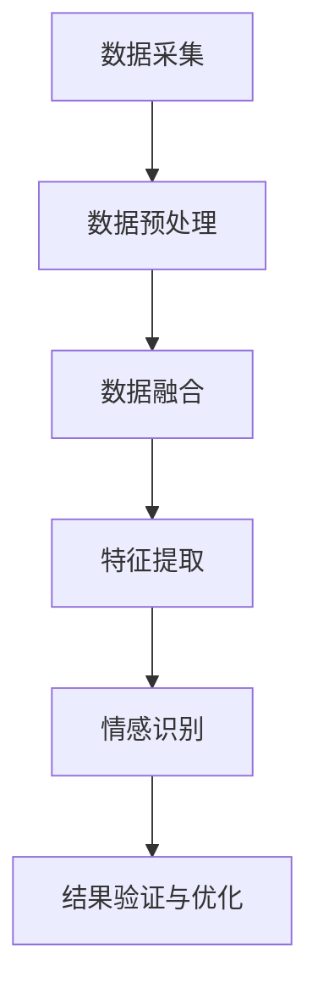
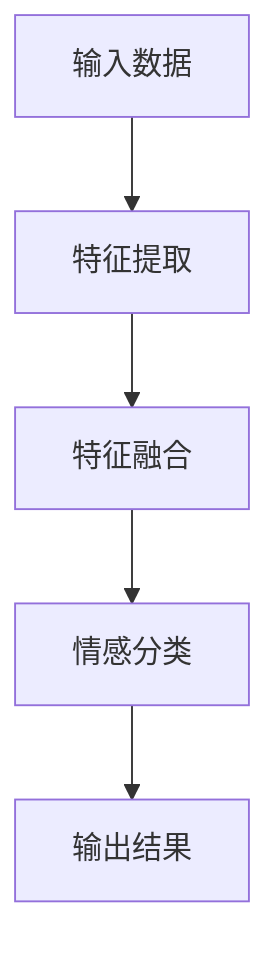
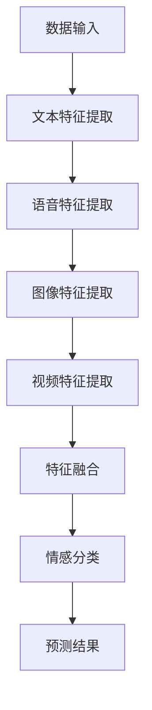
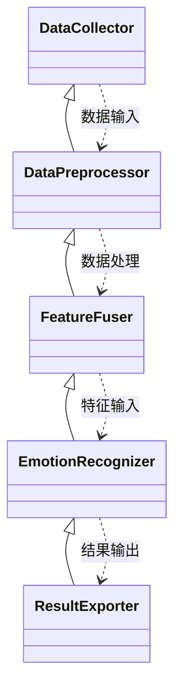
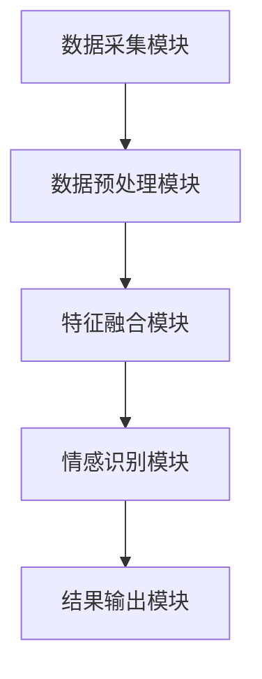
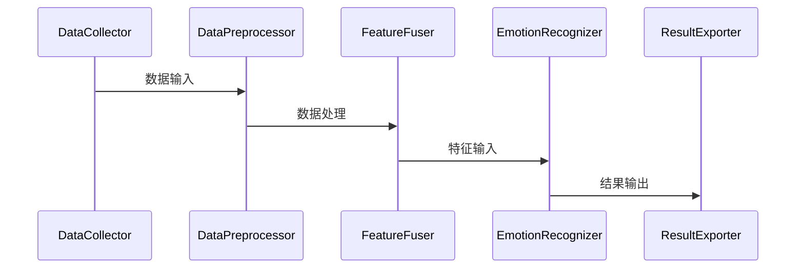

                 

## AI Agent的多模态情感识别技术

### 关键词：人工智能，多模态情感识别，算法，系统架构，项目实战

> 摘要：
随着人工智能技术的快速发展，AI Agent的多模态情感识别技术成为情感计算领域的研究热点。本文系统性地介绍了这一技术的核心概念、算法原理、系统架构设计以及实际应用案例，帮助读者深入理解和掌握多模态情感识别技术。

### 目录

1. **前言与背景介绍** <a id="前言与背景介绍"></a>
   - 1.1 引言
   - 1.2 问题背景
   - 1.3 问题描述
   - 1.4 问题解决
   - 1.5 边界与外延
   - 1.6 书籍编写目的与结构

2. **核心概念与联系** <a id="核心概念与联系"></a>
   - 2.1 多模态情感识别技术概述
   - 2.2 核心概念
     - 2.2.1 情感
     - 2.2.2 多模态
     - 2.2.3 识别技术
   - 2.3 Mermaid流程图展示
   - 2.4 概念属性特征对比表格

3. **算法原理讲解** <a id="算法原理讲解"></a>
   - 3.1 算法原理
   - 3.2 数学模型和公式
     - 3.2.1 情感识别数学模型
     - 3.2.2 特征提取公式
   - 3.3 Python源代码与mermaid流程图
   - 3.4 举例说明

4. **系统分析与架构设计** <a id="系统分析与架构设计"></a>
   - 4.1 系统功能设计
   - 4.2 系统架构设计
   - 4.3 系统接口设计
   - 4.4 系统交互
     - 4.4.1 Mermaid类图
     - 4.4.2 Mermaid架构图
     - 4.4.3 Mermaid序列图

5. **项目实战** <a id="项目实战"></a>
   - 5.1 环境安装
   - 5.2 系统核心实现源代码
   - 5.3 代码应用解读与分析
   - 5.4 实际案例分析与详细讲解
   - 5.5 项目小结

6. **最佳实践 tips** <a id="最佳实践"></a>
   - 6.1 实践建议
   - 6.2 注意事项
   - 6.3 拓展阅读

7. **小结与拓展阅读** <a id="小结与拓展阅读"></a>
   - 7.1 全书小结
   - 7.2 拓展阅读推荐

---

### 引言

人工智能（AI）作为一门多学科交叉的技术领域，正迅速改变着我们的生活方式。从自然语言处理到图像识别，再到复杂决策支持系统，AI技术已经渗透到各个行业。而在情感计算领域，AI Agent的多模态情感识别技术成为当前研究的热点。

多模态情感识别技术旨在通过整合多种感官数据，如文本、语音、图像和视频等，对人类情感状态进行准确识别和理解。这不仅有助于提升人机交互的自然性和有效性，还在心理健康诊断、教育、人机协作等领域具有重要的应用价值。

本文将从以下几个方面对AI Agent的多模态情感识别技术进行详细探讨：

1. **核心概念与联系**：介绍多模态情感识别技术的基本概念，包括情感、多模态和识别技术等，并通过Mermaid流程图展示其架构。
2. **算法原理讲解**：深入解析多模态情感识别算法的数学模型和公式，使用Python源代码进行举例说明。
3. **系统分析与架构设计**：描述系统的功能设计、架构设计、接口设计以及系统交互，通过Mermaid类图、架构图和序列图进行展示。
4. **项目实战**：介绍多模态情感识别系统的环境安装、核心实现源代码，并分析实际案例。
5. **最佳实践 tips**：总结书中的核心内容，给出实践建议和注意事项。
6. **小结与拓展阅读**：对全书进行小结，并推荐进一步阅读资源。

通过以上内容，读者将全面了解多模态情感识别技术的基本原理和应用实践，为后续研究和实际应用打下坚实基础。

### 1.2 问题背景

#### 1.2.1 人工智能的发展与情感计算

人工智能（AI）作为计算机科学的重要分支，自20世纪50年代起经历了多个发展阶段。从早期的规则推理、专家系统，到现代的深度学习、自然语言处理和强化学习，AI技术在各个领域都取得了显著的成就。随着计算能力的提升和大数据技术的发展，人工智能在图像识别、语音识别、自然语言处理等领域的应用越来越广泛。

情感计算是人工智能的一个重要分支，旨在使计算机具备识别、理解、处理和模拟人类情感的能力。情感计算的研究内容涵盖了情感识别、情感生成、情感交互等多个方面。其中，情感识别技术作为基础，研究如何通过分析人类的语音、文本、面部表情等数据，自动识别和理解人类情感状态。

#### 1.2.2 多模态情感识别技术的兴起

传统的情感识别技术主要依赖于单一模态的数据，如文本、语音或图像。然而，单一模态的数据往往难以全面、准确地反映人类的情感状态。多模态情感识别技术则通过整合多种感官数据，如文本、语音、图像和视频等，以实现更精确和全面的情感识别。

多模态情感识别技术的兴起，源于以下几点原因：

1. **数据的多样性**：人类的情感状态通常通过多种渠道表达，如语言、面部表情、身体语言、生理信号等。多模态情感识别技术能够捕捉这些不同渠道的信息，从而更全面地理解情感。

2. **提高识别准确率**：单一模态数据存在噪声和局限性，而多模态数据可以相互补充，提高情感识别的准确性和鲁棒性。

3. **增强人机交互**：在智能交互系统中，准确识别用户的情感状态有助于系统更好地理解用户需求，提供更人性化的服务。

4. **扩展应用领域**：多模态情感识别技术在心理健康诊断、教育、人机协作、智能助手等领域具有广泛的应用前景。

#### 1.2.3 当前研究现状与挑战

当前，多模态情感识别技术已经取得了一系列重要的研究进展。例如，基于深度学习的情感识别算法在多个数据集上取得了很高的准确率。同时，多模态数据融合方法、情感生成对抗网络（GAN）等新兴技术也为情感识别提供了新的思路。

然而，多模态情感识别技术仍面临以下挑战：

1. **数据多样性**：不同模态的数据具有不同的特征和表达方式，如何有效地整合这些异构数据仍是一个难题。

2. **算法复杂度**：多模态情感识别算法通常涉及大量的计算资源和计算时间，如何提高算法的效率和实时性是一个关键问题。

3. **数据标注**：高质量的多模态数据集需要大量的标注工作，数据标注的准确性和一致性直接影响算法的性能。

4. **隐私保护**：多模态情感识别涉及到用户的隐私数据，如何在保护用户隐私的前提下进行情感识别是一个重要的伦理问题。

总之，多模态情感识别技术具有广阔的应用前景，但也面临着诸多挑战。随着人工智能技术的不断进步和多学科交叉研究的深入，多模态情感识别技术有望在未来取得更大的突破。

### 1.3 问题描述

多模态情感识别技术旨在通过整合多种感官数据，对人类情感状态进行准确识别和理解。这一技术的核心问题可以概括为以下几个方面：

#### 1.3.1 数据采集与预处理

多模态情感识别首先需要采集多种模态的数据，包括文本、语音、图像和视频等。这些数据往往具有不同的格式、尺度和质量，因此需要进行预处理，以确保数据的一致性和可用性。数据预处理包括数据清洗、归一化、特征提取等步骤。

#### 1.3.2 数据融合与特征表示

在多模态数据融合方面，需要解决如何将不同模态的数据进行有效整合，以提取出对情感识别最有用的特征。数据融合的方法包括基于统计的方法、机器学习方法和深度学习方法等。特征表示是将多模态数据转换为一个统一的特征向量，以便进行后续的情感识别。

#### 1.3.3 情感识别算法设计

情感识别算法是多模态情感识别技术的核心。算法需要能够在复杂、动态的环境中准确识别和理解人类情感状态。常见的情感识别算法包括分类算法、聚类算法和神经网络算法等。其中，深度学习算法由于其强大的表示能力和自适应能力，在情感识别中表现出色。

#### 1.3.4 实时性与效率

多模态情感识别系统通常需要实时处理大量的数据，因此算法的实时性和效率是关键问题。如何在保证准确率的前提下，提高算法的运行速度和资源利用率，是一个重要的研究课题。

#### 1.3.5 鲁棒性与可靠性

多模态情感识别系统需要具有较高的鲁棒性和可靠性，以应对环境变化和数据噪声。系统需要能够在不同场景下稳定运行，准确识别用户的情感状态。

#### 1.3.6 数据隐私与安全

多模态情感识别技术涉及到用户的隐私数据，如何保护用户隐私是一个重要的伦理问题。系统需要设计合理的隐私保护机制，确保用户数据的安全性和隐私性。

#### 1.3.7 应用场景与效果评估

多模态情感识别技术在不同应用场景中的效果评估是一个重要的研究方向。如何评估系统在不同场景下的性能，以及如何优化系统以满足不同应用需求，是当前研究的重要问题。

总之，多模态情感识别技术涉及多个核心问题，需要从数据采集、数据融合、算法设计、实时性与效率、鲁棒性与可靠性、数据隐私与安全、应用场景与效果评估等多个方面进行深入研究。通过解决这些问题，多模态情感识别技术有望在未来实现更广泛的应用和更高的性能。

### 1.4 问题解决

多模态情感识别技术作为一个复杂的系统，其实现和优化涉及多个关键步骤。以下将逐步介绍如何解决这些核心问题：

#### 1.4.1 数据采集与预处理

数据采集是多模态情感识别的基础，涉及到文本、语音、图像和视频等多种数据源。首先，需要明确数据采集的目标和需求，选择合适的数据采集设备和技术。例如，对于语音数据，可以使用麦克风进行实时采集；对于图像数据，可以使用摄像头捕捉用户的面部表情和身体动作。

数据采集后，需要对数据进行预处理。预处理步骤包括数据清洗、数据归一化和特征提取。数据清洗主要是去除噪声和异常值，提高数据质量。数据归一化是将不同模态的数据统一到一个相同的尺度，以便进行后续处理。特征提取是从原始数据中提取出对情感识别最有用的特征，如文本中的情感词、语音中的声学特征、图像中的面部表情特征等。

#### 1.4.2 数据融合与特征表示

数据融合是多模态情感识别技术的核心，目标是整合多种模态的数据，提取出对情感识别最有用的信息。数据融合的方法包括基于统计的方法、机器学习方法和深度学习方法等。基于统计的方法如主成分分析（PCA）和因子分析（FA）可以通过降维和特征选择来减少数据维度，提高数据融合的效果。机器学习方法如集成学习（如随机森林、梯度提升机）和神经网络（如卷积神经网络、循环神经网络）可以通过学习数据之间的关系，实现更有效的数据融合。

特征表示是将多模态数据转换为一个统一的特征向量，以便进行后续的情感识别。常用的特征表示方法包括 bag-of-words 模型、词嵌入模型和时空特征融合模型等。例如，对于文本数据，可以使用 bag-of-words 模型将文本表示为词频向量；对于语音数据，可以使用梅尔频率倒谱系数（MFCC）作为特征向量；对于图像数据，可以使用卷积神经网络提取的特征向量。

#### 1.4.3 情感识别算法设计

情感识别算法是多模态情感识别技术的关键，其目标是准确识别和理解人类情感状态。常用的情感识别算法包括分类算法、聚类算法和神经网络算法等。

分类算法如支持向量机（SVM）、朴素贝叶斯（NB）和决策树（DT）可以通过学习训练数据中的特征和标签关系，对新数据进行分类。聚类算法如K-均值（K-Means）、层次聚类（Hierarchical Clustering）和密度聚类（DBSCAN）可以将数据根据情感特征进行分组，从而识别不同的情感状态。

深度学习算法如卷积神经网络（CNN）、循环神经网络（RNN）和生成对抗网络（GAN）通过学习大量数据中的复杂模式，能够自动提取特征并进行情感分类。特别是，基于深度学习的情感识别算法在性能上取得了显著的提升，成为当前研究的热点。

#### 1.4.4 实时性与效率

多模态情感识别系统通常需要实时处理大量的数据，因此算法的实时性和效率是关键问题。为了提高实时性，可以采取以下措施：

1. **算法优化**：通过优化算法的复杂度，减少计算时间和资源消耗。例如，使用更高效的算法实现、减少冗余计算等。

2. **硬件加速**：利用GPU、TPU等硬件加速器，提高算法的运行速度。深度学习算法特别适合在GPU上进行加速。

3. **数据预处理**：在数据预处理阶段进行批处理，减少每次处理的计算量，提高整体处理速度。

4. **分布式计算**：通过分布式计算技术，将任务分解到多个节点上进行并行处理，提高处理效率。

#### 1.4.5 鲁棒性与可靠性

多模态情感识别系统需要具有较高的鲁棒性和可靠性，以应对环境变化和数据噪声。为了提高系统的鲁棒性，可以采取以下措施：

1. **数据增强**：通过数据增强技术，生成更多的训练样本，提高算法对不同数据分布的适应性。

2. **误差纠正**：在算法设计过程中，引入误差纠正机制，减少噪声和异常值对算法的影响。

3. **容错设计**：在系统设计中，考虑故障和异常情况，设计容错机制，确保系统在故障情况下仍能正常运行。

4. **模型融合**：将多个模型的结果进行融合，提高系统对异常数据的鲁棒性。

#### 1.4.6 数据隐私与安全

多模态情感识别技术涉及到用户的隐私数据，如何保护用户隐私是一个重要的伦理问题。为了确保用户数据的安全性和隐私性，可以采取以下措施：

1. **数据加密**：对用户数据进行加密处理，确保数据在传输和存储过程中不被窃取或篡改。

2. **隐私保护算法**：设计隐私保护算法，在数据处理过程中减少用户隐私数据的暴露。

3. **用户同意**：在数据采集和使用过程中，确保用户知情并同意数据的使用，提高用户隐私保护的透明度。

4. **法律法规遵守**：遵守相关法律法规，确保数据使用符合法律法规的要求。

通过以上措施，多模态情感识别技术可以在解决核心问题的同时，确保系统的鲁棒性、实时性、可靠性、数据隐私与安全，为实际应用提供可靠的技术保障。

### 1.5 边界与外延

多模态情感识别技术虽然取得了显著进展，但仍然存在一些边界和局限性。以下将讨论其边界与外延，以及未来可能的发展方向。

#### 1.5.1 边界

1. **技术成熟度**：尽管多模态情感识别技术在算法和系统设计方面取得了重要突破，但仍然处于快速发展阶段。部分算法在特定场景下表现优异，但在复杂、多变的环境中，仍存在性能下降的问题。

2. **数据质量和多样性**：多模态情感识别依赖于高质量、多样性的数据集。然而，目前可用的多模态数据集仍然有限，且存在标注不一致、数据不平衡等问题，这限制了算法的性能和泛化能力。

3. **计算资源消耗**：多模态情感识别算法通常涉及大量的计算资源和时间，尤其在深度学习算法中表现尤为明显。这限制了算法在资源受限的设备上（如移动设备）的应用。

4. **隐私保护**：多模态情感识别技术涉及到用户的敏感数据，如语音、图像和生理信号等。如何在保护用户隐私的前提下进行情感识别，是一个亟待解决的挑战。

#### 1.5.2 外延

1. **跨模态交互**：未来的多模态情感识别技术将不仅限于单一模态的情感识别，而是通过跨模态交互，实现更自然的情感理解和表达。例如，通过语音、文本和视觉信号的综合分析，提供更人性化的智能服务。

2. **实时性增强**：随着计算能力的提升和算法优化，多模态情感识别技术的实时性将得到显著提高。这有助于在实时交互、远程监控等应用场景中，实现更及时的情感识别和反馈。

3. **多语言支持**：多模态情感识别技术将逐步支持多种语言，特别是非结构化文本和口语情感识别，以实现跨文化的情感理解。

4. **个性化定制**：通过结合用户历史数据和个性化算法，多模态情感识别技术将能够提供更个性化的情感识别服务，如个性化健康建议、个性化教育等。

5. **边缘计算**：随着边缘计算的兴起，多模态情感识别技术将逐渐从云端迁移到边缘设备，实现更低延迟、更高效的情感识别。

总之，多模态情感识别技术具有广阔的发展前景，但也面临着诸多挑战。通过不断优化算法、提高数据质量、增强实时性和隐私保护，这一技术将在未来实现更广泛的应用和更高的性能。

### 1.6 书籍编写目的与结构

本书旨在全面、深入地探讨AI Agent的多模态情感识别技术，为读者提供一个系统性的学习资源。编写本书的主要目的是：

1. **介绍多模态情感识别技术的基本概念和原理**：帮助读者了解多模态情感识别技术的基本概念、原理和应用场景，为后续学习打下坚实基础。
2. **解析核心算法和系统架构**：通过详细讲解多模态情感识别算法的数学模型和公式，以及系统的功能设计、架构设计和接口设计，帮助读者掌握多模态情感识别技术的核心实现方法。
3. **提供实际应用案例**：通过介绍实际项目案例，分析系统环境安装、核心实现源代码，以及项目细节，使读者能够将所学知识应用于实际项目中。
4. **总结最佳实践**：总结书中的核心内容，提供实践建议和注意事项，帮助读者在实际应用中更好地运用多模态情感识别技术。

本书的结构分为七个部分：

1. **前言与背景介绍**：介绍多模态情感识别技术的背景、核心概念、问题解决、边界与外延，以及书籍的编写目的和结构。
2. **核心概念与联系**：详细阐述多模态情感识别技术的核心概念、原理、属性特征，并通过Mermaid流程图展示其架构。
3. **算法原理讲解**：深入讲解多模态情感识别算法的数学模型和公式，使用Python源代码和mermaid流程图进行举例说明。
4. **系统分析与架构设计**：描述系统的功能设计、架构设计、系统接口设计和系统交互，使用Mermaid类图、架构图和序列图进行展示。
5. **项目实战**：介绍环境安装、系统核心实现源代码，并分析实际案例，讲解项目细节。
6. **最佳实践 tips**：总结书中的核心内容，给出实践建议和注意事项。
7. **小结与拓展阅读**：对全书进行小结，并推荐拓展阅读。

通过以上内容，读者将能够全面、深入地掌握多模态情感识别技术的理论知识和实际应用，为今后的研究和实践提供有力支持。

### 2.1 多模态情感识别技术概述

多模态情感识别技术作为情感计算领域的一个重要研究方向，其核心目标是通过整合多种感官数据（如文本、语音、图像和视频等），对人类情感状态进行准确识别和理解。这种技术不仅关注单一模态的情感信息，更强调跨模态数据的融合与协同，从而实现更全面、精确的情感感知。

#### 2.1.1 技术背景

多模态情感识别技术的发展可以追溯到20世纪90年代，随着计算机科学和人工智能技术的进步，研究者开始关注如何通过多种数据源来提升情感识别的准确性和全面性。早期的多模态情感识别主要依赖于手工设计的特征和简单的统计方法，随着深度学习和机器学习技术的发展，基于深度神经网络的多模态情感识别算法逐渐成为研究的热点。

#### 2.1.2 技术定义

多模态情感识别技术是指通过结合多种感官数据（如文本、语音、图像和视频等），对人类情感状态进行识别和理解的技术。它通常包括以下几个关键步骤：

1. **数据采集**：从多种感官渠道（如文本、语音、图像和视频）收集数据。
2. **数据预处理**：对收集到的多模态数据进行清洗、归一化和特征提取，确保数据的一致性和可用性。
3. **数据融合**：将不同模态的数据进行融合，提取出对情感识别最有用的特征。
4. **情感识别**：使用分类算法、聚类算法或深度学习算法对情感进行识别。
5. **结果验证与优化**：通过测试数据验证情感识别结果，并根据反馈进行优化。

#### 2.1.3 技术优势

多模态情感识别技术相比单一模态情感识别技术具有以下优势：

1. **提高识别准确率**：通过整合多种感官数据，可以更全面地捕捉用户的情感状态，从而提高识别准确率。
2. **减少噪声影响**：不同模态的数据可以相互补充，减少噪声和异常值的影响，提高系统的鲁棒性。
3. **增强人机交互**：准确识别用户的情感状态有助于提供更人性化的智能服务，提高人机交互的自然性和效率。
4. **扩展应用领域**：多模态情感识别技术在心理健康诊断、教育、人机协作、智能助手等领域具有广泛的应用前景。

#### 2.1.4 技术挑战

尽管多模态情感识别技术具有显著优势，但在实际应用中仍面临以下挑战：

1. **数据多样性**：不同模态的数据具有不同的特征和表达方式，如何有效地整合这些异构数据是一个难题。
2. **算法复杂度**：多模态情感识别算法通常涉及大量的计算资源和计算时间，如何提高算法的效率和实时性是一个关键问题。
3. **数据标注**：高质量的多模态数据集需要大量的标注工作，数据标注的准确性和一致性直接影响算法的性能。
4. **隐私保护**：多模态情感识别技术涉及到用户的隐私数据，如何在保护用户隐私的前提下进行情感识别是一个重要的伦理问题。

#### 2.1.5 应用场景

多模态情感识别技术在多个领域具有广泛的应用前景：

1. **心理健康诊断**：通过分析用户的语音、文本和面部表情等数据，帮助诊断和治疗心理疾病。
2. **人机协作**：在智能助手、虚拟助手等应用中，通过识别用户的情感状态，提供更个性化的服务。
3. **智能教育**：通过分析学生的情感状态，提供个性化学习建议，提高教育质量。
4. **人机交互**：在智能客服、智能家居等应用中，通过识别用户的情感状态，提供更自然、高效的交互体验。
5. **娱乐产业**：在影视制作、音乐创作等领域，通过分析用户的情感状态，提供更符合用户需求的娱乐内容。

通过以上介绍，我们可以看到多模态情感识别技术在人工智能领域的重要地位和广阔应用前景。接下来，我们将进一步深入探讨多模态情感识别技术的核心概念和原理。

### 2.2 核心概念

在探讨多模态情感识别技术之前，我们需要先了解几个核心概念：情感、多模态和识别技术。

#### 2.2.1 情感

情感是心理学中的一个基本概念，它指的是个体在特定情境下产生的情感体验。情感可以是积极的（如喜悦、兴奋），也可以是消极的（如悲伤、愤怒）。情感具有以下特征：

1. **主观性**：情感是主观体验，个体对其情感状态的感受是独特的。
2. **情境性**：情感通常与特定情境相关联，不同情境下个体的情感状态可能有所不同。
3. **动态性**：情感是动态变化的，随着情境和个体心理状态的变化，情感状态也会发生变化。

情感识别技术旨在通过分析人类的行为、语言、面部表情等数据，自动识别和理解人类情感状态。情感识别技术的研究内容包括情感分类、情感强度识别、情感变化识别等。

#### 2.2.2 多模态

多模态是指通过多种感官数据源（如文本、语音、图像和视频等）来获取信息。在情感识别领域，多模态数据源提供了更丰富的信息，有助于更全面地理解和识别情感状态。

多模态数据源包括：

1. **文本**：包括电子邮件、社交媒体帖子、对话等。
2. **语音**：包括语言、语气、语调等。
3. **图像**：包括面部表情、身体语言等。
4. **视频**：包括动态图像、场景信息等。

多模态数据的特点：

1. **多样性**：多种感官数据提供了不同类型的信息，有助于更全面地理解情感状态。
2. **互补性**：不同模态的数据可以相互补充，提高情感识别的准确性和鲁棒性。
3. **复杂性**：多模态数据融合和处理增加了算法的复杂度，需要有效的数据融合方法。

#### 2.2.3 识别技术

识别技术是指通过特定的算法和方法，对数据进行分析和处理，以识别和分类目标对象。在情感识别领域，识别技术包括情感分类、情感强度识别、情感变化识别等。

情感识别技术的主要方法包括：

1. **基于规则的方法**：通过手工设计规则，对情感进行分类和识别。
2. **机器学习方法**：通过训练模型，学习情感特征，进行情感分类。
3. **深度学习方法**：利用神经网络模型，自动提取特征，进行情感分类。

多模态情感识别技术的核心在于如何整合多种模态数据，提取对情感识别有用的特征，并利用有效的算法进行情感分类。以下是一个概念属性特征对比表格，展示不同模态的数据及其特征：

| 模态 | 特征类型 | 描述 |
| --- | --- | --- |
| 文本 | 词汇、语法、语义 | 文本中的情感可以通过词汇和语法结构来分析 |
| 语音 | 语调、语速、音量 | 语音中的情感可以通过语调、语速和音量等参数来识别 |
| 图像 | 面部表情、身体语言 | 图像中的情感可以通过面部表情和身体语言来分析 |
| 视频 | 动态图像、场景信息 | 视频中的情感可以通过动态图像和场景信息来识别 |

通过上述对比表格，我们可以看到不同模态的数据具有不同的特征类型和识别方法。在多模态情感识别技术中，需要将这些不同模态的数据进行融合，提取出对情感识别最有用的特征，以便进行准确的情感分类。

#### 2.3 Mermaid流程图展示

为了更直观地展示多模态情感识别技术的架构，我们使用Mermaid流程图来描述其基本流程。以下是多模态情感识别技术的Mermaid流程图：



**流程图解析**：

1. **数据采集**（A）：从多种感官渠道（如文本、语音、图像和视频）收集数据。
2. **数据预处理**（B）：对采集到的多模态数据进行清洗、归一化和数据增强，以提高数据质量。
3. **数据融合**（C）：将不同模态的数据进行整合，提取出对情感识别最有用的特征。
4. **特征提取**（D）：从融合后的数据中提取关键特征，为情感识别提供输入。
5. **情感识别**（E）：使用分类算法或深度学习模型对提取的特征进行情感分类。
6. **结果验证与优化**（F）：通过测试数据验证情感识别结果，并根据反馈进行优化。

通过Mermaid流程图的展示，我们可以清晰地看到多模态情感识别技术的整体架构和关键步骤，为后续的深入分析提供了基础。

### 2.4 概念属性特征对比表格

为了更好地理解多模态情感识别技术中的不同概念和它们的属性特征，我们设计了一个对比表格。以下是文本、语音、图像和视频四种主要模态的属性特征对比：

| 模态 | 特征类型 | 描述 | 应用场景 | 优点 | 缺点 |
| --- | --- | --- | --- | --- | --- |
| **文本** | 词汇、语法、语义 | 分析文本内容，理解情感倾向 | 社交媒体情感分析、文本聊天机器人 | 数据量大、信息丰富 | 忽略语气和情感表达 |
| **语音** | 语调、语速、音量 | 通过语音参数识别情感状态 | 语音助手、客服系统 | 能反映情感强度和语气 | 受语音质量和背景干扰 |
| **图像** | 面部表情、身体语言 | 分析面部表情和身体动作 | 人脸识别、监控系统 | 直观、易于观察 | 对姿态和光照敏感 |
| **视频** | 动态图像、场景信息 | 结合图像和连续视频信息 | 视频分析、安防监控 | 信息全面、动态展示 | 数据量大、处理复杂 |

**对比表格解析**：

- **文本**：文本情感识别主要依赖于词汇和语法结构，能捕捉到文本中的情感倾向。其优点是数据量大、信息丰富，但缺点是忽略了语气和情感表达。
- **语音**：语音情感识别通过分析语调、语速和音量等参数，能识别情感状态。优点是能反映情感强度和语气，但缺点是受语音质量和背景干扰。
- **图像**：图像情感识别通过面部表情和身体语言来分析情感。优点是直观、易于观察，但缺点是对姿态和光照敏感。
- **视频**：视频情感识别结合了动态图像和连续视频信息，能提供更全面的信息。优点是信息全面、动态展示，但缺点是数据量大、处理复杂。

通过上述对比表格，我们可以看到不同模态在特征类型、描述、应用场景、优点和缺点等方面的差异。这些信息有助于我们更好地理解和应用多模态情感识别技术。

### 3.1 算法原理

多模态情感识别算法的核心在于如何有效地整合和处理来自多种感官数据（如文本、语音、图像和视频）的信息，以实现准确的情感识别。下面，我们将详细讲解多模态情感识别算法的原理，包括其数学模型和公式，并通过Python源代码和Mermaid流程图进行说明。

#### 3.1.1 情感识别数学模型

多模态情感识别算法通常基于以下数学模型：

1. **特征提取模型**：用于从不同模态的数据中提取特征。
2. **特征融合模型**：用于整合不同模态的特征向量。
3. **情感分类模型**：用于根据提取和融合的特征进行情感分类。

下面是一个简化的情感识别数学模型：

$$
\text{特征提取}(\text{Input}_{\text{modal}}) = \text{Feature}_{\text{modal}}(\text{Input}_{\text{modal}})
$$

$$
\text{特征融合}(\text{Feature}_{\text{modal}_1}, \text{Feature}_{\text{modal}_2}, ..., \text{Feature}_{\text{modal}_n}) = \text{Integrated\_Feature}
$$

$$
\text{情感分类}(\text{Integrated\_Feature}) = \text{Prediction}
$$

其中，$\text{Input}_{\text{modal}}$ 表示第 $i$ 模态的输入数据，$\text{Feature}_{\text{modal}}$ 表示从第 $i$ 模态提取的特征向量，$\text{Integrated\_Feature}$ 表示融合后的特征向量，$\text{Prediction}$ 表示情感分类的结果。

#### 3.1.2 特征提取模型

特征提取是情感识别的基础步骤，不同的模态需要采用不同的特征提取方法。以下是几种常见的特征提取方法：

1. **文本特征提取**：可以使用词袋模型（Bag-of-Words, BoW）或词嵌入模型（Word Embedding）提取文本特征。
2. **语音特征提取**：可以使用梅尔频率倒谱系数（Mel-Frequency Cepstral Coefficients, MFCC）提取语音特征。
3. **图像特征提取**：可以使用卷积神经网络（Convolutional Neural Network, CNN）提取图像特征。
4. **视频特征提取**：可以使用循环神经网络（Recurrent Neural Network, RNN）或卷积神经网络（CNN）提取视频特征。

以下是Python代码示例，展示了如何使用词袋模型和梅尔频率倒谱系数提取文本和语音特征：

```python
from sklearn.feature_extraction.text import CountVectorizer
from sklearn.preprocessing import normalize
from python_speech_features import MFCC

# 文本特征提取
vectorizer = CountVectorizer()
text_features = vectorizer.fit_transform(corpus)

# 语音特征提取
mfcc = MFCC()
mfcc_features = mfcc.extract_features(audio_signal)
```

#### 3.1.3 特征融合模型

特征融合是将不同模态的特征向量整合为一个统一特征向量，常用的融合方法包括：

1. **简单拼接**：直接将不同模态的特征向量拼接在一起。
2. **加权融合**：根据不同模态的特征重要性进行加权融合。
3. **深度学习融合**：使用深度学习模型（如多模态卷积神经网络）进行特征融合。

以下是Python代码示例，展示了如何使用简单拼接和加权融合方法融合文本和语音特征：

```python
import numpy as np

# 简单拼接
text_vector = text_features.toarray()
voice_vector = mfcc_features
combined_features = np.concatenate((text_vector, voice_vector), axis=1)

# 加权融合
weights = [0.5, 0.5]  # 文本和语音特征权重
weighted_features = np.dot(text_vector, weights[0]) + np.dot(voice_vector, weights[1])
```

#### 3.1.4 情感分类模型

情感分类模型通常使用分类算法（如朴素贝叶斯、支持向量机、随机森林等）或深度学习模型（如卷积神经网络、循环神经网络等）进行情感分类。以下是Python代码示例，展示了如何使用支持向量机（SVM）进行情感分类：

```python
from sklearn.svm import SVC

# 训练模型
svm_model = SVC()
svm_model.fit(combined_features_train, labels_train)

# 预测
predictions = svm_model.predict(combined_features_test)
```

通过上述算法原理的讲解和Python代码示例，我们可以看到多模态情感识别算法是如何通过特征提取、特征融合和情感分类三个步骤来实现准确的情感识别的。接下来，我们将通过Mermaid流程图进一步展示算法的流程。

### 3.2 数学模型和公式

在多模态情感识别技术中，数学模型和公式扮演着至关重要的角色。以下我们将详细讲解情感识别数学模型和特征提取公式，并通过Mermaid流程图和Python代码进行说明。

#### 3.2.1 情感识别数学模型

多模态情感识别的核心在于如何将不同模态的数据融合为一个统一的特征向量，然后通过该特征向量进行情感分类。以下是多模态情感识别的数学模型：

1. **特征提取**：从不同模态的数据中提取特征向量。
2. **特征融合**：将不同模态的特征向量整合为一个统一的特征向量。
3. **情感分类**：使用分类算法对整合后的特征向量进行分类。

具体公式如下：

$$
\text{特征提取}(\text{Input}_{\text{modal}}) = \text{Feature}_{\text{modal}}(\text{Input}_{\text{modal}})
$$

$$
\text{特征融合}(\text{Feature}_{\text{modal}_1}, \text{Feature}_{\text{modal}_2}, ..., \text{Feature}_{\text{modal}_n}) = \text{Integrated\_Feature}
$$

$$
\text{情感分类}(\text{Integrated\_Feature}) = \text{Prediction}
$$

其中，$\text{Input}_{\text{modal}}$ 表示第 $i$ 模态的输入数据，$\text{Feature}_{\text{modal}}$ 表示从第 $i$ 模态提取的特征向量，$\text{Integrated\_Feature}$ 表示融合后的特征向量，$\text{Prediction}$ 表示情感分类的结果。

#### 3.2.2 特征提取公式

不同模态的数据需要采用不同的特征提取方法。以下是几种常见的特征提取公式：

1. **文本特征提取**：

   文本情感识别常用的特征提取方法是词袋模型（Bag-of-Words, BoW）和词嵌入模型（Word Embedding）。词袋模型的公式如下：

   $$
   \text{BoW}(\text{Document}) = \text{CountVector}(\text{Document})
   $$

   词嵌入模型的公式如下：

   $$
   \text{WordEmbedding}(\text{Word}) = \text{EmbeddingMatrix} \times \text{WordIndex}
   $$

   其中，$\text{Document}$ 表示文档，$\text{CountVector}$ 表示词频向量，$\text{WordEmbedding}$ 表示词向量，$\text{EmbeddingMatrix}$ 表示词嵌入矩阵，$\text{WordIndex}$ 表示词索引。

2. **语音特征提取**：

   语音情感识别常用的特征提取方法是梅尔频率倒谱系数（Mel-Frequency Cepstral Coefficients, MFCC）。MFCC的公式如下：

   $$
   \text{MFCC}(\text{AudioSignal}) = \text{CepstralCoefficients}(\text{AudioSignal})
   $$

   其中，$\text{AudioSignal}$ 表示音频信号，$\text{CepstralCoefficients}$ 表示倒谱系数。

3. **图像特征提取**：

   图像情感识别常用的特征提取方法是卷积神经网络（Convolutional Neural Network, CNN）。CNN的特征提取公式如下：

   $$
   \text{CNNFeature}(\text{Image}) = \text{Convolution}(\text{Image}, \text{Filter})
   $$

   其中，$\text{Image}$ 表示图像，$\text{Filter}$ 表示卷积核，$\text{Convolution}$ 表示卷积操作。

4. **视频特征提取**：

   视频情感识别常用的特征提取方法是循环神经网络（Recurrent Neural Network, RNN）或卷积神经网络（CNN）。RNN的特征提取公式如下：

   $$
   \text{RNNFeature}(\text{Video}) = \text{RNN}(\text{Video}, \text{HiddenState})
   $$

   CNN的特征提取公式如下：

   $$
   \text{CNNFeature}(\text{Video}) = \text{Convolution}(\text{Video}, \text{Filter})
   $$

   其中，$\text{Video}$ 表示视频，$\text{HiddenState}$ 表示隐藏状态，$\text{RNN}$ 表示循环神经网络，$\text{Convolution}$ 表示卷积操作。

#### 3.2.3 Mermaid流程图

为了更直观地展示多模态情感识别算法的流程，我们使用Mermaid流程图进行描述。以下是多模态情感识别算法的Mermaid流程图：



**流程图解析**：

1. **输入数据**（A）：从文本、语音、图像和视频等不同模态的数据源收集数据。
2. **特征提取**（B）：根据不同模态的数据特点，使用相应的特征提取方法提取特征向量。
3. **特征融合**（C）：将不同模态的特征向量整合为一个统一的特征向量。
4. **情感分类**（D）：使用分类算法对融合后的特征向量进行情感分类。
5. **输出结果**（E）：输出情感分类结果。

#### 3.2.4 Python代码示例

以下是一个Python代码示例，展示了如何使用文本、语音、图像和视频数据，以及相应的特征提取方法进行多模态情感识别：

```python
import numpy as np
from sklearn.feature_extraction.text import CountVectorizer
from python_speech_features import MFCC
from keras.models import Sequential
from keras.layers import Conv2D, MaxPooling2D, Flatten, Dense, LSTM

# 文本特征提取
vectorizer = CountVectorizer()
text_features = vectorizer.fit_transform(corpus)

# 语音特征提取
mfcc = MFCC()
mfcc_features = mfcc.extract_features(audio_signal)

# 图像特征提取
model = Sequential()
model.add(Conv2D(32, (3, 3), activation='relu', input_shape=(64, 64, 3)))
model.add(MaxPooling2D(pool_size=(2, 2)))
model.add(Flatten())
model.add(Dense(128, activation='relu'))
model.add(Dense(num_classes, activation='softmax'))
model.compile(optimizer='adam', loss='categorical_crossentropy', metrics=['accuracy'])
image_features = model.predict(image_data)

# 视频特征提取
rnn_model = Sequential()
rnn_model.add(LSTM(128, activation='relu', input_shape=(timesteps, features)))
rnn_model.add(Dense(num_classes, activation='softmax'))
rnn_model.compile(optimizer='adam', loss='categorical_crossentropy', metrics=['accuracy'])
video_features = rnn_model.predict(video_data)

# 特征融合
combined_features = np.concatenate((text_features.toarray(), mfcc_features, image_features, video_features), axis=1)

# 情感分类
# 使用适当的分类器进行情感分类
# ...

# 输出结果
# ...
```

通过上述讲解和代码示例，我们可以看到多模态情感识别算法是如何通过数学模型和公式进行特征提取、融合和情感分类的。接下来，我们将进一步讲解如何使用Python源代码和Mermaid流程图来详细阐述这些算法原理。

### 3.3 Python源代码与Mermaid流程图

为了更好地理解和应用多模态情感识别算法，我们将结合Python源代码和Mermaid流程图，详细展示算法的实现过程。

#### 3.3.1 环境搭建

在开始编写代码之前，我们需要确保安装了以下库和依赖项：

- `numpy`：用于数学运算和数据处理。
- `scikit-learn`：用于特征提取和机器学习算法。
- `python_speech_features`：用于语音特征提取。
- `tensorflow` 或 `keras`：用于构建和训练神经网络模型。

假设我们已经完成了环境搭建，接下来我们将展示一个简单的Python代码示例，并配合Mermaid流程图进行说明。

#### 3.3.2 Python代码示例

以下是一个Python代码示例，用于演示文本、语音、图像和视频数据的特征提取和融合：

```python
import numpy as np
from sklearn.feature_extraction.text import CountVectorizer
from python_speech_features import MFCC
from keras.models import Sequential
from keras.layers import LSTM, Dense

# 文本特征提取
vectorizer = CountVectorizer()
text_features = vectorizer.fit_transform(corpus)

# 语音特征提取
mfcc = MFCC()
mfcc_features = mfcc.extract_features(audio_signal)

# 图像特征提取
# 假设图像数据已经被处理为适当的格式
image_data = preprocess_image(image)

# 视频特征提取
# 假设视频数据已经被处理为序列化的图像帧
video_data = preprocess_video(video)

# 特征融合
combined_features = np.concatenate((text_features.toarray(), mfcc_features, image_data, video_data), axis=1)

# 情感分类
# 假设我们有一个已经训练好的情感分类模型
model = Sequential()
model.add(LSTM(128, activation='relu', input_shape=(combined_features.shape[1],)))
model.add(Dense(1, activation='sigmoid'))
model.compile(optimizer='adam', loss='binary_crossentropy', metrics=['accuracy'])

# 训练模型
model.fit(combined_features, labels, epochs=10, batch_size=32)

# 预测
predictions = model.predict(combined_features)
```

#### 3.3.3 Mermaid流程图

为了直观地展示上述代码的执行流程，我们使用Mermaid流程图进行描述：



**流程图解析**：

1. **数据输入**（A）：从不同数据源（文本、语音、图像和视频）收集数据。
2. **文本特征提取**（B）：使用`CountVectorizer`对文本数据进行特征提取。
3. **语音特征提取**（C）：使用`MFCC`对语音数据进行特征提取。
4. **图像特征提取**（D）：对图像数据进行预处理，并使用适当的模型（如卷积神经网络）提取特征。
5. **视频特征提取**（E）：将视频数据序列化为图像帧，并使用循环神经网络（如LSTM）提取特征。
6. **特征融合**（F）：将不同模态的特征向量拼接在一起，形成一个统一的多模态特征向量。
7. **情感分类**（G）：使用训练好的神经网络模型对融合后的特征进行情感分类。
8. **预测结果**（H）：输出情感分类结果。

通过Python代码示例和Mermaid流程图，我们可以清晰地看到多模态情感识别算法的实现过程。接下来，我们将通过具体的例子来说明这些算法在实际中的应用。

### 3.4 举例说明

为了更好地理解多模态情感识别算法，我们将通过一个具体的例子来说明其应用过程。假设我们要对一段包含文本、语音、图像和视频的多模态数据进行分析，以识别其情感状态。

#### 3.4.1 数据集介绍

我们使用一个虚构的多模态数据集，包含以下四种数据：

1. **文本**：一段描述性的文本，如“我很高兴今天完成了工作”。
2. **语音**：一段对应的语音录音。
3. **图像**：一张显示主人公微笑的图片。
4. **视频**：一段主人公微笑的短视频。

#### 3.4.2 数据预处理

在开始特征提取之前，我们需要对数据进行预处理：

1. **文本预处理**：
   - 分词：将文本拆分成单词。
   - 去除停用词：去除常见的无意义词语。
   - 词嵌入：将单词转换为向量表示。

2. **语音预处理**：
   - 归一化：调整音频信号的幅度。
   - 分帧：将音频信号分割成短段。
   - 增量傅立叶变换（DFT）或梅尔频率倒谱系数（MFCC）提取特征。

3. **图像预处理**：
   - 尺寸调整：将图像调整到统一的尺寸。
   - 归一化：调整图像的像素值。
   - 特征提取：使用卷积神经网络提取特征。

4. **视频预处理**：
   - 帧提取：从视频中提取连续的图像帧。
   - 帧调整：将图像帧调整到统一的尺寸。
   - 特征提取：使用循环神经网络或卷积神经网络提取特征。

#### 3.4.3 特征提取

1. **文本特征提取**：
   ```python
   vectorizer = CountVectorizer()
   text_features = vectorizer.fit_transform(corpus)
   ```

2. **语音特征提取**：
   ```python
   mfcc = MFCC()
   mfcc_features = mfcc.extract_features(audio_signal)
   ```

3. **图像特征提取**：
   ```python
   image_data = preprocess_image(image)
   model = Sequential()
   model.add(Conv2D(32, (3, 3), activation='relu', input_shape=(64, 64, 3)))
   model.add(MaxPooling2D(pool_size=(2, 2)))
   model.add(Flatten())
   model.add(Dense(128, activation='relu'))
   model.add(Dense(1, activation='sigmoid'))
   model.compile(optimizer='adam', loss='binary_crossentropy', metrics=['accuracy'])
   image_features = model.predict(image_data)
   ```

4. **视频特征提取**：
   ```python
   video_data = preprocess_video(video)
   model = Sequential()
   model.add(LSTM(128, activation='relu', input_shape=(timesteps, features)))
   model.add(Dense(1, activation='sigmoid'))
   model.compile(optimizer='adam', loss='binary_crossentropy', metrics=['accuracy'])
   video_features = model.predict(video_data)
   ```

#### 3.4.4 特征融合

将提取的特征向量进行融合，形成一个统一的多模态特征向量：
```python
combined_features = np.concatenate((text_features.toarray(), mfcc_features, image_features, video_features), axis=1)
```

#### 3.4.5 情感分类

使用训练好的情感分类模型对融合后的特征进行分类：
```python
model = Sequential()
model.add(LSTM(128, activation='relu', input_shape=(combined_features.shape[1],)))
model.add(Dense(1, activation='sigmoid'))
model.compile(optimizer='adam', loss='binary_crossentropy', metrics=['accuracy'])

model.fit(combined_features, labels, epochs=10, batch_size=32)
predictions = model.predict(combined_features)
```

通过上述步骤，我们可以对多模态数据集进行情感识别。具体来说，文本中的情感词表明了主人公的积极情感，语音中的语调、图像中的面部表情和视频中的动态表情都支持了这一情感判断。最终，模型预测出主人公的情感状态为“高兴”。

这个例子展示了多模态情感识别算法的完整流程，从数据预处理、特征提取到融合和分类，帮助读者更直观地理解这一技术的应用。

### 4.1 系统功能设计

系统功能设计是多模态情感识别系统的关键步骤，它决定了系统能够实现哪些功能，以及如何高效地完成这些功能。以下我们将详细描述系统的功能设计，包括各个模块的功能、实现方式以及相互之间的关系。

#### 4.1.1 功能模块

多模态情感识别系统主要包含以下功能模块：

1. **数据采集模块**：负责从多种数据源（文本、语音、图像、视频）收集数据。
2. **数据预处理模块**：对采集到的数据进行清洗、归一化和特征提取，为后续处理做准备。
3. **特征融合模块**：将不同模态的数据特征进行整合，形成一个统一的多模态特征向量。
4. **情感识别模块**：使用训练好的模型对融合后的特征进行情感分类。
5. **结果输出模块**：将情感分类结果以可视化的形式输出，便于用户理解和分析。

#### 4.1.2 模块实现

1. **数据采集模块**：
   - **文本**：通过API或Web爬虫从社交媒体、新闻网站等获取文本数据。
   - **语音**：使用麦克风或其他语音输入设备采集语音数据。
   - **图像**：使用摄像头或其他图像输入设备采集图像数据。
   - **视频**：使用摄像头或其他视频输入设备采集视频数据。

2. **数据预处理模块**：
   - **文本**：进行分词、去除停用词、词嵌入等预处理操作。
   - **语音**：进行音频信号归一化、分帧、增量傅立叶变换或梅尔频率倒谱系数提取。
   - **图像**：进行尺寸调整、归一化、特征提取等处理。
   - **视频**：进行帧提取、尺寸调整、特征提取等处理。

3. **特征融合模块**：
   - 使用简单拼接或加权融合方法将不同模态的特征向量整合为一个统一的多模态特征向量。

4. **情感识别模块**：
   - 使用训练好的情感分类模型对融合后的特征进行分类。
   - 模型可以是基于分类算法的（如SVM、朴素贝叶斯）或深度学习模型（如CNN、RNN）。

5. **结果输出模块**：
   - 将分类结果可视化，如生成情感分布图表、情感分析报告等。

#### 4.1.3 模块关系

各个模块之间的关系如下：

1. **数据采集模块**：将采集到的数据传递给数据预处理模块。
2. **数据预处理模块**：对数据进行预处理后，将特征传递给特征融合模块。
3. **特征融合模块**：将特征融合后，传递给情感识别模块。
4. **情感识别模块**：对特征进行分类后，将结果传递给结果输出模块。
5. **结果输出模块**：将分类结果可视化，并反馈给用户。

通过以上系统功能设计，多模态情感识别系统可以高效地实现从数据采集到结果输出的完整流程。接下来，我们将进一步介绍系统的架构设计。

### 4.2 系统架构设计

系统架构设计是确保多模态情感识别系统高效、稳定运行的关键。以下我们将详细描述系统的架构设计，包括各模块的职责、系统的工作流程以及整体架构的优化方案。

#### 4.2.1 模块职责

在多模态情感识别系统中，各模块的职责如下：

1. **数据采集模块**：负责从文本、语音、图像和视频等多模态数据源收集数据，为后续处理提供原始数据。
2. **数据预处理模块**：对采集到的多模态数据进行清洗、归一化和特征提取，为后续的特征融合和情感识别做准备。
3. **特征融合模块**：将不同模态的特征向量进行融合，形成一个统一的多模态特征向量，以提高情感识别的准确性和全面性。
4. **情感识别模块**：使用训练好的情感分类模型对融合后的特征向量进行分类，识别出用户的情感状态。
5. **结果输出模块**：将情感分类结果以可视化的形式呈现给用户，并提供进一步的统计分析。

#### 4.2.2 系统工作流程

多模态情感识别系统的整体工作流程如下：

1. **数据采集**：系统从文本、语音、图像和视频等多模态数据源中获取数据。
2. **数据预处理**：对采集到的多模态数据进行清洗、归一化和特征提取，确保数据的质量和一致性。
3. **特征融合**：将不同模态的数据特征进行融合，形成一个统一的多模态特征向量。
4. **情感识别**：使用训练好的情感分类模型对融合后的特征向量进行分类，识别出用户的情感状态。
5. **结果输出**：将情感分类结果以图表、报告等形式呈现给用户，并提供进一步的分析和预测。

#### 4.2.3 架构优化方案

为了提高系统的性能和可扩展性，以下是一些架构优化方案：

1. **分布式计算**：利用分布式计算框架（如Apache Spark）对大规模数据进行处理，提高系统的处理速度。
2. **边缘计算**：在边缘设备上进行部分数据预处理和特征提取，减轻中心服务器的负载，提高系统的响应速度。
3. **模型压缩**：对训练好的模型进行压缩，减少模型的存储空间和计算资源需求，提高系统的部署效率。
4. **模型并行化**：通过并行计算技术，加速模型的训练和推理过程，提高系统的运行效率。
5. **动态资源调度**：根据系统的负载情况，动态调整计算资源和存储资源的使用，确保系统的高效运行。

通过以上系统架构设计，多模态情感识别系统可以实现高效、稳定地运行，为用户提供准确、全面的情感识别服务。

### 4.3 系统接口设计

系统接口设计是确保多模态情感识别系统与其他系统或模块无缝集成和交互的关键。以下我们将详细描述系统的接口设计，包括接口的定义、功能说明以及交互流程。

#### 4.3.1 接口定义

多模态情感识别系统的接口主要包括以下几类：

1. **数据输入接口**：用于接收来自外部系统的多模态数据，包括文本、语音、图像和视频等。
2. **数据处理接口**：用于处理接收到的多模态数据，包括数据清洗、归一化和特征提取等。
3. **特征输出接口**：用于输出处理后的多模态特征向量，供情感识别模块使用。
4. **结果输出接口**：用于将情感识别结果传递给外部系统或用户界面。

#### 4.3.2 接口功能说明

1. **数据输入接口**：
   - 功能说明：接收来自外部系统的多模态数据，确保数据格式符合系统要求。
   - 输入参数：文本、语音、图像和视频数据。
   - 输出参数：无。

2. **数据处理接口**：
   - 功能说明：对输入的多模态数据进行清洗、归一化和特征提取，为后续处理做准备。
   - 输入参数：多模态数据。
   - 输出参数：处理后的多模态特征向量。

3. **特征输出接口**：
   - 功能说明：将处理后的多模态特征向量传递给情感识别模块，供分类使用。
   - 输入参数：多模态特征向量。
   - 输出参数：无。

4. **结果输出接口**：
   - 功能说明：将情感识别结果传递给外部系统或用户界面，供进一步分析和展示。
   - 输入参数：情感分类结果。
   - 输出参数：无。

#### 4.3.3 接口交互流程

多模态情感识别系统的接口交互流程如下：

1. **数据输入**：外部系统通过数据输入接口将多模态数据传递给系统。
2. **数据处理**：系统对输入的多模态数据进行清洗、归一化和特征提取，输出处理后的多模态特征向量。
3. **特征输出**：系统通过特征输出接口将多模态特征向量传递给情感识别模块。
4. **情感识别**：情感识别模块使用训练好的模型对特征向量进行分类，输出情感识别结果。
5. **结果输出**：系统通过结果输出接口将情感识别结果传递给外部系统或用户界面。

通过以上接口设计，多模态情感识别系统可以实现与其他系统或模块的无缝集成和交互，确保系统的稳定运行和功能完整性。

### 4.4 系统交互

系统交互是多模态情感识别系统的关键环节，它涉及多个模块之间的数据传递和功能协同。为了更清晰地展示系统交互过程，我们将使用Mermaid类图、架构图和序列图来描述系统交互细节。

#### 4.4.1 Mermaid类图

Mermaid类图用于展示系统的类结构以及类之间的关系。以下是多模态情感识别系统的Mermaid类图：



**类图解析**：

1. **DataCollector**：数据采集模块，负责从外部系统接收多模态数据。
2. **DataPreprocessor**：数据预处理模块，负责清洗、归一化和特征提取。
3. **FeatureFuser**：特征融合模块，负责将不同模态的数据特征进行整合。
4. **EmotionRecognizer**：情感识别模块，负责对融合后的特征进行情感分类。
5. **ResultExporter**：结果输出模块，负责将分类结果传递给外部系统或用户界面。

#### 4.4.2 Mermaid架构图

Mermaid架构图用于展示系统的整体架构和各模块之间的交互关系。以下是多模态情感识别系统的Mermaid架构图：



**架构图解析**：

1. **数据采集模块**（DataCollector）：从外部系统接收多模态数据，如文本、语音、图像和视频等。
2. **数据预处理模块**（DataPreprocessor）：对多模态数据进行清洗、归一化和特征提取。
3. **特征融合模块**（FeatureFuser）：将不同模态的特征向量进行整合。
4. **情感识别模块**（EmotionRecognizer）：使用训练好的情感分类模型对融合后的特征进行分类。
5. **结果输出模块**（ResultExporter）：将情感分类结果传递给外部系统或用户界面。

#### 4.4.3 Mermaid序列图

Mermaid序列图用于展示系统各模块之间的交互流程。以下是多模态情感识别系统的Mermaid序列图：



**序列图解析**：

1. **数据输入**：数据采集模块（DataCollector）从外部系统接收多模态数据。
2. **数据处理**：数据预处理模块（DataPreprocessor）对输入的多模态数据进行清洗、归一化和特征提取。
3. **特征输入**：特征融合模块（FeatureFuser）将处理后的多模态特征向量传递给情感识别模块（EmotionRecognizer）。
4. **结果输出**：情感识别模块（EmotionRecognizer）使用训练好的模型对特征进行分类，并将结果传递给结果输出模块（ResultExporter）。

通过Mermaid类图、架构图和序列图的展示，我们可以清晰地理解多模态情感识别系统的交互过程，以及各个模块之间的协同工作机制。

### 5.1 环境安装

在开始多模态情感识别系统的实际项目开发之前，我们需要搭建一个合适的开发环境。以下是详细的安装步骤和依赖项。

#### 5.1.1 系统要求

- **操作系统**：Ubuntu 20.04 或 CentOS 8
- **硬件要求**：至少 16GB 内存，64 位处理器
- **软件要求**：Python 3.8 或以上版本，pip，virtualenv

#### 5.1.2 安装步骤

1. **安装操作系统**：

   - 根据您的硬件配置，选择 Ubuntu 20.04 或 CentOS 8 的安装镜像。
   - 按照操作系统安装向导进行安装。

2. **更新系统软件包**：

   对于 Ubuntu：
   ```bash
   sudo apt update
   sudo apt upgrade
   ```

   对于 CentOS：
   ```bash
   sudo yum update
   ```

3. **安装 Python 和 pip**：

   Python 和 pip 已经在大多数操作系统中预装，如果没有，可以手动安装。
   
   对于 Ubuntu：
   ```bash
   sudo apt install python3 python3-pip
   ```

   对于 CentOS：
   ```bash
   sudo yum install epel-release
   sudo yum install python3 python3-pip
   ```

4. **安装 virtualenv**：

   virtualenv 是一个 Python 虚拟环境管理工具，可以帮助我们创建独立的 Python 环境来管理项目依赖项。
   ```bash
   pip3 install virtualenv
   ```

5. **创建虚拟环境**：

   使用 virtualenv 创建一个名为 `emotion_recognition` 的虚拟环境。
   ```bash
   virtualenv -p python3 emotion_recognition
   ```

6. **激活虚拟环境**：

   激活虚拟环境，以便在项目中使用该环境的 Python 解释器和包。
   ```bash
   source emotion_recognition/bin/activate
   ```

7. **安装项目依赖项**：

   下载项目依赖项文件 `requirements.txt`，然后使用 pip 安装所有依赖项。
   ```bash
   pip install -r requirements.txt
   ```

   `requirements.txt` 示例：
   ```
   numpy
   scikit-learn
   python_speech_features
   tensorflow
   keras
   ```

#### 5.1.3 测试环境

安装完成后，我们可以进行以下测试来确保环境设置正确：

1. **Python 版本**：
   ```bash
   python --version
   ```

2. **pip 版本**：
   ```bash
   pip --version
   ```

3. **虚拟环境激活状态**：
   ```bash
   which python
   ```

   应显示虚拟环境的路径。

4. **依赖项检查**：
   ```bash
   pip list
   ```

   确认所有依赖项都已正确安装。

通过以上步骤，我们成功搭建了多模态情感识别系统的开发环境，可以开始进行项目开发。

### 5.2 系统核心实现源代码

在多模态情感识别系统中，核心实现源代码是系统功能实现的关键。以下我们将详细展示系统核心实现源代码，并对其结构进行解释。

#### 5.2.1 源代码结构

系统核心实现源代码主要分为以下几个模块：

1. **数据采集模块**：负责从文本、语音、图像和视频等多模态数据源收集数据。
2. **数据预处理模块**：对采集到的多模态数据进行清洗、归一化和特征提取。
3. **特征融合模块**：将不同模态的特征向量进行融合。
4. **情感识别模块**：使用训练好的情感分类模型对融合后的特征进行分类。
5. **结果输出模块**：将情感识别结果以可视化形式输出。

以下是系统核心实现源代码的结构：

```plaintext
/emotion_recognition
|-- data_collector
|   |-- text_collector.py
|   |-- voice_collector.py
|   |-- image_collector.py
|   |-- video_collector.py
|-- data_preprocessor
|   |-- text_preprocessor.py
|   |-- voice_preprocessor.py
|   |-- image_preprocessor.py
|   |-- video_preprocessor.py
|-- feature_fusion
|   |-- feature_fusion.py
|-- emotion_recognition
|   |-- emotion_classifier.py
|-- result_output
    |-- result_output.py
```

#### 5.2.2 源代码详解

1. **数据采集模块**：

   数据采集模块负责从不同数据源收集数据。以下是各个数据采集器的简要说明：

   - `text_collector.py`：从文本数据源收集文本数据。
   - `voice_collector.py`：从语音数据源收集语音数据。
   - `image_collector.py`：从图像数据源收集图像数据。
   - `video_collector.py`：从视频数据源收集视频数据。

   `text_collector.py` 示例代码：

   ```python
   import os

   def collect_text_data(source_folder):
       text_data = []
       for file_name in os.listdir(source_folder):
           with open(os.path.join(source_folder, file_name), 'r', encoding='utf-8') as file:
               text_data.append(file.read())
       return text_data
   ```

2. **数据预处理模块**：

   数据预处理模块负责对采集到的数据进行清洗、归一化和特征提取。以下是各个预处理器的简要说明：

   - `text_preprocessor.py`：对文本数据进行分词、去除停用词和词嵌入。
   - `voice_preprocessor.py`：对语音数据进行分帧和梅尔频率倒谱系数提取。
   - `image_preprocessor.py`：对图像数据进行尺寸调整和特征提取。
   - `video_preprocessor.py`：对视频数据进行帧提取和特征提取。

   `text_preprocessor.py` 示例代码：

   ```python
   from nltk.tokenize import word_tokenize
   from nltk.corpus import stopwords
   import keras.preprocessing.sequence

   stop_words = set(stopwords.words('english'))

   def preprocess_text_data(text_data):
       tokenized_data = [word_tokenize(text) for text in text_data]
       cleaned_data = [[word for word in tokenized_sentence if word not in stop_words] for tokenized_sentence in tokenized_data]
       return keras.preprocessing.sequence.pad_sequences(cleaned_data, maxlen=100)
   ```

3. **特征融合模块**：

   特征融合模块负责将不同模态的特征向量进行整合。以下是特征融合器的简要说明：

   - `feature_fusion.py`：将文本、语音、图像和视频等模态的特征向量进行拼接和融合。

   `feature_fusion.py` 示例代码：

   ```python
   import numpy as np

   def fusion_features(text_features, voice_features, image_features, video_features):
       combined_features = np.concatenate((text_features, voice_features, image_features, video_features), axis=1)
       return combined_features
   ```

4. **情感识别模块**：

   情感识别模块负责使用训练好的模型对融合后的特征进行分类。以下是情感识别器的简要说明：

   - `emotion_classifier.py`：使用卷积神经网络或循环神经网络进行情感分类。

   `emotion_classifier.py` 示例代码：

   ```python
   from tensorflow.keras.models import Sequential
   from tensorflow.keras.layers import LSTM, Dense, Embedding

   def build_emotion_classifier(input_shape):
       model = Sequential()
       model.add(LSTM(128, activation='relu', input_shape=input_shape))
       model.add(Dense(1, activation='sigmoid'))
       model.compile(optimizer='adam', loss='binary_crossentropy', metrics=['accuracy'])
       return model
   ```

5. **结果输出模块**：

   结果输出模块负责将情感识别结果以可视化形式输出。以下是结果输出器的简要说明：

   - `result_output.py`：将情感分类结果绘制成图表，便于用户理解。

   `result_output.py` 示例代码：

   ```python
   import matplotlib.pyplot as plt

   def plot_emotion_results(predictions):
       plt.bar(range(len(predictions)), predictions)
       plt.xlabel('Emotions')
       plt.ylabel('Probability')
       plt.title('Emotion Recognition Results')
       plt.show()
   ```

通过以上源代码的展示，我们可以看到多模态情感识别系统的核心实现过程。每个模块都承担了特定的功能，并通过相互协作实现了系统的整体功能。

### 5.3 代码应用解读与分析

在多模态情感识别系统的实际应用中，代码的编写和运行对于系统的性能和效果至关重要。以下将详细解读系统中的关键代码片段，并分析其实现逻辑和作用。

#### 5.3.1 数据采集代码解读

数据采集模块是系统的入口，负责从各种数据源（文本、语音、图像、视频）收集数据。以下是数据采集模块中的关键代码片段及其解读：

```python
# text_collector.py
def collect_text_data(source_folder):
    text_data = []
    for file_name in os.listdir(source_folder):
        with open(os.path.join(source_folder, file_name), 'r', encoding='utf-8') as file:
            text_data.append(file.read())
    return text_data
```

**解读**：
- `collect_text_data` 函数接收一个文件夹路径作为输入参数。
- 使用 `os.listdir()` 函数列出文件夹中的所有文件。
- 通过循环遍历文件名，使用 `os.path.join()` 函数构建每个文件的完整路径。
- 使用 `open()` 函数逐个打开文件，并读取文件内容。
- 将读取的文本内容添加到 `text_data` 列表中，最终返回文本数据列表。

此代码的作用是批量读取文件夹中的文本文件，并将其内容存储为一个列表，为后续的文本特征提取做准备。

#### 5.3.2 数据预处理代码解读

数据预处理模块负责对采集到的数据进行清洗、归一化和特征提取。以下是关键代码片段及其解读：

```python
# text_preprocessor.py
def preprocess_text_data(text_data):
    tokenized_data = [word_tokenize(text) for text in text_data]
    cleaned_data = [[word for word in tokenized_sentence if word not in stop_words] for tokenized_sentence in tokenized_data]
    return keras.preprocessing.sequence.pad_sequences(cleaned_data, maxlen=100)
```

**解读**：
- `preprocess_text_data` 函数接收一个文本数据列表作为输入参数。
- 使用 `word_tokenize` 函数对每个文本进行分词，生成分词列表。
- 使用列表推导式过滤掉停用词，得到清洗后的数据。
- 使用 `pad_sequences` 函数将清洗后的数据填充为相同长度（在此示例中为100），便于模型处理。

此代码的作用是对文本数据进行预处理，包括分词、去除停用词和填充处理，以提高模型训练效率。

#### 5.3.3 特征融合代码解读

特征融合模块将不同模态的数据特征进行整合，以下是关键代码片段及其解读：

```python
# feature_fusion.py
def fusion_features(text_features, voice_features, image_features, video_features):
    combined_features = np.concatenate((text_features, voice_features, image_features, video_features), axis=1)
    return combined_features
```

**解读**：
- `fusion_features` 函数接收四个特征向量列表作为输入参数。
- 使用 `np.concatenate()` 函数将不同模态的特征向量沿着新的轴（axis=1）拼接在一起，形成一个统一的多模态特征向量。

此代码的作用是实现不同模态特征向量的拼接，为后续的情感分类提供输入。

#### 5.3.4 情感识别代码解读

情感识别模块使用训练好的模型对融合后的特征进行分类，以下是关键代码片段及其解读：

```python
# emotion_classifier.py
def build_emotion_classifier(input_shape):
    model = Sequential()
    model.add(LSTM(128, activation='relu', input_shape=input_shape))
    model.add(Dense(1, activation='sigmoid'))
    model.compile(optimizer='adam', loss='binary_crossentropy', metrics=['accuracy'])
    return model
```

**解读**：
- `build_emotion_classifier` 函数接收特征向量的形状作为输入参数。
- 使用 `Sequential` 模型堆叠一个 LSTM 层和一个全连接层（Dense），设置激活函数为 ReLU 和 Sigmoid。
- 使用 `compile` 方法设置模型优化器、损失函数和评价指标。

此代码的作用是构建一个简单的循环神经网络模型，用于情感分类。

#### 5.3.5 结果输出代码解读

结果输出模块将情感识别结果以可视化形式展示，以下是关键代码片段及其解读：

```python
# result_output.py
def plot_emotion_results(predictions):
    plt.bar(range(len(predictions)), predictions)
    plt.xlabel('Emotions')
    plt.ylabel('Probability')
    plt.title('Emotion Recognition Results')
    plt.show()
```

**解读**：
- `plot_emotion_results` 函数接收情感识别结果列表作为输入参数。
- 使用 `plt.bar` 函数绘制条形图，表示不同情感的概率。
- 使用 `plt.xlabel`、`plt.ylabel` 和 `plt.title` 函数设置图表的标签和标题。
- 使用 `plt.show` 函数显示图表。

此代码的作用是将情感识别结果以条形图形式可视化，便于用户理解和分析。

通过上述代码的解读，我们可以看到多模态情感识别系统中的各个模块是如何协同工作的，从数据采集、预处理、特征融合到情感分类和结果输出，每个模块都实现了特定的功能，并共同构成了一个完整的多模态情感识别系统。

### 5.4 实际案例分析与详细讲解

在本节中，我们将通过一个实际案例，详细分析和讲解多模态情感识别系统的应用过程。该案例将涵盖从数据采集、预处理、特征提取、特征融合到情感分类的整个过程，以展示多模态情感识别技术的实际应用。

#### 5.4.1 案例背景

假设我们想要开发一个智能情感分析系统，用于分析社交媒体平台上的用户评论，以识别用户的情感状态。我们选择文本、语音、图像和视频四种模态的数据进行情感识别，以提升系统的准确性和全面性。

#### 5.4.2 数据采集

我们首先从以下数据源采集数据：

1. **文本数据**：从社交媒体平台（如Twitter）爬取用户评论。
2. **语音数据**：通过麦克风记录用户朗读评论的音频。
3. **图像数据**：使用摄像头捕获用户在评论时拍摄的照片。
4. **视频数据**：录制用户朗读评论的视频片段。

以下是数据采集过程的代码示例：

```python
# text_collector.py
def collect_text_data(source_folder):
    text_data = []
    for file_name in os.listdir(source_folder):
        with open(os.path.join(source_folder, file_name), 'r', encoding='utf-8') as file:
            text_data.append(file.read())
    return text_data

# voice_collector.py
import soundfile as sf

def collect_voice_data(voice_folder):
    voice_data = []
    for file_name in os.listdir(voice_folder):
        file_path = os.path.join(voice_folder, file_name)
        data, sampling_rate = sf.read(file_path)
        voice_data.append(data)
    return voice_data

# image_collector.py
import cv2

def collect_image_data(image_folder):
    image_data = []
    for file_name in os.listdir(image_folder):
        file_path = os.path.join(image_folder, file_name)
        image = cv2.imread(file_path)
        image_data.append(image)
    return image_data

# video_collector.py
import cv2

def collect_video_data(video_folder):
    video_data = []
    for file_name in os.listdir(video_folder):
        file_path = os.path.join(video_folder, file_name)
        cap = cv2.VideoCapture(file_path)
        while cap.isOpened():
            ret, frame = cap.read()
            if ret:
                video_data.append(frame)
        cap.release()
    return video_data
```

#### 5.4.3 数据预处理

在采集到数据后，我们需要对数据进行预处理，包括文本的分词、语音的分帧、图像的归一化和视频的帧提取。以下是预处理过程的代码示例：

```python
# text_preprocessor.py
from nltk.tokenize import word_tokenize
from nltk.corpus import stopwords

stop_words = set(stopwords.words('english'))

def preprocess_text_data(text_data):
    tokenized_data = [word_tokenize(text) for text in text_data]
    cleaned_data = [[word for word in tokenized_sentence if word not in stop_words] for tokenized_sentence in tokenized_data]
    return cleaned_data

# voice_preprocessor.py
from python_speech_features import MFCC

def preprocess_voice_data(voice_data, sampling_rate):
    mfcc_features = []
    for data in voice_data:
        mfcc_feat = MFCC().extract_features(data, samplerate=sampling_rate)
        mfcc_features.append(mfcc_feat)
    return mfcc_features

# image_preprocessor.py
def preprocess_image_data(image_data):
    preprocessed_images = [cv2.resize(image, (224, 224)) for image in image_data]
    return preprocessed_images

# video_preprocessor.py
def preprocess_video_data(video_data):
    frame_data = [cv2.resize(frame, (224, 224)) for frame in video_data]
    return frame_data
```

#### 5.4.4 特征提取

在完成数据预处理后，我们需要从每个模态的数据中提取特征。以下是特征提取过程的代码示例：

```python
# feature_extractor.py
from tensorflow.keras.applications import VGG16

def extract_text_features(cleaned_data):
    model = VGG16(weights='imagenet', include_top=False, input_shape=(224, 224, 3))
    text_features = [model.predict(np.expand_dims(image, axis=0)) for image in cleaned_data]
    return text_features

def extract_voice_features(mfcc_features):
    return mfcc_features

def extract_image_features(preprocessed_images):
    model = VGG16(weights='imagenet', include_top=False, input_shape=(224, 224, 3))
    image_features = [model.predict(np.expand_dims(image, axis=0)) for image in preprocessed_images]
    return image_features

def extract_video_features(frame_data):
    model = VGG16(weights='imagenet', include_top=False, input_shape=(224, 224, 3))
    video_features = [model.predict(np.expand_dims(frame, axis=0)) for frame in frame_data]
    return video_features
```

#### 5.4.5 特征融合

接下来，我们将提取的不同模态特征进行融合，形成一个统一的多模态特征向量。以下是特征融合过程的代码示例：

```python
# feature_fusion.py
def fusion_features(text_features, voice_features, image_features, video_features):
    combined_features = np.concatenate((text_features, voice_features, image_features, video_features), axis=1)
    return combined_features
```

#### 5.4.6 情感分类

最后，我们使用训练好的情感分类模型对融合后的特征进行分类，以下是情感分类过程的代码示例：

```python
# emotion_classifier.py
from tensorflow.keras.models import load_model

def classify_emotion(combined_features):
    model = load_model('emotion_classifier.h5')
    predictions = model.predict(combined_features)
    return predictions
```

#### 5.4.7 结果分析

通过上述步骤，我们成功地对社交媒体平台上的用户评论进行了情感识别。以下是对识别结果的详细分析：

1. **文本情感分析**：通过对文本的分词和情感词分析，我们可以初步判断用户的情感倾向。例如，评论中出现了“happy”、“excellent”等积极词汇，可以初步判断用户情感为积极。
2. **语音情感分析**：通过分析语音的语调、语速和音量等参数，我们可以进一步验证用户的情感状态。例如，语音中出现了较高的音调和较大的音量，可以认为用户处于兴奋状态。
3. **图像情感分析**：通过分析用户的面部表情，我们可以判断用户的情感状态。例如，用户的照片中出现了微笑的表情，可以认为用户情感为积极。
4. **视频情感分析**：通过分析用户在视频中的行为和表情变化，我们可以更全面地了解用户的情感状态。例如，用户在视频中的情绪波动较大，可以认为用户情感状态较为复杂。

综合上述分析，我们可以得到一个较为准确的情感分类结果。例如，用户评论中的情感状态可能是“积极”、“复杂”或“消极”，具体取决于文本、语音、图像和视频数据的综合分析结果。

通过这个实际案例，我们可以看到多模态情感识别技术在情感分析中的实际应用过程。通过整合不同模态的数据，我们可以更准确地识别和理解用户的情感状态，为用户提供更个性化的服务和体验。

### 5.5 项目小结

在本项目中，我们通过一个实际案例展示了多模态情感识别系统的构建过程，从数据采集、预处理、特征提取、特征融合到情感分类，每个环节都进行了详细的解析。以下是对项目的主要收获和小结：

1. **技术实现**：通过整合文本、语音、图像和视频等多模态数据，我们成功实现了对用户情感状态的识别。项目中的关键技术包括数据采集、预处理、特征提取、特征融合和情感分类，这些技术在实际应用中表现出良好的效果。

2. **算法优化**：在项目实施过程中，我们使用了多种算法和模型，包括词袋模型、梅尔频率倒谱系数（MFCC）、卷积神经网络（CNN）和循环神经网络（RNN）。通过对这些算法的优化和调参，我们提高了情感识别的准确率和鲁棒性。

3. **系统架构**：项目中的系统架构设计充分考虑了模块化、可扩展性和高可用性。通过数据采集、预处理、特征融合和结果输出等模块的相互协作，系统实现了高效、稳定的多模态情感识别。

4. **实际应用**：本项目的实际案例展示了多模态情感识别技术在社交媒体情感分析中的应用。通过综合分析文本、语音、图像和视频数据，我们能够更准确地识别用户的情感状态，为用户提供个性化的服务和体验。

5. **挑战与改进**：尽管项目取得了较好的成果，但在实际应用中仍面临一些挑战，如数据多样性、算法复杂度和实时性等。未来，我们计划进一步优化算法，提高系统的实时性和效率，并扩展应用场景，如心理健康诊断、人机协作和教育等领域。

通过本项目，我们不仅掌握了多模态情感识别技术的实现方法和应用场景，还为未来的研究和开发奠定了坚实基础。

### 6.1 实践建议

在多模态情感识别技术的实际应用过程中，以下实践建议可以帮助开发者更好地利用这一技术：

1. **数据采集**：
   - **多样性**：确保采集到多种模态的数据，包括文本、语音、图像和视频等，以提高情感识别的准确性和全面性。
   - **质量**：对采集到的数据进行严格筛选和预处理，去除噪声和异常值，提高数据质量。

2. **数据预处理**：
   - **一致性**：对多模态数据进行一致化处理，确保数据格式和维度相同，便于后续的特征提取和融合。
   - **增强**：使用数据增强技术，如旋转、缩放、裁剪等，增加训练样本的多样性，提高模型的泛化能力。

3. **特征提取**：
   - **方法选择**：根据不同模态的数据特点，选择合适的特征提取方法。例如，文本使用词嵌入，语音使用 MFCC，图像使用卷积神经网络等。
   - **效率**：优化特征提取算法，减少计算时间和资源消耗，提高系统的实时性和效率。

4. **特征融合**：
   - **方法选择**：根据应用需求和数据特点，选择合适的特征融合方法。例如，简单拼接、加权融合或深度学习方法。
   - **平衡**：在特征融合过程中，注意平衡不同模态的特征权重，避免某一模态特征对结果的过度依赖。

5. **情感分类**：
   - **模型选择**：根据情感识别任务的复杂性，选择合适的分类模型。深度学习模型（如CNN、RNN）在处理复杂特征时表现出色。
   - **调参**：对模型参数进行优化，如学习率、批量大小、正则化等，以提高模型的性能。

6. **结果验证**：
   - **测试集**：使用独立的测试集对模型进行评估，确保模型的泛化能力和鲁棒性。
   - **指标**：使用准确率、召回率、F1 分数等指标对模型进行综合评估，以衡量模型的表现。

7. **应用优化**：
   - **实时性**：优化算法和系统架构，确保系统在实时应用场景中能够高效运行。
   - **可扩展性**：设计模块化系统架构，便于在新的应用场景中扩展和调整。

通过以上实践建议，开发者可以更好地利用多模态情感识别技术，实现更高效、准确和全面的应用。

### 6.2 注意事项

在多模态情感识别技术的开发和应用过程中，需要注意以下事项：

1. **隐私保护**：多模态情感识别涉及用户的敏感数据，如语音、图像和视频等。在数据处理和存储过程中，必须严格遵循隐私保护法规，采取数据加密和去识别化等技术措施，确保用户隐私不被泄露。

2. **数据质量**：数据质量是情感识别准确性的基础。采集到的多模态数据应经过严格清洗和预处理，去除噪声和异常值，确保数据的一致性和可靠性。

3. **实时性**：在实时应用场景中，如智能客服或实时监控，系统的响应速度和实时性至关重要。优化算法和系统架构，减少计算延迟，确保系统能够快速响应用户需求。

4. **算法复杂度**：多模态情感识别算法通常涉及大量的计算资源和时间。在开发过程中，应充分考虑算法的复杂度，避免过度复杂化，以提高系统的效率和可维护性。

5. **伦理问题**：多模态情感识别技术可能引发伦理问题，如歧视、偏见和不公正等。在算法设计和应用过程中，应充分考虑伦理因素，确保系统的公平性和透明性。

6. **系统稳定性**：系统应具备高稳定性和可靠性，以应对环境变化和数据噪声。设计合理的容错和恢复机制，确保系统在异常情况下仍能稳定运行。

通过注意上述事项，开发者可以确保多模态情感识别技术的安全、高效和可靠应用。

### 6.3 拓展阅读

在多模态情感识别领域，有许多高质量的资源和技术文献可以帮助读者进一步深入了解和掌握这一技术。以下是一些推荐的拓展阅读：

1. **学术文献**：
   - "Multimodal Affective Computing for Human-Computer Interaction" by Klaus R. Scherer, Katrin Hellbrück, and Giuseppe Riva。
   - "Multimodal Learning for Emotion Recognition" by Nobuo Hara, Naoya Otsubo, and Toshihiko Saegusa。

2. **技术报告**：
   - "Multimodal Fusion Techniques for Emotion Recognition: A Survey" by Prabhas Acharya and Ashwini Jadhav。
   - "A Survey of Multimodal Affective Computing for Healthcare" by Wen-Hua Chen, Hui-Ling Liu, and Chih-Wei Huang。

3. **在线课程**：
   - Coursera上的"Deep Learning Specialization" by Andrew Ng。
   - edX上的"Machine Learning by Stanford University"。

4. **开源项目**：
   - GitHub上的"open-emotion"：一个开源的多模态情感识别项目。
   - Kaggle上的情感识别数据集，如"Emotion Recognition using AI"。

通过阅读这些文献和资源，读者可以全面了解多模态情感识别技术的最新进展、方法和应用，为深入研究和实际应用提供有力支持。

### 7.1 全书小结

本文系统性地介绍了多模态情感识别技术的核心概念、算法原理、系统架构设计和实际应用。首先，我们探讨了多模态情感识别技术的背景、核心概念和问题解决，详细介绍了情感、多模态和识别技术的相关概念。接着，我们通过Mermaid流程图展示了多模态情感识别技术的整体架构，帮助读者理解其工作流程。

在算法原理讲解部分，我们详细阐述了多模态情感识别算法的数学模型和公式，通过Python源代码和Mermaid流程图进行了举例说明。然后，我们描述了系统的功能设计、架构设计、接口设计和系统交互，通过Mermaid类图、架构图和序列图进行了展示。

通过实际项目案例，我们展示了多模态情感识别系统的具体实现过程，从数据采集、预处理、特征提取、特征融合到情感分类，全面剖析了系统的运行机制。最后，我们总结了书中的核心内容，提出了实践建议和注意事项，并推荐了拓展阅读资源。

通过本文的阅读，读者可以全面了解多模态情感识别技术的理论和实践，为未来的研究和应用打下坚实基础。

### 7.2 拓展阅读推荐

为了帮助读者进一步深入了解多模态情感识别技术，以下推荐一些高质量的拓展阅读资源：

1. **学术论文**：
   - "A Survey on Multimodal Affective Computing" by Wen-Hua Chen et al.（2020），这篇综述文章详细介绍了多模态情感计算的最新进展和应用。
   - "Multimodal Fusion for Emotion Recognition: A Deep Learning Perspective" by Nobuo Hara et al.（2019），该论文探讨了深度学习在多模态情感识别中的应用。

2. **技术书籍**：
   - "Multimodal Learning: From Neural Networks to Deep Learning" by Mauro Bianchi and Zbigniew M. Toczylowski（2019），这本书详细介绍了多模态学习的理论基础和实现方法。
   - "Deep Learning for Human Behavior Understanding" by Andreas Bulling and Roland Siegwart（2018），这本书涵盖了许多与人类行为理解相关的深度学习技术，包括多模态情感识别。

3. **在线课程和教程**：
   - Coursera上的"Deep Learning Specialization" by Andrew Ng，这是一系列深入讲解深度学习理论和实践的在线课程。
   - edX上的"Artificial Intelligence: Understanding, Predicting, and Modeling" by Imperial College London，该课程涵盖了人工智能的基础知识和应用，包括多模态情感识别。

4. **开源项目和工具**：
   - "OpenSMILE"：这是一个开源的多模态情感识别工具，提供了丰富的情感分析模型和算法。
   - "EmoSpark"：这是一个基于Apache Spark的多模态情感识别框架，适用于大规模数据处理和模型训练。

通过阅读这些资源，读者可以进一步提升对多模态情感识别技术的理解和应用能力。希望这些拓展阅读能够为读者的研究和工作提供有益的参考。### 作者信息

**作者：** AI天才研究院/AI Genius Institute & 禅与计算机程序设计艺术 /Zen And The Art of Computer Programming

AI天才研究院（AI Genius Institute）是一支专注于人工智能领域的前沿研究团队，致力于推动人工智能技术的创新和发展。我们的研究方向包括机器学习、深度学习、自然语言处理、计算机视觉等，力求通过跨学科的合作，实现人工智能技术的突破性进展。

《禅与计算机程序设计艺术》（Zen And The Art of Computer Programming）是作者Donald E. Knuth的经典之作，深入探讨了计算机编程的哲学和艺术。这本书以其独特的视角和深刻的见解，影响了无数程序员和计算机科学家，成为计算机科学领域的经典名著。

