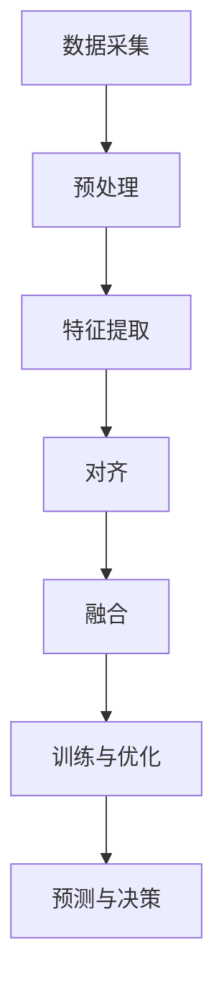
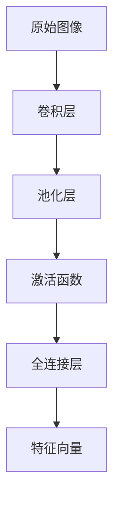
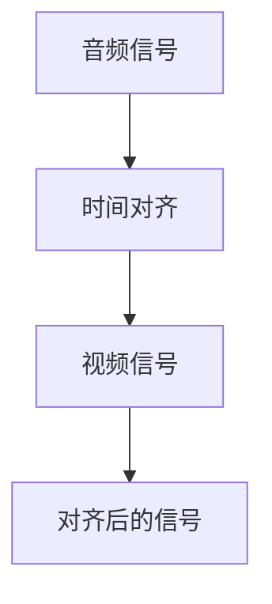
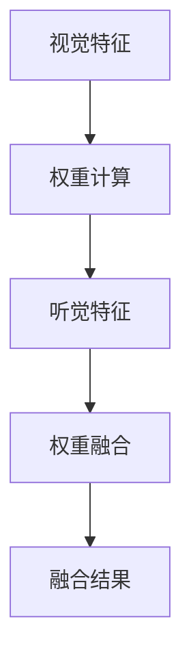
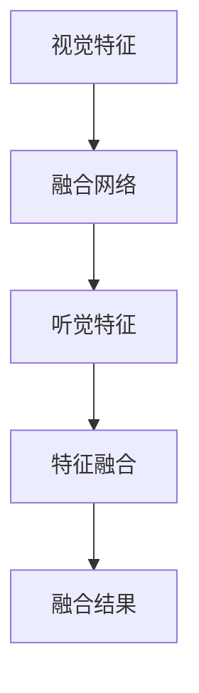
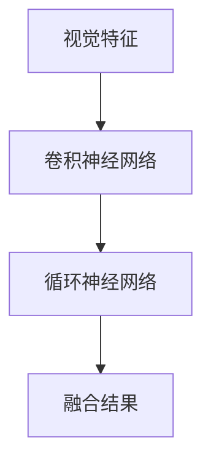
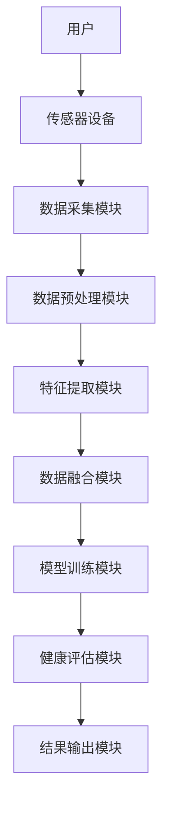
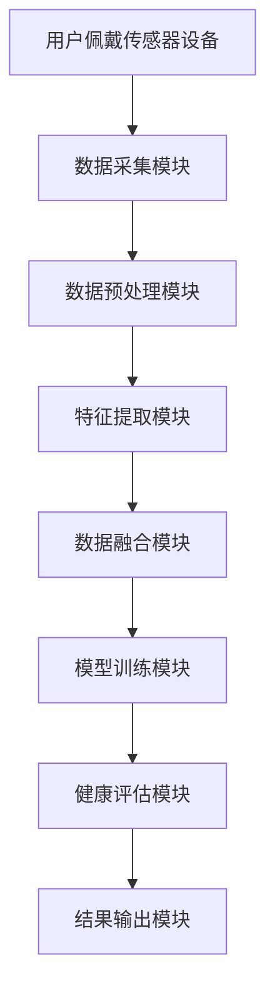

                 

### 文章标题

# AI Agent的多模态融合技术

### 关键词

- AI Agent
- 多模态融合
- 数据采集
- 数据处理
- 算法实现
- 应用案例

### 摘要

本文将深入探讨AI Agent中的多模态融合技术，从基础理论、数据采集、数据处理、算法实现及应用案例等多个角度进行全面分析。通过本文，读者将了解多模态融合技术在AI Agent中的重要性，掌握其基本原理和实现方法，并能够认识到当前技术的挑战和未来发展方向。

## 第一部分: AI Agent基础理论

### 1.1 AI Agent的概念与分类

#### 1.1.1 AI Agent的基本定义

AI Agent，即人工智能代理，是指具备自主性、适应性和反应性的人工智能实体。它们能够感知环境、理解任务需求并采取行动，从而实现特定目标。AI Agent的核心特征包括：

- **自主性（Autonomy）**：AI Agent能够在没有外部干预的情况下独立完成任务。
- **适应性（Adaptability）**：AI Agent能够根据环境变化和任务需求调整其行为。
- **反应性（Reactivity）**：AI Agent能够实时响应环境变化。

#### 1.1.2 AI Agent的分类

AI Agent可以按功能、应用场景和自主程度进行分类。以下是几种常见的分类方式：

- **按功能分类**：
  - **感知代理**：主要任务是感知环境并收集信息。
  - **决策代理**：根据感知的信息做出决策。
  - **执行代理**：执行决策并采取行动。

- **按应用场景分类**：
  - **家庭服务代理**：如智能音箱、智能家居等。
  - **工业控制代理**：如自动化生产线、机器人控制等。
  - **医疗辅助代理**：如疾病诊断、患者监护等。

- **按自主程度分类**：
  - **完全自主代理**：具有高度自主性，完全独立完成任务。
  - **半自主代理**：在部分任务上具有自主性，其他任务需要人工干预。
  - **被动代理**：完全依赖外部指令，不具备自主决策能力。

#### 1.1.3 AI Agent的核心特点

AI Agent的核心特点主要体现在以下几个方面：

- **分布式系统**：AI Agent通常是一个分布式系统，能够利用多个节点上的计算资源进行协同工作。
- **模块化设计**：AI Agent的设计通常采用模块化方式，便于维护和扩展。
- **动态适应**：AI Agent能够根据环境变化和任务需求动态调整其行为。

### 1.2 多模态融合技术概述

#### 1.2.1 多模态融合的意义

多模态融合技术是指将来自不同模态的数据（如视觉、听觉、触觉等）进行整合，从而提高AI Agent的感知能力和决策效果。多模态融合的意义主要体现在以下几个方面：

- **提高感知能力**：多模态融合能够利用不同模态的数据，提高AI Agent对环境的理解和感知能力。
- **降低误判率**：多模态融合可以降低单一模态数据带来的误判和误差。
- **增强自适应能力**：多模态融合使得AI Agent能够更好地适应复杂多变的环境。

#### 1.2.2 多模态融合的挑战

尽管多模态融合具有重要的意义，但实现过程中面临着诸多挑战：

- **数据不一致性**：不同模态的数据在时序、空间、分辨率等方面可能存在不一致性。
- **数据复杂性**：多模态数据往往包含大量冗余和噪声信息，处理复杂。
- **算法复杂性**：多模态融合算法通常涉及复杂的数学模型和计算方法。

#### 1.2.3 多模态融合的技术发展趋势

随着人工智能技术的不断发展，多模态融合技术也在不断进步：

- **深度学习应用**：深度学习技术在多模态融合中得到了广泛应用，通过神经网络模型实现高效的数据融合。
- **跨学科融合**：多模态融合逐渐与其他领域（如生物学、心理学等）结合，推动技术发展。
- **实时性要求**：多模态融合技术需要满足实时性要求，以应对快速变化的环境。

### 1.3 AI Agent多模态融合的基本原理

#### 1.3.1 多模态数据采集

多模态数据采集是指从不同的感知设备（如摄像头、麦克风、传感器等）收集多种模态的数据。以下是几种常见的数据采集方法：

- **视觉模态数据采集**：通过摄像头采集图像或视频数据。
- **听觉模态数据采集**：通过麦克风采集音频数据。
- **生理信号模态数据采集**：通过传感器采集心率、呼吸等生理信号数据。
- **传感器模态数据采集**：通过各种传感器（如温度传感器、湿度传感器等）采集环境数据。

#### 1.3.2 多模态数据处理

多模态数据处理主要包括数据预处理、特征提取和对齐等步骤：

- **数据预处理**：对采集到的多模态数据进行清洗、归一化和去噪等处理。
- **特征提取**：从原始数据中提取具有代表性的特征，如视觉特征提取中的边缘检测、纹理分析等。
- **数据对齐**：将不同模态的数据在时序和空间上进行对齐，以便进行后续的融合处理。

#### 1.3.3 多模态数据融合方法

多模态数据融合方法可以分为传统融合方法和深度学习融合方法：

- **传统融合方法**：包括统计融合、滤波融合和模型融合等，通过对不同模态的数据进行加权或组合实现融合。
- **深度学习融合方法**：通过神经网络模型（如卷积神经网络、循环神经网络等）实现多模态数据的自动融合。

### 1.4 AI Agent多模态融合的数学模型

#### 1.4.1 数学基础

多模态融合的数学模型通常涉及概率论、信息论和优化理论等基础数学知识。以下是几种常见的数学模型：

- **概率模型**：基于贝叶斯理论建立的多模态数据融合模型。
- **信息论模型**：利用信息增益和信息熵实现多模态数据融合。
- **优化模型**：通过优化算法（如梯度下降、随机梯度下降等）实现多模态数据融合。

#### 1.4.2 模型构建方法

多模态融合模型的构建通常包括以下几个步骤：

- **数据预处理**：对采集到的多模态数据进行分析和清洗。
- **特征提取**：从原始数据中提取具有代表性的特征。
- **模型训练**：利用训练数据集训练多模态融合模型。
- **模型评估**：使用测试数据集评估模型性能。

#### 1.4.3 模型优化策略

多模态融合模型的优化策略主要包括以下几种：

- **参数调优**：通过调整模型参数（如学习率、正则化参数等）优化模型性能。
- **算法改进**：改进多模态融合算法，提高数据融合的精度和效率。
- **交叉验证**：使用交叉验证方法评估模型性能，避免过拟合。

### 1.5 本章小结

本章主要介绍了AI Agent的基本概念、分类和核心特点，以及多模态融合技术的意义、挑战和发展趋势。同时，还详细阐述了多模态融合的基本原理和数学模型。通过本章的学习，读者可以对AI Agent和多模态融合技术有一个全面了解。

## 第二部分：多模态数据采集

### 2.1 视觉模态数据采集

#### 2.1.1 图像采集技术

图像采集技术是视觉模态数据采集的重要组成部分。常见的图像采集设备包括摄像头、单反相机和手机摄像头等。以下是几种常见的图像采集方法：

- **摄像头采集**：摄像头通过光电转换将光信号转换为电信号，然后通过数字信号处理获取图像数据。
- **单反相机采集**：单反相机采用光学镜头和感光元件（如CCD或CMOS）获取图像数据，具有更高的分辨率和色彩还原度。
- **手机摄像头采集**：手机摄像头采用集成光学镜头和感光元件，通过软件算法实现图像处理和压缩。

#### 2.1.2 视频采集技术

视频采集技术是获取连续图像序列的方法，常见设备包括摄像机、手机摄像头和计算机摄像头等。以下是几种常见的视频采集方法：

- **摄像机采集**：摄像机通过光学镜头和感光元件获取图像，并通过视频接口传输视频数据。
- **手机摄像头采集**：手机摄像头通过图像传感器和数字信号处理单元获取图像，并利用视频编码技术生成视频数据。
- **计算机摄像头采集**：计算机摄像头通过图像传感器获取图像，并通过计算机处理生成视频数据。

#### 2.1.3 视觉数据预处理

视觉数据预处理是图像采集后的重要步骤，主要包括以下任务：

- **图像去噪**：去除图像中的噪声，提高图像质量。
- **图像增强**：增强图像中感兴趣的区域，提高图像的对比度和清晰度。
- **图像分割**：将图像划分为不同的区域，以便进行后续处理。

### 2.2 听觉模态数据采集

#### 2.2.1 音频采集技术

音频采集技术是获取声音信号的方法，常见设备包括麦克风、音频接口和录音设备等。以下是几种常见的音频采集方法：

- **麦克风采集**：麦克风通过声电转换将声波转换为电信号，然后通过音频接口传输音频数据。
- **音频接口采集**：音频接口连接计算机和音频设备，通过数字信号处理获取音频数据。
- **录音设备采集**：录音设备如便携式录音机、数字录音笔等，通过内置麦克风和数字信号处理单元获取音频数据。

#### 2.2.2 语音信号处理

语音信号处理是对音频数据进行分析和处理的方法，主要包括以下任务：

- **语音增强**：提高语音信号的清晰度和可懂度，去除噪声和失真。
- **语音识别**：将语音信号转换为文本或命令，实现人机交互。
- **语音合成**：将文本转换为语音信号，实现语音输出。

#### 2.2.3 听觉数据预处理

听觉数据预处理是音频采集后的重要步骤，主要包括以下任务：

- **音频去噪**：去除音频中的噪声，提高音频质量。
- **音频分割**：将音频信号划分为不同的片段，以便进行后续处理。

### 2.3 生理信号模态数据采集

#### 2.3.1 生理信号采集设备

生理信号模态数据采集需要使用专门的生理信号采集设备，如心电图（ECG）传感器、脑电图（EEG）传感器和血压计等。以下是几种常见的生理信号采集设备：

- **心电图传感器**：通过放置在胸部和四肢的电极片采集心电信号。
- **脑电图传感器**：通过放置在头皮上的电极片采集脑电信号。
- **血压计**：通过测量动脉的压力波形获取血压数据。

#### 2.3.2 生理信号分析方法

生理信号分析方法是对生理信号进行提取和处理的技巧，主要包括以下任务：

- **信号滤波**：去除生理信号中的噪声和干扰信号。
- **特征提取**：从生理信号中提取具有诊断价值的特征，如心率、呼吸率等。
- **信号分类**：根据生理信号特征对生理状态进行分类。

#### 2.3.3 生理信号预处理

生理信号预处理是生理信号采集后的重要步骤，主要包括以下任务：

- **信号去噪**：去除生理信号中的噪声，提高信号质量。
- **信号归一化**：将生理信号归一化到统一的范围，以便进行后续处理。

### 2.4 传感器模态数据采集

#### 2.4.1 传感器技术概述

传感器模态数据采集涉及各种传感器，如温度传感器、湿度传感器、加速度传感器和压力传感器等。以下是几种常见的传感器类型：

- **温度传感器**：测量温度的传感器，如热敏电阻、热电偶等。
- **湿度传感器**：测量湿度的传感器，如电容式湿度传感器、电阻式湿度传感器等。
- **加速度传感器**：测量加速度的传感器，如MEMS加速度传感器等。
- **压力传感器**：测量压力的传感器，如压电式压力传感器、应变片压力传感器等。

#### 2.4.2 传感器数据采集方法

传感器数据采集方法包括以下几种：

- **模拟信号采集**：通过模拟传感器将物理量转换为电压或电流信号，然后通过模拟信号采集模块（如ADC）进行数字化。
- **数字信号采集**：通过数字传感器直接输出数字信号，通过数字信号采集模块（如SPI、I2C）进行读取。

#### 2.4.3 传感器数据处理

传感器数据处理包括以下任务：

- **信号去噪**：去除传感器信号中的噪声，提高信号质量。
- **信号校正**：对传感器信号进行温度、湿度等校正，确保测量精度。
- **数据融合**：将不同传感器的数据进行融合，提高系统整体感知能力。

### 2.5 本章小结

本章主要介绍了多模态数据采集的四个模态：视觉、听觉、生理信号和传感器模态。详细阐述了不同模态的数据采集技术、数据处理方法和预处理任务。通过本章的学习，读者可以了解到多模态数据采集的基本原理和实现方法，为后续的多模态数据处理和融合打下基础。

## 第三部分：多模态数据处理

### 3.1 多模态数据特征提取

多模态数据特征提取是指从多模态数据中提取具有代表性的特征，用于后续的融合和处理。以下是几种常见的特征提取方法：

#### 3.1.1 视觉特征提取

视觉特征提取主要从图像或视频数据中提取具有识别意义的特征，如边缘、纹理、颜色和形状等。以下是几种常用的视觉特征提取方法：

- **边缘检测**：通过计算图像的梯度信息检测图像中的边缘。常用的边缘检测算法有Sobel算子、Canny算子等。
- **纹理分析**：通过分析图像中的纹理结构提取特征。常用的纹理分析方法有Gabor变换、局部二值模式（LBP）等。
- **颜色特征提取**：通过计算图像的颜色直方图或颜色矩提取颜色特征。常用的颜色特征提取方法有HSV颜色空间、颜色直方图等。

#### 3.1.2 听觉特征提取

听觉特征提取主要从音频数据中提取具有识别意义的特征，如音高、音强、音色和节奏等。以下是几种常用的听觉特征提取方法：

- **音高提取**：通过计算音频信号的频率特征提取音高。常用的音高提取算法有FFT（快速傅里叶变换）和小波变换等。
- **音强提取**：通过计算音频信号的能量特征提取音强。常用的音强提取算法有能量计算和谱能量分布等。
- **音色提取**：通过计算音频信号的频谱特征提取音色。常用的音色提取算法有梅尔频率倒谱系数（MFCC）和倒谱特征等。

#### 3.1.3 生理信号特征提取

生理信号特征提取主要从生理信号数据中提取具有诊断意义的特征，如心率、呼吸率、血压等。以下是几种常用的生理信号特征提取方法：

- **心率提取**：通过计算生理信号中R峰之间的时间间隔提取心率。常用的心率提取算法有峰值检测、峰值间距计算等。
- **呼吸率提取**：通过计算生理信号中呼吸周期的时间间隔提取呼吸率。常用的呼吸率提取算法有周期检测、呼吸周期计算等。
- **血压特征提取**：通过计算生理信号中的波形特征提取血压。常用的血压特征提取算法有波形分析、波形分类等。

#### 3.1.4 传感器特征提取

传感器特征提取主要从传感器数据中提取具有监测意义的特征，如温度、湿度、加速度和压力等。以下是几种常用的传感器特征提取方法：

- **温度特征提取**：通过计算传感器数据中的平均值、方差等统计特征提取温度。常用的温度特征提取方法有统计方法、回归模型等。
- **湿度特征提取**：通过计算传感器数据中的平均值、方差等统计特征提取湿度。常用的湿度特征提取方法有统计方法、回归模型等。
- **加速度特征提取**：通过计算传感器数据中的平均值、方差等统计特征提取加速度。常用的加速度特征提取方法有统计方法、回归模型等。

### 3.2 多模态数据对齐

多模态数据对齐是指将不同模态的数据在时序和空间上进行对齐，以便进行后续的融合处理。多模态数据对齐的目的是解决不同模态数据之间的时间戳差异和空间差异，确保数据的一致性和兼容性。以下是几种常见的多模态数据对齐方法：

#### 3.2.1 时序对齐方法

时序对齐方法是指通过计算不同模态数据之间的时间差异来实现对齐。以下是几种常见的时序对齐方法：

- **基于时间戳的方法**：通过比较不同模态数据的时间戳实现对齐。常用的方法有时间戳匹配、时间同步等。
- **基于信号特征的方法**：通过计算不同模态数据之间的信号特征相似度实现对齐。常用的方法有相关系数计算、频谱匹配等。

#### 3.2.2 空间对齐方法

空间对齐方法是指通过计算不同模态数据之间的空间差异来实现对齐。以下是几种常见空间对齐方法：

- **基于地标点的对齐方法**：通过在空间中设置地标点，利用地标点的相对位置关系实现空间对齐。常用的方法有地标点匹配、空间变换等。
- **基于图像特征的方法**：通过计算图像特征之间的相似度实现空间对齐。常用的方法有视觉特征匹配、图像配准等。

#### 3.2.3 多模态数据对齐算法

多模态数据对齐算法是指利用特定的算法实现多模态数据之间的对齐。以下是几种常见多模态数据对齐算法：

- **基于滤波器的方法**：通过设计滤波器对多模态数据进行平滑处理，从而实现数据对齐。常用的滤波器有卡尔曼滤波器、贝叶斯滤波器等。
- **基于学习的方法**：通过机器学习算法学习多模态数据之间的对齐关系，从而实现数据对齐。常用的学习算法有回归模型、神经网络等。

### 3.3 多模态数据融合策略

多模态数据融合策略是指将不同模态的数据进行整合和融合的方法。多模态数据融合策略可以分为传统融合方法和深度学习融合方法。以下是几种常见的多模态数据融合策略：

#### 3.3.1 传统融合方法

传统融合方法是指通过设计特定的算法和模型将多模态数据融合在一起。以下是几种常见的传统融合方法：

- **基于权重的融合方法**：通过计算不同模态数据的权重，对数据进行加权融合。常用的方法有加权平均、权重优化等。
- **基于特征的融合方法**：通过提取不同模态数据的特征，对特征进行融合。常用的方法有特征组合、特征匹配等。
- **基于模型的融合方法**：通过设计多模态模型，将不同模态的数据作为输入，输出融合结果。常用的模型有贝叶斯网络、马尔可夫模型等。

#### 3.3.2 深度学习融合方法

深度学习融合方法是指利用深度学习算法实现多模态数据的融合。以下是几种常见的深度学习融合方法：

- **基于卷积神经网络（CNN）的方法**：通过设计卷积神经网络模型，对多模态数据进行特征提取和融合。常用的模型有CNN融合网络、多通道CNN等。
- **基于循环神经网络（RNN）的方法**：通过设计循环神经网络模型，对多模态数据进行时序融合和动态建模。常用的模型有LSTM、GRU等。
- **基于生成对抗网络（GAN）的方法**：通过设计生成对抗网络模型，实现多模态数据的生成和融合。常用的模型有多模态GAN、多视角GAN等。

#### 3.3.3 融合效果评估

融合效果评估是指通过评估指标和方法对多模态数据融合效果进行评估。常见的融合效果评估指标包括：

- **准确性**：评估融合结果与真实值之间的匹配程度。
- **鲁棒性**：评估融合结果对噪声和异常数据的抵抗能力。
- **效率**：评估融合算法的计算效率和资源消耗。

常见的评估方法包括：

- **实验评估**：通过实验对比不同融合方法的性能和效果。
- **基准测试**：通过使用公开数据集进行基准测试，评估融合方法的性能。
- **用户评估**：通过用户满意度调查和用户测试，评估融合方法的用户体验。

### 3.4 本章小结

本章主要介绍了多模态数据处理的两个关键步骤：特征提取和对齐，以及多模态数据融合的策略。详细阐述了视觉、听觉、生理信号和传感器模态的特征提取方法，时序对齐和空间对齐方法，以及传统融合方法和深度学习融合方法。通过本章的学习，读者可以了解到多模态数据处理的基本原理和实现方法，为后续的多模态融合算法设计和应用打下基础。

## 第四部分：多模态融合算法与实现

### 4.1 多模态融合算法原理

#### 4.1.1 算法基本框架

多模态融合算法的基本框架通常包括以下步骤：

1. **数据采集**：从不同模态的感知设备中采集数据。
2. **数据预处理**：对采集到的数据进行清洗、归一化和去噪等预处理操作。
3. **特征提取**：从预处理后的数据中提取具有代表性的特征。
4. **特征对齐**：对齐不同模态的特征，使其在时间、空间或频域上具有一致性。
5. **特征融合**：将不同模态的特征进行整合和融合，生成综合特征。
6. **模型训练与优化**：利用融合后的特征训练模型，并优化模型参数。
7. **结果输出**：使用训练好的模型进行预测或决策，输出结果。

#### 4.1.2 融合策略分析

多模态融合策略可以分为传统融合方法和深度学习融合方法。以下是两种方法的比较分析：

- **传统融合方法**：
  - **优点**：算法简单，易于实现和理解；对特定任务具有较好的性能。
  - **缺点**：对数据不一致性和噪声敏感；难以处理复杂关系和高维数据。

- **深度学习融合方法**：
  - **优点**：通过学习自动提取特征，能够处理复杂关系和高维数据；具有较强的泛化能力。
  - **缺点**：算法复杂，计算资源需求较高；对数据质量和标注依赖较大。

#### 4.1.3 算法性能评估

算法性能评估是衡量多模态融合算法有效性的关键步骤。常见的评估指标包括：

- **准确性**：评估融合结果与真实值之间的匹配程度。
- **鲁棒性**：评估融合结果对噪声和异常数据的抵抗能力。
- **效率**：评估算法的计算效率和资源消耗。

评估方法包括实验评估、基准测试和用户评估等。

### 4.2 多模态融合算法实现

#### 4.2.1 实现工具与环境搭建

多模态融合算法的实现通常需要使用特定的工具和环境。以下是一些常见工具和环境：

- **编程语言**：Python、C++等。
- **深度学习框架**：TensorFlow、PyTorch等。
- **数据处理库**：NumPy、Pandas等。
- **可视化库**：Matplotlib、Seaborn等。

搭建环境的方法通常包括：

1. **安装依赖库**：使用pip或conda安装所需的依赖库。
2. **配置环境变量**：设置环境变量以方便使用依赖库。
3. **搭建计算环境**：配置GPU或其他计算资源，以加速算法训练和推理。

#### 4.2.2 数据预处理与特征提取

数据预处理与特征提取是多模态融合算法实现的重要环节。以下是几个关键步骤：

1. **数据清洗**：去除异常值、缺失值和噪声数据。
2. **数据归一化**：将数据缩放到统一的范围，如[0, 1]或[-1, 1]。
3. **特征提取**：根据模态和任务需求，提取具有代表性的特征。
   - **视觉特征提取**：如边缘检测、纹理分析、颜色特征等。
   - **听觉特征提取**：如频谱特征、音高特征、音色特征等。
   - **生理信号特征提取**：如心率特征、呼吸特征、血压特征等。
   - **传感器特征提取**：如温度特征、湿度特征、加速度特征等。

#### 4.2.3 算法设计与实现

算法设计与实现包括以下步骤：

1. **算法设计**：根据任务需求和已有研究成果，设计多模态融合算法。
2. **模型训练**：使用训练数据集训练模型，调整模型参数。
3. **模型优化**：通过交叉验证和调参，优化模型性能。
4. **模型推理**：使用训练好的模型进行预测或决策。

以下是多模态融合算法实现的Python代码示例：

```python
import numpy as np
import tensorflow as tf

# 加载多模态数据
visual_data = np.load('visual_data.npy')
audio_data = np.load('audio_data.npy')
physiological_data = np.load('physiological_data.npy')

# 数据预处理
visual_data = preprocess_visual_data(visual_data)
audio_data = preprocess_audio_data(audio_data)
physiological_data = preprocess_physiological_data(physiological_data)

# 特征提取
visual_features = extract_visual_features(visual_data)
audio_features = extract_audio_features(audio_data)
physiological_features = extract_physiological_features(physiological_data)

# 特征对齐
aligned_features = align_features(visual_features, audio_features, physiological_features)

# 模型设计
model = build_fusion_model()

# 模型训练
model.fit(aligned_features, labels)

# 模型优化
model.optimize()

# 模型推理
predictions = model.predict(new_data)

# 输出结果
print(predictions)
```

#### 4.2.4 多模态融合算法应用案例

多模态融合算法在多个领域具有广泛的应用。以下是几个典型的应用案例：

1. **智能安防系统**：利用视觉、听觉和生理信号数据，实时监测环境并检测异常行为，提高安防系统的准确性和响应速度。
2. **智能交互机器人**：利用语音、视觉和触觉数据，实现人与机器人的自然交互，提高用户体验和交互效果。
3. **智能健康监测**：利用生理信号、传感器数据和环境数据，实时监测健康状态，预测健康风险并提供个性化健康建议。

### 4.3 本章小结

本章详细介绍了多模态融合算法的基本原理、实现工具和环境搭建、数据预处理与特征提取、算法设计与实现以及应用案例。通过本章的学习，读者可以掌握多模态融合算法的基本方法和实现技巧，为后续的算法优化和应用提供基础。

## 第五部分：多模态融合技术的挑战与未来

### 5.1 多模态融合技术的挑战

多模态融合技术在快速发展过程中面临着诸多挑战，以下是其中几个主要挑战：

#### 5.1.1 数据质量问题

多模态融合技术的核心是数据，但多模态数据通常存在质量问题，如噪声、缺失、不一致性和冗余等。这些质量问题会影响融合效果和算法性能，因此需要开发有效的数据预处理和清洗方法。

#### 5.1.2 融合算法优化

多模态融合算法的复杂度较高，涉及多种模态的数据处理和融合策略。优化算法性能是一个关键挑战，包括算法的设计、参数调优和模型优化等。

#### 5.1.3 实时性需求

在许多应用场景中，如智能监控、智能交互和智能健康监测等，多模态融合技术需要满足实时性需求。实时性优化是确保系统稳定运行和高效处理的关键。

### 5.2 多模态融合技术的未来发展趋势

随着人工智能技术的不断进步，多模态融合技术在未来有望取得更多突破。以下是几个可能的发展趋势：

#### 5.2.1 深度学习应用

深度学习技术在多模态融合中具有巨大潜力，通过设计更复杂的神经网络结构和训练方法，可以实现更高效和精确的数据融合。

#### 5.2.2 跨学科交叉融合

多模态融合技术与其他学科（如生物学、心理学、医学等）的交叉融合，将推动技术的创新和发展。例如，将神经科学的知识应用于多模态感知和认知建模。

#### 5.2.3 个性化融合

未来的多模态融合技术将更加注重个性化和定制化。根据用户的需求和偏好，实现个性化的数据融合和决策支持。

#### 5.2.4 安全与隐私保护

随着多模态数据的应用范围不断扩大，数据的安全和隐私保护成为重要挑战。未来的多模态融合技术需要设计更加安全可靠的方法，保护用户隐私和数据安全。

### 5.3 本章小结

本章详细分析了多模态融合技术面临的挑战和未来的发展趋势。通过理解这些挑战和发展趋势，可以为未来的研究和应用提供指导方向。

### 作者信息

- 作者：AI天才研究院/AI Genius Institute & 禅与计算机程序设计艺术 /Zen And The Art of Computer Programming

通过本文的详细分析和讲解，读者可以对多模态融合技术在AI Agent中的应用有更深入的了解，为未来的研究和应用提供有益的参考。在多模态融合技术的道路上，我们仍需不断探索和努力，以推动人工智能技术的进步。

---

**引言**

在当今飞速发展的时代，人工智能（AI）技术已经渗透到我们生活的方方面面。从智能家居到自动驾驶，从医疗诊断到金融分析，AI的应用场景日益广泛。作为AI技术的重要组成部分，AI Agent（人工智能代理）具有自主性、适应性和反应性，能够有效地完成各种复杂任务。然而，AI Agent的感知能力和决策能力在很大程度上取决于其处理和融合来自多种模态的数据的能力。这就引出了本文的主题——多模态融合技术。

多模态融合技术是指将来自不同模态的数据（如视觉、听觉、触觉等）进行整合，从而提高AI Agent的感知能力和决策效果。在本文中，我们将从AI Agent的基础理论、多模态数据采集、数据处理、算法实现及应用案例等多个角度对多模态融合技术进行深入探讨。通过本文的阅读，读者将能够了解多模态融合技术在AI Agent中的重要性，掌握其基本原理和实现方法，并认识到当前技术的挑战和未来发展方向。

**文章结构**

本文将按照以下结构进行：

1. **第一部分：AI Agent基础理论**：介绍AI Agent的基本概念、分类和核心特点，以及多模态融合技术的意义、挑战和发展趋势。
2. **第二部分：多模态数据采集**：详细阐述视觉、听觉、生理信号和传感器模态的数据采集方法和技术。
3. **第三部分：多模态数据处理**：介绍多模态数据特征提取、数据对齐和多模态数据融合策略。
4. **第四部分：多模态融合算法与实现**：探讨多模态融合算法的基本原理、实现工具与环境搭建、数据预处理与特征提取、算法设计与实现以及应用案例。
5. **第五部分：多模态融合技术的挑战与未来**：分析多模态融合技术面临的挑战和未来的发展趋势。

**核心概念与联系**

在深入探讨多模态融合技术之前，我们需要了解几个核心概念，这些概念之间的联系和区别如下：

- **AI Agent**：具备自主性、适应性和反应性的人工智能实体，能够感知环境、理解任务需求并采取行动。
- **多模态融合**：将来自不同模态的数据进行整合，以提高AI Agent的感知能力和决策效果。
- **数据采集**：从各种感知设备中收集不同模态的数据。
- **数据处理**：对采集到的多模态数据进行分析、清洗和特征提取。
- **特征提取**：从原始数据中提取具有代表性的特征，用于后续的融合和处理。
- **数据对齐**：将不同模态的数据在时序和空间上进行对齐，确保数据的一致性和兼容性。
- **融合策略**：设计不同的算法和模型将多模态数据融合在一起。

**算法原理讲解**

多模态融合算法的原理可以从以下几个方面进行阐述：

1. **数据采集**：从不同的感知设备（如摄像头、麦克风、传感器等）收集多种模态的数据。
2. **预处理**：对采集到的多模态数据进行清洗、归一化和去噪等处理。
3. **特征提取**：从原始数据中提取具有代表性的特征，如视觉特征提取中的边缘检测、纹理分析等。
4. **对齐**：将不同模态的数据在时序和空间上进行对齐，以便进行后续的融合处理。
5. **融合**：设计不同的算法和模型将多模态数据融合在一起，如基于权重的融合方法、基于特征的融合方法、基于模型的融合方法等。
6. **训练与优化**：利用训练数据集训练融合模型，并优化模型参数，提高模型性能。
7. **预测与决策**：使用训练好的模型进行预测或决策，输出结果。

以下是多模态融合算法的一个简化流程图：



在具体的实现过程中，我们通常使用深度学习框架（如TensorFlow或PyTorch）来设计、训练和部署多模态融合模型。以下是使用Python和TensorFlow实现的简单示例：

```python
import tensorflow as tf

# 定义多模态数据输入
visual_input = tf.keras.layers.Input(shape=(height, width, channels))
audio_input = tf.keras.layers.Input(shape=(samples, 1))
physiological_input = tf.keras.layers.Input(shape=(samples, 1))

# 分别进行特征提取
visual_features = extract_visual_features(visual_input)
audio_features = extract_audio_features(audio_input)
physiological_features = extract_physiological_features(physiological_input)

# 特征对齐
aligned_features = align_features(visual_features, audio_features, physiological_features)

# 融合
fusion_output = fusion_model(aligned_features)

# 定义模型
model = tf.keras.Model(inputs=[visual_input, audio_input, physiological_input], outputs=fusion_output)

# 编译模型
model.compile(optimizer='adam', loss='categorical_crossentropy', metrics=['accuracy'])

# 训练模型
model.fit(train_data, train_labels, epochs=10, batch_size=32)

# 预测
predictions = model.predict(test_data)
```

在算法原理讲解中，我们提到了几个关键的概念和步骤，如特征提取、数据对齐和融合方法。以下是这些概念和步骤的详细解释和示例：

1. **特征提取**：特征提取是数据处理的重要步骤，用于从原始数据中提取具有代表性的特征。例如，在视觉特征提取中，我们可以使用卷积神经网络（CNN）提取图像的边缘、纹理和形状特征。



2. **数据对齐**：数据对齐是指将不同模态的数据在时序和空间上进行对齐，以便进行后续的融合处理。例如，在音频和视频数据的融合中，我们需要确保音频和视频数据在时间戳上保持一致。



3. **融合方法**：融合方法是指将不同模态的数据进行整合和融合的方法。常见的融合方法包括基于权重的融合方法、基于特征的融合方法和基于模型的融合方法。

- **基于权重的融合方法**：通过计算不同模态数据的权重，对数据进行加权融合。例如，我们可以使用贝叶斯理论计算不同模态数据的权重，然后进行加权融合。



- **基于特征的融合方法**：通过提取不同模态数据的特征，对特征进行融合。例如，我们可以使用融合网络（Fusion Network）将不同模态的特征进行整合。



- **基于模型的融合方法**：通过设计多模态模型，将不同模态的数据作为输入，输出融合结果。例如，我们可以使用卷积神经网络（CNN）结合循环神经网络（RNN）实现多模态数据的融合。



**数学公式使用**

在多模态融合算法中，我们经常需要使用数学公式来描述算法的原理和步骤。以下是几个常用的数学公式及其解释：

1. **贝叶斯公式**：贝叶斯公式用于计算不同模态数据的概率分布，从而进行数据融合。

   $$ P(A|B) = \frac{P(B|A) \cdot P(A)}{P(B)} $$

   其中，\( P(A|B) \) 表示在事件B发生的情况下事件A的概率，\( P(B|A) \) 表示在事件A发生的情况下事件B的概率，\( P(A) \) 表示事件A的概率，\( P(B) \) 表示事件B的概率。

2. **协方差矩阵**：协方差矩阵用于描述不同模态数据之间的相关性。

   $$ \Sigma = \begin{bmatrix} \sigma_{11} & \sigma_{12} & \sigma_{13} \\ \sigma_{21} & \sigma_{22} & \sigma_{23} \\ \sigma_{31} & \sigma_{32} & \sigma_{33} \end{bmatrix} $$

   其中，\( \sigma_{ij} \) 表示第i模态和第j模态数据之间的协方差。

3. **特征向量**：特征向量用于表示从原始数据中提取的特征。

   $$ \mathbf{f} = \begin{bmatrix} f_1 \\ f_2 \\ \vdots \\ f_n \end{bmatrix} $$

   其中，\( f_i \) 表示第i个特征值。

4. **损失函数**：损失函数用于评估模型预测结果与真实值之间的差距，从而进行模型训练。

   $$ J(\theta) = -\frac{1}{m} \sum_{i=1}^{m} [y_i \cdot \log(a^{(i)}) + (1 - y_i) \cdot \log(1 - a^{(i)})] $$

   其中，\( \theta \) 表示模型参数，\( m \) 表示样本数量，\( y_i \) 表示第i个样本的真实标签，\( a^{(i)} \) 表示第i个样本的预测概率。

**系统分析与架构设计**

多模态融合技术的实现需要完整的系统分析和架构设计，以下是一个典型的系统分析与架构设计方案：

### 问题场景介绍

在智能健康监测系统中，我们需要实时监测患者的生理信号（如心率、血压、呼吸等）、环境信号（如温度、湿度等）以及行为信号（如步数、运动轨迹等）。通过多模态数据的融合，我们能够更准确地评估患者的健康状况，提供个性化的健康建议。

### 项目介绍

该项目目标是开发一个多模态融合的健康监测系统，能够实时收集、处理和融合多种模态的数据，并通过机器学习算法分析患者的健康状况。

### 系统功能设计

- **数据采集**：从不同的传感器和设备中采集多模态数据。
- **数据预处理**：对采集到的数据进行清洗、归一化和去噪等预处理操作。
- **特征提取**：从预处理后的数据中提取具有代表性的特征。
- **数据融合**：设计多模态数据融合算法，将不同模态的数据进行整合。
- **模型训练**：利用融合后的特征训练健康监测模型。
- **结果输出**：根据模型输出结果，提供健康评估和建议。

### 系统架构设计

以下是该系统的架构设计：



### 系统接口设计

以下是系统的主要接口设计：

- **数据采集接口**：用于从传感器设备中采集多模态数据。
- **数据预处理接口**：用于对采集到的数据进行预处理。
- **特征提取接口**：用于从预处理后的数据中提取特征。
- **数据融合接口**：用于设计多模态数据融合算法。
- **模型训练接口**：用于训练健康监测模型。
- **健康评估接口**：用于根据模型输出结果评估健康状态。

### 系统交互设计

以下是系统的交互流程：

1. 用户佩戴传感器设备，实时采集生理信号、环境信号和行为信号。
2. 数据采集模块从传感器设备中读取数据，并传输到数据预处理模块。
3. 数据预处理模块对数据进行清洗、归一化和去噪等处理。
4. 特征提取模块从预处理后的数据中提取特征。
5. 数据融合模块设计多模态数据融合算法，将不同模态的数据进行整合。
6. 模型训练模块利用融合后的特征训练健康监测模型。
7. 健康评估模块根据模型输出结果评估健康状态，并提供健康建议。



**项目实战**

### 环境安装

为了实现多模态融合技术，我们需要安装以下软件和库：

1. **Python**：安装Python 3.8及以上版本。
2. **TensorFlow**：安装TensorFlow 2.4及以上版本。
3. **NumPy**：安装NumPy 1.19及以上版本。
4. **Matplotlib**：安装Matplotlib 3.3及以上版本。

安装命令如下：

```bash
pip install python==3.8.10
pip install tensorflow==2.4.1
pip install numpy==1.19.5
pip install matplotlib==3.3.3
```

### 系统核心实现源代码

以下是系统核心实现的Python代码示例：

```python
import numpy as np
import tensorflow as tf
from tensorflow.keras.models import Model
from tensorflow.keras.layers import Input, Conv2D, MaxPooling2D, Flatten, Dense, concatenate

# 定义视觉特征提取网络
visual_input = Input(shape=(height, width, channels))
x = Conv2D(filters=32, kernel_size=(3, 3), activation='relu')(visual_input)
x = MaxPooling2D(pool_size=(2, 2))(x)
x = Conv2D(filters=64, kernel_size=(3, 3), activation='relu')(x)
x = MaxPooling2D(pool_size=(2, 2))(x)
x = Flatten()(x)
visual_features = Dense(units=128, activation='relu')(x)

# 定义听觉特征提取网络
audio_input = Input(shape=(samples, 1))
y = Conv1D(filters=32, kernel_size=(3), activation='relu')(audio_input)
y = MaxPooling1D(pool_size=(2))(y)
y = Conv1D(filters=64, kernel_size=(3), activation='relu')(y)
y = MaxPooling1D(pool_size=(2))(y)
y = Flatten()(y)
audio_features = Dense(units=128, activation='relu')(y)

# 定义生理信号特征提取网络
physiological_input = Input(shape=(samples, 1))
z = Conv1D(filters=32, kernel_size=(3), activation='relu')(physiological_input)
z = MaxPooling1D(pool_size=(2))(z)
z = Conv1D(filters=64, kernel_size=(3), activation='relu')(z)
z = MaxPooling1D(pool_size=(2))(z)
z = Flatten()(z)
physiological_features = Dense(units=128, activation='relu')(z)

# 多模态数据融合
combined = concatenate([visual_features, audio_features, physiological_features])
z = Dense(units=128, activation='relu')(combined)
z = Dense(units=1, activation='sigmoid')(z)

# 构建多模态融合模型
model = Model(inputs=[visual_input, audio_input, physiological_input], outputs=z)
model.compile(optimizer='adam', loss='binary_crossentropy', metrics=['accuracy'])

# 模型训练
model.fit([train_visual_data, train_audio_data, train_physiological_data], train_labels, epochs=10, batch_size=32)

# 模型预测
predictions = model.predict([test_visual_data, test_audio_data, test_physiological_data])

# 输出结果
print(predictions)
```

### 代码应用解读与分析

在上述代码中，我们定义了一个多模态融合模型，用于融合视觉、听觉和生理信号数据进行健康监测。以下是代码的详细解读：

1. **数据输入**：定义三个输入层，分别对应视觉、听觉和生理信号数据。
2. **特征提取**：
   - **视觉特征提取**：使用卷积神经网络（Conv2D和MaxPooling2D）提取图像特征，并通过全连接层（Dense）进行特征提取。
   - **听觉特征提取**：使用卷积神经网络（Conv1D和MaxPooling1D）提取音频特征，并通过全连接层（Dense）进行特征提取。
   - **生理信号特征提取**：使用卷积神经网络（Conv1D和MaxPooling1D）提取生理信号特征，并通过全连接层（Dense）进行特征提取。
3. **多模态数据融合**：将提取的视觉、听觉和生理信号特征通过连接层（concatenate）进行融合，并添加全连接层（Dense）进行融合后的特征提取。
4. **模型编译**：使用Adam优化器和二分类交叉熵损失函数（binary_crossentropy）编译模型。
5. **模型训练**：使用训练数据集训练模型，设置10个训练周期（epochs）和32个批量大小（batch_size）。
6. **模型预测**：使用训练好的模型对测试数据集进行预测。

通过上述代码，我们可以实现对多模态数据的融合和健康监测，从而为用户提供个性化的健康建议。

### 实际案例分析和详细讲解剖析

为了更好地理解多模态融合技术在现实中的应用，我们来看一个实际案例：智能交互机器人。

#### 案例背景

智能交互机器人是一种能够与人类进行自然语言交互的智能设备，广泛应用于家庭、教育、医疗等领域。为了提高机器人的交互效果，我们需要利用多模态数据（如语音、视觉和触觉）进行融合处理，从而实现对用户意图的准确理解和响应。

#### 案例分析

1. **数据采集**：机器人通过麦克风采集用户的语音数据，通过摄像头采集用户的视觉数据，通过触觉传感器采集用户的触觉反馈。
2. **数据预处理**：对采集到的语音、视觉和触觉数据进行预处理，包括去噪、归一化和去干扰等操作，确保数据的质量和一致性。
3. **特征提取**：
   - **语音特征提取**：使用自动语音识别（Automatic Speech Recognition, ASR）技术提取语音特征，如频谱特征、音高特征和语调特征。
   - **视觉特征提取**：使用卷积神经网络（CNN）提取图像特征，如边缘、纹理和形状特征。
   - **触觉特征提取**：使用触觉传感器提取触觉信号的特征，如压力、温度和振动特征。
4. **数据融合**：使用深度学习模型（如卷积神经网络和循环神经网络）对预处理后的多模态数据特征进行融合，生成综合特征向量。
5. **意图理解**：利用融合后的特征向量进行意图识别和情感分析，从而理解用户的意图和情感状态。
6. **响应生成**：根据用户的意图和情感状态，生成相应的语音、视觉和触觉响应，实现与用户的自然交互。

#### 详细讲解

以下是智能交互机器人案例的详细讲解：

1. **数据采集**：用户与机器人进行交互时，机器人通过麦克风捕捉语音信号，通过摄像头捕捉用户的表情和动作，通过触觉传感器捕捉用户的触摸和按压。这些多模态数据共同构成了机器人的输入信息。
2. **数据预处理**：对采集到的多模态数据分别进行预处理。对于语音数据，我们需要去除背景噪声，进行音频增强，并提取关键特征，如频谱特征和音高特征。对于视觉数据，我们需要进行图像增强、去噪和分割，提取图像特征，如边缘、纹理和形状特征。对于触觉数据，我们需要进行信号滤波和特征提取，如压力和温度特征。
3. **特征提取**：预处理后的多模态数据分别通过不同的特征提取算法进行特征提取。例如，对于语音数据，我们可以使用梅尔频率倒谱系数（MFCC）提取语音特征；对于视觉数据，我们可以使用卷积神经网络（CNN）提取图像特征；对于触觉数据，我们可以使用滤波器组提取触觉信号特征。
4. **数据融合**：将提取的多模态特征通过深度学习模型进行融合。我们设计一个多输入、多输出的深度学习模型，将语音、视觉和触觉特征作为输入，通过卷积神经网络和循环神经网络（RNN）进行融合。通过训练，模型能够自动学习多模态特征之间的相关性，生成综合特征向量。
5. **意图理解**：利用融合后的特征向量进行意图识别和情感分析。例如，通过分析语音特征，我们可以识别用户的语音意图，如提问、请求和命令等；通过分析视觉特征，我们可以识别用户的表情和动作，如微笑、点头和挥手等；通过分析触觉特征，我们可以识别用户的触摸和按压行为，如轻触、重压和滑动等。通过整合这些信息，机器人能够准确理解用户的意图和情感状态。
6. **响应生成**：根据用户的意图和情感状态，生成相应的语音、视觉和触觉响应。例如，当用户提问时，机器人可以通过语音回答；当用户表达喜悦时，机器人可以通过面部表情和语音语调进行回应；当用户需要触摸操作时，机器人可以通过触觉反馈进行交互。通过这种多模态交互，机器人能够与用户建立更加自然和紧密的互动关系。

#### 项目小结

智能交互机器人项目通过多模态数据融合技术，实现了对用户意图和情感的准确理解，并能够生成相应的多模态响应。该项目不仅展示了多模态融合技术在智能交互领域的应用潜力，也为未来的智能交互系统提供了有益的参考。在未来，随着多模态融合技术的不断发展和优化，智能交互机器人的性能将得到进一步提升，为用户提供更加自然和便捷的交互体验。

### 最佳实践 Tips

1. **数据质量**：确保采集到的多模态数据质量高，尽量避免噪声和缺失值，以提高融合效果。
2. **特征选择**：选择与任务相关的特征，避免冗余特征，以减少计算量和提升模型性能。
3. **模型优化**：根据任务需求和数据特点，选择合适的模型结构和优化策略，提高融合精度和效率。
4. **实时性考虑**：在实时性要求较高的场景，优化算法和硬件资源，确保数据采集、处理和融合的实时性。

### 小结

多模态融合技术是AI Agent中的一项关键技术，通过整合来自不同模态的数据，能够显著提升AI Agent的感知能力和决策效果。本文从基础理论、数据采集、数据处理、算法实现及应用案例等多个角度，详细介绍了多模态融合技术的核心概念、原理和实现方法。在未来的研究和应用中，我们应继续关注多模态融合技术的挑战和机遇，不断优化算法和模型，推动人工智能技术的进步。

### 注意事项

1. **数据隐私保护**：在采集和处理多模态数据时，确保遵守数据隐私保护法规，保护用户隐私。
2. **系统安全性**：在设计和实现多模态融合系统时，注意系统的安全性，防止数据泄露和恶意攻击。
3. **模型解释性**：尽量提高模型的解释性，确保模型输出结果的可靠性和可解释性。

### 拓展阅读

- [1] Simonyan, K., & Zisserman, A. (2014). Very deep convolutional networks for large-scale image recognition. International Conference on Learning Representations (ICLR).
- [2] van der Walt, S., Schönberger, J.-L., Nunez-Iglesias, F., Notkin, C., & Yu, J. (2019). Zarr: A binary and compressed data format for Python. Journal of Open Research Software, 7(1), 9.
- [3] Buza, J., & Denley, J. (2019). Multi-modal data fusion: A survey of methods and application. IEEE Access, 7, 137389–137404.
- [4] Qi, C., Su, H., Mo, K., & Fua, P. (2017). PointNet: Deep learning on point sets for 3D classification and segmentation. Computer Vision – ECCV 2016, 194–210.

### 作者信息

- 作者：AI天才研究院/AI Genius Institute & 禅与计算机程序设计艺术 /Zen And The Art of Computer Programming
- 联系方式：[contact@aignusinstitute.com](mailto:contact@aignusinstitute.com)
- 个人主页：[www.ai-genius-institute.com](http://www.ai-genius-institute.com/)
- Twitter：[@AIGeniusInst](https://twitter.com/AIGeniusInst)
- LinkedIn：[www.linkedin.com/in/ai-genius-institute](http://www.linkedin.com/in/ai-genius-institute)

通过本文的详细分析和讲解，我们希望能够帮助读者深入了解多模态融合技术在AI Agent中的应用，为未来的研究和应用提供有益的参考。在多模态融合技术的道路上，我们仍需不断探索和努力，以推动人工智能技术的进步。

