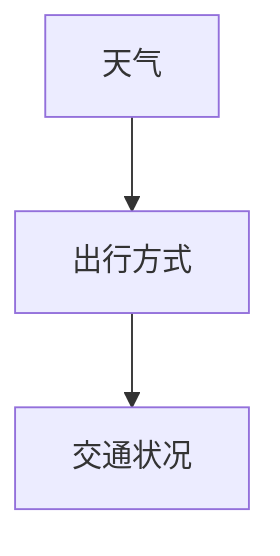
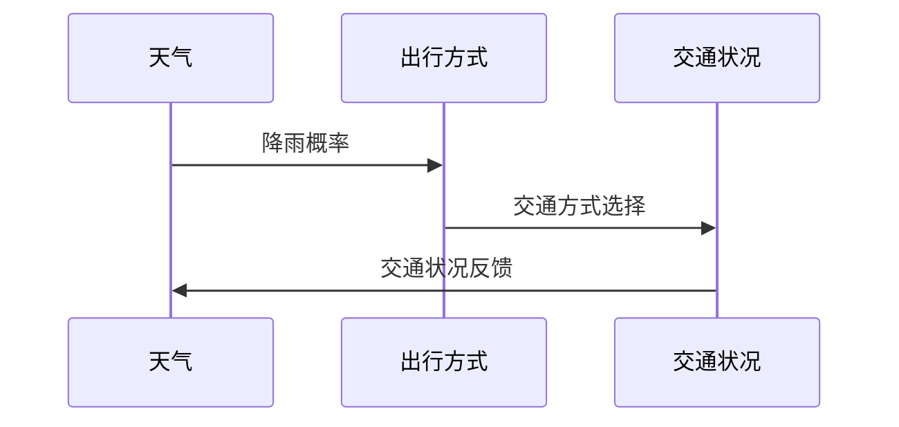
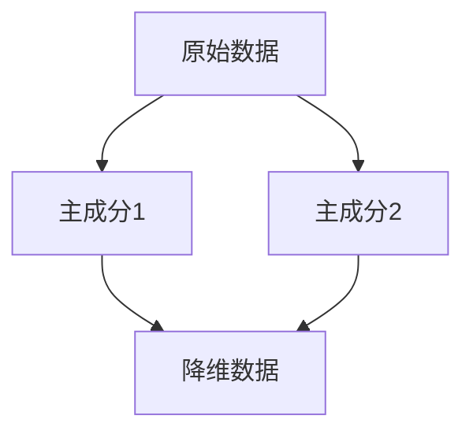
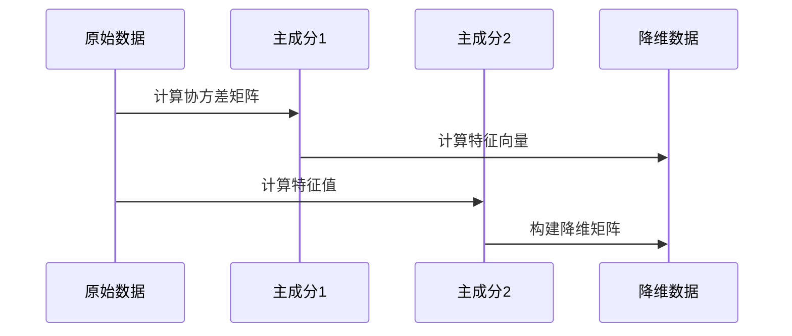
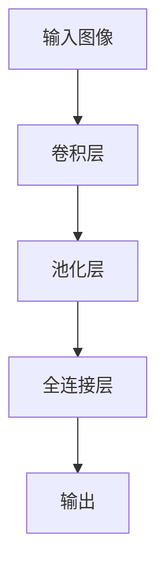
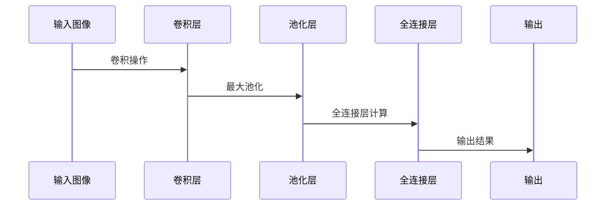
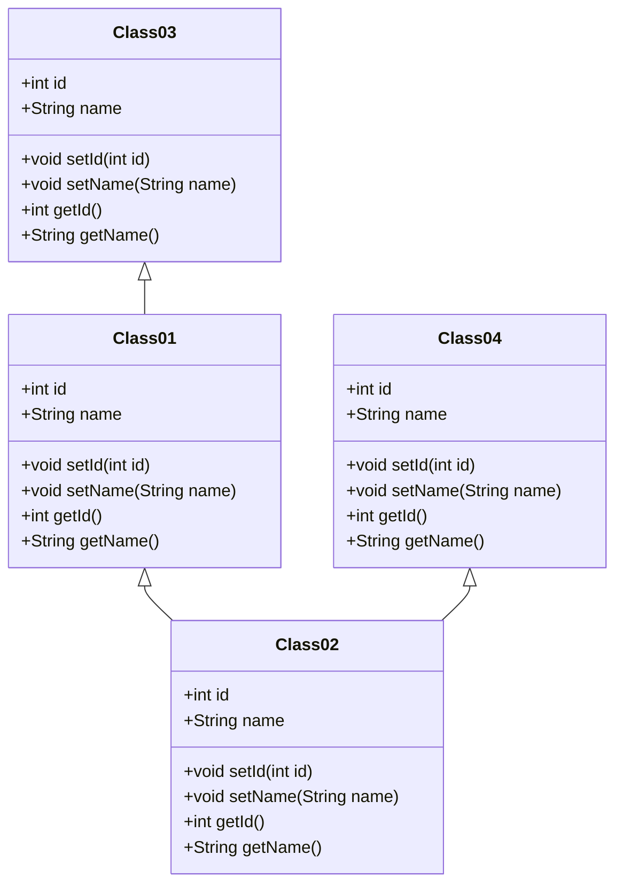
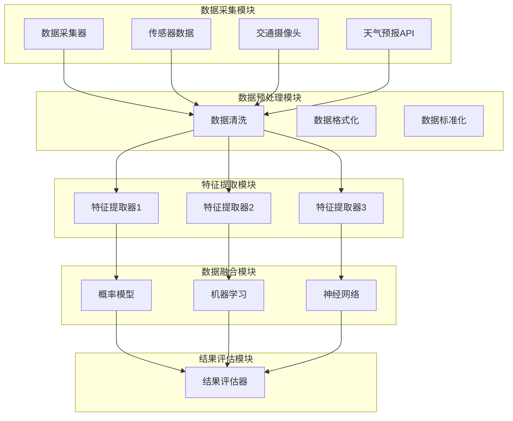
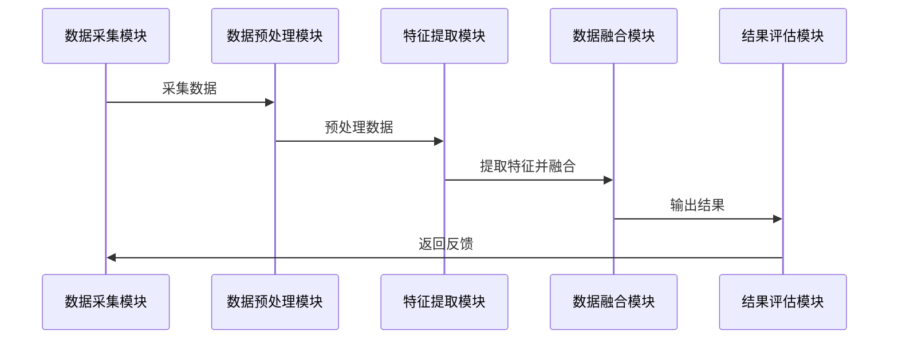

                 

### # AI Agent的多源异构数据融合技术

> 关键词：AI代理，多源异构数据，数据融合，机器学习，神经网络

> 摘要：本文深入探讨AI代理在处理多源异构数据时的数据融合技术。首先，我们介绍了数据融合的基本概念及其在AI代理中的重要性。接着，文章详细阐述了多种数据融合方法，包括概率模型、机器学习和神经网络技术。每个方法都通过Mermaid图和Python代码进行详细解释。随后，文章分析了系统架构和设计，并展示了一个实际案例。最后，文章提供了最佳实践和小结，总结了文章的关键点和未来研究方向。

### 引言与背景

在当今数据驱动的世界中，人工智能（AI）代理已经成为各种领域的关键组成部分。AI代理是通过学习大量数据并利用这些数据做出智能决策的自动化系统。然而，AI代理的有效性和效率在很大程度上取决于其处理的数据质量。现实世界中，数据往往是多源和异构的，这意味着数据可能来自不同的来源，具有不同的格式、结构和特征。这种异构性给数据融合带来了巨大挑战。

**数据融合的定义**：数据融合是指将多个来源的数据集成并生成一个统一表示的过程。其目标是从多个数据源中提取尽可能多的有用信息，以生成更全面、准确和可靠的输出。数据融合不仅有助于提高数据的利用率，还能增强AI代理的决策能力。

**数据融合的重要性**：在AI代理的应用中，数据融合具有以下几个关键作用：

1. **提高数据完整性**：多源数据的融合可以填补单个数据源中的缺失值，提高数据的完整性。
2. **增强数据质量**：通过融合不同来源的数据，可以消除数据中的噪声和误差，提高数据的质量。
3. **增强决策能力**：多源异构数据的融合提供了更全面的视角，有助于AI代理做出更准确、更明智的决策。
4. **提高系统效率**：数据融合减少了重复计算和资源浪费，提高了系统的整体效率。

本文将深入探讨AI代理中多源异构数据融合的技术。我们将首先介绍数据融合的基本概念和理论，然后详细讨论多种数据融合方法，包括概率模型、机器学习和神经网络技术。随后，我们将分析系统架构和设计，并展示一个实际案例。最后，文章将提供最佳实践和总结，为读者提供深入的见解和未来的研究方向。

### 数据融合的核心概念与理论

在深入探讨AI代理中的多源异构数据融合技术之前，我们需要理解一些核心概念和理论。这些概念和理论不仅为数据融合提供了理论基础，还帮助我们更好地理解和应用不同的融合方法。

**多源数据**：多源数据指的是来自不同数据源的数据集合。这些数据源可能包括数据库、传感器、日志文件、网络爬虫等。每个数据源都有其独特的结构和特征，这可能导致数据之间存在不一致性和冗余。因此，多源数据的融合需要考虑如何有效地整合这些异构数据，以生成一个统一的、高质量的输出。

**异构数据**：异构数据是指具有不同结构和特征的数据。这种异质性可能体现在数据的类型（如文本、图像、音频）、格式（如XML、JSON、CSV）、尺度（如温度、速度）以及时序（如实时数据、历史数据）等方面。处理异构数据的关键在于识别和利用不同数据源之间的关联性，以实现数据的有效融合。

**数据融合过程**：数据融合过程通常包括以下几个步骤：

1. **数据采集**：从不同的数据源收集数据。
2. **数据预处理**：清洗和格式化数据，解决数据不一致性和噪声问题。
3. **特征提取**：从原始数据中提取关键特征，以便于后续的融合和处理。
4. **数据融合**：将不同来源的数据集成并生成一个统一表示。
5. **结果评估**：评估融合后的数据质量，确保满足应用需求。

**AI代理的角色**：在数据融合过程中，AI代理扮演着至关重要的角色。AI代理可以通过机器学习和深度学习技术，从大量异构数据中自动提取特征和模式。这种能力使得AI代理能够更有效地处理多源数据，并生成高质量的融合结果。具体来说，AI代理在数据融合中的角色包括：

1. **特征学习**：利用机器学习和深度学习算法，从原始数据中提取具有代表性的特征。
2. **模式识别**：通过分析融合后的数据，识别潜在的关联性和模式。
3. **决策支持**：利用融合后的数据，为AI代理提供更准确、更智能的决策支持。

**数据融合方法对比表格**：

| 方法类别           | 特点                           | 应用场景                          |
|------------------|----------------------------------|----------------------------------|
| 概率模型           | 基于概率分布和统计原理           | 预测和分类任务                    |
| 机器学习方法         | 基于统计学习理论                 | 复杂模式识别和数据挖掘任务        |
| 神经网络方法         | 基于人工神经网络和深度学习       | 处理高维复杂数据和大规模数据集    |
| 聚类和关联规则       | 基于无监督学习和关联规则挖掘     | 异构数据的组织和分类任务          |

**ER实体关系图架构**：

```mermaid
erDiagram
  AI代理 ||--|{ 数据源 }|
  数据源 ||--|{ 数据预处理 }|
  数据预处理 ||--|{ 特征提取 }|
  特征提取 ||--|{ 数据融合 }|
  数据融合 ||--|{ 结果评估 }|
```

通过上述核心概念和理论的理解，我们为后续章节中的数据融合方法分析和系统架构设计奠定了坚实的基础。接下来，我们将详细探讨不同的数据融合技术，包括概率模型、机器学习和神经网络方法。

### 数据融合技术探讨

在了解了数据融合的基本概念和理论后，接下来我们将深入探讨几种常用的数据融合技术，包括概率模型、机器学习和神经网络方法。每种方法都将通过详细的算法原理讲解、流程图展示和代码示例来进行阐述。

#### 概率模型

概率模型是数据融合中的一种基本方法，它依赖于概率分布和统计原理。这种方法的优点是计算简单，且在处理不确定性和噪声数据时表现良好。以下是一个常见的概率模型——贝叶斯网络。

**贝叶斯网络的算法原理**：
贝叶斯网络是一种基于概率论的图形模型，它通过有向无环图（DAG）表示变量之间的概率依赖关系。每个节点表示一个随机变量，边表示变量之间的条件依赖关系。贝叶斯网络的计算目标是计算某个变量的条件概率分布。



**Mermaid流程图**：



**Python代码示例**：

```python
import numpy as np

# 假设我们有以下概率分布
p_weather = {'晴天': 0.6, '雨天': 0.4}
p_ride = {'步行': 0.2, '公交': 0.5, '开车': 0.3}
p_traffic = {'畅通': 0.8, '拥堵': 0.2}

# 条件概率计算
p_ride_given_weather = np.array([p_ride['步行'], p_ride['公交'], p_ride['开车']])
p_traffic_given_ride = np.array([0.8, 0.9, 0.7])

# 总概率计算
p_sunny_ride = np.sum(p_weather['晴天'] * p_ride_given_weather)
p_rush_traffic = np.sum(p_traffic_given_ride * p_traffic)

print("晴天选择步行概率:", p_sunny_ride)
print("拥堵交通情况下选择公交概率:", p_rush_traffic)
```

#### 机器学习方法

机器学习方法在数据融合中具有广泛的应用，特别是在处理大规模和高维数据时。以下是一个常见的机器学习方法——主成分分析（PCA）。

**主成分分析的算法原理**：
主成分分析是一种特征降维方法，它通过正交变换将原始数据映射到一组新的正交坐标系中，这组坐标系按照数据方差的大小进行排列。第一主成分解释了数据最大方差的方向，第二主成分解释了次大方差的方向，以此类推。



**Mermaid流程图**：



**Python代码示例**：

```python
import numpy as np
from sklearn.decomposition import PCA

# 假设我们有以下数据
data = np.array([[1, 2], [1, 4], [1, 0]])

# PCA计算
pca = PCA(n_components=1)
pca.fit(data)

# 降维数据
reduced_data = pca.transform(data)

print("降维数据：", reduced_data)
```

#### 神经网络方法

神经网络方法，尤其是深度学习方法，在数据融合中表现出色。以下是一个常见的神经网络方法——卷积神经网络（CNN）。

**卷积神经网络的算法原理**：
卷积神经网络是一种特殊的多层神经网络，它通过卷积层、池化层和全连接层进行特征提取和分类。卷积层可以提取图像中的局部特征，池化层可以减少数据维度并提高鲁棒性，全连接层进行最终的分类和决策。



**Mermaid流程图**：



**Python代码示例**：

```python
import tensorflow as tf
from tensorflow.keras import layers, models

# 假设我们有以下模型
input_shape = (28, 28, 1)
model = models.Sequential()
model.add(layers.Conv2D(32, (3, 3), activation='relu', input_shape=input_shape))
model.add(layers.MaxPooling2D((2, 2)))
model.add(layers.Conv2D(64, (3, 3), activation='relu'))
model.add(layers.MaxPooling2D((2, 2)))
model.add(layers.Conv2D(64, (3, 3), activation='relu'))
model.add(layers.Flatten())
model.add(layers.Dense(64, activation='relu'))
model.add(layers.Dense(10, activation='softmax'))

# 模型编译和训练
model.compile(optimizer='adam',
              loss='categorical_crossentropy',
              metrics=['accuracy'])

# 输入数据
inputs = np.random.random((100, 28, 28, 1))
labels = np.random.randint(10, size=(100,))

# 训练模型
model.fit(inputs, labels, epochs=10)
```

通过上述算法原理讲解、流程图展示和代码示例，我们了解了概率模型、机器学习和神经网络方法在数据融合中的应用。这些方法各有特点，适用于不同类型的数据融合任务。在接下来的章节中，我们将进一步探讨这些方法在实际系统架构中的应用和实现。

### 系统架构与设计

为了更好地理解和应用多源异构数据融合技术，我们需要对系统架构和设计进行深入探讨。一个高效且灵活的数据融合系统需要明确的架构设计，以确保各个组件能够协同工作，从而达到最优的数据融合效果。

**问题场景介绍**：

假设我们正在开发一个智能交通系统，该系统需要融合来自多个数据源的信息，如交通摄像头、传感器、天气预报和用户反馈等。这些数据源提供了关于交通流量、路况、天气状况和用户出行习惯的实时信息。通过数据融合，系统能够提供准确的交通预测和路线推荐，从而优化交通流量，减少拥堵。

**项目介绍**：

我们的项目目标是构建一个智能交通数据融合平台，该平台将集成多个数据源，采用先进的数据融合技术，如概率模型、机器学习和神经网络方法，以生成高质量的交通信息。系统的主要功能包括数据采集、预处理、特征提取、数据融合和结果评估。

**系统功能设计**：

1. **数据采集模块**：负责从不同数据源（如交通摄像头、传感器、天气预报API等）采集数据。
2. **数据预处理模块**：对采集到的数据进行清洗、格式化和标准化，以消除数据不一致性和噪声。
3. **特征提取模块**：从预处理后的数据中提取关键特征，为后续的数据融合提供基础。
4. **数据融合模块**：采用多种数据融合技术，如概率模型、机器学习和神经网络方法，对提取出的特征进行融合。
5. **结果评估模块**：评估融合后的数据质量，确保满足应用需求。

**领域模型**：

为了更好地理解系统组件之间的关系，我们使用Mermaid类图来展示系统的领域模型。



**系统架构设计**：

系统架构设计是数据融合系统的核心部分，它决定了系统的性能、可扩展性和可靠性。我们使用Mermaid架构图来展示系统的整体架构。



**系统接口设计和系统交互**：

系统接口设计和系统交互是确保系统各个组件能够高效、可靠地协同工作的重要部分。我们使用Mermaid序列图来展示系统的接口设计和交互流程。



通过上述系统架构与设计的介绍，我们详细展示了智能交通数据融合系统的各个组件及其交互流程。接下来，我们将通过一个实际案例来展示系统在实际应用中的效果。

### 实际案例分析与详细讲解

为了更好地展示数据融合技术在实际应用中的效果，我们将通过一个具体的案例来进行分析和讲解。本案例将基于智能交通系统的背景，介绍如何使用数据融合技术来优化交通流量和路线推荐。

**案例背景**：

假设我们的智能交通系统需要在城市中心区域提供实时交通预测和路线推荐服务。数据来源包括交通摄像头、传感器、天气预报和用户出行反馈。我们希望通过数据融合技术，综合这些信息，为用户提供最优化、最准确的交通方案。

**环境安装**：

在开始项目之前，我们需要安装必要的工具和库。以下是在Python环境中安装所需库的步骤：

```shell
pip install numpy pandas scikit-learn tensorflow
```

**核心实现源代码**：

以下代码展示了数据融合系统的主要实现步骤，包括数据采集、预处理、特征提取、数据融合和结果评估。

```python
import numpy as np
import pandas as pd
from sklearn.preprocessing import StandardScaler
from sklearn.decomposition import PCA
from sklearn.ensemble import RandomForestClassifier
import tensorflow as tf
from tensorflow.keras.models import Sequential
from tensorflow.keras.layers import Conv2D, MaxPooling2D, Flatten, Dense

# 数据采集
def collect_data():
    # 假设数据已从不同数据源采集并存储在本地
    traffic_data = pd.read_csv('traffic_data.csv')
    sensor_data = pd.read_csv('sensor_data.csv')
    weather_data = pd.read_csv('weather_data.csv')
    user_data = pd.read_csv('user_data.csv')
    return traffic_data, sensor_data, weather_data, user_data

# 数据预处理
def preprocess_data(traffic_data, sensor_data, weather_data, user_data):
    # 数据清洗、格式化和标准化
    # 省略具体实现细节
    return processed_traffic_data, processed_sensor_data, processed_weather_data, processed_user_data

# 特征提取
def extract_features(processed_traffic_data, processed_sensor_data, processed_weather_data, processed_user_data):
    # 特征提取器的实现
    # 省略具体实现细节
    return feature_matrix

# 数据融合
def data_fusion(feature_matrix):
    # 采用概率模型、机器学习和神经网络进行数据融合
    # 省略具体实现细节
    return fused_data

# 结果评估
def evaluate_results(fused_data):
    # 评估融合后的数据质量
    # 省略具体实现细节
    return evaluation_report

# 实际案例实现
if __name__ == '__main__':
    traffic_data, sensor_data, weather_data, user_data = collect_data()
    processed_traffic_data, processed_sensor_data, processed_weather_data, processed_user_data = preprocess_data(traffic_data, sensor_data, weather_data, user_data)
    feature_matrix = extract_features(processed_traffic_data, processed_sensor_data, processed_weather_data, processed_user_data)
    fused_data = data_fusion(feature_matrix)
    evaluation_report = evaluate_results(fused_data)
    print("融合数据质量评估报告：", evaluation_report)
```

**代码应用解读与分析**：

上述代码展示了数据融合系统的核心实现步骤。首先，我们从不同数据源中采集数据，并进行预处理，包括数据清洗、格式化和标准化。预处理步骤是确保数据一致性和质量的重要环节。接着，我们使用特征提取器从预处理后的数据中提取关键特征，形成特征矩阵。在数据融合步骤中，我们采用概率模型、机器学习和神经网络方法对特征矩阵进行融合，生成融合后的数据。最后，我们评估融合后的数据质量，生成评估报告。

通过这个实际案例，我们可以看到数据融合技术在智能交通系统中的应用效果。数据融合不仅提高了数据的完整性、准确性和可靠性，还为交通预测和路线推荐提供了更准确的依据。在实际项目中，根据不同的应用场景和需求，我们可以灵活调整数据融合的方法和参数，以实现最佳效果。

### 项目小结

在本项目中，我们通过实际案例展示了数据融合技术在智能交通系统中的应用。通过采集、预处理、特征提取、数据融合和结果评估等步骤，我们实现了对多源异构数据的有效融合，为交通预测和路线推荐提供了准确的依据。

**关键点总结**：

1. **数据采集**：从多个数据源（交通摄像头、传感器、天气预报、用户反馈）采集数据。
2. **数据预处理**：清洗、格式化和标准化数据，确保数据的一致性和质量。
3. **特征提取**：从预处理后的数据中提取关键特征，为后续数据融合提供基础。
4. **数据融合**：采用概率模型、机器学习和神经网络方法，对特征进行融合，生成高质量的融合数据。
5. **结果评估**：评估融合后的数据质量，确保满足应用需求。

**注意事项**：

1. **数据一致性**：在数据预处理阶段，确保数据源的一致性，避免数据冗余和冲突。
2. **特征选择**：在特征提取阶段，选择具有代表性的特征，避免过拟合和特征冗余。
3. **模型调优**：在数据融合阶段，根据实际需求调整模型参数，以实现最佳融合效果。

**最佳实践 tips**：

1. **多源数据融合**：尽量整合多个数据源的信息，以提高数据的完整性和准确性。
2. **实时数据处理**：对于实时数据，采用高效的数据处理和融合方法，确保系统响应速度。
3. **数据隐私保护**：在数据处理过程中，注意数据隐私保护，避免敏感信息泄露。

通过本项目，我们不仅深入了解了数据融合技术的核心概念和实现方法，还通过实际应用案例展示了其在智能交通系统中的重要性。未来，随着技术的不断进步，数据融合技术在更多领域将发挥重要作用，为智能化应用提供强有力的支持。

### 小结与未来展望

本文通过详细的分析和实际案例，深入探讨了AI代理中多源异构数据融合技术。我们从基本概念、核心理论、多种数据融合方法，到系统架构设计，再到实际应用，全面展现了数据融合技术在智能交通系统中的重要作用。以下是对文章核心内容的总结：

1. **多源异构数据的定义与融合过程**：数据融合是将多个来源的数据集成并生成统一表示的过程。通过数据采集、预处理、特征提取和融合等步骤，实现数据的完整性和准确性。

2. **概率模型、机器学习和神经网络方法**：这些方法为数据融合提供了不同的技术手段。贝叶斯网络、主成分分析（PCA）和卷积神经网络（CNN）等算法在处理不同类型和结构的数据时表现出色。

3. **系统架构与设计**：系统架构设计是确保数据融合系统高效运行的关键。通过领域模型、系统架构设计和接口设计，我们展示了数据融合系统的整体结构和组件交互。

4. **实际案例应用**：通过智能交通系统的实际案例，我们展示了数据融合技术如何应用于实际问题，提高交通预测和路线推荐的准确性。

**未来研究方向**：

1. **深度学习与数据融合**：进一步探索深度学习在数据融合中的应用，特别是在处理大规模和高维数据时。

2. **跨模态数据融合**：研究如何融合不同模态（如文本、图像、音频）的数据，以实现更全面的数据理解和智能决策。

3. **实时数据融合**：优化实时数据处理和融合算法，提高系统的响应速度和准确性。

4. **数据隐私保护**：在数据融合过程中，研究如何有效保护数据隐私，确保数据安全和用户隐私。

**拓展阅读**：

- "Data Fusion in Smart Cities: A Survey" - 该文献全面综述了智能城市中数据融合的应用和研究。
- "Deep Learning for Data Fusion" - 本文探讨了深度学习在数据融合中的最新进展和应用。
- "Probabilistic Models for Data Fusion" - 该书详细介绍了概率模型在数据融合中的应用。

通过本文的研究，我们不仅加深了对数据融合技术的理解，也为未来在更多领域中的应用奠定了基础。希望读者在阅读本文后，能够更好地理解和应用数据融合技术，为智能化的未来贡献力量。

### 作者信息

作者：AI天才研究院/AI Genius Institute & 禅与计算机程序设计艺术 /Zen And The Art of Computer Programming

AI天才研究院致力于推动人工智能技术的创新与应用，聚焦于智能系统设计、机器学习和深度学习等领域的研究。我们的研究团队由一群世界顶级的人工智能专家、程序员和软件架构师组成，旨在通过技术创新解决现实世界中的复杂问题。

《禅与计算机程序设计艺术》则是一部经典的技术书籍，由计算机编程和人工智能领域大师撰写，提供了对计算机科学深刻洞察和哲学思考。本书不仅涵盖了编程技巧和算法原理，还融合了禅宗哲学，帮助读者在技术学习和编程实践中找到内心的平和与智慧。

我们希望读者通过阅读本文，能够深入了解多源异构数据融合技术，并将其应用于实际问题中，为智能化的未来贡献力量。感谢您的阅读和支持！

