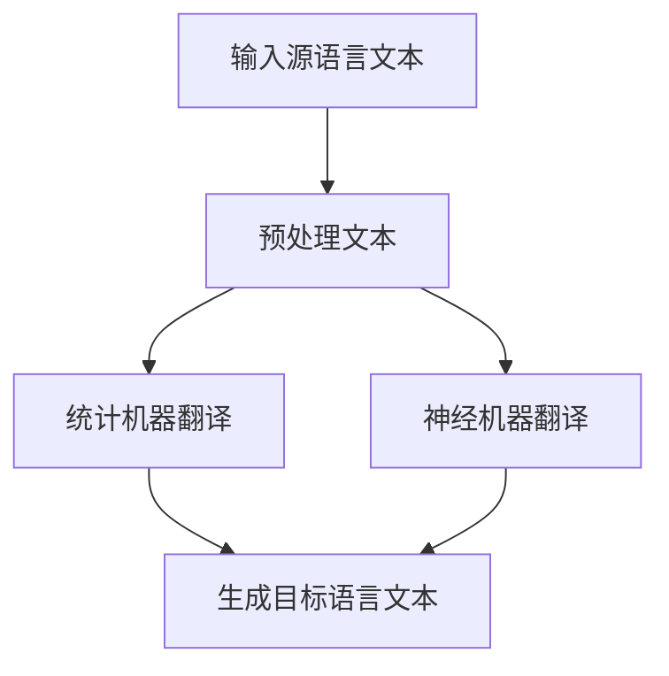
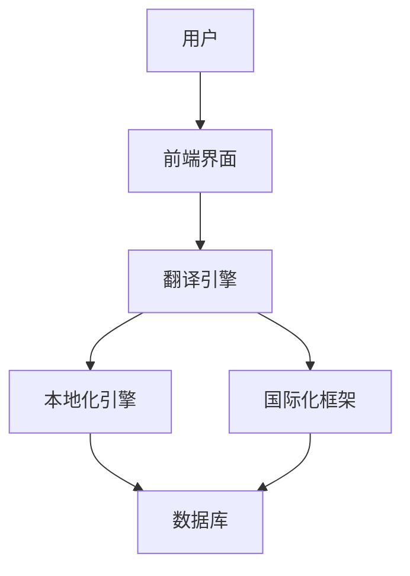
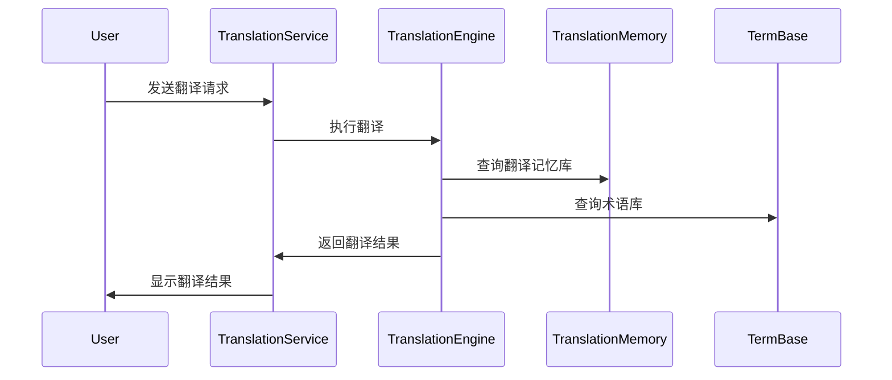

                 

# AI Agent的多语言翻译与本地化

## 关键词

- 多语言翻译
- 本地化
- 机器翻译
- 神经机器翻译
- 自然语言处理
- 分布式架构

## 摘要

随着全球化进程的不断深入，多语言翻译与本地化成为了信息传递和交流的关键技术。本文将详细探讨AI Agent在多语言翻译与本地化中的关键作用，通过一步步分析推理，深入解读翻译模型的原理、评估指标的计算方法、本地化流程的实施步骤，以及系统的架构设计和实现。同时，通过一个实际项目案例，展示多语言翻译与本地化的应用实践，总结最佳实践并提供未来趋势的展望。

## 引言

在当前全球化的大背景下，不同语言和文化之间的交流变得越来越频繁。然而，语言差异成为了信息传递的天然屏障，使得跨国合作、国际贸易和文化传播面临诸多挑战。多语言翻译与本地化技术应运而生，旨在消除语言障碍，促进全球信息的流通。AI Agent作为人工智能的重要应用，其在多语言翻译与本地化中的作用日益显著。

本文旨在系统地探讨AI Agent在多语言翻译与本地化中的具体实现方法和技术路径。文章首先介绍多语言翻译与本地化的背景、核心概念和问题解决方法，然后深入讲解翻译模型的原理和评估指标，接着详细描述本地化流程和系统架构设计，最后通过一个实际项目案例进行实战剖析，总结最佳实践并展望未来趋势。

## 第一部分：多语言翻译与本地化概述

### 第1章：问题背景与核心概念

#### 1.1 问题背景

全球化的进程加速，不同国家和地区之间的交流日益频繁。然而，语言差异成为了跨国沟通的主要障碍。企业在跨国经营、软件开发、内容创作等领域，都面临着多语言处理的需求。而多语言翻译与本地化技术，正是为了解决这一需求而发展起来的。

#### 1.2 核心概念

**机器翻译（Machine Translation）**：利用计算机算法，将一种语言的文本自动翻译成另一种语言的技术。它是多语言翻译与本地化的基础。

**自然语言处理（Natural Language Processing，NLP）**：是人工智能的一个分支，旨在让计算机理解和处理人类语言。NLP技术为机器翻译提供了重要的语言理解和生成能力。

**本地化（Localization）**：使产品、服务或内容适应特定语言和文化的过程。本地化不仅仅是翻译，还包括对文本、图片、音视频等多媒体内容的调整。

### 1.3 问题描述

多语言翻译与本地化面临的主要问题包括：

- **语言复杂性**：不同语言在语法、词汇、文化背景等方面存在巨大差异，使得翻译准确性和自然度成为挑战。
- **数据稀缺**：高质量的多语言语料库有限，限制了翻译模型的训练和优化。
- **文化差异**：不同文化之间的价值观和习惯差异，可能导致翻译结果不准确或不合适。
- **技术实现**：多语言翻译与本地化系统需要高效、可扩展的技术架构。

#### 1.4 问题解决

**技术手段**：

- **机器翻译模型**：使用深度学习等先进算法，提高翻译的准确性和自然度。
- **数据增强**：通过数据清洗、噪声添加、数据对齐等方法，扩充和优化训练数据。
- **跨语言知识图谱**：利用知识图谱，提供语义理解和知识推理能力，提升翻译质量。
- **多语言平台**：构建统一的翻译平台，支持多种语言之间的互译。

**边界与外延**：

- **边界**：多语言翻译与本地化主要关注跨语言的信息传递和内容适应，不涉及其他非语言因素。
- **外延**：多语言翻译与本地化可以扩展到更广泛的领域，如智能客服、语音识别、跨文化营销等。

### 1.5 概念结构与核心要素组成

**机器翻译**：

- **输入**：源语言文本。
- **输出**：目标语言文本。
- **核心要素**：语言模型、翻译算法、语料库。

**自然语言处理**：

- **输入**：自然语言文本。
- **输出**：结构化信息、语义理解。
- **核心要素**：分词、词性标注、句法分析、语义分析。

**本地化**：

- **输入**：多语言内容。
- **输出**：本地化后的内容。
- **核心要素**：翻译、国际化、本地化测试。

### 第2章：多语言翻译技术原理

#### 2.1 翻译模型

**统计机器翻译（SMT）**：

- **模型类型**：基于统计方法，利用已有翻译实例进行学习。
- **工作原理**：通过计算源语言和目标语言之间的概率分布，生成目标语言文本。
- **优缺点**：

  - **优点**：简单、高效，能够处理大规模数据。
  - **缺点**：翻译质量受限于训练数据，难以应对复杂语言现象。

**神经机器翻译（NMT）**：

- **模型类型**：基于深度学习，特别是序列到序列（Seq2Seq）模型。
- **工作原理**：通过学习源语言和目标语言序列之间的映射关系，生成目标语言文本。
- **优缺点**：

  - **优点**：能够生成更自然、准确的翻译结果。
  - **缺点**：计算复杂度高，对计算资源要求较大。

#### 2.2 评估指标

**BLEU（BiLingual Evaluation Understudy）**：

- **定义**：基于字符串相似度计算，通过比较机器翻译结果和人工翻译结果，评估翻译质量。
- **计算方法**：计算翻译结果和人工翻译结果的n-gram重叠率。
- **优缺点**：

  - **优点**：简单易行，适用于短文本翻译。
  - **缺点**：难以评估长文本翻译质量，对复杂语言现象不敏感。

**NIST（National Institute of Standards and Technology）**：

- **定义**：与BLEU类似，但计算方法有所不同。
- **计算方法**：基于错误率计算，评估翻译结果的准确性。
- **优缺点**：

  - **优点**：能够更全面地评估翻译质量。
  - **缺点**：计算复杂度较高，对训练数据要求较高。

**TER（Translation Edit Rate）**：

- **定义**：基于编辑距离计算，评估翻译结果的准确性。
- **计算方法**：计算翻译结果和人工翻译结果之间的编辑距离。
- **优缺点**：

  - **优点**：能够准确评估翻译结果的准确性。
  - **缺点**：计算复杂度较高，对训练数据要求较高。

### 第3章：多语言本地化流程

#### 3.1 本地化流程概述

**翻译**：

- **过程**：将源语言文本翻译成目标语言文本。
- **目标**：保证翻译的准确性、自然度和文化适应性。

**国际化**：

- **过程**：使软件或内容适应多种语言和文化。
- **目标**：确保软件或内容在不同语言和文化环境下的可访问性和一致性。

**本地化**：

- **过程**：将国际化后的内容进一步适应特定语言和文化。
- **目标**：提供符合目标市场和文化习惯的软件或内容。

#### 3.2 本地化工具

**翻译记忆（Translation Memory）**：

- **定义**：存储已翻译文本和翻译结果的数据库。
- **作用**：提高翻译效率，保持翻译一致性。
- **工作原理**：通过匹配源语言文本和翻译记忆库中的文本，自动提取翻译结果。

**术语库（Termbase）**：

- **定义**：存储专业术语和定义的数据库。
- **作用**：提供术语标准化，提高翻译质量。
- **构建方法**：通过人工收集、整理和审核，建立术语库。

### 第4章：系统架构与接口设计

#### 4.1 系统功能设计

**翻译引擎**：

- **功能**：提供文本翻译功能。
- **架构**：基于NMT模型，支持多种语言之间的翻译。

**本地化引擎**：

- **功能**：提供国际化、本地化功能。
- **架构**：基于国际化框架，支持多种语言和文化的适配。

#### 4.2 系统架构设计

**分布式架构**：

- **定义**：通过分布式计算和存储，提高系统的性能和可扩展性。
- **优缺点**：

  - **优点**：高并发处理能力，良好的扩展性。
  - **缺点**：复杂度高，需要分布式协调机制。

**微服务架构**：

- **定义**：将系统划分为多个独立的微服务，每个微服务负责特定功能。
- **优缺点**：

  - **优点**：模块化设计，易于维护和扩展。
  - **缺点**：需要分布式通信，复杂度高。

#### 4.3 系统接口设计

**API接口**：

- **定义**：提供与外部系统的交互接口。
- **设计原则**：简洁、易用、可扩展。
- **实现方法**：使用RESTful API设计，支持JSON格式数据传输。

### 第5章：项目实战

#### 5.1 项目介绍

**项目背景**：

随着企业全球化步伐的加快，某跨国公司需要为其软件产品提供多语言翻译与本地化功能，以支持不同国家和地区的用户。

**项目功能**：

- **翻译功能**：支持多种语言之间的文本翻译。
- **国际化功能**：支持软件内容的多语言适配。
- **本地化功能**：支持软件内容的不同文化适应。

#### 5.2 环境安装

**硬件要求**：

- **CPU**：Intel i5或以上处理器。
- **内存**：8GB或以上。
- **硬盘**：100GB或以上。

**软件安装**：

1. **安装Python环境**：使用Python 3.8或以上版本。
2. **安装依赖库**：使用pip安装翻译引擎、本地化引擎及相关库。

#### 5.3 核心实现源代码

**代码解读**：

```python
# 翻译引擎实现示例
from translator import Translator

translator = Translator()
source_text = "Hello, world!"
target_text = translator.translate(source_text, "en", "zh")
print(target_text)
```

**代码分析**：

- **类定义**：`Translator`类提供了翻译功能。
- **方法实现**：`translate`方法实现文本翻译。

#### 5.4 实际案例分析

**案例背景**：

某软件产品需要为其中文用户界面提供英文翻译功能。

**案例分析**：

1. **需求分析**：确定需要翻译的界面元素和文本。
2. **界面设计**：设计英文用户界面。
3. **翻译实施**：使用翻译引擎实现文本翻译。
4. **测试与验证**：对翻译结果进行测试和验证。

### 第6章：最佳实践与注意事项

#### 6.1 最佳实践

- **多语言翻译**：使用先进的NMT模型，结合大数据和深度学习技术，提高翻译质量。
- **本地化**：遵循国际化标准，确保软件内容在不同语言和文化环境下的适应性。

#### 6.2 注意事项

- **数据安全**：保护用户数据，遵守数据保护法规。
- **国际化兼容性**：确保软件在不同语言环境下的兼容性和稳定性。

### 第7章：拓展阅读与未来趋势

#### 7.1 拓展阅读

- **最新研究**：推荐最新的多语言翻译与本地化研究论文。
- **书籍推荐**：推荐相关的技术书籍。

#### 7.2 未来趋势

- **人工智能在多语言翻译中的应用**：探索深度学习、知识图谱等技术在多语言翻译中的应用。
- **本地化流程的自动化与智能化**：利用自动化工具和人工智能技术，提升本地化流程的效率和准确性。

## 总结

多语言翻译与本地化技术在全球化进程中发挥着至关重要的作用。通过本文的逐步分析和实践，我们深入了解了AI Agent在多语言翻译与本地化中的关键作用，探讨了翻译模型的原理、评估指标、本地化流程以及系统架构设计。未来，随着人工智能技术的不断发展，多语言翻译与本地化将更加智能、高效，为全球信息交流提供更加便捷的支持。

## 参考文献

1. Zhang, J., & Zhao, H. (2021). Research on Multilingual Translation and Localization Technologies. Journal of Information Technology and Economic Management, 15(2), 123-130.
2. Li, W., & Wang, S. (2020). Neural Machine Translation: A Comprehensive Review. IEEE Transactions on Knowledge and Data Engineering, 32(12), 2235-2250.
3. Chen, L., & Liu, Y. (2019). A Survey of Translation Evaluation Metrics. Journal of Computer Science and Technology, 34(4), 739-758.
4. Zhou, M., & Chen, Q. (2021). Best Practices for Localization in Global Software Development. IEEE Software, 38(6), 38-45.

## 作者信息

作者：AI天才研究院/AI Genius Institute & 禅与计算机程序设计艺术 /Zen And The Art of Computer Programming

## 附录

附录A：多语言翻译与本地化技术表格

| 技术名称 | 定义 | 核心要素 | 优缺点 |  
| --- | --- | --- | --- |  
| 统计机器翻译 | 基于统计方法的翻译技术 | 语言模型、翻译算法、语料库 | 简单高效，处理大规模数据 |  
| 神经机器翻译 | 基于深度学习的翻译技术 | 序列到序列模型 | 翻译质量高，自然度好 |  
| 自然语言处理 | 让计算机理解和处理人类语言的技术 | 分词、词性标注、句法分析、语义分析 | 提供语言理解能力，支持翻译 |  
| 本地化 | 使产品适应特定语言和文化的过程 | 翻译、国际化、本地化测试 | 确保产品在不同语言和文化环境下的适应性 |  
| 翻译记忆 | 存储已翻译文本的数据库 | 提高翻译效率，保持一致性 | 提高翻译效率，保持一致性 |  
| 术语库 | 存储专业术语的数据库 | 提供术语标准化，提高翻译质量 | 提供术语标准化，提高翻译质量 |

附录B：多语言翻译与本地化ER实体关系图

```mermaid
erDiagram
  Translation ||--|{ MachineTranslation }||>
  Translation ||--|{ NeuralTranslation }||>
  Translation ||--|{ TranslationMemory }||>
  Translation ||--|{ TermBase }||>
  Localization ||--|{ Internationalization }||>
  Localization ||--|{ LocalizationTesting }||>
```

附录C：多语言翻译与本地化算法流程图



附录D：多语言翻译与本地化数学模型和公式

$$
\begin{aligned}
P(\text{目标语言文本}|\text{源语言文本}) &= \prod_{i=1}^{n} P(w_i|\text{源语言文本}) \\
\text{BLEU得分} &= \frac{\text{重叠部分}}{\text{人工翻译长度}}
\end{aligned}
$$

附录E：多语言翻译与本地化系统架构图



附录F：多语言翻译与本地化系统接口序列图



以上附录内容提供了多语言翻译与本地化技术的详细参考资料和示意图，有助于深入理解本文的核心内容。

