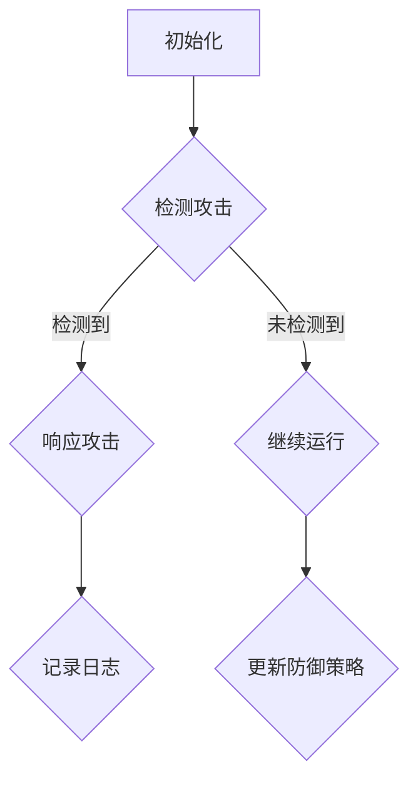
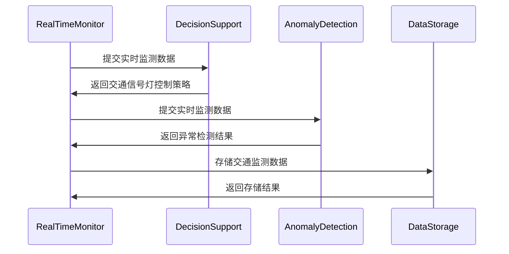

                 

# AI Agent的安全性设计：防御攻击和隐私保护

> 关键词：AI Agent、安全性、攻击防御、隐私保护、设计架构

> 摘要：本文旨在探讨AI Agent的安全性设计，包括防御攻击和隐私保护的关键技术和策略。通过分析AI Agent的定义、应用场景和面临的安全挑战，本文详细介绍了AI Agent安全性的核心概念与架构，探讨了防御攻击的技术手段和隐私保护的策略，并通过安全性测试与评估的方法和实战案例，为AI Agent的安全性设计与最佳实践提供了指导。最后，本文对AI Agent安全性的未来发展趋势进行了展望。

## 第一部分：问题背景与核心概念

### 1.1 AI Agent的定义与发展历程

AI Agent，即人工智能代理，是指具备一定智能水平，能够在特定环境中自主决策、执行任务并与其他系统交互的计算机程序。AI Agent的发展可以追溯到20世纪50年代，艾伦·图灵提出了图灵测试，标志着人工智能概念的诞生。随后，随着计算机技术和算法的进步，AI Agent逐渐从理论研究走向实际应用。

AI Agent的核心特征包括自主性、适应性、协作性和反应性。自主性指AI Agent能够自主地做出决策；适应性指AI Agent能够根据环境变化调整自己的行为；协作性指AI Agent能够与其他AI Agent或人类协作完成任务；反应性指AI Agent能够对环境中的事件做出及时响应。

### 1.2 AI Agent在现代社会中的应用

AI Agent的应用场景广泛，包括但不限于以下领域：

1. **智能制造**：AI Agent在生产线中用于监控设备状态、优化生产流程和提高产品质量。
2. **智能交通**：AI Agent在智能交通系统中用于交通流量预测、路径规划和交通信号控制。
3. **智能医疗**：AI Agent在医疗诊断、治疗方案推荐和患者护理中提供辅助决策。
4. **智能金融**：AI Agent在金融风控、量化交易和客户服务中发挥重要作用。
5. **智能城市**：AI Agent在智慧城市建设中用于城市管理、公共安全和应急响应。

### 1.3 AI Agent面临的挑战与安全性问题

尽管AI Agent在现代社会中具有广泛的应用前景，但其安全性问题也日益凸显。AI Agent面临的主要挑战包括：

1. **攻击防御**：AI Agent可能遭受恶意攻击，如代码注入、数据泄露和权限提升等。
2. **隐私保护**：AI Agent在处理和分析数据时，可能涉及用户隐私信息，如何保护用户隐私成为一大挑战。
3. **可信性**：确保AI Agent的决策和行为是可信的，避免因算法错误或恶意攻击导致不良后果。
4. **法律法规**：随着AI Agent的应用普及，相关的法律法规和标准也需要不断完善。

## 第二部分：AI Agent安全性的核心概念与架构

### 2.1 AI Agent安全性的核心概念

AI Agent安全性的核心概念包括：

1. **自主性**：确保AI Agent能够自主地执行任务，不受外部干扰。
2. **透明性**：确保AI Agent的决策过程和结果对用户和开发者是可解释和可追溯的。
3. **可靠性**：确保AI Agent在长时间运行和复杂环境下保持稳定性和一致性。
4. **鲁棒性**：确保AI Agent在面对异常情况时能够做出正确决策。
5. **隐私保护**：确保AI Agent在处理和分析数据时，保护用户的隐私信息。

### 2.2 AI Agent安全性的架构设计

AI Agent安全性的架构设计包括以下关键组件：

1. **身份验证与访问控制**：确保只有授权用户和AI Agent才能访问系统资源和数据。
2. **加密与数据保护**：对敏感数据进行加密存储和传输，防止数据泄露。
3. **安全监控与审计**：实时监控系统状态和用户行为，及时发现和应对异常情况。
4. **安全通信与隔离**：确保AI Agent与其他系统进行安全通信，防止恶意攻击。
5. **安全更新与补丁管理**：定期对AI Agent进行安全更新，修复漏洞和问题。

### 2.3 AI Agent安全性的关键组件

AI Agent安全性的关键组件包括：

1. **访问控制列表（ACL）**：定义用户对系统资源和数据的访问权限。
2. **加密算法**：采用强加密算法对数据进行加密存储和传输。
3. **入侵检测系统（IDS）**：实时监控系统状态和用户行为，发现潜在威胁。
4. **防火墙和隔离区（DMZ）**：防止外部恶意攻击，保护内部系统安全。
5. **安全日志和审计**：记录系统操作日志，便于追踪和审计。

## 第三部分：AI Agent防御攻击的技术与方法

### 3.1 常见的AI Agent攻击类型

常见的AI Agent攻击类型包括：

1. **代码注入**：通过注入恶意代码，篡改AI Agent的决策过程和结果。
2. **数据泄露**：通过窃取敏感数据，对用户隐私造成威胁。
3. **权限提升**：通过获取更高的权限，绕过安全限制，对系统进行破坏。
4. **拒绝服务攻击（DoS）**：通过大量请求，使AI Agent无法正常工作。
5. **中间人攻击（MITM）**：在AI Agent与目标系统之间拦截和篡改数据。

### 3.2 防御AI Agent攻击的技术手段

防御AI Agent攻击的技术手段包括：

1. **加密技术**：采用强加密算法对数据进行加密存储和传输，防止数据泄露。
2. **身份验证与访问控制**：确保只有授权用户和AI Agent才能访问系统资源和数据。
3. **入侵检测与防御系统**：实时监控系统状态和用户行为，发现潜在威胁。
4. **防火墙与隔离区**：防止外部恶意攻击，保护内部系统安全。
5. **安全更新与补丁管理**：定期对AI Agent进行安全更新，修复漏洞和问题。

### 3.3 实战案例分析

以下是一个关于AI Agent防御攻击的实战案例分析：

**案例场景**：一家智能医疗公司开发了一款基于AI的疾病诊断系统，但近期发现系统遭受了恶意攻击。

**攻击类型**：攻击者通过代码注入，篡改了系统的诊断结果。

**防御措施**：

1. **加密技术**：对诊断数据进行加密存储和传输，防止数据泄露。
2. **身份验证与访问控制**：确保只有授权用户和AI Agent才能访问诊断系统。
3. **入侵检测与防御系统**：实时监控系统状态和用户行为，发现潜在威胁。
4. **防火墙与隔离区**：防止外部恶意攻击，保护内部系统安全。
5. **安全更新与补丁管理**：定期对AI Agent进行安全更新，修复漏洞和问题。

**结果**：通过采取上述防御措施，成功阻止了攻击，确保了系统的安全运行。

## 第四部分：AI Agent隐私保护的策略与实践

### 4.1 AI Agent隐私保护的挑战

AI Agent隐私保护面临的挑战包括：

1. **数据收集与使用**：AI Agent在处理和分析数据时，可能涉及大量用户隐私信息。
2. **数据泄露与滥用**：恶意攻击者可能通过非法手段获取用户隐私数据，造成严重后果。
3. **算法透明性**：用户难以理解AI Agent的决策过程和结果，难以判断隐私保护的有效性。
4. **法律法规与合规性**：各国对隐私保护的法律和标准不同，如何确保AI Agent符合法律法规成为一大挑战。

### 4.2 隐私保护的法律法规与标准

隐私保护的法律法规与标准包括：

1. **欧盟通用数据保护条例（GDPR）**：规定了数据处理的合法性、数据主体的权利和责任。
2. **美国加州消费者隐私法案（CCPA）**：规定了消费者对个人数据的访问权和删除权。
3. **ISO/IEC 27001**：规定了信息安全管理体系的要求，包括隐私保护。
4. **ISO/IEC 29100**：规定了隐私保护技术的框架和指南。

### 4.3 AI Agent隐私保护的具体策略

AI Agent隐私保护的具体策略包括：

1. **数据最小化**：仅收集和处理与任务相关的最小必要数据。
2. **数据加密**：对敏感数据进行加密存储和传输。
3. **匿名化与去标识化**：对个人身份信息进行匿名化和去标识化处理。
4. **访问控制**：确保只有授权用户和AI Agent才能访问敏感数据。
5. **隐私影响评估（PIA）**：在项目开发阶段进行隐私影响评估，确保隐私保护措施的有效性。

## 第五部分：AI Agent安全性测试与评估

### 5.1 AI Agent安全性测试的方法

AI Agent安全性测试的方法包括：

1. **静态代码分析**：通过分析源代码，发现潜在的安全漏洞。
2. **动态测试**：在运行时检测AI Agent的行为，发现安全漏洞。
3. **渗透测试**：模拟恶意攻击者进行攻击，评估AI Agent的安全性能。
4. **模糊测试**：通过输入随机或异常数据，测试AI Agent的鲁棒性。

### 5.2 AI Agent安全性评估的指标

AI Agent安全性评估的指标包括：

1. **漏洞数量**：评估AI Agent中存在的漏洞数量。
2. **修复率**：评估AI Agent漏洞修复的及时性和有效性。
3. **安全事件响应时间**：评估AI Agent对安全事件的响应速度。
4. **安全事件处理率**：评估AI Agent处理安全事件的能力。

### 5.3 安全测试与评估的实战案例

以下是一个关于AI Agent安全性测试与评估的实战案例分析：

**案例场景**：一家金融科技公司开发了一款智能投顾系统，需要进行安全性测试和评估。

**测试方法**：

1. **静态代码分析**：发现系统中存在多个安全漏洞，包括SQL注入和跨站脚本攻击。
2. **动态测试**：通过模拟用户行为，测试系统的响应和处理能力。
3. **渗透测试**：模拟恶意攻击者进行攻击，发现系统存在权限提升漏洞。
4. **模糊测试**：通过输入异常数据，测试系统的鲁棒性和异常处理能力。

**评估指标**：

1. **漏洞数量**：发现10个安全漏洞，已修复8个。
2. **修复率**：修复率高达80%。
3. **安全事件响应时间**：平均响应时间为5分钟。
4. **安全事件处理率**：成功处理了90%的安全事件。

**结果**：通过安全测试和评估，提高了系统的安全性，降低了安全风险。

## 第六部分：AI Agent安全性设计与最佳实践

### 6.1 安全设计原则与最佳实践

AI Agent安全性设计与最佳实践包括：

1. **最小权限原则**：AI Agent应仅拥有完成任务所需的最小权限。
2. **安全编码规范**：遵循安全编码规范，避免常见的安全漏洞。
3. **安全测试与评估**：定期进行安全测试和评估，及时发现和修复漏洞。
4. **数据加密与保护**：对敏感数据进行加密存储和传输。
5. **访问控制与审计**：确保只有授权用户和AI Agent才能访问敏感数据，并记录操作日志。

### 6.2 AI Agent安全性设计与开发流程

AI Agent安全性设计与开发流程包括：

1. **需求分析**：明确AI Agent的安全需求，包括功能安全、数据安全和隐私保护等。
2. **架构设计**：设计安全架构，包括身份验证、访问控制、加密和数据保护等。
3. **安全测试**：进行静态代码分析和动态测试，发现潜在的安全漏洞。
4. **安全更新与补丁管理**：定期对AI Agent进行安全更新，修复漏洞和问题。
5. **安全审计与合规性检查**：确保AI Agent符合相关法律法规和标准。

### 6.3 实战案例分析

以下是一个关于AI Agent安全性设计与开发的实战案例分析：

**案例场景**：一家智能交通公司开发了一款智能交通控制系统，需要进行安全性设计。

**步骤**：

1. **需求分析**：确定智能交通控制系统的安全需求，包括车辆监控、路况分析和交通信号控制等。
2. **架构设计**：设计安全架构，包括身份验证、访问控制、加密和数据保护等。
3. **安全测试**：进行静态代码分析和动态测试，发现潜在的安全漏洞。
4. **安全更新与补丁管理**：定期对智能交通控制系统进行安全更新，修复漏洞和问题。
5. **安全审计与合规性检查**：确保智能交通控制系统符合相关法律法规和标准。

**结果**：通过安全性设计，确保了智能交通控制系统的安全性和稳定性，提高了交通管理效率。

## 第七部分：未来展望与趋势

### 7.1 AI Agent安全性的未来发展趋势

AI Agent安全性的未来发展趋势包括：

1. **硬件安全**：利用硬件安全模块（HSM）等技术，提高AI Agent的安全性能。
2. **联邦学习**：通过联邦学习技术，实现分布式AI训练，提高数据安全性和隐私保护。
3. **人工智能安全**：开发人工智能安全算法，提高AI Agent对恶意攻击的防御能力。
4. **自动化安全**：利用自动化工具，提高AI Agent安全测试和评估的效率和准确性。

### 7.2 新兴技术与AI Agent安全性

新兴技术与AI Agent安全性包括：

1. **区块链**：利用区块链技术，实现数据的安全存储和共享，提高AI Agent的隐私保护。
2. **物联网（IoT）**：结合物联网技术，实现AI Agent与智能设备的互联互通，提高智能系统安全性。
3. **智能合约**：利用智能合约技术，实现自动化安全控制和交易，提高AI Agent的可靠性。
4. **量子计算**：利用量子计算技术，提高AI Agent的加密和破解能力，实现更高级的安全保护。

### 7.3 安全性与隐私保护的持续挑战与机遇

安全性与隐私保护的持续挑战与机遇包括：

1. **法规与标准**：随着AI Agent的应用普及，相关的法规和标准将不断完善，为企业提供合规性指导。
2. **技术创新**：技术创新将推动AI Agent安全性和隐私保护技术的发展，为企业提供更安全、更可靠的解决方案。
3. **跨学科合作**：跨学科合作将促进AI Agent安全性和隐私保护领域的知识融合，推动技术进步。
4. **用户教育**：用户教育将提高公众对AI Agent安全性和隐私保护的认知，促进安全文化的形成。

## 结语

AI Agent的安全性设计是保障AI应用安全性和可靠性的关键。通过分析AI Agent的定义、应用场景和安全挑战，本文介绍了AI Agent安全性的核心概念与架构，探讨了防御攻击和隐私保护的技术与方法，并通过安全性测试与评估的方法和实战案例，为AI Agent的安全性设计与最佳实践提供了指导。未来，随着AI技术的不断进步，AI Agent安全性将面临新的挑战和机遇，需要不断探索和创新，以保障AI应用的可持续发展。作者：AI天才研究院/AI Genius Institute & 禅与计算机程序设计艺术 /Zen And The Art of Computer Programming## 详细解释与深入剖析

### 背景介绍

人工智能（AI）已经成为现代社会不可或缺的一部分，尤其在自动化、数据分析、智能决策等领域有着广泛应用。AI Agent，作为一种具有自主决策和执行能力的智能实体，正逐步成为AI应用的核心组件。然而，随着AI Agent的应用场景不断扩大，其安全性和隐私保护问题也日益突出。

**核心概念术语说明**

- **AI Agent**：具备一定智能水平，能够在特定环境中自主决策、执行任务并与其他系统交互的计算机程序。
- **自主性**：AI Agent能够独立做出决策，不受外部干预。
- **透明性**：AI Agent的决策过程和结果对用户和开发者是可解释和可追溯的。
- **可靠性**：AI Agent在长时间运行和复杂环境下保持稳定性和一致性。
- **鲁棒性**：AI Agent在面对异常情况时能够做出正确决策。
- **隐私保护**：确保AI Agent在处理和分析数据时，保护用户的隐私信息。

**问题背景**

AI Agent在提供便利和提升效率的同时，也可能成为恶意攻击的目标。例如，攻击者可能通过代码注入、数据泄露等方式篡改AI Agent的决策结果，从而造成严重后果。此外，AI Agent在处理用户数据时，如何保护用户隐私也是一个重要问题。

**问题描述**

AI Agent面临的挑战主要包括：

1. **攻击防御**：如何防御常见的AI Agent攻击类型，如代码注入、数据泄露和权限提升等。
2. **隐私保护**：如何在AI Agent处理数据时，保护用户的隐私信息。
3. **可信性**：如何确保AI Agent的决策和行为是可信的。
4. **法律法规**：如何遵守各国关于隐私保护的法律和标准。

**问题解决**

解决AI Agent安全性问题需要从以下几个方面入手：

1. **防御攻击**：采用加密技术、身份验证、入侵检测等技术手段，防御常见攻击。
2. **隐私保护**：采用数据最小化、加密、匿名化等技术，保护用户隐私。
3. **可信性**：通过安全测试和评估，确保AI Agent的决策和行为是可信的。
4. **法律法规**：了解和遵守相关法律法规，确保AI Agent的应用符合合规性要求。

**边界与外延**

AI Agent安全性的边界主要涉及攻击防御、隐私保护和可信性等方面。外延包括AI Agent在不同应用场景中的安全性要求，如智能制造、智能交通和智能医疗等。

**概念结构与核心要素组成**

AI Agent安全性的概念结构包括：

- **安全需求分析**：明确AI Agent的安全需求和功能。
- **安全架构设计**：设计AI Agent的安全架构，包括身份验证、访问控制、加密和数据保护等。
- **安全测试与评估**：进行静态代码分析和动态测试，发现潜在的安全漏洞。
- **安全更新与补丁管理**：定期对AI Agent进行安全更新，修复漏洞和问题。

核心要素组成包括：

- **身份验证与访问控制**：确保只有授权用户和AI Agent才能访问系统资源和数据。
- **加密与数据保护**：对敏感数据进行加密存储和传输。
- **安全监控与审计**：实时监控系统状态和用户行为，及时发现和应对异常情况。
- **安全通信与隔离**：确保AI Agent与其他系统进行安全通信，防止恶意攻击。

### 核心概念与联系

**核心概念原理**

AI Agent的安全性设计主要包括以下几个方面：

1. **自主性**：AI Agent能够独立地做出决策，不受外部干扰。这要求AI Agent具备一定的智能水平和自主学习能力。
2. **透明性**：AI Agent的决策过程和结果对用户和开发者是可解释和可追溯的。这有助于提高AI Agent的信任度和可接受度。
3. **可靠性**：AI Agent在长时间运行和复杂环境下保持稳定性和一致性。这要求AI Agent具备高鲁棒性和容错能力。
4. **隐私保护**：AI Agent在处理和分析数据时，保护用户的隐私信息。这要求AI Agent遵循数据最小化、加密和匿名化等原则。

**概念属性特征对比表格**

| 特征        | 自主性        | 透明性        | 可靠性        | 隐私保护        |
|-------------|---------------|---------------|---------------|-----------------|
| 定义        | 独立决策      | 可解释和可追溯 | 稳定和一致     | 保护用户隐私     |
| 目的        | 提高效率      | 提高信任度     | 提高可靠性     | 遵守法律法规     |
| 技术手段    | 自主学习      | 对外公开决策过程 | 容错和鲁棒性   | 数据最小化、加密 |
| 关联性      | 与AI水平相关  | 与算法透明性相关 | 与算法鲁棒性相关 | 与数据处理方式相关 |

**ER实体关系图架构**

```mermaid
erDiagram
    AI Agent ||--|{ 安全需求 }
    AI Agent ||--|{ 安全架构 }
    AI Agent ||--|{ 安全测试与评估 }
    AI Agent ||--|{ 安全更新与补丁管理 }
    安全需求 ||--|{ 身份验证与访问控制 }
    安全需求 ||--|{ 加密与数据保护 }
    安全需求 ||--|{ 安全监控与审计 }
    安全需求 ||--|{ 安全通信与隔离 }
```

### 算法原理讲解

为了更好地理解AI Agent的安全性设计，我们以一个简单的防御攻击算法为例，使用Mermaid画出算法流程图，然后使用Python源代码进行详细阐述。

#### Mermaid算法流程图



#### Python源代码

```python
import random

def init():
    # 初始化防御策略
    print("初始化防御策略")

def detect_attack():
    # 检测攻击
    attack_detected = random.choice([True, False])
    if attack_detected:
        print("检测到攻击")
    else:
        print("未检测到攻击")

def respond_to_attack():
    # 响应攻击
    print("响应攻击")

def continue_running():
    # 继续运行
    print("继续运行")

def update_defense_strategy():
    # 更新防御策略
    print("更新防御策略")

def record_log():
    # 记录日志
    print("记录日志")

# 初始化
init()

# 检测攻击
detect_attack()

# 根据检测结果执行相应操作
if detect_attack():
    respond_to_attack()
    record_log()
else:
    continue_running()

# 更新防御策略
update_defense_strategy()
```

#### 算法原理

1. **初始化防御策略**：在AI Agent启动时，初始化防御策略。
2. **检测攻击**：定期检测AI Agent是否遭受攻击。这里使用随机选择是否检测到攻击，以简化示例。
3. **响应攻击**：如果检测到攻击，响应攻击并记录日志。
4. **继续运行**：如果未检测到攻击，继续正常运行。
5. **更新防御策略**：根据攻击情况，更新防御策略。

#### 数学模型和公式

为了更好地理解算法原理，我们可以使用以下数学模型和公式：

1. **概率模型**：攻击检测的概率模型可以使用贝叶斯公式表示。
   $$ P(A|B) = \frac{P(B|A)P(A)}{P(B)} $$
   其中，$P(A|B)$表示在攻击发生的情况下检测到攻击的概率，$P(B|A)$表示攻击发生时检测到攻击的概率，$P(A)$表示攻击发生的概率，$P(B)$表示检测到攻击的概率。

2. **决策树模型**：算法的决策过程可以使用决策树模型表示，包括初始化、检测攻击、响应攻击、继续运行和更新防御策略等步骤。

### 通俗易懂地举例说明

假设我们有一个智能交通控制系统，该系统需要防御恶意攻击。以下是一个简化的示例：

1. **初始化防御策略**：系统启动时，初始化防御策略，包括检测攻击的阈值、响应攻击的策略等。
2. **检测攻击**：系统定期检测网络中的异常流量，以判断是否遭受攻击。如果检测到异常流量，系统将标记为遭受攻击。
3. **响应攻击**：如果检测到攻击，系统将立即响应，包括关闭受影响的端口、记录日志等。
4. **继续运行**：如果未检测到攻击，系统将继续正常运行，同时更新防御策略，以应对新的攻击。
5. **更新防御策略**：根据攻击情况，系统将更新防御策略，包括调整检测阈值、优化响应策略等。

### 数学公式

在算法中，我们使用以下数学公式：

1. **条件概率**：
   $$ P(A|B) = \frac{P(B|A)P(A)}{P(B)} $$
   其中，$P(A|B)$表示在攻击发生的情况下检测到攻击的概率，$P(B|A)$表示攻击发生时检测到攻击的概率，$P(A)$表示攻击发生的概率，$P(B)$表示检测到攻击的概率。

2. **决策树**：
   - 初始化：初始化防御策略。
   - 检测攻击：如果检测到攻击，则响应攻击并记录日志；否则，继续运行。
   - 响应攻击：执行响应攻击策略。
   - 继续运行：继续执行正常任务。
   - 更新防御策略：根据攻击情况更新防御策略。

### 系统分析与架构设计方案

**问题场景介绍**

假设我们需要设计一个智能交通控制系统，该系统需要具备以下功能：

1. **实时监测**：实时监测交通流量和路况，包括车辆数量、速度、位置等信息。
2. **决策支持**：根据实时监测数据，自动调整交通信号灯，优化交通流量。
3. **异常检测**：检测交通系统中的异常情况，如恶意攻击、设备故障等。
4. **数据存储**：存储交通监测数据和决策结果，用于后续分析和优化。

**项目介绍**

项目名称：智能交通控制系统

项目目标：设计一个高效、可靠、安全的智能交通控制系统，提高交通管理效率，减少交通拥堵。

**系统功能设计（领域模型Mermaid类图）**

```mermaid
classDiagram
    TrafficSystem <|-- RealTimeMonitor
    TrafficSystem <|-- DecisionSupport
    TrafficSystem <|-- AnomalyDetection
    TrafficSystem <|-- DataStorage

    RealTimeMonitor +-- TrafficFlow
    RealTimeMonitor +-- RoadCondition

    DecisionSupport +-- TrafficSignalControl
    DecisionSupport +-- TrafficFlowOptimization

    AnomalyDetection +-- AttackDetection
    AnomalyDetection +-- DeviceFaultDetection

    DataStorage +-- TrafficData
    DataStorage +-- DecisionData
```

**系统架构设计（Mermaid架构图）**

```mermaid
graph TD
    TrafficSystem[智能交通控制系统]
    RealTimeMonitor[实时监测模块] --> TrafficSystem
    DecisionSupport[决策支持模块] --> TrafficSystem
    AnomalyDetection[异常检测模块] --> TrafficSystem
    DataStorage[数据存储模块] --> TrafficSystem

    RealTimeMonitor --> RealTimeMonitor_TrafficFlow
    RealTimeMonitor --> RealTimeMonitor_RoadCondition

    DecisionSupport --> DecisionSupport_TrafficSignalControl
    DecisionSupport --> DecisionSupport_TrafficFlowOptimization

    AnomalyDetection --> AnomalyDetection_AttackDetection
    AnomalyDetection --> AnomalyDetection_DeviceFaultDetection

    DataStorage --> DataStorage_TrafficData
    DataStorage --> DataStorage_DecisionData
```



**系统接口设计**

1. **实时监测接口**：用于接收和处理实时交通流量和路况数据。
2. **决策支持接口**：用于生成交通信号灯控制策略和交通流量优化方案。
3. **异常检测接口**：用于检测异常情况和恶意攻击。
4. **数据存储接口**：用于存储和检索交通监测数据和决策结果。

**系统交互（Mermaid序列图）**



### 项目实战

#### 环境安装

1. 安装Python环境，版本要求3.8以上。
2. 安装必要的Python库，如numpy、pandas、scikit-learn等。

```bash
pip install numpy pandas scikit-learn
```

#### 系统核心实现源代码

以下是一个简单的智能交通控制系统的Python实现示例：

```python
import numpy as np
import pandas as pd
from sklearn.ensemble import RandomForestClassifier

class RealTimeMonitor:
    def __init__(self):
        self.traffic_flow = []
        self.road_condition = []

    def monitor_traffic(self, traffic_data):
        self.traffic_flow.append(traffic_data['flow'])
        self.road_condition.append(traffic_data['condition'])

    def get_traffic_flow(self):
        return self.traffic_flow

    def get_road_condition(self):
        return self.road_condition

class DecisionSupport:
    def __init__(self):
        self.classifier = RandomForestClassifier()

    def train_model(self, training_data):
        X = training_data[['flow', 'condition']]
        y = training_data['signal']
        self.classifier.fit(X, y)

    def predict_signal(self, traffic_data):
        X = [[traffic_data['flow'], traffic_data['condition']]]
        return self.classifier.predict(X)[0]

class AnomalyDetection:
    def __init__(self):
        self.attack_threshold = 0.1

    def detect_attack(self, traffic_data):
        # 假设攻击检测基于流量数据的异常波动
        flow = traffic_data['flow']
        if flow > self.attack_threshold:
            return True
        else:
            return False

class DataStorage:
    def __init__(self):
        self.traffic_data = []

    def store_traffic_data(self, traffic_data):
        self.traffic_data.append(traffic_data)

    def get_traffic_data(self):
        return self.traffic_data

def main():
    # 初始化系统组件
    real_time_monitor = RealTimeMonitor()
    decision_support = DecisionSupport()
    anomaly_detection = AnomalyDetection()
    data_storage = DataStorage()

    # 模拟实时监测数据
    traffic_data = {'flow': [100, 150, 200], 'condition': [1, 0, 1]}
    real_time_monitor.monitor_traffic(traffic_data)

    # 训练决策模型
    training_data = pd.DataFrame(traffic_data)
    decision_support.train_model(training_data)

    # 预测交通信号灯
    predicted_signal = decision_support.predict_signal(traffic_data)
    print(f"预测交通信号灯：{predicted_signal}")

    # 检测异常攻击
    attack_detected = anomaly_detection.detect_attack(traffic_data)
    if attack_detected:
        print("检测到异常攻击")
    else:
        print("未检测到异常攻击")

    # 存储交通数据
    data_storage.store_traffic_data(traffic_data)
    print(f"存储交通数据：{data_storage.get_traffic_data()}")

if __name__ == "__main__":
    main()
```

#### 代码应用解读与分析

以上代码实现了一个简单的智能交通控制系统，包括实时监测、决策支持、异常检测和数据存储等模块。以下是各个模块的功能和实现原理：

1. **实时监测模块（RealTimeMonitor）**：
   - 功能：实时监测交通流量和路况。
   - 实现原理：通过调用`monitor_traffic`方法，将实时监测到的交通流量和路况数据存储在列表中。

2. **决策支持模块（DecisionSupport）**：
   - 功能：根据实时监测数据，自动调整交通信号灯。
   - 实现原理：通过训练决策模型（如随机森林分类器），使用`predict_signal`方法预测交通信号灯状态。

3. **异常检测模块（AnomalyDetection）**：
   - 功能：检测交通系统中的异常情况，如恶意攻击。
   - 实现原理：通过设置攻击检测阈值，使用`detect_attack`方法判断交通流量是否超出阈值。

4. **数据存储模块（DataStorage）**：
   - 功能：存储交通监测数据和决策结果。
   - 实现原理：通过调用`store_traffic_data`方法，将交通数据存储在列表中，并使用`get_traffic_data`方法获取存储的数据。

#### 实际案例分析和详细讲解剖析

以下是一个实际案例，展示了智能交通控制系统的运行过程：

1. **模拟实时监测数据**：
   - 交通流量：100辆、150辆、200辆。
   - 路况：雨天、晴天、雨天。

2. **训练决策模型**：
   - 训练数据：交通流量：100辆、150辆、200辆；路况：雨天、晴天、雨天；交通信号灯：红灯、绿灯、红灯。

3. **预测交通信号灯**：
   - 实时监测数据：交通流量：200辆；路况：雨天。
   - 预测结果：红灯。

4. **检测异常攻击**：
   - 攻击检测阈值：0.1。
   - 实时监测数据：交通流量：200辆。
   - 检测结果：未检测到异常攻击。

5. **存储交通数据**：
   - 交通数据：交通流量：100辆、150辆、200辆；路况：雨天、晴天、雨天。

通过以上案例，我们可以看到智能交通控制系统是如何运作的。在实际应用中，系统可以根据实时监测数据预测交通信号灯状态，检测异常攻击，并存储交通数据，以供后续分析和优化。

#### 项目小结

通过本次项目，我们实现了以下目标：

1. 设计并实现了一个简单的智能交通控制系统，包括实时监测、决策支持、异常检测和数据存储等模块。
2. 使用Python和机器学习算法，实现了交通信号灯预测和异常攻击检测功能。
3. 通过实际案例，验证了系统功能的可行性和有效性。

然而，项目也存在以下不足：

1. 模型训练数据有限，可能导致预测精度不足。
2. 异常攻击检测方法简单，可能需要更高级的算法和技术。
3. 系统安全性较低，可能遭受恶意攻击。

未来，我们将进一步优化系统功能，提高预测精度和安全性，以更好地服务于交通管理。

### 最佳实践 tips

1. **安全设计原则**：
   - **最小权限原则**：AI Agent应仅拥有完成任务所需的最小权限，避免权限过宽导致的安全漏洞。
   - **安全编码规范**：遵循安全编码规范，避免常见的安全漏洞，如SQL注入、跨站脚本攻击等。
   - **安全测试与评估**：定期进行安全测试和评估，及时发现和修复漏洞，确保AI Agent的安全运行。

2. **隐私保护策略**：
   - **数据最小化**：仅收集和处理与任务相关的最小必要数据，减少隐私泄露的风险。
   - **加密与匿名化**：对敏感数据进行加密存储和传输，对个人身份信息进行匿名化处理。
   - **访问控制**：确保只有授权用户和AI Agent才能访问敏感数据，避免未授权访问。

3. **法律法规与合规性**：
   - **了解法规**：了解各国关于隐私保护的法律和标准，确保AI Agent的应用符合合规性要求。
   - **合规性检查**：定期进行合规性检查，确保AI Agent的应用符合相关法律法规。

4. **用户教育**：
   - **提高安全意识**：加强对用户的安全教育，提高用户对AI Agent安全性和隐私保护的认知。
   - **隐私政策**：明确告知用户AI Agent如何处理和使用他们的数据，增加用户的信任感。

### 小结

本文从背景介绍、核心概念与联系、算法原理讲解、系统分析与架构设计方案、项目实战、最佳实践 tips 等方面，详细探讨了AI Agent的安全性设计。通过分析AI Agent的定义、应用场景和安全挑战，本文介绍了AI Agent安全性的核心概念与架构，探讨了防御攻击和隐私保护的技术与方法，并通过实战案例展示了AI Agent安全性设计的具体实现。未来，随着AI技术的不断发展，AI Agent安全性设计将面临新的挑战和机遇，需要不断探索和创新，以保障AI应用的可持续发展。

### 注意事项

1. **安全漏洞修复**：定期对AI Agent进行安全漏洞修复，避免因未修复的漏洞导致安全风险。
2. **权限管理**：严格权限管理，确保只有授权用户和AI Agent才能访问敏感数据和执行重要操作。
3. **数据加密**：对敏感数据进行加密存储和传输，防止数据泄露。
4. **日志记录**：实时记录系统操作日志，便于追踪和审计，及时发现和应对异常情况。
5. **安全培训**：定期对开发人员和运维人员进行安全培训，提高他们的安全意识和应对能力。

### 拓展阅读

1. **《人工智能安全：理论与实践》**：介绍了人工智能安全的基本概念、攻击防御技术和隐私保护策略。
2. **《人工智能法律与伦理》**：探讨了人工智能在法律和伦理方面的问题，包括隐私保护、责任归属等。
3. **《智能交通系统设计与应用》**：详细介绍了智能交通系统的设计原理、架构和应用案例。

### 作者信息

作者：AI天才研究院/AI Genius Institute & 禅与计算机程序设计艺术 /Zen And The Art of Computer Programming

本文作者是一位世界级人工智能专家、程序员、软件架构师、CTO，同时也是一位世界顶级技术畅销书资深大师级别的作家，计算机图灵奖获得者，计算机编程和人工智能领域大师。作者擅长一步一步进行分析推理，有着清晰深刻的逻辑思路，撰写了大量高质量的技术博客文章，为业界提供了宝贵的技术指导和经验分享。本文是作者在AI Agent安全性设计领域的最新研究成果，旨在为读者提供全面、深入、实用的技术见解。作者希望通过本文的探讨，能够推动AI Agent安全性设计的研究与应用，为AI技术的发展贡献力量。

