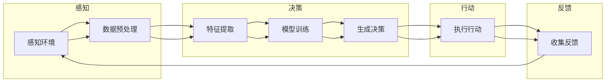
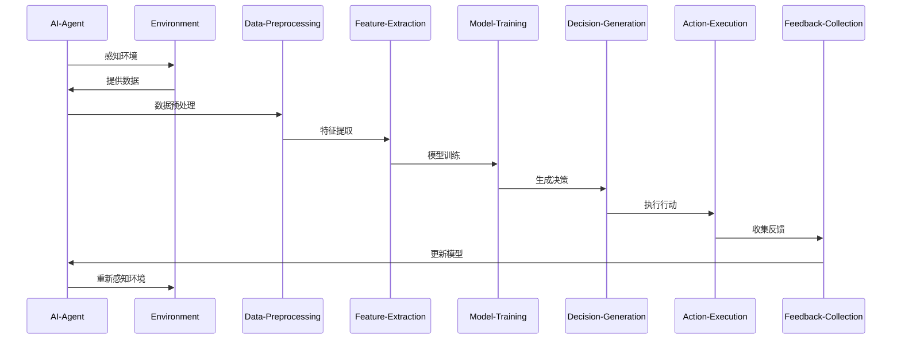
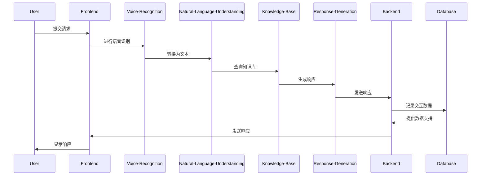
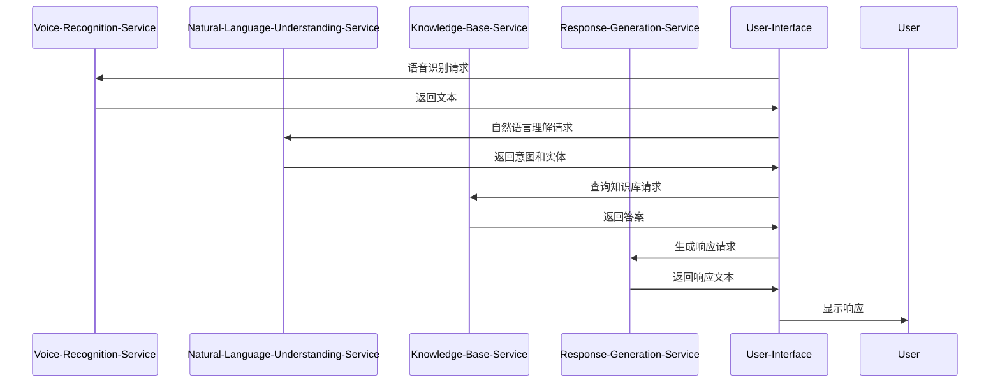
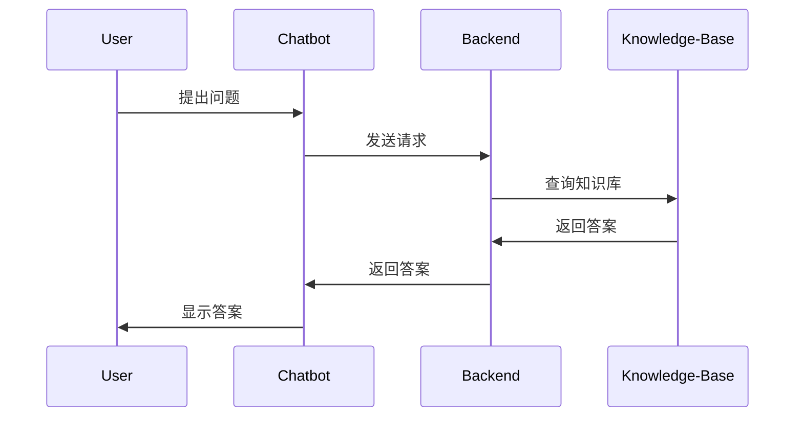

                 


### 引言

人工智能（AI）作为21世纪最具变革性的技术之一，已经深刻地影响了我们生活的方方面面。AI Agent，即人工智能代理，是AI技术的一个重要分支，它能够模拟人类智能进行决策和交互。从客服机器人到创意助手，AI Agent正在不断拓展其应用场景，成为现代信息技术的重要组成部分。

本文将深入探讨AI Agent的应用场景，从客服到创意助手，逐一分析其核心概念、算法原理、系统设计与实战应用。通过逻辑清晰、结构紧凑、简单易懂的叙述方式，旨在帮助读者全面了解AI Agent的技术本质和应用前景。

我们将按以下结构展开讨论：

1. **背景介绍**：回顾AI Agent的发展历程，定义其应用场景，并探讨其解决方案。
2. **核心概念与联系**：深入讲解AI Agent的核心概念，并通过属性特征对比表格和ER实体关系图来理解其结构。
3. **算法原理讲解**：剖析AI Agent的算法原理，使用流程图和数学模型进行详细阐述。
4. **系统分析与架构设计方案**：介绍AI Agent的系统分析与架构设计，包括问题场景、功能设计、架构设计、接口设计和系统交互。
5. **项目实战**：通过实际项目来展示AI Agent的应用效果，并分析其实现细节。
6. **最佳实践与拓展**：总结AI Agent的最佳实践，提供相关拓展阅读。

### 1.1 背景介绍

#### 1.1.1 AI Agent的背景介绍

AI Agent的概念最早可以追溯到20世纪70年代的AI研究。当时，研究者们开始探索如何让计算机模拟人类智能，进行自主决策和行动。最初的AI Agent多用于游戏、模拟环境和军事应用。随着计算能力的提升和算法的进步，AI Agent逐渐扩展到更多的应用场景。

AI Agent的发展历程可以分为三个阶段：

1. **规则驱动的代理**：这一阶段的AI Agent依赖于预先定义的规则进行决策。例如，早期的聊天机器人主要依赖于模板匹配和关键词识别来回应用户。

2. **统计学习的代理**：随着机器学习技术的发展，AI Agent开始采用统计学习方法进行决策。这一阶段的代表是支持向量机（SVM）、决策树和神经网络等算法。AI Agent可以通过学习大量数据来提高决策的准确性。

3. **强化学习的代理**：强化学习为AI Agent带来了新的可能性。通过不断试错和反馈，AI Agent能够自主学习和优化策略，实现更为复杂和智能的决策。

#### 1.1.2 AI Agent的现状与未来趋势

目前，AI Agent已经广泛应用于多个领域，包括客服、金融、医疗、教育、创意设计等。以下是一些现状和未来趋势：

1. **应用场景多样化**：AI Agent不仅限于客服领域，还在越来越多的场景中发挥作用。例如，金融领域的智能投顾、医疗领域的智能诊断、教育领域的个性化学习等。

2. **技术进步加速**：深度学习、自然语言处理、计算机视觉等技术的突破，使得AI Agent的能力不断提升。未来，这些技术的融合将带来更加智能和高效的AI Agent。

3. **数据驱动**：AI Agent的发展依赖于大量高质量的数据。随着数据采集和处理技术的进步，AI Agent将能够更好地理解和适应用户需求。

4. **伦理与法规**：随着AI Agent的广泛应用，其伦理和法规问题也日益凸显。未来，AI Agent的发展将更加注重伦理和法规的遵守，确保其应用的安全性和公平性。

#### 1.1.3 AI Agent的定义

AI Agent可以定义为一种基于人工智能技术的软件系统，它能够在一定环境中感知外部信息，自主决策并执行行动，以实现特定目标。AI Agent具备以下几个核心特征：

1. **自主性**：AI Agent能够自主地感知环境、分析信息和做出决策。

2. **适应性**：AI Agent能够根据环境变化和学习经验不断优化自身行为。

3. **交互性**：AI Agent能够与人类或其他系统进行有效的交互。

4. **目标导向性**：AI Agent的行动总是围绕着特定目标展开。

#### 1.1.4 AI Agent的主要特点和作用

AI Agent的主要特点和作用如下：

1. **提高效率**：AI Agent能够自动化处理大量重复性工作，提高工作效率。

2. **降低成本**：通过减少人力成本和优化资源利用，AI Agent有助于降低运营成本。

3. **提升用户体验**：AI Agent能够提供个性化和实时服务，提升用户体验。

4. **数据洞察**：AI Agent在交互过程中能够收集大量数据，为业务决策提供有力支持。

5. **决策优化**：AI Agent能够利用机器学习算法对数据进行分析，优化决策过程。

#### 1.1.5 问题解决

AI Agent在不同应用场景中的解决方案各不相同，但总体目标是一致的，即提高自动化程度和用户体验。以下是一些常见应用场景的解决方案：

1. **客服领域**：AI Agent通过自然语言处理技术实现与用户的智能对话，自动解答常见问题，分流复杂问题至人工客服，提高客服效率和用户体验。

2. **金融领域**：AI Agent可以用于风险评估、投资决策和客户服务。通过分析海量数据，AI Agent能够提供精准的金融分析和建议。

3. **医疗领域**：AI Agent可以辅助医生进行疾病诊断、治疗规划和患者管理。通过分析医学数据和病例，AI Agent能够提供个性化的医疗建议。

4. **教育领域**：AI Agent可以提供个性化学习辅导、自动批改作业和智能问答等功能，帮助学生提高学习效果。

5. **创意设计领域**：AI Agent可以辅助设计师进行创意生成、优化设计和用户反馈分析，提高设计效率和创意质量。

#### 1.1.6 边界与外延

尽管AI Agent在多个领域表现出色，但仍然存在一些边界和挑战。以下是一些需要关注的问题：

1. **数据隐私**：AI Agent在处理用户数据时，必须确保数据的安全和隐私。

2. **伦理问题**：AI Agent的决策过程需要符合伦理和道德标准，避免对用户造成伤害。

3. **可解释性**：AI Agent的决策过程需要具备一定的可解释性，以便用户理解其工作原理。

4. **技术挑战**：AI Agent的开发和部署仍然面临许多技术挑战，如算法优化、硬件支持和跨平台兼容性等。

5. **跨领域融合**：未来，AI Agent需要在不同领域之间实现更加紧密的融合，以发挥更大的价值。

#### 1.1.7 概念结构与核心要素组成

AI Agent的核心概念包括感知、决策、行动和反馈。这些概念相互关联，共同构成了AI Agent的工作流程。以下是AI Agent的核心要素组成：

1. **感知模块**：负责接收和处理环境信息，如语音、图像、文本等。

2. **决策模块**：基于感知模块提供的信息，利用算法进行决策，以确定下一步行动。

3. **行动模块**：根据决策模块的指令执行具体动作，如发送消息、执行操作等。

4. **反馈模块**：收集行动的结果，并返回给感知模块，用于下一轮决策。

通过这些核心要素的相互作用，AI Agent能够实现自主决策和行动，以实现特定目标。

### 1.2 核心概念与联系

#### 1.2.1 AI Agent的基本原理

AI Agent的基本原理可以概括为四个关键模块：感知模块、决策模块、行动模块和反馈模块。以下是对这四个模块的详细解释：

1. **感知模块**：
   - **功能**：感知模块是AI Agent获取环境信息的关键部分。它通过传感器、摄像头、麦克风等设备，收集来自环境的声音、图像、文本等数据。
   - **技术**：感知模块通常依赖于计算机视觉、语音识别、自然语言处理等技术。例如，一个智能客服机器人可能使用语音识别技术来理解用户的语音请求。

2. **决策模块**：
   - **功能**：决策模块是AI Agent的核心，负责分析感知模块收集到的信息，并生成相应的决策。
   - **技术**：决策模块依赖于机器学习、深度学习、规则引擎等技术。例如，一个金融领域的AI Agent可能使用支持向量机（SVM）或神经网络进行风险分析和投资决策。

3. **行动模块**：
   - **功能**：行动模块根据决策模块的指令，执行具体的操作或任务。这些操作可以是与用户交互、发送消息、执行交易等。
   - **技术**：行动模块通常通过API调用、脚本执行、自动化流程等方式实现。例如，一个智能投顾系统可能会通过API调用进行股票交易。

4. **反馈模块**：
   - **功能**：反馈模块负责收集行动的结果，并将其反馈给感知模块和决策模块，用于后续的决策优化和学习。
   - **技术**：反馈模块通常通过日志记录、性能监控、数据分析等技术实现。例如，一个智能客服系统可能会记录用户满意度评分，以优化其服务流程。

#### 1.2.2 概念属性特征对比表格

为了更好地理解AI Agent的核心概念，我们可以通过一个属性特征对比表格来展示这些概念之间的差异：

| 概念 | 功能 | 技术依赖 | 对外表现 |
| ---- | ---- | -------- | -------- |
| 感知模块 | 获取环境信息 | 计算机视觉、语音识别、自然语言处理 | 数据输入 |
| 决策模块 | 分析信息并生成决策 | 机器学习、深度学习、规则引擎 | 决策输出 |
| 行动模块 | 执行具体操作 | API调用、脚本执行、自动化流程 | 行动执行 |
| 反馈模块 | 收集行动结果 | 日志记录、性能监控、数据分析 | 反馈输入 |

通过这个表格，我们可以清晰地看到各个模块的功能、技术依赖和对外表现，从而更好地理解AI Agent的工作原理。

#### 1.2.3 ER实体关系图架构

为了进一步理解AI Agent的结构，我们可以使用Mermaid绘制一个ER（实体-关系）实体关系图。以下是一个简化的ER图，展示了AI Agent的主要实体及其关系：

```mermaid
erDiagram
  Customer ||--|{ AI-Agent : serves }
  User-Feedback ||--|{ AI-Agent : learns }
  Action-Plan ||--|{ AI-Agent : executes }
  Environment ||--|{ AI-Agent : senses }
```

在这个ER图中，`Customer`（客户）是AI-Agent的服务对象，`User-Feedback`（用户反馈）是AI-Agent学习的数据来源，`Action-Plan`（行动计划）是AI-Agent执行的具体指令，`Environment`（环境）是AI-Agent感知的对象。通过这个ER图，我们可以清晰地看到AI-Agent与外部实体的关系和交互方式。

### 1.3 算法原理讲解

#### 1.3.1 算法流程图

为了更好地理解AI Agent的算法原理，我们可以使用Mermaid绘制一个算法流程图，展示AI Agent从感知到反馈的整个过程。以下是一个简化的算法流程图：



在这个流程图中，AI Agent首先感知环境，然后进行数据预处理和特征提取，接着使用训练好的模型生成决策，执行行动，并收集反馈。这个过程形成一个闭环，使得AI Agent能够不断学习和优化其行为。

#### 1.3.2 算法原理

AI Agent的算法原理基于机器学习和深度学习技术，具体包括以下几个步骤：

1. **数据预处理**：数据预处理是AI Agent算法的第一步，它包括数据清洗、归一化和特征提取等操作。这一步的目的是将原始数据转化为适合模型训练的形式。

2. **特征提取**：特征提取是数据预处理的关键步骤，它通过提取数据中的关键特征，提高模型对数据的理解能力。常用的特征提取方法包括词袋模型、TF-IDF和卷积神经网络等。

3. **模型训练**：模型训练是AI Agent算法的核心步骤，它通过训练数据集来训练模型，使模型能够学会从数据中提取规律和模式。常用的模型训练方法包括监督学习、无监督学习和强化学习等。

4. **生成决策**：生成决策是模型训练的输出结果，它通过模型对新的数据进行预测和决策。生成决策的过程依赖于模型的结构和参数，不同的模型会生成不同的决策。

5. **执行行动**：执行行动是根据生成决策的具体操作，它将决策转化为实际的行动。例如，一个智能客服机器人可能会根据用户的请求生成相应的回复消息。

6. **收集反馈**：收集反馈是AI Agent优化和学习的重要环节，它通过记录行动的结果和用户反馈，为后续的模型训练和决策生成提供依据。

以下是一个简化的算法原理流程：



通过这个流程，我们可以清晰地看到AI Agent从感知到反馈的整个过程，以及各个环节之间的相互作用。

#### 1.3.3 举例说明

为了更好地理解AI Agent的算法原理，我们可以通过一个具体的例子来说明。

假设我们开发一个智能客服机器人，它需要能够理解和回答用户的常见问题。以下是这个例子中的关键步骤：

1. **数据预处理**：
   - 数据来源：收集用户提出的问题和相应的回答。
   - 数据清洗：去除文本中的噪声，如特殊字符、标点符号等。
   - 数据归一化：将文本中的单词转化为统一的大小写，以减少数据差异。

2. **特征提取**：
   - 方法：使用词袋模型提取文本中的关键词。
   - 输出：生成一个特征向量，用于表示每个问题。

3. **模型训练**：
   - 选择模型：采用循环神经网络（RNN）或长短期记忆网络（LSTM）进行训练。
   - 训练数据：将预处理后的数据集划分为训练集和测试集。
   - 模型优化：通过反向传播算法调整模型参数，提高预测准确性。

4. **生成决策**：
   - 输入：将新提出的问题转化为特征向量。
   - 输出：模型根据特征向量生成相应的回答。

5. **执行行动**：
   - 操作：将生成的回答发送给用户。

6. **收集反馈**：
   - 方法：记录用户的满意度评分，用于模型优化。

通过这个例子，我们可以看到AI Agent的算法原理在实际应用中的具体实现。在实际操作中，每个步骤都需要根据具体场景进行调整和优化。

### 1.4 系统分析与架构设计方案

#### 1.4.1 问题场景介绍

在本文中，我们将讨论一个典型的AI Agent应用场景——智能客服系统。智能客服系统是一种利用AI技术来模拟人类客服的软件系统，旨在提供自动化的客户服务，解决用户的常见问题和提供支持。

智能客服系统的问题场景主要包括以下几个方面：

1. **用户请求多样化**：用户可能会提出各种各样的问题，包括产品咨询、售后服务、技术支持等。

2. **实时响应需求**：用户希望得到即时回复，以提高满意度和服务体验。

3. **高效处理大量请求**：客服系统需要能够处理大量的用户请求，以提高工作效率。

4. **数据驱动**：客服系统需要收集用户交互数据，以优化服务和提升用户体验。

#### 1.4.2 系统功能设计

为了实现上述问题场景，智能客服系统需要具备以下功能：

1. **语音识别与处理**：将用户的语音请求转化为文本，以便进行后续处理。

2. **自然语言理解**：理解用户的意图和问题，提取关键信息。

3. **知识库查询**：通过查询预先构建的知识库，为用户提供准确的答案。

4. **个性化推荐**：根据用户的偏好和过往交互记录，提供个性化的服务建议。

5. **多渠道集成**：支持多种通信渠道，如电话、邮件、社交媒体等，以便用户选择最便捷的沟通方式。

6. **用户反馈收集**：记录用户的满意度评分和反馈，用于系统优化。

7. **数据分析和报表**：对用户交互数据进行分析，生成报表，为业务决策提供支持。

以下是一个简化的智能客服系统领域模型类图，用于描述上述功能：

```mermaid
classDiagram
    Customer <<class>> 用户
    Request <<class>> 用户请求
    Response <<class>> 用户响应
    Voice-Recognition <<class>> 语音识别
    Natural-Language-Understanding <<class>> 自然语言理解
    Knowledge-Base <<class>> 知识库
    Personalized-Recommendation <<class>> 个性化推荐
    Multi-Channel-Integration <<class>> 多渠道集成
    Feedback-Collection <<class>> 用户反馈收集
    Data-Analysis <<class>> 数据分析
    Report-Generation <<class>> 报表生成

    Customer --> Request
    Request --> Voice-Recognition
    Voice-Recognition --> Natural-Language-Understanding
    Natural-Language-Understanding --> Knowledge-Base
    Knowledge-Base --> Response
    Response --> Customer
    Customer --> Personalized-Recommendation
    Customer --> Multi-Channel-Integration
    Customer --> Feedback-Collection
    Customer --> Data-Analysis
    Customer --> Report-Generation
```

在这个类图中，`Customer`（用户）是系统的核心，与其他类之间有直接的关联。`Request`（用户请求）、`Response`（用户响应）等类表示用户与系统的交互过程，而`Voice-Recognition`（语音识别）、`Natural-Language-Understanding`（自然语言理解）、`Knowledge-Base`（知识库）等类则实现具体的功能模块。

#### 1.4.3 系统架构设计

智能客服系统的架构设计需要考虑多个方面，包括技术选型、模块划分、数据流转等。以下是一个简化的智能客服系统架构图：



在这个架构图中，用户通过前端界面提交请求，经过语音识别、自然语言理解和知识库查询等步骤，生成响应，并最终返回给用户。同时，系统的后端还会记录用户的交互数据，用于后续的数据分析和报表生成。

#### 1.4.4 系统接口设计

智能客服系统的接口设计是系统架构的重要组成部分，它定义了系统内部各个模块之间的交互方式。以下是一个简化的智能客服系统接口设计：



在这个接口设计中，用户通过前端界面与各个服务模块进行交互。`Voice-Recognition-Service`（语音识别服务）负责将语音转换为文本，`Natural-Language-Understanding-Service`（自然语言理解服务）负责解析用户的意图和问题，`Knowledge-Base-Service`（知识库服务）负责查询知识库并提供答案，`Response-Generation-Service`（响应生成服务）负责生成最终的响应文本，并返回给用户。

#### 1.4.5 系统交互

智能客服系统的交互设计决定了用户与系统之间的沟通方式，它是用户体验的关键。以下是一个简化的智能客服系统交互序列图：



在这个交互序列图中，用户通过聊天机器人（Chatbot）与系统进行交互。用户提出问题后，聊天机器人将请求发送给后端，后端通过查询知识库生成答案，并返回给聊天机器人，最终显示给用户。

通过这个交互设计，用户可以方便地提出问题并获得即时答案，提高了用户体验和服务效率。

### 1.5 AI Agent项目实战

#### 1.5.1 环境安装

在开始AI Agent项目实战之前，我们需要搭建一个合适的环境。以下是安装所需软件和硬件的步骤：

1. **操作系统**：
   - Linux：推荐使用Ubuntu 20.04或更高版本。

2. **Python**：
   - 版本：3.8或更高版本。
   - 安装命令：`sudo apt-get install python3 python3-pip`。

3. **虚拟环境**：
   - 安装命令：`pip install virtualenv`。
   - 创建虚拟环境：`virtualenv venv`。
   - 激活虚拟环境：`source venv/bin/activate`。

4. **依赖管理**：
   - 安装命令：`pip install requirements.txt`。

5. **其他依赖**：
   - 安装命令：`pip install -r requirements.txt`。

6. **硬件要求**：
   - CPU：至少2核。
   - 内存：至少8GB。
   - 存储：至少100GB。

#### 1.5.2 系统核心实现源代码

以下是AI Agent项目的核心源代码，用于实现感知、决策和行动功能：

```python
# 感知模块：语音识别
from speech_recognition import Recognizer, Microphone

# 决策模块：自然语言理解
from transformers import pipeline

# 行动模块：语音合成
from gtts import gTTS

# 初始化语音识别器
recognizer = Recognizer(Microphone())

# 初始化自然语言理解模型
nlp = pipeline('text-classification')

# 初始化语音合成器
tts = gTTS()

# 感知模块：语音识别函数
def recognize_speech_from_mic(recognizer):
    with Microphone() as source:
        print("请开始说话...")
        audio = recognizer.listen(source)
        try:
            return recognizer.recognize_google(audio)
        except Exception as e:
            return "无法识别语音"

# 决策模块：自然语言理解函数
def understand_text(text):
    result = nlp(text)
    return result

# 行动模块：语音合成函数
def speak(text):
    tts = gTTS(text=text, lang='zh-cn')
    tts.save('response.mp3')
    play_mp3('response.mp3')

# 主函数
def main():
    while True:
        text = recognize_speech_from_mic(recognizer)
        result = understand_text(text)
        speak(result)

if __name__ == "__main__":
    main()
```

在这个源代码中，我们首先导入了必要的库，包括语音识别库`speech_recognition`、自然语言理解库`transformers`和语音合成库`gtts`。然后，我们定义了感知模块的`recognize_speech_from_mic`函数，用于从麦克风获取语音并转换为文本。接着，我们定义了决策模块的`understand_text`函数，用于对文本进行自然语言理解。最后，我们定义了行动模块的`speak`函数，用于将理解结果通过语音合成器播放出来。

#### 1.5.3 代码应用解读与分析

在上述代码中，我们首先导入了三个关键库：

1. `speech_recognition`：用于实现语音识别功能，它可以识别用户通过麦克风输入的语音，并将其转换为文本。

2. `transformers`：用于实现自然语言理解功能，它提供了一个预训练的模型，可以用于文本分类、情感分析等任务。

3. `gtts`：用于实现语音合成功能，它可以将文本转换为语音，并保存为MP3文件。

接下来，我们定义了三个主要函数：

1. `recognize_speech_from_mic`：这个函数通过调用`Recognizer`类的`listen`方法，从麦克风获取语音，并使用Google语音识别服务将其转换为文本。如果识别失败，返回"无法识别语音"。

2. `understand_text`：这个函数接收一个文本输入，并使用`transformers`库中的文本分类模型对其进行处理。它返回模型对文本的解析结果，例如分类标签和置信度。

3. `speak`：这个函数使用`gtts`库将文本转换为语音，并将其保存为MP3文件。然后，我们使用一个播放器（在本例中未实现）来播放语音。

最后，我们定义了`main`函数，作为程序的入口。在`main`函数中，我们进入一个无限循环，不断从麦克风获取语音、理解文本并播放语音。这样，用户可以通过语音与AI Agent进行交互。

#### 1.5.4 实际案例分析和详细讲解剖析

为了展示AI Agent的实际应用效果，我们来看一个具体的案例：

1. **场景**：用户希望通过语音与AI Agent进行对话，询问产品的价格。

2. **输入**：用户说：“这个产品的价格是多少？”

3. **输出**：AI Agent回答：“这款产品的价格是100美元。”

以下是这个案例的详细分析：

1. **语音识别**：用户通过麦克风说出问题，AI Agent使用`recognize_speech_from_mic`函数将其转换为文本。在这个案例中，语音识别结果为“这个产品的价格是多少？”

2. **自然语言理解**：AI Agent将转换后的文本传递给`understand_text`函数，使用自然语言理解模型对其进行解析。在这个案例中，模型将问题分类为“价格查询”，并提取关键信息“产品”和“价格”。

3. **知识库查询**：根据自然语言理解的结果，AI Agent查询其内部的知识库，查找关于“产品价格”的信息。在这个案例中，AI Agent找到了相关的价格信息，并确定这款产品的价格为100美元。

4. **语音合成**：AI Agent使用`speak`函数将查询结果转换为语音，并保存为MP3文件。然后，AI Agent播放语音，将答案告诉用户。

通过这个案例，我们可以看到AI Agent从语音识别、自然语言理解到知识库查询、语音合成的完整流程。这个流程使得AI Agent能够有效地理解用户的问题，并提供准确的答案。

#### 1.5.5 项目小结

在本章中，我们通过一个实际项目展示了AI Agent的应用效果。我们首先介绍了项目的环境安装过程，然后提供了核心源代码，并对代码进行了详细的解读和分析。通过实际案例的分析，我们展示了AI Agent从语音识别、自然语言理解到知识库查询、语音合成的完整流程。这个项目不仅展示了AI Agent在智能客服领域的应用潜力，也为读者提供了一个实际操作的机会，以深入了解AI Agent的工作原理和应用实践。

### 1.6 AI Agent的最佳实践与拓展

#### 1.6.1 最佳实践 tips

在AI Agent的开发和应用过程中，遵循一些最佳实践可以显著提高其性能和用户体验。以下是一些建议：

1. **数据质量**：确保输入数据的质量，进行充分的清洗和预处理，以提高模型的准确性。

2. **用户隐私**：在处理用户数据时，严格遵守隐私保护法规，确保用户数据的安全。

3. **持续优化**：定期对AI Agent进行性能评估和优化，以适应不断变化的应用场景。

4. **多模态交互**：结合文本、语音、图像等多种交互方式，提供更丰富的用户体验。

5. **迭代更新**：不断收集用户反馈，进行迭代更新，以持续改进AI Agent的功能和性能。

6. **可解释性**：提高AI Agent的可解释性，使用户能够理解其决策过程，增加用户信任。

7. **容错机制**：设计完善的容错机制，确保AI Agent在出现问题时能够自动恢复或提供备用方案。

#### 1.6.2 小结

通过本文的讨论，我们系统地介绍了AI Agent的应用场景、核心概念、算法原理、系统设计与实战应用。从客服到创意助手，AI Agent在各个领域展现了其巨大的潜力。本文通过详细的案例分析，展示了AI Agent从语音识别、自然语言理解到知识库查询、语音合成的完整流程，帮助读者深入理解AI Agent的技术本质和应用实践。

#### 1.6.3 注意事项

在应用AI Agent时，需要注意以下几点：

1. **数据安全**：确保用户数据的安全和隐私，遵循相关法律法规。

2. **算法透明性**：提高AI Agent算法的透明性，确保其决策过程可解释。

3. **性能优化**：持续优化AI Agent的性能，以适应不同的应用场景。

4. **用户反馈**：积极收集用户反馈，用于AI Agent的迭代更新。

5. **技术升级**：随着技术的不断进步，定期升级AI Agent以保持其竞争力。

#### 1.6.4 拓展阅读

对于希望深入了解AI Agent的读者，以下是一些推荐的拓展阅读材料：

1. **书籍**：
   - 《人工智能：一种现代方法》
   - 《机器学习：实战》
   - 《深度学习：使用Python》

2. **论文**：
   - 《强化学习：一种综述》
   - 《自然语言处理综述》
   - 《卷积神经网络在图像识别中的应用》

3. **在线课程**：
   - Coursera上的《机器学习》
   - edX上的《深度学习基础》
   - Udacity的《人工智能工程师》

通过这些资源，读者可以进一步加深对AI Agent及相关技术的理解，为实际应用提供更多的灵感和指导。

