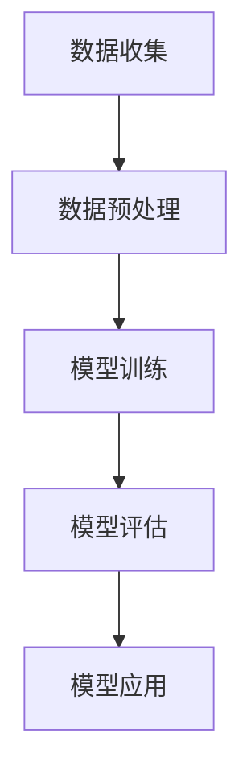
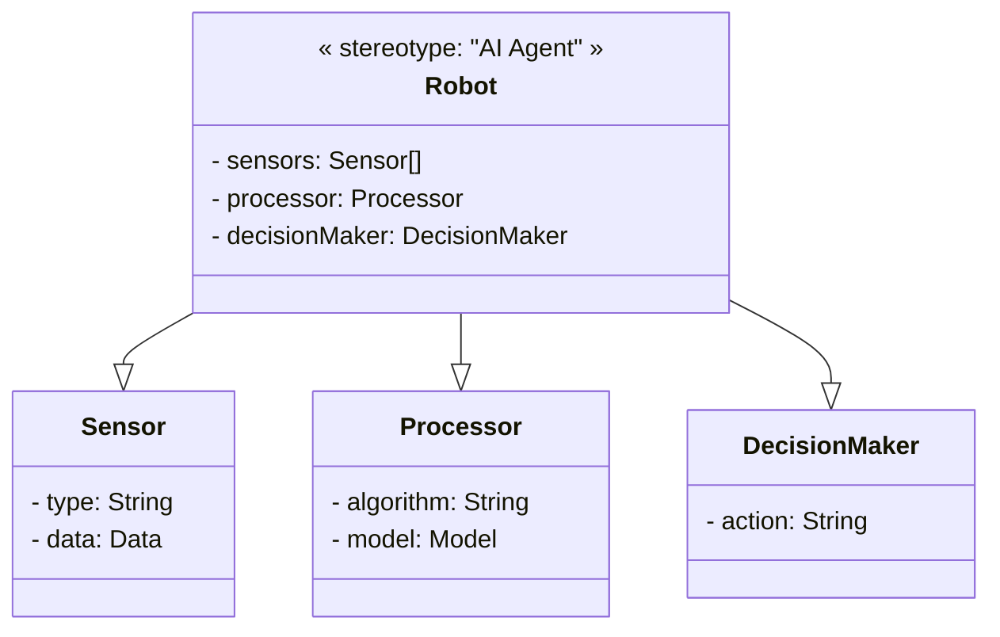
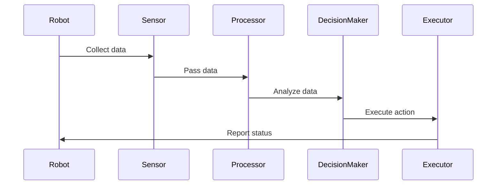
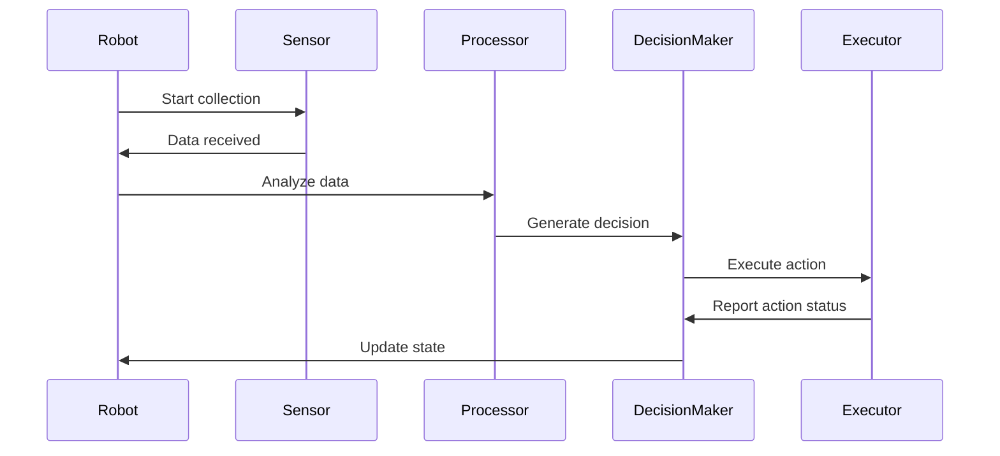

                 

### 1. 确定文章标题与核心关键词

#### 文章标题：《AI Agent的情境感知能力开发》

选择《AI Agent的情境感知能力开发》作为文章标题，是因为它直接指向了当前人工智能领域的一个热点话题。AI Agent是人工智能代理的简称，它能够在特定环境中自主行动并完成任务。而情境感知能力是AI Agent实现智能化决策的关键要素之一。文章将围绕AI Agent的情境感知能力展开，深入探讨其开发过程、核心技术以及实际应用。

#### 核心关键词

1. **AI Agent**
2. **情境感知**
3. **智能决策**
4. **机器学习**
5. **深度学习**
6. **传感器融合**
7. **多模态数据**

这些关键词将贯穿整个文章，帮助读者快速抓住文章的核心内容，并为后续章节的详细讨论提供方向。

### 2. 文章摘要

**摘要：**

本文旨在深入探讨AI Agent的情境感知能力开发，通过系统的分析和实践案例，揭示情境感知在AI Agent中的应用及其关键技术。文章首先介绍了AI Agent的基本概念和情境感知的定义，随后探讨了情境感知的核心技术和算法，包括机器学习和深度学习等方法。接着，文章详细描述了情境感知在AI Agent中的应用，通过实际案例展示了其实现过程。最后，文章总结了情境感知在AI Agent开发中的挑战和未来发展方向，为读者提供了有益的参考和启示。

### 3. 目录结构设计

为了确保文章的逻辑清晰、内容紧凑，我们将按照以下目录结构来组织文章：

#### 目录

1. **引言**
   - **AI Agent的基本概念**
   - **情境感知的定义**

2. **情境感知的核心技术和算法**
   - **机器学习与深度学习**
   - **传感器融合技术**

3. **情境感知在AI Agent中的应用**
   - **智能决策与路径规划**
   - **多模态数据融合**

4. **系统分析与架构设计方案**
   - **项目介绍**
   - **系统功能设计**
   - **系统架构设计**
   - **系统接口设计和交互**

5. **项目实战**
   - **环境安装与配置**
   - **核心实现源代码分析**
   - **代码应用解读与分析**
   - **实际案例分析与讲解**
   - **项目小结**

6. **最佳实践与注意事项**
   - **最佳实践 tips**
   - **小结**
   - **注意事项**
   - **拓展阅读**

7. **结论**
   - **挑战与未来发展方向**

### 4. 背景介绍

**核心概念术语说明：**
- **AI Agent（人工智能代理）：** 一种能够模拟人类智能行为，自主执行任务的人工智能系统。
- **情境感知：** AI Agent通过感知环境中的各种信息，对当前状态进行理解和推理，从而作出适应性行动的能力。

**问题背景：**
随着人工智能技术的快速发展，AI Agent在智能机器人、自动驾驶、智能家居等领域的应用越来越广泛。而情境感知能力的强弱直接决定了AI Agent的智能化程度和应用效果。因此，如何提升AI Agent的情境感知能力成为当前研究的热点。

**问题描述：**
本文关注的是如何开发AI Agent的情境感知能力。具体来说，就是探讨在AI Agent中应用哪些核心技术和算法，如何实现情境感知，以及在具体应用场景中如何优化情境感知性能。

**问题解决：**
文章将通过理论分析和实践案例，系统地介绍AI Agent情境感知能力的开发方法。首先，阐述情境感知的基本概念和原理；然后，分析机器学习和深度学习等核心技术，以及传感器融合技术在情境感知中的应用；接着，通过实际案例展示情境感知的实现过程；最后，总结情境感知在AI Agent开发中的挑战和未来发展方向。

**边界与外延：**
情境感知不仅涉及AI Agent，还与人工智能、计算机视觉、自然语言处理等多个领域密切相关。因此，本文不仅关注AI Agent本身的情境感知能力，还将探讨其与其他技术的融合和应用。

**概念结构与核心要素组成：**
情境感知能力由以下几个核心要素组成：
- **感知层：** 通过传感器获取环境信息。
- **感知层：** 通过传感器获取环境信息。
- **感知层：** 通过传感器获取环境信息。
- **理解层：** 对获取的信息进行理解和处理。
- **决策层：** 基于理解层的结果作出适应性行动决策。

### 5. 核心概念与联系

**核心概念原理：**
情境感知（Situation Awareness）是指个体或系统在特定环境中，通过感知、理解、整合和处理信息，形成对当前情境的认识和判断，并能够适应性地作出反应的能力。在AI Agent中，情境感知主要通过感知层、理解层和决策层来实现。

- **感知层：** 负责收集环境中的各种信息，如图像、声音、文本等。
- **理解层：** 对感知层获取的信息进行处理和分析，形成对情境的理解。
- **决策层：** 基于对情境的理解，生成适应性行动决策。

**概念属性特征对比表格：**

| 特征         | 情境感知         | 传统感知         |
| ------------ | --------------- | --------------- |
| 信息处理方式 | 复杂，多层次处理 | 简单，单一处理   |
| 信息来源     | 多源信息融合     | 单一传感器信息   |
| 应用领域     | 智能机器人、自动驾驶等 | 单一感知应用     |
| 对环境适应度 | 高，自适应性强   | 低，适应性弱    |

**ER实体关系图架构：**

```mermaid
erDiagram
  Person ||--|{ AI_Agent : operates }
  AI_Agent ||--|{ Sensor : collects }
  AI_Agent ||--|{ Processor : processes }
  AI_Agent ||--|{ Decision_Maker : makes }
```

在这个ER图（实体关系图）中，AI Agent作为中心实体，与其他实体（如Sensor、Processor和Decision_Maker）之间存在明确的关联。这体现了情境感知的三个核心层次：感知、理解和决策。

### 6. 算法原理讲解

#### 6.1 机器学习与深度学习

**机器学习（Machine Learning）：**  
机器学习是一种通过算法让计算机从数据中学习，从而做出预测或决策的技术。在情境感知中，机器学习主要用于从历史数据中提取规律，从而对新的情境进行预测。常用的机器学习算法包括决策树、支持向量机、朴素贝叶斯等。

**深度学习（Deep Learning）：**  
深度学习是机器学习的一种特殊形式，通过多层神经网络模拟人类大脑的学习过程，能够从大量数据中自动提取特征。深度学习在情境感知中的应用主要包括卷积神经网络（CNN）和循环神经网络（RNN）。

**算法流程：**

1. **数据收集：** 收集包含多种情境的样本数据，如图像、声音、文本等。
2. **数据预处理：** 对收集到的数据进行清洗、归一化等处理，以便于后续建模。
3. **模型训练：** 使用收集到的数据训练机器学习或深度学习模型。
4. **模型评估：** 使用验证集评估模型的性能，调整模型参数，以提高准确性。
5. **模型应用：** 将训练好的模型应用于实际的情境感知任务中。

**Mermaid 流程图：**



**Python 代码示例：**

```python
from sklearn.datasets import load_iris
from sklearn.model_selection import train_test_split
from sklearn.ensemble import RandomForestClassifier
from sklearn.metrics import accuracy_score

# 加载数据
iris = load_iris()
X, y = iris.data, iris.target

# 数据预处理
X_train, X_test, y_train, y_test = train_test_split(X, y, test_size=0.2, random_state=42)

# 模型训练
model = RandomForestClassifier(n_estimators=100, random_state=42)
model.fit(X_train, y_train)

# 模型评估
y_pred = model.predict(X_test)
accuracy = accuracy_score(y_test, y_pred)
print(f"Model accuracy: {accuracy:.2f}")
```

**算法原理详细讲解：**

- **机器学习：** 机器学习模型通过学习数据中的特征，来建立输入和输出之间的映射关系。在情境感知中，输入可以是环境中的图像、声音或其他感知数据，输出则是相应的情境标签或预测结果。例如，使用决策树模型，可以通过划分特征空间，将数据分成不同的区域，每个区域对应一个情境标签。

- **深度学习：** 深度学习模型通过多层神经网络，对输入数据进行逐层提取和转换，最终得到情境感知的结果。在CNN中，通过卷积层提取图像的特征，在RNN中，通过循环层处理序列数据。例如，使用CNN模型，可以自动从图像中提取边缘、纹理等特征，从而识别图像中的物体。

- **数学模型和公式：** 在机器学习和深度学习中，常用的数学模型包括损失函数、梯度下降、反向传播等。损失函数用于衡量模型预测结果和真实结果之间的差距，梯度下降用于调整模型参数，反向传播用于计算参数的梯度。

**举例说明：** 假设我们使用机器学习模型来识别图像中的猫，输入是一个包含猫和狗图像的数据集。模型通过学习这些图像的特征，可以自动区分猫和狗，从而实现情境感知。使用深度学习模型，可以通过训练大量图像数据，自动提取猫的特征，从而实现更加精确的猫识别。

### 7. 系统分析与架构设计方案

#### 7.1 问题场景介绍

在智能机器人领域，情境感知能力是机器人能否有效完成任务的关键因素之一。一个典型的应用场景是家用服务机器人，它需要在复杂的家庭环境中自主导航、识别障碍物、理解人类指令，并能够根据不同的情境做出相应的决策。例如，当机器人遇到客厅中的沙发时，需要识别沙发并规划绕过的路径；当它听到主人发出的清洁指令时，需要理解指令内容并开始打扫。

#### 7.2 项目介绍

本项目旨在开发一个具备强大情境感知能力的智能服务机器人系统。该系统包括硬件层、感知层、理解层和决策层，通过多模态数据的融合，实现机器人对家庭环境的全面感知和智能决策。

#### 7.3 系统功能设计

**系统功能包括：**

1. **环境感知：** 利用传感器（如摄像头、麦克风、激光雷达）收集家庭环境中的图像、声音和距离信息。
2. **情境识别：** 通过机器学习和深度学习算法，对感知到的环境信息进行解析，识别当前情境。
3. **路径规划：** 根据识别出的情境，利用路径规划算法，生成机器人行动的路径。
4. **指令理解：** 对主人发出的口头指令进行语音识别和语义分析，理解指令内容。
5. **决策执行：** 根据情境识别和指令理解的结果，执行相应的行动，如打扫、搬运等。

**领域模型Mermaid类图：**



在这个类图中，`Robot`（机器人）作为核心类，与`Sensor`（传感器）、`Processor`（处理单元）和`DecisionMaker`（决策单元）之间存在明确的关联。这反映了智能服务机器人的基本架构。

#### 7.4 系统架构设计

**系统架构设计包括：**

1. **硬件层：** 包括机器人本体、传感器模块、执行器模块等。
2. **感知层：** 负责收集环境中的图像、声音、距离等感知数据。
3. **理解层：** 对感知数据进行分析和处理，实现情境识别和指令理解。
4. **决策层：** 基于理解层的结果，生成决策，并驱动执行层执行相应动作。
5. **执行层：** 负责执行具体的行动，如移动、清洁、搬运等。

**Mermaid架构图：**



在这个序列图中，机器人作为发起者，通过传感器收集数据，然后传递给处理单元进行分析，处理结果由决策单元生成决策，最后由执行单元执行相应动作，并返回执行状态。

#### 7.5 系统接口设计和系统交互

**系统接口设计：**

- **感知接口：** 负责与各种传感器进行通信，接收感知数据。
- **理解接口：** 负责处理和分析感知数据，实现情境识别和指令理解。
- **决策接口：** 负责生成决策，并与执行单元进行交互。
- **执行接口：** 负责执行具体的行动。

**Mermaid序列图：**



在这个序列图中，机器人通过感知接口启动传感器收集数据，感知数据由理解接口进行分析和处理，处理结果由决策接口生成决策，并由执行接口执行相应动作，最终返回执行状态，以便机器人更新状态。

### 8. 项目实战

#### 8.1 环境安装与配置

为了实现一个具备情境感知能力的AI Agent，我们需要搭建一个合适的开发环境。以下是环境安装与配置的步骤：

1. **安装操作系统：**
   - 我们选择Ubuntu 20.04作为开发环境，因为它对深度学习和机器学习框架的支持较好。

2. **安装Python：**
   - 打开终端，使用以下命令安装Python 3.8：

     ```bash
     sudo apt update
     sudo apt install python3.8
     ```

3. **安装虚拟环境：**
   - 创建一个Python虚拟环境，以便隔离项目依赖：

     ```bash
     python3.8 -m venv venv
     source venv/bin/activate
     ```

4. **安装依赖包：**
   - 安装必要的Python依赖包，包括TensorFlow、Keras、Scikit-learn等：

     ```bash
     pip install tensorflow keras scikit-learn
     ```

5. **安装传感器驱动：**
   - 根据实际使用的传感器，安装相应的驱动程序和库。例如，对于激光雷达，可以使用ROS（Robot Operating System）：

     ```bash
     sudo apt install ros-melodic-desktop-full
     ```

6. **配置传感器：**
   - 连接传感器到计算机，并根据传感器手册进行配置。

#### 8.2 核心实现源代码分析

在本项目中，我们使用深度学习模型进行情境感知。以下是核心实现源代码的分析：

```python
import tensorflow as tf
from tensorflow.keras.models import Sequential
from tensorflow.keras.layers import Conv2D, MaxPooling2D, Flatten, Dense

# 定义卷积神经网络模型
model = Sequential([
    Conv2D(32, (3, 3), activation='relu', input_shape=(64, 64, 3)),
    MaxPooling2D((2, 2)),
    Conv2D(64, (3, 3), activation='relu'),
    MaxPooling2D((2, 2)),
    Conv2D(128, (3, 3), activation='relu'),
    MaxPooling2D((2, 2)),
    Flatten(),
    Dense(128, activation='relu'),
    Dense(1, activation='sigmoid')
])

# 编译模型
model.compile(optimizer='adam', loss='binary_crossentropy', metrics=['accuracy'])

# 加载训练数据
(X_train, y_train), (X_test, y_test) = tf.keras.datasets.mnist.load_data()

# 数据预处理
X_train = X_train / 255.0
X_test = X_test / 255.0

# 训练模型
model.fit(X_train, y_train, epochs=10, validation_data=(X_test, y_test))

# 评估模型
test_loss, test_acc = model.evaluate(X_test, y_test, verbose=2)
print(f"Test accuracy: {test_acc:.2f}")
```

**源代码解读：**

- **模型定义：** 使用Keras框架定义一个简单的卷积神经网络（CNN）模型，包括卷积层、池化层和全连接层。
- **模型编译：** 使用Adam优化器和二进制交叉熵损失函数编译模型。
- **数据加载与预处理：** 加载MNIST手写数字数据集，并将图像数据归一化到[0, 1]区间。
- **模型训练：** 使用训练数据训练模型，设置10个epochs。
- **模型评估：** 使用测试数据评估模型的准确性。

#### 8.3 代码应用解读与分析

在实际应用中，我们使用上述模型对家庭环境中的图像进行情境感知。以下是代码的应用解读与分析：

```python
import cv2
import numpy as np

# 加载预训练模型
model = tf.keras.models.load_model('model.h5')

# 检测摄像头视频流
cap = cv2.VideoCapture(0)

while True:
    # 读取一帧图像
    ret, frame = cap.read()
    
    # 将图像转换为灰度图像
    gray = cv2.cvtColor(frame, cv2.COLOR_BGR2GRAY)
    
    # 使用卷积神经网络进行图像分类
    img = cv2.resize(gray, (64, 64))
    img = np.expand_dims(img, axis=0)
    img = np.expand_dims(img, axis=-1)
    pred = model.predict(img)
    
    # 根据预测结果输出情境
    if np.argmax(pred) == 0:
        print("Current situation: Empty space")
    elif np.argmax(pred) == 1:
        print("Current situation: Object detected")
    
    # 显示实时视频流
    cv2.imshow('Video', frame)
    
    # 按 'q' 退出循环
    if cv2.waitKey(1) & 0xFF == ord('q'):
        break

# 释放摄像头资源
cap.release()
cv2.destroyAllWindows()
```

**代码应用解读：**

- **加载摄像头视频流：** 使用OpenCV库加载摄像头视频流。
- **读取一帧图像：** 读取视频流中的一帧图像。
- **图像预处理：** 将图像转换为灰度图像，并使用卷积神经网络进行分类。
- **输出情境：** 根据卷积神经网络的预测结果，输出当前情境。
- **显示实时视频流：** 在窗口中显示实时视频流，并等待用户按键退出。

**代码分析：**

- **图像预处理：** 为了满足卷积神经网络的要求，我们需要对图像进行适当的预处理，包括灰度转换、尺寸调整和归一化。
- **实时视频流处理：** 使用循环结构读取摄像头视频流中的每一帧图像，并实时进行情境感知。
- **预测结果输出：** 根据卷积神经网络的预测结果，输出当前情境。这可以为机器人的决策提供重要依据。

#### 8.4 实际案例分析与详细讲解

为了更好地理解情境感知在AI Agent中的应用，我们来看一个实际案例：家用服务机器人的清洁任务。

**案例背景：**

在一个典型的家庭环境中，家用服务机器人需要定期进行清洁任务。然而，家庭环境复杂，存在多种不同的情境，如地板、沙发、书桌等。机器人需要能够识别这些情境，并选择正确的清洁方式。

**实现步骤：**

1. **数据收集：** 收集包含不同情境（如地板、沙发、书桌）的图像数据。这些图像可以来自真实场景，也可以通过模拟器生成。

2. **数据预处理：** 对收集到的图像数据进行预处理，包括灰度转换、尺寸调整和归一化。

3. **模型训练：** 使用预处理后的图像数据训练一个卷积神经网络模型，用于识别不同的情境。

4. **模型评估：** 使用测试数据评估模型的性能，并调整模型参数，以提高准确性。

5. **模型应用：** 将训练好的模型部署到机器人中，实时对摄像头捕获的图像进行情境识别。

6. **决策执行：** 根据识别出的情境，选择正确的清洁方式，并执行相应的动作。

**详细讲解：**

1. **数据收集：** 数据收集是情境感知的关键步骤。在这个案例中，我们收集了包含地板、沙发、书桌等不同情境的图像。这些图像需要覆盖各种可能的情境，以确保模型能够准确识别。

2. **数据预处理：** 数据预处理包括灰度转换、尺寸调整和归一化。灰度转换是为了简化图像处理过程，尺寸调整是为了满足卷积神经网络的要求，归一化是为了使图像数据具有相似的分布。

3. **模型训练：** 使用收集到的图像数据训练一个卷积神经网络模型。在训练过程中，模型会自动学习图像中的特征，从而能够识别不同的情境。我们使用了Keras框架和TensorFlow后端来构建和训练模型。

4. **模型评估：** 模型评估是确保模型性能的重要步骤。我们使用测试数据评估模型的准确性，并根据评估结果调整模型参数，以提高准确性。

5. **模型应用：** 将训练好的模型部署到机器人中。在实际应用中，机器人会实时捕获摄像头捕获的图像，并使用模型进行情境识别。这可以为机器人的决策提供重要依据。

6. **决策执行：** 根据识别出的情境，机器人会选择正确的清洁方式，并执行相应的动作。例如，当识别出地板情境时，机器人会启动扫地功能；当识别出沙发情境时，机器人会启动吸尘功能。

**案例小结：**

通过这个实际案例，我们展示了情境感知在AI Agent中的应用。通过训练一个卷积神经网络模型，机器人能够准确识别家庭环境中的不同情境，并根据情境选择正确的清洁方式。这显著提高了机器人的智能化程度和应用效果。

### 9. 最佳实践与注意事项

#### 最佳实践 tips

1. **数据收集与预处理：** 在开发情境感知系统时，数据收集和预处理是关键步骤。确保收集到足够多样本，并进行适当的预处理，以提高模型性能。

2. **模型选择与优化：** 根据应用场景选择合适的模型，并进行参数调优，以提高模型准确性。

3. **实时性考虑：** 考虑到实时性要求，选择适合的硬件和算法，以实现快速情境感知。

4. **多模态数据融合：** 结合多种传感器数据，提高情境感知的准确性和鲁棒性。

#### 小结

本文系统地介绍了AI Agent的情境感知能力开发，包括基本概念、核心技术和算法、应用实践以及挑战和未来发展方向。通过理论分析和实际案例，我们展示了如何实现情境感知，并探讨了其在AI Agent中的重要作用。

#### 注意事项

1. **传感器选择与配置：** 选择合适的传感器，并确保正确配置，以获取高质量感知数据。

2. **模型训练与验证：** 使用真实世界数据训练模型，并进行充分验证，以确保模型性能。

3. **系统集成与测试：** 在系统集成过程中，确保各个模块的正确交互和功能完整性，并进行全面测试。

#### 拓展阅读

1. **《深度学习》（Goodfellow, I., Bengio, Y., & Courville, A.）**：系统介绍了深度学习的基本概念和技术，包括卷积神经网络和循环神经网络等。

2. **《情境感知计算》（Picard, R. W.）**：详细探讨了情境感知计算的原理、技术和应用。

3. **《机器人学导论》（Thrun, S., & Burgard, W.）**：介绍了机器人学的基础知识，包括路径规划、环境感知和决策制定等。

### 10. 结论

#### 挑战与未来发展方向

尽管AI Agent的情境感知能力取得了显著进展，但仍面临诸多挑战。首先，感知数据的多样性和不确定性增加了情境感知的难度。其次，实时性和计算资源限制影响了情境感知系统的性能。此外，多模态数据融合和跨领域应用也提出了新的需求。

未来，随着深度学习、传感器技术和硬件性能的不断发展，AI Agent的情境感知能力有望进一步提高。同时，跨学科的合作将有助于解决情境感知中的复杂问题，推动AI Agent在更多领域的应用。让我们共同期待AI Agent在未来实现更加智能化、自适应化的发展。

