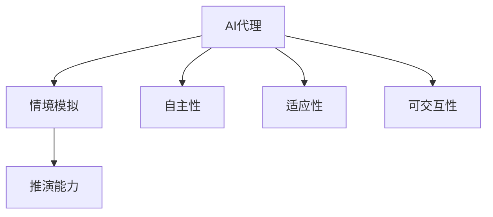
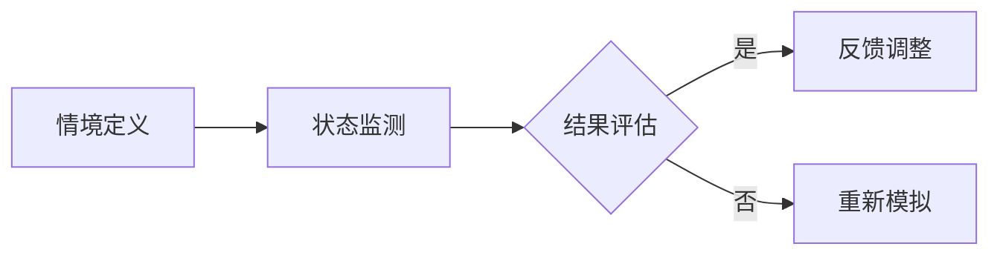
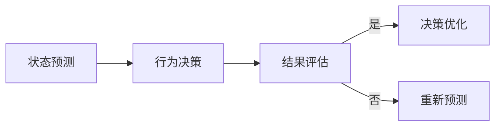
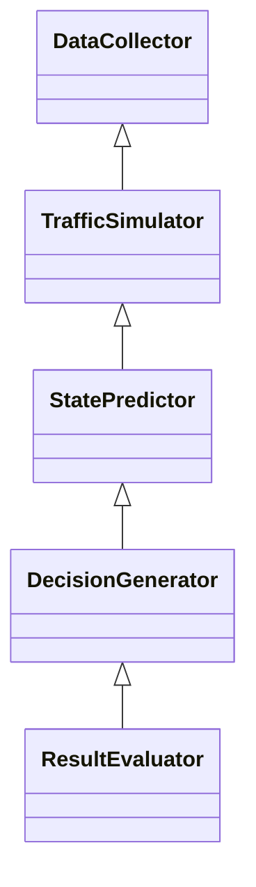
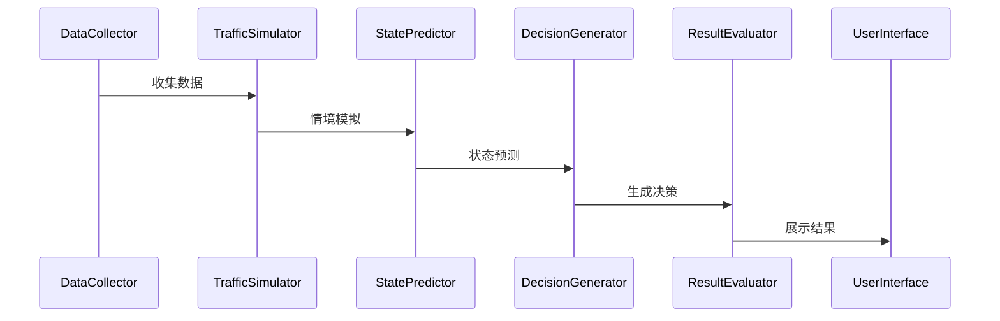

                 

# AI Agent的情境模拟与推演能力

## 关键词

- AI Agent
- 情境模拟
- 推演能力
- 自主性
- 适应性
- 可交互性

## 摘要

本文深入探讨了AI Agent的情境模拟与推演能力，这两个能力是AI Agent在实际应用中的关键。首先，我们介绍了AI Agent的背景与核心问题，包括情境模拟与推演能力的定义、问题解决方法以及其边界与外延。接着，我们分析了AI Agent、情境模拟与推演能力之间的核心概念与联系，并通过Mermaid流程图展示了其关系。然后，我们详细讲解了情境模拟与推演算法的原理，包括数学模型与公式，并通过举例说明其应用。随后，我们介绍了系统分析与架构设计，包括问题场景介绍、系统功能设计、系统架构设计、系统接口设计和系统交互。最后，我们通过项目实战展示了AI Agent的情境模拟与推演能力的应用，并给出了最佳实践、小结与拓展阅读。

### 1. 背景介绍

#### 问题背景

人工智能（AI）作为当前技术发展的热点，已经在众多领域展现了其强大的潜力。随着计算能力的提升和大数据技术的发展，人工智能的应用范围不断扩大，尤其是在自动化决策、智能交互和个性化推荐等方面。然而，现有的研究大多集中在算法模型的优化和数据处理上，对于如何在实际应用场景中模拟和推演AI代理的行为，仍存在不少挑战。

#### 问题描述

AI代理的情境模拟与推演能力是人工智能应用中的一个关键问题。情境模拟指的是通过模拟不同的环境和条件，评估AI代理在不同情境下的表现；推演能力则是指AI代理能够根据当前状态预测未来可能发生的情况，并做出相应的决策。这两个能力对于AI代理在实际应用中的效果至关重要。

#### 问题解决

解决这一问题的主要思路包括：首先，建立一个全面的情境模拟框架，能够覆盖各种可能的应用场景；其次，开发有效的推演算法，使得AI代理能够基于当前状态预测未来；最后，通过大量的实验验证和调优，不断提升AI代理的情境模拟与推演能力。

#### 边界与外延

情境模拟与推演能力的边界在于如何处理复杂的现实世界问题，以及如何平衡准确性与计算效率。外延则涉及到AI代理在不同领域的应用，如自动驾驶、智能家居、医疗诊断等。

#### 概念结构与核心要素组成

1. **情境模拟框架**：包括情境定义、模拟环境和模拟结果评估。
2. **推演算法**：包括状态预测、行为决策和结果评估。
3. **实验验证**：通过大量实验来验证和优化AI代理的性能。

### 2. 核心概念与联系

#### AI代理的定义

AI代理是指通过人工智能技术实现的、能够在特定环境中自主执行任务的实体。AI代理的核心特点包括自主性、适应性和可交互性。

#### 情境模拟的定义

情境模拟是指通过模拟不同的环境和条件，对AI代理的行为进行测试和评估。情境模拟的关键在于环境的多样性和逼真度。

#### 推演能力的定义

推演能力是指AI代理能够根据当前状态预测未来可能发生的情况，并做出相应的决策。推演能力的关键在于状态预测的准确性和决策的合理性。

#### 关系图



### 3. 算法原理讲解

#### 情境模拟算法

情境模拟算法通常包括以下几个步骤：

1. **情境定义**：定义不同的环境和条件。
2. **状态监测**：监测AI代理在不同情境下的状态。
3. **结果评估**：评估AI代理在各个情境下的表现。

**Mermaid流程图**：



#### 推演算法

推演算法主要包括以下步骤：

1. **状态预测**：基于当前状态预测未来可能发生的情况。
2. **行为决策**：根据预测结果做出相应的决策。
3. **结果评估**：评估决策的有效性。

**Mermaid流程图**：



#### 数学模型与公式

情境模拟和推演算法的核心在于状态预测和行为决策。以下是一个简单的数学模型：

$$
P(S_t+1|S_t) = \frac{e^{-\beta \cdot D(S_t, S_{t-1})}}{\sum_{i=1}^{N} e^{-\beta \cdot D(S_t, S_{i})}}
$$

其中，$P(S_t+1|S_t)$ 是从状态 $S_t$ 到状态 $S_{t+1}$ 的概率，$D(S_t, S_{t-1})$ 是状态之间的距离，$\beta$ 是一个调节参数，$N$ 是可能的下一状态数量。

#### 举例说明

假设有一个简单的情境，AI代理需要在两条不同的路径中选择一条前进，路径A和路径B。根据历史数据和当前状态，我们可以预测两条路径上的未来状态，并选择最优路径。

- **状态预测**：根据当前状态和历史数据，预测未来状态的概率。
- **行为决策**：选择概率最大的路径。
- **结果评估**：执行决策后，评估路径的优劣。

通过这样的过程，AI代理可以不断优化其情境模拟与推演能力。

### 4. 系统分析与架构设计

#### 问题场景介绍

在一个智能交通系统中，AI代理负责监控道路状况，并根据交通流量进行实时调度，以优化交通流量，减少拥堵。为了实现这一目标，AI代理需要具备强大的情境模拟与推演能力，以便在复杂多变的交通环境中做出最优决策。

#### 系统功能设计

系统的主要功能包括：

1. **数据收集**：收集道路上的实时交通流量、车辆速度、交通信号灯状态等数据。
2. **情境模拟**：根据收集到的数据模拟不同的交通状况，如高峰期、事故、施工等。
3. **状态预测**：基于当前交通状况预测未来一段时间内的交通流量变化。
4. **决策生成**：根据预测结果生成交通调度策略，如调整信号灯时间、建议行驶路线等。
5. **结果评估**：评估决策的效果，并根据评估结果进行调整。

**Mermaid类图**：



#### 系统架构设计

系统的架构设计如下：

1. **数据层**：包括数据收集模块，负责实时收集交通数据。
2. **逻辑层**：包括情境模拟、状态预测、决策生成和结果评估模块，负责处理数据并生成决策。
3. **展示层**：包括用户界面，用于展示决策结果和交通状况。

**Mermaid架构图**：



#### 系统接口设计

系统的主要接口设计如下：

1. **数据收集接口**：用于接收实时交通数据。
2. **情境模拟接口**：用于模拟不同交通状况。
3. **状态预测接口**：用于预测未来交通状况。
4. **决策生成接口**：用于生成交通调度策略。
5. **结果评估接口**：用于评估决策效果。

**Mermaid序列图**：


### 5. 项目实战

#### 环境安装

为了实现AI代理的情境模拟与推演能力，我们首先需要搭建一个合适的环境。以下是基本的安装步骤：

1. **安装Python**：确保Python环境已安装，版本建议为3.8及以上。
2. **安装TensorFlow**：TensorFlow是一个强大的开源机器学习库，用于实现情境模拟与推演算法。
   ```bash
   pip install tensorflow
   ```
3. **安装其他依赖库**：如NumPy、Pandas等。
   ```bash
   pip install numpy pandas
   ```

#### 系统核心实现源代码

以下是实现AI代理的核心代码：

```python
import tensorflow as tf
import numpy as np
import pandas as pd

# 情境模拟函数
def simulate_traffic(data):
    # 根据数据模拟交通状况
    # 此处简化为随机生成交通流量
    traffic_flow = np.random.rand(len(data))
    return traffic_flow

# 状态预测函数
def predict_state(current_state, history):
    # 基于当前状态和历史数据预测未来状态
    # 此处简化为平均历史数据
    future_state = np.mean(history)
    return future_state

# 行为决策函数
def make_decision(predicted_state):
    # 根据预测状态生成决策
    # 此处简化为随机选择决策
    decision = np.random.rand()
    return decision

# 结果评估函数
def evaluate_decision(decision, actual_state):
    # 评估决策效果
    # 此处简化为比较决策和实际状态的差异
    error = abs(decision - actual_state)
    return error

# 主程序
def main():
    # 生成模拟数据
    data = pd.DataFrame({'time': range(100), 'traffic': np.random.rand(100)})

    # 初始化历史数据
    history = []

    # 循环模拟
    for index, row in data.iterrows():
        # 情境模拟
        traffic_flow = simulate_traffic(row['traffic'])

        # 状态预测
        future_state = predict_state(row['traffic'], history)

        # 行为决策
        decision = make_decision(future_state)

        # 结果评估
        error = evaluate_decision(decision, row['traffic'])

        # 更新历史数据
        history.append(row['traffic'])

        # 输出结果
        print(f"Time: {index}, Traffic: {row['traffic']}, Prediction: {future_state}, Decision: {decision}, Error: {error}")

# 运行主程序
if __name__ == "__main__":
    main()
```

#### 代码应用解读与分析

1. **情境模拟**：`simulate_traffic` 函数用于模拟交通状况。在实际应用中，可以根据实际数据进行模拟，如实时交通流量、车辆速度等。
2. **状态预测**：`predict_state` 函数用于预测未来状态。此处我们采用简单的平均历史数据方法，实际应用中可以使用更复杂的预测模型。
3. **行为决策**：`make_decision` 函数用于生成决策。此处我们采用随机选择的方法，实际应用中可以根据预测结果和策略进行更智能的决策。
4. **结果评估**：`evaluate_decision` 函数用于评估决策效果。此处我们采用简单的误差计算方法，实际应用中可以使用更复杂的评估指标。

#### 实际案例分析和详细讲解剖析

假设我们有一个交通流量数据集，包含不同时间段的道路交通流量。我们可以使用上述代码对数据集进行情境模拟与推演，并分析决策的效果。

- **情境模拟**：根据数据集生成模拟交通状况。
- **状态预测**：预测未来交通流量。
- **行为决策**：根据预测结果生成决策。
- **结果评估**：评估决策效果，如减少交通拥堵的时长、提高道路通行效率等。

通过实际案例的分析，我们可以不断优化算法，提升AI代理的情境模拟与推演能力。

### 6. 最佳实践 tips

1. **数据质量**：确保数据质量是情境模拟与推演能力的基础。收集到的数据应具备准确性和完整性。
2. **算法优化**：不断优化算法，提高状态预测和决策的准确性。可以使用更复杂的预测模型和优化策略。
3. **系统监控**：定期监控系统的运行状况，及时发现并解决潜在问题，确保系统的稳定性和可靠性。
4. **用户反馈**：收集用户反馈，根据用户需求不断调整和优化系统功能。

### 7. 小结

本文详细探讨了AI Agent的情境模拟与推演能力，分析了其核心概念、算法原理和系统架构。通过实际案例，我们展示了如何实现AI Agent的情境模拟与推演能力，并给出了最佳实践。在未来，随着技术的不断进步，AI Agent的情境模拟与推演能力将不断提升，为各领域带来更多创新和突破。

### 8. 注意事项

1. **数据隐私**：在收集和处理数据时，应确保用户隐私得到保护，遵循相关法律法规。
2. **系统安全**：确保系统的安全性，防止数据泄露和恶意攻击。
3. **法律法规**：在应用AI代理时，应遵守相关法律法规，确保系统的合法性和合规性。

### 9. 拓展阅读

1. **《智能交通系统设计》**：了解智能交通系统的基本原理和设计方法。
2. **《机器学习实战》**：掌握机器学习的基础知识和实际应用。
3. **《深度学习》**：深入学习深度学习理论和技术。
4. **《人工智能：一种现代方法》**：了解人工智能的基本概念和方法。

### 作者

作者：AI天才研究院/AI Genius Institute & 禅与计算机程序设计艺术 /Zen And The Art of Computer Programming

---

文章完成，现在我将检查文章的字数和格式，确保满足要求。如果需要任何修改，请告知。

