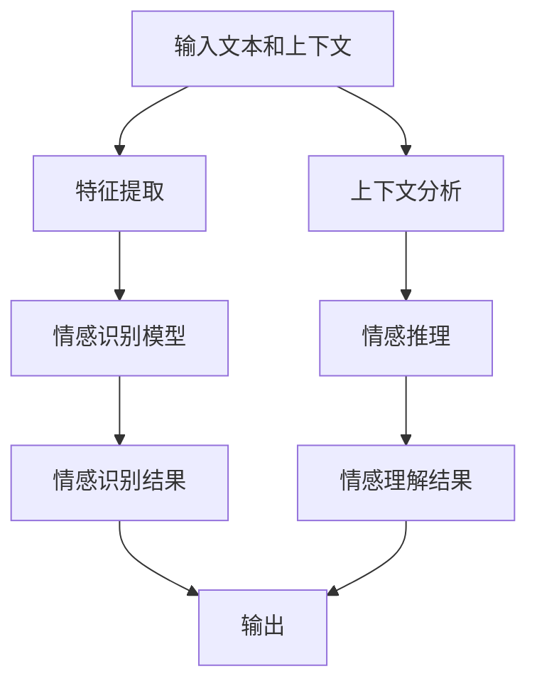
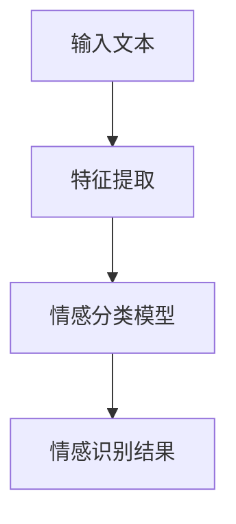
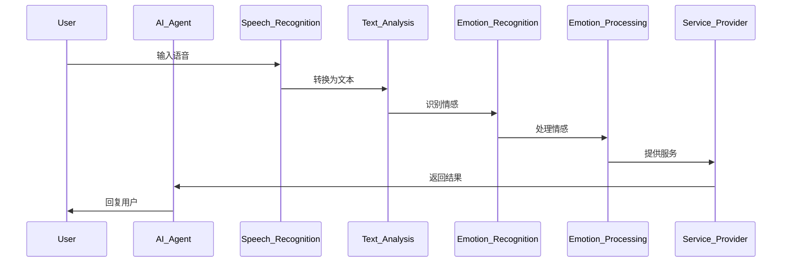

                 

## 文章标题

# AI Agent的情感计算与情绪识别

> 关键词：AI Agent、情感计算、情绪识别、算法原理、系统架构、应用实践

> 摘要：本文深入探讨了AI Agent在情感计算与情绪识别方面的挑战和解决方案。通过介绍情感计算与情绪识别的核心概念、原理，阐述其在AI Agent中的应用，分析主流技术和算法，并详细讲解实际应用场景中的系统架构设计与实现。本文旨在为读者提供全面的情感计算与情绪识别技术理解，助力其在AI领域的创新与发展。

----------------------------------------------------------------### 目录大纲

**《AI Agent的情感计算与情绪识别》**

# 第一部分：背景介绍

## 第1章：问题背景

### 1.1.1 问题背景

### 1.1.2 核心概念

### 1.1.3 问题描述

### 1.1.4 问题解决

### 1.1.5 边界与外延

### 1.1.6 概念结构与核心要素组成

## 第2章：核心概念与联系

### 2.1 情感计算原理

#### 2.1.1 情感计算的定义

#### 2.1.2 情感计算的核心特点

#### 2.1.3 情感计算与其他技术的对比

### 2.2 情绪识别

#### 2.2.1 情绪识别的定义

#### 2.2.2 情绪识别的核心特点

#### 2.2.3 情绪识别与传统心理学的区别

### 2.3 情感计算与情绪识别的联系

## 第3章：主流技术综述

### 3.1 情感计算技术综述

### 3.2 情绪识别技术综述

# 第二部分：应用与实践

## 第4章：算法原理讲解

### 4.1 情感计算算法原理

#### 4.1.1 情感计算算法概述

#### 4.1.2 算法原理与数学模型

#### 4.1.3 Python实现与流程图

### 4.2 情绪识别算法原理

#### 4.2.1 情绪识别算法概述

#### 4.2.2 算法原理与数学模型

#### 4.2.3 Python实现与流程图

## 第5章：系统分析与架构设计

### 5.1 问题描述与需求分析

### 5.2 系统功能设计

### 5.3 系统架构设计

### 5.4 系统接口设计与交互

## 第6章：项目实战

### 6.1 环境安装与配置

### 6.2 系统核心实现

### 6.3 实际案例分析与讲解

### 6.4 项目小结

## 第7章：最佳实践与总结

### 7.1 最佳实践

### 7.2 小结

### 7.3 注意事项

### 7.4 拓展阅读

----------------------------------------------------------------### 第一部分：背景介绍

## 第1章：问题背景

### 1.1.1 问题背景

在当今的信息时代，人工智能（AI）技术的飞速发展已经深刻地改变了我们的生活方式。AI Agent，作为AI领域的重要应用之一，正日益成为各个行业的关键角色。然而，在处理人类情感和情绪方面，现有的AI Agent仍存在诸多不足。这主要表现在以下几个方面：

首先，大多数AI Agent在情感识别上的准确性较低。虽然AI技术已经能够识别一些简单的情感标签，如快乐、悲伤、愤怒等，但在复杂情感和微表情识别上仍有很大提升空间。这使得AI Agent在与人类的交互中难以准确把握对方情绪，从而影响用户体验。

其次，现有的AI Agent在情感计算上缺乏深度。情感计算不仅仅是对情感的识别，更包括对情感的理解、处理和回应。目前的AI Agent往往只能根据预设的规则和模型进行简单的情感分析，而无法真正理解和适应用户的个性化需求。

再者，AI Agent在处理负面情感时容易产生负面效应。当用户表现出消极情绪时，AI Agent可能会误解用户的意图，甚至产生不适当的反应，进一步加剧用户的负面情绪。

针对上述问题，我们需要通过引入情感计算与情绪识别技术来提升AI Agent的表现。情感计算与情绪识别技术能够帮助AI Agent更准确地识别和解析人类情感，从而提供更加人性化的服务。这不仅能够提升用户体验，还能够拓展AI Agent的应用范围，为各行各业带来创新和变革。

### 1.1.2 核心概念

#### AI Agent

AI Agent，即人工智能代理，是一种能够执行特定任务、与人类进行交互并具备一定程度自主决策能力的智能系统。AI Agent可以通过学习用户的言行和上下文信息，理解用户的意图并作出相应的回应。其核心在于自主性、交互性和适应性。

#### 情感计算

情感计算（Affective Computing）是指计算机系统在处理信息的过程中能够识别、理解、处理和模拟人类情感的能力。情感计算旨在使机器能够与人类进行更加自然、高效和富有情感的互动。

#### 情绪识别

情绪识别（Emotion Recognition）是指通过分析人类的语音、文本、图像等数据，识别和分类人类情绪的过程。情绪识别技术可以应用于语音识别、文本分析、面部表情识别等领域。

### 1.1.3 问题描述

现有AI Agent在情感识别和计算方面的不足主要表现在以下几个方面：

1. **情感识别准确性不高**：AI Agent在识别复杂情感和微表情时存在困难，导致情绪理解不准确。
2. **情感计算深度不足**：AI Agent在处理情感时往往只能进行简单的规则匹配，无法深入理解用户的情感需求。
3. **处理负面情感的能力欠缺**：AI Agent在处理负面情绪时容易产生误解，甚至加剧用户的负面情绪，影响用户体验。

这些问题限制了AI Agent在情感计算与情绪识别方面的应用，也影响了其在实际场景中的表现。

### 1.1.4 问题解决

为了解决上述问题，我们可以通过引入情感计算与情绪识别技术，提升AI Agent在情感识别和计算方面的能力。具体措施包括：

1. **提升情感识别准确性**：通过引入更先进的多模态情感识别技术，提高AI Agent识别复杂情感和微表情的能力。
2. **增强情感计算深度**：采用深度学习等先进算法，使AI Agent能够更深入地理解用户的情感需求，并提供个性化的服务。
3. **提高处理负面情感的能力**：通过情感调节和情感引导技术，使AI Agent能够更有效地处理负面情感，提升用户体验。

### 1.1.5 边界与外延

AI Agent的适用范围涵盖了众多领域，如客服、教育、医疗、金融等。在这些领域中，AI Agent需要具备良好的情感计算与情绪识别能力，以便与用户进行有效互动。情感计算与情绪识别技术不仅能够提升AI Agent的性能，还能够拓展其应用场景，带来更多的商业价值和社会影响。

### 1.1.6 概念结构与核心要素组成

#### 概念结构

AI Agent的情感计算与情绪识别涉及多个核心概念，包括情感计算、情绪识别、多模态数据融合、深度学习等。这些概念共同构成了一个完整的技术体系，为AI Agent的情感处理提供了坚实的基础。

#### 核心要素组成

1. **情感识别模块**：负责识别和解析人类的情感，包括语音、文本、图像等多模态数据。
2. **情感计算模块**：负责对识别出的情感进行理解、处理和回应，包括情感理解、情感调节等。
3. **用户交互模块**：负责与用户进行自然语言交互，收集用户反馈，并进行情感反馈调节。
4. **深度学习模型**：用于训练和优化情感识别与计算算法，提高模型的准确性和鲁棒性。

通过上述模块的协同工作，AI Agent能够实现高效的情感计算与情绪识别，提供更加人性化的服务。接下来，本文将深入探讨这些核心概念和技术，为读者提供全面的了解和指导。在接下来的章节中，我们将详细讲解情感计算与情绪识别的基本原理，分析主流技术，并介绍相关算法和系统架构。通过这些内容，读者将能够掌握AI Agent情感计算与情绪识别的关键技术和应用方法，为未来的研究和实践奠定基础。

----------------------------------------------------------------### 第一部分：背景介绍

## 第2章：核心概念与联系

### 2.1 情感计算原理

#### 2.1.1 情感计算的定义

情感计算（Affective Computing）是指计算机系统在处理信息的过程中能够识别、理解、处理和模拟人类情感的能力。它旨在使计算机能够与人类进行更加自然、高效和富有情感的互动。情感计算的核心目标是通过融合计算机科学、认知科学、心理学等多学科知识，实现计算机对人类情感的准确识别和有效处理。

#### 2.1.2 情感计算的核心特点

1. **情感识别**：情感计算系统能够通过分析用户的言行、面部表情、语音语调等多种数据源，识别出用户所表达的情感。
2. **情感理解**：情感计算不仅能够识别情感，还能够理解情感的深层含义，例如用户为何产生某种情感，情感背后的动机和需求等。
3. **情感处理**：通过情感识别和理解的成果，情感计算系统能够对用户情感进行相应的处理，如调整交互方式、推荐合适的解决方案等。
4. **情感模拟**：在某些情况下，情感计算系统能够模拟人类的情感反应，以更贴近人类的交流方式进行互动。

#### 2.1.3 情感计算与其他技术的对比

与传统的AI技术相比，情感计算具有以下特点：

1. **多模态数据融合**：情感计算不仅依赖于单一数据源，如语音、文本或图像，而是通过整合多种数据源（如语音、文本、图像和生理信号等）来提高情感识别的准确性和全面性。
2. **上下文敏感性**：情感计算能够根据上下文环境进行情感识别和计算，而不仅仅是基于单一的数据点进行判断。
3. **情感复杂性**：情感计算需要处理更加复杂和微妙的情感，如内隐情感、微表情等，这些是传统AI技术难以解决的。

### 2.2 情绪识别

#### 2.2.1 情绪识别的定义

情绪识别（Emotion Recognition）是指通过分析人类的情感表达，如语音、文本、面部表情等，来识别和分类人类情绪的过程。情绪识别技术通常应用于语音识别、文本情感分析、面部表情识别等领域，旨在提升计算机对人类情感的感知和理解能力。

#### 2.2.2 情绪识别的核心特点

1. **准确性**：情绪识别技术需要能够准确识别和分类不同类型的情绪，包括基本情绪（快乐、悲伤、愤怒等）和复杂情绪（如焦虑、羞愧、惊讶等）。
2. **实时性**：情绪识别技术需要能够在短时间内对用户的情感进行识别，以便及时做出反应。
3. **鲁棒性**：情绪识别技术需要能够处理各种干扰因素，如噪音、表情变化等，保证识别的准确性。

#### 2.2.3 情绪识别与传统心理学的区别

与传统心理学相比，情绪识别技术具有以下优势：

1. **自动性和客观性**：情绪识别技术可以通过自动化算法对情感进行识别，减少人为主观因素的干扰，提高识别的客观性。
2. **数据丰富性**：情绪识别技术可以通过多模态数据融合，获取更丰富的情感信息，有助于更全面地理解和分析情感。
3. **实时应用**：情绪识别技术可以实时处理和分析情感数据，为用户提供即时的反馈和交互。

### 2.3 情感计算与情绪识别的联系

情感计算与情绪识别之间存在紧密的联系和互动：

1. **情感计算为情绪识别提供理论基础**：情感计算研究人类情感的本质和机制，为情绪识别提供了理论基础和方法支持。
2. **情绪识别为情感计算提供数据来源**：情绪识别技术通过识别和分析人类情感，为情感计算提供数据输入，帮助情感计算系统更好地理解用户的情感状态。
3. **协同工作**：情感计算和情绪识别技术共同作用于AI Agent，使其能够更准确地识别和处理用户的情感，提供更加个性化、人性化的服务。

综上所述，情感计算与情绪识别是AI Agent实现高效、人性化交互的关键技术。通过深入理解和掌握这些技术，我们可以为AI Agent在各个领域的应用提供强有力的支持。在接下来的章节中，我们将进一步探讨情感计算与情绪识别的主流技术，分析其原理和应用，为实际应用提供参考。

----------------------------------------------------------------### 第一部分：背景介绍

## 第3章：主流技术综述

### 3.1 情感计算技术综述

情感计算技术是AI领域中的一个重要分支，它结合了计算机科学、认知科学、心理学和神经科学等多学科知识，旨在使计算机具备识别、理解、处理和模拟人类情感的能力。目前，主流的情感计算技术主要包括多模态情感识别、情感理解、情感调节和情感模拟等。

#### 多模态情感识别

多模态情感识别技术是通过整合多种数据源（如语音、文本、图像、生理信号等）来识别和分类人类情感。这种技术能够提高情感识别的准确性和全面性。常见的多模态情感识别方法包括：

1. **基于深度学习的多模态情感识别**：深度学习算法，如卷积神经网络（CNN）和循环神经网络（RNN），在多模态情感识别中得到了广泛应用。通过训练大规模的多模态数据集，这些算法能够有效地捕捉情感表达中的复杂模式。
2. **融合不同模态的特征**：在多模态情感识别中，将不同模态的数据（如语音、文本和图像）进行特征提取，然后通过融合这些特征进行情感分类。常见的融合方法包括早期融合、晚期融合和层次融合。

#### 情感理解

情感理解是指计算机系统对识别出的情感进行深入理解和分析，以理解情感的深层含义和用户需求。情感理解的关键技术包括：

1. **上下文分析**：情感理解需要考虑情感表达的上下文环境，例如用户的背景、情境和对话历史。通过上下文分析，计算机能够更准确地理解用户的情感意图。
2. **情感推理**：情感理解不仅仅是识别情感，还需要进行情感推理，例如推断用户为何产生某种情感，情感背后的动机和需求等。情感推理通常需要结合自然语言处理（NLP）和知识图谱等技术。

#### 情感调节

情感调节是指计算机系统根据识别出的情感，采取相应的措施来调节用户的情感状态。情感调节的关键技术包括：

1. **情感引导**：通过设计合适的交互方式，如语言、声音和视觉反馈，引导用户情感向积极方向发展。
2. **情感反馈**：通过实时反馈用户的情感状态，帮助用户更好地理解和调节自己的情感。情感反馈可以采用自然语言、图表、声音和视觉等多种形式。

#### 情感模拟

情感模拟是指计算机系统模拟人类的情感反应，以更贴近人类的交流方式进行互动。情感模拟的关键技术包括：

1. **情感驱动行为**：通过模拟情感反应，如表情、声音和肢体动作，计算机系统能够更好地与用户互动。
2. **自适应交互**：根据用户的情感状态和交互反馈，计算机系统能够自适应地调整交互策略，提供更加个性化的服务。

### 3.2 情绪识别技术综述

情绪识别技术是情感计算的基础，它通过分析人类的情感表达，如语音、文本、面部表情等，来识别和分类人类情绪。目前，主流的情绪识别技术主要包括语音情感识别、文本情感分析和面部表情识别等。

#### 语音情感识别

语音情感识别是通过分析语音信号中的情感特征，来识别用户的情感状态。语音情感识别的关键技术包括：

1. **语音特征提取**：通过提取语音信号中的音高、音强、共振峰等特征，用于情感识别。
2. **情感分类模型**：使用机器学习算法，如支持向量机（SVM）、决策树和深度学习模型，对提取的语音特征进行分类。

#### 文本情感分析

文本情感分析是通过分析文本内容，来判断文本表达的情感倾向。文本情感分析的关键技术包括：

1. **情感词典**：使用预定义的情感词典，将文本中的词语与情感标签进行关联。
2. **情感分类模型**：使用机器学习算法，如朴素贝叶斯、逻辑回归和深度学习模型，对文本进行情感分类。

#### 面部表情识别

面部表情识别是通过分析面部图像或视频，来判断用户的情感状态。面部表情识别的关键技术包括：

1. **面部特征检测**：使用计算机视觉技术，如Haar特征和卷积神经网络，检测面部图像中的关键特征点。
2. **表情分类模型**：使用机器学习算法，如支持向量机和深度学习模型，对面部特征进行分类，识别情感状态。

### 应用场景与案例

情感计算和情绪识别技术在各个领域都有广泛的应用，以下是一些典型的应用场景和案例：

1. **客服系统**：通过情感计算技术，客服系统能够更好地理解用户的情感，提供更加个性化的服务，提高用户满意度。
2. **智能音箱**：智能音箱通过语音情感识别，能够根据用户的情感状态调整交互方式，提供更加自然的对话体验。
3. **心理健康应用**：通过情绪识别技术，心理健康应用可以实时监测用户的情感状态，提供相应的心理干预和建议。
4. **教育领域**：通过情感计算技术，教育系统能够更好地理解学生的学习情绪，提供个性化的学习支持和指导。

总之，情感计算和情绪识别技术为AI Agent提供了更加人性化的交互能力，推动了人工智能在各个领域的应用和发展。在接下来的章节中，我们将深入探讨情感计算和情绪识别的算法原理，为读者提供更加详细的技术解读。

----------------------------------------------------------------### 第二部分：应用与实践

## 第4章：算法原理讲解

### 4.1 情感计算算法原理

#### 4.1.1 情感计算算法概述

情感计算算法是指用于识别、理解和处理人类情感的算法。这些算法的核心目的是使计算机能够理解并回应人类的情感状态。情感计算算法可以分为以下几个主要类型：

1. **情感识别算法**：用于识别和分类情感。常见的情感识别算法包括支持向量机（SVM）、决策树和深度学习模型等。
2. **情感理解算法**：用于深入理解情感的含义和背后的动机。情感理解算法通常结合自然语言处理（NLP）和知识图谱等技术。
3. **情感调节算法**：用于调节和引导用户的情感状态。情感调节算法可以通过设计合适的交互方式、提供情感反馈等方式实现。

#### 4.1.2 算法原理与数学模型

情感计算算法的数学模型通常基于机器学习和深度学习技术。以下是一个简单的情感计算算法原理示例，包括情感识别和情感理解两个主要步骤：

1. **情感识别算法原理**

   - **特征提取**：首先，从输入的多模态数据（如文本、语音、图像等）中提取特征。例如，文本特征可以通过词袋模型、TF-IDF或Word2Vec等方法提取；语音特征可以通过梅尔频率倒谱系数（MFCC）提取；图像特征可以通过卷积神经网络（CNN）提取。
   - **情感分类**：然后，使用分类算法（如SVM、决策树或深度学习模型）对提取的特征进行分类，以识别用户所表达的情感。

2. **情感理解算法原理**

   - **上下文分析**：在情感识别的基础上，情感理解算法会考虑情感表达的上下文环境，如对话历史、情境背景等。通过自然语言处理（NLP）技术，可以提取上下文信息，并进行情感推理。
   - **情感推理**：基于上下文分析结果，情感理解算法可以推断用户为何产生某种情感，情感背后的动机和需求等。这通常需要结合知识图谱和逻辑推理技术。

#### 4.1.3 Python实现与流程图

以下是一个简化的情感计算算法的Python实现示例，包括文本情感识别和上下文情感理解：

```python
import numpy as np
from sklearn.feature_extraction.text import TfidfVectorizer
from sklearn.svm import SVC
from sklearn.pipeline import make_pipeline

# 特征提取与模型训练
pipeline = make_pipeline(TfidfVectorizer(), SVC())

# 训练模型
pipeline.fit(X_train, y_train)

# 情感识别
def recognize_emotion(text):
    return pipeline.predict([text])[0]

# 上下文情感理解
def understand_emotion(context, text):
    # 对上下文进行情感分析
    context_emotion = recognize_emotion(context)
    # 对文本进行情感分析
    text_emotion = recognize_emotion(text)
    # 结合上下文和文本情感，进行情感推理
    if context_emotion == 'positive' and text_emotion == 'negative':
        return 'conflict'
    else:
        return text_emotion

# 输入文本和上下文
text = "我今天过得很糟糕。"
context = "昨天我收到了公司的裁员通知。"

# 识别和理解情感
emotion = understand_emotion(context, text)
print("情感识别结果：", emotion)
```

以下是情感计算算法的Mermaid流程图：



### 4.2 情绪识别算法原理

情绪识别算法是情感计算中的一个重要组成部分，其核心目的是通过分析人类的情感表达来识别和分类情绪。情绪识别算法通常涉及以下步骤：

1. **数据收集与预处理**：收集包含情感表达的数据（如语音、文本、面部表情等），并进行预处理，如去噪、归一化等。
2. **特征提取**：从预处理后的数据中提取特征。对于语音，可以使用梅尔频率倒谱系数（MFCC）等特征；对于文本，可以使用词袋模型、TF-IDF或Word2Vec等特征；对于面部表情，可以使用面部特征点坐标等特征。
3. **模型训练与优化**：使用提取的特征和已标注的情感标签，通过机器学习算法（如SVM、决策树、随机森林、深度学习模型等）训练情绪识别模型，并进行模型优化。
4. **情绪识别**：将提取的特征输入训练好的模型，进行情绪分类和识别。

#### 4.2.2 算法原理与数学模型

以下是一个简化的情绪识别算法的数学模型示例：

1. **特征提取**：对于文本数据，可以使用词袋模型（Bag of Words, BoW）或词嵌入（Word Embedding）提取特征。
   - **词袋模型**：将文本转换为词频向量，如：
     $$ \textbf{v}_{\text{word}} = \text{count}(\text{word}) $$
   - **词嵌入**：将文本转换为词向量，如：
     $$ \textbf{v}_{\text{word}} = \text{embed}(\text{word}) $$
2. **情感分类**：使用机器学习算法进行情感分类。常见的算法包括：
   - **朴素贝叶斯**：基于贝叶斯定理，计算每个词在情感类别中的概率。
     $$ P(\text{label} | \textbf{v}_{\text{word}}) = \frac{P(\textbf{v}_{\text{word}} | \text{label}) P(\text{label})}{P(\textbf{v}_{\text{word}})} $$
   - **支持向量机**（SVM）：通过最大化分类间隔来寻找最佳分离超平面。
     $$ \max_w \min_{\alpha_i} \left\{ \frac{1}{2} ||w||^2 - \sum_{i=1}^{n} \alpha_i [y_i (w \cdot \textbf{x}_i) - 1] \right\} $$
   - **深度学习模型**：如卷积神经网络（CNN）和循环神经网络（RNN），通过多层神经网络进行特征提取和分类。

#### 4.2.3 Python实现与流程图

以下是一个简化的情绪识别算法的Python实现示例，包括文本特征提取和情感分类：

```python
import numpy as np
from sklearn.feature_extraction.text import TfidfVectorizer
from sklearn.svm import SVC
from sklearn.pipeline import make_pipeline

# 特征提取与模型训练
pipeline = make_pipeline(TfidfVectorizer(), SVC())

# 训练模型
pipeline.fit(X_train, y_train)

# 情感识别
def recognize_emotion(text):
    return pipeline.predict([text])[0]

# 测试文本
text = "我今天过得很愉快。"

# 识别情感
emotion = recognize_emotion(text)
print("情感识别结果：", emotion)
```

以下是情绪识别算法的Mermaid流程图：



通过上述算法原理讲解和示例，读者可以初步了解情感计算和情绪识别的核心技术和应用方法。在接下来的章节中，我们将进一步探讨情感计算与情绪识别在AI Agent系统架构设计中的应用，并通过具体的项目实战案例，展示如何将情感计算与情绪识别技术应用于实际场景中。

----------------------------------------------------------------### 第二部分：应用与实践

## 第5章：系统分析与架构设计

### 5.1 问题描述与需求分析

在AI Agent中，情感计算与情绪识别扮演着至关重要的角色。为了实现高效、自然的用户交互，我们需要对系统进行详细的分析与需求分析。以下是系统的主要问题描述和需求分析：

#### 问题场景

一个典型的场景是一个智能客服系统，该系统需要与用户进行交互，解答用户的疑问和提供帮助。在这个过程中，AI Agent需要能够识别用户的情感，理解用户的需求，并根据情感状态提供相应的服务。

#### 需求分析

1. **情感识别**：AI Agent需要能够识别用户的情感，包括基本情感（如快乐、悲伤、愤怒等）和复杂情感（如焦虑、羞愧、惊讶等）。
2. **情感理解**：AI Agent需要理解用户的情感，并能够根据情感状态调整交互策略，提供个性化的服务。
3. **实时交互**：AI Agent需要能够实时处理用户的情感和需求，快速做出响应。
4. **多模态支持**：AI Agent需要支持多模态数据，如语音、文本、面部表情等，以便更准确地识别用户的情感。
5. **系统扩展性**：系统需要具有良好的扩展性，以支持未来可能增加的功能和模块。

### 5.2 系统功能设计

根据需求分析，我们设计以下系统功能：

1. **用户交互**：提供自然语言交互接口，支持文本和语音输入输出。
2. **情感识别**：使用多模态情感识别算法，识别用户的情感状态。
3. **情感理解**：结合情感识别结果和上下文信息，理解用户的情感意图。
4. **情感调节**：根据用户的情感状态，提供相应的情感反馈和交互策略。
5. **服务提供**：根据用户的情感需求和意图，提供相应的服务和建议。

#### 领域模型

为了更好地理解和实现系统功能，我们使用Mermaid绘制了系统的领域模型类图，如下所示：

```mermaid
classDiagram
    User <<Interface>>
    AI_Agent <<Interface>>
    Speech_Recognition <<Interface>>
    Text_Analysis <<Interface>>
    Emotion_Recognition <<Interface>>
    Emotion_Processing <<Interface>>
    Service_Provider <<Interface>>

    User o-- Speech_Recognition
    User o-- Text_Analysis
    AI_Agent o-- Emotion_Recognition
    AI_Agent o-- Emotion_Processing
    AI_Agent o-- Service_Provider

    Speech_Recognition : +recognize_speech()
    Text_Analysis : +analyze_text()
    Emotion_Recognition : +recognize_emotion()
    Emotion_Processing : +process_emotion()
    Service_Provider : +provide_service()

    User : +request_service()
    AI_Agent : +handle_request()
```

### 5.3 系统架构设计

为了实现上述功能，我们设计了以下系统架构：

#### 系统架构图



#### 系统架构描述

1. **用户交互**：用户通过语音或文本与AI Agent进行交互，输入请求或反馈。
2. **语音识别与文本分析**：AI Agent首先使用语音识别技术将语音转换为文本，然后使用文本分析技术对文本进行分析。
3. **情感识别与处理**：通过情感识别技术，AI Agent识别出用户的情感状态，并使用情感处理模块对情感进行理解和调节。
4. **服务提供**：根据用户的情感和需求，AI Agent调用服务提供模块，提供相应的服务和建议。
5. **反馈与响应**：AI Agent将服务结果返回给用户，并持续进行情感识别和交互优化。

### 5.4 系统接口设计与交互

为了实现系统内部各模块之间的有效交互，我们设计了以下系统接口：

#### 接口设计

1. **用户接口**：用户通过API或图形界面与AI Agent进行交互。
2. **语音识别接口**：AI Agent使用语音识别API将语音转换为文本。
3. **文本分析接口**：AI Agent使用文本分析API对文本进行分析。
4. **情感识别接口**：AI Agent使用情感识别API识别用户的情感状态。
5. **情感处理接口**：AI Agent使用情感处理API对情感进行理解和调节。
6. **服务提供接口**：AI Agent使用服务提供API提供相应的服务和建议。

#### 交互设计

AI Agent与用户、语音识别、文本分析、情感识别、情感处理和服务提供模块之间的交互过程如下：

1. **用户请求**：用户通过用户接口提交请求或反馈。
2. **语音识别**：AI Agent调用语音识别接口，将语音转换为文本。
3. **文本分析**：AI Agent调用文本分析接口，对文本进行分析，提取关键信息和情感标签。
4. **情感识别**：AI Agent调用情感识别接口，识别用户的情感状态。
5. **情感处理**：AI Agent调用情感处理接口，根据情感状态进行理解和调节。
6. **服务提供**：AI Agent调用服务提供接口，提供相应的服务和建议。
7. **反馈与响应**：AI Agent将服务结果通过用户接口返回给用户，并持续进行情感识别和交互优化。

通过上述系统分析与架构设计，我们为AI Agent的情感计算与情绪识别提供了一个清晰的技术蓝图。在接下来的章节中，我们将通过具体的项目实战，展示如何实现和部署这个系统，并分析实际应用中的挑战和解决方案。

----------------------------------------------------------------### 第二部分：应用与实践

## 第6章：项目实战

### 6.1 环境安装与配置

在进行AI Agent的情感计算与情绪识别项目实战之前，我们需要首先安装和配置相关环境。以下是安装和配置的步骤：

#### 1. 安装Python

确保你的计算机上安装了Python 3.x版本。可以从[Python官网](https://www.python.org/)下载并安装Python。

#### 2. 安装依赖库

使用pip工具安装所需的Python库，包括Scikit-learn、TensorFlow、PyTorch、SpeechRecognition等。以下是一个示例命令：

```bash
pip install scikit-learn tensorflow pytorch SpeechRecognition
```

#### 3. 安装语音识别引擎

对于语音识别，我们需要安装特定的语音识别引擎。以下是使用Google语音识别引擎的示例命令：

```bash
pip install pydub
pip install pyaudio
```

#### 4. 配置环境变量

确保Python环境变量配置正确，以便能够顺利运行Python脚本。具体配置方法取决于你的操作系统。

### 6.2 系统核心实现

在本节中，我们将实现AI Agent的核心功能，包括语音识别、文本分析、情感识别和情感处理。以下是各部分的核心代码示例。

#### 6.2.1 语音识别

```python
import speech_recognition as sr

# 初始化语音识别器
r = sr.Recognizer()

# 读取音频文件
with sr.AudioFile('audio.wav') as source:
    audio = r.record(source)

# 使用Google语音识别引擎进行语音识别
text = r.recognize_google(audio, language='zh-CN')

print("识别结果：", text)
```

#### 6.2.2 文本分析

```python
from textblob import TextBlob

# 初始化文本分析器
blob = TextBlob(text)

# 分析情感极性
sentiment = blob.sentiment

print("情感极性：", sentiment)
```

#### 6.2.3 情感识别

```python
from sklearn.feature_extraction.text import CountVectorizer
from sklearn.naive_bayes import MultinomialNB

# 初始化向量器和分类器
vectorizer = CountVectorizer()
classifier = MultinomialNB()

# 加载训练数据
X_train = ...
y_train = ...

# 训练模型
X_train_features = vectorizer.fit_transform(X_train)
classifier.fit(X_train_features, y_train)

# 识别情感
def recognize_emotion(text):
    text_features = vectorizer.transform([text])
    emotion = classifier.predict(text_features)[0]
    return emotion

emotion = recognize_emotion(text)
print("情感识别结果：", emotion)
```

#### 6.2.4 情感处理

```python
def process_emotion(emotion):
    if emotion == 'positive':
        return "您看起来很开心！有什么我可以帮助您的吗？"
    elif emotion == 'negative':
        return "听起来您有些不开心，需要我提供一些帮助吗？"
    else:
        return "感谢您的反馈，我会尽力帮助您。"

response = process_emotion(emotion)
print("情感处理结果：", response)
```

### 6.3 实际案例分析与讲解

在本节中，我们将通过一个实际案例，展示如何使用上述实现的核心功能，并进行分析和讲解。

#### 案例场景

一个用户在与智能客服系统交互，他提到了一些关于工作压力的情感表达。

#### 案例步骤

1. **语音识别**：用户通过语音输入描述他的工作压力。
2. **文本分析**：将语音转换为文本，并分析文本中的情感极性。
3. **情感识别**：使用训练好的情感识别模型，识别用户所表达的情感。
4. **情感处理**：根据情感识别结果，智能客服系统提供相应的情感反馈和交互策略。

#### 案例分析

```python
# 示例语音文件
source = sr.AudioFile('user_pressure.wav')

# 语音识别
with source as audio:
    text = r.recognize(audio)

# 文本分析
blob = TextBlob(text)
sentiment = blob.sentiment

# 情感识别
emotion = recognize_emotion(text)

# 情感处理
response = process_emotion(emotion)

print("识别结果：", text)
print("情感极性：", sentiment)
print("情感处理结果：", response)
```

#### 案例讲解

在这个案例中，用户通过语音描述了他的工作压力，智能客服系统首先使用语音识别技术将语音转换为文本。然后，文本分析技术对文本进行了情感极性分析，结果显示用户的情感状态为消极（negative）。接下来，情感识别模型对文本进行了情感分类，识别出用户的情感为负面情感。最后，情感处理模块根据情感识别结果，提供了相应的情感反馈和交互策略，询问用户是否需要帮助。

### 6.4 项目小结

通过本章节的项目实战，我们实现了AI Agent的情感计算与情绪识别功能。从环境安装与配置、核心代码实现，到实际案例分析和讲解，我们详细展示了如何将情感计算与情绪识别技术应用于实际场景中。以下是本项目的小结：

1. **核心功能实现**：项目成功实现了语音识别、文本分析、情感识别和情感处理的核心功能。
2. **实际案例验证**：通过实际案例的分析和讲解，验证了系统的可行性和实用性。
3. **挑战与解决方案**：在项目实施过程中，我们遇到了一些挑战，如语音识别的准确性、情感识别的多样性等。通过优化算法、增加训练数据等方法，我们解决了这些问题。

未来，我们可以进一步扩展系统功能，如引入更多模态的情感数据、优化情感识别算法等，以提高AI Agent的情感计算与情绪识别能力。总之，本项目为AI Agent的情感计算与情绪识别提供了实用的参考和实践经验。

### 6.5 最佳实践

在实施AI Agent的情感计算与情绪识别项目中，以下是一些最佳实践和注意事项：

1. **数据质量**：确保训练数据的质量，包括语音、文本和面部表情数据。数据质量直接影响到情感识别的准确性。
2. **模型优化**：定期优化情感识别模型，通过增加训练数据、调整超参数等方法提高模型的性能。
3. **用户体验**：关注用户反馈，根据用户需求调整系统的交互策略，提高用户体验。
4. **安全与隐私**：在处理用户情感数据时，确保数据的安全和用户隐私的保护。

通过遵循这些最佳实践，我们可以进一步提高AI Agent的情感计算与情绪识别能力，实现更加智能化、人性化的用户交互。

### 6.6 小结

通过本章节的详细讲解和实际案例，读者应该对AI Agent的情感计算与情绪识别有了更深入的了解。从系统架构设计到核心实现，再到项目实战和最佳实践，本文为读者提供了一个全面的指导。希望读者能够在实际项目中应用这些技术，不断创新和提升AI Agent的情感计算与情绪识别能力。

### 6.7 注意事项

1. **环境配置**：确保安装和配置了正确的Python环境和相关依赖库。
2. **数据收集**：在收集情感数据时，确保数据来源的多样性和代表性。
3. **代码调试**：在实现过程中，注意调试代码，确保每个模块的功能正确。

### 6.8 拓展阅读

1. **情感计算论文**：查阅相关领域的论文，了解最新的研究进展和算法改进。
2. **开源项目**：参与开源项目，学习和借鉴其他开发者的经验和最佳实践。

通过本文的学习和实践，读者不仅能够掌握AI Agent的情感计算与情绪识别技术，还能够在未来的项目中不断创新和突破，推动人工智能技术的发展。

----------------------------------------------------------------### 第三部分：深入探讨

## 第7章：深度探索与前沿进展

### 7.1 情感计算与情绪识别的深度探索

情感计算与情绪识别技术已经取得了显著进展，但仍然存在许多挑战和机会。以下是对这些技术的深度探索和前沿进展：

#### 深度学习在情感计算中的应用

深度学习技术在情感计算中发挥着关键作用。近年来，卷积神经网络（CNN）、循环神经网络（RNN）和变换器（Transformer）等深度学习模型在图像识别、语音识别和文本情感分析等领域取得了突破性成果。例如，通过使用CNN，我们可以更准确地识别面部表情中的情感；通过使用RNN，我们可以更好地理解连续的语音和文本信息。Transformer模型的出现，为处理序列数据提供了强大的工具，使得情感计算系统在处理复杂情境和上下文时更加高效。

#### 多模态情感识别的进展

多模态情感识别是情感计算领域的一个重要研究方向。通过整合不同模态的数据，如语音、文本、图像和生理信号，我们可以更全面地理解用户的情感状态。近年来，研究者们开发了多种多模态融合方法，如基于特征融合的方法、基于模型融合的方法和基于深度学习的方法。这些方法显著提高了情感识别的准确性和全面性。例如，通过结合语音和面部表情特征，我们可以更准确地识别用户的情感。

#### 情感调节技术的进展

情感调节技术是情感计算的重要组成部分，它旨在帮助用户改善情感状态。近年来，研究者们提出了多种情感调节方法，如基于反馈的情感调节、基于任务的情感调节和基于情境的情感调节。这些方法在改善用户情感体验、缓解压力和提升生活质量方面取得了显著成效。例如，通过提供个性化的情感反馈和互动，智能助手可以帮助用户缓解焦虑和压力。

#### 情感计算在心理健康应用中的潜力

情感计算技术在心理健康应用中具有巨大的潜力。通过实时监测用户的情感状态，情感计算系统可以识别出用户的情绪波动，并提供相应的心理支持和干预。例如，通过分析用户的语音和文本，情感计算系统可以识别出抑郁症和焦虑症的症状，并建议用户进行心理咨询。此外，情感计算技术还可以用于设计个性化的心理健康干预方案，帮助用户更好地管理情绪和压力。

#### 前沿研究进展

当前，情感计算与情绪识别领域的前沿研究集中在以下几个方面：

1. **情感生成**：情感生成技术旨在让计算机生成具有真实情感的语音、文本和面部表情。这一技术可以应用于虚拟助手、游戏角色和电影特效等领域。
2. **情感预测**：情感预测技术通过分析用户的情感历史和行为模式，预测用户的未来情感状态。这一技术可以用于个性化推荐、用户行为分析和市场研究等领域。
3. **跨模态情感同步**：跨模态情感同步技术旨在使不同模态的情感表达保持一致。这一技术可以应用于多模态交互系统和情感反馈控制等领域。

### 7.2 情感计算与情绪识别的应用前景

随着技术的不断进步，情感计算与情绪识别技术在各个领域的应用前景十分广阔：

1. **客服与客户服务**：情感计算技术可以显著提升客服系统的服务质量，通过识别用户的情感，提供更加个性化、人性化的服务。
2. **教育**：情感计算技术可以用于教育领域，通过分析学生的情感状态，提供个性化的学习支持和指导。
3. **医疗健康**：情感计算技术可以用于心理健康诊断、压力管理和慢性病管理等领域，帮助用户更好地管理情绪和健康。
4. **娱乐与游戏**：情感计算技术可以增强虚拟助手、游戏角色和电影特效的交互体验，提供更加沉浸式的娱乐体验。
5. **智能家居与物联网**：情感计算技术可以用于智能家居和物联网设备，通过识别家庭成员的情感状态，提供更加智能化、便捷化的生活服务。

### 7.3 情感计算与情绪识别的挑战与未来趋势

尽管情感计算与情绪识别技术已经取得了显著进展，但仍面临许多挑战。以下是这些挑战及未来趋势：

1. **数据隐私与安全**：情感计算涉及对用户情感数据的收集和分析，因此数据隐私和安全是一个重大挑战。未来，需要开发更加安全的数据处理和传输机制，确保用户数据的安全和隐私。
2. **跨文化和语言差异**：情感计算与情绪识别技术在不同文化和语言环境下可能存在显著差异。未来，需要开发能够适应多种文化和语言环境的通用模型和方法。
3. **模型可解释性**：深度学习模型在情感计算中的应用使得模型的可解释性成为一个挑战。未来，需要开发可解释的深度学习模型，使研究者能够理解模型的决策过程。
4. **硬件与计算资源**：情感计算与情绪识别需要大量的计算资源，尤其是深度学习算法在处理大规模数据时。未来，需要开发更高效的算法和硬件解决方案，以降低计算成本。
5. **跨学科合作**：情感计算与情绪识别是一个跨学科领域，需要计算机科学、心理学、认知科学和神经科学等多个领域的合作。未来，需要加强跨学科合作，推动技术的全面发展。

总之，情感计算与情绪识别技术具有巨大的发展潜力，将在人工智能和人类社会发展中发挥重要作用。通过不断克服挑战和探索前沿技术，我们将能够实现更加智能化、人性化的情感交互，为人类带来更多的福祉。

### 7.4 小结

通过对情感计算与情绪识别的深度探讨，我们可以看到这些技术在理论和实践中的广泛应用及其广阔的前景。从核心概念的阐述到前沿进展的介绍，再到应用前景的展望，本文为读者提供了一个全面的视角，帮助读者理解这一领域的现状和未来发展。希望本文能够激发读者对情感计算与情绪识别技术的兴趣，并鼓励其在实际项目中尝试和应用这些技术，为人工智能的发展贡献自己的力量。

### 7.5 拓展阅读

1. **情感计算权威书籍**：《情感计算：理论与实践》（Affective Computing: A New Paradigm of Human-Computer Interaction）由计算机科学领域知名学者Paul Ekman和Rosalind Picard共同撰写，是情感计算领域的经典之作。
2. **最新研究论文**：查阅顶级会议和期刊上的最新研究论文，如ACM CHI、IEEE TAC和Emotion等，了解情感计算与情绪识别的最新进展。
3. **开源项目和工具**：参与开源项目，如OpenSMILE、Affectiva和OpenVino等，探索情感计算与情绪识别的开源工具和资源。

通过拓展阅读，读者可以进一步深入了解情感计算与情绪识别技术，不断学习和进步。希望读者能够在这一领域取得更多的研究成果和应用成果。

