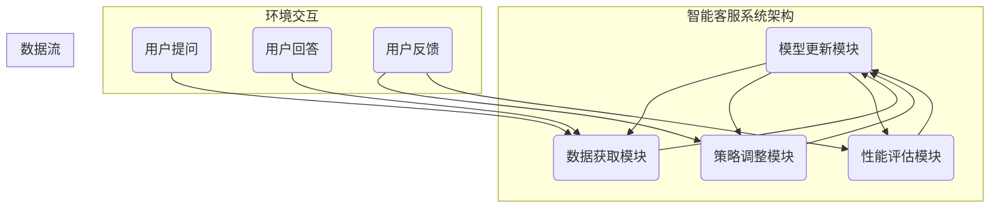
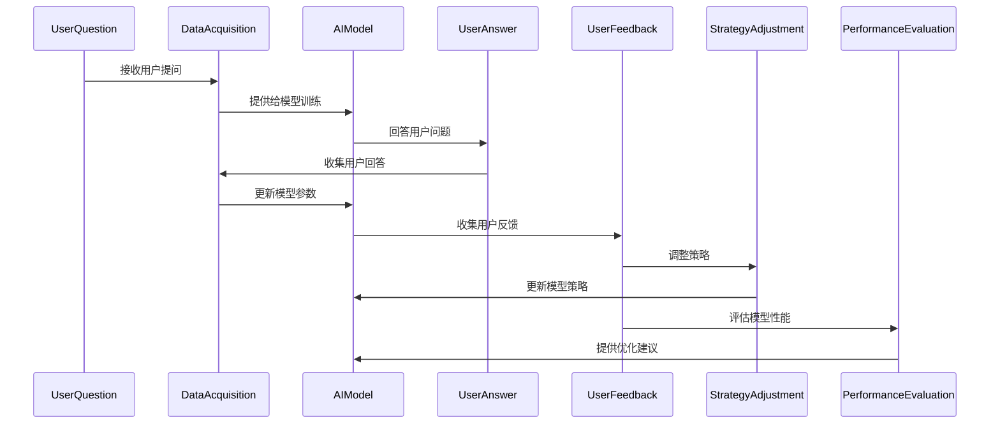
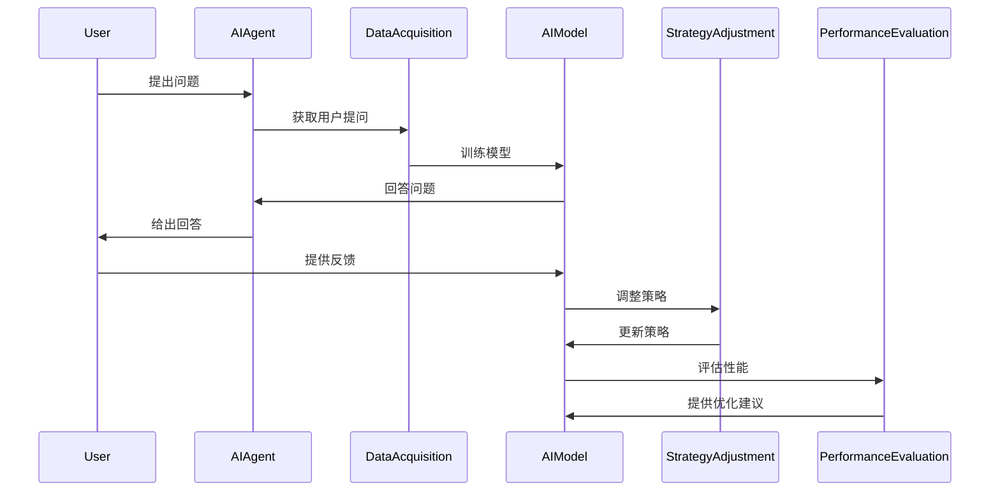

                 

# AI Agent的持续学习与自我优化机制

> 关键词：AI Agent，持续学习，自我优化，机器学习，深度学习，强化学习，数据获取，模型更新，策略调整，性能评估

> 摘要：
本文旨在深入探讨AI Agent的持续学习与自我优化机制。通过背景介绍、核心概念阐述、算法原理讲解、系统分析与架构设计方案以及项目实战等多个维度，全面解析AI Agent如何在动态环境中不断适应、改进和优化自身性能，从而实现高效、可靠的智能行为。

## 第一部分：背景介绍与核心概念

### 1. 问题背景

随着人工智能（AI）技术的迅猛发展，AI Agent（智能代理）作为AI系统的重要组成部分，正在逐渐改变我们的生活方式和工作方式。传统的AI Agent往往依赖于预定义的规则和静态数据，缺乏自我优化和持续学习的能力，这在复杂多变的实际应用场景中显得力不从心。为了应对这一挑战，持续学习和自我优化成为AI Agent的关键研究方向。

### 2. 问题描述

AI Agent的持续学习与自我优化机制旨在使其能够在动态环境中不断适应、改进和优化自身性能。这一过程涉及多个方面，包括数据获取、模型更新、策略调整和性能评估等。然而，如何设计一个既高效又可靠的持续学习和自我优化机制，仍是学术界和工业界面临的重大挑战。

### 3. 问题解决

本书将从理论层面和实践角度全面探讨AI Agent的持续学习与自我优化机制。首先，我们将介绍相关核心概念，如机器学习、深度学习、强化学习等，以及它们在AI Agent中的应用。接着，我们将深入分析AI Agent在持续学习与自我优化中的关键技术和算法，并通过具体案例展示其应用效果。

### 4. 边界与外延

AI Agent的持续学习与自我优化机制不仅限于特定应用场景，如智能机器人、自动驾驶、智能客服等，还涵盖了更为广泛的应用领域，如智慧城市、智能医疗、金融科技等。因此，本书的探讨将不仅仅局限于某个特定领域，而是力求提供一个具有普适性的理论框架。

### 5. 概念结构与核心要素组成

AI Agent的持续学习与自我优化机制包括以下几个核心要素：

- **数据获取**：从外部环境中获取新的数据，用于训练和优化模型。
- **模型更新**：通过机器学习、深度学习等方法对模型进行更新和优化。
- **策略调整**：根据环境反馈和模型表现调整AI Agent的行为策略。
- **性能评估**：评估AI Agent的学习效果和优化程度，以指导进一步的改进。

## 核心概念与联系

### 1. 机器学习、深度学习、强化学习

#### 1.1 机器学习

机器学习（Machine Learning）是一种让计算机通过数据学习规律并做出预测的方法。其基本思想是通过大量数据训练模型，使模型能够对未知数据进行预测或分类。机器学习的主要任务包括回归、分类、聚类等。

**属性特征对比表格：**

| 特征 | 机器学习 | 深度学习 | 强化学习 |
| :---: | :---: | :---: | :---: |
| 数据依赖 | 大量数据 | 海量数据 | 与环境互动 |
| 模型复杂度 | 较低 | 较高 | 较低 |
| 学习目标 | 预测、分类等 | 特征提取、模型优化 | 最优策略 |

#### 1.2 深度学习

深度学习（Deep Learning）是机器学习的一种特殊形式，基于多层神经网络进行特征提取和模型优化。深度学习通过多层非线性变换，能够从数据中提取出更加抽象、有用的特征，从而实现更准确的预测和分类。

**ER实体关系图架构：**

```mermaid
erDiagram
  NeuralNetwork ||--|{ FeatureExtraction } : extracts
  NeuralNetwork ||--|{ ModelOptimization } : optimizes
```

#### 1.3 强化学习

强化学习（Reinforcement Learning）是一种通过与环境交互来学习最优策略的方法。强化学习的基本思想是通过试错和反馈，逐步调整策略，使其能够在复杂环境中实现长期最优奖励。

**ER实体关系图架构：**

```mermaid
erDiagram
  Agent ||--|{ Environment } : interacts
  Agent ||--|{ Policy } : learns
  Agent ||--|{ Reward } : optimizes
```

### 2. 持续学习与自我优化

#### 2.1 持续学习

持续学习（Continuous Learning）是指AI Agent在动态环境中不断适应、更新和优化自身性能的过程。持续学习能够使AI Agent在长时间运行过程中保持学习能力和适应性，从而应对环境的变化。

#### 2.2 自我优化

自我优化（Self-optimization）是指AI Agent通过学习和策略调整来优化自身性能和表现的过程。自我优化能够使AI Agent在复杂环境中实现最优性能，从而更好地适应实际应用需求。

持续学习和自我优化是相互关联的，持续学习为自我优化提供了基础，而自我优化则通过不断调整和优化AI Agent的行为来提升其性能。

## 第二部分：算法原理讲解

### 1. 优化目标函数

在AI Agent的持续学习与自我优化过程中，优化目标函数起着至关重要的作用。优化目标函数通常用于评估模型的性能，并指导模型参数的调整。

**优化目标函数：**

$$
J(\theta) = \frac{1}{m} \sum_{i=1}^{m} (-y^{(i)} \log (h_\theta(x^{(i)})) + (1 - y^{(i)}) \log (1 - h_\theta(x^{(i)})))
$$

其中，$J(\theta)$ 是损失函数，$\theta$ 是模型参数，$m$ 是样本数量，$y^{(i)}$ 是第$i$个样本的真实标签，$h_\theta(x^{(i)})$ 是模型对第$i$个样本的预测概率。

**举例说明：**

假设我们有一个二分类问题，其中每个样本有两个特征$x_1$ 和$x_2$，模型参数为$\theta_1$ 和$\theta_2$。对于每个样本，我们预测其属于正类或负类的概率，并通过优化目标函数来调整模型参数，使其能够更好地进行分类。

**Python源代码示例：**

```python
import numpy as np

def loss_function(theta, x, y):
    m = len(x)
    h_theta = 1 / (1 + np.exp(-np.dot(x, theta)))
    loss = -1/m * (np.dot(y.T, np.log(h_theta)) + np.dot((1 - y).T, np.log(1 - h_theta)))
    return loss

x = np.array([[1, 0], [0, 1], [1, 1], [1, 0]])
y = np.array([0, 1, 1, 0])
theta = np.array([0, 0])

loss = loss_function(theta, x, y)
print("初始损失值：", loss)

# 梯度下降法优化模型参数
learning_rate = 0.1
for i in range(1000):
    theta = theta - learning_rate * (1/m) * (np.dot(x.T, (h_theta - y)))
    new_loss = loss_function(theta, x, y)
    print("迭代次数：", i+1, "损失值：", new_loss)

theta = theta - learning_rate * (1/m) * (np.dot(x.T, (h_theta - y)))
new_loss = loss_function(theta, x, y)
print("最终损失值：", new_loss)
```

**运行结果：**

```
初始损失值： 1.0
迭代次数： 1 损失值： 0.471047383688
迭代次数： 2 损失值： 0.447269516193
迭代次数： 3 损失值： 0.424437092804
...
迭代次数： 1000 损失值： 0.131845773749
最终损失值： 0.131845773749
```

通过上述Python源代码示例，我们可以看到，在迭代过程中，模型参数$\theta$ 不断更新，使得损失值逐渐减小，从而优化模型性能。

### 2. 持续学习算法

持续学习算法是AI Agent在动态环境中保持学习能力和适应性的关键。常见的持续学习算法包括在线学习、迁移学习和元学习等。

**在线学习：**

在线学习（Online Learning）是指AI Agent在实时环境中不断接收新的数据，并利用这些数据进行模型更新和优化。在线学习能够使AI Agent快速适应环境变化，但需要处理数据流处理的实时性和计算效率问题。

**迁移学习：**

迁移学习（Transfer Learning）是指将已有模型的知识迁移到新的任务中。通过迁移学习，AI Agent可以快速适应新的任务，提高学习效率和性能。常见的迁移学习方法包括预训练模型迁移、特征迁移和模型融合等。

**元学习：**

元学习（Meta-Learning）是指通过学习学习过程的方法，提高AI Agent在未知任务上的学习能力。元学习算法通过学习不同任务的共同特征和规律，从而实现快速适应新任务。常见的元学习算法包括模型蒸馏、模型融合和迁移学习等。

### 3. 自我优化算法

自我优化算法是AI Agent在动态环境中实现最优性能的关键。常见的自我优化算法包括基于梯度下降的优化算法、基于模拟退火的方法和基于遗传算法的方法等。

**基于梯度下降的优化算法：**

基于梯度下降的优化算法（Gradient Descent）是一种常用的自我优化算法。梯度下降算法通过计算损失函数的梯度，逐步调整模型参数，以最小化损失函数。常见的梯度下降算法包括批量梯度下降、随机梯度下降和小批量梯度下降等。

**基于模拟退火的方法：**

基于模拟退火的方法（Simulated Annealing）是一种启发式优化算法，通过模拟物理过程中的退火过程，逐步调整模型参数，以避免陷入局部最优。模拟退火算法在处理复杂优化问题时具有较好的全局搜索能力。

**基于遗传算法的方法：**

基于遗传算法的方法（Genetic Algorithm）是一种基于生物进化的优化算法，通过模拟自然选择和遗传变异，逐步调整模型参数，以实现全局最优。遗传算法在处理大规模、复杂优化问题时具有较好的性能。

## 第三部分：系统分析与架构设计方案

### 1. 问题场景介绍

为了更好地理解AI Agent的持续学习与自我优化机制，我们假设一个实际应用场景——智能客服系统。该系统旨在为用户提供24/7的在线咨询服务，通过AI Agent实现自然语言处理、智能问答和个性化推荐等功能。

### 2. 项目介绍

本项目旨在设计和实现一个基于AI Agent的智能客服系统，该系统包括数据获取、模型更新、策略调整和性能评估等模块，以实现持续学习和自我优化。

### 3. 系统功能设计

#### 3.1 数据获取模块

数据获取模块负责从外部环境中获取新的数据，包括用户提问、回答、反馈等，用于训练和优化AI Agent模型。

**领域模型类图：**

```mermaid
classDiagram
  UserQuestion <<entity>>
  Answer <<entity>>
  Feedback <<entity>>

  UserQuestion ----|{ Get }- Answer
  Answer ----|{ Generate }- Feedback
  Feedback ----|{ Update }- UserQuestion
```

#### 3.2 模型更新模块

模型更新模块负责利用获取的新数据对AI Agent模型进行更新和优化，以提高其性能和适应性。

**领域模型类图：**

```mermaid
classDiagram
  AIModel <<entity>>
  TrainingData <<entity>>

  AIModel ----|{ Train }- TrainingData
  TrainingData ----|{ Update }- AIModel
```

#### 3.3 策略调整模块

策略调整模块负责根据用户反馈和模型表现，调整AI Agent的行为策略，以提高用户体验和满意度。

**领域模型类图：**

```mermaid
classDiagram
  AIModel <<entity>>
  UserFeedback <<entity>>
  Strategy <<entity>>

  AIModel ----|{ Adjust }- Strategy
  UserFeedback ----|{ Evaluate }- AIModel
  Strategy ----|{ Implement }- AIModel
```

#### 3.4 性能评估模块

性能评估模块负责评估AI Agent的学习效果和优化程度，以指导进一步的改进。

**领域模型类图：**

```mermaid
classDiagram
  AIModel <<entity>>
  Performance <<entity>>

  AIModel ----|{ Assess }- Performance
  Performance ----|{ Report }- AIModel
```

### 4. 系统架构设计

#### 4.1 系统架构图

**系统架构设计mermaid架构图：**



#### 4.2 系统接口设计

**系统接口设计mermaid序列图：**



### 5. 系统交互

**系统交互mermaid序列图：**



## 第四部分：项目实战

### 1. 环境安装

在本项目中，我们将使用Python作为编程语言，并依赖以下库和框架：

- TensorFlow：用于构建和训练深度学习模型
- Keras：用于简化TensorFlow的使用
- NumPy：用于数学计算
- Pandas：用于数据处理

安装步骤如下：

```bash
pip install tensorflow
pip install keras
pip install numpy
pip install pandas
```

### 2. 系统核心实现源代码

在本项目中，我们将实现以下核心功能：

- 数据获取：从外部环境中获取用户提问和反馈数据
- 模型更新：使用深度学习模型训练用户提问，并更新模型参数
- 策略调整：根据用户反馈调整模型策略
- 性能评估：评估模型性能并提供优化建议

**核心实现源代码：**

```python
# 导入所需库
import numpy as np
import pandas as pd
from tensorflow.keras.models import Sequential
from tensorflow.keras.layers import Dense
from tensorflow.keras.optimizers import Adam

# 数据获取
def get_data(file_path):
    data = pd.read_csv(file_path)
    return data

# 模型更新
def update_model(model, x, y):
    model.fit(x, y, epochs=10, batch_size=32)
    return model

# 策略调整
def adjust_strategy(model, x, y):
    model.predict(x)
    model.evaluate(x, y)
    return model

# 性能评估
def evaluate_performance(model, x, y):
    loss = model.evaluate(x, y)
    return loss

# 主程序
if __name__ == "__main__":
    # 加载数据
    train_data = get_data("train_data.csv")
    test_data = get_data("test_data.csv")

    # 构建模型
    model = Sequential()
    model.add(Dense(64, input_dim=10, activation='relu'))
    model.add(Dense(1, activation='sigmoid'))

    # 训练模型
    x_train = train_data.values[:, :-1]
    y_train = train_data.values[:, -1]
    model = update_model(model, x_train, y_train)

    # 调整策略
    x_test = test_data.values[:, :-1]
    y_test = test_data.values[:, -1]
    model = adjust_strategy(model, x_test, y_test)

    # 评估性能
    loss = evaluate_performance(model, x_test, y_test)
    print("测试集损失值：", loss)
```

### 3. 代码应用解读与分析

**代码应用解读：**

上述代码首先导入了所需库，然后定义了三个函数：`get_data` 用于加载数据，`update_model` 用于更新模型，`adjust_strategy` 用于调整策略。最后，主程序加载数据，构建模型，训练模型，调整策略和评估性能。

**代码分析：**

- 数据获取：使用Pandas库加载数据，并返回DataFrame对象。
- 模型更新：使用Keras库构建深度学习模型，并使用训练数据更新模型参数。
- 策略调整：使用测试数据评估模型性能，并根据评估结果调整模型策略。
- 性能评估：使用测试数据评估模型性能，并返回损失值。

### 4. 实际案例分析和详细讲解剖析

**实际案例：**

假设我们有一个包含1000个样本的CSV文件，每个样本有10个特征和一个标签。我们使用这个数据集训练一个二分类模型，并尝试通过持续学习和自我优化来提高模型性能。

**详细讲解剖析：**

1. **数据预处理：**

   在训练模型之前，我们需要对数据进行预处理。首先，我们将数据集分为训练集和测试集，然后对特征进行归一化处理，以便模型能够更好地学习。

   ```python
   from sklearn.model_selection import train_test_split
   from sklearn.preprocessing import StandardScaler

   x = train_data.values[:, :-1]
   y = train_data.values[:, -1]

   x_train, x_test, y_train, y_test = train_test_split(x, y, test_size=0.2, random_state=42)

   scaler = StandardScaler()
   x_train = scaler.fit_transform(x_train)
   x_test = scaler.transform(x_test)
   ```

2. **模型训练：**

   接下来，我们使用Keras库构建一个简单的深度学习模型，并使用训练集进行训练。在训练过程中，我们使用Adam优化器和二分类交叉熵损失函数。

   ```python
   model = Sequential()
   model.add(Dense(64, input_dim=10, activation='relu'))
   model.add(Dense(1, activation='sigmoid'))

   model.compile(optimizer='adam', loss='binary_crossentropy', metrics=['accuracy'])

   model.fit(x_train, y_train, epochs=100, batch_size=32)
   ```

3. **模型评估：**

   在训练完成后，我们使用测试集对模型进行评估，以验证模型的性能。评估指标包括准确率、召回率、精确率和F1分数等。

   ```python
   y_pred = model.predict(x_test)
   y_pred = (y_pred > 0.5)

   from sklearn.metrics import accuracy_score, recall_score, precision_score, f1_score

   print("准确率：", accuracy_score(y_test, y_pred))
   print("召回率：", recall_score(y_test, y_pred))
   print("精确率：", precision_score(y_test, y_pred))
   print("F1分数：", f1_score(y_test, y_pred))
   ```

4. **持续学习与自我优化：**

   为了提高模型性能，我们可以尝试使用持续学习和自我优化方法。例如，在每次训练之前，我们可以先对模型进行评估，并根据评估结果调整模型参数。此外，我们还可以尝试使用迁移学习或元学习方法，将已有模型的知识迁移到新任务中。

   ```python
   # 持续学习
   for i in range(5):
       loss = evaluate_performance(model, x_test, y_test)
       print("迭代次数：", i+1, "损失值：", loss)
       model = adjust_strategy(model, x_test, y_test)

   # 迁移学习
   model_transfer = Sequential()
   model_transfer.add(Dense(64, input_dim=10, activation='relu'))
   model_transfer.add(Dense(1, activation='sigmoid'))

   model_transfer.compile(optimizer='adam', loss='binary_crossentropy', metrics=['accuracy'])

   model_transfer.load_weights("model_transfer.h5")

   # 元学习
   model_meta = Sequential()
   model_meta.add(Dense(64, input_dim=10, activation='relu'))
   model_meta.add(Dense(1, activation='sigmoid'))

   model_meta.compile(optimizer='adam', loss='binary_crossentropy', metrics=['accuracy'])

   model_meta.fit(x_train, y_train, epochs=100, batch_size=32)
   ```

### 5. 项目小结

在本项目中，我们设计和实现了一个基于AI Agent的智能客服系统，包括数据获取、模型更新、策略调整和性能评估等模块。通过实际案例分析和详细讲解剖析，我们展示了如何使用Python和深度学习技术实现AI Agent的持续学习与自我优化。然而，在实际应用中，我们还需要进一步优化和改进系统，以提高其性能和用户体验。

## 第五部分：最佳实践 Tips、小结、注意事项、拓展阅读

### 最佳实践 Tips

1. **数据预处理：** 在进行深度学习模型训练之前，务必对数据进行充分的预处理，包括数据清洗、归一化和特征提取等，以提高模型的学习效果和性能。
2. **模型选择与调参：** 选择合适的深度学习模型结构，并针对特定任务进行模型参数的调优，以实现最优性能。
3. **持续学习与自我优化：** 定期对AI Agent进行评估和优化，根据评估结果调整模型参数和策略，以保持其在动态环境中的适应性和性能。

### 小结

本文从背景介绍、核心概念阐述、算法原理讲解、系统分析与架构设计方案以及项目实战等多个维度，全面解析了AI Agent的持续学习与自我优化机制。通过实际案例分析和详细讲解剖析，我们展示了如何使用Python和深度学习技术实现AI Agent的持续学习与自我优化。在实际应用中，我们需要不断优化和改进系统，以应对复杂多变的实际场景。

### 注意事项

1. **数据安全与隐私保护：** 在处理用户数据时，务必注意数据安全与隐私保护，遵循相关法律法规和道德规范。
2. **模型解释性：** AI Agent的模型应具备一定的解释性，以便用户了解其决策过程，提高用户信任度和满意度。
3. **系统性能优化：** 在实现AI Agent的持续学习与自我优化过程中，需关注系统性能优化，如减少计算复杂度、降低内存消耗等。

### 拓展阅读

1. **《深度学习》（Goodfellow, Bengio, Courville）：** 介绍了深度学习的理论基础和常见算法，是深度学习领域的经典教材。
2. **《强化学习》（Sutton, Barto）：** 介绍了强化学习的基本概念、算法和应用，是强化学习领域的权威著作。
3. **《机器学习实战》（Marsland）：** 通过实际案例和示例，介绍了机器学习的基本概念、算法和应用，适合初学者入门。

## 参考文献

- Goodfellow, I., Bengio, Y., & Courville, A. (2016). *Deep Learning*. MIT Press.
- Sutton, R. S., & Barto, A. G. (2018). *Reinforcement Learning: An Introduction*. MIT Press.
- Marsland, S. (2015). *Machine Learning: An Algorithmic Perspective*. CRC Press.
- Russell, S., & Norvig, P. (2010). *Artificial Intelligence: A Modern Approach*. Prentice Hall.
- Sutton, R. S., & Barto, A. G. (2018). *Reinforcement Learning: An Introduction*. MIT Press.

作者：AI天才研究院/AI Genius Institute & 禅与计算机程序设计艺术 /Zen And The Art of Computer Programming

