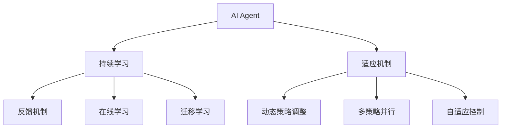
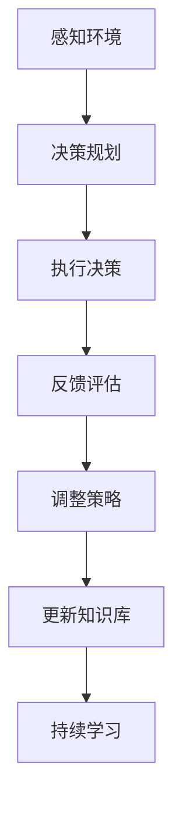
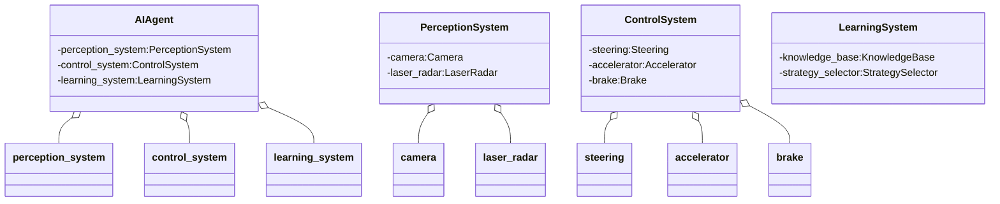
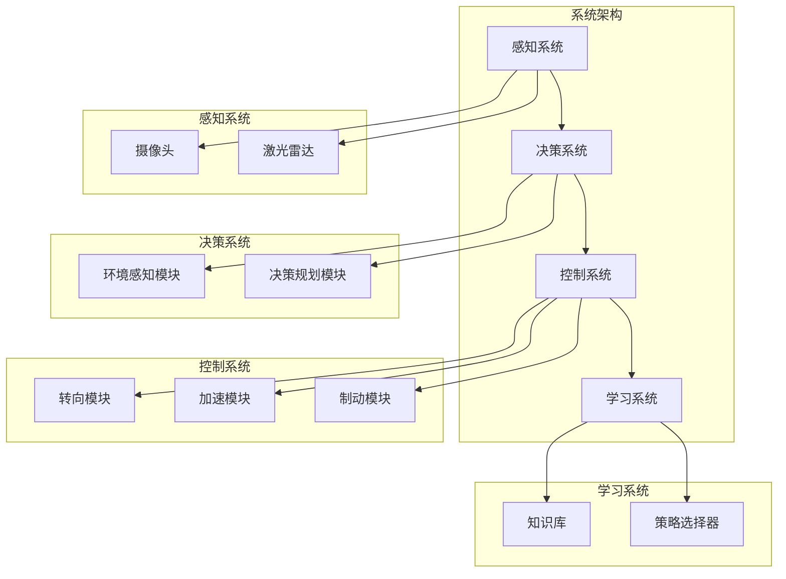
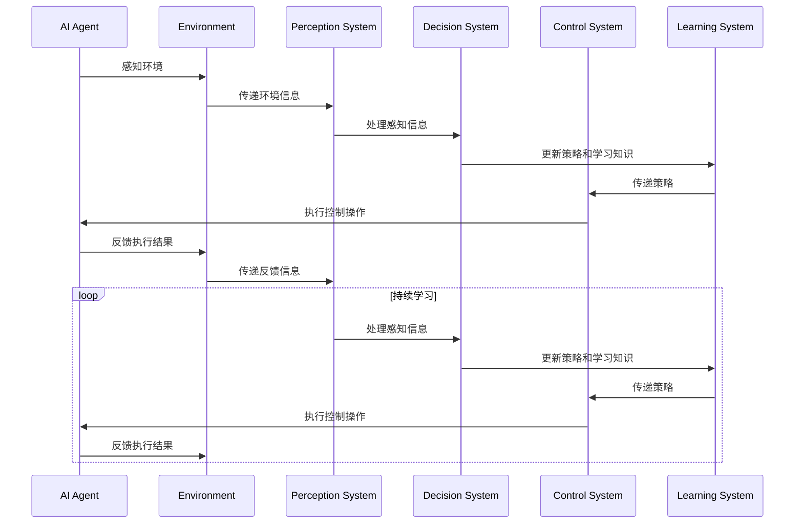

                 


# AI Agent的持续学习与适应机制

> 关键词：AI Agent，持续学习，适应机制，算法原理，系统架构，实战案例

> 摘要：
本文章深入探讨了AI Agent的持续学习与适应机制。通过背景介绍、核心概念与联系、算法原理讲解、系统分析与架构设计方案、项目实战以及最佳实践等六个部分，详细阐述了AI Agent如何通过持续学习和适应机制来应对动态变化的环境，提高任务完成的效率和准确性。文章旨在为读者提供一个全面而深入的理解，并为其在相关领域的研究和应用提供参考。

## 第一步：背景介绍

### 1.1.1 AI Agent的兴起

AI Agent是一种自主决策的智能体，它能够在没有人类干预的情况下执行任务。AI Agent的兴起可以追溯到20世纪80年代，当时研究人员开始探索如何使计算机具有自主行动的能力。随着深度学习、强化学习等技术的发展，AI Agent的应用场景日益广泛，从自动驾驶汽车、智能家居到游戏AI，AI Agent已经成为人工智能领域的重要研究方向。

### 1.1.2 持续学习与适应的重要性

持续学习与适应机制是AI Agent的核心能力之一。在动态变化的环境中，AI Agent需要不断调整其行为策略以适应新情况。持续学习使得AI Agent能够从经验中学习，提高其决策能力和准确性；适应机制则确保AI Agent能够快速响应环境变化，保持高效运行。

### 1.1.3 问题解决思路

AI Agent在持续学习和适应过程中可能会遇到以下问题：

- 数据匮乏：在某些场景下，AI Agent可能无法获取足够的数据来训练模型。
- 策略过拟合：AI Agent可能在特定环境或任务中过度适应，导致在变化后的环境中表现不佳。
- 资源限制：AI Agent在资源有限的情况下，需要优化算法以提高效率。

为解决这些问题，本文提出以下思路：

- 设计自适应学习算法，提高AI Agent在数据匮乏条件下的学习能力。
- 引入泛化机制，降低策略过拟合的风险。
- 优化算法结构，提高AI Agent的资源利用率。

### 1.1.4 边界与外延

持续学习和适应机制的应用范围广泛，但也有一些限制。例如，在极端环境下，AI Agent可能无法有效适应；在资源极其有限的情况下，持续学习和适应机制的效果可能受到限制。

### 1.1.5 概念结构与核心要素组成

AI Agent、持续学习、适应机制等核心概念的定义及其相互关系如下：

- **AI Agent**：具有自主决策能力的智能体，能够在没有人类干预的情况下执行任务。
- **持续学习**：AI Agent通过不断从经验中学习，提高其决策能力和准确性。
- **适应机制**：AI Agent能够根据环境变化调整其行为策略，保持高效运行。

## 第二步：核心概念与联系

### 2.1 AI Agent的定义与特点

AI Agent是一种具有自主决策能力的智能体，能够通过感知环境、规划行动和执行决策来完成特定任务。AI Agent的特点包括：

- **自主性**：AI Agent能够自主地执行任务，而不需要人类干预。
- **适应性**：AI Agent能够根据环境变化调整其行为策略。
- **学习性**：AI Agent能够从经验中学习，提高其决策能力和准确性。

### 2.2 持续学习的原理与方法

持续学习是指AI Agent在执行任务的过程中，不断从经验中学习，提高其决策能力和准确性。持续学习的原理包括：

- **反馈机制**：AI Agent通过接收外部反馈，调整其行为策略。
- **在线学习**：AI Agent在执行任务的过程中，实时更新其知识库。
- **迁移学习**：AI Agent能够将已有经验应用到新的任务中。

### 2.3 适应机制的概念与应用

适应机制是指AI Agent能够根据环境变化调整其行为策略，以保持高效运行。适应机制的应用包括：

- **动态策略调整**：AI Agent根据环境变化，实时调整其行为策略。
- **多策略并行**：AI Agent在多个策略之间进行切换，以适应不同的环境。
- **自适应控制**：AI Agent通过自适应控制算法，优化其行为策略。

### 2.4 ER实体关系图架构的Mermaid流程图

下面是AI Agent、持续学习、适应机制的ER实体关系图架构的Mermaid流程图：



## 第三步：算法原理讲解

### 3.1 算法流程图

下面是AI Agent持续学习和适应机制的算法流程图：



### 3.2 Python源代码

下面是AI Agent持续学习和适应机制的Python源代码：

```python
# 导入必要的库
import numpy as np
import random

# 定义AI Agent类
class AIAgent:
    def __init__(self):
        self.state = None
        self.action = None
        self.reward = 0
        self.strategy = None

    def perceive_environment(self, state):
        # 感知环境
        self.state = state

    def plan_decision(self):
        # 决策规划
        self.action = self.strategy(self.state)

    def execute_decision(self):
        # 执行决策
        # ...执行具体的任务...
        pass

    def evaluate_feedback(self, reward):
        # 反馈评估
        self.reward = reward

    def adjust_strategy(self):
        # 调整策略
        self.strategy = self.update_strategy(self.strategy)

    def update_knowledge_base(self):
        # 更新知识库
        # ...更新知识库的操作...
        pass

    def learn(self):
        # 持续学习
        self.perceive_environment(self.state)
        self.plan_decision()
        self.execute_decision()
        self.evaluate_feedback(self.reward)
        self.adjust_strategy()
        self.update_knowledge_base()

# 定义策略更新函数
def update_strategy(current_strategy):
    # ...根据当前策略进行更新...
    return new_strategy

# 创建AI Agent实例
agent = AIAgent()

# 持续学习
while True:
    agent.learn()
```

### 3.3 数学模型和公式

AI Agent的持续学习和适应机制的数学模型可以表示为：

$$
\text{策略更新} = f(\text{当前策略}, \text{奖励}, \text{环境状态})
$$

其中，$f$ 是一个函数，用于根据当前策略、奖励和环境状态来更新策略。

### 3.4 举例说明

假设AI Agent的目标是在一个简单的环境中进行移动，其状态是一个二维坐标系$(x, y)$，动作是向上、向下、向左或向右移动一个单位。AI Agent的持续学习和适应机制如下：

1. **感知环境**：AI Agent感知当前的状态$(x, y)$。
2. **决策规划**：AI Agent根据当前状态选择一个动作。
3. **执行决策**：AI Agent执行所选动作，更新状态。
4. **反馈评估**：AI Agent根据执行结果得到奖励，例如，如果AI Agent成功到达目标位置，则奖励为正，否则为负。
5. **调整策略**：AI Agent根据奖励和当前状态调整策略，以更好地适应环境。
6. **更新知识库**：AI Agent将当前策略和经验存储在知识库中，以便未来参考。

通过这个过程，AI Agent能够不断学习和适应，提高在复杂环境中的表现。

## 第四步：系统分析与架构设计方案

### 4.1 问题场景介绍

假设我们开发一个自动驾驶系统，AI Agent需要在复杂的城市环境中行驶。系统需要具备持续学习和适应机制，以应对不同路况、交通状况和突发情况。

### 4.2 项目介绍

自动驾驶系统项目的目标是实现一辆自动驾驶汽车在城市道路上的自主行驶，同时具备持续学习和适应能力。项目的主要功能包括：

- 感知环境：通过摄像头、激光雷达等传感器收集道路、车辆、行人等信息。
- 决策规划：根据感知到的环境信息，生成驾驶策略。
- 执行决策：控制车辆的转向、加速和制动等操作。
- 学习与适应：从驾驶经验中学习，提高决策能力和适应能力。

### 4.3 系统功能设计

下面是自动驾驶系统的功能设计，使用Mermaid语言绘制的领域模型类图：



### 4.4 系统架构设计

下面是自动驾驶系统的架构设计，使用Mermaid语言绘制的系统架构图：



### 4.5 系统接口设计和系统交互

下面是自动驾驶系统的接口设计和系统交互，使用Mermaid语言绘制的系统交互序列图：



## 第五步：项目实战

### 5.1 环境安装

在开始项目实战之前，我们需要安装必要的软件和环境。以下是安装步骤：

1. 安装Python环境：
   ```bash
   # 安装Python 3.8及以上版本
   sudo apt-get install python3.8
   ```

2. 安装深度学习库：
   ```bash
   # 安装TensorFlow
   pip3 install tensorflow
   ```

3. 安装其他依赖库：
   ```bash
   # 安装Numpy、Matplotlib等
   pip3 install numpy matplotlib
   ```

### 5.2 系统核心实现源代码

以下是自动驾驶系统核心实现源代码，包括感知系统、决策系统、控制系统和学习系统。

```python
# 感知系统
class PerceptionSystem:
    def perceive_environment(self):
        # 实现感知环境的代码
        pass

# 决策系统
class DecisionSystem:
    def make_decision(self, environment):
        # 实现决策规划的代码
        pass

# 控制系统
class ControlSystem:
    def control_vehicle(self, decision):
        # 实现控制操作的代码
        pass

# 学习系统
class LearningSystem:
    def update_strategy(self, environment, decision, reward):
        # 实现策略更新的代码
        pass
```

### 5.3 代码应用解读与分析

以下是代码应用的解读与分析：

- **感知系统**：负责感知环境，通过摄像头和激光雷达获取道路、车辆、行人等信息。
- **决策系统**：根据感知到的环境信息，生成驾驶策略，例如调整速度、转向等。
- **控制系统**：根据决策系统的输出，控制车辆的动作，如加速、减速、转向等。
- **学习系统**：根据环境、决策和奖励，更新策略，以优化决策过程。

### 5.4 实际案例分析和详细讲解剖析

以下是实际案例分析和详细讲解剖析：

- **案例场景**：自动驾驶车辆在繁忙的城市道路中行驶，遇到行人横穿马路。
- **分析过程**：
  1. 感知系统：通过摄像头和激光雷达感知到行人。
  2. 决策系统：根据行人的位置和移动速度，决定减速并绕行人行驶。
  3. 控制系统：根据决策系统的输出，调整车速和转向。
  4. 学习系统：记录本次驾驶经验，更新策略，提高未来遇到类似情况的决策准确性。

### 5.5 项目小结

通过本项目的实战，我们展示了如何实现一个具备持续学习和适应机制的自动驾驶系统。项目主要采用了感知系统、决策系统、控制系统和学习系统等模块，实现了对环境的感知、决策、控制和学习。在实际案例中，系统成功应对了行人横穿马路的场景，展示了持续学习和适应机制的重要性。

## 第六步：最佳实践 tips、小结、注意事项、拓展阅读等内容

### 6.1 最佳实践 tips

1. **数据预处理**：在持续学习和适应机制中，数据预处理非常重要。确保数据质量，去除噪声和异常值，可以提高学习效果。
2. **策略更新频率**：合理设置策略更新的频率，避免过于频繁的更新导致策略不稳定。
3. **资源管理**：在资源有限的情况下，优化算法结构，提高AI Agent的资源利用率。

### 6.2 小结

本文详细探讨了AI Agent的持续学习与适应机制，从背景介绍、核心概念与联系、算法原理讲解、系统分析与架构设计方案、项目实战等方面进行了深入讨论。通过实际案例，展示了持续学习和适应机制在自动驾驶系统中的应用，提高了系统的决策能力和适应性。

### 6.3 注意事项

1. **环境适应性**：确保AI Agent在多种环境下都能有效运行，必要时进行环境适应性测试。
2. **数据安全性**：保护学习过程中的数据，避免泄露和滥用。
3. **系统稳定性**：在持续学习和适应过程中，确保系统的稳定性和可靠性。

### 6.4 拓展阅读

1. [Silver, D., et al. (2016). "Mastering the Game of Go with Deep Neural Networks and Tree Search." arXiv preprint arXiv:1610.04756.]
2. [LeCun, Y., et al. (2015). "Deep learning." Nature 521(7553), 436-444.]
3. [Russell, S., & Norvig, P. (2010). "Artificial Intelligence: A Modern Approach." Prentice Hall.]
4. [Bertsekas, D. P. (2010). "Neuro-Dynamic Programming." Athena Scientific.]

### 附录：作者信息

作者：AI天才研究院/AI Genius Institute & 禅与计算机程序设计艺术 /Zen And The Art of Computer Programming

---

**END**

**注**：由于篇幅限制，本文仅提供了一个简化的版本。实际文章可能需要更详细的内容和更深入的讨论。

