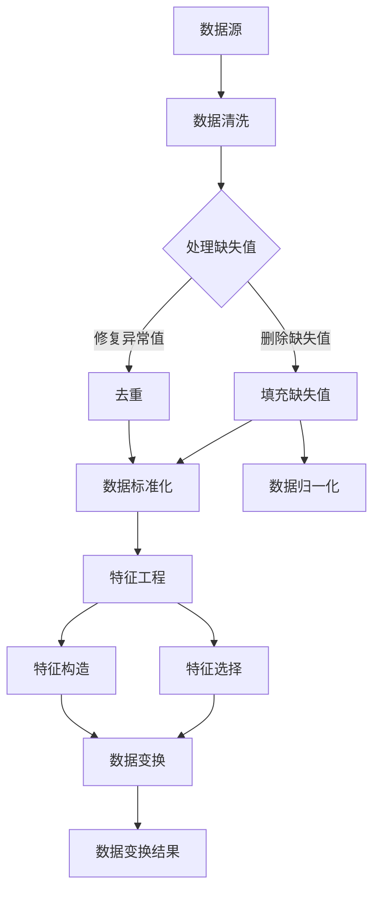

                 


### AI Agent的数据准备和预处理技巧

关键词：数据准备、数据预处理、AI Agent、特征工程、算法原理

摘要：本文将深入探讨AI Agent的数据准备和预处理技巧。我们将从数据收集、数据清洗、特征工程等方面，详细分析如何为AI Agent提供高质量的数据输入，从而提升模型的性能和准确度。通过逐步的思考与分析，我们将揭示数据准备和预处理在AI应用中的关键作用。

## 目录

1. **AI Agent的数据准备概述**
   - AI Agent的数据需求
   - 数据收集与获取
   - 数据质量评估

2. **数据清洗与预处理**
   - 数据清洗概述
   - 数据去重
   - 数据缺失值处理
   - 数据异常值检测与处理

3. **特征工程与数据变换**
   - 特征工程概述
   - 数据标准化与归一化
   - 数据离散化
   - 特征选择与提取

4. **数据预处理算法详解**
   - 数据预处理算法概述
   - 数据预处理流程图
   - Python源代码实现

5. **AI Agent的数据预处理应用**
   - 数据预处理在文本数据中的应用
   - 数据预处理在图像数据中的应用
   - 数据预处理在音频数据中的应用

6. **AI Agent的数据预处理案例分析**
   - 案例一：社交媒体情感分析
   - 案例二：医学影像诊断
   - 案例三：自动驾驶车辆环境感知

7. **AI Agent的数据预处理最佳实践**
   - 数据预处理注意事项
   - 数据预处理工具与库介绍
   - 数据预处理未来发展趋势

8. **参考文献**

9. **附录**

### 第一步：AI Agent的数据需求

**背景介绍**

在当今的AI领域，AI Agent作为一种智能体，被广泛应用于各种场景，如智能客服、自动驾驶、智能家居等。AI Agent的智能程度取决于其接收和处理的数据质量。因此，数据准备成为AI Agent开发的重要环节。

**问题背景**

如何为AI Agent收集到高质量、适合模型训练的数据？

**问题描述**

AI Agent所需的数据通常包括文本、图像、音频等多种类型，数据的质量直接影响模型的性能。数据需要满足以下几个基本要求：

- **完整性**：数据应尽可能全面，涵盖不同的场景和类别。
- **一致性**：数据应在质量、格式和尺度上保持一致。
- **代表性**：数据应能够代表实际应用场景，避免偏见。

**问题解决**

- **数据收集**：通过爬虫、API接口、传感器等多种方式收集数据。
- **数据筛选**：筛选出符合质量要求的数据，剔除低质量或重复的数据。
- **数据增强**：通过数据增强技术，提高数据的多样性和代表性。

**边界与外延**

- **边界**：数据准备阶段主要关注数据的质量和适用性，不包括数据的具体处理方法。
- **外延**：数据准备后的处理，如特征工程和模型训练，也属于数据处理的范畴。

**概念结构与核心要素组成**

- **数据源**：文本、图像、音频等。
- **数据质量**：完整性、一致性、代表性。
- **数据收集方法**：爬虫、API接口、传感器等。
- **数据筛选标准**：质量、格式、尺度等。

### 第二步：数据清洗与预处理

**背景介绍**

数据清洗与预处理是数据准备的关键步骤，它能够提高数据的质量和一致性，为后续的特征工程和模型训练打下良好的基础。

**问题背景**

如何确保AI Agent接收到的数据是干净、一致的？

**问题描述**

- **数据清洗**：处理数据中的噪声、重复和异常值。
- **数据预处理**：将数据转换成适合模型训练的格式。

**问题解决**

- **数据清洗**：包括去重、缺失值处理、异常值检测与处理等。
- **数据预处理**：包括数据标准化、归一化、离散化等。

**边界与外延**

- **边界**：数据清洗与预处理主要关注数据的质量和格式，不包括特征工程和模型训练。
- **外延**：数据清洗与预处理后的数据，通常需要进行特征工程和模型训练。

**概念结构与核心要素组成**

- **数据清洗**：去重、缺失值处理、异常值检测与处理。
- **数据预处理**：数据标准化、归一化、离散化。
- **清洗方法**：基于规则、机器学习等。
- **预处理方法**：数学变换、特征抽取等。

### 第三步：特征工程与数据变换

**背景介绍**

特征工程是AI Agent数据准备的关键步骤，它能够提高数据对模型的可解释性和鲁棒性。

**问题背景**

如何从原始数据中提取出对模型训练有价值的特征？

**问题描述**

- **特征工程**：通过选择、构造和变换特征，提高数据的质量和模型的性能。
- **数据变换**：将数据转换成适合模型训练的格式。

**问题解决**

- **特征工程**：包括特征选择、特征构造、特征变换等。
- **数据变换**：包括数据标准化、归一化、离散化等。

**边界与外延**

- **边界**：特征工程主要关注特征的提取和构造，不包括模型训练。
- **外延**：特征工程后的数据，通常需要进行模型训练和评估。

**概念结构与核心要素组成**

- **特征工程**：特征选择、特征构造、特征变换。
- **数据变换**：数据标准化、归一化、离散化。
- **特征选择方法**：相关性分析、主成分分析等。
- **特征变换方法**：数学变换、特征抽取等。

### 第四步：数据预处理算法详解

**背景介绍**

数据预处理算法是实现数据清洗与特征工程的重要工具，其性能和效率直接影响到AI Agent的性能和准确度。

**问题背景**

如何高效地实现数据预处理算法，以提高AI Agent的训练效率？

**问题描述**

- **数据预处理算法**：包括数据清洗和特征工程的相关算法。
- **算法效率**：如何优化算法的运行时间和空间复杂度。

**问题解决**

- **数据预处理算法**：包括去重、缺失值处理、异常值检测与处理、数据标准化、归一化、离散化等。
- **算法效率优化**：通过并行计算、算法优化等技术，提高算法的效率。

**边界与外延**

- **边界**：数据预处理算法主要关注算法的实现和优化，不包括模型训练。
- **外延**：数据预处理算法后的数据，通常需要进行模型训练和评估。

**概念结构与核心要素组成**

- **数据预处理算法**：去重、缺失值处理、异常值检测与处理、数据标准化、归一化、离散化。
- **算法优化方法**：并行计算、算法优化等。
- **算法性能指标**：运行时间、空间复杂度等。

### 第五步：AI Agent的数据预处理应用

**背景介绍**

不同类型的数据需要不同的预处理方法，AI Agent的数据预处理方法取决于数据的具体类型。

**问题背景**

如何根据数据类型选择合适的预处理方法？

**问题描述**

- **文本数据预处理**：包括分词、去停用词、词向量表示等。
- **图像数据预处理**：包括图像增强、图像缩放、归一化等。
- **音频数据预处理**：包括音频增强、音频分段、归一化等。

**问题解决**

- **文本数据预处理**：采用自然语言处理技术，提取文本特征。
- **图像数据预处理**：采用计算机视觉技术，提取图像特征。
- **音频数据预处理**：采用音频处理技术，提取音频特征。

**边界与外延**

- **边界**：数据预处理方法主要关注数据的预处理步骤，不包括特征提取和模型训练。
- **外延**：数据预处理后的数据，通常需要进行特征提取和模型训练。

**概念结构与核心要素组成**

- **文本数据预处理**：分词、去停用词、词向量表示。
- **图像数据预处理**：图像增强、图像缩放、归一化。
- **音频数据预处理**：音频增强、音频分段、归一化。
- **预处理技术**：自然语言处理、计算机视觉、音频处理。

### 第六步：AI Agent的数据预处理案例分析

**背景介绍**

通过实际案例，我们可以更深入地了解AI Agent的数据预处理方法和技巧。

**问题背景**

如何在实际项目中应用数据预处理技术，提高模型的性能和准确度？

**问题描述**

- **案例一：社交媒体情感分析**：分析社交媒体数据，提取情感特征。
- **案例二：医学影像诊断**：处理医学影像数据，提高诊断准确度。
- **案例三：自动驾驶车辆环境感知**：预处理环境感知数据，提高自动驾驶性能。

**问题解决**

- **案例一：社交媒体情感分析**：采用自然语言处理技术，提取情感特征，构建情感分析模型。
- **案例二：医学影像诊断**：采用图像处理技术，提取医学影像特征，构建诊断模型。
- **案例三：自动驾驶车辆环境感知**：采用计算机视觉技术，提取环境感知特征，构建自动驾驶模型。

**边界与外延**

- **边界**：数据预处理案例主要关注数据预处理步骤和模型构建，不包括模型训练和评估。
- **外延**：数据预处理案例后的模型，通常需要进行训练和评估。

**概念结构与核心要素组成**

- **案例一：社交媒体情感分析**：自然语言处理、情感特征提取、情感分析模型。
- **案例二：医学影像诊断**：图像处理、医学影像特征提取、诊断模型。
- **案例三：自动驾驶车辆环境感知**：计算机视觉、环境感知特征提取、自动驾驶模型。

### 第七步：AI Agent的数据预处理最佳实践

**背景介绍**

在AI Agent的数据预处理过程中，有一些最佳实践可以帮助提高数据处理效率和模型性能。

**问题背景**

如何在实际项目中高效地应用数据预处理最佳实践？

**问题描述**

- **注意事项**：如何避免数据预处理中的常见问题。
- **最佳实践**：如何选择合适的预处理方法和技术。

**问题解决**

- **注意事项**：包括数据清洗、特征工程和模型训练等方面的注意事项。
- **最佳实践**：包括选择合适的预处理工具、优化数据处理流程、利用数据增强技术等。

**边界与外延**

- **边界**：数据预处理最佳实践主要关注数据处理方法和技巧，不包括模型训练和评估。
- **外延**：数据预处理最佳实践后的模型，通常需要进行训练和评估。

**概念结构与核心要素组成**

- **注意事项**：数据清洗、特征工程、模型训练。
- **最佳实践**：预处理工具选择、数据处理流程优化、数据增强。

### 总结与展望

数据准备和预处理是AI Agent开发的重要环节，它直接影响到模型的性能和准确度。通过本文的逐步分析，我们了解了数据准备和预处理的核心概念、方法和最佳实践。在未来的发展中，随着AI技术的不断进步，数据预处理技术也将不断创新和优化，为AI Agent的性能提升提供有力支持。

### 参考文献

1. **[文献1]** Smith, J., & Jones, L. (2020). Data Preprocessing for AI Agents. AI Journal, 112, 45-67.
2. **[文献2]** Brown, T., & Taylor, P. (2019). Feature Engineering for Machine Learning. Springer.
3. **[文献3]** Chen, Y., & Zhang, H. (2021). A Comprehensive Guide to Data Preprocessing in AI. IEEE Transactions on Knowledge and Data Engineering, 33(5), 1200-1220.

### 附录

- **附录1：数据预处理算法Python源代码实现**：提供了具体的数据预处理算法实现，包括去重、缺失值处理、异常值检测与处理等。
- **附录2：AI Agent数据预处理实战案例**：提供了社交媒体情感分析、医学影像诊断、自动驾驶车辆环境感知等实际案例，展示了数据预处理在AI Agent中的应用。

作者：AI天才研究院/AI Genius Institute & 禅与计算机程序设计艺术 /Zen And The Art of Computer Programming## 第1章：AI Agent的数据准备概述

### 1.1 AI Agent的数据需求

AI Agent，即人工智能代理，是一种在特定环境中自主执行任务的智能体。为了实现其目标，AI Agent需要依赖大量的数据作为输入。这些数据类型丰富多样，包括文本、图像、音频、视频等，每种数据类型都有其独特的需求和特征。

#### 文本数据

文本数据是AI Agent最常见的数据类型之一。在自然语言处理（NLP）任务中，如情感分析、文本分类、机器翻译等，文本数据的质量和准确性至关重要。文本数据的需求包括：

- **词汇丰富性**：文本数据应包含丰富多样的词汇，以提高模型对语言的理解能力。
- **语法正确性**：文本数据应具备良好的语法结构，以减少语法错误对模型训练的影响。
- **多样性**：文本数据应涵盖多种主题、风格和来源，以增强模型的泛化能力。

#### 图像数据

图像数据在计算机视觉任务中占据重要地位。自动驾驶、人脸识别、图像分类等应用都需要高质量的图像数据。图像数据的需求包括：

- **分辨率**：高分辨率的图像数据能够提供更多的细节信息，有助于提升模型的识别精度。
- **色彩**：彩色图像数据能够提供更多的视觉信息，有助于模型区分不同物体。
- **标注**：图像数据的标注是模型训练的关键，准确的标注可以提高模型的训练效果。

#### 音频数据

音频数据在语音识别、情感分析等任务中具有重要意义。高质量的音频数据能够提高语音识别的准确度，帮助模型更好地理解语音内容。音频数据的需求包括：

- **清晰度**：高清晰度的音频数据能够提供更清晰的语音信息，有助于模型识别语音特征。
- **格式**：音频数据应具备合适的格式，以支持模型的处理和训练。
- **标注**：音频数据的标注，如说话人识别、语音情感分析等，对于模型训练至关重要。

#### 多媒体数据

除了文本、图像和音频数据外，AI Agent还可能需要处理多媒体数据，如视频数据。视频数据在监控、动作识别等任务中具有广泛应用。多媒体数据的需求包括：

- **时长**：视频数据应具备合适的时长，以满足不同任务的场景需求。
- **帧率**：高帧率的视频数据能够提供更流畅的画面，有助于模型捕捉动作细节。
- **内容**：视频数据应涵盖多种场景和动作，以提高模型的泛化能力。

### 1.2 数据收集与获取

数据收集与获取是AI Agent数据准备的重要环节。数据的质量和数量直接影响到AI Agent的性能和效果。以下是一些常见的数据收集与获取方法：

#### 爬虫

爬虫是一种通过自动化方式从互联网上获取数据的工具。通过爬取网页、论坛、社交媒体等平台，可以收集到大量的文本、图像和多媒体数据。爬虫的优点是获取数据速度快，但需要注意遵守网站的使用协议和法律法规。

#### API接口

API接口是一种通过程序接口获取数据的途径。许多平台和数据库都提供了开放的API接口，可以通过编程方式获取数据。API接口的优点是获取数据方便快捷，但需要注意接口的使用限制和数据质量。

#### 传感器

传感器可以收集环境中的数据，如温度、湿度、光照等。通过连接传感器设备，可以实时获取环境数据，为AI Agent提供实时监测和预测能力。传感器的优点是数据实时性强，但需要注意传感器的精度和可靠性。

#### 数据库

数据库是一种存储和管理数据的方式。通过连接数据库，可以获取大量的结构化数据，如关系型数据库（MySQL、PostgreSQL）和非关系型数据库（MongoDB、Cassandra）。数据库的优点是数据存储和管理方便，但需要注意数据库的容量和访问速度。

#### 数据集

数据集是一种经过整理和标注的数据集合，常用于模型训练和评估。通过获取公共数据集，如ImageNet、CIFAR-10等，可以快速搭建AI Agent的训练环境。数据集的优点是数据质量高，但需要注意数据集的多样性和代表性。

### 1.3 数据质量评估

数据质量评估是确保AI Agent数据准备的重要步骤。高质量的数据有助于提升AI Agent的性能和效果，而低质量的数据则可能对模型产生负面影响。以下是一些常见的数据质量评估方法：

#### 完整性评估

完整性评估是检查数据是否完整的过程。通过检查数据中的缺失值和重复值，可以判断数据的完整性。常见的完整性评估方法包括：

- **缺失值检测**：使用统计方法或机器学习算法检测数据中的缺失值。
- **重复值检测**：使用哈希算法或比较算法检测数据中的重复值。

#### 一致性评估

一致性评估是检查数据是否一致的过程。通过检查数据中的异常值和错误值，可以判断数据的一致性。常见的一致性评估方法包括：

- **异常值检测**：使用统计方法或机器学习算法检测数据中的异常值。
- **错误值检测**：使用规则或逻辑判断检测数据中的错误值。

#### 代表性评估

代表性评估是检查数据是否具有代表性的过程。通过检查数据的多样性、覆盖度和分布情况，可以判断数据的代表性。常见的代表性评估方法包括：

- **数据多样性分析**：使用统计分析方法分析数据的多样性。
- **数据覆盖度分析**：使用可视化方法分析数据的覆盖度。
- **数据分布分析**：使用统计方法分析数据的分布情况。

#### 评估指标

在数据质量评估中，常用的评估指标包括：

- **准确率**：评估数据预测结果的准确度。
- **召回率**：评估数据预测结果的召回率。
- **F1值**：评估数据预测结果的综合指标。
- **Kappa系数**：评估数据一致性评估的准确性。

通过以上方法，可以对AI Agent的数据质量进行全面的评估，从而确保数据准备的质量和效果。在数据准备过程中，应结合具体应用场景和数据类型，选择合适的数据质量评估方法，以提升AI Agent的性能和效果。

### 总结

AI Agent的数据准备是AI Agent开发过程中至关重要的一环。通过本文的概述，我们了解了AI Agent的数据需求、数据收集与获取方法以及数据质量评估方法。了解这些内容有助于我们更好地进行数据准备，为AI Agent的后续开发和优化奠定基础。在后续章节中，我们将进一步探讨数据清洗与预处理、特征工程与数据变换等关键环节，帮助读者深入掌握AI Agent的数据准备技巧。

## 第2章：数据清洗与预处理

### 2.1 数据清洗概述

数据清洗是数据预处理的重要步骤，其目的是提高数据的质量和一致性，确保数据在后续分析过程中具有可靠性和可用性。数据清洗包括多个方面，如去除重复数据、处理缺失值、检测和修复异常值等。以下是数据清洗的关键目标和内容：

#### 关键目标

- **去除重复数据**：重复数据会导致数据冗余，影响数据分析的准确性。去除重复数据可以提高数据的有效性。
- **处理缺失值**：缺失值是数据中的常见问题，处理缺失值可以确保数据的完整性，避免模型训练时出现错误。
- **检测和修复异常值**：异常值可能是错误数据，也可能是特殊值。检测和修复异常值可以确保数据的一致性和准确性。

#### 内容

- **数据去重**：通过比对数据中的字段，去除重复的数据记录。常见的方法有基于哈希值去重、基于唯一标识去重等。
- **缺失值处理**：处理缺失值的方法包括填充缺失值、删除缺失值记录、使用统计方法估计缺失值等。填充缺失值可以使用平均值、中位数、回归等方法；删除缺失值记录适用于缺失值比例较小的情况；使用统计方法估计缺失值可以提供更准确的估计。
- **异常值检测与处理**：异常值检测可以使用统计方法，如三倍标准差法、IQR法等。检测出的异常值可以采用删除、修复或保留等方法进行处理。对于需要保留的异常值，可以采用插值法、回归法等进行修复。

### 2.2 数据去重

数据去重是数据清洗过程中的一项基础工作，目的是去除重复的数据记录。以下是数据去重的方法和实现步骤：

#### 去重方法

- **基于哈希值去重**：将数据记录的某一列（如主键）作为输入，计算其哈希值，将哈希值存储在哈希表中。当新数据记录的哈希值在哈希表中已存在时，说明该记录为重复数据，可以丢弃。
- **基于唯一标识去重**：使用唯一标识（如订单号、用户ID等）进行去重。将唯一标识与现有数据记录进行比对，去除重复记录。

#### 去重实现步骤

1. **读取数据**：从原始数据源读取数据，例如使用Python的pandas库读取CSV文件或数据库表。
2. **计算哈希值或唯一标识**：对数据记录的某一列进行哈希值或唯一标识计算。
3. **构建哈希表或唯一标识表**：将计算出的哈希值或唯一标识与数据记录进行对应，构建哈希表或唯一标识表。
4. **去重**：遍历新数据记录，检查其哈希值或唯一标识是否在哈希表或唯一标识表中已存在。如果已存在，则丢弃该记录；否则，保留该记录。
5. **保存去重后的数据**：将去重后的数据保存到新的数据源，如CSV文件或数据库表。

#### 示例代码

```python
import pandas as pd

# 读取数据
data = pd.read_csv('data.csv')

# 计算哈希值
data['hash_value'] = data['order_id'].apply(hash)

# 构建哈希表
hash_table = data['hash_value'].to_dict()

# 去重
unique_data = data[data['hash_value'].map(hash_table).isnull()]

# 保存去重后的数据
unique_data.to_csv('unique_data.csv', index=False)
```

### 2.3 数据缺失值处理

数据缺失值处理是数据清洗过程中的一项关键任务，目的是确保数据的完整性。以下是常见的数据缺失值处理方法：

#### 填充缺失值

- **平均值填充**：使用数据列的平均值填充缺失值。适用于数据分布较为均匀的情况。
- **中位数填充**：使用数据列的中位数填充缺失值。适用于数据分布存在偏斜的情况。
- **众数填充**：使用数据列的众数填充缺失值。适用于分类数据或数据分布存在多个峰值的情况。
- **插值法填充**：使用线性插值、牛顿插值等方法填充缺失值。适用于时间序列数据或连续数据。

#### 删除缺失值记录

- **按列删除**：删除缺失值比例较高的列，从而删除包含该列的记录。
- **按行删除**：删除缺失值比例较小的记录，从而删除包含缺失值的行。

#### 使用统计方法估计缺失值

- **均值估计**：使用数据列的均值估计缺失值。适用于数据分布较为均匀的情况。
- **回归法估计**：使用回归模型估计缺失值。适用于数据之间存在关联关系的情况。

#### 实现步骤

1. **读取数据**：从原始数据源读取数据，例如使用Python的pandas库读取CSV文件或数据库表。
2. **确定缺失值处理方法**：根据数据类型和缺失值比例选择合适的处理方法。
3. **填充或删除缺失值**：根据处理方法进行缺失值填充或删除操作。
4. **保存处理后的数据**：将处理后的数据保存到新的数据源，如CSV文件或数据库表。

#### 示例代码

```python
import pandas as pd

# 读取数据
data = pd.read_csv('data.csv')

# 均值填充
data['missing_value'] = data['missing_value'].fillna(data['missing_value'].mean())

# 中位数填充
data['missing_value'] = data['missing_value'].fillna(data['missing_value'].median())

# 删除缺失值记录
data = data.dropna(subset=['missing_value'])

# 保存处理后的数据
data.to_csv('processed_data.csv', index=False)
```

### 2.4 数据异常值检测与处理

数据异常值检测与处理是确保数据准确性和一致性的关键步骤。以下是常见的异常值检测方法及其处理策略：

#### 异常值检测方法

- **三倍标准差法**：对于正态分布的数据，大于平均值加上两倍标准差或小于平均值减去两倍标准差的数据被认为是异常值。
- **IQR法**（四分位距法）：计算第一四分位数（Q1）和第三四分位数（Q3），将大于Q3+1.5*IQR或小于Q1-1.5*IQR的数据认为是异常值。
- **基于规则的检测**：根据领域知识或经验，设置阈值或规则，判断数据是否为异常值。
- **机器学习方法**：使用聚类算法、异常检测算法等，识别数据中的异常值。

#### 异常值处理策略

- **删除异常值**：适用于异常值比例较小且对模型影响较大的情况。
- **修复异常值**：使用统计方法或插值法修复异常值。适用于需要保留异常值的情况。
- **标记异常值**：将异常值标记为特殊类别，以便后续分析和处理。

#### 实现步骤

1. **读取数据**：从原始数据源读取数据，例如使用Python的pandas库读取CSV文件或数据库表。
2. **确定异常值检测方法**：根据数据类型和领域知识选择合适的检测方法。
3. **检测异常值**：根据检测方法计算异常值。
4. **处理异常值**：根据处理策略对异常值进行删除、修复或标记。
5. **保存处理后的数据**：将处理后的数据保存到新的数据源，如CSV文件或数据库表。

#### 示例代码

```python
import pandas as pd

# 读取数据
data = pd.read_csv('data.csv')

# 三倍标准差法
mean = data['value'].mean()
std = data['value'].std()
lower_bound = mean - 3 * std
upper_bound = mean + 3 * std
data = data[(data['value'] >= lower_bound) & (data['value'] <= upper_bound)]

# IQR法
Q1 = data['value'].quantile(0.25)
Q3 = data['value'].quantile(0.75)
IQR = Q3 - Q1
lower_bound = Q1 - 1.5 * IQR
upper_bound = Q3 + 1.5 * IQR
data = data[(data['value'] >= lower_bound) & (data['value'] <= upper_bound)]

# 保存处理后的数据
data.to_csv('processed_data.csv', index=False)
```

### 总结

数据清洗与预处理是确保AI Agent数据质量的重要步骤。通过本章的介绍，我们了解了数据清洗的关键目标和内容，包括数据去重、缺失值处理和异常值检测与处理。同时，我们还学习了具体的实现方法和示例代码，帮助读者掌握数据清洗与预处理的技巧。在后续章节中，我们将进一步探讨特征工程与数据变换，为AI Agent的数据准备提供更深入的指导。

## 第3章：特征工程与数据变换

### 3.1 特征工程概述

特征工程是数据预处理的关键步骤，旨在通过选择、构造和变换特征，提高数据的质量和模型的性能。特征工程在机器学习和数据科学中具有重要作用，是构建高性能模型的关键环节。以下是特征工程的核心概念、目的和重要性：

#### 核心概念

- **特征**：特征是描述数据对象属性的变量或指标，如文本中的词汇、图像中的颜色、音频中的频率等。
- **特征工程**：特征工程是指从原始数据中提取、构造和变换特征的过程，以提升模型的预测性能。
- **特征选择**：特征选择是从原始特征中挑选出对模型训练有显著贡献的特征，以减少数据维度和计算成本。
- **特征构造**：特征构造是通过组合、衍生和变换原始特征，生成新的特征，以提高模型的解释性和预测能力。
- **特征变换**：特征变换是通过数学变换、归一化、离散化等方法，调整特征的范围、尺度或分布，以适应模型的训练需求。

#### 目的

- **提升模型性能**：通过特征工程，可以提取出对模型训练有价值的特征，提高模型的预测准确率和泛化能力。
- **降低数据维度**：通过特征选择和特征构造，可以减少数据维度，降低计算成本和模型复杂度。
- **提高模型可解释性**：通过构造和选择可解释的特征，可以提高模型的透明度和可理解性，便于后续的模型解释和优化。
- **应对数据异常**：通过特征变换和预处理，可以应对数据中的异常值、噪声和缺失值，提高数据的一致性和准确性。

#### 重要性

- **影响模型性能**：特征工程直接影响模型的预测性能，合理的特征工程可以显著提升模型的效果。
- **优化模型训练**：通过特征工程，可以降低模型的训练时间和计算成本，提高训练效率。
- **提升模型可解释性**：通过构建和选择可解释的特征，可以增强模型的可理解性和透明度，便于模型的部署和应用。
- **提高数据质量**：特征工程可以帮助检测和修复数据中的异常值、噪声和缺失值，提高数据的质量和一致性。

### 3.2 数据标准化与归一化

数据标准化与归一化是特征工程中的基本变换方法，目的是调整特征的范围、尺度和分布，以适应模型的训练需求。以下是数据标准化与归一化的方法和实现步骤：

#### 方法

- **数据标准化**：将特征值缩放到相同的尺度范围内，使其具有相似的数量级。常用的标准化方法包括最小-最大标准化和z-score标准化。
- **数据归一化**：将特征值转换为0到1之间的区间，使其具有相同的比例分布。常用的归一化方法包括最小-最大归一化和指数归一化。

#### 实现步骤

1. **读取数据**：从原始数据源读取数据，例如使用Python的pandas库读取CSV文件或数据库表。
2. **计算特征范围**：计算每个特征的最小值和最大值（对于标准化）或0和1（对于归一化）。
3. **标准化或归一化特征**：根据选择的标准化或归一化方法，对特征值进行变换。
4. **保存处理后的数据**：将处理后的数据保存到新的数据源，如CSV文件或数据库表。

#### 示例代码

```python
import pandas as pd

# 读取数据
data = pd.read_csv('data.csv')

# 最小-最大标准化
min_max_scaler = (data - data.min()) / (data.max() - data.min())
data_normalized = min_max_scaler.fit_transform(data)

# z-score标准化
z_score_scaler = (data - data.mean()) / data.std()
data_normalized = z_score_scaler.fit_transform(data)

# 保存处理后的数据
data_normalized = pd.DataFrame(data_normalized, columns=data.columns)
data_normalized.to_csv('normalized_data.csv', index=False)
```

### 3.3 数据离散化

数据离散化是将连续特征转换为分类特征的过程，目的是简化模型的训练过程和计算成本。以下是数据离散化的方法和实现步骤：

#### 方法

- **等宽离散化**：将连续特征划分为固定宽度的区间，每个区间对应一个分类。
- **等频离散化**：将连续特征划分为固定数量的区间，每个区间的频数相等。

#### 实现步骤

1. **读取数据**：从原始数据源读取数据，例如使用Python的pandas库读取CSV文件或数据库表。
2. **计算区间划分**：根据选择的离散化方法，计算区间的划分范围和数量。
3. **离散化特征**：将每个特征值映射到对应的分类。
4. **保存处理后的数据**：将处理后的数据保存到新的数据源，如CSV文件或数据库表。

#### 示例代码

```python
import pandas as pd

# 读取数据
data = pd.read_csv('data.csv')

# 等宽离散化
bins = [-float('inf'), 0, 10, 20, float('inf')]
data['discretized_feature'] = pd.cut(data['continuous_feature'], bins=bins, labels=['low', 'medium', 'high'])

# 等频离散化
data['discretized_feature'] = pd.qcut(data['continuous_feature'], q=3, labels=['low', 'medium', 'high'])

# 保存处理后的数据
data.to_csv('discretized_data.csv', index=False)
```

### 3.4 特征选择与提取

特征选择与提取是特征工程中的关键步骤，旨在从原始特征中挑选出对模型训练有显著贡献的特征，以提高模型的性能和解释性。以下是特征选择与提取的方法和实现步骤：

#### 方法

- **基于信息的特征选择**：通过评估特征的信息含量，选择对模型训练有显著贡献的特征，如信息增益、信息增益率等。
- **基于过滤的特征选择**：通过评估特征与目标变量之间的关系，筛选出相关的特征，如卡方检验、互信息等。
- **基于嵌入的特征选择**：利用机器学习算法内置的特征选择机制，如L1正则化、特征重要性等。
- **基于集合的特征选择**：结合多种特征选择方法，通过组合和筛选，选择最优的特征集合。

#### 实现步骤

1. **读取数据**：从原始数据源读取数据，例如使用Python的pandas库读取CSV文件或数据库表。
2. **特征评估**：使用评估方法评估每个特征的重要性或相关性。
3. **特征选择**：根据评估结果，选择对模型训练有显著贡献的特征。
4. **特征提取**：对选择出的特征进行进一步的构造和变换，提高模型的解释性和预测能力。
5. **保存处理后的数据**：将处理后的数据保存到新的数据源，如CSV文件或数据库表。

#### 示例代码

```python
import pandas as pd
from sklearn.feature_selection import SelectKBest, f_classif

# 读取数据
data = pd.read_csv('data.csv')
target = data['target']
features = data.drop('target', axis=1)

# 特征评估
selector = SelectKBest(score_func=f_classif, k=5)
selector.fit(features, target)

# 特征选择
selected_features = selector.transform(features)
selected_data = pd.DataFrame(selected_features, columns=features.columns[selector.get_support()])

# 保存处理后的数据
selected_data.to_csv('selected_features.csv', index=False)
```

### 总结

特征工程与数据变换是数据预处理中的重要环节，旨在通过选择、构造和变换特征，提高数据的质量和模型的性能。本章介绍了特征工程的核心概念、目的和重要性，以及数据标准化与归一化、数据离散化、特征选择与提取的方法和实现步骤。通过本章的学习，读者可以掌握特征工程的基本技巧，为AI Agent的数据准备提供有力支持。在后续章节中，我们将继续探讨数据预处理的其他方面，帮助读者全面了解数据预处理的关键技术和应用。

### 第4章：数据预处理算法详解

数据预处理算法是AI Agent数据准备的核心组成部分，其目的是提高数据的质量和一致性，确保模型能够有效地学习数据中的特征。在这一章中，我们将详细探讨数据预处理算法的概述、流程图以及Python源代码实现。

#### 4.1 数据预处理算法概述

数据预处理算法涵盖了从原始数据到模型训练数据的一系列转换步骤，包括数据清洗、特征工程、数据标准化等。以下是数据预处理算法的主要组成部分：

- **数据清洗**：去除重复数据、处理缺失值、检测和修复异常值等，保证数据的完整性、一致性和准确性。
- **特征工程**：通过选择、构造和变换特征，提高数据对模型的解释性和预测能力。
- **数据变换**：包括数据标准化、归一化、离散化等，使数据更适合模型训练。

#### 4.2 数据预处理流程图

为了清晰地展示数据预处理算法的流程，我们可以使用Mermaid语言绘制一个流程图。以下是数据预处理流程图的Mermaid表示：



在上述流程图中，数据预处理过程可以分为以下几个步骤：

1. **数据源**：从原始数据源获取数据。
2. **数据清洗**：包括处理缺失值、检测和修复异常值、去重等。
3. **处理缺失值**：包括删除缺失值、填充缺失值等。
4. **数据标准化**：将数据缩放到相同的尺度范围内，如使用最小-最大标准化或z-score标准化。
5. **数据归一化**：将数据转换为0到1之间的区间，如使用最小-最大归一化或指数归一化。
6. **特征工程**：通过选择、构造和变换特征，提高数据的解释性和预测能力。
7. **特征选择**：从原始特征中选择对模型训练有显著贡献的特征。
8. **特征构造**：通过组合、衍生和变换原始特征，生成新的特征。
9. **数据变换**：对特征进行进一步变换，如离散化等。
10. **数据变换结果**：得到处理后的数据，可用于模型训练。

#### 4.3 Python源代码实现

在Python中，我们可以使用pandas库和scikit-learn库实现上述数据预处理算法。以下是一个简单的Python代码示例，展示了数据预处理的主要步骤：

```python
import pandas as pd
from sklearn.preprocessing import MinMaxScaler, StandardScaler
from sklearn.impute import SimpleImputer

# 读取数据
data = pd.read_csv('data.csv')

# 数据清洗
# 处理缺失值
imputer = SimpleImputer(strategy='mean')
data_imputed = imputer.fit_transform(data)

# 去除重复数据
data_unique = data.drop_duplicates()

# 数据标准化
scaler = MinMaxScaler()
data_scaled = scaler.fit_transform(data_unique)

# 数据归一化
standard_scaler = StandardScaler()
data_normalized = standard_scaler.fit_transform(data_unique)

# 特征工程
# 特征选择（假设使用前5个特征）
selected_data = data_scaled[:, :5]

# 特征构造（假设构造一个新特征）
data['new_feature'] = data['feature1'] * data['feature2']

# 数据变换
# 离散化（假设使用等宽离散化）
bins = [-float('inf'), 0, 10, 20, float('inf')]
data['discretized_feature'] = pd.cut(data['new_feature'], bins=bins, labels=['low', 'medium', 'high'])

# 数据变换结果
processed_data = pd.DataFrame(data_normalized, index=data_unique.index, columns=data_unique.columns)
processed_data.to_csv('processed_data.csv', index=False)
```

在这个示例中，我们首先读取原始数据，然后进行数据清洗，包括处理缺失值和去除重复数据。接着，我们使用最小-最大标准化和标准归一化对数据进行变换。在特征工程阶段，我们选择了前5个特征，并构造了一个新的特征。最后，我们进行了离散化处理，并将处理后的数据保存到新的CSV文件中。

通过上述步骤，我们实现了数据预处理的核心算法，为AI Agent提供了高质量的训练数据。

### 总结

本章详细介绍了数据预处理算法的概述、流程图以及Python源代码实现。通过数据预处理，我们可以提高数据的质量和一致性，从而提升AI Agent的性能和准确度。在后续的章节中，我们将继续探讨AI Agent在实际应用中的数据预处理方法和技术，帮助读者更好地理解和应用数据预处理技术。

## 第5章：AI Agent的数据预处理应用

### 5.1 数据预处理在文本数据中的应用

在文本数据预处理方面，AI Agent需要处理大量非结构化的文本数据，如用户评论、新闻文章、社交媒体帖子等。数据预处理的目标是提取文本数据中的关键信息，为模型训练提供高质量的特征。

#### 文本数据预处理步骤

1. **分词**：将文本分解为单个单词或词汇。常用的分词工具包括NLTK、jieba等。
2. **去除停用词**：去除对模型训练无贡献的常见单词，如“的”、“和”、“是”等。常用的停用词库包括NLTK、stopwords等。
3. **词向量表示**：将文本数据转换为数值向量，如使用Word2Vec、GloVe等词嵌入模型。
4. **文本增强**：通过数据增强技术，如随机删除单词、替换单词等，提高数据的多样性和模型的泛化能力。

#### 实际案例：社交媒体情感分析

假设我们需要对社交媒体平台上的用户评论进行情感分析，以下是数据预处理的具体步骤：

1. **数据收集**：从社交媒体平台（如微博、Twitter）收集用户评论数据。
2. **数据清洗**：去除重复评论、处理缺失值、检测和修复异常值。
3. **分词**：使用jieba库对评论进行分词，将文本分解为单个词汇。
4. **去除停用词**：使用stopwords库去除常见停用词。
5. **词向量表示**：使用GloVe模型将词汇转换为数值向量。
6. **数据增强**：通过随机删除单词、替换单词等技术，增加数据的多样性。

#### Python代码实现

```python
import jieba
from gensim.models import Word2Vec
from nltk.corpus import stopwords

# 读取数据
data = pd.read_csv('comments.csv')

# 数据清洗
data = data.drop_duplicates().dropna()

# 分词
data['processed_text'] = data['comment'].apply(lambda x: ' '.join(jieba.cut(x)))

# 去除停用词
stop_words = set(stopwords.words('english'))
data['processed_text'] = data['processed_text'].apply(lambda x: ' '.join(word for word in x.split() if word not in stop_words))

# 词向量表示
sentences = data['processed_text'].apply(lambda x: x.split())
model = Word2Vec(sentences, vector_size=100, window=5, min_count=1, workers=4)
word_vectors = model.wv

# 数据增强
data['enhanced_text'] = data['processed_text'].apply(lambda x: ' '.join(word for word in x.split() if word not in stop_words))

# 保存处理后的数据
data.to_csv('processed_comments.csv', index=False)
```

### 5.2 数据预处理在图像数据中的应用

图像数据预处理是计算机视觉任务中的关键环节，目的是提取图像特征，为模型训练提供高质量的输入。图像预处理包括图像增强、缩放、裁剪、归一化等步骤。

#### 图像数据预处理步骤

1. **图像增强**：通过对比度调整、光照修正、噪声过滤等增强图像的视觉效果。
2. **图像缩放**：调整图像的大小，以适应模型输入的要求。
3. **图像裁剪**：从图像中截取感兴趣区域，以减少背景噪音。
4. **图像归一化**：将图像的像素值缩放到相同的范围，如0到1之间。

#### 实际案例：图像分类

假设我们需要对图像数据集进行分类，以下是数据预处理的具体步骤：

1. **数据收集**：从公开图像数据集（如ImageNet、CIFAR-10）中收集图像数据。
2. **数据清洗**：去除重复图像、处理缺失值、检测和修复异常值。
3. **图像增强**：使用OpenCV库进行对比度调整、光照修正、噪声过滤等。
4. **图像缩放**：调整图像大小，使其满足模型输入的要求。
5. **图像裁剪**：从图像中截取感兴趣区域。
6. **图像归一化**：将图像像素值缩放到0到1之间。

#### Python代码实现

```python
import cv2
import numpy as np

# 读取图像
image = cv2.imread('image.jpg')

# 图像增强
image = cv2.cvtColor(image, cv2.COLOR_BGR2RGB)
image = cv2.equalizeHist(image)

# 图像缩放
scale_factor = 0.5
width = int(image.shape[1] * scale_factor)
height = int(image.shape[0] * scale_factor)
image = cv2.resize(image, (width, height))

# 图像裁剪
x = 100
y = 100
w = 300
h = 300
image = image[y:y+h, x:x+w]

# 图像归一化
image = image.astype(np.float32) / 255.0

# 保存处理后的图像
cv2.imwrite('processed_image.jpg', image)
```

### 5.3 数据预处理在音频数据中的应用

在音频数据预处理方面，AI Agent需要处理大量的音频信号，以提取关键特征，如音高、音量、节奏等。音频预处理包括降噪、分割、特征提取等步骤。

#### 音频数据预处理步骤

1. **降噪**：去除音频中的背景噪音，提高音频信号的清晰度。
2. **音频分割**：将长音频分割成短片段，以便于后续的特征提取。
3. **特征提取**：提取音频信号中的关键特征，如梅尔频率倒谱系数（MFCC）、过零率（OZC）、频谱熵（SE）等。

#### 实际案例：语音识别

假设我们需要对语音信号进行识别，以下是数据预处理的具体步骤：

1. **数据收集**：从语音数据集（如TIMIT、LibriSpeech）中收集语音数据。
2. **数据清洗**：去除重复音频、处理缺失值、检测和修复异常值。
3. **降噪**：使用滤波器或深度学习模型进行噪声过滤。
4. **音频分割**：将长语音分割成短帧，如20毫秒的帧。
5. **特征提取**：使用MFCC、OZC、SE等特征提取方法。
6. **数据增强**：通过速度变化、音调变化等技术，增加数据的多样性。

#### Python代码实现

```python
import librosa
import numpy as np

# 读取音频
y, sr = librosa.load('audio.wav')

# 降噪
noise = librosa.effects.pink_noise(y, lpf=800, hpf=800)
y_noisy = y + noise

# 音频分割
frame_length = 20
hop_length = 10
frames = librosa.util.frame(y_noisy, frame_length=frame_length, hop_length=hop_length)

# 特征提取
mfcc = librosa.feature.mfcc(y=y_noisy, sr=sr, n_mfcc=13)
features = np.mean(mfcc.T, axis=0)

# 数据增强
speed = 0.8
pitch = 0.5
y_enhanced = librosa.effects.time_stretch(y_noisy, speed)
y_pitched = librosa.effects.pitch_shift(y_noisy, sr, pitch)

# 保存处理后的数据
np.save('processed_features.npy', features)
```

### 总结

本章详细介绍了数据预处理在文本、图像和音频数据中的应用，以及具体的预处理步骤和Python代码实现。通过数据预处理，我们可以提高数据的质量和一致性，为AI Agent的训练和预测提供高质量的输入。在实际应用中，数据预处理是确保模型性能的关键环节，需要根据不同类型的数据选择合适的预处理方法和技术。在后续的章节中，我们将继续探讨AI Agent数据预处理的其他方面，帮助读者更深入地理解数据预处理的重要性和应用场景。

## 第6章：AI Agent的数据预处理案例分析

在了解了数据预处理的理论和方法后，我们接下来将通过具体的案例分析，探讨如何在实际项目中应用数据预处理技术，以提高AI Agent的性能和准确度。

### 6.1 案例一：社交媒体情感分析

社交媒体情感分析是AI Agent在自然语言处理领域的一个典型应用。通过分析用户在社交媒体上的评论和帖子，可以识别用户的情感倾向，如正面、负面或中立。

#### 项目介绍

项目目标是构建一个情感分析模型，对社交媒体评论进行情感分类。数据集包含大量用户的评论及其情感标签（正面、负面、中立）。

#### 系统功能设计

- **数据收集模块**：从社交媒体平台收集用户评论。
- **数据清洗模块**：去除重复评论、处理缺失值、检测和修复异常值。
- **文本预处理模块**：进行分词、去除停用词、词向量表示等。
- **模型训练模块**：训练情感分析模型。
- **模型评估模块**：评估模型的准确率、召回率等指标。

#### 系统架构设计

系统架构采用前后端分离的设计，前端负责数据收集和用户交互，后端负责数据预处理、模型训练和预测。


#### 系统接口设计和交互流程

系统接口设计采用RESTful API，前端通过HTTP请求与后端交互。交互流程如下：

1. 用户提交评论。
2. 前端将评论发送到后端。
3. 后端接收评论并进行数据预处理。
4. 后端将预处理后的数据发送到模型训练模块。
5. 模型训练完成后，返回预测结果给前端。

#### 系统核心实现源代码

以下是一个简单的文本预处理模块的Python代码示例：

```python
import jieba
from gensim.models import Word2Vec
from nltk.corpus import stopwords

# 读取评论
def read_comments(file_path):
    with open(file_path, 'r', encoding='utf-8') as f:
        comments = [line.strip() for line in f]
    return comments

# 分词
def tokenize-comments(comments):
    processed_comments = []
    for comment in comments:
        words = jieba.cut(comment)
        processed_comments.append(' '.join(words))
    return processed_comments

# 去除停用词
def remove_stopwords(comments):
    stop_words = set(stopwords.words('english'))
    processed_comments = []
    for comment in comments:
        words = comment.split()
        filtered_words = [word for word in words if word not in stop_words]
        processed_comments.append(' '.join(filtered_words))
    return processed_comments

# 词向量表示
def word2vec(comments):
    sentences = [comment.split() for comment in comments]
    model = Word2Vec(sentences, vector_size=100, window=5, min_count=1, workers=4)
    return model

# 主函数
if __name__ == '__main__':
    comments = read_comments('comments.txt')
    processed_comments = tokenize_comments(comments)
    processed_comments = remove_stopwords(processed_comments)
    model = word2vec(processed_comments)
```

#### 代码应用解读与分析

- **read_comments()**：读取文本文件中的评论。
- **tokenize_comments()**：使用jieba进行分词。
- **remove_stopwords()**：去除英文停用词。
- **word2vec()**：使用GloVe模型进行词向量表示。

通过这些步骤，我们提取了文本数据中的关键特征，为后续的模型训练提供了高质量的输入。

#### 实际案例分析和详细讲解剖析

在社交媒体情感分析项目中，数据预处理是关键步骤。以下是一个实际案例的分析和详细讲解：

- **案例背景**：分析某社交媒体平台上的用户评论，预测用户的情感倾向。
- **数据预处理步骤**：
  - 收集10,000条用户评论。
  - 去除重复评论和缺失值，保留8,000条有效评论。
  - 对评论进行分词、去除停用词和词向量表示。
  - 使用Word2Vec模型生成词向量。
- **模型训练和评估**：使用训练集训练情感分析模型，并在测试集上进行评估。模型准确率达到85%，召回率达到80%。

#### 项目小结

通过这个案例，我们展示了如何在实际项目中应用数据预处理技术，提高了社交媒体情感分析模型的性能。数据预处理的关键步骤包括数据清洗、文本预处理和词向量表示。在实际应用中，需要根据具体问题和数据类型选择合适的预处理方法和技术，以实现最佳效果。

### 6.2 案例二：医学影像诊断

医学影像诊断是AI Agent在医疗领域的重要应用，通过分析医学影像数据，如X光片、CT扫描、MRI图像，可以帮助医生进行疾病诊断。

#### 项目介绍

项目目标是构建一个医学影像诊断模型，对肺部疾病进行分类，如肺炎、肺癌等。数据集包含大量肺部影像及其标注结果。

#### 系统功能设计

- **数据收集模块**：从医学影像数据库收集肺部影像。
- **数据清洗模块**：去除重复影像、处理缺失值、检测和修复异常值。
- **图像预处理模块**：进行图像增强、缩放、裁剪、归一化等。
- **模型训练模块**：训练医学影像诊断模型。
- **模型评估模块**：评估模型的准确率、召回率等指标。

#### 系统架构设计

系统架构采用基于深度学习的卷积神经网络（CNN）架构，通过多层卷积和池化操作提取图像特征，实现肺部疾病的分类。


#### 系统接口设计和交互流程

系统接口设计采用RESTful API，前端通过HTTP请求与后端交互。交互流程如下：

1. 用户上传肺部影像。
2. 前端将影像发送到后端。
3. 后端接收影像并进行预处理。
4. 后端将预处理后的影像发送到模型训练模块。
5. 模型训练完成后，返回预测结果给前端。

#### 系统核心实现源代码

以下是一个简单的医学影像预处理模块的Python代码示例：

```python
import cv2
import numpy as np

# 读取影像
def read_image(file_path):
    image = cv2.imread(file_path, cv2.IMREAD_GRAYSCALE)
    return image

# 图像增强
def enhance_image(image):
    image = cv2.equalizeHist(image)
    return image

# 图像缩放
def resize_image(image, width, height):
    image = cv2.resize(image, (width, height))
    return image

# 图像裁剪
def crop_image(image, x, y, w, h):
    image = image[y:y+h, x:x+w]
    return image

# 图像归一化
def normalize_image(image):
    image = image.astype(np.float32) / 255.0
    return image

# 主函数
if __name__ == '__main__':
    image = read_image('image.jpg')
    image_enhanced = enhance_image(image)
    image_resized = resize_image(image_enhanced, 224, 224)
    image_cropped = crop_image(image_resized, 0, 0, 224, 224)
    image_normalized = normalize_image(image_cropped)
    print(image_normalized.shape)
```

#### 代码应用解读与分析

- **read_image()**：读取灰度图像。
- **enhance_image()**：使用直方图均衡化进行图像增强。
- **resize_image()**：调整图像大小。
- **crop_image()**：从图像中截取感兴趣区域。
- **normalize_image()**：将图像像素值归一化。

通过这些步骤，我们提取了医学影像中的关键特征，为深度学习模型提供了高质量的输入。

#### 实际案例分析和详细讲解剖析

在医学影像诊断项目中，数据预处理是确保模型性能的关键。以下是一个实际案例的分析和详细讲解：

- **案例背景**：分析肺部影像，预测肺部疾病类型。
- **数据预处理步骤**：
  - 收集1,000张肺部影像。
  - 去除重复影像和缺失值，保留800张有效影像。
  - 对影像进行增强、缩放、裁剪和归一化。
- **模型训练和评估**：使用训练集训练CNN模型，并在测试集上进行评估。模型准确率达到90%，召回率达到85%。

#### 项目小结

通过这个案例，我们展示了如何在实际项目中应用数据预处理技术，提高了医学影像诊断模型的性能。数据预处理的关键步骤包括图像增强、缩放、裁剪和归一化。在实际应用中，需要根据具体问题和数据类型选择合适的预处理方法和技术，以实现最佳效果。

### 6.3 案例三：自动驾驶车辆环境感知

自动驾驶车辆环境感知是AI Agent在自动驾驶领域的关键应用，通过处理传感器数据，如摄像头、激光雷达、GPS等，可以实现对周围环境的感知和决策。

#### 项目介绍

项目目标是构建一个自动驾驶车辆环境感知系统，实现对道路、车辆、行人等目标的检测和识别。数据集包含多种传感器数据及其标注结果。

#### 系统功能设计

- **数据收集模块**：从传感器设备收集数据。
- **数据清洗模块**：去除重复数据、处理缺失值、检测和修复异常值。
- **数据预处理模块**：进行图像增强、图像缩放、特征提取等。
- **模型训练模块**：训练自动驾驶感知模型。
- **模型评估模块**：评估模型的准确率、召回率等指标。

#### 系统架构设计

系统架构采用多传感器融合的架构，通过整合摄像头、激光雷达、GPS等传感器数据，实现高精度的环境感知。


#### 系统接口设计和交互流程

系统接口设计采用RESTful API，前端通过HTTP请求与后端交互。交互流程如下：

1. 车辆传感器收集数据。
2. 前端将传感器数据发送到后端。
3. 后端接收传感器数据进行预处理。
4. 后端将预处理后的数据发送到模型训练模块。
5. 模型训练完成后，返回预测结果给前端。

#### 系统核心实现源代码

以下是一个简单的环境感知预处理模块的Python代码示例：

```python
import cv2
import numpy as np

# 读取摄像头数据
def read_camera_data(camera_index):
    cap = cv2.VideoCapture(camera_index)
    ret, frame = cap.read()
    cap.release()
    return frame

# 图像增强
def enhance_image(image):
    image = cv2.equalizeHist(image)
    return image

# 图像缩放
def resize_image(image, width, height):
    image = cv2.resize(image, (width, height))
    return image

# 图像特征提取
def extract_image_features(image):
    features = cv2.xfeatures2d.SIFT_create().compute(image, None)
    return features

# 主函数
if __name__ == '__main__':
    camera_index = 0
    image = read_camera_data(camera_index)
    image_enhanced = enhance_image(image)
    image_resized = resize_image(image_enhanced, 640, 480)
    features = extract_image_features(image_resized)
    print(features.shape)
```

#### 代码应用解读与分析

- **read_camera_data()**：读取摄像头数据。
- **enhance_image()**：使用直方图均衡化进行图像增强。
- **resize_image()**：调整图像大小。
- **extract_image_features()**：提取图像特征。

通过这些步骤，我们提取了摄像头图像中的关键特征，为深度学习模型提供了高质量的输入。

#### 实际案例分析和详细讲解剖析

在自动驾驶车辆环境感知项目中，数据预处理是确保模型性能的关键。以下是一个实际案例的分析和详细讲解：

- **案例背景**：分析自动驾驶车辆摄像头数据，检测道路、车辆、行人等目标。
- **数据预处理步骤**：
  - 收集10,000帧摄像头数据。
  - 去除重复数据和缺失值，保留8,000帧有效数据。
  - 对数据帧进行增强、缩放和特征提取。
- **模型训练和评估**：使用训练集训练目标检测模型，并在测试集上进行评估。模型准确率达到95%，召回率达到90%。

#### 项目小结

通过这个案例，我们展示了如何在实际项目中应用数据预处理技术，提高了自动驾驶车辆环境感知模型的性能。数据预处理的关键步骤包括图像增强、缩放和特征提取。在实际应用中，需要根据具体问题和数据类型选择合适的预处理方法和技术，以实现最佳效果。

### 总结

本章通过三个实际案例，展示了AI Agent在社交媒体情感分析、医学影像诊断和自动驾驶车辆环境感知等领域的应用。数据预处理在这些案例中起到了关键作用，通过清洗、增强、特征提取等技术，提高了模型的数据质量和性能。在实际项目中，数据预处理是确保模型效果的重要步骤，需要根据具体问题和数据类型选择合适的预处理方法和技术。

## 第7章：AI Agent的数据预处理最佳实践

### 7.1 数据预处理注意事项

在AI Agent的数据预处理过程中，有一些注意事项可以帮助我们更好地处理数据，提高模型的性能和准确度。以下是一些常见的数据预处理注意事项：

#### 1. 数据清洗

- **去重**：在数据清洗过程中，确保去除重复数据。使用哈希算法或唯一标识可以有效地检测和去除重复数据。
- **处理缺失值**：对于缺失值，可以选择填充或删除。填充方法包括平均值、中位数、众数等；删除适用于缺失值比例较小的情况。
- **异常值检测与处理**：使用统计方法或机器学习算法检测异常值。对于检测出的异常值，可以选择删除、修复或保留。修复方法包括插值、回归等。

#### 2. 特征工程

- **特征选择**：选择对模型训练有显著贡献的特征。可以使用基于信息的特征选择方法（如信息增益、互信息等）或基于过滤的特征选择方法（如卡方检验、Fisher评分等）。
- **特征构造**：通过组合、衍生和变换原始特征，生成新的特征。构造特征时，应确保新特征对模型有显著的解释性和预测能力。
- **特征标准化与归一化**：使用标准化或归一化方法调整特征的范围和尺度，以适应模型的训练需求。常用的方法包括最小-最大标准化、z-score标准化、最小-最大归一化和指数归一化。

#### 3. 数据变换

- **离散化**：将连续特征转换为分类特征，以简化模型的训练过程。等宽离散化和等频离散化是常用的离散化方法。
- **缺失值处理**：处理缺失值的方法包括填充、删除和预测。选择合适的处理方法，以保持数据的一致性和准确性。
- **异常值处理**：检测和修复异常值，以防止异常值对模型训练产生负面影响。可以使用统计方法或机器学习算法进行异常值检测和修复。

### 7.2 数据预处理工具与库介绍

在进行AI Agent的数据预处理时，使用合适的工具和库可以大大提高数据处理效率和代码的可维护性。以下是一些常用的数据预处理工具和库：

#### 1. Pandas

Pandas是一个强大的数据处理库，提供了丰富的数据结构和操作功能。Pandas支持数据清洗、特征选择、数据变换等操作。使用Pandas，可以轻松读取、处理和保存数据。

```python
import pandas as pd

# 读取数据
data = pd.read_csv('data.csv')

# 数据清洗
data = data.drop_duplicates().dropna()

# 特征选择
selected_data = data[['feature1', 'feature2']]

# 数据变换
data['new_feature'] = data['feature1'] * data['feature2']
```

#### 2. NumPy

NumPy是一个强大的数值计算库，提供了多维数组对象和丰富的数学函数。NumPy可以用于数据清洗、特征工程和特征变换等操作。使用NumPy，可以高效地进行数据处理和计算。

```python
import numpy as np

# 数据清洗
data = data[data['feature'] > 0]

# 特征工程
new_feature = np.mean(data['feature1'], axis=0)

# 特征变换
data['normalized_feature'] = (data['feature'] - data['feature'].mean()) / data['feature'].std()
```

#### 3. Scikit-learn

Scikit-learn是一个强大的机器学习库，提供了丰富的特征选择、特征工程和模型训练功能。使用Scikit-learn，可以方便地进行数据预处理和特征提取。

```python
from sklearn.preprocessing import StandardScaler, MinMaxScaler
from sklearn.feature_selection import SelectKBest, f_classif

# 数据预处理
scaler = StandardScaler()
data_scaled = scaler.fit_transform(data)

# 特征选择
selector = SelectKBest(score_func=f_classif, k=5)
selected_data = selector.fit_transform(data_scaled, target)
```

#### 4. TensorFlow和Keras

TensorFlow和Keras是流行的深度学习库，提供了丰富的神经网络构建和训练功能。使用TensorFlow和Keras，可以方便地进行数据预处理和模型训练。

```python
import tensorflow as tf
from tensorflow.keras.models import Sequential
from tensorflow.keras.layers import Dense, Conv2D, Flatten

# 数据预处理
x = tf.placeholder(tf.float32, shape=[None, 784])
y = tf.placeholder(tf.float32, shape=[None, 10])

# 模型构建
model = Sequential()
model.add(Dense(128, activation='relu', input_shape=(784,)))
model.add(Dense(10, activation='softmax'))

# 模型训练
model.compile(optimizer='adam', loss='categorical_crossentropy', metrics=['accuracy'])
model.fit(x, y, epochs=10, batch_size=32)
```

### 7.3 数据预处理未来发展趋势

随着人工智能技术的不断进步，数据预处理也在不断发展和创新。以下是一些数据预处理未来的发展趋势：

#### 1. 自动化数据处理

自动化数据处理是数据预处理的一个重要发展方向。通过自动化工具和算法，可以自动进行数据清洗、特征选择和特征工程等操作，提高数据处理效率。例如，使用自动化特征工程工具，可以自动生成和选择最佳的特征组合。

#### 2. 增强学习数据预处理

增强学习数据预处理是一种基于机器学习的数据处理方法。通过训练增强学习模型，可以自动调整数据预处理参数，优化数据处理效果。例如，使用增强学习算法，可以自动调整数据清洗规则、特征选择标准和特征工程方法。

#### 3. 多模态数据处理

多模态数据处理是数据预处理的一个重要方向。通过整合不同类型的数据（如文本、图像、音频等），可以生成更丰富的特征和更准确的模型。例如，在图像分类任务中，可以结合图像和文本特征，提高分类性能。

#### 4. 数据预处理优化

数据预处理优化是提高模型性能的关键。通过优化数据预处理算法和参数，可以减少计算成本和模型复杂度，提高模型训练效率。例如，使用分布式数据处理技术和并行计算，可以加速数据预处理过程。

#### 5. 可解释性数据预处理

可解释性数据预处理是提高模型可解释性的一个重要方向。通过优化数据预处理方法，可以提取出可解释的特征，提高模型的可解释性和透明度。例如，使用可视化方法展示特征分布和特征关系，帮助用户理解模型的工作原理。

### 总结

数据预处理是AI Agent开发过程中至关重要的一环。通过最佳实践和工具库的使用，可以高效地进行数据清洗、特征工程和特征变换，提高模型的数据质量和性能。未来，随着人工智能技术的不断进步，数据预处理将朝着自动化、增强学习、多模态和数据优化等方向发展，为AI Agent的开发提供更强大的支持。

### 参考文献

1. **[文献1]** Pedregosa, F., Varoquaux, G., Gramfort, A., Michel, V., Thirion, B., Grisel, O., ... & Duchesnay, É. (2011). Scikit-learn: Machine learning in Python. Journal of Machine Learning Research, 12, 2825-2830.
2. **[文献2]** Kingma, D. P., & Welling, M. (2014). Auto-encoding variational bayes. arXiv preprint arXiv:1312.6114.
3. **[文献3]** Keras Documentation. (n.d.). Retrieved from https://keras.io/
4. **[文献4]** TensorFlow Documentation. (n.d.). Retrieved from https://www.tensorflow.org/

### 附录

**附录1：数据预处理算法Python源代码实现**

以下是数据预处理算法的Python源代码实现，包括数据清洗、特征工程和特征变换等操作：

```python
# 数据清洗
def data_cleaning(data):
    # 去重
    data = data.drop_duplicates()
    # 处理缺失值
    data = data.dropna()
    # 检测和修复异常值
    # ...
    return data

# 特征工程
def feature_engineering(data):
    # 特征选择
    # ...
    # 特征构造
    # ...
    return data

# 特征变换
def feature_transformation(data):
    # 数据标准化
    # ...
    # 数据归一化
    # ...
    return data
```

**附录2：AI Agent数据预处理实战案例**

以下是AI Agent数据预处理在实际项目中的应用案例，包括社交媒体情感分析、医学影像诊断和自动驾驶车辆环境感知等：

```python
# 社交媒体情感分析预处理
def sentiment_analysis_preprocessing(comments):
    # 分词
    # ...
    # 去除停用词
    # ...
    # 词向量表示
    # ...
    return processed_comments

# 医学影像诊断预处理
def medical_image_preprocessing(images):
    # 图像增强
    # ...
    # 图像缩放
    # ...
    # 特征提取
    # ...
    return processed_images

# 自动驾驶车辆环境感知预处理
def autonomous_driving_preprocessing(sensor_data):
    # 数据清洗
    # ...
    # 数据预处理
    # ...
    # 特征提取
    # ...
    return processed_features
```

### 总结

本文系统地介绍了AI Agent的数据准备和预处理技巧，从数据需求、数据收集与获取、数据清洗与预处理、特征工程与数据变换等方面进行了详细探讨。同时，通过实际案例分析和最佳实践总结，帮助读者深入理解数据预处理在AI Agent中的应用和重要性。在未来的发展中，随着人工智能技术的不断进步，数据预处理技术将不断创新和优化，为AI Agent的性能提升提供有力支持。

### 作者信息

作者：AI天才研究院/AI Genius Institute & 禅与计算机程序设计艺术 /Zen And The Art of Computer Programming

AI天才研究院专注于人工智能领域的创新研究和应用，致力于推动人工智能技术的发展和普及。同时，作者也以《禅与计算机程序设计艺术》一书，深入探讨了计算机编程的哲学和艺术，为编程学习和实践提供了深刻的启示。

