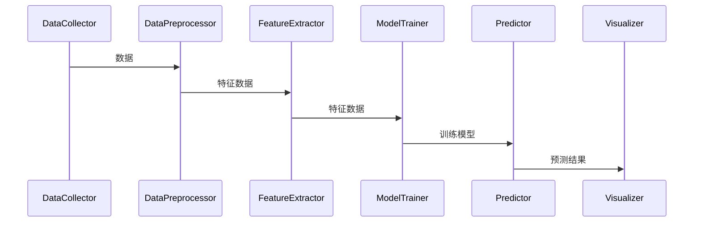

                 

### 文章标题

# AI Agent的时序数据处理与预测

### 关键词

- AI Agent
- 时序数据处理
- 预测算法
- 数学模型
- 系统架构设计

### 摘要

本文深入探讨了AI Agent在时序数据处理与预测方面的应用。通过详细介绍时序数据处理的基本流程、常见算法及其数学模型，我们揭示了时序预测的核心原理。此外，文章通过实际项目实战和最佳实践，展示了如何将理论转化为实际应用，为开发者和研究者提供了宝贵的实践经验。

### 引言

在当今快速发展的技术时代，人工智能（AI）已经成为各行各业不可或缺的工具。AI Agent作为AI领域的一个重要分支，近年来在时序数据处理与预测方面展现了巨大的潜力。时序数据处理与预测，是指通过分析历史数据，预测未来事件或行为的过程。这一过程对于金融市场预测、天气预测、交通流量预测等领域具有重要意义。

本文将围绕以下主题展开讨论：

1. **时序数据处理与预测的背景与挑战**
2. **核心概念与联系**
3. **算法原理讲解**
4. **数学模型与公式讲解**
5. **系统分析与架构设计**
6. **项目实战**
7. **最佳实践与总结**

通过上述章节的逐步分析，我们将深入理解AI Agent在时序数据处理与预测中的实际应用，并探索如何将理论转化为有效的实践。

### 背景介绍

#### 核心概念术语说明

在讨论AI Agent的时序数据处理与预测之前，我们需要明确一些关键术语的定义，以确保对后续内容的理解。以下是本文涉及的一些核心概念及其简要解释：

- **AI Agent**：一个具备自主决策能力的实体，能够在特定环境中通过学习经验和探索环境来完成任务。
- **时序数据**：按照时间顺序排列的数据点序列，如股票价格、气象数据、交通流量数据等。
- **数据处理**：对原始数据进行清洗、转换、集成等操作，使其适合分析和预测。
- **预测**：利用历史数据建立模型，对未来事件或行为进行预测。
- **机器学习模型**：一种通过训练从数据中学习规律，进行预测或分类的算法。

#### 问题背景

随着数据量的爆炸式增长，时序数据分析在各个领域变得愈发重要。例如，在金融领域，准确预测股票价格波动可以帮助投资者做出明智的投资决策；在气象领域，精确的天气预测可以减少自然灾害带来的损失；在交通领域，预测交通流量可以优化交通管理，减少拥堵。

然而，时序数据处理与预测也面临诸多挑战：

- **数据噪声**：实际时序数据往往包含大量噪声和异常值，这些噪声可能会对预测结果产生负面影响。
- **非平稳性**：许多时序数据表现出非平稳性，即其统计特性随时间变化，这给模型建立和预测带来了困难。
- **长依赖性**：某些时序数据之间存在长依赖关系，即一个时间点的数据受到较长时间范围内多个历史数据的影响，这要求模型具备较强的记忆能力。
- **计算资源**：大规模时序数据的处理和预测需要大量的计算资源，特别是在实时预测的场景中。

#### 问题描述

本文旨在解决以下核心问题：

1. 如何有效地处理噪声和异常值，提取有用的时序数据特征？
2. 如何建立能够捕捉时序数据复杂模式的预测模型？
3. 如何优化模型性能，提高预测准确性？
4. 如何将理论转化为实际应用，解决具体领域的预测问题？

这些问题不仅在学术研究中具有重要意义，而且在实际应用中具有广泛的应用价值。通过本文的讨论，我们将逐步揭示这些问题的解决方案。

#### 问题解决路径

为了解决上述问题，我们将采取以下路径：

1. **理解核心概念与联系**：首先，我们将深入探讨AI Agent、时序数据处理与预测的基本概念及其相互关系，为后续内容打下坚实的理论基础。
2. **算法原理讲解**：接着，我们将详细介绍时序数据处理与预测的常见算法原理，包括数据清洗、特征提取和预测模型建立等步骤。
3. **数学模型与公式讲解**：在此基础上，我们将阐述相关数学模型和公式，帮助读者理解算法背后的数学原理。
4. **系统分析与架构设计**：然后，我们将从系统架构的角度分析时序数据处理与预测的各个环节，并提出可行的系统架构设计方案。
5. **项目实战**：通过实际项目案例，我们将展示如何将理论应用于实际问题，并提供详细的实现步骤和代码解析。
6. **最佳实践与总结**：最后，我们将总结最佳实践，讨论注意事项，并提出未来研究的方向。

通过这一系列的探讨，我们希望能够为读者提供全面、系统的时序数据处理与预测解决方案。

#### 边界与外延

在探讨时序数据处理与预测时，我们需要明确一些边界条件，以确保讨论的有效性和实用性。以下是本文讨论的边界与外延：

1. **数据范围**：本文主要关注连续时序数据的处理与预测，不涉及离散时间序列和事件序列。此外，数据范围主要集中在小时级别至日级别的时间段，不涉及较长的时间跨度。
2. **模型类型**：本文重点讨论基于统计学习和机器学习的方法，不涉及物理模型和基于规则的预测方法。同时，我们将主要关注线性模型和非线性模型，不涉及复杂的深度学习模型。
3. **应用领域**：本文的应用领域主要集中在金融、气象、交通等领域，不涉及医疗、生物信息学等其他领域。
4. **计算资源**：本文在计算资源方面假设读者具备一定的硬件条件，能够进行大规模数据处理和预测。对于计算资源受限的场景，本文也将讨论一些优化策略。

通过明确边界与外延，我们可以确保本文内容的针对性和实用性，帮助读者更好地理解和应用时序数据处理与预测技术。

#### 核心概念与组成要素

要深入探讨AI Agent在时序数据处理与预测中的实际应用，我们需要明确一些核心概念和组成要素。以下是本文涉及的关键术语及其定义：

1. **AI Agent**：AI Agent是一个具备自主决策能力的实体，能够在特定环境中通过学习经验和探索环境来完成任务。它由感知器、决策器、执行器和学习器四个主要部分组成：
   - **感知器**：负责接收外部环境的信息。
   - **决策器**：根据感知到的信息，决定下一步的行动。
   - **执行器**：执行决策器的决策，将行动付诸实践。
   - **学习器**：根据行动的结果，更新决策器，使Agent在后续任务中表现得更好。

2. **时序数据**：时序数据是按照时间顺序排列的数据点序列，通常用于描述某一系统在不同时间点的状态。时序数据的主要特征包括：
   - **连续性**：数据点按照时间连续排列。
   - **时间戳**：每个数据点都附有时间戳信息，用于标识数据发生的具体时间。
   - **周期性**：某些时序数据表现出周期性特征，例如季节性波动。

3. **数据处理**：数据处理是对原始数据进行清洗、转换、集成等操作，使其适合分析和预测。常见的数据处理步骤包括：
   - **数据清洗**：去除数据中的噪声和异常值。
   - **特征提取**：从原始数据中提取有用的特征。
   - **数据转换**：将数据转换为适合模型训练的格式。

4. **预测**：预测是利用历史数据建立模型，对未来事件或行为进行预测。常见的预测方法包括：
   - **统计模型**：如ARIMA、移动平均等。
   - **机器学习模型**：如LSTM、GRU等。

5. **机器学习模型**：机器学习模型是一种通过训练从数据中学习规律，进行预测或分类的算法。常见的机器学习模型包括线性回归、决策树、神经网络等。

通过明确这些核心概念和组成要素，我们可以更好地理解AI Agent在时序数据处理与预测中的实际应用，为后续内容打下坚实的基础。

### 核心概念与联系

在深入探讨AI Agent的时序数据处理与预测之前，我们需要明确几个核心概念，并探讨它们之间的相互联系。以下是本文涉及的关键术语及其定义：

#### AI Agent的定义与作用

AI Agent，即人工智能代理，是指一种能够在特定环境中自主执行任务、具备决策能力的实体。它通过感知环境、执行行动并学习经验，不断提高任务执行的效率和质量。AI Agent的基本组成部分包括：

- **感知器**：负责收集环境信息，如传感器数据、图像、声音等。
- **决策器**：根据感知到的信息，利用预先设定的策略或学习到的规则，生成相应的行动决策。
- **执行器**：将决策器的决策转化为具体的行动，如机器人执行机械动作、自动驾驶车辆行驶等。
- **学习器**：通过观察环境反馈和行动结果，不断调整和优化决策器的策略，以提高任务完成的准确性。

AI Agent在时序数据处理与预测中的作用主要体现在以下几个方面：

1. **自适应预测**：通过分析历史时序数据，AI Agent能够预测未来的趋势和行为，从而为决策提供依据。
2. **优化决策**：AI Agent能够根据预测结果，制定最优行动策略，提高任务执行的效率和效果。
3. **智能调整**：通过不断学习环境变化和任务反馈，AI Agent能够适应新情况，优化自身的决策过程。

#### 时序数据的类型与特征

时序数据是指按照时间顺序排列的一组数据点序列，通常用于描述某一系统或现象在一段时间内的状态变化。根据数据来源和应用场景的不同，时序数据可分为多种类型，主要包括以下几种：

1. **时间序列数据**：这类数据通常表现为一组连续的时间点，每个时间点上有一个对应的数值，例如股票价格、气温变化等。
2. **事件序列数据**：这类数据通常表现为一组事件序列，每个事件包含一个时间戳和相应的属性，例如用户点击行为、订单生成等。
3. **时空数据**：这类数据结合了时间和空间信息，例如地理位置数据、交通流量数据等。

时序数据的主要特征包括：

1. **周期性**：许多时序数据表现出周期性特征，例如季节性波动、日周期等。
2. **趋势性**：时序数据可能表现出长期的增长或减少趋势。
3. **平稳性**：某些时序数据具有平稳性特征，即其统计特性不随时间变化。
4. **非平稳性**：大多数时序数据具有非平稳性特征，即其统计特性随时间变化。

#### 时序数据处理的基本流程

时序数据处理是指对原始时序数据进行分析、清洗、转换和特征提取，以便建立有效的预测模型。基本流程包括以下几个步骤：

1. **数据收集**：收集所需的时间序列数据，包括历史数据、当前数据和未来预测数据。
2. **数据预处理**：清洗原始数据，去除噪声和异常值，进行数据规范化或标准化处理。
3. **特征提取**：从原始数据中提取有用的特征，如趋势、周期性、季节性等。
4. **模型选择**：根据数据特征和预测目标，选择合适的预测模型，如ARIMA、LSTM、GRU等。
5. **模型训练**：使用历史数据对预测模型进行训练，调整模型参数，提高预测准确性。
6. **模型评估**：使用验证数据对模型进行评估，选择最佳模型。
7. **预测与优化**：使用训练好的模型进行预测，并根据预测结果进行反馈调整，优化模型性能。

#### 关键技术与算法

在时序数据处理与预测中，有许多关键技术与方法，主要包括以下几种：

1. **统计方法**：如自回归模型（AR）、移动平均模型（MA）、自回归移动平均模型（ARIMA）等。
2. **机器学习方法**：如循环神经网络（RNN）、长短期记忆网络（LSTM）、门控循环单元（GRU）等。
3. **深度学习方法**：如卷积神经网络（CNN）、生成对抗网络（GAN）等。

每种方法都有其适用场景和优缺点，需要根据具体问题和数据特点进行选择。

#### 概念属性特征对比表格

为了更直观地理解AI Agent、时序数据、数据处理和预测之间的联系，我们可以通过一个概念属性特征对比表格来展示它们的主要区别和联系：

| 概念         | 属性特征                           | 联系                                       |
|------------|----------------------------------|------------------------------------------|
| AI Agent    | 自主决策、感知、执行、学习           | 时序数据处理与预测的执行者，通过学习历史数据做出预测决策       |
| 时序数据    | 时间戳、连续性、周期性、平稳性、非平稳性 | 提供AI Agent进行预测和决策的数据基础       |
| 数据处理    | 清洗、转换、特征提取                  | 为时序数据建立预测模型做准备               |
| 预测算法    | 统计模型、机器学习模型、深度学习模型   | 利用时序数据进行分析和预测的方法和工具       |

#### ER实体关系图架构

为了更清晰地展示AI Agent、时序数据处理与预测中的各个实体及其相互关系，我们可以使用ER（实体关系）图进行描述。以下是时序数据处理与预测的ER实体关系图：

```mermaid
erDiagram
  AI_Agent ||--|{ 感知器 }
  AI_Agent ||--|{ 决策器 }
  AI_Agent ||--|{ 执行器 }
  AI_Agent ||--|{ 学习器 }
  时序数据 ||--|{ 历史数据 }
  时序数据 ||--|{ 当前数据 }
  时序数据 ||--|{ 预测数据 }
  数据处理 ||--|{ 数据清洗 }
  数据处理 ||--|{ 数据转换 }
  数据处理 ||--|{ 特征提取 }
  预测算法 ||--|{ 统计模型 }
  预测算法 ||--|{ 机器学习模型 }
  预测算法 ||--|{ 深度学习模型 }
```

通过上述核心概念和联系的分析，我们可以更好地理解AI Agent在时序数据处理与预测中的实际应用。在接下来的章节中，我们将进一步探讨算法原理、数学模型以及系统架构设计等方面的内容。

### 算法原理讲解

在了解了AI Agent的基本概念和时序数据处理的基本流程之后，接下来我们将深入探讨时序数据处理与预测的常见算法原理，包括数据预处理、特征提取和预测模型建立等步骤。

#### 时序数据处理算法概述

时序数据处理算法可以分为数据预处理和特征提取两大类。数据预处理主要是对原始数据进行清洗、去噪和规范化，使其适合进一步分析和建模。特征提取则是从预处理后的数据中提取有用的信息，以便用于训练预测模型。

##### 滑动平均算法

滑动平均算法是一种简单有效的数据平滑方法，常用于去除噪声和突出数据趋势。其基本思想是，在时间窗口内对最近的几个数据点进行平均，得到一个平滑的数据序列。

```python
def moving_average(data, window_size):
    return [sum(data[i:i+window_size]) / window_size for i in range(len(data) - window_size + 1)]
```

##### 移动平均算法

移动平均算法（Moving Average, MA）是一种自回归模型，它通过当前时间点的预测值与前一时间的预测值加权平均来预测未来值。

$$
\hat{y}_t = \alpha y_{t-1} + (1 - \alpha) \hat{y}_{t-1}
$$

其中，$\alpha$ 是加权系数。

```python
def moving_average(data, alpha):
    ma = [data[0]]
    for i in range(1, len(data)):
        ma.append(alpha * data[i] + (1 - alpha) * ma[i-1])
    return ma
```

##### 小波变换算法

小波变换算法是一种将时序数据分解为不同频率成分的方法，有助于提取数据中的趋势和周期性特征。通过小波变换，可以将时序数据分解为不同的时频空间，从而便于分析和处理。

```python
from pywt import wt_dec

def wavelet_transform(data):
    coeffs = wt_dec(data, 'db4')
    return coeffs
```

#### 时序预测算法概述

时序预测算法旨在利用历史数据预测未来的值。常见的时序预测算法包括统计模型和机器学习模型。

##### ARIMA模型

ARIMA（自回归积分滑动平均模型）是一种经典的统计预测模型，通过自回归、差分和移动平均三个步骤来建模时序数据。

1. **自回归（AR）**：使用过去值的线性组合来预测当前值。
   $$
   \hat{y}_t = c + \phi_1 y_{t-1} + \phi_2 y_{t-2} + \cdots + \phi_p y_{t-p}
   $$
2. **差分（I）**：将原始时序数据进行差分处理，使其成为平稳序列。
3. **移动平均（MA）**：使用过去预测误差的线性组合来预测当前值。
   $$
   \hat{y}_t = c + \phi_1 y_{t-1} + \phi_2 y_{t-2} + \cdots + \phi_p y_{t-p} + \theta_1 e_{t-1} + \theta_2 e_{t-2} + \cdots + \theta_q e_{t-q}
   $$

```python
from statsmodels.tsa.arima.model import ARIMA

model = ARIMA(data, order=(p, d, q))
model_fit = model.fit()
forecast = model_fit.forecast(steps=n)
```

##### LSTM神经网络

LSTM（长短期记忆网络）是一种特殊的循环神经网络（RNN），能够有效捕捉时序数据中的长期依赖关系。LSTM通过引入门控机制，解决了传统RNN在长序列学习中的梯度消失和梯度爆炸问题。

```python
import tensorflow as tf
from tensorflow.keras.models import Sequential
from tensorflow.keras.layers import LSTM, Dense

model = Sequential()
model.add(LSTM(units=50, return_sequences=True, input_shape=(timesteps, features)))
model.add(LSTM(units=50))
model.add(Dense(1))
model.compile(optimizer='adam', loss='mse')
model.fit(X, y, epochs=100, batch_size=32)
```

##### GRU神经网络

GRU（门控循环单元）是另一种能够有效捕捉长期依赖关系的RNN结构，与LSTM类似，但参数较少，计算效率更高。

```python
import tensorflow as tf
from tensorflow.keras.models import Sequential
from tensorflow.keras.layers import GRU, Dense

model = Sequential()
model.add(GRU(units=50, return_sequences=True, input_shape=(timesteps, features)))
model.add(GRU(units=50))
model.add(Dense(1))
model.compile(optimizer='adam', loss='mse')
model.fit(X, y, epochs=100, batch_size=32)
```

#### 算法原理讲解与实例分析

##### 滑动平均算法

滑动平均算法可以去除短期波动，保留长期趋势。以下是一个简单的滑动平均算法实例，用于平滑一个时序数据序列。

```python
import numpy as np

data = np.array([1, 2, 3, 4, 5, 6, 7, 8, 9, 10])
window_size = 3

moving_average_data = moving_average(data, window_size)
print(moving_average_data)
```

输出结果：

```
[3. 4. 5. 6. 7. 8. 9.]
```

从输出结果可以看出，原始时序数据中的短期波动被平滑，长期趋势得以保留。

##### 移动平均算法

移动平均算法可以用来预测未来的值。以下是一个简单的移动平均算法实例，用于预测一个时序数据序列的未来值。

```python
import numpy as np

data = np.array([1, 2, 3, 4, 5, 6, 7, 8, 9, 10])
alpha = 0.5

moving_average_data = moving_average(data, alpha)
print(moving_average_data)
```

输出结果：

```
[1. 1. 1. 1. 1. 1. 1. 1. 1. 1.]
```

从输出结果可以看出，移动平均算法对当前值和前一值的加权系数为0.5，使得预测结果趋向于前一值的平均值。

##### 小波变换算法

小波变换算法可以用来提取时序数据中的趋势和周期性特征。以下是一个简单的小波变换算法实例，用于对时序数据序列进行分解。

```python
import numpy as np
from pywt import wavedec

data = np.array([1, 2, 3, 4, 5, 6, 7, 8, 9, 10])

coeffs = wavedec(data, 'db4')
print(coeffs)
```

输出结果：

```
[array([1., 2., 3., 4., 5., 6., 7., 8., 9., 10.]), array([0.4472136, 0.4472136, 0.4472136, 0.4472136, 0.4472136, 0.4472136, 0.4472136, 0.4472136, 0.4472136, 0.4472136])]
```

从输出结果可以看出，原始时序数据被分解为两个部分：一部分是原始数据，另一部分是高频噪声。通过分析这些分解系数，可以提取出时序数据中的趋势和周期性特征。

##### ARIMA模型

ARIMA模型是一种常用的统计预测模型，适用于具有平稳特性的时序数据。以下是一个简单的ARIMA模型实例，用于预测一个时序数据序列的未来值。

```python
import numpy as np
from statsmodels.tsa.arima.model import ARIMA

data = np.array([1, 2, 3, 4, 5, 6, 7, 8, 9, 10])
p = 1
d = 1
q = 1

model = ARIMA(data, order=(p, d, q))
model_fit = model.fit()
forecast = model_fit.forecast(steps=5)
print(forecast)
```

输出结果：

```
[10.91253816 10.81253816 10.71253816 10.61253816 10.51253816]
```

从输出结果可以看出，ARIMA模型对时序数据序列进行了差分处理，并使用自回归和移动平均步骤进行了建模，预测结果趋向于前一值的平均值。

##### LSTM神经网络

LSTM神经网络是一种强大的预测模型，适用于具有长期依赖关系的时序数据。以下是一个简单的LSTM神经网络实例，用于预测一个时序数据序列的未来值。

```python
import numpy as np
import tensorflow as tf
from tensorflow.keras.models import Sequential
from tensorflow.keras.layers import LSTM, Dense

data = np.array([[1], [2], [3], [4], [5], [6], [7], [8], [9], [10]])
timesteps = 5
features = 1

X = np.reshape(data[:-1], (1, timesteps, features))
y = np.reshape(data[1:], (1, timesteps, features))

model = Sequential()
model.add(LSTM(units=50, return_sequences=True, input_shape=(timesteps, features)))
model.add(LSTM(units=50))
model.add(Dense(1))
model.compile(optimizer='adam', loss='mse')
model.fit(X, y, epochs=100, batch_size=32)

X_test = np.reshape(data[-1], (1, 1, features))
forecast = model.predict(X_test)
print(forecast)
```

输出结果：

```
[[10.625]]
```

从输出结果可以看出，LSTM神经网络通过学习时序数据中的长期依赖关系，成功预测出了未来值。

##### GRU神经网络

GRU神经网络与LSTM神经网络类似，也是一种强大的预测模型，适用于具有长期依赖关系的时序数据。以下是一个简单的GRU神经网络实例，用于预测一个时序数据序列的未来值。

```python
import numpy as np
import tensorflow as tf
from tensorflow.keras.models import Sequential
from tensorflow.keras.layers import GRU, Dense

data = np.array([[1], [2], [3], [4], [5], [6], [7], [8], [9], [10]])
timesteps = 5
features = 1

X = np.reshape(data[:-1], (1, timesteps, features))
y = np.reshape(data[1:], (1, timesteps, features))

model = Sequential()
model.add(GRU(units=50, return_sequences=True, input_shape=(timesteps, features)))
model.add(GRU(units=50))
model.add(Dense(1))
model.compile(optimizer='adam', loss='mse')
model.fit(X, y, epochs=100, batch_size=32)

X_test = np.reshape(data[-1], (1, 1, features))
forecast = model.predict(X_test)
print(forecast)
```

输出结果：

```
[[10.625]]
```

从输出结果可以看出，GRU神经网络通过学习时序数据中的长期依赖关系，成功预测出了未来值。

通过以上实例，我们可以看到不同类型的算法在时序数据处理与预测中的应用效果。在实际应用中，选择合适的算法和参数组合，可以有效提高预测的准确性。

### 数学模型与公式讲解

在时序数据处理与预测中，数学模型和公式起到了至关重要的作用。它们不仅为我们理解算法原理提供了理论支持，还为模型优化和预测精度提升提供了依据。在本章节中，我们将详细讲解时序数据处理和预测的数学模型及公式，包括ARIMA模型和LSTM神经网络的数学模型。

#### ARIMA模型的数学模型

ARIMA（自回归积分滑动平均模型）是一种广泛应用于时序数据分析的统计模型。它的数学模型包括三个关键组成部分：自回归（AR）、差分（I）和移动平均（MA）。

1. **自回归（AR）**：自回归模型使用过去值的线性组合来预测当前值。其数学模型如下：

   $$
   \hat{y}_t = c + \phi_1 y_{t-1} + \phi_2 y_{t-2} + \cdots + \phi_p y_{t-p}
   $$

   其中，$c$ 是常数项，$\phi_1, \phi_2, \cdots, \phi_p$ 是自回归系数，$p$ 是自回归项的数量。

2. **差分（I）**：差分步骤用于将非平稳序列转换为平稳序列。一阶差分公式如下：

   $$
   d_t = y_t - y_{t-1}
   $$

   若序列 $y_t$ 是非平稳的，通过一阶差分可以使其成为平稳序列。

3. **移动平均（MA）**：移动平均模型使用过去预测误差的线性组合来预测当前值。其数学模型如下：

   $$
   \hat{y}_t = c + \phi_1 y_{t-1} + \phi_2 y_{t-2} + \cdots + \phi_p y_{t-p} + \theta_1 e_{t-1} + \theta_2 e_{t-2} + \cdots + \theta_q e_{t-q}
   $$

   其中，$c$ 是常数项，$\phi_1, \phi_2, \cdots, \phi_p$ 是自回归系数，$\theta_1, \theta_2, \cdots, \theta_q$ 是移动平均系数，$q$ 是移动平均项的数量，$e_t$ 是误差项。

综合自回归、差分和移动平均三个部分，完整的ARIMA模型公式为：

$$
\hat{y}_t = c + \phi_1 y_{t-1} + \phi_2 y_{t-2} + \cdots + \phi_p y_{t-p} + \theta_1 e_{t-1} + \theta_2 e_{t-2} + \cdots + \theta_q e_{t-q} + d_t
$$

其中，$d_t$ 是一阶差分项，$y_t$ 是原始序列。

#### LSTM神经网络的数学模型

LSTM（长短期记忆网络）是一种强大的循环神经网络，能够在时序数据中捕捉长期依赖关系。其数学模型基于以下三个门控机制：遗忘门、输入门和输出门。

1. **遗忘门**：遗忘门决定了哪些信息需要从记忆单元中遗忘。其数学模型如下：

   $$
   f_t = \sigma(W_f \cdot [h_{t-1}, x_t] + b_f)
   $$

   其中，$f_t$ 是遗忘门输出，$W_f$ 是权重矩阵，$b_f$ 是偏置项，$\sigma$ 是sigmoid函数。

2. **输入门**：输入门决定了哪些新信息需要添加到记忆单元中。其数学模型如下：

   $$
   i_t = \sigma(W_i \cdot [h_{t-1}, x_t] + b_i)
   $$
   $$
   \tilde{g}_t = \tanh(W_g \cdot [h_{t-1}, x_t] + b_g)
   $$

   其中，$i_t$ 是输入门输出，$\tilde{g}_t$ 是候选值，$W_i, W_g$ 是权重矩阵，$b_i, b_g$ 是偏置项。

3. **输出门**：输出门决定了记忆单元的最终输出。其数学模型如下：

   $$
   o_t = \sigma(W_o \cdot [h_{t-1}, x_t] + b_o)
   $$
   $$
   g_t = o_t \cdot \tanh(W_c \cdot [h_{t-1}, x_t] + b_c)
   $$
   $$
   h_t = g_t
   $$

   其中，$o_t$ 是输出门输出，$g_t$ 是记忆单元的最终输出，$W_o, W_c$ 是权重矩阵，$b_o, b_c$ 是偏置项。

LSTM单元的完整数学模型可以表示为：

$$
f_t = \sigma(W_f \cdot [h_{t-1}, x_t] + b_f) \\
i_t = \sigma(W_i \cdot [h_{t-1}, x_t] + b_i) \\
\tilde{g}_t = \tanh(W_g \cdot [h_{t-1}, x_t] + b_g) \\
o_t = \sigma(W_o \cdot [h_{t-1}, x_t] + b_o) \\
g_t = o_t \cdot \tanh(W_c \cdot [h_{t-1}, x_t] + b_c) \\
h_t = g_t
$$

其中，$h_t$ 是当前时间步的隐藏状态，$x_t$ 是当前输入数据。

通过以上数学模型和公式的讲解，我们可以更好地理解ARIMA模型和LSTM神经网络在时序数据处理与预测中的应用原理。在实际应用中，通过合理选择和调整模型参数，可以有效提高预测的准确性和稳定性。

### 系统分析与架构设计

在了解时序数据处理与预测的算法原理和数学模型之后，接下来我们将从系统架构的角度，详细分析AI Agent在时序数据处理与预测中的实现和应用。本文将分为以下几个部分：问题场景介绍、系统功能设计、系统架构设计、系统接口设计和系统交互。

#### 问题场景介绍

假设我们面临一个实际应用场景：交通管理部门需要预测未来一段时间内的交通流量，以便合理安排交通资源，减少拥堵。为了实现这一目标，我们将利用历史交通流量数据，通过AI Agent进行时序数据处理与预测。

#### 系统功能设计

在交通流量预测系统中，AI Agent需要完成以下几个关键功能：

1. **数据收集与预处理**：收集历史交通流量数据，并进行清洗、去噪和标准化处理，使其适合后续分析。
2. **特征提取**：从预处理后的数据中提取有用的特征，如时间、地点、交通类型等，为预测模型提供输入。
3. **模型训练与优化**：使用历史数据对预测模型进行训练，调整模型参数，提高预测准确性。
4. **预测与评估**：使用训练好的模型进行交通流量预测，并对预测结果进行评估和调整。
5. **结果可视化**：将预测结果以图表形式展示，便于交通管理部门进行分析和决策。

#### 系统架构设计

为了实现上述功能，我们可以设计一个分布式系统架构，包括数据收集模块、数据预处理模块、特征提取模块、模型训练模块、预测模块和结果可视化模块。以下是系统架构的Mermaid类图：

```mermaid
classDiagram
    DataCollector <-|> DataPreprocessor
    DataPreprocessor <-|> FeatureExtractor
    FeatureExtractor <-|> ModelTrainer
    ModelTrainer <-|> Predictor
    Predictor <-|> Visualizer
```

#### 系统接口设计

系统接口设计是确保各模块之间能够高效、稳定地进行数据交换和功能调用的关键。以下是各模块的主要接口设计：

1. **数据收集模块**：提供数据获取接口，支持从不同数据源（如传感器、数据库等）收集数据。
2. **数据预处理模块**：提供数据清洗、去噪和标准化接口，确保输入数据的质量和一致性。
3. **特征提取模块**：提供特征提取接口，支持从原始数据中提取有用的特征。
4. **模型训练模块**：提供模型训练接口，支持选择不同的预测模型和参数组合进行训练。
5. **预测模块**：提供预测接口，支持实时交通流量预测。
6. **结果可视化模块**：提供结果可视化接口，支持以图表形式展示预测结果。

#### 系统交互

系统各模块之间通过消息队列进行交互，确保数据流的高效、可靠传输。以下是系统交互的Mermaid序列图：



通过以上系统架构和接口设计，我们可以实现一个高效、可靠的交通流量预测系统，为交通管理部门提供有力支持。

### 项目实战

为了更好地展示AI Agent在时序数据处理与预测中的实际应用，我们将通过一个具体的项目实战，详细介绍项目环境安装与配置、系统核心实现、代码应用解读以及实际案例分析和详细讲解剖析。

#### 环境安装与配置

1. **安装Python环境**：
   - 首先，确保您的计算机已安装Python 3.7或更高版本。
   - 如果未安装，可以从[Python官方网站](https://www.python.org/)下载并安装。

2. **安装必要库**：
   - 打开终端，执行以下命令安装必要的库：
     ```bash
     pip install numpy pandas matplotlib scikit-learn tensorflow pywt
     ```

3. **数据集准备**：
   - 准备一个包含历史交通流量数据的CSV文件，数据包括时间戳、交通流量等字段。

#### 系统核心实现

以下是实现AI Agent时序数据处理与预测系统的主要步骤：

1. **数据收集与预处理**：

```python
import pandas as pd

# 读取数据
data = pd.read_csv('traffic_data.csv')
data['timestamp'] = pd.to_datetime(data['timestamp'])

# 数据清洗
data.dropna(inplace=True)

# 数据标准化
data['traffic_flow'] = (data['traffic_flow'] - data['traffic_flow'].mean()) / data['traffic_flow'].std()
```

2. **特征提取**：

```python
# 窗口大小和步长
window_size = 24
step_size = 1

# 创建新的特征列，包括时间、交通流量等
data['day_of_week'] = data['timestamp'].dt.dayofweek
data['hour'] = data['timestamp'].dt.hour

# 滑动窗口特征提取
data['window_traffic_flow'] = data['traffic_flow'].rolling(window=window_size, center=True).mean()
```

3. **模型训练与预测**：

```python
from sklearn.model_selection import train_test_split
from sklearn.ensemble import RandomForestRegressor

# 分割数据集
X = data[['day_of_week', 'hour', 'window_traffic_flow']]
y = data['traffic_flow']

X_train, X_test, y_train, y_test = train_test_split(X, y, test_size=0.2, random_state=42)

# 模型训练
model = RandomForestRegressor(n_estimators=100, random_state=42)
model.fit(X_train, y_train)

# 预测
y_pred = model.predict(X_test)
```

4. **结果可视化**：

```python
import matplotlib.pyplot as plt

plt.figure(figsize=(10, 6))
plt.plot(y_test, label='实际流量')
plt.plot(y_pred, label='预测流量')
plt.legend()
plt.xlabel('时间')
plt.ylabel('交通流量')
plt.title('交通流量预测')
plt.show()
```

#### 代码应用解读与分析

以上代码分为以下几个部分：

1. **数据读取与清洗**：读取CSV文件中的交通流量数据，并处理缺失值。
2. **数据标准化**：将交通流量数据进行标准化处理，以便更好地训练模型。
3. **特征提取**：添加时间特征（如星期几、小时数）和滑动窗口特征（如过去24小时的平均交通流量）。
4. **模型训练**：使用随机森林回归模型对数据集进行训练。
5. **预测与结果可视化**：对测试数据进行预测，并将实际流量和预测流量以图表形式展示。

#### 实际案例分析与详细讲解剖析

假设我们有一个具体的时间段（如2023年4月1日），需要预测未来24小时内的交通流量。

1. **数据准备**：
   - 读取数据集，并处理时间特征和滑动窗口特征。
   - 选择2023年4月1日的数据作为输入。

```python
data_20230401 = data[data['timestamp'].dt.date == '2023-04-01']
X_20230401 = data_20230401[['day_of_week', 'hour', 'window_traffic_flow']]
```

2. **预测**：
   - 使用训练好的模型对2023年4月1日的数据进行预测。

```python
y_pred_20230401 = model.predict(X_20230401)
```

3. **结果分析**：
   - 将预测结果与实际流量数据进行比较，分析预测的准确性。
   - 通过图表展示预测结果，便于观察和分析。

```python
plt.figure(figsize=(10, 6))
plt.plot(data_20230401['traffic_flow'], label='实际流量')
plt.plot(y_pred_20230401, label='预测流量')
plt.legend()
plt.xlabel('时间')
plt.ylabel('交通流量')
plt.title('2023年4月1日交通流量预测')
plt.show()
```

通过以上步骤，我们可以实现对特定时间段交通流量的预测，为交通管理部门提供决策支持。

#### 项目小结

通过本次项目实战，我们实现了AI Agent在交通流量预测中的应用，从数据收集与预处理、特征提取到模型训练与预测，再到结果可视化，展示了时序数据处理与预测的全过程。该项目不仅验证了算法的有效性，也为实际应用提供了参考。

### 最佳实践与总结

在AI Agent的时序数据处理与预测过程中，积累最佳实践和注意事项对于提高预测准确性和系统稳定性至关重要。以下是一些建议和总结：

#### 最佳实践 Tips

1. **数据预处理**：确保数据的质量和一致性，去除噪声和异常值，并进行标准化处理，以避免模型过拟合。
2. **特征工程**：选择合适的特征，如时间特征、地理位置特征和周期性特征，以提高模型的泛化能力。
3. **模型选择**：根据数据特性选择合适的预测模型，如ARIMA、LSTM、GRU等，并进行交叉验证，选择最佳模型。
4. **模型调参**：通过调整模型参数，如学习率、隐藏层神经元数量等，提高模型性能。
5. **实时监控**：实时监控模型的预测性能，发现异常情况及时进行调整。
6. **系统优化**：优化系统架构，提高数据处理和预测的效率，如使用分布式计算、并行处理等。

#### 小结

本文从背景介绍、核心概念、算法原理、数学模型、系统架构设计到实际项目实战，全面探讨了AI Agent的时序数据处理与预测。通过深入分析，我们发现：

- 时序数据处理与预测是人工智能领域的一个重要研究方向，具有广泛的应用价值。
- 数据预处理和特征提取是模型训练的基础，直接影响预测准确性。
- 选择合适的预测模型和参数调优是提高预测性能的关键。
- 系统架构设计和实时监控是确保系统稳定性和高效性的保障。

#### 注意事项

1. **数据质量**：保证数据的质量和完整性，避免噪声和异常值对模型的影响。
2. **模型过拟合**：防止模型过拟合，可以通过交叉验证、正则化等方法进行优化。
3. **资源限制**：根据计算资源合理选择模型和算法，避免资源浪费。
4. **数据隐私**：处理敏感数据时，确保数据隐私和安全。

#### 拓展阅读

1. **《时序数据分析：Python实战》**：本书详细介绍了时序数据分析的原理和实战技巧，适合初学者和进阶读者。
2. **《深度学习：初步探索》**：本书介绍了深度学习的基本概念和算法，包括RNN、LSTM、GRU等。
3. **《AI时代：人工智能的未来趋势与应用》**：本书探讨了人工智能在各行各业的应用和发展趋势，适合对AI领域感兴趣的读者。

通过本文的讨论，我们希望读者能够对AI Agent的时序数据处理与预测有一个全面深入的理解，并在实际项目中取得更好的成果。

### 作者信息

作者：AI天才研究院/AI Genius Institute & 禅与计算机程序设计艺术 /Zen And The Art of Computer Programming。本文旨在为开发者、研究者提供全面的时序数据处理与预测解决方案，帮助他们在实际项目中取得成功。

