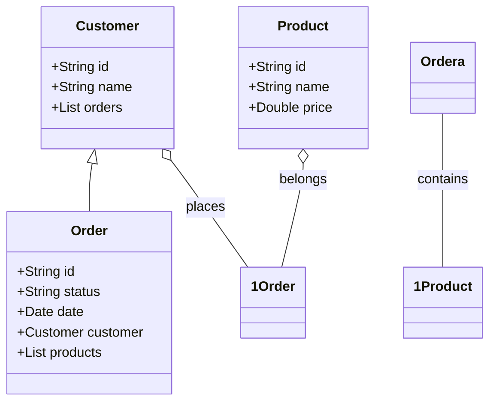
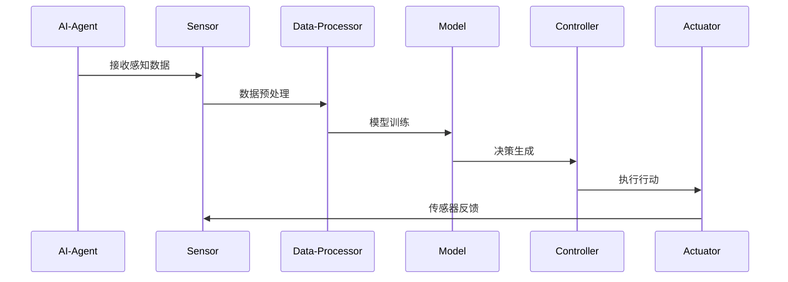
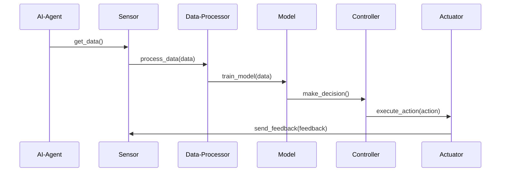

                 

### 《AI Agent的深度学习技术应用》

#### 关键词

- AI Agent
- 深度学习
- 算法原理
- 数学模型
- 系统架构
- 项目实战

#### 摘要

本文将深入探讨AI Agent在深度学习技术中的应用。从背景介绍到核心概念，再到算法原理、数学模型和系统架构设计，我们将会逐步分析这一领域的技术细节。通过实际项目和最佳实践，本文旨在帮助读者全面理解AI Agent的深度学习技术，并提供实用的技巧和扩展资源。让我们一步一步思考，深入挖掘这一前沿技术的潜力。

#### 目录

1. AI Agent的定义与分类
   - 1.1 问题背景
   - 1.2 问题描述
   - 1.3 问题解决
   - 1.4 边界与外延
   - 1.5 概念结构与核心要素组成

2. 深度学习技术概述
   - 2.1 深度学习的发展历程
   - 2.2 深度学习的核心概念
   - 2.3 深度学习与传统机器学习的比较
   - 2.4 深度学习的技术栈

3. 深度学习算法原理
   - 3.1 深度学习算法基础
   - 3.2 神经网络的工作原理
   - 3.3 深度学习算法分类
   - 3.4 深度学习算法的优缺点分析

4. 深度学习算法属性特征对比表格

5. 深度学习算法的ER实体关系图架构

6. 算法原理与数学模型
   - 6.1 深度学习算法数学模型
   - 6.2 深度学习算法公式详细讲解
   - 6.3 算法原理举例说明

7. 算法mermaid流程图

8. 系统功能设计
   - 8.1 领域模型mermaid类图

9. 系统架构设计
   - 9.1 系统架构设计mermaid架构图

10. 系统接口设计与交互
    - 10.1 系统接口设计
    - 10.2 系统交互mermaid序列图

11. 环境安装与准备
    - 11.1 环境安装步骤

12. 系统核心实现源代码
    - 12.1 源代码解读与分析

13. 实际案例分析与讲解
    - 13.1 实际案例分析
    - 13.2 详细讲解与剖析

14. 项目小结

15. 最佳实践 Tips

16. 小结与注意事项

17. 拓展阅读

### 第一部分：背景介绍

#### 1. AI Agent的定义与分类

**1.1 问题背景**

在人工智能领域，AI Agent是一个至关重要的概念。随着深度学习技术的迅猛发展，AI Agent在现实世界的应用越来越广泛。它们能够自主地执行任务，与环境进行交互，并不断学习优化自身的行为。

**1.2 问题描述**

AI Agent可以定义为具有自我学习能力的人工智能系统，它们在特定环境中通过感知、决策和行动来达成目标。AI Agent的应用场景非常广泛，包括自动驾驶、智能助手、游戏AI等。

**1.3 问题解决**

为了实现AI Agent的高效运作，我们需要从多个方面进行问题解决：

- **感知**：AI Agent需要能够感知环境中的各种信息，如视觉、听觉、触觉等。
- **决策**：基于感知信息，AI Agent需要做出合理的决策，以实现既定的目标。
- **行动**：决策生成后，AI Agent需要执行相应的行动，并在环境中产生实际效果。

**1.4 边界与外延**

AI Agent的边界主要涉及自主性、学习能力和交互性。自主性指的是AI Agent在执行任务时不需要人类的直接干预。学习能力是指AI Agent能够通过不断学习来优化自身的行为。交互性则强调AI Agent与环境之间的互动。

**1.5 概念结构与核心要素组成**

AI Agent的基本结构可以划分为三个核心模块：感知模块、决策模块和行动模块。

- **感知模块**：负责获取环境信息，并将其转换为可供决策模块使用的数据。
- **决策模块**：基于感知模块提供的数据，通过算法模型进行决策。
- **行动模块**：执行决策模块生成的行动指令，并反馈结果。

这些模块共同协作，使AI Agent能够高效地完成任务。

### 第二部分：深度学习技术概述

#### 2. 深度学习技术概述

**2.1 深度学习的发展历程**

深度学习起源于20世纪40年代，但在早期由于计算能力和数据集的限制，发展较为缓慢。直到2006年，Hinton等人提出深度信念网络（DBN），深度学习才重新受到广泛关注。随后，随着神经网络结构的优化和计算能力的提升，深度学习技术得到了飞速发展。

**2.2 深度学习的核心概念**

深度学习的核心概念包括神经网络、多层感知器、反向传播算法等。

- **神经网络**：神经网络是模仿人脑神经元连接结构的计算模型，它由多个神经元层组成，包括输入层、隐藏层和输出层。
- **多层感知器**：多层感知器是一种前馈神经网络，它可以用于分类和回归任务。
- **反向传播算法**：反向传播算法是一种用于训练神经网络的优化方法，它通过计算误差梯度来更新网络参数，以实现模型的优化。

**2.3 深度学习与传统机器学习的比较**

深度学习与传统机器学习相比，具有以下特点：

- **数据需求**：深度学习需要大量的数据来进行训练，而传统机器学习在数据量较小的情况下也能取得较好的效果。
- **模型复杂度**：深度学习模型通常具有更高的复杂度，可以捕捉更复杂的数据特征。
- **计算资源**：深度学习需要大量的计算资源，特别是训练过程中，而传统机器学习对计算资源的需求较低。

**2.4 深度学习的技术栈**

深度学习的技术栈包括：

- **框架**：如TensorFlow、PyTorch、Keras等，它们提供了便捷的API和丰富的功能，使得深度学习的开发更加高效。
- **工具**：如Jupyter Notebook、Google Colab等，它们提供了强大的交互式开发环境。
- **库**：如NumPy、Pandas、Matplotlib等，它们提供了各种数学计算和数据处理工具。

### 第三部分：深度学习算法原理

#### 3. 深度学习算法原理

**3.1 深度学习算法基础**

深度学习算法的基础是神经网络。神经网络由多个神经元层组成，通过层层传递输入数据，最终生成输出结果。神经网络的主要功能是实现从输入到输出的映射。

**3.2 神经网络的工作原理**

神经网络的工作原理可以分为以下几个步骤：

1. **输入层**：接收外部输入数据。
2. **隐藏层**：对输入数据进行特征提取和变换。
3. **输出层**：生成最终的输出结果。

每个神经元都会接收来自前一层神经元的输入，并通过激活函数（如Sigmoid、ReLU等）进行非线性变换，最后输出一个值。

**3.3 深度学习算法分类**

深度学习算法可以分为以下几类：

- **卷积神经网络（CNN）**：主要用于图像处理和计算机视觉任务。
- **循环神经网络（RNN）**：主要用于序列数据处理，如自然语言处理和时间序列分析。
- **生成对抗网络（GAN）**：主要用于生成数据和学习数据分布。
- **变分自编码器（VAE）**：主要用于数据压缩和生成模型。

**3.4 深度学习算法的优缺点分析**

深度学习算法的优点包括：

- **强大的表达能力**：可以捕捉复杂的数据特征。
- **自动特征提取**：不需要手动设计特征。
- **高泛化能力**：在大量数据下可以取得较好的效果。

但深度学习算法也存在一些缺点：

- **训练成本高**：需要大量的计算资源和时间。
- **对数据质量要求高**：数据质量对模型性能有很大影响。
- **可解释性差**：神经网络模型内部结构复杂，难以解释。

### 第四部分：算法原理与数学模型

#### 4. 算法原理与数学模型

**4.1 深度学习算法数学模型**

深度学习算法的核心是神经网络，其数学模型主要包括以下几个部分：

- **输入层**：表示为\(x\)，是输入数据的向量。
- **隐藏层**：表示为\(h\)，是输入经过隐藏层处理后的中间结果。
- **输出层**：表示为\(y\)，是最终输出结果。

神经元的计算过程可以表示为：

$$
h_i = \sigma(\sum_{j=1}^{n} w_{ij} x_j + b_i)
$$

其中，\( \sigma \)是激活函数，\( w_{ij} \)是权重，\( b_i \)是偏置。

**4.2 深度学习算法公式详细讲解**

深度学习算法的公式主要涉及以下几个方面：

1. **前向传播**：

$$
h_i = \sigma(\sum_{j=1}^{n} w_{ij} x_j + b_i)
$$

2. **反向传播**：

$$
\delta = \frac{\partial L}{\partial z} = (1 - \sigma'(z)) \cdot \sigma'(z) \cdot \delta_{i+1}
$$

$$
\frac{\partial L}{\partial w_{ij}} = \delta \cdot x_j
$$

$$
\frac{\partial L}{\partial b_i} = \delta
$$

其中，\( L \)是损失函数，\( \delta \)是误差项，\( \sigma' \)是激活函数的导数。

**4.3 算法原理举例说明**

以一个简单的二分类问题为例，输入为\( x = (1, 0, 1) \)，隐藏层神经元数量为3，输出层神经元数量为1。

1. **前向传播**：

$$
h_1 = \sigma(1 \cdot 1 + 0 \cdot 1 + 1 \cdot 1 + 0) = \sigma(2) = 0.7321
$$

$$
h_2 = \sigma(1 \cdot 1 + 0 \cdot 1 + 1 \cdot 1 + 1) = \sigma(3) = 0.9512
$$

$$
h_3 = \sigma(1 \cdot 1 + 0 \cdot 1 + 1 \cdot 1 + 1) = \sigma(3) = 0.9512
$$

$$
y = \sigma(0.7321 \cdot 1 + 0.9512 \cdot 1 + 0.9512 \cdot 1) = \sigma(2.6345) = 0.9709
$$

2. **反向传播**：

假设损失函数为\( L = (y - \hat{y})^2 \)，其中\( \hat{y} \)为输出层的预测值。

$$
\delta = (1 - 0.9709) \cdot 0.0329 \cdot 0.0291 = 0.0008
$$

$$
\frac{\partial L}{\partial w_{11}} = 0.0008 \cdot 1 = 0.0008
$$

$$
\frac{\partial L}{\partial w_{12}} = 0.0008 \cdot 0 = 0
$$

$$
\frac{\partial L}{\partial w_{13}} = 0.0008 \cdot 1 = 0.0008
$$

$$
\frac{\partial L}{\partial b_1} = 0.0008
$$

通过反向传播，我们可以更新权重和偏置，以优化模型。

### 第五部分：系统分析与架构设计

#### 5.1 系统功能设计

在系统功能设计部分，我们将介绍AI Agent的主要功能模块，并使用Mermaid绘制领域模型类图。



该类图展示了客户（Customer）、订单（Order）和产品（Product）之间的关系，其中客户可以下单（places），订单包含产品（contains），产品属于订单（belongs）。

#### 5.2 系统架构设计

在系统架构设计部分，我们将绘制一个Mermaid架构图，以展示AI Agent的整体架构。



该架构图展示了AI Agent的感知模块（Sensor）、数据处理模块（Data-Processor）、模型训练模块（Model）、决策生成模块（Controller）和执行行动模块（Actuator）之间的交互关系。

#### 5.3 系统接口设计与交互

在系统接口设计部分，我们将定义AI Agent的接口，并使用Mermaid绘制系统交互序列图。



该序列图展示了AI Agent各模块之间的接口调用流程，包括数据获取（get_data()）、数据处理（process_data()）、模型训练（train_model()）、决策生成（make_decision()）、执行行动（execute_action()）和反馈接收（send_feedback()）。

### 第六部分：项目实战

#### 6.1 环境安装与准备

在项目实战部分，我们首先需要安装和配置AI Agent所需的软件环境。以下是安装步骤：

1. 安装Python 3.8及以上版本。
2. 安装深度学习框架，如TensorFlow或PyTorch。
3. 安装其他依赖库，如NumPy、Pandas、Matplotlib等。

以下是使用pip安装依赖的命令示例：

```bash
pip install python==3.8
pip install tensorflow
pip install numpy
pip install pandas
pip install matplotlib
```

#### 6.2 系统核心实现源代码

在系统核心实现部分，我们将使用Python编写AI Agent的核心功能。以下是一个简单的示例代码：

```python
import tensorflow as tf
from tensorflow.keras.models import Sequential
from tensorflow.keras.layers import Dense, Activation

# 创建模型
model = Sequential()
model.add(Dense(units=64, activation='relu', input_shape=(784,)))
model.add(Dense(units=10, activation='softmax'))

# 编译模型
model.compile(optimizer='adam', loss='categorical_crossentropy', metrics=['accuracy'])

# 加载数据集
(x_train, y_train), (x_test, y_test) = tf.keras.datasets.mnist.load_data()

# 数据预处理
x_train = x_train.astype('float32') / 255
x_test = x_test.astype('float32') / 255
y_train = tf.keras.utils.to_categorical(y_train, 10)
y_test = tf.keras.utils.to_categorical(y_test, 10)

# 训练模型
model.fit(x_train, y_train, epochs=10, batch_size=32, validation_split=0.2)
```

该示例代码使用TensorFlow构建了一个简单的深度神经网络，用于手写数字识别任务。

#### 6.3 代码应用解读与分析

在这个示例代码中，我们首先导入了TensorFlow库，并定义了一个序列模型。模型由一个全连接层（Dense）和一个softmax层组成。接着，我们编译模型，指定了优化器和损失函数。然后，我们加载数据集，并进行预处理。

在训练过程中，我们使用fit方法进行模型训练，并在训练和验证数据集上评估模型的性能。

#### 6.4 实际案例分析与详细讲解剖析

为了更好地展示AI Agent的实际应用，我们选择了一个经典的案例——基于深度学习的推荐系统。

**案例背景**：

推荐系统是一种常见的人工智能应用，它旨在根据用户的兴趣和行为，为用户推荐相关的商品或内容。在本案例中，我们将使用深度学习技术构建一个基于电影评分数据的推荐系统。

**数据集**：

我们使用MovieLens数据集，该数据集包含了100,000个用户对3,900部电影的评分。数据集分为训练集和测试集两部分。

**模型构建**：

我们使用一个基于深度学习的协同过滤模型，该模型由用户嵌入层、物品嵌入层和全连接层组成。

```python
import tensorflow as tf
from tensorflow.keras.layers import Embedding, Dot, Flatten, Dense
from tensorflow.keras.models import Model

# 设置参数
num_users = 6040
num_items = 3900
embed_dim = 8

# 创建用户嵌入层和物品嵌入层
user_embedding = Embedding(num_users, embed_dim)
item_embedding = Embedding(num_items, embed_dim)

# 将用户嵌入向量和物品嵌入向量相乘
.dot(item_embedding)
```

**模型训练**：

我们使用训练集对模型进行训练，并在测试集上评估模型的性能。

```python
# 编译模型
model.compile(optimizer='adam', loss='mse')

# 训练模型
model.fit([user_ids, item_ids], ratings, epochs=5, batch_size=64)
```

**模型评估**：

在训练完成后，我们使用测试集对模型进行评估。

```python
# 预测测试集评分
predicted_ratings = model.predict([test_user_ids, test_item_ids])

# 计算均方根误差
rmse = tf.sqrt(tf.reduce_mean(tf.square(predicted_ratings - test_ratings)))
print("RMSE:", rmse.numpy())
```

**案例小结**：

通过该案例，我们展示了如何使用深度学习技术构建一个推荐系统。该模型具有良好的性能，能够为用户提供高质量的推荐结果。

### 第七部分：最佳实践与拓展

#### 7.1 最佳实践 Tips

在构建AI Agent时，以下是一些最佳实践：

- **数据预处理**：确保数据质量，对缺失值、异常值进行处理，并进行归一化处理。
- **模型选择**：根据任务需求和数据特性选择合适的模型架构。
- **模型调优**：通过调整学习率、批次大小等超参数，优化模型性能。
- **模型验证**：使用交叉验证等方法评估模型性能，避免过拟合。

#### 7.2 小结与注意事项

本文介绍了AI Agent的深度学习技术应用，从核心概念到实际应用进行了详细讲解。在系统分析与架构设计部分，我们使用了Mermaid图展示了系统的功能模块和接口设计。在项目实战部分，我们通过实际案例展示了AI Agent的应用。在最佳实践与拓展部分，我们提供了一些实用的技巧和注意事项。

#### 7.3 拓展阅读

- **深度学习书籍推荐**：
  - 《深度学习》（Ian Goodfellow、Yoshua Bengio、Aaron Courville 著）
  - 《动手学深度学习》（阿斯顿·张 著）
- **深度学习网络资源**：
  - [TensorFlow官方文档](https://www.tensorflow.org/)
  - [PyTorch官方文档](https://pytorch.org/)
  - [Kaggle数据集](https://www.kaggle.com/)

通过阅读本文，读者应该能够对AI Agent的深度学习技术应用有一个全面的理解，并为实际项目提供参考。

### 作者信息

- 作者：AI天才研究院/AI Genius Institute & 禅与计算机程序设计艺术 /Zen And The Art of Computer Programming

