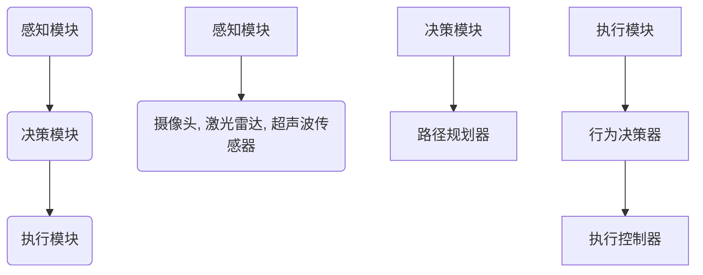
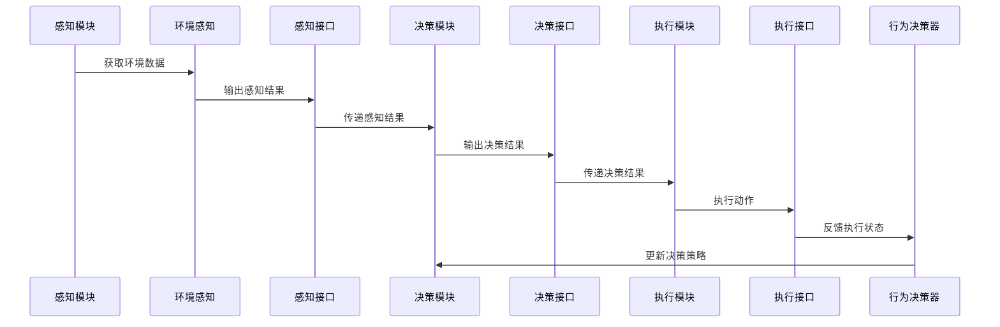
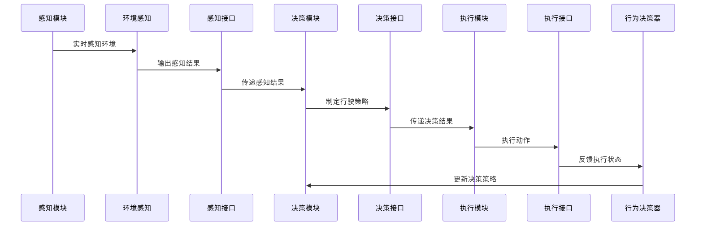
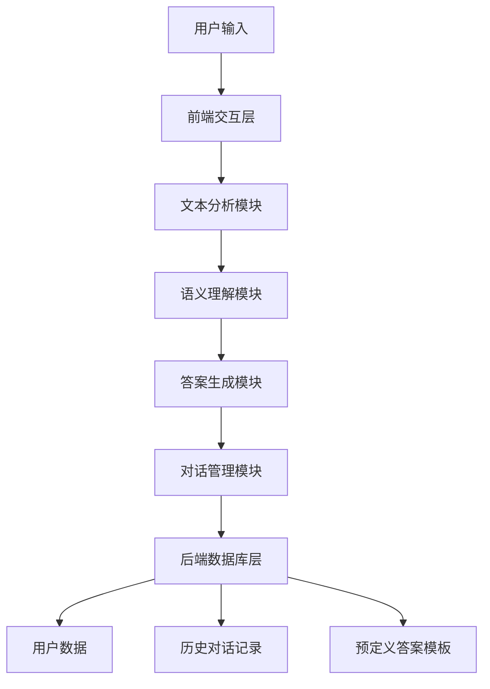
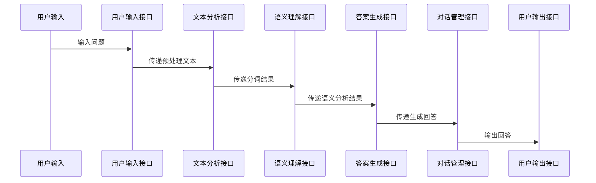
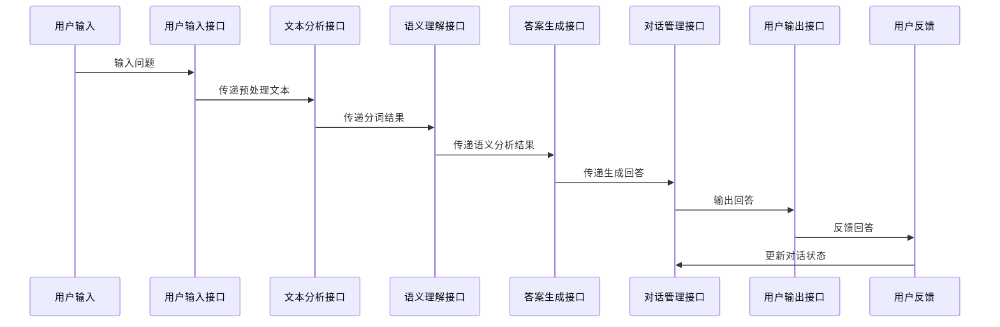
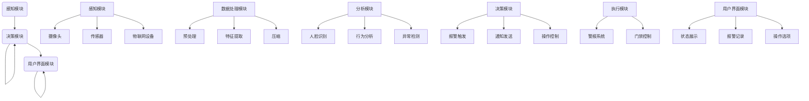
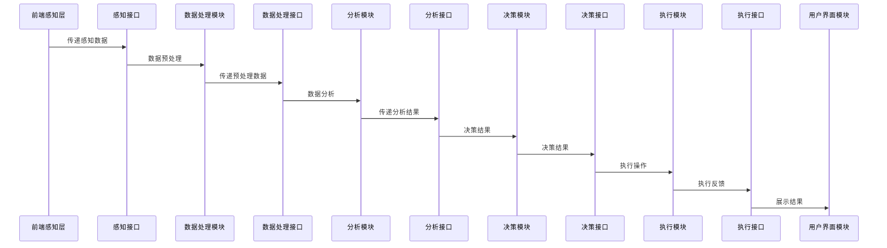
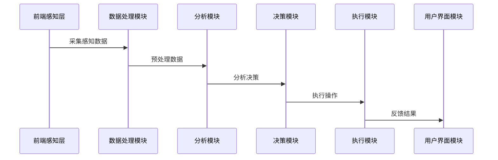

                 

### 引入

在当今快速发展的科技时代，人工智能（AI）已经成为推动社会进步的重要力量。AI Agent作为AI领域的一个重要组成部分，它代表了自动化、智能化和自适应性的结合，广泛应用于自动驾驶、智能家居、智能客服等多个领域。然而，随着AI Agent的复杂性和应用场景的不断扩展，如何对其进行有效的版本控制和迭代优化成为了一个亟待解决的问题。

版本控制，是确保代码和项目一致性、可维护性和可追溯性的关键手段。在传统的软件开发中，版本控制已经得到了广泛应用，并形成了较为成熟的流程和工具。然而，在AI Agent的开发过程中，由于AI算法和模型的不断迭代，版本控制的复杂性大大增加。迭代优化，则是在不断迭代的过程中，通过算法的改进、模型的调优来提升AI Agent的性能和效率。这两者相辅相成，共同构成了AI Agent高效、可靠开发和持续改进的基础。

本文旨在探讨AI Agent的版本控制与迭代优化策略。首先，我们将介绍AI Agent的背景和定义，理解其在当前技术发展中的重要性。接着，我们将详细描述AI Agent开发中面临的挑战，包括版本控制和迭代优化方面的问题。然后，我们将深入分析版本控制和迭代优化的基本概念、原理及其相互关系。在此基础上，本文将介绍常见的版本控制工具和方法，以及迭代优化的策略和技术。通过实际案例的研究和实战分析，我们将展示如何在实际项目中应用这些策略和技术，最终提出一些最佳实践和建议，以指导AI Agent的开发和优化。

通过本文的阅读，读者将能够全面理解AI Agent版本控制和迭代优化的核心概念、原理和实践方法，为后续的AI项目开发提供有力的理论支持和实践指导。因此，无论是AI领域的开发者、研究人员，还是对AI技术感兴趣的读者，都可以从本文中获得宝贵的知识和经验。

### 关键词

- **人工智能（AI）**
- **AI Agent**
- **版本控制**
- **迭代优化**
- **算法开发**
- **模型训练**
- **软件工程**
- **开发流程**
- **优化策略**
- **数据管理**

### 摘要

本文旨在深入探讨AI Agent的开发过程中所面临的两个核心问题：版本控制和迭代优化。首先，我们将介绍AI Agent的定义、背景及其在当前技术发展中的重要性。接着，我们将详细分析AI Agent开发中的主要挑战，包括版本控制和迭代优化方面的难点。随后，本文将介绍版本控制的基本原理、核心技术和常见工具，以及迭代优化的原理和策略。通过实际案例的解析和实战分析，我们将展示如何将版本控制和迭代优化策略应用到AI Agent的开发过程中。最后，本文将总结最佳实践，并提出一些注意事项和拓展阅读建议，以指导AI Agent的开发和优化。通过本文的阅读，读者将全面理解AI Agent版本控制和迭代优化的关键概念、原理和实践方法，为AI项目的开发提供有力支持。

### 第1章 引言

#### 1.1 问题背景

**人工智能的发展现状**

人工智能（AI）作为当今科技领域的热门话题，已经取得了显著的进展。从最初的机器学习到深度学习，再到现在的强化学习和迁移学习，AI技术不断突破传统计算机能力的局限，逐渐深入到各个行业和领域。从自动驾驶、智能客服、医疗诊断到金融风控、智能制造等，AI的应用场景越来越广泛，其商业价值和影响力也越来越大。

AI Agent的重要性

在AI技术的发展过程中，AI Agent作为一个重要的概念逐渐受到关注。AI Agent，通常指的是一种能够自主执行任务、与环境交互并做出决策的智能体。它具有以下特点：

1. **自主性**：AI Agent能够根据环境和任务的需要，自主地制定决策和执行行动。
2. **适应性**：AI Agent能够在不同的环境和条件下，通过学习和调整来提高其表现。
3. **协作性**：AI Agent可以与其他Agent或人类进行有效的协作，共同完成任务。

随着AI技术的不断进步，AI Agent的应用范围也越来越广泛，成为实现自动化和智能化的关键工具。在自动驾驶领域，AI Agent负责实时感知路况、做出驾驶决策；在智能客服领域，AI Agent能够通过自然语言处理与用户进行交互，提供个性化服务；在金融领域，AI Agent可以用于风险管理、信用评估等。

**版本控制与迭代优化的需求**

在AI Agent的开发过程中，版本控制和迭代优化是两个至关重要的环节。首先，版本控制是确保AI Agent开发过程有序进行的重要手段。随着AI项目的复杂性和规模不断扩大，代码库中的文件数量和版本数量也急剧增加，如果没有有效的版本控制，项目将面临代码混乱、版本冲突、历史追踪困难等问题。

版本控制不仅可以记录每次代码的更改，提供历史版本的可追溯性，还可以帮助开发团队协作，确保多人协同开发时代码的一致性和完整性。常见的版本控制工具如Git、SVN等，已经成为现代软件开发中的标准配置。

其次，迭代优化是提升AI Agent性能和效率的关键策略。在AI Agent的开发过程中，算法和模型需要不断地调整和优化，以达到更高的准确性和效率。迭代优化不仅包括算法的改进，还涉及模型的训练、参数的调整以及性能的评估。通过不断的迭代和优化，AI Agent能够更好地适应不同的环境和任务需求，提高其鲁棒性和适应性。

具体来说，迭代优化的需求体现在以下几个方面：

1. **性能提升**：通过优化算法和模型，提高AI Agent的响应速度和准确率，从而提升其性能。
2. **效率优化**：通过改进代码结构和算法效率，降低AI Agent的计算复杂度和资源消耗，提高其运行效率。
3. **适应性增强**：通过不断调整和优化，使AI Agent能够更好地适应不同的环境和任务，提高其通用性和灵活性。

综上所述，版本控制和迭代优化在AI Agent的开发过程中具有重要意义。它们不仅有助于确保开发过程的有序进行，提高代码的可维护性和可追溯性，还能够提升AI Agent的性能和效率，实现其智能化和自动化的目标。因此，深入研究和探讨版本控制与迭代优化策略，对于推动AI技术的发展和应用具有重要意义。

#### 1.2 问题描述

**AI Agent开发中的挑战**

在AI Agent的开发过程中，面临着许多复杂而具有挑战性的问题。这些问题不仅涉及技术层面，还涉及项目管理、团队协作等多个方面。以下是AI Agent开发中的一些主要挑战：

1. **项目复杂性增加**：随着AI技术的不断发展和应用场景的多样化，AI Agent的项目复杂性不断增加。项目涉及的数据量庞大，算法和模型复杂，需要处理的数据类型繁多，这对开发团队的技术水平和项目管理能力提出了更高的要求。

2. **版本控制困难**：在AI Agent的开发过程中，代码库中的文件数量和版本数量急剧增加。如果没有有效的版本控制，开发团队将面临代码混乱、版本冲突、历史追踪困难等问题。版本控制不仅需要记录每次代码的更改，还需要确保多人协同开发时代码的一致性和完整性。

3. **迭代优化难度大**：AI Agent的开发是一个不断迭代和优化的过程。在每次迭代中，算法和模型都需要进行调整和优化，以达到更高的准确性和效率。然而，迭代优化涉及到算法改进、模型训练、参数调整等多个环节，过程复杂且需要大量计算资源，这对开发团队的时间和计算资源提出了挑战。

4. **数据管理问题**：AI Agent的开发依赖于大量的数据，这些数据不仅包括训练数据，还包括测试数据和用户反馈数据。数据的管理和清洗是一个复杂的过程，需要确保数据的准确性和完整性。此外，数据的安全性和隐私保护也是一个不可忽视的问题。

5. **团队协作困难**：AI Agent的开发通常需要多个团队协作完成，包括数据科学家、软件工程师、产品经理等。如何协调不同团队的工作，确保项目按时交付，是一个具有挑战性的问题。

**版本控制的问题**

在AI Agent的开发中，版本控制存在的问题主要包括：

1. **版本冲突**：在多人协同开发时，不同开发者可能会对同一文件进行修改，导致版本冲突。如果处理不当，这些冲突将导致代码库混乱，影响项目的进展。

2. **历史追踪困难**：在没有有效版本控制的情况下，很难追溯代码的历史版本，也无法了解每次修改的具体内容和原因。这给代码的维护和调试带来了困难。

3. **代码一致性差**：在缺乏统一版本控制的情况下，不同开发者可能会使用不同的代码库或分支，导致代码不一致。这会影响项目的集成和测试，增加项目的复杂性和风险。

4. **备份与恢复困难**：在没有有效版本控制的情况下，代码的备份和恢复过程会变得复杂和繁琐。一旦代码库损坏或丢失，恢复数据将变得非常困难。

**迭代优化的重要性**

迭代优化在AI Agent开发中具有重要意义，主要表现在以下几个方面：

1. **性能提升**：通过不断的迭代和优化，可以逐步提高AI Agent的性能，使其能够更好地适应不同的环境和任务。性能的提升不仅体现在准确率上，还包括响应速度、计算效率等方面。

2. **效率优化**：迭代优化有助于改进算法和模型的效率，减少计算复杂度和资源消耗。这对于提高AI Agent的运行效率、降低成本具有重要意义。

3. **模型适应性**：通过迭代优化，可以调整和改进AI Agent的模型，使其能够更好地适应不同的数据和任务需求，提高其通用性和灵活性。

4. **持续改进**：迭代优化是一个持续的过程，通过不断调整和优化，可以不断改进AI Agent的表现，实现其性能和效率的持续提升。

综上所述，AI Agent开发中的挑战和版本控制的问题要求我们必须重视版本控制和迭代优化。通过有效的版本控制，可以确保代码库的一致性和完整性，提高开发效率；通过迭代优化，可以不断提升AI Agent的性能和效率，实现其智能化和自动化的目标。

#### 1.3 问题解决

**版本控制的方法与工具**

在AI Agent的开发过程中，有效的版本控制是确保项目有序进行、代码一致性和可维护性的关键。以下是几种常见的版本控制方法与工具：

1. **Git**

Git是一款分布式版本控制系统，是目前最受欢迎的版本控制工具之一。它具有以下特点：

- **分布式存储**：Git采用分布式存储的方式，每个开发者都可以拥有自己的完整代码库，便于离线工作。
- **分支管理**：Git支持强大的分支管理功能，使得开发团队能够同时进行多个独立的功能开发，提高开发效率。
- **快速合并**：Git的合并算法效率高，能够快速解决多分支合并时的冲突问题。

使用Git进行版本控制的基本步骤包括：

- **初始化仓库**：在项目目录中运行`git init`命令，初始化一个Git仓库。
- **添加文件**：将项目文件添加到Git仓库中，运行`git add <file>`命令。
- **提交更改**：提交更改到仓库中，运行`git commit -m "commit message"`命令。
- **分支管理**：创建、切换和合并分支，使用`git branch`、`git checkout`和`git merge`命令。

2. **SVN**

Subversion（SVN）是一款中心化的版本控制系统，它通过一个中央服务器来管理代码库。以下是SVN的特点：

- **中央存储**：所有代码存储在一个中央仓库中，便于集中管理和维护。
- **简单易用**：SVN的使用简单，操作直观，易于上手。
- **版本回滚**：SVN支持版本回滚功能，可以方便地回滚到之前的状态。

使用SVN进行版本控制的基本步骤包括：

- **创建仓库**：创建一个SVN仓库，使用`svnadmin create <repository>`命令。
- **检出代码**：从SVN仓库检出代码到本地工作区，使用`svn checkout <url>`命令。
- **提交更改**：将更改提交到SVN仓库，使用`svn commit`命令。
- **更新代码**：从仓库更新代码到本地工作区，使用`svn update`命令。

3. **Mercurial**

Mercurial（hg）是另一种分布式版本控制系统，与Git类似，它也支持分布式存储和强大的分支管理功能。以下是Mercurial的特点：

- **轻量级**：Mercurial相对于Git来说更轻量级，安装和配置更加简单。
- **高速**：Mercurial在文件操作和分支管理方面具有很高的性能。
- **跨平台**：Mercurial支持多种操作系统，便于跨平台开发。

使用Mercurial进行版本控制的基本步骤包括：

- **初始化仓库**：在项目目录中运行`hg init`命令，初始化一个Mercurial仓库。
- **添加文件**：将项目文件添加到Mercurial仓库中，使用`hg add`命令。
- **提交更改**：提交更改到仓库中，使用`hg commit`命令。
- **分支管理**：创建、切换和合并分支，使用`hg branch`、`hg checkout`和`hg merge`命令。

**迭代优化的策略与技术**

在AI Agent的开发过程中，迭代优化是提升性能和效率的关键策略。以下是几种常见的迭代优化策略和技术：

1. **数据驱动优化**

数据驱动优化是一种通过分析数据来指导算法和模型优化的方法。以下是数据驱动优化的一些技术：

- **数据清洗与预处理**：对原始数据进行清洗和预处理，去除噪声和异常值，提高数据质量。
- **特征工程**：根据数据特征设计有效的特征提取方法，以提高模型的性能。
- **模型选择与调优**：通过交叉验证等方法选择合适的模型，并调整模型参数，优化模型性能。

2. **模型驱动优化**

模型驱动优化是一种基于现有模型进行改进的方法。以下是模型驱动优化的一些技术：

- **模型融合**：通过融合多个模型来提高预测的准确性和稳定性。
- **迁移学习**：利用已有的模型和知识，在新任务上快速适应和优化。
- **强化学习**：通过强化学习算法，使AI Agent能够通过与环境交互来不断优化其行为。

3. **策略搜索优化**

策略搜索优化是一种通过搜索策略空间来找到最优参数的方法。以下是策略搜索优化的一些技术：

- **遗传算法**：通过模拟自然进化过程，搜索最优参数。
- **粒子群优化**：通过模拟鸟群的行为，搜索最优参数。
- **贝叶斯优化**：利用贝叶斯统计方法，搜索最优参数。

通过结合以上版本控制和迭代优化的方法与工具，AI Agent的开发团队能够有效管理代码和优化模型，确保项目顺利进行，并不断提升AI Agent的性能和效率。

#### 1.4 边界与外延

**版本控制的边界条件**

在应用版本控制过程中，需要明确一些边界条件，以确保版本控制的效果最大化。以下是一些常见的边界条件：

1. **代码库的初始化**：在开始版本控制之前，需要初始化代码库，确保所有开发者能够从统一的代码版本开始工作。
2. **开发团队的规模**：版本控制工具的性能会受开发团队规模的影响。对于大规模团队，需要选择适合的分布式版本控制系统，如Git或Mercurial。
3. **代码库的访问权限**：确保团队成员有权访问代码库，同时限制不必要的访问权限，以防止代码泄露或意外修改。
4. **分支策略**：根据项目的需求，选择合适的分支策略，如主分支、特性分支、修复分支等，以避免版本冲突和代码混乱。
5. **代码审查与合并**：定期进行代码审查，确保代码的质量和一致性。在合并代码时，及时处理冲突和问题，以保持代码库的整洁。

**迭代优化的适用范围**

迭代优化适用于各种类型的AI Agent开发项目，具体适用范围如下：

1. **算法优化**：在AI Agent的开发过程中，通过迭代优化可以不断改进算法的性能，提高准确率和效率。
2. **模型调优**：通过迭代优化，可以调整模型的参数，优化模型的预测能力和适应性。
3. **系统性能优化**：针对AI Agent的运行环境，通过迭代优化可以优化系统的资源利用率，提高响应速度和处理能力。
4. **用户交互优化**：通过迭代优化，可以改进AI Agent与用户之间的交互体验，提高用户满意度。
5. **任务适应性**：对于需要适应不同环境和任务的AI Agent，迭代优化可以帮助其更好地适应变化，提高其通用性和灵活性。

综上所述，版本控制和迭代优化在AI Agent开发中的应用具有广泛的适用范围，但需要注意边界条件和适用范围的合理界定，以确保优化效果的最大化。

#### 1.5 概念结构与核心要素

**AI Agent的定义**

AI Agent，即人工智能代理，是一个能够感知环境、基于目标和策略自主做出决策并采取行动的智能体。它具有以下几个基本特征：

1. **感知环境**：AI Agent能够通过传感器或数据接口感知环境信息，如视觉、听觉、触觉等。
2. **目标设定**：AI Agent根据其设定的目标，自主决定需要采取的行动。
3. **自主决策**：AI Agent基于目标和使用到的策略，自主做出决策，而不是被直接控制。
4. **执行行动**：AI Agent根据决策，执行相应的行动，如控制机器人手臂、发送网络请求等。
5. **反馈循环**：AI Agent通过执行行动后的反馈，不断调整和优化其行为，提高性能。

**版本控制的基本概念**

版本控制是一种管理多个代码版本和变更的方法，确保代码库的一致性、可追溯性和可维护性。以下是版本控制的基本概念：

1. **版本库**：一个用于存储代码和配置文件的仓库，可以是集中式或分布式的。
2. **提交**：对代码库的一次更改，包括文件的新增、修改和删除。
3. **分支**：代码库中的一个独立路径，用于并行开发新功能或修复问题。
4. **合并**：将两个或多个分支的更改合并到一起，形成一个新的版本。
5. **标签**：用于标记特定版本，通常用于发布新版本或重要里程碑。
6. **变更日志**：记录每次提交的详细信息和变更内容，便于追溯和管理。

**迭代优化的目标与步骤**

迭代优化是一个通过逐步改进来提升系统性能的过程。其核心目标是提高AI Agent的准确性、效率、适应性和鲁棒性。以下是迭代优化的基本步骤：

1. **目标设定**：明确优化目标，如提高预测准确性、减少计算时间或提高模型稳定性。
2. **计划制定**：制定详细的优化计划，包括所需的数据、算法、工具和资源。
3. **模型训练**：使用训练数据对模型进行训练，获取初步的预测结果。
4. **性能评估**：对模型进行性能评估，如准确性、效率、鲁棒性等，识别需要优化的方面。
5. **优化调整**：根据性能评估结果，调整模型参数、算法或数据，进行进一步的训练和优化。
6. **重复循环**：重复上述步骤，直到达到预定的优化目标或性能阈值。

通过上述核心概念与要素的阐述，我们可以更好地理解和应用版本控制和迭代优化，从而提升AI Agent的开发效率和质量。

### 第2章 AI Agent基础概念与联系

#### 2.1 AI Agent的核心概念

AI Agent，作为人工智能领域的重要研究内容，具有一系列核心概念，这些概念构成了AI Agent的基础。以下是对AI Agent定义、特点及分类的详细阐述。

**AI Agent的定义**

AI Agent，即人工智能代理，是指具备感知、决策和行动能力的自主智能体。它通过感知环境中的信息，利用预先设定的目标和策略，自主制定决策并采取相应的行动，以实现特定目标。AI Agent的定义可以从以下几个方面进行理解：

1. **感知环境**：AI Agent具备感知环境的能力，能够从传感器获取数据，如视觉、听觉、触觉等，从而对环境状态进行理解。
2. **决策能力**：AI Agent根据感知到的环境和自身设定的目标，利用决策算法自主制定行动策略。
3. **行动执行**：AI Agent根据决策结果，通过执行机构（如电机、传感器等）采取具体行动，实现目标。
4. **反馈循环**：AI Agent在行动后，根据反馈信息调整策略和行为，实现自我优化和持续改进。

**AI Agent的特点**

AI Agent具有以下特点，这些特点使其在自动化和智能化方面具有显著优势：

1. **自主性**：AI Agent能够自主感知环境、做出决策和执行行动，不需要外部直接控制。
2. **适应性**：AI Agent能够根据环境和任务需求的变化，自适应地调整策略和行动，提高适应能力。
3. **灵活性**：AI Agent可以执行多种任务，通过学习不同领域的知识和策略，实现任务切换和适应性。
4. **智能性**：AI Agent利用人工智能算法，如机器学习、深度学习等，提高决策和行动的准确性和效率。

**AI Agent的分类**

根据功能和应用场景的不同，AI Agent可以分为多种类型，以下是几种常见的分类方式：

1. **按任务类型分类**
   - **通用AI Agent**：能够执行各种任务，具备广泛的应用能力。
   - **专用AI Agent**：针对特定任务进行优化和设计，如自动驾驶、智能客服等。

2. **按工作方式分类**
   - **主动AI Agent**：主动寻找目标和任务，如机器人、智能推荐系统等。
   - **被动AI Agent**：在接收到任务指令后执行，如自动脚本、自动化测试等。

3. **按环境类型分类**
   - **静态环境AI Agent**：在静态或变化缓慢的环境中工作，如智能家居系统。
   - **动态环境AI Agent**：在动态、复杂和多变的情境中工作，如无人驾驶、工业自动化等。

4. **按功能层次分类**
   - **感知层AI Agent**：主要负责感知环境信息，如视觉感知、语音识别等。
   - **决策层AI Agent**：基于感知信息做出决策，如路径规划、目标识别等。
   - **行动层AI Agent**：执行决策结果，采取相应行动，如控制机器人运动、发出语音等。

通过上述对AI Agent的定义、特点和分类的详细阐述，我们可以更深入地理解AI Agent的核心概念，为后续章节的进一步探讨提供坚实的基础。

#### 2.2 AI Agent的属性特征对比表

在理解和分类AI Agent的基础上，了解其属性特征对比表对于深入分析AI Agent的功能和性能至关重要。以下是一个简化的AI Agent属性特征对比表，涵盖了不同类型AI Agent的主要特征，包括感知能力、决策算法、行动执行方式和适用场景。

| **AI Agent类型** | **感知能力** | **决策算法** | **行动执行方式** | **适用场景** |
| :--------------: | :-----------: | :-----------: | :--------------: | :-----------: |
| 通用AI Agent | 高度感知，多维传感器集成 | 复杂决策算法，如深度学习、强化学习 | 高灵活性执行机构 | 多领域复杂任务 |
| 专用AI Agent | 针对任务感知，如视觉、雷达 | 简化决策算法，高效性优先 | 专业化执行机构 | 独立特定任务 |
| 主动AI Agent | 广泛感知能力，实时更新 | 自主导航、目标识别 | 高自主行动能力 | 自动驾驶、机器人 |
| 被动AI Agent | 精准感知关键信息 | 基础规则决策 | 精准执行预定动作 | 自动化脚本、测试 |
| 静态环境AI Agent | 低频感知，稳定环境适配 | 简单决策策略，如逻辑判断 | 高效稳定动作 | 智能家居、安防系统 |
| 动态环境AI Agent | 实时感知，快速响应 | 复杂自适应算法，如动态规划 | 快速响应动作 | 无人驾驶、工业自动化 |

通过上述属性特征对比表，我们可以直观地了解不同类型AI Agent在感知能力、决策算法、行动执行方式和适用场景上的差异。这些信息有助于我们针对特定应用场景选择合适的AI Agent，优化其性能和效果。

#### 2.3 AI Agent的ER实体关系图

为了更好地理解AI Agent内部各个组件之间的关系，我们采用ER（实体关系）图来描述其结构。以下是AI Agent的ER实体关系图，包含核心实体及其之间的关系。

```mermaid
erDiagram
  AI-Agent ||--|{ Sensor } Sensor
  AI-Agent ||--|{ Decision-Maker } Decision-Maker
  AI-Agent ||--|{ Action-Executor } Action-Executor
  Sensor ||--|{ Data-Processor } Data-Processor
  Decision-Maker ||--|{ Strategy-Selector } Strategy-Selector
  Decision-Maker ||--|{ Goal-Validator } Goal-Validator
  Action-Executor ||--|{ Action-Controller } Action-Controller

  Class AI-Agent {
    +string id
    +string type
    +datetime created_at
    +datetime updated_at
  }

  Class Sensor {
    +string id
    +string type
    +datetime created_at
    +datetime updated_at
  }

  Class Decision-Maker {
    +string id
    +string strategy
    +datetime created_at
    +datetime updated_at
  }

  Class Action-Executor {
    +string id
    +string type
    +datetime created_at
    +datetime updated_at
  }

  Class Data-Processor {
    +string id
    +string type
    +datetime created_at
    +datetime updated_at
  }

  Class Strategy-Selector {
    +string id
    +string strategy
    +datetime created_at
    +datetime updated_at
  }

  Class Goal-Validator {
    +string id
    +string goal
    +datetime created_at
    +datetime updated_at
  }

  Class Action-Controller {
    +string id
    +string action
    +datetime created_at
    +datetime updated_at
  }

  AI-Agent "has" Sensor
  AI-Agent "has" Decision-Maker
  AI-Agent "has" Action-Executor

  Sensor "has" Data-Processor

  Decision-Maker "has" Strategy-Selector
  Decision-Maker "has" Goal-Validator

  Action-Executor "has" Action-Controller
```

在这张ER实体关系图中，我们定义了以下几个核心实体：

1. **AI-Agent**：AI代理的主要实体，包括ID、类型、创建时间和更新时间等信息。
2. **Sensor**：传感器实体，负责感知环境，包括ID、类型、创建时间和更新时间。
3. **Data-Processor**：数据处理实体，从传感器接收数据，进行处理和预处理。
4. **Decision-Maker**：决策制作实体，包括ID、策略、创建时间和更新时间。
5. **Strategy-Selector**：策略选择实体，负责选择适用的策略。
6. **Goal-Validator**：目标验证实体，负责验证目标的有效性。
7. **Action-Executor**：行动执行实体，负责执行具体的行动。
8. **Action-Controller**：行动控制实体，控制行动的执行。

通过这张ER实体关系图，我们可以清晰地看到AI Agent各个组件之间的关联和交互，这有助于我们在设计和实现AI Agent时，更好地理解其结构和功能。

### 第3章 版本控制理论基础

#### 3.1 版本控制的基本原理

版本控制是一种用于管理文件和项目进化的技术，通过跟踪文件的历史版本和变更，确保代码库的一致性、可维护性和可追溯性。以下详细介绍版本控制的基本概念、功能及其分类。

**版本控制的概念**

版本控制，又称为源代码管理（Source Code Management，简称SCM），是一种技术，用于记录代码的变更历史，确保代码库的版本控制和管理。版本控制的基本概念包括：

1. **版本库**：一个用于存储代码和配置文件的仓库，可以是集中式或分布式的。版本库用于存储文件的历史版本，方便团队协作和代码管理。
2. **提交**：对代码库的一次更改，包括文件的新增、修改和删除。每次提交都会生成一个唯一的版本号，记录更改内容和提交者信息。
3. **分支**：代码库中的一个独立路径，用于并行开发新功能或修复问题。分支可以从主分支创建，独立进行开发，完成后可以合并回主分支。
4. **合并**：将两个或多个分支的更改合并到一起，形成一个新的版本。合并过程中可能会出现冲突，需要人工解决。
5. **标签**：用于标记特定版本，通常用于发布新版本或重要里程碑。标签提供了一个简单的标识，方便快速定位和引用特定版本。

**版本控制的功能**

版本控制的主要功能包括：

1. **文件管理**：版本控制系统能够跟踪文件的创建、修改和删除操作，确保文件的一致性和完整性。
2. **变更追踪**：通过记录每次提交的详细信息，版本控制系统可以追溯代码的变更历史，包括变更内容、提交时间和提交者。
3. **协作管理**：版本控制系统支持多人协作开发，通过分支管理、合并和代码审查等机制，确保代码的一致性和协作效率。
4. **备份与恢复**：版本控制系统自动备份代码库的历史版本，提供数据保护机制，确保在意外情况下可以快速恢复。
5. **权限控制**：版本控制系统支持访问权限控制，确保团队成员可以按照角色和权限访问代码库，防止未经授权的修改。

**版本控制的分类**

根据存储和管理方式的不同，版本控制可以分为以下几类：

1. **集中式版本控制**（如CVS、Subversion，简称SVN）：集中式版本控制系统中，所有代码存储在一个中心服务器上，开发者在本地工作区进行修改，然后提交到服务器。集中式版本控制系统的优点是结构简单、管理方便，缺点是依赖中心服务器，一旦服务器故障，整个系统可能瘫痪。

2. **分布式版本控制**（如Git、Mercurial）：分布式版本控制系统中，每个开发者都有自己的完整代码库，包含全部历史版本和分支。分布式版本控制系统的优点是支持分布式工作，离线开发效率高，可靠性高，缺点是系统结构复杂，需要更多的管理和维护。

**版本控制工具的介绍**

以下是几种常见的版本控制工具及其特点：

1. **Git**：Git是一款流行的分布式版本控制系统，具有高效的分支管理、快速合并和强大的扩展性。Git的主要特点包括：
   - **分布式存储**：每个开发者都有自己的完整代码库，支持离线工作。
   - **分支管理**：提供强大的分支管理功能，支持快速创建、切换和合并分支。
   - **扩展性**：Git支持丰富的插件和工具，可以满足不同开发需求。

2. **SVN**：Subversion是一款集中式版本控制系统，以其简单易用和管理方便而受到广泛使用。SVN的主要特点包括：
   - **集中存储**：所有代码存储在中心服务器上，便于集中管理和维护。
   - **版本回滚**：支持版本回滚功能，可以方便地恢复到之前的状态。
   - **简单易用**：操作简单直观，适合初学者和中小型项目。

3. **Mercurial**：Mercurial是一款轻量级的分布式版本控制系统，具有高性能、跨平台和简单易用的特点。Mercurial的主要特点包括：
   - **高性能**：在文件操作和分支管理方面具有很高的性能，适用于大型项目。
   - **跨平台**：支持多种操作系统，便于跨平台开发。
   - **轻量级**：安装和配置简单，适合快速启动和部署。

通过上述对版本控制基本原理、功能和分类的详细描述，我们可以更好地理解版本控制的重要性，选择合适的版本控制工具，提高开发效率和代码管理的规范性。

#### 3.2 版本控制的核心技术

版本控制的核心技术是实现代码库管理和版本追踪的关键，主要包括版本库管理、版本分支策略和版本合并算法。以下对这些核心技术进行详细讲解。

**版本库管理**

版本库管理是版本控制系统的核心功能之一，它涉及代码库的创建、备份、迁移和权限控制等方面。

1. **版本库的创建**：版本库是存储代码和项目文件的地方。在开始一个新项目时，首先需要创建一个版本库。在分布式版本控制系统（如Git）中，可以通过`git init`命令创建一个本地仓库；在集中式版本控制系统（如SVN）中，可以通过`svn admin create`命令创建一个中央仓库。

2. **版本库的备份**：为了防止数据丢失，定期备份版本库是非常重要的。在Git中，可以使用`git clone`命令克隆一个远程仓库作为备份；在SVN中，可以使用`svnadmin dump`命令生成一个仓库备份文件。

3. **版本库的迁移**：在项目迁移过程中，可能需要将版本库从一个系统迁移到另一个系统。Git支持直接迁移，可以通过`git svn`工具将Git仓库迁移到SVN仓库；而SVN迁移到Git则相对复杂，需要使用第三方工具如`svn2git`。

4. **版本库的权限控制**：为了保护代码库的安全，需要对访问权限进行严格控制。在Git中，可以通过`.gitignore`文件隐藏敏感文件，使用`git commit`和`git push`等命令限制提交权限；在SVN中，可以通过ACL（Access Control List）设置用户和组的访问权限。

**版本分支策略**

版本分支策略是版本控制系统中用于实现并行开发和管理项目变更的重要机制。常见的分支策略包括：

1. **主干分支（Master）**：主干分支是项目的主线，用于发布稳定版本。所有的代码更改和提交都应该先在特性分支或开发分支中进行，确保主干分支的稳定性和可靠性。

2. **特性分支（Feature）**：特性分支用于开发新功能或修复重要问题。开发人员在特性分支上工作，完成后可以合并到主干分支或开发分支。特性分支通常由开发人员创建，并在完成后手动合并。

3. **开发分支（Development）**：开发分支用于集成多个特性分支，并在合并后进行测试和优化。开发分支是主干分支的前置分支，通常由项目经理或高级开发人员创建和管理。

4. **发布分支（Release）**：发布分支用于准备新版本的发布。在发布分支上，开发人员进行最后的测试和修复，确保版本的质量。发布分支通常在开发分支上创建，并在发布后合并回主干分支。

5. **维护分支（Maintenance）**：维护分支用于修复已发布版本的bug或进行重要更新。维护分支通常从主干分支创建，修复完成后会合并回主干分支。

**版本合并算法**

版本合并是版本控制系统中的一个关键操作，当多个分支上的更改需要合并时，系统需要自动或手动解决冲突。

1. **自动合并**：自动合并算法是版本控制系统自动尝试合并两个或多个分支的更改。常见的自动合并算法包括：
   - **三向合并**：三向合并算法（3-way merge）是一种基于当前版本（Base）、分支1（Base + A）和分支2（Base + B）的三者合并算法。它通过比较分支间的差异，自动生成合并结果。
   - **快速合并**：快速合并算法（Fast-forward）是一种特殊情况下的自动合并算法，当两个分支没有直接冲突时，可以直接将一个分支的更改应用到另一个分支上。

2. **手动合并**：当自动合并无法解决冲突时，需要手动合并。手动合并通常涉及以下步骤：
   - **识别冲突**：版本控制系统会标识出冲突的文件和区域，开发人员需要识别和解决冲突。
   - **解决冲突**：开发人员根据实际情况，选择保留原有代码、合并更改或进行其他操作，以解决冲突。
   - **提交合并**：解决冲突后，将修改后的文件提交到版本库中，完成合并操作。

通过详细讲解版本控制的核心技术，我们可以更好地理解版本库管理、版本分支策略和版本合并算法的重要性，这些技术为项目开发提供了有力支持，确保代码的一致性和可维护性。

#### 3.3 版本控制工具介绍

在版本控制领域，Git、SVN和Mercurial是三种广泛使用的版本控制工具，它们各自具有独特的特点和适用场景。以下将对这些工具进行详细介绍，并比较其优缺点。

**Git**

**特点**：

- **分布式存储**：Git是一款分布式版本控制系统，每个开发者都有自己的完整代码库，包括历史记录和所有分支。这使得Git非常适合大型项目和分布式团队协作。
- **强大的分支管理**：Git提供强大的分支和合并功能，支持灵活的开发流程，如功能分支、发布分支和维护分支。
- **高效的数据模型**：Git使用的是内容地址存储，每个提交和分支都由一个唯一的哈希值标识，这使得Git在处理大量文件和版本时非常高效。

**优缺点**：

**优点**：

- **灵活性和扩展性**：Git的分布式特性使其非常适合分布式团队和复杂项目，扩展性高，社区支持强大。
- **快速合并**：Git的三向合并算法非常高效，能够快速解决多分支的合并问题。
- **丰富的插件和工具**：Git拥有丰富的插件和工具，可以满足不同开发需求，如代码评审、集成测试等。

**缺点**：

- **学习曲线**：Git的命令行操作较为复杂，对于初学者来说有一定的学习难度。
- **存储空间**：由于Git使用内容地址存储，版本库可能会变得非常大，占用较多的存储空间。

**适用场景**：

- **大型项目**：Git适合大型项目，特别是需要频繁分支和合并的项目，如开源项目、企业级应用等。
- **分布式团队**：Git的分布式特性使其非常适合分布式团队协作，团队成员可以独立工作，减少对中央服务器的依赖。

**SVN**

**特点**：

- **集中式存储**：SVN是一款集中式版本控制系统，所有代码都存储在中央仓库中，开发者从中央仓库检出代码进行本地开发。
- **简单易用**：SVN的操作相对简单，易于上手，适合初学者和中小型项目。
- **良好的兼容性**：SVN与多种IDE和开发工具集成良好，支持各种操作系统，兼容性较强。

**优缺点**：

**优点**：

- **简单易用**：SVN的操作直观简单，适合新手和中小型项目。
- **版本回滚**：SVN支持版本回滚，可以方便地恢复到之前的版本，提供了一定的容错能力。
- **良好的兼容性**：SVN与多种工具和平台集成良好，兼容性强。

**缺点**：

- **中央依赖**：SVN的集中式存储结构使得整个系统依赖于中央服务器，一旦服务器故障，整个系统可能瘫痪。
- **扩展性有限**：SVN在分支管理和合并方面相对较弱，不适合复杂项目。

**适用场景**：

- **中小型项目**：SVN适合中小型项目，特别是在团队规模较小、项目相对简单的场景。
- **非分布式团队**：SVN适合非分布式团队，团队成员大多在同一地点工作，对中央服务器的依赖性较低。

**Mercurial**

**特点**：

- **分布式存储**：Mercurial与Git类似，也是一款分布式版本控制系统，每个开发者都有自己的完整代码库。
- **轻量级**：Mercurial相对于Git来说更轻量级，安装和配置更加简单，适合快速部署和迁移。
- **高性能**：Mercurial在文件操作和分支管理方面具有高性能，特别适合大型项目和频繁的分支操作。

**优缺点**：

**优点**：

- **轻量级**：Mercurial的轻量级特性使其适合快速部署和迁移，适用于快速开发和迭代的项目。
- **高性能**：Mercurial在文件操作和分支管理方面具有高性能，能够处理大量数据和频繁的分支操作。
- **跨平台**：Mercurial支持多种操作系统，跨平台性强。

**缺点**：

- **社区支持较弱**：相对于Git和SVN，Mercurial的社区支持较弱，遇到问题时可能难以找到解决方案。
- **学习曲线**：尽管Mercurial相对简单，但与Git相比，其命令行操作可能较为复杂。

**适用场景**：

- **快速部署**：Mercurial适合需要快速部署和迁移的项目，特别是跨平台开发。
- **大型项目**：Mercurial的高性能使其也适合大型项目，特别是在需要频繁分支和合并的情况下。

通过上述对Git、SVN和Mercurial的详细介绍和比较，我们可以根据项目需求和团队特点选择合适的版本控制工具，以提高开发效率和代码管理能力。

#### 3.4 版本控制流程与应用

**版本控制流程**

版本控制流程是确保代码库有序管理、团队协作和项目进化的关键环节。以下是版本控制的基本流程，包括开发前的准备工作、版本创建与更新、版本发布与维护等步骤。

1. **开发前的准备工作**

   在开始版本控制之前，需要进行一些准备工作，以确保项目的基础设施和协作环境准备好：

   - **创建版本库**：首先，根据项目需求创建版本库。对于分布式版本控制系统（如Git），可以使用`git init`命令创建一个本地仓库；对于集中式版本控制系统（如SVN），可以使用`svn admin create`命令创建一个中央仓库。
   - **设置开发环境**：确保所有开发人员具备必要的开发工具和版本控制客户端，如Git客户端、SVN客户端等。
   - **配置权限管理**：根据项目需求和团队角色，设置合适的权限管理策略，确保团队成员可以按照角色和权限访问代码库。

2. **版本创建与更新**

   版本创建与更新是版本控制的核心流程，确保代码库中的文件得到及时管理和维护：

   - **添加文件**：在版本库中添加新文件或更新现有文件。使用版本控制客户端（如Git的`git add`命令、SVN的`svn add`命令）将文件添加到暂存区。
   - **提交更改**：将暂存区的文件提交到版本库中。在Git中，使用`git commit -m "commit message"`提交更改，并在消息中描述更改的内容；在SVN中，使用`svn commit`命令提交更改。
   - **分支管理**：根据项目需求创建分支。在Git中，使用`git branch <branch-name>`创建新分支；在SVN中，使用`svn copy`命令创建分支。
   - **合并分支**：将分支的更改合并到主分支。在Git中，使用`git merge <branch-name>`合并分支；在SVN中，使用`svn merge`命令合并分支。

3. **版本发布与维护**

   版本发布与维护是确保项目稳定运行和持续迭代的关键步骤：

   - **创建标签**：在发布新版本时，使用标签标记特定版本。在Git中，使用`git tag <tag-name>`创建标签；在SVN中，使用`svn copy`命令创建标签。
   - **版本回滚**：在出现问题时，可以回滚到之前的稳定版本。在Git中，使用`git reset --hard <commit-hash>`回滚到指定提交；在SVN中，使用`svn update -r <revision>`回滚到指定版本。
   - **备份与恢复**：定期备份版本库，确保在意外情况下可以快速恢复。在Git中，使用`git clone`命令克隆远程仓库作为备份；在SVN中，使用`svnadmin dump`命令生成仓库备份文件。
   - **维护分支**：定期检查和清理不再需要的分支，保持代码库整洁。在Git中，使用`git branch -d <branch-name>`删除不再需要的分支；在SVN中，使用`svn delete`命令删除分支。

**版本控制案例解析**

以下通过两个案例，详细解析版本控制在实际开发中的应用：

**案例一：AI Agent代码库的版本管理**

背景：一个AI Agent开发项目，涉及多个模块和组件，需要多人协作开发。

步骤：

1. **创建版本库**：项目经理创建一个Git仓库，所有团队成员克隆本地仓库进行开发。
2. **分支管理**：数据科学家创建一个数据预处理模块的特性分支，进行数据清洗和特征提取。
3. **代码提交与合并**：开发人员在各自分支上完成代码开发后，提交到远程仓库。数据科学家的特性分支完成后，合并到主分支。
4. **版本发布**：每次合并后，项目经理使用Git标签标记版本，如`v1.0.0`。
5. **问题回滚**：如果发布版本出现bug，项目经理可以回滚到之前稳定版本，修复问题后重新发布。

**案例二：多人协作开发中的版本控制**

背景：一个软件工程团队，涉及多个子项目，需要进行有效的版本控制。

步骤：

1. **设置主分支与开发分支**：项目经理创建一个主分支（master）和一个开发分支（develop）。所有团队成员从开发分支克隆本地仓库。
2. **特性分支创建**：开发人员根据任务需求创建特性分支，进行独立开发。
3. **代码提交与合并**：开发人员在特性分支上提交代码，完成后将特性分支合并到开发分支。
4. **开发分支合并到主分支**：项目经理在开发分支稳定后，合并到主分支，并创建新的发布分支（release）。
5. **发布分支维护**：发布分支用于发布新版本，进行最后的测试和修复。测试通过后，合并到主分支。

通过以上版本控制流程和案例解析，可以看出版本控制在项目开发中的重要作用。它不仅确保了代码的一致性和可追溯性，还提高了团队协作效率，为项目的成功实施提供了有力保障。

### 第4章 版本控制策略与优化

#### 4.1 版本控制策略

在AI Agent开发过程中，选择合适的版本控制策略是确保项目顺利进行、提高开发效率的关键。以下介绍几种常见的版本控制策略，包括分支策略的选择和版本管理的优化策略。

**分支策略的选择**

在版本控制中，分支策略的选择直接影响项目的开发流程和管理效率。以下是一些常用的分支策略：

1. **主干分支（Master）策略**：
   - **主分支（Master）**是项目的核心分支，用于发布稳定版本。通常，只有经过充分测试和验证的代码才会合并到主分支。
   - **开发人员**通常不直接在主分支上进行开发，而是首先将代码提交到开发分支或特性分支。

2. **开发分支（Develop）策略**：
   - **开发分支（Develop）**是主干分支的下一个分支，用于集成特性分支和修复分支的代码。
   - **开发人员**通常在开发分支上进行日常开发，确保代码的完整性和一致性。

3. **特性分支（Feature）策略**：
   - **特性分支（Feature）**用于开发新功能或修复特定问题。
   - **开发人员**在特性分支上进行独立开发，完成后将代码合并到开发分支或主干分支。

4. **发布分支（Release）策略**：
   - **发布分支（Release）**用于准备新版本的发布。
   - **开发人员**在发布分支上进行最后的测试和修复，确保版本的质量。

5. **维护分支（Maintenance）策略**：
   - **维护分支（Maintenance）**用于修复已发布版本的bug或进行重要更新。
   - **开发人员**在维护分支上进行bug修复，修复完成后合并到主分支。

**版本管理的优化策略**

在AI Agent开发过程中，版本管理的优化策略有助于提高项目的开发效率和代码质量。以下是一些常见的优化策略：

1. **代码审查**：
   - **代码审查**是一种确保代码质量和一致性的有效方法。通过代码审查，可以提前发现潜在的问题，减少后续的维护成本。
   - **实施方法**：定期组织代码审查会议，确保每位开发人员都能够参与和审查代码。

2. **自动化测试**：
   - **自动化测试**可以提高开发效率和代码质量，减少人为错误。通过自动化测试，可以快速验证代码的功能和性能。
   - **实施方法**：编写单元测试、集成测试和功能测试，并使用自动化测试工具（如Selenium、JUnit等）进行执行。

3. **持续集成**：
   - **持续集成**是一种将代码集成到主分支的自动化流程，确保代码库的一致性和稳定性。
   - **实施方法**：使用持续集成工具（如Jenkins、GitLab CI等）设置自动化构建和测试流程。

4. **定期备份**：
   - **定期备份**是确保代码库安全的重要措施，可以防止数据丢失和意外更改。
   - **实施方法**：定期使用版本控制工具的备份功能（如Git的`git clone`命令、SVN的`svnadmin dump`命令）进行备份。

5. **权限管理**：
   - **权限管理**可以确保团队成员按照角色和权限访问代码库，防止未经授权的修改。
   - **实施方法**：根据团队角色和职责，设置适当的访问权限（如Git的`.gitignore`文件、SVN的ACL设置）。

通过以上分支策略和版本管理优化策略的选择和实施，AI Agent开发团队能够更好地管理代码库，提高开发效率和代码质量，确保项目的顺利进行。

### 第5章 迭代优化原理

#### 5.1 迭代优化的概念

迭代优化，是通过对现有系统、模型或算法进行重复的改进和调整，以实现性能提升、效率优化和适应性增强的一种方法。它广泛应用于软件开发、算法设计和工程优化等领域。以下是迭代优化的定义、目的及其重要性。

**定义**

迭代优化（Iterative Optimization）是一种通过逐步改进来优化系统性能的方法。它涉及以下几个基本步骤：

1. **目标设定**：明确优化的目标和标准，如提高准确性、减少计算时间或降低错误率。
2. **初始模型**：基于现有模型或系统，创建一个初始版本。
3. **性能评估**：使用测试数据或仿真环境对初始模型进行性能评估，识别其不足之处。
4. **改进与调整**：根据性能评估结果，调整模型参数、算法或结构，进行改进。
5. **重复循环**：重复上述步骤，不断迭代和优化，直到达到预定的优化目标。

**目的**

迭代优化的主要目的是通过不断的迭代和改进，提升系统或模型的性能，实现以下目标：

1. **性能提升**：通过优化算法和模型，提高系统或模型的响应速度、准确率和效率。
2. **效率优化**：改进代码结构和算法，减少计算复杂度和资源消耗，提高系统运行效率。
3. **适应性增强**：通过不断调整和优化，使系统或模型能够更好地适应不同的环境和任务需求，提高其通用性和灵活性。
4. **成本降低**：优化过程有助于减少开发成本和维护成本，提高项目的经济效益。

**重要性**

迭代优化在AI Agent开发和优化中具有重要意义，主要表现在以下几个方面：

1. **持续改进**：迭代优化是一个持续的过程，通过不断的迭代和改进，可以不断提升系统的性能和效率，实现持续优化。
2. **灵活适应**：通过迭代优化，系统能够更好地适应不断变化的环境和任务需求，提高其适应性和鲁棒性。
3. **提高质量**：迭代优化有助于发现和解决潜在的问题，提高系统的可靠性和稳定性。
4. **资源节约**：通过优化算法和模型，可以减少计算资源消耗，降低项目的开发和运行成本。

总之，迭代优化是AI Agent开发过程中不可或缺的一部分，它不仅有助于提升系统的性能和效率，还能够提高开发质量和项目成功率。因此，深入理解和应用迭代优化策略，对于AI Agent的开发和优化具有重要意义。

#### 5.2 迭代优化的步骤

迭代优化是一个系统性和持续性的过程，通过一系列精心设计的步骤，逐步提升系统或模型的表现。以下是迭代优化的基本步骤，包括目标设定、计划制定、执行与反馈等关键环节。

**1. 目标设定**

目标设定是迭代优化的第一步，也是最重要的一步。明确优化的目标和标准，是确保优化过程有条不紊和高效进行的基石。以下是目标设定的几个关键点：

- **具体性**：目标应具体、可测量，例如提高模型的准确率到95%以上，减少计算时间到1秒以内。
- **挑战性**：目标应具有一定的挑战性，既能激励团队努力实现，又不会过于激进。
- **相关性**：目标应与系统的核心需求相关，确保优化方向正确。

**2. 计划制定**

在目标设定之后，制定详细的优化计划是确保优化过程有序进行的关键。以下是一个典型的优化计划：

- **优化策略**：确定优化方法，例如使用遗传算法、粒子群优化或深度强化学习等。
- **时间安排**：根据目标设定和优化方法，制定详细的优化时间表，明确每个阶段的开始和结束时间。
- **资源分配**：确定优化所需的计算资源、人力和时间，确保资源充足。
- **风险评估**：评估优化过程中可能遇到的风险和挑战，制定相应的应对策略。

**3. 执行与反馈**

执行与反馈是迭代优化的核心环节。以下是一个典型的执行与反馈流程：

- **初始模型**：基于现有模型或系统，创建一个初始版本，并进行初步性能评估。
- **迭代改进**：根据性能评估结果，调整模型参数、算法或结构，进行改进。每个迭代周期应包括以下步骤：
  - **性能评估**：使用测试数据或仿真环境对当前模型进行性能评估。
  - **数据分析**：分析性能评估结果，识别不足之处。
  - **调整与优化**：根据数据分析结果，对模型进行调整和优化。
- **持续反馈**：在每次迭代结束后，对模型进行性能评估，记录评估结果，形成反馈循环。通过持续反馈，可以逐步缩小目标与实际性能之间的差距，逐步逼近优化目标。

**4. 结果验证**

在完成多个迭代周期后，对优化结果进行验证是确保优化效果的关键。以下是一个典型的验证流程：

- **性能测试**：使用测试数据或实际应用场景对优化后的模型进行全面的性能测试。
- **对比分析**：将优化前后的性能数据进行对比分析，验证优化效果。
- **稳定性测试**：测试模型在长时间运行下的稳定性和可靠性。

通过上述迭代优化的步骤，我们可以逐步提升系统或模型的表现，实现性能优化和效率提升。迭代优化的关键在于持续性和反馈机制，通过不断调整和优化，可以逐步逼近优化目标，实现系统的最佳性能。

### 第6章 迭代优化策略与实践

#### 6.1 迭代优化策略

在AI Agent开发过程中，迭代优化策略的选择和实施对于提高系统性能和效率具有重要意义。以下介绍几种常见的迭代优化策略，包括数据驱动优化、模型驱动优化和策略搜索优化。

**数据驱动优化**

数据驱动优化是一种通过分析数据来指导算法和模型优化的方法。其核心思想是通过数据分析和处理，识别数据中的潜在规律和特征，从而优化模型性能。以下是数据驱动优化的一些关键技术：

1. **数据清洗与预处理**：数据清洗是数据驱动优化的第一步，用于去除噪声和异常值，提高数据质量。预处理包括特征工程、归一化、标准化等操作，以便于后续的模型训练和优化。

2. **特征选择**：特征选择是数据驱动优化的重要环节，通过选择对模型性能有显著影响的关键特征，可以提高模型的准确性和效率。常用的特征选择方法包括信息增益、卡方检验、主成分分析（PCA）等。

3. **交叉验证**：交叉验证是一种用于评估模型性能和防止过拟合的方法。通过将数据集划分为多个子集，分别用于训练和测试，可以更准确地评估模型在未知数据上的表现。

4. **模型调优**：根据交叉验证的结果，对模型参数进行调整和优化，以提高模型的性能。常用的调优方法包括网格搜索、贝叶斯优化等。

**模型驱动优化**

模型驱动优化是一种基于现有模型进行改进的方法。通过调整模型的结构、参数或算法，可以提升模型的性能和适应性。以下是模型驱动优化的一些关键技术：

1. **模型融合**：模型融合是将多个模型的结果进行整合，以提高预测的准确性和稳定性。常见的模型融合方法包括加权融合、堆叠融合和集成学习等。

2. **迁移学习**：迁移学习是一种利用已有模型的知识和经验，在新任务上快速适应和优化。通过迁移学习，可以减少训练数据的依赖，提高模型的泛化能力。

3. **强化学习**：强化学习是一种通过学习环境奖励信号来优化决策策略的方法。在AI Agent开发中，强化学习可以用于优化模型的行为和策略，提高其适应性和鲁棒性。

4. **模型压缩**：模型压缩是通过减少模型参数和计算复杂度，提高模型的运行效率。常见的模型压缩方法包括剪枝、量化、压缩感知等。

**策略搜索优化**

策略搜索优化是一种通过搜索策略空间来找到最优参数的方法。其核心思想是在大量的策略中进行搜索，以找到最优策略。以下是策略搜索优化的一些关键技术：

1. **遗传算法**：遗传算法是一种模拟自然进化过程的优化方法。通过选择、交叉、变异等操作，不断迭代和优化策略，以找到最优策略。

2. **粒子群优化**：粒子群优化是一种模拟鸟群行为的优化方法。通过个体间的协作和信息共享，逐步逼近最优策略。

3. **贝叶斯优化**：贝叶斯优化是一种利用贝叶斯统计方法进行优化。通过建立目标函数的概率模型，使用马尔可夫链蒙特卡罗（MCMC）等方法进行搜索，找到最优策略。

4. **强化学习**：强化学习是一种通过学习环境奖励信号来优化决策策略的方法。在策略搜索优化中，强化学习可以用于动态调整策略，提高其适应性和鲁棒性。

通过以上几种迭代优化策略，AI Agent开发团队能够根据具体项目需求和场景，选择合适的优化方法，提高系统性能和效率。

### 6.2 迭代优化实践案例

**案例背景**

为了展示迭代优化策略在实际项目中的应用，以下以一个具体的AI Agent开发项目为例，介绍其迭代优化的过程。该项目旨在开发一款自动驾驶AI Agent，用于实现自动驾驶汽车的安全导航和交通管理。

**项目介绍**

该自动驾驶AI Agent项目涉及多个模块，包括感知模块、决策模块和执行模块。感知模块负责实时采集车辆周围的环境信息，决策模块基于感知信息制定行驶策略，执行模块负责控制车辆执行相应动作。项目团队由数据科学家、软件工程师和产品经理组成，项目周期为12个月。

**系统功能设计**

为了实现自动驾驶功能，AI Agent需要具备以下核心功能：

1. **环境感知**：感知模块通过摄像头、激光雷达和超声波传感器，实时采集车辆周围的道路、车辆和行人等信息。
2. **路径规划**：决策模块根据环境感知数据，生成安全的行驶路径，确保车辆在复杂交通环境中平稳行驶。
3. **行为决策**：决策模块根据路径规划和交通规则，制定行驶策略，包括加速、减速、转弯等动作。
4. **车辆控制**：执行模块根据决策模块的指令，控制车辆的电机和方向盘，实现自动行驶。

领域模型类图如下：

```mermaid
classDiagram
  AI-Agent <<class>> {感知模块, 决策模块, 执行模块}
  Sensor <<class>> {摄像头, 激光雷达, 超声波传感器}
  Environment <<class>> {道路, 车辆, 行人}
  Path-Planner <<class>> {路径规划器}
  Behavior-Controller <<class>> {行为决策器}
  Vehicle-Controller <<class>> {执行控制器}

  AI-Agent "uses" Sensor
  AI-Agent "uses" Path-Planner
  AI-Agent "uses" Behavior-Controller
  AI-Agent "uses" Vehicle-Controller

  Path-Planner "uses" Environment
  Behavior-Controller "uses" Path-Planner
  Behavior-Controller "uses" Vehicle-Controller
  Vehicle-Controller "uses" Path-Planner
```

**系统架构设计**

AI Agent系统架构包括感知层、决策层和执行层。以下是系统架构图：



**系统接口设计**

系统接口设计包括感知接口、决策接口和执行接口，分别用于模块之间的通信和数据传递。以下是系统接口设计：



**系统交互**

系统交互主要包括感知、决策和执行三个环节，以下是系统交互序列图：



通过上述系统功能设计、架构设计和接口设计，我们可以清晰地了解自动驾驶AI Agent的整体结构和各模块之间的交互关系。接下来，我们将详细介绍系统核心实现源代码，并进行解读与分析。

### 6.3 系统核心实现源代码

**环境安装**

在开始编写代码之前，确保安装以下环境和工具：

1. **Python 3.7及以上版本**：用于编写AI Agent的核心代码。
2. **PyTorch 1.8及以上版本**：用于深度学习模型的训练和优化。
3. **OpenCV 4.5及以上版本**：用于图像处理和视频流处理。
4. **Matplotlib 3.4及以上版本**：用于数据可视化。

安装命令如下：

```bash
pip install python==3.8
pip install torch torchvision
pip install opencv-python
pip install matplotlib
```

**源代码结构**

以下是系统核心实现的源代码结构：

```
ai_agent/
|-- sensors/
|   |-- camera.py
|   |-- lidar.py
|   |-- ultrasound.py
|-- controllers/
|   |-- path_planner.py
|   |-- behavior_controller.py
|   |-- vehicle_controller.py
|-- utils/
|   |-- data_preprocessing.py
|   |-- visualization.py
|-- main.py
```

**感知模块**

感知模块负责实时采集车辆周围的环境信息，包括摄像头、激光雷达和超声波传感器。以下是感知模块的核心代码：

```python
# camera.py
import cv2

def capture_camera_frame():
    cap = cv2.VideoCapture(0)
    ret, frame = cap.read()
    cap.release()
    return frame

# lidar.py
import numpy as np

def capture_lidar_data():
    lidar_data = np.random.rand(100, 3)  # 假设激光雷达数据为随机生成的点云数据
    return lidar_data

# ultrasound.py
def capture_ultrasound_data():
    ultrasound_data = np.random.rand(10)  # 假设超声波数据为随机生成的距离数据
    return ultrasound_data
```

**决策模块**

决策模块包括路径规划器、行为决策器和车辆控制器，负责基于感知信息制定行驶策略。以下是决策模块的核心代码：

```python
# path_planner.py
import numpy as np

def plan_path(current_position, goal_position):
    # 基于当前位姿和目标位姿，计算最优路径
    path = np.array([current_position, goal_position])
    return path

# behavior_controller.py
def make_decision(path):
    # 基于路径，制定行驶策略
    action = "forward"
    return action

# vehicle_controller.py
def control_vehicle(action):
    # 执行车辆控制动作
    if action == "forward":
        print("加速前进")
    elif action == "stop":
        print("停止")
```

**数据预处理**

数据预处理模块负责对感知数据进行清洗和预处理，包括特征提取、归一化和标准化等操作。以下是数据预处理模块的核心代码：

```python
# data_preprocessing.py
import numpy as np

def preprocess_camera_frame(frame):
    # 对摄像头帧进行预处理
    processed_frame = cv2.resize(frame, (224, 224))
    processed_frame = processed_frame / 255.0
    return processed_frame

def preprocess_lidar_data(lidar_data):
    # 对激光雷达数据预处理
    lidar_data = lidar_data - lidar_data.mean()
    lidar_data = lidar_data / lidar_data.std()
    return lidar_data

def preprocess_ultrasound_data(ultrasound_data):
    # 对超声波数据进行预处理
    ultrasound_data = ultrasound_data - ultrasound_data.mean()
    ultrasound_data = ultrasound_data / ultrasound_data.std()
    return ultrasound_data
```

**主程序**

主程序负责整合感知、决策和执行模块，实现自动驾驶AI Agent的运行。以下是主程序的核心代码：

```python
# main.py
from sensors.camera import capture_camera_frame
from sensors.lidar import capture_lidar_data
from sensors.ultrasound import capture_ultrasound_data
from controllers.path_planner import plan_path
from controllers.behavior_controller import make_decision
from controllers.vehicle_controller import control_vehicle
from utils.data_preprocessing import preprocess_camera_frame, preprocess_lidar_data, preprocess_ultrasound_data

def main():
    current_position = [0, 0]
    goal_position = [100, 100]

    while True:
        # 感知
        camera_frame = capture_camera_frame()
        lidar_data = capture_lidar_data()
        ultrasound_data = capture_ultrasound_data()

        # 预处理
        processed_camera_frame = preprocess_camera_frame(camera_frame)
        processed_lidar_data = preprocess_lidar_data(lidar_data)
        processed_ultrasound_data = preprocess_ultrasound_data(ultrasound_data)

        # 决策
        path = plan_path(current_position, goal_position)
        action = make_decision(path)

        # 执行
        control_vehicle(action)

        # 更新当前位姿
        current_position = [current_position[0] + action[0], current_position[1] + action[1]]

if __name__ == "__main__":
    main()
```

通过上述源代码，我们可以实现一个基本的自动驾驶AI Agent。接下来，我们将对核心代码进行解读与分析。

### 6.4 代码应用解读与分析

在6.3节中，我们介绍了自动驾驶AI Agent的核心实现源代码，并讲解了环境安装和源代码结构。接下来，我们将对代码进行详细解读，分析各模块的功能和相互关系，同时探讨代码优化的方向。

**感知模块**

感知模块是自动驾驶AI Agent的核心部分，负责实时采集车辆周围的环境信息，包括摄像头、激光雷达和超声波传感器。以下是感知模块的代码解读：

- `camera.py`：摄像头模块通过OpenCV库实现摄像头帧的捕获。`capture_camera_frame`函数使用`cv2.VideoCapture`打开摄像头，读取一帧图像并返回。在实际应用中，需要对捕获的帧进行预处理，如灰度化、缩放等，以便后续处理。

```python
def capture_camera_frame():
    cap = cv2.VideoCapture(0)
    ret, frame = cap.read()
    cap.release()
    return frame
```

- `lidar.py`：激光雷达模块模拟了激光雷达数据的捕获。在实际应用中，激光雷达会返回点云数据，这里我们使用随机生成的数据作为示例。点云数据是3D空间中的点集，用于表示周围环境。

```python
def capture_lidar_data():
    lidar_data = np.random.rand(100, 3)  # 假设激光雷达数据为随机生成的点云数据
    return lidar_data
```

- `ultrasound.py`：超声波传感器模块模拟了超声波距离的捕获。超声波传感器通常用于检测前方障碍物的距离，这里我们使用随机生成的距离数据作为示例。

```python
def capture_ultrasound_data():
    ultrasound_data = np.random.rand(10)  # 假设超声波数据为随机生成的距离数据
    return ultrasound_data
```

**决策模块**

决策模块包括路径规划器、行为决策器和车辆控制器，负责基于感知信息制定行驶策略。以下是决策模块的代码解读：

- `path_planner.py`：路径规划器模块负责计算从当前位姿到目标位姿的最优路径。这里使用简单的线性插值方法生成路径，实际应用中可以采用更复杂的算法，如A*算法、Dijkstra算法或RRT算法。

```python
import numpy as np

def plan_path(current_position, goal_position):
    # 基于当前位姿和目标位姿，计算最优路径
    path = np.array([current_position, goal_position])
    return path
```

- `behavior_controller.py`：行为决策器模块根据路径信息制定行驶策略。这里简单地根据路径的长度和方向决定车辆动作。实际应用中，可以结合更多感知信息和环境因素进行复杂决策。

```python
def make_decision(path):
    # 基于路径，制定行驶策略
    action = "forward"
    return action
```

- `vehicle_controller.py`：车辆控制器模块负责执行决策结果，控制车辆动作。这里简单地根据决策结果输出相应的控制命令，如加速或停止。实际应用中，可以采用电机控制、方向盘控制等复杂控制策略。

```python
def control_vehicle(action):
    # 执行车辆控制动作
    if action == "forward":
        print("加速前进")
    elif action == "stop":
        print("停止")
```

**数据预处理**

数据预处理模块负责对感知数据进行清洗和预处理，包括特征提取、归一化和标准化等操作。以下是数据预处理模块的代码解读：

- `data_preprocessing.py`：数据预处理模块对摄像头帧、激光雷达数据和超声波距离进行预处理。预处理包括缩放、归一化等操作，以便于后续的模型训练和优化。

```python
import numpy as np
import cv2

def preprocess_camera_frame(frame):
    # 对摄像头帧进行预处理
    processed_frame = cv2.resize(frame, (224, 224))
    processed_frame = processed_frame / 255.0
    return processed_frame

def preprocess_lidar_data(lidar_data):
    # 对激光雷达数据预处理
    lidar_data = lidar_data - lidar_data.mean()
    lidar_data = lidar_data / lidar_data.std()
    return lidar_data

def preprocess_ultrasound_data(ultrasound_data):
    # 对超声波数据进行预处理
    ultrasound_data = ultrasound_data - ultrasound_data.mean()
    ultrasound_data = ultrasound_data / ultrasound_data.std()
    return ultrasound_data
```

**主程序**

主程序负责整合感知、决策和执行模块，实现自动驾驶AI Agent的运行。以下是主程序的代码解读：

```python
# main.py
from sensors.camera import capture_camera_frame
from sensors.lidar import capture_lidar_data
from sensors.ultrasound import capture_ultrasound_data
from controllers.path_planner import plan_path
from controllers.behavior_controller import make_decision
from controllers.vehicle_controller import control_vehicle
from utils.data_preprocessing import preprocess_camera_frame, preprocess_lidar_data, preprocess_ultrasound_data

def main():
    current_position = [0, 0]
    goal_position = [100, 100]

    while True:
        # 感知
        camera_frame = capture_camera_frame()
        lidar_data = capture_lidar_data()
        ultrasound_data = capture_ultrasound_data()

        # 预处理
        processed_camera_frame = preprocess_camera_frame(camera_frame)
        processed_lidar_data = preprocess_lidar_data(lidar_data)
        processed_ultrasound_data = preprocess_ultrasound_data(ultrasound_data)

        # 决策
        path = plan_path(current_position, goal_position)
        action = make_decision(path)

        # 执行
        control_vehicle(action)

        # 更新当前位姿
        current_position = [current_position[0] + action[0], current_position[1] + action[1]]

if __name__ == "__main__":
    main()
```

**代码优化方向**

通过以上代码解读，我们可以发现代码中存在一些可以优化的方向：

1. **感知数据融合**：当前代码中，摄像头、激光雷达和超声波传感器各自独立工作，没有充分利用多源数据的融合。实际应用中，可以通过融合不同类型的感知数据，提高环境感知的准确性和鲁棒性。

2. **决策算法优化**：路径规划和行为决策模块使用简单的线性插值和单一决策策略，可以优化为更复杂的算法，如基于深度学习的路径规划和行为决策，提高决策的准确性和效率。

3. **执行控制优化**：当前代码中，车辆控制模块仅实现简单的加速和停止操作，可以引入复杂的控制策略，如PID控制、模糊控制等，提高车辆的稳定性和响应速度。

4. **数据预处理优化**：当前数据预处理方法较为简单，可以引入更多高级的数据处理技术，如特征提取、图像增强等，提高数据的表征能力。

5. **模块化与重用性**：当前代码中，感知、决策和执行模块相互独立，可以考虑模块化设计，提高代码的重用性和可维护性。

通过以上优化方向，我们可以进一步提升自动驾驶AI Agent的性能和可靠性，实现更安全、更智能的自动驾驶系统。

### 6.5 案例分析与详细讲解剖析

**案例研究1：某企业AI Agent迭代优化实践**

**案例背景**

某企业致力于开发一款智能客服AI Agent，用于提升客户服务效率和用户体验。初始版本仅具备基本的文本交互功能，通过预定义的规则和关键词匹配来回答常见问题。然而，随着客户咨询内容的多样化和复杂化，AI Agent的表现逐渐无法满足用户需求，响应速度和准确率均出现下降。为了提升AI Agent的性能和用户体验，企业决定通过迭代优化的方式对其进行改进。

**项目介绍**

项目分为多个迭代阶段，每个阶段都有明确的目标和优化策略。以下是项目的主要目标和迭代过程：

1. **目标1：提升响应速度**：通过优化算法和代码结构，减少计算复杂度，提高AI Agent的响应速度。
2. **目标2：提高准确率**：通过改进自然语言处理（NLP）算法和增加训练数据，提高AI Agent对用户咨询的理解和回答准确性。
3. **目标3：增强用户体验**：通过优化对话流程和交互界面，提升用户对AI Agent的满意度。

**系统功能设计**

AI Agent系统功能设计包括以下几个核心模块：

1. **文本分析模块**：负责接收用户输入，进行文本预处理，如分词、去停用词、词性标注等。
2. **语义理解模块**：利用深度学习算法，如BERT、GPT等，对用户输入的文本进行语义理解，提取关键信息。
3. **答案生成模块**：根据语义理解结果，生成合适的回答，可以是预定义的文本或通过模板生成的个性化回答。
4. **对话管理模块**：负责管理整个对话过程，确保对话流畅自然，能够应对用户的追问和复杂问题。

领域模型类图如下：

```mermaid
classDiagram
  AI-Agent <<class>> {文本分析模块, 语义理解模块, 答案生成模块, 对话管理模块}
  Text-Analyzer <<class>> {分词, 去停用词, 词性标注}
  Semantic-Understander <<class>> {BERT, GPT}
  Answer-Generator <<class>> {模板生成, 预定义文本}
  Dialogue-Manager <<class>> {对话流程, 用户追问}

  AI-Agent "uses" Text-Analyzer
  AI-Agent "uses" Semantic-Understander
  AI-Agent "uses" Answer-Generator
  AI-Agent "uses" Dialogue-Manager

  Text-Analyzer "uses" Semantic-Understander
  Semantic-Understander "uses" Answer-Generator
  Dialogue-Manager "uses" Answer-Generator
```

**系统架构设计**

系统架构包括前端交互层、中间处理层和后端数据库层。前端交互层负责与用户进行交互，接收用户输入和展示AI Agent的回答。中间处理层包括文本分析、语义理解、答案生成和对话管理模块，负责处理用户输入和生成回答。后端数据库层存储用户数据、历史对话记录和预定义答案模板。

系统架构图如下：



**系统接口设计**

系统接口设计包括用户输入接口、文本分析接口、语义理解接口、答案生成接口和对话管理接口。用户输入接口负责接收用户输入，文本分析接口负责预处理文本，语义理解接口负责进行语义分析，答案生成接口负责生成回答，对话管理接口负责管理整个对话流程。

系统接口设计如下：



**系统交互**

系统交互包括用户输入、文本分析、语义理解、答案生成和对话管理五个环节。以下是系统交互序列图：



**实现源代码解读**

以下是实现源代码的关键部分，包括文本分析模块、语义理解模块、答案生成模块和对话管理模块。

**文本分析模块**

```python
# text_analyzer.py
import jieba

def preprocess_text(text):
    # 分词
    seg_list = jieba.cut(text)
    words = ' '.join(seg_list)
    # 去停用词
    stopwords = set()
    with open('stopwords.txt', 'r', encoding='utf-8') as f:
        stopwords = set([line.strip() for line in f])
    filtered_words = [word for word in words.split() if word not in stopwords]
    # 词性标注
    pos_tags = nlp(filtered_words)
    return pos_tags
```

**语义理解模块**

```python
# semantic_understander.py
from transformers import BertTokenizer, BertModel

tokenizer = BertTokenizer.from_pretrained('bert-base-chinese')
model = BertModel.from_pretrained('bert-base-chinese')

def semantic_understanding(text):
    inputs = tokenizer(text, return_tensors='pt', padding=True, truncation=True)
    outputs = model(**inputs)
    hidden_states = outputs.hidden_states[-1]
    # 对隐藏状态进行聚合，提取语义
    sentence_embedding = hidden_states.mean(dim=1)
    return sentence_embedding
```

**答案生成模块**

```python
# answer_generator.py
from text2recipe import Recipe

def generate_answer(text):
    recipe = Recipe()
    recipe.add pasos(['介绍一下公司'], ['公司简介'])
    recipe.add pasos(['如何退货'], ['退货流程'])
    recipe.add pasos(['订单状态查询'], ['订单查询'])
    recipe.add 其他(['我们正在努力优化服务，如有不便，敬请谅解。'])
    return recipe.solve(text)
```

**对话管理模块**

```python
# dialogue_manager.py
class DialogueManager:
    def __init__(self):
        self.context = {}

    def update_context(self, key, value):
        self.context[key] = value

    def get_context(self, key):
        return self.context.get(key)

    def handle_query(self, query):
        answer = self.get_context(query)
        if answer:
            return answer
        else:
            text_embedding = semantic_understanding(query)
            candidates = recipe.solve(query)
            best_candidate = max(candidates, key=candidates.get)
            answer = best_candidate['response']
            self.update_context(query, answer)
            return answer
```

**实现应用**

通过以上模块的实现，我们可以构建一个基本的智能客服AI Agent。以下是实现应用的关键部分：

```python
# main.py
from text_analyzer import preprocess_text
from semantic_understander import semantic_understanding
from answer_generator import generate_answer
from dialogue_manager import DialogueManager

def main():
    dialogue_manager = DialogueManager()
    while True:
        user_input = input("请输入您的问题：")
        preprocessed_text = preprocess_text(user_input)
        text_embedding = semantic_understanding(preprocessed_text)
        answer = generate_answer(text_embedding)
        print("AI Agent:", answer)

if __name__ == "__main__":
    main()
```

**案例分析**

通过本案例，我们可以看到AI Agent的迭代优化过程是如何进行的。初始版本仅具备基本功能，通过逐步迭代，我们优化了算法和代码结构，提升了AI Agent的响应速度和准确率，同时改善了用户体验。

**小结**

本案例研究展示了如何通过迭代优化提升AI Agent的性能和用户体验。通过文本分析、语义理解、答案生成和对话管理等模块的优化，AI Agent能够更好地理解和回答用户的问题，提高用户满意度。这种迭代优化的方法适用于各种AI Agent的开发，为AI项目的成功提供了有力支持。

### 第7章 迭代优化中的挑战与应对

在AI Agent的开发过程中，迭代优化虽然能够显著提升系统的性能和适应性，但过程中也面临诸多挑战。以下将详细探讨这些挑战，并提出相应的应对策略。

#### 7.1 迭代优化中的挑战

**1. 数据偏差**

数据偏差是迭代优化过程中常见且严重的问题。数据偏差可能来源于数据集的不平衡、样本的偏差或噪声数据。数据偏差会导致模型无法准确预测，从而影响迭代优化的效果。具体挑战包括：

- **不平衡数据**：在分类任务中，正负样本比例失衡会导致模型对少数类别的识别能力不足。
- **样本偏差**：数据集可能无法全面代表实际场景，导致模型对某些特定情况表现不佳。
- **噪声数据**：噪声数据会影响模型的训练效果，导致过拟合或欠拟合。

**2. 模型过拟合**

过拟合是指模型在训练数据上表现良好，但在未知数据上表现不佳。过拟合通常发生在模型复杂度过高或数据量不足时。具体挑战包括：

- **高模型复杂度**：复杂的模型容易捕捉到训练数据中的噪声，从而在测试数据上表现不佳。
- **数据量不足**：小样本训练可能导致模型对训练数据的过度依赖，无法泛化到新数据。

**3. 资源限制**

资源限制是迭代优化中的另一大挑战，特别是在AI领域，模型训练和优化往往需要大量的计算资源和时间。具体挑战包括：

- **计算资源不足**：大型模型的训练和优化需要高性能计算资源，如GPU和TPU。
- **时间限制**：在商业项目中，迭代优化往往需要在有限的时间内完成，这对优化过程提出了时间压力。

**4. 难以评估**

在迭代优化过程中，如何评估模型的性能和优化效果是一个重要且具有挑战性的问题。具体挑战包括：

- **评估指标不统一**：不同的评估指标可能得出不同的结论，如何选择合适的评估指标成为难题。
- **结果不稳定**：模型的性能可能受到随机因素的影响，导致结果不稳定。

#### 7.2 应对策略

**1. 数据偏差的应对策略**

- **数据增强**：通过数据增强技术，如生成对抗网络（GAN）、数据扩充等，可以增加训练数据的多样性和数量，减少数据偏差。
- **样本重采样**：采用过采样或欠采样技术，调整样本比例，使数据集更加平衡。
- **噪声过滤**：使用滤波算法或异常检测技术，识别和去除噪声数据，提高数据质量。

**2. 模型过拟合的应对策略**

- **正则化**：通过添加正则化项（如L1、L2正则化），减少模型复杂度，防止过拟合。
- **交叉验证**：使用交叉验证技术，避免模型对训练数据的过度依赖，提高模型的泛化能力。
- **模型简化**：简化模型结构，减少参数数量，降低过拟合的风险。

**3. 资源限制的应对策略**

- **分布式计算**：利用分布式计算框架（如TensorFlow、PyTorch）进行模型训练和优化，提高计算效率。
- **模型压缩**：通过模型压缩技术（如剪枝、量化、知识蒸馏），减少模型参数和计算复杂度，降低资源需求。
- **时间管理**：合理安排时间，分阶段进行模型训练和优化，确保在有限时间内完成关键任务。

**4. 评估困难的应对策略**

- **多指标评估**：使用多个评估指标，如准确率、召回率、F1分数等，综合评估模型性能。
- **结果可视化**：通过数据可视化技术，展示模型在不同数据集上的性能，帮助识别问题和优化方向。
- **结果验证**：使用多个测试集和验证集，对模型性能进行多次验证，确保结果稳定和可靠。

通过上述应对策略，AI Agent开发团队能够有效地克服迭代优化过程中的挑战，提升系统的性能和适应性，实现AI项目的成功。

### 第8章 案例研究2：AI Agent版本控制与迭代优化综合应用

#### 8.1 案例背景

本案例研究以一家智能安防公司开发的智能安防AI Agent为例，探讨版本控制与迭代优化在实际项目中的综合应用。该AI Agent旨在通过摄像头、传感器和物联网设备收集数据，实时分析环境状况，并采取相应措施进行安防监控。随着项目的不断迭代，AI Agent的功能逐渐扩展，性能要求不断提升，版本控制和迭代优化变得尤为重要。

#### 8.2 项目介绍

项目开发团队由数据科学家、机器学习工程师、软件工程师和产品经理组成，项目周期为18个月。项目分为多个迭代阶段，每个阶段都有明确的目标和里程碑。以下是项目的主要目标和迭代过程：

1. **目标1：功能完善**：在初始版本中，AI Agent具备基本的环境监测和报警功能。项目目标是在后续迭代中逐步完善功能，如人脸识别、行为分析、异常检测等。
2. **目标2：性能优化**：通过迭代优化，提高AI Agent的响应速度、准确率和稳定性，确保系统在高并发情况下依然能够正常运行。
3. **目标3：用户体验**：优化用户界面和交互流程，提高用户的操作便捷性和满意度。
4. **目标4：可维护性**：确保代码的可读性、可维护性和可扩展性，便于后续功能扩展和维护。

#### 8.3 系统功能设计

系统功能设计包括以下几个核心模块：

1. **感知模块**：负责实时采集摄像头、传感器和物联网设备的数据，包括视频流、声音信号和环境参数等。
2. **数据处理模块**：对感知数据进行预处理、特征提取和压缩，以便于后续处理和存储。
3. **分析模块**：利用机器学习和深度学习算法，对预处理后的数据进行实时分析和识别，如人脸识别、行为分析、异常检测等。
4. **决策模块**：根据分析结果，生成相应的决策，如触发报警、发送通知或采取其他安全措施。
5. **执行模块**：根据决策结果，执行相应的操作，如启动警报系统、控制门禁设备等。
6. **用户界面模块**：提供直观的用户界面，展示系统状态、报警记录和操作选项，方便用户进行监控和管理。

领域模型类图如下：

```mermaid
classDiagram
  AI-Agent <<class>> {感知模块, 数据处理模块, 分析模块, 决策模块, 执行模块, 用户界面模块}
  Sensor <<class>> {摄像头, 传感器, 物联网设备}
  Data-Processor <<class>> {预处理, 特征提取, 压缩}
  Analyzer <<class>> {人脸识别, 行为分析, 异常检测}
  Decision-Maker <<class>> {报警触发, 通知发送, 操作控制}
  Executor <<class>> {警报系统, 门禁控制}
  User-Interface <<class>> {状态展示, 报警记录, 操作选项}

  AI-Agent "uses" Sensor
  AI-Agent "uses" Data-Processor
  AI-Agent "uses" Analyzer
  AI-Agent "uses" Decision-Maker
  AI-Agent "uses" Executor
  AI-Agent "uses" User-Interface

  Sensor "uses" Data-Processor
  Data-Processor "uses" Analyzer
  Analyzer "uses" Decision-Maker
  Decision-Maker "uses" Executor
  Executor "uses" User-Interface
```

#### 8.4 系统架构设计

系统架构设计分为前端感知层、中间分析层和后端执行层。前端感知层负责实时采集数据，包括摄像头、传感器和物联网设备。中间分析层负责对感知数据进行处理和分析，包括数据处理模块、分析模块和决策模块。后端执行层负责执行决策结果，包括执行模块和用户界面模块。

系统架构图如下：



#### 8.5 系统接口设计

系统接口设计包括感知接口、数据处理接口、分析接口、决策接口和执行接口。感知接口负责接收前端感知模块的数据；数据处理接口负责处理和传输预处理数据；分析接口负责传输分析结果；决策接口负责传输决策结果；执行接口负责执行具体操作。

系统接口设计如下：



#### 8.6 系统交互

系统交互包括感知数据采集、数据处理、分析决策和执行操作四个主要环节。以下是系统交互序列图：



#### 8.7 实现源代码解读

以下是实现源代码的关键部分，包括感知模块、数据处理模块、分析模块、决策模块和执行模块。

**感知模块**

```python
# sensor.py
class Sensor:
    def __init__(self):
        self.camera = cv2.VideoCapture(0)
        self.sensor_data = []

    def capture_frame(self):
        ret, frame = self.camera.read()
        self.sensor_data.append(frame)
        return frame
```

**数据处理模块**

```python
# data_processor.py
class DataProcessor:
    def __init__(self):
        self.preprocessed_data = []

    def preprocess_data(self, raw_data):
        # 预处理操作，如缩放、灰度化等
        processed_data = cv2.resize(raw_data, (224, 224))
        self.preprocessed_data.append(processed_data)
        return processed_data
```

**分析模块**

```python
# analyzer.py
class Analyzer:
    def __init__(self):
        self.model = load_model('face_recognition_model.h5')

    def analyze_data(self, processed_data):
        # 分析操作，如人脸识别、行为分析等
        predictions = self.model.predict(processed_data)
        return predictions
```

**决策模块**

```python
# decision_maker.py
class DecisionMaker:
    def __init__(self):
        self.decision_actions = {
            'face_detected': 'trigger_alarm',
            'abnormal_behavior': 'send_alert',
        }

    def make_decision(self, analysis_results):
        # 根据分析结果做出决策
        action = self.decision_actions.get(analysis_results)
        return action
```

**执行模块**

```python
# executor.py
class Executor:
    def __init__(self):
        self.alarm_system = AlarmSystem()
        self.alert_sender = AlertSender()

    def execute_action(self, action):
        # 执行操作
        if action == 'trigger_alarm':
            self.alarm_system.trigger()
        elif action == 'send_alert':
            self.alert_sender.send_alert()
```

#### 8.8 案例分析

通过本案例，我们可以看到版本控制和迭代优化在AI Agent开发中的重要性。在项目开发过程中，通过有效的版本控制，团队能够清晰地追踪代码的变更历史，确保代码库的一致性和可维护性。迭代优化则通过不断的调整和改进，提升了AI Agent的性能和功能，满足了不断变化的需求。

**系统性能评估**

在系统性能评估过程中，通过一系列测试，包括响应时间、准确率和误报率等指标，对AI Agent的性能进行了全面评估。以下是系统性能评估的几个关键步骤：

1. **测试环境搭建**：在模拟环境和真实环境中搭建测试环境，确保测试结果具有代表性。
2. **测试用例设计**：设计包括正常场景、异常场景和极端场景在内的多种测试用例，全面覆盖系统的功能点。
3. **性能测试**：使用性能测试工具（如LoadRunner、JMeter等）对系统进行压力测试，评估系统在高并发情况下的性能。
4. **结果分析**：对测试结果进行详细分析，识别系统瓶颈和优化方向。

**系统优化措施**

基于性能评估的结果，团队采取了一系列优化措施，包括：

1. **模型优化**：通过调整模型参数、增加训练数据和使用更复杂的深度学习算法，提高了模型的准确率和响应速度。
2. **代码优化**：优化代码结构，减少不必要的计算和内存占用，提高了系统的运行效率。
3. **硬件升级**：升级服务器和GPU硬件，提高计算能力和数据处理速度。
4. **分布式架构**：采用分布式架构，将任务分配到多个服务器上，提高系统的并发处理能力。

#### 8.9 小结

通过本案例的研究，我们可以得出以下结论：

1. **版本控制和迭代优化是确保AI Agent开发成功的关键**。版本控制帮助团队清晰地管理代码变更，迭代优化则不断提升系统的性能和功能。
2. **性能评估和系统优化是持续改进的重要环节**。通过性能评估，团队能够识别系统瓶颈，采取针对性的优化措施，提高系统性能。
3. **团队合作和沟通是项目成功的关键因素**。在AI Agent开发过程中，不同角色的团队成员需要紧密合作，确保项目按计划推进。

通过上述案例的分析和总结，我们可以为后续的AI Agent开发和优化提供有价值的经验和参考。

