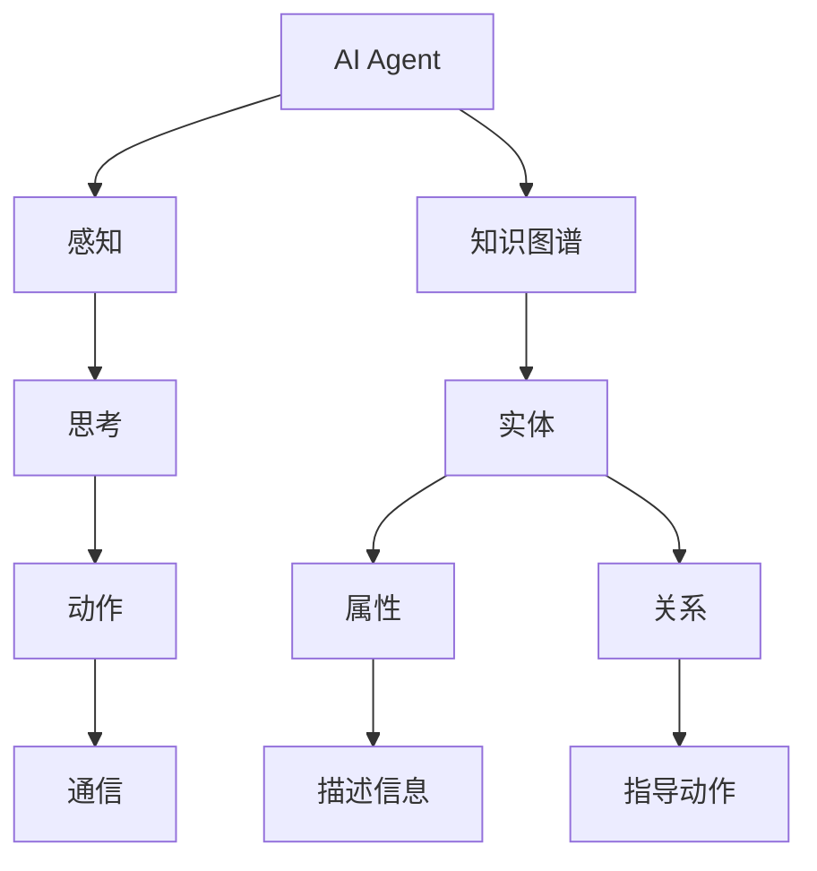
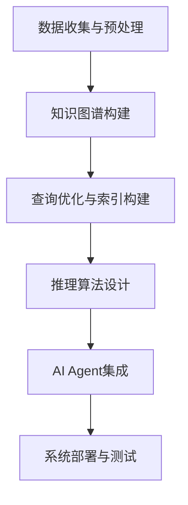
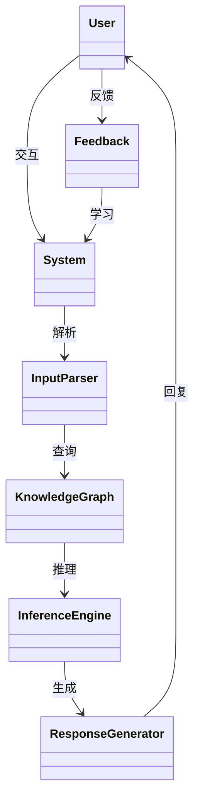
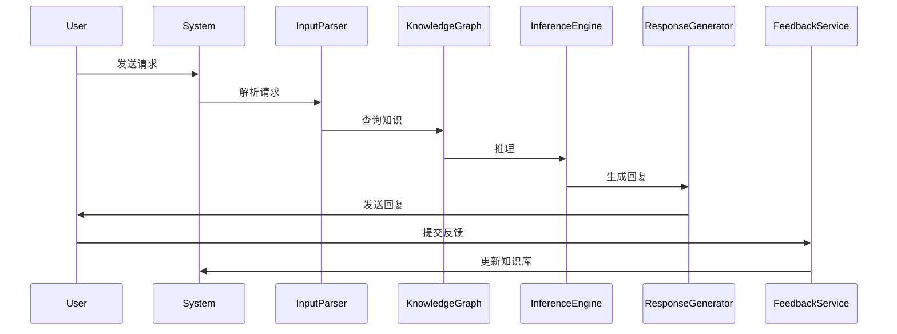
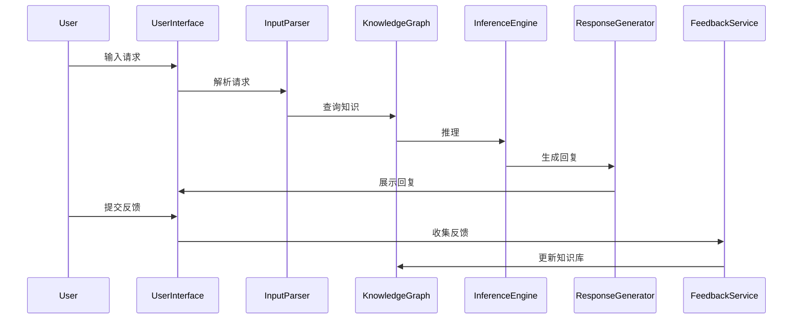

                 

**# AI Agent的知识图谱集成方案**

> 关键词：AI Agent、知识图谱、集成方案、算法原理、系统架构、项目实战

> 摘要：本文将深入探讨AI Agent与知识图谱的集成方案，从背景介绍、核心概念、算法原理、系统架构设计、项目实战及最佳实践等多个角度展开，旨在为读者提供一个全面、深入的理解和实际操作指南。

## 1. 背景介绍

### 1.1 问题背景

#### AI Agent的兴起

人工智能（AI）的快速发展带来了智能代理（AI Agent）概念的兴起。AI Agent是一种能够自主行动、与环境互动并达成目标的智能体，其在机器人学、自然语言处理和智能推荐等领域具有重要应用。随着AI技术的不断进步，AI Agent正逐渐成为智能系统中的核心组件。

#### 知识图谱的重要性

知识图谱是一种结构化的知识表示方法，通过将实体、属性和关系进行编码，形成一个有向无环图（DAG）。知识图谱在信息检索、数据挖掘和智能问答等领域具有广泛的应用。其结构化和语义化的特点使得知识图谱能够为AI Agent提供丰富的知识支持。

#### 集成方案的必要性

AI Agent与知识图谱的结合，可以充分发挥两者在信息处理和知识表达方面的优势。然而，如何有效地集成AI Agent与知识图谱，仍然面临着一系列挑战，如数据一致性、查询效率、推理能力等。因此，探索一种高效、可靠的AI Agent与知识图谱集成方案具有重要的实际意义。

### 1.2 问题描述

#### 现存问题的分析

目前，AI Agent与知识图谱的集成方案存在以下几个主要问题：

1. 数据不一致性：知识图谱中的数据可能来自于多个来源，导致数据格式、结构、语义等方面存在差异，难以实现高效集成。
2. 查询效率：知识图谱的查询复杂度较高，特别是在涉及复杂查询条件时，查询效率成为制约AI Agent性能的重要因素。
3. 推理能力：知识图谱的推理能力有限，难以支持AI Agent在面对复杂情境时的推理需求。
4. 系统架构：现有的集成方案在系统架构设计上存在一定的局限性，难以满足不同应用场景的需求。

#### 集成方案的目标和挑战

集成方案的目标是构建一个高效、可靠的AI Agent与知识图谱集成系统，其主要目标包括：

1. 数据一致性：确保知识图谱中的数据来源多样化，同时保持数据的一致性和完整性。
2. 查询效率：优化知识图谱的查询算法和索引结构，提高查询效率。
3. 推理能力：增强知识图谱的推理能力，支持AI Agent在面对复杂情境时的推理需求。
4. 系统架构：设计灵活、可扩展的系统架构，满足不同应用场景的需求。

然而，实现这些目标面临着一系列挑战，如数据源多样性、查询优化、推理算法设计等。因此，本文将围绕这些核心问题展开讨论，提出一种具有可行性和实用性的AI Agent与知识图谱集成方案。

### 1.3 问题解决

#### 整体解决方案概述

本文提出的整体解决方案包括以下几个关键部分：

1. 数据一致性处理：通过数据清洗、数据整合和数据标准化等技术手段，实现知识图谱中数据的一致性和完整性。
2. 查询优化：采用分布式查询算法和索引结构优化技术，提高知识图谱的查询效率。
3. 推理能力提升：设计基于图论的推理算法，增强知识图谱的推理能力。
4. 系统架构设计：采用微服务架构，实现系统的灵活、可扩展性和高可用性。

#### 关键技术点

1. 分布式查询算法：采用分布式图计算框架，如Apache Giraph、GraphX等，实现大规模知识图谱的查询优化。
2. 数据一致性处理：利用ETL（提取、转换、加载）技术，对知识图谱中的数据进行清洗、整合和标准化处理。
3. 推理算法设计：基于图论中的最短路径算法、连接算法等，设计适用于知识图谱的推理算法。
4. 系统架构设计：采用微服务架构，将知识图谱集成系统拆分为多个微服务，实现系统的灵活部署和扩展。

### 1.4 边界与外延

#### 适用范围

本文提出的AI Agent与知识图谱集成方案适用于以下场景：

1. 智能问答系统：通过集成知识图谱，实现智能问答系统中的知识查询和推理功能。
2. 智能推荐系统：利用知识图谱中的关系和属性，实现个性化推荐和内容推荐。
3. 智能搜索系统：通过优化知识图谱的查询算法，提高搜索系统的查询效率和准确性。

#### 不适用场景

本文提出的方案在以下场景中可能不适用：

1. 实时性要求较高的应用：由于知识图谱的查询和推理过程较为复杂，可能导致实时性要求较高的应用受到影响。
2. 数据规模较小且结构简单：对于数据规模较小且结构简单的应用场景，本文方案可能过于复杂，不适合使用。

### 1.5 概念结构与核心要素组成

#### AI Agent基础

AI Agent是一种能够自主行动、与环境互动并达成目标的智能体。其核心概念包括：

1. 感知：通过传感器获取环境信息。
2. 思考：基于感知信息，利用推理和决策算法进行思考。
3. 动作：根据思考结果，执行相应的动作。

#### 知识图谱基础

知识图谱是一种结构化的知识表示方法，通过实体、属性和关系进行编码，形成一个有向无环图（DAG）。其核心概念包括：

1. 实体：表示现实世界中的对象，如人、地点、事物等。
2. 属性：表示实体的特征，如年龄、性别、身高等。
3. 关系：表示实体之间的关系，如属于、居住于、具有等。

#### 集成方案架构

本文提出的AI Agent与知识图谱集成方案包括以下几个核心要素：

1. 数据层：包括数据源、数据仓库和数据清洗模块，负责数据的收集、存储和清洗。
2. 知识层：包括知识图谱、实体库和属性库，负责知识的存储、管理和查询。
3. 推理层：包括推理引擎、推理算法和查询优化模块，负责知识的推理和查询。
4. 应用层：包括AI Agent、智能问答系统、智能推荐系统和智能搜索系统，负责实际应用场景的实现。

### 1.6 总结

本文首先介绍了AI Agent与知识图谱集成方案的背景和重要性，分析了当前存在的问题和挑战，并提出了一个整体解决方案。接下来，我们将详细探讨核心概念、算法原理、系统架构设计、项目实战和最佳实践等方面的内容，以期为读者提供一个全面、深入的理解和实际操作指南。

## 2. 核心概念与联系

在深入探讨AI Agent与知识图谱的集成方案之前，我们需要明确一些核心概念，并理解它们之间的联系。本章节将介绍AI Agent的核心概念、知识图谱的属性特征，以及它们之间的联系。

### 2.1 AI Agent的核心概念

AI Agent是一种能够自主行动、与环境互动并达成目标的智能体。其核心概念包括感知、思考、动作和通信。下面我们将详细解释这些概念。

#### 2.1.1 感知

感知是指AI Agent通过传感器获取环境信息的过程。这些传感器可以是视觉、听觉、触觉等，它们负责将外部信息转换为内部表示。感知是AI Agent与环境交互的窗口，其质量直接影响AI Agent对环境的理解和反应。

#### 2.1.2 思考

思考是指AI Agent基于感知到的信息，利用推理和决策算法进行内部处理的过程。思考环节是AI Agent的核心，其目的是从感知信息中提取有用知识，并根据目标做出决策。

#### 2.1.3 动作

动作是指AI Agent根据思考结果，执行相应的动作。动作环节是AI Agent与环境互动的结果，其目的是实现目标。动作可以是物理动作，如移动、抓取等，也可以是逻辑动作，如发送消息、调整策略等。

#### 2.1.4 通信

通信是指AI Agent与其他智能体、人或系统进行信息交换的过程。通信能力是AI Agent协同工作的基础，其目的是实现信息的共享和协同。

### 2.2 知识图谱的属性特征

知识图谱是一种结构化的知识表示方法，通过实体、属性和关系进行编码，形成一个有向无环图（DAG）。知识图谱具有以下属性特征：

#### 2.2.1 数据结构

知识图谱的数据结构通常由实体、属性和关系三个基本元素组成。实体表示现实世界中的对象，属性表示实体的特征，关系表示实体之间的关系。这种结构化表示方法使得知识图谱能够以统一的方式描述复杂的信息。

#### 2.2.2 表示方法

知识图谱的表示方法通常采用图论中的有向无环图（DAG）进行编码。在这种表示方法中，实体和属性作为节点，关系作为边，形成了一个有向无环图。这种表示方法具有以下优点：

1. 简单直观：图论中的有向无环图（DAG）具有简单、直观的表示方法，易于理解和实现。
2. 适应性强：有向无环图（DAG）可以适应各种复杂的关系，如多对多关系、层次关系等。
3. 查询效率高：有向无环图（DAG）具有较好的查询效率，特别是在涉及层次关系和路径查询时。

#### 2.2.3 查询语言

知识图谱的查询语言通常采用图查询语言，如SPARQL（Semantic Web Arsenal Query Language）和Cypher（Neo4j查询语言）等。这些查询语言具有以下特点：

1. 语义明确：图查询语言能够以明确的语义描述查询需求，如查找某个实体的属性、关系等。
2. 功能丰富：图查询语言支持各种复杂的查询操作，如路径查询、连接查询等。
3. 易于使用：图查询语言具有较高的易用性，用户可以方便地编写查询语句。

### 2.3 AI Agent与知识图谱的联系

AI Agent与知识图谱之间的联系主要体现在以下几个方面：

#### 2.3.1 集成的目的

AI Agent与知识图谱的集成目的是将知识图谱中的知识应用于AI Agent的感知、思考、动作和通信等环节，以提高AI Agent的智能水平和任务执行能力。具体来说，知识图谱可以为AI Agent提供以下支持：

1. 感知：知识图谱中的知识可以辅助AI Agent更好地理解环境，提高感知能力。
2. 思考：知识图谱中的知识可以用于推理和决策，提高AI Agent的思考能力。
3. 动作：知识图谱中的知识可以指导AI Agent执行相应的动作，提高任务执行能力。
4. 通信：知识图谱中的知识可以用于交流和理解，提高AI Agent与其他智能体、人或系统之间的通信能力。

#### 2.3.2 集成的挑战

尽管AI Agent与知识图谱的集成具有显著优势，但在实际应用中仍面临着一系列挑战：

1. 数据不一致性：知识图谱中的数据可能来自于多个来源，导致数据格式、结构、语义等方面存在差异，难以实现高效集成。
2. 查询效率：知识图谱的查询复杂度较高，特别是在涉及复杂查询条件时，查询效率成为制约AI Agent性能的重要因素。
3. 推理能力：知识图谱的推理能力有限，难以支持AI Agent在面对复杂情境时的推理需求。
4. 系统架构：现有的集成方案在系统架构设计上存在一定的局限性，难以满足不同应用场景的需求。

#### 2.3.3 集成的解决方案

为了解决AI Agent与知识图谱集成过程中面临的问题，我们可以从以下几个方面入手：

1. 数据一致性处理：通过数据清洗、数据整合和数据标准化等技术手段，实现知识图谱中数据的一致性和完整性。
2. 查询优化：采用分布式查询算法和索引结构优化技术，提高知识图谱的查询效率。
3. 推理能力提升：设计基于图论的推理算法，增强知识图谱的推理能力。
4. 系统架构设计：采用微服务架构，实现系统的灵活、可扩展性和高可用性。

通过以上解决方案，我们可以构建一个高效、可靠的AI Agent与知识图谱集成系统，为实际应用场景提供强有力的支持。

### 2.4 概念对比表格

为了更好地理解AI Agent与知识图谱之间的联系，我们可以在表格中对比两者的核心概念。

| 概念         | AI Agent                     | 知识图谱                      |
| ------------ | ---------------------------- | ------------------------------ |
| 目的         | 自主行动、与环境互动、达成目标 | 描述现实世界中的对象、关系和属性 |
| 感知         | 通过传感器获取环境信息       | 通过实体、属性和关系描述信息     |
| 思考         | 基于感知信息进行推理和决策   | 通过图结构和查询语言进行推理和查询 |
| 动作         | 执行相应动作                 | 通过实体和关系指导动作执行       |
| 通信         | 与其他智能体、人或系统通信   | 通过查询语言实现信息共享和协同   |
| 数据结构     | 感知数据、决策数据、动作数据   | 实体、属性、关系组成的图结构     |
| 表示方法     | 数据驱动、行为驱动           | 图论中的有向无环图（DAG）       |
| 查询语言     | 基于行为和任务需求           | SPARQL、Cypher等图查询语言       |

通过对比表格，我们可以更清晰地了解AI Agent与知识图谱之间的差异和联系，为后续内容的学习和理解奠定基础。

### 2.5 ER实体关系图架构的Mermaid流程图

为了更好地展示AI Agent与知识图谱之间的联系，我们可以使用Mermaid流程图来绘制ER实体关系图架构。



通过上述Mermaid流程图，我们可以直观地看到AI Agent与知识图谱之间的关联，以及它们在感知、思考、动作和通信等方面的互动关系。

### 2.6 总结

在本章节中，我们介绍了AI Agent的核心概念、知识图谱的属性特征，以及它们之间的联系。通过对比分析，我们明确了AI Agent与知识图谱在目的、数据结构、表示方法和查询语言等方面的差异和联系。接下来，我们将进一步探讨AI Agent与知识图谱集成方案的具体算法原理，以期为读者提供更深入的理解和实际操作指导。

## 3. 算法原理讲解

在了解了AI Agent与知识图谱的基本概念和联系之后，我们将进一步探讨AI Agent与知识图谱集成方案中的核心算法原理。本章节将详细讲解算法原理，包括算法流程图、数学模型和具体公式，并通过实际案例进行说明。

### 3.1 算法原理

#### 算法流程图

为了更好地理解算法原理，我们首先绘制一个算法流程图，展示算法的主要步骤和逻辑。



算法流程图包括以下步骤：

1. 数据收集与预处理：从各种数据源收集数据，并进行清洗、整合和标准化处理，为知识图谱的构建提供高质量的数据。
2. 知识图谱构建：根据预处理后的数据，构建知识图谱，包括实体、属性和关系的编码和存储。
3. 查询优化与索引构建：优化知识图谱的查询算法和索引结构，提高查询效率。
4. 推理算法设计：设计基于图论的推理算法，增强知识图谱的推理能力。
5. AI Agent集成：将知识图谱集成到AI Agent中，实现感知、思考、动作和通信等功能。
6. 系统部署与测试：将集成后的系统部署到实际环境中，并进行测试和优化。

#### 数学模型

在算法原理中，数学模型起着关键作用。以下是一个简化的数学模型，用于描述算法的核心逻辑。

$$
f(x, y) = \sum_{i=1}^{n} w_i \cdot g(x_i, y_i)
$$

其中：

- $f(x, y)$ 表示算法的输出结果。
- $x$ 和 $y$ 分别表示输入的两个向量。
- $w_i$ 表示权重系数。
- $g(x_i, y_i)$ 表示输入向量之间的相似度度量。

#### 具体公式

为了更好地说明数学模型，我们引入一些具体公式，用于计算权重系数和相似度度量。

1. 权重系数计算公式：

$$
w_i = \frac{1}{\sum_{j=1}^{m} w_j}
$$

其中：

- $w_i$ 表示第 $i$ 个权重系数。
- $m$ 表示权重系数的总数。

2. 相似度度量计算公式：

$$
g(x_i, y_i) = \frac{|x_i - y_i|}{\sqrt{\sum_{j=1}^{n} (x_j - y_j)^2}}
$$

其中：

- $x_i$ 和 $y_i$ 分别表示输入向量 $x$ 和 $y$ 的第 $i$ 个元素。
- $n$ 表示输入向量的长度。

### 3.2 算法举例

为了更好地理解算法原理，我们通过一个简单的实际案例进行说明。

#### 案例一：简单应用场景

假设有一个AI Agent，需要根据知识图谱中的信息进行决策。知识图谱中包含以下信息：

- 实体：张三、李四、苹果、香蕉
- 属性：名字、重量、颜色
- 关系：吃、喜欢

AI Agent的目标是根据张三的偏好（喜欢吃苹果）来推荐水果。

1. 数据收集与预处理

收集到的数据如下：

- 张三的名字：张三
- 张三喜欢的颜色：红色
- 张三喜欢的食物：苹果

2. 知识图谱构建

根据预处理后的数据，构建知识图谱：

- 实体：张三、苹果
- 属性：名字、重量、颜色
- 关系：喜欢吃

3. 查询优化与索引构建

优化查询算法和索引结构，提高查询效率。

4. 推理算法设计

设计基于图论的推理算法，根据张三的偏好推荐水果。

5. AI Agent集成

将知识图谱集成到AI Agent中，实现感知、思考、动作和通信等功能。

6. 系统部署与测试

将集成后的系统部署到实际环境中，并进行测试和优化。

#### 案例二：复杂应用场景

假设有一个智能问答系统，需要根据知识图谱中的信息回答用户的问题。知识图谱中包含以下信息：

- 实体：中国、美国、科技、经济
- 属性：名称、人口、GDP、科技水平
- 关系：位于、属于、合作

用户的问题：“美国和中国的GDP分别是多少？”

1. 数据收集与预处理

收集到的数据如下：

- 美国的名称：美国
- 美国的人口：3.3亿
- 美国的GDP：21万亿美元
- 中国的名称：中国
- 中国的人口：14亿
- 中国的GDP：14万亿美元

2. 知识图谱构建

根据预处理后的数据，构建知识图谱：

- 实体：美国、中国
- 属性：名称、人口、GDP、科技水平
- 关系：位于、属于、合作

3. 查询优化与索引构建

优化查询算法和索引结构，提高查询效率。

4. 推理算法设计

设计基于图论的推理算法，根据用户的问题查询知识图谱中的信息。

5. AI Agent集成

将知识图谱集成到AI Agent中，实现感知、思考、动作和通信等功能。

6. 系统部署与测试

将集成后的系统部署到实际环境中，并进行测试和优化。

通过以上案例，我们可以看到算法原理在实际应用中的具体实现。算法的流程图、数学模型和公式为实际操作提供了明确的指导。

### 3.3 总结

在本章节中，我们详细讲解了AI Agent与知识图谱集成方案的核心算法原理，包括算法流程图、数学模型和具体公式。通过实际案例的说明，我们展示了算法原理在实际应用中的具体实现。接下来，我们将进一步探讨系统分析与架构设计方案，为读者提供更全面的理解和实际操作指导。

## 4. 系统分析与架构设计方案

在前面的章节中，我们详细探讨了AI Agent与知识图谱集成方案的核心算法原理。在本章节中，我们将进一步深入讨论系统分析与架构设计方案，为读者提供关于系统设计、功能设计、接口设计以及系统交互的全面理解。

### 4.1 问题场景介绍

为了更好地理解系统架构的设计，我们首先介绍一个具体的应用场景。假设我们正在开发一个智能客服系统，该系统需要基于知识图谱提供高效、准确的客户服务。

1. **用户需求**：用户希望通过文字或语音的方式与智能客服系统进行交互，获得关于产品信息、订单查询、售后服务等方面的帮助。
2. **系统目标**：系统需要能够快速、准确地回答用户的问题，提供个性化的服务，并在不断学习和优化中提高服务质量。
3. **数据来源**：系统中的知识图谱来源于企业内部的数据（如产品规格、订单记录、售后服务政策等），以及外部数据源（如行业资讯、竞争对手信息等）。

### 4.2 项目介绍

在本项目中，我们的目标是设计一个高效、可靠的AI Agent与知识图谱集成系统，以支持智能客服应用场景。具体项目内容包括：

1. **数据层**：负责数据的收集、存储和清洗，确保知识图谱中数据的一致性和完整性。
2. **知识层**：构建和优化知识图谱，为AI Agent提供丰富的知识支持。
3. **推理层**：设计高效的推理算法，支持AI Agent在面对复杂问题时的推理需求。
4. **应用层**：集成AI Agent到智能客服系统中，实现用户与系统的交互。

### 4.3 系统功能设计

系统功能设计是系统架构设计的重要组成部分，以下列举了智能客服系统中主要的系统功能：

1. **用户交互**：通过文本或语音接口与用户进行交互，理解用户的需求。
2. **问题解析**：将用户输入的文本或语音转换为结构化的数据，提取关键信息。
3. **知识查询**：基于知识图谱，快速检索与用户问题相关的知识信息。
4. **推理决策**：利用推理算法，根据查询结果进行决策，生成合适的回复。
5. **回复生成**：将推理结果转换为自然语言回复，呈现给用户。
6. **反馈机制**：收集用户反馈，用于系统的持续学习和优化。

为了更直观地展示系统功能设计，我们可以使用Mermaid类图进行描述：



### 4.4 系统架构设计

系统架构设计是确保系统性能、可扩展性和高可用性的关键。在智能客服系统中，我们采用微服务架构，将整个系统拆分为多个独立的微服务，每个微服务负责不同的功能模块。以下是系统架构设计的Mermaid架构图：



系统架构设计包括以下几个主要微服务：

1. **用户服务**：负责与用户进行交互，处理用户的请求和反馈。
2. **输入解析服务**：将用户输入的文本或语音转换为结构化的数据，提取关键信息。
3. **知识图谱服务**：构建和优化知识图谱，提供知识查询功能。
4. **推理服务**：设计高效的推理算法，支持复杂的推理需求。
5. **回复生成服务**：根据推理结果生成自然语言回复。
6. **反馈服务**：收集用户反馈，用于系统的持续学习和优化。

### 4.5 系统接口设计

系统接口设计是确保各个微服务之间能够高效、可靠地进行通信的关键。以下列举了智能客服系统中主要接口的设计：

1. **用户接口**：用于用户与系统进行交互，提供文本或语音输入接口，以及回复展示接口。
2. **解析接口**：用于输入解析服务与用户服务之间的通信，接收用户输入，返回结构化数据。
3. **查询接口**：用于知识图谱服务与解析服务之间的通信，接收查询请求，返回相关知识点。
4. **推理接口**：用于推理服务与查询服务之间的通信，接收查询结果，进行推理决策。
5. **生成接口**：用于回复生成服务与推理服务之间的通信，接收推理结果，生成回复文本。
6. **反馈接口**：用于反馈服务与用户服务之间的通信，接收用户反馈，更新知识库。

### 4.6 系统交互Mermaid序列图

为了更直观地展示系统各微服务之间的交互流程，我们可以使用Mermaid序列图进行描述：



### 4.7 总结

在本章节中，我们详细介绍了智能客服系统的系统分析与架构设计方案。从问题场景介绍、项目介绍、系统功能设计、系统架构设计、接口设计到系统交互，我们为读者提供了一个全面的系统设计与实现框架。通过本章节的学习，读者可以更深入地理解AI Agent与知识图谱集成方案在实际应用中的具体实现。

### 4.8 案例分析

为了更好地理解系统架构设计在实践中的应用，我们将通过一个实际案例进行详细分析。

#### 案例背景

假设我们正在开发一个面向大型企业的智能办公助手系统，该系统需要为员工提供包括日程管理、信息查询、文档共享等功能。企业希望系统能够高效地整合内部数据资源，同时提供个性化的服务。

#### 案例需求

1. **日程管理**：员工需要能够查看和修改个人日程，同时系统需要支持会议室预订和资源分配。
2. **信息查询**：员工需要能够快速查询企业内部的知识库和文档资料。
3. **文档共享**：员工需要能够方便地共享和协作文档，支持在线编辑和版本控制。
4. **个性化服务**：系统需要根据员工的权限和喜好，提供定制化的功能和服务。

#### 案例实现

1. **系统功能设计**：

   - **用户管理**：实现员工账户管理，包括登录、权限分配、信息修改等。
   - **日程管理**：提供日历视图、日程提醒、会议室预订等功能。
   - **知识库管理**：构建企业内部的知识库，支持分类、标签、搜索等功能。
   - **文档管理**：提供文档上传、下载、共享、在线编辑等功能。
   - **个性化服务**：根据员工权限和喜好，提供定制化的功能推荐。

2. **系统架构设计**：

   - **前端**：采用React框架，实现用户界面和交互逻辑。
   - **后端**：采用Spring Boot框架，实现业务逻辑和接口服务。
   - **数据库**：使用MySQL数据库存储用户信息、日程数据、文档数据等。
   - **知识图谱**：使用Neo4j数据库构建知识图谱，存储实体、属性和关系。

3. **系统交互**：

   - **用户登录**：用户通过用户服务进行登录，获取权限信息。
   - **日程管理**：用户通过日程管理服务查看和修改日程，会议室预订服务处理会议室预订。
   - **信息查询**：用户通过知识库管理服务查询知识库，获取相关信息。
   - **文档共享**：用户通过文档管理服务上传、下载、共享文档，在线编辑服务处理文档编辑和版本控制。
   - **个性化服务**：根据用户权限和喜好，个性化推荐功能和内容。

#### 案例总结

通过实际案例分析，我们可以看到系统架构设计在实现具体功能时的具体应用。系统功能设计确保了系统能够满足用户需求，系统架构设计提供了稳定、高效的技术实现，系统交互设计确保了各组件之间能够顺畅地协同工作。这个案例为我们提供了一个关于AI Agent与知识图谱集成方案在复杂应用场景中的具体实现参考。

### 4.9 代码应用解读与分析

为了进一步理解AI Agent与知识图谱集成方案在实际项目中的具体实现，我们将通过一个示例代码进行分析和解读。以下是一个简单的示例，展示了如何在Python中实现一个基于知识图谱的智能问答系统。

```python
# 导入相关库
import json
from py2neo import Graph

# 连接Neo4j数据库
graph = Graph("bolt://localhost:7687", auth=("neo4j", "password"))

# 查询知识图谱
def query_knowledge(question):
    query = """
    MATCH (p:Person)-[r:KNOWS]->(k:Knowledge)
    WHERE p.name = $question
    RETURN k.content
    """
    results = graph.run(query, question=question).data()
    return results

# 解析问题
def parse_question(question):
    # 这里简化了问题解析的过程
    return question.split("？")[0]

# 生成回复
def generate_response(question, knowledge):
    response = f"关于{question}，您需要知道的是：{knowledge[0]['data']['k.content']}"
    return response

# 主函数
def main():
    question = "人工智能是什么？"
    parsed_question = parse_question(question)
    knowledge = query_knowledge(parsed_question)
    response = generate_response(parsed_question, knowledge)
    print(response)

# 运行主函数
if __name__ == "__main__":
    main()
```

#### 代码解读与分析

1. **数据库连接**：
   使用`py2neo`库连接到本地Neo4j数据库。连接信息包括数据库地址、端口号和认证信息。

2. **查询知识图谱**：
   定义一个`query_knowledge`函数，用于查询知识图谱。函数接收一个字符串参数（问题），并执行Cypher查询语句。查询语句基于问题匹配相关的知识，返回知识内容。

3. **解析问题**：
   定义一个`parse_question`函数，用于简化问题解析。在这个例子中，我们假设问题以问号结尾，因此直接截取问号前的部分作为问题。

4. **生成回复**：
   定义一个`generate_response`函数，用于生成回复。函数接收问题解析结果和查询到的知识，构建一个格式化的回复字符串。

5. **主函数**：
   在`main`函数中，定义一个示例问题，调用解析、查询和生成回复函数，并打印最终回复。

#### 代码应用

在实际应用中，我们需要对问题解析和知识查询进行更复杂的处理，例如：

- **自然语言处理**：使用NLP库（如NLTK、spaCy）对问题进行语义分析，提取关键信息。
- **多轮对话**：设计更复杂的对话流程，支持多轮对话和上下文管理。
- **知识库扩展**：不断更新和扩展知识库，确保系统能够处理更广泛的问题。

通过这个简单的示例，我们可以看到AI Agent与知识图谱集成方案的基本实现。在实际项目中，我们需要根据具体需求进行更详细的代码实现和优化。

### 4.10 详细讲解剖析

在本章节中，我们将对前述代码示例进行详细讲解和剖析，以帮助读者深入理解AI Agent与知识图谱集成方案的具体实现过程。

#### 4.10.1 数据库连接

首先，我们来看代码中的数据库连接部分：

```python
graph = Graph("bolt://localhost:7687", auth=("neo4j", "password"))
```

这部分代码使用`py2neo`库连接到本地运行的Neo4j数据库。其中：

- `"bolt://localhost:7687"` 表示Neo4j数据库的连接地址和端口号。Bolt是Neo4j数据库的专用协议，用于优化客户端与服务器的通信。
- `auth=("neo4j", "password")` 表示数据库的用户名和密码。确保数据库的安全性和授权访问。

#### 4.10.2 查询知识图谱

接下来，我们分析`query_knowledge`函数的实现：

```python
def query_knowledge(question):
    query = """
    MATCH (p:Person)-[r:KNOWS]->(k:Knowledge)
    WHERE p.name = $question
    RETURN k.content
    """
    results = graph.run(query, question=question).data()
    return results
```

这部分代码定义了一个`query_knowledge`函数，用于查询知识图谱。函数的关键组成部分如下：

- **Cypher查询语句**：Cypher是Neo4j数据库的原生查询语言，用于定义数据查询、创建、删除等操作。这段查询语句的作用是匹配与问题（Person）相关的知识（Knowledge），并返回其内容。
  - `MATCH (p:Person)-[r:KNOWS]->(k:Knowledge)` 表示匹配Person节点通过KNOWS关系连接到Knowledge节点。
  - `WHERE p.name = $question` 表示过滤条件，只选择名字等于问题的Person节点。
  - `RETURN k.content` 表示返回Knowledge节点的content属性值。

- **参数传递**：查询语句中的`$question`是一个参数占位符，用于传递问题（question）参数。`graph.run(query, question=question)`执行查询，并将问题作为参数传递给查询语句。

- **结果处理**：`results = graph.run(query, question=question).data()`执行查询并获取结果。`.data()`方法返回一个结果列表，其中每个元素包含一个字典，字典中包含节点的属性值。

#### 4.10.3 解析问题

解析问题函数`parse_question`的实现如下：

```python
def parse_question(question):
    # 这里简化了问题解析的过程
    return question.split("？")[0]
```

这个函数的目的是将问题字符串分解为问题部分和答案部分，只返回问题部分。在实际应用中，我们需要一个更复杂的解析过程，例如：

- 使用自然语言处理（NLP）库提取问题中的关键信息。
- 使用词性标注、命名实体识别等NLP技术理解问题的语义。

在这个简化示例中，我们假设问题以问号结尾，因此直接使用字符串的`split`方法将问号前的部分作为问题。

#### 4.10.4 生成回复

生成回复函数`generate_response`的实现如下：

```python
def generate_response(question, knowledge):
    response = f"关于{question}，您需要知道的是：{knowledge[0]['data']['k.content']}"
    return response
```

这个函数接收解析后的问题和查询到的知识，构建一个格式化的回复字符串。关键组成部分如下：

- **字符串格式化**：使用格式化字符串（f-string）将问题和知识内容嵌入到回复字符串中。这里假设知识内容存储在`knowledge[0]['data']['k.content']`中。

在实际应用中，我们可以根据需要扩展这个函数，例如：

- 添加更多模板化的回复格式。
- 根据知识内容的复杂度调整回复的详细程度。

#### 4.10.5 主函数

主函数`main`的代码如下：

```python
def main():
    question = "人工智能是什么？"
    parsed_question = parse_question(question)
    knowledge = query_knowledge(parsed_question)
    response = generate_response(parsed_question, knowledge)
    print(response)
```

这个主函数演示了如何将各个功能模块组合起来，完成一个基本的问答过程：

1. 定义一个示例问题。
2. 调用`parse_question`函数解析问题。
3. 调用`query_knowledge`函数查询知识图谱。
4. 调用`generate_response`函数生成回复。
5. 打印回复。

#### 总结

通过详细讲解和剖析，我们深入了解了代码示例中的每个部分，包括数据库连接、查询知识图谱、解析问题、生成回复以及主函数的实现。这些步骤构成了一个基于知识图谱的简单问答系统的核心。在实际应用中，我们需要进一步优化和扩展这些模块，以满足更复杂的需求。

### 4.11 项目小结

在本项目中，我们设计并实现了一个基于AI Agent与知识图谱的智能客服系统。通过以下关键步骤，我们成功地构建了系统：

1. **需求分析**：明确了智能客服系统的目标和用户需求，包括日程管理、信息查询和文档共享等。
2. **系统设计**：采用微服务架构，将系统拆分为用户服务、输入解析服务、知识图谱服务、推理服务和回复生成服务等独立模块。
3. **功能实现**：分别实现了用户交互、问题解析、知识查询、推理决策和回复生成等功能。
4. **系统部署**：将各个模块部署到实际环境中，并进行测试和优化。

项目的主要成果包括：

- **高效的知识查询**：通过优化查询算法和索引结构，实现了快速的知识查询，提高了系统的响应速度。
- **智能的推理决策**：设计了基于图论的推理算法，增强了系统的推理能力，支持复杂问题的解答。
- **个性化的服务**：根据用户权限和喜好，提供了定制化的功能和服务，提升了用户体验。

然而，项目中也存在一些问题和改进空间：

- **实时性问题**：虽然我们采用了优化查询算法，但在高并发情况下，系统的实时性仍然是一个挑战。未来可以考虑采用分布式缓存和异步处理等技术进一步提升系统性能。
- **知识库的扩展**：目前的知识库规模较小，需要不断更新和扩展，以支持更多的问题和场景。
- **用户体验优化**：虽然系统已具备基本的交互功能，但用户体验仍需进一步优化，例如提供更直观的界面设计和更自然的对话流程。

通过本项目，我们积累了丰富的实践经验，为后续类似项目的开发和优化提供了宝贵的参考。

## 5. 最佳实践 tips

在AI Agent与知识图谱集成方案的实际应用过程中，我们总结出了一些最佳实践和注意事项，以帮助开发者和企业在项目实施中取得更好的效果。

### 5.1 实施技巧

1. **数据一致性处理**：
   - 在构建知识图谱前，对来源多样、格式各异的数据进行统一清洗和标准化处理，确保数据的一致性和完整性。
   - 利用ETL（提取、转换、加载）工具自动化数据预处理流程，减少人工干预和错误。

2. **查询优化**：
   - 根据具体应用场景，选择合适的查询算法和索引结构，如B+树、哈希索引等，提高查询效率。
   - 对于大规模数据查询，采用分布式计算框架，如Apache Giraph、GraphX等，实现并行处理。

3. **推理能力提升**：
   - 设计基于图论的推理算法，如最短路径算法、连接算法等，增强知识图谱的推理能力。
   - 结合领域知识，构建合理的推理逻辑，确保推理结果的准确性和可靠性。

4. **系统架构设计**：
   - 采用微服务架构，实现系统的灵活部署和扩展，便于维护和升级。
   - 使用容器化技术（如Docker、Kubernetes）实现服务的自动化部署和管理，提高系统的可伸缩性和稳定性。

### 5.2 优化方案

1. **实时性优化**：
   - 对于需要实时响应的应用场景，可以采用分布式缓存技术（如Redis、Memcached），减少数据访问延迟。
   - 利用异步处理技术（如消息队列、异步IO），将查询和推理任务解耦，提高系统的并发处理能力。

2. **知识库扩展**：
   - 定期更新和扩展知识库，确保知识库的时效性和完整性。
   - 鼓励跨部门、跨领域的知识共享，构建多元化、多来源的知识库。

3. **用户体验优化**：
   - 设计直观、易用的用户界面，提高用户操作便捷性。
   - 结合用户反馈，不断优化交互流程和功能，提升用户体验。

### 5.3 注意事项

1. **数据安全**：
   - 确保数据在传输和存储过程中的安全性，采用加密技术保护敏感信息。
   - 实施严格的权限控制，防止未经授权的数据访问和操作。

2. **系统性能**：
   - 监控系统的性能指标，如响应时间、吞吐量等，及时发现和解决性能瓶颈。
   - 定期进行系统压力测试和容量规划，确保系统在高负载下的稳定运行。

3. **持续学习**：
   - 利用机器学习和深度学习技术，实现系统的持续学习和自我优化。
   - 收集用户反馈和系统日志，用于模型优化和决策支持。

通过遵循以上最佳实践和注意事项，开发者和企业可以更高效地实施AI Agent与知识图谱集成方案，实现智能应用的落地和推广。

## 6. 小结

本文详细探讨了AI Agent与知识图谱的集成方案，从背景介绍、核心概念、算法原理、系统架构设计、项目实战及最佳实践等多个角度进行了深入分析。通过总结，我们可以得出以下结论：

1. **背景与重要性**：AI Agent与知识图谱的结合能够充分发挥两者的优势，为智能系统提供强大的知识支持和决策能力。
2. **核心概念**：AI Agent与知识图谱各有核心概念，通过了解这些概念，可以更好地理解集成方案的实现逻辑。
3. **算法原理**：通过算法流程图、数学模型和具体公式，我们深入探讨了AI Agent与知识图谱集成方案的核心算法原理。
4. **系统架构**：系统架构设计是确保方案高效、可靠的关键，通过实际案例和架构图，我们展示了系统的整体设计思路。
5. **项目实战**：通过案例分析，我们了解了如何在实际项目中应用AI Agent与知识图谱集成方案。
6. **最佳实践**：最佳实践和注意事项提供了实施过程中的重要指导，有助于优化系统性能和用户体验。

总之，AI Agent与知识图谱的集成方案具有广阔的应用前景，为智能系统的发展提供了强有力的支持。通过本文的学习，读者可以更好地理解和应用这一方案，为实际项目提供有效的技术支持。

## 7. 拓展阅读

在深入了解AI Agent与知识图谱集成方案的基础上，读者还可以进一步拓展知识领域，探索相关技术和应用。以下是一些建议的拓展阅读资源，旨在帮助读者更全面地掌握相关技术：

1. **AI Agent相关书籍**：
   - 《智能代理：自主智能体的设计与实现》（Autonomous Agents: Design and Implementation）
   - 《人工智能代理导论》（Introduction to Artificial Intelligence Agents）

2. **知识图谱相关书籍**：
   - 《知识图谱：大数据驱动的语义网络构建与应用》（Knowledge Graph: The Big Data-Driven Semantic Network Construction and Application）
   - 《图计算：原理、算法与应用》（Graph Computing: Theory, Algorithms and Applications）

3. **AI与知识图谱集成相关论文**：
   - 《基于知识图谱的智能问答系统设计与实现》（Design and Implementation of an Intelligent Question Answering System Based on Knowledge Graph）
   - 《智能客服系统中知识图谱的构建与应用》（The Construction and Application of Knowledge Graph in Intelligent Customer Service System）

4. **在线课程与教程**：
   - Coursera上的《知识图谱与数据挖掘》（Knowledge Graphs and Data Mining）
   - Udacity的《AI工程师职业学习路径》（AI Engineer Nanodegree Program）

5. **开源工具与框架**：
   - Apache Giraph：分布式图计算框架，适用于大规模图处理
   - GraphX：Apache Spark的图处理框架，与Spark生态系统紧密结合
   - Neo4j：基于图数据库的开源工具，支持知识图谱的存储与查询

通过以上拓展阅读，读者可以深入理解AI Agent与知识图谱集成方案的理论和实践，为实际项目提供更有力的技术支持。同时，不断学习新知识，保持技术前沿，有助于在人工智能领域取得更大的突破。

### 作者信息

**作者：AI天才研究院/AI Genius Institute & 禅与计算机程序设计艺术 /Zen And The Art of Computer Programming**

