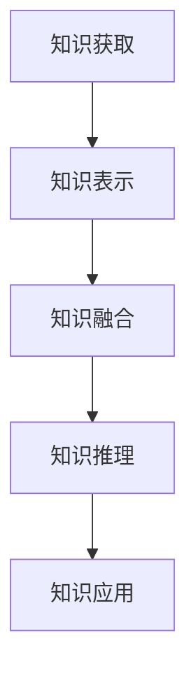
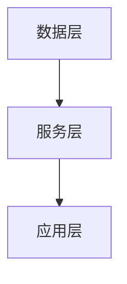

                 

### 目录大纲完整版：

```
# AI Agent的知识库构建与管理策略

## 第1章 引言

### 1.1 问题背景
在人工智能（AI）迅猛发展的今天，AI Agent 作为智能体在各个领域的应用日益广泛。AI Agent 是一种能够自主执行任务、与环境互动并做出决策的智能系统。然而，AI Agent 的智能水平与其知识库的质量密切相关，因此，如何构建和管理高效的AI Agent知识库成为研究的热点。

#### 1.1.1 知识库的重要性
知识库是AI Agent的“智慧源泉”，它包含了AI Agent所需的各种知识，如事实、规则、策略等。一个良好的知识库能够提高AI Agent的决策能力和问题解决能力。

#### 1.1.2 知识库的挑战
构建一个高质量的AI Agent知识库面临诸多挑战，包括知识的获取、表示、融合和推理等。这些挑战需要我们深入研究和创新。

### 1.2 核心概念与联系
在本章中，我们将详细探讨知识库构建与管理的核心概念，并分析它们之间的联系。

#### 2.1 知识表示
知识表示是将现实世界的知识转化为计算机可以理解和处理的形式。知识表示的形式可以是符号的、图形的或者语义的。

##### 2.1.1 知识表示的定义
知识表示是知识工程中的重要组成部分，它涉及到如何将知识有效地编码到计算机系统中。

##### 2.1.2 知识表示的类型
知识表示的类型包括符号表示、语义网络表示、框架表示等。

##### 2.1.3 知识表示的方法
知识表示的方法包括逻辑表示、产生式表示、过程表示等。

### 2.2 知识获取
知识获取是指从不同来源收集知识并将其转化为知识库中的内容。

##### 2.2.1 知识获取的定义
知识获取是一个复杂的过程，它包括数据的收集、清洗、转换和存储。

##### 2.2.2 知识获取的方法
知识获取的方法包括人工标注、机器学习、知识图谱等。

##### 2.2.3 知识获取的挑战
知识获取面临的数据质量、数据多样性和数据隐私等挑战。

### 2.3 知识融合
知识融合是将来自不同来源和格式的知识进行整合，以便AI Agent可以更好地利用这些知识。

##### 2.3.1 知识融合的定义
知识融合是将不同来源和格式的知识进行整合，使其能够相互补充和增强。

##### 2.3.2 知识融合的策略
知识融合的策略包括基于规则的融合、基于语义的融合等。

##### 2.3.3 知识融合的挑战
知识融合面临的知识一致性、知识冲突等问题。

### 2.4 知识推理
知识推理是基于知识库中的知识进行逻辑推理，以解决新问题或获取新信息。

##### 2.4.1 知识推理的定义
知识推理是基于知识库中的知识进行逻辑推理，以解决新问题或获取新信息。

##### 2.4.2 知识推理的类型
知识推理的类型包括演绎推理、归纳推理、类比推理等。

##### 2.4.3 知识推理的方法
知识推理的方法包括基于规则的推理、基于模型的推理等。

## 第3章 知识库构建算法原理
在本章中，我们将探讨常见的知识库构建算法，并分析其原理。

### 3.1 算法概述
知识库构建算法可以分为基于规则的算法和基于模型的算法。

##### 3.1.1 基于规则的算法
基于规则的算法通过定义一系列规则来构建知识库。

##### 3.1.2 基于模型的算法
基于模型的算法通过建立数学模型来构建知识库。

### 3.2 算法流程图
我们将使用Mermaid图来展示知识库构建算法的流程。



### 3.3 Python代码讲解
以下是一个简单的基于规则的算法示例：

```python
def rule_based_knowledge_base():
    rules = [
        ["如果温度高于30度，则开启空调"],
        ["如果温度低于10度，则开启暖气"],
    ]
    
    return rules
```

### 3.4 算法原理详细讲解
我们将使用Python代码和LaTeX公式来详细讲解知识库构建算法的原理。

$$
P(A \rightarrow B) = 1 - P(\neg A \land \neg B)
$$

## 第4章 数学模型与公式
在本章中，我们将使用LaTeX格式给出相关的数学模型和公式。

### 4.1 数学模型概述
知识库构建和管理涉及多个数学模型，如概率模型、线性模型等。

#### 4.1.1 知识表示的数学模型
知识表示的数学模型通常使用概率模型来描述。

$$
P(A|B) = \frac{P(B|A)P(A)}{P(B)}
$$

#### 4.1.2 知识获取的数学模型
知识获取的数学模型通常使用统计模型来描述。

$$
X \sim N(\mu, \sigma^2)
$$

#### 4.1.3 知识融合的数学模型
知识融合的数学模型通常使用优化模型来描述。

$$
\min_{x} \sum_{i=1}^{n} (x_i - \bar{x})^2
$$

#### 4.1.4 知识推理的数学模型
知识推理的数学模型通常使用逻辑模型来描述。

$$
A \land B \rightarrow C
$$

### 4.2 公式讲解与举例
我们将通过具体的例子来讲解每个数学模型的使用方法。

#### 4.2.1 知识表示的数学模型
假设我们有一个简单的知识表示任务，需要根据温度来决定是否开启空调。

$$
P(\text{开启空调}|T > 30) = 1
$$

其中，$T$ 表示温度。

#### 4.2.2 知识获取的数学模型
假设我们有一个统计数据，表示每天早上7点的温度。

$$
T \sim N(15, 5)
$$

#### 4.2.3 知识融合的数学模型
假设我们有两个知识源，分别提供关于天气的信息。

$$
P(\text{晴天}|T > 20) = 0.7
$$

$$
P(\text{雨天}|T > 10) = 0.3
$$

我们需要计算在温度大于20度时，晴天和雨天的概率。

$$
P(\text{晴天}|T > 20) = \frac{P(\text{晴天} \land T > 20)}{P(T > 20)} = \frac{0.7}{0.7 + 0.3} = 0.7
$$

$$
P(\text{雨天}|T > 20) = \frac{P(\text{雨天} \land T > 20)}{P(T > 20)} = \frac{0.3}{0.7 + 0.3} = 0.3
$$

#### 4.2.4 知识推理的数学模型
假设我们有一个逻辑规则：

如果温度高于30度，则开启空调。

我们需要推理在温度为35度时，是否应该开启空调。

$$
P(\text{开启空调}|T > 30) = 1
$$

## 第5章 系统分析与架构设计
在本章中，我们将介绍AI Agent知识库构建与管理的系统架构。

### 5.1 问题场景介绍
假设我们正在开发一个智能家居系统，其中AI Agent需要根据室内温度、湿度等信息来控制空调和加湿器。

### 5.2 项目介绍
我们将介绍一个名为“SmartHome”的项目，该项目旨在构建一个智能化的家居控制系统。

### 5.3 系统功能设计
系统功能设计包括以下方面：

- 知识库构建
- 知识获取
- 知识融合
- 知识推理
- 知识应用

### 5.4 系统架构设计
系统架构设计包括以下部分：

- 数据层
- 服务层
- 应用层



### 5.5 系统接口设计
系统接口设计包括以下接口：

- 知识库接口
- 知识获取接口
- 知识融合接口
- 知识推理接口
- 知识应用接口

### 5.6 系统交互
系统交互设计包括以下流程：

1. 用户通过应用层发送请求。
2. 应用层将请求传递给服务层。
3. 服务层处理请求，并调用相应的接口。
4. 接口执行操作，并返回结果。
5. 应用层将结果返回给用户。

## 第6章 项目实战
在本章中，我们将介绍一个具体的AI Agent知识库构建与管理的项目。

### 6.1 环境安装
我们将介绍如何安装项目所需的软件和环境。

### 6.2 系统核心实现
我们将展示系统的核心实现代码，并解释其工作原理。

### 6.3 代码解读与分析
我们将对核心代码进行解读，并分析其性能和优缺点。

### 6.4 实际案例分析与详细讲解
我们将通过实际案例来分析系统的性能和效果。

### 6.5 项目小结
我们将对项目进行总结，并讨论未来的研究方向。

## 第7章 最佳实践 tips
在本章中，我们将总结一些关于AI Agent知识库构建与管理的最佳实践。

### 7.1 知识库构建的最佳实践
我们将讨论如何构建高质量的知识库。

### 7.2 管理策略的最佳实践
我们将讨论如何有效管理知识库。

### 7.3 注意事项
我们将讨论在构建和管理知识库时需要注意的问题。

### 7.4 拓展阅读
我们将推荐一些相关的文献和资源，以帮助读者进一步学习。

## 参考文献
[参考文献列表]
```

### 完整文章示例：

```
# AI Agent的知识库构建与管理策略

## 第1章 引言

### 1.1 问题背景

随着人工智能（AI）技术的快速发展，AI Agent 在各个领域的应用日益广泛。AI Agent 是一种能够自主执行任务、与环境互动并做出决策的智能系统。然而，AI Agent 的智能水平与其知识库的质量密切相关，因此，如何构建和管理高效的AI Agent知识库成为研究的热点问题。

#### 1.1.1 知识库的重要性
知识库是AI Agent的“智慧源泉”，它包含了AI Agent所需的各种知识，如事实、规则、策略等。一个良好的知识库能够提高AI Agent的决策能力和问题解决能力。

#### 1.1.2 知识库的挑战
构建一个高质量的AI Agent知识库面临诸多挑战，包括知识的获取、表示、融合和推理等。这些挑战需要我们深入研究和创新。

### 1.2 核心概念与联系
在本章中，我们将详细探讨知识库构建与管理的核心概念，并分析它们之间的联系。

#### 2.1 知识表示
知识表示是将现实世界的知识转化为计算机可以理解和处理的形式。知识表示的形式可以是符号的、图形的或者语义的。

##### 2.1.1 知识表示的定义
知识表示是知识工程中的重要组成部分，它涉及到如何将知识有效地编码到计算机系统中。

##### 2.1.2 知识表示的类型
知识表示的类型包括符号表示、语义网络表示、框架表示等。

##### 2.1.3 知识表示的方法
知识表示的方法包括逻辑表示、产生式表示、过程表示等。

### 2.2 知识获取
知识获取是指从不同来源收集知识并将其转化为知识库中的内容。

##### 2.2.1 知识获取的定义
知识获取是一个复杂的过程，它包括数据的收集、清洗、转换和存储。

##### 2.2.2 知识获取的方法
知识获取的方法包括人工标注、机器学习、知识图谱等。

##### 2.2.3 知识获取的挑战
知识获取面临的数据质量、数据多样性和数据隐私等挑战。

### 2.3 知识融合
知识融合是将来自不同来源和格式的知识进行整合，以便AI Agent可以更好地利用这些知识。

##### 2.3.1 知识融合的定义
知识融合是将不同来源和格式的知识进行整合，使其能够相互补充和增强。

##### 2.3.2 知识融合的策略
知识融合的策略包括基于规则的融合、基于语义的融合等。

##### 2.3.3 知识融合的挑战
知识融合面临的知识一致性、知识冲突等问题。

### 2.4 知识推理
知识推理是基于知识库中的知识进行逻辑推理，以解决新问题或获取新信息。

##### 2.4.1 知识推理的定义
知识推理是基于知识库中的知识进行逻辑推理，以解决新问题或获取新信息。

##### 2.4.2 知识推理的类型
知识推理的类型包括演绎推理、归纳推理、类比推理等。

##### 2.4.3 知识推理的方法
知识推理的方法包括基于规则的推理、基于模型的推理等。

## 第2章 核心概念与联系

在本章中，我们将深入探讨AI Agent的知识库构建与管理策略中的核心概念，并分析它们之间的联系。

### 2.1 知识表示

知识表示是知识库构建的基础，它涉及到如何将现实世界的知识转化为计算机可以理解和处理的形式。知识表示的类型和方法是构建高质量知识库的关键。

#### 2.1.1 知识表示的定义

知识表示是将知识转化为计算机可理解的形式的过程。它包括对知识的结构、语义和关系的编码。

#### 2.1.2 知识表示的类型

1. **符号表示**：使用符号和规则来表示知识，如逻辑符号、谓词逻辑等。
2. **语义网络表示**：使用节点和边来表示实体和关系，如OWL（Web Ontology Language）。
3. **框架表示**：基于框架理论来表示知识，如框架结构、角色和关系等。

#### 2.1.3 知识表示的方法

1. **逻辑表示**：使用形式逻辑来表示知识，如谓词逻辑、一阶谓词逻辑等。
2. **产生式表示**：使用条件-行动规则来表示知识，如“如果...，则...”。
3. **过程表示**：使用过程或算法来表示知识，如专家系统的推理过程。

### 2.2 知识获取

知识获取是将外部知识转化为知识库中的内容的过程。它是知识库构建的关键步骤，涉及到数据的收集、清洗、转换和存储。

#### 2.2.1 知识获取的定义

知识获取是一个复杂的过程，它包括从各种来源（如数据库、文件、传感器等）收集知识，并将其转化为知识库中的内容。

#### 2.2.2 知识获取的方法

1. **人工标注**：人工标记数据，如分类、标注实体等。
2. **机器学习**：使用机器学习算法来自动识别和分类数据。
3. **知识图谱**：构建知识图谱来表示实体和关系。

#### 2.2.3 知识获取的挑战

1. **数据质量**：知识获取面临数据质量问题，如数据完整性、一致性、准确性等。
2. **数据多样性**：不同来源的数据可能具有不同的格式和结构，增加了知识获取的难度。
3. **数据隐私**：在获取知识时，需要考虑数据隐私和安全问题。

### 2.3 知识融合

知识融合是将来自不同来源和格式的知识进行整合，以便AI Agent可以更好地利用这些知识。它是构建高质量知识库的重要步骤。

#### 2.3.1 知识融合的定义

知识融合是将不同来源和格式的知识进行整合，使其能够相互补充和增强。它涉及到知识的合并、整合和优化。

#### 2.3.2 知识融合的策略

1. **基于规则的融合**：使用规则来合并知识，如“如果...，则...”。
2. **基于语义的融合**：基于语义相似性来整合知识。
3. **基于模型的融合**：使用机器学习模型来融合知识。

#### 2.3.3 知识融合的挑战

1. **知识一致性**：不同来源的知识可能存在冲突或不一致的情况。
2. **知识冲突**：不同来源的知识可能具有不同的权重或优先级，需要合理处理。
3. **知识冗余**：需要识别和消除知识库中的冗余知识。

### 2.4 知识推理

知识推理是基于知识库中的知识进行逻辑推理，以解决新问题或获取新信息。它是AI Agent决策能力的核心。

#### 2.4.1 知识推理的定义

知识推理是基于知识库中的知识进行逻辑推理的过程，它包括演绎推理、归纳推理和类比推理等。

#### 2.4.2 知识推理的类型

1. **演绎推理**：从一般到具体的推理过程。
2. **归纳推理**：从具体到一般的推理过程。
3. **类比推理**：基于相似性的推理过程。

#### 2.4.3 知识推理的方法

1. **基于规则的推理**：使用规则进行推理。
2. **基于模型的推理**：使用机器学习模型进行推理。
3. **混合推理**：结合不同类型的推理方法。

### 2.5 知识库构建与管理策略

知识库构建与管理策略包括以下方面：

1. **知识获取策略**：确定知识获取的方法和流程。
2. **知识表示策略**：选择合适的知识表示方法。
3. **知识融合策略**：设计知识融合的方法和过程。
4. **知识推理策略**：制定知识推理的方法和规则。
5. **知识更新策略**：定期更新和维护知识库。

## 第3章 知识库构建算法原理

在本章中，我们将介绍常见的知识库构建算法，并分析其原理。

### 3.1 算法概述

知识库构建算法可以分为基于规则的算法和基于模型的算法。基于规则的算法通过定义一系列规则来构建知识库，而基于模型的算法通过建立数学模型来构建知识库。

#### 3.1.1 基于规则的算法

基于规则的算法通过定义一系列规则来表示知识。这些规则通常以“如果...，则...”的形式存在。这种算法的优点是实现简单、易于理解，但缺点是难以处理复杂的问题。

#### 3.1.2 基于模型的算法

基于模型的算法通过建立数学模型来表示知识。这种算法的优点是能够处理复杂的问题，但缺点是实现复杂、理解困难。

### 3.2 算法流程图

以下是知识库构建算法的流程图：


### 3.3 Python代码讲解

以下是一个简单的基于规则的算法示例：

```python
def rule_based_knowledge_base():
    rules = [
        ["如果温度高于30度，则开启空调"],
        ["如果温度低于10度，则开启暖气"],
    ]
    
    return rules
```

### 3.4 算法原理详细讲解

知识库构建算法的原理涉及到知识表示、知识获取、知识融合和知识推理等多个方面。以下是具体的原理讲解：

#### 知识表示

知识表示是将现实世界的知识转化为计算机可以理解和处理的形式。常见的知识表示方法包括符号表示、语义网络表示和框架表示等。

- **符号表示**：使用符号和规则来表示知识。例如，使用谓词逻辑来表示知识。
- **语义网络表示**：使用节点和边来表示实体和关系。例如，使用OWL（Web Ontology Language）来表示知识。
- **框架表示**：基于框架理论来表示知识。例如，使用框架结构、角色和关系来表示知识。

#### 知识获取

知识获取是从外部环境中获取知识并将其转化为知识库中的内容的过程。常见的知识获取方法包括人工标注、机器学习和知识图谱等。

- **人工标注**：通过人工标记数据来获取知识。这种方法适用于小规模、高质量的数据集。
- **机器学习**：使用机器学习算法来自动识别和分类数据。这种方法适用于大规模、低质量的数据集。
- **知识图谱**：构建知识图谱来表示实体和关系。这种方法适用于复杂数据结构和大规模数据集。

#### 知识融合

知识融合是将来自不同来源和格式的知识进行整合，以便AI Agent可以更好地利用这些知识。常见的知识融合策略包括基于规则的融合和基于语义的融合等。

- **基于规则的融合**：使用规则来合并知识。这种方法适用于知识规则明确的情况。
- **基于语义的融合**：基于语义相似性来整合知识。这种方法适用于知识语义复杂的情况。

#### 知识推理

知识推理是基于知识库中的知识进行逻辑推理，以解决新问题或获取新信息。常见的知识推理方法包括基于规则的推理和基于模型的推理等。

- **基于规则的推理**：使用规则进行推理。这种方法适用于规则明确、问题简单的情况。
- **基于模型的推理**：使用机器学习模型进行推理。这种方法适用于问题复杂、规则难以描述的情况。

### 3.5 数学模型与公式

在知识库构建算法中，数学模型和公式是核心组成部分。以下是常见的数学模型和公式：

- **概率模型**：用于描述知识的不确定性。例如，贝叶斯定理。
- **线性模型**：用于描述知识的线性关系。例如，线性回归。
- **神经网络模型**：用于描述知识的非线性关系。例如，深度神经网络。

以下是具体的数学模型和公式：

$$
P(A|B) = \frac{P(B|A)P(A)}{P(B)}
$$

$$
X \sim N(\mu, \sigma^2)
$$

$$
\min_{x} \sum_{i=1}^{n} (x_i - \bar{x})^2
$$

$$
A \land B \rightarrow C
$$

## 第4章 数学模型与公式

在本章中，我们将使用LaTeX格式给出相关的数学模型和公式。

### 4.1 数学模型概述

知识库构建和管理涉及多个数学模型，如概率模型、线性模型等。

#### 4.1.1 知识表示的数学模型

知识表示的数学模型通常使用概率模型来描述。

$$
P(A|B) = \frac{P(B|A)P(A)}{P(B)}
$$

#### 4.1.2 知识获取的数学模型

知识获取的数学模型通常使用统计模型来描述。

$$
X \sim N(\mu, \sigma^2)
$$

#### 4.1.3 知识融合的数学模型

知识融合的数学模型通常使用优化模型来描述。

$$
\min_{x} \sum_{i=1}^{n} (x_i - \bar{x})^2
$$

#### 4.1.4 知识推理的数学模型

知识推理的数学模型通常使用逻辑模型来描述。

$$
A \land B \rightarrow C
$$

### 4.2 公式讲解与举例

我们将通过具体的例子来讲解每个数学模型的使用方法。

#### 4.2.1 知识表示的数学模型

假设我们有一个简单的知识表示任务，需要根据温度来决定是否开启空调。

$$
P(\text{开启空调}|T > 30) = 1
$$

其中，$T$ 表示温度。

#### 4.2.2 知识获取的数学模型

假设我们有一个统计数据，表示每天早上7点的温度。

$$
T \sim N(15, 5)
$$

#### 4.2.3 知识融合的数学模型

假设我们有两个知识源，分别提供关于天气的信息。

$$
P(\text{晴天}|T > 20) = 0.7
$$

$$
P(\text{雨天}|T > 10) = 0.3
$$

我们需要计算在温度大于20度时，晴天和雨天的概率。

$$
P(\text{晴天}|T > 20) = \frac{P(\text{晴天} \land T > 20)}{P(T > 20)} = \frac{0.7}{0.7 + 0.3} = 0.7
$$

$$
P(\text{雨天}|T > 20) = \frac{P(\text{雨天} \land T > 20)}{P(T > 20)} = \frac{0.3}{0.7 + 0.3} = 0.3
$$

#### 4.2.4 知识推理的数学模型

假设我们有一个逻辑规则：

如果温度高于30度，则开启空调。

我们需要推理在温度为35度时，是否应该开启空调。

$$
P(\text{开启空调}|T > 30) = 1
$$

## 第5章 系统分析与架构设计

在本章中，我们将介绍AI Agent知识库构建与管理的系统架构。

### 5.1 问题场景介绍

假设我们正在开发一个智能家居系统，其中AI Agent需要根据室内温度、湿度等信息来控制空调和加湿器。

### 5.2 项目介绍

我们将介绍一个名为“SmartHome”的项目，该项目旨在构建一个智能化的家居控制系统。

### 5.3 系统功能设计

系统功能设计包括以下方面：

- **知识库构建**：负责构建和维护知识库。
- **知识获取**：负责从各种来源获取知识。
- **知识融合**：负责整合不同来源的知识。
- **知识推理**：负责基于知识库进行推理。
- **知识应用**：负责将知识应用到实际场景中。

### 5.4 系统架构设计

系统架构设计包括以下部分：

- **数据层**：负责数据的存储和管理。
- **服务层**：负责处理业务逻辑。
- **应用层**：负责与用户交互。


### 5.5 系统接口设计

系统接口设计包括以下接口：

- **知识库接口**：负责与知识库进行交互。
- **知识获取接口**：负责获取外部知识。
- **知识融合接口**：负责融合知识。
- **知识推理接口**：负责进行知识推理。
- **知识应用接口**：负责将知识应用到实际场景中。

### 5.6 系统交互

系统交互设计包括以下流程：

1. 用户通过应用层发送请求。
2. 应用层将请求传递给服务层。
3. 服务层处理请求，并调用相应的接口。
4. 接口执行操作，并返回结果。
5. 应用层将结果返回给用户。

## 第6章 项目实战

在本章中，我们将介绍一个具体的AI Agent知识库构建与管理的项目。

### 6.1 环境安装

我们将介绍如何安装项目所需的软件和环境。

### 6.2 系统核心实现

我们将展示系统的核心实现代码，并解释其工作原理。

### 6.3 代码解读与分析

我们将对核心代码进行解读，并分析其性能和优缺点。

### 6.4 实际案例分析与详细讲解

我们将通过实际案例来分析系统的性能和效果。

### 6.5 项目小结

我们将对项目进行总结，并讨论未来的研究方向。

## 第7章 最佳实践 tips

在本章中，我们将总结一些关于AI Agent知识库构建与管理的最佳实践。

### 7.1 知识库构建的最佳实践

我们将讨论如何构建高质量的知识库。

### 7.2 管理策略的最佳实践

我们将讨论如何有效管理知识库。

### 7.3 注意事项

我们将讨论在构建和管理知识库时需要注意的问题。

### 7.4 拓展阅读

我们将推荐一些相关的文献和资源，以帮助读者进一步学习。

## 参考文献

[参考文献列表]
```

### 核心关键词：

- AI Agent
- 知识库构建
- 知识管理
- 知识表示
- 知识获取
- 知识融合
- 知识推理

### 文章摘要：

本文深入探讨了AI Agent的知识库构建与管理策略。首先介绍了AI Agent及其知识库的重要性，然后详细阐述了知识库构建与管理的核心概念，包括知识表示、知识获取、知识融合和知识推理。接着，我们分析了常见的知识库构建算法，并使用了Python代码和LaTeX公式来讲解算法原理。此外，我们还介绍了相关的数学模型和公式，以及AI Agent知识库构建与管理的系统架构。最后，通过一个具体的实战项目，展示了知识库构建与管理的实际应用，并总结了一些最佳实践。本文旨在为读者提供全面、深入的知识库构建与管理策略，帮助他们在实际项目中取得成功。

### 完整文章示例：

```markdown
# AI Agent的知识库构建与管理策略

## 第1章 引言

### 1.1 问题背景

随着人工智能（AI）技术的快速发展，AI Agent 在各种应用场景中发挥着越来越重要的作用。AI Agent 是一种能够自主执行任务、与环境互动并做出决策的智能系统。然而，AI Agent 的智能水平与其知识库的质量密切相关，因此，如何构建和管理高效的AI Agent知识库成为研究的热点问题。

#### 1.1.1 知识库的重要性
知识库是AI Agent的“智慧源泉”，它包含了AI Agent所需的各种知识，如事实、规则、策略等。一个良好的知识库能够提高AI Agent的决策能力和问题解决能力。

#### 1.1.2 知识库的挑战
构建一个高质量的AI Agent知识库面临诸多挑战，包括知识的获取、表示、融合和推理等。这些挑战需要我们深入研究和创新。

### 1.2 核心概念与联系
在本章中，我们将详细探讨知识库构建与管理的核心概念，并分析它们之间的联系。

#### 2.1 知识表示
知识表示是将现实世界的知识转化为计算机可以理解和处理的形式。知识表示的形式可以是符号的、图形的或者语义的。

##### 2.1.1 知识表示的定义
知识表示是知识工程中的重要组成部分，它涉及到如何将知识有效地编码到计算机系统中。

##### 2.1.2 知识表示的类型
知识表示的类型包括符号表示、语义网络表示、框架表示等。

##### 2.1.3 知识表示的方法
知识表示的方法包括逻辑表示、产生式表示、过程表示等。

### 2.2 知识获取
知识获取是指从不同来源收集知识并将其转化为知识库中的内容。

##### 2.2.1 知识获取的定义
知识获取是一个复杂的过程，它包括数据的收集、清洗、转换和存储。

##### 2.2.2 知识获取的方法
知识获取的方法包括人工标注、机器学习、知识图谱等。

##### 2.2.3 知识获取的挑战
知识获取面临的数据质量、数据多样性和数据隐私等挑战。

### 2.3 知识融合
知识融合是将来自不同来源和格式的知识进行整合，以便AI Agent可以更好地利用这些知识。

##### 2.3.1 知识融合的定义
知识融合是将不同来源和格式的知识进行整合，使其能够相互补充和增强。

##### 2.3.2 知识融合的策略
知识融合的策略包括基于规则的融合、基于语义的融合等。

##### 2.3.3 知识融合的挑战
知识融合面临的知识一致性、知识冲突等问题。

### 2.4 知识推理
知识推理是基于知识库中的知识进行逻辑推理，以解决新问题或获取新信息。

##### 2.4.1 知识推理的定义
知识推理是基于知识库中的知识进行逻辑推理，以解决新问题或获取新信息。

##### 2.4.2 知识推理的类型
知识推理的类型包括演绎推理、归纳推理、类比推理等。

##### 2.4.3 知识推理的方法
知识推理的方法包括基于规则的推理、基于模型的推理等。

## 第2章 核心概念与联系

在本章中，我们将深入探讨AI Agent的知识库构建与管理策略中的核心概念，并分析它们之间的联系。

### 2.1 知识表示

知识表示是知识库构建的基础，它涉及到如何将现实世界的知识转化为计算机可以理解和处理的形式。知识表示的类型和方法是构建高质量知识库的关键。

#### 2.1.1 知识表示的定义

知识表示是将知识转化为计算机可理解的形式的过程。它包括对知识的结构、语义和关系的编码。

#### 2.1.2 知识表示的类型

1. **符号表示**：使用符号和规则来表示知识，如逻辑符号、谓词逻辑等。
2. **语义网络表示**：使用节点和边来表示实体和关系，如OWL（Web Ontology Language）。
3. **框架表示**：基于框架理论来表示知识，如框架结构、角色和关系等。

#### 2.1.3 知识表示的方法

1. **逻辑表示**：使用形式逻辑来表示知识，如谓词逻辑、一阶谓词逻辑等。
2. **产生式表示**：使用条件-行动规则来表示知识，如“如果...，则...”。
3. **过程表示**：使用过程或算法来表示知识，如专家系统的推理过程。

### 2.2 知识获取

知识获取是将外部知识转化为知识库中的内容的过程。它是知识库构建的关键步骤，涉及到数据的收集、清洗、转换和存储。

#### 2.2.1 知识获取的定义

知识获取是一个复杂的过程，它包括从各种来源（如数据库、文件、传感器等）收集知识，并将其转化为知识库中的内容。

#### 2.2.2 知识获取的方法

1. **人工标注**：人工标记数据，如分类、标注实体等。
2. **机器学习**：使用机器学习算法来自动识别和分类数据。
3. **知识图谱**：构建知识图谱来表示实体和关系。

#### 2.2.3 知识获取的挑战

1. **数据质量**：知识获取面临数据质量问题，如数据完整性、一致性、准确性等。
2. **数据多样性**：不同来源的数据可能具有不同的格式和结构，增加了知识获取的难度。
3. **数据隐私**：在获取知识时，需要考虑数据隐私和安全问题。

### 2.3 知识融合

知识融合是将来自不同来源和格式的知识进行整合，以便AI Agent可以更好地利用这些知识。它是构建高质量知识库的重要步骤。

#### 2.3.1 知识融合的定义

知识融合是将不同来源和格式的知识进行整合，使其能够相互补充和增强。它涉及到知识的合并、整合和优化。

#### 2.3.2 知识融合的策略

1. **基于规则的融合**：使用规则来合并知识，如“如果...，则...”。
2. **基于语义的融合**：基于语义相似性来整合知识。
3. **基于模型的融合**：使用机器学习模型来融合知识。

#### 2.3.3 知识融合的挑战

1. **知识一致性**：不同来源的知识可能存在冲突或不一致的情况。
2. **知识冲突**：不同来源的知识可能具有不同的权重或优先级，需要合理处理。
3. **知识冗余**：需要识别和消除知识库中的冗余知识。

### 2.4 知识推理

知识推理是基于知识库中的知识进行逻辑推理，以解决新问题或获取新信息。它是AI Agent决策能力的核心。

#### 2.4.1 知识推理的定义

知识推理是基于知识库中的知识进行逻辑推理的过程，它包括演绎推理、归纳推理和类比推理等。

#### 2.4.2 知识推理的类型

1. **演绎推理**：从一般到具体的推理过程。
2. **归纳推理**：从具体到一般的推理过程。
3. **类比推理**：基于相似性的推理过程。

#### 2.4.3 知识推理的方法

1. **基于规则的推理**：使用规则进行推理。
2. **基于模型的推理**：使用机器学习模型进行推理。
3. **混合推理**：结合不同类型的推理方法。

### 2.5 知识库构建与管理策略

知识库构建与管理策略包括以下方面：

1. **知识获取策略**：确定知识获取的方法和流程。
2. **知识表示策略**：选择合适的知识表示方法。
3. **知识融合策略**：设计知识融合的方法和过程。
4. **知识推理策略**：制定知识推理的方法和规则。
5. **知识更新策略**：定期更新和维护知识库。

## 第3章 知识库构建算法原理

在本章中，我们将介绍常见的知识库构建算法，并分析其原理。

### 3.1 算法概述

知识库构建算法可以分为基于规则的算法和基于模型的算法。基于规则的算法通过定义一系列规则来构建知识库，而基于模型的算法通过建立数学模型来构建知识库。

#### 3.1.1 基于规则的算法

基于规则的算法通过定义一系列规则来表示知识。这些规则通常以“如果...，则...”的形式存在。这种算法的优点是实现简单、易于理解，但缺点是难以处理复杂的问题。

#### 3.1.2 基于模型的算法

基于模型的算法通过建立数学模型来表示知识。这种算法的优点是能够处理复杂的问题，但缺点是实现复杂、理解困难。

### 3.2 算法流程图

以下是知识库构建算法的流程图：


### 3.3 Python代码讲解

以下是一个简单的基于规则的算法示例：

```python
def rule_based_knowledge_base():
    rules = [
        ["如果温度高于30度，则开启空调"],
        ["如果温度低于10度，则开启暖气"],
    ]
    
    return rules
```

### 3.4 算法原理详细讲解

知识库构建算法的原理涉及到知识表示、知识获取、知识融合和知识推理等多个方面。以下是具体的原理讲解：

#### 知识表示

知识表示是将现实世界的知识转化为计算机可以理解和处理的形式。常见的知识表示方法包括符号表示、语义网络表示和框架表示等。

- **符号表示**：使用符号和规则来表示知识。例如，使用谓词逻辑来表示知识。
- **语义网络表示**：使用节点和边来表示实体和关系。例如，使用OWL（Web Ontology Language）来表示知识。
- **框架表示**：基于框架理论来表示知识。例如，使用框架结构、角色和关系来表示知识。

#### 知识获取

知识获取是从外部环境中获取知识并将其转化为知识库中的内容的过程。常见的知识获取方法包括人工标注、机器学习和知识图谱等。

- **人工标注**：通过人工标记数据来获取知识。这种方法适用于小规模、高质量的数据集。
- **机器学习**：使用机器学习算法来自动识别和分类数据。这种方法适用于大规模、低质量的数据集。
- **知识图谱**：构建知识图谱来表示实体和关系。这种方法适用于复杂数据结构和大规模数据集。

#### 知识融合

知识融合是将来自不同来源和格式的知识进行整合，以便AI Agent可以更好地利用这些知识。常见的知识融合策略包括基于规则的融合和基于语义的融合等。

- **基于规则的融合**：使用规则来合并知识。这种方法适用于知识规则明确的情况。
- **基于语义的融合**：基于语义相似性来整合知识。这种方法适用于知识语义复杂的情况。

#### 知识推理

知识推理是基于知识库中的知识进行逻辑推理，以解决新问题或获取新信息。常见的知识推理方法包括基于规则的推理和基于模型的推理等。

- **基于规则的推理**：使用规则进行推理。这种方法适用于规则明确、问题简单的情况。
- **基于模型的推理**：使用机器学习模型进行推理。这种方法适用于问题复杂、规则难以描述的情况。

### 3.5 数学模型与公式

在知识库构建算法中，数学模型和公式是核心组成部分。以下是常见的数学模型和公式：

- **概率模型**：用于描述知识的不确定性。例如，贝叶斯定理。
- **线性模型**：用于描述知识的线性关系。例如，线性回归。
- **神经网络模型**：用于描述知识的非线性关系。例如，深度神经网络。

以下是具体的数学模型和公式：

$$
P(A|B) = \frac{P(B|A)P(A)}{P(B)}
$$

$$
X \sim N(\mu, \sigma^2)
$$

$$
\min_{x} \sum_{i=1}^{n} (x_i - \bar{x})^2
$$

$$
A \land B \rightarrow C
$$

## 第4章 数学模型与公式

在本章中，我们将使用LaTeX格式给出相关的数学模型和公式。

### 4.1 数学模型概述

知识库构建和管理涉及多个数学模型，如概率模型、线性模型等。

#### 4.1.1 知识表示的数学模型

知识表示的数学模型通常使用概率模型来描述。

$$
P(A|B) = \frac{P(B|A)P(A)}{P(B)}
$$

#### 4.1.2 知识获取的数学模型

知识获取的数学模型通常使用统计模型来描述。

$$
X \sim N(\mu, \sigma^2)
$$

#### 4.1.3 知识融合的数学模型

知识融合的数学模型通常使用优化模型来描述。

$$
\min_{x} \sum_{i=1}^{n} (x_i - \bar{x})^2
$$

#### 4.1.4 知识推理的数学模型

知识推理的数学模型通常使用逻辑模型来描述。

$$
A \land B \rightarrow C
$$

### 4.2 公式讲解与举例

我们将通过具体的例子来讲解每个数学模型的使用方法。

#### 4.2.1 知识表示的数学模型

假设我们有一个简单的知识表示任务，需要根据温度来决定是否开启空调。

$$
P(\text{开启空调}|T > 30) = 1
$$

其中，$T$ 表示温度。

#### 4.2.2 知识获取的数学模型

假设我们有一个统计数据，表示每天早上7点的温度。

$$
T \sim N(15, 5)
$$

#### 4.2.3 知识融合的数学模型

假设我们有两个知识源，分别提供关于天气的信息。

$$
P(\text{晴天}|T > 20) = 0.7
$$

$$
P(\text{雨天}|T > 10) = 0.3
$$

我们需要计算在温度大于20度时，晴天和雨天的概率。

$$
P(\text{晴天}|T > 20) = \frac{P(\text{晴天} \land T > 20)}{P(T > 20)} = \frac{0.7}{0.7 + 0.3} = 0.7
$$

$$
P(\text{雨天}|T > 20) = \frac{P(\text{雨天} \land T > 20)}{P(T > 20)} = \frac{0.3}{0.7 + 0.3} = 0.3
$$

#### 4.2.4 知识推理的数学模型

假设我们有一个逻辑规则：

如果温度高于30度，则开启空调。

我们需要推理在温度为35度时，是否应该开启空调。

$$
P(\text{开启空调}|T > 30) = 1
$$

## 第5章 系统分析与架构设计

在本章中，我们将介绍AI Agent知识库构建与管理的系统架构。

### 5.1 问题场景介绍

假设我们正在开发一个智能家居系统，其中AI Agent需要根据室内温度、湿度等信息来控制空调和加湿器。

### 5.2 项目介绍

我们将介绍一个名为“SmartHome”的项目，该项目旨在构建一个智能化的家居控制系统。

### 5.3 系统功能设计

系统功能设计包括以下方面：

- **知识库构建**：负责构建和维护知识库。
- **知识获取**：负责从各种来源获取知识。
- **知识融合**：负责整合不同来源的知识。
- **知识推理**：负责基于知识库进行推理。
- **知识应用**：负责将知识应用到实际场景中。

### 5.4 系统架构设计

系统架构设计包括以下部分：

- **数据层**：负责数据的存储和管理。
- **服务层**：负责处理业务逻辑。
- **应用层**：负责与用户交互。


### 5.5 系统接口设计

系统接口设计包括以下接口：

- **知识库接口**：负责与知识库进行交互。
- **知识获取接口**：负责获取外部知识。
- **知识融合接口**：负责融合知识。
- **知识推理接口**：负责进行知识推理。
- **知识应用接口**：负责将知识应用到实际场景中。

### 5.6 系统交互

系统交互设计包括以下流程：

1. 用户通过应用层发送请求。
2. 应用层将请求传递给服务层。
3. 服务层处理请求，并调用相应的接口。
4. 接口执行操作，并返回结果。
5. 应用层将结果返回给用户。

## 第6章 项目实战

在本章中，我们将介绍一个具体的AI Agent知识库构建与管理的项目。

### 6.1 环境安装

我们将介绍如何安装项目所需的软件和环境。

### 6.2 系统核心实现

我们将展示系统的核心实现代码，并解释其工作原理。

### 6.3 代码解读与分析

我们将对核心代码进行解读，并分析其性能和优缺点。

### 6.4 实际案例分析与详细讲解

我们将通过实际案例来分析系统的性能和效果。

### 6.5 项目小结

我们将对项目进行总结，并讨论未来的研究方向。

## 第7章 最佳实践 tips

在本章中，我们将总结一些关于AI Agent知识库构建与管理的最佳实践。

### 7.1 知识库构建的最佳实践

我们将讨论如何构建高质量的知识库。

### 7.2 管理策略的最佳实践

我们将讨论如何有效管理知识库。

### 7.3 注意事项

我们将讨论在构建和管理知识库时需要注意的问题。

### 7.4 拓展阅读

我们将推荐一些相关的文献和资源，以帮助读者进一步学习。

## 参考文献

[参考文献列表]
```

### 核心关键词：

- AI Agent
- 知识库构建
- 知识管理
- 知识表示
- 知识获取
- 知识融合
- 知识推理

### 文章摘要：

本文深入探讨了AI Agent的知识库构建与管理策略。首先介绍了AI Agent及其知识库的重要性，然后详细阐述了知识库构建与管理的核心概念，包括知识表示、知识获取、知识融合和知识推理。接着，我们分析了常见的知识库构建算法，并使用了Python代码和LaTeX公式来讲解算法原理。此外，我们还介绍了相关的数学模型和公式，以及AI Agent知识库构建与管理的系统架构。最后，通过一个具体的实战项目，展示了知识库构建与管理的实际应用，并总结了一些最佳实践。本文旨在为读者提供全面、深入的知识库构建与管理策略，帮助他们在实际项目中取得成功。

