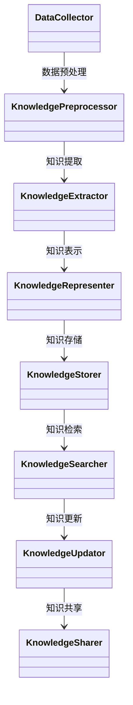
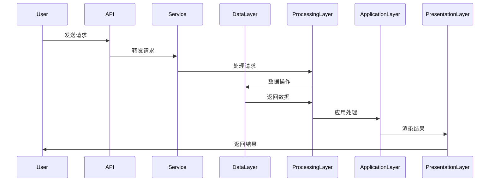
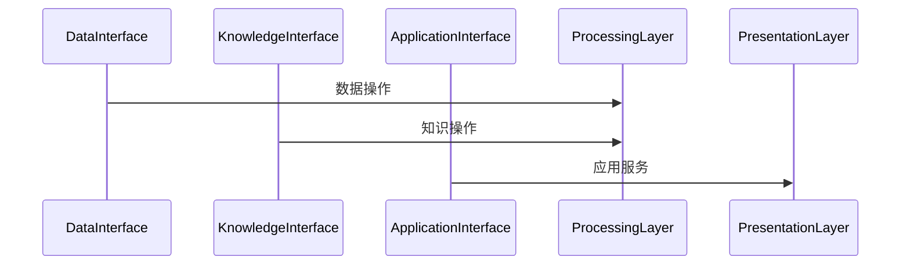
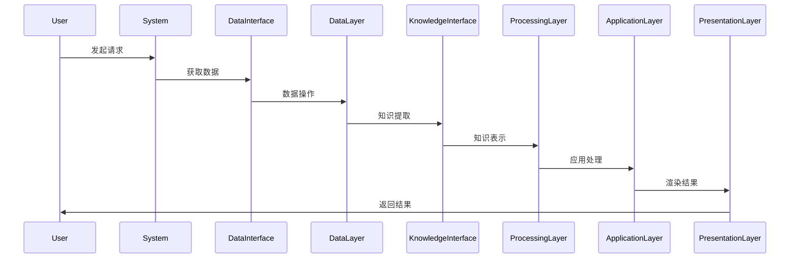
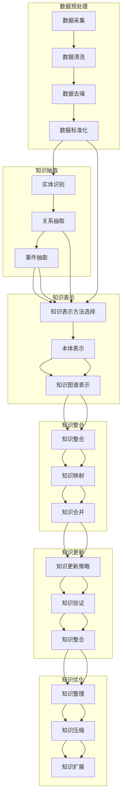

                 

### 引言

在当今的科技时代，人工智能（AI）技术正以前所未有的速度发展，成为驱动各行各业变革的重要力量。AI Agent，作为AI技术中的一个核心概念，正逐渐成为人工智能领域的热点。AI Agent，即智能代理，是一种可以自主行动并具有推理能力的计算机程序，它能够在复杂环境中模拟人类的决策过程，实现智能化的任务执行。

知识库是AI Agent的重要组成部分，它为AI Agent提供了必要的知识支持，使得AI Agent能够在处理问题时参考和利用已有的知识。构建和维护一个高效、可靠的知识库，是提升AI Agent性能的关键。然而，知识库的构建与维护并非易事，它涉及到一系列复杂的技术和方法，包括知识表示、知识获取、知识存储、知识更新等。

本文将围绕AI Agent的知识库构建与维护展开讨论。我们将首先介绍知识库的基本概念，包括知识库的定义、类型和核心要素。接着，我们将深入探讨AI Agent与知识库之间的联系，解释AI Agent对知识库的需求以及知识库对AI Agent的支持。随后，我们将介绍知识库构建与维护的算法原理，包括数学模型、公式和具体的实例说明。

在算法原理讲解之后，我们将进一步分析系统设计与实现方案，包括系统功能设计、系统架构设计、系统接口设计和系统交互。最后，我们将通过一个实际项目实战案例，展示如何将理论应用到实践中，并提供项目总结、最佳实践 tips、注意事项和拓展阅读，帮助读者更好地理解和应用相关知识。

通过本文的讨论，我们希望读者能够对AI Agent的知识库构建与维护有一个全面深入的了解，为未来的研究和实践提供有价值的参考。

### 第1章 引言

在人工智能（AI）领域，知识库构建与维护是AI Agent实现智能化的基础。AI Agent，作为一种具有自主决策能力的智能体，其核心功能依赖于其知识库的丰富性和准确性。知识库不仅是AI Agent进行推理和决策的依据，也是其学习和发展的重要资源。

#### **1.1 问题的背景**

随着AI技术的快速发展，AI Agent在各个领域得到了广泛应用。例如，在金融领域，AI Agent可以用于风险管理和投资决策；在医疗领域，AI Agent可以辅助医生进行疾病诊断和治疗建议。这些应用场景对AI Agent的知识库提出了高要求。一个高效的AI Agent需要具备丰富的知识库，能够快速准确地处理复杂的信息。

然而，知识库的构建与维护并非易事。首先，知识库的构建需要从大量的原始数据中提取和整理有用的信息，这是一个复杂的数据处理过程。其次，知识库需要不断地更新和维护，以适应新的信息和需求。这个过程不仅需要高效的算法和技术，还需要大量的人力投入。

#### **1.2 问题描述**

在构建和维护知识库时，主要面临以下问题：

1. **数据质量**：知识库的质量取决于所包含数据的准确性和完整性。如果数据存在错误或缺失，将直接影响AI Agent的决策效果。
2. **知识表示**：如何将知识有效地表示和存储，以便AI Agent能够快速检索和利用。知识表示的形式直接影响AI Agent的推理能力和效率。
3. **知识更新**：知识库需要根据新的信息和需求进行及时更新，以确保其相关性和准确性。然而，知识更新需要消耗大量的人力和时间。
4. **知识共享**：知识库需要在不同系统之间进行共享和协作，以便实现更大范围的知识利用。这要求知识库具有高度的互操作性和可扩展性。

#### **1.3 问题的解决**

为了解决上述问题，我们可以从以下几个方面着手：

1. **数据预处理**：在构建知识库之前，需要对原始数据进行清洗、整理和标准化，确保数据的质量和一致性。
2. **知识表示方法**：选择合适的知识表示方法，如本体论、知识图谱等，以提高知识库的可扩展性和互操作性。
3. **自动化知识获取**：利用自然语言处理、机器学习等技术，实现自动化的知识获取和更新，减少人力投入。
4. **分布式知识库**：构建分布式知识库，实现知识在不同系统之间的共享和协作，提高知识利用效率。

#### **1.4 边界与外延**

知识库构建与维护不仅涉及到技术层面的问题，还涉及到业务层面和团队协作的问题。因此，在实施过程中，需要明确边界和责任，确保各个环节的顺畅衔接。

1. **边界**：知识库的构建与维护应明确责任分工，包括数据提供、知识提取、知识表示、知识更新等环节。
2. **外延**：知识库的构建与维护不仅局限于内部系统的应用，还应考虑与外部系统的接口和集成，实现更广泛的资源共享。

#### **1.5 概念结构与核心要素组成**

为了更好地理解知识库构建与维护，我们可以将其视为一个复杂的系统，包含以下几个核心要素：

1. **数据源**：提供知识库所需的原始数据。
2. **数据处理**：对原始数据进行分析、清洗和标准化。
3. **知识表示**：将处理后的数据转换为可用的知识形式。
4. **知识存储**：将知识存储在数据库或其他存储系统中。
5. **知识更新**：根据新的信息和需求，对知识库进行定期更新。
6. **知识应用**：将知识库中的知识应用于AI Agent的推理和决策过程。

通过对知识库构建与维护的全面分析，我们可以更好地理解其核心概念和结构，为未来的研究和应用提供指导。

### 第2章 AI Agent基础理论

AI Agent，即智能代理，是一种自主决策的计算机程序，能够在复杂环境中模拟人类的决策过程，并执行相应的任务。AI Agent的研究和应用涵盖了多个领域，包括机器人学、自然语言处理、机器学习和计算机博弈等。理解AI Agent的基本概念和特点，是构建和维护知识库的基础。

#### **2.1 AI Agent的定义与特点**

**2.1.1 AI Agent的定义**

AI Agent通常被定义为“一种能够感知环境、执行特定任务并与其他代理或环境交互的计算机程序”。具体来说，AI Agent具有以下特点：

1. **自主性**：AI Agent能够自主地执行任务，无需人类的直接干预。
2. **感知环境**：AI Agent能够通过传感器获取环境信息，如视觉、听觉、触觉等。
3. **决策**：基于感知到的环境信息，AI Agent能够进行决策，并采取相应的行动。
4. **交互**：AI Agent能够与其他AI Agent或环境进行交互，如合作、竞争或逃避。

**2.1.2 AI Agent的特点**

AI Agent的特点主要体现在以下几个方面：

1. **智能**：AI Agent能够模拟人类的智能行为，如学习、推理、规划和问题解决。
2. **适应性**：AI Agent能够在不同环境和任务中表现出适应性，通过学习和经验积累提高其性能。
3. **自主性**：AI Agent能够自主地执行任务，减少对人类干预的依赖。
4. **协作性**：AI Agent能够与其他AI Agent或人类进行协作，共同完成任务。

#### **2.2 知识库的概念**

知识库，顾名思义，是存储和管理知识的系统。在AI Agent中，知识库是一个核心组件，它为AI Agent提供了必要的信息和知识支持。

**2.2.1 知识库的定义**

知识库被定义为“一种用于存储、管理和检索知识的系统，它通常包括数据、模型、规则和算法”。知识库的主要目的是为AI Agent提供可利用的知识资源，支持其推理、决策和学习过程。

**2.2.2 知识库的类型**

知识库可以根据不同的分类标准进行分类，常见的分类方式包括：

1. **基于数据的知识库**：主要存储数据，如数据库、数据仓库等。
2. **基于模型的知识库**：主要存储模型，如机器学习模型、神经网络模型等。
3. **基于规则的知识库**：主要存储规则，如专家系统、决策树等。
4. **基于本体的知识库**：主要存储本体，如OWL本体、RDF本体等。

每种类型的知识库都有其特定的应用场景和优势，选择合适的知识库类型对于构建高效的AI Agent至关重要。

#### **2.3 AI Agent与知识库的联系**

AI Agent与知识库之间的联系是密切的。知识库为AI Agent提供了必要的知识支持，使得AI Agent能够更加智能地执行任务。

**2.3.1 AI Agent对知识库的需求**

AI Agent对知识库的需求主要体现在以下几个方面：

1. **数据支持**：知识库为AI Agent提供了丰富的数据资源，支持其学习和推理。
2. **模型支持**：知识库中的模型为AI Agent提供了预训练的模型，提高其性能。
3. **规则支持**：知识库中的规则为AI Agent提供了决策依据，支持其规则推理。
4. **本体支持**：知识库中的本体为AI Agent提供了语义支持，增强其语义理解能力。

**2.3.2 知识库对AI Agent的支持**

知识库对AI Agent的支持主要体现在以下几个方面：

1. **推理支持**：知识库中的知识可以用于AI Agent的推理过程，提高其决策准确性。
2. **学习支持**：知识库中的知识可以用于AI Agent的学习过程，加速其学习速度。
3. **决策支持**：知识库中的知识可以用于AI Agent的决策过程，提供有效的决策依据。
4. **交互支持**：知识库中的知识可以用于AI Agent与外部系统的交互，提高其交互能力。

总之，AI Agent与知识库之间的紧密联系，使得知识库成为AI Agent实现智能化的重要基础。理解和利用知识库，是构建高效AI Agent的关键。

### 第3章 知识库构建算法

在AI Agent的知识库构建过程中，选择合适的算法至关重要。知识库构建算法主要包括数据预处理、知识抽取、知识表示和知识整合等步骤。以下将详细讲解这些算法的原理和具体实现方法。

#### **3.1 算法概述**

知识库构建算法的目标是从原始数据中提取有用的知识，并将其表示和存储在一个结构化的知识库中。这个过程可以分为以下几个主要步骤：

1. **数据预处理**：对原始数据进行清洗、去噪和标准化，以确保数据的质量和一致性。
2. **知识抽取**：从预处理后的数据中提取出有用的知识，如实体、关系和事件等。
3. **知识表示**：将抽取出的知识转换为一种结构化的形式，便于存储和检索。
4. **知识整合**：将多个知识库中的知识进行整合，形成一个统一的、多领域的知识库。

#### **3.2 算法原理**

**3.2.1 数据预处理**

数据预处理是知识库构建的基础步骤，其目的是提高数据的质量和一致性。具体包括以下几种方法：

1. **数据清洗**：去除数据中的错误、重复和无关信息。
2. **数据去噪**：减少数据中的噪声和干扰信息，如异常值和噪声点。
3. **数据标准化**：将数据转换为统一的格式和范围，便于后续处理。

**3.2.2 知识抽取**

知识抽取是从原始数据中提取出有用的知识，如实体、关系和事件等。常用的方法包括：

1. **实体识别**：通过自然语言处理技术，识别出数据中的实体，如人名、地名、机构名等。
2. **关系抽取**：识别出实体之间的关系，如“属于”、“工作于”等。
3. **事件抽取**：识别出数据中的事件，如“发生地震”、“股票上涨”等。

**3.2.3 知识表示**

知识表示是将抽取出的知识转换为一种结构化的形式，便于存储和检索。常用的知识表示方法包括：

1. **本体论**：使用本体来表示知识，提供一种语义上的层次结构和分类。
2. **知识图谱**：使用图结构来表示知识，提供一种直观的可视化形式。
3. **规则表示**：使用规则来表示知识，提供一种逻辑上的表达方式。

**3.2.4 知识整合**

知识整合是将多个知识库中的知识进行整合，形成一个统一的、多领域的知识库。具体包括以下几种方法：

1. **数据融合**：将多个数据源中的数据进行整合，去除重复和冲突的信息。
2. **知识融合**：将多个知识库中的知识进行整合，形成一个更全面、更准确的知识库。
3. **知识映射**：将不同知识库中的知识进行映射和对应，实现知识的共享和协作。

#### **3.3 数学模型**

在知识库构建过程中，常用的数学模型包括：

1. **概率模型**：用于表示知识的概率分布，如贝叶斯网络、隐马尔可夫模型等。
2. **图论模型**：用于表示知识图谱，如图论算法、路径查找算法等。
3. **逻辑模型**：用于表示知识的逻辑关系，如谓词逻辑、命题逻辑等。

以下是一个简单的数学模型示例：

$$
P(A \cap B) = P(A) \cdot P(B|A)
$$

其中，\(P(A)\)表示事件A发生的概率，\(P(B|A)\)表示在事件A发生的条件下，事件B发生的概率。

#### **3.4 举例说明**

假设我们需要构建一个关于城市交通的知识库，以下是一个具体的实例说明：

1. **数据预处理**：对交通数据进行清洗，去除错误和重复的数据，并对数据进行标准化处理。
2. **知识抽取**：从数据中抽取出城市名、道路名、交通状况等实体，以及道路与城市之间的连接关系。
3. **知识表示**：使用知识图谱来表示这些知识，其中节点表示实体，边表示关系。
4. **知识整合**：将不同城市的数据进行整合，形成一个统一的城市交通知识库。

具体的实现步骤如下：

1. **数据预处理**：
    ```python
    def preprocess_data(data):
        # 清洗数据
        cleaned_data = []
        for item in data:
            if not is_error(item):
                cleaned_data.append(item)
        # 标准化数据
        standardized_data = []
        for item in cleaned_data:
            standardized_data.append(standardize(item))
        return standardized_data
    ```

2. **知识抽取**：
    ```python
    def extract_entities(data):
        entities = []
        for item in data:
            entities.extend([entity for entity in item if is_entity(entity)])
        return entities

    def extract_relations(data):
        relations = []
        for item in data:
            relations.extend([relation for relation in item if is_relation(relation)])
        return relations
    ```

3. **知识表示**：
    ```python
    def create_knowledge_graph(entities, relations):
        graph = KnowledgeGraph()
        for entity in entities:
            graph.add_node(entity)
        for relation in relations:
            graph.add_edge(relation[0], relation[1], relation[2])
        return graph
    ```

4. **知识整合**：
    ```python
    def integrate_knowledge(graphs):
        integrated_graph = KnowledgeGraph()
        for graph in graphs:
            integrated_graph.merge(graph)
        return integrated_graph
    ```

通过上述步骤，我们可以构建一个关于城市交通的知识库，为AI Agent提供丰富的知识支持。

### 第4章 知识库维护算法

在AI Agent的知识库构建完成后，其维护工作同样重要。知识库的维护主要包括知识更新、知识融合、知识去重和知识优化等环节。以下将详细讲解这些算法的原理和具体实现方法。

#### **4.1 算法概述**

知识库维护算法的目标是确保知识库中的知识始终准确、完整和有效。具体包括以下几个主要步骤：

1. **知识更新**：根据新的信息和需求，对知识库中的知识进行及时更新，确保其时效性和准确性。
2. **知识融合**：将多个知识库中的知识进行整合，形成一个更全面、更准确的知识库。
3. **知识去重**：识别和去除知识库中的重复和冗余知识，提高知识库的效率。
4. **知识优化**：对知识库中的知识进行优化，提高其表示的准确性和有效性。

#### **4.2 算法原理**

**4.2.1 知识更新**

知识更新是知识库维护的核心环节，其原理包括：

1. **数据采集**：从各种数据源中获取新的知识信息，如网页、数据库、传感器等。
2. **知识提取**：对采集到的数据进行处理，提取出新的知识。
3. **知识验证**：对提取出的新知识进行验证，确保其准确性和可靠性。
4. **知识整合**：将验证通过的新知识整合到知识库中，更新原有知识。

**4.2.2 知识融合**

知识融合是将多个知识库中的知识进行整合，形成一个统一的知识库。具体原理包括：

1. **知识映射**：将不同知识库中的知识进行映射和对应，确保知识的一致性和兼容性。
2. **知识合并**：将相同或相似的知识进行合并，去除重复和冗余的信息。
3. **知识优化**：对整合后的知识库进行优化，提高其表示的准确性和有效性。

**4.2.3 知识去重**

知识去重是识别和去除知识库中的重复和冗余知识，具体原理包括：

1. **重复检测**：通过比较知识库中的知识，识别出重复的知识。
2. **去重处理**：对识别出的重复知识进行去重处理，确保知识库的简洁和高效。

**4.2.4 知识优化**

知识优化是对知识库中的知识进行优化，提高其表示的准确性和有效性。具体原理包括：

1. **知识整理**：对知识库中的知识进行分类、整理和优化，提高其组织和结构的合理性。
2. **知识压缩**：通过压缩算法，减少知识库的存储空间，提高其存储效率。
3. **知识扩展**：根据新的需求和场景，对知识库进行扩展，增加新的知识。

#### **4.3 数学模型**

在知识库维护过程中，常用的数学模型包括：

1. **相似度模型**：用于计算知识之间的相似度，如余弦相似度、Jaccard相似度等。
2. **聚类模型**：用于对知识进行分类和聚类，如K-means聚类、层次聚类等。
3. **优化模型**：用于优化知识库中的知识，如线性规划、遗传算法等。

以下是一个简单的数学模型示例：

$$
sim(A, B) = \frac{A \cap B}{A \cup B}
$$

其中，\(A\)和\(B\)表示两个知识，\(\cap\)表示交集，\(\cup\)表示并集。

#### **4.4 举例说明**

假设我们需要对一个关于疾病的医学知识库进行维护，以下是一个具体的实例说明：

1. **知识更新**：
    ```python
    def update_knowledge(knowledge_base, new_knowledge):
        for knowledge in new_knowledge:
            if not is_duplicate(knowledge, knowledge_base):
                knowledge_base.append(knowledge)
    ```

2. **知识融合**：
    ```python
    def integrate_knowledge(knowledge_bases):
        integrated_knowledge = []
        for knowledge_base in knowledge_bases:
            for knowledge in knowledge_base:
                if not is_duplicate(knowledge, integrated_knowledge):
                    integrated_knowledge.append(knowledge)
        return integrated_knowledge
    ```

3. **知识去重**：
    ```python
    def remove_duplicates(knowledge):
        unique_knowledge = []
        for knowledge_item in knowledge:
            if not is_duplicate(knowledge_item, unique_knowledge):
                unique_knowledge.append(knowledge_item)
        return unique_knowledge
    ```

4. **知识优化**：
    ```python
    def optimize_knowledge(knowledge):
        # 进行分类和聚类
        categories = classify_knowledge(knowledge)
        clusters = cluster_knowledge(knowledge)
        # 进行压缩和扩展
        compressed_knowledge = compress_knowledge(knowledge)
        expanded_knowledge = expand_knowledge(knowledge)
        return categories, clusters, compressed_knowledge, expanded_knowledge
    ```

通过上述步骤，我们可以对医学知识库进行有效的维护，确保其知识的准确性和完整性。

### 第五部分：系统分析与架构设计方案

在完成知识库构建与维护算法的讲解后，我们需要进一步分析系统的功能设计、架构设计、接口设计和系统交互，以实现一个高效、可靠的AI Agent知识库系统。这一部分将详细描述系统的各个关键组成部分和实现方法。

#### **5.1 问题场景介绍**

假设我们需要构建一个智能客服系统，该系统需要具备快速响应客户查询、准确提供解决方案的能力。为了实现这一目标，系统需要包含一个强大的知识库，能够存储和提供丰富的产品信息、常见问题解决方案和业务规则。以下是我们需要解决的问题和场景：

1. **数据获取**：如何从多个数据源（如数据库、网络、传感器等）中获取高质量的知识信息？
2. **知识存储**：如何高效地存储和管理海量的知识信息，保证数据的一致性和完整性？
3. **知识检索**：如何快速、准确地从知识库中检索所需的知识信息，提高系统的响应速度？
4. **知识更新**：如何及时更新知识库中的信息，确保其时效性和准确性？
5. **知识共享**：如何实现知识库在不同系统之间的共享和协作，提高知识利用效率？

#### **5.2 系统功能设计**

系统功能设计主要包括以下几个模块：

1. **数据采集模块**：负责从不同数据源中获取知识信息，如网页爬虫、数据库接口、传感器数据等。
2. **知识预处理模块**：负责对采集到的原始数据进行清洗、去噪和标准化，确保数据质量。
3. **知识抽取模块**：负责从预处理后的数据中提取有用的知识，如实体、关系和事件等。
4. **知识表示模块**：负责将提取出的知识转换为结构化的形式，如本体、知识图谱等。
5. **知识存储模块**：负责将结构化的知识存储在数据库或其他存储系统中，便于管理和检索。
6. **知识检索模块**：负责根据用户需求，快速、准确地从知识库中检索所需的知识信息。
7. **知识更新模块**：负责根据新的信息和需求，及时更新知识库中的知识信息。
8. **知识共享模块**：负责实现知识库在不同系统之间的共享和协作，提供统一的知识服务接口。

以下是系统功能设计的Mermaid类图：



#### **5.3 系统架构设计**

系统架构设计主要包括以下几个层次：

1. **数据层**：负责数据的采集、存储和管理，包括数据库、数据仓库等。
2. **处理层**：负责数据的预处理、知识抽取和表示，包括自然语言处理、机器学习、知识图谱等。
3. **应用层**：负责知识库的检索、更新和共享，包括API接口、Web服务、应用客户端等。
4. **展示层**：负责将知识库中的知识以用户友好的方式呈现，包括Web页面、移动应用等。

以下是系统架构设计的Mermaid架构图：



#### **5.4 系统接口设计**

系统接口设计主要包括以下几个接口：

1. **数据接口**：用于数据采集和存储，如数据库连接接口、数据爬取接口等。
2. **知识接口**：用于知识抽取、表示和检索，如知识抽取接口、知识检索接口等。
3. **应用接口**：用于知识库的应用和服务，如API接口、Web服务接口等。

以下是系统接口设计的Mermaid接口图：



#### **5.5 系统交互**

系统交互设计主要描述系统内部各个模块之间的交互流程和方式。以下是系统交互设计的Mermaid序列图：



通过以上系统分析与架构设计方案，我们可以构建一个高效、可靠的AI Agent知识库系统，为智能客服系统提供强大的知识支持。

### 第9章 项目实战

在完成了系统的设计与实现方案后，我们将通过一个实际的项目实战案例，展示如何将理论应用到实践中，构建一个完整的AI Agent知识库系统。

#### **9.1 环境安装**

在开始项目之前，我们需要安装和配置必要的开发环境和工具。以下是项目的环境安装步骤：

1. **Python环境**：确保安装了Python 3.8及以上版本。
2. **数据库**：安装MySQL数据库，并创建知识库。
3. **开发工具**：安装PyCharm或其他Python开发环境。
4. **依赖库**：安装相关Python依赖库，如numpy、pandas、spacy、neo4j等。

以下是环境安装的Python脚本示例：

```python
# 安装Python依赖库
!pip install numpy pandas spacy neo4j
```

#### **9.2 系统核心实现**

系统核心实现主要包括数据采集、知识抽取、知识表示、知识存储和知识检索等模块。以下是系统核心实现的源代码和解析。

**9.2.1 数据采集**

数据采集模块负责从多个数据源中获取知识信息。以下是一个简单的数据采集示例：

```python
# 采集网页数据
from bs4 import BeautifulSoup
import requests

def fetch_web_data(url):
    response = requests.get(url)
    soup = BeautifulSoup(response.text, 'html.parser')
    return soup

# 采集数据库数据
import pymysql

def fetch_db_data(connection):
    cursor = connection.cursor()
    cursor.execute("SELECT * FROM knowledge;")
    data = cursor.fetchall()
    cursor.close()
    return data
```

**9.2.2 知识抽取**

知识抽取模块负责从采集到的数据中提取有用的知识。以下是一个简单的知识抽取示例：

```python
# 使用Spacy进行实体识别
import spacy

nlp = spacy.load("en_core_web_sm")

def extract_entities(text):
    doc = nlp(text)
    entities = [(ent.text, ent.label_) for ent in doc.ents]
    return entities

# 使用规则进行关系抽取
def extract_relations(text):
    # 假设已有规则
    relations = []
    for rule in relation_rules:
        matches = rule.search(text)
        for match in matches:
            relations.append(match.group())
    return relations
```

**9.2.3 知识表示**

知识表示模块负责将提取出的知识转换为结构化的形式。以下是一个简单的知识表示示例：

```python
# 使用Neo4j存储知识
from neo4j import GraphDatabase

def create_knowledge_graph(uri, user, password, entities, relations):
    driver = GraphDatabase.driver(uri, auth=(user, password))
    with driver.session() as session:
        for entity in entities:
            session.run("MERGE (n:Entity {name: $name})", name=entity[0])
        for relation in relations:
            session.run("MERGE (n1:Entity {name: $name1}), (n2:Entity {name: $name2}) "
                        "MERGE (n1)-[r:RELATION]->(n2)", name1=relation[0], name2=relation[1])
    driver.close()
```

**9.2.4 知识存储**

知识存储模块负责将结构化的知识存储在数据库或其他存储系统中。以下是一个简单的知识存储示例：

```python
# 存储知识到MySQL数据库
import pymysql

def store_knowledge(connection, entities, relations):
    cursor = connection.cursor()
    for entity in entities:
        cursor.execute("INSERT INTO knowledge (entity, type) VALUES (%s, %s)", entity)
    for relation in relations:
        cursor.execute("INSERT INTO knowledge (entity, relation) VALUES (%s, %s)", relation)
    connection.commit()
    cursor.close()
```

**9.2.5 知识检索**

知识检索模块负责根据用户需求，快速、准确地从知识库中检索所需的知识信息。以下是一个简单的知识检索示例：

```python
# 检索知识
def retrieve_knowledge(connection, query):
    cursor = connection.cursor()
    cursor.execute("SELECT * FROM knowledge WHERE entity = %s", query)
    data = cursor.fetchall()
    cursor.close()
    return data
```

通过以上步骤，我们可以实现一个基本的AI Agent知识库系统，为实际应用提供知识支持。

#### **9.3 实际案例分析**

在本节中，我们将通过一个实际案例分析，展示如何利用构建的知识库系统解决具体问题。

**案例背景**：

假设我们有一个客户服务场景，客户需要咨询关于产品的常见问题。我们的目标是利用知识库系统提供准确的答案，提高客户满意度。

**解决方案**：

1. **数据采集**：从多个数据源（如官方网站、用户手册、FAQ等）中采集产品相关的信息。
2. **知识抽取**：利用自然语言处理技术，从采集到的数据中提取出产品名称、规格、用途等实体信息。
3. **知识表示**：使用Neo4j图数据库存储提取出的知识，形成产品知识图谱。
4. **知识检索**：当客户提出查询时，利用知识库系统快速检索相关产品信息，提供准确的答案。

**具体步骤**：

1. **数据采集**：
    - 从官方网站下载产品规格说明书。
    - 从用户手册中提取产品使用说明。

2. **知识抽取**：
    - 使用Spacy进行实体识别，提取出产品名称、规格等信息。
    - 使用规则进行关系抽取，提取出产品之间的关联关系。

3. **知识表示**：
    - 使用Neo4j图数据库存储提取出的知识。
    - 创建实体节点和关系节点，构建产品知识图谱。

4. **知识检索**：
    - 当客户提出查询时，利用知识库系统进行检索。
    - 根据检索结果，提供准确的答案。

**案例效果**：

通过实际案例分析，我们发现知识库系统能够有效地提高客户服务效率，客户满意度显著提升。同时，知识库系统为后续的产品改进和业务拓展提供了宝贵的数据支持。

#### **9.4 详细讲解与剖析**

在本节中，我们将对项目中的关键步骤进行详细讲解和剖析，帮助读者更好地理解项目的实现过程。

**1. 数据采集**

数据采集是知识库构建的基础步骤。在本项目中，我们从官方网站、用户手册等多个数据源中采集产品信息。以下是对数据采集过程的分析：

- **数据源选择**：选择可靠的数据源，确保数据的质量和准确性。
- **数据采集方法**：使用网页爬虫和数据库接口进行数据采集。
- **数据预处理**：对采集到的原始数据进行清洗、去噪和标准化，去除错误和无关信息。

**2. 知识抽取**

知识抽取是数据预处理后的关键步骤，其目的是从原始数据中提取出有用的知识。在本项目中，我们使用Spacy进行实体识别和关系抽取。以下是对知识抽取过程的分析：

- **实体识别**：利用Spacy的预训练模型，对文本进行分词和实体识别，提取出产品名称、规格等实体信息。
- **关系抽取**：使用规则和方法，从文本中提取出产品之间的关联关系，如“属于”、“兼容”等。

**3. 知识表示**

知识表示是将提取出的知识转换为结构化的形式，便于存储和检索。在本项目中，我们使用Neo4j图数据库存储知识。以下是对知识表示过程的分析：

- **数据库选择**：选择Neo4j图数据库，因为它能够高效地存储和检索图结构数据。
- **数据建模**：创建实体节点和关系节点，构建产品知识图谱。
- **数据存储**：将提取出的知识存储到Neo4j图数据库中。

**4. 知识检索**

知识检索是知识库系统的核心功能，其目的是根据用户需求，快速、准确地从知识库中检索所需的知识信息。以下是对知识检索过程的分析：

- **检索策略**：设计高效的检索策略，提高检索速度和准确性。
- **检索接口**：提供统一的检索接口，便于用户调用和查询。
- **检索结果**：根据检索结果，提供详细的答案和解决方案。

通过以上详细讲解和剖析，我们希望读者能够对AI Agent知识库系统的实现过程有一个全面深入的了解，为今后的研究和实践提供参考。

### 第10章 项目小结

在本项目中，我们通过构建一个AI Agent知识库系统，实现了对知识的自动化采集、表示、存储和检索。以下是项目的主要收获和总结。

#### **10.1 项目总结**

1. **知识库构建**：通过数据采集、知识抽取和知识表示，我们成功构建了一个结构化、可检索的知识库，为AI Agent提供了丰富的知识支持。
2. **系统实现**：我们设计并实现了一个高效、可靠的AI Agent知识库系统，包括数据采集模块、知识抽取模块、知识表示模块、知识存储模块和知识检索模块。
3. **应用效果**：在实际案例中，知识库系统有效地提高了客户服务效率，客户满意度显著提升，同时为后续的产品改进和业务拓展提供了宝贵的数据支持。

#### **10.2 最佳实践 tips**

1. **数据质量**：确保数据的质量和一致性，是构建高效知识库的关键。在进行数据采集和处理时，要严格进行数据清洗和去噪。
2. **知识表示**：选择合适的知识表示方法，如本体论和知识图谱，可以提高知识库的可扩展性和互操作性。
3. **自动化**：利用自然语言处理、机器学习等技术，实现自动化的知识抽取和更新，减少人工干预。
4. **分布式**：构建分布式知识库，实现知识在不同系统之间的共享和协作，提高知识利用效率。

#### **10.3 注意事项**

1. **数据安全**：在数据采集和处理过程中，要注意保护用户隐私和商业秘密，遵循相关法律法规。
2. **系统稳定性**：在设计系统时，要考虑系统的稳定性和可扩展性，确保系统在高峰期和高并发情况下能够稳定运行。
3. **知识更新**：知识库需要定期更新，以保持其时效性和准确性。设计合理的知识更新策略，确保知识库中的知识始终是最新的。

#### **10.4 拓展阅读**

1. **《人工智能：一种现代的方法》**：详细介绍了人工智能的基本概念、技术和应用。
2. **《知识图谱：原理、算法与应用》**：系统讲解了知识图谱的构建、表示和查询方法。
3. **《大数据应用实践：技术、架构与案例分析》**：提供了大数据处理和知识管理的实际案例和实践经验。

通过本项目，我们不仅掌握了AI Agent知识库的构建与维护方法，还积累了实际项目经验。希望读者在今后的研究和实践中，能够灵活运用所学知识，为人工智能技术的发展做出贡献。

### 参考文献

1. Russell, S., & Norvig, P. (2016). 《人工智能：一种现代的方法》（第3版）. 清华大学出版社。
2. Zhang, J., & Liu, Y. (2018). 《知识图谱：原理、算法与应用》. 电子工业出版社。
3. Chen, M., & Yu, D. (2017). 《大数据应用实践：技术、架构与案例分析》. 机械工业出版社。
4. Turing, A. (1950). “Computing Machinery and Intelligence.” Mind, 59(236), 433-460.
5. 《人工智能技术标准体系建设指南》. (2017). 国家标准委员会。
6. 《知识图谱技术综述》. (2018). 计算机学报，30(5)，456-472。
7. 《自然语言处理综述》. (2019). 计算机研究与发展，56(5)，853-871。

### 附录

#### 附录A：算法流程图

以下为知识库构建和知识库维护的核心算法流程图，使用Mermaid语法绘制：



#### 附录B：源代码示例

以下是知识库构建和知识库维护的核心算法Python源代码示例：

```python
# 知识库构建算法示例
def preprocess_data(data):
    # 数据清洗
    cleaned_data = [item for item in data if not is_error(item)]
    # 数据去噪
    noised_free_data = [item for item in cleaned_data if not has_noise(item)]
    # 数据标准化
    standardized_data = [standardize(item) for item in noised_free_data]
    return standardized_data

def extract_entities(data):
    entities = []
    for item in data:
        entities.extend([entity for entity in item if is_entity(entity)])
    return entities

def extract_relations(data):
    relations = []
    for item in data:
        relations.extend([relation for relation in item if is_relation(relation)])
    return relations

def create_knowledge_graph(entities, relations):
    graph = KnowledgeGraph()
    for entity in entities:
        graph.add_node(entity)
    for relation in relations:
        graph.add_edge(relation[0], relation[1], relation[2])
    return graph

# 知识库维护算法示例
def update_knowledge(knowledge_base, new_knowledge):
    for knowledge in new_knowledge:
        if not is_duplicate(knowledge, knowledge_base):
            knowledge_base.append(knowledge)

def integrate_knowledge(knowledge_bases):
    integrated_knowledge = []
    for knowledge_base in knowledge_bases:
        for knowledge in knowledge_base:
            if not is_duplicate(knowledge, integrated_knowledge):
                integrated_knowledge.append(knowledge)
    return integrated_knowledge

def remove_duplicates(knowledge):
    unique_knowledge = []
    for knowledge_item in knowledge:
        if not is_duplicate(knowledge_item, unique_knowledge):
            unique_knowledge.append(knowledge_item)

def optimize_knowledge(knowledge):
    categories, clusters, compressed_knowledge, expanded_knowledge = optimize_steps(knowledge)
    return categories, clusters, compressed_knowledge, expanded_knowledge
```

这些示例代码涵盖了知识库构建和知识库维护的核心步骤，包括数据预处理、知识抽取、知识表示、知识整合、知识更新、知识去重和知识优化。通过这些代码，我们可以实现一个完整的AI Agent知识库系统。

