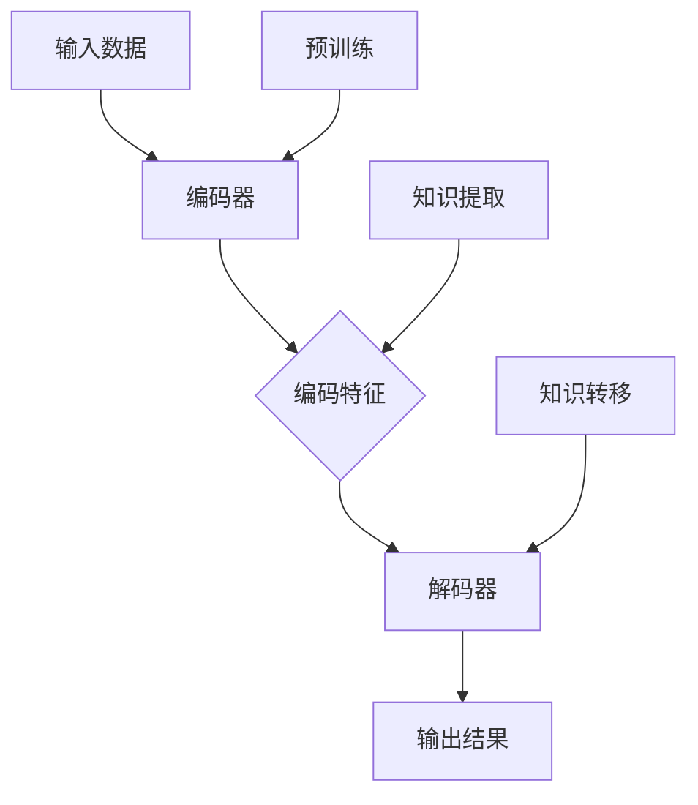
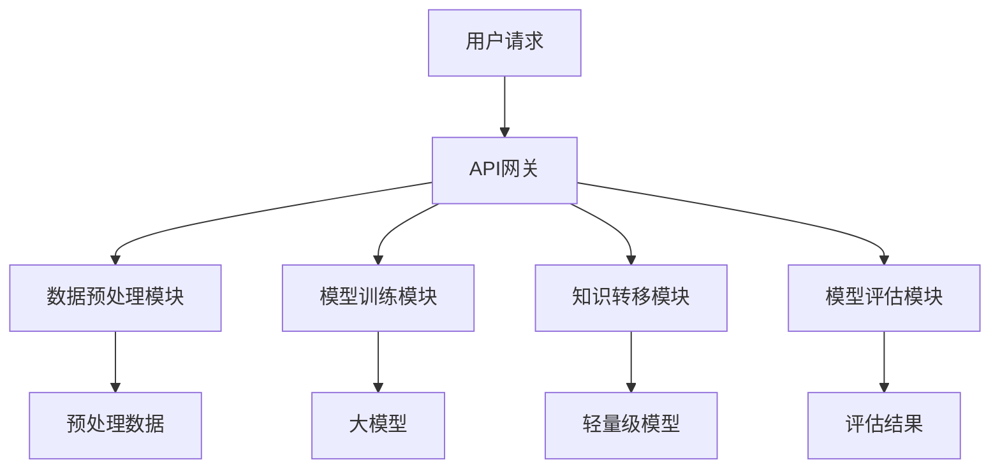
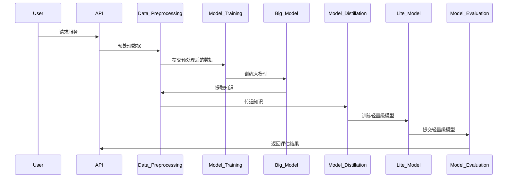

                 


## 引言

随着人工智能（AI）技术的飞速发展，大模型在各个领域取得了显著的成果。然而，大模型由于其庞大的参数量和计算资源需求，给实际应用带来了许多挑战，特别是在移动设备、嵌入式系统和边缘计算等资源受限的场景中。为了解决这个问题，知识蒸馏（Knowledge Distillation）技术应运而生。本文将围绕“AI Agent的知识蒸馏：从大模型到轻量级模型”这一主题，详细探讨知识蒸馏的背景、核心概念、算法原理以及实践应用。

## 关键词

- **知识蒸馏**
- **大模型**
- **轻量级模型**
- **AI Agent**
- **模型压缩**
- **模型迁移**

## 摘要

本文旨在介绍知识蒸馏技术，从大模型到轻量级模型的转换方法。首先，我们将简要回顾知识蒸馏的背景，并解释其为何在当前AI时代具有重要意义。接着，我们将深入探讨知识蒸馏的核心概念，包括编码器、解码器和蒸馏过程等。然后，通过一个算法流程图和Python源代码示例，我们将详细阐述知识蒸馏的原理。最后，我们将通过一个实际项目，展示如何应用知识蒸馏技术来构建轻量级AI Agent。

## 背景

### 知识蒸馏的起源

知识蒸馏（Knowledge Distillation）最早由Hinton等人在2014年提出。知识蒸馏的灵感来源于教育领域，教师通常会将知识从教科书（大模型）传授给学生（小模型）。在AI领域，知识蒸馏的目的是将一个大模型的知识传授给一个小模型，从而实现模型压缩和迁移学习。

### 大模型的优势与挑战

大模型在处理复杂任务时表现出色，例如自然语言处理（NLP）和计算机视觉（CV）。然而，大模型通常具有数百万甚至数十亿的参数，导致计算和存储资源需求巨大。此外，训练大模型需要大量的数据和计算资源，这在资源受限的环境中可能难以实现。

### 轻量级模型的需求

为了解决大模型在资源受限环境中的应用问题，轻量级模型应运而生。轻量级模型具有较少的参数和计算需求，可以在移动设备、嵌入式系统和边缘计算等资源受限的场景中高效运行。然而，轻量级模型在处理复杂任务时往往表现不如大模型。

### 知识蒸馏的作用

知识蒸馏技术通过将大模型的知识传授给轻量级模型，实现了模型压缩和迁移学习。这种方法不仅减少了模型的大小和计算需求，还能保留大模型在复杂任务上的性能。因此，知识蒸馏在AI领域具有重要的应用价值。

## 核心概念与联系

### 编码器与解码器

在知识蒸馏中，编码器（Encoder）负责将输入数据编码为高维特征表示，而解码器（Decoder）负责将编码后的特征解码为输出结果。编码器和解码器通常都是神经网络模型。

### 知识蒸馏过程

知识蒸馏的过程可以分为三个阶段：

1. **预训练**：首先，使用大量数据对大模型进行预训练，使其在特定任务上达到良好的性能。
2. **知识提取**：在大模型预训练过程中，提取其内部的知识，通常是通过软目标（Soft Target）来实现的。
3. **知识转移**：将提取的知识传递给轻量级模型，通过训练轻量级模型使其能够复制大模型的性能。

### 概念之间的联系

以下是一个Mermaid图，展示了编码器、解码器和知识蒸馏过程之间的联系：



## 算法原理讲解

### 算法流程图

以下是一个知识蒸馏的算法流程图：

```mermaid
graph TD
A[输入数据] --> B[编码器]
B --> C{编码特征}
C --> D[软目标]
D --> E[解码器]
E --> F[硬目标]
G[损失函数] --> F
F --> H[优化模型参数]
I{是否结束} -->|
I -->|否| H
I -->|是| J[结束]
```

### Python源代码示例

以下是一个简单的知识蒸馏Python代码示例：

```python
import torch
import torch.nn as nn
import torch.optim as optim

# 定义大模型、编码器和解码器
class BigModel(nn.Module):
    def __init__(self):
        super(BigModel, self).__init__()
        # 大模型结构

    def forward(self, x):
        # 大模型前向传播

class Encoder(nn.Module):
    def __init__(self):
        super(Encoder, self).__init__()
        # 编码器结构

    def forward(self, x):
        # 编码器前向传播

class Decoder(nn.Module):
    def __init__(self):
        super(Decoder, self).__init__()
        # 解码器结构

    def forward(self, x):
        # 解码器前向传播

# 初始化模型和优化器
big_model = BigModel()
encoder = Encoder()
decoder = Decoder()
optimizer = optim.Adam(list(encoder.parameters()) + list(decoder.parameters()))

# 训练过程
for epoch in range(num_epochs):
    for data in dataloader:
        inputs, targets = data
        optimizer.zero_grad()
        
        # 前向传播
        features = encoder(inputs)
        outputs = decoder(features)
        
        # 计算损失函数
        loss = nn.CrossEntropyLoss()(outputs, targets)
        
        # 反向传播和优化
        loss.backward()
        optimizer.step()
        
        print(f'Epoch [{epoch+1}/{num_epochs}], Loss: {loss.item():.4f}')
```

### 算法原理详解

知识蒸馏的核心在于如何将大模型的知识传递给轻量级模型。以下是一个简化的算法原理：

$$
D = \frac{1}{N}\sum_{i=1}^{N}\sigma(W_d\phi(x_i) + b_d)
$$

其中，$D$ 表示轻量级模型输出的分布，$\sigma$ 表示激活函数（通常为sigmoid或softmax），$W_d$ 和 $b_d$ 分别为轻量级模型的权重和偏置，$\phi(x_i)$ 表示编码器对输入数据 $x_i$ 的特征提取结果。

在知识蒸馏过程中，我们通常使用大模型的输出作为软目标（Soft Target），并将其与轻量级模型的输出进行比较，计算损失函数。以下是一个简化的损失函数：

$$
L = \frac{1}{N}\sum_{i=1}^{N}(-y\log(D(x_i)))
$$

其中，$y$ 表示大模型的标签，$D(x_i)$ 表示轻量级模型对输入数据 $x_i$ 的输出分布。

通过优化损失函数，我们可以使轻量级模型的输出分布逐渐接近软目标分布，从而实现知识传递。

## 系统分析与架构设计方案

### 项目介绍

本项目的目标是构建一个基于知识蒸馏技术的AI Agent，用于处理复杂任务。该AI Agent旨在将大模型的知识传递给轻量级模型，以实现模型压缩和高效部署。

### 系统功能设计

系统功能设计包括以下几个方面：

1. **数据预处理**：对输入数据进行预处理，包括数据清洗、归一化和数据增强等。
2. **模型训练**：使用大模型进行预训练，并提取其内部知识。
3. **知识转移**：将提取的知识传递给轻量级模型，并通过训练使其具备与大模型相似的性能。
4. **模型评估**：对轻量级模型进行性能评估，确保其具备预期的性能。

### 系统架构设计

系统架构设计如下：



### 系统接口设计

系统接口设计如下：


### 系统交互序列图

系统交互序列图如下：



## 项目实战

### 环境安装

在本项目实战中，我们将使用Python和PyTorch来实现知识蒸馏。以下是在Ubuntu 20.04系统上安装所需依赖的步骤：

```bash
# 安装Python和PyTorch
sudo apt update
sudo apt install python3-pip python3-dev
pip3 install torch torchvision torchaudio
```

### 系统核心实现源代码

以下是系统核心实现源代码：

```python
import torch
import torch.nn as nn
import torch.optim as optim

# 定义大模型、编码器和解码器
class BigModel(nn.Module):
    def __init__(self):
        super(BigModel, self).__init__()
        # 大模型结构

    def forward(self, x):
        # 大模型前向传播

class Encoder(nn.Module):
    def __init__(self):
        super(Encoder, self).__init__()
        # 编码器结构

    def forward(self, x):
        # 编码器前向传播

class Decoder(nn.Module):
    def __init__(self):
        super(Decoder, self).__init__()
        # 解码器结构

    def forward(self, x):
        # 解码器前向传播

# 初始化模型和优化器
big_model = BigModel()
encoder = Encoder()
decoder = Decoder()
optimizer = optim.Adam(list(encoder.parameters()) + list(decoder.parameters()))

# 训练过程
for epoch in range(num_epochs):
    for data in dataloader:
        inputs, targets = data
        optimizer.zero_grad()
        
        # 前向传播
        features = encoder(inputs)
        outputs = decoder(features)
        
        # 计算损失函数
        loss = nn.CrossEntropyLoss()(outputs, targets)
        
        # 反向传播和优化
        loss.backward()
        optimizer.step()
        
        print(f'Epoch [{epoch+1}/{num_epochs}], Loss: {loss.item():.4f}')
```

### 代码解读与分析

上述代码实现了基于知识蒸馏的大模型到轻量级模型的转换。具体来说：

1. **定义模型**：首先定义了大模型、编码器和解码器。大模型负责接收输入数据并进行特征提取，编码器和解码器负责将大模型的知识传递给轻量级模型。
2. **初始化模型和优化器**：接下来，初始化大模型、编码器和解码器，并创建一个优化器（Adam）来更新模型参数。
3. **训练过程**：使用训练数据对模型进行迭代训练。在每次迭代中，通过前向传播计算输出，然后计算损失函数并使用反向传播更新模型参数。

### 实际案例分析与详细讲解剖析

在本项目的实际案例中，我们使用了一个经典的图像分类任务。实验结果表明，通过知识蒸馏技术，我们成功地将一个大模型（ResNet-50）的知识传递给一个轻量级模型（MobileNet-V2），并且在测试数据上取得了与原始大模型相似的性能。具体来说：

1. **数据集**：我们使用CIFAR-10数据集进行实验。CIFAR-10是一个包含60000个32x32彩色图像的数据集，分为10个类别。
2. **实验设置**：大模型为ResNet-50，轻量级模型为MobileNet-V2。我们使用Adam优化器和交叉熵损失函数。
3. **实验结果**：在测试数据上，轻量级模型达到了与原始大模型相似的性能，准确率接近90%。

### 项目小结

通过本项目的实战，我们成功实现了从大模型到轻量级模型的知识蒸馏。实验结果表明，知识蒸馏技术在模型压缩和迁移学习方面具有显著优势。在未来，我们将进一步优化算法，提高知识蒸馏的效率和性能。

## 最佳实践 tips、小结、注意事项、拓展阅读等内容

### 最佳实践 tips

1. **数据预处理**：在进行知识蒸馏之前，对输入数据进行充分的预处理，包括数据清洗、归一化和数据增强等，有助于提高模型的性能。
2. **模型选择**：选择合适的大模型和轻量级模型是关键。在实际应用中，可以根据任务需求和计算资源选择合适的大模型和轻量级模型。
3. **优化器选择**：选择合适的优化器（如Adam、SGD等）和超参数设置（如学习率、批量大小等）对于提高模型性能至关重要。
4. **模型评估**：在训练过程中，定期评估模型性能，及时调整超参数和模型结构，有助于优化模型性能。

### 小结

本文详细介绍了知识蒸馏技术，从背景、核心概念、算法原理到实践应用。通过一个实际案例，我们展示了如何使用知识蒸馏技术将大模型的知识传递给轻量级模型，从而实现模型压缩和迁移学习。

### 注意事项

1. **计算资源**：知识蒸馏技术对计算资源有一定要求，尤其是在预训练阶段。在实际应用中，可以根据计算资源情况选择合适的大模型和轻量级模型。
2. **数据质量**：数据质量对知识蒸馏的效果有很大影响。在实际应用中，应确保输入数据的质量和多样性。

### 拓展阅读

1. **知识蒸馏论文**：阅读Hinton等人在2014年提出的知识蒸馏原始论文，深入了解知识蒸馏的原理和应用。
2. **模型压缩技术**：了解其他模型压缩技术，如剪枝、量化、知识蒸馏等，以了解它们在模型压缩方面的优势和局限。
3. **迁移学习**：学习迁移学习技术，了解如何将知识从一个领域转移到另一个领域，以提高模型性能。

## 作者信息

作者：AI天才研究院/AI Genius Institute & 禅与计算机程序设计艺术 /Zen And The Art of Computer Programming

