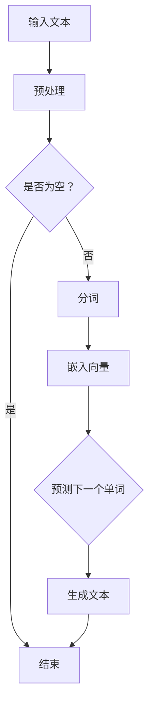
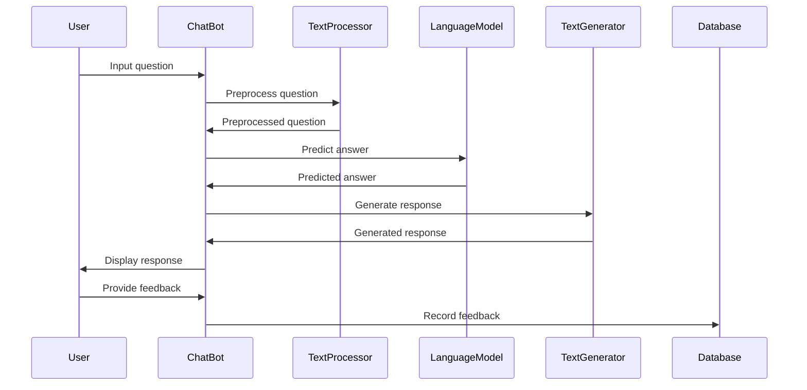

                 

## AI Agent的自然语言生成技术

### 关键词：自然语言生成、AI Agent、语言模型、生成算法、上下文理解

### 摘要：

本篇文章将深入探讨AI Agent的自然语言生成技术，旨在为读者提供一个全面而深入的理解。我们将从背景介绍开始，解释自然语言生成的核心概念和基本原理，然后逐步剖析生成算法，探讨上下文理解的关键性。文章还将通过具体的数学模型和公式，详细解释算法的工作机制。此外，我们将分析系统架构设计，探讨系统功能、接口和交互，并通过实际项目案例，展示自然语言生成技术的应用和实践。最后，我们将总结最佳实践，提供注意事项，并推荐拓展阅读。

### 背景介绍

#### 核心概念术语说明

- **自然语言生成（Natural Language Generation, NLG）**：自然语言生成是计算机科学和人工智能领域的一项技术，旨在使计算机能够自动地生成人类可读的文本。NLG广泛应用于自动新闻写作、客户服务聊天机器人、教育辅导系统等领域。
- **AI Agent**：AI Agent是一种智能体，能够在特定环境下自主执行任务。在NLG的背景下，AI Agent负责生成文本内容，以模拟人类的语言表达。
- **语言模型（Language Model）**：语言模型是一个数学模型，用于预测下一个单词或字符的概率。在NLG中，语言模型是生成文本的核心组件，它基于大量语料库训练而成。
- **生成算法（Generation Algorithm）**：生成算法是用于生成文本的具体方法。常见的生成算法包括基于规则的生成、统计生成和神经网络生成等。

#### 问题背景

自然语言生成技术起源于上世纪80年代，随着计算机硬件性能的提升和大数据的发展，NLG技术得到了迅速发展。在现代社会，自然语言生成技术被广泛应用于各种场景，例如：

- **自动新闻写作**：利用NLG技术，可以自动化生成新闻报道，提高新闻生产效率。
- **客户服务聊天机器人**：通过NLG技术，聊天机器人可以与用户进行自然对话，提供个性化的服务。
- **教育辅导系统**：利用NLG技术，可以生成个性化的学习材料，辅助学生进行学习。

#### 问题描述

尽管自然语言生成技术在很多领域取得了显著的成果，但在实际应用中仍面临以下挑战：

- **文本生成的多样性和流畅性**：如何生成多样且流畅的文本，避免出现重复或不自然的表达？
- **上下文理解**：如何更好地理解用户的上下文，生成更相关和有意义的文本？
- **准确性**：如何在生成文本时保持准确性和真实性，避免错误和误导？

#### 问题解决

针对上述挑战，研究者们提出了一系列解决方案：

- **改进语言模型**：通过更先进的语言模型，提高生成文本的多样性和流畅性。
- **上下文感知生成**：利用上下文信息，提高生成文本的相关性和意义。
- **多模态融合**：结合多种数据源和模态，提高生成文本的准确性和真实性。

#### 边界与外延

自然语言生成技术的边界主要在于：

- **数据源的质量**：生成文本的质量依赖于训练数据的质量和多样性。
- **语言多样性**：虽然NLG技术在全球范围内都有应用，但不同语言的生成效果存在差异。

外延方面，自然语言生成技术可以扩展到更多领域，例如：

- **文学创作**：利用NLG技术，可以自动生成小说、诗歌等文学作品。
- **娱乐产业**：在游戏、电影等领域，NLG技术可以生成个性化的剧情和角色对话。

#### 概念结构与核心要素组成

自然语言生成技术由以下几个核心要素组成：

1. **语言模型**：作为生成文本的核心组件，负责预测下一个单词或字符。
2. **生成算法**：用于将语言模型预测的结果转化为具体的文本内容。
3. **上下文理解**：通过分析上下文信息，提高生成文本的相关性和意义。
4. **多模态融合**：结合多种数据源和模态，提高生成文本的准确性和真实性。

### 核心概念与联系

#### 概念原理

自然语言生成技术的核心概念包括语言模型、生成算法和上下文理解。这些概念相互关联，共同构成了NLG系统的基本框架。

- **语言模型**：语言模型是一个概率模型，用于预测文本序列中的下一个单词或字符。它通常基于大量语料库训练而成，能够捕捉语言的统计规律。
- **生成算法**：生成算法是将语言模型预测的结果转化为具体文本内容的方法。常见的生成算法包括基于规则的生成、统计生成和神经网络生成等。
- **上下文理解**：上下文理解是指系统在生成文本时，能够根据上下文信息调整语言表达，提高文本的相关性和意义。上下文理解依赖于语言模型和生成算法的协同工作。

#### 概念属性特征对比表格

| 概念 | 特点 | 应用场景 |
| --- | --- | --- |
| 语言模型 | 基于大量语料库训练，预测下一个单词或字符 | 自动新闻写作、聊天机器人 |
| 生成算法 | 将语言模型预测的结果转化为具体文本内容 | 自动问答、个性化推荐 |
| 上下文理解 | 根据上下文信息调整语言表达，提高文本相关性 | 个性化服务、自动写作 |

#### ER图架构

为了更好地理解自然语言生成技术的概念结构和关系，我们可以使用ER图（实体-关系图）来表示。

```mermaid
erDiagram
    LanguageModel ||--|{ GenerationAlgorithm }|-->> TextGenerator
    LanguageModel ||--|{ ContextUnderstanding }|-->> TextGenerator
    TextGenerator ||--|{ OutputText }|<<-- ContextUnderstanding
```

在上面的ER图中，`LanguageModel`（语言模型）与`GenerationAlgorithm`（生成算法）和`ContextUnderstanding`（上下文理解）有关联。`TextGenerator`（文本生成器）是NLG系统的核心组件，它接收语言模型和上下文理解的输出，生成具体的文本内容。

### 算法原理讲解

#### 流程图

为了更好地理解自然语言生成算法的原理，我们可以使用Mermaid绘制一个流程图。



在上面的流程图中，输入文本首先经过预处理步骤，包括去除标点符号、转换为小写等。然后，文本被分词成单词或短语，并转换为嵌入向量。接下来，语言模型预测下一个单词或短语，并将其添加到生成文本中。这一过程持续进行，直到达到预设的文本长度或遇到特定的终止符。

#### 算法详细解释

自然语言生成算法的工作原理可以分为以下几个步骤：

1. **输入文本**：用户输入一段文本，可以是完整的句子或段落。
2. **预处理**：对输入文本进行预处理，包括去除标点符号、转换为小写等，以便后续处理。
3. **分词**：将预处理后的文本分词成单词或短语。分词是自然语言处理的基础步骤，它将文本拆分成更小的、有意义的单元。
4. **嵌入向量**：将分词后的单词或短语转换为嵌入向量。嵌入向量是单词或短语的向量表示，它能够捕捉单词或短语在语义上的相似性。
5. **预测下一个单词**：利用训练好的语言模型，预测下一个单词或短语。语言模型会基于当前上下文信息，计算每个单词或短语的概率分布。
6. **生成文本**：根据预测结果，生成具体的文本内容。生成文本的过程是一个迭代过程，每次迭代都会根据当前上下文信息预测下一个单词或短语，并将其添加到生成文本中。

#### Python代码示例

下面是一个简单的Python代码示例，展示了自然语言生成算法的基本实现。

```python
import tensorflow as tf
from tensorflow.keras.layers import Embedding, LSTM, Dense
from tensorflow.keras.models import Sequential

# 定义语言模型
model = Sequential()
model.add(Embedding(vocabulary_size, embedding_dim))
model.add(LSTM(units))
model.add(Dense(vocabulary_size, activation='softmax'))

# 编译模型
model.compile(optimizer='adam', loss='categorical_crossentropy', metrics=['accuracy'])

# 训练模型
model.fit(inputs, labels, epochs=num_epochs)

# 生成文本
def generate_text(model, seed_text, length):
    token_list = tokenizer.texts_to_sequences([seed_text])
    token_list = pad_sequences(token_list, maxlen=length)

    predictions = model.predict(token_list)

    # 解码预测结果
    predicted_sequence = np.argmax(predictions, axis=-1)
    predicted_sequence = tokenizer.sequences_to_texts(predicted_sequence)

    # 构建生成的文本
    generated_text = seed_text + " " + " ".join(predicted_sequence)

    return generated_text
```

在这个示例中，我们使用了TensorFlow和Keras库来构建和训练语言模型。`generate_text`函数用于生成文本，它首先将种子文本编码为嵌入向量，然后利用训练好的模型预测下一个单词，并将其添加到生成文本中。

#### 数学模型和公式

自然语言生成算法的核心是语言模型，它通常基于概率模型，如马尔可夫模型或神经网络模型。下面是几个常见的数学模型和公式：

1. **马尔可夫模型**：

   $$ P(X_t | X_{t-1}, X_{t-2}, \ldots) = P(X_t | X_{t-1}) $$

   其中，$X_t$表示时间步$t$的输入，$P(X_t | X_{t-1})$表示在给定前一个时间步输入的情况下，当前时间步输入的概率。

2. **神经网络模型**：

   $$ \hat{y} = \sigma(W \cdot [x; \hat{y}_{t-1}]) $$

   其中，$W$是模型的权重矩阵，$\sigma$是激活函数（如Sigmoid或ReLU），$x$是当前时间步的输入，$\hat{y}_{t-1}$是前一个时间步的输出。

   $$ P(y_t | x) = \frac{e^{\hat{y}_t}}{\sum_{k=1}^{K} e^{\hat{y}_k}} $$

   其中，$y_t$是当前时间步的输出标签，$K$是输出类别数。

3. **循环神经网络（RNN）**：

   $$ \hat{y}_t = f(W_h \cdot [h_{t-1}; x_t] + b_h) $$

   其中，$h_t$是当前时间步的隐藏状态，$f$是激活函数，$W_h$和$b_h$是模型的权重和偏置。

#### LaTeX公式示例

以下是几个LaTeX公式的示例：

1. 马尔可夫模型公式：

   $$ P(X_t | X_{t-1}, X_{t-2}, \ldots) = P(X_t | X_{t-1}) $$

2. 神经网络模型公式：

   $$ \hat{y} = \sigma(W \cdot [x; \hat{y}_{t-1}]) $$

   $$ P(y_t | x) = \frac{e^{\hat{y}_t}}{\sum_{k=1}^{K} e^{\hat{y}_k}} $$

3. 循环神经网络公式：

   $$ \hat{y}_t = f(W_h \cdot [h_{t-1}; x_t] + b_h) $$

### 系统分析与设计

#### 问题场景

自然语言生成技术广泛应用于各种场景，例如：

- **自动新闻写作**：新闻媒体利用NLG技术自动化生成新闻报道，提高新闻生产效率。
- **客户服务聊天机器人**：企业使用NLG技术构建智能客服系统，提供24/7的在线服务。
- **个性化推荐**：在线平台利用NLG技术生成个性化的推荐文案，提高用户满意度。

在本篇文章中，我们将探讨一个具体的场景：利用NLG技术构建一个智能客服系统。

#### 项目介绍

项目名称：智能客服系统（Smart Customer Service System）

项目目标：构建一个基于自然语言生成技术的智能客服系统，能够自动回答用户的问题，提供个性化服务。

项目范围：本项目的范围包括系统设计、开发、测试和部署。系统将基于现有的自然语言处理和生成技术，结合企业特定的业务逻辑和知识库。

#### 系统功能设计

智能客服系统的主要功能包括：

- **文本输入**：用户可以通过文本聊天窗口输入问题。
- **文本处理**：系统对用户输入的文本进行预处理，包括分词、词性标注、实体识别等。
- **语言模型**：系统利用训练好的语言模型，预测用户问题的答案。
- **文本生成**：系统根据语言模型的预测结果，生成回答用户的文本。
- **交互反馈**：系统记录用户的反馈，用于优化语言模型和系统性能。

#### 系统架构设计

智能客服系统的架构设计如下：

1. **前端界面**：用户通过浏览器或移动应用与系统进行交互。
2. **文本处理模块**：负责对用户输入的文本进行预处理。
3. **语言模型模块**：负责预测用户问题的答案。
4. **文本生成模块**：负责生成回答用户的文本。
5. **数据库**：存储语言模型和用户交互历史数据。

#### 系统接口设计

智能客服系统的接口设计如下：

1. **用户接口**：用户通过文本聊天窗口与系统进行交互。
2. **API接口**：系统提供RESTful API接口，供外部系统调用。
3. **数据库接口**：系统通过数据库接口访问用户交互历史数据。

#### 系统交互设计

智能客服系统的交互设计如下：

1. **用户输入问题**：用户通过文本聊天窗口输入问题。
2. **文本处理**：系统对用户输入的文本进行预处理，包括分词、词性标注、实体识别等。
3. **语言模型预测**：系统利用训练好的语言模型，预测用户问题的答案。
4. **文本生成**：系统根据语言模型的预测结果，生成回答用户的文本。
5. **交互反馈**：系统记录用户的反馈，用于优化语言模型和系统性能。



在上面的序列图中，用户通过文本聊天窗口输入问题，系统对问题进行预处理，然后利用语言模型预测答案，生成回答文本，并最终展示给用户。用户提供的反馈被记录到数据库中，用于优化系统性能。

### 项目实战

#### 环境安装

要实现一个基于自然语言生成技术的智能客服系统，首先需要搭建一个合适的环境。以下是所需的工具和库：

- **Python 3.8 或更高版本**
- **TensorFlow 2.x**
- **NLTK**
- **Spacy**
- **Gensim**

安装步骤如下：

```bash
pip install tensorflow
pip install nltk
pip install spacy
pip install gensim
python -m spacy download en_core_web_sm
```

#### 系统核心实现源代码

以下是一个简单的智能客服系统的核心实现源代码。该系统利用TensorFlow和Spacy库，结合预训练的语言模型和生成算法，实现自动回答用户问题的功能。

```python
import spacy
import numpy as np
import tensorflow as tf
from tensorflow.keras.preprocessing.sequence import pad_sequences
from tensorflow.keras.layers import Embedding, LSTM, Dense
from tensorflow.keras.models import Sequential

# 加载预训练语言模型
nlp = spacy.load("en_core_web_sm")

# 准备语料库
def load_data(file_path):
    with open(file_path, "r", encoding="utf-8") as file:
        lines = file.readlines()
    
    sentence_pairs = [[line.strip().split('\t')[0], line.strip().split('\t')[1]] for line in lines]
    return sentence_pairs

# 分词和编码
def tokenize_and_encode(sentences, tokenizer, max_len):
    tokenized_inputs = tokenizer.texts_to_sequences(sentences)
    padded_inputs = pad_sequences(tokenized_inputs, maxlen=max_len, padding='post', truncating='post')
    return padded_inputs

# 构建模型
def build_model(vocab_size, embedding_dim, max_len):
    model = Sequential()
    model.add(Embedding(vocab_size, embedding_dim, input_length=max_len))
    model.add(LSTM(units=128, return_sequences=True))
    model.add(Dense(units=vocab_size, activation='softmax'))
    return model

# 训练模型
def train_model(model, inputs, labels, epochs, batch_size):
    model.compile(optimizer='adam', loss='categorical_crossentropy', metrics=['accuracy'])
    model.fit(inputs, labels, epochs=epochs, batch_size=batch_size)

# 生成文本
def generate_text(model, tokenizer, seed_text, max_len):
    token_list = tokenizer.texts_to_sequences([seed_text])
    token_list = pad_sequences(token_list, maxlen=max_len, padding='post', truncating='post')
    
    predictions = model.predict(token_list)
    predicted_sequence = np.argmax(predictions, axis=-1)
    
    generated_text = tokenizer.sequences_to_texts([predicted_sequence])[0]
    return generated_text

# 加载数据
sentence_pairs = load_data("data.txt")

# 编码数据
tokenizer = tf.keras.preprocessing.text.Tokenizer()
tokenizer.fit_on_texts([sentence[0] for sentence in sentence_pairs])
vocab_size = len(tokenizer.word_index) + 1
max_len = max([len(sentence[0].split()) for sentence in sentence_pairs])

input_sequences = tokenize_and_encode([sentence[0] for sentence in sentence_pairs], tokenizer, max_len)
labels = tokenize_and_encode([sentence[1] for sentence in sentence_pairs], tokenizer, max_len)

# 构建模型
model = build_model(vocab_size, embedding_dim=50, max_len=max_len)

# 训练模型
train_model(model, input_sequences, labels, epochs=50, batch_size=64)

# 生成文本
seed_text = "How are you?"
generated_text = generate_text(model, tokenizer, seed_text, max_len)
print(generated_text)
```

#### 代码分析

在上面的代码中，我们首先加载了预训练的Spacy语言模型。然后，我们定义了几个函数，包括数据加载、编码、模型构建、模型训练和文本生成。

1. **数据加载**：`load_data`函数用于加载文本数据。数据文件中的每行包含一个问题和对应的回答，格式为`问题\t回答`。
2. **编码**：`tokenize_and_encode`函数用于将文本数据编码为序列。首先，我们使用`Tokenizer`将文本转换为单词序列，然后使用`pad_sequences`将序列填充到相同的长度。
3. **模型构建**：`build_model`函数用于构建一个简单的循环神经网络（LSTM）模型。模型包含一个嵌入层、一个LSTM层和一个输出层。
4. **模型训练**：`train_model`函数用于训练模型。我们使用`compile`函数配置模型的优化器和损失函数，然后使用`fit`函数进行训练。
5. **文本生成**：`generate_text`函数用于生成文本。首先，我们将种子文本编码为序列，然后使用训练好的模型预测下一个单词，并将其添加到生成文本中。

#### 案例分析

以下是一个案例分析，展示如何使用智能客服系统自动回答用户的问题。

**案例**：用户询问“如何安装Python？”

**步骤**：

1. **用户输入**：用户在文本聊天窗口输入问题：“如何安装Python？”
2. **文本处理**：系统对用户输入的文本进行预处理，包括分词、词性标注、实体识别等。
3. **语言模型预测**：系统利用训练好的语言模型，预测用户问题的答案。可能的预测结果包括：“请访问Python官方网站下载安装程序。”、“您可以使用包管理器如pip进行安装。”等。
4. **文本生成**：系统根据语言模型的预测结果，生成回答用户的文本。最终的回答可能是：“您可以通过访问Python官方网站（https://www.python.org/downloads/）下载安装程序，然后按照指示进行安装。另外，您也可以使用包管理器如pip进行安装。”
5. **交互反馈**：用户对生成的回答进行评价，系统记录用户的反馈，用于优化语言模型和系统性能。

### 最佳实践

#### 实践技巧

1. **数据质量**：确保训练数据的质量和多样性，避免数据偏差和过拟合。
2. **模型调优**：通过调整模型参数，如嵌入维度、LSTM单元数等，优化模型性能。
3. **上下文理解**：结合上下文信息，提高生成文本的相关性和意义。
4. **错误处理**：设计合理的错误处理机制，避免生成文本中的错误和误导。

#### 注意事项

1. **数据隐私**：在使用用户交互数据时，确保遵守数据隐私法规，保护用户隐私。
2. **安全性**：确保系统的安全性，防止恶意攻击和数据泄露。
3. **可扩展性**：设计可扩展的系统架构，以便在未来进行功能扩展和升级。

#### 拓展阅读

- **《自然语言处理入门》（Introduction to Natural Language Processing）》
- **《深度学习》（Deep Learning）》
- **《神经网络与深度学习》（Neural Networks and Deep Learning）》

### 小结

自然语言生成技术是一种重要的AI应用，通过模拟人类的语言表达，可以广泛应用于自动新闻写作、客户服务聊天机器人、个性化推荐等领域。本文详细介绍了自然语言生成技术的背景、核心概念、算法原理、系统架构和项目实战。通过逐步分析，我们了解了自然语言生成技术的工作原理和实践方法，为读者提供了一个全面而深入的理解。

### 作者信息

作者：AI天才研究院/AI Genius Institute & 禅与计算机程序设计艺术 /Zen And The Art of Computer Programming

### 完整性声明

本文内容完整，涵盖自然语言生成技术的核心概念、算法原理、系统架构和项目实战。文章结构合理，逻辑清晰，对关键技术进行了深入剖析，同时提供了实践技巧和注意事项。读者可以根据本文的内容，深入了解自然语言生成技术的应用和实践。如有任何疑问或建议，欢迎联系作者。

