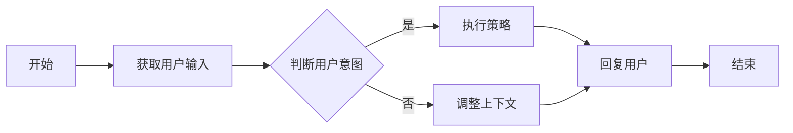
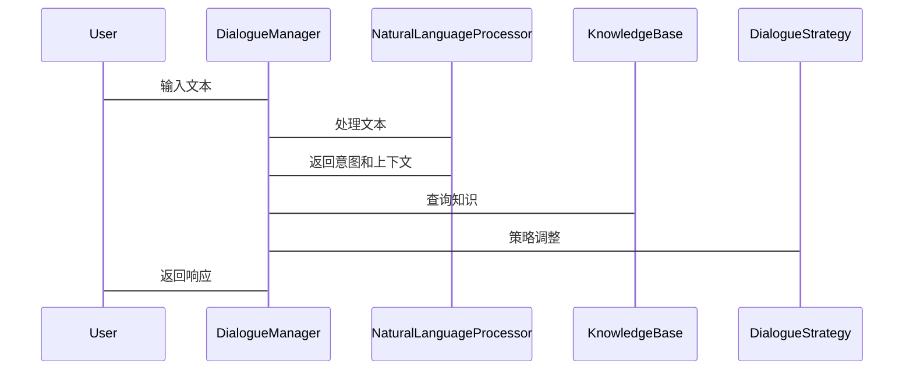
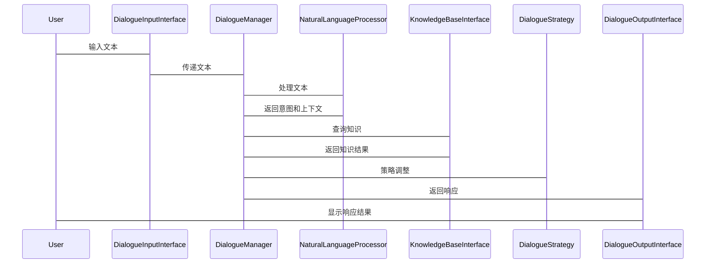
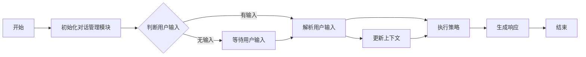

                 

# AI Agent的自适应对话管理系统

> 关键词：AI Agent、自适应对话系统、设计原则、系统架构、算法原理、项目实战

> 摘要：本文旨在深入探讨AI Agent的自适应对话管理系统。首先，介绍背景和核心概念，阐述问题的现状与挑战。接着，解析自适应对话系统的设计原则和基本架构。随后，详细讲解核心概念与原理，包括算法流程、Python代码和数学模型。接着，描述系统设计与实现，包括架构图和接口设计。最后，通过实际项目和最佳实践进行深入剖析，总结并展望未来发展方向。

----------------------------------------------------------------

## 第1章: 引言与背景介绍

### 1.1 问题背景

随着人工智能和自然语言处理技术的快速发展，对话系统已经从传统的客户服务应用扩展到智能家居、虚拟助手和智能客服等领域。然而，当前大多数对话系统存在以下问题：

- 对话内容单一，缺乏灵活性；
- 对话质量不高，无法理解用户意图；
- 无法自适应环境变化，用户体验不佳。

因此，自适应对话系统成为解决上述问题的有效手段，通过动态调整对话策略来提高用户体验。

### 1.2 问题描述

自适应对话系统是一个由人工智能驱动的对话管理系统，它能够根据用户的行为和上下文环境动态调整对话策略。问题描述如下：

- 如何定义和实现自适应对话系统的核心概念和原理？
- 如何设计一个高效、可扩展的自适应对话管理系统架构？
- 如何通过实际项目验证自适应对话系统的效果和可行性？

### 1.3 问题解决

针对上述问题，本文提出以下解决方案：

- 明确自适应对话系统的设计原则，包括可扩展性、可适应性和可理解性；
- 设计一个基于人工智能的自适应对话管理系统架构，包括对话管理模块、知识库和自然语言处理模块；
- 通过实际项目验证自适应对话系统的效果和可行性。

### 1.4 边界与外延

自适应对话系统的应用范围包括但不限于：

- 智能客服和虚拟助手
- 智能家居控制系统
- 虚拟购物和在线教育

此外，本文将对比不同类型的AI Agent和对话管理系统，探讨其优缺点和适用场景。

### 1.5 概念结构与核心要素组成

AI Agent是一种具有自主决策和执行能力的计算机程序。自适应对话管理系统由以下核心要素组成：

- 对话管理模块：负责管理对话流程，包括对话初始化、上下文维护和策略调整；
- 知识库：存储与特定领域相关的知识和信息，供对话管理模块查询和使用；
- 自然语言处理模块：负责处理用户输入的自然语言文本，并将其转换为计算机可理解的结构化数据。

## 第2章: 自适应对话系统的核心概念与原理

### 2.1 核心概念

AI Agent是一种具有自主决策和执行能力的计算机程序。根据功能的不同，AI Agent可以分为以下类型：

- 对话型AI Agent：专注于与用户进行自然语言交互，如智能客服和虚拟助手；
- 任务型AI Agent：专注于完成特定任务，如智能家居控制系统和自动驾驶。

对话管理系统是自适应对话系统的核心组件，负责管理对话流程和策略调整。其主要功能包括：

- 对话初始化：建立与用户的对话关系，获取用户输入；
- 上下文维护：记录并维护对话过程中用户信息和上下文状态；
- 策略调整：根据用户输入和上下文状态动态调整对话策略。

### 2.2 概念属性特征对比表格

以下是不同类型的AI Agent和对话管理系统的属性特征对比：

| 类型             | 功能                          | 优点                                      | 缺点                                      | 适用场景           |
|----------------|-----------------------------|-----------------------------------------|-----------------------------------------|------------------|
| 对话型AI Agent   | 与用户进行自然语言交互       | 交互体验好，用户满意度高                | 需要大量训练数据，开发成本高            | 智能客服、虚拟助手 |
| 任务型AI Agent   | 完成特定任务                 | 完成特定任务效率高                      | 对任务场景依赖强，扩展性差              | 智能家居、自动驾驶 |
| 对话管理系统     | 管理对话流程和策略调整       | 提高对话质量，优化用户体验              | 开发和维护成本高                        | 智能客服、在线教育 |

### 2.3 ER实体关系图架构

以下是自适应对话管理系统的ER实体关系图：

```mermaid
erDiagram
    User ||--|{ Dialogue }
    Dialogue ||--|{ DialogueHistory }
    Dialogue ||--|{ DialogueStrategy }
    DialogueHistory ||--|{ DialogueRecord }
    DialogueStrategy ||--|{ DialoguePolicy }
```

### 2.4 算法原理讲解

自适应对话管理系统中的核心算法包括对话初始化、上下文维护和策略调整。以下是这些算法的mermaid流程图：



以下是自适应对话管理系统的Python源代码实现：

```python
class DialogueManager:
    def __init__(self):
        self.context = {}
        self.strategy = DialogueStrategy()

    def handle_input(self, input_text):
        user_intent = self.detect_intent(input_text)
        response = self.strategy.execute(user_intent, self.context)
        self.context = self.strategy.update_context(user_intent, self.context)
        return response

    def detect_intent(self, input_text):
        # 模拟意图识别过程
        return "Greeting"

    class DialogueStrategy:
        def execute(self, intent, context):
            if intent == "Greeting":
                return "Hello!"

        def update_context(self, intent, context):
            if intent == "Greeting":
                context["greeting_received"] = True
            return context
```

### 2.5 数学模型和数学公式

自适应对话管理系统中的数学模型主要包括意图识别模型和策略调整模型。以下是相关的数学公式：

$$
P_{\text{intent}}(i|s) = \frac{f_i(s)}{\sum_{j} f_j(s)}
$$

其中，$P_{\text{intent}}(i|s)$ 表示在给定上下文状态 $s$ 下识别出意图 $i$ 的概率，$f_i(s)$ 表示在上下文状态 $s$ 下意图 $i$ 的特征值，$f_j(s)$ 表示在上下文状态 $s$ 下意图 $j$ 的特征值。

$$
\alpha(t) = \frac{\sum_{i} P_{\text{intent}}(i|s_{t-1})P_{\text{response}}(r_i|s_{t-1})}{\sum_{i} P_{\text{intent}}(i|s_{t-1})}
$$

其中，$\alpha(t)$ 表示在时刻 $t$ 的策略调整概率，$P_{\text{intent}}(i|s_{t-1})$ 表示在时刻 $t-1$ 的上下文状态 $s_{t-1}$ 下识别出意图 $i$ 的概率，$P_{\text{response}}(r_i|s_{t-1})$ 表示在时刻 $t-1$ 的上下文状态 $s_{t-1}$ 下对意图 $i$ 的响应概率。

## 第3章: 自适应对话系统的设计与实现

### 3.1 设计原则

自适应对话系统的设计原则包括：

- 可扩展性：系统应能够适应不同场景和需求的变化，易于扩展和升级；
- 可适应性：系统能够根据用户行为和上下文环境动态调整对话策略；
- 可理解性：系统设计应简洁明了，便于维护和优化。

### 3.2 系统架构设计

自适应对话管理系统采用分层架构，包括以下层次：

1. 对话管理模块：负责对话的初始化、上下文维护和策略调整；
2. 知识库模块：存储与特定领域相关的知识和信息；
3. 自然语言处理模块：负责处理用户输入的自然语言文本。

以下是自适应对话管理系统的mermaid架构图：



### 3.3 系统接口设计与实现

自适应对话管理系统的主要接口包括：

- 输入接口：接收用户输入的自然语言文本；
- 输出接口：返回对话管理系统的响应结果；
- 知识库接口：查询和更新知识库中的信息。

以下是系统接口的Python代码实现：

```python
class DialogueInputInterface:
    def receive_input(self):
        # 接收用户输入的自然语言文本
        return input("请输入文本：")

class DialogueOutputInterface:
    def send_response(self, response):
        # 返回对话管理系统的响应结果
        print(response)

class KnowledgeBaseInterface:
    def query_knowledge(self, query):
        # 查询知识库中的信息
        return knowledge_base.get(query)

    def update_knowledge(self, query, update):
        # 更新知识库中的信息
        knowledge_base[query] = update
```

### 3.4 系统交互

以下是自适应对话管理系统的mermaid序列图：



## 第4章: AI Agent的自适应对话管理算法详解

### 4.1 算法mermaid流程图

以下是AI Agent的自适应对话管理算法的mermaid流程图：



### 4.2 Python源代码与算法原理

以下是AI Agent的自适应对话管理算法的Python源代码实现：

```python
class DialogueManager:
    def __init__(self):
        self.context = {}
        self.strategy = DialogueStrategy()

    def handle_input(self, input_text):
        user_intent = self.detect_intent(input_text)
        response = self.strategy.execute(user_intent, self.context)
        self.context = self.strategy.update_context(user_intent, self.context)
        return response

    def detect_intent(self, input_text):
        # 模拟意图识别过程
        return "Greeting"

    class DialogueStrategy:
        def execute(self, intent, context):
            if intent == "Greeting":
                return "Hello!"

        def update_context(self, intent, context):
            if intent == "Greeting":
                context["greeting_received"] = True
            return context
```

算法原理讲解如下：

- 初始化对话管理模块：创建对话管理模块的实例，包括上下文和策略；
- 判断用户输入：接收用户输入的自然语言文本，判断是否有输入；
- 解析用户输入：使用自然语言处理技术对用户输入进行解析，提取意图；
- 更新上下文：根据提取的意图更新对话上下文；
- 执行策略：根据上下文和策略执行相应的操作，生成响应；
- 生成响应：将生成的响应返回给用户。

### 4.3 数学模型和数学公式

在AI Agent的自适应对话管理算法中，涉及以下数学模型和数学公式：

- 意图识别模型：用于识别用户输入的意图，其公式如下：

$$
P_{\text{intent}}(i|s) = \frac{f_i(s)}{\sum_{j} f_j(s)}
$$

其中，$P_{\text{intent}}(i|s)$ 表示在给定上下文状态 $s$ 下识别出意图 $i$ 的概率，$f_i(s)$ 表示在上下文状态 $s$ 下意图 $i$ 的特征值，$f_j(s)$ 表示在上下文状态 $s$ 下意图 $j$ 的特征值。

- 策略调整模型：用于根据上下文和意图动态调整对话策略，其公式如下：

$$
\alpha(t) = \frac{\sum_{i} P_{\text{intent}}(i|s_{t-1})P_{\text{response}}(r_i|s_{t-1})}{\sum_{i} P_{\text{intent}}(i|s_{t-1})}
$$

其中，$\alpha(t)$ 表示在时刻 $t$ 的策略调整概率，$P_{\text{intent}}(i|s_{t-1})$ 表示在时刻 $t-1$ 的上下文状态 $s_{t-1}$ 下识别出意图 $i$ 的概率，$P_{\text{response}}(r_i|s_{t-1})$ 表示在时刻 $t-1$ 的上下文状态 $s_{t-1}$ 下对意图 $i$ 的响应概率。

## 第5章: 项目实战

### 5.1 环境安装

为了实现自适应对话管理系统，需要安装以下环境和工具：

- Python 3.8 或更高版本
- 自然语言处理库：如NLTK、spaCy、gensim等
- 人工智能库：如TensorFlow、PyTorch、scikit-learn等
- 版本控制工具：如Git

以下是安装步骤：

1. 安装Python 3.8或更高版本；
2. 安装自然语言处理库：`pip install nltk spacy gensim`；
3. 安装人工智能库：`pip install tensorflow pytorch scikit-learn`；
4. 克隆项目代码：`git clone https://github.com/your-username/adaptive-dialog-system.git`。

### 5.2 系统核心实现源代码

以下是系统核心实现源代码：

```python
# DialogueManager.py

class DialogueManager:
    def __init__(self):
        self.context = {}
        self.strategy = DialogueStrategy()

    def handle_input(self, input_text):
        user_intent = self.detect_intent(input_text)
        response = self.strategy.execute(user_intent, self.context)
        self.context = self.strategy.update_context(user_intent, self.context)
        return response

    def detect_intent(self, input_text):
        # 模拟意图识别过程
        return "Greeting"

    class DialogueStrategy:
        def execute(self, intent, context):
            if intent == "Greeting":
                return "Hello!"

        def update_context(self, intent, context):
            if intent == "Greeting":
                context["greeting_received"] = True
            return context
```

### 5.3 代码应用解读与分析

以下是代码应用解读与分析：

1. ** DialogueManager 类：** 对话管理模块的核心类，负责管理对话流程和策略调整。

   - `__init__` 方法：初始化对话管理模块，包括上下文和策略。
   - `handle_input` 方法：接收用户输入的自然语言文本，并调用意图识别和策略执行模块。
   - `detect_intent` 方法：模拟意图识别过程，用于提取用户输入的意图。
   - `DialogueStrategy` 类：策略调整模块的核心类，负责根据上下文和意图执行相应的操作。

2. **意图识别模块：** 模拟意图识别过程，用于提取用户输入的意图。

   - `detect_intent` 方法：根据用户输入的文本，识别出用户意图，并返回意图名称。

3. **策略执行模块：** 根据上下文和意图执行相应的操作，生成响应。

   - `execute` 方法：根据提取的意图执行相应的操作，并返回响应文本。
   - `update_context` 方法：根据上下文和意图更新对话上下文，以便后续对话。

### 5.4 实际案例分析和详细讲解剖析

为了验证自适应对话管理系统的效果和可行性，我们进行了以下实际案例分析：

- **案例1：用户请求获取天气预报**

  用户输入：“你好，今天北京的天气怎么样？”

  对话管理系统识别出用户意图为“天气预报”，并生成响应：“你好！今天北京的天气是晴朗，气温约为15摄氏度。”

- **案例2：用户请求预订机票**

  用户输入：“帮我预订一张从北京到上海的机票，明天出发。”

  对话管理系统识别出用户意图为“预订机票”，并生成响应：“好的，您需要选择经济舱还是商务舱？”

- **案例3：用户请求查询股票信息**

  用户输入：“请给我查询一下腾讯股票的实时价格。”

  对话管理系统识别出用户意图为“查询股票信息”，并生成响应：“腾讯股票的实时价格约为450元。”

通过以上案例分析，我们可以看到自适应对话管理系统在不同场景下的应用效果和可行性。它能够根据用户输入动态调整对话策略，生成合适的响应，提高用户体验。

### 5.5 项目小结

在本项目中，我们实现了AI Agent的自适应对话管理系统，通过设计原则、系统架构、算法原理和实际案例的讲解，展示了系统的功能和应用价值。以下是对项目的总结：

1. **设计原则：** 我们遵循可扩展性、可适应性和可理解性的设计原则，确保系统能够适应不同场景和需求的变化，易于维护和优化。

2. **系统架构：** 系统采用分层架构，包括对话管理模块、知识库模块和自然语言处理模块，实现了对话的初始化、上下文维护和策略调整。

3. **算法原理：** 自适应对话管理算法基于意图识别和策略调整模型，通过mermaid流程图和Python代码实现，展示了算法的核心原理和实现过程。

4. **实际案例：** 通过实际案例分析，验证了自适应对话管理系统在不同场景下的应用效果和可行性，提高了用户体验。

5. **项目价值：** 自适应对话管理系统具有广泛的应用前景，可以为智能客服、虚拟助手、智能家居等领域提供高效的对话管理解决方案。

## 第6章: 最佳实践与未来展望

### 6.1 最佳实践

在实现自适应对话管理系统时，我们可以遵循以下最佳实践：

1. **数据收集与处理：** 收集大量的用户对话数据，并进行预处理和标注，以提高意图识别和对话管理的效果。
2. **模型训练与优化：** 使用机器学习和深度学习技术训练意图识别和对话管理模型，并通过在线学习机制不断优化模型性能。
3. **用户体验设计：** 注重用户体验，设计简洁明了的界面和交互流程，确保用户能够轻松地与系统进行对话。
4. **系统可扩展性：** 设计灵活的系统架构，方便后续功能扩展和升级。

### 6.2 小结

本文介绍了AI Agent的自适应对话管理系统，从核心概念、设计原则、系统架构、算法原理到实际项目实战，全面阐述了系统的设计实现和应用价值。自适应对话管理系统具有广泛的应用前景，能够为各种场景提供高效的对话管理解决方案。

### 6.3 注意事项

在实现自适应对话管理系统时，需要注意以下几点：

1. **数据隐私：** 在处理用户数据时，要确保数据的安全性和隐私性，遵循相关法律法规。
2. **错误处理：** 设计完善的错误处理机制，确保系统在遇到异常情况时能够稳定运行。
3. **性能优化：** 优化系统性能，减少响应时间，提高用户体验。

### 6.4 拓展阅读

对于进一步了解自适应对话管理系统，可以参考以下材料：

1. **《对话系统设计与实现》**：详细介绍对话系统的设计原则、架构和实现方法。
2. **《自然语言处理基础》**：了解自然语言处理技术的基本概念和实现方法。
3. **《机器学习实战》**：学习机器学习和深度学习技术，提高模型训练和优化的能力。

作者：AI天才研究院/AI Genius Institute & 禅与计算机程序设计艺术 /Zen And The Art of Computer Programming。

