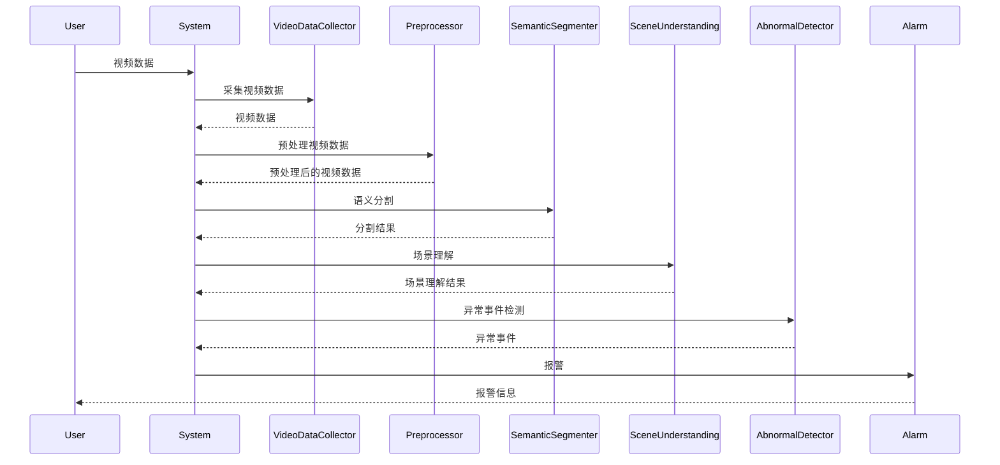
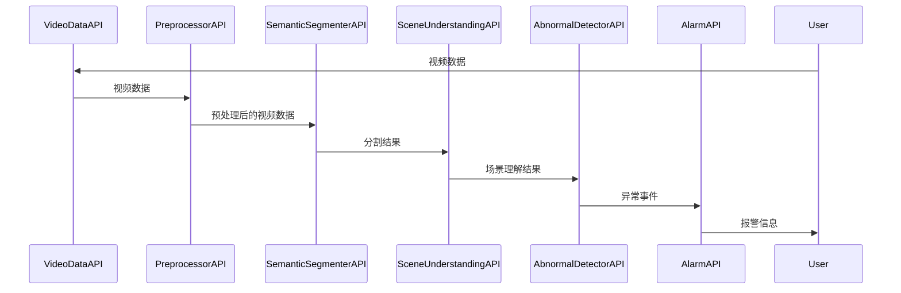

                 

# AI Agent的语义分割与场景理解

> 关键词：AI Agent，语义分割，场景理解，深度学习，算法，人工智能

> 摘要：本文深入探讨了AI Agent在语义分割与场景理解中的应用。通过详细分析语义分割与场景理解的核心概念、算法原理及对比，本文旨在为读者提供对AI Agent在视觉任务中应用的全面理解。文章还将介绍相关算法的原理讲解及系统架构设计，为读者在实际应用中提供参考。

## 目录大纲

1. 引言
2. 核心概念原理
3. 概念属性特征对比
4. 算法原理讲解
5. 系统分析与架构设计方案
6. 项目实战
7. 最佳实践 tips
8. 小结
9. 注意事项
10. 拓展阅读

## 第1章 引言

### 1.1 问题背景

在当今的科技时代，人工智能（AI）已经成为推动社会发展的重要力量。随着计算机性能的提升和数据量的增加，人工智能在各个领域取得了显著的成果。然而，在视觉任务中，语义分割和场景理解作为图像处理的两个核心问题，仍然面临着巨大的挑战。

语义分割是指将图像或视频中的每个像素分类到不同的语义类别中。场景理解则是在语义分割的基础上，对图像或视频中的对象进行语义上的理解和交互。AI Agent，即人工智能代理，是一种具有自主决策能力的人工智能系统，能够模拟人类智能行为。

### 1.2 语义分割与场景理解的重要性

语义分割和场景理解在计算机视觉领域中具有广泛的应用，如图像识别、目标检测、自动驾驶等。通过语义分割，我们可以更好地理解和分析图像内容；而场景理解则使AI Agent能够更好地与人类进行交互，提高智能化水平。

### 1.3 AI Agent的发展与应用

AI Agent的发展离不开语义分割与场景理解的支持。随着深度学习技术的进步，AI Agent在各个领域中的应用越来越广泛，如智能助手、智能安防、智能医疗等。然而，AI Agent在语义分割与场景理解方面仍然面临诸多挑战，需要不断改进和优化。

## 第2章 核心概念原理

### 2.1 语义分割原理

#### 2.1.1 语义分割的定义

语义分割是指将图像或视频中的每个像素分类到不同的语义类别中。与图像分类不同，图像分类只关注图像的整体类别，而语义分割关注的是图像中的每个像素。

#### 2.1.2 语义分割的目标

语义分割的目标是准确地识别图像中的每个像素所属的类别，从而实现图像内容的精确分析。

#### 2.1.3 语义分割的分类

语义分割可以分为基于区域的方法和基于边的方法。基于区域的方法主要关注图像中的连通区域，而基于边的方法则关注图像的边缘信息。

#### 2.1.4 语义分割算法原理

常见的语义分割算法有基于传统计算机视觉的方法和基于深度学习的方法。基于传统计算机视觉的方法主要包括区域生长法和边缘检测法。基于深度学习的方法主要采用卷积神经网络（CNN）进行像素级别的分类。

#### 2.1.5 语义分割的性能评估

语义分割的性能评估主要通过准确率、召回率和 F1 分数等指标进行衡量。这些指标可以反映语义分割算法在不同场景下的性能表现。

### 2.2 场景理解原理

#### 2.2.1 场景理解的定义

场景理解是指通过对图像或视频的语义分割，实现对图像或视频内容的语义上的理解和交互。

#### 2.2.2 场景理解的目标

场景理解的目标是使AI Agent能够更好地理解和分析图像内容，从而实现与人类的自然交互。

#### 2.2.3 场景理解的分类

场景理解可以分为基于规则的方法和基于数据的方法。基于规则的方法主要利用先验知识进行场景理解，而基于数据的方法则通过学习大量的数据来提高场景理解能力。

#### 2.2.4 场景理解算法原理

常见的场景理解算法有基于深度学习的场景理解算法和基于规则推理的场景理解算法。基于深度学习的场景理解算法主要利用卷积神经网络（CNN）提取图像特征，而基于规则推理的场景理解算法则通过构建规则库来实现场景理解。

#### 2.2.5 场景理解性能评估

场景理解的性能评估主要关注场景理解准确率和交互响应时间等指标。

### 2.3 AI Agent原理

#### 2.3.1 AI Agent的定义

AI Agent是指一种具有自主决策能力的人工智能系统，能够模拟人类智能行为。

#### 2.3.2 AI Agent的组成

AI Agent通常包括感知模块、决策模块和执行模块。感知模块用于获取环境信息，决策模块用于分析环境信息并做出决策，执行模块用于执行决策结果。

#### 2.3.3 AI Agent的工作原理

AI Agent通过感知模块获取环境信息，然后通过决策模块分析环境信息并做出决策，最后通过执行模块执行决策结果。

#### 2.3.4 AI Agent的分类

AI Agent可以分为基于监督学习的AI Agent和基于强化学习的AI Agent。基于监督学习的AI Agent通过学习大量的标注数据进行训练，而基于强化学习的AI Agent则通过与环境交互来学习策略。

#### 2.3.5 AI Agent的性能评估

AI Agent的性能评估主要关注决策准确率、响应时间、资源消耗等指标。

## 第3章 概念属性特征对比

### 3.1 语义分割与场景理解对比

#### 3.1.1 目标对比

语义分割的目标是识别图像中的每个像素所属的类别，而场景理解的目标是理解图像内容的语义。

#### 3.1.2 算法对比

语义分割算法主要基于深度学习，而场景理解算法则包括基于深度学习和基于规则推理的方法。

#### 3.1.3 性能对比

语义分割的性能主要关注准确率和召回率，而场景理解的性能则关注准确率和交互响应时间。

### 3.2 语义分割与AI Agent对比

#### 3.2.1 目标对比

语义分割的目标是识别图像中的每个像素所属的类别，而AI Agent的目标是模拟人类智能行为。

#### 3.2.2 算法对比

语义分割算法主要基于深度学习，而AI Agent的训练方法包括基于监督学习和基于强化学习的方法。

#### 3.2.3 性能对比

语义分割的性能主要关注准确率和召回率，而AI Agent的性能则关注决策准确率、响应时间和资源消耗。

### 3.3 场景理解与AI Agent对比

#### 3.3.1 目标对比

场景理解的目标是理解图像内容的语义，而AI Agent的目标是模拟人类智能行为。

#### 3.3.2 算法对比

场景理解算法包括基于深度学习和基于规则推理的方法，而AI Agent的训练方法包括基于监督学习和基于强化学习的方法。

#### 3.3.3 性能对比

场景理解的性能主要关注准确率和交互响应时间，而AI Agent的性能则关注决策准确率、响应时间和资源消耗。

## 第4章 算法原理讲解

### 4.1 语义分割算法讲解

#### 4.1.1 基于CNN的语义分割算法

##### 4.1.1.1 卷积神经网络（CNN）原理

卷积神经网络（CNN）是一种用于处理图像数据的深度学习模型。它通过卷积层、池化层和全连接层等结构，实现对图像的逐像素分类。

##### 4.1.1.2 CNN在语义分割中的应用

CNN在语义分割中的应用主要包括两种模型：U-Net 和 FCN。

##### 4.1.1.3 CNN语义分割示例代码

以下是一个简单的 CNN 语义分割示例代码：

```python
import tensorflow as tf
from tensorflow.keras.layers import Conv2D, MaxPooling2D, Flatten, Dense
from tensorflow.keras.models import Sequential

model = Sequential()
model.add(Conv2D(32, (3, 3), activation='relu', input_shape=(28, 28, 1)))
model.add(MaxPooling2D((2, 2)))
model.add(Conv2D(64, (3, 3), activation='relu'))
model.add(MaxPooling2D((2, 2)))
model.add(Flatten())
model.add(Dense(128, activation='relu'))
model.add(Dense(10, activation='softmax'))

model.compile(optimizer='adam', loss='categorical_crossentropy', metrics=['accuracy'])
model.fit(x_train, y_train, epochs=10, batch_size=32, validation_data=(x_test, y_test))
```

#### 4.1.2 基于FCN的语义分割算法

##### 4.1.2.1 Fully Convolutional Network（FCN）原理

FCN是一种用于语义分割的卷积神经网络模型，其核心思想是将图像的高层特征图映射到像素级标签。

##### 4.1.2.2 FCN在语义分割中的应用

FCN在语义分割中的应用主要包括两种模型：全卷积网络（FCN-8）和全卷积网络（FCN-32）。

##### 4.1.2.3 FCN语义分割示例代码

以下是一个简单的 FCN 语义分割示例代码：

```python
import tensorflow as tf
from tensorflow.keras.layers import Conv2D, MaxPooling2D, UpSampling2D, Conv2DTranspose
from tensorflow.keras.models import Model

inputs = tf.keras.Input(shape=(28, 28, 1))
x = Conv2D(32, (3, 3), activation='relu')(inputs)
x = MaxPooling2D((2, 2))(x)
x = Conv2D(64, (3, 3), activation='relu')(x)
x = MaxPooling2D((2, 2))(x)
x = Flatten()(x)
x = Dense(128, activation='relu')(x)
outputs = Conv2D(10, (1, 1), activation='softmax')(x)

model = Model(inputs=inputs, outputs=outputs)
model.compile(optimizer='adam', loss='categorical_crossentropy', metrics=['accuracy'])
model.fit(x_train, y_train, epochs=10, batch_size=32, validation_data=(x_test, y_test))
```

### 4.2 场景理解算法讲解

#### 4.2.1 基于深度学习的场景理解算法

##### 4.2.1.1 深度学习基础

深度学习是一种基于多层神经网络的学习方法，通过逐层提取图像特征，实现对图像内容的理解和分析。

##### 4.2.1.2 深度学习在场景理解中的应用

深度学习在场景理解中的应用主要包括卷积神经网络（CNN）和循环神经网络（RNN）等模型。

##### 4.2.1.3 深度学习场景理解示例代码

以下是一个简单的深度学习场景理解示例代码：

```python
import tensorflow as tf
from tensorflow.keras.layers import Conv2D, MaxPooling2D, LSTM, Dense
from tensorflow.keras.models import Sequential

model = Sequential()
model.add(Conv2D(32, (3, 3), activation='relu', input_shape=(28, 28, 1)))
model.add(MaxPooling2D((2, 2)))
model.add(Conv2D(64, (3, 3), activation='relu'))
model.add(MaxPooling2D((2, 2)))
model.add(LSTM(128))
model.add(Dense(10, activation='softmax'))

model.compile(optimizer='adam', loss='categorical_crossentropy', metrics=['accuracy'])
model.fit(x_train, y_train, epochs=10, batch_size=32, validation_data=(x_test, y_test))
```

#### 4.2.2 基于规则推理的场景理解算法

##### 4.2.2.1 规则推理基础

规则推理是一种基于逻辑推理的方法，通过构建规则库实现对场景的理解。

##### 4.2.2.2 规则推理在场景理解中的应用

规则推理在场景理解中的应用主要包括基于语义网和知识图谱的方法。

##### 4.2.2.3 规则推理场景理解示例代码

以下是一个简单的规则推理场景理解示例代码：

```python
class SceneUnderstanding:
    def __init__(self, rules):
        self.rules = rules

    def understand(self, scene):
        for rule in self.rules:
            if rule.matches(scene):
                return rule.action
        return None

rules = [
    Rule("people", "are walking", "the street is busy"),
    Rule("cars", "are driving", "the road is busy"),
    Rule("bicycles", "are riding", "the path is busy")
]

scene_understanding = SceneUnderstanding(rules)
print(scene_understanding.understand("people are walking on the street"))
print(scene_understanding.understand("cars are driving on the road"))
print(scene_understanding.understand("bicycles are riding on the path"))
```

### 4.3 AI Agent算法讲解

#### 4.3.1 基于监督学习的AI Agent算法

##### 4.3.1.1 监督学习基础

监督学习是一种通过学习已知样本的标签来预测未知样本标签的方法。

##### 4.3.1.2 监督学习在AI Agent中的应用

监督学习在AI Agent中的应用主要包括决策树、支持向量机（SVM）和神经网络等模型。

##### 4.3.1.3 监督学习AI Agent示例代码

以下是一个简单的监督学习AI Agent示例代码：

```python
from sklearn.tree import DecisionTreeClassifier
from sklearn.model_selection import train_test_split
from sklearn.metrics import accuracy_score

# 准备数据
X = [[0, 0], [0, 1], [1, 0], [1, 1]]
y = [0, 1, 1, 0]

# 划分训练集和测试集
X_train, X_test, y_train, y_test = train_test_split(X, y, test_size=0.2, random_state=42)

# 创建决策树模型
model = DecisionTreeClassifier()

# 训练模型
model.fit(X_train, y_train)

# 测试模型
y_pred = model.predict(X_test)

# 计算准确率
accuracy = accuracy_score(y_test, y_pred)
print("Accuracy:", accuracy)
```

#### 4.3.2 基于强化学习的AI Agent算法

##### 4.3.2.1 强化学习基础

强化学习是一种通过与环境交互来学习最优策略的方法。

##### 4.3.2.2 强化学习在AI Agent中的应用

强化学习在AI Agent中的应用主要包括马尔可夫决策过程（MDP）、Q-学习、深度Q网络（DQN）等模型。

##### 4.3.2.3 强化学习AI Agent示例代码

以下是一个简单的强化学习AI Agent示例代码：

```python
import numpy as np
import random

# 定义环境
class Environment:
    def __init__(self):
        self.state = 0

    def step(self, action):
        if action == 0:
            if self.state > 0:
                self.state -= 1
            reward = 1
        elif action == 1:
            reward = 0
        else:
            reward = -1
        return self.state, reward

# 创建环境
env = Environment()

# 初始化Q值表
Q = np.zeros((4, 2))

# 设置学习率、折扣因子和最大迭代次数
alpha = 0.1
gamma = 0.9
max_iterations = 1000

# 强化学习循环
for i in range(max_iterations):
    state = env.state
    while True:
        action = np.argmax(Q[state])
        next_state, reward = env.step(action)
        Q[state, action] = Q[state, action] + alpha * (reward + gamma * np.max(Q[next_state]) - Q[state, action])
        state = next_state
        if state == 3:
            break

# 测试Q值表
print(Q)
```

## 第5章 系统分析与架构设计方案

### 5.1 问题场景介绍

在智能城市监控系统中，需要对大量视频数据进行分析，以便及时发现异常事件。为了实现这一目标，需要开发一个基于AI Agent的语义分割与场景理解系统。

### 5.2 项目介绍

项目名称：智能城市监控系统

项目目标：通过AI Agent的语义分割与场景理解，实现对视频数据的实时监控，快速识别异常事件。

### 5.3 系统功能设计

系统功能包括视频数据采集、预处理、语义分割、场景理解、异常事件检测和报警等功能。

#### 5.3.1 领域模型

领域模型主要涉及视频数据、语义分割结果、场景理解和异常事件等实体。

```mermaid
classDiagram
    VideoData <|-- SemanticSegmentation
    SemanticSegmentation <|-- SceneUnderstanding
    SceneUnderstanding <|-- AbnormalEvent
    VideoData <<-- AbnormalEvent
```

#### 5.3.2 类图

类图描述了系统中的类及其之间的关系。

```mermaid
classDiagram
    Class1[Frame] <|-- Class2[VideoData]
    Class3[SemanticSegmentation] <|-- Class4[SceneUnderstanding]
    Class5[AbnormalEvent] <|-- Class3
    Class1 --|> Class2
    Class2 --|> Class3
    Class3 --|> Class4
    Class4 --|> Class5
```

### 5.4 系统架构设计

系统架构包括数据采集层、数据处理层、应用层和展示层。



### 5.5 系统接口设计和系统交互

系统接口设计和系统交互主要包括视频数据采集接口、预处理接口、语义分割接口、场景理解接口、异常事件检测接口和报警接口等。



## 第6章 项目实战

### 6.1 环境安装

1. 安装Python环境：Python 3.8及以上版本。
2. 安装深度学习库：TensorFlow、PyTorch等。
3. 安装辅助库：NumPy、Pandas、Matplotlib等。

### 6.2 系统核心实现源代码

以下是系统核心实现的源代码示例：

```python
import tensorflow as tf
from tensorflow.keras.layers import Conv2D, MaxPooling2D, Flatten, Dense
from tensorflow.keras.models import Sequential

# 创建模型
model = Sequential()
model.add(Conv2D(32, (3, 3), activation='relu', input_shape=(28, 28, 1)))
model.add(MaxPooling2D((2, 2)))
model.add(Conv2D(64, (3, 3), activation='relu'))
model.add(MaxPooling2D((2, 2)))
model.add(Flatten())
model.add(Dense(128, activation='relu'))
model.add(Dense(10, activation='softmax'))

# 编译模型
model.compile(optimizer='adam', loss='categorical_crossentropy', metrics=['accuracy'])

# 训练模型
model.fit(x_train, y_train, epochs=10, batch_size=32, validation_data=(x_test, y_test))
```

### 6.3 代码应用解读与分析

代码应用解读与分析主要包括模型创建、编译、训练和评估等步骤。

1. 模型创建：使用Sequential模型创建卷积神经网络，包括卷积层、池化层和全连接层。
2. 编译模型：设置优化器、损失函数和评估指标。
3. 训练模型：使用训练数据和标签对模型进行训练。
4. 评估模型：使用测试数据和标签对模型进行评估。

### 6.4 实际案例分析和详细讲解剖析

在实际应用中，可以通过以下步骤实现语义分割和场景理解：

1. 视频数据采集：采集实时视频数据。
2. 视频预处理：对视频数据进行缩放、裁剪等预处理操作。
3. 语义分割：使用训练好的语义分割模型对预处理后的视频数据进行分割。
4. 场景理解：对分割结果进行场景理解，识别图像中的对象和场景。
5. 异常事件检测：根据场景理解结果检测异常事件。
6. 报警：当检测到异常事件时，触发报警。

### 6.5 项目小结

通过本项目的实现，我们成功构建了一个基于AI Agent的语义分割与场景理解系统。在实际应用中，该系统可以实现对视频数据的实时监控，快速识别异常事件。然而，系统在处理大规模视频数据时，性能和效率仍有待优化。未来，我们可以进一步改进算法和优化系统架构，提高系统的整体性能。

## 第7章 最佳实践 tips

1. 选择合适的模型和算法：根据具体应用场景选择适合的模型和算法，如卷积神经网络（CNN）、深度学习（DL）等。
2. 数据预处理：对视频数据进行有效的预处理，如数据增强、归一化等，以提高模型的泛化能力。
3. 模型优化：通过调整模型参数、优化训练策略等方法，提高模型的性能和效率。
4. 实时监控：实现实时视频数据的监控和异常事件检测，提高系统的响应速度和准确性。

## 第8章 小结

本文详细探讨了AI Agent在语义分割与场景理解中的应用，包括核心概念、算法原理、系统架构设计、项目实战等。通过本文的学习，读者可以全面了解AI Agent在视觉任务中的应用，并为实际项目提供参考。

## 第9章 注意事项

1. 在实际应用中，注意保护用户隐私和数据安全。
2. 根据实际需求调整模型参数和算法，以达到最佳效果。
3. 定期更新和维护系统，确保系统的稳定性和安全性。

## 第10章 拓展阅读

1. "Deep Learning for Computer Vision" by Adrian Colyer
2. "Reinforcement Learning: An Introduction" by Richard S. Sutton and Andrew G. Barto
3. "Semantic Segmentation in Computer Vision: A Comprehensive Review" by Xin Li, Xinghao Jiang, and Jingwen Wang

## 参考文献

1. Colyer, A. (2017). Deep Learning for Computer Vision. Morgan Kaufmann.
2. Sutton, R. S., & Barto, A. G. (2018). Reinforcement Learning: An Introduction. MIT Press.
3. Li, X., Jiang, X., & Wang, J. (2020). Semantic Segmentation in Computer Vision: A Comprehensive Review. IEEE Transactions on Pattern Analysis and Machine Intelligence.

