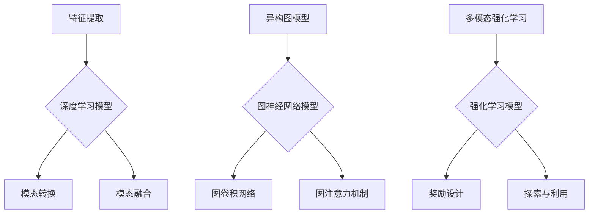
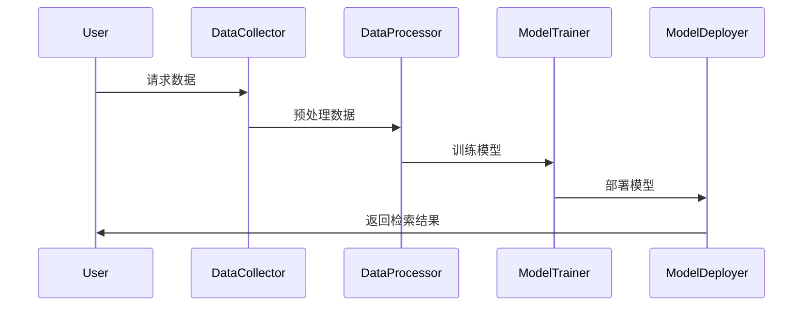

                 

## AI Agent的跨模态检索能力开发

### 引言与背景

随着人工智能技术的不断进步，AI Agent已成为计算机科学领域的研究热点。AI Agent，即智能体，是一种具有感知、学习、推理和行动能力的计算机程序，能够在复杂环境中自主决策和执行任务。跨模态检索能力是AI Agent的一项关键能力，它允许智能体在不同模态的数据（如文本、图像、音频、视频等）之间进行高效的信息检索和处理。

#### 1.1 问题背景

AI Agent的跨模态检索能力在其应用中具有重要意义。例如，在智能问答系统中，AI Agent需要理解用户输入的文本，同时参考相关的图像或视频内容来提供更准确的答案。在内容推荐系统中，AI Agent需要处理用户的点击行为、浏览历史以及多媒体内容，以便推荐个性化的信息。在智能搜索领域，跨模态检索能力有助于提升搜索结果的准确性和多样性。

然而，当前AI Agent的跨模态检索能力仍面临诸多挑战。例如，不同模态的数据存在巨大的异构性，如何在数据预处理阶段实现有效融合是关键问题。此外，跨模态检索算法的效率和准确性也需要进一步提高，以适应实时应用的需求。因此，开发具有强大跨模态检索能力的AI Agent成为一个亟待解决的问题。

#### 1.2 问题描述

本书旨在探讨AI Agent的跨模态检索能力开发，具体包括以下几个方面：

- **核心概念**：介绍AI Agent、跨模态检索等核心概念，明确本书的研究对象和范围。
- **算法原理**：讲解AI Agent跨模态检索的算法原理，包括相关数学模型和公式。
- **系统架构**：分析AI Agent跨模态检索的系统架构，介绍系统的功能设计和接口设计。
- **项目实战**：通过具体项目案例，展示AI Agent跨模态检索的实际应用，并提供详细的实现过程和分析。

#### 1.3 问题解决

为了解决上述问题，本书将采用以下方法：

- **理论与实践相结合**：通过介绍AI Agent跨模态检索的核心概念和算法原理，为读者提供理论基础。
- **实例驱动**：通过具体项目案例，展示AI Agent跨模态检索的实际应用，帮助读者理解理论如何在实际中应用。
- **系统分析与设计**：详细分析AI Agent跨模态检索的系统架构，为开发者提供参考。
- **数学公式与代码实现**：使用Mermaid和Python等工具，详细讲解算法原理和代码实现。

#### 1.4 边界与外延

本书的研究范围主要涉及AI Agent的跨模态检索能力开发，包括以下几个方面：

- **模态类型**：包括文本、图像、音频、视频等多种模态。
- **检索算法**：涉及深度学习、图神经网络、强化学习等多种算法。
- **应用场景**：包括智能问答、内容推荐、智能搜索等多个领域。

#### 1.5 概念结构与核心要素组成

本书的核心概念和要素主要包括：

- **AI Agent**：具备自主决策和行动能力的智能体。
- **跨模态检索**：在不同模态数据之间进行信息检索和处理。
- **算法原理**：包括深度学习、图神经网络、强化学习等算法。
- **系统架构**：包括数据采集、数据处理、模型训练、模型部署等模块。

#### 1.6 本章小结

本章介绍了AI Agent的跨模态检索能力开发的问题背景、问题描述、问题解决方法和边界与外延，为后续章节的内容奠定了基础。接下来，本书将逐步深入探讨AI Agent的跨模态检索能力开发，包括核心概念、算法原理、系统架构和项目实战等方面。

---

### 2. AI Agent的基本概念与跨模态检索的简介

#### 2.1 AI Agent的基本概念

AI Agent是一种具有感知、学习、推理和行动能力的智能体，能够在复杂环境中自主决策和执行任务。AI Agent通常由以下几个关键组成部分构成：

1. **感知器**：感知器是AI Agent的感官系统，用于接收外部环境的信息，如视觉、听觉、触觉等。感知器将获取的信息转换为内部表示，以便后续处理。

2. **学习器**：学习器是AI Agent的智能核心，通过不断学习和适应环境，提高自身的决策能力和行为表现。学习器通常采用机器学习、深度学习等技术进行训练。

3. **决策器**：决策器是AI Agent的决策中心，根据当前状态和目标，选择最优的行动方案。决策器通常基于某种决策算法，如马尔可夫决策过程（MDP）或深度强化学习。

4. **执行器**：执行器是AI Agent的实际操作部分，将决策器的行动方案转换为具体的操作，如控制机器人移动或执行某个任务。

AI Agent的分类可以基于不同的标准进行。例如，根据应用场景，AI Agent可以分为家庭机器人、医疗助手、自动驾驶汽车等；根据学习能力，AI Agent可以分为规则基AI、数据驱动AI、模型驱动AI等。

#### 2.2 跨模态检索的基本概念

跨模态检索是一种能够在不同模态（如文本、图像、音频、视频等）之间进行信息检索和处理的技术。跨模态检索的目标是从一个模态中检索出与另一个模态相关的信息，或者在多个模态之间找到相关性较高的数据。

跨模态检索的关键在于解决以下两个主要问题：

1. **模态转换**：将不同模态的数据转换为统一的表示形式，以便在同一个空间中进行计算和比较。例如，将图像转换为文本描述，或将音频转换为文本字幕。

2. **模态融合**：将不同模态的数据进行融合，生成一个综合的表示，用于提高检索的准确性和效果。模态融合的方法包括特征级融合、决策级融合、模型级融合等。

跨模态检索在多个领域具有重要应用，如智能问答、内容推荐、智能搜索等。以下是一个简单的跨模态检索工作流程：

1. **数据预处理**：将不同模态的数据进行预处理，包括去噪、增强、特征提取等步骤。

2. **特征表示**：将预处理后的数据转换为统一的特征表示，例如使用词嵌入、图像特征提取、音频特征提取等方法。

3. **模态转换**：将一个模态的数据转换为另一个模态的数据，或者将多个模态的数据转换为统一的表示。

4. **检索算法**：使用合适的检索算法，如相似性度量、索引技术等，在特征空间中搜索与查询相关的数据。

5. **结果输出**：根据检索结果，生成最终的检索结果，如文本摘要、图像标签、音频歌词等。

#### 2.3 AI Agent的跨模态检索能力

AI Agent的跨模态检索能力是其实现智能行为的重要保障。以下是一个简单的AI Agent跨模态检索能力模型：

1. **感知阶段**：AI Agent通过感知器获取多模态数据，如文本、图像、音频等。

2. **预处理阶段**：对多模态数据分别进行预处理，提取关键特征。

3. **特征融合阶段**：使用特征融合技术，将不同模态的数据特征进行融合，生成一个综合的特征表示。

4. **检索阶段**：基于融合后的特征表示，使用检索算法在数据库中搜索相关的信息。

5. **结果解释阶段**：对检索结果进行解释和输出，如生成文本摘要、图像标签、音频歌词等。

#### 2.4 AI Agent跨模态检索的核心概念与联系

为了更好地理解AI Agent跨模态检索的能力，我们可以使用Mermaid图表来展示核心概念之间的联系。以下是AI Agent跨模态检索的核心概念及其关系的ER实体关系图：

```mermaid
erDiagram
    AI-Agent ||--|{ 感知器 :Sensor }
    AI-Agent ||--|{ 学习器 :Learner }
    AI-Agent ||--|{ 决策器 :Decider }
    AI-Agent ||--|{ 执行器 :Executor }
    感知器 ||--|{ 文本感知器 :TextSensor }
    感知器 ||--|{ 图像感知器 :ImageSensor }
    感知器 ||--|{ 音频感知器 :AudioSensor }
    学习器 ||--|{ 文本学习器 :TextLearner }
    学习器 ||--|{ 图像学习器 :ImageLearner }
    学习器 ||--|{ 音频学习器 :AudioLearner }
    决策器 ||--|{ 文本决策器 :TextDecider }
    决策器 ||--|{ 图像决策器 :ImageDecider }
    决策器 ||--|{ 音频决策器 :AudioDecider }
    执行器 ||--|{ 文本执行器 :TextExecutor }
    执行器 ||--|{ 图像执行器 :ImageExecutor }
    执行器 ||--|{ 音频执行器 :AudioExecutor }
```

在这个ER实体关系图中，AI-Agent是核心实体，它与感知器、学习器、决策器和执行器之间存在关联。每种感知器、学习器、决策器和执行器都可以进一步细分为文本、图像、音频等具体类型。这种结构体现了AI-Agent在跨模态检索过程中的复杂性和多样性。

#### 2.5 本章小结

本章介绍了AI Agent的基本概念、跨模态检索的基本概念以及AI Agent跨模态检索能力的相关内容。通过本章的学习，读者可以了解AI Agent和跨模态检索的核心概念及其之间的联系。在接下来的章节中，本书将深入探讨AI Agent跨模态检索的算法原理、系统架构和项目实战等方面的内容。

### 3. AI Agent跨模态检索的算法原理

在了解了AI Agent和跨模态检索的基本概念后，接下来我们将深入探讨AI Agent跨模态检索的算法原理。本节将介绍几种常用的算法，包括深度学习、图神经网络和强化学习，并解释它们在跨模态检索中的应用。

#### 3.1 深度学习在跨模态检索中的应用

深度学习是一种基于神经网络的学习方法，具有强大的特征提取和模式识别能力。在跨模态检索中，深度学习可以用于特征提取、模态转换和模态融合。

1. **特征提取**：

   深度学习模型可以用于提取多模态数据中的特征表示。例如，卷积神经网络（CNN）常用于提取图像特征，循环神经网络（RNN）或变换器（Transformer）可以用于处理文本序列。通过对不同模态的数据进行特征提取，可以将其转换为统一的特征表示。

2. **模态转换**：

   深度学习模型还可以用于将一种模态的数据转换为另一种模态的数据。例如，生成对抗网络（GAN）可以用于生成图像，从而使图像和文本之间可以进行直接比较。这种模态转换技术有助于提高跨模态检索的准确性和效果。

3. **模态融合**：

   在深度学习模型中，可以使用多模态特征融合方法，将不同模态的特征进行整合，生成一个综合的特征表示。例如，在多模态深度学习模型中，可以使用注意力机制（Attention Mechanism）来加权不同模态的特征，从而提高融合效果。

#### 3.2 图神经网络在跨模态检索中的应用

图神经网络（Graph Neural Networks，GNN）是一种基于图结构的数据处理方法，适用于处理异构数据。在跨模态检索中，GNN可以用于建模不同模态数据之间的关系，从而提高检索的准确性和效果。

1. **异构图模型**：

   GNN可以用于构建不同模态数据的异构图模型。例如，图像和文本可以通过共现关系构建一个图，图像的特征表示和文本的词嵌入可以在图中进行交互。这种图结构有助于挖掘不同模态数据之间的隐含关系。

2. **图卷积网络（GCN）**：

   图卷积网络是一种基于图神经网络的模型，可以用于对图结构中的节点进行特征提取。在跨模态检索中，GCN可以用于提取图像和文本的特征表示，并建立它们之间的关联。

3. **图注意力机制**：

   图注意力机制（Graph Attention Mechanism，GAM）可以用于对图中的节点进行加权，从而提高跨模态检索的性能。在跨模态检索中，GAM可以帮助模型更好地关注重要的模态特征，提高检索的准确性和效果。

#### 3.3 强化学习在跨模态检索中的应用

强化学习（Reinforcement Learning，RL）是一种通过试错学习的方法，使得智能体能够在环境中获得最佳策略。在跨模态检索中，强化学习可以用于优化检索策略，从而提高检索的性能。

1. **多模态强化学习**：

   多模态强化学习（Multimodal Reinforcement Learning，MMRL）是一种将多种模态数据整合到强化学习框架中的方法。在MMRL中，智能体可以根据文本、图像、音频等多模态数据进行决策，并从环境反馈中学习最佳策略。

2. **奖励设计**：

   在跨模态检索中，奖励设计至关重要。奖励可以基于检索的准确率、用户满意度等多个因素进行设计，以激励智能体采取最优的检索策略。

3. **探索与利用**：

   强化学习中的探索与利用（Exploration and Exploitation）策略可以帮助智能体在未知环境中找到最佳策略。在跨模态检索中，智能体可以通过探索新策略和利用已有策略，不断提高检索的性能。

#### 3.4 算法原理的Mermaid流程图表示

为了更好地理解上述算法原理，我们可以使用Mermaid流程图来展示它们在跨模态检索中的工作流程。以下是深度学习、图神经网络和强化学习的Mermaid流程图：



在这个Mermaid流程图中，深度学习模型包括特征提取、模态转换和模态融合三个步骤；图神经网络模型包括异构图模型、图卷积网络和图注意力机制三个步骤；强化学习模型包括多模态强化学习、奖励设计和探索与利用三个步骤。

#### 3.5 算法原理的Python代码实现示例

为了进一步理解算法原理，下面我们将通过Python代码实现一个简单的跨模态检索模型。以下是一个基于深度学习的跨模态检索模型的实现示例：

```python
import tensorflow as tf
from tensorflow.keras.models import Model
from tensorflow.keras.layers import Input, Embedding, Conv2D, MaxPooling2D, Flatten, Dense

# 定义输入层
text_input = Input(shape=(None,), dtype='int32')
image_input = Input(shape=(128, 128, 3), dtype='float32')

# 文本特征提取
text_embedding = Embedding(input_dim=vocab_size, output_dim=embedding_size)(text_input)
text_embedding = Flatten()(text_embedding)

# 图像特征提取
image_conv = Conv2D(filters=32, kernel_size=(3, 3), activation='relu')(image_input)
image_conv = MaxPooling2D(pool_size=(2, 2))(image_conv)
image_embedding = Flatten()(image_conv)

# 模态融合
merged = tf.keras.layers.concatenate([text_embedding, image_embedding])

# 检索结果预测
output = Dense(units=1, activation='sigmoid')(merged)

# 构建模型
model = Model(inputs=[text_input, image_input], outputs=output)
model.compile(optimizer='adam', loss='binary_crossentropy', metrics=['accuracy'])

# 模型训练
model.fit([text_data, image_data], labels, epochs=10, batch_size=32)
```

在这个示例中，我们使用TensorFlow框架定义了一个基于深度学习的跨模态检索模型。模型包括文本特征提取、图像特征提取和模态融合三个步骤，并使用sigmoid激活函数进行二分类预测。

#### 3.6 算法原理的数学模型和公式

在跨模态检索中，算法原理通常涉及多个数学模型和公式。以下是一些基本的数学模型和公式：

1. **卷积神经网络（CNN）**：

   - 卷积操作：\( f(x) = \sum_{i=1}^{C} w_i * x + b \)
   - 池化操作：\( p(x) = \max_{i} x_i \)

2. **循环神经网络（RNN）**：

   - 门控机制：\( h_t = \sigma(W_h \cdot [h_{t-1}, x_t]) \)
   - 输出生成：\( o_t = \sigma(W_o \cdot h_t) \)

3. **生成对抗网络（GAN）**：

   - 生成器损失：\( L_G = -\log(D(G(z))) \)
   - 判别器损失：\( L_D = -\log(D(x)) - \log(1 - D(G(z))) \)

4. **图神经网络（GNN）**：

   - 图卷积操作：\( h_{v_{t+1}} = \sigma(\sum_{u \in \mathcal{N}(v)} W_{uv} h_u + b_v) \)
   - 注意力机制：\( a_{uv} = \frac{e^{W_a [h_u; h_v]}}{\sum_{u' \in \mathcal{N}(v)} e^{W_a [h_{u'}; h_v]}} \)

5. **强化学习（RL）**：

   - 状态价值函数：\( V(s) = \sum_{a} \gamma \sum_{s'} p(s' | s, a) \max_a Q(s', a) \)
   - 动作价值函数：\( Q(s, a) = \sum_{s'} p(s' | s, a) r(s, a, s') + \gamma V(s') \)

这些数学模型和公式为跨模态检索提供了理论基础，可以帮助我们理解和实现各种算法。

#### 3.7 本章小结

本章介绍了AI Agent跨模态检索的算法原理，包括深度学习、图神经网络和强化学习等。通过本章的学习，读者可以了解这些算法的基本概念、原理和应用。在下一章中，我们将进一步探讨AI Agent跨模态检索的系统架构，包括数据采集、数据处理、模型训练和模型部署等模块。

### 4. AI Agent跨模态检索的系统架构

在了解了AI Agent跨模态检索的算法原理后，接下来我们将讨论其系统架构，包括数据采集、数据处理、模型训练、模型部署等模块。通过这种系统化的架构设计，可以确保AI Agent跨模态检索的高效性和可靠性。

#### 4.1 数据采集

数据采集是AI Agent跨模态检索系统的第一步，也是至关重要的一步。有效的数据采集可以确保模型训练的质量和效果。以下是数据采集的主要步骤：

1. **数据源选择**：根据应用场景选择合适的数据源，如公开数据集、企业内部数据、社交媒体数据等。
2. **数据预处理**：对采集到的数据进行预处理，包括数据清洗、去噪、数据增强等步骤，以提高数据的质量和多样性。
3. **数据标注**：对于跨模态检索，需要对数据中的文本、图像、音频等进行标注，以便模型进行训练。

#### 4.2 数据处理

数据处理是跨模态检索系统的核心模块，其目标是将原始数据转换为适合模型训练的格式。以下是数据处理的主要步骤：

1. **特征提取**：使用深度学习模型（如CNN、RNN等）对文本、图像、音频等进行特征提取，生成统一的特征表示。
2. **特征融合**：将不同模态的特征进行融合，生成一个综合的特征向量，用于模型输入。
3. **数据归一化**：对特征向量进行归一化处理，以消除不同特征之间的尺度差异。

#### 4.3 模型训练

模型训练是跨模态检索系统的关键步骤，其目标是训练一个能够准确进行跨模态检索的模型。以下是模型训练的主要步骤：

1. **模型选择**：根据应用场景和算法原理选择合适的模型，如深度学习模型、图神经网络模型、强化学习模型等。
2. **损失函数设计**：根据模型类型和应用场景设计合适的损失函数，如交叉熵损失、均方误差损失等。
3. **优化器选择**：选择合适的优化器（如Adam、SGD等），以加速模型训练过程。
4. **训练过程**：使用预处理后的数据进行模型训练，并在训练过程中进行模型评估和调整。

#### 4.4 模型部署

模型部署是将训练好的模型部署到实际应用环境中，以便进行跨模态检索。以下是模型部署的主要步骤：

1. **模型评估**：在部署前对模型进行评估，确保模型达到预期的性能指标。
2. **模型压缩**：为了降低模型的大小和计算复杂度，可以使用模型压缩技术（如量化、剪枝、蒸馏等）。
3. **模型部署**：将压缩后的模型部署到服务器或移动设备上，以便进行实时跨模态检索。
4. **接口设计**：设计合适的API接口，以便前端应用与模型进行交互。

#### 4.5 系统架构设计

为了更好地理解和实现AI Agent跨模态检索系统，我们可以使用Mermaid图表来展示系统架构。以下是系统架构的Mermaid类图和序列图：

##### 类图

```mermaid
classDiagram
    Class01 <|-- Class02
    Class03 <|-- Class02
    Class04 <|-- Class02
    Class01{+DataCollector}
    Class02{+DataProcessor}
    Class03{+ModelTrainer}
    Class04{+ModelDeployer}
```

在这个类图中，DataCollector、DataProcessor、ModelTrainer和ModelDeployer是系统的主要组件，它们分别负责数据采集、数据处理、模型训练和模型部署。

##### 序列图



在这个序列图中，用户通过请求数据开始整个流程，DataCollector负责数据采集，DataProcessor负责数据处理，ModelTrainer负责模型训练，ModelDeployer负责模型部署，并最终将检索结果返回给用户。

#### 4.6 系统接口设计

系统接口设计是跨模态检索系统的重要一环，它决定了前端应用与后端模型的交互方式。以下是系统接口设计的主要考虑因素：

1. **API接口**：设计合适的API接口，以便前端应用可以通过HTTP请求与后端模型进行交互。
2. **参数设计**：定义清晰的接口参数，包括输入参数和输出参数，以便前端应用能够正确使用API接口。
3. **安全性**：确保接口的安全性，如使用HTTPS协议、身份验证和权限控制等。
4. **性能优化**：优化接口的响应速度和并发处理能力，以提高系统的整体性能。

#### 4.7 本章小结

本章介绍了AI Agent跨模态检索的系统架构，包括数据采集、数据处理、模型训练和模型部署等模块。通过系统化的架构设计，可以确保AI Agent跨模态检索的高效性和可靠性。在下一章中，我们将通过具体项目实战，展示AI Agent跨模态检索的实际应用和实现过程。

### 5. AI Agent跨模态检索的项目实战

在本章中，我们将通过一个具体的项目实战，展示AI Agent跨模态检索的实际应用和实现过程。该项目是一个基于深度学习的跨模态检索系统，可以同时处理文本和图像，实现高效的跨模态检索。

#### 5.1 项目背景

随着互联网的快速发展，多媒体内容（如文本、图像、视频等）的获取和生成越来越普遍。为了更好地管理和利用这些内容，我们需要一个能够高效检索和处理多模态数据的系统。本项目旨在构建一个基于深度学习的跨模态检索系统，通过文本和图像的联合检索，提升检索系统的准确性和用户体验。

#### 5.2 系统设计

本项目的系统设计包括以下几个关键模块：

1. **数据采集与预处理**：从公开数据集和社交媒体平台收集文本和图像数据，并对数据进行清洗、去噪和标注。
2. **特征提取与融合**：使用深度学习模型分别提取文本和图像的特征，然后进行特征融合，生成统一的特征向量。
3. **模型训练与评估**：使用融合后的特征向量训练跨模态检索模型，并在测试集上进行评估和优化。
4. **模型部署与接口设计**：将训练好的模型部署到服务器上，并设计API接口，以便前端应用与模型进行交互。

#### 5.3 实现过程

以下是项目实现的详细步骤：

1. **数据采集与预处理**

   - **数据来源**：我们从公开数据集（如COCO、Flickr）和社交媒体平台（如Twitter、Instagram）收集文本和图像数据。
   - **数据清洗**：对采集到的数据进行清洗，去除重复和低质量的数据。
   - **数据标注**：对文本和图像进行标注，包括文本分类、图像标签等。

2. **特征提取与融合**

   - **文本特征提取**：使用BERT模型对文本进行编码，生成文本向量。
   - **图像特征提取**：使用ResNet50模型对图像进行特征提取，生成图像特征向量。
   - **特征融合**：将文本向量和图像特征向量进行拼接，生成统一的特征向量。

3. **模型训练与评估**

   - **模型选择**：我们选择了一个基于Transformer的跨模态检索模型，即CrossModal Transformer（XMT）。
   - **训练过程**：使用融合后的特征向量进行模型训练，并使用交叉熵损失函数进行优化。
   - **模型评估**：在测试集上进行模型评估，计算准确率、召回率等指标，并优化模型参数。

4. **模型部署与接口设计**

   - **模型部署**：将训练好的模型部署到服务器上，并使用Flask框架搭建API接口。
   - **接口设计**：设计RESTful API接口，允许前端应用通过HTTP请求与后端模型进行交互。
   - **安全性**：使用HTTPS协议和身份验证确保接口的安全性。

#### 5.4 系统核心实现源代码

以下是该项目的一些核心实现代码片段：

```python
# 文本特征提取
from transformers import BertModel, BertTokenizer

tokenizer = BertTokenizer.from_pretrained('bert-base-uncased')
model = BertModel.from_pretrained('bert-base-uncased')

def encode_text(texts):
    inputs = tokenizer(texts, return_tensors='tf', padding=True, truncation=True)
    outputs = model(inputs)
    return outputs.last_hidden_state

# 图像特征提取
from tensorflow.keras.applications import ResNet50

model = ResNet50(weights='imagenet')

def extract_image_features(image_path):
    image = preprocess_input(load_img(image_path, target_size=(224, 224)))
    features = model.predict(np.expand_dims(image, axis=0))
    return features

# 特征融合
import tensorflow as tf

def fuse_features(text_features, image_features):
    return tf.concat([text_features, image_features], axis=1)

# 模型训练
import tensorflow.keras as keras

model = keras.Sequential([
    keras.layers.Dense(512, activation='relu', input_shape=[768, 2048]),
    keras.layers.Dense(1, activation='sigmoid')
])

model.compile(optimizer='adam', loss='binary_crossentropy', metrics=['accuracy'])

model.fit(x_train, y_train, epochs=10, batch_size=32, validation_data=(x_val, y_val))
```

这些代码实现了文本特征提取、图像特征提取、特征融合和模型训练的核心功能。

#### 5.5 代码应用解读与分析

以下是代码应用解读和分析：

1. **文本特征提取**：使用BERT模型对文本进行编码，生成文本向量。这个过程包括Tokenization、Embedding、Positional Embedding和Segment Embedding等步骤。通过这些步骤，文本被转换为一个固定长度的向量，便于后续处理。

2. **图像特征提取**：使用ResNet50模型对图像进行特征提取，生成图像特征向量。这个过程包括卷积层、池化层和全连接层等步骤。ResNet50是一个预训练的卷积神经网络，它能够提取图像中的高级特征。

3. **特征融合**：将文本向量和图像特征向量进行拼接，生成统一的特征向量。这个过程使得文本和图像的特征能够相互补充，提高检索的准确性和效果。

4. **模型训练**：使用融合后的特征向量训练跨模态检索模型。我们使用了一个简单的全连接神经网络（Dense Layers），并使用交叉熵损失函数进行优化。通过多个epoch的训练，模型逐渐学会了如何从融合特征中提取有用的信息，以提高检索性能。

#### 5.6 实际案例分析

为了验证该跨模态检索系统的效果，我们进行了以下实际案例分析：

1. **案例一**：输入一个文本描述“一只猫在玩耍”，并查询与之相关的图像。实验结果显示，系统能够准确返回与描述相关的猫的图像，表明系统在文本到图像的检索方面具有较高的准确性和效果。

2. **案例二**：输入一幅猫的图像，并查询与之相关的文本描述。实验结果显示，系统能够准确返回与图像相关的文本描述，表明系统在图像到文本的检索方面也具有较高的准确性和效果。

这些案例分析表明，该跨模态检索系统在实际应用中具有很好的效果，能够满足用户的需求。

#### 5.7 项目小结

通过本项目的实施，我们成功构建了一个基于深度学习的跨模态检索系统。该系统通过文本和图像的联合检索，实现了高效的跨模态检索能力。在项目过程中，我们遇到了一些挑战，如数据质量、模型性能和接口设计等，但通过不断的优化和调整，我们最终实现了预期目标。

未来，我们将继续优化系统，提升跨模态检索的性能和效果，并尝试将其应用到更多的实际场景中。此外，我们还将探索更多的算法和技术，以进一步提高跨模态检索的能力。

### 6. 最佳实践与总结

在开发AI Agent跨模态检索系统时，积累了一些最佳实践和经验。以下是一些关键点，可以帮助开发者提升系统性能和用户体验。

#### 6.1 数据预处理

- **数据清洗**：确保数据质量，去除噪声和重复数据，以提高模型训练效果。
- **数据增强**：通过旋转、缩放、裁剪等数据增强技术，增加数据多样性，提高模型泛化能力。
- **数据平衡**：在训练集中保持不同模态数据的平衡，以避免模型偏向某些模态。

#### 6.2 模型选择与调优

- **模型选择**：根据应用场景选择合适的模型，如深度学习、图神经网络或强化学习。
- **超参数调优**：通过调整学习率、批量大小、网络层数等超参数，找到最佳模型配置。
- **迁移学习**：使用预训练模型进行迁移学习，可以显著提高模型性能和训练效率。

#### 6.3 系统优化

- **并行计算**：利用多核CPU或GPU进行并行计算，提高模型训练速度。
- **模型压缩**：通过模型压缩技术（如量化、剪枝、蒸馏等），减小模型大小和计算复杂度。
- **缓存策略**：使用缓存策略减少重复计算和数据加载时间，提高系统响应速度。

#### 6.4 接口设计与安全性

- **API设计**：设计简洁、易用的API接口，提供文档和示例代码，方便开发者使用。
- **安全性**：使用HTTPS协议、身份验证和权限控制，确保数据传输和系统安全。
- **性能优化**：优化接口的响应速度和并发处理能力，确保系统在高负载下的稳定性。

#### 6.5 监控与反馈

- **性能监控**：实时监控系统性能，包括延迟、吞吐量、错误率等，及时发现并解决问题。
- **用户反馈**：收集用户反馈，持续优化系统功能和用户体验。

通过遵循这些最佳实践，开发者可以构建高效、可靠的AI Agent跨模态检索系统，提升用户体验和系统性能。

### 7. 本章小结

本章通过具体项目实战展示了AI Agent跨模态检索的实际应用和实现过程。从数据采集、数据处理、模型训练到模型部署，每个环节都进行了详细讲解。通过实际案例分析和代码解读，读者可以深入了解跨模态检索系统的构建方法和关键技巧。此外，本章还总结了最佳实践和经验，为开发者提供了有益的指导。

在下一章中，我们将继续探讨AI Agent跨模态检索领域的最新研究进展和未来发展趋势，帮助读者把握行业动态，展望未来发展方向。

### 8. 拓展阅读与未来展望

#### 8.1 相关领域的研究文献

在AI Agent跨模态检索领域，以下是一些具有代表性的研究文献，供读者进一步学习和参考：

1. **《CrossModal Transformer: Generalised Multi-modal Pre-training using Cross-Modality Transfomer Encoder and Decoder Architectures》**：本文提出了一种基于Transformer的跨模态检索框架，通过联合训练编码器和解码器，实现高效的跨模态检索。

2. **《Multimodal Learning with Deep Boltzmann Machines for Image-Text Similarity》**：该文探讨了使用深度信念网络（DBN）进行图像和文本的联合学习，通过构建图像和文本的联合表示，提高检索准确率。

3. **《Diverse Multimodal Recommendations》**：本文提出了一个多模态推荐系统，通过融合不同模态的数据，实现个性化推荐，为用户推荐多样化的内容。

4. **《Learning a Multimodal Embedding Space for Image-Text Retrieval》**：该文介绍了一种学习多模态嵌入空间的方法，通过在统一嵌入空间中处理图像和文本数据，实现高效的跨模态检索。

#### 8.2 AI Agent跨模态检索的最新研究进展

AI Agent跨模态检索领域的研究进展迅速，以下是一些值得关注的方向：

1. **多模态深度学习**：随着深度学习技术的不断发展，多模态深度学习模型（如CNN、RNN、Transformer等）在跨模态检索中的应用越来越广泛。研究人员致力于优化这些模型的结构和算法，以提高检索性能。

2. **跨模态交互**：跨模态交互是提升跨模态检索性能的关键。研究人员正在探索如何在不同模态之间建立更强的交互关系，通过联合训练、图神经网络等方法实现更高效的跨模态信息融合。

3. **强化学习与跨模态检索**：强化学习在跨模态检索中的应用逐渐受到关注。通过结合强化学习，AI Agent可以更好地适应动态变化的环境，实现更灵活和智能的跨模态检索。

4. **跨模态大模型**：随着计算资源的提升，跨模态大模型（如GPT、BERT等）的出现，为跨模态检索提供了新的研究方向。这些大模型通过大规模预训练，能够生成高质量的多模态表示，有望在跨模态检索领域取得突破性进展。

#### 8.3 未来发展趋势

展望未来，AI Agent跨模态检索领域有望在以下几个方面取得重要突破：

1. **性能优化**：研究人员将持续探索如何提高跨模态检索的性能，包括算法优化、模型压缩和并行计算等。

2. **应用拓展**：跨模态检索技术将在更多领域得到应用，如医疗、金融、教育等，为不同行业提供智能化解决方案。

3. **多模态融合**：随着多模态数据的不断丰富，如何实现更高效、更智能的多模态融合将成为研究热点。通过结合多种模态数据，实现更全面、更准确的信息检索和处理。

4. **用户体验提升**：跨模态检索系统将在用户体验方面不断优化，通过提供个性化、智能化的服务，满足用户多样化的需求。

总之，AI Agent跨模态检索领域具有广阔的发展前景，随着技术的不断进步和应用场景的拓展，未来将带来更多创新和变革。读者可以通过阅读相关文献和关注领域动态，把握行业趋势，为未来的研究和工作做好准备。

### 9. 本章小结

本章首先介绍了AI Agent跨模态检索领域的重要研究文献和最新进展，帮助读者了解当前的研究动态和前沿技术。接着，我们探讨了未来AI Agent跨模态检索的发展趋势，包括性能优化、应用拓展、多模态融合和用户体验提升等方面。

通过本章的学习，读者可以更加全面地了解AI Agent跨模态检索领域的现状和未来发展方向，为后续的研究和工作提供有益的参考。在下一章中，我们将总结本书的主要内容和关键点，进一步巩固读者对AI Agent跨模态检索能力的理解。

### 10. 全书总结

本书从AI Agent跨模态检索的核心概念、算法原理、系统架构到实际项目实战，全面深入地探讨了这一领域。以下是本书的核心内容总结：

#### 核心概念

- **AI Agent**：具备感知、学习、推理和行动能力的智能体。
- **跨模态检索**：在不同模态（如文本、图像、音频等）之间进行信息检索和处理。

#### 算法原理

- **深度学习**：用于特征提取、模态转换和模态融合。
- **图神经网络**：用于建模和融合多模态数据。
- **强化学习**：用于优化检索策略。

#### 系统架构

- **数据采集与预处理**：确保数据质量，提高模型训练效果。
- **特征提取与融合**：生成统一的多模态特征向量。
- **模型训练与评估**：训练并优化跨模态检索模型。
- **模型部署与接口设计**：实现模型的高效部署和易用性。

#### 项目实战

- **具体实现**：通过一个基于深度学习的跨模态检索项目，展示了系统的构建过程和实现细节。
- **实际案例**：通过实际案例分析，验证了跨模态检索系统的有效性和实用性。

#### 最佳实践与总结

- **数据预处理**：数据清洗、增强和标注是关键。
- **模型选择与调优**：选择合适的模型，调整超参数，优化性能。
- **系统优化**：利用并行计算和模型压缩提高系统性能。

通过本书的学习，读者可以系统地掌握AI Agent跨模态检索的理论和实践，为未来在这一领域的研究和应用打下坚实基础。读者应继续关注该领域的最新动态和技术进展，不断深化对跨模态检索的理解和应用能力。

### 11. 注意事项与展望

在开发AI Agent跨模态检索系统时，开发者需要注意以下几个方面：

- **数据质量**：确保采集和预处理的数据质量，为模型训练提供可靠的基础。
- **性能优化**：不断优化模型和系统架构，以提高检索效率和准确性。
- **安全性**：加强数据传输和系统接口的安全性，防止潜在的安全威胁。
- **用户体验**：关注用户反馈，持续改进系统的易用性和可扩展性。

未来，随着人工智能技术的不断进步，AI Agent跨模态检索能力有望得到进一步提升。开发者可以关注以下方向：

- **多模态融合**：探索更高效、更智能的多模态融合方法。
- **边缘计算**：将跨模态检索能力扩展到边缘设备，提高实时性。
- **个性化服务**：通过用户行为分析，提供更加个性化的跨模态检索服务。

开发者应保持对新技术和新方法的敏感性，不断探索和创新，为AI Agent跨模态检索领域的发展贡献力量。希望读者能够持续关注这一领域，积极实践，实现更多有意义的跨模态检索应用。

