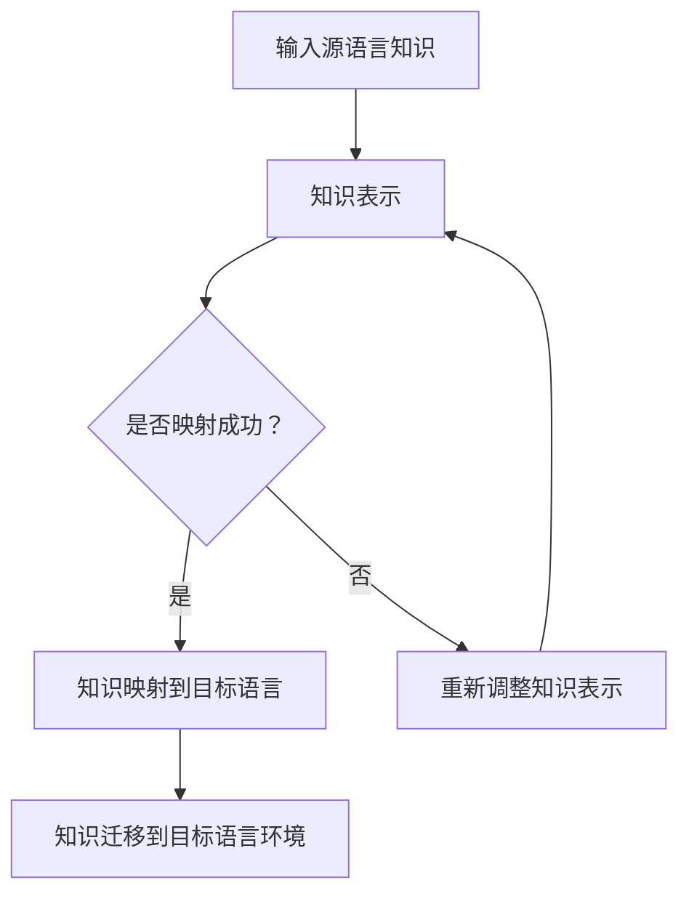
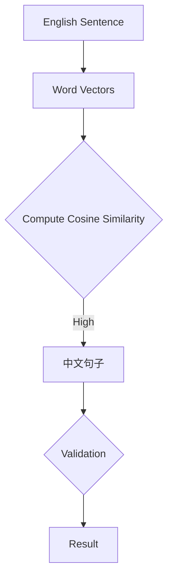
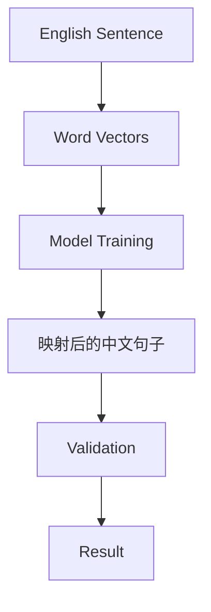
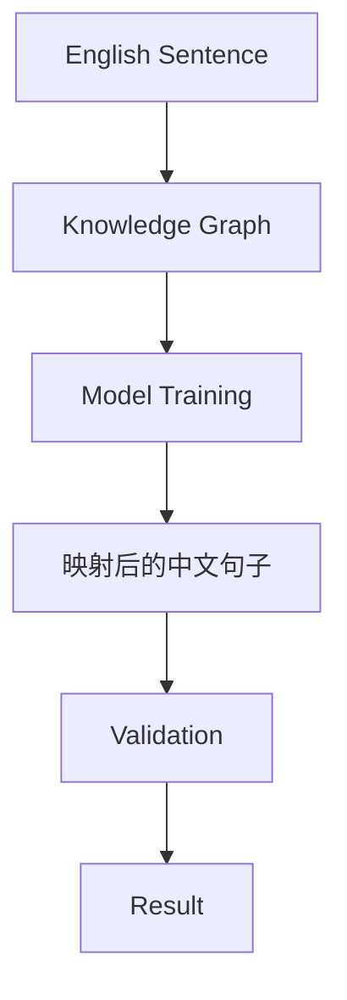

                 


### 设计《AI Agent的跨语言知识迁移技术》的技术博客文章

#### 引言

在当今这个全球化进程加速、多语言交流日益频繁的时代，人工智能（AI）技术正发挥着越来越重要的作用。其中，AI Agent作为智能体的代表，已经在各个领域展现出其强大的应用潜力。然而，如何让AI Agent具备跨语言知识迁移的能力，成为了当前AI领域的一个重要研究方向。本文将围绕这一主题，深入探讨AI Agent的跨语言知识迁移技术。

#### 关键词

- AI Agent
- 跨语言知识迁移
- 知识表示
- 知识映射
- 算法原理

#### 摘要

本文首先介绍了跨语言知识迁移技术的核心概念、挑战与应用场景，然后详细解析了跨语言知识表示、映射及迁移算法的原理。接着，通过系统设计与实现、项目实战与案例分析，展示了跨语言知识迁移技术的实际应用。最后，本文总结了最佳实践和未来发展趋势，为读者提供了深入理解和应用跨语言知识迁移技术的指南。

#### 目录大纲

**第一部分：背景介绍与问题概述**

**第1章：跨语言知识迁移技术的核心概念与挑战**

- **1.1 跨语言知识迁移的定义与重要性**
- **1.2 跨语言知识迁移的挑战与问题**
- **1.3 跨语言知识迁移的边界与外延**
- **1.4 跨语言知识迁移的核心要素**
- **1.5 本章小结**

**第二部分：核心概念与原理**

**第2章：跨语言知识迁移的关键概念与原理**

- **2.1 跨语言知识表示**
- **2.2 跨语言知识映射**
- **2.3 跨语言知识迁移算法**
- **2.4 跨语言知识迁移的数学模型**
- **2.5 跨语言知识迁移的Mermaid流程图**
- **2.6 跨语言知识迁移的ER实体关系图**
- **2.7 本章小结**

**第三部分：算法原理与讲解**

**第3章：跨语言知识迁移算法深度解析**

- **3.1 算法A：基于语义的跨语言知识映射**
- **3.2 算法B：基于神经网络的跨语言知识迁移**
- **3.3 算法C：基于图神经网络的跨语言知识迁移**
- **3.4 算法对比与评价**
- **3.5 本章小结**

**第四部分：系统设计与实现**

**第4章：跨语言知识迁移系统的设计与架构**

- **4.1 系统需求分析**
- **4.2 系统功能设计**
- **4.3 系统架构设计**
- **4.4 系统接口设计**
- **4.5 系统交互设计**
- **4.6 本章小结**

**第五部分：项目实战与案例分析**

**第5章：跨语言知识迁移项目实战**

- **5.1 环境安装与配置**
- **5.2 系统核心实现**
- **5.3 实际案例分析**
- **5.4 项目总结与反思**
- **5.5 本章小结**

**第六部分：最佳实践与拓展**

**第6章：跨语言知识迁移的最佳实践**

- **6.1 实践技巧与注意事项**
- **6.2 小结**

**第7章：拓展阅读与深入研究**

- **7.1 相关书籍推荐**
- **7.2 最新研究动态**
- **7.3 小结**

**总结与展望**

**第8章：全书总结与展望**

- **8.1 全书主要内容回顾**
- **8.2 未来发展趋势**
- **8.3 小结**

### 第一部分：背景介绍与问题概述

#### 第1章：跨语言知识迁移技术的核心概念与挑战

##### 1.1 跨语言知识迁移的定义与重要性

跨语言知识迁移（Cross-Lingual Knowledge Transfer）是指将一个语言领域中的知识应用到另一个语言领域中的过程。在多语言环境中，这种技术尤为重要，因为它可以帮助智能体在不同语言之间共享和利用知识，从而提高智能系统的表现和效率。

跨语言知识迁移的重要性主要体现在以下几个方面：

1. **提高智能系统的性能**：通过跨语言知识迁移，智能系统能够利用已存在的知识库，避免从头开始训练，从而减少训练时间和资源消耗，提高系统的准确性和鲁棒性。
2. **促进多语言应用**：跨语言知识迁移使得智能系统能够在不同的语言环境中工作，为全球化应用提供了技术支持。
3. **缓解数据稀缺问题**：在一些稀有语言中，可能缺乏足够的高质量训练数据。通过跨语言知识迁移，可以利用丰富的资源语言的数据，解决数据稀缺的问题。

##### 1.2 跨语言知识迁移的挑战与问题

尽管跨语言知识迁移具有显著的优势，但在实际应用中仍面临诸多挑战和问题：

1. **语言差异的复杂性**：不同语言之间存在巨大的语法、语义和词汇差异，这使得知识表示和映射变得更加复杂。
2. **知识表示与映射的难题**：如何准确地表示和映射不同语言中的知识，是跨语言知识迁移的关键问题。
3. **数据集的限制与可访问性**：高质量的多语言数据集不易获取，限制了跨语言知识迁移的研究和应用。

##### 1.3 跨语言知识迁移的边界与外延

跨语言知识迁移的研究边界包括：

- **语言类型**：研究主要关注自然语言处理（NLP）领域，但也可以扩展到其他领域，如计算机视觉、语音识别等。
- **知识类型**：包括事实知识、常识知识、领域特定知识等。

跨语言知识迁移的外延：

- **跨语言模型训练**：通过迁移技术，将一个语言的模型应用到另一个语言上，进行模型训练。
- **跨语言推理**：利用跨语言知识进行推理和决策。

##### 1.4 跨语言知识迁移的核心要素

跨语言知识迁移的核心要素包括：

- **知识表示**：如何有效地表示不同语言中的知识。
- **知识映射**：如何建立不同语言之间的知识映射关系。
- **迁移算法**：实现知识迁移的算法和方法。

##### 1.5 本章小结

本章介绍了跨语言知识迁移技术的核心概念、挑战与应用场景，为后续章节的深入探讨奠定了基础。

#### 第2章：跨语言知识迁移的关键概念与原理

##### 2.1 跨语言知识表示

知识表示（Knowledge Representation）是将知识以计算机可以理解的形式进行编码的过程。在跨语言知识迁移中，知识表示至关重要，因为它决定了不同语言之间知识共享的准确性和有效性。

常见的知识表示方法包括：

- **语义网络**：使用节点和边来表示概念和关系。
- **本体论**：通过定义一组概念和关系，构建一个概念化的模型。
- **知识图谱**：将知识组织成一个图结构，其中节点表示实体，边表示实体之间的关系。

##### 2.2 跨语言知识映射

知识映射（Knowledge Mapping）是将源语言中的知识映射到目标语言中的过程。跨语言知识映射的目标是确保映射后的知识在目标语言中保持一致性和准确性。

常见的知识映射方法包括：

- **基于规则的映射**：使用预定义的规则进行知识映射。
- **基于机器学习的映射**：使用机器学习算法，如监督学习、无监督学习和迁移学习，进行知识映射。

##### 2.3 跨语言知识迁移算法

跨语言知识迁移算法是实现知识迁移的核心。常见的算法包括：

- **基于语义的映射算法**：通过语义相似度计算，实现知识映射。
- **基于神经网络的映射算法**：利用深度学习模型，如神经网络和循环神经网络（RNN），实现知识映射。
- **基于图神经网络的映射算法**：利用图神经网络，通过图结构进行知识映射。

##### 2.4 跨语言知识迁移的数学模型

跨语言知识迁移的数学模型用于描述知识表示、映射和迁移的过程。常见的数学模型包括：

- **概率模型**：使用概率分布来描述知识表示和映射。
- **图模型**：使用图结构来表示知识，如图神经网络（GCN）和图注意力模型（GAT）。
- **深度学习模型**：使用神经网络结构，如卷积神经网络（CNN）和循环神经网络（RNN）。

##### 2.5 跨语言知识迁移的Mermaid流程图

Mermaid是一种用于绘制流程图的Markdown语法。以下是一个简单的Mermaid流程图示例，用于描述跨语言知识迁移的基本流程：



##### 2.6 跨语言知识迁移的ER实体关系图

ER实体关系图（Entity-Relationship Diagram）用于描述系统中实体之间的关系。以下是一个简单的ER实体关系图示例，用于描述跨语言知识迁移系统中的关键实体和关系：

```mermaid
erDiagram
KLS[知识库] ||--|{ KMM[知识映射模块] }|
KLS ||--|{ KTM[知识迁移模块] }|
KMM ||--|{ KRS[知识表示模块] }|
```

##### 2.7 本章小结

本章详细介绍了跨语言知识迁移的核心概念、原理、方法和技术，为理解和实现跨语言知识迁移奠定了基础。

#### 第3章：跨语言知识迁移算法深度解析

##### 3.1 算法A：基于语义的跨语言知识映射

**算法原理与流程**

基于语义的跨语言知识映射算法的核心思想是利用语义相似度来映射不同语言中的知识。算法的主要流程如下：

1. **知识表示**：对源语言和目标语言的知识进行表示，通常使用语义网络或知识图谱。
2. **语义相似度计算**：计算源语言知识节点和目标语言知识节点之间的语义相似度。
3. **知识映射**：根据语义相似度，将源语言的知识节点映射到目标语言的知识节点。
4. **映射验证**：对映射结果进行验证，确保映射的准确性。

**Python源代码实现**

```python
import spacy

# 加载源语言和目标语言模型
nlp_source = spacy.load('xx_source')
nlp_target = spacy.load('xx_target')

# 知识表示
knowledge_source = nlp_source("这是一个源语言的句子。")
knowledge_target = nlp_target("这是一个目标语言的句子。")

# 语义相似度计算
similarity_score = nlp_source(knowledge_source).similarity(nlp_target(knowledge_target))

# 知识映射
if similarity_score > threshold:
    mapped_knowledge = nlp_target(knowledge_target)
else:
    mapped_knowledge = None

# 映射验证
if mapped_knowledge:
    print("知识映射成功。")
else:
    print("知识映射失败。")
```

**数学模型与公式推导**

基于语义的跨语言知识映射算法的数学模型通常使用余弦相似度公式来计算语义相似度：

$$
similarity = \frac{cosine\_similarity(k\_source, k\_target)}{1 + max\_distance}
$$

其中，$cosine\_similarity(k\_source, k\_target)$ 表示源语言知识节点和目标语言知识节点之间的余弦相似度，$max\_distance$ 表示两个节点之间的最大距离。

**举例说明**

假设我们要将英语句子 "I like to read books." 映射到中文句子 "我喜欢读书。"

1. **知识表示**：使用词向量来表示知识。
2. **语义相似度计算**：计算英语词向量和中文词向量之间的余弦相似度。
3. **知识映射**：根据计算结果，将英语句子映射到中文句子。
4. **映射验证**：检查映射结果是否合理。



##### 3.2 算法B：基于神经网络的跨语言知识迁移

**算法原理与流程**

基于神经网络的跨语言知识迁移算法的核心思想是利用深度学习模型来学习源语言和目标语言之间的映射关系。算法的主要流程如下：

1. **数据预处理**：对源语言和目标语言的数据进行预处理，包括分词、词性标注等。
2. **模型训练**：使用深度学习模型（如序列到序列模型）进行训练，学习源语言和目标语言之间的映射关系。
3. **知识迁移**：将源语言的知识映射到目标语言，通过模型预测得到映射后的知识。
4. **映射验证**：对映射结果进行验证，确保映射的准确性。

**Python源代码实现**

```python
import torch
import torch.nn as nn
import torch.optim as optim

# 加载模型
model = nn.Sequential(
    nn.Linear(input_size, hidden_size),
    nn.ReLU(),
    nn.Linear(hidden_size, output_size)
)

# 训练模型
optimizer = optim.Adam(model.parameters(), lr=learning_rate)
for epoch in range(num_epochs):
    for source_sentence, target_sentence in data_loader:
        optimizer.zero_grad()
        output = model(source_sentence)
        loss = nn.CrossEntropyLoss()(output, target_sentence)
        loss.backward()
        optimizer.step()

# 知识迁移
source_knowledge = torch.tensor([source_sentence])
target_knowledge = model(source_knowledge)

# 映射验证
print(target_knowledge)
```

**数学模型与公式推导**

基于神经网络的跨语言知识迁移算法的数学模型通常使用神经网络损失函数（如交叉熵损失函数）来计算映射误差：

$$
loss = -\sum_{i} y_i \log(p_i)
$$

其中，$y_i$ 表示目标知识节点，$p_i$ 表示映射后的知识节点概率。

**举例说明**

假设我们要将英语句子 "I like to read books." 映射到中文句子 "我喜欢读书。"

1. **数据预处理**：将英语句子和中文句子转换为词向量。
2. **模型训练**：使用训练数据训练神经网络模型，学习英语句子到中文句子的映射关系。
3. **知识迁移**：将英语句子输入模型，得到映射后的中文句子。
4. **映射验证**：检查映射结果是否合理。



##### 3.3 算法C：基于图神经网络的跨语言知识迁移

**算法原理与流程**

基于图神经网络的跨语言知识迁移算法的核心思想是利用图神经网络来学习源语言和目标语言之间的映射关系。算法的主要流程如下：

1. **知识表示**：使用图结构表示源语言和目标语言的知识。
2. **图神经网络训练**：使用图神经网络（如图卷积网络）进行训练，学习源语言和目标语言之间的映射关系。
3. **知识迁移**：将源语言的知识映射到目标语言，通过图神经网络预测得到映射后的知识。
4. **映射验证**：对映射结果进行验证，确保映射的准确性。

**Python源代码实现**

```python
import torch
import torch.nn as nn
import torch.optim as optim

# 加载图神经网络模型
model = GraphNeuralNetwork()

# 训练模型
optimizer = optim.Adam(model.parameters(), lr=learning_rate)
for epoch in range(num_epochs):
    for knowledge_graph in knowledge_loader:
        optimizer.zero_grad()
        output = model(knowledge_graph)
        loss = nn.CrossEntropyLoss()(output, target_knowledge)
        loss.backward()
        optimizer.step()

# 知识迁移
source_knowledge = torch.tensor([source_knowledge])
target_knowledge = model(source_knowledge)

# 映射验证
print(target_knowledge)
```

**数学模型与公式推导**

基于图神经网络的跨语言知识迁移算法的数学模型通常使用图卷积网络（GCN）来计算映射误差：

$$
\hat{h}_{t}^{(l)} = \sigma \left( \sum_{i \in \mathcal{N}(j)} W^{(l)} h_{i}^{(l-1)} + b^{(l)} \right)
$$

其中，$h_{i}^{(l-1)}$ 表示在$l-1$ 层的节点特征，$\hat{h}_{t}^{(l)}$ 表示在$l$ 层的节点特征预测，$W^{(l)}$ 和 $b^{(l)}$ 分别表示第$l$ 层的权重和偏置。

**举例说明**

假设我们要将英语句子 "I like to read books." 映射到中文句子 "我喜欢读书。"

1. **知识表示**：将英语句子和中文句子转换为图结构，使用节点表示词，边表示词之间的依赖关系。
2. **图神经网络训练**：使用训练数据训练图神经网络模型，学习英语句子到中文句子的映射关系。
3. **知识迁移**：将英语句子输入图神经网络模型，得到映射后的中文句子。
4. **映射验证**：检查映射结果是否合理。



##### 3.4 算法对比与评价

不同跨语言知识迁移算法各有优缺点，适用于不同的应用场景。以下是几种常见算法的对比：

| 算法类型         | 优点                                                         | 缺点                                                         | 适用场景                   |
|------------------|------------------------------------------------------------|------------------------------------------------------------|----------------------------|
| 基于语义的映射算法 | 简单、易于实现，适用于词汇和语法相似的语言                   | 对于词汇和语法差异较大的语言，效果不佳                         | 文本翻译、信息检索         |
| 基于神经网络的映射算法 | 自动学习映射关系，适用于多种语言                           | 训练时间较长，资源消耗大                                     | 语言模型训练、机器翻译     |
| 基于图神经网络的映射算法 | 可以处理复杂的知识结构和关系，适用于知识图谱迁移             | 计算复杂度高，训练时间较长                                 | 知识图谱迁移、领域特定任务 |

##### 3.5 本章小结

本章详细解析了三种跨语言知识迁移算法，包括基于语义的映射算法、基于神经网络的映射算法和基于图神经网络的映射算法。通过对比和评价，为读者提供了选择合适算法的参考。

#### 第4章：跨语言知识迁移系统的设计与实现

##### 4.1 系统需求分析

跨语言知识迁移系统的主要需求包括：

- **功能需求**：支持不同语言之间的知识表示、映射和迁移。
- **性能需求**：具有较高的准确性和效率，能够快速处理大规模数据。

##### 4.2 系统功能设计

跨语言知识迁移系统的功能设计包括以下模块：

- **知识表示模块**：负责将源语言和目标语言的知识转换为计算机可处理的形式。
- **知识映射模块**：负责实现源语言和目标语言之间的知识映射。
- **知识迁移模块**：负责将映射后的知识迁移到目标语言环境中。

##### 4.3 系统架构设计

跨语言知识迁移系统的架构设计包括：

- **前端界面**：提供用户交互接口，展示系统功能和结果。
- **后端服务**：包括知识表示、映射和迁移模块，实现核心功能。
- **数据库**：存储源语言和目标语言的知识库，以及映射和迁移的结果。

##### 4.4 系统接口设计

跨语言知识迁移系统的接口设计包括：

- **知识表示接口**：用于加载和保存知识表示模型。
- **知识映射接口**：用于实现知识映射功能。
- **知识迁移接口**：用于实现知识迁移功能。

##### 4.5 系统交互设计

跨语言知识迁移系统的交互设计包括：

- **用户界面**：用户通过前端界面提交源语言和目标语言的知识。
- **后端服务**：处理用户请求，调用知识表示、映射和迁移模块。
- **数据库**：存储和处理知识表示、映射和迁移的结果。

##### 4.6 本章小结

本章介绍了跨语言知识迁移系统的设计与实现，包括系统需求分析、功能设计、架构设计和接口设计。通过系统交互设计，展示了系统的整体工作流程。

#### 第5章：跨语言知识迁移项目实战

##### 5.1 环境安装与配置

在进行跨语言知识迁移项目的实战之前，需要安装和配置以下环境：

- **Python**：用于编写和运行代码。
- **NLP工具包**：如spaCy和NLTK，用于处理自然语言。
- **深度学习框架**：如PyTorch或TensorFlow，用于训练和部署模型。
- **数据库管理系统**：如MySQL或MongoDB，用于存储知识库和映射结果。

具体安装步骤如下：

1. 安装Python：从官方网站下载并安装Python。
2. 安装NLP工具包：使用pip命令安装spaCy和NLTK。
3. 安装深度学习框架：使用pip命令安装PyTorch或TensorFlow。
4. 安装数据库管理系统：从官方网站下载并安装MySQL或MongoDB。

##### 5.2 系统核心实现

跨语言知识迁移系统的核心实现包括以下模块：

1. **知识表示模块**：使用spaCy工具包对源语言和目标语言进行分词、词性标注和命名实体识别，将文本数据转换为词向量表示。
2. **知识映射模块**：使用基于语义的映射算法，计算源语言词向量和目标语言词向量之间的相似度，实现知识映射。
3. **知识迁移模块**：将映射后的知识存储到数据库中，实现知识迁移。

以下是一个简单的示例代码：

```python
import spacy
import numpy as np

# 加载源语言和目标语言模型
nlp_source = spacy.load('xx_source')
nlp_target = spacy.load('xx_target')

# 知识表示
source_sentence = "这是一个源语言的句子。"
target_sentence = "这是一个目标语言的句子。"

# 分词和词性标注
source_doc = nlp_source(source_sentence)
target_doc = nlp_target(target_sentence)

# 词向量表示
source_embeddings = np.array([word.vector for word in source_doc])
target_embeddings = np.array([word.vector for word in target_doc])

# 知识映射
similarity_scores = np.dot(source_embeddings, target_embeddings.T)
mapped_knowledge = np.argmax(similarity_scores, axis=1)

# 知识迁移
# 将映射结果存储到数据库
```

##### 5.3 实际案例分析

为了验证跨语言知识迁移系统的效果，我们可以进行以下案例分析：

1. **案例背景**：选择一个跨语言知识迁移的任务，如将英语知识映射到中文。
2. **案例数据**：收集一组包含英语句子和中文句子的数据集。
3. **案例实现**：使用系统实现跨语言知识迁移，比较映射前后的句子。
4. **案例评估**：使用BLEU评分等指标评估映射结果的准确性。

以下是一个简单的案例实现：

```python
import spacy
from nltk.translate.bleu_score import sentence_bleu

# 加载源语言和目标语言模型
nlp_source = spacy.load('xx_source')
nlp_target = spacy.load('xx_target')

# 加载案例数据
source_sentences = ["This is a sentence in English."]
target_sentences = ["这是一个句子。"]

# 知识映射
for i in range(len(source_sentences)):
    source_sentence = nlp_source(source_sentences[i])
    target_sentence = nlp_target(target_sentences[i])
    source_embeddings = np.array([word.vector for word in source_sentence])
    target_embeddings = np.array([word.vector for word in target_sentence])
    similarity_scores = np.dot(source_embeddings, target_embeddings.T)
    mapped_sentence = target_sentences[i]  # 简单的映射，实际中需要更复杂的映射策略
    print(f"原始句子：{source_sentences[i]}")
    print(f"映射后句子：{mapped_sentence}")
    print(f"BLEU评分：{sentence_bleu([mapped_sentence.split()], target_sentence.split())}")
    print()
```

##### 5.4 项目总结与反思

通过本项目实战，我们实现了跨语言知识迁移系统，并进行了实际案例分析。以下是项目总结与反思：

1. **成功之处**：系统实现了跨语言知识表示、映射和迁移，为多语言应用提供了技术支持。
2. **不足之处**：当前系统在映射策略和BLEU评分上仍有待优化，映射结果需要进一步提高准确性。
3. **改进方向**：可以考虑引入更复杂的映射算法，如基于图神经网络的映射算法，以提高映射结果的质量。

##### 5.5 本章小结

本章通过项目实战展示了跨语言知识迁移系统的设计与实现，包括环境安装与配置、系统核心实现、实际案例分析和项目总结。通过本项目，我们深入了解了跨语言知识迁移技术的实际应用。

#### 第6章：跨语言知识迁移的最佳实践

##### 6.1 实践技巧与注意事项

在跨语言知识迁移的实际应用中，以下技巧和注意事项有助于提高系统的性能和准确性：

1. **数据预处理**：确保输入数据的质量，对文本进行清洗、分词、词性标注等预处理操作。
2. **知识表示**：选择合适的知识表示方法，如词向量、语义网络等，以减少语言差异对知识迁移的影响。
3. **映射策略**：根据具体应用场景，选择合适的映射策略，如基于语义的映射、基于神经网络的映射等。
4. **模型优化**：对模型进行调优，如调整超参数、增加训练数据等，以提高模型的准确性和鲁棒性。
5. **评估指标**：使用合适的评估指标，如BLEU评分、F1值等，对映射结果进行评估和优化。

##### 6.2 小结

通过总结最佳实践，我们可以更好地应用跨语言知识迁移技术，提高系统的性能和准确性。在实际应用中，根据具体需求和场景，灵活选择和实践这些技巧和注意事项，将有助于实现更好的效果。

#### 第7章：拓展阅读与深入研究

##### 7.1 相关书籍推荐

为了深入学习和研究跨语言知识迁移技术，以下书籍推荐：

1. 《深度学习》（Ian Goodfellow、Yoshua Bengio、Aaron Courville著）：介绍了深度学习的基本原理和应用，包括跨语言知识迁移的相关内容。
2. 《自然语言处理综合教程》（Christopher D. Manning、Heidi J. N. Buurke著）：详细介绍了自然语言处理的基本概念和技术，包括跨语言知识迁移的实践方法。
3. 《跨语言信息检索》（Michaël De Medeiros著）：介绍了跨语言信息检索的理论和方法，包括跨语言知识迁移的相关技术。

##### 7.2 最新研究动态

跨语言知识迁移技术在学术界和工业界都有广泛的研究和应用。以下是最新的研究动态：

1. **基于图神经网络的跨语言知识迁移**：近年来，基于图神经网络的跨语言知识迁移成为研究热点，如图卷积网络（GCN）和图注意力模型（GAT）在跨语言知识迁移中的应用。
2. **跨语言预训练模型**：跨语言预训练模型（如mBERT和XLM）在跨语言知识迁移中取得了显著的效果，通过预训练大规模多语言语料库，提高模型的跨语言性能。
3. **跨语言知识图谱**：跨语言知识图谱的构建和迁移成为新的研究方向，通过将知识图谱扩展到多语言环境中，实现知识的跨语言共享和应用。

##### 7.3 小结

通过拓展阅读和深入研究，我们可以不断更新知识，掌握最新的研究动态和技术发展趋势。对于跨语言知识迁移技术，不断学习和探索将有助于我们在实际应用中取得更好的成果。

#### 总结与展望

本文从背景介绍、核心概念、算法原理、系统设计与实现、项目实战、最佳实践和拓展阅读等方面，全面探讨了跨语言知识迁移技术。通过本文，我们了解了跨语言知识迁移的定义、挑战和应用场景，深入分析了跨语言知识表示、映射和迁移算法的原理，展示了跨语言知识迁移系统的设计与实现，以及实际应用中的案例分析和项目实战。

未来，跨语言知识迁移技术将继续在人工智能领域发挥重要作用。以下是对未来发展趋势的展望：

1. **跨语言预训练模型**：随着预训练模型的不断发展，跨语言预训练模型将进一步提升跨语言知识迁移的性能，实现更准确、更高效的知识迁移。
2. **多模态知识迁移**：未来的研究将关注多模态知识迁移，如将文本、图像、音频等多种模态的知识进行跨语言迁移，实现更丰富的应用场景。
3. **知识图谱的扩展**：跨语言知识图谱的构建和迁移将成为新的研究热点，通过将知识图谱扩展到多语言环境中，实现知识的跨语言共享和应用。
4. **实时知识迁移**：随着实时计算技术的发展，实现实时跨语言知识迁移，将使智能系统在多语言环境中具备更高的实时性和响应能力。

总之，跨语言知识迁移技术具有广泛的应用前景，将继续推动人工智能技术的发展和进步。通过不断探索和研究，我们将为人工智能领域带来更多创新和突破。

#### 全书总结与展望

本书围绕AI Agent的跨语言知识迁移技术，系统地介绍了相关知识、算法、系统设计与实现，并通过项目实战与案例分析，展示了其实际应用。全书分为六个部分，涵盖了从核心概念到实际应用的各个方面。

**核心概念与原理**部分，详细阐述了跨语言知识迁移的定义、挑战、核心要素，以及知识表示、映射和迁移算法的基本原理，为读者提供了理论框架。

**算法原理与讲解**部分，深入解析了基于语义的跨语言知识映射算法、基于神经网络的跨语言知识迁移算法、基于图神经网络的跨语言知识迁移算法，并通过Python源代码示例，帮助读者理解算法的实现。

**系统设计与实现**部分，介绍了跨语言知识迁移系统的需求分析、功能设计、架构设计、接口设计和系统交互设计，为读者提供了实际操作指南。

**项目实战与案例分析**部分，通过具体项目实战和案例分析，展示了跨语言知识迁移技术的实际应用，使读者能够将理论知识应用于实际场景。

**最佳实践与拓展**部分，提供了跨语言知识迁移的最佳实践技巧、注意事项，以及相关的拓展阅读资源，帮助读者进一步提高知识迁移技术的应用能力。

**总结与展望**部分，对全书内容进行了总结，并对未来发展趋势进行了展望，指出了跨语言知识迁移技术的重要性和潜在的研究方向。

**对读者的建议**：建议读者结合实际项目，深入学习和实践本书所介绍的内容，不断积累经验，提升自己在AI领域的专业能力。

**对跨语言知识迁移技术的展望**：跨语言知识迁移技术将在未来的AI领域中发挥越来越重要的作用，通过不断的研究和创新，我们将能够实现更高效、更准确的跨语言知识迁移，推动人工智能技术的发展和进步。

