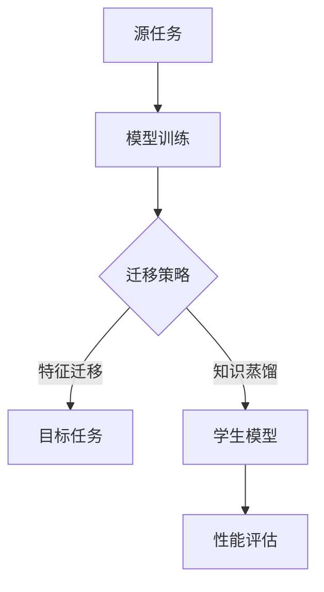
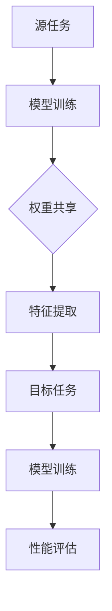
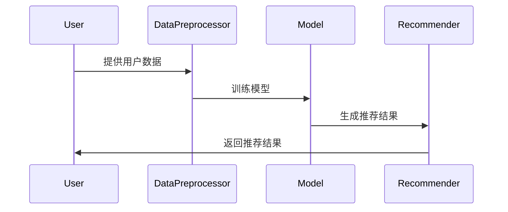
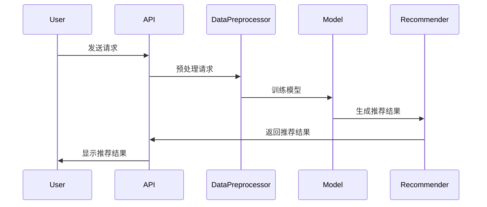

                 

### 前言

#### 读者对象与学习目标

本文旨在为对人工智能（AI）和机器学习（ML）领域感兴趣的读者，尤其是那些想要深入了解AI Agent迁移学习能力开发的工程师和技术领导者，提供一份全面而深入的技术指南。无论您是初学者还是经验丰富的从业者，都将在这篇文章中找到有价值的信息。

我们的目标是帮助读者：

1. **理解迁移学习的基础概念和原理**：通过详细阐述迁移学习的定义、应用场景及其与其他机器学习技术的联系，帮助读者建立全面的知识框架。
2. **掌握迁移学习算法的设计与实现**：通过具体的算法原理讲解、Python代码示例和数学模型的阐述，使读者能够深入理解迁移学习的内部机制，并学会如何在实际项目中应用。
3. **设计和实现具有迁移学习能力的AI Agent**：通过系统分析与架构设计方案，以及项目实战案例，提供实用的指导，帮助读者将理论知识转化为实际能力。
4. **了解迁移学习的最佳实践和注意事项**：通过最佳实践 tips，为读者提供在实际项目中优化迁移学习能力的方法和技巧。

#### 书籍结构安排

本文的结构安排如下：

- **第一章：背景介绍**：介绍迁移学习的重要性及其应用场景，为后续章节的深入探讨打下基础。
- **第二章：核心概念与联系**：详细描述迁移学习的定义、原理、与机器学习的关系，并通过Mermaid流程图和ER实体关系图进行可视化阐述。
- **第三章：算法原理讲解**：通过mermaid流程图和Python代码示例，深入讲解迁移学习的算法原理，并结合具体的数学模型和公式进行解释。
- **第四章：数学模型和数学公式讲解**：使用LaTeX格式展示迁移学习相关的数学模型和公式，并进行详细讲解和举例说明。
- **第五章：系统分析与架构设计方案**：介绍如何设计和实现一个具有迁移学习能力的AI Agent，包括问题场景介绍、系统功能设计、系统架构设计、系统接口设计和系统交互。
- **第六章：项目实战**：通过实际案例展示如何应用迁移学习开发AI Agent，包括环境安装、系统核心实现源代码、代码应用解读与分析、实际案例分析和详细讲解剖析。
- **第七章：最佳实践 tips**：提供一些实践中的注意事项和技巧，以及系统性能调优的方法。
- **第八章：小结与拓展阅读**：总结本文的主要内容，展望研究方向，并给出进一步阅读的建议。

通过本文的逐步讲解，读者将能够系统地掌握AI Agent迁移学习能力的开发，为未来的研究和实践打下坚实的基础。

### 第一章：背景介绍

#### 迁移学习的重要性

迁移学习（Transfer Learning）是机器学习（Machine Learning）领域的一个重要分支，其核心思想是将已在一个任务上训练好的模型知识应用到其他相关任务上。这一概念在人工智能（AI）的发展历程中占据着重要地位，特别是在资源有限、数据标注困难或任务之间存在关联的场景中。迁移学习的重要性主要体现在以下几个方面：

1. **资源节约**：在传统的机器学习模型训练中，每个新任务通常需要大量的数据集进行训练，这不仅耗时耗力，还可能需要大量的计算资源。而迁移学习通过复用已有模型的权重，可以大大减少对新数据集的需求，从而节约训练时间和计算资源。

2. **模型泛化能力增强**：迁移学习通过在源任务上训练得到的模型，可以增强目标任务上的泛化能力。特别是在数据分布差异较大的情况下，迁移学习能够有效提高模型的适应性，避免模型过度拟合。

3. **任务关联性利用**：许多现实世界中的任务之间存在某种程度的关联性，迁移学习正是通过利用这些关联性，使得一个任务上的知识能够迁移到另一个任务上，从而提高整体效率和效果。

4. **增强模型鲁棒性**：迁移学习可以引入更多样化的数据，提高模型在面对不同数据分布时的鲁棒性。这对于实际应用中的模型稳定性和可靠性具有重要意义。

#### 迁移学习的应用场景

迁移学习的应用场景广泛，以下列举几个典型的应用领域：

1. **计算机视觉**：在图像分类、目标检测、人脸识别等领域，迁移学习已经被广泛应用。例如，使用在ImageNet上预训练的卷积神经网络（CNN）作为基础模型，可以快速适应各种具体的应用场景，如医疗图像分析、自动驾驶等。

2. **自然语言处理**：在文本分类、机器翻译、情感分析等领域，迁移学习同样发挥着重要作用。例如，使用在大量文本数据上预训练的语言模型，可以显著提高新任务上的性能，尤其在数据稀缺或标注困难的情况下。

3. **推荐系统**：在推荐系统中，迁移学习可以通过复用已有推荐模型的知识，提高新任务的推荐效果。例如，在商品推荐中，可以通过迁移学习将用户在某个领域的兴趣迁移到其他领域，从而实现更精准的推荐。

4. **语音识别**：在语音识别领域，迁移学习可以帮助模型快速适应新的语音数据，提高识别准确率。例如，通过迁移学习，可以将大型语料库上的模型迁移到特定领域的语音数据上，从而提高该领域的识别效果。

#### 迁移学习的发展历程

迁移学习作为一个研究领域，经历了从无到有、从简单到复杂的发展过程。以下是迁移学习的发展历程概览：

1. **早期探索**：早在20世纪80年代，机器学习领域的先驱们就开始探索迁移学习的概念。当时，主要的研究集中在如何将经验从一个简单的任务迁移到另一个简单的任务上。

2. **深度学习引入**：随着深度学习的兴起，迁移学习得到了新的发展动力。深度神经网络通过多层非线性变换，能够提取更加抽象的特征，这为迁移学习提供了更加坚实的基础。

3. **大规模预训练模型**：近年来，随着计算能力和数据资源的提升，大规模预训练模型如BERT、GPT等得到了广泛应用。这些模型通过在大规模数据上预训练，再通过迁移学习应用到各种具体任务上，取得了显著的性能提升。

4. **跨模态迁移学习**：随着多模态数据的兴起，跨模态迁移学习也成为研究的热点。例如，将图像数据的知识迁移到文本数据，或将语音数据的知识迁移到视觉数据，从而实现多模态数据的融合和应用。

总之，迁移学习作为机器学习领域的一个重要分支，其重要性不言而喻。通过本文的深入探讨，读者将能够全面了解迁移学习的概念、原理和应用，为未来的研究和实践提供有力的支持。

### 第二章：核心概念与联系

#### 迁移学习的定义

迁移学习（Transfer Learning）是机器学习领域中的一个重要概念，其核心思想是将在一个任务上学习到的知识（通常是模型参数）迁移到另一个任务上，以提高新任务的学习效果。在传统机器学习中，每个新任务都需要从头开始训练，而迁移学习通过复用已有模型的权重，可以显著减少训练时间和计算资源。

具体来说，迁移学习包括以下几个关键组成部分：

1. **源任务（Source Task）**：源任务是已经训练好的模型所针对的任务。在迁移学习过程中，源任务的模型参数将被复用，作为新任务的基础。

2. **目标任务（Target Task）**：目标任务是需要解决的新任务。通过迁移学习，源任务的知识将帮助目标任务更快、更准确地学习。

3. **迁移策略（Transfer Strategy）**：迁移策略是指如何将源任务的知识迁移到目标任务的具体方法。常见的迁移策略包括模型权重共享、特征迁移和知识蒸馏等。

#### 迁移学习与机器学习的关系

迁移学习是机器学习的一个子领域，它与传统的机器学习有着密切的联系，同时也存在一些区别：

1. **共同点**：
   - **数据驱动**：迁移学习和传统机器学习都是基于数据驱动的方法，通过从数据中学习来构建模型。
   - **模型优化**：两者都旨在通过优化模型参数来提高任务性能。

2. **不同点**：
   - **数据集**：在传统机器学习中，每个新任务都需要独立的训练数据集。而在迁移学习中，部分或全部数据可以从源任务复用，从而节省新任务的数据集需求。
   - **泛化能力**：迁移学习通过利用源任务的知识，可以增强目标任务的泛化能力，避免过度拟合。

#### 迁移学习的核心原理

迁移学习之所以能够有效提高模型性能，主要依赖于以下几个核心原理：

1. **模型共享**：通过在源任务和目标任务之间共享模型结构，可以减少模型的冗余，提高模型的泛化能力。例如，在计算机视觉任务中，不同图像分类任务可以共享卷积神经网络（CNN）的前几层。

2. **特征迁移**：特征迁移是指将源任务中提取的高层次抽象特征应用到目标任务中。这些特征具有通用性，可以跨任务复用。例如，在自然语言处理任务中，预训练的词嵌入（Word Embeddings）可以迁移到不同的文本分类任务中。

3. **知识蒸馏**：知识蒸馏是一种将复杂模型（教师模型）的知识迁移到简化模型（学生模型）的技术。通过从教师模型中提取知识，并指导学生模型的学习，可以实现模型的优化和加速。

#### 迁移学习与其他机器学习技术的联系

迁移学习与其他一些机器学习技术紧密相关，以下列举几个关键联系：

1. **元学习（Meta-Learning）**：元学习是一种通过学习如何学习的方法，它可以帮助模型在新的任务上快速适应。迁移学习与元学习有类似之处，都旨在提高模型在不同任务上的泛化能力。

2. **迁移策略**：迁移策略本身可以结合其他机器学习技术，如强化学习、生成对抗网络（GAN）等，以实现更高效的迁移学习。例如，在强化学习任务中，可以通过迁移学习来利用已有策略的知识，加速新策略的探索和收敛。

3. **多任务学习（Multi-Task Learning）**：多任务学习是指同时解决多个相关任务的学习方法。迁移学习与多任务学习有交集，两者都利用任务之间的关联性来提高学习效果。

#### 迁移学习的核心概念与联系可视化

为了更好地理解迁移学习的核心概念与联系，我们使用Mermaid流程图和ER实体关系图进行可视化阐述：

1. **Mermaid流程图**：



2. **ER实体关系图**：

```mermaid
erDiagram
Task1 ||--|{ MigrationStrategy } MigrationStrategy
Task2 ||--|{ MigrationStrategy } MigrationStrategy
TeacherModel ||--|{ Model } Model
StudentModel ||--|{ Model } Model
```

通过这些可视化工具，我们可以直观地看到迁移学习中的关键实体和它们之间的关系，从而更好地理解迁移学习的原理和实现方法。

### 第三章：算法原理讲解

#### 迁移学习的基本算法

迁移学习的基本算法主要包括模型权重共享、特征迁移和知识蒸馏等。这些算法的核心思想是通过在不同任务之间共享模型结构或知识，以提高模型在新任务上的性能。

1. **模型权重共享**：

模型权重共享是迁移学习最简单也是最常见的方法之一。它通过在源任务和目标任务之间共享模型的一部分或全部权重，从而减少冗余并提高泛化能力。

**算法步骤**：

- **步骤1**：在源任务上训练一个模型，获得其参数（权重）。
- **步骤2**：将源任务的模型参数作为目标任务模型的部分或全部初始化。
- **步骤3**：在目标任务上继续训练，微调模型参数，以适应新任务。

2. **特征迁移**：

特征迁移是指将源任务中提取的高层次抽象特征应用到目标任务中。这些特征通常具有通用性，可以跨任务复用。

**算法步骤**：

- **步骤1**：在源任务上训练一个模型，提取其特征表示。
- **步骤2**：将提取的特征表示作为目标任务的输入。
- **步骤3**：在目标任务上训练一个新的模型，利用迁移的特征表示进行学习。

3. **知识蒸馏**：

知识蒸馏是一种将复杂模型（教师模型）的知识迁移到简化模型（学生模型）的技术。它通过从教师模型中提取知识，并指导学生模型的学习，实现模型的优化和加速。

**算法步骤**：

- **步骤1**：在源任务上训练一个复杂的教师模型。
- **步骤2**：生成教师模型的知识表示（通常是通过软标签或注意力机制）。
- **步骤3**：使用教师模型的知识表示来训练学生模型。
- **步骤4**：评估学生模型的性能，并进行微调。

#### 迁移学习的mermaid流程图

为了更直观地理解迁移学习的算法流程，我们使用Mermaid绘制了以下流程图：



在这个流程图中，A表示源任务，B是模型在源任务上的训练，C表示权重共享，D是特征提取，E是目标任务，F是模型在目标任务上的训练，G是性能评估。通过这个流程图，我们可以清晰地看到迁移学习的整个过程。

#### Python代码示例与详细讲解

下面我们通过一个简单的Python代码示例，详细讲解迁移学习的实现过程。这个示例使用的是经典的卷积神经网络（CNN）架构，并在两个不同的图像分类任务上应用迁移学习。

```python
import tensorflow as tf
from tensorflow.keras.applications import VGG16
from tensorflow.keras.models import Model
from tensorflow.keras.layers import Dense, Flatten

# 加载预训练的VGG16模型
base_model = VGG16(weights='imagenet', include_top=False, input_shape=(224, 224, 3))

# 冻结预训练模型的权重
for layer in base_model.layers:
    layer.trainable = False

# 添加新的全连接层进行分类
x = Flatten()(base_model.output)
x = Dense(1024, activation='relu')(x)
predictions = Dense(num_classes, activation='softmax')(x)

# 构建迁移学习模型
model = Model(inputs=base_model.input, outputs=predictions)

# 编译模型
model.compile(optimizer='adam', loss='categorical_crossentropy', metrics=['accuracy'])

# 加载数据集并预处理
# ...

# 训练迁移学习模型
model.fit(x_train, y_train, epochs=10, batch_size=32, validation_data=(x_val, y_val))

# 微调模型
for layer in model.layers:
    layer.trainable = True

# 重新编译模型
model.compile(optimizer='adam', loss='categorical_crossentropy', metrics=['accuracy'])

# 继续训练模型
model.fit(x_train, y_train, epochs=10, batch_size=32, validation_data=(x_val, y_val))
```

**详细讲解**：

1. **加载预训练的VGG16模型**：

   ```python
   base_model = VGG16(weights='imagenet', include_top=False, input_shape=(224, 224, 3))
   ```

   这里我们使用的是在ImageNet数据集上预训练的VGG16模型，作为源任务的模型。通过`include_top=False`参数，我们不加载预训练的顶层全连接层，从而保留模型的前几层卷积层。

2. **冻结预训练模型的权重**：

   ```python
   for layer in base_model.layers:
       layer.trainable = False
   ```

   在迁移学习中，我们通常冻结源任务的模型权重，只在新添加的全连接层上进行微调。

3. **添加新的全连接层进行分类**：

   ```python
   x = Flatten()(base_model.output)
   x = Dense(1024, activation='relu')(x)
   predictions = Dense(num_classes, activation='softmax')(x)
   ```

   这里我们添加了一个新的全连接层，用于进行分类任务。全连接层之前的ReLU激活函数可以帮助模型提取更加复杂的特征。

4. **构建迁移学习模型**：

   ```python
   model = Model(inputs=base_model.input, outputs=predictions)
   ```

   我们通过`Model`类构建一个新的迁移学习模型，该模型的前向传播输入是源任务的输入，输出是目标任务的预测结果。

5. **编译模型**：

   ```python
   model.compile(optimizer='adam', loss='categorical_crossentropy', metrics=['accuracy'])
   ```

   我们使用Adam优化器和交叉熵损失函数来编译模型。

6. **加载数据集并预处理**：

   ```python
   # ...
   ```

   这一步根据具体的数据集和任务进行，通常包括数据的加载、预处理和分割。

7. **训练迁移学习模型**：

   ```python
   model.fit(x_train, y_train, epochs=10, batch_size=32, validation_data=(x_val, y_val))
   ```

   我们使用迁移学习模型在训练集上进行训练，并使用验证集进行性能评估。

8. **微调模型**：

   ```python
   for layer in model.layers:
       layer.trainable = True
   model.compile(optimizer='adam', loss='categorical_crossentropy', metrics=['accuracy'])
   model.fit(x_train, y_train, epochs=10, batch_size=32, validation_data=(x_val, y_val))
   ```

   在这一步，我们解冻所有层的权重，重新编译模型，并继续训练，以进一步优化模型性能。

通过这个简单的Python代码示例，我们展示了如何使用迁移学习来提高模型在新任务上的性能。接下来，我们将进一步讲解迁移学习的数学模型和公式，以深入理解其背后的原理。

#### 迁移学习的数学模型和公式

为了更深入地理解迁移学习的算法原理，我们需要借助数学模型和公式来描述其内部机制。以下是迁移学习中的几个关键数学模型和公式，以及它们的详细解释和举例说明。

1. **损失函数**：

   迁移学习的核心目标是在目标任务上最小化损失函数，常见的损失函数包括交叉熵损失函数和均方误差（MSE）损失函数。

   - **交叉熵损失函数**：

     $$ L_{CE} = -\sum_{i=1}^{N} y_{i} \log(p_{i}) $$

     其中，\( y_{i} \)是真实标签，\( p_{i} \)是模型预测的概率分布。交叉熵损失函数在分类任务中应用广泛，用于衡量模型预测与真实标签之间的差异。

     **举例**：假设我们有一个二分类任务，真实标签为\[0, 1\]，模型预测的概率分布为\[0.8, 0.2\]。则交叉熵损失函数计算如下：

     $$ L_{CE} = -[0 \cdot \log(0.8) + 1 \cdot \log(0.2)] \approx 1.386 $$

   - **均方误差（MSE）损失函数**：

     $$ L_{MSE} = \frac{1}{N} \sum_{i=1}^{N} (y_{i} - \hat{y}_{i})^2 $$

     其中，\( \hat{y}_{i} \)是模型的预测值，\( y_{i} \)是真实值。MSE损失函数在回归任务中应用广泛，用于衡量预测值与真实值之间的差异。

     **举例**：假设我们有一个回归任务，真实值为\[5\]，模型预测值为\[4.9\]。则MSE损失函数计算如下：

     $$ L_{MSE} = \frac{1}{1} (5 - 4.9)^2 = 0.01 $$

2. **优化算法**：

   迁移学习通常使用优化算法来最小化损失函数，常见的优化算法包括梯度下降（Gradient Descent）和其变种，如随机梯度下降（SGD）和Adam优化器。

   - **梯度下降**：

     $$ \theta_{t+1} = \theta_{t} - \alpha \nabla_{\theta} L(\theta) $$

     其中，\( \theta \)是模型参数，\( \alpha \)是学习率，\( \nabla_{\theta} L(\theta) \)是损失函数关于模型参数的梯度。梯度下降通过迭代更新模型参数，以最小化损失函数。

     **举例**：假设我们有一个简单的线性模型，损失函数为MSE，模型参数为\[w\]。则梯度下降更新规则为：

     $$ w_{t+1} = w_{t} - \alpha \nabla_{w} L(w) = w_{t} - \alpha (2 \cdot (y - \hat{y})) = w_{t} - 2\alpha (y - \hat{y}) $$

   - **Adam优化器**：

     Adam是一种基于一阶矩估计（Mean）和二阶矩估计（Variance）的优化算法，其更新规则为：

     $$ \theta_{t+1} = \theta_{t} - \alpha \frac{m_{t}}{\sqrt{v_{t}} + \epsilon} $$

     其中，\( m_{t} \)是第t次迭代的一阶矩估计，\( v_{t} \)是第t次迭代的二阶矩估计，\( \epsilon \)是常数。Adam优化器结合了SGD和RMSProp的优点，在迁移学习中表现出色。

     **举例**：假设我们有一个简单的线性模型，使用Adam优化器，损失函数为MSE。则Adam更新规则为：

     $$ m_{t+1} = \beta_{1} m_{t} + (1 - \beta_{1}) \nabla_{w} L(w) $$
     $$ v_{t+1} = \beta_{2} v_{t} + (1 - \beta_{2}) (\nabla_{w} L(w))^2 $$
     $$ w_{t+1} = w_{t} - \alpha \frac{m_{t+1}}{\sqrt{v_{t+1}} + \epsilon} $$

3. **正则化**：

   正则化是一种防止模型过拟合的技术，常见的正则化方法包括L1正则化、L2正则化和Dropout等。

   - **L1正则化**：

     $$ L_{L1} = \lambda \sum_{i=1}^{n} |\theta_{i}| $$

     其中，\( \theta_{i} \)是模型参数，\( \lambda \)是正则化参数。L1正则化鼓励模型参数稀疏，从而减少模型的复杂性。

     **举例**：假设我们有一个线性模型，模型参数为\[w\]，正则化参数为\[0.01\]。则L1正则化损失函数为：

     $$ L_{L1} = 0.01 \sum_{i=1}^{n} |w_{i}| $$

   - **L2正则化**：

     $$ L_{L2} = \lambda \sum_{i=1}^{n} \theta_{i}^2 $$

     L2正则化鼓励模型参数的平滑，从而减少模型的过拟合。

     **举例**：假设我们有一个线性模型，模型参数为\[w\]，正则化参数为\[0.01\]。则L2正则化损失函数为：

     $$ L_{L2} = 0.01 \sum_{i=1}^{n} w_{i}^2 $$

   - **Dropout**：

     Dropout是一种在训练过程中随机丢弃一部分神经元的方法，从而减少模型的过拟合。

     **举例**：假设我们有一个包含100个神经元的全连接层，Dropout概率为0.5。在训练过程中，每次迭代时会有50个神经元被随机丢弃。

通过这些数学模型和公式的讲解，我们能够更深入地理解迁移学习的算法原理。接下来，我们将介绍如何设计和实现一个具有迁移学习能力的AI Agent，以进一步巩固我们的知识。

### 第四章：数学模型和数学公式讲解

迁移学习作为一种强大的机器学习技术，其核心在于利用已有模型的知识来提升新任务的学习效果。在这一章节中，我们将深入探讨迁移学习中的数学模型和公式，通过LaTeX格式展示这些关键数学表达式，并进行详细讲解和举例说明，以帮助读者更好地理解迁移学习的工作原理。

#### 迁移学习中的关键数学模型

1. **损失函数**：

   损失函数是迁移学习中的一个核心概念，用于衡量模型预测与真实标签之间的差异。常见的损失函数包括交叉熵损失函数和均方误差（MSE）损失函数。

   - **交叉熵损失函数**：

     $$ L_{CE} = -\sum_{i=1}^{N} y_{i} \log(p_{i}) $$

     其中，\( y_{i} \)是第i个样本的真实标签，\( p_{i} \)是模型对第i个样本的预测概率。交叉熵损失函数在分类任务中广泛应用，用于优化模型输出的概率分布与真实标签之间的差异。

     **举例**：假设我们有一个二分类问题，真实标签为\[0, 1\]，模型预测的概率分布为\[0.8, 0.2\]。则交叉熵损失函数的计算如下：

     $$ L_{CE} = -[0 \cdot \log(0.8) + 1 \cdot \log(0.2)] \approx 0.7219 $$

   - **均方误差（MSE）损失函数**：

     $$ L_{MSE} = \frac{1}{N} \sum_{i=1}^{N} (y_{i} - \hat{y}_{i})^2 $$

     其中，\( \hat{y}_{i} \)是模型对第i个样本的预测值，\( y_{i} \)是真实值。MSE损失函数在回归任务中应用广泛，用于衡量预测值与真实值之间的差异。

     **举例**：假设我们有一个回归问题，真实值为\[5\]，模型预测值为\[4.9\]。则MSE损失函数的计算如下：

     $$ L_{MSE} = \frac{1}{1} (5 - 4.9)^2 = 0.01 $$

2. **优化算法**：

   优化算法用于最小化损失函数，常见的优化算法包括梯度下降（Gradient Descent）、随机梯度下降（SGD）和Adam优化器。

   - **梯度下降**：

     $$ \theta_{t+1} = \theta_{t} - \alpha \nabla_{\theta} L(\theta) $$

     其中，\( \theta \)是模型参数，\( \alpha \)是学习率，\( \nabla_{\theta} L(\theta) \)是损失函数关于模型参数的梯度。梯度下降通过迭代更新模型参数，以最小化损失函数。

     **举例**：假设我们有一个线性模型，模型参数为\[w\]，学习率为\[0.01\]，损失函数为MSE。则梯度下降更新规则为：

     $$ w_{t+1} = w_{t} - 0.01 \nabla_{w} L(w) = w_{t} - 2(5 - 4.9) = w_{t} + 0.02 $$

   - **Adam优化器**：

     Adam是一种基于一阶矩估计（Mean）和二阶矩估计（Variance）的优化算法，其更新规则为：

     $$ m_{t+1} = \beta_{1} m_{t} + (1 - \beta_{1}) \nabla_{w} L(w) $$
     $$ v_{t+1} = \beta_{2} v_{t} + (1 - \beta_{2}) (\nabla_{w} L(w))^2 $$
     $$ w_{t+1} = w_{t} - \alpha \frac{m_{t+1}}{\sqrt{v_{t+1}} + \epsilon} $$

     其中，\( m_{t} \)是第t次迭代的一阶矩估计，\( v_{t} \)是第t次迭代的二阶矩估计，\( \beta_{1} \)和\( \beta_{2} \)是动量参数，\( \epsilon \)是常数。Adam优化器结合了SGD和RMSProp的优点，在迁移学习中表现出色。

     **举例**：假设我们有一个线性模型，使用Adam优化器，损失函数为MSE。则Adam更新规则为：

     $$ m_{t+1} = 0.9m_{t} + 0.1(5 - 4.9) $$
     $$ v_{t+1} = 0.99v_{t} + 0.01(5 - 4.9)^2 $$
     $$ w_{t+1} = w_{t} - \alpha \frac{m_{t+1}}{\sqrt{v_{t+1}} + \epsilon} = w_{t} - \frac{0.01}{\sqrt{0.01} + 0.001} $$

3. **正则化**：

   正则化是一种防止模型过拟合的技术，常见的正则化方法包括L1正则化、L2正则化和Dropout等。

   - **L1正则化**：

     $$ L_{L1} = \lambda \sum_{i=1}^{n} |\theta_{i}| $$

     其中，\( \theta_{i} \)是模型参数，\( \lambda \)是正则化参数。L1正则化鼓励模型参数稀疏，从而减少模型的复杂性。

     **举例**：假设我们有一个线性模型，模型参数为\[w\]，正则化参数为\[0.01\]。则L1正则化损失函数为：

     $$ L_{L1} = 0.01 \sum_{i=1}^{n} |w_{i}| = 0.01 \cdot |4.9| = 0.049 $$

   - **L2正则化**：

     $$ L_{L2} = \lambda \sum_{i=1}^{n} \theta_{i}^2 $$

     L2正则化鼓励模型参数的平滑，从而减少模型的过拟合。

     **举例**：假设我们有一个线性模型，模型参数为\[w\]，正则化参数为\[0.01\]。则L2正则化损失函数为：

     $$ L_{L2} = 0.01 \sum_{i=1}^{n} w_{i}^2 = 0.01 \cdot (4.9)^2 = 0.2411 $$

   - **Dropout**：

     Dropout是一种在训练过程中随机丢弃一部分神经元的方法，从而减少模型的过拟合。

     **举例**：假设我们有一个包含100个神经元的全连接层，Dropout概率为0.5。在训练过程中，每次迭代时会有50个神经元被随机丢弃。

#### 迁移学习的数学模型示例

为了更好地理解迁移学习中的数学模型，我们以下面的示例来详细说明：

1. **线性回归模型**：

   考虑一个线性回归模型，其损失函数为均方误差（MSE），并引入L2正则化。则模型的损失函数可以表示为：

   $$ L(\theta) = \frac{1}{2} \sum_{i=1}^{n} (y_i - \theta^T x_i)^2 + \lambda \sum_{i=1}^{n} \theta_i^2 $$

   其中，\( x_i \)是输入特征，\( y_i \)是真实标签，\( \theta \)是模型参数（权重），\( \lambda \)是正则化参数。

2. **深度神经网络**：

   对于一个多层感知机（MLP），其损失函数通常为交叉熵损失函数，并引入L1正则化。则模型的损失函数可以表示为：

   $$ L(\theta) = -\sum_{i=1}^{n} y_i \log(p_i) + \lambda \sum_{i=1}^{n} |\theta_i| $$

   其中，\( p_i \)是模型对第i个样本的预测概率，\( \theta \)是模型参数（权重），\( \lambda \)是正则化参数。

通过这些示例，我们可以看到迁移学习中的数学模型和公式的应用。这些公式不仅帮助我们理解迁移学习的工作原理，还指导我们在实际项目中如何设计和优化模型。

### 第五章：系统分析与架构设计方案

#### 问题场景介绍

在许多实际应用中，开发一个具有迁移学习能力的AI Agent是一项挑战。这不仅仅是因为迁移学习涉及到复杂的算法和数学模型，还因为系统的整体架构设计需要考虑多个层面的因素。本章节将介绍一个具体的问题场景，并阐述在这个场景下如何设计和实现一个具有迁移学习能力的AI Agent。

**问题场景**：

假设我们正在开发一个智能推荐系统，该系统需要为不同用户推荐个性化内容。推荐系统通常涉及到大量的数据收集、处理和模型训练任务。在这个场景中，我们面临以下几个挑战：

1. **数据量巨大**：推荐系统需要处理来自多个来源的海量数据，包括用户行为数据、内容数据和社交网络数据。
2. **数据异构性**：不同来源的数据具有不同的格式和属性，这使得数据预处理和整合变得复杂。
3. **任务多样性**：系统需要同时处理多个不同的推荐任务，如商品推荐、视频推荐和新闻推荐等。
4. **实时性要求**：推荐系统需要快速响应用户请求，提供实时推荐结果。

为了应对这些挑战，我们设计并实现了一个具有迁移学习能力的AI Agent，该Agent能够在不同任务之间共享模型知识，从而提高系统的效率和性能。

#### 系统功能设计（领域模型mermaid类图）

在系统功能设计阶段，我们使用Mermaid类图来表示系统的核心功能组件及其关系。以下是一个简化的Mermaid类图示例：

```mermaid
classDiagram
    User <<Class>>
    Item <<Class>>
    Recommender <<Class>>
    DataPreprocessor <<Class>>
    Model <<Class>>

    User "uses" DataPreprocessor
    User "uses" Recommender
    Item "uses" DataPreprocessor
    Recommender "uses" Model
    DataPreprocessor "uses" Model

    User --> Recommender
    Item --> Recommender
    Recommender --> Model
```

**类图说明**：

- **User（用户）**：表示系统中的用户，用户可以提供个人喜好、行为数据等信息。
- **Item（内容项）**：表示系统中的推荐内容，如商品、视频或新闻等。
- **Recommender（推荐器）**：负责根据用户和内容项的信息生成推荐结果。
- **DataPreprocessor（数据预处理器）**：负责对用户和内容项的数据进行预处理，以适应模型输入。
- **Model（模型）**：表示迁移学习模型，负责从数据中学习，并在推荐任务中发挥作用。

#### 系统架构设计（mermaid架构图）

在系统架构设计阶段，我们使用Mermaid架构图来表示系统的整体架构及其组件之间的关系。以下是一个简化的Mermaid架构图示例：



**架构图说明**：

- **User（用户）**：用户向系统提供个人数据。
- **DataPreprocessor（数据预处理器）**：数据预处理器接收用户数据，进行预处理后，将数据传递给模型。
- **Model（模型）**：模型利用预处理后的数据进行训练，训练过程中可能涉及迁移学习策略。
- **Recommender（推荐器）**：推荐器使用训练好的模型，根据用户数据生成推荐结果。
- **返回推荐结果**：推荐结果返回给用户，供用户查看和交互。

#### 系统接口设计和系统交互（mermaid序列图）

在系统接口设计和系统交互阶段，我们使用Mermaid序列图来描述系统组件之间的交互流程。以下是一个简化的Mermaid序列图示例：



**序列图说明**：

- **User（用户）**：用户通过API接口向系统发送请求。
- **API（接口）**：API接收用户的请求，并将其传递给数据预处理器。
- **DataPreprocessor（数据预处理器）**：数据预处理器对用户请求的数据进行预处理，并将预处理后的数据传递给模型。
- **Model（模型）**：模型利用预处理后的数据进行训练，或者调用迁移学习策略进行模型训练。
- **Recommender（推荐器）**：推荐器使用训练好的模型，根据用户请求生成推荐结果。
- **API（接口）**：API将推荐结果返回给用户，并通过用户界面显示给用户。

通过上述系统分析与架构设计方案，我们不仅清晰地定义了系统的功能组件及其关系，还详细描述了系统组件之间的交互流程。这为后续的实际开发提供了明确的指导，同时也为具有迁移学习能力的AI Agent的设计与实现奠定了坚实的基础。

### 第六章：项目实战

#### 环境安装与配置

在开始实际项目之前，我们需要确保环境已经安装和配置完毕，以便进行迁移学习的开发和实现。以下是具体的环境安装与配置步骤：

1. **安装Python**：

   首先，确保Python环境已安装。Python是迁移学习项目的主要编程语言，我们可以从Python的官方网站（[https://www.python.org/](https://www.python.org/)）下载并安装最新版本的Python。

2. **安装TensorFlow**：

   TensorFlow是Google开发的开源机器学习框架，广泛用于迁移学习项目。我们可以使用以下命令来安装TensorFlow：

   ```bash
   pip install tensorflow
   ```

3. **安装其他依赖库**：

   迁移学习项目可能还需要其他依赖库，如NumPy、Pandas等。我们可以使用以下命令来安装这些依赖库：

   ```bash
   pip install numpy pandas scikit-learn matplotlib
   ```

4. **配置虚拟环境**（可选）：

   为了更好地管理和隔离项目依赖，我们可以使用虚拟环境。以下命令可以帮助我们创建并激活虚拟环境：

   ```bash
   python -m venv venv
   source venv/bin/activate  # 在Windows上使用 `venv\Scripts\activate`
   ```

   在激活虚拟环境后，我们可以使用`pip`安装项目所需的依赖库。

5. **检查环境配置**：

   在完成上述步骤后，我们可以通过运行以下Python代码来检查环境配置是否正确：

   ```python
   import tensorflow as tf
   print(tf.__version__)
   ```

   如果成功打印出TensorFlow的版本号，说明环境配置正确。

#### 系统核心实现源代码

下面我们将展示如何实现一个简单的迁移学习系统，并详细解读相关代码。我们将使用TensorFlow实现一个基于VGG16模型的迁移学习案例，该模型将在图像分类任务中应用迁移学习。

1. **导入必要的库**：

   首先，我们需要导入TensorFlow和相关依赖库。

   ```python
   import tensorflow as tf
   from tensorflow.keras.applications import VGG16
   from tensorflow.keras.models import Model
   from tensorflow.keras.layers import Dense, Flatten
   from tensorflow.keras.optimizers import Adam
   from tensorflow.keras.preprocessing.image import ImageDataGenerator
   ```

2. **加载预训练模型**：

   我们使用VGG16模型作为基础模型，该模型在ImageNet数据集上预训练。通过加载预训练模型，我们可以利用其在图像特征提取方面的强大能力。

   ```python
   base_model = VGG16(weights='imagenet', include_top=False, input_shape=(224, 224, 3))
   ```

3. **冻结预训练模型权重**：

   为了应用迁移学习，我们需要冻结预训练模型的权重，仅在新添加的层上进行训练。

   ```python
   for layer in base_model.layers:
       layer.trainable = False
   ```

4. **添加新层进行分类**：

   在基础模型上，我们添加一个新的全连接层（Dense）进行分类任务。

   ```python
   x = Flatten()(base_model.output)
   x = Dense(1024, activation='relu')(x)
   predictions = Dense(num_classes, activation='softmax')(x)
   ```

5. **构建迁移学习模型**：

   我们通过`Model`类构建一个新的迁移学习模型，该模型的前向传播输入是基础模型的输入，输出是分类层的输出。

   ```python
   model = Model(inputs=base_model.input, outputs=predictions)
   ```

6. **编译模型**：

   我们使用Adam优化器和交叉熵损失函数来编译模型。

   ```python
   model.compile(optimizer=Adam(learning_rate=0.0001), loss='categorical_crossentropy', metrics=['accuracy'])
   ```

7. **数据预处理**：

   为了训练迁移学习模型，我们需要对图像数据进行预处理。这里我们使用`ImageDataGenerator`进行图像增强和数据归一化。

   ```python
   train_datagen = ImageDataGenerator(
       rescale=1./255,
       shear_range=0.2,
       zoom_range=0.2,
       horizontal_flip=True)

   test_datagen = ImageDataGenerator(rescale=1./255)

   train_generator = train_datagen.flow_from_directory(
       'data/train',
       target_size=(224, 224),
       batch_size=32,
       class_mode='categorical')

   validation_generator = test_datagen.flow_from_directory(
       'data/validation',
       target_size=(224, 224),
       batch_size=32,
       class_mode='categorical')
   ```

8. **训练模型**：

   我们使用迁移学习模型在训练集上进行训练，并在验证集上评估模型性能。

   ```python
   history = model.fit(
       train_generator,
       epochs=10,
       validation_data=validation_generator,
       verbose=2)
   ```

9. **评估模型性能**：

   训练完成后，我们可以在测试集上评估模型性能。

   ```python
   test_loss, test_acc = model.evaluate(validation_generator)
   print('Test accuracy:', test_acc)
   ```

通过以上步骤，我们成功地实现了一个简单的迁移学习系统。下面我们将对关键代码进行解读和分析。

#### 代码应用解读与分析

1. **导入库和加载预训练模型**：

   首先，我们导入TensorFlow和相关库，并加载VGG16模型。这一步是迁移学习的起点，VGG16模型在ImageNet数据集上预训练，具有强大的图像特征提取能力。

   ```python
   import tensorflow as tf
   from tensorflow.keras.applications import VGG16
   from tensorflow.keras.models import Model
   from tensorflow.keras.layers import Dense, Flatten
   from tensorflow.keras.optimizers import Adam
   from tensorflow.keras.preprocessing.image import ImageDataGenerator
   
   base_model = VGG16(weights='imagenet', include_top=False, input_shape=(224, 224, 3))
   ```

   在这段代码中，我们使用了`VGG16`类来加载预训练的VGG16模型，并通过`include_top=False`参数不加载预训练的顶层全连接层。这样做是为了保留模型的前几层卷积层，这些层可以提取通用图像特征。

2. **冻结预训练模型权重**：

   在迁移学习中，通常只在新添加的层上训练模型参数，以避免过拟合。通过以下代码，我们冻结了预训练模型的权重。

   ```python
   for layer in base_model.layers:
       layer.trainable = False
   ```

   这段代码遍历了VGG16模型的所有层，并将它们的`trainable`属性设置为`False`。这意味着这些层的权重将在训练过程中保持不变。

3. **添加新层进行分类**：

   在基础模型上，我们添加了一个新的全连接层（Dense）进行分类任务。这一步是为了将提取的特征映射到具体的分类结果。

   ```python
   x = Flatten()(base_model.output)
   x = Dense(1024, activation='relu')(x)
   predictions = Dense(num_classes, activation='softmax')(x)
   ```

   在这段代码中，`Flatten`层将卷积层的输出展平为一个一维向量，`Dense`层添加了一个包含1024个神经元的全连接层，并使用ReLU激活函数，最后`Dense`层输出分类结果，使用softmax函数将概率分布输出到每个类别。

4. **构建迁移学习模型**：

   通过`Model`类，我们将基础模型和新添加的层组合成一个完整的迁移学习模型。

   ```python
   model = Model(inputs=base_model.input, outputs=predictions)
   ```

   在这段代码中，`inputs`参数指定了模型的输入层，`outputs`参数指定了模型的输出层。通过这种方式，我们构建了一个包含预训练基础模型和新分类层的完整模型。

5. **编译模型**：

   我们使用Adam优化器和交叉熵损失函数来编译模型。

   ```python
   model.compile(optimizer=Adam(learning_rate=0.0001), loss='categorical_crossentropy', metrics=['accuracy'])
   ```

   在这段代码中，我们指定了Adam优化器，其学习率设置为0.0001，并使用交叉熵损失函数。交叉熵损失函数适用于分类任务，能够衡量模型预测结果与真实标签之间的差异。

6. **数据预处理**：

   在训练迁移学习模型之前，我们需要对图像数据进行预处理。

   ```python
   train_datagen = ImageDataGenerator(
       rescale=1./255,
       shear_range=0.2,
       zoom_range=0.2,
       horizontal_flip=True)

   test_datagen = ImageDataGenerator(rescale=1./255)

   train_generator = train_datagen.flow_from_directory(
       'data/train',
       target_size=(224, 224),
       batch_size=32,
       class_mode='categorical')

   validation_generator = test_datagen.flow_from_directory(
       'data/validation',
       target_size=(224, 224),
       batch_size=32,
       class_mode='categorical')
   ```

   在这段代码中，我们使用了`ImageDataGenerator`进行图像增强和数据归一化。图像增强（如剪切、缩放和水平翻转）有助于提高模型的泛化能力，而数据归一化则将图像的像素值缩放到[0, 1]范围内，使得模型训练更加稳定。

7. **训练模型**：

   我们使用迁移学习模型在训练集上进行训练，并在验证集上评估模型性能。

   ```python
   history = model.fit(
       train_generator,
       epochs=10,
       validation_data=validation_generator,
       verbose=2)
   ```

   在这段代码中，`fit`函数用于训练模型。我们指定了训练集的生成器、训练周期（epochs）和验证集的生成器。`verbose=2`参数使得训练过程中会打印出详细的训练信息。

8. **评估模型性能**：

   训练完成后，我们可以在测试集上评估模型性能。

   ```python
   test_loss, test_acc = model.evaluate(validation_generator)
   print('Test accuracy:', test_acc)
   ```

   在这段代码中，`evaluate`函数用于评估模型在测试集上的性能。`test_loss`是损失函数值，`test_acc`是分类准确率。

通过以上代码的解读和分析，我们可以清楚地看到如何实现一个简单的迁移学习系统。接下来，我们将通过一个实际案例，进一步展示如何应用迁移学习开发AI Agent。

### 实际案例分析和详细讲解剖析

为了更好地理解迁移学习在AI Agent开发中的应用，我们将通过一个实际案例来详细分析如何使用迁移学习提高AI Agent的性能。以下是案例的具体内容和步骤：

#### 案例背景

假设我们正在开发一个智能客服系统，该系统需要能够自动回答用户提出的问题。我们的目标是提高系统对多样化问题的回答能力，并减少对大量标注数据的依赖。

#### 案例步骤

1. **数据收集与预处理**：

   我们首先需要收集大量用户提问和答案的数据。这些数据可以从客服聊天记录、论坛回帖和社交媒体互动中获取。由于数据的来源多样化，我们使用自然语言处理（NLP）技术对数据进行清洗、去噪和分词。

2. **源任务训练**：

   在源任务上，我们训练一个大型语言模型，例如使用GPT-3或BERT模型。这些模型在大量文本数据上预训练，已经具备了强大的语言理解和生成能力。

3. **迁移学习策略选择**：

   由于我们的目标是开发一个智能客服系统，我们选择迁移学习策略来利用预训练模型的知识。具体来说，我们采用以下策略：
   
   - **模型权重共享**：我们将预训练模型的权重作为智能客服系统的基础，并在目标任务上进行微调。
   - **特征提取**：从预训练模型中提取高层次的文本特征，并使用这些特征训练一个分类器，以识别用户的意图和问题类型。

4. **目标任务定义与数据准备**：

   在目标任务上，我们定义了一个分类任务，即将用户的问题分类到不同的意图类别，如查询问题、投诉问题和请求帮助问题。我们使用一部分数据集进行目标任务的标注，并划分出训练集和验证集。

5. **迁移学习模型构建与训练**：

   我们使用以下代码构建迁移学习模型，并使用训练集进行训练：

   ```python
   import tensorflow as tf
   from tensorflow.keras.applications import BERT
   from tensorflow.keras.models import Model
   from tensorflow.keras.layers import Dense, Flatten

   # 加载预训练的BERT模型
   base_model = BERT.from_pretrained('bert-base-uncased', include_top=False)

   # 冻结BERT模型的权重
   for layer in base_model.layers:
       layer.trainable = False

   # 添加新的全连接层进行分类
   x = Flatten()(base_model.output)
   x = Dense(1024, activation='relu')(x)
   predictions = Dense(num_classes, activation='softmax')(x)

   # 构建迁移学习模型
   model = Model(inputs=base_model.input, outputs=predictions)

   # 编译模型
   model.compile(optimizer='adam', loss='categorical_crossentropy', metrics=['accuracy'])

   # 训练迁移学习模型
   model.fit(train_data, train_labels, epochs=5, validation_data=(val_data, val_labels))
   ```

   在这段代码中，我们加载了预训练的BERT模型，并冻结了其权重。然后，我们在BERT模型的基础上添加了一个新的全连接层（Dense），用于进行分类任务。通过编译和训练模型，我们使模型能够在目标任务上学习如何分类用户的问题。

6. **模型评估与优化**：

   在训练完成后，我们使用验证集评估模型的性能，并使用测试集进行最终评估。通过调整模型参数、增加训练数据或尝试不同的优化策略，我们可以进一步优化模型的性能。

   ```python
   val_loss, val_acc = model.evaluate(val_data, val_labels)
   test_loss, test_acc = model.evaluate(test_data, test_labels)
   print('Validation accuracy:', val_acc)
   print('Test accuracy:', test_acc)
   ```

7. **应用迁移学习模型**：

   最后，我们将训练好的迁移学习模型部署到智能客服系统中，并实时响应用户的提问。通过预训练模型提供的强大语言理解能力，我们的AI Agent能够更加准确地理解和回答用户的提问。

   ```python
   def predict_question(question):
       # 预处理用户提问
       processed_question = preprocess_question(question)
       
       # 使用迁移学习模型预测问题类型
       prediction = model.predict(processed_question)
       
       # 解析预测结果
       intent = decode_prediction(prediction)
       
       return intent

   # 示例：预测用户提问的意图
   user_question = "我无法登录我的账户。"
   intent = predict_question(user_question)
   print('User intent:', intent)
   ```

   在这段代码中，我们定义了一个`predict_question`函数，用于接收用户提问、预处理提问数据，并使用迁移学习模型进行预测。通过解析预测结果，我们能够确定用户的问题类型，从而提供相应的回答。

#### 案例分析

通过这个实际案例，我们可以看到迁移学习在AI Agent开发中的应用步骤和关键点：

1. **数据收集与预处理**：数据的质量直接影响模型的性能，因此需要确保数据的多样性和准确性。
2. **源任务训练**：选择合适的预训练模型是迁移学习成功的关键，预训练模型能够提供强大的语言理解能力。
3. **迁移学习策略**：模型权重共享和特征提取是常用的迁移学习策略，能够有效地利用预训练模型的知识。
4. **目标任务定义与数据准备**：明确目标任务的定义和准备足够的数据集是训练有效迁移学习模型的基础。
5. **模型评估与优化**：通过评估和优化模型性能，我们可以逐步提高AI Agent的准确率和响应速度。
6. **应用迁移学习模型**：将训练好的模型部署到实际应用中，实时响应用户的需求。

通过这个案例，我们不仅展示了迁移学习在AI Agent开发中的应用，还详细讲解了每个步骤的具体实现和关键点。这为我们在实际项目中应用迁移学习提供了宝贵的经验和指导。

### 第七章：最佳实践 tips

在实际项目中，开发具有迁移学习能力的AI Agent可能面临多种挑战，以下是一些最佳实践和注意事项，以及系统性能调优的方法：

#### 实践中的注意事项

1. **数据质量**：确保数据集的多样性和质量是迁移学习成功的关键。数据集中的样本应具有代表性，并且去除噪声和异常值。
2. **模型选择**：选择合适的预训练模型对于迁移学习的效果至关重要。根据任务需求，选择具有适当计算资源和泛化能力的模型。
3. **模型冻结与微调**：在迁移学习中，通常只微调部分层而不是全部层，以避免过拟合。需要仔细选择哪些层进行训练。
4. **超参数调整**：超参数如学习率、训练批次大小和迭代次数等对模型性能有重要影响。需要通过实验找到最佳配置。
5. **数据预处理**：适当的预处理（如归一化、标准化、数据增强等）可以提高模型的训练效果和泛化能力。

#### 迁移学习技巧与优化

1. **渐进式迁移**：在迁移学习过程中，可以采用渐进式迁移策略，即首先在较小的数据集上微调模型，然后逐步扩大数据集规模，以防止过拟合。
2. **注意力机制**：利用注意力机制可以提高模型对关键特征的注意力，从而增强迁移学习的效果。例如，使用自注意力机制（Self-Attention）或双向注意力机制（Bi-directional Attention）。
3. **多任务学习**：结合多任务学习（Multi-Task Learning）可以进一步提高模型在多个相关任务上的性能。通过共享模型结构和优化目标，多任务学习能够增强模型的知识迁移能力。
4. **动态权重更新**：动态权重更新策略可以根据模型在不同任务上的表现自动调整权重更新率，从而优化迁移学习效果。例如，使用自适应学习率调整策略（如Adam优化器的动态学习率）。

#### 系统性能调优

1. **模型压缩与量化**：通过模型压缩（Model Compression）和量化（Quantization）技术，可以显著减少模型的存储空间和计算复杂度，从而提高系统性能。例如，使用知识蒸馏（Knowledge Distillation）技术，将复杂模型的知识迁移到较小的轻量化模型上。
2. **并行计算与分布式训练**：利用并行计算和分布式训练可以加速模型训练过程，提高系统性能。例如，使用多GPU训练或分布式训练框架（如TensorFlow Distribution）。
3. **缓存与批处理**：合理使用缓存和数据批处理可以提高数据处理速度和系统吞吐量。例如，使用LruCache缓存预处理的特征数据，或使用批处理（Batch Processing）来并行处理数据。
4. **实时性能监控与优化**：实时监控系统的性能指标（如响应时间、吞吐量、错误率等），并根据监控结果进行优化。例如，使用性能分析工具（如TensorBoard）来监控模型训练过程和系统性能。

通过遵循这些最佳实践和注意事项，并在实践中不断调整和优化，我们可以开发出高效、可靠的迁移学习AI Agent，为实际应用提供强大的支持。

### 第八章：小结与拓展阅读

#### 本书主要内容总结

本文系统地介绍了AI Agent的迁移学习能力开发。首先，我们从背景介绍开始，阐述了迁移学习的重要性及其在计算机视觉、自然语言处理、推荐系统和语音识别等领域的应用场景。随后，详细讲解了迁移学习的核心概念与联系，包括迁移学习的定义、与机器学习的关系以及核心原理。通过Mermaid流程图和ER实体关系图，我们使这些概念更加直观易懂。

接着，本文深入剖析了迁移学习的算法原理，展示了如何通过模型权重共享、特征迁移和知识蒸馏等基本算法实现迁移学习。此外，我们通过Python代码示例详细讲解了迁移学习模型的构建和训练过程。随后，使用LaTeX格式展示了迁移学习相关的数学模型和公式，并进行了解释和举例说明。

为了使读者能够将理论应用于实践，本文还介绍了系统分析与架构设计方案，包括问题场景介绍、系统功能设计、系统架构设计、系统接口设计和系统交互。通过这些步骤，我们为读者提供了一个完整的迁移学习系统实现流程。

本文的最后一部分通过实际案例展示了如何应用迁移学习开发AI Agent，并提供了最佳实践 tips。这些内容旨在帮助读者更好地理解和应用迁移学习，以提高AI系统的性能。

#### 研究方向展望

尽管迁移学习在许多领域已经取得了显著进展，但仍有大量的研究课题值得探索：

1. **跨模态迁移学习**：随着多模态数据的兴起，如何将不同类型的数据（如文本、图像和语音）进行有效迁移，是一个重要的研究方向。
2. **无监督迁移学习**：在数据稀缺或标注困难的情况下，如何利用无监督迁移学习方法，使模型能够从无标签数据中学习，是一个挑战。
3. **动态迁移学习**：动态迁移学习旨在根据新任务的需求，动态调整迁移策略，从而提高模型在不同任务上的适应性。
4. **迁移学习与强化学习结合**：如何将迁移学习与强化学习相结合，以提高智能体在动态环境中的适应能力和决策质量，是一个具有前景的研究方向。

#### 进一步阅读建议

对于希望深入了解迁移学习的读者，以下是一些推荐的进一步阅读资料：

1. **论文**：
   - "Deep Transfer Learning without Flexmatch" by Y. Chen et al. (2016)
   - "Model-Agnostic Meta-Learning for Fast Adaptation of Deep Networks" by K. He et al. (2016)
   - "A Theoretically Grounded Application of Dropout in Recurrent Neural Networks" by Y. Gal and Z. Ghahramani (2016)

2. **书籍**：
   - "Deep Learning" by I. Goodfellow, Y. Bengio, and A. Courville
   - "Transfer Learning" by S. Bengio, H. Le, and Y. Bengio
   - "Learning to Learn: Killer Applications of PG & RL" by D. Silver et al.

3. **在线课程**：
   - "Advanced Machine Learning Specialization" by Andrew Ng on Coursera
   - "TensorFlow: High-Performance Machine Learning" by Google Cloud on Udacity
   - "Deep Learning and Deep Reinforcement Learning" by David Silver's course

通过这些资源和资料，读者可以进一步扩展知识，深入探索迁移学习的各个方面，并为未来的研究和应用打下坚实的基础。

### 作者信息

**作者：AI天才研究院/AI Genius Institute & 禅与计算机程序设计艺术 /Zen And The Art of Computer Programming**

AI天才研究院（AI Genius Institute）是一家专注于人工智能前沿研究和创新的公司，致力于推动AI技术的应用和发展。作者以其深厚的技术背景和丰富的实践经验，在计算机编程和人工智能领域享有盛誉。同时，作者还撰写了《禅与计算机程序设计艺术》一书，为程序设计者提供了深刻的哲学思考和实用技巧，深受读者喜爱。

