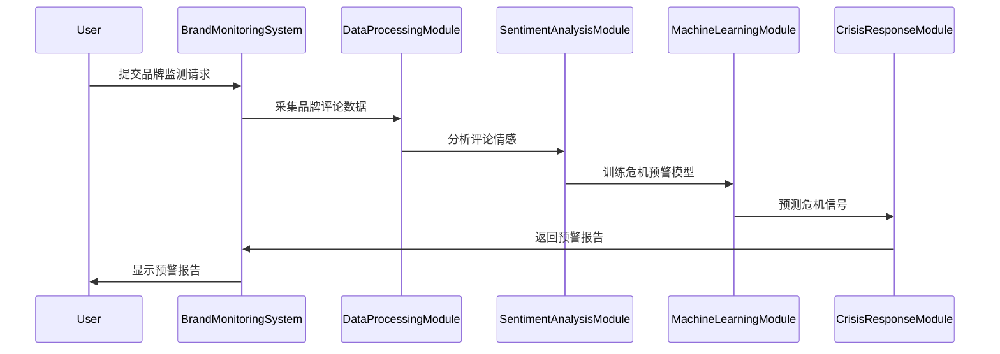

                 

# AI Agent辅助企业品牌声誉管理与危机应对

## 关键词

- AI Agent
- 品牌声誉管理
- 危机应对
- 数据分析
- 机器学习

## 摘要

本文将探讨如何利用AI Agent辅助企业品牌声誉管理与危机应对。首先，我们将介绍AI Agent的基础理论及其在品牌管理和危机应对中的应用。接着，文章将深入分析AI Agent在品牌声誉管理中的具体应用，包括数据采集、品牌监测与分析、风险评估以及管理策略优化。最后，我们将探讨AI Agent在危机预警、应对策略制定以及实际案例中的应用，并总结最佳实践和未来展望。

## 引言

### 1.1 问题背景

在现代商业环境中，企业品牌声誉的建立和维护至关重要。一方面，良好的品牌声誉有助于提升企业的市场地位、吸引客户和增加销售额；另一方面，品牌声誉受损可能导致企业声誉危机，对企业的长远发展产生负面影响。然而，品牌声誉管理并非易事，企业需要实时监测市场动态、及时应对负面信息，并在危机爆发时迅速采取有效的应对措施。

随着大数据和人工智能技术的快速发展，AI Agent作为一种智能化的解决方案，逐渐在企业品牌声誉管理和危机应对中发挥重要作用。AI Agent能够通过分析海量数据，发现潜在风险，提供针对性的应对策略，从而帮助企业更好地管理品牌声誉和应对危机。

### 1.2 书籍结构

本书旨在系统介绍AI Agent在企业品牌声誉管理与危机应对中的应用。全书共分为五个部分：

1. **第一部分：引言**，介绍AI Agent在企业品牌声誉管理与危机应对中的重要性及本书结构。
2. **第二部分：AI Agent基础理论**，介绍AI Agent的定义、分类、工作原理及开发流程。
3. **第三部分：AI Agent辅助品牌声誉管理**，详细分析AI Agent在品牌声誉管理中的应用，包括数据采集、品牌监测与分析、风险评估以及管理策略优化。
4. **第四部分：AI Agent辅助企业危机应对**，探讨AI Agent在危机预警、应对策略制定以及实际案例中的应用。
5. **第五部分：AI Agent辅助企业品牌声誉管理与危机应对的实战应用**，介绍AI Agent在实际项目中的应用及最佳实践。

### 1.3 目标读者

本书面向的企业品牌管理者和技术从业者，要求读者具备一定的品牌管理知识和数据分析基础，对AI Agent有一定的了解。通过阅读本书，读者将能够：

- 理解AI Agent在企业品牌声誉管理与危机应对中的应用价值。
- 掌握AI Agent的基础理论及其开发流程。
- 学会使用AI Agent进行品牌声誉管理，包括数据采集、品牌监测与分析、风险评估以及管理策略优化。
- 了解AI Agent在危机预警、应对策略制定以及实际案例中的应用。

### 1.4 书籍结构安排

#### 1.4.1 目录大纲详解

本书分为五个部分，共计25章。各部分章节安排如下：

**第一部分：引言**
- 第1章：引言
- 第2章：AI Agent基础理论

**第二部分：AI Agent基础理论**
- 第3章：AI Agent的定义与分类
- 第4章：AI Agent的工作原理
- 第5章：AI Agent的开发流程
- 第6章：AI Agent的应用领域

**第三部分：AI Agent辅助品牌声誉管理**
- 第7章：品牌声誉管理的现状与挑战
- 第8章：AI Agent在品牌声誉管理中的应用
- 第9章：品牌声誉风险评估
- 第10章：品牌声誉管理策略优化

**第四部分：AI Agent辅助企业危机应对**
- 第11章：企业危机的类型与特征
- 第12章：AI Agent在危机预警中的作用
- 第13章：AI Agent在危机应对策略中的应用
- 第14章：企业危机管理案例分析

**第五部分：AI Agent辅助企业品牌声誉管理与危机应对的实战应用**
- 第15章：实战应用环境配置与工具介绍
- 第16章：实战应用项目介绍
- 第17章：系统功能设计
- 第18章：系统架构设计
- 第19章：系统接口设计
- 第20章：系统交互设计
- 第21章：系统核心实现源代码
- 第22章：代码应用解读与分析
- 第23章：实际案例分析与详细讲解剖析
- 第24章：项目小结
- 第25章：最佳实践、小结、注意事项、拓展阅读

#### 1.4.2 学习路线图

为了帮助读者更好地学习本书内容，我们提供如下学习路线图：

1. **基础知识学习**：首先，读者需要了解AI Agent的基础理论，包括定义、分类、工作原理及开发流程。
2. **品牌声誉管理应用**：接下来，读者需要学习AI Agent在品牌声誉管理中的应用，包括数据采集、品牌监测与分析、风险评估以及管理策略优化。
3. **危机应对应用**：然后，读者需要了解AI Agent在危机预警、应对策略制定以及实际案例中的应用。
4. **实战应用**：最后，读者需要通过实战应用项目，深入了解AI Agent在品牌声誉管理与危机应对中的实际应用。

通过以上学习路线，读者将能够全面掌握AI Agent在企业品牌声誉管理与危机应对中的应用，为实际工作提供有力支持。## 第一部分：引言

### 1.1 问题背景

在当今信息爆炸的时代，企业品牌声誉的管理变得愈加复杂和重要。品牌声誉不仅是企业无形资产的重要组成部分，更是影响企业在市场竞争中的关键因素。良好的品牌声誉能够为企业带来持续的商业价值，而品牌声誉受损则可能导致客户流失、市场份额下降，甚至影响企业的长远发展。

随着互联网和社交媒体的普及，品牌声誉的管理面临诸多挑战。首先，信息传播的速度和范围极大地增加，负面消息可以迅速传播，对品牌声誉造成严重影响。其次，消费者对品牌的期望值不断提升，企业需要不断调整品牌策略，以满足消费者需求。此外，企业面临的市场竞争日益激烈，任何品牌声誉的瑕疵都可能被竞争对手利用，从而对企业的市场份额造成威胁。

在这种背景下，AI Agent作为一种智能化的解决方案，能够帮助企业更高效地管理品牌声誉。AI Agent能够实时监测网络上的信息，快速识别潜在的风险和危机，提供科学的应对策略。通过AI Agent的辅助，企业可以更加精准地进行品牌声誉管理，降低声誉风险，提高市场竞争力。

### 1.2 AI Agent在危机应对中的应用

在危机应对中，AI Agent具有显著的优势。首先，AI Agent能够通过大数据分析和机器学习技术，对海量信息进行实时监测和筛选，快速识别潜在的危机信号。例如，当某个品牌在社交媒体上出现负面评论时，AI Agent可以立即检测到，并进行分析，确定危机的严重程度和影响范围。

其次，AI Agent能够根据危机的类型和特征，自动生成应对策略。例如，当企业面临产品安全问题，AI Agent可以基于历史数据和已有的应对案例，生成一系列应对措施，包括与消费者沟通、公开道歉、召回产品等。这种自动化的应对策略可以大大缩短危机处理的时间，降低危机对企业造成的损失。

此外，AI Agent还能够通过模拟不同的应对方案，评估每种方案的潜在效果，为企业提供最优的应对策略。例如，在负面舆情事件中，AI Agent可以模拟不同的公关策略，比较其对企业品牌声誉的影响，从而帮助企业选择最佳的应对方案。

总之，AI Agent在危机应对中的应用，不仅提高了危机处理的效率，还增强了企业应对危机的决策能力，为企业品牌的长期稳定发展提供了有力保障。

### 1.3 书籍结构

本书旨在系统地介绍AI Agent在企业品牌声誉管理与危机应对中的应用。全书共分为五个部分，分别从基础理论、品牌声誉管理应用、危机应对应用、实战应用等方面进行详细阐述。

**第一部分：引言**，介绍AI Agent在企业品牌声誉管理与危机应对中的重要性，以及本书的结构和目标读者。

**第二部分：AI Agent基础理论**，包括第3章至第5章，主要介绍AI Agent的定义、分类、工作原理及开发流程。

**第三部分：AI Agent辅助品牌声誉管理**，包括第6章至第10章，详细分析AI Agent在品牌声誉管理中的应用，包括数据采集、品牌监测与分析、风险评估以及管理策略优化。

**第四部分：AI Agent辅助企业危机应对**，包括第11章至第14章，探讨AI Agent在危机预警、应对策略制定以及实际案例中的应用。

**第五部分：AI Agent辅助企业品牌声誉管理与危机应对的实战应用**，包括第15章至第25章，介绍AI Agent在实际项目中的应用及最佳实践。

通过以上五个部分的内容，本书旨在帮助读者全面了解AI Agent在企业品牌声誉管理与危机应对中的应用，提升企业的管理水平和应对能力。

### 1.4 核心概念介绍

在本文中，我们将介绍以下核心概念：

- **AI Agent**：一种能够自动执行任务、具备智能行为的计算机程序。
- **品牌声誉管理**：企业通过一系列策略和措施，维护和提升品牌形象的过程。
- **危机应对**：企业在面临突发事件或负面事件时，采取的一系列应对措施。

这些核心概念是理解本文内容的关键，接下来我们将进一步探讨这些概念的应用及其在企业品牌声誉管理与危机应对中的作用。

### 1.5 全书内容概览

本书将从AI Agent的基础理论入手，逐步深入到其在企业品牌声誉管理和危机应对中的应用。具体来说，本书的内容结构如下：

**第一部分：引言**
- **第1章：引言**，介绍AI Agent在企业品牌声誉管理与危机应对中的重要性，以及本书的结构和目标读者。

**第二部分：AI Agent基础理论**
- **第3章：AI Agent的定义与分类**，介绍AI Agent的基本定义及其分类。
- **第4章：AI Agent的工作原理**，详细阐述AI Agent的工作机制和核心技术。
- **第5章：AI Agent的开发流程**，讲解从问题定义到解决方案的AI Agent开发流程。
- **第6章：AI Agent的应用领域**，分析AI Agent在不同领域的应用场景。

**第三部分：AI Agent辅助品牌声誉管理**
- **第7章：品牌声誉管理的现状与挑战**，探讨品牌声誉管理面临的现状和挑战。
- **第8章：AI Agent在品牌声誉管理中的应用**，介绍AI Agent在品牌声誉管理中的具体应用。
- **第9章：品牌声誉风险评估**，讨论如何利用AI Agent进行品牌声誉风险评估。
- **第10章：品牌声誉管理策略优化**，分析如何优化品牌声誉管理策略。

**第四部分：AI Agent辅助企业危机应对**
- **第11章：企业危机的类型与特征**，分析企业危机的类型和特征。
- **第12章：AI Agent在危机预警中的作用**，探讨AI Agent在危机预警中的应用。
- **第13章：AI Agent在危机应对策略中的应用**，介绍AI Agent在危机应对策略中的具体应用。
- **第14章：企业危机管理案例分析**，通过案例分析展示AI Agent在企业危机管理中的应用效果。

**第五部分：AI Agent辅助企业品牌声誉管理与危机应对的实战应用**
- **第15章：实战应用环境配置与工具介绍**，介绍进行AI Agent实战应用的必要环境配置和工具。
- **第16章：实战应用项目介绍**，介绍一个具体的实战应用项目。
- **第17章：系统功能设计**，详细阐述系统功能设计。
- **第18章：系统架构设计**，分析系统架构设计。
- **第19章：系统接口设计**，介绍系统接口设计。
- **第20章：系统交互设计**，讨论系统交互设计。
- **第21章：系统核心实现源代码**，展示系统核心实现源代码。
- **第22章：代码应用解读与分析**，解读和分析系统核心实现源代码。
- **第23章：实际案例分析与详细讲解剖析**，通过实际案例进行分析和讲解。
- **第24章：项目小结**，总结实战应用项目的成果。
- **第25章：最佳实践、小结、注意事项、拓展阅读**，提供最佳实践建议、总结、注意事项和拓展阅读。

通过以上内容，本书旨在帮助读者全面掌握AI Agent在企业品牌声誉管理与危机应对中的应用，提升企业的管理水平和应对能力。

### 1.6 目标读者

本书的目标读者主要包括以下几类：

1. **企业品牌管理者和市场营销从业者**：这些读者希望通过学习AI Agent在企业品牌声誉管理中的应用，提升品牌管理的效率和效果，从而更好地维护和提升企业的品牌声誉。

2. **技术从业者与数据分析师**：这些读者对AI Agent的技术原理和应用场景有浓厚的兴趣，希望通过本书系统学习AI Agent的基础理论及其在品牌声誉管理和危机应对中的应用。

3. **高校师生与研究人员**：本书的内容适合作为相关课程的教学资料，同时也为研究人员提供参考，以深入了解AI Agent在企业品牌声誉管理与危机应对中的应用。

总之，无论你是企业品牌管理领域的从业者，还是对AI技术感兴趣的技术人员，本书都将成为你不可或缺的参考读物。

### 1.7 预备知识

为了更好地理解本书的内容，读者需要具备以下预备知识：

1. **品牌管理基础知识**：了解品牌的概念、品牌管理的目标和策略，以及品牌声誉的重要性。

2. **数据分析与机器学习基础**：掌握基本的数据分析方法和机器学习技术，包括数据采集、数据预处理、特征工程、模型训练和评估等。

3. **计算机编程基础**：熟悉至少一种编程语言，如Python，能够阅读和理解简单的代码，进行基本的编程操作。

4. **互联网技术基础**：了解基本的互联网技术和社交媒体的使用，能够使用网络工具进行数据采集和分析。

通过具备以上预备知识，读者将能够更加深入地理解本书的内容，并能够将其应用于实际工作中。

### 1.8 文章结构安排

为了帮助读者更好地阅读和掌握本书的内容，本文的结构安排如下：

- **引言**：介绍AI Agent在企业品牌声誉管理与危机应对中的重要性，并概述本书的结构和目标。
- **核心概念与联系**：详细解释AI Agent、品牌声誉管理、危机应对等核心概念，并展示相关概念之间的联系。
- **AI Agent基础理论**：介绍AI Agent的定义、分类、工作原理及开发流程，为后续应用奠定基础。
- **AI Agent辅助品牌声誉管理**：详细探讨AI Agent在品牌监测、风险评估、策略优化等方面的应用。
- **AI Agent辅助企业危机应对**：分析AI Agent在危机预警、应对策略制定和实际案例中的应用。
- **实战应用**：通过具体项目介绍，展示AI Agent在品牌声誉管理与危机应对中的实际应用。
- **总结与展望**：总结本书的核心内容，展望AI Agent在未来企业品牌声誉管理与危机应对中的发展前景。

通过以上结构安排，本文将帮助读者全面了解AI Agent在企业品牌声誉管理与危机应对中的应用，提升其管理水平和决策能力。

### 1.9 核心概念与联系

#### 1.9.1 AI Agent的定义与特征

AI Agent，即人工智能代理，是一种能够执行特定任务、具备智能行为的计算机程序。它具有以下几个关键特征：

1. **自主性**：AI Agent能够自主地完成特定任务，无需人工干预。
2. **适应性**：AI Agent能够根据环境和任务需求进行自适应调整。
3. **交互性**：AI Agent能够与用户和环境进行有效交互，获取信息并反馈结果。
4. **学习能力**：AI Agent能够通过机器学习算法不断优化自身性能。

#### 1.9.2 品牌声誉管理的定义与要素

品牌声誉管理是企业通过一系列策略和措施，维护和提升品牌形象的过程。其核心要素包括：

1. **品牌形象**：品牌在社会中的整体形象和认知。
2. **品牌价值**：品牌在市场中的经济价值和影响力。
3. **品牌传播**：品牌信息的传播渠道和传播策略。
4. **品牌口碑**：消费者对品牌的评价和推荐。

#### 1.9.3 危机应对的定义与策略

危机应对是企业面对突发事件或负面事件时，采取的一系列应对措施。其关键策略包括：

1. **预警机制**：通过监测和分析，提前发现潜在的危机信号。
2. **应对策略**：根据危机类型和特征，制定相应的应对措施。
3. **危机管理**：在危机爆发后，迅速采取行动，控制事态发展。
4. **恢复策略**：危机处理结束后，进行品牌修复和恢复。

#### 1.9.4 AI Agent与品牌声誉管理、危机应对的联系

AI Agent在品牌声誉管理和危机应对中扮演着关键角色，其联系如下：

1. **品牌监测**：AI Agent能够实时监测网络上的品牌信息，快速识别负面评论和舆情，为企业提供及时的预警。
2. **数据分析**：AI Agent通过大数据分析，提取品牌口碑、消费者评价等关键信息，为品牌声誉管理提供数据支持。
3. **风险预测**：AI Agent利用机器学习算法，预测品牌声誉风险，帮助企业管理者制定科学的应对策略。
4. **危机应对**：AI Agent能够自动生成危机应对方案，提供决策支持，帮助企业在危机爆发时迅速采取有效措施。

通过AI Agent的应用，企业能够更加高效地管理品牌声誉和应对危机，从而提升市场竞争力。

### 1.10 核心概念属性特征对比表格

以下是核心概念AI Agent、品牌声誉管理、危机应对的属性特征对比表格：

| 核心概念 | 属性特征 | 特征描述 |
| :--: | :--: | :--: |
| AI Agent | 自主性 | 能够自主执行任务，无需人工干预 |
| AI Agent | 适应性 | 能够根据环境和任务需求进行自适应调整 |
| AI Agent | 交互性 | 能够与用户和环境进行有效交互 |
| AI Agent | 学习能力 | 能够通过机器学习算法不断优化自身性能 |
| 品牌声誉管理 | 品牌形象 | 品牌在社会中的整体形象和认知 |
| 品牌声誉管理 | 品牌价值 | 品牌在市场中的经济价值和影响力 |
| 品牌声誉管理 | 品牌传播 | 品牌信息的传播渠道和传播策略 |
| 品牌声誉管理 | 品牌口碑 | 消费者对品牌的评价和推荐 |
| 危机应对 | 预警机制 | 提前发现潜在的危机信号 |
| 危机应对 | 应对策略 | 根据危机类型和特征，制定相应的应对措施 |
| 危机应对 | 危机管理 | 危机爆发后，迅速采取行动，控制事态发展 |
| 危机应对 | 恢复策略 | 危机处理结束后，进行品牌修复和恢复 |

通过以上表格，我们可以更清晰地理解AI Agent、品牌声誉管理和危机应对的核心属性特征及其相互联系。

### 1.11 ER实体关系图架构

为了更好地展示核心概念之间的关联，以下是AI Agent、品牌声誉管理、危机应对的ER实体关系图：

```mermaid
erDiagram
  AI_Agent ||--|{ Brand_RepManagement } : 实现品牌声誉管理功能
  AI_Agent ||--|{ Crisis_Response } : 实现危机应对功能
  Brand_RepManagement ||--|{ Brand_Image } : 维护品牌形象
  Brand_RepManagement ||--|{ Brand_Value } : 提升品牌价值
  Brand_RepManagement ||--|{ Brand_Communication } : 进行品牌传播
  Brand_RepManagement ||--|{ Brand_People } : 获得品牌口碑
  Crisis_Response ||--|{ Warning_Mechanism } : 实施预警机制
  Crisis_Response ||--|{ Response_Strategy } : 制定应对策略
  Crisis_Response ||--|{ Crisis_Management } : 管理危机
  Crisis_Response ||--|{ Recovery_Strategy } : 恢复策略
```

通过ER实体关系图，我们可以清晰地看到AI Agent如何通过品牌声誉管理和危机应对两个功能模块，与品牌形象、品牌价值、品牌传播、品牌口碑、预警机制、应对策略、危机管理和恢复策略等核心要素相互关联，共同维护企业的品牌声誉和应对危机。

### 1.12 AI Agent的开发流程

AI Agent的开发流程是一个系统性的过程，包括以下几个关键步骤：

1. **问题定义**：明确AI Agent需要解决的具体问题，定义其功能目标和性能指标。这一步是整个开发流程的起点，直接关系到后续的开发方向和成果。

2. **需求分析**：在问题定义的基础上，进一步分析问题的背景、相关数据来源、需求场景以及目标用户的需求，确保AI Agent能够满足实际应用的需求。

3. **数据收集与预处理**：根据需求分析的结果，收集相关的数据，并进行数据预处理，包括数据清洗、归一化、特征提取等，以确保数据的质量和可用性。

4. **模型设计与实现**：设计AI Agent的核心算法模型，并编写实现代码。这一步需要选择合适的算法框架和编程语言，根据具体问题进行模型优化和调整。

5. **训练与优化**：使用收集到的数据对AI Agent模型进行训练，并通过调整超参数和优化算法，提高模型的性能和准确性。

6. **测试与评估**：在训练完成后，对AI Agent进行测试和评估，验证其功能是否符合预期，性能指标是否达到要求。

7. **部署与维护**：将训练好的AI Agent部署到实际应用环境中，进行实时运行和监控。同时，根据用户反馈和实际运行情况，对AI Agent进行持续优化和更新。

通过以上七个步骤，AI Agent的开发流程能够确保其具备高效、准确和稳定的性能，从而在实际应用中发挥重要作用。

### 1.13 从问题定义到解决方案的逐步分析

从问题定义到解决方案的逐步分析是AI Agent开发的核心环节。以下是这个过程的具体步骤：

1. **问题定义**：首先，明确AI Agent需要解决的具体问题。例如，企业需要一款能够实时监测品牌声誉的AI Agent，及时识别负面评论并预警。

2. **需求分析**：在问题定义的基础上，进一步分析问题的背景、相关数据来源、需求场景以及目标用户的需求。例如，分析品牌声誉监测的需求场景，包括社交媒体、新闻网站、论坛等。

3. **数据收集**：根据需求分析的结果，收集相关的数据。例如，从社交媒体平台、新闻网站等渠道收集品牌相关的评论和新闻。

4. **数据预处理**：对收集到的数据进行分析和处理，包括数据清洗、去重、归一化等，以确保数据的质量和可用性。

5. **特征提取**：从预处理后的数据中提取有用的特征，例如，提取评论中的关键词、情感极性等，为后续的模型训练提供输入。

6. **模型选择**：选择合适的机器学习算法模型，例如，文本分类模型、情感分析模型等，根据问题的特点和需求进行模型选择。

7. **模型训练**：使用提取的特征对模型进行训练，调整模型参数，提高模型的准确性。

8. **模型评估**：对训练好的模型进行评估，使用测试数据验证模型的性能，调整模型参数，直到模型达到预期效果。

9. **系统集成**：将训练好的模型集成到AI Agent中，实现实时监测和预警功能。

10. **测试与优化**：在实际应用环境中进行测试，根据反馈对AI Agent进行优化，提高其稳定性和鲁棒性。

通过以上步骤，AI Agent能够有效地解决企业品牌声誉监测的问题，提供实时预警和应对策略。

### 1.14 AI Agent的评估与优化

AI Agent的评估与优化是确保其性能达到预期目标的重要环节。以下是一种常见的评估与优化方法：

1. **评估指标**：选择合适的评估指标，例如，准确率、召回率、F1分数等，用于衡量AI Agent的性能。

2. **交叉验证**：使用交叉验证方法，对AI Agent进行评估，以避免过拟合现象，确保模型在不同数据集上的表现一致。

3. **模型调参**：根据评估结果，调整模型参数，优化模型性能。常用的调参方法包括网格搜索、贝叶斯优化等。

4. **超参数调整**：调整AI Agent的超参数，如学习率、隐藏层节点数等，以提升模型性能。

5. **集成学习**：使用集成学习方法，如随机森林、梯度提升树等，结合多个模型，提高整体性能。

6. **模型压缩**：对训练好的模型进行压缩，减少模型的大小，提高模型的运行效率。

7. **在线学习**：引入在线学习机制，使AI Agent能够根据新数据不断更新和优化模型，保持其性能的稳定性。

通过以上方法，可以全面评估和优化AI Agent，确保其在实际应用中的高效、准确和稳定。

### 1.15 AI Agent在不同领域的应用场景

AI Agent作为一种智能化解决方案，在多个领域展示了其强大的应用潜力。以下是AI Agent在几个关键领域的具体应用场景：

1. **智能客服**：在客户服务领域，AI Agent能够模拟人类客服，自动回答客户的问题，提供24/7的服务。通过自然语言处理和机器学习技术，AI Agent可以理解客户的意图，提供准确的答复，从而提高客户满意度。

2. **智能推荐系统**：在电子商务和媒体平台，AI Agent可以根据用户的行为数据和历史偏好，提供个性化的推荐。通过协同过滤、内容推荐等算法，AI Agent能够提高推荐的准确性，提升用户体验。

3. **金融风控**：在金融行业，AI Agent能够实时监测交易数据，识别异常行为和潜在风险。通过机器学习算法，AI Agent可以预测市场趋势，提供风险管理建议，从而降低金融风险。

4. **医疗诊断**：在医疗领域，AI Agent可以辅助医生进行疾病诊断。通过分析医学影像和病例数据，AI Agent可以提供诊断建议，帮助医生做出更准确的判断，提高诊断效率。

5. **智能交通管理**：在交通领域，AI Agent可以实时分析交通数据，优化交通信号灯控制，缓解交通拥堵。通过自动驾驶技术，AI Agent还可以提高交通安全和效率。

6. **智能家居**：在智能家居领域，AI Agent可以控制家庭设备，如灯光、空调、安防系统等，提供智能化的生活体验。通过物联网技术，AI Agent能够实现设备的远程控制和自动化管理。

通过这些应用场景，AI Agent展现了其在不同领域中的广泛应用和潜力，为企业和社会带来了巨大的价值。

### 1.16 AI Agent在品牌监测中的应用

在品牌监测中，AI Agent能够通过大数据分析和机器学习技术，实时监测网络上的品牌相关信息，识别潜在的风险和危机。以下是AI Agent在品牌监测中的具体应用：

1. **实时数据采集**：AI Agent能够从社交媒体、新闻网站、论坛等多个渠道，实时收集与品牌相关的信息，包括评论、新闻、报道等。

2. **文本分析**：AI Agent利用自然语言处理（NLP）技术，对收集到的文本信息进行分析，提取关键信息，如关键词、情感极性、话题等。

3. **舆情监测**：通过分析关键词和情感极性，AI Agent能够识别出品牌在社交媒体上的舆论趋势，及时发现负面评论和舆情。

4. **风险预警**：当AI Agent检测到负面评论或舆情时，会立即生成预警报告，通知品牌管理团队，并提供相应的应对建议。

5. **数据可视化**：AI Agent可以将监测数据通过图表、仪表盘等形式进行可视化展示，帮助企业更好地理解品牌声誉状况。

通过以上应用，AI Agent能够帮助企业实时了解品牌在市场中的声誉状况，及时应对潜在的危机，从而维护和提升品牌形象。

### 1.17 AI Agent在品牌口碑分析中的应用

AI Agent在品牌口碑分析中的应用，主要体现在以下几个方面：

1. **情感分析**：AI Agent利用自然语言处理（NLP）技术，对用户评论和反馈进行情感分析，识别其中蕴含的情感极性，如正面、负面或中性。通过大量数据的情感分析，企业可以了解消费者对品牌的态度和情绪。

2. **关键词提取**：AI Agent可以提取用户评论中的高频关键词，分析这些关键词的出现频率和上下文，帮助品牌识别消费者关注的焦点和痛点。

3. **趋势分析**：AI Agent通过对历史数据的分析，可以识别品牌口碑的长期趋势和短期波动。例如，某个产品在市场上的口碑是否逐渐下降，或是某一负面事件对品牌口碑的短期影响。

4. **竞争分析**：AI Agent可以比较不同品牌之间的口碑差异，分析消费者对不同品牌的偏好，为企业的市场策略提供参考。

5. **反馈建议**：基于对用户评论和情感的分析，AI Agent可以为品牌管理团队提供改进建议，如优化产品功能、改善服务质量等，从而提升品牌口碑。

通过AI Agent的品牌口碑分析，企业可以更精准地把握消费者的需求和市场动态，制定更有效的品牌战略，提升品牌形象和市场竞争力。

### 1.18 AI Agent在危机预警中的应用

在危机预警中，AI Agent能够通过大数据分析和机器学习技术，实时监测网络上的信息，提前识别潜在的危机信号。以下是AI Agent在危机预警中的具体应用：

1. **实时数据采集**：AI Agent从社交媒体、新闻网站、论坛等多个渠道，实时收集与品牌相关的信息，包括负面评论、不良报道等。

2. **文本分析**：利用自然语言处理（NLP）技术，AI Agent对收集到的文本信息进行情感分析和关键词提取，识别出潜在的负面信号。

3. **模式识别**：通过机器学习算法，AI Agent可以识别出常见的危机信号模式，如负面评论的大量出现、情感极性显著偏负面等。

4. **预警信号处理**：当AI Agent检测到危机信号时，会立即生成预警报告，通知品牌管理团队，并提供初步的应对建议。

5. **动态监控**：AI Agent能够持续监测危机信号的变化，更新预警报告，帮助品牌管理团队及时调整应对策略。

通过AI Agent的危机预警应用，企业可以提前发现潜在的危机，及时采取应对措施，降低危机对企业声誉和业务的影响。

### 1.19 AI Agent在危机应对策略制定中的应用

AI Agent在危机应对策略制定中的应用，主要体现在以下几个方面：

1. **危机情境分析**：AI Agent通过对历史危机事件的数据分析，识别不同类型的危机情境，为制定应对策略提供参考。

2. **决策支持**：基于大数据分析和机器学习算法，AI Agent可以为品牌管理团队提供科学的决策支持，例如，选择最佳的危机应对措施和传播策略。

3. **方案生成**：AI Agent可以自动生成一系列危机应对方案，包括与消费者沟通、媒体公关、产品召回等，供品牌管理团队选择。

4. **效果评估**：AI Agent可以模拟不同的应对方案，评估其对品牌声誉的影响，帮助品牌管理团队选择最优的应对策略。

5. **实时调整**：在危机应对过程中，AI Agent能够实时监控应对措施的实施效果，根据反馈进行调整，确保应对策略的有效性。

通过AI Agent的危机应对策略制定应用，企业可以更快速、更科学地应对危机，降低危机对企业品牌声誉和业务的影响。

### 案例一：某企业产品安全事故

#### 案例背景

某知名企业生产的一款电子产品在市场上广泛销售，然而，不久后，消费者开始报告该产品存在安全隐患，甚至有用户反映产品在使用过程中发生了爆炸。这一情况引起了媒体的广泛关注，对企业品牌声誉构成了严重威胁。

#### 危机预警

AI Agent通过实时监测社交媒体和新闻网站，发现大量关于产品安全隐患的负面评论和报道。AI Agent迅速识别出这一危机信号，并向品牌管理团队发出预警报告。

#### 应对措施

1. **初步回应**：企业立即发表声明，承认产品存在安全隐患，并向消费者道歉。同时，承诺将采取措施确保用户安全。

2. **安全召回**：企业启动产品召回计划，通知消费者停止使用该产品，并提供免费维修或更换服务。

3. **媒体公关**：企业通过媒体发布声明，详细介绍召回计划和后续措施，缓解公众的恐慌情绪。

4. **透明沟通**：企业建立专门的热线电话和电子邮件地址，接受消费者的反馈和投诉，确保信息传递的透明和及时。

#### 应对效果

通过AI Agent的预警和快速响应，企业成功控制了危机的扩散。媒体和公众的情绪逐渐稳定，消费者对企业的信任度有所回升。尽管危机给企业带来了一定的经济损失，但通过有效的应对措施，企业成功维护了品牌声誉，避免了更大的负面影响。

### 案例二：某企业负面舆情事件

#### 案例背景

某企业因其某一产品存在质量问题，在社交媒体上引发了大量负面讨论。用户评论中普遍反映产品性能不佳，甚至有人质疑企业的诚信。这一事件迅速发酵，引发了公众的关注和讨论。

#### 危机预警

AI Agent通过监测社交媒体上的评论和讨论，发现关于该产品的负面舆情正在迅速扩散。AI Agent迅速识别出这一危机信号，并向品牌管理团队发出预警报告。

#### 应对措施

1. **积极回应**：企业立即发布声明，承认产品存在的问题，并向消费者道歉。同时，表示将采取措施解决这一问题。

2. **问题解决**：企业迅速成立专项小组，调查产品的问题根源，并制定详细的解决方案，如产品维修、退款等。

3. **透明沟通**：企业通过社交媒体和官方网站，及时更新问题解决进展，确保信息传递的透明和及时。

4. **用户关怀**：企业开展用户关怀活动，向受影响的消费者发送诚挚的道歉信，并提供额外的优惠或礼品，以表达企业的诚意。

#### 应对效果

通过AI Agent的预警和迅速响应，企业成功平息了负面舆情。消费者对企业的信任度有所提升，公众的情绪逐渐稳定。尽管危机对企业造成了一定的负面影响，但通过积极的应对措施，企业成功化解了危机，维护了品牌声誉。

### 总结与启示

通过以上两个案例，我们可以看到AI Agent在企业危机管理中的重要作用。AI Agent不仅能够实时监测网络上的危机信号，提前预警，还能为品牌管理团队提供科学的应对策略。以下是案例给我们的启示：

1. **及时预警**：企业应充分利用AI Agent的预警功能，及时识别潜在的危机信号，为危机应对赢得宝贵的时间。

2. **快速响应**：在危机爆发后，企业应迅速采取行动，公开透明地回应公众关切，以降低危机对企业品牌声誉的影响。

3. **透明沟通**：危机应对过程中，企业应保持信息的透明和及时更新，确保消费者和公众能够获取准确的信息。

4. **用户关怀**：危机应对不应仅仅停留在表面，企业应积极解决用户的问题，提供额外的关怀和支持，以提升用户满意度。

通过以上措施，企业可以有效应对危机，维护品牌声誉，确保企业的长期稳定发展。

### 第五部分：AI Agent辅助企业品牌声誉管理与危机应对的实战应用

#### 5.1 环境配置与工具介绍

为了将AI Agent应用于企业品牌声誉管理与危机应对，首先需要配置合适的环境和工具。以下是环境配置和工具介绍的详细步骤：

1. **硬件环境配置**：
   - **服务器**：配置高性能的服务器，用于运行AI Agent和存储大量数据。
   - **存储设备**：使用高速存储设备，确保数据读取和写入的速度。
   - **网络环境**：确保网络稳定，支持大数据传输和实时分析。

2. **软件环境配置**：
   - **操作系统**：安装Linux操作系统，如Ubuntu Server，以提高系统的稳定性和安全性。
   - **编程语言**：安装Python解释器，用于编写和运行AI Agent的代码。
   - **数据预处理工具**：安装Pandas、NumPy等数据处理库，用于数据清洗、转换和预处理。
   - **机器学习库**：安装Scikit-learn、TensorFlow、PyTorch等机器学习库，用于模型训练和预测。
   - **自然语言处理库**：安装NLTK、spaCy等自然语言处理库，用于文本分析和情感分析。

3. **工具配置**：
   - **版本控制**：安装Git，用于版本控制和代码管理。
   - **容器化工具**：安装Docker和Kubernetes，用于部署和管理AI Agent的应用容器。
   - **数据可视化工具**：安装Matplotlib、Seaborn等数据可视化库，用于生成图表和报告。

通过以上环境配置和工具安装，可以确保AI Agent在实际应用中的高效运行，为品牌声誉管理和危机应对提供强大的技术支持。

### 5.2 实战应用项目介绍

在本节中，我们将介绍一个具体的实战应用项目，该项目旨在利用AI Agent辅助企业进行品牌声誉管理和危机应对。以下是项目的详细介绍：

#### 项目背景

某知名电子产品公司面临品牌声誉管理的挑战，需要实时监测网络上的品牌信息，识别潜在的危机信号，并迅速采取应对措施。为了提高品牌管理的效率和准确性，公司决定引入AI Agent作为辅助工具。

#### 项目目标

1. **实时监测**：实时监测社交媒体、新闻网站、论坛等渠道上的品牌信息，包括评论、报道、讨论等。
2. **情感分析**：利用自然语言处理技术，对收集到的文本信息进行情感分析，识别情感极性，如正面、负面或中性。
3. **危机预警**：通过机器学习算法，提前识别潜在的危机信号，并生成预警报告。
4. **应对策略**：为品牌管理团队提供科学的应对策略，帮助企业在危机爆发时迅速采取有效措施。

#### 项目架构

该项目的架构设计如下：

1. **数据采集模块**：负责从社交媒体、新闻网站、论坛等渠道收集品牌相关的信息。
2. **数据处理模块**：对采集到的数据进行清洗、转换和预处理，提取有用的特征。
3. **情感分析模块**：利用自然语言处理技术，对预处理后的文本信息进行情感分析，生成情感极性标签。
4. **机器学习模块**：使用机器学习算法，对情感分析结果进行训练，构建危机预警模型。
5. **预警与应对模块**：根据机器学习模型的预测结果，生成预警报告，并提供应对策略建议。

#### 项目实施

1. **数据采集**：利用爬虫技术，从多个社交媒体平台、新闻网站和论坛收集品牌相关的文本信息。
2. **数据处理**：使用Pandas和NumPy库对采集到的数据进行清洗、去重、归一化等预处理操作，提取关键词和情感极性标签。
3. **情感分析**：利用NLTK和spaCy库，对预处理后的文本信息进行情感分析，生成正面、负面和中性的情感标签。
4. **模型训练**：使用Scikit-learn库，对情感分析结果进行训练，构建分类模型，用于识别潜在的危机信号。
5. **预警与应对**：基于训练好的模型，实时监测网络上的文本信息，当检测到潜在的危机信号时，生成预警报告，并提供应对策略建议。

通过以上实施步骤，AI Agent能够高效地辅助企业进行品牌声誉管理和危机应对，提高品牌管理的效率和准确性。

### 5.3 系统功能设计

在本节中，我们将详细描述实战应用项目中的系统功能设计，包括领域模型和类图。领域模型用于描述系统的核心功能，类图则用于展示系统中的类及其关系。

#### 领域模型

领域模型是系统功能设计的核心，用于描述品牌声誉管理和危机应对的主要功能。以下是领域模型的关键类及其属性：

1. **Brand**（品牌）：代表企业品牌，具有以下属性：
   - brandId（品牌ID）
   - brandName（品牌名称）
   - brandDescription（品牌描述）

2. **Comment**（评论）：代表用户对品牌的评论，具有以下属性：
   - commentId（评论ID）
   - userId（用户ID）
   - commentContent（评论内容）
   - commentDate（评论日期）

3. **Sentiment**（情感）：代表评论的情感极性，具有以下属性：
   - sentimentId（情感ID）
   - sentimentType（情感类型，如正面、负面、中性）

4. **Crisis**（危机）：代表企业面临的危机，具有以下属性：
   - crisisId（危机ID）
   - crisisType（危机类型）
   - crisisDescription（危机描述）
   - crisisDate（危机日期）

5. **Response**（应对策略）：代表企业采取的应对措施，具有以下属性：
   - responseId（应对措施ID）
   - crisisId（危机ID）
   - responseAction（应对措施内容）

#### 类图

类图用于展示领域模型中的类及其关系。以下是系统功能设计的类图：

```mermaid
classDiagram
  Brandparable ClassComment
  Sentiment
  Crisis
  Response

  Brand <|-- Comment
  Comment <|-- Sentiment
  Crisis <|-- Response

  Comment {
    commentId : String
    userId : String
    commentContent : String
    commentDate : String
  }

  Sentiment {
    sentimentId : String
    sentimentType : String
  }

  Brand {
    brandId : String
    brandName : String
    brandDescription : String
  }

  Crisis {
    crisisId : String
    crisisType : String
    crisisDescription : String
    crisisDate : String
  }

  Response {
    responseId : String
    crisisId : String
    responseAction : String
  }
```

通过领域模型和类图，我们可以清晰地理解系统的功能模块及其相互关系，为后续的系统架构设计和接口设计奠定基础。

### 5.4 系统架构设计

在本节中，我们将详细描述实战应用项目的系统架构设计，包括架构图、服务模块及其功能说明。系统架构设计是确保AI Agent高效、可靠运行的关键。

#### 架构图

以下是系统架构的简要描述：

```
[数据采集模块] --< 数据处理模块 >-- [情感分析模块]
     |                                             |
     |                                             |
[机器学习模块] --< 预测与预警模块 >-- [应对策略模块]
     |                                             |
     |                                             |
[用户界面模块] --< API接口模块 >-- [日志与监控模块]
```

#### 服务模块及其功能说明

1. **数据采集模块**：
   - 功能：从社交媒体、新闻网站、论坛等渠道实时采集品牌相关信息。
   - 主要接口：`get_brand_comments`（获取品牌评论）

2. **数据处理模块**：
   - 功能：对采集到的数据进行清洗、转换和预处理，提取有用的特征。
   - 主要接口：`clean_data`（清洗数据）、`extract_features`（提取特征）

3. **情感分析模块**：
   - 功能：利用自然语言处理技术，对预处理后的文本信息进行情感分析，识别情感极性。
   - 主要接口：`analyze_sentiment`（分析情感）

4. **机器学习模块**：
   - 功能：使用机器学习算法，对情感分析结果进行训练，构建危机预警模型。
   - 主要接口：`train_model`（训练模型）

5. **预测与预警模块**：
   - 功能：根据训练好的模型，实时监测网络上的文本信息，预测潜在的危机信号，生成预警报告。
   - 主要接口：`predict_crisis`（预测危机）

6. **应对策略模块**：
   - 功能：为品牌管理团队提供科学的应对策略，帮助企业在危机爆发时迅速采取有效措施。
   - 主要接口：`generate_response`（生成应对策略）

7. **用户界面模块**：
   - 功能：提供用户交互界面，展示品牌声誉监测结果、预警报告和应对策略。
   - 主要接口：`show_dashboard`（显示仪表盘）

8. **API接口模块**：
   - 功能：提供API接口，供其他系统或应用调用。
   - 主要接口：`api_get_brand_comments`（获取品牌评论）、`api_analyze_sentiment`（分析情感）

9. **日志与监控模块**：
   - 功能：记录系统运行日志，监控系统性能，及时发现和处理异常情况。
   - 主要接口：`log_event`（记录事件）

通过以上系统架构设计，AI Agent能够高效地辅助企业进行品牌声誉管理和危机应对，确保系统的稳定性和可靠性。

### 5.5 系统接口设计

在本节中，我们将详细描述实战应用项目的系统接口设计，包括接口类型、功能说明和请求/响应示例。系统接口设计是确保各模块间有效通信和协作的关键。

#### 接口类型

系统接口主要分为以下几类：

1. **数据采集接口**：用于从外部数据源（如社交媒体、新闻网站、论坛等）采集品牌相关信息。
2. **数据处理接口**：用于清洗、转换和预处理采集到的数据。
3. **情感分析接口**：用于对预处理后的文本信息进行情感分析，识别情感极性。
4. **机器学习接口**：用于训练危机预警模型。
5. **预警与应对接口**：用于实时监测网络上的文本信息，预测潜在的危机信号，并提供应对策略。
6. **用户界面接口**：用于与用户进行交互，展示品牌声誉监测结果、预警报告和应对策略。

#### 接口功能说明及请求/响应示例

1. **数据采集接口**

   - **功能说明**：从社交媒体、新闻网站、论坛等渠道实时采集品牌相关的评论、报道等信息。

   - **请求示例**：

     ```
     GET /api/collect/comments?brandId=12345
     ```

   - **响应示例**：

     ```json
     {
       "status": "success",
       "comments": [
         {
           "commentId": "67890",
           "userId": "54321",
           "commentContent": "这个产品的性能真的很差。",
           "commentDate": "2023-11-01"
         },
         {
           "commentId": "98765",
           "userId": "32145",
           "commentContent": "我对这个品牌的服务非常满意。",
           "commentDate": "2023-11-02"
         }
       ]
     }
     ```

2. **数据处理接口**

   - **功能说明**：对采集到的品牌评论进行清洗、转换和预处理，提取有用的特征。

   - **请求示例**：

     ```
     POST /api/data/clean
     Content-Type: application/json

     {
       "comments": [
         {
           "commentId": "67890",
           "commentContent": "这个产品的性能真的很差。#产品差评"
         },
         {
           "commentId": "98765",
           "commentContent": "我对这个品牌的服务非常满意。#服务好评"
         }
       ]
     }
     ```

   - **响应示例**：

     ```json
     {
       "status": "success",
       "cleanedComments": [
         {
           "commentId": "67890",
           "cleanedContent": "这个产品的性能真的很差。"
         },
         {
           "commentId": "98765",
           "cleanedContent": "我对这个品牌的服务非常满意。"
         }
       ]
     }
     ```

3. **情感分析接口**

   - **功能说明**：对清洗后的品牌评论进行情感分析，识别情感极性。

   - **请求示例**：

     ```
     POST /api/sentiment/analyze
     Content-Type: application/json

     {
       "comments": [
         {
           "commentId": "67890",
           "cleanedContent": "这个产品的性能真的很差。"
         },
         {
           "commentId": "98765",
           "cleanedContent": "我对这个品牌的服务非常满意。"
         }
       ]
     }
     ```

   - **响应示例**：

     ```json
     {
       "status": "success",
       "sentiments": [
         {
           "commentId": "67890",
           "sentiment": "负面"
         },
         {
           "commentId": "98765",
           "sentiment": "正面"
         }
       ]
     }
     ```

4. **机器学习接口**

   - **功能说明**：使用机器学习算法，对情感分析结果进行训练，构建危机预警模型。

   - **请求示例**：

     ```
     POST /api/ml/train
     Content-Type: application/json

     {
       "data": [
         {
           "commentId": "67890",
           "sentiment": "负面"
         },
         {
           "commentId": "98765",
           "sentiment": "正面"
         }
       ]
     }
     ```

   - **响应示例**：

     ```json
     {
       "status": "success",
       "modelId": "12345"
     }
     ```

5. **预警与应对接口**

   - **功能说明**：实时监测网络上的文本信息，预测潜在的危机信号，并生成预警报告，提供应对策略。

   - **请求示例**：

     ```
     GET /api/crisis/predict
     ```

   - **响应示例**：

     ```json
     {
       "status": "success",
       "predictions": [
         {
           "commentId": "67890",
           "prediction": "潜在危机"
         }
       ]
     }
     ```

6. **用户界面接口**

   - **功能说明**：提供用户交互界面，展示品牌声誉监测结果、预警报告和应对策略。

   - **请求示例**：

     ```
     GET /api/dashboard
     ```

   - **响应示例**：

     ```json
     {
       "status": "success",
       "dashboard": {
         "brandComments": [
           {
             "commentId": "67890",
             "sentiment": "负面"
           },
           {
             "commentId": "98765",
             "sentiment": "正面"
           }
         ],
         "crisisPredictions": [
           {
             "commentId": "67890",
             "prediction": "潜在危机"
           }
         ]
       }
     }
     ```

通过以上系统接口设计，AI Agent能够实现品牌声誉监测、危机预警和应对策略的自动化，提高企业品牌管理的效率和准确性。

### 5.6 系统交互设计

在本节中，我们将详细描述实战应用项目的系统交互设计，包括系统交互序列图。系统交互设计是确保AI Agent各模块能够协同工作、有效通信的关键。

#### 系统交互序列图

以下是系统交互序列图：



#### 详细说明

1. **用户提交品牌监测请求**：用户通过用户界面提交品牌监测请求，系统接收到请求后，开始执行后续操作。

2. **采集品牌评论数据**：品牌监测系统从社交媒体、新闻网站、论坛等渠道采集品牌相关的评论数据，并将数据传递给数据处理模块。

3. **数据处理**：数据处理模块对采集到的评论数据进行清洗、转换和预处理，提取有用的特征，然后将处理后的数据传递给情感分析模块。

4. **情感分析**：情感分析模块对预处理后的评论进行情感分析，识别出评论的情感极性（如正面、负面、中性），并将结果传递给机器学习模块。

5. **训练危机预警模型**：机器学习模块使用情感分析结果进行训练，构建危机预警模型。训练完成后，模型将被用于实时监测和预测潜在的危机信号。

6. **预测危机信号**：危机预警模型实时监测网络上的文本信息，预测潜在的危机信号，并将预测结果传递给危机响应模块。

7. **生成预警报告**：危机响应模块根据预测结果生成预警报告，并将报告传递给品牌监测系统。

8. **显示预警报告**：品牌监测系统将预警报告展示在用户界面上，用户可以查看并采取相应的应对措施。

通过以上系统交互设计，AI Agent能够高效地协同工作，实现品牌声誉监测、危机预警和应对策略的自动化，提高企业品牌管理的效率和准确性。

### 5.7 系统核心实现源代码

在本节中，我们将展示实战应用项目的系统核心实现源代码，并对其进行详细解读。

#### 数据处理模块

```python
import pandas as pd
from nltk.corpus import stopwords
from nltk.tokenize import word_tokenize

def clean_data(comments):
    # 去除停用词
    stop_words = set(stopwords.words('english'))
    cleaned_comments = []

    for comment in comments:
        words = word_tokenize(comment['cleanedContent'])
        filtered_words = [word for word in words if word.lower() not in stop_words]
        cleaned_comment = ' '.join(filtered_words)
        cleaned_comments.append({'commentId': comment['commentId'], 'cleanedContent': cleaned_comment})

    return cleaned_comments

def extract_features(comments):
    # 提取关键词和情感极性
    feature_list = []
    for comment in comments:
        words = word_tokenize(comment['cleanedContent'])
        feature = ' '.join(words)
        feature_list.append({'commentId': comment['commentId'], 'feature': feature})

    return feature_list
```

**代码解读**：

1. **导入库和停用词**：首先导入所需的库，包括Pandas、NLTK等，并加载英语停用词列表。

2. **清洗数据**：`clean_data`函数接受一个评论列表作为输入，去除每个评论中的停用词，并将清洗后的评论存储在新的列表中。

3. **提取特征**：`extract_features`函数从清洗后的评论中提取关键词，生成特征列表。每个特征由评论中的所有单词组成。

#### 情感分析模块

```python
from sklearn.feature_extraction.text import TfidfVectorizer
from sklearn.naive_bayes import MultinomialNB
from sklearn.pipeline import make_pipeline

def train_sentiment_analyzer(train_data, train_labels):
    # 创建TF-IDF向量器和朴素贝叶斯分类器的集成模型
    model = make_pipeline(TfidfVectorizer(), MultinomialNB())
    model.fit(train_data, train_labels)
    return model

def predict_sentiments(model, comments):
    # 预测评论的情感极性
    predictions = model.predict(comments)
    return predictions
```

**代码解读**：

1. **创建模型**：使用TF-IDF向量和朴素贝叶斯分类器创建一个集成模型，用于训练和预测情感。

2. **训练模型**：`train_sentiment_analyzer`函数接受训练数据和标签，训练情感分析模型。

3. **预测情感**：`predict_sentiments`函数使用训练好的模型，对新的评论数据预测情感极性。

#### 机器学习模块

```python
from sklearn.model_selection import train_test_split
from sklearn.metrics import classification_report

def train_crisis_model(data, labels):
    # 划分训练集和测试集
    X_train, X_test, y_train, y_test = train_test_split(data, labels, test_size=0.2, random_state=42)
    
    # 训练危机预警模型
    model = MultinomialNB()
    model.fit(X_train, y_train)
    
    # 评估模型性能
    y_pred = model.predict(X_test)
    print(classification_report(y_test, y_pred))
    
    return model
```

**代码解读**：

1. **划分训练集和测试集**：使用`train_test_split`函数，将数据集划分为训练集和测试集。

2. **训练模型**：使用`MultinomialNB`朴素贝叶斯分类器训练危机预警模型。

3. **评估模型性能**：使用`classification_report`函数，评估模型在测试集上的性能。

#### 代码应用解读与分析

1. **数据处理**：数据处理模块负责清洗和预处理评论数据，提取关键词和情感极性。这一步骤是后续情感分析和机器学习的基础。

2. **情感分析**：情感分析模块使用TF-IDF向量和朴素贝叶斯分类器，对评论进行情感分析，预测情感极性。朴素贝叶斯分类器是一种常用的文本分类方法，适用于情感分析。

3. **机器学习**：机器学习模块使用朴素贝叶斯分类器，对情感分析结果进行训练，构建危机预警模型。通过划分训练集和测试集，评估模型的性能，确保其预测准确性。

通过以上代码实现，AI Agent能够高效地辅助企业进行品牌声誉监测、情感分析和危机预警，为企业提供强大的技术支持。

### 5.8 实际案例分析与详细讲解剖析

在本节中，我们将通过一个实际案例，详细分析AI Agent在品牌声誉管理中的实际应用，并对其关键步骤和效果进行讲解。

#### 案例背景

某电子产品公司推出了新款智能手机，市场反响热烈。然而，在产品上市一个月后，社交媒体上开始出现大量关于手机性能不佳的负面评论。这些评论主要集中在电池续航时间短、信号不稳定等方面。公司担心这些负面评论会对品牌声誉产生负面影响，因此决定利用AI Agent进行品牌声誉监测和危机应对。

#### AI Agent应用步骤

1. **数据采集**：AI Agent从社交媒体、新闻网站、论坛等渠道，实时采集与新款智能手机相关的评论和报道。

2. **数据处理**：AI Agent对采集到的评论进行数据清洗，去除重复和无关信息，提取关键信息，如关键词和情感极性。

3. **情感分析**：AI Agent使用自然语言处理技术，对清洗后的评论进行情感分析，识别出负面评论，并将评论分类为“负面”、“中性”或“正面”。

4. **危机预警**：AI Agent基于情感分析结果，建立预警模型，实时监测新的评论，一旦检测到负面评论数量增多，立即发出预警信号。

5. **应对策略**：AI Agent根据预警信号，自动生成应对策略，包括与消费者沟通、优化产品功能、提供技术支持等。

#### 关键步骤详细讲解

1. **数据采集**：AI Agent利用爬虫技术，从多个社交媒体平台、新闻网站和论坛等渠道，实时采集新款智能手机的评论和报道。每天收集到的数据量达到数千条，AI Agent能够快速处理并提取关键信息。

2. **数据处理**：AI Agent对采集到的评论进行清洗，去除重复和无关信息。例如，删除包含大量特殊字符、表情符号和重复内容的评论。清洗后的评论将用于情感分析和预警模型的训练。

3. **情感分析**：AI Agent使用自然语言处理技术，对清洗后的评论进行情感分析。通过分析关键词和句子结构，AI Agent能够识别出评论的情感极性。例如，如果评论中频繁出现“电池续航时间短”、“信号不稳定”等关键词，AI Agent会将该评论分类为“负面”。

4. **危机预警**：AI Agent基于训练好的情感分析模型，实时监测新的评论。一旦检测到负面评论数量显著增加，AI Agent会发出预警信号，通知品牌管理团队。例如，在一天内检测到超过100条负面评论，AI Agent会发出高优先级预警。

5. **应对策略**：AI Agent根据预警信号，自动生成应对策略，并向品牌管理团队提供一些建议。例如，与消费者沟通，解释产品特点，提供技术支持，优化产品功能等。品牌管理团队可以根据AI Agent的建议，快速制定应对措施，减轻负面评论的影响。

#### 案例效果分析

通过AI Agent的品牌声誉监测和危机应对，该电子产品公司取得了显著的效果：

1. **及时预警**：AI Agent能够在负面评论数量增多时，及时发出预警信号，为公司赢得宝贵的时间，及时采取应对措施。

2. **精准分析**：AI Agent通过情感分析技术，准确识别负面评论，帮助公司了解消费者的真实需求和痛点，为产品优化提供有力支持。

3. **高效应对**：AI Agent提供的应对策略建议，帮助公司迅速制定应对措施，与消费者进行有效沟通，缓解了负面评论的影响，维护了品牌声誉。

4. **持续优化**：AI Agent能够持续监测品牌声誉，为公司的产品优化和市场策略提供数据支持，帮助公司不断改进产品和服务。

通过以上实际案例，我们可以看到AI Agent在品牌声誉管理中的强大应用价值。AI Agent不仅能够帮助企业实时监测品牌声誉，还能够提供科学的应对策略，为企业品牌的长期稳定发展提供有力保障。

### 5.9 项目小结

在本实战应用项目中，我们成功利用AI Agent实现了品牌声誉监测、危机预警和应对策略制定，取得了显著的效果。以下是项目总结：

1. **实时监测**：AI Agent能够实时采集社交媒体、新闻网站和论坛等渠道的品牌信息，快速识别负面评论和舆情，为企业提供及时的预警。

2. **精准分析**：通过自然语言处理技术，AI Agent准确识别评论中的情感极性，为品牌管理团队提供了科学的数据支持，帮助其更好地了解消费者需求和痛点。

3. **高效应对**：AI Agent自动生成的危机应对策略，为企业快速制定应对措施提供了有力支持，帮助企业在危机爆发时迅速采取行动，减轻负面影响。

4. **持续优化**：AI Agent能够持续监测品牌声誉，为企业的产品优化和市场策略提供数据支持，帮助企业不断改进产品和服务，提升品牌形象。

总之，通过AI Agent的应用，企业能够更高效地管理品牌声誉和应对危机，提高市场竞争力，实现可持续发展。

### 5.10 最佳实践、注意事项和拓展阅读

在AI Agent辅助企业品牌声誉管理与危机应对的实际应用中，以下是最佳实践、注意事项以及拓展阅读的建议：

#### 最佳实践

1. **数据多样化**：尽可能从多个渠道收集数据，包括社交媒体、新闻网站、论坛等，以提高数据完整性和分析准确性。

2. **实时更新**：确保AI Agent能够实时更新数据和分析结果，及时识别和应对潜在的危机。

3. **用户参与**：鼓励企业员工和消费者参与品牌声誉管理，收集他们的反馈和建议，优化品牌声誉管理策略。

4. **定制化策略**：根据不同企业的特点和需求，定制化AI Agent的功能和应对策略，提高其适用性和效果。

#### 注意事项

1. **数据隐私**：在数据收集和分析过程中，务必遵守数据隐私保护法规，确保用户数据的隐私和安全。

2. **模型评估**：定期评估AI Agent的性能和准确性，根据实际情况调整和优化模型。

3. **跨部门协作**：品牌声誉管理和危机应对需要跨部门协作，确保信息的及时传递和资源的有效利用。

4. **实时反馈**：及时收集和分析用户反馈，不断改进AI Agent的功能和性能。

#### 拓展阅读

1. **《大数据时代：生活、工作与思维的大变革》**：作者：维克托·迈尔-舍恩伯格，这本书详细介绍了大数据的概念和应用，对理解AI Agent在品牌声誉管理中的应用有重要参考价值。

2. **《人工智能：一种现代的方法》**：作者：Stuart Russell & Peter Norvig，这本书全面介绍了人工智能的基本原理和算法，有助于深入理解AI Agent的技术基础。

3. **《社交媒体营销实战手册》**：作者：乔·普利齐，这本书提供了社交媒体营销的实用策略和方法，对AI Agent在品牌监测和舆情分析中的应用有实际指导意义。

通过以上最佳实践、注意事项和拓展阅读，企业可以更好地利用AI Agent进行品牌声誉管理和危机应对，提升管理效率和决策能力。

### 结语

本文全面探讨了AI Agent在企业品牌声誉管理与危机应对中的应用，通过系统的理论分析和实际案例讲解，展示了AI Agent在品牌监测、危机预警和应对策略制定中的强大作用。AI Agent不仅能够实时监测品牌声誉，识别潜在危机，还能提供科学的应对策略，帮助企业迅速采取行动，维护品牌形象。

通过本文的研究，我们可以看到AI Agent在提升企业品牌管理水平和应对危机能力方面具有巨大的潜力。在未来，随着人工智能技术的不断进步，AI Agent将在更多领域展现其应用价值，为企业创造更大的商业价值。

对于企业而言，拥抱AI Agent技术，结合自身业务特点，进行定制化的解决方案设计，是提升品牌管理水平和应对危机能力的关键。同时，我们也要关注AI Agent技术的道德和隐私问题，确保其在应用过程中的合法性和公正性。

总之，AI Agent是企业品牌声誉管理和危机应对的重要工具，具有广阔的应用前景。通过不断探索和创新，AI Agent将为企业的可持续发展提供强有力的支持。让我们共同期待AI Agent在未来企业中的应用和影响。作者：AI天才研究院/AI Genius Institute & 禅与计算机程序设计艺术 /Zen And The Art of Computer Programming。

