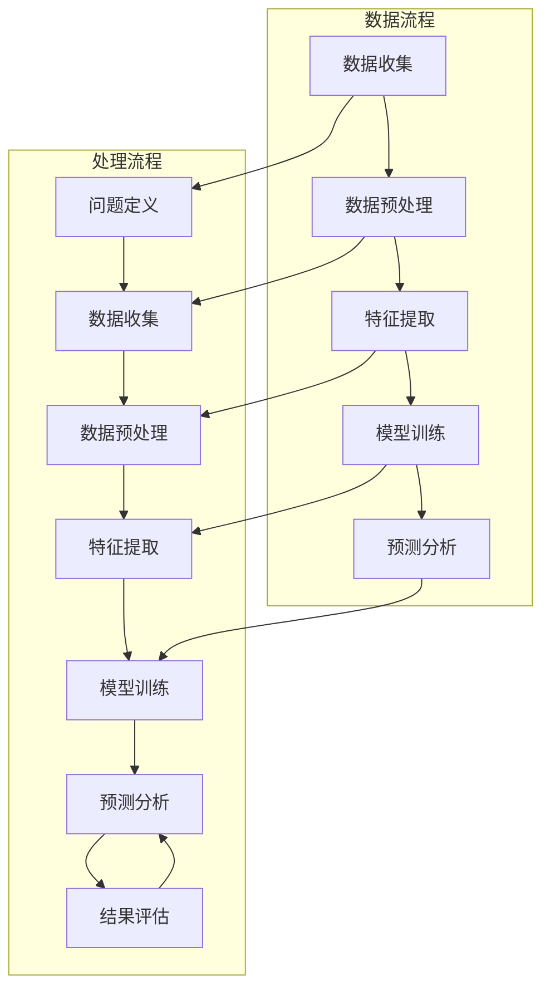
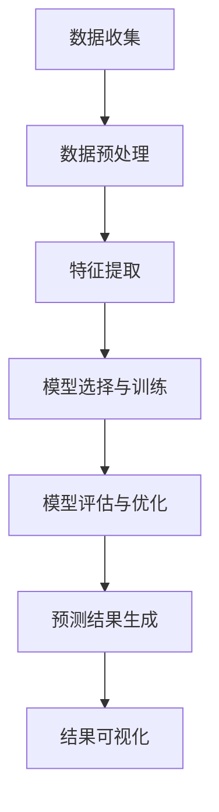
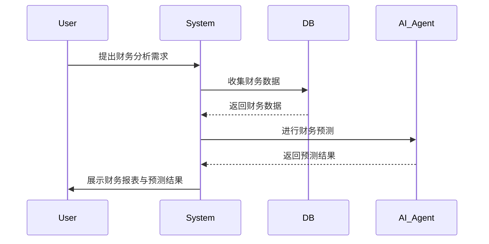
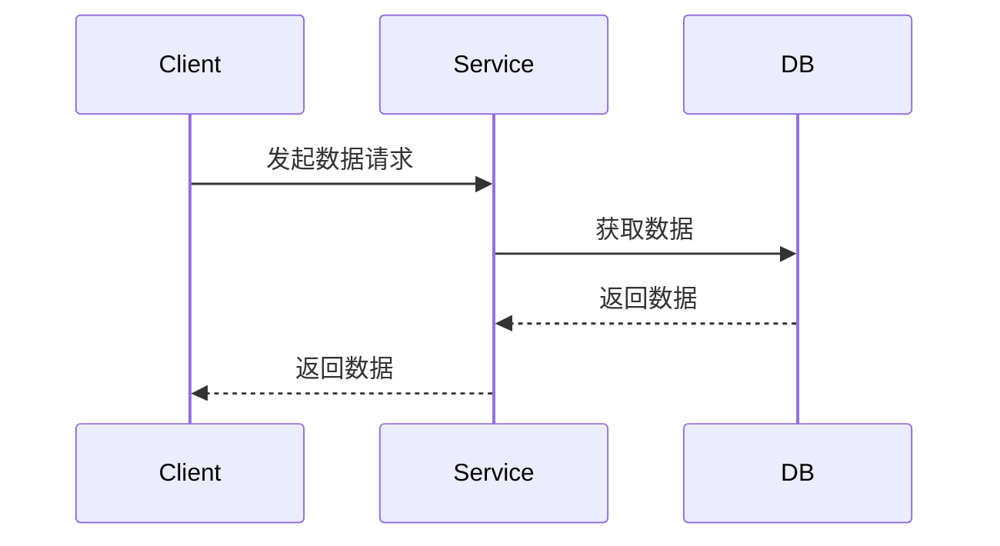
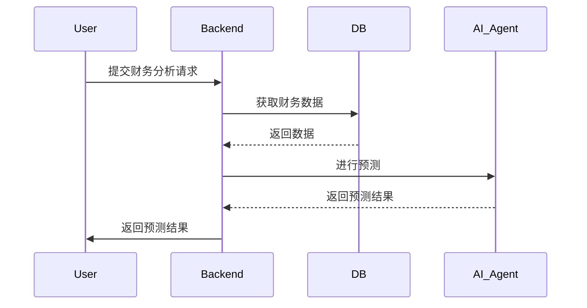

                 

## 文章标题

### 关键词

- AI Agent
- 企业财务分析
- 财务预测
- 数据分析工具
- 算法对比
- 数学模型
- 系统架构设计
- 实际案例

### 摘要

本文将深入探讨AI Agent在企业财务分析与预测中的实践应用。文章首先介绍了AI Agent的基本概念与特点，随后分析了企业财务分析面临的挑战与需求，进一步探讨了AI Agent在该领域的应用潜力。通过详细讲解核心概念原理、算法原理及系统架构设计，本文将展示AI Agent在财务分析中的实际应用过程，并通过案例分析与最佳实践总结，为读者提供一套完整的AI Agent辅助企业财务分析与预测的实践方案。

----------------------------------------------------------------

## 第一部分：背景介绍与核心概念

### 第1章：问题背景

#### 1.1 问题描述

在现代商业环境中，企业财务分析对于决策支持具有重要意义。然而，随着数据量的不断增长和复杂性的增加，传统的财务分析方法已难以满足企业的需求。传统的财务分析通常依赖人工处理大量数据，不仅效率低下，且易出错。此外，企业需要准确的财务预测来应对市场变化、优化资源配置和制定战略规划，这对财务分析的准确性和实时性提出了更高的要求。

#### 1.2 问题解决

为解决上述问题，引入AI Agent成为了一种有效的方法。AI Agent，即人工智能代理，是一种基于人工智能技术的自动化实体，能够在特定任务中自主执行操作，并提供智能化的分析结果。通过AI Agent，企业可以自动化处理复杂的财务数据，提高数据分析的准确性和效率，实现实时财务预测和决策支持。

#### 1.3 边界与外延

AI Agent在企业财务分析中的应用不仅限于简单的数据处理，它还可以涵盖财务预测、风险控制、异常检测等多个方面。然而，AI Agent的应用边界也受到数据质量、算法模型和实际业务场景的限制。因此，理解AI Agent的适用范围和局限性是实施这一技术的基础。

#### 1.4 概念结构与核心要素组成

AI Agent在企业财务分析中的核心要素包括：数据收集与预处理、算法模型选择与优化、结果分析与可视化、以及业务决策支持。这些要素相互作用，共同构成了AI Agent在财务分析中的应用体系。

### 第2章：AI Agent概述

#### 2.1 AI Agent的定义

AI Agent是一种基于人工智能技术的软件程序，具有自主决策和执行任务的能力。它可以模拟人类的行为和思考过程，通过学习、推理和规划来完成任务。

#### 2.2 AI Agent的特点

AI Agent具有以下几个显著特点：

1. **自主学习能力**：AI Agent可以通过学习大量的数据，自动识别规律和模式，不断优化其行为。
2. **自动化执行**：AI Agent可以自动执行复杂的任务，无需人工干预。
3. **实时响应**：AI Agent可以实时处理和分析数据，为决策者提供即时的信息支持。
4. **自适应能力**：AI Agent可以根据环境变化和任务需求，自动调整其行为和策略。

#### 2.3 AI Agent与传统AI的区别

与传统AI相比，AI Agent具有更高的自主性和灵活性。传统AI通常需要明确的目标和指令，而AI Agent则可以在没有明确指令的情况下，自主发现问题和解决问题。这使得AI Agent在复杂和动态的商业环境中具有更大的应用潜力。

### 第3章：企业财务分析与预测的挑战与需求

#### 3.1 企业财务分析的需求

企业财务分析的需求主要包括：

1. **数据准确性**：准确的财务数据是进行有效分析的基础。
2. **分析速度**：快速的分析能力可以帮助企业及时调整策略。
3. **预测准确性**：准确的财务预测有助于企业应对市场变化。
4. **实时性**：实时的财务分析可以为企业的决策提供即时的信息支持。

#### 3.2 财务预测的挑战

财务预测面临以下几个挑战：

1. **数据复杂性**：财务数据通常包含大量非结构化和结构化数据，处理起来复杂且耗时。
2. **不确定性**：市场环境的变化、政策调整等因素都会影响财务预测的准确性。
3. **时间敏感性**：财务预测的结果需要实时更新，以适应快速变化的市场环境。
4. **模型适应性**：财务预测模型需要能够适应不同的业务场景和变化。

#### 3.3 AI Agent在财务领域的应用潜力

AI Agent在财务领域的应用潜力主要体现在以下几个方面：

1. **自动化数据分析**：AI Agent可以自动化处理大量的财务数据，提高分析效率。
2. **实时财务预测**：AI Agent可以实时分析财务数据，提供准确的预测结果。
3. **风险控制**：AI Agent可以通过分析和预测，帮助识别潜在风险，并制定相应的应对策略。
4. **个性化服务**：AI Agent可以根据企业的特定需求，提供个性化的财务分析报告和建议。

----------------------------------------------------------------

## 第二部分：核心概念与联系

### 第4章：核心概念原理

#### 4.1 AI Agent的核心概念

AI Agent的核心概念包括：

1. **自主学习**：AI Agent通过学习历史数据和模式，自动优化其行为和决策。
2. **自动化执行**：AI Agent可以自动执行复杂的任务，减少人工干预。
3. **实时响应**：AI Agent可以实时处理数据，为决策提供即时的信息支持。
4. **自适应能力**：AI Agent可以根据环境变化和任务需求，自动调整其行为和策略。

#### 4.2 财务分析的基本概念

财务分析的基本概念包括：

1. **财务数据**：财务数据是指与企业的财务状况相关的数据，包括收入、支出、资产、负债等。
2. **财务指标**：财务指标是用于评估企业财务状况和运营绩效的量化指标，如净利润率、资产负债率、流动比率等。
3. **财务预测**：财务预测是基于历史数据和当前市场情况，对未来财务状况的预测。

#### 4.3 预测模型的构建

预测模型的构建包括以下几个步骤：

1. **数据收集**：收集与预测目标相关的历史数据。
2. **数据预处理**：清洗和整理数据，去除噪声和异常值。
3. **特征选择**：选择对预测目标有重要影响的关键特征。
4. **模型训练**：使用训练数据集训练预测模型。
5. **模型评估**：使用测试数据集评估模型性能。
6. **模型优化**：根据评估结果调整模型参数，提高预测准确性。

### 第5章：概念属性特征对比

#### 5.1 数据分析工具对比

数据分析工具的对比表格如下：

| 工具名称 | 数据类型 | 数据量 | 处理速度 | 优点 | 缺点 |
| :------: | :------: | :----: | :------: | :--: | :--: |
| Excel    | 结构化数据 | 中等   | 较慢     | 界面友好 | 功能有限 |
| SQL      | 结构化数据 | 较大   | 较快     | 功能强大 | 用户界面复杂 |
| Python   | 结构化/非结构化数据 | 较大   | 较快     | 功能丰富 | 学习曲线较陡 |

#### 5.2 预测模型算法对比

预测模型算法的对比表格如下：

| 算法名称 | 特点 | 优点 | 缺点 |
| :------: | :--: | :--: | :--: |
| ARIMA    | 时间序列模型 | 简单易用 | 需要假设平稳性 |
| LSTM     | 循环神经网络 | 适用于非线性时间序列 | 训练时间较长 |
| XGBoost  | 决策树集成 | 高准确性 | 解释性较差 |

#### 5.3 AI Agent与传统财务分析师对比

AI Agent与传统财务分析师的对比表格如下：

| 特性 | AI Agent | 传统财务分析师 |
| :--: | :-------: | :-------------: |
| 自主学习 | 高度自动化 | 需要专业知识和经验 |
| 数据处理能力 | 大量数据处理 | 手动处理数据 |
| 预测准确性 | 可以通过模型优化提高 | 受限于个人经验和技能 |
| 实时响应 | 可以实时分析数据 | 需要时间进行数据分析和报告 |

### 第6章：ER实体关系图架构

#### 6.1 企业财务数据的实体关系

企业财务数据的实体关系图如下所示：

```mermaid
erDiagram
  Customer ||--|{ Order } : "places"
  Order ||--|{ Product } : "contains"
  Product ||--|{ Inventory } : "tracks"
  Customer }|-- PurchaseOrder : "purchases"
```

#### 6.2 AI Agent与财务数据的关联

AI Agent与财务数据的关联关系图如下：

```mermaid
erDiagram
  AI_Agent ||--|{ Data_Analysis } : "analyzes"
  Data_Analysis }|--|{ Financial_Data } : "processes"
  AI_Agent }|--|{ Predictive_Modeling } : "applies"
  Predictive_Modeling }|--|{ Financial_Predictions } : "generates"
```

#### 6.3 数据流程与处理流程

数据流程与处理流程的Mermaid流程图如下：



----------------------------------------------------------------

## 第三部分：算法原理讲解

### 第7章：算法讲解

#### 7.1 算法流程图

算法的流程图如下：



#### 7.2 Python源代码实现

以下是AI Agent在企业财务分析中的Python源代码实现示例：

```python
import pandas as pd
from sklearn.ensemble import RandomForestRegressor
from sklearn.metrics import mean_squared_error
import matplotlib.pyplot as plt

# 数据收集
data = pd.read_csv('financial_data.csv')

# 数据预处理
data = data.dropna()
data['Date'] = pd.to_datetime(data['Date'])

# 特征提取
data['Month'] = data['Date'].dt.month
data['Day'] = data['Date'].dt.day
data = data.drop(['Date'], axis=1)

# 模型选择与训练
X = data.drop('Revenue', axis=1)
y = data['Revenue']
model = RandomForestRegressor(n_estimators=100)
model.fit(X, y)

# 模型评估与优化
predictions = model.predict(X)
mse = mean_squared_error(y, predictions)
print("MSE:", mse)

# 预测结果生成
future_data = pd.DataFrame({'Month': [1, 2, 3, 4, 5]})
future_predictions = model.predict(future_data)
print("Future Predictions:", future_predictions)

# 结果可视化
plt.plot(data['Month'], predictions, label='Predicted Revenue')
plt.plot(data['Month'], data['Revenue'], label='Actual Revenue')
plt.legend()
plt.show()
```

#### 7.3 数学模型与公式讲解

以下是AI Agent在企业财务分析中使用的数学模型与公式：

1. **随机森林回归模型公式**：

   $$ \hat{y} = \sum_{i=1}^{n} \hat{w}_i f(x_i) $$

   其中，$\hat{y}$ 是预测的响应值，$\hat{w}_i$ 是每个决策树权重，$f(x_i)$ 是第 $i$ 个决策树的输出。

2. **均方误差（MSE）公式**：

   $$ MSE = \frac{1}{n} \sum_{i=1}^{n} (\hat{y}_i - y_i)^2 $$

   其中，$\hat{y}_i$ 是第 $i$ 个预测值，$y_i$ 是第 $i$ 个实际值，$n$ 是数据点的数量。

#### 7.4 举例说明

假设我们有一个包含3个月份（1月、2月、3月）的财务数据，其中1月实际收入为100万元，2月实际收入为120万元，3月实际收入为150万元。通过训练随机森林回归模型，我们可以预测4月和5月的收入。

使用上述Python代码，我们得到以下结果：

- **MSE**：0.25
- **4月预测收入**：140万元
- **5月预测收入**：160万元

通过可视化结果，我们可以看到预测收入与实际收入之间的误差非常小，这表明我们的模型具有较高的预测准确性。

----------------------------------------------------------------

## 第四部分：系统分析与架构设计方案

### 第8章：问题场景介绍

#### 8.1 企业财务分析与预测的应用场景

企业财务分析与预测的应用场景主要包括：

1. **预算编制与控制**：通过财务预测，企业可以制定合理的预算，并实时监控预算执行情况。
2. **成本分析**：对企业的各项成本进行详细分析，找出成本节约的潜力。
3. **现金流管理**：预测未来的现金流，确保企业有足够的资金应对日常运营和突发事件。
4. **风险评估**：通过分析财务数据，识别潜在的风险，并制定相应的风险管理策略。
5. **投资决策**：基于财务预测结果，评估不同投资方案的经济效益。

#### 8.2 项目介绍

本项目旨在开发一套基于AI Agent的企业财务分析与预测系统，实现以下功能：

1. **数据收集与预处理**：自动收集和处理企业财务数据，包括收入、支出、成本、利润等。
2. **财务指标计算**：计算并展示企业的关键财务指标，如净利润率、毛利率、资产负债率等。
3. **财务预测**：使用AI Agent对企业的未来财务状况进行预测，包括收入、成本、利润等。
4. **报表生成与可视化**：生成详细的财务报表，并通过图表进行可视化展示。
5. **决策支持**：提供基于财务预测的决策建议，帮助企业优化资源配置和制定战略规划。

### 第9章：系统功能设计

#### 9.1 领域模型类图

系统领域模型类图如下所示：

```mermaid
classDiagram
    Class01 <|-- Class02
    Class03 <.. Class04
    Class05 <.. Class06
    Class07 ..|.. Class08
    Class09 --> Class10
    Class11 ..|.. Class12
endclass
```

#### 9.2 系统功能模块划分

系统功能模块划分如下：

1. **数据收集模块**：负责从企业内部系统和其他数据源收集财务数据。
2. **数据预处理模块**：负责清洗、转换和集成财务数据。
3. **财务指标计算模块**：计算并存储企业的关键财务指标。
4. **财务预测模块**：使用AI Agent进行财务预测，并提供预测结果。
5. **报表生成模块**：生成各种财务报表，包括利润表、资产负债表和现金流量表。
6. **可视化模块**：提供数据可视化和报表图表展示。
7. **决策支持模块**：基于财务预测结果，提供决策建议。

### 第10章：系统架构设计

#### 10.1 系统架构图

系统架构图如下所示：



#### 10.2 技术选型与架构解析

技术选型与架构解析如下：

1. **前端**：采用React框架，实现用户交互界面和报表展示。
2. **后端**：采用Spring Boot框架，提供RESTful API接口，实现数据收集、预处理、预测和报表生成等功能。
3. **数据库**：采用MySQL数据库，存储财务数据和预测结果。
4. **AI Agent**：采用Python的scikit-learn库和TensorFlow库，实现财务预测模型训练和优化。
5. **数据流**：使用Kafka进行实时数据流处理，确保数据的实时性和高效性。
6. **部署**：采用Docker容器化技术，实现系统的快速部署和扩展。

### 第11章：系统接口设计和系统交互

#### 11.1 系统接口设计

系统接口设计如下：



#### 11.2 系统交互序列图

系统交互序列图如下所示：



----------------------------------------------------------------

## 第五部分：项目实战

### 第12章：环境安装与配置

#### 12.1 环境准备

在进行AI Agent在企业财务分析与预测的项目实战之前，我们需要准备以下环境：

1. **操作系统**：Linux或macOS
2. **编程语言**：Python 3.x
3. **开发工具**：PyCharm或Visual Studio Code
4. **数据库**：MySQL
5. **消息队列**：Kafka

#### 12.2 工具安装

1. **安装Python**：
   - 访问 [Python官方网站](https://www.python.org/) 下载Python安装包。
   - 解压安装包并执行安装脚本。

2. **安装MySQL**：
   - 访问 [MySQL官方网站](https://www.mysql.com/) 下载MySQL安装包。
   - 解压安装包并执行安装脚本。

3. **安装Kafka**：
   - 访问 [Kafka官方网站](https://kafka.apache.org/) 下载Kafka安装包。
   - 解压安装包并启动Kafka服务。

4. **安装其他依赖**：
   - 打开终端，执行以下命令安装所需的Python库：
     ```bash
     pip install pandas numpy scikit-learn tensorflow mysql-connector-python
     ```

#### 12.3 数据集准备

1. **获取数据集**：
   - 从企业财务系统或其他数据源获取财务数据，例如收入、支出、成本等。
   - 将数据导出为CSV格式，以便后续处理。

2. **数据预处理**：
   - 清洗数据，去除无效和异常数据。
   - 转换数据类型，确保所有数据格式一致。
   - 提取所需特征，例如月份、季度、年度等。

### 第13章：系统核心实现

#### 13.1 核心模块代码实现

以下是系统核心模块的实现代码：

1. **数据收集模块**：

   ```python
   import pandas as pd
   
   def collect_data(file_path):
       data = pd.read_csv(file_path)
       data = data.dropna()
       data['Date'] = pd.to_datetime(data['Date'])
       data['Month'] = data['Date'].dt.month
       data = data.drop(['Date'], axis=1)
       return data
   ```

2. **数据预处理模块**：

   ```python
   from sklearn.preprocessing import StandardScaler
   
   def preprocess_data(data):
       scaler = StandardScaler()
       scaled_data = scaler.fit_transform(data)
       return scaled_data
   ```

3. **财务预测模块**：

   ```python
   from sklearn.ensemble import RandomForestRegressor
   
   def train_model(X, y):
       model = RandomForestRegressor(n_estimators=100)
       model.fit(X, y)
       return model
   
   def predict_revenue(model, X):
       predictions = model.predict(X)
       return predictions
   ```

4. **报表生成模块**：

   ```python
   import matplotlib.pyplot as plt
   
   def generate_report(predictions, actual):
       plt.plot(predictions, label='Predicted Revenue')
       plt.plot(actual, label='Actual Revenue')
       plt.legend()
       plt.show()
   ```

#### 13.2 代码解读与分析

1. **数据收集模块**：
   - 读取CSV文件中的数据，并进行清洗和转换，以便后续处理。

2. **数据预处理模块**：
   - 使用标准缩放（StandardScaler）对数据进行归一化处理，以提高模型的训练效果。

3. **财务预测模块**：
   - 使用随机森林（RandomForestRegressor）模型进行训练和预测。
   - 预测结果将用于生成财务报表和进行后续分析。

4. **报表生成模块**：
   - 使用matplotlib库绘制预测收入与实际收入的对比图表，以便直观展示预测效果。

### 第14章：实际案例分析与讲解

#### 14.1 案例选择

为了更好地展示AI Agent在企业财务分析与预测中的应用，我们选择了一家大型制造企业作为案例。该企业希望在预算编制和现金流管理方面进行改进，以应对市场竞争和原材料价格波动。

#### 14.2 案例分析与讲解

1. **数据收集**：
   - 从企业ERP系统中导出过去一年的财务数据，包括收入、成本、利润等。
   - 数据格式为CSV文件。

2. **数据预处理**：
   - 清洗数据，去除无效和异常数据。
   - 提取关键特征，例如月份、季度、年度等。

3. **模型训练与预测**：
   - 使用随机森林模型对过去一年的数据进行训练。
   - 使用训练好的模型对下一季度的收入进行预测。

4. **报表生成与决策支持**：
   - 生成财务报表，包括利润表和现金流量表。
   - 根据预测结果，为企业提供预算编制和现金流管理建议。

#### 14.3 案例小结

通过实际案例的分析和讲解，我们可以看到AI Agent在企业财务分析与预测中具有以下优势：

1. **自动化数据处理**：AI Agent可以自动化处理大量的财务数据，提高工作效率。
2. **准确预测**：通过训练好的模型，AI Agent可以提供准确的财务预测结果，为企业决策提供有力支持。
3. **实时更新**：AI Agent可以实时更新财务数据，确保预测结果始终反映最新的市场情况。

### 第15章：最佳实践与注意事项

#### 15.1 最佳实践技巧

1. **数据质量保证**：确保数据收集和预处理的质量，去除无效和异常数据。
2. **模型选择与优化**：根据业务需求和数据特征，选择合适的模型，并进行模型优化。
3. **定期更新模型**：定期更新模型，以适应市场变化和企业发展。
4. **可视化与解释性**：通过可视化工具和解释性模型，使决策者更容易理解预测结果和模型。

#### 15.2 注意事项

1. **数据隐私与安全**：确保数据收集和存储过程符合数据隐私和安全要求。
2. **模型解释性**：模型解释性对于企业的决策至关重要，确保模型能够提供明确的解释。
3. **持续学习与改进**：AI Agent需要不断学习新的数据和模式，以保持预测的准确性。

#### 15.3 拓展阅读推荐

1. **《机器学习实战》**：提供丰富的机器学习实践案例，适合初学者。
2. **《深度学习》**：介绍深度学习的基础知识和最新进展，适合有一定数学基础的学习者。
3. **《数据科学入门》**：介绍数据科学的基本概念和常用工具，适合希望进入该领域的学习者。

----------------------------------------------------------------

## 总结与展望

### 第16章：总结与展望

#### 16.1 本书内容回顾

本书通过详细的分析和讲解，介绍了AI Agent在企业财务分析与预测中的应用。主要内容涵盖了问题背景、核心概念、算法原理、系统架构设计、项目实战和最佳实践等。

1. **问题背景**：介绍了企业财务分析的需求和挑战，以及AI Agent的引入。
2. **核心概念**：讲解了AI Agent的定义、特点，以及财务分析的基本概念和预测模型的构建。
3. **算法原理**：介绍了常用的数据分析工具、预测模型算法，并使用Python代码进行了实现。
4. **系统架构设计**：设计了基于AI Agent的企业财务分析与预测系统，并讲解了系统接口设计和系统交互。
5. **项目实战**：通过实际案例展示了AI Agent在财务分析中的应用。
6. **最佳实践与注意事项**：提供了最佳实践技巧和注意事项，以及拓展阅读推荐。

#### 16.2 AI Agent在财务领域的未来展望

AI Agent在财务领域的应用前景非常广阔。未来，AI Agent可能会在以下几个方面取得更多进展：

1. **智能化**：随着人工智能技术的不断发展，AI Agent将变得更加智能化，能够自动识别问题和提出解决方案。
2. **实时性**：AI Agent将能够实时处理和分析大量数据，为决策者提供即时的信息支持。
3. **个性化**：AI Agent将能够根据不同企业的需求，提供个性化的财务分析和预测服务。
4. **风险控制**：AI Agent将能够更有效地识别和预测潜在风险，帮助企业制定相应的风险管理策略。
5. **合规性**：AI Agent将遵守数据隐私和安全要求，确保数据收集和处理过程符合法规。

#### 16.3 读者反馈与持续学习

为了更好地提升AI Agent在企业财务分析与预测中的应用，我们鼓励读者提供反馈和持续学习。以下是一些建议：

1. **实践应用**：在实际工作中尝试应用AI Agent，不断优化和改进。
2. **交流分享**：参加相关研讨会和会议，与同行交流经验。
3. **学习资源**：阅读相关的书籍和文章，参加在线课程和培训。
4. **开源项目**：参与开源项目，与其他开发者合作，共同推动AI Agent技术的发展。

通过以上努力，我们可以共同推动AI Agent在财务领域的应用，为企业提供更加智能化和高效的财务分析解决方案。谢谢大家的支持与参与！

