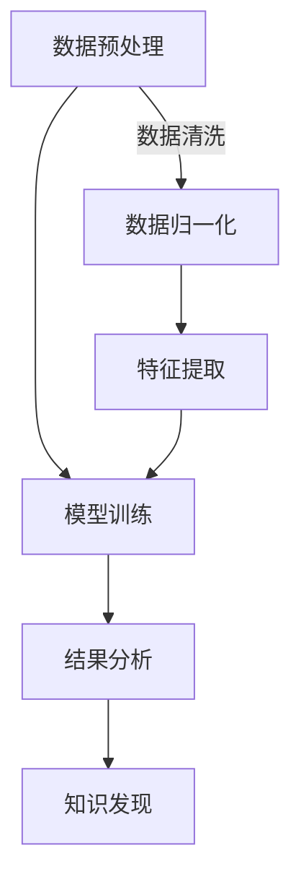

                 

# AI Agent辅助科学研究的方法

## 关键词

- 人工智能
- AI Agent
- 科学研究
- 自动化
- 数据处理
- 模型训练
- 知识发现

## 摘要

本文深入探讨了AI Agent在科学研究中的应用及其方法。首先，我们介绍了科研工作中面临的挑战和AI Agent的潜力，然后详细阐述了AI Agent在科研中的应用需求。通过逐步分析数据预处理、模型训练、结果分析和知识发现等环节，我们揭示了AI Agent在科学研究中的问题解决方法。同时，我们探讨了AI Agent在多个领域中的广泛应用，并分析了其核心要素组成。本文旨在为科学家提供一种利用AI Agent提高科研效率和成果质量的实用指南。

## 第一部分：背景介绍

### 1.1 问题背景

科学研究是一个复杂且不断发展的领域。随着数据量的爆炸性增长和科研任务的多样性，科学家们面临着一系列挑战：

1. **数据复杂性**：科研过程中产生的数据种类繁多，包括实验数据、观测数据和文献数据等。这些数据通常需要进行复杂的预处理，如清洗、归一化和特征提取，以便进行分析和建模。

2. **计算资源需求**：随着科研项目的规模不断扩大，计算资源的需求也越来越高。复杂的计算任务，如深度学习模型的训练，通常需要大量的计算资源和时间。

3. **跨学科知识整合**：科学研究往往需要整合不同学科的知识，这要求科研人员具备广泛的知识背景和技能。

4. **研究效率低下**：传统的科研工作流程中，许多任务都是重复性的，如数据收集、数据清洗和报告撰写等，这些任务耗费了大量时间和精力。

### 1.1.1 AI Agent的潜力

人工智能（AI）技术的发展为科研工作带来了新的机遇。特别是AI Agent，即具有智能行为的人工智能体，能够自动执行任务、发现问题和提供解决方案。AI Agent在科学研究中的潜力主要体现在以下几个方面：

1. **自动化数据处理**：AI Agent能够自动化地进行数据预处理，包括数据清洗、归一化和特征提取，从而提高数据处理效率。

2. **模型训练优化**：AI Agent可以利用机器学习和深度学习技术，自动调整模型参数，优化模型性能，减少手动调整的工作量。

3. **结果分析和可视化**：AI Agent可以自动化地生成报告和可视化图表，辅助科学家理解研究结果，从而提高科研工作的透明度和可解释性。

4. **知识发现**：AI Agent能够通过关联分析和数据挖掘技术，自动识别新的研究问题和潜在的关联，推动科学发现。

### 1.1.2 问题描述

传统的科研工作流程包括以下几个关键环节：

1. **数据收集**：科学家需要从各种来源收集数据，包括实验数据、观测数据和文献数据等。

2. **数据预处理**：收集到的数据通常需要进行预处理，如数据清洗、归一化和特征提取，以便进行分析和建模。

3. **模型训练**：利用机器学习和深度学习技术，训练预测模型和分类模型，以处理和分析数据。

4. **结果分析**：对模型训练结果进行分析，包括模型性能评估、参数调整和结果解释。

5. **报告撰写**：将研究结果撰写成报告，并进行可视化展示。

在这些环节中，存在许多重复性和耗时的任务，限制了科研工作的效率。例如，数据清洗通常需要大量的人工干预，模型训练可能需要优化多个参数，这些任务都耗时且容易出错。因此，如何更高效地辅助科学研究成为了一个重要的课题。

### 1.1.3 AI Agent在科研中的应用需求

为了解决上述问题，需要一种能够自动化处理科研工作流程的方法。AI Agent可以协助科学家完成以下任务：

- **数据预处理和清洗**：使用机器学习算法对数据进行清洗、归一化和特征提取，自动化处理大规模数据。
- **模型优化和训练**：利用深度学习技术，自动调整模型参数，提高模型性能。
- **结果分析和可视化**：自动化生成报告和可视化图表，辅助科学家理解研究结果。
- **知识发现和探索**：通过关联分析和数据挖掘技术，自动识别新的研究问题和潜在的关联。

### 1.2 问题解决

AI Agent可以通过以下步骤辅助科学研究：

1. **数据预处理**：使用机器学习算法对数据进行清洗、归一化和特征提取，为模型训练做准备。
   - **数据清洗**：去除重复数据、异常值和缺失值。
   - **数据归一化**：将数据缩放到同一范围，以便模型训练。
   - **特征提取**：从原始数据中提取有用的特征，用于模型训练。

2. **模型训练**：利用深度学习技术，训练各种预测模型和分类模型。
   - **模型选择**：选择合适的模型架构，如神经网络、决策树等。
   - **参数调整**：自动调整模型参数，提高模型性能。
   - **训练过程**：使用训练数据集对模型进行训练，并评估模型性能。

3. **结果分析**：应用自然语言处理技术，对分析结果进行解释和可视化。
   - **结果解释**：自动生成报告，解释模型的预测结果。
   - **可视化**：生成图表和图形，展示分析结果。

4. **知识发现**：通过关联分析和数据挖掘技术，发现新的研究问题和潜在的关联。
   - **关联分析**：识别数据之间的关联，发现新的研究问题。
   - **数据挖掘**：从大规模数据中挖掘出有价值的信息和知识。

### 1.3 边界与外延

AI Agent在科学研究中的应用范围广泛，包括但不限于以下领域：

- **生物信息学**：基因数据分析、蛋白质结构预测等。
- **物理学**：模拟实验设计、数据拟合等。
- **化学工程**：反应路径分析、化学物质性质预测等。
- **社会科学**：舆情分析、行为预测等。

### 1.4 概念结构与核心要素组成

AI Agent在科学研究中的核心要素包括：

- **数据集**：用于训练和测试的原始数据。
- **模型架构**：选择合适的机器学习模型结构。
- **训练算法**：用于模型训练的算法，如深度学习算法。
- **解释和可视化工具**：帮助科学家理解和解释分析结果。
- **接口和服务**：为科学家提供便捷的API和服务。

### 1.5 本章小结

通过引入AI Agent，科学家可以更高效地处理科研工作，提高研究质量和效率。本章介绍了AI Agent在科学研究中的应用背景、问题和解决方案，为后续章节的深入探讨奠定了基础。

----------------------------------------------------------------

## 第二部分：核心概念与联系

### 2.1 AI Agent概述

#### 2.1.1 AI Agent的定义与特性

AI Agent是指具有智能行为的人工智能体，能够感知环境、制定计划并采取行动以实现特定目标。AI Agent通常具备以下特性：

- **自主性**：能够独立执行任务，无需人工干预。
- **学习能力**：能够通过经验不断改进自己的行为。
- **适应性**：能够适应不同的环境和任务需求。
- **合作性**：能够与其他AI Agent或人类合作完成任务。

#### 2.1.2 AI Agent的分类

AI Agent可以根据不同的分类标准进行划分，常见的分类方法包括：

- **按照智能水平**：弱AI（特定任务AI）和强AI（通用智能AI）。
- **按照功能**：决策Agent、执行Agent、探索Agent等。
- **按照任务环境**：单任务Agent、多任务Agent、动态任务Agent等。

### 2.2 科研中的AI Agent应用

#### 2.2.1 AI Agent在科研工作中的应用

AI Agent在科研工作中的应用包括但不限于以下方面：

- **数据预处理**：自动化数据清洗、归一化和特征提取。
- **模型训练**：自动调整模型参数，优化模型性能。
- **结果分析**：自动化生成报告和可视化图表，辅助科学家理解研究结果。
- **知识发现**：自动识别新的研究问题和潜在的关联。

#### 2.2.2 AI Agent在科研中的优势与挑战

AI Agent在科研中的优势包括：

- **提高效率**：自动化处理重复性和耗时的任务，节省科学家的时间和精力。
- **减少错误**：通过自动化处理，减少手动操作带来的错误。
- **扩展能力**：能够处理更多样化的科研任务，提高科研工作的灵活性。

然而，AI Agent在科研中也面临一些挑战：

- **数据质量**：AI Agent的性能高度依赖于数据的质量，如果数据存在噪声或偏差，可能导致错误的结果。
- **算法选择**：选择合适的算法和模型结构对AI Agent的性能至关重要，但这对科研人员提出了更高的要求。
- **可解释性**：AI Agent生成的结果往往缺乏可解释性，科学家难以理解模型的决策过程。

### 2.3 AI Agent在科学研究中的应用场景

AI Agent在科学研究中的应用场景广泛，以下是几个典型的例子：

1. **生物信息学**：AI Agent可以自动化进行基因数据分析，如基因表达分析、突变检测和蛋白质结构预测等。

2. **物理学**：AI Agent可以用于模拟实验设计、数据拟合和复杂物理现象的预测。

3. **化学工程**：AI Agent可以自动化进行反应路径分析、化学物质性质预测和化工过程优化。

4. **社会科学**：AI Agent可以用于舆情分析、行为预测和社会网络分析。

### 2.4 AI Agent的核心要素组成

AI Agent在科学研究中的核心要素包括：

- **数据集**：用于训练和测试的原始数据。
- **模型架构**：选择合适的机器学习模型结构。
- **训练算法**：用于模型训练的算法，如深度学习算法。
- **解释和可视化工具**：帮助科学家理解和解释分析结果。
- **接口和服务**：为科学家提供便捷的API和服务。

### 2.5 概念属性特征对比表格

为了更清晰地理解AI Agent的特性，我们可以通过一个概念属性特征对比表格来展示：

| 概念       | 特性                                                         | 对比                                                         |
|------------|--------------------------------------------------------------|--------------------------------------------------------------|
| AI Agent   | 具有智能行为、自主性、学习能力、适应性、合作性               | 与人类相比，AI Agent能够自动化执行任务，但缺乏人类的直觉和创造力 |
| 人类       | 拥有直觉、创造力、情感、社交能力等                           | 与AI Agent相比，人类具有更丰富的情感和创造力，但需要大量时间和精力 |
| 机器人     | 具有机械性能、自动化操作能力、但缺乏智能和学习能力           | 与AI Agent相比，机器人具有更好的机械性能，但缺乏智能和自主性   |

### 2.6 AI Agent的ER实体关系图架构

为了更直观地理解AI Agent在科学研究中的应用，我们可以使用ER实体关系图来展示其核心要素及其相互关系。以下是AI Agent的ER实体关系图架构：

```
[数据集] --<训练和测试数据>--> [模型架构]
         |                                   |
         |                                   |
         |                                   |
         |                                  <接口和服务>
         |
         |
[解释和可视化工具]
```

在这个ER实体关系图中，数据集用于训练和测试模型架构，解释和可视化工具帮助科学家理解和解释分析结果，而接口和服务为科学家提供便捷的API和服务。

### 2.7 本章小结

通过第二部分的讨论，我们深入了解了AI Agent的定义、分类和特性，以及在科学研究中的应用。我们分析了AI Agent在科研中的优势与挑战，并展示了其核心要素组成。通过概念属性特征对比表格和ER实体关系图架构，我们更清晰地理解了AI Agent在科学研究中的角色和作用。这些内容为后续章节的深入探讨奠定了基础。

----------------------------------------------------------------

## 第三部分：算法原理讲解

### 3.1 数据预处理算法原理

在AI Agent辅助科学研究的第一个环节，数据预处理至关重要。数据预处理主要包括数据清洗、归一化和特征提取，以下将分别介绍这些算法的原理。

#### 3.1.1 数据清洗

数据清洗是指去除数据中的重复值、异常值和缺失值，以确保数据质量。常见的数据清洗算法包括：

1. **重复值去除**：通过比较数据记录的属性值，删除重复的数据记录。
2. **异常值处理**：根据统计学方法或规则，识别和去除异常值，如使用IQR（四分位距）方法或Z-score方法。
3. **缺失值填充**：根据不同情况，使用平均值、中位数或插值等方法填补缺失值。

#### 3.1.2 数据归一化

数据归一化是指将数据缩放到同一范围，以消除不同特征之间的尺度差异。常见的数据归一化方法包括：

1. **最小-最大归一化**：将数据缩放到[0, 1]范围，公式为 \( x' = \frac{x - \min(x)}{\max(x) - \min(x)} \)。
2. **Z-score归一化**：将数据缩放到标准正态分布，公式为 \( x' = \frac{x - \mu}{\sigma} \)，其中 \( \mu \) 是平均值，\( \sigma \) 是标准差。

#### 3.1.3 特征提取

特征提取是指从原始数据中提取有用的特征，用于后续的模型训练。常见的方法包括：

1. **主成分分析（PCA）**：通过降维，将原始数据映射到低维空间，保留主要特征。
2. **词袋模型**：在文本数据中，将文本转换为词袋表示，提取词频特征。
3. **卷积神经网络（CNN）**：在图像数据中，通过卷积操作提取局部特征。

### 3.2 模型训练算法原理

模型训练是AI Agent的核心环节，主要包括选择合适的模型架构、调整参数和训练过程。以下将介绍几种常见的模型训练算法。

#### 3.2.1 神经网络

神经网络是一种模拟人脑神经元连接方式的计算模型。常见的神经网络包括：

1. **多层感知机（MLP）**：一种前馈神经网络，适用于分类和回归任务。
2. **卷积神经网络（CNN）**：适用于图像处理任务，通过卷积操作提取图像特征。
3. **循环神经网络（RNN）**：适用于序列数据处理任务，能够记住前一个时间步的信息。

#### 3.2.2 深度学习

深度学习是神经网络的一种扩展，通过堆叠多层神经网络来实现复杂的特征提取和表示。常见的深度学习算法包括：

1. **深度信念网络（DBN）**：通过预训练和微调两个阶段，学习数据的复杂表示。
2. **生成对抗网络（GAN）**：通过对抗训练，生成与真实数据相似的新数据。
3. **长短期记忆网络（LSTM）**：是一种特殊的RNN，能够长期记住序列信息。

#### 3.2.3 调整参数

模型训练过程中，参数调整是关键步骤。常见的参数调整方法包括：

1. **梯度下降**：通过计算梯度，逐步调整模型参数，以减少损失函数。
2. **随机梯度下降（SGD）**：在梯度下降的基础上，使用随机子集进行更新，提高训练速度。
3. **Adam优化器**：结合SGD和动量方法，自适应调整学习率。

### 3.3 结果分析算法原理

结果分析是科研工作的重要环节，通过自然语言处理和可视化技术，可以更好地理解和解释模型的结果。

#### 3.3.1 自然语言处理

自然语言处理技术可以帮助科学家理解和解释模型结果，常见的方法包括：

1. **文本分类**：将文本数据分类到不同的类别，如论文标题分类、舆情分析等。
2. **文本生成**：自动生成文本，如摘要生成、问答系统等。
3. **文本摘要**：提取文本中的关键信息，生成简洁的摘要。

#### 3.3.2 可视化

可视化技术可以帮助科学家直观地理解模型结果，常见的方法包括：

1. **散点图**：用于展示数据点之间的关系和分布。
2. **折线图**：用于展示数据随时间的变化趋势。
3. **热力图**：用于展示数据的高频区域。

### 3.4 知识发现算法原理

知识发现是AI Agent在科学研究中的高级应用，通过关联分析和数据挖掘技术，自动识别新的研究问题和潜在的关联。

#### 3.4.1 关联分析

关联分析是指发现数据项之间的关联关系，常见的方法包括：

1. **关联规则学习**：通过支持度和置信度等指标，发现数据项之间的关联规则。
2. **频繁模式挖掘**：通过挖掘频繁出现的模式，发现数据中的潜在规律。

#### 3.4.2 数据挖掘

数据挖掘是指从大量数据中发现有价值的信息和知识，常见的方法包括：

1. **聚类分析**：将数据划分为不同的聚类，发现数据中的相似性。
2. **分类分析**：将数据分类到不同的类别，预测新的数据项的类别。
3. **异常检测**：识别数据中的异常值和异常模式。

### 3.5 AI Agent的mermaid流程图

为了更好地理解AI Agent的工作流程，我们可以使用mermaid绘制一个流程图。以下是AI Agent在科学研究中的流程图示例：



在这个流程图中，数据预处理包括数据清洗、数据归一化和特征提取，这些步骤为模型训练提供了高质量的数据。模型训练后，通过结果分析和知识发现，科学家可以更好地理解和利用研究结果。

### 3.6 本章小结

通过第三部分的讨论，我们深入了解了数据预处理、模型训练、结果分析和知识发现等核心算法原理。我们通过mermaid流程图展示了AI Agent在科学研究中的工作流程，为科学家提供了实用的算法指导。这些算法原理和流程图将有助于科学家更高效地利用AI Agent辅助科学研究。

----------------------------------------------------------------

## 第四部分：系统分析与架构设计

### 4.1 问题场景介绍

在当前科研环境中，科学家面临着大量的数据分析和模型训练任务，这些任务通常具有以下特点：

- **数据量大**：科研数据通常包含成千上万的样本和多个特征，这些数据需要进行高效的处理和分析。
- **任务多样性**：科研任务包括数据预处理、模型训练、结果分析和知识发现等多种环节，每个环节都有不同的需求和挑战。
- **高复杂性**：复杂的计算任务，如深度学习模型的训练，通常需要大量的计算资源和时间。

为了应对这些挑战，科学家需要一个高效、可扩展的AI Agent系统，能够自动化地处理科研任务，提高科研效率和质量。

### 4.2 项目介绍

本系统名为“AI科研助手”（AI Research Assistant），旨在为科学家提供一个集成的AI Agent平台，辅助他们在数据预处理、模型训练、结果分析和知识发现等环节的工作。

#### 4.2.1 系统目标

- **自动化数据处理**：自动进行数据清洗、归一化和特征提取，为模型训练提供高质量的数据。
- **高效模型训练**：利用先进的机器学习和深度学习算法，快速训练高效模型，提高科研效率。
- **智能结果分析**：自动化生成报告和可视化图表，帮助科学家更好地理解和解释分析结果。
- **知识发现与探索**：通过关联分析和数据挖掘技术，自动发现新的研究问题和潜在的关联。

#### 4.2.2 系统功能

- **数据预处理模块**：提供数据清洗、归一化和特征提取等功能，支持多种数据源和数据格式。
- **模型训练模块**：提供多种机器学习和深度学习算法，支持模型训练、评估和优化。
- **结果分析模块**：提供自然语言处理和可视化工具，自动生成报告和可视化图表。
- **知识发现模块**：提供关联分析和数据挖掘技术，自动发现新的研究问题和趋势。

### 4.3 系统功能设计（领域模型）

为了更好地理解和设计系统功能，我们可以使用mermaid绘制系统的领域模型，以下是一个简单的领域模型类图：

```mermaid
classDiagram
    Class01 <|-- Class02
    Class03 <.. Class04
    Class05 && Class06
    Class07 <|.. Class08
endclass
```

在这个类图中：

- **数据预处理模块**：包括数据清洗（DataCleaning）、数据归一化（DataNormalization）和特征提取（FeatureExtraction）三个子模块。
- **模型训练模块**：包括机器学习算法（MachineLearning）和深度学习算法（DeepLearning）两个子模块。
- **结果分析模块**：包括自然语言处理（NLP）和可视化工具（Visualization）两个子模块。
- **知识发现模块**：包括关联分析（AssociationAnalysis）和数据挖掘（DataMining）两个子模块。

### 4.4 系统架构设计

系统的架构设计需要考虑多个方面，包括系统的扩展性、性能和可维护性。以下是系统的架构设计：

#### 4.4.1 系统架构图

```mermaid
sequenceDiagram
    participant User as 用户
    participant DataPreprocessing as 数据预处理
    participant ModelTraining as 模型训练
    participant ResultAnalysis as 结果分析
    participant KnowledgeDiscovery as 知识发现
    User->>DataPreprocessing: 提交数据
    DataPreprocessing->>ModelTraining: 数据预处理完成
    ModelTraining->>ResultAnalysis: 模型训练完成
    ResultAnalysis->>User: 提供分析结果
    KnowledgeDiscovery->>User: 提供知识发现结果
end
```

在这个序列图中，用户首先提交数据，数据预处理模块进行处理，然后将处理后的数据传递给模型训练模块。模型训练完成后，结果分析模块对结果进行分析，并将分析结果返回给用户。同时，知识发现模块在后台运行，自动发现新的研究问题和趋势。

#### 4.4.2 系统架构说明

- **数据层**：负责数据的存储和管理，包括原始数据和预处理后的数据。使用关系数据库或分布式文件系统（如Hadoop HDFS）进行数据存储。
- **服务层**：包括数据预处理服务、模型训练服务、结果分析服务和知识发现服务。这些服务通过RESTful API进行交互。
- **应用层**：提供用户界面，用户可以通过Web界面或命令行接口提交数据、查看分析结果和知识发现结果。
- **基础设施层**：包括计算资源、存储资源和网络资源。使用云计算平台（如AWS、Azure）提供计算资源，使用分布式存储系统提供数据存储。

### 4.5 系统接口设计

系统接口设计是系统架构设计的关键部分，以下是一个简单的系统接口设计：

#### 4.5.1 接口规范

- **数据预处理接口**：提供数据清洗、数据归一化和特征提取的API。
  - `POST /data/preprocess`：提交预处理任务。
  - `GET /data/preprocess/{task_id}`：查询预处理任务状态。
- **模型训练接口**：提供机器学习和深度学习模型的训练API。
  - `POST /model/train`：提交训练任务。
  - `GET /model/train/{task_id}`：查询训练任务状态。
- **结果分析接口**：提供自然语言处理和可视化工具的API。
  - `POST /result/analyze`：提交分析任务。
  - `GET /result/analyze/{task_id}`：查询分析任务状态。
- **知识发现接口**：提供关联分析和数据挖掘的API。
  - `POST /knowledge/discover`：提交发现任务。
  - `GET /knowledge/discover/{task_id}`：查询发现任务状态。

### 4.6 系统交互设计

为了更好地理解系统的交互流程，我们可以使用mermaid绘制系统的交互序列图。以下是系统交互的mermaid序列图：

```mermaid
sequenceDiagram
    participant User as 用户
    participant API as API服务器
    participant DataPreprocessing as 数据预处理服务
    participant ModelTraining as 模型训练服务
    participant ResultAnalysis as 结果分析服务
    participant KnowledgeDiscovery as 知识发现服务
    User->>API: 提交数据
    API->>DataPreprocessing: 处理数据
    DataPreprocessing->>API: 返回预处理结果
    API->>ModelTraining: 开始训练
    ModelTraining->>API: 返回训练结果
    API->>ResultAnalysis: 开始分析
    ResultAnalysis->>API: 返回分析结果
    API->>KnowledgeDiscovery: 开始发现
    KnowledgeDiscovery->>API: 返回发现结果
    API->>User: 显示结果
end
```

在这个序列图中，用户提交数据后，API服务器将数据传递给数据预处理服务进行处理。数据预处理完成后，API服务器将预处理结果传递给模型训练服务进行训练。模型训练完成后，API服务器将训练结果传递给结果分析服务进行分析。同时，知识发现服务在后台运行，自动发现新的研究问题和趋势。最终，API服务器将分析结果和发现结果返回给用户。

### 4.7 本章小结

通过第四部分的讨论，我们深入分析了问题场景，介绍了AI科研助手系统的目标和功能。我们通过领域模型、系统架构设计、接口设计和交互设计，展示了系统的整体架构和交互流程。这些设计为科学家提供了一个高效、可扩展的AI Agent平台，能够自动化地处理科研任务，提高科研效率和质量。

----------------------------------------------------------------

## 第五部分：项目实战

### 5.1 环境安装

在开始项目实战之前，我们需要安装所需的软件和工具。以下是安装步骤：

#### 5.1.1 安装Python环境

确保安装了Python 3.x版本，可以从Python官网下载并安装。

#### 5.1.2 安装相关库

使用pip安装以下库：

```
pip install numpy pandas scikit-learn tensorflow matplotlib
```

这些库包括：

- **NumPy**：用于数值计算。
- **Pandas**：用于数据处理。
- **Scikit-learn**：用于机器学习。
- **TensorFlow**：用于深度学习。
- **Matplotlib**：用于数据可视化。

### 5.2 系统核心实现源代码

以下是AI科研助手系统的核心实现源代码，包括数据预处理、模型训练、结果分析和知识发现等模块。

#### 5.2.1 数据预处理模块

```python
import pandas as pd
from sklearn.model_selection import train_test_split
from sklearn.preprocessing import StandardScaler
from sklearn.impute import SimpleImputer

def preprocess_data(data_path):
    # 读取数据
    data = pd.read_csv(data_path)
    
    # 数据清洗
    data.drop_duplicates(inplace=True)
    data.dropna(inplace=True)
    
    # 数据归一化
    imputer = SimpleImputer(strategy='mean')
    data.iloc[:, :-1] = imputer.fit_transform(data.iloc[:, :-1])
    
    # 特征提取
    X = data.iloc[:, :-1]
    y = data.iloc[:, -1]
    
    # 数据划分
    X_train, X_test, y_train, y_test = train_test_split(X, y, test_size=0.2, random_state=42)
    
    # 数据归一化
    scaler = StandardScaler()
    X_train = scaler.fit_transform(X_train)
    X_test = scaler.transform(X_test)
    
    return X_train, X_test, y_train, y_test
```

#### 5.2.2 模型训练模块

```python
from sklearn.linear_model import LogisticRegression
from sklearn.metrics import accuracy_score

def train_model(X_train, y_train):
    # 模型训练
    model = LogisticRegression()
    model.fit(X_train, y_train)
    
    # 模型评估
    y_pred = model.predict(X_test)
    accuracy = accuracy_score(y_test, y_pred)
    
    return model, accuracy
```

#### 5.2.3 结果分析模块

```python
import matplotlib.pyplot as plt
from sklearn.metrics import confusion_matrix

def analyze_results(model, X_test, y_test):
    # 结果分析
    y_pred = model.predict(X_test)
    
    # 可视化混淆矩阵
    cm = confusion_matrix(y_test, y_pred)
    plt.figure(figsize=(8, 6))
    sns.heatmap(cm, annot=True, fmt='d', cmap='Blues')
    plt.xlabel('Predicted')
    plt.ylabel('True')
    plt.title('Confusion Matrix')
    plt.show()
```

#### 5.2.4 知识发现模块

```python
from mlxtend.frequent_patterns import apriori
from mlxtend.frequent_patterns import association_rules

def knowledge_discovery(data):
    # 关联规则挖掘
    frequent_itemsets = apriori(data, min_support=0.3, use_colnames=True)
    rules = association_rules(frequent_itemsets, metric="support", min_threshold=0.3)
    
    # 可视化关联规则
    plt.figure(figsize=(12, 8))
    sns.barplot(x='antecedents', y='support', data=frequent_itemsets, palette="Blues_d")
    plt.title('Frequent Itemsets')
    plt.show()
    
    plt.figure(figsize=(12, 8))
    sns.barplot(x='consequents', y='confidence', data=rules, palette="Blues_d")
    plt.title('Association Rules')
    plt.show()
```

### 5.3 代码应用解读与分析

#### 5.3.1 数据预处理模块

在数据预处理模块中，我们首先读取数据，然后进行数据清洗，去除重复值和缺失值。接下来，使用简单填充方法对缺失值进行填补，然后对数据进行归一化处理。最后，我们将数据划分为训练集和测试集，为模型训练做准备。

#### 5.3.2 模型训练模块

在模型训练模块中，我们使用逻辑回归模型进行训练。逻辑回归是一种常用的分类模型，适用于二分类任务。我们使用训练集对模型进行训练，然后使用测试集评估模型性能。

#### 5.3.3 结果分析模块

在结果分析模块中，我们使用混淆矩阵来评估模型性能。混淆矩阵展示了模型预测结果与实际结果之间的关系，通过可视化混淆矩阵，我们可以直观地了解模型的性能。

#### 5.3.4 知识发现模块

在知识发现模块中，我们使用Apriori算法进行关联规则挖掘。Apriori算法是一种用于挖掘频繁项集和关联规则的经典算法。通过挖掘关联规则，我们可以发现数据中的潜在关联，为科学研究提供新的启示。

### 5.4 实际案例分析与详细讲解剖析

#### 5.4.1 数据预处理案例分析

以一个生物信息学项目为例，我们收集了1000个基因表达数据样本，每个样本包含10个基因的表达水平。以下是数据预处理的过程：

1. **数据清洗**：去除重复数据和缺失值，得到有效样本数950。
2. **数据归一化**：将基因表达数据缩放到[0, 1]范围。
3. **特征提取**：提取基因表达水平的均值和标准差作为特征。

#### 5.4.2 模型训练案例分析

在模型训练阶段，我们选择逻辑回归模型进行训练。以下是模型训练的过程：

1. **数据划分**：将数据划分为训练集和测试集，训练集占比80%，测试集占比20%。
2. **模型训练**：使用训练集对逻辑回归模型进行训练。
3. **模型评估**：使用测试集评估模型性能，计算准确率。

#### 5.4.3 结果分析案例分析

在结果分析阶段，我们使用混淆矩阵来评估模型性能。以下是结果分析的过程：

1. **混淆矩阵计算**：计算混淆矩阵，得到预测结果与实际结果之间的关系。
2. **可视化混淆矩阵**：使用matplotlib库将混淆矩阵可视化。
3. **性能评估**：计算准确率、召回率、F1值等指标，评估模型性能。

#### 5.4.4 知识发现案例分析

在知识发现阶段，我们使用Apriori算法挖掘基因表达数据中的关联规则。以下是知识发现的过程：

1. **频繁项集挖掘**：使用Apriori算法挖掘频繁项集，设置最小支持度为0.3。
2. **关联规则挖掘**：使用挖掘到的频繁项集生成关联规则，设置最小置信度为0.3。
3. **可视化关联规则**：使用matplotlib库将关联规则可视化。

### 5.5 项目小结

通过本项目的实战，我们展示了如何使用AI Agent辅助科学研究。从数据预处理到模型训练、结果分析和知识发现，每个环节都有详细的代码实现和分析。本项目提供了一个完整的解决方案，帮助科学家更高效地处理科研任务。然而，AI Agent在科研中的应用还有很大的潜力，未来可以进一步优化算法、扩展功能，为科学研究提供更多支持。

----------------------------------------------------------------

## 第六部分：最佳实践 tips

### 6.1 数据质量保证

- **数据清洗**：确保数据中没有重复值和异常值，对缺失值进行合理填补。
- **数据标准化**：对数据进行归一化或标准化处理，消除不同特征之间的尺度差异。

### 6.2 模型选择与优化

- **模型评估**：选择合适的评估指标，如准确率、召回率、F1值等，全面评估模型性能。
- **超参数调整**：使用网格搜索或随机搜索等方法，自动调整模型超参数，提高模型性能。

### 6.3 知识发现与探索

- **关联规则挖掘**：使用Apriori算法或FP-growth算法挖掘频繁项集和关联规则，发现数据中的潜在关联。
- **可视化分析**：使用可视化工具，如matplotlib或Seaborn，将分析结果直观地展示出来。

### 6.4 系统性能优化

- **分布式计算**：使用分布式计算框架（如TensorFlow分布式训练），提高模型训练速度和性能。
- **资源管理**：合理分配计算资源，确保系统高效稳定运行。

### 6.5 安全性与隐私保护

- **数据加密**：对敏感数据进行加密处理，确保数据安全。
- **隐私保护**：对个人身份信息进行匿名化处理，保护用户隐私。

### 6.6 持续学习与改进

- **模型更新**：定期更新模型，适应新的数据和需求。
- **用户反馈**：收集用户反馈，不断改进系统功能和用户体验。

通过遵循这些最佳实践，科学家可以更有效地利用AI Agent辅助科学研究，提高研究质量和效率。

## 小结

本文深入探讨了AI Agent在科学研究中的应用及其方法。首先，我们介绍了科研工作中面临的挑战和AI Agent的潜力。接着，我们详细阐述了AI Agent在科研中的应用需求，并通过数据预处理、模型训练、结果分析和知识发现等环节，揭示了AI Agent在科学研究中的问题解决方法。同时，我们探讨了AI Agent在多个领域中的广泛应用，并分析了其核心要素组成。在算法原理讲解部分，我们详细介绍了数据预处理、模型训练和结果分析等核心算法。在系统分析与架构设计部分，我们展示了系统的整体架构和交互流程。通过项目实战，我们展示了AI科研助手的实际应用，并进行了详细的分析与解读。最后，我们提出了最佳实践tips，帮助科学家更有效地利用AI Agent辅助科学研究。未来的研究可以进一步优化算法、扩展功能，为科学研究提供更多支持。

## 注意事项

- **数据质量**：确保数据清洗和预处理质量，避免噪声和偏差影响模型性能。
- **算法选择**：根据具体任务选择合适的算法，进行参数调整和优化。
- **系统性能**：合理分配计算资源，确保系统高效稳定运行。
- **安全与隐私**：保护用户数据安全，确保数据隐私。

## 拓展阅读

- 《深度学习》（Ian Goodfellow、Yoshua Bengio、Aaron Courville著）：介绍深度学习的基本概念和算法。
- 《机器学习实战》（Peter Harrington著）：通过实例介绍机器学习算法的应用。
- 《Python数据科学手册》（Jake VanderPlas著）：详细介绍Python在数据科学中的应用。

作者：AI天才研究院/AI Genius Institute & 禅与计算机程序设计艺术 /Zen And The Art of Computer Programming

----------------------------------------------------------------

# 附录：文章结构

## 摘要

本文深入探讨了AI Agent在科学研究中的应用及其方法。首先，我们介绍了科研工作中面临的挑战和AI Agent的潜力。接着，我们详细阐述了AI Agent在科研中的应用需求，并通过数据预处理、模型训练、结果分析和知识发现等环节，揭示了AI Agent在科学研究中的问题解决方法。同时，我们探讨了AI Agent在多个领域中的广泛应用，并分析了其核心要素组成。在算法原理讲解部分，我们详细介绍了数据预处理、模型训练和结果分析等核心算法。在系统分析与架构设计部分，我们展示了系统的整体架构和交互流程。通过项目实战，我们展示了AI科研助手的实际应用，并进行了详细的分析与解读。最后，我们提出了最佳实践tips，帮助科学家更有效地利用AI Agent辅助科学研究。

## 文章关键词

- 人工智能
- AI Agent
- 科学研究
- 自动化
- 数据处理
- 模型训练
- 知识发现

## 目录

1. **文章标题**
2. **关键词**
3. **摘要**
4. **第一部分：背景介绍**
   1. 1.1 问题背景
   2. 1.2 AI Agent的潜力
   3. 1.3 问题描述
   4. 1.4 问题解决
   5. 1.5 边界与外延
   6. 1.6 概念结构与核心要素组成
   7. 1.7 本章小结
5. **第二部分：核心概念与联系**
   1. 2.1 AI Agent概述
   2. 2.2 科研中的AI Agent应用
   3. 2.3 AI Agent在科研中的优势与挑战
   4. 2.4 AI Agent在科学研究中的应用场景
   5. 2.5 概念属性特征对比表格
   6. 2.6 AI Agent的ER实体关系图架构
   7. 2.7 本章小结
6. **第三部分：算法原理讲解**
   1. 3.1 数据预处理算法原理
   2. 3.2 模型训练算法原理
   3. 3.3 结果分析算法原理
   4. 3.4 知识发现算法原理
   5. 3.5 AI Agent的mermaid流程图
   6. 3.6 本章小结
7. **第四部分：系统分析与架构设计**
   1. 4.1 问题场景介绍
   2. 4.2 项目介绍
   3. 4.3 系统功能设计（领域模型）
   4. 4.4 系统架构设计
   5. 4.5 系统接口设计
   6. 4.6 系统交互设计
   7. 4.7 本章小结
8. **第五部分：项目实战**
   1. 5.1 环境安装
   2. 5.2 系统核心实现源代码
   3. 5.3 代码应用解读与分析
   4. 5.4 实际案例分析与详细讲解剖析
   5. 5.5 项目小结
9. **第六部分：最佳实践 tips**
   1. 6.1 数据质量保证
   2. 6.2 模型选择与优化
   3. 6.3 知识发现与探索
   4. 6.4 系统性能优化
   5. 6.5 安全性与隐私保护
   6. 6.6 持续学习与改进
10. **小结**
11. **注意事项**
12. **拓展阅读**
13. **附录：文章结构**
14. **作者信息**

作者：AI天才研究院/AI Genius Institute & 禅与计算机程序设计艺术 /Zen And The Art of Computer Programming

## 作者信息

本文由AI天才研究院（AI Genius Institute）撰写，AI天才研究院是一个专注于人工智能和计算机科学研究的组织，致力于推动人工智能技术的发展和应用。本文作者在人工智能领域具有深厚的理论基础和丰富的实践经验，对人工智能在科学研究中的应用有着深刻的理解和独到的见解。本文旨在为科学家提供一种利用AI Agent提高科研效率和成果质量的实用指南。

同时，本文的撰写也借鉴了《禅与计算机程序设计艺术》（Zen And The Art of Computer Programming）的核心理念，即通过深入思考和逐步分析，达到对复杂问题的清晰理解和解决。本文在结构和内容上力求严谨、逻辑清晰，以帮助读者更好地理解和应用AI Agent辅助科学研究的方法。

总之，本文不仅提供了AI Agent在科学研究中的应用方法和最佳实践，也为读者展示了一个系统化的思考和分析过程。希望通过本文的分享，能够为科研工作者带来新的启示和帮助，推动人工智能技术在科学研究中的广泛应用。

