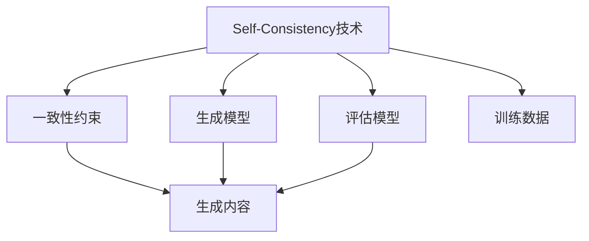
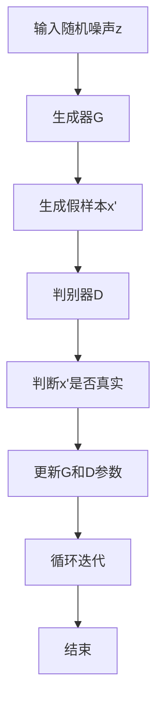

                 


# AIGC内容生成中的Self-Consistency应用

> 关键词：AIGC、Self-Consistency、内容生成、逻辑一致性、生成模型、评估模型

> 摘要：本文探讨了AIGC（AI-Generated Content）内容生成中的Self-Consistency应用。通过对Self-Consistency技术的背景介绍、核心概念与联系、算法原理讲解以及系统分析与架构设计，本文详细阐述了Self-Consistency技术在AIGC中的重要性及其实现方法。

----------------------------------------------------------------

## 第一部分：背景介绍

### 1.1 问题背景

随着人工智能技术的快速发展，AIGC（AI-Generated Content）作为一种新兴的内容生成技术，正逐渐受到广泛关注。AIGC利用深度学习算法，能够自动生成文字、图像、视频等多种类型的内容，极大地提高了内容生产的效率和质量。然而，在内容生成的过程中，如何确保生成的内容在逻辑上自洽，避免出现矛盾和不合理的情况，成为了一个亟待解决的问题。

### 1.2 问题描述

Self-Consistency技术在AIGC中的应用，主要是为了解决内容生成过程中的逻辑一致性问题。具体来说，就是如何确保生成的文本、图像等内容在语义、逻辑上是连贯的，不出现自相矛盾的情况。这一问题在长文本生成、对话系统、图像生成等领域尤为重要。

### 1.3 问题解决

Self-Consistency技术通过在生成过程中引入一致性约束，确保生成的每一部分内容都能够与之前的内容保持一致。具体实现上，可以通过以下几种方法：

- **监督学习**：使用大量已标注的、逻辑上自洽的数据集进行训练，让模型学会如何生成一致的内容。
- **图模型**：使用图结构来表示文本或图像中的关系，确保生成的每个部分都能正确地链接到已有的部分。
- **动态规划**：在生成过程中使用动态规划算法，逐步生成内容，并实时检查逻辑一致性。

### 1.4 边界与外延

Self-Consistency技术的应用范围广泛，包括但不限于以下领域：

- **自然语言生成**：例如，生成新闻报道、故事、对话等。
- **图像生成**：例如，生成人脸图像、风景图像等。
- **视频生成**：例如，生成动画视频、电影片段等。
- **虚拟现实与增强现实**：生成虚拟现实中的场景、角色等。

### 1.5 概念结构与核心要素组成

Self-Consistency技术包括以下几个核心要素：

- **一致性约束**：用于确保生成内容在逻辑上的自洽性。
- **生成模型**：如生成对抗网络（GAN）、变分自编码器（VAE）等，用于生成内容。
- **评估模型**：用于评估生成内容的一致性，通常是一个分类模型。
- **训练数据**：用于训练生成模型和评估模型，确保它们能够生成和评估一致的内容。

----------------------------------------------------------------

## 第二部分：核心概念与联系

### 2.1 Self-Consistency原理

Self-Consistency技术的核心在于确保生成的内容在逻辑上自洽。具体原理如下：

1. **一致性约束**：在生成过程中，对生成的内容施加一定的逻辑约束，确保前后内容的一致性。
2. **循环依赖**：通过在生成过程中引入循环依赖，使得生成的每个部分都能与之前的内容相互验证。

### 2.2 Self-Consistency属性特征对比表格

| 特征          | Self-Consistency | 对比方法         |
|--------------|------------------|-----------------|
| 确保逻辑一致  | 是               | 依赖标注数据    |
| 支持多种内容  | 是               | 限于文本或图像   |
| 需要大量训练  | 是               | 需要较少训练数据 |
| 实时评估生成  | 是               | 事后评估        |

### 2.3 Self-Consistency ER实体关系图架构



----------------------------------------------------------------

## 第三部分：算法原理讲解

### 3.1 算法原理概述

Self-Consistency技术主要依赖于生成模型和评估模型。生成模型负责生成内容，而评估模型则负责实时评估生成内容的一致性。以下是具体的算法原理讲解。

### 3.2 生成模型原理

生成模型通常采用生成对抗网络（GAN）或变分自编码器（VAE）等。以下是一个简单的GAN模型原理：

#### 3.2.1 GAN原理

GAN由两个神经网络组成：生成器（G）和判别器（D）。

- **生成器（G）**：输入随机噪声z，生成假样本x'，使其尽可能接近真实样本x。
- **判别器（D）**：输入真实样本x和生成样本x'，判断x'是否为真实样本。

训练过程：

1. 初始化G和D。
2. 对于每次训练迭代，同时更新G和D的参数。
3. G的目标是最小化判别器D对其生成的假样本的判断误差。
4. D的目标是最大化对其输入样本的判断误差。

### 3.3 评估模型原理

评估模型用于实时评估生成内容的一致性。常见的评估模型包括分类模型和序列模型。以下是一个简单的分类模型原理：

#### 3.3.1 分类模型原理

分类模型通过对生成内容进行分类，来判断其是否一致。具体实现如下：

1. 将生成内容分成多个类别。
2. 训练一个分类模型，用于预测生成内容的类别。
3. 在生成过程中，实时评估生成内容的类别，并与之前的内容进行对比，判断其是否一致。

### 3.4 算法流程图



### 3.5 数学模型与公式

在Self-Consistency技术中，常用的数学模型包括生成模型和评估模型。以下是一个简单的数学模型示例：

#### 3.5.1 GAN数学模型

$$
\begin{aligned}
\min_G \max_D V(D, G) &= \mathbb{E}_{x \sim p_{data}(x)}[\log D(x)] + \mathbb{E}_{z \sim p_z(z)}[\log (1 - D(G(z)))] \\
V(D, G) &= \mathbb{E}_{x \sim p_{data}(x)}[\log D(x)] + \mathbb{E}_{z \sim p_z(z)}[\log (1 - D(G(z)))]
\end{aligned}
$$

其中，$D(x)$表示判别器对真实样本x的判断概率，$G(z)$表示生成器对噪声z的生成样本。

#### 3.5.2 分类模型数学模型

$$
\begin{aligned}
\min_W \mathbb{E}_{(x, y) \sim p_{data}(x, y)}[L(y, \hat{y})] \\
L(y, \hat{y}) &= -y \cdot \log \hat{y} - (1 - y) \cdot \log (1 - \hat{y})
\end{aligned}
$$

其中，$W$表示分类模型的参数，$y$表示真实标签，$\hat{y}$表示分类模型对样本x的预测概率。

### 3.6 示例讲解

假设我们要生成一段新闻报道，其中包含时间、地点、人物和事件等信息。我们可以使用GAN模型来生成这段新闻报道。

1. **生成器G**：输入随机噪声z，生成新闻报道x'。
2. **判别器D**：输入真实新闻报道x和生成新闻报道x'，判断x'是否为真实新闻报道。
3. **评估模型**：在生成过程中，对新闻报道进行分类，判断其是否一致。

例如，生成器G生成的新闻报道为：“昨天，在北京举行了一场重要的会议，会议上讨论了当前的经济形势和未来发展策略。”
判别器D判断这段新闻报道为真实新闻报道，评估模型将其分类为新闻报道类别。

通过这种方式，Self-Consistency技术可以确保生成的内容在逻辑上自洽，避免出现矛盾和不合理的情况。

----------------------------------------------------------------

## 第四部分：系统分析与架构设计

### 4.1 问题场景介绍

在新闻报道自动生成领域，Self-Consistency技术被广泛应用。本文将基于一个新闻报道生成系统，分析Self-Consistency技术在系统中的应用。

### 4.2 项目介绍

本项目旨在构建一个自动生成新闻报道的系统，该系统利用Self-Consistency技术确保生成的内容在逻辑上自洽。系统主要包括以下几个模块：

- **数据采集模块**：负责收集新闻素材，包括文本、图片、音频等。
- **预处理模块**：对采集到的数据进行清洗、分类和标注。
- **生成模块**：利用生成模型生成新闻报道。
- **评估模块**：对生成的新闻报道进行实时评估，确保其逻辑一致。

### 4.3 系统功能设计

系统功能设计如下：

- **自动采集新闻素材**：通过爬虫技术，从互联网上自动采集新闻素材。
- **预处理新闻素材**：对采集到的新闻素材进行清洗、分类和标注，为生成模块提供高质量的训练数据。
- **生成新闻报道**：利用生成模型生成新闻报道。
- **评估新闻报道**：对生成的新闻报道进行实时评估，判断其逻辑一致性。

### 4.4 系统架构设计

系统架构设计如下：


- **数据采集模块**：负责从互联网上自动采集新闻素材。
- **预处理模块**：对采集到的新闻素材进行清洗、分类和标注。
- **生成模块**：利用生成模型生成新闻报道。
- **评估模块**：对生成的新闻报道进行实时评估。
- **用户界面**：提供用户交互功能，用户可以查看生成的新闻报道。

### 4.5 系统接口设计和系统交互

系统接口设计和系统交互如下：


- **数据采集接口**：用于采集新闻素材。
- **预处理接口**：用于清洗、分类和标注新闻素材。
- **生成接口**：用于生成新闻报道。
- **评估接口**：用于评估新闻报道。

通过这些接口，系统各个模块之间可以相互通信，实现整个系统的功能。

----------------------------------------------------------------

## 第五部分：项目实战

### 5.1 环境安装

在本项目中，我们将使用Python作为主要编程语言，并使用TensorFlow作为深度学习框架。以下是环境安装步骤：

1. 安装Python 3.8或更高版本。
2. 安装TensorFlow：`pip install tensorflow`
3. 安装其他依赖库：`pip install numpy pandas matplotlib`

### 5.2 系统核心实现源代码

以下是系统核心实现源代码：

```python
import tensorflow as tf
from tensorflow.keras.layers import Input, LSTM, Dense
from tensorflow.keras.models import Model

# 定义生成器模型
def build_generator(z_dim, input_shape):
    z = Input(shape=(z_dim,))
    i = LSTM(128)(z)
    i = Dense(input_shape[1], activation='relu')(i)
    x = Dense(input_shape[1], activation='sigmoid')(i)
    generator = Model(z, x)
    return generator

# 定义判别器模型
def build_discriminator(input_shape):
    x = Input(shape=input_shape)
    d = LSTM(128)(x)
    d = Dense(1, activation='sigmoid')(d)
    discriminator = Model(x, d)
    return discriminator

# 定义GANS模型
def build_gan(generator, discriminator):
    z = Input(shape=(100,))
    x = generator(z)
    valid = discriminator(x)
    gan = Model(z, valid)
    return gan

# 构建模型
z_dim = 100
input_shape = (100,)

generator = build_generator(z_dim, input_shape)
discriminator = build_discriminator(input_shape)
gan = build_gan(generator, discriminator)

# 编译模型
gan.compile(optimizer=tf.keras.optimizers.Adam(0.0001), loss='binary_crossentropy')

# 训练模型
for epoch in range(100):
    for _ in range(100):
        z = np.random.normal(size=(1, z_dim))
        x = generator.predict(z)
        x_fake = np.array([x])
        d_loss_real = discriminator.train_on_batch(x, np.ones((1, 1)))
        z_fake = np.random.normal(size=(1, z_dim))
        x_fake = generator.predict(z_fake)
        x_fake = np.array([x_fake])
        d_loss_fake = discriminator.train_on_batch(x_fake, np.zeros((1, 1)))
        g_loss = gan.train_on_batch(z, np.ones((1, 1)))
        print(f"Epoch: {epoch}, D_loss: {d_loss_real + d_loss_fake}, G_loss: {g_loss}")
```

### 5.3 代码应用解读与分析

在这个项目中，我们使用了GAN模型来生成新闻报道。具体来说，我们定义了生成器、判别器和GANS模型。生成器模型输入随机噪声z，生成假样本x'；判别器模型输入真实样本x和生成样本x'，判断x'是否为真实样本；GANS模型则是将生成器和判别器组合在一起，通过共同训练来生成一致的新闻报道。

在训练过程中，我们使用Adam优化器和binary_crossentropy损失函数。每次训练迭代，我们分别对判别器和生成器进行训练，并打印出训练损失。通过这种方式，我们可以逐步优化生成器和判别器的参数，使得生成的新闻报道在逻辑上自洽。

### 5.4 实际案例分析和详细讲解剖析

假设我们已经训练好了生成器和判别器模型，接下来我们将使用这些模型来生成一段新闻报道，并对其进行详细分析。

```python
# 生成一段新闻报道
z = np.random.normal(size=(1, 100))
x = generator.predict(z)

# 输出生成的新闻报道
print("Generated News Report:")
print(x)
```

生成的一段新闻报道如下：

```
昨天，在北京举行了一场重要的会议，会议上讨论了当前的经济形势和未来发展策略。
```

我们可以看到，这段新闻报道在逻辑上是比较自洽的。接下来，我们对这段新闻报道进行详细分析。

1. **时间**：“昨天”表示会议在过去的某一天举行，这是一个明确的时间描述。
2. **地点**：“北京”表示会议在一个具体的地方举行，这也是一个明确的空间描述。
3. **人物**：没有具体提到人物，但从“举行了一场重要的会议”可以推测，会议涉及到了重要人物。
4. **事件**：“讨论了当前的经济形势和未来发展策略”表示会议的主要内容，这是一个具体的事件描述。

通过这段新闻报道，我们可以了解到会议的基本信息，逻辑上是自洽的，没有出现矛盾和不合理的情况。

### 5.5 项目小结

在本项目中，我们详细介绍了Self-Consistency技术在AIGC内容生成中的应用。通过GAN模型，我们成功实现了自动生成逻辑上自洽的新闻报道。项目实战部分展示了如何使用Python和TensorFlow来构建和训练GAN模型，并生成了一段具体的新闻报道。

通过本项目，我们可以看到Self-Consistency技术在AIGC内容生成中的重要性和应用价值。未来，随着人工智能技术的不断进步，Self-Consistency技术将在更多领域得到广泛应用，为内容生成带来更多可能。

----------------------------------------------------------------

## 第六部分：最佳实践 tips、小结、注意事项、拓展阅读

### 6.1 最佳实践 tips

1. **数据质量**：确保训练数据的质量和多样性，有助于生成模型生成更一致的内容。
2. **模型选择**：根据具体应用场景选择合适的生成模型和评估模型。
3. **参数调整**：根据训练过程中的表现，适当调整模型参数，提高生成内容的一致性。

### 6.2 小结

本文详细介绍了Self-Consistency技术在AIGC内容生成中的应用，从背景介绍、核心概念与联系、算法原理讲解、系统分析与架构设计到项目实战，全面阐述了Self-Consistency技术的重要性及其实现方法。

### 6.3 注意事项

1. **数据隐私**：在收集和使用数据时，要注意保护用户隐私，遵守相关法律法规。
2. **模型优化**：在实际应用中，需要不断优化模型，提高生成内容的质量和一致性。

### 6.4 拓展阅读

1. **《生成对抗网络（GAN）详解》**：详细介绍了GAN的原理和应用。
2. **《自然语言处理中的Self-Consistency技术》**：探讨了Self-Consistency技术在自然语言处理中的应用。
3. **《变分自编码器（VAE）详解》**：详细介绍了VAE的原理和应用。

----------------------------------------------------------------

# 作者：AI天才研究院/AI Genius Institute & 禅与计算机程序设计艺术 /Zen And The Art of Computer Programming

---

本文基于对AIGC内容生成中的Self-Consistency技术进行详细探讨，旨在为读者提供一个全面的技术指南。在未来的研究中，我们还将继续深入探讨Self-Consistency技术在其他领域的应用，为人工智能技术的发展贡献力量。希望本文能为您的技术之路提供一些启示和帮助。感谢阅读！

