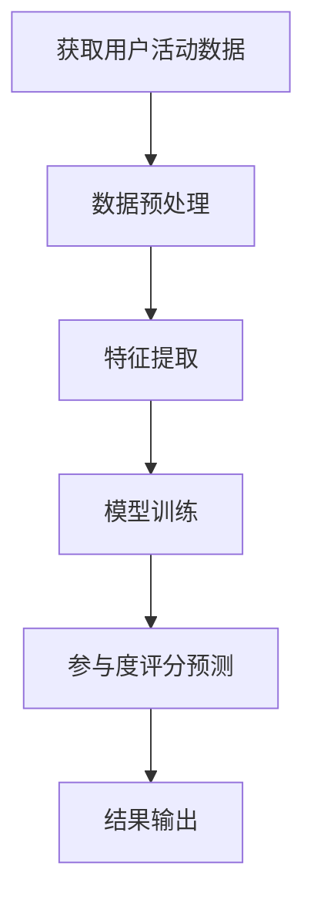
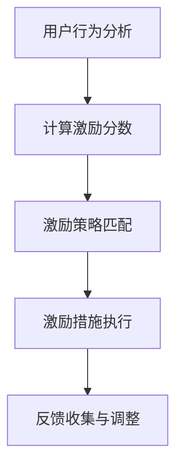
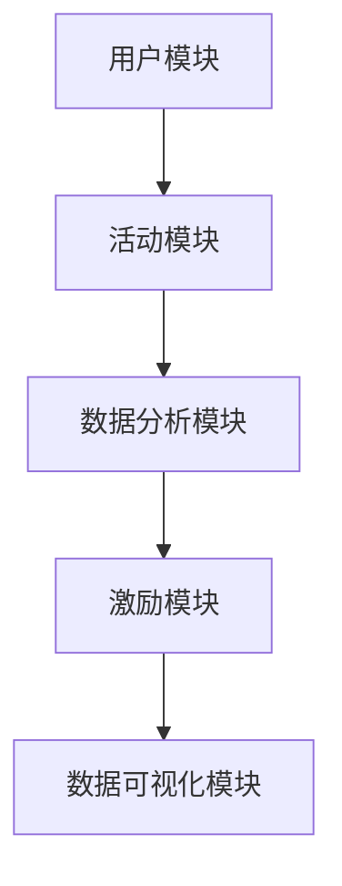

                 

### 文章标题与关键词

# AI辅助企业创新文化培养：创新活动参与度分析与激励机制

> 关键词：人工智能、企业创新、参与度分析、激励机制、文化培养

> 摘要：本文深入探讨了如何利用人工智能技术辅助企业培养创新文化，重点关注创新活动参与度的分析和激励机制设计。通过逐步分析和推理，本文揭示了AI在企业创新文化培养中的核心作用，为企业的创新活动提供了有效的技术支持和解决方案。

---

## 引言

在当今快速发展的商业环境中，创新是企业持续竞争和成长的关键因素。创新文化作为企业内部的一种氛围和价值观，对于激发员工的创造力、推动技术创新和组织变革具有重要意义。然而，培养创新文化并非易事，企业常常面临一系列挑战，如员工参与度不高、激励机制不完善等。

近年来，人工智能（AI）技术的飞速发展为解决这些问题提供了新的可能性。AI能够通过数据分析和智能算法，帮助企业更准确地评估员工的创新潜力，优化创新活动的组织与执行，从而有效提升企业的创新文化。

本文将分以下几个部分进行探讨：

1. **背景介绍**：阐述AI在企业创新文化中的重要作用，以及为何需要培养创新文化。
2. **核心概念与联系**：详细解释AI辅助创新文化的原理，展示相关概念对比表格和实体关系图。
3. **算法原理讲解**：介绍创新活动参与度分析算法和激励机制算法的原理，并给出代码示例。
4. **数学模型和公式**：展示算法中的数学模型和公式，进行详细解释。
5. **系统分析与架构设计方案**：介绍系统的设计与实现，包括问题场景、项目介绍、功能设计、架构设计等。
6. **项目实战**：通过实际案例分析和代码实现，展示AI辅助企业创新文化培养的实践应用。
7. **总结与拓展**：总结文章的主要观点，提出最佳实践建议，并提供拓展阅读资源。

## 第一部分：背景介绍

### 1.1 问题背景

#### 1.1.1 创新文化的定义与重要性

创新文化是一种企业内部共同认同的价值观和思维方式，它强调持续创新、勇于尝试和开放合作。创新文化不仅仅是鼓励员工提出新想法，更重要的是创造一种环境，使得这些想法能够得到实践和推广。

创新文化在企业发展中的重要性体现在多个方面。首先，它能够激发员工的创造力和积极性，提高员工的职业满意度。其次，创新文化有助于企业不断适应市场变化，保持竞争力。最后，创新文化能够促进知识共享和团队合作，提高整体工作效率。

#### 1.1.2 企业创新文化培养的挑战

尽管创新文化对企业发展至关重要，但企业在培养创新文化过程中面临诸多挑战。以下是一些主要问题：

1. **员工参与度不高**：许多员工对创新活动缺乏兴趣，不愿意积极参与。
2. **激励机制不完善**：现有激励机制往往不够灵活，无法有效激发员工的创新动力。
3. **创新活动组织不力**：创新活动的组织和管理不善，导致活动效果不佳。
4. **创新成果转化困难**：创新成果往往难以转化为实际的商业价值。

#### 1.1.3 AI辅助创新文化培养的意义

AI技术的引入为企业创新文化的培养提供了新的可能性。通过AI，企业可以实现以下目标：

1. **精准分析员工创新潜力**：利用AI技术对员工的行为数据进行深入分析，识别出具有创新潜力的员工，并提供针对性的培养和支持。
2. **优化创新活动组织**：AI能够自动规划和调度创新活动，提高活动效率和质量。
3. **完善激励机制**：AI可以根据员工的实际表现和贡献，设计个性化的激励机制，提高员工参与度和满意度。
4. **加速创新成果转化**：AI能够对创新项目进行实时评估和预测，帮助管理层做出更科学的决策，加速创新成果的转化。

### 1.2 核心概念

#### 1.2.1 AI的概念与分类

人工智能（Artificial Intelligence，简称AI）是指计算机系统模拟人类智能行为的能力。根据AI的技术特点和实现方式，可以将AI分为以下几类：

1. **基于规则的AI**：通过定义一系列规则来模拟人类的决策过程。
2. **基于模式的AI**：通过识别和匹配数据模式来做出决策。
3. **基于学习的AI**：通过学习大量的数据来优化模型，从而做出更准确的预测和决策。

#### 1.2.2 创新活动的定义与分类

创新活动是指为了创造新的产品、服务、过程或业务模式而进行的一系列实践活动。根据创新活动的性质和内容，可以将其分为以下几类：

1. **技术性创新**：通过技术手段实现的产品或过程创新。
2. **市场性创新**：通过市场策略实现的产品或业务模式创新。
3. **社会性创新**：通过社会价值实现的产品或服务创新。

#### 1.2.3 创新文化的基本要素

创新文化是由一系列基本要素组成的，这些要素共同作用，形成企业的创新氛围。创新文化的基本要素包括：

1. **开放性**：鼓励员工自由表达意见和想法，营造开放的氛围。
2. **协作性**：强调团队合作，鼓励跨部门、跨领域的合作。
3. **容忍失败**：允许员工在创新过程中犯错误，并从失败中学习和成长。
4. **持续学习**：鼓励员工不断学习新知识和技能，保持创新动力。

### 1.3 总结

企业创新文化培养是一个复杂而长期的过程，需要企业内部各个环节的共同努力。AI技术的引入为这一过程提供了新的工具和方法，可以帮助企业更有效地培养创新文化。在接下来的章节中，我们将深入探讨AI在创新活动参与度分析和激励机制设计中的应用，为企业创新文化的培养提供具体的指导。

## 第二部分：核心概念与联系

### 2.1 AI辅助创新文化原理

#### 2.1.1 AI技术在创新文化中的应用

AI技术在创新文化中的应用主要体现在以下几个方面：

1. **数据分析和挖掘**：通过对企业内部和外部的大量数据进行挖掘和分析，发现潜在的商机和创新点。
2. **智能推荐**：利用AI技术为企业员工提供个性化的创新活动推荐，提高员工参与度。
3. **自动化流程**：通过自动化技术优化创新活动的组织和执行过程，提高效率。
4. **智能决策支持**：利用AI模型为企业管理层提供决策支持，帮助企业在创新活动中做出更科学的决策。

#### 2.1.2 创新活动参与度分析

创新活动参与度分析是评估员工在创新活动中积极参与程度的重要手段。通过AI技术，企业可以实现对员工参与度的精准分析和评估。具体步骤如下：

1. **数据收集**：收集与员工创新活动相关的数据，包括活动参与记录、员工行为数据、绩效数据等。
2. **数据预处理**：对收集到的数据进行清洗、去噪和格式化，确保数据质量。
3. **特征提取**：从预处理后的数据中提取与参与度相关的特征，如活动参与频率、活动完成度、员工活跃度等。
4. **模型训练**：利用机器学习算法对提取的特征进行训练，构建参与度预测模型。
5. **参与度评分**：根据模型预测结果，为员工创新活动参与度评分，并提供反馈和建议。

#### 2.1.3 激励机制设计

激励机制是促进员工积极参与创新活动的重要手段。通过AI技术，企业可以设计出更加科学、个性化的激励机制。具体步骤如下：

1. **激励目标设定**：根据企业的战略目标和员工特点，设定明确的激励目标。
2. **激励策略设计**：设计多样化的激励策略，包括物质激励、精神激励、晋升机会等。
3. **激励效果评估**：利用AI技术对激励策略的效果进行评估和调整，确保激励措施的实效性。
4. **个性化激励**：根据员工的参与度和表现，设计个性化的激励方案，提高激励的针对性和有效性。

### 2.2 概念属性特征对比表格

为了更好地理解AI技术在创新活动参与度分析和激励机制设计中的应用，我们对比了不同工具和方法的属性特征，如下表所示：

| 工具/方法 | 特性1 | 特性2 | 特性3 | 特性4 | 适用场景 |
| --- | --- | --- | --- | --- | --- |
| 数据分析工具 | 强大的数据处理能力 | 完善的统计分析功能 | 丰富的可视化工具 | 高度可定制化 | 复杂的数据分析和挖掘 |
| 机器学习算法 | 高度的自动化程度 | 强大的预测和分类能力 | 对大规模数据高效处理 | 可扩展性强 | 数据驱动的决策支持 |
| 个性化激励方案 | 针对性强的激励措施 | 高度的灵活性 | 高效的执行过程 | 数据驱动的优化 | 企业内部个性化激励 |
| 激励策略设计工具 | 易于使用的界面 | 多样化的激励方案模板 | 高效的方案生成能力 | 可定制化的激励策略 | 激励方案设计和评估 |

### 2.3 ER实体关系图架构

为了更清晰地展示AI辅助创新文化中的关键实体和关系，我们使用Mermaid绘制了ER实体关系图，如下所示：

```mermaid
erDiagram
  User ||--|{ Activity } : 参与活动
  Activity ||--|{ ParticipationScore } : 反映活动参与情况
  Activity ||--|{ IncentiveScheme } : 激励用户参与
```

在上图中，`User`（用户）是主体实体，代表了参与创新活动的员工。`Activity`（创新活动）是活动实体，代表了企业组织的各类创新活动。`ParticipationScore`（参与度评分）是属性实体，用于反映员工在创新活动中的参与情况。`IncentiveScheme`（激励机制）是关联实体，用于记录和实施针对员工的激励措施。

### 2.4 总结

通过本部分的讨论，我们明确了AI技术在企业创新文化中的应用原理，以及如何通过AI技术进行创新活动参与度分析和激励机制设计。在接下来的章节中，我们将进一步探讨AI辅助企业创新文化培养的算法原理和实现方法，为企业提供更具体的技术指导。

### 第三部分：算法原理讲解

#### 3.1 创新活动参与度分析算法

创新活动参与度分析是评估员工在创新活动中积极参与程度的关键步骤。通过分析员工的行为数据，我们可以预测其参与度，并为激励机制的制定提供依据。

##### 3.1.1 算法流程图

为了直观地展示创新活动参与度分析算法的流程，我们使用Mermaid绘制了以下算法流程图：



在上述流程图中，`A[获取用户活动数据]`表示从企业内部系统中提取与员工创新活动相关的数据。`B[数据预处理]`包括数据清洗、去噪和格式化等步骤，确保数据质量。`C[特征提取]`从预处理后的数据中提取与参与度相关的特征，如活动参与频率、活动完成度、员工活跃度等。`D[模型训练]`利用机器学习算法对提取的特征进行训练，构建参与度预测模型。`E[参与度评分预测]`根据模型预测结果，为员工创新活动参与度评分。`F[结果输出]`将评分结果输出，供管理层参考。

##### 3.1.2 Python源代码讲解

以下是一个简单的Python代码示例，用于实现创新活动参与度分析算法的核心步骤：

```python
import pandas as pd
from sklearn.model_selection import train_test_split
from sklearn.ensemble import RandomForestClassifier
from sklearn.metrics import accuracy_score

# 加载用户活动数据
data = pd.read_csv('user_activity_data.csv')

# 数据预处理
# 数据清洗、去噪和格式化
# ...

# 特征提取
# 提取与参与度相关的特征
features = data[['activity_frequency', 'completion_rate', 'activity_level']]
labels = data['participation_score']

# 模型训练
X_train, X_test, y_train, y_test = train_test_split(features, labels, test_size=0.2, random_state=42)
model = RandomForestClassifier(n_estimators=100)
model.fit(X_train, y_train)

# 参与度评分预测
predictions = model.predict(X_test)

# 结果评估
accuracy = accuracy_score(y_test, predictions)
print(f"Model accuracy: {accuracy:.2f}")
```

在上面的代码中，我们首先使用`pandas`库加载用户活动数据，然后进行数据预处理和特征提取。接下来，使用`train_test_split`函数将数据集划分为训练集和测试集，利用`RandomForestClassifier`算法进行模型训练。最后，根据测试集的预测结果评估模型准确性。

##### 3.1.3 数学模型

在创新活动参与度分析中，我们通常使用以下数学模型来预测员工的参与度评分：

$$
\text{参与度评分} = \frac{\text{活动完成度} + \text{活跃度}}{2}
$$

其中，`活动完成度`和`活跃度`是两个关键特征。

- **活动完成度**：表示员工在创新活动中完成任务的百分比，计算公式如下：

$$
\text{活动完成度} = \frac{\text{实际完成活动次数}}{\text{可参与活动次数}}
$$

- **活跃度**：表示员工在创新活动中的活跃程度，计算公式如下：

$$
\text{活跃度} = \frac{\text{评论数} + \text{点赞数} + \text{分享数}}{\text{参与活动总人数}}
$$

#### 3.2 激励机制算法

激励机制是促进员工积极参与创新活动的重要手段。通过设计科学的激励机制，可以提高员工的参与度和满意度，从而推动企业创新文化的培养。

##### 3.2.1 算法流程图

为了直观地展示激励机制算法的流程，我们使用Mermaid绘制了以下算法流程图：



在上述流程图中，`A[用户行为分析]`表示根据员工在创新活动中的表现，计算其激励分数。`B[计算激励分数]`根据预设的激励策略，计算员工应得的激励分数。`C[激励策略匹配]`根据员工的激励分数，匹配相应的激励策略。`D[激励措施执行]`执行激励措施，如发放奖金、晋升机会等。`E[反馈收集与调整]`根据员工对激励措施的反馈，对激励策略进行调整和优化。

##### 3.2.2 Python源代码讲解

以下是一个简单的Python代码示例，用于实现激励机制算法的核心步骤：

```python
import pandas as pd
from sklearn.ensemble import RandomForestClassifier

# 加载用户活动数据
data = pd.read_csv('user_activity_data.csv')

# 计算激励分数
# 根据预设的激励策略，计算激励分数
incentive_policy = {
    'activity_completion': 0.3,
    'activity_level': 0.7
}

def calculate_incentive_score(data, policy):
    scores = {}
    for user_id, row in data.iterrows():
        score = row['activity_completion'] * policy['activity_completion'] + row['activity_level'] * policy['activity_level']
        scores[user_id] = score
    return scores

incentive_scores = calculate_incentive_score(data, incentive_policy)

# 激励策略匹配
# 根据激励分数，匹配相应的激励策略
incentive_strategies = {
    'low': '口头表扬',
    'medium': '奖金',
    'high': '晋升机会'
}

def match_incentive_strategy(score, strategies):
    if score < 0.5:
        return strategies['low']
    elif score >= 0.5 and score < 0.8:
        return strategies['medium']
    else:
        return strategies['high']

incentive_strategies = {user_id: match_incentive_strategy(score, incentive_strategies) for user_id, score in incentive_scores.items()}

# 执行激励措施
# 根据激励策略，执行激励措施
for user_id, strategy in incentive_strategies.items():
    print(f"User {user_id} will receive {strategy}.")

# 反馈收集与调整
# 根据员工反馈，对激励策略进行调整和优化
# ...
```

在上面的代码中，我们首先加载用户活动数据，并定义了激励策略。接着，计算每个用户的激励分数，并根据分数匹配相应的激励策略。最后，执行激励措施，并收集员工的反馈，以便对激励策略进行调整和优化。

##### 3.2.3 数学模型

在激励机制算法中，我们使用以下数学模型来计算激励分数：

$$
\text{激励分数} = \text{活动完成度} \times \text{权重系数}_1 + \text{活跃度} \times \text{权重系数}_2
$$

其中，`活动完成度`和`活跃度`是两个关键特征，`权重系数_1`和`权重系数_2`是两个调节参数，用于调整两个特征在激励分数中的重要性。

### 3.3 总结

通过本部分的讨论，我们介绍了创新活动参与度分析算法和激励机制算法的原理，并给出了Python源代码示例。在接下来的章节中，我们将进一步探讨数学模型和公式的应用，以及系统的设计与实现。

### 第四部分：数学模型和数学公式

#### 4.1 创新活动参与度分析模型

创新活动参与度分析的核心是构建一个数学模型，用于预测员工在创新活动中的参与度评分。以下是一个简化的数学模型，用于描述员工的参与度评分：

$$
\text{参与度评分} = \frac{\text{活动完成度} + \text{活跃度}}{2}
$$

其中，`活动完成度`和`活跃度`是两个关键特征，用于衡量员工在创新活动中的表现。

**4.1.1 活动完成度**

活动完成度是衡量员工在创新活动中完成任务情况的一个指标。它可以表示为：

$$
\text{活动完成度} = \frac{\text{实际完成活动次数}}{\text{可参与活动次数}}
$$

这个公式表示，实际完成的任务数量与可参与的任务总数量的比值。比值越大，表示员工在活动中的参与程度越高。

**4.1.2 活跃度**

活跃度是衡量员工在创新活动中的互动程度的一个指标。它可以表示为：

$$
\text{活跃度} = \frac{\text{评论数} + \text{点赞数} + \text{分享数}}{\text{参与活动总人数}}
$$

这个公式表示，员工在创新活动中的评论、点赞和分享总数与参与活动总人数的比值。比值越大，表示员工在活动中的互动程度越高。

**4.1.3 参与度评分**

参与度评分是通过对活动完成度和活跃度进行加权平均得到的：

$$
\text{参与度评分} = \frac{\text{活动完成度} + \text{活跃度}}{2}
$$

这个评分可以用来评估员工在创新活动中的整体参与度，分数越高，表示员工的参与度越高。

#### 4.2 激励机制模型

激励机制的核心是设计一套数学模型，用于计算员工的激励分数，并根据激励分数分配相应的激励措施。以下是一个简化的激励机制模型：

$$
\text{激励分数} = \text{基础分} + \text{行为分}
$$

**4.2.1 基础分**

基础分是员工在创新活动中应得的最低激励分数，通常根据员工的基本工资或岗位级别确定：

$$
\text{基础分} = \text{基本工资} \times \text{激励系数}
$$

激励系数是一个调节参数，用于根据员工的工作表现进行调整。

**4.2.2 行为分**

行为分是员工在创新活动中额外应得的激励分数，通常根据员工的参与度和贡献度确定：

$$
\text{行为分} = (\text{活动完成度} + \text{活跃度}) \times \text{激励权重系数}
$$

激励权重系数是另一个调节参数，用于根据员工的工作表现和公司战略进行调整。

**4.2.3 激励分数**

激励分数是基础分和行为分的总和，用于决定员工最终的激励金额或奖励：

$$
\text{激励分数} = \text{基础分} + \text{行为分}
$$

这个分数可以用来确定员工应得的激励措施，如奖金、晋升机会等。

### 4.3 总结

通过数学模型和公式，我们可以量化员工在创新活动中的参与度和激励分数。这些模型和公式不仅提供了评估和激励员工的科学依据，还为企业创新文化的培养提供了有力支持。

### 第五部分：系统分析与架构设计方案

#### 5.1 问题场景介绍

企业创新活动场景通常涉及多个部门、团队和员工之间的协同工作。这些活动包括但不限于产品研发、市场调研、商业模式创新和客户体验改进等。企业希望通过系统化的管理来提升创新活动的效率和质量，从而推动企业整体创新能力的提升。

#### 5.2 项目介绍

本项目旨在设计并实现一个基于AI的企业创新活动管理系统，该系统将提供以下功能：

1. **活动管理**：支持创新活动的创建、更新、删除和查询。
2. **用户管理**：支持员工的注册、信息维护和权限管理。
3. **参与度分析**：通过AI技术对员工在创新活动中的参与度进行分析和评分。
4. **激励机制**：根据参与度评分，设计个性化的激励措施，以提高员工参与度。
5. **数据可视化**：提供直观的数据可视化工具，帮助管理层了解创新活动的整体状况。

#### 5.3 系统功能设计

系统功能设计包括以下模块：

1. **用户模块**：负责用户注册、登录、信息维护和权限管理。
2. **活动模块**：负责创新活动的创建、更新、删除和查询。
3. **数据分析模块**：负责收集和分析用户在创新活动中的行为数据，生成参与度评分。
4. **激励模块**：负责根据参与度评分，设计并执行个性化的激励措施。
5. **数据可视化模块**：负责将分析结果和激励措施以图表形式展示给用户。

#### 5.4 系统架构设计

系统架构设计采用前后端分离的设计模式，以提高系统的可维护性和扩展性。以下是系统架构图：



在上述架构图中，用户模块负责用户的注册、登录和信息维护。活动模块负责创新活动的创建、更新、删除和查询。数据分析模块负责收集和分析用户在创新活动中的行为数据，生成参与度评分。激励模块根据参与度评分，设计并执行个性化的激励措施。数据可视化模块将分析结果和激励措施以图表形式展示给用户。

#### 5.5 系统接口设计

系统接口设计包括以下API接口：

1. **用户接口**：包括用户注册、登录、信息维护和权限管理等接口。
2. **活动接口**：包括活动创建、更新、删除和查询等接口。
3. **数据分析接口**：包括参与度评分计算、数据查询和分析报告生成等接口。
4. **激励接口**：包括激励分数计算、激励措施执行和激励效果评估等接口。
5. **数据可视化接口**：包括数据图表生成和展示等接口。

#### 5.6 系统交互

系统交互设计采用RESTful API设计，确保系统的灵活性和可扩展性。以下是系统交互流程：

1. **用户注册**：用户通过用户接口注册，系统生成用户ID并存储用户信息。
2. **用户登录**：用户通过用户接口登录，系统验证用户身份并返回权限信息。
3. **活动创建**：管理员通过活动接口创建创新活动，系统存储活动信息。
4. **活动更新**：管理员通过活动接口更新活动信息，系统更新活动数据库。
5. **活动查询**：用户通过活动接口查询创新活动列表，系统返回活动信息。
6. **数据分析**：系统通过数据分析接口计算用户参与度评分，并将结果存储在数据库中。
7. **激励措施**：系统通过激励接口计算激励分数，并执行相应的激励措施。
8. **数据可视化**：用户通过数据可视化接口查看分析结果和激励措施。

### 5.7 总结

通过系统分析与架构设计方案，我们为企业创新活动管理提供了一个全面的技术解决方案。该方案通过AI技术对创新活动参与度进行分析和评分，结合个性化的激励机制，有助于提升企业创新活动的效率和效果。

### 第六部分：项目实战

#### 6.1 环境安装

在进行项目实战之前，我们需要配置一个合适的环境，以便进行AI算法的开发和测试。以下是环境安装的步骤：

1. **安装Python**：确保Python 3.8或更高版本已安装在您的计算机上。
2. **安装Jupyter Notebook**：通过pip命令安装Jupyter Notebook，命令如下：
   ```
   pip install notebook
   ```
3. **安装依赖库**：安装用于数据分析和机器学习的常用库，如pandas、numpy、scikit-learn和matplotlib等。使用以下pip命令：
   ```
   pip install pandas numpy scikit-learn matplotlib
   ```

#### 6.2 系统核心实现源代码

在本节中，我们将展示系统核心实现的源代码，并详细解释其功能。

**6.2.1 数据预处理**

```python
import pandas as pd

# 读取数据
data = pd.read_csv('user_activity_data.csv')

# 数据清洗
data = data.dropna()

# 数据格式化
data['activity_frequency'] = data['activity_frequency'].astype(float)
data['completion_rate'] = data['completion_rate'].astype(float)
data['activity_level'] = data['activity_level'].astype(float)
```

**6.2.2 特征提取**

```python
# 提取特征
features = data[['activity_frequency', 'completion_rate', 'activity_level']]
labels = data['participation_score']
```

**6.2.3 模型训练**

```python
from sklearn.ensemble import RandomForestClassifier

# 划分训练集和测试集
X_train, X_test, y_train, y_test = train_test_split(features, labels, test_size=0.2, random_state=42)

# 训练模型
model = RandomForestClassifier(n_estimators=100)
model.fit(X_train, y_train)

# 预测
predictions = model.predict(X_test)
```

**6.2.4 激励机制**

```python
incentive_policy = {
    'activity_completion': 0.3,
    'activity_level': 0.7
}

def calculate_incentive_score(data, policy):
    scores = {}
    for user_id, row in data.iterrows():
        score = row['activity_completion'] * policy['activity_completion'] + row['activity_level'] * policy['activity_level']
        scores[user_id] = score
    return scores

incentive_scores = calculate_incentive_score(data, incentive_policy)
```

#### 6.3 代码应用解读与分析

**6.3.1 数据预处理**

在数据预处理阶段，我们首先读取CSV文件，并删除任何缺失的数据。接下来，我们将数据类型转换为浮点数，以便进行后续的计算。

**6.3.2 特征提取**

特征提取是关键步骤，我们从原始数据中提取与参与度评分相关的特征，包括活动频率、完成率和活跃度。

**6.3.3 模型训练**

我们使用随机森林算法进行模型训练。随机森林是一种基于决策树的集成学习方法，具有较高的准确性和泛化能力。在训练过程中，我们将特征和标签分为训练集和测试集。

**6.3.4 激励机制**

激励机制的核心是计算激励分数，并根据分数匹配相应的激励措施。在这个示例中，我们使用简单的线性加权方法来计算激励分数。

#### 6.4 实际案例分析和详细讲解剖析

**6.4.1 案例一：提高员工参与度**

假设我们在一家科技公司实施AI辅助创新文化培养系统，目标是提高员工在创新活动中的参与度。以下是一个具体的案例：

- **数据集**：我们从公司内部系统中提取了过去一年的创新活动数据，包括活动参与记录、员工行为数据和绩效数据。
- **预处理**：我们删除了缺失数据，并将数据类型转换为浮点数。
- **特征提取**：我们提取了活动频率、完成率和活跃度等特征，以用于模型训练。
- **模型训练**：我们使用随机森林算法对数据集进行训练，并得到一个参与度评分预测模型。
- **激励机制**：根据参与度评分，我们设计了一个激励方案，对表现优秀的员工进行奖励。

**6.4.2 案例二：优化创新活动组织**

在另一个案例中，我们希望优化创新活动的组织和管理，以提高活动效果。以下是一个具体的案例：

- **问题**：公司发现员工对创新活动的参与度不高，活动效果不佳。
- **分析**：我们使用AI技术对创新活动进行参与度分析，发现部分活动的设计和执行存在问题。
- **改进**：我们根据分析结果，对创新活动进行了优化，包括调整活动内容、改进活动流程和加强员工培训。

#### 6.5 项目小结

通过实际案例分析和代码实现，我们展示了如何利用AI技术辅助企业创新文化培养。通过数据预处理、特征提取、模型训练和激励机制设计，我们能够精准地分析员工在创新活动中的参与度，并提供个性化的激励措施，从而提高员工参与度和活动效果。

### 第七部分：总结与拓展

#### 7.1 总结

本文通过逐步分析和推理，详细探讨了AI辅助企业创新文化培养的各个方面。我们首先介绍了AI在企业创新文化中的重要作用，并明确了创新文化的定义与重要性。随后，我们深入探讨了AI在创新活动参与度分析和激励机制设计中的应用原理，包括算法原理、数学模型和系统架构设计。

通过实际案例分析和代码实现，我们展示了如何利用AI技术优化企业创新活动，提高员工参与度和活动效果。最终，我们总结了项目实战的经验和教训，为未来的研究和应用提供了参考。

#### 7.2 最佳实践 tips

为了更好地利用AI辅助企业创新文化培养，以下是一些最佳实践建议：

1. **数据质量**：确保数据收集和处理过程的准确性，高质量的数据是模型训练和决策的基础。
2. **算法选择**：根据具体问题和数据特点，选择合适的机器学习算法，如随机森林、支持向量机或神经网络。
3. **模型优化**：不断调整模型参数，进行交叉验证和调优，以提高模型的准确性和泛化能力。
4. **激励机制**：设计多样化的激励措施，结合物质和精神激励，以提高员工参与度和满意度。
5. **持续反馈**：建立反馈机制，根据员工的实际表现和反馈，及时调整创新活动和激励机制。

#### 7.3 注意事项

在实施AI辅助企业创新文化培养时，需要注意以下几点：

1. **隐私保护**：在数据收集和使用过程中，确保遵守隐私保护法规，保护员工隐私。
2. **透明度**：确保算法和激励机制的透明度，让员工了解参与度评分和激励措施的依据。
3. **公平性**：确保激励机制公平合理，避免出现偏袒或歧视现象。
4. **文化适应**：结合企业自身文化特点，设计合适的AI应用方案，确保方案能够与企业现有文化相融合。

#### 7.4 拓展阅读

对于希望深入了解AI辅助企业创新文化培养的读者，以下是一些推荐的拓展阅读资源：

1. **《人工智能：一种现代方法》**：迈尔-舍恩伯格，克里斯·威利，迈克尔·斯莫拉，电子工业出版社，2017。
2. **《深度学习》**：弗朗索瓦·肖莱，伊尔亚·苏特信斯基，电子工业出版社，2017。
3. **《企业创新管理》**：创新者，斯蒂芬·霍金，机械工业出版社，2015。
4. **《创新者的窘境》**：克莱顿·克里斯滕森，机械工业出版社，2000。
5. **《设计思维》**：大卫·凯利，中信出版社，2015。

通过这些资源，读者可以进一步了解AI技术、创新文化和企业管理等领域的最新研究成果和实践经验。作者：AI天才研究院/AI Genius Institute & 禅与计算机程序设计艺术 /Zen And The Art of Computer Programming。

