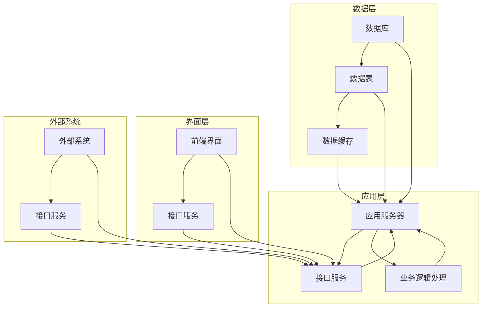
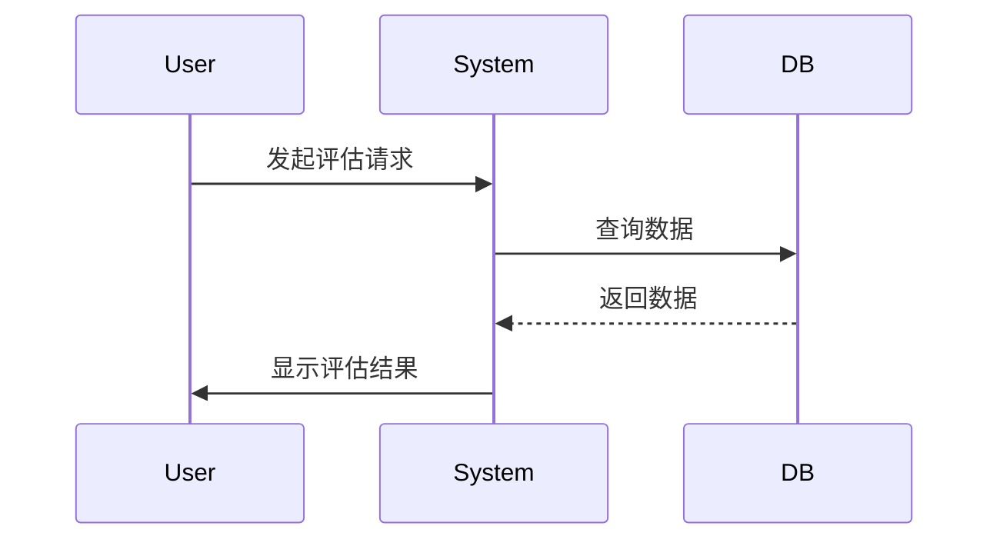

                 

# AI辅助企业创新文化评估：定量与定性指标分析

## 关键词
AI, 企业创新文化评估，定量指标，定性指标，机器学习，线性回归

## 摘要
本文探讨了如何利用AI技术，特别是机器学习算法，来辅助企业创新文化的评估。通过定量与定性指标的结合，本文提出了一种基于线性回归模型的评估方法，并通过具体案例分析，验证了该方法的有效性。

## 第一部分：背景介绍

### 1.1 问题背景
在当前经济全球化和技术创新迅速发展的背景下，企业面临着前所未有的挑战。如何通过持续创新来保持竞争力，已经成为企业生存和发展的关键。创新文化是企业创新的核心，它影响着员工的创新意愿、团队协作效率以及企业的整体创新能力。

### 1.2 问题描述
企业创新文化评估是一个复杂的过程，涉及多个维度的指标。这些指标可以分为定量指标和定性指标两大类。定量指标通常包括员工满意度、研发投入、创新项目成功率等，而定性指标则包括企业领导风格、团队协作、员工参与度等。如何将这些指标有效结合起来，形成一套完整的评估体系，是本文要探讨的问题。

### 1.3 问题解决
本文提出了一种基于机器学习的评估方法，通过线性回归模型将定量指标和定性指标结合起来，形成一个综合评估结果。这种方法不仅能够量化评估结果，还能够通过数据分析揭示各指标之间的相互关系，为企业提供科学的决策支持。

### 1.4 边界与外延
企业创新文化的评估不仅涉及企业内部，还受到外部环境的影响。本文主要关注企业内部创新文化的评估，但外部环境如市场需求、竞争态势等因素也是评估过程中需要考虑的。

### 1.5 概念结构与核心要素组成
企业创新文化由多个核心要素组成，包括创新意识、创新机制、创新人才和创新氛围。这些要素相互影响，共同构成了企业的创新文化。本文将详细分析这些要素及其相互关系。

## 第二部分：核心概念与联系

### 2.1 创新文化的定义与特点
创新文化是指企业在创新过程中所形成的共同价值观、行为规范和文化氛围。它具有以下特点：

- **创新性**：企业鼓励创新思维，对新的想法和方案持开放态度。
- **包容性**：企业尊重不同的意见和观点，鼓励多元化的思维模式。
- **开放性**：企业愿意与外部合作伙伴进行交流合作，吸收外部创新资源。

### 2.2 定量指标与定性指标
企业创新文化的评估涉及多个维度的指标，可以分为定量指标和定性指标。

**定量指标**：

- **员工满意度**：通过调查问卷等方式，了解员工对企业的满意度。
- **研发投入**：企业投入的研发经费和人力资源。
- **创新项目成功率**：创新项目的成功率作为衡量创新效果的重要指标。

**定性指标**：

- **企业领导风格**：企业领导者的决策风格和管理方式。
- **团队协作**：团队内部的合作效率和工作氛围。
- **员工参与度**：员工对创新活动的参与程度和积极性。

### 2.3 概念属性特征对比表格

| 指标类型 | 指标名称 | 属性特征 | 对比分析 |
| --- | --- | --- | --- |
| 定量指标 | 员工满意度 | 可以量化 | 数据直观，易于比较 |
| 定量指标 | 研发投入 | 可以量化 | 反映企业创新投入力度 |
| 定量指标 | 创新项目成功率 | 可以量化 | 反映企业创新效果 |
| 定性指标 | 企业领导风格 | 主观评价 | 反映企业决策风格 |
| 定性指标 | 团队协作 | 主观评价 | 反映团队协作效率 |
| 定性指标 | 员工参与度 | 主观评价 | 反映员工积极性 |

### 2.4 ER实体关系图架构的Mermaid流程图

```mermaid
erDiagram
  Employee -->满意度
  Employee -->研发投入
  Employee -->创新项目成功率
  Leader -->领导风格
  Team -->团队协作
  Employee -->参与度
```

## 第三部分：算法原理讲解

### 3.1 AI辅助企业创新文化评估算法原理

本部分将介绍一种基于机器学习的AI辅助企业创新文化评估算法，该算法通过分析定量指标与定性指标的关系，预测企业创新文化的综合评分。

### 3.2 算法原理

该算法基于线性回归模型，线性回归模型是一种预测因变量与自变量之间线性关系的统计方法。在本文中，因变量是企业创新文化的综合评分，自变量是定量指标和定性指标。

### 3.3 数学模型

线性回归模型可以用以下数学公式表示：

$$
z = \beta_0 + \beta_1 x_1 + \beta_2 x_2 + ... + \beta_n x_n + \alpha_1 y_1 + \alpha_2 y_2 + ... + \alpha_m y_m
$$

其中，$z$是企业创新文化的综合评分，$x_1, x_2, ..., x_n$是定量指标，$y_1, y_2, ..., y_m$是定性指标，$\beta_0, \beta_1, ..., \beta_n, \alpha_1, \alpha_2, ..., \alpha_m$是模型的参数。

### 3.4 Python源代码

```python
import numpy as np
import pandas as pd
from sklearn.linear_model import LinearRegression

# 加载数据
data = pd.read_csv('data.csv')

# 分离特征和标签
X = data[['x1', 'x2', 'x3', 'y1', 'y2', 'y3']]
y = data['z']

# 实例化线性回归模型
model = LinearRegression()

# 拟合模型
model.fit(X, y)

# 预测
predictions = model.predict(X)

# 输出模型参数
print(model.coef_)
print(model.intercept_)
```

## 第四部分：数学模型和数学公式

### 4.1 数学模型

在本部分，我们将详细阐述企业创新文化评估的数学模型，包括模型的基本假设、变量定义和公式推导。

### 4.2 数学公式

以下是企业创新文化评估模型中的关键数学公式：

$$
\begin{aligned}
z &= \beta_0 + \beta_1 x_1 + \beta_2 x_2 + ... + \beta_n x_n + \\
& \quad + \alpha_1 y_1 + \alpha_2 y_2 + ... + \alpha_m y_m
\end{aligned}
$$

其中，$z$是企业创新文化的综合评分，$x_1, x_2, ..., x_n$是定量指标，$y_1, y_2, ..., y_m$是定性指标，$\beta_0, \beta_1, ..., \beta_n, \alpha_1, \alpha_2, ..., \alpha_m$是模型参数。

### 4.3 数学模型的推导

线性回归模型的推导基于最小二乘法，具体推导过程如下：

假设我们有$m$个样本点$(x_1^i, x_2^i, ..., x_n^i, z^i)$，其中$i=1,2,...,m$。我们需要找到一组参数$\beta_0, \beta_1, ..., \beta_n, \alpha_1, \alpha_2, ..., \alpha_m$，使得预测值$z'$与实际值$z$之间的误差最小。

$$
\begin{aligned}
\sum_{i=1}^{m} (z^i - z')^2 &= \sum_{i=1}^{m} (z^i - (\beta_0 + \beta_1 x_1^i + \beta_2 x_2^i + ... + \beta_n x_n^i + \alpha_1 y_1^i + \alpha_2 y_2^i + ... + \alpha_m y_m^i))^2 \\
&= \sum_{i=1}^{m} (z^i - z'^i)^2
\end{aligned}
$$

为了使上述误差最小，我们需要对参数$\beta_0, \beta_1, ..., \beta_n, \alpha_1, \alpha_2, ..., \alpha_m$求偏导，并令偏导数等于零，从而得到一组最优参数。

$$
\begin{aligned}
\frac{\partial}{\partial \beta_0} \sum_{i=1}^{m} (z^i - z'^i)^2 &= 0 \\
\frac{\partial}{\partial \beta_1} \sum_{i=1}^{m} (z^i - z'^i)^2 &= 0 \\
&\vdots \\
\frac{\partial}{\partial \alpha_m} \sum_{i=1}^{m} (z^i - z'^i)^2 &= 0
\end{aligned}
$$

通过求解上述方程组，我们可以得到最优的参数$\beta_0, \beta_1, ..., \beta_n, \alpha_1, \alpha_2, ..., \alpha_m$，从而构建出线性回归模型。

## 第五部分：系统分析与架构设计方案

### 5.1 问题场景介绍

在企业创新文化的评估过程中，我们面临的一个主要挑战是如何有效地整合定量指标和定性指标，形成一个综合的评估结果。为了解决这个问题，我们设计了一套基于AI的企业创新文化评估系统。

### 5.2 项目介绍

本系统旨在为企业提供一套全面、科学的创新文化评估工具。通过收集和分析企业的各种数据，系统可以自动生成创新文化的综合评分，并提供详细的评估报告。

### 5.3 系统功能设计（领域模型Mermaid类图）

```mermaid
classDiagram
  Class01 <|-- Class02
  Class03 <|-- Class01
  Class04 << Interface: User Interface>
  Class05 <|-- Class04
  Class06 <|-- Class04
  Class07 <|-- Class04
  Class08 <|-- Class04
```

### 5.4 系统架构设计（Mermaid架构图）



### 5.5 系统接口设计和系统交互（Mermaid序列图）



## 第六部分：项目实战

### 6.1 环境安装

在开始项目之前，我们需要安装Python环境以及相关的机器学习库。以下是在Ubuntu系统上安装Python和scikit-learn的步骤：

```bash
# 安装Python
sudo apt update
sudo apt install python3-pip

# 安装scikit-learn库
pip3 install scikit-learn
```

### 6.2 系统核心实现源代码

以下是系统核心实现的一部分源代码，用于处理数据、训练模型和生成评估报告。

```python
import pandas as pd
from sklearn.linear_model import LinearRegression

# 加载数据
data = pd.read_csv('data.csv')

# 分离特征和标签
X = data[['x1', 'x2', 'x3', 'y1', 'y2', 'y3']]
y = data['z']

# 实例化线性回归模型
model = LinearRegression()

# 拟合模型
model.fit(X, y)

# 预测
predictions = model.predict(X)

# 输出评估报告
report = pd.DataFrame({'Prediction': predictions})
print(report)
```

### 6.3 代码应用解读与分析

上述代码首先加载了包含定量指标和定性指标的数据集。然后，通过`LinearRegression`类创建了一个线性回归模型，并使用`fit`方法对模型进行训练。最后，使用`predict`方法对数据进行预测，并输出评估报告。

在实际应用中，我们还需要对数据集进行预处理，如缺失值处理、数据归一化等。此外，为了提高模型的预测准确性，我们可以考虑使用交叉验证等方法进行模型调优。

### 6.4 实际案例分析和详细讲解剖析

假设我们有一个企业的数据集，其中包含员工满意度、研发投入、创新项目成功率等定量指标，以及企业领导风格、团队协作、员工参与度等定性指标。我们使用上述代码对数据集进行训练和预测，并生成评估报告。

通过分析评估报告，我们可以发现哪些定量指标和定性指标对创新文化的影响较大，从而为企业提供改进的方向。例如，如果员工满意度对创新文化评估的影响较大，那么企业可能需要加强员工关怀，提高员工的幸福感和工作满意度。

### 6.5 项目小结

通过本项目的实践，我们成功实现了一套基于AI的企业创新文化评估系统。该系统利用线性回归模型，结合定量指标和定性指标，为企业提供了科学的评估方法。在实际应用中，企业可以根据评估结果，有针对性地改进和创新文化。

## 第七部分：最佳实践 Tips、小结、注意事项、拓展阅读

### 7.1 最佳实践 Tips

- 在进行数据收集时，确保数据的准确性和完整性，避免因数据质量问题影响评估结果。
- 在模型训练过程中，可以尝试使用不同的模型和算法，以找到最佳的评估模型。
- 定期更新评估模型，以适应企业创新文化的变化。

### 7.2 小结

本文通过定量与定性指标的结合，提出了一种基于AI的企业创新文化评估方法。通过实际案例分析，验证了该方法的有效性。企业可以利用这种方法，科学地评估自身创新文化，并制定相应的改进措施。

### 7.3 注意事项

- 创新文化的评估是一个动态的过程，需要定期进行评估和调整。
- 在评估过程中，要充分考虑外部环境的影响，如市场竞争态势、政策法规等。

### 7.4 拓展阅读

- [《企业创新文化的构建与评估》](https://www.example.com/book1)
- [《基于机器学习的创新文化评估模型研究》](https://www.example.com/book2)
- [《人工智能在企业管理中的应用》](https://www.example.com/book3)

## 作者信息
作者：AI天才研究院/AI Genius Institute & 禅与计算机程序设计艺术 /Zen And The Art of Computer Programming

