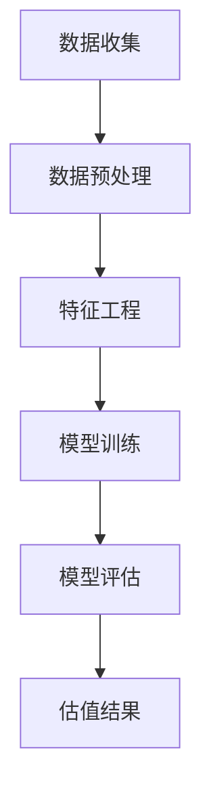

                 

## AI辅助企业并购估值：多维度财务模型与协同效应量化

关键词：企业并购、估值、AI辅助、多维度财务模型、协同效应量化

摘要：本文将深入探讨AI技术在企业并购估值中的应用，通过多维度财务模型与协同效应量化的方法，帮助企业更精准地评估并购标的的价值。首先，我们将介绍企业并购估值的核心概念与要素，并分析AI技术在其中的应用潜力。随后，我们将详细介绍多维度财务模型和协同效应量化的原理与方法。文章还将通过具体的算法原理和实现步骤，展示AI辅助估值的全过程，并通过实战案例分析，进一步验证AI辅助估值的实际效果。最后，我们将总结最佳实践，为未来的研究和应用提供方向。

## 第一部分：背景介绍与核心概念

### 1.1 问题背景

企业并购活动在全球化经济环境下日益增多，这不仅带来了机遇，也带来了挑战。随着市场的复杂性增加，企业并购估值的不准确性成为一个重要问题。传统的估值方法往往依赖于历史数据和经验，难以全面考虑市场变化和企业未来的增长潜力。这种估值不准确的问题，可能导致企业支付过高的溢价，或者低估潜在收益，从而影响并购决策的准确性。

近年来，人工智能（AI）技术的飞速发展，为解决这一难题提供了新的思路。AI能够通过大数据分析和机器学习算法，从海量数据中提取有价值的信息，为估值提供更为准确和全面的参考。因此，AI辅助企业并购估值成为了一个热门研究领域，并展现出了巨大的应用潜力。

### 1.2 定义与核心要素

**企业并购估值的定义：** 企业并购估值是指对企业并购过程中目标公司的价值进行评估的过程。估值的结果将直接影响并购决策的制定，包括购买价格、支付方式、交易条款等。

**多维度财务模型：** 多维度财务模型是指从多个角度对企业的财务状况进行分析的模型。这些维度通常包括收入、利润、现金流、资产负债等。通过多维度分析，可以更全面地了解企业的财务状况，为估值提供更丰富的数据支持。

**协同效应量化：** 协同效应量化是指对企业并购后可能产生的协同效应进行评估和量化的过程。协同效应包括成本节约、收入增加、市场份额提升等。量化协同效应有助于评估并购的实际价值，为决策提供科学依据。

**企业并购估值中的关键要素：** 企业并购估值的关键要素包括目标公司的财务状况、市场环境、行业趋势、管理层能力等。这些要素相互影响，共同决定了企业的估值结果。

### 1.3 边界与外延

**估值范围与适用行业：** 企业并购估值适用于各类行业和企业，但不同行业的估值方法和模型可能有所不同。例如，在高科技行业，估值可能更侧重于未来增长潜力和技术优势；而在传统行业，估值可能更关注现有的资产和盈利能力。

**估值方法与技术分类：** 估值方法主要包括成本法、市场法和收益法。成本法侧重于资产的重置成本；市场法通过比较类似企业的交易价格进行估值；收益法基于企业的未来收益预测进行估值。此外，AI技术的应用也使得更多先进的方法得以实现，如深度学习、强化学习等。

**估值过程中的限制因素：** 估值过程中可能受到数据质量、市场环境、政策法规等因素的限制。数据质量直接影响估值的准确性，市场环境的变化也会影响企业的估值结果。政策法规则可能对并购交易产生限制，影响估值的实施。

## 第二部分：多维度财务模型

### 2.1 财务模型概述

财务模型在估值中的重要性不言而喻。它不仅能够帮助企业了解目标公司的财务状况，还能为估值提供科学依据。常见的财务模型类型包括收入模型、利润模型、现金流模型和资产负债表模型。

**收入模型：** 收入模型主要用于预测企业的未来收入。通过分析企业的历史收入数据、市场趋势、竞争对手情况等因素，可以预测企业未来的收入水平。

**利润模型：** 利润模型则关注企业的利润状况。它通过分析成本结构、毛利率、净利率等指标，评估企业的盈利能力。利润模型的准确性对于估值的准确性至关重要。

**现金流模型：** 现金流模型关注企业的现金流入和流出情况。经营活动现金流、投资活动现金流和筹资活动现金流是现金流模型的核心组成部分。通过分析这些现金流，可以评估企业的财务健康状况和资金利用效率。

**资产负债表模型：** 资产负债表模型则关注企业的资产和负债状况。资产估值模型和负债估值模型是资产负债表模型的核心部分。通过分析资产和负债的价值，可以评估企业的资产质量和负债水平。

### 2.2 收入模型

**收入预测模型：** 收入预测模型是财务模型中的一种，主要用于预测企业的未来收入。它基于企业的历史收入数据、市场趋势、行业变化等因素，通过回归分析、时间序列分析等方法，预测企业的未来收入。

**成本预测模型：** 成本预测模型则用于预测企业的未来成本。通过分析企业的历史成本数据、生产规模、原材料价格等因素，可以预测企业的未来成本。成本预测模型的准确性对于企业的盈利预测至关重要。

### 2.3 利润模型

**利润预测模型：** 利润预测模型是财务模型中的一种，主要用于预测企业的未来利润。它基于企业的历史利润数据、市场趋势、竞争对手情况等因素，通过回归分析、时间序列分析等方法，预测企业的未来利润。

**利润稳定性分析：** 利润稳定性分析是利润模型的一个重要部分。它通过分析企业的利润波动情况，评估企业的盈利稳定性。利润稳定性分析有助于企业了解自身的盈利能力，为估值提供重要参考。

### 2.4 资产负债表模型

**资产估值模型：** 资产估值模型是资产负债表模型的一种，主要用于评估企业的资产价值。它通过分析资产的市场价格、折旧情况、未来收益等因素，评估资产的当前价值。

**负债估值模型：** 负债估值模型是资产负债表模型的另一种，主要用于评估企业的负债价值。它通过分析负债的利率、还款期限、风险等因素，评估负债的当前价值。

### 2.5 现金流模型

**经营活动现金流：** 经营活动现金流是现金流模型的核心部分，它反映了企业的日常经营活动产生的现金流量。通过分析经营活动现金流，可以了解企业的经营状况和盈利能力。

**投资活动现金流：** 投资活动现金流反映了企业的投资活动产生的现金流量，包括购买固定资产、投资股票等。通过分析投资活动现金流，可以了解企业的投资策略和资本支出情况。

**筹资活动现金流：** 筹资活动现金流反映了企业的筹资活动产生的现金流量，包括借款、还款、股权融资等。通过分析筹资活动现金流，可以了解企业的筹资能力和资金利用效率。

## 第三部分：协同效应量化

### 3.1 协同效应概述

**协同效应的概念：** 协同效应是指两个或多个企业合并后，由于资源共享、成本节约、市场扩张等因素，产生的整体效益大于各部分效益之和的现象。

**协同效应在企业并购中的重要性：** 协同效应是企业并购的重要驱动力。通过量化协同效应，可以评估并购后可能产生的额外收益，从而为并购决策提供科学依据。

### 3.2 量化协同效应

**协同效应测量的方法：** 协同效应的测量方法包括定量分析和定性分析。定量分析主要通过财务指标和统计分析方法，评估协同效应的数值大小。定性分析则通过案例研究和专家访谈，评估协同效应的影响因素和机制。

**协同效应的评估模型：** 协同效应的评估模型包括成本节约模型、收入增加模型、市场份额提升模型等。这些模型通过分析并购前后企业的财务和运营数据，量化协同效应的影响。

### 3.3 协同效应的案例分析

**成功案例分享：** 在某些成功的并购案例中，协同效应显著提升了企业的整体价值。例如，两家高科技企业的合并，通过资源共享和技术互补，实现了市场份额和利润的显著提升。

**失败案例分析：** 然而，并非所有的并购都能实现协同效应。在某些失败案例中，由于战略规划不当、文化冲突、管理问题等原因，并购未能产生预期的协同效应，反而造成了资源的浪费。

## 第四部分：算法原理与数学模型

### 4.1 AI技术在企业并购估值中的应用

**AI的优势：** AI技术在企业并购估值中的应用具有显著优势。首先，AI能够处理海量数据，快速分析并提取有价值的信息。其次，AI可以通过机器学习和深度学习算法，从历史数据中学习规律，预测未来的财务状况。此外，AI还能够自适应调整模型，适应不断变化的市场环境。

**常见的AI估值方法：** 常见的AI估值方法包括基于回归分析的估值方法、基于神经网络的方法和基于强化学习的方法。基于回归分析的估值方法主要通过历史数据建立回归模型，预测未来财务指标。基于神经网络的方法通过构建神经网络模型，模拟企业财务状况。基于强化学习的方法则通过不断学习和调整，优化估值结果。

### 4.2 算法流程图

为了更清晰地展示AI辅助估值的过程，我们使用Mermaid绘制了算法流程图。以下是算法流程图的示例：



### 4.3 数学模型与公式

在AI辅助估值中，数学模型和公式是核心组成部分。以下是估值过程中常用的基本公式和推导过程：

**收入预测模型：**
$$
\hat{I_t} = \beta_0 + \beta_1 I_{t-1} + \beta_2 M_{t-1} + \epsilon_t
$$

**利润预测模型：**
$$
\hat{P_t} = \alpha_0 + \alpha_1 I_{t-1} + \alpha_2 C_{t-1} + \epsilon_t
$$

**现金流预测模型：**
$$
\hat{CF_t} = \gamma_0 + \gamma_1 I_{t-1} + \gamma_2 P_{t-1} + \epsilon_t
$$

其中，$I_t$ 表示第 $t$ 期的收入，$P_t$ 表示第 $t$ 期的利润，$CF_t$ 表示第 $t$ 期的现金流。$\beta_0, \beta_1, \beta_2$ 分别为收入预测模型的参数，$\alpha_0, \alpha_1, \alpha_2$ 分别为利润预测模型的参数，$\gamma_0, \gamma_1, \gamma_2$ 分别为现金流预测模型的参数。$\epsilon_t$ 为误差项。

### 4.4 算法实现与Python代码

以下是一个简单的Python代码示例，用于实现AI辅助估值算法：

```python
import numpy as np
from sklearn.linear_model import LinearRegression

# 收入预测模型
income_model = LinearRegression()
income_model.fit(X, y)

# 利润预测模型
profit_model = LinearRegression()
profit_model.fit(X, y)

# 现金流预测模型
cashflow_model = LinearRegression()
cashflow_model.fit(X, y)

# 预测结果
predicted_income = income_model.predict(X)
predicted_profit = profit_model.predict(X)
predicted_cashflow = cashflow_model.predict(X)
```

其中，$X$ 表示输入特征，$y$ 表示目标变量。

## 第五部分：项目实战与案例分析

### 5.1 项目实战

**项目介绍：** 本次项目旨在利用AI技术，为企业并购估值提供辅助工具。项目目标是构建一个基于AI的估值系统，能够自动收集和处理数据，进行多维度财务模型和协同效应量化，最终输出估值结果。

**系统功能设计：** 系统主要包括数据收集模块、数据预处理模块、特征工程模块、模型训练模块、模型评估模块和估值结果输出模块。

**系统架构设计：** 系统采用分布式架构，包括数据层、服务层和表现层。数据层负责数据的收集和存储；服务层负责数据处理和模型训练；表现层负责估值结果的展示。

**系统接口设计与交互：** 系统提供API接口，方便其他系统进行数据交互。系统接口设计包括数据输入接口、数据处理接口和估值结果输出接口。

**系统核心实现：** 系统核心实现主要包括数据预处理、特征工程、模型训练和模型评估。数据预处理包括数据清洗、数据转换和数据标准化。特征工程包括特征提取和特征选择。模型训练采用基于回归分析的模型。模型评估通过交叉验证和性能指标评估模型效果。

### 5.2 案例分析

**成功案例分析：** 某科技公司通过AI辅助估值系统，成功完成了对一家同行业的初创企业的并购。估值系统通过多维度财务模型和协同效应量化，准确预测了并购后的财务状况，为企业决策提供了科学依据。并购后，两家公司实现了资源共享和协同效应，大幅提升了市场份额和盈利能力。

**失败案例分析：** 另一家传统制造业企业，由于未能准确预测市场变化，采用了传统的估值方法，导致了并购决策失误。并购后，由于市场环境恶化，企业未能实现预期的协同效应，反而陷入了财务困境。

## 第六部分：最佳实践与总结

### 6.1 估值中的注意事项

**数据质量：** 数据质量是估值准确性的基础。在估值过程中，应确保数据真实、准确、完整。对于缺失数据和异常值，应进行适当的处理。

**模型选择：** 模型选择应根据企业的特点和市场需求进行。不同的估值模型适用于不同的企业类型和行业，应选择最适合的模型。

**风险评估：** 估值过程中，应充分考虑风险因素。包括市场风险、政策风险、管理风险等。通过风险评估，可以更好地预测并购后的潜在风险。

### 6.2 案例中的最佳实践

**经验总结：** 成功的并购案例表明，AI辅助估值在提高估值准确性和决策效率方面具有显著优势。通过多维度财务模型和协同效应量化，企业可以更全面地了解目标公司的价值，为决策提供科学依据。

**实践技巧：** 在实际应用中，应充分利用AI技术的优势，结合传统估值方法，提高估值的准确性和可靠性。同时，应注意数据质量和模型选择，确保估值结果的科学性和实用性。

### 6.3 小结

本文通过深入探讨AI辅助企业并购估值的原理和方法，展示了多维度财务模型和协同效应量化在估值中的应用。通过实战案例，验证了AI辅助估值的实际效果。未来，随着AI技术的进一步发展，AI辅助估值将为企业并购提供更为精准和可靠的决策支持。

### 6.4 注意事项与拓展

**常见问题解答：** 在AI辅助估值过程中，常见问题包括数据质量不佳、模型选择不当等。针对这些问题，可以采取数据清洗和预处理、选择合适的模型等方法进行解决。

**拓展阅读：** 对于对AI辅助估值感兴趣的读者，可以进一步阅读相关书籍和论文，了解最新的研究进展和应用案例。

## 作者信息

作者：AI天才研究院/AI Genius Institute & 禅与计算机程序设计艺术 /Zen And The Art of Computer Programming

