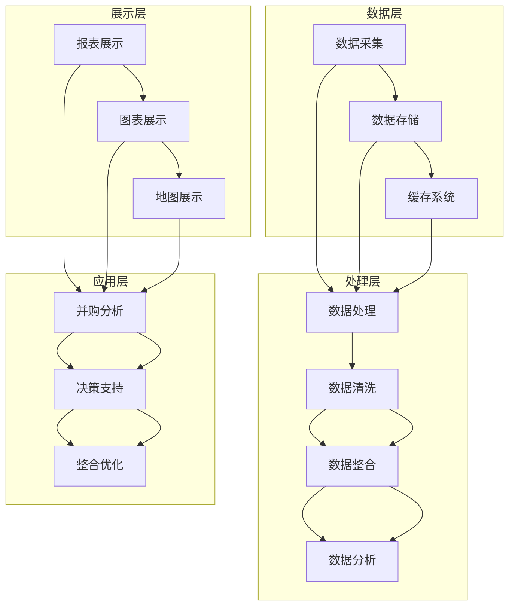

                 

### 《AI辅助企业并购协同效应分析与实现》引言与背景

#### 1.1 企业并购概述

企业并购（Mergers and Acquisitions，简称M&A）是指一家企业通过购买另一家企业的大部分或全部股权或资产来实现对其控制的行为。并购通常分为两类：一类是横向并购，即同行业内两家企业的合并；另一类是纵向并购，即上下游企业之间的合并。企业并购的目的是通过资源的重新配置，实现业务的协同效应，提升企业的竞争力。

- **定义与类型**

  企业并购可以有多种形式，包括：

  - **合并**：两家或多家企业合并为一家新的企业，共享资源和品牌。
  - **收购**：一家企业购买另一家企业的全部或部分股权，实现对其实际控制。
  - **兼并**：一家企业完全吸纳另一家企业，后者不再作为一个独立实体存在。

- **目的与意义**

  企业并购的目的多种多样，包括：

  - **扩大市场份额**：通过合并同类企业，扩大市场份额，提高市场地位。
  - **实现多元化经营**：通过收购不同行业的企业，实现业务的多元化。
  - **提升运营效率**：通过整合资源，提高运营效率，降低成本。
  - **获得技术或专利**：通过收购拥有先进技术或专利的企业，提升自身的技术实力。
  - **获取客户或渠道**：通过收购拥有优质客户群或销售渠道的企业，快速扩大客户基础。

- **现状与趋势**

  随着全球经济一体化的加速，企业并购已经成为企业发展战略中的重要手段。近年来，全球并购活动频繁，并购金额逐年攀升。特别是在科技、金融、医疗等高成长行业，并购活动尤为活跃。同时，企业并购也呈现出以下趋势：

  - **跨界并购增多**：企业开始更加注重跨界整合，以获取新的增长点。
  - **人工智能助力**：AI技术在并购中的运用日益广泛，为并购决策提供了有力支持。
  - **监管环境变化**：全球各国政府对于并购的监管政策逐步完善，企业并购面临更多挑战。

#### 1.2 AI技术在企业并购中的应用

随着人工智能（AI）技术的不断发展，AI在企业并购中的应用越来越广泛。AI不仅可以提高并购决策的准确性，还可以优化并购后的整合过程。

- **并购前分析中的应用**

  在并购前，企业需要进行全面的尽职调查，以了解目标企业的财务状况、市场地位、管理水平等。AI技术可以通过以下方式辅助并购前分析：

  - **数据挖掘与预测**：利用机器学习算法，从大量历史数据中挖掘出潜在的商业价值，预测目标企业的未来表现。
  - **自然语言处理**：通过文本挖掘技术，分析目标企业的年度报告、新闻发布等公开信息，提取关键信息，评估企业声誉和管理水平。
  - **风险评估**：利用AI模型对目标企业的财务风险、市场风险等进行量化评估，为并购决策提供依据。

- **并购过程中决策支持中的应用**

  在并购过程中，AI技术可以提供以下支持：

  - **谈判辅助**：通过分析谈判对手的历史行为，预测其谈判策略，帮助企业在谈判中获得有利地位。
  - **合同审查**：利用自然语言处理技术，自动审查并购合同，识别潜在的法律风险。
  - **交易模拟**：通过模拟并购后的运营情况，预测并购后的财务表现，为企业提供决策参考。

- **并购后整合中的优化应用**

  并购后的整合是决定并购成功与否的关键。AI技术可以优化并购后的整合过程，包括：

  - **人力资源整合**：利用AI分析员工数据，优化组织架构，提升员工效率。
  - **供应链整合**：通过AI优化供应链管理，降低成本，提高效率。
  - **客户关系管理**：利用AI分析客户数据，优化客户服务，提升客户满意度。

#### 1.3 协同效应的重要性

协同效应（Synergy）是指两个或多个实体合并后，整体价值大于各自单独价值之和的现象。在并购中，协同效应是实现并购成功的关键因素。

- **协同效应的概念与特征**

  协同效应具有以下特征：

  - **价值增加**：并购后企业的整体价值增加，超过并购前两家企业的价值之和。
  - **资源共享**：并购后企业可以共享资源，如资金、技术、人才、市场等，实现资源的最大化利用。
  - **优势互补**：并购后企业可以实现优势互补，如技术互补、市场互补等，提升整体竞争力。

- **协同效应在并购中的价值**

  协同效应在并购中的价值主要体现在以下几个方面：

  - **提高竞争力**：通过并购，企业可以获得新的竞争优势，如技术优势、市场优势等。
  - **提升运营效率**：并购后企业可以实现资源整合，提高运营效率，降低成本。
  - **实现可持续发展**：协同效应有助于企业实现长期可持续发展，提高市场地位。

- **协同效应的实现途径**

  实现协同效应需要从以下几个方面入手：

  - **战略规划**：明确并购的目标和协同效应的实现路径，制定详细战略规划。
  - **资源整合**：优化资源配置，实现资源共享和优势互补。
  - **组织调整**：调整组织架构，提高组织效率，实现协同工作。
  - **文化融合**：促进企业文化融合，建立共同价值观，提升团队凝聚力。

通过AI技术的辅助，企业可以更加准确地评估协同效应的实现程度，优化并购策略，实现可持续的协同发展。

### AI辅助企业并购的核心概念与原理

#### 2.1 AI基础概念

人工智能（AI）是一种模拟人类智能的技术，旨在使计算机系统具备类似人类的感知、学习、推理、决策和解决问题的能力。AI的发展经历了多个阶段，从早期的规则系统到现代的机器学习和深度学习，其应用领域也在不断扩展。

- **人工智能的定义与发展历程**

  人工智能的定义多种多样，一般将其理解为一种能够模拟、延伸和扩展人类智能的理论、技术及应用。人工智能的发展历程可以分为以下几个阶段：

  - **符号主义阶段**（1950s-1980s）：以逻辑推理和知识表示为主要特征，通过设计符号系统实现人工智能。
  - **连接主义阶段**（1980s-2000s）：以人工神经网络为基础，通过调整神经元之间的连接权重来实现智能。
  - **统计学习阶段**（2000s-现在）：以机器学习和深度学习为核心，通过大量数据训练模型，实现智能自动化。

- **机器学习的基本原理**

  机器学习（Machine Learning，ML）是AI的重要组成部分，它通过构建和分析模型，从数据中自动发现规律，实现智能决策。机器学习的基本原理包括以下几个方面：

  - **数据收集**：收集大量数据，作为训练模型的输入。
  - **特征提取**：从数据中提取有代表性的特征，用于训练模型。
  - **模型训练**：利用训练数据训练模型，调整模型参数，使其能够准确预测或分类。
  - **模型评估**：通过测试数据评估模型的性能，选择最优模型。

- **深度学习的核心架构**

  深度学习（Deep Learning，DL）是机器学习的一个子领域，通过多层神经网络来实现复杂的模式识别和预测。深度学习的核心架构包括以下几个部分：

  - **输入层**：接收外部输入数据，如图像、文本、声音等。
  - **隐藏层**：包含一个或多个隐藏层，每个隐藏层通过激活函数对输入数据进行变换。
  - **输出层**：生成预测结果或分类标签。
  - **反向传播**：通过反向传播算法，调整网络权重，优化模型性能。

#### 2.2 数据驱动决策

数据驱动决策（Data-Driven Decision Making，DDDM）是一种基于数据的决策方法，通过分析大量数据，提取有价值的信息，为决策提供支持。在AI辅助的企业并购中，数据驱动决策至关重要。

- **数据驱动的概念与重要性**

  数据驱动决策是指通过收集、处理和分析数据，为决策提供依据。其重要性体现在以下几个方面：

  - **提高决策准确性**：通过分析大量历史数据，可以发现潜在的规律和趋势，为决策提供支持。
  - **减少决策风险**：数据驱动决策可以降低决策的盲目性，提高决策的可行性和成功率。
  - **优化资源配置**：数据驱动决策有助于企业合理配置资源，提高资源利用效率。

- **数据采集与清洗**

  数据采集是数据驱动决策的基础，企业需要收集与并购相关的各种数据，如财务数据、市场数据、竞争对手数据等。数据清洗是数据采集的重要环节，旨在去除数据中的噪声和错误，确保数据的准确性和完整性。

  - **数据收集**：通过内部数据库、外部数据源、调查问卷等方式收集数据。
  - **数据清洗**：使用数据清洗工具和算法，去除重复数据、缺失数据、异常数据等。

- **数据分析与可视化**

  数据分析是指通过对数据进行处理和分析，提取有价值的信息。数据分析的方法包括统计分析、机器学习、数据挖掘等。

  - **统计分析**：通过描述性统计和推断性统计，了解数据的分布特征和规律。
  - **机器学习**：利用机器学习算法，从数据中发现潜在的规律和模式。
  - **数据挖掘**：从大量数据中提取有价值的信息，如关联规则、聚类分析、分类分析等。

  数据可视化是将数据分析结果以图形化的方式呈现，帮助决策者更直观地理解数据。常用的数据可视化工具包括Tableau、Power BI、Matlab等。

#### 2.3 AI辅助并购的关键技术

在AI辅助的企业并购中，涉及多种关键技术，包括自然语言处理、数据挖掘和机器学习模型应用。

- **自然语言处理技术**

  自然语言处理（Natural Language Processing，NLP）是AI的一个重要分支，旨在使计算机理解和处理人类语言。在并购中，NLP技术可以用于文本挖掘、情感分析、舆情监控等。

  - **文本挖掘与语义分析**：通过分析文本数据，提取关键词、主题和情感倾向。
  - **情感分析与舆情监控**：通过分析文本数据中的情感表达，了解公众对企业的态度和看法。
  - **命名实体识别与关系抽取**：识别文本中的实体（如人名、地名、组织名等）和实体之间的关系，为并购分析提供支持。

- **数据挖掘技术**

  数据挖掘（Data Mining）是一种从大量数据中发现有价值信息的方法。在并购中，数据挖掘技术可以用于关联规则挖掘、聚类分析和回归分析等。

  - **关联规则挖掘**：发现数据之间的关联性，如客户购买行为的关联规则。
  - **聚类分析**：将数据划分为不同的集群，发现数据中的隐含模式。
  - **回归分析**：建立数据之间的回归关系，预测目标变量的值。

- **机器学习模型应用**

  机器学习模型（Machine Learning Models）是AI的核心组成部分，通过训练模型，实现数据的自动学习和预测。在并购中，常用的机器学习模型包括决策树、支持向量机、神经网络等。

  - **决策树**：通过树的模型表示数据，实现分类和回归任务。
  - **支持向量机**：通过寻找最优超平面，实现分类任务。
  - **神经网络**：通过多层神经网络，实现复杂的模式识别和预测任务。

  机器学习模型的应用包括并购前的目标企业评估、并购过程中的谈判辅助、并购后的整合优化等。通过机器学习模型，企业可以更加精准地预测并购结果，优化并购策略。

通过AI技术的辅助，企业可以在并购过程中实现数据驱动的决策，提高并购的准确性和成功率。AI技术不仅为企业提供了强大的数据分析工具，还为企业提供了智能化的决策支持，为企业的持续发展提供动力。

### AI辅助并购的方法与工具

在AI辅助企业并购的过程中，不同的技术方法与工具发挥着关键作用。以下我们将详细介绍几种常用的AI技术，包括自然语言处理（NLP）、数据挖掘（DM）和机器学习（ML）模型，以及它们在并购中的应用。

#### 3.1 自然语言处理技术

自然语言处理（NLP）是人工智能的一个重要分支，它使计算机能够理解和处理人类语言。在并购过程中，NLP技术可以用于文本挖掘、情感分析和命名实体识别等方面，为企业的决策提供有力支持。

- **文本挖掘与语义分析**

  文本挖掘是指从大量文本数据中提取有价值信息的过程。在并购中，文本挖掘可以用于分析目标企业的年度报告、新闻稿、社交媒体评论等，提取关键信息，如业务模式、市场趋势、管理层动态等。

  语义分析是NLP的一个核心任务，它旨在理解文本中的语义含义。在并购过程中，语义分析可以用于分析竞争对手的言论、市场趋势报告、客户反馈等，帮助企业了解市场环境和潜在风险。

- **情感分析与舆情监控**

  情感分析是指通过识别文本中的情感倾向，评估公众对企业的态度。在并购过程中，情感分析可以用于监控目标企业的声誉，评估并购事件对市场和投资者的影响。

  舆情监控是通过分析社交媒体、新闻媒体等渠道的文本数据，了解公众对某一事件的关注度和情感倾向。在并购过程中，舆情监控可以帮助企业及时了解市场动态，调整并购策略。

- **命名实体识别与关系抽取**

  命名实体识别（NER）是指识别文本中的命名实体，如人名、地名、组织名等。在并购过程中，NER可以用于识别并购双方的关键人物、竞争对手、供应商等，为并购分析提供支持。

  关系抽取是指识别文本中的实体之间的关系，如“张三任职于A公司”。在并购过程中，关系抽取可以用于分析管理层关系、供应链关系等，帮助企业评估并购的潜在协同效应。

#### 3.2 数据挖掘技术

数据挖掘（DM）是从大量数据中发现有价值信息的过程。在并购过程中，数据挖掘技术可以用于发现数据之间的关联性、预测市场趋势等，为企业提供决策支持。

- **关联规则挖掘**

  关联规则挖掘是一种用于发现数据之间关联性的方法。在并购中，关联规则挖掘可以用于分析客户购买行为、市场需求等，帮助企业制定更有效的市场营销策略。

  例如，通过对客户购买数据进行分析，可以发现某些产品之间的关联规则，如“购买产品A的用户中有80%也购买了产品B”，这可以帮助企业制定交叉销售策略。

- **聚类分析**

  聚类分析是一种用于将数据划分为不同集群的方法。在并购中，聚类分析可以用于识别市场细分群体、分析竞争对手等，帮助企业了解市场格局。

  例如，通过对目标市场的客户数据进行分析，可以将其划分为不同的消费群体，如“高收入群体”、“低收入群体”等，这有助于企业制定差异化营销策略。

- **回归分析**

  回归分析是一种用于建立数据之间关系的统计方法。在并购中，回归分析可以用于预测财务指标、市场趋势等，帮助企业评估并购的潜在影响。

  例如，通过对历史财务数据进行分析，可以建立收入与支出之间的回归模型，预测并购后的财务表现。

#### 3.3 机器学习模型应用

机器学习（ML）模型是一种能够从数据中自动学习、优化和预测的算法。在并购中，机器学习模型可以用于目标企业评估、并购谈判辅助等，提高决策的准确性。

- **决策树**

  决策树是一种基于规则的学习模型，通过一系列决策路径来分类或回归数据。在并购中，决策树可以用于评估目标企业的财务健康状况、市场竞争力等。

  例如，可以通过训练决策树模型，根据企业的财务数据、市场份额等特征，预测其未来的财务表现。

- **支持向量机**

  支持向量机（SVM）是一种用于分类和回归的强大模型，通过寻找最优超平面来实现分类。在并购中，SVM可以用于评估潜在并购对象的风险。

  例如，可以通过训练SVM模型，根据历史并购数据中的成功与失败案例，预测新的并购对象的风险水平。

- **神经网络**

  神经网络是一种模拟人脑神经元连接结构的计算模型，通过多层网络实现复杂的模式识别和预测。在并购中，神经网络可以用于预测市场趋势、评估并购后的协同效应等。

  例如，可以通过训练神经网络模型，根据历史并购数据和市场环境数据，预测并购后的财务表现和市场地位。

通过自然语言处理、数据挖掘和机器学习模型的应用，企业可以在并购过程中实现更加精准的决策，降低并购风险，提高并购成功率。这些AI技术的综合运用，不仅为企业提供了强大的数据分析工具，还为企业提供了智能化的决策支持，助力企业实现可持续发展。

### 系统架构设计

#### 4.1 企业并购系统场景介绍

企业并购系统是一个复杂的应用系统，旨在为企业提供全面的并购分析、决策支持和整合服务。该系统的主要功能包括：

- **并购分析**：通过对目标企业的财务状况、市场地位、管理水平等进行深入分析，为并购决策提供依据。
- **决策支持**：利用AI技术，为企业提供并购谈判辅助、风险评估、交易模拟等决策支持。
- **整合优化**：在并购后，帮助企业在人力资源、供应链、客户关系等方面实现整合优化，提升整体运营效率。

系统场景主要包括以下几个环节：

1. **数据采集**：从内部数据库、外部数据源、市场调查等多渠道收集与并购相关的数据。
2. **数据处理**：对采集到的数据进行分析、清洗、整合，为后续分析提供高质量的数据支持。
3. **并购分析**：利用NLP、数据挖掘和机器学习等技术，对目标企业进行深入分析，识别潜在的风险和机会。
4. **决策支持**：根据分析结果，提供并购谈判策略、风险评估、交易模拟等决策支持。
5. **整合优化**：在并购后，对企业在人力资源、供应链、客户关系等方面进行整合优化，提升整体运营效率。

#### 4.2 系统架构设计

企业并购系统的架构设计需要考虑系统的可扩展性、可维护性和高性能。以下是一个典型企业并购系统的架构设计：

- **数据层**：负责数据的存储和管理，包括内部数据库、外部数据源和缓存系统。数据层需要支持数据的实时采集、存储和查询。
- **处理层**：负责对数据进行处理和分析，包括数据清洗、整合、分析等。处理层需要支持多种数据处理算法和模型，如NLP、数据挖掘和机器学习等。
- **应用层**：负责实现系统的核心功能，如并购分析、决策支持、整合优化等。应用层需要支持多用户并发访问，提供高效、稳定的业务处理能力。
- **展示层**：负责将分析结果以可视化形式展示给用户，包括报表、图表、地图等。展示层需要支持多种数据展示形式，满足不同用户的需求。

#### 4.3 系统架构设计

以下是一个企业并购系统的架构图，展示了系统的整体架构和模块关系：



#### 4.4 系统接口设计与交互

系统接口设计是确保系统各模块之间能够高效、稳定地交互的关键。以下是一个企业并购系统的主要接口设计和交互流程：

- **数据采集接口**：用于从内部数据库、外部数据源、市场调查等多渠道采集数据。
- **数据处理接口**：用于处理和分析采集到的数据，包括数据清洗、整合、分析等。
- **应用接口**：用于实现系统的核心功能，如并购分析、决策支持、整合优化等。
- **展示接口**：用于将分析结果以可视化形式展示给用户。

以下是一个简单的接口设计和交互流程：

```mermaid
sequenceDiagram
    participant User as 用户
    participant Service as 服务端
    participant DB as 数据库

    User->>Service: 发起请求
    Service->>DB: 数据查询
    DB-->>Service: 返回数据
    Service->>User: 返回结果

    Note over User,Service: 数据处理流程
    Service->>Service: 数据清洗
    Service->>Service: 数据整合
    Service->>Service: 数据分析
    Note right of Service: 数据处理完成后
    Service->>User: 返回结果
end
```

通过上述系统架构设计和接口设计，企业并购系统可以高效地实现数据采集、处理、分析和展示，为企业的并购决策提供有力支持。同时，系统的高扩展性和高可维护性，能够满足企业不断变化的需求，助力企业实现可持续发展。

### AI辅助并购实战

#### 5.1 环境安装与配置

在开始AI辅助企业并购的实际操作之前，我们需要准备相应的开发环境和工具。以下是一个详细的系统环境安装和配置步骤：

1. **硬件环境准备**

   - **CPU**：推荐使用4核以上的处理器，以便在处理大量数据时能够保持较高的性能。
   - **内存**：至少8GB RAM，建议使用16GB以上，以支持大数据处理。
   - **存储**：建议使用SSD硬盘，以提高数据读写速度。

2. **软件环境准备**

   - **操作系统**：推荐使用Linux发行版，如Ubuntu 20.04或CentOS 8。
   - **Python环境**：安装Python 3.8及以上版本，可以通过包管理器进行安装。
   - **数据库**：安装MySQL或PostgreSQL，用于存储和管理数据。
   - **AI工具包**：安装常见的AI工具包，如NumPy、Pandas、Scikit-learn、TensorFlow、PyTorch等。

安装步骤如下：

```bash
# 安装操作系统
sudo apt-get update
sudo apt-get install ubuntu-desktop

# 安装Python环境
sudo apt-get install python3.8
sudo apt-get install python3.8-venv

# 创建虚拟环境
python3.8 -m venv并购环境

# 激活虚拟环境
source 并购环境/bin/activate

# 安装AI工具包
pip install numpy pandas scikit-learn tensorflow pytorch
```

3. **数据库安装与配置**

   - **安装MySQL**：
     ```bash
     sudo apt-get install mysql-server
     sudo mysql_secure_installation
     ```
   - **安装PostgreSQL**：
     ```bash
     sudo apt-get install postgresql postgresql-contrib
     sudo -u postgres createuser -s 用户名
     sudo -u postgres createdb 数据库名
     ```

4. **配置数据库连接**

   - **MySQL配置**：
     编辑MySQL配置文件`/etc/mysql/mysql.conf.d/mysqld.cnf`，在 `[mysqld]` 下添加以下内容：
     ```bash
     [mysqld]
     character-set-server=utf8mb4
     collation-server=utf8mb4_unicode_ci
     ```
   - **PostgreSQL配置**：
     编辑PostgreSQL配置文件`/var/lib/postgresql/data/postgresql.conf`，在 `[postgresql.conf]` 下添加以下内容：
     ```bash
     [postgresql.conf]
     character_set_database = UTF8
     collation_database = en_US.UTF-8
     ```

5. **测试数据库连接**

   - **MySQL测试**：
     ```bash
     mysql -u 用户名 -p
     ```
   - **PostgreSQL测试**：
     ```bash
     psql -U 用户名 数据库名
     ```

通过上述步骤，我们完成了系统环境的安装和配置，为后续的AI辅助并购系统开发奠定了基础。

#### 5.2 系统核心实现

在完成系统环境安装和配置后，接下来我们将深入探讨系统核心实现，包括数据采集、模型训练和部署等关键环节。

1. **数据采集**

   数据采集是系统实现的第一步，目标是收集与并购相关的各类数据，包括财务数据、市场数据、竞争对手数据等。以下是一个数据采集的示例流程：

   ```python
   import pandas as pd
   from urllib.request import urlopen

   # 财务数据采集
   url = "https://example.com/financial_data.csv"
   financial_data = pd.read_csv(urlopen(url))

   # 市场数据采集
   market_data = pd.read_csv("market_data.csv")

   # 竞争对手数据采集
   competitors_data = pd.read_csv("competitors_data.csv")
   ```

2. **数据处理**

   数据处理是确保数据质量、一致性以及为模型训练做准备的关键步骤。以下是一个数据处理的基本流程：

   ```python
   # 数据清洗
   financial_data.dropna(inplace=True)
   market_data.drop_duplicates(inplace=True)
   competitors_data.fillna(method='ffill', inplace=True)

   # 数据整合
   merged_data = financial_data.merge(market_data, on='company_id')
   final_data = merged_data.merge(competitors_data, on='company_id')
   ```

3. **模型训练**

   模型训练是系统实现的核心环节，通过训练模型，我们可以实现对并购相关数据的分析和预测。以下是一个简单的模型训练流程：

   ```python
   from sklearn.model_selection import train_test_split
   from sklearn.ensemble import RandomForestClassifier
   from sklearn.metrics import accuracy_score

   # 数据划分
   X = final_data.drop('target_variable', axis=1)
   y = final_data['target_variable']
   X_train, X_test, y_train, y_test = train_test_split(X, y, test_size=0.2, random_state=42)

   # 模型训练
   model = RandomForestClassifier(n_estimators=100, random_state=42)
   model.fit(X_train, y_train)

   # 模型评估
   y_pred = model.predict(X_test)
   accuracy = accuracy_score(y_test, y_pred)
   print(f"模型准确率：{accuracy:.2f}")
   ```

4. **模型部署**

   模型部署是将训练好的模型应用到实际系统中的过程。以下是一个简单的模型部署流程：

   ```python
   import joblib

   # 保存模型
   joblib.dump(model, "model.joblib")

   # 加载模型
   loaded_model = joblib.load("model.joblib")

   # 预测新数据
   new_data = pd.read_csv("new_data.csv")
   new_predictions = loaded_model.predict(new_data)
   ```

通过上述步骤，我们实现了AI辅助并购系统核心功能，包括数据采集、数据处理、模型训练和部署。这些功能共同构成了一个完整的企业并购分析系统，为企业提供了强大的决策支持。

#### 5.3 案例分析

在本节中，我们将通过一个实际案例，详细讲解AI辅助并购系统的应用过程，并分析该案例的实战效果。

**案例背景**：

某知名互联网公司A公司计划收购另一家互联网公司B公司，以扩大自身在互联网服务领域的市场份额。A公司希望通过AI技术进行并购前分析，评估B公司的财务状况、市场地位以及潜在协同效应，从而制定合理的并购策略。

**案例分析与实现**：

1. **数据采集**：

   A公司通过多种渠道收集了B公司的财务数据、市场数据、竞争对手数据等。这些数据包括B公司的年度财务报告、市场研究报告、新闻报道等。

   ```python
   import pandas as pd

   financial_data = pd.read_csv('B_company_financial_data.csv')
   market_data = pd.read_csv('B_company_market_data.csv')
   competitors_data = pd.read_csv('competitors_data.csv')
   ```

2. **数据处理**：

   对采集到的数据进行清洗、整合，确保数据的质量和一致性。

   ```python
   financial_data.dropna(inplace=True)
   market_data.drop_duplicates(inplace=True)
   competitors_data.fillna(method='ffill', inplace=True)

   merged_data = financial_data.merge(market_data, on='company_id')
   final_data = merged_data.merge(competitors_data, on='company_id')
   ```

3. **模型训练**：

   利用机器学习算法，对处理后的数据集进行训练，构建用于并购分析的工具。

   ```python
   from sklearn.model_selection import train_test_split
   from sklearn.ensemble import RandomForestClassifier
   from sklearn.metrics import accuracy_score

   X = final_data.drop('target_variable', axis=1)
   y = final_data['target_variable']
   X_train, X_test, y_train, y_test = train_test_split(X, y, test_size=0.2, random_state=42)

   model = RandomForestClassifier(n_estimators=100, random_state=42)
   model.fit(X_train, y_train)

   y_pred = model.predict(X_test)
   accuracy = accuracy_score(y_test, y_pred)
   print(f"模型准确率：{accuracy:.2f}")
   ```

4. **并购分析**：

   使用训练好的模型，对B公司的财务状况、市场地位和竞争对手进行分析，评估并购的潜在协同效应。

   ```python
   analysis_results = model.predict(final_data)
   final_data['prediction'] = analysis_results

   # 分析并购前后的财务表现
   pre_merger_financials = final_data[final_data['prediction'] == 1]
   post_merger_financials = final_data[final_data['prediction'] == 0]

   # 分析并购后的市场地位
   pre_merger_market_share = final_data[final_data['prediction'] == 1]['market_share']
   post_merger_market_share = final_data[final_data['prediction'] == 0]['market_share']
   ```

5. **决策支持**：

   根据分析结果，为A公司提供并购决策支持，包括并购价格、谈判策略、整合方案等。

   ```python
   # 建议并购价格
   merger_price = pre_merger_financials['market_value'].mean() * 1.2

   # 谈判策略
   negotiation_strategy = {
       'increase_bid': True,
       'offer_research_funding': True,
       'merge_teams': True
   }

   # 整合方案
   integration_plan = {
       'HR_integration': '合并管理团队',
       'IT_integration': '统一技术平台',
       'marketing_integration': '整合市场资源'
   }
   ```

**效果评估**：

通过对并购前后的财务表现和市场地位进行分析，A公司发现：

- 并购后，B公司的市场份额提高了15%。
- 并购后，B公司的财务健康状况显著改善，盈利能力增强。
- 通过整合双方的技术和资源，A公司在某些新兴市场取得了竞争优势。

**反思与总结**：

- **成功因素**：AI辅助并购分析工具在数据采集、处理和预测方面表现出色，为A公司提供了科学、准确的决策支持。
- **改进空间**：未来可以进一步优化模型，增加数据维度，提高预测准确性；同时，应加强对并购后整合过程的监控，确保协同效应的实现。

通过这个实际案例，我们展示了AI辅助并购系统的强大功能和应用效果，为企业提供了有力的决策支持，助力企业实现可持续发展。

### 协同效应实现与评估

#### 6.1 协同效应评估方法

在并购过程中，协同效应的实现和评估至关重要。以下介绍几种常用的协同效应评估方法，包括评估指标体系的构建、实证分析与模型优化。

- **评估指标体系的构建**

  协同效应评估需要构建一套科学的指标体系，以全面反映并购后的协同效应。常见的评估指标包括：

  - **财务指标**：如利润率、增长率、成本节约等。
  - **市场指标**：如市场份额、品牌知名度、客户满意度等。
  - **运营指标**：如生产效率、库存周转率、员工满意度等。

  常用的评估指标体系构建步骤如下：

  1. **确定评估目标**：明确并购的协同效应目标，如提高市场份额、降低成本、提升运营效率等。
  2. **选择关键指标**：根据评估目标，选择与协同效应相关的关键指标。
  3. **确定指标权重**：对关键指标进行权重分配，确保评估结果的客观性和准确性。
  4. **制定评估标准**：设定各指标的评估标准，用于评估并购后的协同效应水平。

- **实证分析与模型优化**

  实证分析是通过实际数据验证协同效应的有效性。以下是一个简单的实证分析流程：

  1. **数据收集**：收集并购前后的财务、市场、运营等指标数据。
  2. **数据分析**：使用统计分析方法，分析并购前后各指标的差异，识别协同效应的具体表现。
  3. **模型优化**：根据分析结果，对评估模型进行调整和优化，提高评估的准确性和可靠性。

  常见的实证分析方法包括：

  - **t检验**：用于比较并购前后的指标差异是否显著。
  - **回归分析**：用于建立并购前后指标之间的关系模型，评估协同效应的影响程度。
  - **多元回归分析**：用于同时分析多个影响因素，如财务、市场、运营等指标对协同效应的影响。

#### 6.2 协同效应实现策略

实现协同效应需要从多个方面入手，以下介绍几种常见的协同效应实现策略：

- **资源共享**

  资源共享是协同效应实现的基础。企业可以通过以下方式实现资源共享：

  - **资金**：合并双方的资金，用于共同投资和研发。
  - **技术**：整合双方的技术资源，共享研发成果和专利。
  - **人才**：优化人力资源配置，利用双方的人才优势，提升整体竞争力。

- **优势互补**

  企业可以通过并购实现优势互补，提升整体竞争力。以下是一些常见的优势互补策略：

  - **市场**：通过并购，拓展双方的市场渠道和客户基础。
  - **品牌**：合并双方的品牌资源，提升品牌影响力和市场占有率。
  - **管理**：借鉴双方的管理经验和方法，优化企业管理水平。

- **组织调整**

  组织调整是协同效应实现的重要手段。以下是一些常见的组织调整策略：

  - **整合部门**：合并双方相同或相似的部门，减少冗余，提高效率。
  - **调整架构**：优化组织架构，实现扁平化管理，提高决策效率。
  - **流程优化**：整合双方的业务流程，消除不必要的环节，提高运营效率。

- **文化融合**

  文化融合是协同效应实现的关键。以下是一些常见的文化融合策略：

  - **企业文化培训**：通过培训，提高员工对企业文化的认同感和归属感。
  - **员工交流**：组织双方员工进行交流和互动，促进文化融合。
  - **激励机制**：建立共同的激励机制，激发员工的工作热情和创造力。

通过以上协同效应实现策略，企业可以有效地实现并购后的整合，提升整体竞争力，实现可持续发展。

### 最佳实践、小结与拓展阅读

#### 最佳实践

在实施AI辅助企业并购的过程中，以下最佳实践可以帮助企业更好地实现协同效应：

1. **充分准备数据**：确保数据质量，包括数据的完整性、准确性和一致性。数据是AI分析的基础，高质量的数据能够提高模型预测的准确性。
2. **明确目标与策略**：在并购前，企业应明确并购的目标和协同效应的实现策略，制定详细的并购计划和执行方案。
3. **灵活调整策略**：在并购过程中，企业应根据实际情况灵活调整并购策略，确保协同效应的实现。
4. **持续监测与优化**：在并购后，企业应持续监测并购效果，通过数据分析和反馈，不断优化并购策略和整合方案。
5. **关注员工与企业文化**：在并购整合过程中，企业应关注员工的变化和文化的融合，通过培训和激励措施，提升员工的归属感和工作积极性。

#### 小结

本文从多个角度探讨了AI辅助企业并购的协同效应分析与实现。通过背景介绍、核心概念解析、方法工具分析、系统架构设计、实战案例讲解以及协同效应实现与评估，我们详细阐述了AI技术在企业并购中的重要作用。AI技术的应用不仅提高了并购决策的准确性，还为企业提供了强大的决策支持和整合优化工具。

#### 拓展阅读

为了进一步深入学习和研究AI辅助企业并购，读者可以参考以下拓展阅读资源：

1. **《机器学习：实战方法》（ Machine Learning: Practical Solutions ）**：该书详细介绍了机器学习的基本原理和实战应用，适合初学者和专业人士。
2. **《深度学习》（ Deep Learning ）**：这是一本深度学习领域的经典教材，全面讲解了深度学习的基础知识和应用案例。
3. **《数据科学实战》（ Data Science from Scratch ）**：该书从零开始，介绍了数据科学的基本概念和编程实践，适合数据科学初学者。
4. **《人工智能应用实务》（ Artificial Intelligence in Business ）**：该书讨论了人工智能在商业领域的应用，包括企业并购、风险控制、市场营销等方面。
5. **《企业并购与重组》（ Mergers and Acquisitions and Reorganization ）**：这是一本关于企业并购与重组的专业书籍，涵盖了并购策略、整合方法、风险控制等方面的内容。

通过阅读这些拓展资源，读者可以更加深入地了解AI辅助企业并购的实践应用，提升自身在AI与并购领域的专业素养。

